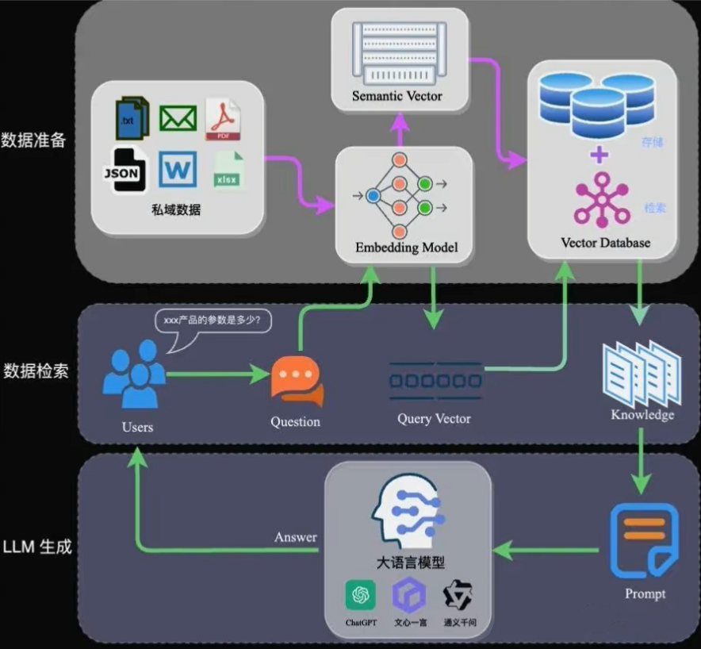

## LangChain

### langchain blog

#### [github Langchain-Chatchat](https://github.com/chatchat-space/Langchain-Chatchat)

#### [LangChain实战（国内大模型）| Chains的四个核心模块实测——LLMChain、SimpleSequentialChain、SequentialChain和LLMRouteChain](https://blog.csdn.net/sinat_29950703/article/details/139151435)

### [ChatGLM+Langchain构建本地知识库，只需6G显存，支持实时上传文档](https://www.bilibili.com/video/BV1t8411y7fp/)
01_ChatGLM环境部署 13:05
02_lagnchain加载ChatGLM 09:40
03_文档向量化 16:28
04_本地知识库问答 11:35
05_上传文档问答 13:03
06_解决回答中有英文的问题 14:00
【补充】用llama2模型替换ChatGLM2 00:29
【补充】用ChatGLM3替换ChatGLM2 00:39

### [[LangChain]最容易最全的中文langchain教程（持续更新ing）](https://www.bilibili.com/video/BV1Nh4y1c77H/)
#### 目录
01langchain介绍 07:01
02langchain本地知识库案例 20:52
03langchain快速入门 18:42
04langchain提示词模板 13:41
05langchain带例子的提示词模板 15:45
06langchain提示词格式+类型+部分提示词+组成 10:27
07langchain序列化储存+流水线+验证 10:37
08langchain大语言模型前言 04:20
09langchain大语言模型异步调用接口 04:51
10langchain自定义大语言模型 03:40
11langchain测试版的llm 05:19
12langchain大语言模型的缓存 04:12
13langchain序列化配置.mp 02:03
14langchain大语言模型流式响应 01:44
15langchain令牌统计 02:26
16langchain输出解释器.mp 15:00
17langchain文本加载器 07:53
18langchain文档转换器 12:42
19langchain向量数据库 06:19
20agent讲解(第二阶段开始) 12:54
21react_agent对话dome 08:07
23Agent-openai assistants调用 10:03
24agent提示词学习 10:32
25定制化智能体 07:07

#### 评论
兴宇的bili
置顶分享一个开源本地版的gpts（ChatGPT-Plugins）[吃瓜]，虽然还不是很完善， 帮忙star和fork一下
 https://github.com/XingYu-Zhong/Open-ChatGPT-Plugins
2023-11-25 12:53 👍6

### [LangServe - LangChain应用极速部署最佳方案](https://www.bilibili.com/video/BV1kN411b7yw/)
LangChain官方最近发布了一款新的工具 - LangServe。它帮助开发人员将基于LangChain的Runnable和Chain部署为REST API。

扎丝比利
这不就是fastapi吗。。
2023-10-24 21:37 👍1

### [【开发必看】AI应用开发LangChain系列课程](https://www.bilibili.com/video/BV1Uh4y1X76G/?p=2)
#### 评论
2023-06-16 16:16:37
往生堂满命胡桃
我想问一下up是充值了api吗？收费标准大概是个什么样的？个人做点demo的话可以有免费的api用吗？非常感谢[给心心]
2023-10-13 13:37 👍7

老陈打码
开发可以直接用国内的ChatGLM的api和讯飞的。都蛮好用的
2023-10-13 19:11 👍1

pg万般
用阿里云的api，讯飞的模型感觉一般
2024-02-27 16:32
#### 目录
P1 01-LangChain开发AI应用必备框架 04:58
P2 02-开发第一个langchain应用 10:58
P3 03-langchain封装提示词 04:48
P4 04-示例选择器生成精准提示词 06:57
P5 05-使用输出解析器格式化输出 06:46
P6 06-任务链完成思考和工作流程 07:33
P7 07-AI代理人的决策和行动 05:46
P8 08-总结长文本摘要 05:24
P9 09-使用文档作为上下文的问答 06:58
P10 10-AI自动评估文档答案 04:19
P11 11-LangChain查询数据库获取信息 03:08
P12 12-自动解析代码库-理解并根据需要生成代码 04:06
P13 13-自动读取API文档根据需求自动调用文档获取信息 03:07
P14 Langchain应用ChatGLM4快速开发检索文档客服 25:03
P15 从0到1构建本地开源大语言模型智能体原理与实现 00:45

### [【Chatglm+LangChain】搭建本地知识库](https://www.bilibili.com/video/BV1Ew4m1d7Mo/?p=2)
2024-03-09 14:42:19

chatglm官方教程 1:10:22
插播一条 00:05
ChatGLM2-6B模型部署与微调教程 1:03:29
2.1.引入 03:10
3.2.模型、提示词和参数 18:24
4.3.记忆 17:05
5.4.链 13:08
6.5.问题与答案 15:07
7.6.评估大语言模型应用 15:07
8.7.代理-LLM应用开发实践 07:46
9.8.总结LLM应用开发实践 01:45
## GPTs自动化
### [面向企业的GPT小应用构想-知识库+大模型+AI-Agent](https://www.bilibili.com/video/BV1aj421Q7HU/)

躺平滴神
大部分企业都不愿意接入chatgpt，只愿意本地部署大模型，准确率太低效果很差，要么发散性强但是有幻觉，要么严格控制发散但是找不到对应文本召回，都是知识库场景绝对不能接受的问题
2024-02-23 13:51 👍2

天平的甜品
Chat GPT是闭源，国内怎么落地?这不是场景的问题，这是数据安全的问。
2024-02-24 12:37 👍1

就是一白嫖怪
未来会有专门的团队帮企业定制自己的大模型，就像现在的软件公司帮助企业定制软件系统一样。
2024-02-25 01:05

#### Dify和字节的coze是否能代替langchain
困死人
请问Dify和字节的coze这些工具如果之后完善了，可以基本代替用langchain自己搭建的方案么
2024-03-03 23:30

#### 建议up试下fastgpt
正义使者惩奸除恶
@人月聊IT 建议up试下fastgpt
2024-02-25 23:36 👍1

#### 国产化大模型一体机报价七八百万
千儿丿
前两天刚跟国内大牌大模型厂商的人聊过，一台国产化大模型一体机报价七八百万，有这钱够请一群人来搭知识库了
2024-03-02 00:51 👍2

#### [大模型落地企业应用实战项目经验分享](https://www.bilibili.com/video/BV11p4y1R7Dy/)

langchain中的检索增强生成（RAG）
[视频时间戳：](https://www.bilibili.com/video/BV11p4y1R7Dy?t=1220.9)

25:14 
大概就几百兆吧。当时的话呢我们数据量小的时候，我们做这个检索的时候能够检索到我们相似相似的东西。当我们的数据量比较大，比如说我们构造了上千个PDF格式的文档的时候，我们就会发现呢检索出来的东西就开始胡说八道了，知道吗，就出现幻觉了。也就是说我问的是这个文档的问题，他又把另外一个文档给我串起来了，数据混乱了。
这个时候其实并不是因为大模型不好，而是因为在嵌入的时候向量化的维度没有转换好，那这是个坑啊，知道同学们。如果说你们在公司的话去做这个这货的一个知识库的情况下，因为咱们知道啊目前最热的其实就是这种知识库的外挂了，但如果你在用的情况下你出现这种情况了哈，你要去选择好你的embedding。如果你找不对找不好对吧，那么你后面的话其实很多事情都没法就没法开展的哈。这也是我们最近的一个经验，也是我们根据这种这个大量的数据哈就是所得到的这样一个经验，所以这个的话很重要很重要。
26:17

### [【零基础GPTs Action进阶保姆级教学】利用zapier与集简云集成国内外上千应用，全网最详细教程！打造属于你的AI agengt！](https://www.bilibili.com/video/BV1y64y1p7BS/)
虚拟卡充值：https://gpt.fomepay.com/#/pages/login/index?d=PU56LX
AI Action For GPTs网址：https://nla.zapier.com/docs/platform/gpt
集简云官方网址：https://www.jijyun.cn/
集简云官方文档帮助：https://www.jijyun.cn/help/detail/1515

悟空AI研究所
国内办的一般信用卡是开不了gpt4的，要visa卡那些才可以，去办那些卡会比较麻烦，开虚拟卡一样效果，简单高效
2023-12-19 10:01
paleituo
国内办的不管你是master 还是visa都没用的
2023-12-19 19:45
悟空AI研究所
回复 @paleituo :对的，国内办的都不行，所以推荐大家开通虚拟卡自己充，而且后续能一直续费自己号，用不着去某宝上被割韭菜不香吗[吃瓜]
2023-12-19 22:23

## LLM推理

[“全网最全”LLM推理框架集结营 | 看似微不足道，却决定着AIGC项目的成本、效率与性能!](https://mp.weixin.qq.com/s?__biz=Mzg5MTkxNjQwMw==&mid=2247490859&idx=1&sn=be4534b0fc5a82fe78992eba5b4b24f8&chksm=cfc74437f8b0cd2175df9ab17634388f43e52844e659b763be8f9c59cb95808f3f0610998506&mpshare=1&scene=23&srcid=0327m4TCgdMCeEEF80eR5a9A&sharer_shareinfo=70d9b539616a19e32f192e23a1c36010&sharer_shareinfo_first=95eefebd25a62a94432441ae1ebf9d0f#rd)
_2024-03-27 07:30_

## Agent

[工程经验 - 大模型 Agent 入门指南](https://zhuanlan.zhihu.com/p/679393499)

## 部署

### [Qwen-VL看图说话 2080Ti 11G显存 xinference部署多模态大模型](https://www.bilibili.com/video/BV1UT4m1S7gx/)
小饭护法要转码
2024-02-03 00:39:20

本次用到的地址有：
https://github.com/xorbitsai/inference
https://inference.readthedocs.io/en/latest/getting_started/using_docker_image.html#dockerfile-for-custom-build
需要领域安装包的小伙伴
请在评论区或后台私信up~

小饭护法要转码
视频标题有歧义哈，我用的其实是22g的2080ti，只不过int4量化的qwen-vl占用了不到11g～
2024-02-04 14:49 👍1

### 国产卡的部署工具

lmdeploy fastllm vllm

