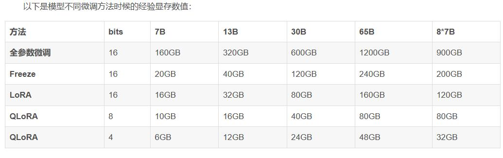

## 行业

### [【人工智能】直觉的力量 | 杰弗里辛顿最新对话 | Sana AI峰会 | 回忆AI生涯 | Ilya的能力和直觉 | 缩放法则 | 多模态 | 语言与认知 | 神经网络 | AI情感 | 反向传播](https://www.youtube.com/watch?v=mG31I9mfVLU)

11,831次观看  2024年5月22日  大飞说科技

#### **1 多模态输入与认知能力**

辛顿认为多模态输入会让模型有显著的改进，尤其会大大提高模型对空间等事物的推理能力。另外，多模态可以让模型获得更多的训练数据。有一个哲学观点是，你可以通过语言学习到一个非常好的模型，但从多模态系统中学习要容易得多。在这个基础上，辛顿列举了三种不同的语言观以及它们与认知的关系。

#### **2 语言观与认知关系**

辛顿列举了三种语言观：传统符号观、向量观以及符号与嵌入向量结合的观念。他认为，当前模型的工作原理是通过符号和向量的相互作用来实现理解和预测。

首先是传统的符号观，也就是认知是基于明确、抽象的逻辑符号以及符号操作，暗示语言与逻辑思维紧密相连的，这个观点倾向于认为人类大脑和语言是协同进化的，各自适应对方的存在与发展。与之相反的观点是，大脑内部全都是向量，符号进入大脑会转换成大型向量，所有内部处理都是通过大型向量完成的。如果你想生成输出，就要再次生成符号。大约在2014年，机器翻译领域就有这么一个阶段，通过循环神经网络在隐藏状态中不断积累信息，所以在句尾时就会得到一个大的隐藏向量，这个向量捕捉了这个句子的意义，然后可以用来在另一种语言中生成句子。这被称为思想向量，是对语言的第二种看法。

第三种观点介于前两者之间，也是现在辛顿所相信的，那就是语言和思维过程中确实涉及符号，但是这些符号通过多层次的嵌入表示（embedding representation）被丰富化了，但是这些嵌入仍然与符号相关联，意味着每个符号都有一个大的向量，这些向量相互作用，从而产生下一个词的符号向量。这就是所谓的“理解”。“理解”就是知道如何将这些符号转换成向量，以及知道这些向量的元素应该如何相互作用来预测下一个符号的向量。知识则体现在你使用的向量以及这些向量元素之间的相互作用上，而非符号规则。但是这并不意味着可以完全摆脱符号，而是将符号转化为庞大的向量，但是仍然停留在符号的表层结构上。这就是如今模型的工作原理，也同样是一个更合理的人类思维模型。

#### **3 模拟计算的前景**

辛顿探讨了模拟计算（analog computation）的可能性，希望以低能耗实现大语言模型的运行。他认为数字系统的权重可复制性和共享性使其具有“永生”潜力。

对于计算技术下一步该如何演进，辛顿提到自己一直在思考如何实现模拟计算（analog computation），这样就不用消耗兆瓦级的电力，而是像大脑一样只用30瓦就可以在模拟硬件上运行这些大语言模型。而且由于权重的可复制性和共享性，数字系统实际上是“永生”的，数字系统之间可以通过微小的学习更新，然后共享这些更新后的权重，实现集体知识的即时同步，这是人类目前无法做到的，不过这个目标现在还没有实现。

#### **4 时间尺度与临时记忆**

辛顿指出现有神经网络模型缺乏人脑中的快速权重变化，这对实现类似人脑的临时记忆功能至关重要。他提出用电导作为权重表示可能解决这一问题。

另外在模型方面，现有的神经网络模型中，通常只有两个时间尺度，一个是活动，例如神经元激活状态的快速变化，另一个是权重，例如长期学习参数的缓慢调整。但是，人脑中存在多个时间尺度的权重变化，允许形成临时记忆，比如我现在喊一句“黄瓜”，五分钟后你还能记忆起这个词，这是因为突触暂时性变化了，也是现在神经模型中缺少的快速权重，这对于实现更接近人脑的临时记忆功能至关重要。用电导作为权重表示，可能会有望解决这一问题。

#### **5 大模型的成功与认知转变**

辛顿认为大型神经网络模型的成功改变了对复杂任务学习的认知，证明了通过随机梯度下降可以学习并掌握复杂知识，挑战了传统对先天结构的观点。

对于如今大模型的出现，辛顿认为最大的影响在于对一个抽象概念的认知转变。过去，许多人，包括统计学家、语言学家及多数AI研究者，对通过一个大型随机神经网络，辅以大量训练数据，来学习执行复杂任务的想法都保持怀疑的态度，他们认为这仅仅是“空想”，认为没有内在知识和严格架构限制，不可能学会复杂事物。然而，大型神经网络模型的成功证明了这个观点是错误的，那就是通过随机梯度下降不断调整权重，确实能够学习并掌握复杂知识，这个发现表明大脑不必具备所有的先天结构。

#### **6 AI的情感能力**

辛顿认为AI也能具备情感，通过面对约束和问题解决时采取的行动策略来表现情感。他以1973年的弗莱迪机器人为例，解释了AI情感的可能性。

另外，辛顿认为AI也能有情感。情感的本质是，如果没有外部约束时我们可能会采取的行动。那么就像辛顿内心可能会想给深度学习的主要反对者加里马库斯鼻子来一拳，但是前额叶的抑制作用会阻止他真的采取行动。事实上，在1973年，辛顿就亲眼见到一个机器人表现出了情感。爱丁堡大学有个叫弗莱迪的机器人，它有两只夹子，能够将单独放置的玩具车零件组装起来，但是如果将零件堆在一起，它的视觉不足以弄清楚发生了什么，于是它会将夹子合拢，“啪”的一下把零件击散，从而再“组装”起来。如果我们在一个人身上看到这一幕，会说他因为不理解情况而感到沮丧，其实是它们在面对约束和问题解决时会采取相应的行动策略，因此，如果从这个角度来看的话，AI显然也可以拥有情感。

#### **7 符号处理与上下文信息**

曾经，辛顿认为宗教信仰和符号论都是无稽之谈，但是随着时间的推移，他的看法也有所改变。他认为人类确实进行着符号处理，但是并不像传统观念中那么简单。实际上，我们通过给符号赋予大型嵌入向量，并利用这些向量的成分间互动来进行思考。这种方式充分利用了上下文信息，谷歌的研究员费尔南多·佩雷拉（Fernando Pereira）曾说过，我们拥有的唯一符号就是自然语言，我们用它来进行推理，现在辛顿对此深信不疑。

#### **8 反向传播与大脑学习**

辛顿认为大脑在学习过程中利用了梯度信息来优化内部连接，但对大脑如何实际获得这些梯度仍保持开放态度，认为这是一个重大且未解决的问题。

辛顿认为，人工智能领域接下来最该解决的问题还是跟他30年前思考的问题一样，就是大脑是否进行反向传播。他相信大脑在学习过程中确实利用了梯度信息来优化了内部的连接，也就是所谓的权重。然而他对于大脑如何实际获得这些梯度，是通过某种近似于反向传播的机制，或者是完全不同的方法来实现这一点，仍然保持开放的态度。他认为这是一个重大而且尚未解决的问题。

#### **9 AI的未来应用与发展**

辛顿认为未来AI在医疗保健和新材料领域最有前景。他对不良分子利用AI的担忧和国家间竞争使得AI发展不会放缓，因此没有签署暂停AI研究的请愿书。他认为我们不会放慢脚步。

最后，辛顿认为未来AI最有前景的应用应该是在医疗保健和新材料的领域。他虽然担心不良分子会利用AI做坏事，但是他也认为AI领域不太可能会减速发展，因为国家之间存在着竞争。他之所以没有在暂停AI研究6个月的请愿书上签字，因为他认为那件事永远不会发生。我们永远不会放慢脚步。好了，以上就是辛顿这次访谈的核心内容。其实还有很多非常有意思的话题，比如说他对波尔兹曼机的看法等等，建议大家有时间去看一下原视频仔细体会。

### [【OpenAI】春季发布会后Sam Altman首次专访 | GPT-4o的背后 | 迭代发布 | GPT-5 | AGI | AI创业方向 | 非线性发展 | AI监管与风险 | 人类与AI](https://www.youtube.com/watch?v=2Sa0hNJtA6w)

#### GPT-4o：计算机使用方式的革命性飞跃

先说刚刚发布的GPT-4o，Sam认为这是计算机使用方式的一次革命性飞跃。长久以来，我们都有通过语音控制计算机的想法，比如像Siri这样的早期产品。但是，GPT-4o在使用感受上超越了以前的产品，它更加自然、灵活、流畅，并且能够实现多样化的操作。Sam举了一个他使用GPT-4o的例子，就是当他全神贯注工作的时候，只需要将手机放在桌子上，有任何问题直接通过提问就能立即获得响应，而不必将视线离开电脑。这种无缝衔接的体验非常特别。

#### 与迭代发布策略

不过，GPT-4o并不是来自于什么革命性的突破，而是来自于OpenAI在音频和视觉模型方面巧妙的融合。对于视频来说，网络延迟是一个很关键的问题。不过，GPT-4o在实际应用中已经可以达到两三百毫秒的延迟，很多时候甚至能超越人类的反应速度。OpenAI现在很明确要采用所谓迭代发布的策略，所以接下来再发布的大模型，应该不会是一个像GPT-5这样的大版本。况且GPT-5只是个名字，OpenAI想要采取一种有别于传统科技公司的发布策略，不过现在还没想清楚如何为产品命名和建立对应的品牌。

#### Sam对未来AI公司的建议与思考 建立稳固而且长期可行的业务模式

对于AI公司来说，Sam之前提到过一个观点，许多以GPT-4为基础建立业务的公司将不可避免地会被未来的GPT迭代所淘汰。Sam这次进一步解释了这个观点，很多企业在构建AI业务的时候，其实都是在赌两件事：要么赌下一个模型表现平平，要么赌下一个模型会取得显著的进步。如果企业在AI的某个能力上投入了大量精力，一旦GPT-5或者后续版本出现并且超越，那么可能就会对先前的努力感到不值了。

因此，Sam建议这些企业不要去建立一个纯粹的人工智能业务，而是要构建一个真正的业务，其中人工智能只是采用的一种技术。比方说，在苹果应用商店的早期阶段，有很多产品填补了明显的空缺，但是随后苹果解决了这个问题，我们现在已经不会再关注像手电筒这样的应用了，因为它们的功能已经被集成到了操作系统中。而像Uber这样的企业，它们因为智能手机的普及而兴起，但它们建立了一个非常稳固而且长期可行的业务模式。Sam认为这才是企业应该追求的方向。

对于创业公司来说，只相信智能水平会逐年进步、成本会逐年下降，这是不足以跑赢其他大公司和创业竞争对手的。必须要深入探索业务的长期可持续性。另外，人们总是会关注哪些职业会消失，但实际上也会产生新的职业，比如全新的艺术形式、娱乐方式，以及更加注重人与人之间的联系。这可能会给五千万或者一亿人带来新的职业机会，所以这也是创业公司可以关注的一个方向。

## Llama2大语言模型LLM群

809926546

### autodl
恃 2024/3/5 15:28:43
https://www.autodl.com/home
恃 2024/3/5 15:28:57
玩大模型的基本用它的

### llm输出下一个token的概率
灯夜 2024/3/7 11:57:48
不是随机采样，是从top_k中依概率采样(如果用的是top_k的话)
灯夜 2024/3/7 12:00:20
llm是输出下一个token的概率，这个概率是词表中每个词出现的概率
灯夜 2024/3/7 12:03:33
但一般不会在整个词表中采样，而且只在概率更高的侯选中采样。
另外，temperature参数决定这个概率分布的平滑程度，越大，概率分布越平滑，越接近随机采样，越小概率分布越尖锐，采样更固定，输出也就越确定

### 全参数微调8张A100
铬 2024/3/7 15:12:54
https://www.zhihu.com/answer/3079621090
铬 2024/3/7 15:13:08
全参数微调都要8张A100

### 目标检测的大模型 qwen-vl
恃 2024/3/7 21:40:19
最近发现一个目标检测的大模型，有点猛
恃 2024/3/7 21:40:34
qwen-vl
### llm离应用远  投资一是投场景二是投基建 不投模型本身
▞▙▛▖▜▖▗▝▞ ▙▛ 2024/3/7 23:04:09
大模型才一年
▞▙▛▖▜▖▗▝▞ ▙▛ 2024/3/7 23:04:21
但是gpt出来6年了啊
枫（大额api在售） 2024/3/7 23:41:47  
GPT3.5是GPT3微调出来的  
枫（大额api在售） 2024/3/7 23:42:20  
人工智能很厉害，但现在离应用还很远  
枫（大额api在售） 2024/3/7 23:42:45  
很难结合具体的应用场景，所以都在做小模型  
枫（大额api在售） 2024/3/7 23:43:34  
投资一是投场景二是投基建，很少投模型本身
### 不同GB模型算力需求

### 预训练不是咱干的活 微调才是
先天打灰圣体 2024/3/8 17:34:23  
晚风  
@晚风 不是上面灯夜大神说 微调和预训练是不一样的，而你给的表里面只是“全参数微调”，所以我想知道做“预训练”是否需要更多显存？    
晚风 2024/3/8 17:35:18  
你就别想预训练了
晚风 2024/3/8 17:35:24  
那不是咱干的活

### 小公司做不了，大公司做不好
活泼的麦克劳林 2024/3/8 17:54:29
大模型有前途吗，小公司做不了，大公司做不好
群主 2024/3/8 17:55:33
关注着点
群主 2024/3/8 17:55:53
现在在爬坡期
群主 2024/3/8 17:55:58
更新太快
群主 2024/3/8 17:56:22
但是容易出文章

### 3090够了 4090更快
Rainel 2024/3/11 16:16:57  
双3090还是 单4090？  
再见理想 2024/3/11 16:17:42  
3090够了  
再见理想 2024/3/11 16:17:53  
4090更快
Rainel 2024/3/11 16:21:00  
那还是3090性价比高。。。  
Rainel 2024/3/11 16:21:23  
不过3090不太好买  
骅骝 2024/3/11 16:21:48  
3090显存够大么？  
Rainel 2024/3/11 16:28:48  
好像 单张24G

Nuyoah 2024/3/13 9:45:33
40系显卡不能交火
### colab免费A100
电焊工学大模型 2024/3/12 10:43:07
colab上也许有免费的A100
### RTX 4090
自得其乐 2024/3/12 10:45:12
对哦，老大们，运行大语言模型，啥电脑配置比较好些呢？
Woo 2024/3/12 10:46:52
4090

### GPU大概价格

灯夜 2024/3/12 10:48:26  
看多大的模型，7b的话，单精度28G，BF16的话14G

### 涌现效应是错觉
灯夜 2024/3/12 11:26:07
我记得还有一篇文章在分析涌现效应，结论是涌现效应是错觉
再见理想 2024/3/12 11:27:14
llm就是个索引机器，所以你懂的

再见理想 2024/3/12 11:28:09 灯夜  
我记得还有一篇文章在分析涌现效应，结论是涌现效应是错觉
@灯夜 llm没有推理能力，它只有记忆，没有别的能力

再见理想 2024/3/12 11:28:42
有人测试过gpt4，表面上看它可以理解问题并规划
再见理想 2024/3/12 11:29:34
但是测试中稍微将文本调整的不符合常见的形式，添加一些干扰，gpt4性能就严重下降了

恃 2024/3/12 11:28:51 灯夜  
我记得还有一篇文章在分析涌现效应，结论是涌现效应是错觉
@灯夜 我也觉得有点假，单看transformer的机制，总感觉就是还是摸索规则做，其实没有智能，而是过去经验的积累，他只是突破了这个检索规则的难度

### zero shot是通过检索得到的
再见理想 2024/3/12 11:30:14  
所以最近看到claude3有意识觉醒啥的我就恶心，还有吹sora吧啦吧啦的  
恃 2024/3/12 11:30:37  
赚股民韭菜的钱

再见理想 2024/3/12 11:33:25  
zero shot也只是因为广泛的训练集中存在这样的模式，应该通过检索到的  
灯夜 2024/3/12 11:33:45  
我是觉得单纯的记忆能力应该没法做zero shot的  
恃 2024/3/12 11:33:57  
zero-shot总感觉是随机误差保留  
再见理想 2024/3/12 11:34:07  
我做过实验，数据集里面不包含专门的zero shot设计，llm学不到相关能力  
再见理想 2024/3/12 11:34:33  
zero shot类似于我们从教科书中的描述学习知识对吧  
再见理想 2024/3/12 11:35:32  
但是llm训练集实际上需要样本中的指令包含这些描述，同时输出是按照这个描述执行的文本，才能训练zero shot能力  
再见理想 2024/3/12 11:36:07  
它不是凭空产生的，而是在训练集中广泛存在的，互联网上有大量的这种数据

### 主要靠人工反馈强化学习
灯夜 2024/3/12 12:30:45
对齐还是主要靠人工反馈的强化学习

再见理想 2024/3/12 12:35:11
7b都经常让我觉得llm完犊子，用了gpt4才会觉得llm又行了
### 人表达信息时必须发动一维张量 ai之间完全可以通过多维的概率分布交流
▞▙▛▖▜▖▗▝▞ ▙▛ 2024/3/12 12:36:18  
因为人表达信息时必须发动一维张量，不能发二维张量，更不能发4096维张量，一是没这个能力，二是对面听不懂，所以语言是限制ai发展的，ai之间完全可以通过概率分布交流，这就是逻辑

再见理想 2024/3/12 12:38:49
概率解决不了规划，也不能推理

▞▙▛▖▜▖▗▝▞ ▙▛ 2024/3/12 12:38:12
因为人的嘴同时只能发出一个声音，所以只能发出一维序列，人嘴有缺陷
▞▙▛▖▜▖▗▝▞ ▙▛ 2024/3/12 12:39:06
概率分布肯定优于序列

### llm相当于帮你做了翻译 不理解逻辑
灯夜 2024/3/12 12:40:54
lean4目前在搞数学定理库
再见理想 2024/3/12 12:41:37
你的出发点是解决llm的推理能力，也就是引入符号系统是吧
灯夜 2024/3/12 12:42:18
符号推理是显式规则，其实不需要学习
灯夜 2024/3/12 12:42:49
需要学习的是从显示规则中，寻找推理路径的能力
再见理想 2024/3/12 12:42:51
但是你需要建模，也就是要把所有相关的知识建模作为输入

灯夜 2024/3/12 12:43:36
所以我觉得lean4的数学库就是很好的建模
再见理想 2024/3/12 12:43:41
另一个就是，很多看似简单的问题，严格的计算很难，这时候又得靠感觉了
再见理想 2024/3/12 12:44:33
这种工具的引入基本上是为了特定领域的性能
再见理想 2024/3/12 12:44:50
比如说数学能力，llm相当于帮你做了翻译
再见理想 2024/3/12 12:45:30
llm甚至不理解时间逻辑呢，很多东西它都翻译不了

### 经验公式:中文7b用glm 70B用千问  13b用微调llama
无限循环的小代码 2024/3/13 1:19:43  
中文7 b用glm，70B用千问  
无限循环的小代码 2024/3/13 1:20:07  
13b用微调llama  
无限循环的小代码 2024/3/13 1:20:17  
经验公式

### 百度来中建几局交流 生成标书 只能起到辅助 详细的工期无法安排
孤独vs剑客 2024/3/13 1:22:31
大佬们，你们能不能给我指个方向，我想要用ai帮我写标书，我手上有很多以前项目的标书，需要ai根据我以前的项目，把标书的内容换一下就可以了
孤独vs剑客 2024/3/13 1:23:33
这个理论上可以是可以的，但是实际根本不知道怎么操作
先天打灰圣体 2024/3/13 8:26:06
孤独vs剑客  
大佬们，你们能不能给我指个方向，我想要用ai帮我写标书，我手上有很多以前项目的标书，需要ai根据我以前的项目，把标书的内容换一下就可以了
@孤独vs剑客 你们的标书复杂不？我是土木工程行业的，上次百度来我们公司交流，说要给中建几局搞这个生成标书的，基本上还只能起到辅助，像标书里面详细的工期怎么安排啊这些，目前还做不到，还需要大量的人工干预和操作。

### 微调一次花费3块钱
再见理想 2024/3/13 10:07:01
Nuyoah  
支撑大模型的服务器太贵了
@Nuyoah 我微调一次花费3块钱吧
再见理想 2024/3/13 10:07:24
@先天打灰圣体 兄弟，你包没装
再见理想 2024/3/13 10:11:13
我都是自己玩的，没有任何实际生产需求的经验
再见理想 2024/3/13 10:11:49
我没数据集，搞不了

### AI Agent框架开发实习 调API prompt
yyBlone 2024/3/13 15:07:04  
AI Agent框架开发实习，主要内容是做如何调用合适的API、何时调用API等这类的工程类问题  
纯调api是不是没啥亮点能装饰简历，值得去吗兄弟们  
Woo 2024/3/13 15:10:39  
你还有更好的选么  
群主 2024/3/13 15:11:09  
我觉得这个是伪需求  
群主 2024/3/13 15:11:38  
之前弄语音助手那些都没有动静了  
yyBlone 2024/3/13 15:12:11  
还有一个ai工程，那个工作内容感觉也一般，规模1000+，感觉对简历好些  
yyBlone 2024/3/13 15:13:32  
纯调api的话，怎么往简历上写啊  
Woo 2024/3/13 15:14:41  
这个主要不是调api 是prompt engineering  
Woo 2024/3/13 15:15:37  
怎么让llm能稳定的调用api 然后把api返回的内容嵌入到新的prompt再喂给LLM 得到高质量的回复
### 最好的prompt是最接近预训练的模式
Woo 2024/3/13 15:16:21
比如你模型调用api之后 得到的最终结果的成功率 你还得整一些benchmark吧
yyBlone 2024/3/13 15:17:29
prompt engineering有什么技巧性的东西吗，类似rag那样自动生成prompt吗

恃 2024/3/13 15:19:04
yyBlone  
prompt engineering有什么技巧性的东西吗，类似rag那样自动生成prompt吗
@yyBlone  最好的prompt是最接近预训练的模式
### 需要写测试框架来验证调整prompt之后的结果
Woo 2024/3/13 15:20:52
比如如果你们公司没有已有的测试框架，你可能还需要自己写一个批量测试的程序
Woo 2024/3/13 15:21:09
不然你每次调整prompt之后的结果没办法得到验证

### 训练了800条数据 轮数为3,批处理大小为2结果差
碧草连天 2024/3/14 11:55:50

刚训练了800条数据，训练轮数为3,批处理大小为2，学习率为5e-5，最后回答的结果跟数据集都沾不上边，帮我看看是哪里出问题啦

### 4080最邪恶的产品16G vram
再见理想 2024/3/15 11:13:12  
4080真的是老黄最邪恶的产品  
Woo 2024/3/15 11:13:13  
nvidia故意的  
Woo 2024/3/15 11:13:24  
他的刀法就是 只有4090是真的next gen
再见理想 2024/3/15 11:13:49
4080牙膏倒不是，算力其实可以，但是16G vram

### 知识库考虑上下文限制、提示词调整、索引内容、召回方法 应用需要考虑微调

See the world 8:54:25
大佬们，fastgpt和langchain-chatchat 知识库对比，哪个更好更精确啊

手把 9:12:12
想要效果好，自己开发的最精确

用知识库，你要更多的去考虑上下文限制、提示词调整、索引内容、召回方法、精排算法、组合方式等应用层面的问题，只有应用层面解决不了，才需要考虑微调，微调解决不了就做预训练

### 新机器智能.pdf 人脑的记忆的本质不是检索，是实时演算

最近在看这本书，里面提到一个观点很有意思。人脑的记忆的本质不是检索，是实时演算

² 9:26:56
意思就是这人不是符号主义学派，是连接主义学派

² 9:27:09
检索记忆应该指符号主义吧

llm推理应该算是检索吧，实时演算的意思的依据现有数据实时微调的意思吧

手把 9:28:06
See the world   @手把 那fastgpt和langchain-chatchat 都可以做这些事情是吗
开源的知识库应用，一般是采用文本切片的方式，你要考虑是不是适合自己的数据场景，以及切片的方式会不会破坏回答的完整性。想要效果好，可以优化的点太多了

写llm论文 9:28:47
对，最厉害的小，手动切

写llm论文 9:29:22
对，最厉害的，手动切

### fastgpt是用的是QA问答，langchain-chat是用的分片拆分

索引内容: FastGPT采用QA问答对进行存储，而不是仅仅文本分块处理，这有助于提高搜索的精度

索引内容: LangChain-ChatChat将私有知识库内容进行拆分和向量化，然后存入向量知识库中

### qwen32b接近claude3 最强模型

⁡ 16:23:11
qwen32b最低要什么机器？只推理。@9527

Archillect 16:23:26
最低p40

9527 16:23:30
20g显存

9527 16:24:19
和claude3 最强模型  很接近

Archillect 16:24:44
llm跑分不就70吗

9527 16:24:45
嗯 业余玩 ollama最方便

9527 16:33:21
仁竞   @9527 比Gpt4 了
@仁竞 要强

9527 16:33:31
gpt4很不稳定  时好时坏

## LLM显卡
### nvlink不在于推理性能提升，优势在于显存叠加

[大模型推理 NvLink 桥接器有用吗｜双卡 A6000 测试一下](https://www.bilibili.com/video/BV1AW4y1w7DC/)
驷马难追233
nvlink不在于推理性能提升，优势在于显存叠加呀。5%的提升对比200%的显存倍增，你选哪个？
2024-01-17 23:11 👍7

hbxhgd
nvlink并不能带来显存的增加，你有两张显卡，没有nvlink，通过走pcie链路进行数据并行处理也是一样的。我觉得nvlink的主要作用还是在多显卡间的数据传输带宽上的提升，这一点感觉是不是在训练上更为明显。
2024-01-17 23:20 👍13

漆妮妮
回复 @hbxhgd : 嗯 训练应该会更明显，100G 的互联带宽现在要么是顶级 A100 H100 要么就剩下 A6000 的样子了吧，最新的 A6000 ada 也阉割了 nvlink
2024-01-18 09:39 👍2

芭蕉君Basho
回复 @hbxhgd :[从官方文档看NVLink到底能否实现显存叠加，哪些卡官方说可以](https://www.bilibili.com/video/BV1yV411R7Ko) 从2:48开始有官方文档原文
2024-01-18 09:49 👍2

驷马难追233
回复 @漆妮妮 : 6000 Ada不是阉割nvlink，是从产品线角度这么定的。ada lovelace这个架构从定位来说就不是做计算的。
2024-01-18 11:06
漆妮妮
回复 @驷马难追233 : 你是说专业设计卡对吧 不是做大模型的计算卡 [doge]
2024-01-18 12:48

bili_75603840467
NVLINK并不能共享显存，只是在数据需要在多卡之间互传时更快一些，显存数据需要由程序主动指定传输，这个延迟还是没法完全代替显存直读，延迟有点高。
2024-01-18 22:32👍2

#### nvlink单个模型加载不下推理场景 多卡分布走网络带宽
初学者飘过
2张a800训练模型就是实打实快了一倍，确实会导致显卡功率幅度[吃瓜]但是，这些专业卡本身都被限功耗了300w幅度200-370w基本抵消了传输瓶颈带来的计算损耗，这还是被砍了nvlink和pcie的a800，再加上目前大模型普遍都是多机分布训走的网络带宽[吃瓜]那个都可以nvlink属实是只有单个模型加载不下推理场景才有提升
2024-01-19 00:59 👍1

#### 双卡2080ti pcie x8无nvlink也都跑满
现磨豆浆prpr
回复 @驷马难追233 :背书一个比一个6，实践突出一个生搬硬套。 我双卡2080ti推理百川2  13B 而且还是pcie x8无nvlink，也都跑满了啊。
2024-01-19 20:16

#### 推理，nvlink没卵用 训练规约和广播梯度提高并行效率
丶雷碧透心凉
回复 @漆妮妮 :nvlink可以通过tcc模式+grid驱动叠加显存。但是显存池化是不增加性能的，双卡的速度和单卡一样。所以没有任何人提倡使用显存叠加，nvlink的主要作用是在训练时规约和广播梯度，极大提高训练的并行效率。至于推理，nvlink没卵用[妙啊]
2024-02-14 08:59 👍1

#### 推理小点的模型普通卡够了
jerrywonder
回复 @丶雷碧透心凉 :推理小点的模型普通卡就够了 硬需求其实是训练
2024-03-02 21:45
ordinarabbit
训练才有吞吐瓶颈，推理用不着
2024-01-18 12:20
#### 推理，nvlink，vllm明显快30%
Alwin阿布
有用，快30%
2024-01-17 22:54 👍4
Alwin阿布
回复 @漆妮妮 :推理，nvlink，vllm明显快
2024-01-18 09:54
现磨豆浆prpr
回复 @Alwin阿布 :vllm是张量并行，换成流水并行会好不少。
2024-01-19 20:19

### [英伟达GPU4090和3090性能对比，哪个性价比更高？#小工蚁](https://www.bilibili.com/video/BV1eH4y1d7Ej/)

python9870
但看cuda赢太多了，18000cudaVS9000cuda
2023-10-07 13:35
神秘鲨鲸
ai主要用tensr core而不是cuda core
2023-10-19 12:08
#### 3090全是矿卡 3090ti新卡
一键天下
3090全是矿，用两天就暴毙了
2023-10-14 01:07

一一四五意思_
3090 ti基本就没矿了，不过价格感人
2023-10-14 21:39
一一四五意思_
回复 @一键天下 :不是的，3090ti出来没多久就挖不了矿了
2023-10-14 22:03

## [李宏毅讲解生成式AI(大模型，文本，图像)](https://www.bilibili.com/video/BV16N411K7aT)

### [【生成式AI】ChatGPT 原理剖析 (2⧸3) — 預訓練 (Pre-train)](https://www.bilibili.com/video/BV16N411K7aT?p=2)

#### gpt2和gpt3参数比较
[视频时间戳：](https://www.bilibili.com/video/BV16N411K7aT?t=697.0&p=2)
gpt2和gpt3参数比较，1.543B和175B：

11:18 570gb的文字量
11:20 差不多是把哈利波特全集读了30万遍
11:43 他们在网络上原始爬到的资料有45t
11:46 他只选了570gb出来做训练而已
12:04 gb t3.5指的是哪一个模型
12:07 基本上目前open ai官方的说法是
12:10 只要是拿gp t3 再来做一些微调

#### 论文就是把gpt3测试在42个不同的任务上
[视频时间戳：](https://www.bilibili.com/video/BV16N411K7aT?t=863.9&p=2)

14:05 gpt3的论文
14:07 就是把gpt3 测试在42个不同的任务上
14:11 看看他在42个不同任务上的平均正确率
14:15 那这边有这三条不同线
14:16 我们就不要太在意他们之间的差异

#### gpt回答不一定是我们想要的
[视频时间戳：](https://www.bilibili.com/video/BV16N411K7aT?t=939.3&p=2)
GPT只从网络学习资料的缺点

#### 监督学习产生gpt后微调产生chatgpt
[视频时间戳：](https://www.bilibili.com/video/BV16N411K7aT?t=954.7&p=2)

15:52
但是从gpt到chatgpt就需要人类老师的介入。所以chatgpt其实是gpt系列，经过督导式学习以后的结果，也就是找人类老师来。人类老师说，以后有人告诉你台湾最高的山是哪座，你的输出就应该是玉山。接下来gpt就透过人类老师提供的资料继续去做学习，那就变成了chatgpt哦。
chatgpt是透过督导式学习产生的。那在进行督导式学习之前，透过大量网络资料学习的这个过程，我们称之为预训练。那这个继续学习的过程呢，很多时候文献上就叫做微调。那它的英文就是fine tuning好。然后这个预训练呢有时候又叫做自督导式学习。那为什么叫自督导式学习呢？就是督导式学习，就是提供成人类提供成对的资料，让机器进行学习。那在自督导式学习的过程中，其实机器也需要成对的资料，但这些成对的资料不是人类提供的，是用一些方法无痛生成的。
17:09

#### Muti-BERT只学英文却懂中文
[视频时间戳：](https://www.bilibili.com/video/BV16N411K7aT?t=1262.0&p=2)

20:46
那我们发现Muti-BERT有一个神奇的技能，如果你今天要教他学阅读能力测验，你只需要教他英文，接下来自动会中文阅读能力测验，就像有一个人要考中文阅读能力测验鉴定，但是他做的考古题都是英文能力测验鉴定，他直接裸考去考中文，结果不知道为什么他中文的问题也答得对。
21:09

[视频时间戳：](https://www.bilibili.com/video/BV16N411K7aT?t=1383.6&p=2)
DRCD数据集。

#### PPO强化学习算法增强
[视频时间戳：](https://www.bilibili.com/video/BV16N411K7aT?t=1437.5&p=2)

那我们知道说啊这个chatgpt的reinforcement learning，用的是p p o这个演算法，那我们日后来讲一下p p o这个演算法，而在增强式学习里面，人呢不是直接给机器答案，而是告诉机器，现在你的答案是好还是不好。那增强式学习有什么好处呢？相较于督导式学习，督导式学习的人类老师是比较辛苦的，而在增强式学习里面，人类老师哦可以偷懒，因为你只要点个赞。

>近端策略优化（PPO）算法是OpenAI在2017提出的一种强化学习算法，被认为是目前强化学习领域的SOTA方法，也是适用性最广的算法之一。

#### 增强式学习 适合用在人类自己都不知道答案的时候
[视频时间戳：](https://www.bilibili.com/video/BV16N411K7aT?t=1505.9&p=2)
24:43
另外一个更重要的事情是增强式学习，更适合用在人类自己都不知道答案的时候。举例来说，我这边给的例子是请帮我写诗，赞美ai教你写一首，你现场其实写不出来对不对，但是也许如果机器写一首，你可以判断这首诗是不是一首好诗。
24:59

### [【生成式AI】ChatGPT 原理剖析 (3⧸3) — ChatGPT 所帶來的研究問題](https://www.bilibili.com/video/BV16N411K7aT?p=3)
[视频时间戳：](https://www.bilibili.com/video/BV16N411K7aT?t=136.6&p=3)

##### 催眠

01:35
你要催眠它，把它变成你想要的样子，然后在学术界把这个催眠这件事叫做prompting好。所以这边说请想象你是我的朋友啊，这个很重要啊，要让他讲话像是一个更像是一个人，然后呢用中文回答我这个chatgpt，你不要求他用中文回答你的话，有时候他会出现英文，然后我要强调说，请试着跟我聊聊，这样他就不会据点，他才会反问你问题。
02:01

02:02
然后，我说，现在我们开始。其实，现在我们开始这句话还蛮重要的。有时候，如果你不讲这句话，对方可能不知道你要开始做什么了。
02:08

##### nerual editing
[视频时间戳：](https://www.bilibili.com/video/BV16N411K7aT?t=304.0&p=3)
05:03
人类老师说应该是阿根廷。那这个时候呢，确实可以更新它的参数，因为人类老师已经可以告诉他正确的答案。他可以拿这些正确的答案再去训练文字形容，更新它的参数，期待它得到正确答案。但是真的有这么容易吗？有没有可能把某一个答案弄对，反而弄错了更多的答案？因为它就是一个模型呢，模型里面发生了什么事，我们并不知道。
05:31

05:45
有人问他2018年的世足赛冠军，他的答案也变成阿根廷。你要改一个错误，反而弄错更多的地方呢。那如何让机器修改一个错误，不要弄错更多地方? 这会是一个新的研究的主题，它叫做nerual editing。
05:59

他读到了不该读的资讯，我们有没有办法直接让他遗忘呢。就好像在哈利波特里面念个咒语，空空遗忘，他就忘记这个资讯了。我们有没有办法做到这件事呢？这是一个新的研究主题，这个研究主题是有名字的，它叫machine unlearning。我们有时间再跟大家讲什么是machine unlearning，machine learning的相反机器学习，相反叫机器反学习，让他忘记他曾经学过的东西。

### [【生成式AI】用 ChatGPT 和 Midjourney 來玩文字冒險遊戲](https://www.bilibili.com/video/BV16N411K7aT?p=4)

[视频时间戳：](https://www.bilibili.com/video/BV16N411K7aT?t=187.5&p=4)
03:07

### [【生成式AI】快速了解機器學習基本原理 (1⧸2) (已經略懂機器學習的同學可以跳過這段)](https://www.bilibili.com/video/BV16N411K7aT?p=5)

chatgpt本质是分类问题，选项是所有的文字。
[视频时间戳：](https://www.bilibili.com/video/BV16N411K7aT?t=399.9&p=5)

### [【生成式AI】生成式學習的兩種策略：要各個擊破，還是要一次到位](https://www.bilibili.com/video/BV16N411K7aT/?p=7)

[视频时间戳：](https://www.bilibili.com/video/BV16N411K7aT?t=816.9&p=7)

正确答案：各个击破好一点。
图片一般是用的一次到位，因为像素太多了。

16:04 一次到位就是让模型一次
16:06 把所有的分布都产生出来
16:08 所以第一个产生词汇的位置
16:12 第一个生成的位置可能老的几率很高
16:14 演的几率也很高
16:16 第二个深层的位置湿的几率也很高
16:18 圆的几率也很高

[视频时间戳](https://www.bilibili.com/video/BV16N411K7aT?t=1037.9&p=7)

#### 各个击破 +一次到位
语音合成
[视频时间戳：](https://www.bilibili.com/video/BV16N411K7aT?t=1278.3&p=7)

同stable diffussion，先生成一张模糊的图片，再慢慢精细化。

### [【生成式AI】能夠使用工具的AI：New Bing, WebGPT, Toolformer](https://www.bilibili.com/video/BV16N411K7aT/?p=8)
new bing搜索网络，获取页面，只把相关信息的段落放入gpt获取回答。
重复这个过程。

简易版new bing，webgpt

[视频时间戳：](https://www.bilibili.com/video/BV16N411K7aT?t=888.2&p=8)

#### webgpt解答流程
[视频时间戳：](https://www.bilibili.com/video/BV16N411K7aT?t=960.6&p=8)

#### Toolformer:使用多种不同的工具

[视频时间戳：](https://www.bilibili.com/video/BV16N411K7aT?t=1123.0&p=8)

第一招：用另一个语言模型来产生资料
[视频时间戳：](https://www.bilibili.com/video/BV16N411K7aT?t=1241.1&p=8)

第二招：验证语言模型生成的结果
[视频时间戳：](https://www.bilibili.com/video/BV16N411K7aT?t=1260.1&p=8)

[视频时间戳：](https://www.bilibili.com/video/BV16N411K7aT?t=1449.6&p=8)

可以使用网络的Toolformer打爆不可以使用网络的Toolformer，胜于断网的GPT3。

### [【生成式AI】Finetuning vs. Prompting：對於大型語言模型的不同期待所衍生的兩類使用方式 (1⧸3)](https://www.bilibili.com/video/BV16N411K7aT/?p=9)

#### gpt文字接龙 bert文字填空
[视频时间戳：](https://www.bilibili.com/video/BV16N411K7aT?t=84.1&p=9)

[视频时间戳：](https://www.bilibili.com/video/BV16N411K7aT?t=360.7&p=9)
对于大语言模型的两种不同期待，期待一：成为专才。期待二：成为通才。

[视频时间戳：](https://www.bilibili.com/video/BV16N411K7aT?t=552.6&p=9)
chatgpt不如其他专用语言模型，但是当时chatgpt还没有

Is ChatGPT A Good Translator? A Preliminary Study
09:30 那刚才那是腾讯的文章啊
09:32 那腾讯的文章是比较少开始做了
09:34 他用的是chatgpt12月版本
09:37 而且他们只是了50个句子
09:38 这是有点被人诟病的
09:40 因为那时候确的gpt还没有api啊
09:42 所以他们应该是人手输进去的

microsoft的文章，How Good Are GPT Models at Machine Translation? A Comprehensive Evaluation
WMT-Best是比赛中最好的模型。

成爲通才的好处：只要重新设计prompt就可以快速开发新功能；不用程式

[视频时间戳：](https://www.bilibili.com/video/BV16N411K7aT?t=861.1&p=9)
对顶训练模型做改造——加外挂（Head）

[ 【機器學習2021】自督導式學習 (Self-supervised Learning) (二) – BERT簡介](https://www.youtube.com/watch?v=gh0hewYkjgo)
https://leemeng.tw/attack_on_bert_transfer_learning_in_nlp.html
## [【卢菁老师说】从面试官的角度看大模型岗位的技术要求和准备方向](https://www.bilibili.com/video/BV1op4y1c7qK/)

大模型来自面试的一些体会和分享
最近开始集中校招提前批和人才计划面试，偶尔也穿插着社招的面试，根据目前的简历和面试情况，跟大家汇报一下一线大模型技术方向的人才风向标。

1.有大模型方向论文的硕博很少，大部分论文还是在模型架构排列组合，屎上雕花。
这个无可厚非，每一次技术革新都意味代价，大家搞论文也不一定是为了影响力这么远大的目标，很多时候是为了混口饭吃。

在本来就价值不大的领域方向上，进行了过度网络结构优化，最后取得几个点的提升，这类典型的比较水的工作太多了，现在已经无法吸引面试官眼球了。

首先这部分工作有两个问题，第一是真的没有太大的作用了，可能还比不过zeroshot直接来解决这些的水平，另外，往往有更简单的方法其实明明也可以做的很好，但就是做的花里胡哨。

在大模型时代，大力出奇迹和朴素简单有用都是有价值的，唯一没太大用处的就是稀奇古怪的方法组合起来，解决了一个不太经常出现的问题。

2.有大模型训练经验简历的很少，有65B以上大模型全量训练的更少，预训练的经验就像捡到了宝。

这个更无可厚非，毕竟整个行业大家都买不到卡了，大部分人手中的卡可能还是32GB的V100，也还没有多少张。

大部分人的简历还是围绕大模型做一些边角工作，或者注定天花板不是很高的方法，比如lora，ptuning等。

7B全量微调的起步的8张40GB的A100，这个储备也不是那么好弄了现在。65B全量微调的起步得上百张卡了。

预训练更别提了，简单算下，8张A100 每天可以过个位数GB数据，假设要跑GB数据的话，几个月就没了。

另外做大模型训练的更像是一个团队的工程活，每个人负责拧一个螺丝。有完整的从0起步的经验也是各家的香饽饽，简历已经在猎头那一端被抢爆了。

3.模型评测方面经验很稀缺。

模型评测算是大模型目前的黑科技了，谁能做的又快又准又好，就能和同行显著拉开差距。
但是模型评测本来就有很大的坑，属于很不好拿收益的方向。

模型评测主要是指怎么评价一个模型的好坏，不仅困难，而且十分重要，绝对是一个核心的科技，这现在也是除了oepnai各家没怎么搞定的一个问题。

这个问题很关键，是因为基座大模型的训练耗时耗力，如果不能想出很好的提早检验方式的话，做实验的速度会慢特别多，所有的时间成本都可以折合成算力上。

所以你做实验慢了，相当于比别人少了GPU，足够触目惊心吧。

4.大模型选型上一定要紧跟行业主流认知

有些同学弄了一些偏门模型的经验，然后信誓旦旦的给了一些结论，显得十分不靠谱的。

主流认知就是llama系列微调潜力最好，中文zeroshot推理chagtlm/llama变种等都可以，微调chatglm其实效果一般。

但是还有一些简历还是在选型上没有充分紧跟开源社区，有一些跟主流认知的偏差的地方，这样就没办法在一个层次上互相交流沟通，显得面试在鸡对鸭讲。

5.成功落地的场景稀少，目前都在探索阶段

从现在的简历来看，整个行业的进展还是比较慢的，尤其是在落地领域。

大多数的大模型项目还是抱着试试看或者玩玩的心态，另外或者是demo的状态，或多或少总会遇到各种坑无法落地。

比如幻觉问题很严重，风控问题解决不了，资源消耗覆盖不住，推断延迟太大影响体验等等。

这里面每一个问题都可以展开讲一堆，是实际落地问题里面必然会碰到的问题。

整个行业的简历很少碰到有人完整的从0起步，一点点解决了这些棘手的问题并正了八经落地的，当然这个要求可能太高了，也就离创业成功不远了。

6.大模型需求依然很旺盛，优秀简历很抢手

目前除了一些知名的垂直的初创公司做大模型基建基座外，还有很多优秀的AIGC应用公司在具体的应用方向上发力。

另外，大公司在这方向上也来势汹汹，手快的组很快申请到了计算资源，例如很多以前跟搜索，交互，NLP相关的部门，都在摩拳擦掌准备分一杯羹梗。

大公司的项目有更明显的玩票特点，相对更不靠谱一点，这也和大公司本身有比较强的拖底效应有关，创业公司搞不出来就干黄了，大公司搞不出来就当练手了，至少还摸了一把，蹭了新鲜。

目前几乎每个大厂都有10+个以上的达模型jd，候选人投递的时候一定要仔细考察，分辨是玩票性质还是做的比较扎实。

7.大模型八股文的频率高吗？

如果简历比较扎实的话，有相对较为丰富的大模型经验，其实基本上是不会问八股文的，因为一个小时的时间，交流一点一线搞大模型的经验和心得都来不及，根本没有时间问八股文。

如果简历比较虚，或者没有相关经验，但是过往经历ok，准备往这个方向转的话，还是会着重考察潜力和基础的。潜力就是对应一些考察思维的题目，基础对应着一些八股文。
### 黑盒不可控太多
绝望的肥肉花
你要是炼制过模型就知道了，黑盒，不可控太多，还容易过拟合，就和过去没理解打铁原理的人打铁一样麻烦，很多东西要碰运气，而时间和硬件成本又是很大的
2023-10-30 18:45

晓奕思lansge
老师我有几个问题：大模型方向对应届生学历要求如何？普通211硕士有机会进吗？做提示、微调的某个具体领域方向有前途吗？
2023-10-11 11:45
卢菁老师_北大AI博士后
211硕士可
2023-10-11 17:08

冷秋月
glm微调灾难遗忘严重
2023-09-19 14:49 👍4
