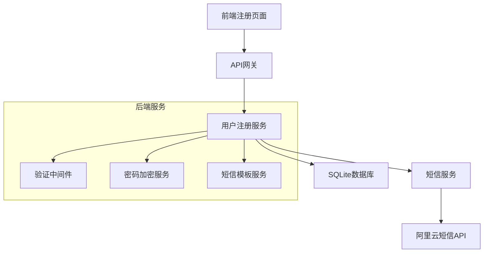

# 设计文档

## 概述

用户注册功能采用前后端分离的架构设计，使用RESTful API进行通信。后端负责业务逻辑处理、数据验证和存储，前端负责用户界面和用户体验。系统将实现安全的密码存储、手机号短信验证和用户状态管理。

## 架构

### 整体架构



### 技术栈选择

- **后端框架**: Node.js + Express.js
- **数据库**: SQLite
- **ORM**: Prisma
- **密码加密**: bcrypt
- **短信服务**: 阿里云短信服务 (Alibaba Cloud SMS)
- **验证库**: Joi
- **前端框架**: Next.js + React + TypeScript
- **构建工具**: Vite
- **状态管理**: Zustand
- **UI组件库**: ShadCN/UI + Tailwind CSS
- **HTTP客户端**: Axios
- **表单验证**: React Hook Form + Zod

## 组件和接口

### 后端组件

#### 1. 用户注册控制器 (UserRegistrationController)

```typescript
interface UserRegistrationController {
  register(req: Request, res: Response): Promise<Response>
  sendVerificationCode(req: Request, res: Response): Promise<Response>
  verifyPhone(req: Request, res: Response): Promise<Response>
}
```

**职责:**
- 处理注册请求
- 协调各个服务组件
- 返回适当的HTTP响应

#### 2. 用户服务 (UserService)

```typescript
interface UserService {
  createUser(userData: CreateUserDto): Promise<User>
  findUserByPhone(phone: string): Promise<User | null>
  activateUser(phone: string, code: string): Promise<boolean>
  generateVerificationCode(phone: string): Promise<string>
  validateVerificationCode(phone: string, code: string): Promise<boolean>
}
```

**职责:**
- 用户业务逻辑处理
- 用户数据操作
- 验证码管理

#### 3. 短信服务 (SmsService)

```typescript
interface SmsService {
  sendVerificationCode(phone: string, code: string): Promise<boolean>
  generateVerificationCode(): string
  validatePhoneFormat(phone: string): boolean
}
```

**职责:**
- 发送验证短信
- 生成验证码
- 手机号格式验证

#### 4. 验证中间件 (ValidationMiddleware)

```typescript
interface ValidationMiddleware {
  validateRegistrationData(req: Request, res: Response, next: NextFunction): void
  validatePhoneFormat(phone: string): boolean
  validatePasswordStrength(password: string): boolean
}
```

**职责:**
- 输入数据验证
- 格式检查
- 业务规则验证

### 前端组件

#### 1. 注册表单组件 (RegistrationForm)

```typescript
interface RegistrationFormProps {
  onSubmit: (data: RegistrationData) => void
  onSendCode: (phone: string) => void
  loading: boolean
  errors: ValidationErrors
  codeSent: boolean
}
```

**职责:**
- 用户输入收集
- 实时表单验证
- 错误信息显示
- 验证码发送触发

#### 2. Zustand状态管理 (RegistrationStore)

```typescript
interface RegistrationStore {
  formData: RegistrationData
  loading: boolean
  errors: ValidationErrors
  submitStatus: 'idle' | 'code-sent' | 'success' | 'error'
  codeSent: boolean
  setFormData: (data: Partial<RegistrationData>) => void
  setLoading: (loading: boolean) => void
  setErrors: (errors: ValidationErrors) => void
  sendVerificationCode: (phone: string) => Promise<void>
  verifyAndRegister: (data: RegistrationData) => Promise<void>
  reset: () => void
}
```

**职责:**
- 全局状态管理
- API调用协调
- 用户反馈处理

### API接口设计

#### 发送验证码接口

**端点:** `POST /api/send-verification-code`

**请求格式:**
```json
{
  "phone": "13800138000"
}
```

**响应格式:**

成功响应 (200):
```json
{
  "success": true,
  "message": "验证码已发送，请查收短信",
  "data": {
    "phone": "13800138000",
    "expiresIn": 300
  }
}
```

错误响应 (400):
```json
{
  "success": false,
  "message": "发送失败",
  "errors": [
    {
      "field": "phone",
      "message": "手机号格式不正确"
    }
  ]
}
```

#### 注册接口

**端点:** `POST /api/register`

**请求格式:**
```json
{
  "phone": "13800138000",
  "password": "SecurePass123",
  "verificationCode": "123456",
  "agreeTerms": true
}
```

**响应格式:**

成功响应 (201):
```json
{
  "success": true,
  "message": "注册成功，账户已激活",
  "data": {
    "userId": "uuid-string",
    "phone": "13800138000"
  }
}
```

错误响应 (400):
```json
{
  "success": false,
  "message": "注册失败",
  "errors": [
    {
      "field": "phone",
      "message": "该手机号已被注册"
    }
  ]
}
```

## 数据模型

### 用户表 (users)

```sql
CREATE TABLE users (
  id TEXT PRIMARY KEY,
  phone VARCHAR(20) UNIQUE NOT NULL,
  password_hash VARCHAR(255) NOT NULL,
  is_verified BOOLEAN DEFAULT FALSE,
  created_at DATETIME DEFAULT CURRENT_TIMESTAMP,
  updated_at DATETIME DEFAULT CURRENT_TIMESTAMP
);
 
CREATE INDEX idx_users_phone ON users(phone);
```

### 验证码表 (verification_codes)

```sql
CREATE TABLE verification_codes (
  id TEXT PRIMARY KEY,
  phone VARCHAR(20) NOT NULL,
  code VARCHAR(6) NOT NULL,
  expires_at DATETIME NOT NULL,
  used BOOLEAN DEFAULT FALSE,
  created_at DATETIME DEFAULT CURRENT_TIMESTAMP
);
 
CREATE INDEX idx_verification_codes_phone ON verification_codes(phone);
CREATE INDEX idx_verification_codes_code ON verification_codes(code);
```

### 数据模型接口

```typescript
interface User {
  id: string
  phone: string
  passwordHash: string
  isVerified: boolean
  createdAt: Date
  updatedAt: Date
}
 
interface VerificationCode {
  id: string
  phone: string
  code: string
  expiresAt: Date
  used: boolean
  createdAt: Date
}
 
interface CreateUserDto {
  phone: string
  password: string
  verificationCode: string
  agreeTerms: boolean
}
 
interface RegistrationData {
  phone: string
  password: string
  confirmPassword: string
  verificationCode: string
  agreeTerms: boolean
}
```

## 错误处理

### 错误类型定义

```typescript
enum ErrorCodes {
  PHONE_ALREADY_EXISTS = 'PHONE_ALREADY_EXISTS',
  INVALID_PHONE_FORMAT = 'INVALID_PHONE_FORMAT',
  WEAK_PASSWORD = 'WEAK_PASSWORD',
  PASSWORD_MISMATCH = 'PASSWORD_MISMATCH',
  TERMS_NOT_AGREED = 'TERMS_NOT_AGREED',
  SMS_SEND_FAILED = 'SMS_SEND_FAILED',
  INVALID_VERIFICATION_CODE = 'INVALID_VERIFICATION_CODE',
  CODE_EXPIRED = 'CODE_EXPIRED',
  CODE_ALREADY_USED = 'CODE_ALREADY_USED',
  TOO_MANY_ATTEMPTS = 'TOO_MANY_ATTEMPTS'
}
```

### 错误处理策略

1. **输入验证错误**: 返回400状态码，包含具体字段错误信息
2. **业务逻辑错误**: 返回400状态码，包含业务相关错误消息
3. **系统错误**: 返回500状态码，记录详细日志但只返回通用错误消息
4. **短信发送失败**: 记录错误但不阻止用户注册，提供重发机制

### 全局错误处理中间件

```typescript
interface ErrorHandler {
  handleValidationError(error: ValidationError): ErrorResponse
  handleBusinessError(error: BusinessError): ErrorResponse
  handleSystemError(error: SystemError): ErrorResponse
  logError(error: Error, context: RequestContext): void
}
```

## 测试策略

### 单元测试

1. **用户服务测试**
   - 用户创建逻辑
   - 手机号唯一性检查
   - 密码加密验证
   - 验证码生成和验证

2. **验证中间件测试**
   - 手机号格式验证
   - 密码强度验证
   - 必填字段检查

3. **短信服务测试**
   - 短信发送功能
   - 验证码生成
   - 阿里云API调用

### 集成测试

1. **API端点测试**
   - 注册流程完整测试
   - 错误场景测试
   - 边界条件测试

2. **数据库集成测试**
   - 用户数据持久化
   - 约束条件验证
   - 事务处理

### 端到端测试

1. **用户注册流程**
   - 表单填写和提交
   - 短信验证码接收和验证
   - 账户激活确认

2. **错误处理流程**
   - 重复手机号注册
   - 无效输入处理
   - 网络错误处理

### 测试工具

- **单元测试**: Jest + Supertest
- **集成测试**: Jest + Test Database
- **端到端测试**: Cypress
- **API测试**: Postman/Newman

## 安全考虑

### 密码安全

1. **密码加密**: 使用bcrypt进行密码哈希，salt轮数设置为12
2. **密码策略**: 最少8位，包含字母和数字
3. **密码传输**: 仅通过HTTPS传输

### 验证码安全

1. **验证码生成**: 使用crypto.randomInt生成6位数字验证码
2. **验证码过期**: 设置5分钟过期时间
3. **一次性使用**: 验证后立即标记为已使用
4. **阿里云短信安全**: 使用AccessKey和AccessSecret进行API认证

### 输入验证

1. **SQL注入防护**: 使用参数化查询
2. **XSS防护**: 输入数据清理和转义
3. **CSRF防护**: 实现CSRF令牌验证

### 速率限制

1. **注册限制**: 每IP每小时最多5次注册尝试
2. **短信发送限制**: 每手机号每小时最多3次验证码发送
3. **验证尝试限制**: 每验证码最多5次验证尝试

## 性能优化

### 数据库优化

1. **索引策略**: 在phone和verification_code字段上创建索引
2. **SQLite优化**: 启用WAL模式提高并发性能
3. **查询优化**: 使用高效的查询语句和预编译语句

### 缓存策略

1. **验证码缓存**: 使用内存缓存活跃的验证码
2. **手机号检查缓存**: 缓存最近检查的手机号存在性结果
3. **静态资源缓存**: 前端资源使用CDN和浏览器缓存

### 异步处理

1. **短信发送**: 使用消息队列异步发送短信
2. **日志记录**: 异步写入日志文件
3. **数据库写入**: 使用事务批量处理