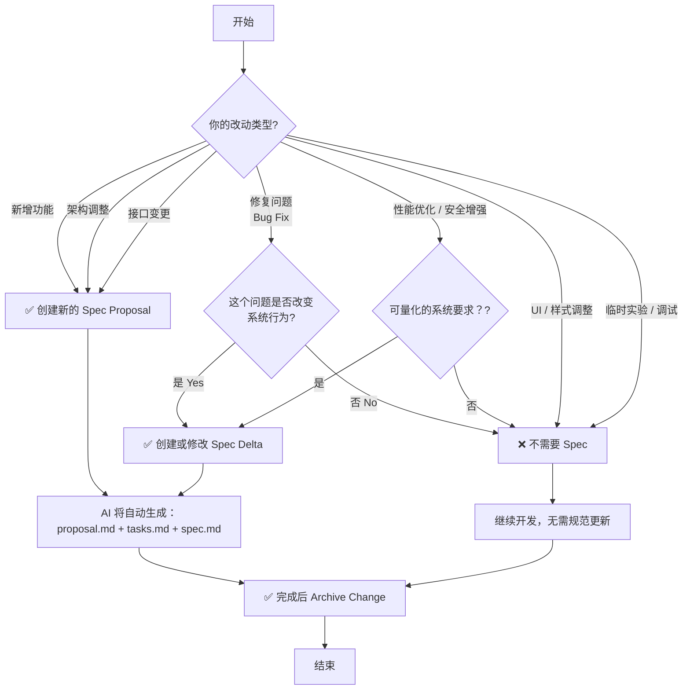

## [AI 编程三剑客：Spec-Kit、OpenSpec、Superpowers 深度对比与实战指南](https://juejin.cn/post/7605494530017165352)


## [OpenSpec让AI按规范写代码，支持Cursor、Claude Code、Codex！](https://www.bilibili.com/video/BV1fFWJztEAu/)

视频通过真实案例——为iOS番茄专注APP新增"自定义时长"功能，完整展示了OpenSpec的五大工作流程：创建提议→审核规范→AI自动编码→功能测试→归档文档。
✨ 核心亮点：工具无关、完整审计轨迹、自动归档合并、团队协作友好。视频包含完整的安装配置教程和实战演示。

openspec适合1-n，增加的细小需求。
spec kit适合0-1，创建新项目。

## [从零理解 GitHub Spec Kit：开发者必看的入门指南](https://zhuanlan.zhihu.com/p/1981659360842249886)


## [规范(spec)驱动编程入门与实战](https://www.bilibili.com/video/BV1AfsMzGEcb/)
[飞书文档](https://my.feishu.cn/wiki/AYSiw0TF4imjkvkTKwxcjGUHnId)
### 什么是 规范(Spec)驱动开发?

生成规范文档（需求的最终版）：spec.md
详细的设计文档：design.md
详细的任务文档：task.md

根据上面的文档，开始执行任务并更新任务状态
### 怎么用？OpenSpec
**[OpenSpec](https://github.com/Fission-AI/OpenSpec)**

#### 介绍
它为 AI 编程工具（Claude Code、Cursor、Codex、OpenCode、windsurf 等）提供一种标准化的方式：
- 让 AI **生成、跟踪、验证、归档** 功能变更；
- 把“功能需求 → 任务分解 → 实现 → 验收” 全流程结构化；
- 实现 **AI 与人协同开发** 的一致性。
🧠 核心理念：
> “让 AI 先写清楚规范（spec）再写代码” 而不是盲目凭 prompt 去写。
#### 安装
**Prerequisites 先决条件**
Node.js >= 20.19.0
**步骤 1：全局安装 CLI**
```bash
npm install -g @fission-ai/openspec@latest
```

验证安装：
```bash
openspec --version
```

**步骤 2：在项目中初始化 OpenSpec**
导航到您的项目目录：
```
cd my-project
openspec init
```

初始化过程中会发生： 系统会让你选择所用的 AI 工具（Claude Code / Cursor / OpenCode / Codex）； 自动在项目中创建 openspec/ 目录； 生成托管文件 AGENTS.md，用于不同 AI 工具共享说明； 为所选 AI 工具自动配置 /openspec 的斜杠命令（slash commands）。
`my-project/` 
`├── openspec/` 
`│ ├── specs/ # 当前系统的真实规格（living specs）` 
`│ ├── changes/ # 所有进行中的变更提案` 
`│ ├── archive/ # 已完成并归档的变更`
`│ └── AGENTS.md # AI 助手共用说明文件`
#### 使用
- 主动方式
使用 AI 编程工具的 自定义命令，比如 cursor,windsurf, auggie 等
```Markdown
/openspec:proposal  创建需求
/openspec:apply  执行需求
/openspec:archive 归档需求
```
- 被动方式
使用关键词，比如 spec, proposal 等触发创建规格文件
#### 实战
##### Cursor 功能迭代实战 

###### 什么时候该使用Spec？





### 评论

### spec 和 rules 的概念区分

AI随风随风
 你们其实搞混了 spec 和 rules 的概念。spec 是帮你分析问题，澄清文档，最后生成三个重要的文档，spec.md, proposal.md, task.md, 然后你再执行 apply 的时候，会把这个三个文档作为上下文放在对话内容中。 rules 是属于全局的，编程工具会把 rules的内容放在对话内容的头部， 这样的对话结构就是：
rule 内容
spec 内容
将这两部分内容发到 AI 大模型。 但是如果内容过长或者其他原因，AI 会压缩 rule，这个跟 spec 没有关系
2025-11-03 08:18 👍11
