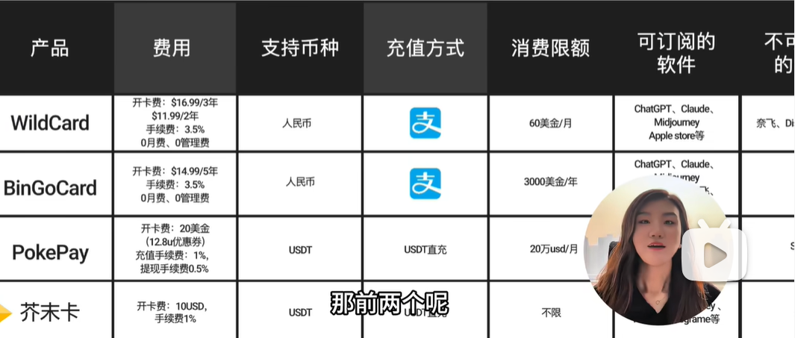

## [LLM 上下文窗口详解：从 4K 到 1M Token（2026）](https://devtk.ai/zh/blog/llm-context-window-explained/)

无脑deepseek

一次填满 GPT-5 的 100 万 token 上下文窗口，仅输入就要花 $2.00（约 ¥14.5）——还没算输出费用。对比之下，DeepSeek V3 填满 128K 上下文仅需 $0.035（约 ¥0.25），差距超过 50 倍。

### Token、字符、单词的换算关系

| 单位         | 英文近似比例                | 中文近似比例                   |
| :----------- | :-------------------------- | :----------------------------- |
| 1 token      | ~4 个字符 / ~0.75 个单词    | ~1-2 个汉字                    |
| 1,000 tokens | ~750 个英文单词             | ~500-700 个汉字                |
| 100K tokens  | ~75,000 英文单词（~150 页） | ~50,000-70,000 汉字（~100 页） |

### “中间遗忘”问题

这是很多开发者忽略的关键问题：**LLM 对上下文各部分的关注度并不均匀。**

Liu 等人 2023 年的一篇重要论文证明，LLM 在相关信息位于上下文的**开头**或**结尾**时表现最好，而当信息埋在**中间**位置时，性能显著下降。这被称为 **“Lost in the Middle”（中间遗忘）** 问题。

#### 对实际开发的影响

假设你在构建一个 RAG 管道，检索了 20 个文档块并全部塞进 prompt。如果最相关的内容恰好排在第 8-12 位，模型可能会有效地忽略它——即使它确实存在于上下文中。

新一代模型（Claude Opus 4、GPT-5）对中间位置的处理能力有所改善，但这个效应并未完全消失。实践中仍然需要注意：

- **最重要的信息放在最前面**（紧跟系统 prompt 之后）。
- **指令放在最后**，靠近模型开始生成回复的位置。
- **不要为了”填满”上下文而塞入边缘相关的内容。**
- **使用显式标记**（如 XML 标签、编号标题、分隔符）帮助模型定位信息。

### 填满完整上下文的成本（仅输入）

| 模型            | 上下文大小  | 输入价格（每百万 token） | 填满一次的成本 |
| :-------------- | :---------- | :----------------------- | :------------- |
| GPT-5           | 1M tokens   | $2.00                    | $2.00          |
| Claude Opus 4   | 200K tokens | $15.00                   | $3.00          |
| Claude Sonnet 4 | 200K tokens | $3.00                    | $0.60          |
| Gemini 2.5 Pro  | 1M tokens   | $1.25 / $2.50            | ~$2.25         |
| DeepSeek V3     | 128K tokens | $0.27                    | $0.035         |

一次填满 GPT-5 的 100 万 token 上下文窗口，仅输入就要花 $2.00（约 ¥14.5）——还没算输出费用。对比之下，DeepSeek V3 填满 128K 上下文仅需 $0.035（约 ¥0.25），差距超过 50 倍。

## 综合来看mimo-2.5的lite￥29/月最佳

国产编程能力最强是GLM-5.1，kimi-2.6和他基本差不多，但GLM慢。

求能力最好用-kimi2.6的月套餐，按量使用用deepseek，deepseek没有月套餐。

求1块钱能换的token，用minimax-2.7

https://z4crk6mg95.coze.site/

这个网站看，minimax最划算，但是没有对比模型智力。

[快速对比](https://codingplan.org/#compare)

一次prompts大概5-20次模型调用。

智谱 GLM ¥49/月 3m45s一次prompts

MiniMax-2.7 ¥29/月 3m一次prompts 可[minimax官网](https://platform.minimaxi.com/subscribe/token-plan?tab=individual__monthly)写600次模型调用 / 5小时，也就是：30s一次模型调用。￥49是1500次模型调用 / 5 小时，12s一次模型调用

| 平台                                               | 入门价 | 首月特惠             | 核心模型                          | 用量参考          | 套餐数 | 亮点            |
| :------------------------------------------------- | :----- | :------------------- | :-------------------------------- | :---------------- | :----- | :-------------- |
| [智谱 GLM](https://codingplan.org/#zhipu)          | ¥49/月 | —                    | GLM-5, GLM-4.7, GLM-4.6           | ~80 prompts/5h    | 3 档   | **含 MCP 工具** |
| [MiniMax](https://codingplan.org/#minimax)         | ¥29/月 | —                    | M2.7, M2.7-highspeed              | 100 prompts/5h    | 6 档   | **100+ TPS**    |
| [Kimi](https://codingplan.org/#kimi)               | ¥49/月 | —                    | Kimi K2.5                         | 300-1200次/5h     | 2 档   | **含会员权益**  |
| [火山引擎方舟](https://codingplan.org/#volcengine) | ¥40/月 | **¥8.91**            | 豆包·DeepSeek·Kimi·GLM 等 6 款    | 数倍 Claude Pro   | 2 档   | **模型最多**    |
| [阿里云百炼](https://codingplan.org/#aliyun)       | ¥40/月 | **¥7.9**             | 千问系列 + GLM + Kimi             | 1200次/5h         | 2 档   | **首月最低**    |
| [小米 MiMo](https://codingplan.org/#xiaomi)        | ¥39/月 | **首购¥34.32**       | MiMo-V2.5-Pro · MiMo-V2.5 等 8 款 | 6000万 Credits/月 | 4 档   | **夜间 8 折**   |
| [腾讯云](https://codingplan.org/#tencentcloud)     | ¥40/月 | **首月¥7.9·次月¥20** | HY 2.0 · GLM-5 · Kimi-K2.5 · M2.5 | 1200次/5h         | 2 档   | **腾讯自研**    |

## [webdev-code能力对比](https://arena.ai/leaderboard/code/webdev)

2026年05月24日 周日 10时09分33秒

| Rank | Rank Spread | Model | Score | Votes | Price $/M | Context |
| ---- | ---- | ------------------------------------------------------------ | --------- | ----- | ------------- | ------ |
| 1 | 12 | [claude-opus-4-7-thinking](https://www.anthropic.com/news/claude-opus-4-7)Anthropic · Proprietary | 1567+10/-10 | 4,462 | $5 / $25 | 1M |
| 8 | 312 | [glm-5.1](https://huggingface.co/zai-org/GLM-5.1)Z.ai · MIT | 1532+11/-11 | 3,608 | $1.40 / $4.40 | 202.8K |
| 9 | 313 | [minimax-m3](https://www.minimax.io/models/text/m3)MiniMax · Proprietary | 1528+16/-16 | 1,680 | $0.60 / $2.40 | N/A |
| 11 | 814 | [qwen3.6-max-preview](https://qwen.ai/blog?id=qwen3.6-max-preview)Alibaba · Proprietary | 1491+14/-14 | 2,117 | $1.04 / $6.24 | 262.1K |
| 16 | 1320 | [qwen3.6-plus](https://qwen.ai/blog?id=qwen3.6)Alibaba · Proprietary | 1461+9/-9 | 5,421 | $0.33 / $1.95 | 1M |
| 14 | 1218 | [mimo-v2.5-pro](https://mimo.xiaomi.com/mimo-v2-5-pro/)Xiaomi · MIT | 1471+10/-10 | 4,087 | $1 / $3 | 1M |
| 17 | 1323 | [deepseek-v4-pro-thinking](https://api-docs.deepseek.com/news/news260424)DeepSeek · MIT | 1459+11/-11 | 3,320 | $0.43 / $0.87 | 1M |
| 23 | 1729 | [mimo-v2.5](https://mimo.xiaomi.com/mimo-v2-5/)Xiaomi · MIT | 1438+11/-11 | 3,056 | $0.40 / $2 | 1M |
| 31   | 2939 | [minimax-m2.7](https://www.minimax.io/news/minimax-m27-en)MiniMax · Modified MIT | 1405+9/-9 | 5,723 | $0.28 / $1.20 | 204.8K |
| 38 | 3148 | [qwen3.5-397b-a17b](https://huggingface.co/Qwen/Qwen3.5-397B-A17B)Alibaba · Apache 2.0 | 1389+7/-7 | 9,045 | $0.39 / $2.34 | 262.1K |
|  |  |  |  |  |  |  |

## 价格对比

### [MiMo Coding Plan](https://codingplan.org/plans/xiaomi)

#### ¥39/月

首购¥34.32/月 · 包年¥468/年
6000 万 Credits / 月（7.2亿/年）
支持 MiMo-V2.5-Pro、MiMo-V2.5 等 8 款模型
支持 OpenClaw、Claude Code、OpenCode、KiloCode 等
非高峰期（00:00-08:00）0.8x 系数消耗
TTS 系列模型限时免费
到期自动续费，可随时取消

### [GLM 4.7套餐](https://bigmodel.cn/finance-center/resource-package/package-mgmt)

2026年03月20日 周五 15时34分26秒

#### [￥19.9 10M tokens](https://bigmodel.cn/tokenspropay?productIds=product-1aaae4)

GLM-4.7 3折尝鲜包 
包含1000万GLM-4.7（有效期3个月）

￥6.6/3.3M tokens/月

#### [￥56 10M tokens](https://bigmodel.cn/tokenspropay?productIds=product-2e157c)

GLM-4.7 8折特惠包
包含1000万GLM-4.7（有效期3个月）

￥18.6/3.3M tokens/月

#### [￥199.9 100M tokens](https://bigmodel.cn/tokenspropay?productIds=product-856eee)

GLM-4.7 3折尊享包
包含1亿GLM-4.7（有效期3个月）

￥66.6/33M tokens/月

#### [套餐概览](https://docs.bigmodel.cn/cn/coding-plan/overview)

2026年03月20日 周五 15时34分22秒

一次prompt指一次提问，每次 prompt 预计可调用模型 15-20 次。

**每月可用额度按 API 定价折算，相当于月订阅费用的 15–30 倍（已计入周限额影响）。**

| 套餐类型  | 每 5 小时限额 （动态刷新，额度在请求消耗 5 小时后刷新重置） | 每周限额 （自下单时开启，以 7 天为一个周期额度刷新重置） |
| :-------: | :---------------------------------------------------------: | :------------------------------------------------------: |
| Lite 套餐 |                    最多约 80 次 prompts                     |                  最多约 400 次 prompts                   |
| Pro 套餐  |                    最多约 400 次 prompts                    |                  最多约 2000 次 prompts                  |
| Max 套餐  |                   最多约 1600 次 prompts                    |                  最多约 8000 次 prompts                  |

#### [api](https://bigmodel.cn/pricing)

**GLM-5**、**GLM-5-Turbo** 作为高阶模型，对标 Claude Opus，调用时将按照 **“高峰期 3 倍，非高峰期 2 倍”** 系数消耗额度； 我们推荐您在复杂任务上切换至 GLM-5 处理，普通任务上继续使用 GLM-4.7，以避免套餐用量额度消耗过快。**（作为限时福利，GLM-5-Turbo 将在非高峰期仅作为 1 倍抵扣，持续到 4 月底）**注：高峰期为每日的 14:00～18:00 （UTC+8）

| Model                 | Context (Ktokens)                                | Input (1M tokens) | Output (1M tokens) | Cached input storage (1M tokens/hour) | Cached input (1M tokens) |
| :-------------------- | :----------------------------------------------- | :---------------- | :----------------- | :------------------------------------ | :----------------------- |
| **GLM-5-Turbo** `New` | Input length [0, 32)                             | ¥5                | ¥22                | Limited-Time Free                     | ¥1.2                     |
|                       | Input length [32+)                               | ¥7                | ¥26                | Limited-Time Free                     | ¥1.8                     |
| **GLM-5**             | Input length [0, 32)                             | ¥4                | ¥18                | Limited-Time Free                     | ¥1                       |
|                       | Input length [32+)                               | ¥6                | ¥22                | Limited-Time Free                     | ¥1.5                     |
| **GLM-4.7**           | Input length [0, 32)   Output length [0, 0.2) | ¥2                | ¥8                 | Limited-Time Free                     | ¥0.4                     |
|                       | Input length [0, 32)   Output length [0.2+)   | ¥3                | ¥14                | Limited-Time Free                     | ¥0.6                     |
|                       | Input length [32, 200)                           | ¥4                | ¥16                | Limited-Time Free                     | ¥0.8                     |

### minimax 2.7套餐

2026年03月20日 周五 15时34分32秒

[minimax](https://platform.minimax.io/subscribe/token-plan)

#### ￥232/月 4秒调用一次

minimax2.7的套餐：

Plus – High-Speed
Tip: Please switch to the MiniMax-M2.7-highspeed model
$400 Per year, billed annually ￥232/月
4500 model requests / 5 hours 4秒调用一次
Powered by the latest and most powerful MiniMax-M2.7-highspeed — ~100 TPS sustained throughput, up to 3× faster than competing models.

3x Starter plan usage

For professional developers managing complex workloads

Compatible with all major coding tools

Access image understanding and web search MCP

#### ￥116/月 4秒调用一次

Plus
For professional developers managing complex workloads
$200 Per year, billed annually ￥116/月

4500 model requests / 5 hours  4秒调用一次

Powered by MiniMax-M2.7 — ~50 TPS normally, 100 TPS off-peak.

3x Starter plan usage

For professional developers managing complex workloads

Compatible with all major coding tools

Access image understanding and web search MCP

#### ￥58/月 12秒调用一次。

$100 Per year, billed annually ￥58/月

1500 model requests / 5 hours 12秒调用一次。
Powered by MiniMax-M2.7 — ~50 TPS normally, 100 TPS off-peak.

For entry-level developers managing lightweight workloads

Compatible with all major coding tools

Access image understanding and web search MCP

#### [api 平台套餐](https://platform.minimaxi.com/subscribe/token-plan)

#### ￥49 每月，按月订阅

Plus 适合专业开发场景满足复杂开发任务需求
1500次模型调用 / 5 小时 12秒调用一次模型。
支持最新 MiniMax M2.7，正常约50TPS，低峰时段100TPS

2.5 倍 Starter 套餐用量

适合专业开发场景满足复杂开发任务需求

支持主流的编程工具，并持续扩展中

支持图像理解、联网搜索 MCP

##### ￥29/月

600次模型调用 / 5小时 30s调用一次模型，2m30s-3m一次prompts。
支持最新 MiniMax M2.7，正常约50TPS，低峰时段100TPS

约支持1个OpenClaw agent

支持主流的编程工具，并持续扩展中

支持图像理解、联网搜索 MCP

每周可使用额度为「每5 小时额度」的 10 倍

#### [按量付费 MiniMax-M2.7 ￥2.1I/￥8.4O/1M tokens](https://platform.minimaxi.com/docs/guides/pricing-paygo#%E6%96%87%E6%9C%AC)

MiniMax-M2.7按量付费没有deepseek-V4-flash便宜，但比deepseek-V4-pro便宜。

| **模型**                   | **输入价格** 元/百万 tokens | **输出价格** 元/百万 tokens | **缓存读取** 元/百万 tokens | **缓存写入** 元/百万 tokens |
| :------------------------- | :-------------------------: | :-------------------------: | :-------------------------: | :-------------------------: |
| **MiniMax-M2.7**           |             2.1             |             8.4             |            0.42             |            2.625            |
| **MiniMax-M2.7-highspeed** |             4.2             |            16.8             |            0.42             |            2.625            |
| **MiniMax-M2.5**           |             2.1             |             8.4             |            0.21             |            2.625            |
| **MiniMax-M2.5-highspeed** |             4.2             |            16.8             |            0.21             |            2.625            |
| **M2-her**                 |             2.1             |             8.4             |             ——              |             ——              |

### deepseek

#### deepseek-v4-flash(1)￥1I/￥2O/1M tokens

deepseek-v4-flash(1)￥1I/￥2O/1M tokens

deepseek-v4-pro￥3I/￥6O/1M tokens

| 模型                                                         | deepseek-v4-flash(1)                                         | deepseek-v4-pro         |                              |
| ------------------------------------------------------------ | ------------------------------------------------------------ | ----------------------- | ---------------------------- |
| BASE URL (OpenAI 格式)                                       | [https://api.deepseek.com](https://api.deepseek.com/)        |                         |                              |
| BASE URL (Anthropic 格式)                                    | https://api.deepseek.com/anthropic                           |                         |                              |
| 模型版本                                                     | DeepSeek-V4-Flash                                            | DeepSeek-V4-Pro         |                              |
| 思考模式                                                     | 支持非思考与思考模式（默认） 切换方式详见[思考模式](https://api-docs.deepseek.com/zh-cn/guides/thinking_mode) |                         |                              |
| 上下文长度                                                   | 1M                                                           |                         |                              |
| 输出长度                                                     | 最大 384K                                                    |                         |                              |
| 功能                                                         | [Json Output](https://api-docs.deepseek.com/zh-cn/guides/json_mode) | 支持                    | 支持                         |
| [Tool Calls](https://api-docs.deepseek.com/zh-cn/guides/tool_calls) | 支持                                                         | 支持                    |                              |
| [对话前缀续写（Beta）](https://api-docs.deepseek.com/zh-cn/guides/chat_prefix_completion) | 支持                                                         | 支持                    |                              |
| [FIM 补全（Beta）](https://api-docs.deepseek.com/zh-cn/guides/fim_completion) | 仅非思考模式支持                                             | 仅非思考模式支持        |                              |
| 价格                                                         | 百万tokens输入（缓存命中）(2)                                | 0.02元                  | 0.025元（2.5折(3)）~~0.1元~~ |
| 百万tokens输入（缓存未命中）                                 | 1元                                                          | 3元（2.5折(3)）~~12元~~ |                              |
| 百万tokens输出                                               | 2元                                                          | 6元（2.5折(3)）~~24元~~ |                              |
| 并发限制(4)                                                  | 2500                                                         | 500                     |                              |

直接用deepseek的api，价格是gpt4o-mini的5250分之1

[deepseek的api使用](https://api-docs.deepseek.com/zh-cn/)

[deepseekUsage当前账单](https://platform.deepseek.com/usage)

[deepseek价格：](https://api-docs.deepseek.com/zh-cn/quick_start/pricing)

### [openai api价格](https://platform.openai.com/docs/pricing)

2026年03月20日 周五 15时34分45秒

Price per 1M tokens Batch API price

| Model                                   |  Input | Cached input | Output |
| :-------------------------------------- | -----: | -----------: | -----: |
| gpt-5.2                                 | $0.875 |      $0.0875 |  $7.00 |
| gpt-5.2-pro                             | $10.50 |            - | $84.00 |
| gpt-4o gpt-4o-2024-08-06           |  $1.25 |            - |  $5.00 |
| gpt-4o-mini gpt-4o-mini-2024-07-18 | $0.075 |            - |  $0.30 |

deepseek薄纱：

deepseek-chat ￥0.0001 / 1k tokens

gpt-4o-mini	￥0.525 / 1k tokens

GLM-4-Air-0111 ¥0.00025 / 1k tokens

[deepseek使用教程](https://blog.csdn.net/qq_44899247/article/details/139634763)

### chatGLM4 api价格

https://bigmodel.cn/pricing

| Model          | Description      | Context | Pricing             | Pricing with Batch API |
| :------------- | :--------------- | :------ | :------------------ | :--------------------- |
| GLM-4-Plus     | Flagship         | 128K    | ¥0.05 / 1k tokens   | ¥0.025 / 1k tokens     |
| GLM-4-Air-0111 | High-performance | 128K    | ¥0.0005 / 1k tokens | ¥0.00025 / 1k tokens   |
| GLM-4-Long     | Long input       | 1M      | ¥0.001 / 1k tokens  | ¥0.0005 / 1k tokens    |

GLM-4-Air-0111 ¥0.00025 / 1k tokens

### [bingocard 2024年ChatGPT最新充值攻略！这种方法最省钱、最稳定！](https://www.bilibili.com/video/BV1Y3WpeMEUq/)

wildcard 两年共\$11，bingocard有独立的bin，bin即银行卡卡号，\$15可以用5年。

已经提交身份证正反面图片，因资费原因未开卡，开卡费$20，充值$10，卡有效期5年。

开5年的卡就是\$30=￥216

[小资_派](https://space.bilibili.com/3494360475765178)

BinGoCard申请： www.bebingocard.com/?aff=xzp

2024-10-14 10:26 👍2

小资_派

申请的时候不需要连vpn，充chatgpt时需要
2024-08-26 10:23

小资_派

回复 @瓜皮尘心 : 没有跑路哦～就是网络和节点问题，手机上的成功率更高，清理浏览器缓存，换个纯净的网络试试
2024-10-18 14:27

## 虚拟卡充值

### wildcard

[开卡网址](https://bewildcard.com/open-card)：

Select Service Duration
2 year	\$16.99
1 year	\$11.99

开一年充\$1就是$13=￥93.6

### [主流虚拟卡全面测评！不花冤枉钱！WildCard、BinGoCard、PokePay、芥末卡哪个更适合你？](https://www.bilibili.com/video/BV1FFm8YGEnv/)

你掉毛嚒

wild亲测可用，我是30秒到账，有一个年服务费，不高，能接受。卡片名称不建议用真实姓名，下面邀请码可以省2美刀
JSE26NUM
↑邀请码，可省2刀，如果只用GPT的话，wild够用
2025-01-16 14:22

