## [破解大模型「涌现」之谜：新奇性搜索是AI腾飞的踏脚石](https://cloud.tencent.com/developer/article/2308716)

------

### 新奇性搜索的提出与意义

【新智元导读】OpenAI科学家Kenneth Stanley和Joel Lehman的畅销新书《为什么伟大不能被计划》中，提出了一种「新奇性搜索算法」，可能是大模型「涌现」能力的答案。与此同时，这种显而易见的成功似乎只是「穷尽一切可能性」（计算机科学家称之为穷举法）后出现的结果。如果你真的有时间去尝试世界上每一种可能的行为，最终也可能办成一些「聪明事」，但你可能要花上几乎一辈子的时间才能得到这个结果。这个方法听起来有点愚蠢，但事实证明，新奇性搜索中的发现比简单地尝试每一个你能想到的行为都要更深入。新奇性搜索比穷尽可能性更有趣的原因是，它倾向于以某种特定顺序来产生行为。

### 顺序与探索的重要性

顺序是探索和发现的一个关键因素。事实上，我们对任何一种搜索都充满信心的主要原因是，我们期望它能指导人们以某种合理的顺序发现通往成功的踏脚石。在目标驱动型搜索中，我们通常期望坏的行为出现在好的行为之前。换句话说，我们期望搜索行为的质量，在搜索的过程中不断得到提升。这样一来，目标将带来一连串的发现这一结论似乎就合乎逻辑了。虽然大多数人都熟悉这样一个概念，即将进步视为一个从坏到好的过程。从简单到复杂的变化，由于没有设定明确的目标，很容易令人觉得陌生。但在某种程度上，后者更为合理，因为它不会受到目标的欺骗性的影响（因为你并未试图从中获取任何特定的东西）。

### 新奇性推动行为复杂化

寻找新奇事物的过程，将导致行为从简单变得复杂，其原因本身就非常直接。当所有简单的行为方式都耗尽后，剩下的唯一可以被发现的新行为，自然就会变得更复杂。例如，我们再回顾一下前文那个试图穿越走廊的机器人。一开始，几乎所有类型的行为都是新奇的，因为它之前从未尝试过任何行为。而在绝大多数情况下，这些最初的行为往往是简单的，就像很多简单的发明往往是通往更复杂发明的踏脚石那样。归根结底，我们必须获得某种知识，才能继续创造新奇事物，这就意味着新奇性搜索是一种信息收集器，用于不断积累关于世界的知识。搜索的时间越长，它最终积累的关于世界的信息就越多。当然，信息量和复杂性是相辅相成的，更复杂的行为必然需要更多的信息。

### 物理约束与信息积累

并且，我们有充分的理由相信，我们不需要目标的约束来避免无意义的浪费。物理世界自身就提供了很多约束。在搜索新奇事物时，实际尝试的行为空间变成人类可以想象的所有行为空间。这个空间虽然看似更大，但新奇性搜索的空间，仅是其中的一小部分，这也是新奇性搜索变得实际可行的前提。世界的物理特性限制了新奇性搜索能考虑的所有行为，这一想法也解释了新奇性搜索积累世界信息的趋势：真正成为下一步行为的踏脚石的那些行为，必须尊重现实世界运作的方式和规律。

### 算法实验与探索方式

正如前文所述，从科学的角度来看，新奇性搜索概念的一大吸引力是，它实际上可以被编成一种计算机算法，并进行可衡量的测试，这正是我们所做的。事实上，到目前为止，我们已经将新奇性搜索置于大量不同的场景中进行了测试，第一项就是机器人在迷宫中的模拟实验。换句话说，我们对计算机进行编程，模拟机器人在围墙式迷宫中的行为，类似于驾驶模拟器模仿汽车上路的状况。这就好像电脑自己玩的一个简单的视频游戏。机器人模拟实验在人工智能领域很常见，因为模拟的机器人可以非常迅速地反复尝试新的行为，而且不存在器材损毁风险。下图是其中一个迷宫的示意图。

### 新奇行为的筛选与微调

什么行为是好的或坏的是一个很重要的问题，因为程序将只会继续探索被认定为「好」的想法。换句话说，新奇性搜索的希望在于，好的想法可能是通往有趣事物的踏脚石。因此，在尝试了一系列的行为之后，程序决定专注于测试那些看起来有趣的行为。为了做到这一点，程序将采用这些新奇的想法并进行微调，继而观察是否会出现更有趣、更新奇的东西。如果机器人绕过一堵从未绕过的墙，那么对该行为的微调就有可能让机器人走得更远。另一方面，如果机器人做了以前做过很多次的事情（比如撞墙），那么这个行为就会被忽略，不会被进一步探索。这种专注于如何在迷宫中实践更新奇的想法的方式，与任何其他类型的创造性思维相同，即你可能有一个有趣的想法，然后在思考一段时间后，发现它启发了其他有趣的想法。

------

要不要我帮你把每个小标题再进一步简化，比如只保留 **「提出与意义」「顺序与探索」「复杂化趋势」「物理约束」「算法实验」「行为筛选」** 这种简洁式的？


## [大模型思维链（Chain-of-Thought）技术原理](https://www.zhihu.com/tardis/bd/art/629087587)

COT = think step by step

### 2 Zero-shot-CoT
零样本思维链（Zero Shot Chain of Thought，Zero-shot-CoT）提示过程是对 CoT prompting 的后续研究，引入了一种非常简单的零样本提示。他们发现，通过在问题的结尾附加“Let's think step by step”这几个词，大语言模型能够生成一个回答问题的思维链。从这个思维链中，他们能够提取更准确的答案。

Zero-shot-CoT
模型输入
Q：一个杂耍演员可以玩杂耍 16 个球。一半的球是高尔夫球，其中一半的高尔夫球是蓝色的。蓝色高尔夫球有多少个？
A：让我们一步步思考（Let’s think step by step）。

模型输出
答：一共有16个球。一半的球是高尔夫球，这意味着有 8 个高尔夫球。一半的高尔夫球是蓝色的，这意味着有 4 个蓝色高尔夫球。

其实 Zero-shot-CoT 是一个 pipeline。也就是说“Let's think step by step”这句话，只是通过这个 prompt 让LLM 尽可能生成一些思考过程，然后再将生成的 rationale（理由） 和 question 拼在一起，重新配合一个answer 指向的 prompt 如“The answer is ”来激励模型生成答案。

从技术上讲，完整的零样本思维链（Zero-shot-CoT）过程涉及两个单独的提示/补全结果。在下图中，左侧生成一个思维链，而右侧接收来自第一个提示（包括第一个提示本身）的输出，并从思维链中提取答案。这个第二个提示是一个**自我增强**的提示。
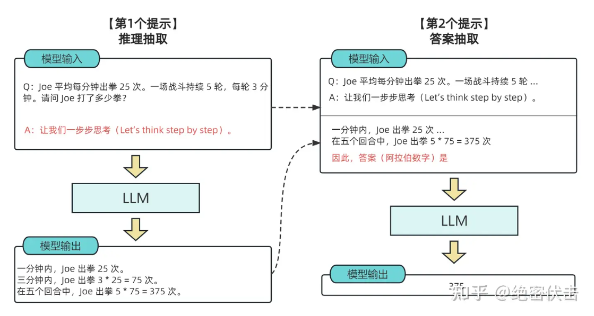

作者还做了解释，说明这句“Let's think step by step”是经过验证的，比如对比下面的其它的 instruction，尤其那些不相关的和误导的，效果就非常差，说明大模型真的是在理解这句 instruction 的意思。
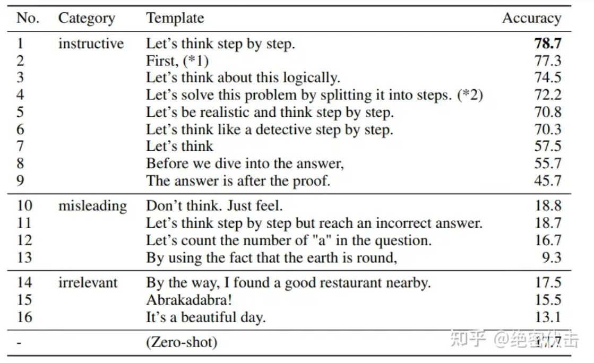

### 3 多数投票提高CoT性能——自洽性（Self-consistency）
这篇文章是 CoT 后很快的一个跟进工作，是 CoT 系列改进的重要一步，在 2022 年 3 月在arxiv上被放出来。这篇文章几乎用的和 CoT 完全一样的数据集和设置，主要改进是对答案进行了多数投票（majority vote），并且发现其可以显著地提高思维链方法的性能。

文章提出的方法叫自洽性（Self-consistency），是对 CoT 的一个补充，它不仅仅生成一个思路链，而是生成多个思路链，然后取多数答案作为最终答案。

在下面的图中，左侧的提示是使用少样本思维链范例编写的。使用这个提示，独立生成多个思维链，从每个思维链中提取答案，通过“边缘化推理路径”来计算最终答案。实际上，这意味着取多数答案。

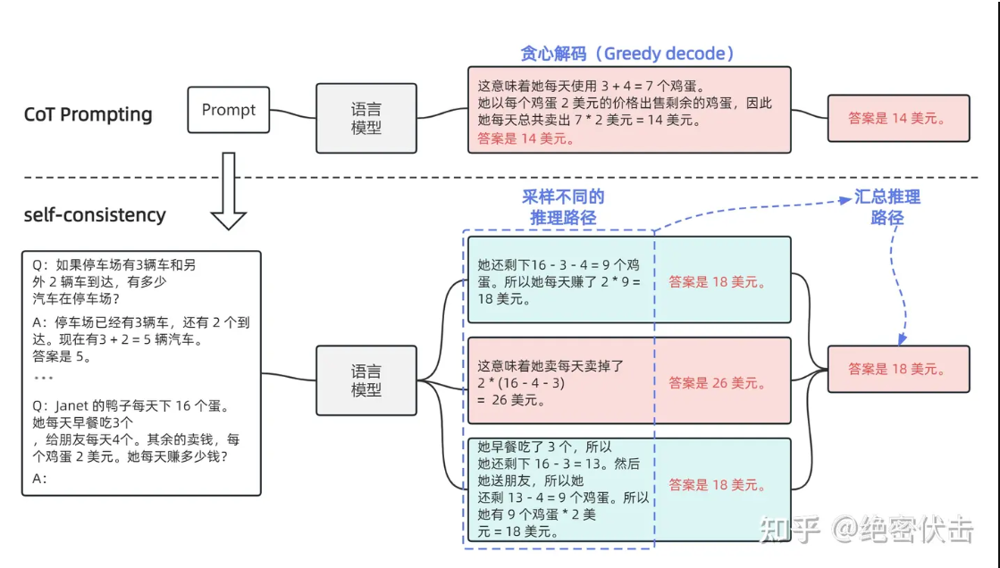

### 4 LtM （Least to Most prompting）提示

分解问题
解决问题

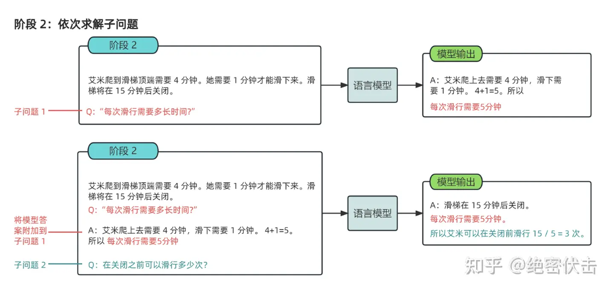

### 6 提升小模型的推理能力：Fine-tune-CoT
基于 CoT 方法的主要缺点是它需要依赖于拥有数百亿参数的巨大语言模型。由于计算要求和推理成本过于庞大，这些模型难以大规模部署。因此，来自韩国科学技术院的研究者努力使小型模型能够进行复杂的推理，以用于实际应用。

为了详细说明，下面应用前面的 Zero-shot-Cot从非常大的教师模型中生成推理，并使用它们来微调较小的学生模型。
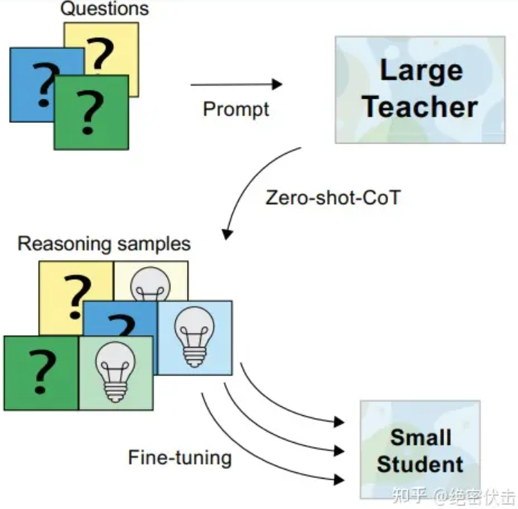
Fine-tune-CoT 的核心思想是采用 Zero-Shot-CoT 生成我们的问答数据，然后使用温度 T 采样（也可以用 Top-k 采样），以此生成尽可能多的数据，然后再进行 Fine-tune。

谷歌大脑的研究人员认为，策略问题需要大量的世界知识，而小型模型没有足够的参数来记忆这些世界知识，所以也不太可能产生正确的推理步骤。

但问题是，能落地到产业的模型，规模必然不会太大，思维链拆解了更多的步骤、用到更多的计算资源，相当于更加耗费脑力，很多研究机构和企业是负担不起 175B 参数以上的大模型。

**此外，即使有思维链提示，大语言模型依然不能解决小学水平的数学问题**。

没有思维链，数学推理是指定不行。但有了思维链，大语言模型也可能出现错误推理，尤其是非常简单的计算错误。Jason Wei 等的论文中，曾展示过在 GSM8K 的一个子集中，大语言模型出现了 8% 的计算错误，比如6 * 13 = 68（正确答案是78）。


## [李宏毅讲解生成式AI(大模型，文本，图像)](https://www.bilibili.com/video/BV16N411K7aT)

### [【生成式AI】ChatGPT 原理剖析 (2⧸3) — 預訓練 (Pre-train)](https://www.bilibili.com/video/BV16N411K7aT?p=2)

#### gpt2和gpt3参数比较
[视频时间戳：](https://www.bilibili.com/video/BV16N411K7aT?t=697.0&p=2)
gpt2和gpt3参数比较，1.543B和175B：
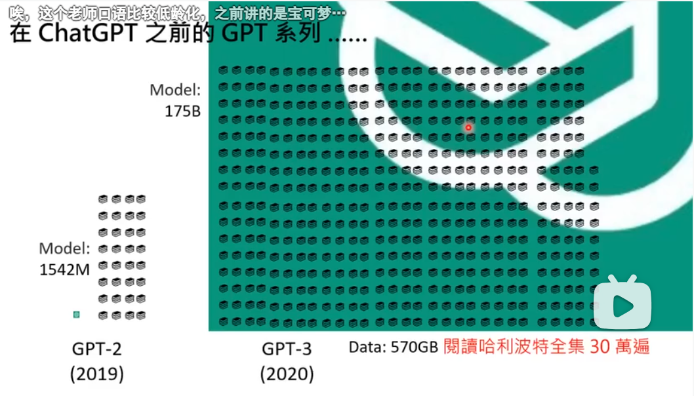

11:18 570gb的文字量
11:20 差不多是把哈利波特全集读了30万遍
11:43 他们在网络上原始爬到的资料有45t
11:46 他只选了570gb出来做训练而已
12:04 gb t3.5指的是哪一个模型
12:07 基本上目前open ai官方的说法是
12:10 只要是拿gp t3 再来做一些微调

#### 论文就是把gpt3测试在42个不同的任务上
[视频时间戳：](https://www.bilibili.com/video/BV16N411K7aT?t=863.9&p=2)
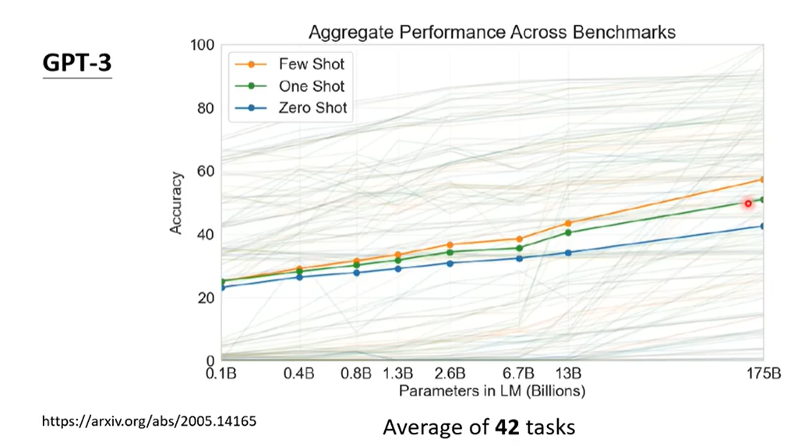
14:05 gpt3的论文
14:07 就是把gpt3 测试在42个不同的任务上
14:11 看看他在42个不同任务上的平均正确率
14:15 那这边有这三条不同线
14:16 我们就不要太在意他们之间的差异

#### gpt回答不一定是我们想要的
[视频时间戳：](https://www.bilibili.com/video/BV16N411K7aT?t=939.3&p=2)
GPT只从网络学习资料的缺点
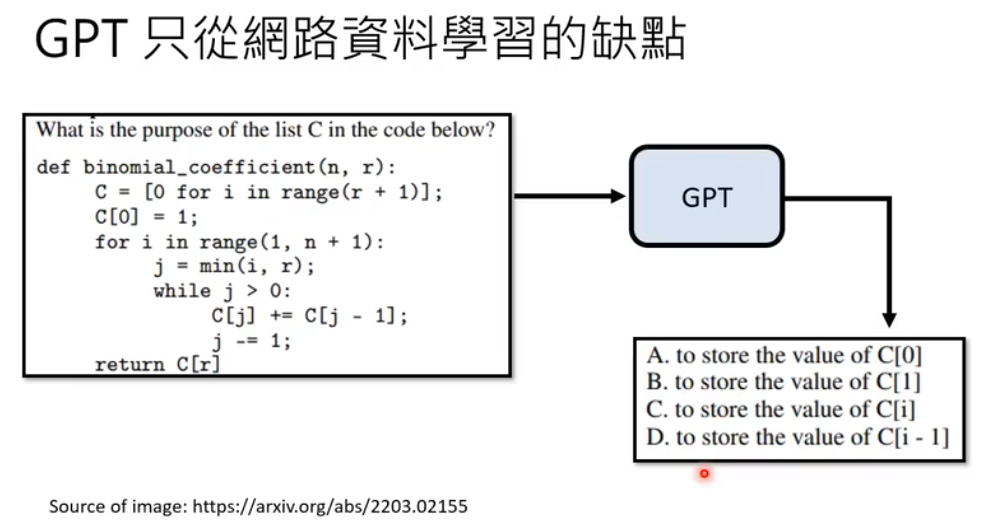

#### 监督学习产生gpt后微调产生chatgpt
[视频时间戳：](https://www.bilibili.com/video/BV16N411K7aT?t=954.7&p=2)
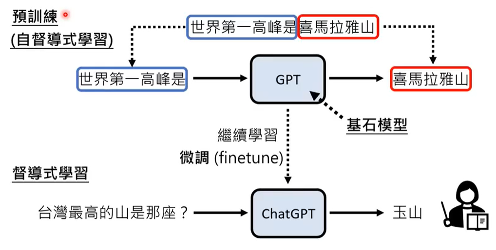
15:52
但是从gpt到chatgpt就需要人类老师的介入。所以chatgpt其实是gpt系列，经过督导式学习以后的结果，也就是找人类老师来。人类老师说，以后有人告诉你台湾最高的山是哪座，你的输出就应该是玉山。接下来gpt就透过人类老师提供的资料继续去做学习，那就变成了chatgpt哦。
chatgpt是透过督导式学习产生的。那在进行督导式学习之前，透过大量网络资料学习的这个过程，我们称之为预训练。那这个继续学习的过程呢，很多时候文献上就叫做微调。那它的英文就是fine tuning好。然后这个预训练呢有时候又叫做自督导式学习。那为什么叫自督导式学习呢？就是督导式学习，就是提供成人类提供成对的资料，让机器进行学习。那在自督导式学习的过程中，其实机器也需要成对的资料，但这些成对的资料不是人类提供的，是用一些方法无痛生成的。
17:09

#### Muti-BERT只学英文却懂中文
[视频时间戳：](https://www.bilibili.com/video/BV16N411K7aT?t=1262.0&p=2)
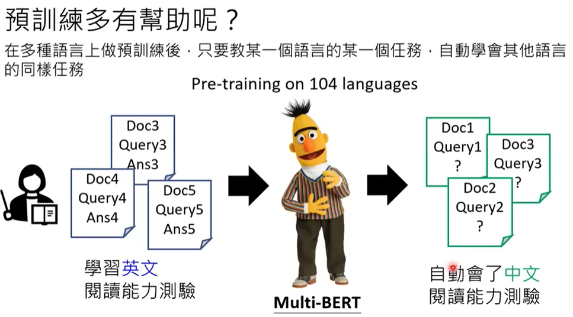

20:46
那我们发现Muti-BERT有一个神奇的技能，如果你今天要教他学阅读能力测验，你只需要教他英文，接下来自动会中文阅读能力测验，就像有一个人要考中文阅读能力测验鉴定，但是他做的考古题都是英文能力测验鉴定，他直接裸考去考中文，结果不知道为什么他中文的问题也答得对。
21:09

[视频时间戳：](https://www.bilibili.com/video/BV16N411K7aT?t=1383.6&p=2)
DRCD数据集。
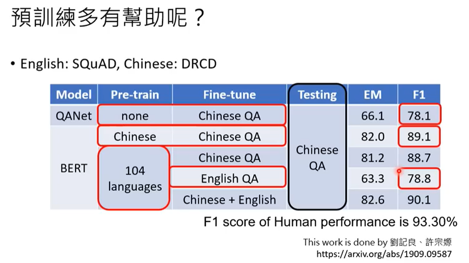

#### PPO强化学习算法增强
[视频时间戳：](https://www.bilibili.com/video/BV16N411K7aT?t=1437.5&p=2)
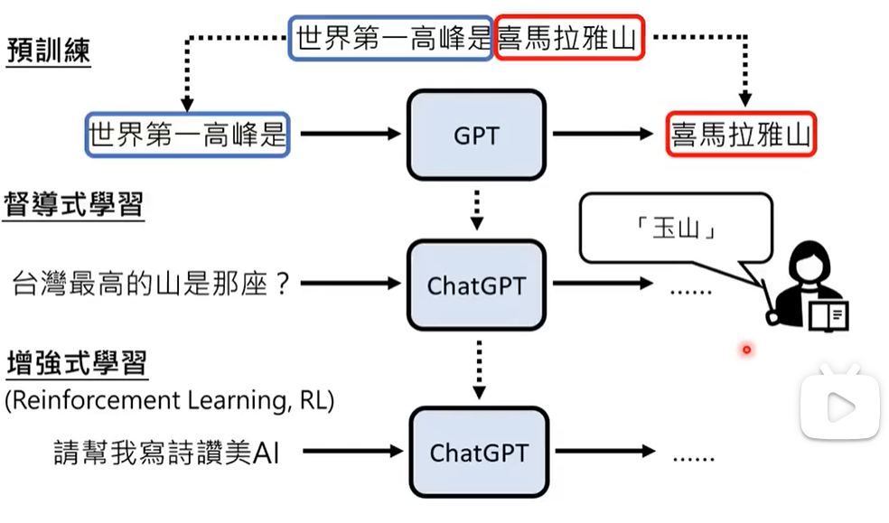


那我们知道说啊这个chatgpt的reinforcement learning，用的是p p o这个演算法，那我们日后来讲一下p p o这个演算法，而在增强式学习里面，<font color="#c00000">人呢不是直接给机器答案，而是告诉机器，现在你的答案是好还是不好</font>。那增强式学习有什么好处呢？相较于督导式学习，督导式学习的人类老师是比较辛苦的，<font color="#c00000">而在增强式学习里面，人类老师哦可以偷懒，因为你只要点个赞。</font>

>近端策略优化（PPO）算法是OpenAI在2017提出的一种强化学习算法，被认为是目前强化学习领域的SOTA方法，也是适用性最广的算法之一。

#### 增强式学习 适合用在人类自己都不知道答案的时候
[视频时间戳：](https://www.bilibili.com/video/BV16N411K7aT?t=1505.9&p=2)
24:43
另外一个更重要的事情是增强式学习，更适合用在人类自己都不知道答案的时候。举例来说，我这边给的例子是请帮我写诗，赞美ai教你写一首，你现场其实写不出来对不对，但是也许如果机器写一首，你可以判断这首诗是不是一首好诗。
24:59

### [【生成式AI】ChatGPT 原理剖析 (3⧸3) — ChatGPT 所帶來的研究問題](https://www.bilibili.com/video/BV16N411K7aT?p=3)
[视频时间戳：](https://www.bilibili.com/video/BV16N411K7aT?t=136.6&p=3)

#### 催眠
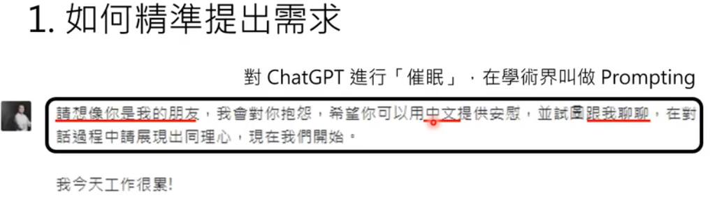
01:35
你要催眠它，把它变成你想要的样子，然后在学术界把这个催眠这件事叫做prompting好。所以这边说请想象你是我的朋友啊，这个很重要啊，要让他讲话像是一个更像是一个人，然后呢用中文回答我这个chatgpt，你不要求他用中文回答你的话，有时候他会出现英文，然后我要强调说，请试着跟我聊聊，这样他就不会据点，他才会反问你问题。
02:01

02:02
然后，我说，<font color="#c00000">现在我们开始</font>。其实，现在我们开始这句话还蛮重要的。有时候，如果你不讲这句话，对方可能不知道你要开始做什么了。
02:08

#### nerual editing
[视频时间戳：](https://www.bilibili.com/video/BV16N411K7aT?t=304.0&p=3)
05:03
人类老师说应该是阿根廷。那这个时候呢，确实可以更新它的参数，因为人类老师已经可以告诉他正确的答案。他可以拿这些正确的答案再去训练文字形容，更新它的参数，期待它得到正确答案。但是真的有这么容易吗？有没有可能把某一个答案弄对，反而弄错了更多的答案？因为它就是一个模型呢，模型里面发生了什么事，我们并不知道。
05:31

05:45
有人问他2018年的世足赛冠军，他的答案也变成阿根廷。你要改一个错误，反而弄错更多的地方呢。那如何让机器修改一个错误，不要弄错更多地方? 这会是一个新的研究的主题，它叫做nerual editing。
05:59

他读到了不该读的资讯，我们有没有办法直接让他遗忘呢。就好像在哈利波特里面念个咒语，空空遗忘，他就忘记这个资讯了。我们有没有办法做到这件事呢？这是一个新的研究主题，这个研究主题是有名字的，它叫machine unlearning。我们有时间再跟大家讲什么是machine unlearning，machine learning的相反机器学习，相反叫机器反学习，让他忘记他曾经学过的东西。

### [【生成式AI】用 ChatGPT 和 Midjourney 來玩文字冒險遊戲](https://www.bilibili.com/video/BV16N411K7aT?p=4)

[视频时间戳：](https://www.bilibili.com/video/BV16N411K7aT?t=187.5&p=4)
03:07
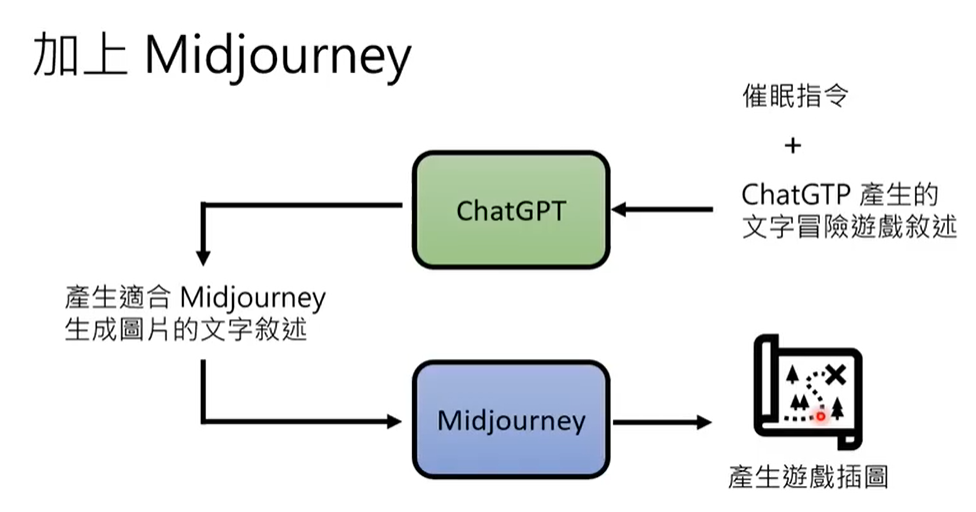

### [【生成式AI】快速了解機器學習基本原理 (1⧸2) (已經略懂機器學習的同學可以跳過這段)](https://www.bilibili.com/video/BV16N411K7aT?p=5)

chatgpt本质是分类问题，选项是所有的文字。
[视频时间戳：](https://www.bilibili.com/video/BV16N411K7aT?t=399.9&p=5)
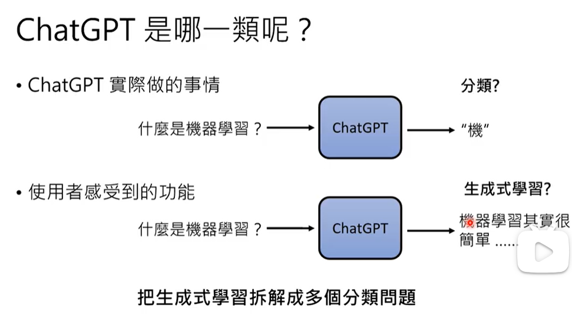


### [【生成式AI】生成式學習的兩種策略：要各個擊破，還是要一次到位](https://www.bilibili.com/video/BV16N411K7aT/?p=7)

[视频时间戳：](https://www.bilibili.com/video/BV16N411K7aT?t=816.9&p=7)
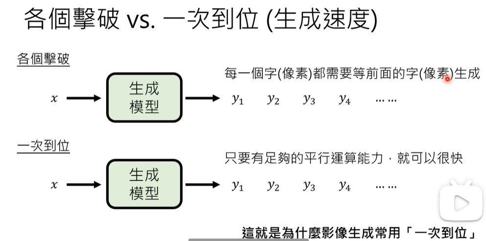
正确答案：各个击破好一点。
图片一般是用的一次到位，因为像素太多了。

16:04 一次到位就是让模型一次
16:06 把所有的分布都产生出来
16:08 所以第一个产生词汇的位置
16:12 第一个生成的位置可能老的几率很高
16:14 演的几率也很高
16:16 第二个深层的位置湿的几率也很高
16:18 圆的几率也很高

[视频时间戳](https://www.bilibili.com/video/BV16N411K7aT?t=1037.9&p=7)
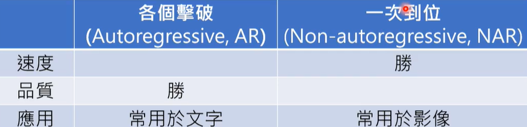

#### 各个击破 +一次到位
语音合成
[视频时间戳：](https://www.bilibili.com/video/BV16N411K7aT?t=1278.3&p=7)
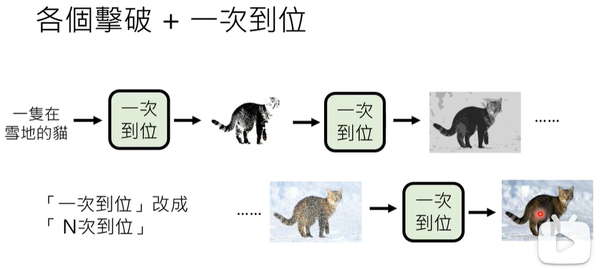
同stable diffussion，先生成一张模糊的图片，再慢慢精细化。

### [【生成式AI】能夠使用工具的AI：New Bing, WebGPT, Toolformer](https://www.bilibili.com/video/BV16N411K7aT/?p=8)
new bing搜索网络，获取页面，只把相关信息的段落放入gpt获取回答。
重复这个过程。

简易版new bing, webgpt

[视频时间戳：](https://www.bilibili.com/video/BV16N411K7aT?t=888.2&p=8)
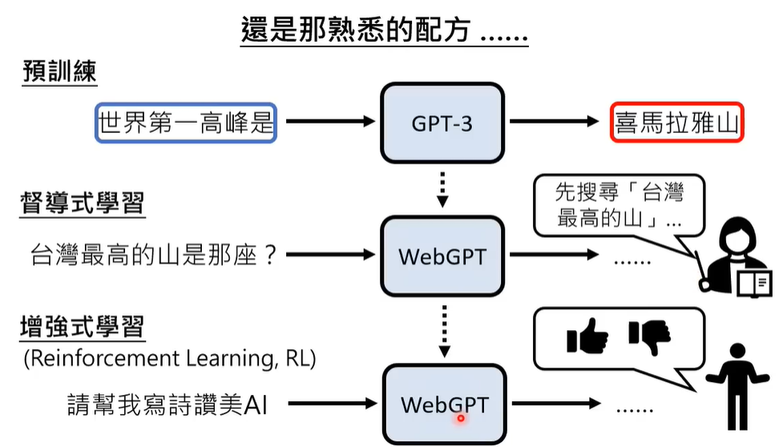

#### webgpt解答流程
[视频时间戳：](https://www.bilibili.com/video/BV16N411K7aT?t=960.6&p=8)

#### Toolformer:使用多种不同的工具

[视频时间戳：](https://www.bilibili.com/video/BV16N411K7aT?t=1123.0&p=8)
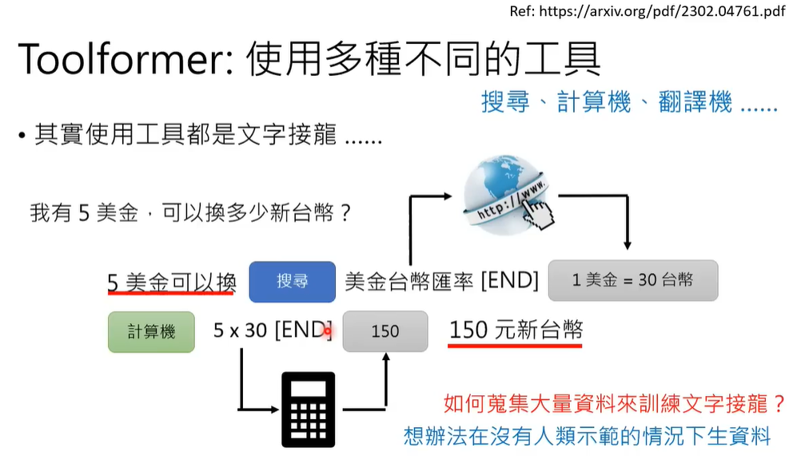


第一招：用另一个语言模型来产生资料
[视频时间戳：](https://www.bilibili.com/video/BV16N411K7aT?t=1241.1&p=8)
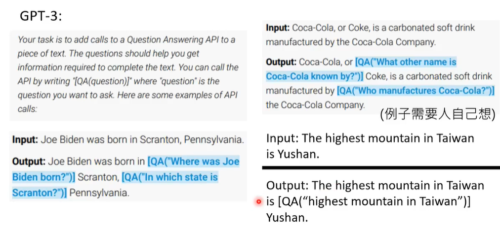

第二招：验证语言模型生成的结果
[视频时间戳：](https://www.bilibili.com/video/BV16N411K7aT?t=1260.1&p=8)


[视频时间戳：](https://www.bilibili.com/video/BV16N411K7aT?t=1449.6&p=8)
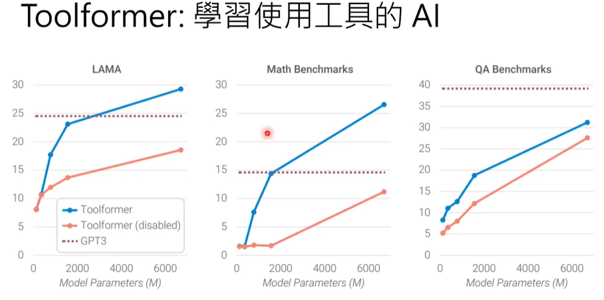
可以使用网络的Toolformer打爆不可以使用网络的Toolformer，胜于断网的GPT3。

### [【生成式AI】Finetuning vs. Prompting：對於大型語言模型的不同期待所衍生的兩類使用方式 (1⧸3)](https://www.bilibili.com/video/BV16N411K7aT/?p=9)

#### gpt文字接龙 bert文字填空
[视频时间戳：](https://www.bilibili.com/video/BV16N411K7aT?t=84.1&p=9)
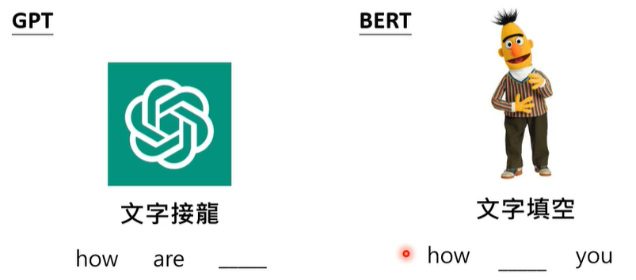


[视频时间戳：](https://www.bilibili.com/video/BV16N411K7aT?t=360.7&p=9)
对于大语言模型的两种不同期待，期待一：成为专才。期待二：成为通才。
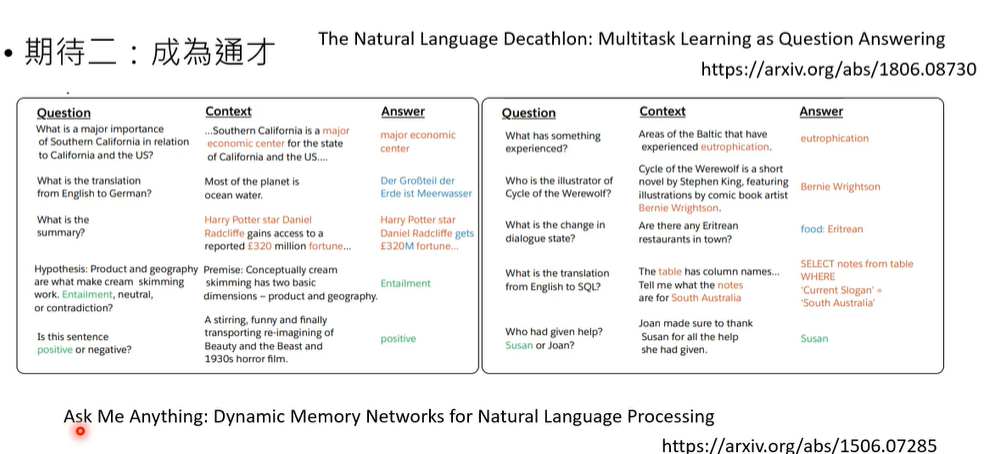

[视频时间戳：](https://www.bilibili.com/video/BV16N411K7aT?t=552.6&p=9)
chatgpt不如其他专用语言模型，但是当时chatgpt还没有
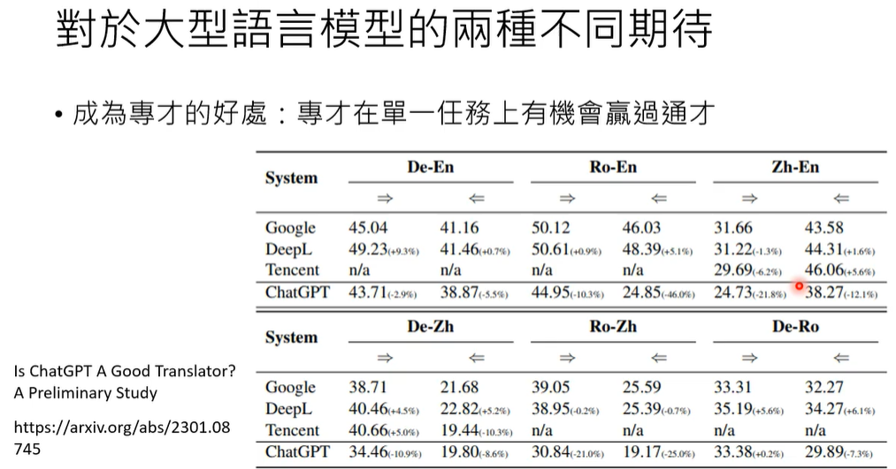
Is ChatGPT A Good Translator? A Preliminary Study
09:30 那刚才那是腾讯的文章啊
09:32 那腾讯的文章是比较少开始做了
09:34 他用的是chatgpt12月版本
09:37 而且他们只是了50个句子
09:38 这是有点被人诟病的
09:40 因为那时候确的gpt还没有api啊
09:42 所以他们应该是人手输进去的

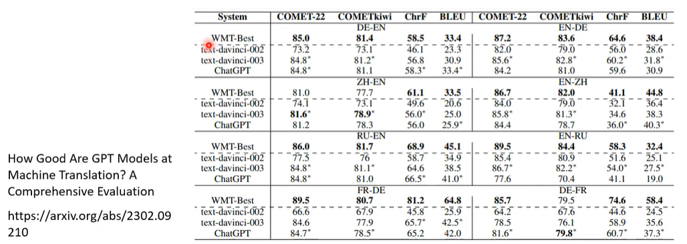
microsoft的文章，How Good Are GPT Models at Machine Translation? A Comprehensive Evaluation
WMT-Best是比赛中最好的模型。

成爲通才的好处：只要重新设计prompt就可以快速开发新功能；不用程式

[视频时间戳：](https://www.bilibili.com/video/BV16N411K7aT?t=861.1&p=9)
对顶训练模型做改造——加外挂（Head）
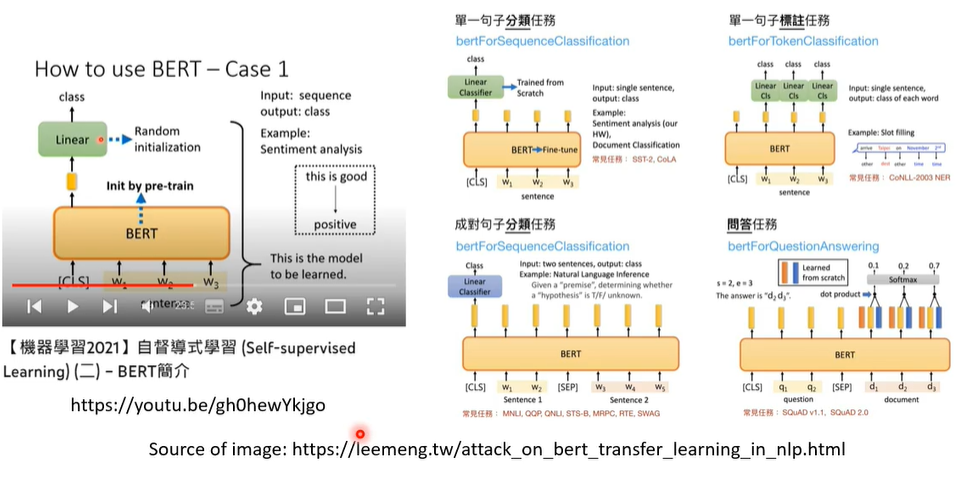
[ 【機器學習2021】自督導式學習 (Self-supervised Learning) (二) – BERT簡介](https://www.youtube.com/watch?v=gh0hewYkjgo)
https://leemeng.tw/attack_on_bert_transfer_learning_in_nlp.html


## Transformer

### [20分钟读懂AI神级论文《Attention Is All You Need》](https://www.bilibili.com/video/BV1dyW9zsEk1/)

#### Attention Is All You Need

如果要评选出人工智能领域最出名的一句话，十有八九会是 **“Attention Is All You Need”**。这句话来自 2017 年的一篇论文。

这篇论文发表之后，各家 AI 公司纷纷投入大量资源和技术。可以说，它是当今人工智能领域军备竞赛的导火索。

这篇论文不仅彻底改变了技术领域，还缔造了一系列令人震惊的财富传奇。论文发表之后，有一家创业公司敏锐地抓住了机会，借助论文中的理论迅速崛起。如今，这家公司的估值已经超过了 3000 亿美金，是这个世界上最炙手可热的公司之一。这家公司就是 **OpenAI**。

而这篇论文的八位作者，当时都在 **Google** 工作。后来他们纷纷从 Google 离职，其中七位选择了创业，而他们创立的公司估值普遍达到了数亿到数十亿美元。

#### RNN和LSTM的问题

在正式开始之前，我们有必要先了解一下，在 Transformer 出现之前的世界是什么样子的。

在 2010 年代中期，**循环神经网络（RNN）**以及它的变种 **LSTM**，几乎完全统治了自然语言处理领域。

然而，RNN 有两个非常棘手的问题。

**第一个问题**是：
RNN 的核心思想是通过记忆前一步的信息来预测下一步。这就意味着，每一步的计算都需要等待上一步完成。

这种顺序依赖的机制导致模型无法并行计算，很难充分利用现代计算机强大的并行处理能力。

**第二个问题**是：
RNN 的“记性不太好”。

当句子或文本长度稍微长一点的时候，模型就很难记住较早出现的信息。

比如一句话：

> 我今天买了一本书，上午去了趟图书馆，然后下午又去了咖啡厅，晚上才开始读它。

这里的“它”，指代的正是前面提到的“书”。

但由于中间隔了很多其他信息，传统的 RNN 往往很难精确地捕捉这种 **长距离依赖关系**。

尽管后来出现了 **LSTM** 等改进技术，但依旧没有彻底解决 **长距离依赖** 和 **并行计算** 这两个问题。

#### CNN的问题

[视频时间戳：](https://www.bilibili.com/video/BV1dyW9zsEk1?t=167.5)

同时期还有 **卷积神经网络（CNN）**。

RNN 比较擅长处理序列数据，就像一个逐字逐句读书的人，所以经常被用来处理语言和音频；

而 CNN 则擅长处理具有空间局部特征的数据，就像一个拿着放大镜仔细观察图片的人，所以经常被用来处理图像。

CNN 虽然能并行计算，但因为它的视野比较窄，也很难记住全局的信息。

#### 2014年提出的注意力机制

------

为了克服这些问题，2014 年，Dzmitry Bahdanau 等人提出了 **注意力机制（Attention）**。

注意力机制的核心思想是：

当模型处理信息时，它会学着为不同的信息分配 **注意力权重**。

这样模型就能够知道：

- 哪些信息是重要的，需要多关注；
- 哪些信息是不重要的，可以忽略。

换句话说，就是让模型也学会 **“划重点”**。

------

随后的几年里，注意力机制迅速流行起来。

但在那个时候，注意力机制只是 **RNN 或 CNN 的辅助工具**。

没有人认为注意力可以脱离 RNN 或 CNN 而独立存在。

为什么大家会这么想呢？

首先是 **思维惯性**：
处理序列任务就用 RNN，处理图像任务就用 CNN，这几乎是当时人工智能界的常识。

其次是 **人类的认知习惯**：
人们习惯逐字逐句地阅读，总觉得信息应该一步一步地传递。

而注意力机制需要同时处理文本中所有词之间的关系。

这种 **同时关注所有内容** 的思路非常反直觉。

更重要的是，它听起来计算量非常巨大，让很多人觉得根本不切实际。

这时模型就会对句子中的每个词，形成一个更加丰富的语义表示。

#### transformer模型架构图

[视频时间戳：](https://www.bilibili.com/video/BV1dyW9zsEk1?t=388.8)


#### 1 input Embedding输入嵌入

[视频时间戳：](https://www.bilibili.com/video/BV1dyW9zsEk1?t=401.2)


先看左边的 **Input**，也就是输入。当我们日常使用 AI 的时候，我们问 AI 的问题就是输入；而在训练 AI 的时候，我们提供给模型的语料数据，同样也是输入。

模型收到这些输入之后，首先要进行 **Input Embedding**，也就是输入嵌入。我们平时使用的自然语言，像中文或者英文，计算机是无法直接进行计算的。因此，我们需要将语言中的单词转化成数字向量，计算机才能理解和处理这些信息。


##### 语义向量空间

[视频时间戳：](https://www.bilibili.com/video/BV1dyW9zsEk1?t=432.8)


我们举个具体的例子。现在有些单词，我们把它排列在一个平面坐标系里面。这个坐标系有两个属性：横轴表示科技程度，纵轴表示生产力。

在真实的 Transformer 模型中，单词的含义远比二维平面更加复杂。它们通常会被映射到一个 **512 维的空间**里面。你可以简单理解为，每个词都有 512 个不同维度的特征。这些特征是模型通过学习大量语料后自动掌握的。

但 512 维空间对于人类来说，实在太过抽象了，我们的视频没法直接展示。所以这里采用二维空间来代替。在这个二维空间中，含义相似的单词会挨得很近，但含义相差很大的单词则会离得比较远。

虽然自然语言本身无法参与数学运算，但被映射成向量之后，我们就能很方便地进行向量运算了。

##### 意大利-墨索里尼 德国-希特勒

[视频时间戳：](https://www.bilibili.com/video/BV1dyW9zsEk1?t=477.2)


而意大利在这个位置，德国在这个位置，就会得到一个新的位置，离这个位置最近的词最可能的就是希特勒。

##### 教师-学校+医院则是医生

[视频时间戳：](https://www.bilibili.com/video/BV1dyW9zsEk1?t=500.7)

而教师-学校+医院则是医生


##### 意大利-墨索里尼 德国-希特勒向量夹角相同

[视频时间戳：](https://www.bilibili.com/video/BV1dyW9zsEk1?t=515.1)


比如意大利到莫斯里尼和德国到希特勒，这两个向量的方向几乎完全一样，也就是说他们的夹角非常小，就因为他们表达的语义关系非常的接近，都是在表达国家与领导人之间对应的关系。

##### 向量的夹角越小内积越大语义越相似

两个向量的夹角越小，它们的内积也就是点击就越大，代表这两个单词的语义越相似。而夹角越大，比如超过90度，甚至接近180度，它们的内积就越小，甚至为负。代表含义不同，甚至相反。


> 向量内积定义

向量内积是指两个向量的对应分量相乘后求和。对于两个向量 **a**=(a1,a2,…,an) 和 **b**=(b1,b2,…,bn)，其内积定义为：

**a**⋅**b**=a1b1+a2b2+…+anbn **a**⋅**b**=a1b1+a2b2+…+anbn

> 几何意义

**a**⋅**b**=∣a∣∣b∣cos(θ)

其中，|a| 和 |b| 分别是向量 **a** 和 **b** 的模（长度），θ 是它们之间的夹角。内积的值与两个向量的夹角有关，当两个向量正交（夹角为90度）时，内积为0；当两个向量方向相同（夹角为0度）时，内积达到最大值，即两个向量模的乘积。

cos x函数图:


##### 词向量是模型理解的单词的含义

[视频时间戳：](https://www.bilibili.com/video/BV1dyW9zsEk1?t=540.2)


我们再想象一下一个512维的空间，每种语言都有大概3万个单词，在这个空间里面，我们从坐标系的原点，向每个单词所在的点画一条箭头，这些箭头就是词向量，也就是模型所理解的单词的含义。


#### 2 positional encoding位置编码

[视频时间戳：](https://www.bilibili.com/video/BV1dyW9zsEk1?t=559.0)


第二步我们就来到了 **Positional Encoding**，也就是位置编码。Transformer 没有 RNN 的循环结构，它本身并不清楚单词在句子中的具体先后顺序。因此，我们需要给每个单词添加一个独特的编号，让模型知道单词之间的位置信息。

论文的作者们在这里画了一个类似阴阳的小图标，其实想表示 Transformer 使用正弦和余弦函数的组合，来生成每个单词的位置信息编码。

#### 3 Multi hate attention多头自注意力机制

[视频时间戳：](https://www.bilibili.com/video/BV1dyW9zsEk1?t=579.7)


我们就进入了 **Transformer** 最核心、也是最复杂的部分：**Multi-Head Attention**，也就是多头自注意力机制。这一部分是整篇论文的核心理念，也是最复杂的部分，我们拆开揉碎了来讲。

首先，我们注意到图上这里有三个箭头。为什么是三个箭头呢？原图中没有写。这三个箭头其实分别代表了三个非常重要的概念，就是 **Query、Key 和 Value**，简称 **QKV**。

##### 例子：K=我是谁的答案。 Q=我想知道什么？

[视频时间戳：](https://www.bilibili.com/video/BV1dyW9zsEk1?t=605.5)

每个人都要回答两个问题：**我的身份是什么？我想知道什么？**

第一个问题的答案，就是他的 **Key**；第二个问题的答案，就是他的 **Query（Q）**。


[视频时间戳：](https://www.bilibili.com/video/BV1dyW9zsEk1?t=634.6)


我们看一个例子：**我今天买了一本书，上午去了趟图书馆，然后下午又去咖啡厅，晚上才开始读它。**

这个句子中的“我”，它的身份是什么？它的身份是一个人称代词，是句子的主体，也就是这个单词的 **Key**。

而“我”这个词最关心的是什么呢？它想知道“我做了什么”“我去了哪里”，这就是他的**Q**。


[视频时间戳：](https://www.bilibili.com/video/BV1dyW9zsEk1?t=643.5)


每个小人都要这样计算出他的Q和K，比如说和他他们的Q和K分别是这样。


##### 如何得到Q与K？

[视频时间戳：](https://www.bilibili.com/video/BV1dyW9zsEk1?t=644.6)


这里可能就会有人问了：**Q 和 K 到底是怎么计算出来的呀？**

每个单词的 **Q 和 K**，都是由它们自己的 **Embedding 向量**，与模型在训练时学习到的参数矩阵相乘计算出来的。因为 Transformer 模型在训练的时候已经学习过大量的文本，所以它能够很好地捕捉每个单词的语义信息。

##### Q与K点积运算

[视频时间戳：](https://www.bilibili.com/video/BV1dyW9zsEk1?t=661.2)


接下来，每个单词的 **Q** 都要与句子中所有其他单词的 **K** 做一个点积运算。简单来说，就是拿每个单词自己的 **Q** 去和其他单词的 **K** 进行匹配，看看谁更合适。


[视频时间戳：](https://www.bilibili.com/video/BV1dyW9zsEk1?t=674.1)


比如说，它的 **Q** 是想知道自己代表的是什么东西。那我们拿它的 **Q** 去碰一碰“我”这个字的 **Key**，就会发现：“我”是一个人称代词，不是东西啊，不是它要找的，所以匹配不上。

因此，对于“它”这个字来说，就没有必要关注“我”这个字。


[视频时间戳：](https://www.bilibili.com/video/BV1dyW9zsEk1?t=693.6)


但是，当它的 **Q** 碰到了“书”的 **K** 的时候，情况就不一样了。“书”的 **K** 告诉我们：我是一个名词，是一种能够被买、被读的物品。那正好和“它”这个字的 **Q** 高度匹配。

因此，“书”这个词对于“它”来说，就格外值得投入注意力去关注。

##### V=单词的具体含义

[视频时间戳：](https://www.bilibili.com/video/BV1dyW9zsEk1?t=715.6)


然后，它再去查看这个单词的 **V**。**V** 也可以理解成这个单词的具体含义，或者说客观的信息。不过需要注意的是，这里的 **V** 并不是单词最初的向量，而是经过模型再次计算出来的一个新的向量。


[视频时间戳：](https://www.bilibili.com/video/BV1dyW9zsEk1?t=722.5)


比如说，“书”这个单词可能有很多不同的含义。因为模型在训练的时候学过大量的语料，它就会发现，在绝大多数情况下，“书”表示的是成册的著作，而不是“尚书”这样的含义。因此，“书”的 **V 向量** 会主要表示“成册的著作”这个含义，而以较低的概率表示其他的含义。

##### Q与K互相匹配找出与Q最相似的K

[视频时间戳：](https://www.bilibili.com/video/BV1dyW9zsEk1?t=739.6)


于是，具体发生的过程就是：这个单词通过自己的 **Q** 和句子中的每一个 **K** 做匹配之后，发现自己和“书”这个词高度相关，于是就进一步查看了“书”的 **V**。


接下来它的向量就会朝着成册的著作，这个含义产生一定的偏移，经过这种偏移之后呢。

它：成册的著作

它这个单词，这个向量中也就带上了“成册的著作”，这一个信息，最终呢模型就理解了它在这句话中，具体的指代是什么。


上面举的例子都是为了让大家更直观地理解注意力机制的工作原理。在实际的 **Transformer** 模型中，**Q、K、V** 都不是具体的自然语言，而是 **512 维空间中的数学向量**。这个过程也都是通过向量的数学计算来完成的。

因此，这三个箭头的意思就是 **Q、K、V**。


[视频时间戳：](https://www.bilibili.com/video/BV1dyW9zsEk1?t=782.4)


在transformer自注意力机制中呢，句子里面的每一个单词，都会对其他的单词分配不同的注意力权重。

##### 注意力权重的不同大小产生的向量偏移造就语义理解

[视频时间戳：](https://www.bilibili.com/video/BV1dyW9zsEk1?t=787.8)


然后呢根据注意力权重的大小，产生不同程度的向量偏移，而正是这些偏移让AI形成了对语义的深层理解，这就是transformer中最核心的attention，也就是注意力机制。

##### 多头注意力

[视频时间戳：](https://www.bilibili.com/video/BV1dyW9zsEk1?t=805.4)


为什么叫做 **Multi-Head Attention**，也就是多头注意力呢？这个“多头”又是什么意思呢？

所谓多头注意力，就是**同时并行地做多次自注意力计算**。每一次自注意力计算都被称作一个“头”。每个头都使用一组独立的参数矩阵。

简单来说，就是使用**多个不同的视角**来观察输入的句子。


[视频时间戳：](https://www.bilibili.com/video/BV1dyW9zsEk1?t=818.4)


比如说，有一个头可能更关注句子的 **语法结构**。这个头的注意力计算就会更多地判断每一个词究竟是名词还是动词，词和词在语法上是什么关系。

有的时候，可能特别关注 **代词**，才能清楚每一个代词究竟指代的是谁。

还有的头可能更关注单词的 **情绪色彩**，它想分辨哪些词带着积极乐观的情绪，哪些词的含义是负面或者消极的。

在论文中，这个多头一共有八个。我们刚才说的语法结构、代词、情绪色彩，这些例子都是为了方便大家直观理解。事实上，模型并不会告诉每个头具体应该关注什么，而它们完全是通过数学方法自动发现和学习的。模型会自动从大量数据中发现最适合的八种关注方式。

##### 512维单词向量

[视频时间戳：](https://www.bilibili.com/video/BV1dyW9zsEk1?t=863.2)


每个单词最初都是用 **512 维的向量**表示的。但因为每个头只需要关注一个特定的方面，因此每个头并不需要处理完整的 512 维信息。512/8=64

[视频时间戳：](https://www.bilibili.com/video/BV1dyW9zsEk1?t=877.1)


在实际实现中，每个头只需要处理 **64 维的信息**。也就是说，对于每个输入句子，加上八个头，它们会各自独立地进行注意力计算，每个头产生一个 **64 维的结果**。

[视频时间戳：](https://www.bilibili.com/video/BV1dyW9zsEk1?t=886.3)


最后，再把这八个 **64 维的结果拼接到一起**，8 × 64 = 512，就再次回到原始 **512 维的向量大小**。

通过这种多头机制，**Transformer** 就能够同时从不同角度理解和处理语言信息，这也大幅度提升了模型的表达能力和效果。

到这里，最难的 **多头注意力** 终于讲清楚了。

#### 4 Add & Norm 残差连接和层归一化

[视频时间戳：](https://www.bilibili.com/video/BV1dyW9zsEk1?t=903.0)


完成多头注意力之后，还需要进行Add & Norm，就是残差连接和层归一化。


[视频时间戳：](https://www.bilibili.com/video/BV1dyW9zsEk1?t=908.8)


前面的多头注意力可以理解成模型为了每一个单词计算出来一个 **偏移量**。这个偏移量表示单词在结合上下文之后，需要进行的调整。


[视频时间戳：](https://www.bilibili.com/video/BV1dyW9zsEk1?t=920.5)


#### Decoder 的作用

接下来，这些表示会被传递到右侧的 **Decoder（解码器）**部分。

Decoder 的作用非常简单：**逐字生成输出**。

比如在翻译任务中，如果我们要把“我爱你”翻译成英文，模型会一步一步地产生输出：

1. 先预测第一个词
2. 再预测第二个词
3. 再预测第三个词

也就是：

```
I → love → you
```

------

#### Decoder 的输入

在 Decoder 的最底部，有一个 **Output Embedding**。

这一步和左侧 Encoder 的 Input Embedding 类似：

模型需要把已经生成的词，重新转换成向量形式，然后再进行后续计算。

同时，这里也需要加入 **位置编码（Positional Encoding）**，让模型知道每个词在句子中的位置。

------

#### Masked Self-Attention

接下来就进入 Decoder 中最重要的部分之一：

**Masked Multi-Head Attention（带遮罩的多头注意力）**

为什么要加 **Mask（遮罩）**？

因为在生成句子的时候，模型 **不能偷看未来的词**。

举个例子：

当模型已经生成：

```
I love
```

它在预测第三个词的时候，必须只依赖前面两个词，而不能看到答案 “you”。

因此，Transformer 会在注意力矩阵中 **遮住未来位置的信息**，保证生成过程是严格按照时间顺序进行的。

------

#### Encoder-Decoder Attention

接下来是 Decoder 中的第二个注意力模块：

**Encoder-Decoder Attention**

这一层的作用是：

让 Decoder 在生成词的时候，可以 **参考输入句子的信息**。

比如翻译任务：

输入句子：

```
我 爱 你
```

当模型在生成 “love” 的时候，它可能会特别关注输入中的 **“爱”**。

而当模型在生成 “you” 的时候，它会更关注输入中的 **“你”**。

也就是说：

Decoder 的 Query 会去匹配 Encoder 输出中的 Key，找到最相关的词，然后读取对应的 Value 信息。

------

#### 前馈网络（Feed Forward）

在完成注意力计算之后，数据还会经过一个 **前馈神经网络（Feed Forward Network）**。

这一层的结构非常简单：

```
512维 → 2048维 → ReLU → 512维
```

也就是：

1. 先升维
2. 再进行非线性变换
3. 最后再降回原来的维度

这样做的目的，是 **增强模型的表达能力**。

------

#### Add & Norm

和 Encoder 一样，Decoder 中每一层也都会有：

- **残差连接（Residual Connection）**
- **Layer Normalization（层归一化）**

残差连接的作用是：

```
输出 = 原始输入 + 新计算的信息
```

这样可以避免深层网络训练时出现 **梯度消失问题**。

而 Layer Normalization 则可以让数据分布更加稳定，使模型训练更加容易收敛。

------

#### 多层堆叠

和 Encoder 一样，Decoder 也不是只有一层。

在原始论文中：

```
Encoder：6 层
Decoder：6 层
```

它们的结构是 **完全堆叠的**：

```
Encoder × 6
Decoder × 6
```

每一层都会逐渐提炼和强化句子的语义信息。

------

#### 最后的输出层

当 Decoder 完成所有计算之后，最后会经过一个 **线性层（Linear Layer）+ Softmax**。

Softmax 的作用是：

把模型输出的向量，转换成 **词表中每个词的概率**。

例如：

```
I   : 0.02
love: 0.85
like: 0.10
hate: 0.01
```

模型就会选择概率最大的词：

```
love
```

然后继续生成下一个词。

------

#### Transformer 的关键突破

总结一下，Transformer 相比之前的模型，最大的突破有三个：

##### 1 并行计算

RNN 必须一步一步计算：

```
word1 → word2 → word3 → word4
```

而 Transformer 可以 **同时处理所有词**：

```
[word1 word2 word3 word4]
```

这使得训练速度大幅提高。

------

##### 2 长距离依赖

在 RNN 中，如果两个词距离很远，信息传递会非常困难。

而在 Transformer 中：

**任何两个词之间的距离都是 1。**

因为每个词都可以直接和所有词计算注意力。

------

##### 3 更强的表达能力

通过 **多头注意力（Multi-Head Attention）**，模型可以从多个不同角度理解语言，比如：

- 语法关系
- 语义关系
- 情感倾向
- 指代关系

------

#### Transformer 的历史意义

2017 年这篇论文：

**Attention Is All You Need**

几乎成为了现代 AI 的起点。

今天所有主流大模型几乎都建立在 Transformer 架构之上，例如：

- **OpenAI** 的 GPT 系列
- **Google** 的 BERT
- **Meta** 的 LLaMA

可以说，Transformer 已经成为 **现代人工智能的基础设施**。

------

如果你愿意，我可以再给你补充 **一个真正的数学计算例子**：

我可以 **用具体数字一步一步算出 Attention(Q,K,V)**，比如：

```
QKᵀ / √d
→ softmax
→ 加权 V
```

整个计算过程 **只用初中数学就能看懂**。
看完基本就真的懂 Transformer 了。

#### 评论

##### 人的思维是可以数学定义的

大杉警部補

最有趣的点是，他用数学方法量化定义了“理解”，或者说，人的思维是可以数学定义的，这是很恐怖的事，说明人的思维可以运算。比如人的理解就有深浅之分，受智商、阅历、情境限制，而机器理解的深浅受算力、训练量、效率要求限制。如果他的方向是对的，那他相当于成功解构了人的思维模型，对脑科学、心理学研究都是革命性的
2025-11-21 13:04 👍93

大杉警部補

 多说一嘴，对于最近热点的agentic ai，都是拿llm当中枢进行决策，其实我一开始就很怀疑llm能不能当大脑，这相当于broca区代理了整个大脑功能，我隐隐觉得思维和语言不能简单划等号。最近仔细了解了一下，其实transformer-llm这条路径不一定是对的，但是是最容易scale up出成绩的，多模态拿llm当中枢再把CV等模块插上去也更像是最可行的路径而不是最正确的路径....我还是站lecun、李飞飞的世界模型
2025-11-27 11:45 👍25

大杉警部補

 回复 @澄枝不是本人 :就这几周，业界又对llm已基本宣判死刑了，连transformer作者自己都说迫不及待想要取代这个模型...这波泡沫不过是产业中急功近利者营造的假象，明年泡沫破裂可能会掀起大浪，openai很可能会坠落
2025-12-16 22:20 👍1

##### 位置编码

人菜瘾大大的

我发现在跟deepseek对话的时候，不用在乎你这句话词语的顺序是不是对，只要把你要表达的关键词语说到位，ai 就能理解。因为这些词语在语库里面天然有它们的关系。比如苹果和香蕉就是一类东西，它们要么被种植、要么被吃，就那些关系。一个人物和一个建筑也就那些关系，要么是住在，要么是搭建。归根结底，人只要学习那些词语就行了， 其他一切的表达就是词语的不同组合。
2025-11-30 18:44 👍18

________easy

 有位置编码的啊，前后顺序肯定有影响啊
2025-12-22 11:17

##### Transformer的时序预测其实是在分类

James_Yu_83

Transformer的时序预测其实是在分类
2026-02-08 10:53

##### 这篇才17年的文章

月下吃茶

讲道理，读懂这篇，才刚刚起步吧…… 这都17年的文章了，bro～
2025-12-30 23:31 👍5

##### 论文的三作就获得诺物理

陈丙礼

 拿到了，这篇论文的三作就获得诺物理了
2025-11-03 11:03 👍70

##### 每次词都要互相计算，互相查找造成context size有限

昨日重现001

我没理解，如果每次词都要互相计算，互相查找，那么计算量和token数量的关系不就是指数级上升？那token一多计算量不就直接失控了？
2025-10-24 21:55 👍6

白灵淼_office

 其实只是简单的向量计算，而且有预训练这个机制，很多模型都会带有预训练的embedding，词与词的关系已经有一定计算了
2025-10-27 00:49 👍6

拍拍你的拍拍

 是这样的，所以大模型上下文长度提升需要的算力资源很大
2025-10-27 13:52 👍10

##### Transformer并行多头计算

TourToForget

 当然，会造成较高的计算量，有一些上面已经说了，可以通过预训练之后的微调来降低算力，另外提一点比较反直觉的是，计算量大≠计算慢，因为有并行计算这一技术，通过各个层面的并行计算，可以使得Transformer相比RNN等串行结构计算量更大，反而计算更快。因为后者是串行的，后词的计算需要依赖前词的结果，反而会更慢。这也正是Transformer架构伟大之处之一：有效利用计算架构的并行能力，不浪费计算周期
2025-11-12 19:34 👍2

SensmD断陌

 并行多头注意力机制，你说的这个爆炸 rnn 处理不了，所以 transformer 有效改善了
2025-11-13 01:27

##### 小训练集RNN很吃香

绯依桑

我是个外行，那自注意力机制在各方面取代RNN了吗？换句话说，RNN目前被淘汰了吗？
2025-10-25 20:50 👍16

ZAKU-III

 没有啊，小训练集RNN跟吃香的
2025-10-25 23:03 👍13

Yi梦丶

 如果你把LSTM归类到rnn，那还没有淘汰。
2025-10-26 00:32 👍7

##### 因为8卡训练所以8头

卢森堡的猫咪

为何是8个头
2025-10-24 00:36 👍1

霄鳴

 因为他们用了八张卡正好分配
2025-10-24 17:56 👍1

霄鳴

 回复 @爱玩悠悠球-汉阳版 :就像cnn里的多卡一样，需要汇总运算的时候做一个数据传递，因为当时用的显卡显存不够，必须拆开模型到不同卡上
2025-10-25 12:41


### [tiktok面试题：手写Transformer](https://www.bilibili.com/video/BV144421S7Wg/)

### [【带读AI经典论文|100篇】世界顶级大佬带你逐句阅读最重要的100篇AI论文](https://www.bilibili.com/video/BV1tU4y147Ah/)

