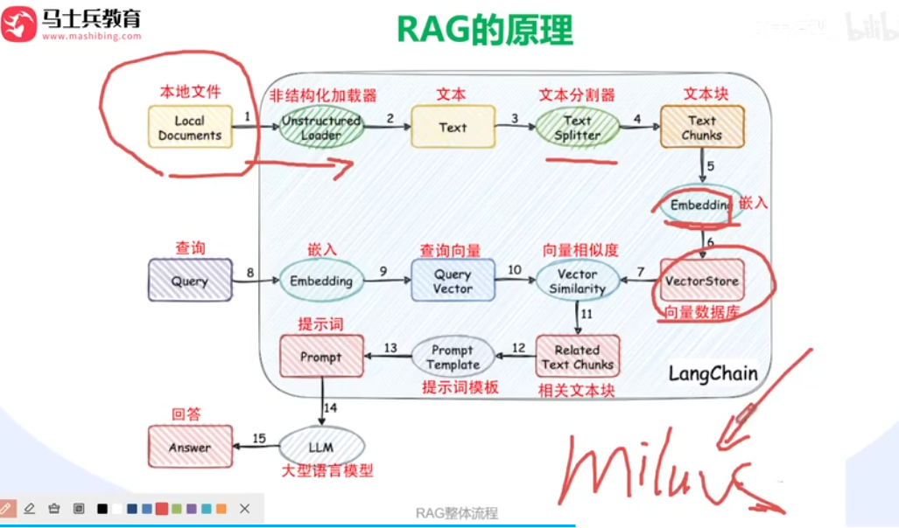
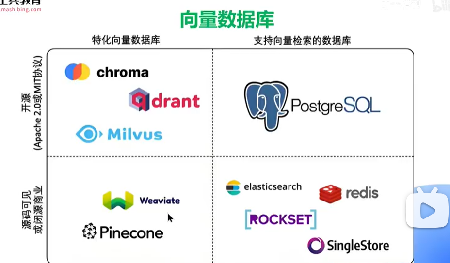
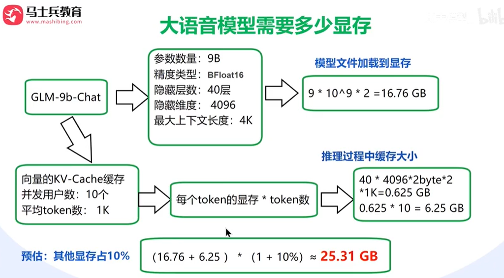

## 花了24980买的AI大模型零基础入门全套教程，2025最新版，七天刷完入门应用开发工程师！

[课程大纲](https://www.processon.com/view/link/677f8c5638625f07c0fd0cc3)

AI大模型学习路线：https://cloud.fynote.com/share/d/NmqTUOAH     

Langchain链接: https://pan.baidu.com/s/10qLqAVvZqtun-CEjIXgriA?pwd=vwn1 提取码: vwn1

国产大模型ChatGLM深度实战配套资料链接: https://pan.baidu.com/s/1BBW6wNiGJIL5C4ZgnGMksg?pwd=yhrb 提取码: yhrb

deepseek公开课笔记+代码链接: https://pan.baidu.com/s/1F_SAc5Bg0-vxmkkSGxo9Yg?pwd=agkg 提取码: agkg 

AI大模型1链接: https://pan.baidu.com/s/1R6y15ymrIcGsCVjBqTs9-g?pwd=24n6 提取码: 24n6

AI大模型2链接: https://pan.baidu.com/s/1W36IPKyRXbYfpHTlXe_Lng 提取码: xdvd

### [3.RAG原理深度解析](https://www.bilibili.com/video/BV1XVdLYyEL1?p=3)

### [4.大模型微调到底是什么？](https://www.bilibili.com/video/BV1XVdLYyEL1?p=4)

说微调老师是不是原来我有一个大模型，我把模型里面的一个1.2的参数，把它改成1.5啊，那这个是不是叫微调，不是的啊，微调了是重新训练。

### [5.实战：部署私有化大模型](https://www.bilibili.com/video/BV1XVdLYyEL1?p=5)

**核心参数**

1. **模型参数**
   - 参数规模：**9B（90亿）**
   - 显存占用：
     - 采用**BFloat16精度**（每参数占2字节）
     - 计算：`9×10⁹ × 2字节 = 16.76GB`
2. **推理缓存（KV-Cache）**
   - 隐藏层数：**40层**
   - 隐藏维度：**4096**
   - 缓存计算：
     - 每层需保存**K/V向量**（各占2字节），公式：
       `40层 × 4096维度 × 2字节（BFloat16单向量） × 2（K+V） = 0.625GB/用户`
   - 并发用户数：**10个**，平均每个用户处理**1K token**（1024）
     - 总缓存：`0.625GB × 10用户 × 1K token ≈ 6.25GB`
3. **其他显存占用**
   - 预估额外开销（如中间结果、框架开销等）：**10%**

------

**总显存需求**

- **模型加载 + 推理缓存**：`16.76GB + 6.25GB = 23.01GB`
- **含额外开销**：`23.01GB × 1.1 ≈ 25.31GB`

------

**关键结论**

- **BFloat16精度**显著降低显存占用（相比FP32节省50%显存）。
- **KV-Cache**对显存影响较大，并发用户数和高上下文长度（如4K）会指数级增加需求。
- 实际部署需预留额外显存（如框架优化、突发请求等）。

#### autoDL最便宜

4090 每小时￥2，开机才收钱。

#### [deepseek加载代码](https://www.bilibili.com/video/BV1XVdLYyEL1?t=779.3&p=5)

text = ["请帮写一个Python的归并排序案例<think>\n", ]  # 可用 List 同时传入多个 prompt。根据 DeepSeek 官方的建议，每个 prompt 都需要以 <think>\n 结尾，如果是数学推理内容，建议包含（中英文皆可）：Please reason step by step, and put your final answer within \boxed()。

### [6.AI大模型学习路线是什么样的？](https://www.bilibili.com/video/BV1XVdLYyEL1?p=6)

ollama是用可视化部署啊，可视化部署它是没办法做定制化的，你没办法做修改的，知道吧。那我们使用这种是可以，我们未来在企业中去做部署的时候，你要肯定要修改啊，对啊，比如说我我我都要发布的服务，我比比如说我必须加上公司的logo对吧，我再加上公司的提示词，我再加上公司的各种各样的标志对吧，那这个你都要去做修改啊，好吧，那欧拉玛不方便这个修改。

**AI大模型全链路实战五大模块**

1. **AI大模型底层算法** 重要
2. **AI大模型应用开发**
3. **RAG和Agent应用开发** 重要
4. **LQRA微调和模型私有化部署** 重要
5. **AI大模型6大项目实战**

你去面试这个AI大模型的应用开发岗位，他往往也需要问你一点点的线性线性回归呀，或者神经网络的一些简单的问题的好吧。你不需要像传统的AI程序员一样，要会很多的算法，不需要，你要只需要会跟AI大模型有关的那些算法就可以了啊。好然后当然还有A级的开发啊，RG的开发啊，还有微调啊。

企业里马上有大模型的项目优先学**RAG和Agent应用开发** 、**LQRA微调和模型私有化部署**，算法先放到一边。