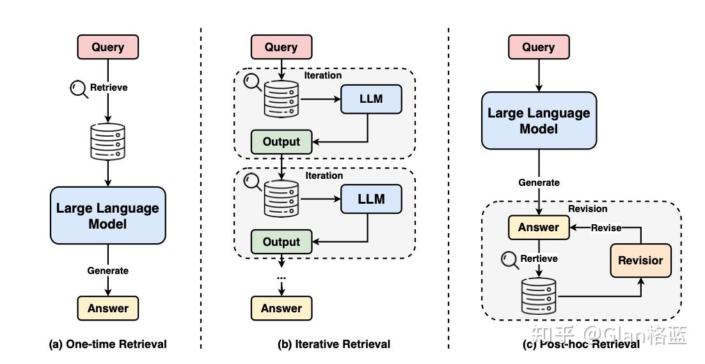
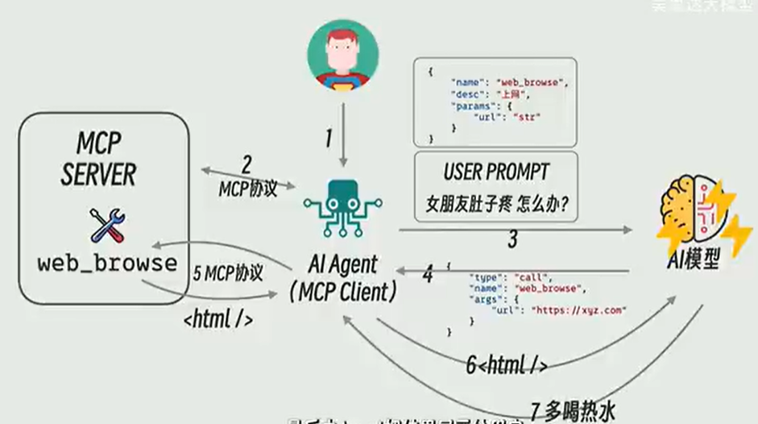
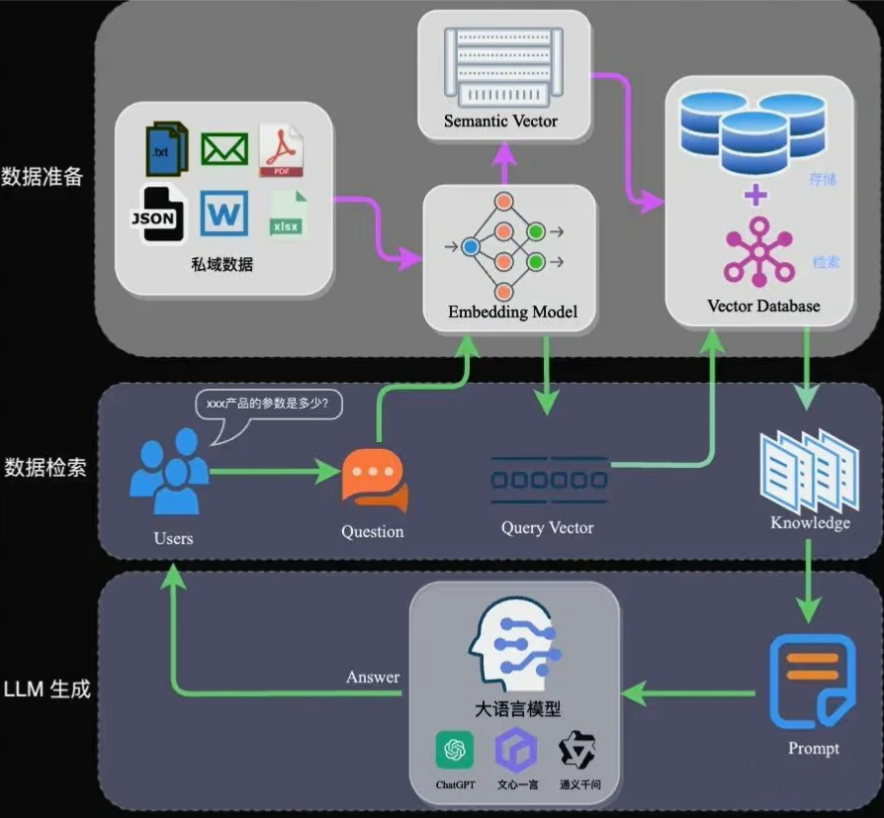

## [为什么你的Agent总翻车？Harness Engineering全拆解：Anthropic、OpenAI、DeepMind都在押注的Agent Runtime](https://www.bilibili.com/video/BV1VBX9BrEon/)

2026-03-29 23:09:05

 本期内容：                                                             
 - Harness Engineering 是什么？马具隐喻与技术定义        
 - Prompt → Context → Harness 三层演进关系                                              
 - 为什么在 2025 底-2026 初集中爆发
 - Anthropic 三 Agent 架构与生成-评估分离实践                                            
 - OpenAI 7 人团队百万行代码背后的三大支柱                                              
 - Google DeepMind Aletheia 的 Generator-Verifier-Reviser 循环
 - Vercel「砍掉 80% 工具反而更好」的反直觉经验                                            
 - 六大核心模块归纳 + 风险与争议  

更多前沿AI课程与学习资源请关注：
🌐 官方网站：TGLTommy.com(访问需科学上网)
📺 B站/公众号/YouTube：唐国梁Tommy


## [浅谈上下文工程｜从 Claude Code 、Manus 和 Kiro 看提示工程到上下文工程的转变](https://zhuanlan.zhihu.com/p/1968696669328635186)

发布于 2025-11-12 12:05・浙江


### 今天我们将探讨的问题：

为什么需要上下文工程？
为什么 Claude Code 效果这么好？
Manus 在优化 Agent 上做了哪些尝试？
为什么 Spec Driven + Context Engineering 会代替 Vibe Coding + Prompt Engineering？


### 业界工程实践概览

在上下文工程领域，有三个产品代表了不同的实践方向：

1.LangChain：代表 Agent 框架和工具集合，早期的 Agent 框架，提供了各种Agent开发的基础设施，提出了一套上下文管理的方法论。

2.Claude Code：代表 Code Agent 能力上限，编码 Agent 的能力标杆，在长短记忆、分层多 Agent 协作等方面有独到实践。

3.Manus：重新展现 Agent 能力，让 Agent 回到大众视野，带动 MCP 发展，在工具使用、缓存设计等方面有独到实践。

### 上下文长度的增加，模型对关键信息的关注度下降

随着上下文长度的增加，模型的注意力机制可能会出现"腐蚀"现象，导致对关键信息的关注度下降。


#### 问题表现

产生幻觉后，会被持续带偏。
模糊性导致信息冲突，模型的行为会变得不可预测。
关键信息被稀释，随着上下文的增长，模型的注意力会被分散。
大量重复文本导致的"行动瘫痪"。


#### 影响因素

上下文长度超过训练时的常见长度。
模型能力的限制。
信息密度不均匀分布。
自然语言的模糊性。

### 写入（Offload）上下文

#### 解决方案

#### 上下文工程方法论：

为了解决长上下文带来的问题，业界提出了系统性的上下文工程方法论：

Offload：通过引用减少上下文长度。
Retrieve：RAG 技术动态检索相关信息。
Reduce：压缩裁剪冗余信息。
Isolate：分而治之，通过SubAgent处理子任务。


将信息保存在上下文窗口之外，以帮助 Agent 完成任务。不要将工具返回的全部原始信息都直接喂给 LLM。相反，应将其"卸载"到外部存储（如文件系统、数据库或一个专门的代理状态对象中），然后只将一个轻量级的"指针"返回给模型。


#### 核心组件包括：

File System - 文件系统
Memories - 长期记忆系统(zep, mem0)
DataBase - 数据库存储

#### 应用场景：

长期记忆构建-claude
任务计划保存-manus
用户偏好记录
知识库管理


### 选择（Retrieve）上下文

简单来说就是我们所熟悉的 RAG，通过检索和过滤相关信息，来控制进入 Context 的内容的数量和质量。

#### 核心组件：

- 更高级的检索（agentic search）- 从向量检索出发，逐渐往更复杂的搜索体系演化。例如混合召回，结合图谱的 GraphRAG，rerank 等等。
- 返璞归真的文本检索 - 仅仅使用 llms.txt + grep/find 之类的工具，通过 agent 的多轮工具调用来获取相关信息。这也是 Claude Code 的实现方式。

#### 应用场景：

- 代码索引：DeepWiki
- todolist 召回
- 过多工具的召回 langgraph-bigtool（Manus 不推荐，可能导致缓存失效）
- 知识库


### 压缩（Compress）上下文

通过各种手段来裁剪上下文的内容，只保留完成任务所需的 tokens。


#### 核心组件：

- 摘要生成 - 提取核心信息。
- Rerank - 移除不太相关的信息，RAG 场景中常用。
- 语义总结、压缩 - 保持含义精简表达。如果总结得不好，一样会出现关键信息丢失，甚至引入幻觉等问题。

#### 应用场景：

- 网络搜索
- RAG
- 大量工具使用
- 多轮聊天


### 隔离（Isolate）上下文

非常类似 Workflow 时代的"分而治之"思想，如果一个任务的 context 压力太过巨大，我们就拆分一下，分配给不同的 sub agents 来完成各个子任务。这样每个 agent 的 context 内容都是独立的，会更加清晰和聚焦。


#### 核心组件：

- 环境隔离 - 环境/沙盒隔离，让部分内容在 LLM 环境外运行，如代码执行场景，非常类似"卸载"。
- 多 Agent 分离 - 不同角色独立上下文，容易产生冲突的工作尤其要注意。"只读"类的工作最合适。

#### 应用场景：

- 智能体中涉及代码执行或数据分析。
- 智能体工具调用。
- 复杂的多智能体系统如 Manus。


### **Claude Code的工程实践**

Claude Code 作为编码 Agent 的标杆，在上下文工程方面有很多独到的实践：

- 三层记忆架构：实现从实时访问到持久化存储的完整覆盖。
- 实时 Steering 机制：流式输出提供持续交互反馈。
- 分层多 Agent 协作：主 Agent 协调 + SubAgent 执行的分层架构。
- 动态上下文注入：自动识别和注入相关文件内容。

#### 三层记忆架构

在长对话中，上下文管理面临 Token 限制导致信息丢失、传统压缩方法破坏上下文连续性、无法支持复杂多轮协作任务等挑战。

Claude Code 的解决方案是构建三层记忆系统：

- 短期记忆（当前对话）
- 中期记忆（智能压缩）
- 长期记忆（CLAUDE.md 项目知识库）

实现从实时访问到持久化存储的完整覆盖。

关键要点：

- 92% 阈值自动触发智能压缩
- 8 段式结构化保存核心信息
- 跨会话恢复项目背景和用户偏好


### 实时 Steering 机制

传统 Agent 无法中断，用户必须等待完整执行结束才能调整方向，导致资源浪费和用户体验差，无法应对动态变化的需求。

Claude Code 的解决方案是采用异步消息队列 + 主循环的双引擎设计，支持实时中断和恢复，用户可以随时调整任务方向，系统自动保存状态并无缝切换。

关键要点：

- 异步消息队列支持实时中断。
- 主循环自适应流程控制。
- 流式输出提供持续交互反馈。


### 分层多 Agent 协作

复杂任务需要并发处理多个子任务，单 Agent 模式容易出现上下文污染、资源竞争和故障传播，影响整体执行效率和稳定性。

Claude Code 的解决方案是采用主 Agent 负责任务协调，SubAgent 执行专项任务，实现隔离执行环境，调度器控制最多 10 个工具并发，确保任务隔离和资源优化。

关键要点：

- 主 Agent 协调 + SubAgent 执行的分层架构。
- 独立执行环境避免上下文污染。
- 智能调度器实现 10 工具并发控制。


### 动态上下文注入

用户在对话中提及文件或概念时，系统无法自动关联相关信息，导致模型缺乏必要的上下文背景，影响响应质量和准确性。

Claude Code 的解决方案是智能检测用户意图中的文件引用，自动读取相关内容并注入上下文，基于依赖关系推荐相关文件，提供语法高亮和格式化显示，最大20文件8K Token限制。

关键要点：

- 自动识别和注入相关文件内容。
- 智能推荐基于依赖关系分析。
- 容量控制和格式优化提升体验。


### **Manus的优化实践**

Manus 在上下文工程方面有诸多独特的优化实践：

- KV 缓存优化：围绕 KV 缓存设计，大幅降低成本和延迟。
- 工具遮蔽：遮蔽而非移除工具，保持上下文稳定性。
- 文件系统记忆：使用文件系统作为终极上下文。
- 注意力操控：通过复述操控注意力，保持目标一致。
- 错误保留：保留错误内容，让模型从失败中学习。
- 多样性增强：避免少样本示例陷阱，增加结构化变化。

### 围绕 KV 缓存进行设计

随着每一步的推进，上下文不断增长，而输出保持相对简短。这使得 Agent 相比聊天机器人的预填充和解码比例高度倾斜。在 Manus 中，平均输入与输出的 token 比例约为 100:1。

具有相同前缀的上下文可以利用 KV 缓存，大大减少首个 token 生成的时间和推理成本。使用 Claude Sonnet 时，输入 token 缓存 0.3 美元/百万 token，未缓存 3 美元/百万 token，十倍成本差异！

关键要点：

- 保持前缀稳定，时间戳会使 KV 缓存失效。
- 使上下文只追加，确保你的 JSON 序列化是确定性的，键顺序不稳定会破坏缓存。
- 在需要时明确标记缓存断点，不支持自动增量前缀缓存模型或推理框架需要在上下文中手动插入缓存断点。


### 遮蔽，而非移除工具

工具数量爆炸式增长，模型更可能选择错误的行动或采取低效的路径，但是要避免在迭代过程中动态添加或移除工具：

- 动态更改会导致 KV 缓存失效。
- 模型会对不再定义的工具感到困惑。

Manus 的解决方案是使用上下文感知的状态机来管理工具可用性，在解码过程中掩蔽 token 的 logits，基于当前上下文阻止或强制选择某些工具。

关键要点：

- 在实践中，大多数模型提供商和推理框架都支持某种形式的响应预填充（response prefill），这允许你在不修改工具定义的情况下约束动作空间。


### 使用文件系统作为上下文

#### 当前上下文窗口限制带来三个常见的痛点：

- 观察结果可能非常庞大，容易超出上下文限制。
- 超过一定的上下文长度后，模型性能往往会下降。
- 即使使用 KV 缓存，长输入成本依然高昂。

为了解决这个问题，Manus 将文件系统视为终极上下文：大小不受限制，天然持久化，并且 Agent 可以直接操作。模型学会按需写入和读取文件——不仅将文件系统用作存储，还用作结构化的外部记忆。

#### 关键要点：

- 只要保留 URL，网页内容就可以从上下文中移除；如果沙盒中仍然保留文档路径，则可以省略文档内容。这使得 Manus 能够缩短上下文长度，而不会永久丢失信息。


#### 通过复述操控注意力

Manus 中的一个典型任务平均需要大约 50 次工具调用。这是一个很长的循环——由于 Manus 依赖 LLM 进行决策，它很容易偏离主题或忘记早期目标，尤其是在长上下文或复杂任务中。

Manus 的解决方案是通过不断重写待办事项列表，将目标复述到上下文的末尾。这将全局计划推入模型的近期注意力范围内，避免了"丢失在中间"的问题。

#### 关键要点：

- 避免"丢失在中间"问题
- 保持目标一致性
- 提升长任务执行能力
- 无需架构变更


#### 保留错误的内容

在多步骤任务中，失败不是例外；它是循环的一部分。然而，一个常见的冲动是隐藏这些错误，这是有代价的：擦除失败会移除证据。没有证据，模型就无法适应。

Manus 的解决方案是将错误的尝试保留在上下文中。当模型看到一个失败的行动——以及由此产生的观察结果或堆栈跟踪——它会隐式地更新其内部信念。这会改变其先验，降低重复相同错误的可能性。

#### 关键要点：

- 模型从错误中学习
- 降低重复错误概率
- 提供负面样本训练
- 增强适应能力


### 不要被少样本示例所困

Few-Shot 是提高 LLM 输出的常用技术。但在 Agent 系统中，它可能会以微妙的方式适得其反。LLM 倾向于模仿上下文中的行为模式，容易导致偏离、过度泛化，或产生幻觉。

解决方法是增加多样性。Manus 在行动和观察中引入少量的结构化变化——不同的序列化模板、替代性措辞、顺序或格式上的微小噪音。

关键要点：

- 不同的序列化模板
- 替代性措辞表达
- 顺序上的微小变化
- 格式上的受控噪音


### Spec-Driven的理念

#### requirement.md

定义了软件使用的 Story，这些 Story 定义遵循一种叫做 EARS (Easy Approach to Requirements Syntax) 的格式： WHEN [condition/event] THE SYSTEM SHALL [expected behavior] 由 LLM 根据需求生成。可以二次确认和修改。

#### design.md

详细列举设计的各种技术细节：

- 架构设计与模块拆分
- 接口与流程
- 数据库表结构
- 前端实现

#### tasks.md

- 把开发过程分解成任务。
- 每一个任务都被定义成一个 TODO List。
- 可以点击一个按钮启动一个 Task 的开发过程。
- 实时更新、回溯状态。


## [在9个月内构建150多个AI代理：26条被迫学到的关键要点](https://www.bilibili.com/video/BV1QCQqYfEEt/)

### AI代理既不是自动化流程，也不是员工，而更像一个被严格定义的SOP执行体

在过去九个月里，我们基于新的代理服务模式开发了一百五十多个AI代理。第一个被反复验证、却最容易被误解的事实是：AI代理不是自动化，也不是你的员工。自动化的每一步都是硬编码的，顺序和逻辑完全确定；而代理并不具备这种刚性。与此同时，代理也不是员工，它们的自主性远低于人类员工。员工可以掌握多个标准作业流程（SOP），而一个代理通常只能可靠地执行一个SOP。代理无法通过阅读你的SOP再通过试错自行学习流程，目前还做不到。因此，与其用“角色”来理解代理，不如把代理视为一个被固化的标准作业程序本身。

### 从已经被文档化的SOP入手，而不是从零开始发明代理需求

第二个关键点是：从良好文档化的流程开始。SOP（标准作业程序）是员工在业务中反复执行的流程，在成熟的企业里，这些流程往往已经被清楚记录下来。直接使用这些已有的SOP，可以显著降低代理训练难度。相比不断向客户追问细节、手动整理流程，直接获取入职材料或操作文档，通常已经包含了训练代理所需的全部信息。这是构建可靠代理最快、最稳妥的起点。

### 企业主不会亲自构建代理，代理平台只会催生新的专业角色

第三个要点是：企业主永远不会自己构建代理。就像无代码工具并没有消灭程序员，而是催生了无代码开发者；自动化平台也没有消灭后端工程师，而是创造了自动化工程师这一角色。能够“用一个提示生成代理”的代理平台，只会进一步增加对AI代理开发者的需求。真正困难的从来不是“如何构建代理”，而是“应该构建哪些代理”。这正是代理开发者存在的价值。

### 客户并不知道什么代理对他们的业务最有价值，咨询本身就是核心能力

第四个要点是：企业主往往并不清楚自己真正需要哪些代理。大约有一半的客户，最初提出的代理想法并不是对其业务最有价值的方案。因此，咨询是代理服务不可或缺的一部分。我们通常从客户旅程入手，与客户一起在Figma中逐步绘制完整流程，从中识别最容易自动化、且价值最高的节点。客户的想法应该被当作反馈，而不是最终答案。

### 少即是多：代理数量越多，系统越复杂、越难维护

第五个要点是：不需要构建二十多个代理。代理数量越多，系统越复杂，维护成本、调试难度、响应延迟和运行成本都会随之上升。正确的做法是从一个最小可交付代理开始，尽快交付给客户，持续打磨、部署和测试。在这个代理被验证稳定且有价值之前，不要急于增加新的代理。

### 数据只有与行动结合，才会真正放大代理的价值

第六个关键点是：垃圾进，垃圾出，这一原则在AI代理中同样成立。但真正产生巨大效果的，不只是数据本身，而是“数据 + 行动”的结合。例如，不仅教代理如何创建有效的Facebook营销活动，还赋予它直接调用Facebook营销API的能力。当知识、数据和可执行行动被整合在一起，代理才能给出改进建议，并真正推动业务结果。

### 提示工程是一门需要反复打磨的写作艺术，而不是一次性配置

第七个要点是：提示工程确实是一门艺术。随着模型变得更强、更长时间运行，提示中每一个词的权重都在上升。有效的提示需要像写文章一样精心设计。提供示例极其重要；提示中内容的顺序会显著影响结果，最关键的指令往往应该放在结尾；同时，必须通过持续迭代和测试来验证提示是否真正改善了代理表现。

### 代理是否好用，往往取决于集成位置，而不是模型能力

第八个关键点是：集成和能力同样重要。如果代理无法嵌入员工或客户的日常工作环境，它再强大也无法产生价值。客服代理就必须工作在Zendesk里，营销代理就必须存在于现有的营销工具中。便利性决定了代理是否会被真正使用。

### 代理的可靠性问题，本质上是工程与验证问题，而不是模型问题

第九个要点是：代理是否可靠，责任在开发者，而不在代理本身。通过Python和数据验证库，对代理的输入和输出进行严格校验，可以从工程层面杜绝灾难性错误。只要验证逻辑完善，代理就无法执行越界或高风险操作。

### 工具和行动能力，才是AI代理产生商业价值的核心

第十个关键点是：在构建AI代理时，最重要的组件是行动工具。聊天机器人通过“回答”产生价值，而代理通过“执行”产生价值。我们约70%的时间都花在构建和结构化工具上，因为工具决定了代理能否真正完成任务。

### 单个代理的工具数量必须受控，否则必然引发混乱与幻觉

第十一个要点是：每个代理最多使用四到六个工具。超过这个数量，模型容易混淆工具用途和调用顺序，从而产生幻觉。如果工具需求不断增加，正确的做法是拆分代理，而不是继续堆叠功能。

### 模型成本并非关键，ROI远比每次调用价格重要

第十二个关键点是：模型成本并不重要。只要用例成立，AI代理带来的效率提升几乎总能覆盖成本。真正需要关注的是开发成本和业务价值，而不是每次调用节省了几分钱。

### 客户关心的是价值和合规性，而不是你使用了哪一个模型

第十三个要点是：企业并不在意你使用的是开源模型还是闭源模型，只要能够提供价值并满足数据隐私要求即可。开发者体验和集成效率，往往比模型来源更重要。

### 在流程价值被验证之前，不要急于自动化

第十四个关键点是：不要自动化一个尚未被验证的流程。先通过人工方式跑通流程，确认其确实能创造价值，再投入资源用AI代理自动化，这是更稳妥的路径。

### 评估代理是否值得构建，应以ROI而不是“用例想象”为核心

第十五个要点是：不要从用例出发，而要从ROI出发。通过员工成本、时间节省、运营成本和开发成本计算回报率，才能判断一个代理是否真正值得构建。

### 代理开发本质上是一个持续迭代、对比和试错的过程

第十六个关键点是：代理开发就像一场数据科学竞赛。需要不断尝试不同架构、不同工具组合，并行测试，比较结果，最终选出最优方案。

### 用分而治之的方式交付代理，而不是一次性交付完整系统

第十七个要点是：将复杂系统拆解为可以独立交付的代理，逐步验证价值，再扩展到整个系统。这能最大限度降低风险。

### 评估体系对大型企业至关重要，但对中小企业并非刚需

第十八个关键点是：评估指标能帮助大型企业持续优化代理，但对请求频率较低的中小企业而言，80%的效果往往已经足够，不必一开始就追求复杂的演化机制。

### 并非所有流程都适合自由代理，有些必须使用严格定义的工作流

第十九个要点是：存在两种形态——代理与工作流。有些流程步骤顺序不可更改，更适合将AI能力嵌入到固定工作流中，而不是完全交给自主代理。

### 代理必须能从环境中获得反馈，否则只是在盲目执行

第二十个关键点是：代理不仅要能改变环境，还要能读取结果、分析反馈，确认自己的行动是否成功。

### 不要围绕当前模型限制设计系统，能力提升会迅速淘汰旧方案

第二十一个要点是：围绕上下文长度、能力限制做的复杂架构，很可能在模型升级后迅速过时。应以“模型会变强”为前提进行设计。

### 部署代理往往比构建代理本身更困难

第二十二个关键点是：构建一个代理可能只需要几天，但将其真正部署到客户流程中，往往需要同等甚至更多的时间。

### 代理项目不适合瀑布式交付，更适合订阅和持续合作模式

第二十三个要点是：代理系统高度敏捷，需求持续演化，一次性三个月规划几乎注定失败。

### 对高风险代理，引入“人在回路”是必要的安全机制

第二十四个关键点是：在误差成本极高的场景中，必须让人类先审查代理输出，等代理稳定后再逐步移除人工环节。

### 垂直行业代理更容易规模化，并能创造更高商业价值

第二十五个要点是：垂直AI代理专注于特定行业和具体问题，更容易产品化，也更容易获得高溢价。

### AI代理不会取代人，而是释放人去做更高价值的事情

第二十六个也是最后一个关键点是：我们从未见过企业因为自动化而立刻裁员。相反，代理帮助企业扩大规模，让员工专注于更有意义、更高层次的工作。


## [Cursor如何使用Agent Skills？技能功能完整教程](https://cursor.zone/faq/cursor-agent-skills-guide.html)


安装技能命令：

openskills install anthropics/skills


## [LLM大模型之Hallucination幻觉](https://zhuanlan.zhihu.com/p/703034375)

第二篇《A Survey on Hallucination in Large Language Models: Principles, Taxonomy, Challenges, and Open Questions》这一篇综述的时间晚一点，是在上一篇综述之后发的，比上一篇更细致一点，原文在这[3]，git在这[4]。该篇是从不同的角度对大模型幻觉进行了分类，分的更细一点。


### **如何减轻幻觉**

**1.减轻与数据相关的幻觉**

  减少错误信息和偏见的存在，收集高质量的事实数据，防止错误信息的引入，并进行数据清洗以消除偏见。

2.**扩大知识边界**，两种方式

**知识编辑**，通过融入额外的知识来纠正模型行为，有修改模型参数和使用外部模型插件的两种方式。

**检索增强生成RAG**，通过引入外部知识增强模型能力，有三种使用方式，a.一次性检索，在生成之前检索相关信息一次； b.迭代检索，在生成过程中多次检索迭代； c.事后检索，检索过程在生成答案后进行。如下图所示



**通过CoT思维链提示来缓解知识回忆的失败**

3.**减轻训练和推理相关的幻觉**，就是根据上面训练和推理带来的幻觉原因，给出了一些paper的解决方法，这一部分看原文更容易理解，就不在此赘述了。

### 实践方面

上述两篇综述系统性的对大模型幻觉进行了总结，想要更深了解还是建议读一下原文。下面简单介绍下本人实际缓解幻觉的一些经验。 我们就不说训练阶段如何缓解了，其实就是洗数据，使劲洗！在应用阶段，个人总结有四种方法能减轻幻觉：

1.**Prompt engineering 提示词工程**

经常使用更种大模型的话，就会知道一个好的Prompt是非常重要的，如何写Prompt呢？网上也有很多教程，也有很多人卖课，有机会根据经验单独写一篇怎么写Prompt。

2.**RAG Retrieval-Augmented Generation 检索增强生成**

这个技术目前很热，也是最简单有效缓解大模型幻觉的方法，说起来比较简单就是引入外部知识库，但其实涉及到很多技术点，知乎上也有很多优秀的文章，在实际中大模型应用一般都用到了RAG。

3.**ICL In-Context Learning 上下文学习**

这个方法，在答主的实践中效果是非常好的，核心就是要给出example示例，让大模型进行上下文学习，但给出的这个example示例，要接近你的问题，所以就有了dynamic example动态示例，你要构建一个动态示例库，用你的问题去检索相关示例，给到大模型。具体细节可以又写一篇文章了。这是相关一些资料[[5\]](#ref_5)

4.**CoT Chain of Thought 思维链**

这个也比较火，思维链的方式，核心就是把一个问题拆成多步，一步一步来，最后给出答案。后续也会单独写一篇文章。这是相关的一些资料[[6\]](#ref_6)


## 单视频博客  大模型 agent rag mcp

### [基于MCP+数据库新思路：比RAG更高效的检索方式！](https://www.bilibili.com/video/BV1nvdfYJEDN/)

视频对应的博客在下面：

[知乎博客：MCP + 数据库，一种比 RAG 检索效果更好的新方式！](https://zhuanlan.zhihu.com/p/1892565780807255460)

[53ai：MCP + 数据库，一种比 RAG 检索效果更好的新方式！](https://www.53ai.com/news/RAG/2025040842506.html)

一、背景：RAG 的局限性
二、理论：了解 MCP 的基础知识
2.1 Function Call
2.2 MCP
2.3 MCP 对比 Function Call
三、尝试：学会 MCP 的基本使用
3.1 MCP 客户端（Host）
3.2 MCP Server
3.3 在 Cherry Studio 中尝试 MCP
四、实战：使用 MCP 调用数据库
4.1 Mongodb
4.2 VsCode + Cline
4.3 在 Cline 中配置 mcp-mongo-server
4.4 通过 Prompt 优化查询效果
4.5 对比知识库
4.6 目前的局限性


#### 4.4 通过 Prompt 优化查询效果

`MCP Server` 为模型提供了访问数据库的能力，但是数据库的表结构对于模型还是完全黑盒的，所以模型只能靠猜，或者去先获取一下表结构，再进行后续操作，猜还是有可能会出错的，多获取一次表结构也会让回答速度变慢，以及消耗更多的 `Token`。

所以这里有个优化技巧，我们直接在全局提示词里将表结构的关键信息，和我们的明确要求告诉模型，就能让模型更准确、高效的响应了，关于表结构的说明大家可以去用 DeepSeek 来生成：

```text
使用中文回复。

当用户提问中涉及学生、教师、成绩、班级、课程等实体时，需要使用 MongoDB MCP 进行数据查询和操作，表结构说明如下：

# 学生管理系统数据库表结构说明

## 1. 教师表 (teachers)

| 字段名 | 类型 | 描述 | 约束 | 示例 |
|--------|------|------|------|------|
| _id | String | 教师ID | 主键 | "T001" |
| name | String | 教师姓名 | 必填 | "张建国" |
| gender | String | 性别 | "男"或"女" | "男" |
| subject | String | 教授科目 | 必填 | "数学" |
| title | String | 职称 | 必填 | "教授" |
| contact.phone | String | 联系电话 | 必填 | "13812345678" |
| contact.office | String | 办公室位置 | 必填 | "博学楼301" |
| contact.wechat | String | 微信(可选) | 可选 | "lily_teacher" |
| isHeadTeacher | Boolean | 是否为班主任 | 可选 | true |
```


### [合集·MCP 100 个案例](https://space.bilibili.com/12494395/lists/4871302?type=season)

[020：让 AI 分析总结数据表格](https://www.bilibili.com/video/BV1qm5rzaExb/)


### [3步搞定AI与数据库直连！Cline+MCP打造你的MongoDB智能查询助手](https://juejin.cn/post/7493432195164602409)

添加MongoDB MCP服务器配置（Windows配置）：

文件路径：C:\Users\UryWu\AppData\Roaming\Code\User\globalStorage\saoudrizwan.claude-dev\settings\cline_mcp_settings.json

```bash
{
  "mcpServers": {
    "mongodb": {
      "command": "cmd",
      "args": [
        "/c",
        "npx",
        "-y",
        "mcp-mongo-server",
        "mongodb://localhost:27017/MCP_server?authSource=admin"      ],
      "transportType": "stdio"
    }
  }
}
```

配置完成后返回首页，如果能看到开关打开并且后面的配置状态是绿色的，说明配置成功了

MCP_server是本地mongodb数据库的名称，authSource=admin是以管理员登录。


#### 五、总结与展望

通过本文，我们了解了：

MCP协议如何安全连接AI与数据源
Cline如何通过MCP扩展其能力
实际构建了一个MongoDB查询MCP服务器

随着MCP生态的完善，未来我们可以期待：

更多预构建的MCP服务器（如MySQL、PostgreSQL等）
更强大的工具组合能力，实现复杂工作流自动化
企业级安全特性的进一步增强


### [MCP技术与Cline集成指南：打造智能AI助手的数据连接解决方案](https://juejin.cn/post/7450395475348832283)

2.自动化MCP服务器创建与安装

Cline能够自动完成从创建MCP服务器到在扩展中安装的全过程。
所有配置的MCP服务器都会保存在~/Documents/Cline/MCP目录中，方便用户共享和复用。


我没有用brave api，而是在cline的mcp插件商店里用了mcp-websearch，然后安装mcp-websearch的时候，cline打开的终端无法使用git命令下载代码和pnpm install来安装依赖，然后构建代码，这三步都是我手动打开终端完成的。

然后，mcp-websearch实际用的谷歌搜索，但是因为cline里面的终端没有配置vpn代理，所以需要执行：

#### 一、检查网络访问 & 修改代理设置

你需要修改 `mcp-webresearch` 启动 Playwright 的部分代码，在 `launch()` 中加上代理参数，例如：

```typescript
tsCopyEditconst browser = await chromium.launch({
  proxy: {
    server: 'http://192.168.225.105:10809'
  },
  headless: true
});
```

记得改好index.ts后还要删除掉dist/index.js后再重新pnpm build一下。或者直接两个都改了。

最终在cline_mcp_settings.json里，文件路径：C:\Users\UryWu\AppData\Roaming\Code\User\globalStorage\saoudrizwan.claude-dev\settings\cline_mcp_settings.json

配置为：

```json
{
  "mcpServers": {
    "github.com/pashpashpash/mcp-webresearch": {
          "command": "node",
          "args": [
            "G:\\Projects\\MCP_Servers\\mcp-webresearch\\dist\\index.js"
          ],
        
        //这下面的东西可以不复制
          "transportType": "stdio",
          "autoApprove": [
            "search_google"
          ],
          "timeout": 30
        }
    }
}
```


## 视频集 大模型 agent rag mcp

### [强烈推荐！这绝对是B站2025AI大模型天花板教程，（MCP+LangChain+RAG+LLM），让你少走99%的弯路！](https://www.bilibili.com/video/BV1R753z6EWN/)

2025-05-09 11:21:45

后面的课程没有配套代码资料，不如老陈ai。

#### 10分钟讲清楚 Prompt, Agent, MCP

[总结流程图](https://www.bilibili.com/video/BV1R753z6EWN?t=539.6)


[时间戳：](https://www.bilibili.com/video/BV1R753z6EWN?t=604.0)




### [Dify零基础入门教程：从搭建部署到接入大模型+Agent智能体工作流开发实战！](https://space.bilibili.com/12494395/lists/4871302?type=season)


### [MCP+Agent开发+自我评估RAG：MCP原理到代码实战，AI大模型应用开发核心难点！（多智能体开发+CRAG+ARAG+工作流大模型项目实战）-码士集团](https://www.bilibili.com/video/BV1Hz5RzLEtn/)


大模型工程师必会技能
RAG开发 (检索增强大模型]
Agent开发(智能体)
WorkFlows开发(工作流)
微调开发
大模型蒸督和量化开发
MoE从零开始训练一个大模型


## LangChain


### recent langchain百度网盘

#### 资源链接

亲爱的！

https://pan.baidu.com/s/1na12QV3-ywSpAEi2bQ_PMw?pwd=2679

提取码：2679网盘群提取方式注意查收：亲 请下载并注册好手机百度网盘，1.点击底部共享，2.点击右上角+号，选择添加好友，3.输入：942156783 群号，点击右下角搜索4.进入后点击右上角文件库可以看到资料，文件可转存或者下载希望笑纳注意：五星带图+好评截图发客服，可赠送 店内任意一款资料满意再来光临哈！

#### 百度网盘路径

老陈打码的课程：

Technology -> 大模型 -> 2024全新Langchain大模型AI应用与多智能体实战开发 -> Langchain大模型AI应用实战开发 -> Langchain大模型AI应用实战开发-资料

Technology -> 大模型 -> 2024全新Langchain大模型AI应用与多智能体实战开发 -> Langchain大模型AI应用实战开发 -> Langchain大模型AI应用实战开发-视频


### langchain blog

#### [面向小白的本地部署大模型完整教程：LangChain + Streamlit+ LLama](https://blog.csdn.net/weixin_43373042/article/details/131990011)

于 2023-07-28 12:09:14 发布

多轮对话：[基于LangChain实现ChatGPT交互式聊天](https://www.bilibili.com/video/BV1V24y1w74i/)


#### [github Langchain-Chatchat](https://github.com/chatchat-space/Langchain-Chatchat)


#### [LangChain实战（国内大模型）| Chains的四个核心模块实测——LLMChain、SimpleSequentialChain、SequentialChain和LLMRouteChain](https://blog.csdn.net/sinat_29950703/article/details/139151435)


### [ChatGLM+Langchain构建本地知识库，只需6G显存，支持实时上传文档](https://www.bilibili.com/video/BV1t8411y7fp/)
01_ChatGLM环境部署 13:05
02_lagnchain加载ChatGLM 09:40
03_文档向量化 16:28
04_本地知识库问答 11:35
05_上传文档问答 13:03
06_解决回答中有英文的问题 14:00
【补充】用llama2模型替换ChatGLM2 00:29
【补充】用ChatGLM3替换ChatGLM2 00:39

### [[LangChain]最容易最全的中文langchain教程（持续更新ing）](https://www.bilibili.com/video/BV1Nh4y1c77H/)
#### 目录
01langchain介绍 07:01
02langchain本地知识库案例 20:52
03langchain快速入门 18:42
04langchain提示词模板 13:41
05langchain带例子的提示词模板 15:45
06langchain提示词格式+类型+部分提示词+组成 10:27
07langchain序列化储存+流水线+验证 10:37
08langchain大语言模型前言 04:20
09langchain大语言模型异步调用接口 04:51
10langchain自定义大语言模型 03:40
11langchain测试版的llm 05:19
12langchain大语言模型的缓存 04:12
13langchain序列化配置.mp 02:03
14langchain大语言模型流式响应 01:44
15langchain令牌统计 02:26
16langchain输出解释器.mp 15:00
17langchain文本加载器 07:53
18langchain文档转换器 12:42
19langchain向量数据库 06:19
20agent讲解(第二阶段开始) 12:54
21react_agent对话dome 08:07
23Agent-openai assistants调用 10:03
24agent提示词学习 10:32
25定制化智能体 07:07

#### 评论
兴宇的bili
置顶分享一个开源本地版的gpts（ChatGPT-Plugins）[吃瓜]，虽然还不是很完善， 帮忙star和fork一下
 https://github.com/XingYu-Zhong/Open-ChatGPT-Plugins
2023-11-25 12:53 👍6

### [LangServe - LangChain应用极速部署最佳方案](https://www.bilibili.com/video/BV1kN411b7yw/)
LangChain官方最近发布了一款新的工具 - LangServe。它帮助开发人员将基于LangChain的Runnable和Chain部署为REST API。

扎丝比利
这不就是fastapi吗。。
2023-10-24 21:37 👍1

### [【开发必看】AI应用开发LangChain系列课程](https://www.bilibili.com/video/BV1Uh4y1X76G/?p=2)
#### 评论
2023-06-16 16:16:37
往生堂满命胡桃
我想问一下up是充值了api吗？收费标准大概是个什么样的？个人做点demo的话可以有免费的api用吗？非常感谢[给心心]
2023-10-13 13:37 👍7

老陈打码
开发可以直接用国内的ChatGLM的api和讯飞的。都蛮好用的
2023-10-13 19:11 👍1

pg万般
用阿里云的api，讯飞的模型感觉一般
2024-02-27 16:32
#### 目录
P1 01-LangChain开发AI应用必备框架 04:58
P2 02-开发第一个langchain应用 10:58
P3 03-langchain封装提示词 04:48
P4 04-示例选择器生成精准提示词 06:57
P5 05-使用输出解析器格式化输出 06:46
P6 06-任务链完成思考和工作流程 07:33
P7 07-AI代理人的决策和行动 05:46
P8 08-总结长文本摘要 05:24
P9 09-使用文档作为上下文的问答 06:58
P10 10-AI自动评估文档答案 04:19
P11 11-LangChain查询数据库获取信息 03:08
P12 12-自动解析代码库-理解并根据需要生成代码 04:06
P13 13-自动读取API文档根据需求自动调用文档获取信息 03:07
P14 Langchain应用ChatGLM4快速开发检索文档客服 25:03
P15 从0到1构建本地开源大语言模型智能体原理与实现 00:45

### [【Chatglm+LangChain】搭建本地知识库](https://www.bilibili.com/video/BV1Ew4m1d7Mo/?p=2)
2024-03-09 14:42:19

chatglm官方教程 1:10:22
插播一条 00:05
ChatGLM2-6B模型部署与微调教程 1:03:29
2.1.引入 03:10
3.2.模型、提示词和参数 18:24
4.3.记忆 17:05
5.4.链 13:08
6.5.问题与答案 15:07
7.6.评估大语言模型应用 15:07
8.7.代理-LLM应用开发实践 07:46
9.8.总结LLM应用开发实践 01:45


## 企业级知识库 RAG 引擎对比

检索增强生成（RAG）通过检索知识库补充大型语言模型（LLM）能力，是企业知识库智能问答的关键技术。目前开源和商业领域出现了多种RAG框架，各有侧重。本文选取**LangChain**、**LlamaIndex**、**Haystack**、**RAGFlow**、**FastGPT**、**QAnything**六个代表性框架，从检索能力、生成质量、易用性、许可、部署方式、系统集成和成熟度等维度对比评估，并给出推荐场景。[blog.csdn.net](https://blog.csdn.net/zhuhelong520/article/details/147705081#:~:text=)

[github.com](https://github.com/run-llama/llama_index#:~:text=LlamaIndex is the leading framework,powered agents over your data)

### 代表性RAG框架简介

- **LangChain**：开源的多功能LLM应用框架，支持丰富的插件与工具链，可构建复杂链式逻辑和Agent系统。其**检索**通过集成多种向量数据库和检索服务（如Chroma、Weaviate、Pinecone、Elasticsearch等）实现[blog.csdn.net](https://blog.csdn.net/zhuhelong520/article/details/147705081#:~:text=)；**生成**依赖接入任意外部LLM（如OpenAI GPT、Anthropic等）并融合上下文。框架本身API高度封装，上手快，文档和社区资源丰富[blog.csdn.net](https://blog.csdn.net/u010702254/article/details/146242906#:~:text=,社区支持：拥有最大的社区，文档丰富，活跃度高。)[blog.csdn.net](https://blog.csdn.net/zhuhelong520/article/details/147705081#:~:text=)。GitHub stars 达86k[developer.volcengine.com](https://developer.volcengine.com/articles/7391692350851907625#:~:text=LangChain 是一个用于开发由大型语言模型 )。
- **LlamaIndex**：开源的文档索引与检索框架（前身为GPT Index），专注“文档结构化+索引管理”。它支持多种索引结构（树形索引、关键词索引、图谱等）和语义向量检索[blog.csdn.net](https://blog.csdn.net/zhuhelong520/article/details/147705081#:~:text=,与LangChain可组合：两者常搭配使用，优势互补。)；**生成**同样依赖外部LLM，强调将文档上下文构建成智能知识库以增强回答准确性。易用性高，提供简易的高级API快速启动，同时也支持低级接口做深度定制[blog.csdn.net](https://blog.csdn.net/u010702254/article/details/146242906#:~:text=,集成能力：与LangChain、Flask等集成，功能齐全。)。许可为MIT开源[github.com](https://github.com/run-llama/llama_index#:~:text=License)，GitHub stars 44k[github.com](https://github.com/run-llama/llama_index#:~:text=LlamaIndex is the leading framework,powered agents over your data)。
- **Haystack**：由 deepset 开发的企业级RAG框架，设计用于生产环境应用。它**支持混合检索**：既可用传统BM25/Elasticsearch检索，也支持向量搜索（可接入Weaviate、Pinecone等）[developer.volcengine.com](https://developer.volcengine.com/articles/7391692350851907625#:~:text=框架六：Haystack)[github.com](https://github.com/deepset-ai/haystack#:~:text=AI orchestration framework to build,search or conversational agent chatbots)；**生成**可调用任意LLM（包括OpenAI、Azure-OpenAI、Co:here、Hugging Face、本地模型等）来生成回答[blog.csdn.net](https://blog.csdn.net/u010702254/article/details/146242906#:~:text=,集成能力：支持OpenAI、Anthropic、Mistral、Weaviate、Pinecone等领先的LLM和AI工具。)[github.com](https://github.com/deepset-ai/haystack#:~:text=AI orchestration framework to build,search or conversational agent chatbots)。Haystack强调**部署友好**：提供可视化界面、REST API、Docker部署等功能[blog.csdn.net](https://blog.csdn.net/zhuhelong520/article/details/147705081#:~:text=)[github.com](https://github.com/deepset-ai/haystack#:~:text=AI orchestration framework to build,search or conversational agent chatbots)。采用Apache 2.0许可[github.com](https://github.com/deepset-ai/haystack#:~:text=License)，GitHub stars 22k[github.com](https://github.com/deepset-ai/haystack#:~:text=22,62  Activity)。
- **RAGFlow**：由 infiniflow 团队开源的RAG引擎，针对**深度文档理解**设计。其**检索流程**采用多路召回＋融合重排序，可处理Word/PPT/Excel/TXT/图片/网页等异构数据[developer.volcengine.com](https://developer.volcengine.com/articles/7391692350851907625#:~:text=兼容各类异构数据源)；基于模板的分块策略增强上下文质量，并可视化调整，最大限度降低模型“幻觉”。最终结果带有原文引用，提高可信度[developer.volcengine.com](https://developer.volcengine.com/articles/7391692350851907625#:~:text=有理有据、最大程度降低幻觉（hallucination）)。RAGFlow自带端到端工作流和API，可**快速集成**企业系统。采用Apache 2.0许可[github.com](https://github.com/infiniflow/ragflow/tree/main#:~:text=License)，GitHub stars 64k[github.com](https://github.com/infiniflow/ragflow/tree/main#:~:text=License)。
- **FastGPT**：Labring开源的知识库问答平台，内置RAG检索与可视化流程编排。它**检索**和**生成**紧耦合，借助后端LLM提供回答，用户可通过可视化Flow构建复杂问答场景[github.com](https://github.com/labring/FastGPT#:~:text=FastGPT is a knowledge,for extensive setup or configuration)[github.com](https://github.com/labring/FastGPT#:~:text=FastGPT is a knowledge,for extensive setup or configuration)。开箱即用的设计降低了部署成本，上手较快[github.com](https://github.com/labring/FastGPT#:~:text=FastGPT is a knowledge,for extensive setup or configuration)。采用FastGPT开源协议：允许后端服务商用，但禁止作为SaaS发布[github.com](https://github.com/labring/FastGPT#:~:text=本仓库遵循 FastGPT Open Source License,开源协议。)。GitHub stars 25.8k[github.com](https://github.com/labring/FastGPT#:~:text=Stars)。
- **QAnything**：网易有道发布的本地知识库问答系统，侧重离线多格式支持。它支持PDF/Word/PPT/Excel/Markdown/HTML/图片等多种文件格式[developer.volcengine.com](https://developer.volcengine.com/articles/7391692350851907625#:~:text=,是致力于支持任意格式文件或数据库的本地知识库问答系统，可断网安装使用。)，并采用二阶段检索（向量嵌入＋重排序）提升准确率[developer.volcengine.com](https://developer.volcengine.com/articles/7391692350851907625#:~:text=有个很重要的关键点；两阶段检索)。完全本地化部署，可断网运行。使用AGPL-3.0许可[github.com](https://github.com/netease-youdao/QAnything#:~:text=License)（需注意商业限制），GitHub stars 9.9k[developer.volcengine.com](https://developer.volcengine.com/articles/7391692350851907625#:~:text=,是致力于支持任意格式文件或数据库的本地知识库问答系统，可断网安装使用。)。

### 框架对比表

| 引擎/框架      | 检索能力                                                     | 生成质量                                                     | 易用性                                                       | 开源/商业许可                                                | 部署方式                                                     | 系统集成能力                                                 | 成熟度/社区活跃度                                            |
| -------------- | ------------------------------------------------------------ | ------------------------------------------------------------ | ------------------------------------------------------------ | ------------------------------------------------------------ | ------------------------------------------------------------ | ------------------------------------------------------------ | ------------------------------------------------------------ |
| **LangChain**  | 支持向量检索与经典检索（多插件：Chroma、Weaviate、Pinecone等）[blog.csdn.net](https://blog.csdn.net/zhuhelong520/article/details/147705081#:~:text=) | 调用外部LLM（如GPT-4）生成，框架不含模型，强上下文融合       | 高层API，上手快，文档丰富，社区极活跃[blog.csdn.net](https://blog.csdn.net/u010702254/article/details/146242906#:~:text=,社区支持：拥有最大的社区，文档丰富，活跃度高。)[blog.csdn.net](https://blog.csdn.net/zhuhelong520/article/details/147705081#:~:text=) | MIT开源许可证                                                | 库形式，支持本地化部署；提供LangServe（API）、LangSmith监控等 | 插件生态丰富（支持多源数据、LLM、Agent），可构建复杂链式流程[blog.csdn.net](https://blog.csdn.net/zhuhelong520/article/details/147705081#:~:text=) | 极高：GitHub 86k★[developer.volcengine.com](https://developer.volcengine.com/articles/7391692350851907625#:~:text=LangChain 是一个用于开发由大型语言模型 )，社区支持庞大 |
| **LlamaIndex** | 支持多种索引结构（树/关键词/图谱），语义向量检索[blog.csdn.net](https://blog.csdn.net/zhuhelong520/article/details/147705081#:~:text=,与LangChain可组合：两者常搭配使用，优势互补。) | 外接LLM生成，擅长将文档结构化并构建上下文                    | 简易API，快速入门；也提供低级接口定制[blog.csdn.net](https://blog.csdn.net/u010702254/article/details/146242906#:~:text=,集成能力：与LangChain、Flask等集成，功能齐全。) | MIT开源许可证[github.com](https://github.com/run-llama/llama_index#:~:text=License) | 库形式，本地部署；可搭配多种LLM                              | 内置数据连接器（API、SQL、文档等），与LangChain可组合使用[developer.volcengine.com](https://developer.volcengine.com/articles/7391692350851907625#:~:text=Image%3A picture) | 高：GitHub 44k★[github.com](https://github.com/run-llama/llama_index#:~:text=LlamaIndex is the leading framework,powered agents over your data)，社区活跃，资料丰富 |
| **Haystack**   | 混合检索：BM25 + 向量检索（可接入Elasticsearch/Weaviate/Pinecone等）[developer.volcengine.com](https://developer.volcengine.com/articles/7391692350851907625#:~:text=框架六：Haystack)[github.com](https://github.com/deepset-ai/haystack#:~:text=AI orchestration framework to build,search or conversational agent chatbots) | 外接LLM（支持OpenAI、Anthropic、HuggingFace、本地模型等）生成答案 | 企业级设计：提供GUI、Docker和REST API[blog.csdn.net](https://blog.csdn.net/zhuhelong520/article/details/147705081#:~:text=)[github.com](https://github.com/deepset-ai/haystack#:~:text=AI orchestration framework to build,search or conversational agent chatbots) | Apache 2.0开源许可证[github.com](https://github.com/deepset-ai/haystack#:~:text=License) | 本地或云端容器部署，官方提供托管版本                         | 组件化架构，可插拔模型/数据库/转换器等[github.com](https://github.com/deepset-ai/haystack#:~:text=AI orchestration framework to build,search or conversational agent chatbots)；企业版支持权限控制 | 高：GitHub 22k★[github.com](https://github.com/deepset-ai/haystack#:~:text=22,62  Activity)，业内成熟解决方案 |
| **RAGFlow**    | 深度文档理解，多路召回＋重排序检索；支持Word、PPT、PDF、图片等多模态数据[developer.volcengine.com](https://developer.volcengine.com/articles/7391692350851907625#:~:text=兼容各类异构数据源) | 外接LLM生成，答案附带原文引用（有理有据）[developer.volcengine.com](https://developer.volcengine.com/articles/7391692350851907625#:~:text=有理有据、最大程度降低幻觉（hallucination）) | 开箱流程与模板，分块可视化可调；友好API，上手快[developer.volcengine.com](https://developer.volcengine.com/articles/7391692350851907625#:~:text=有理有据、最大程度降低幻觉（hallucination）)[developer.volcengine.com](https://developer.volcengine.com/articles/7391692350851907625#:~:text=,提供易用的 API，可以轻松集成到各类企业系统) | Apache 2.0开源许可证[github.com](https://github.com/infiniflow/ragflow/tree/main#:~:text=License) | Docker/K8s部署，支持私有化部署                               | 丰富数据源支持，支持多种LLM和向量库；提供REST API便于企业系统集成[developer.volcengine.com](https://developer.volcengine.com/articles/7391692350851907625#:~:text=兼容各类异构数据源) | 高：GitHub 64k★[github.com](https://github.com/infiniflow/ragflow/tree/main#:~:text=License), 开发活跃，多为中文用户 |
| **FastGPT**    | 内置RAG检索，可文档切片并向量检索；支持扩展第三方向量库      | 基于LLM生成，提供数据处理和可视化编排模块[github.com](https://github.com/labring/FastGPT#:~:text=FastGPT is a knowledge,for extensive setup or configuration) | 即开即用平台，界面化操作，降低开发门槛[github.com](https://github.com/labring/FastGPT#:~:text=FastGPT is a knowledge,for extensive setup or configuration) | FastGPT开源协议（允许后端商用，不允许SaaS）[github.com](https://github.com/labring/FastGPT#:~:text=本仓库遵循 FastGPT Open Source License,开源协议。) | 提供Docker镜像，可本地/云端部署                              | 支持自定义Flow工作流，易接入多种LLM和数据源；可通过插件扩展功能 | 中高：GitHub 25.8k★[github.com](https://github.com/labring/FastGPT#:~:text=Stars), 文档和社区逐步完善 |
| **QAnything**  | 支持多格式（PDF/Word/图片/HTML等）检索，双阶段检索（嵌入+重排）提升准确率[developer.volcengine.com](https://developer.volcengine.com/articles/7391692350851907625#:~:text=,是致力于支持任意格式文件或数据库的本地知识库问答系统，可断网安装使用。)[developer.volcengine.com](https://developer.volcengine.com/articles/7391692350851907625#:~:text=有个很重要的关键点；两阶段检索) | 外接LLM生成，利用检索结果构建上下文回答                      | 本地部署即可使用，前端UI简单，支持断网运行                   | AGPL-3.0（强制开源、限制商业）[github.com](https://github.com/netease-youdao/QAnything#:~:text=License) | 完全本地化部署（Docker），可离线使用                         | 主要面向文档问答，缺少复杂插件机制；易接入常见数据格式[developer.volcengine.com](https://developer.volcengine.com/articles/7391692350851907625#:~:text=,是致力于支持任意格式文件或数据库的本地知识库问答系统，可断网安装使用。) | 中：GitHub 9.9k★[developer.volcengine.com](https://developer.volcengine.com/articles/7391692350851907625#:~:text=,是致力于支持任意格式文件或数据库的本地知识库问答系统，可断网安装使用。), 由网易维护，中文支持较好 |

### 框架详细比较与选型建议

- **LangChain：** 功能最全面的“AI工具链”框架，适合对接多种数据源和工具。由于提供高级API和丰富插件，它非常灵活，可以快速构建复杂的RAG+Agent应用[blog.csdn.net](https://blog.csdn.net/zhuhelong520/article/details/147705081#:~:text=)[blog.csdn.net](https://blog.csdn.net/u010702254/article/details/146242906#:~:text=,社区支持：拥有最大的社区，文档丰富，活跃度高。)。推荐**功能多样化、需要快速试验不同RAG流程**的场景；但需注意其更新频繁、学习曲线相对陡峭[blog.csdn.net](https://blog.csdn.net/zhuhelong520/article/details/147705081#:~:text=)。
- **LlamaIndex：** 专注“文档即知识”，擅长将文档内容转换为可检索的索引结构。其易上手的接口和复杂索引支持，适合**构建知识库问答、文档型数据问答**等场景[blog.csdn.net](https://blog.csdn.net/zhuhelong520/article/details/147705081#:~:text=,与LangChain可组合：两者常搭配使用，优势互补。)[blog.csdn.net](https://blog.csdn.net/u010702254/article/details/146242906#:~:text=,集成能力：与LangChain、Flask等集成，功能齐全。)。如果项目对话深度较低，不需复杂Agent，LlamaIndex能快速搭建高质量检索结构。
- **Haystack：** 针对企业级部署设计，强调**稳定性和可控性**[blog.csdn.net](https://blog.csdn.net/zhuhelong520/article/details/147705081#:~:text=)。它的端到端架构和可视化工具适合生产环境，可混合使用BM25和向量检索[developer.volcengine.com](https://developer.volcengine.com/articles/7391692350851907625#:~:text=框架六：Haystack)[github.com](https://github.com/deepset-ai/haystack#:~:text=AI orchestration framework to build,search or conversational agent chatbots)。推荐**对数据安全、隐私要求高，需要可审计部署的场景**；大型团队协作时也能发挥优势。
- **RAGFlow：** 擅长处理多种复杂文档和多模态数据，其分块策略保证答案可追溯[developer.volcengine.com](https://developer.volcengine.com/articles/7391692350851907625#:~:text=有理有据、最大程度降低幻觉（hallucination）)[developer.volcengine.com](https://developer.volcengine.com/articles/7391692350851907625#:~:text=兼容各类异构数据源)。适合**行业报告、文档丰富（表格、幻灯片、图片等）**的知识库场景。提供完整自动化管道和可配置模型，便于企业快速上线对私有数据的RAG系统。
- **FastGPT：** 开箱即用的知识问答平台，内置数据处理和可视化工作流，对开发者友好[github.com](https://github.com/labring/FastGPT#:~:text=FastGPT is a knowledge,for extensive setup or configuration)。推荐**需要快速验证概念和中小规模项目**，或缺少专业开发资源时使用。由于许可禁止SaaS，它更适合团队自行部署后端服务[github.com](https://github.com/labring/FastGPT#:~:text=本仓库遵循 FastGPT Open Source License,开源协议。)。
- **QAnything：** 面向完全离线、全格式支持的本地化场景。如果企业环境**网络隔离**或对数据安全有极高要求，QAnything可部署于内网，通过Docker一键启动即可使用[developer.volcengine.com](https://developer.volcengine.com/articles/7391692350851907625#:~:text=,是致力于支持任意格式文件或数据库的本地知识库问答系统，可断网安装使用。)[github.com](https://github.com/netease-youdao/QAnything#:~:text=License)。它支持PDF、图片等多种格式，但需注意AGPL许可的商业限制。

对于**商业云服务**，如Azure Cognitive Search + OpenAI（ClosedAI）或AWS Bedrock知识库等，也提供RAG能力，可用于无需运维、快速上线。但其属于闭源SaaS产品，需要额外成本和权限配置，本文主要聚焦于开源/自研方案。

### 推荐结论

不同RAG框架各有优劣，企业应根据**数据规模、隐私要求、开发能力**等综合选型：

- **功能复杂多样型：** 首选LangChain，可快速集成多种工具和模型[blog.csdn.net](https://blog.csdn.net/zhuhelong520/article/details/147705081#:~:text=)。
- **文档型知识库：** LlamaIndex轻量高效，专注文档检索的场景表现优异[blog.csdn.net](https://blog.csdn.net/zhuhelong520/article/details/147705081#:~:text=,与LangChain可组合：两者常搭配使用，优势互补。)。
- **企业生产环境：** Haystack成熟稳定，适合对可控性要求高的项目[blog.csdn.net](https://blog.csdn.net/zhuhelong520/article/details/147705081#:~:text=)[github.com](https://github.com/deepset-ai/haystack#:~:text=AI orchestration framework to build,search or conversational agent chatbots)。
- **多格式数据：** RAGFlow支持PDF、图像、表格等异构数据，适用于综合企业知识库[developer.volcengine.com](https://developer.volcengine.com/articles/7391692350851907625#:~:text=兼容各类异构数据源)。
- **快速部署：** FastGPT提供一键部署和可视化界面，适合原型验证或资源有限的中小项目[github.com](https://github.com/labring/FastGPT#:~:text=FastGPT is a knowledge,for extensive setup or configuration)。
- **离线安全：** QAnything完全本地化，适用于严格脱网环境和特殊格式数据处理[developer.volcengine.com](https://developer.volcengine.com/articles/7391692350851907625#:~:text=,是致力于支持任意格式文件或数据库的本地知识库问答系统，可断网安装使用。)[github.com](https://github.com/netease-youdao/QAnything#:~:text=License)。


## [LangChain/LangGraph、CrewAI 和 AutoGen 框架对比](LangChain/LangGraph、CrewAI 和 AutoGen 框架对比)

| 特性               | LangChain/LangGraph           | CrewAI                                       | AutoGen                          |
| ------------------ | ----------------------------- | -------------------------------------------- | -------------------------------- |
| **核心理念**       | 模块化组件链接与工作流构建    | 基于"工作团队"隐喻的协作框架                 | 自主智能体构建与多智能体对话系统 |
| **设计重点**       | 组件复用、工作流程控制        | 角色定义、任务分配与协作                     | 智能体自主性与对话交互           |
| **多智能体支持**   | 通过LangGraph支持，需额外配置 | 原生设计，以团队协作为核心                   | 原生支持，对话驱动型设计         |
| **工具调用**       | ⭐⭐⭐⭐⭐  最丰富的工具生态系统   | ⭐⭐⭐  基本工具支持                            | ⭐⭐⭐⭐  强大代码执行能力           |
| **状态管理**       | 复杂但强大，多种记忆类型      | 简单，以任务完成为中心                       | 基于对话历史的上下文管理         |
| **学习曲线**       | 较陡峭，概念较多              | 平缓，概念直观                               | 中等，API相对简洁                |
| **灵活性**         | ⭐⭐⭐⭐⭐  高度模块化定制         | ⭐⭐⭐  角色与任务层面定制                      | ⭐⭐⭐⭐  智能体行为自定义           |
| **文档质量**       | 详尽但有时混乱, 更新及时      | 简洁，示例清晰, 更新存在落后于代码版本的情况 | 结构化，示例丰富, 更新及时       |
| **社区活跃度**     | 最活跃，生态最大              | 增长快但规模较小                             | 活跃，微软支持                   |
| **最适合场景**     | 复杂链式操作、工具链接        | 明确角色分工的协作任务                       | 智能体间深度交互和代码生成执行   |
| **与其他框架集成** | 设计即为集成，接口丰富        | 相对封闭，专注自身生态                       | 良好，支持扩展                   |
| **开发速度**       | 根据复杂度变化大              | 快速原型设计                                 | 中等到快速                       |
| **新手友好度**     | ⭐⭐                            | ⭐⭐⭐⭐                                         | ⭐⭐⭐                              |
| **企业应用成熟度** | ⭐⭐⭐⭐                          | ⭐⭐                                           | ⭐⭐⭐                              |

### AutoGen Core与LangChain集成必要性分析

### AutoGen Core的关键进展

AutoGen Core作为新一代核心组件引入了重大改进，显著减少了对外部框架的依赖：

- **模块化架构**：更灵活的智能体和会话管理
- **统一消息处理**：支持多种格式和流程控制
- **内置工具调用**：改进的函数调用机制
- **状态追踪**：更强大的对话历史和状态管理
- **扩展性设计**：自定义组件更简便

### LangChain集成价值重估

随着AutoGen不断发展，多数基础应用场景已经无需引入LangChain。

| 场景           | 必要性         | 说明                              |
| -------------- | -------------- | --------------------------------- |
| 基础智能体对话 | ⚠️ 不必要       | AutoGen Core已完全覆盖            |
| 工具使用       | ⚠️ 大部分不必要 | AutoGen工具系统已显著改进         |
| 向量数据库集成 | ✅ 有价值       | LangChain提供更多现成连接器       |
| 文档处理       | ✅ 有价值       | 文档加载、分块和检索更成熟        |
| 复杂工作流编排 | ⚠️ 视情况而定   | LangGraph在某些流程控制场景更灵活 |

使用时, 请结合最佳实践, 聚焦特定场景进行抉择:

- 何时使用纯AutoGen解决方案
- 何时引入LangChain组件是合理的
- 如何在必要时实现清晰的架构分离


## [Chainlit - 比Streamlit更快速的LLM应用开发工具](https://www.bilibili.com/video/BV1Bx4y1R7H1/)

2023-07-19 08:47:53

老师，LangChain团队的新产品（平台）LangSmith，可以用来调试、测试、评估和监控 LLM。能不能介绍一下这个
2023-07-19 16:54 👍2

_小问号_

 封闭内测的嘛
2023-07-20 10:25


## GPTs自动化
### [面向企业的GPT小应用构想-知识库+大模型+AI-Agent](https://www.bilibili.com/video/BV1aj421Q7HU/)

躺平滴神
大部分企业都不愿意接入chatgpt，只愿意本地部署大模型，准确率太低效果很差，要么发散性强但是有幻觉，要么严格控制发散但是找不到对应文本召回，都是知识库场景绝对不能接受的问题
2024-02-23 13:51 👍2

天平的甜品
Chat GPT是闭源，国内怎么落地?这不是场景的问题，这是数据安全的问。
2024-02-24 12:37 👍1

就是一白嫖怪
未来会有专门的团队帮企业定制自己的大模型，就像现在的软件公司帮助企业定制软件系统一样。
2024-02-25 01:05

#### Dify和字节的coze是否能代替langchain
困死人
请问Dify和字节的coze这些工具如果之后完善了，可以基本代替用langchain自己搭建的方案么
2024-03-03 23:30

#### 建议up试下fastgpt
正义使者惩奸除恶
@人月聊IT 建议up试下fastgpt
2024-02-25 23:36 👍1

#### 国产化大模型一体机报价七八百万
千儿丿
前两天刚跟国内大牌大模型厂商的人聊过，一台国产化大模型一体机报价七八百万，有这钱够请一群人来搭知识库了
2024-03-02 00:51 👍2

#### [大模型落地企业应用实战项目经验分享](https://www.bilibili.com/video/BV11p4y1R7Dy/)

langchain中的检索增强生成（RAG）
[视频时间戳：](https://www.bilibili.com/video/BV11p4y1R7Dy?t=1220.9)


25:14 
大概就几百兆吧。当时的话呢我们数据量小的时候，我们做这个检索的时候能够检索到我们相似相似的东西。当我们的数据量比较大，比如说我们构造了上千个PDF格式的文档的时候，我们就会发现呢检索出来的东西就开始胡说八道了，知道吗，就出现幻觉了。也就是说我问的是这个文档的问题，他又把另外一个文档给我串起来了，数据混乱了。
这个时候其实并不是因为大模型不好，而是因为在<font color="#c00000">嵌入的时候向量化的维度没有转换好</font>，那这是个坑啊，知道同学们。如果说你们在公司的话去做这个这货的一个知识库的情况下，因为咱们知道啊目前最热的其实就是这种知识库的外挂了，但如果你在用的情况下你出现这种情况了哈，你要去选择好你的embedding。如果你找不对找不好对吧，那么你后面的话其实很多事情都没法就没法开展的哈。这也是我们最近的一个经验，也是我们根据这种这个大量的数据哈就是所得到的这样一个经验，所以这个的话很重要很重要。
26:17


### [【零基础GPTs Action进阶保姆级教学】利用zapier与集简云集成国内外上千应用，全网最详细教程！打造属于你的AI agengt！](https://www.bilibili.com/video/BV1y64y1p7BS/)
虚拟卡充值：https://gpt.fomepay.com/#/pages/login/index?d=PU56LX
AI Action For GPTs网址：https://nla.zapier.com/docs/platform/gpt
集简云官方网址：https://www.jijyun.cn/
集简云官方文档帮助：https://www.jijyun.cn/help/detail/1515

悟空AI研究所
国内办的一般信用卡是开不了gpt4的，要visa卡那些才可以，去办那些卡会比较麻烦，开虚拟卡一样效果，简单高效
2023-12-19 10:01
paleituo
国内办的不管你是master 还是visa都没用的
2023-12-19 19:45
悟空AI研究所
回复 @paleituo :对的，国内办的都不行，所以推荐大家开通虚拟卡自己充，而且后续能一直续费自己号，用不着去某宝上被割韭菜不香吗[吃瓜]
2023-12-19 22:23

### langgraph用代码写好于dify、coze

来源：qq群 Agent智能体 901662271

用langgraph写流嘎嘎快，还可控，用dify和coze贼蛋疼了。能用代码写，还是用代码写吧

## LLM推理框架

[“全网最全”LLM推理框架集结营 | 看似微不足道，却决定着AIGC项目的成本、效率与性能!](https://mp.weixin.qq.com/s?__biz=Mzg5MTkxNjQwMw==&mid=2247490859&idx=1&sn=be4534b0fc5a82fe78992eba5b4b24f8&chksm=cfc74437f8b0cd2175df9ab17634388f43e52844e659b763be8f9c59cb95808f3f0610998506&mpshare=1&scene=23&srcid=0327m4TCgdMCeEEF80eR5a9A&sharer_shareinfo=70d9b539616a19e32f192e23a1c36010&sharer_shareinfo_first=95eefebd25a62a94432441ae1ebf9d0f#rd)
_2024-03-27 07:30_


## Agent

[工程经验 - 大模型 Agent 入门指南](https://zhuanlan.zhihu.com/p/679393499)


## [[职场感言]哪些公司在做RAG呢？](https://www.1point3acres.com/bbs/thread-1063682-1-1.html)

2024-4-2707:38:00


RAG是已有的成熟技术整合起来的产物并不是一个新技术而且很多usecase只需要naiveRAG来进行检索和生成并不需要玩出花来

看了10分钟YouTube花了30分钟用aws bedrock做了个demo没啥难度但对企业级应用来说回答问题的准确度还有待提高


做LLM的大部分都是NLP背景retrieval相关的都很熟需要人的话就会扩招吧也不会专门招做RAG的？而且large-scale的retrieval做法都很显然感觉不是特别有研究深度的问题（不过我也不是专门做这个的）

我司在做Rag平台不知道现在该不该说stay tuned


##  ai探索

https://t.me/aigc1024/8423

秉承Build in Public，分享下使用Cursor实战开发一个前后端分离的网站的经验，希望对大家有帮助，有问题评论区留言，我看到会回复
✅1.明确技术栈
Cursor中模型我选的是cluade 3.5 sonnet，openai用过就知道根本没法比。拿到一个需求，首先让claude推荐能实现这个需求的技术栈，然后在cursor setting全局配置中的Rules（图1）和项目根目录的.cursorrules中包含对应的技术栈,这个网页中有很多cursorrule的模版，我就是在里面找的https://cursor.directory/
✅2.设计架构，逐一实现（图2）
就和写作文一样，你要先写一个大纲，然后根据大纲填入对应的内容
千万别上来就和cursor说我要你帮我实现一个文生图网站，人工智能不是神。
你就是架构师，cursor就是程序员，我通常会这样对cursor说：“好的，让我们一起来实现这个需求。你先把整体的架构列给我，先不要写代码”
然后cursor列出架构后，你根据自己的需要，增加或者减少
✅3.遇到报错保持耐心，运用好command+回车(macOS, windows我不知道是什么)
command+回车在cursor里面是可以让cursor阅读你当前项目的全部文件。像我这次项目代码特别多，光api的文件就7个还是8个。（图3）
我举个例子，比如有生成图片api,生成音频api，提取pdf文件api，如果你添加了某个功能代码开始报错或者进行本地调试怎么都运行不了，你可以这样子和cursor说:”现在我们遇到了一个报错，控制台日志如下：xxxx，你先不要急着写代码，先分析下可能是哪些文件中的代码出了问题，告诉我需要提供代码的文件，你再修改”
✅4.如果遇到要修改现有文件的代码，一定一定要给cursor这个提示：“先阅读一遍我目前的代码，再进行修改”，你不这样说，cursor可能不知道你目前代码的结构，把你关键功能直接改没了都可能
✅5.前端页面如何快速实现？
你可以选择上v0.dev或者别的文生图，生成一个界面的图片，再发给claude让你复刻。我对界面没什么要求，我就是这样提示cursor的：“我们的网站主题是ai播客生成，我希望整体的设计风格是充满活力和激情的，请你以此基础发挥想象力设计我的ui界面。


首页组件我要求包括但不限于：1.Hero 2.cta 3.faq 4.how it works....”
✅6.最重要的一点，你和cursor对话的时候通常会开多个聊天框（看图4右侧滑动按钮我完成这个项目开了多少聊天框），一个聊天框聊的东西多了就特别容易抽风，怎么保持让cursor的记忆同步呢？
每聊完一个聊天框，你要开启新聊天框的时候，就和cursor说：“请你回顾我们前面全部对话，总结更新我的项目架构文件，供未来别的开发人员使用“
✅7.总结：
cursor很强大，也很弱，取决于你会不会使用。
我前端是用next.js,后端用python，中间还涉及一些我从来没有接触过的服务器，命令行等运行命令。你一定要把前提和背景告诉cursor，举个简单的例子，我要在hugging face space上部署项目，但是发现服务器启动的时候日志疯狂报错，你千万不要直接把报错日志丢给cursor，这样子解决不了问题，你要这样说:“这是我部署到hugging face space服务器的时候的错误日志，请你看一遍，然后你告诉我可能是哪里出了问题，需要我提供哪些代码文件给你，我嗯先不急着写代码，先一起讨论下”
希望对大家有帮助，以后还会继续分享我在实战中使用cursor的经验。我是完全0代码基础，我可以，你一样可以，不要对未知的技术畏惧，不懂的就耐心去问cursor


