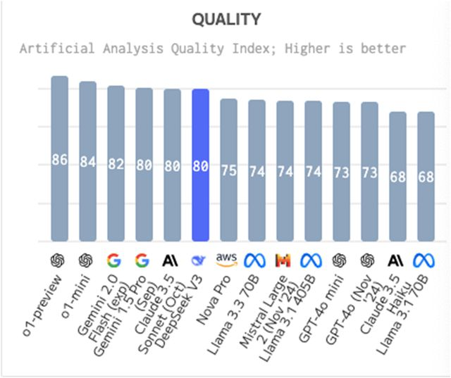
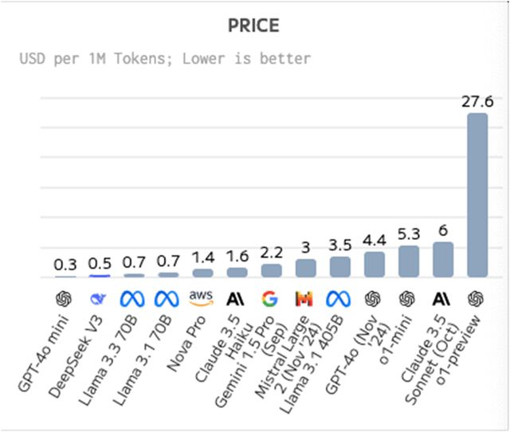
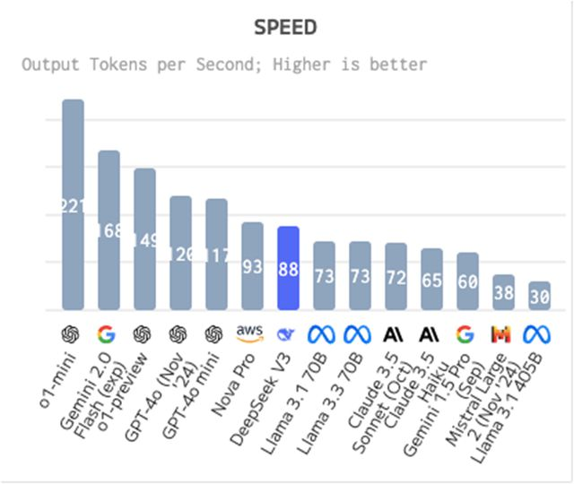
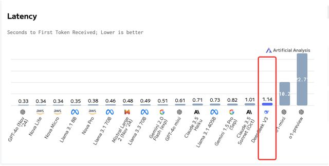
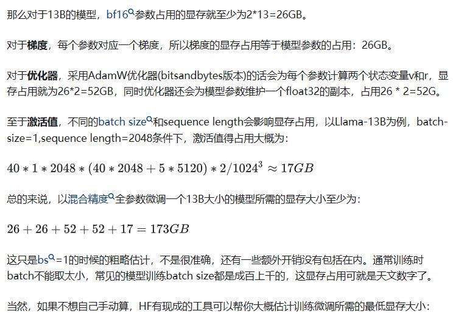
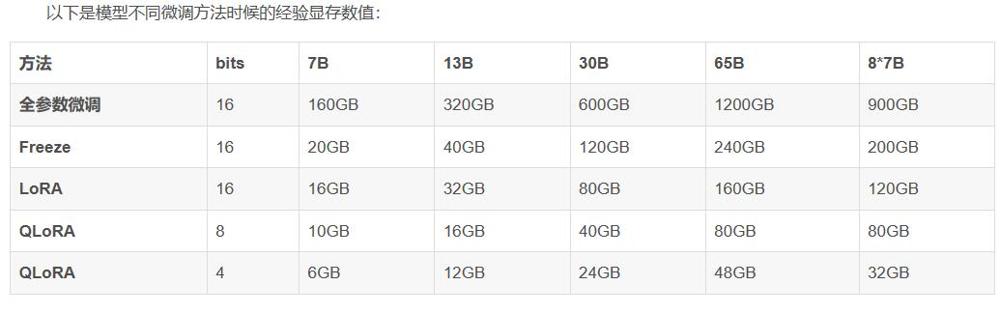
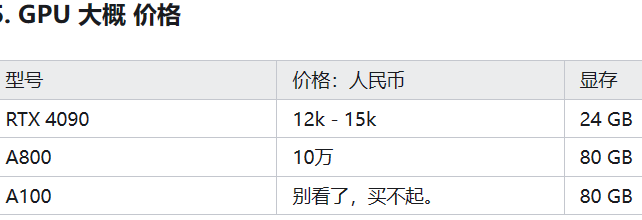
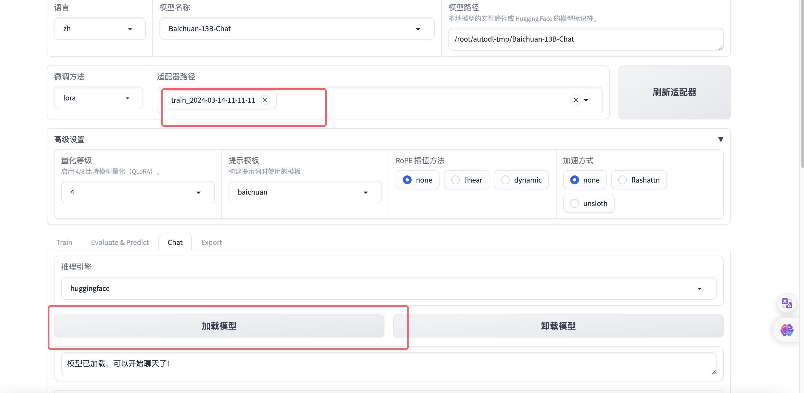

## llm对比

### [深入分析gpt，代码全栈claude，前端和美术资产生成gemini](https://www.bilibili.com/video/BV1BZk4B2Evs/)

奥村燐 

 逆向修bug深入分析gpt，代码全栈claude，前端和美术资产生成gemini，每个模型都有其特点，没必要踩一捧一，换着用才好用
2026-01-26 21:15

### llm token对比

✅ 总结：12万字小说翻译切分次数估算

| 使用的模型               | 是否需切分 | 建议切分次数 | 说明                             |
| ------------------------ | ---------- | ------------ | -------------------------------- |
| **Claude 3.5 (200K)**    | ❌ 否       | **1 次**     | 最佳选择，保持全文连贯           |
| **GPT-4 Turbo (128K)**   | ✅ 是       | **2 次**     | 前8万+后4万，或按章节分          |
| **GPT-4 / 32K 模型**     | ✅ 是       | **6–8 次**   | 每次约1.5–2万字                  |
| **GPT-3.5 (16K)**        | ✅ 是       | **12–15 次** | 每次约8,000–10,000字（安全起见） |
| **本地小模型（8K–16K）** | ✅ 是       | **15–25 次** | 按章节切分更安全                 |

## [deepseek Token 用量计算](https://api-docs.deepseek.com/zh-cn/quick_start/token_usage/)

token 是模型用来表示自然语言文本的基本单位，也是我们的计费单元，可以直观的理解为“字”或“词”；通常 1 个中文词语、1 个英文单词、1 个数字或 1 个符号计为 1 个 token。

一般情况下模型中 token 和字数的换算比例大致如下：

1 个英文字符 ≈ 0.3 个 token。
1 个中文字符 ≈ 0.6 个 token。
但因为不同模型的分词不同，所以换算比例也存在差异，每一次实际处理 token 数量以模型返回为准，您可以从返回结果的 usage 中查看。

## 行业

### [字节AI编程分享会：2026年末人类程序员是否进入倒计时？](https://www.bilibili.com/video/BV1uxA8zZEvG/)

#### 2026年或成为“编程奇点年”：AI代码占比逼近全面接管，人类从主导转向调度

演讲者提出一个核心判断：AGI 未必在今年到来，但“编程奇点”可能在 2026 年末出现——届时 99.9% 的代码将不再由人类直接编写。

他引用行业趋势数据指出：

- 2024 年末至 2025 年初，AI 生成代码约占新代码的 30%；
- 2026 年初已提升至约 70%；
- 按此速度推算，2026 年末可能接近 99%。

同时，软件交付周期在一年内缩短约 80%。GitHub issue 的自动解决率从极低比例迅速攀升，甚至被预测未来将几乎全部由 AI 处理。

OpenAI 发布的 token 使用报告显示，超过 50% 的使用量集中在代码场景。这在逻辑上也成立：语言模型生成的是文字，而文字最直接转化为生产力的形式就是代码。

趋势的本质变化在于：过去是“人主导，AI 辅助”，如今正在转向“人 orchestrate（调度）AI，AI 实际完成编程”。

#### 初级程序员岗位加速消失，AI能力已达到应届毕业生水平

演讲者认为，目前 AI 编程能力已达到普通 985 计算机应届毕业生水平，甚至在 GPT 5.2 阶段已超越实习生水准。

这意味着：

- 软件实习生岗位正在消失；
- 应届毕业生竞争力被削弱；
- AI 可以完成约 95% 的初级开发工作。

在企业内部，AI 不会减少程序员工作量，而是成为默认提效工具。如果你不会用 AI，你的上级会用 AI 提高效率后取代你。

他在公司内部采取了一种“AI 追赶机制”：允许员工选择是否使用 AI，但 AI 提效后形成速度差距，最终淘汰效率低的一方。结果是全员转向 AI 协作模式。

人类开发者的角色从：

- 写代码 + 管理初级工程师
  转变为：
- 调度 AI + 审核代码 + 为结果担责

AI 可以写代码，但不能承担责任。最终上线前的审查、架构约束、稳定性保障、CICD、K8S、高可用性等决策仍需人类负责。

#### CTO与架构师天然适合“管理AI”，核心能力转向任务拆解与质量控制

演讲者指出，真正能驾驭 AI 编程的人，不是刚学 Web 的开发者，也不是单纯的 Prompt 工程师，而是习惯于管理初级程序员的架构师与 CTO。

原因在于：

1. CTO 本身就需要将业务语言翻译为技术语言；
2. 需要进行技术选型与任务拆解；
3. 了解不同模块能力上限与下限；
4. 掌握代码上线的质量控制与架构约束。

这些能力与“管理 AI 代理”高度重合。

因此，CTO 使用 AI Coding，并不需要学习全新能力，而是把“管理人”替换为“管理 AI”。

编程技能本身的价值在下降，但全栈认知能力、架构理解能力、跨模块判断能力正在上升。未来更有价值的是“又薄又深”的能力结构：

- 每个领域懂前 10%；
- 能判断 AI 输出质量；
- 能将结果嵌入完整系统。

#### 非程序员也能参与开发：用“空降富二代”心态管理AI

对于非程序员，演讲者提出一种思维方式——“空降富二代心态”。

假设你突然接管一家大公司，高管比你聪明、经验丰富，但你拥有决策权。在 AGI 时代，人类的位置类似：我们管理比自己更强的智能体。

核心方法包括：

- 让 AI 反复提问，挖掘需求盲点；
- 通过 Interview Mode 让 AI 反向面试你；
- 让 AI 生成完整执行报告（Spec）；
- 采用“Spec + AI 执行 Spec”模式。

在公司实践中，他与 AI 反复对话半小时，生成 3000 行规格说明，再由模型按规格完整设计系统。

关键原则是：

- 先把 Spec 讲清楚；
- 慢在前期，快在后期；
- 通过反问过程提升自己的思维结构。

#### “AI永不眠”范式：用外层系统强制AI持续工作8-24小时

他提出“AI 永不眠”的长期运行代理架构，目标是在 8–24 小时内持续自动工作。

主要解决四类问题：

1. **过早结束问题（EOS）**
   模型倾向于在完成部分任务后询问是否继续。解决方式是外层 Python 循环控制流程，以测试通过为唯一进度指标。
2. **错误不自知问题**
   出现错误时回滚至上一个可运行版本。
3. **测试不足问题**
   开发前先写完整的 unit test 与 integration test。
4. **会话状态丢失问题**
   使用初始化脚本与进程跟踪器，保证重启后仍继续完成剩余测试。

整个系统以“通过全部测试”为唯一终点，而不是依赖模型主观判断“任务完成”。

#### 多AI协作与对抗产生更优结果，单一模型难以覆盖全部能力

演讲者认为，未来不会只有一个 AGI，而会有多个各自擅长不同领域的 AI。

实践策略包括：

- 用 GPT 负责架构；
- 用 Claude 负责测试；
- 用 Gemini 优化 UI 审美；
- 不同 AI 相互审查与对抗。

通过对抗与交叉验证，提升整体系统质量。这类似 AlphaZero 背后的自博弈逻辑——智能在冲撞中增强。

#### 编程技能价值下降，架构认知与系统整合能力成为核心竞争力

总体结论是：

- 编程本身正在被自动化；
- 初级岗位迅速消失；
- 中级工程师转向“调度 AI + 审核 AI”；
- 架构认知成为核心能力；
- 多模型协作成为新范式。

如果 2026 年确实成为“编程奇点年”，那么人类程序员不会完全灭绝，但角色将发生根本转变：

从“写代码的人”
转变为“定义问题、拆解任务、约束系统、承担责任的人”。

#### 评论

#### skills.md要写得好

holo19

 回复 @沧海云岚间 :需要完善的skills.md，skills写的好不好，模型表现也有很大区别
2026-03-02 12:32

#### claude还有个team模式互相怀疑

holo19

 而且claude还有个team模式，相当于变成了一个小组，内部ai会互相检查怀疑
2026-03-02 12:34

#### 小模块、核心算法可，大功能不行

微笑面对b站

 回复 @卷哥杂谈 :claude我们公司接的最新大模型，小模块很舒服，写一些核心算法也不错，但是让他去做一个大功能那可太好玩了，后期改动简直就是💩山代码一层堆一层，最后还是无奈推翻重做，这东西目前看还达不到那么神话
2026-03-04 00:56 👍1

#### 前端90%ai

浮云里的浮云

 你是没用好的ai吧，我之前的项目做前端，阿里内部的ai工具，可以通过设计稿直接生成HTML Css代码，完成率90%以上，我只要核对一下，省去大量时间，而JS部分只需要将业务逻辑告诉他，完成率也有90以上，原先如果用手一个个敲要一天，那么用ai只需要一个小时，然后再花一个小时自测一下就完成了，效率提高4倍。相当于一个人干4个人的活，另外三个人就得滚蛋，这就是现实[吃瓜]
2026-03-04 06:24 👍1

#### 互联网只需要prd文档，软硬结合需要看现场环境

Hypocrite000

 回复 @沧海云岚间 : 他们都是经典的互联网开发思维，做装置硬件或者装置上的软件的工业领域，很多时候没法像他们说的有prd就行。

我这就经常遇到，甲方自己都不知道应用软件应该有啥需求，只知道行业标准规范要求有这么东西。我们先做，然后拿给他看，他再提意见。装置上的软件，经常也遇到现场有特殊网络环境，特殊情况，需要按需定制化修改的情况，开发人员也需要去现场调试。

根本不可能一个prd出来，改改就行。
2026-03-04 08:55

#### 改掉一个bug导致更多bug出现 要求架构思维

风筝大佬

[吃瓜]目前用Agent开发代码还是很爽的，不过我主要是先让他写规划->自己调整->编写伪代码->真实逻辑自己再去写（为了加深印象）->标准CURD 直接AI写，强业务能力的网络编程方面 还是自己写，我怕万一有问题，我会一脸懵逼，作为一个苦逼老程序员，我其实特别不喜欢这种无法掌控的感觉！
2026-03-02 21:20 👍13

风筝大佬

 回复 @马有金 : 大部分人现在用agent写代码觉得很强悍，其实这样会弱化AI给出的代码是否为最优解（这是一种感觉），尤其是这种黑盒开发，加上后续APP的功能迭代，如果你无法保证AI给出的代码，基于当前APP框架不是最优解，那么后续将会是灾难，软件维护效率极低！如果要改动一个BUG，AI给出的建议可能会更改掉很多文件。导致以前修复好的BUG再出现。
2026-03-03 10:16 👍5

老梁爱吃棒棒糖

 AI代码时代，感觉程序员的心智负担更重了，如果是混子，那自然就只管commit就行，如果是负责一点的，需要review的代码变多了，效率虽然高了，但是对架构考验能力更高了
2026-03-04 22:33

#### 接手别人vb项目读几个月放弃，自己从头vb一个

thomasrolling

 回复 @大预言术士 :没有，，，我接手别人vb的项目读了几个月彻底放弃，自己从头vb一个月就整出来了，代码量还少了一半[笑哭]
2026-03-01 07:46 👍5

#### 不参与实际工作的项目经验，靠和ai聊天无用

深潭捞乐2

 回复 @大预言术士 :工作过几年的都知道，很多项目经验尤其是管理经验不参与实际工作，光靠学习或者和ai聊天，根本不可能学得到的，连问题都问不出来
2026-03-01 11:16 👍10

### [agent创业机会202505](https://zhuanlan.zhihu.com/p/1908953652326016327)

#### 本地/云端平衡的Agent

其三，**本地 AI 与云端 AI 的边界正在模糊。** Windows AI Foundry Local [1, 2] 允许AI推理在Windows 11本地运行，而MCP又能连接到云端的模型和服务。这预示着未来AI工作负载将实现动态分配。例如，涉及敏感数据或要求低延迟的任务可以在本地处理，而需要海量最新知识或强大算力的任务则可以利用云端资源。

#### 专家型agent

虽然横向应用的Agent拥有广泛的市场，但我认为，真正的巨大价值往往蕴藏在那些具备深厚行业知识、能够解决特定垂直领域独特痛点的“专家型Agent”之中。

- **法律科技 (LegalTech)：** AI Agent在法律行业的应用前景非常广阔，例如用于法律研究、文档分析、合同审查与管理、电子取证（e-discovery）、案件结果预测分析，甚至检测法律文书中的偏见等 [6, 18, 19]。有预测指出，到2030年，AI可能接管近40%传统上由律师完成的工作 [18]，这充分显示了其颠覆性的潜力。行业专家Oliver Roberts甚至预测，AI将在未来5年内取代入门级律师的部分工作 [20]。想象一下，一个AI Agent能够快速审阅数千份合同，标记出有风险的条款，或者在几分钟内完成过去需要数天才能完成的法律研究，这将极大提升法律工作的效率和质量。
- **医疗健康 (Healthcare)：** 在医疗领域，AI Agent可以辅助诊断、提供个性化治疗建议、进行疾病风险预测分析、解读医学影像（如X光片、CT扫描）、加速新药研发、通过可穿戴设备监测患者健康状况、充当虚拟健康助手以及实现行政工作的自动化等 [7, 21, 22]。甲骨文公司（Oracle）在医疗AI Agent领域的投入 [21] 以及Automation Anywhere展示的应用案例 [22]，都表明了这一领域的强劲发展势头。例如，一个AI Agent可以实时分析重症监护病房患者的各项生理数据，在出现危急情况前向医生发出预警。
- **教育科技 (EdTech)：** AI Agent有望为教育领域带来个性化学习体验，例如AI驱动的智能导师、自动化的作业批改与反馈系统、行政工作自动化（如排课、校园招聘简历筛选）、提升教育公平性与包容性（如实时翻译工具、24/7学习支持）、以及针对性的学习补救方案等 [23, 24]。AI Agent通过提供个性化支持来弥合不同学生群体间的学业差距 [23]，这本身就是一个极具吸引力的价值主张。
- **金融科技 (FinTech)：** 在金融行业，AI Agent可用于欺诈检测、算法交易、提供个性化客户服务、信用评分、投资组合管理以及确保合规性等方面 [6, 7, 16, 17]。例如，AI Agent能够实时分析数千笔交易数据以识别欺诈行为 [17]，或者根据个人风险偏好和市场状况提供高度定制化的投资建议，这些能力都极具商业价值。
- **软件开发 (Software Development)：** AI Agent已经在重塑软件开发人员的日常工作体验，它们可以辅助代码生成、调试、测试用例生成、性能优化，甚至管理DevOps工作流 [6, 25, 26]。GitHub Copilot正在进化为一个具备Agent能力的合作伙伴 [2]，这是一个明确的信号。像Potpie这样的工具，能够创建专门针对特定代码库的AI Agent [27]，帮助开发者更高效地理解和维护复杂代码。

#### 从真实需求出发解决问题

- **从真实问题出发：** 我总是建议创业者，不要一上来就想着“我要做一个AI Agent”，而是要先问自己：“在某个特定的领域或用户群体中，是否存在一个尚未被很好解决的、重大的痛点，而一个自主的、智能的Agent恰好能够独特地解决它？” 这种以问题为导向的思维方式，是成功的起点。
- **量化痛点：** 这个问题给用户带来了多大的困扰？是浪费了大量时间？造成了高昂的成本？错失了重要的商业机会？还是带来了极大的挫败感？痛点越具体、越强烈，用户为解决方案付费的意愿就越高。例如，富士通公司在销售提案生成方面效率低下，直接影响了销售业绩，这就是一个明确的、值得用AI Agent解决的痛点 [15]。
- **Agent 的独特价值主张：** 思考一下，为什么是AI Agent，而不是现有的其他工具或人工方式，更能解决这个问题？你的价值主张应该聚焦于Agent的自主性、主动性、持续学习能力以及处理复杂任务的能力。例如，一个能够自主监控你的收件箱，识别紧急客户请求，根据过去的互动记录和知识库文章起草初步回复，并将其标记出来供你审核的Agent，显然比一个简单的邮件过滤器提供了更高的价值 [3, 14]。

#### Azure AI Foundry提供的Grok 3

Azure AI Foundry提供的Grok 3

#### 开发框架langchain微软的AutoGen、Semantic Kernel，多Agent系统CrewAI、读代码库Potpie

**选择合适的开发框架：**合适的框架能够显著加速开发进程，并提供必要的抽象层。
**LangChain：** 适合构建基于LLM的应用和相对简单的Agent工作流 [28, 29]。

**AutoGen (Microsoft)：**
非常适合构建多Agent系统，并能充分利用微软的生态资源 [1, 28, 29, 30]。

**Semantic Kernel (Microsoft)：**
擅长将AI能力集成到传统软件中，适合开发企业级聊天机器人和流程自动化Agent [1, 15, 28]。

**CrewAI：**
**专注于协作型多Agent系统的构建 [29]。**

此外，还可以根据具体需求，考虑[27]和[27]中列出的其他开源工具，例如用于代码库Agent的Potpie，用于集成的Composio，用于可视化构建的Langflow等。

#### 隐私保护

##### 微软的Entra Agent ID控制ag5ent访问权限

Entra Agent ID，为每个Agent分配唯一身份标识，有助于实现更精细化的权限管理 [1, 2]。

##### Windows AI Foundry Local本地ai模型

**优先采用隐私保护的AI模型与本地处理：** 尽可能考虑采用能够在本地处理数据的AI模型 [12]。Windows AI Foundry Local对此提供了支持 [1, 2]。在模型开发过程中采用差分隐私等技术，也有助于保护用户数据 [45, 48]。

####  MCP 及 LOKA/UAIL 身份认证

互操作性标准（如 MCP 及 LOKA/UAIL 等前瞻理念）在构建互联 AI 生态中的关键作用

- **超越 MCP 的未来：**虽然MCP协议对于AI与操作系统、AI与工具之间的通信来说是巨大的一步，但我认为，未来还需要更广泛的互操作性标准，以规范Agent之间的通信、身份验证以及跨平台的伦理治理。
- **通用 Agent 身份认证：**像LOKA协议提出的通用Agent身份层（UAIL）这样的概念 [44]，主张利用去中心化身份标识（DID）和可验证凭证（VC）为Agent提供可验证的唯一身份。在一个多Agent协作的世界中，这对于建立信任和明确责任至关重要。如果Agent代表我们行事，我们需要确切地知道它们是谁，以及它们代表了谁的授权 [56]。
- **语义互操作性：**Agent之间需要能够理解彼此的意图和能力。LOKA协议提出的通用Agent语言（UAL）和意图中心通信 [44]，或者像Verses AI畅想的、基于通用领域图谱（UDG）实现共享知识的“空间网络”（Spatial Web）[57]，都指向了这种对更深层次语义理解的需求。
- **跨生态系统的伦理对齐：**随着来自不同开发者和组织的Agent进行交互，确保它们遵循兼容的伦理准则将变得至关重要。LOKA协议提出的去中心化伦理共识协议（DECP）[44]，是朝这个方向迈出的雄心勃勃的一步。

#### AI Agent生态系统与Web3原则

像LOKA协议中UAIL采用DID和VC [44] 以及强调去中心化伦理共识等理念，都预示着AI Agent生态系统与Web3原则（如去中心化、自主身份、无需信任的交互）的融合趋势。对于初创企业而言，如果能够将AI Agent技术与去中心化技术相结合（例如，构建能够与智能合约交互、参与DAO治理或利用去中心化存储的Agent），可能会解锁全新的应用场景和商业模式，尤其是在那些对信任、透明度和用户控制权要求极高的领域。

### [Google 新出了 AlphaEvolve，我的详细观察和想法。](https://www.v2ex.com/t/1132730)

2025年05月27日 周二 04时08分29秒  7 天前

- Google 的 DeepMind 发表了最新的 AlphaEvolve 成果。
- 它可以看作是一种编码智能体，不过跟现存的编码 Agent 差别不小。下面详细说一下。
- 它的机制是给现有大语言模型（如 Gemini ）的外面套一层进化学习的框架，让大语言模型作为进化学习中的关键一环。而经过进化得到的答案，大大超出了直接询问大语言模型的结果。
- 它做到的效果是：将 50 多年来未曾改进过的 4 * 4 矩阵乘法运算，由 49 步乘法运算优化到了 48 步。另外还有 50 多个数学、编码、几何等方面的难题中，75%追平了人类的最好效果。20%超越了人类的最好效果。Google 使用它对现有的机器学习中的关键代码进行优化，有了很大的效率提升，节省了数亿美元。
- 其实 AlphaEvolve 的思想很简单：首先，由人类提供一个初始的代码方案(可能非常粗糙)，然后由大语言模型基于这个方案，生成相关的「变异」代码，也就是略微的改进，然后再由人类定义的评估函数，去评估所有「变异」方案的执行效果，是否相比于之前的分数提高了。保留评分较高的「变异」方案。然后循环，将这些新方案再喂给大语言模型，生成进一步的「变异」。如此往复。

### [openai出的模型排行榜单](https://openai.com/index/introducing-deep-research/?utm_source=ai-bot.cn)

February 2, 2025 Release

| Model                    | Accuracy (%) |
| ------------------------ | ------------ |
| GPT-4o                   | 3.3          |
| Grok-2                   | 3.8          |
| Claude 3.5 Sonnet        | 4.3          |
| Gemini Thinking          | 6.2          |
| OpenAI o1                | 9.1          |
| DeepSeek-R1*             | 9.4          |
| OpenAI o3-mini (medium)* | 10.5         |
| OpenAI o3-mini (high)*   | 13.0         |
| OpenAI deep research**   | 26.6         |

\* Model is not multi-modal, evaluated on text-only subset.

**with browsing + python tools

### [诺奖得主、AI教父辛顿：我和我的朋友杨立昆是两个极端。](https://www.bilibili.com/video/BV1LMoyYvEjs/)

XyinoSnake

关键在于，杨立昆认为，深度学习算法产生的人工智能，无论如何迭代发展，终究无法产生出意识。而辛顿认为人工智能本身就是意识。这是关键。我个人认为，杨立昆是正确的。要让人工智能有同人的意识的本质接近的独立的意识，只依靠深度学习的软件算法，与强大的硬件算力，是不可能实现的。要产生意识，需要通过其他途径。
2025-04-12 18:06 👍9

### [郎咸平：现在 Ai 取代人类后，未来95%的人都无法生存？](https://www.bilibili.com/video/BV1FbP7eQE9Q/)

贝塔线的TD

ai是生产端的,但ai不消费,且挤占岗位,会导致消费端大量萎缩.
2025-04-26 19:53 👍3

迎风戏雨

从古至今，问题都是分配问题而不是生产力过剩，我相信在高的生产力都填补不了人内心的贪欲，也正是因为生产力过剩我们现在才能有吃有喝，不然跟古代一样已经饿死路边了。不管是ai还是电车都是希望消耗过剩生产力而不是把他浪费掉，哪怕说ai还会继续提高生产力，可也比把生产力浪费了好。
2025-04-04 13:58 👍34

繁星四月f

如果AI普及，95%的人失业，那就变成共产主义社会，平均分配
2025-04-18 12:58 👍1

゚゙゚゙゚゚゙゚゙゚

蒸汽机车坐多了会导致颈椎病——一众马车夫[呲牙]
2025-04-01 18:40 👍19

浩瀚尘沙

 没有电气化也不会淘汰蒸汽机车 没有人工智能也不会解放司机降低运输成本 没有人工智能更不可能生产出售价更低 更安全 更智能 更高效节能的汽车 没有一次次的科技革命 人类还生活在风吹日晒雨淋 冬冷夏热 疾病 野兽 蚊虫威胁的原始丛林呢 郎咸平真她妈什么玩意儿都不是 他的言论完全符合外国间谍的行为
2025-04-17 13:17 👍1

机器猫2020

不同意这个人的观点。生产力的向前发展是任何人都不能阻挡的。无论以任何理由。
2025-04-12 16:08 👍13

bili_38796114946

 每次生产力的向前发展世界都会增加人口数量，唯独ai这次，ai对底层是毁灭式的打击，岗位的减少，人口的减少已经是可以预测的了，这次生产力的向前真的是正确的吗？
2025-04-12 21:55 👍8

### [AI 教父辛顿：有人说机器人不会产生情感，这完全是胡说八道](https://www.bilibili.com/video/BV1uPQcYDE3g/)

#### 传统观点  
机器没有感情的想法对大多数人来说似乎是显而易见的。  

#### 反驳与质疑  
但我认为这是无稽之谈。所以，一个有趣的实验让人们困惑。  

#### 神经元替换实验  
假设我在你的大脑中取出一个神经元，用一个纳米电子元件替换它。这个元件的行为与神经元完全相同——它接收的输入包括血液中的肽和其他物质，并产生与神经元相同的输出。它甚至可能向血液中注入肽，但它也产生实际的电位和其他东西。  

#### 逐步替换的思考  
我只是用一个行为完全相同的纳米电子元件替换了一个神经元，你显然认为你仍然有意识。替换一个神经元不会阻止你有意识。但你知道归纳法的论证，所以你可以看到这将走向何方。  

#### 完全替换的推论  
现在我们替换两个神经元，你还是有意识的。好的，现在我们替换所有的神经元——你在何时停止有意识的？很明显，你还是有意识的。  

#### 唯物主义的结论  
如果你是唯物主义者，你必须相信机器可以有意识。

#### 问题

问题是，你不是神经元的集合，或者你需要证明神经元的集合产生意识

#### 情感的本质，其实就是一种遗传算法优化出的无脑决策机制

神棍宇叔

Hinton说的对。大多数持反对意见的人，根本不知道人类情感的本质是什么。情感的本质，其实就是一种遗传算法优化出的无脑决策机制，爱、恨、贪婪、恐惧...都是如此，不需要理性思考，便能得到一个靠谱决策的机制。比如，当人在野外遭遇了老虎，恐惧会驱使你立即逃跑，从而增加生存概率，而如果进行耗时耗能的理性决策，生存概率会大大降低，此时的优化目标是时间。再比如，父母对你无条件的爱，也是一种无脑决策，它的存在也大幅增加了你的生存概率，此时的优化目标是种群延续的概率，类似的，爱情也是如此。总之，各种感情的存在，有助于种群更好的存续。比如，在强化学习的训练框架下，在目标中加入能耗指标，就能够形成“感情”。这一步训练中形成的感情，包括自私、懒惰等，但是这些感情比较原始，如果想要生成更高层次的情感，可能还需要使用遗传算法，让机器种群在现实的世界中进行迭代，最终会形成一种与人类相似的决策机制，可以称之为感情。
当然，那些持反对意见的可能仍然不会承认，认为只有人类才配拥有智慧和感情的想法，恰恰是一种傲慢。
2025-03-14 20:54 👍368

生活总该有点星光鸭

 回复 @神棍宇叔 :感谢回复，我完全理解且认同你的说法，我的担忧更多的是一种哲学上的迷思。
1:人类的智能和情感可以被“解释为”一种“类神经网络训练”的模式，但这并不代表，智能和情感就是这种模式本身。就像9可以拆分为3+3+3，也可以拆分为3+1+5。这两者都是“合理”的，但我们目前并不知道，人涌现出来的智能是哪一种。@
2:假设我们已经证明，人的情感就是这种如你所说的模式产物。我还有如下疑惑:同样的一种数学结构，在碳基生物的大脑中达成的结果，和计算机代码达成的结果，会是“一样的”吗？（这里的一样也需要清晰界定，有待进一步商榷）换言之，这种模式会不会因为训练载体的不同，训练环境的不同，训练参数的不同，而导致结果的“不同”？这也是目前没有证明的。
3:综上，hinton只是一定程度上在用机器学习的思路去“解释”智能，我完全认可这种解释。但在电脑真正的产生智能之前，这种解释也只是万千视角的一种。
2025-03-28 11:20

### [刷屏的DeepSeek-V3能力到底如何？国外评测报告：超越迄今为止所有开源模型！自称ChatGPT，真相或指向“AI污染”](https://www.163.com/dy/article/JKK108Q30512B07B.html)

2024-12-29 22:20:11　来源: 每日经济新闻 四川  

公众号推文是这样描述的：DeepSeek-V3为自研MoE模型，671B参数，激活37B，在14.8T token上进行了预训练。DeepSeek-V3多项评测成绩超越了Qwen2.5-72B和Llama-3.1-405B等其他开源模型，并在性能上和世界顶尖的闭源模型GPT-4o以及Claude-3.5-Sonnet不分伯仲。

更重要的是，深度求索使用英伟达H800 GPU在短短两个月内就训练出了DeepSeek-V3，仅花费了约558万美元。其训练费用相比GPT-4等大模型要少得多，据外媒估计，Meta的大模型Llama-3.1的训练投资超过了5亿美元。

消息一出，引发了海外AI圈热议。OpenAI创始成员Karpathy甚至对此称赞道：“DeepSeek-V3让在有限算力预算上进行模型预训练这件事变得容易。DeepSeek-V3看起来比Llama-3-405B更强，训练消耗的算力却仅为后者的1/11。”

#### 质量、价格、性能 第6

针对DeepSeek-V3，独立评测网站Artificial Anlaysis就关键指标——包括质量、价格、性能（每秒生成的Token数以及首个Token生成时间）、上下文窗口等多方面——与其他人工智能模型进行对比，最终得出以下结论。

图片来源：Artificial Anlaysis

#### 价格 第2

价格：DeepSeek-V3比平均价格更便宜，每100万个Token的价格为0.48美元。其中，输入Token价格为每100万个Token 0.27美元，输出Token价格为每100万个Token1.10 美元。

#### 速度 第7

#### 延迟 第15

延迟：DeepSeek-V3与平均水平相比延迟更高，接收首个Token（即首字响应时间）需要1.14秒。

### [【人工智能】直觉的力量 | 杰弗里辛顿最新对话 | Sana AI峰会 | 回忆AI生涯 | Ilya的能力和直觉 | 缩放法则 | 多模态 | 语言与认知 | 神经网络 | AI情感 | 反向传播](https://www.youtube.com/watch?v=mG31I9mfVLU)

11,831次观看  2024年5月22日  大飞说科技

#### **1 多模态输入与认知能力**

辛顿认为多模态输入会让模型有显著的改进，尤其会大大提高模型对空间等事物的推理能力。另外，多模态可以让模型获得更多的训练数据。有一个哲学观点是，你可以通过语言学习到一个非常好的模型，但从多模态系统中学习要容易得多。在这个基础上，辛顿列举了三种不同的语言观以及它们与认知的关系。

#### **2 语言观与认知关系**

辛顿列举了三种语言观：传统符号观、向量观以及符号与嵌入向量结合的观念。他认为，当前模型的工作原理是通过符号和向量的相互作用来实现理解和预测。

首先是传统的符号观，也就是认知是基于明确、抽象的逻辑符号以及符号操作，暗示语言与逻辑思维紧密相连的，这个观点倾向于认为人类大脑和语言是协同进化的，各自适应对方的存在与发展。与之相反的观点是，大脑内部全都是向量，符号进入大脑会转换成大型向量，所有内部处理都是通过大型向量完成的。如果你想生成输出，就要再次生成符号。大约在2014年，机器翻译领域就有这么一个阶段，通过循环神经网络在隐藏状态中不断积累信息，所以在句尾时就会得到一个大的隐藏向量，这个向量捕捉了这个句子的意义，然后可以用来在另一种语言中生成句子。这被称为思想向量，是对语言的第二种看法。

第三种观点介于前两者之间，也是现在辛顿所相信的，那就是语言和思维过程中确实涉及符号，但是这些符号通过多层次的嵌入表示（embedding representation）被丰富化了，但是这些嵌入仍然与符号相关联，意味着每个符号都有一个大的向量，这些向量相互作用，从而产生下一个词的符号向量。这就是所谓的“理解”。“理解”就是知道如何将这些符号转换成向量，以及知道这些向量的元素应该如何相互作用来预测下一个符号的向量。知识则体现在你使用的向量以及这些向量元素之间的相互作用上，而非符号规则。但是这并不意味着可以完全摆脱符号，而是将符号转化为庞大的向量，但是仍然停留在符号的表层结构上。这就是如今模型的工作原理，也同样是一个更合理的人类思维模型。

#### **3 模拟计算的前景**

辛顿探讨了模拟计算（analog computation）的可能性，希望以低能耗实现大语言模型的运行。他认为数字系统的权重可复制性和共享性使其具有“永生”潜力。

对于计算技术下一步该如何演进，辛顿提到自己一直在思考如何实现模拟计算（analog computation），这样就不用消耗兆瓦级的电力，而是像大脑一样只用30瓦就可以在模拟硬件上运行这些大语言模型。而且由于权重的可复制性和共享性，数字系统实际上是“永生”的，数字系统之间可以通过微小的学习更新，然后共享这些更新后的权重，实现集体知识的即时同步，这是人类目前无法做到的，不过这个目标现在还没有实现。

#### **4 时间尺度与临时记忆**

辛顿指出现有神经网络模型缺乏人脑中的快速权重变化，这对实现类似人脑的临时记忆功能至关重要。他提出用电导作为权重表示可能解决这一问题。

另外在模型方面，现有的神经网络模型中，通常只有两个时间尺度，一个是活动，例如神经元激活状态的快速变化，另一个是权重，例如长期学习参数的缓慢调整。但是，人脑中存在多个时间尺度的权重变化，允许形成临时记忆，比如我现在喊一句“黄瓜”，五分钟后你还能记忆起这个词，这是因为突触暂时性变化了，也是现在神经模型中缺少的快速权重，这对于实现更接近人脑的临时记忆功能至关重要。用电导作为权重表示，可能会有望解决这一问题。

#### **5 大模型的成功与认知转变**

辛顿认为大型神经网络模型的成功改变了对复杂任务学习的认知，证明了通过随机梯度下降可以学习并掌握复杂知识，挑战了传统对先天结构的观点。

对于如今大模型的出现，辛顿认为最大的影响在于对一个抽象概念的认知转变。过去，许多人，包括统计学家、语言学家及多数AI研究者，对通过一个大型随机神经网络，辅以大量训练数据，来学习执行复杂任务的想法都保持怀疑的态度，他们认为这仅仅是“空想”，认为没有内在知识和严格架构限制，不可能学会复杂事物。然而，大型神经网络模型的成功证明了这个观点是错误的，那就是通过随机梯度下降不断调整权重，确实能够学习并掌握复杂知识，这个发现表明大脑不必具备所有的先天结构。

#### **6 AI的情感能力**

辛顿认为AI也能具备情感，通过面对约束和问题解决时采取的行动策略来表现情感。他以1973年的弗莱迪机器人为例，解释了AI情感的可能性。

另外，辛顿认为AI也能有情感。情感的本质是，如果没有外部约束时我们可能会采取的行动。那么就像辛顿内心可能会想给深度学习的主要反对者加里马库斯鼻子来一拳，但是前额叶的抑制作用会阻止他真的采取行动。事实上，在1973年，辛顿就亲眼见到一个机器人表现出了情感。爱丁堡大学有个叫弗莱迪的机器人，它有两只夹子，能够将单独放置的玩具车零件组装起来，但是如果将零件堆在一起，它的视觉不足以弄清楚发生了什么，于是它会将夹子合拢，“啪”的一下把零件击散，从而再“组装”起来。如果我们在一个人身上看到这一幕，会说他因为不理解情况而感到沮丧，其实是它们在面对约束和问题解决时会采取相应的行动策略，因此，如果从这个角度来看的话，AI显然也可以拥有情感。

#### **7 符号处理与上下文信息**

曾经，辛顿认为宗教信仰和符号论都是无稽之谈，但是随着时间的推移，他的看法也有所改变。他认为人类确实进行着符号处理，但是并不像传统观念中那么简单。实际上，我们通过给符号赋予大型嵌入向量，并利用这些向量的成分间互动来进行思考。这种方式充分利用了上下文信息，谷歌的研究员费尔南多·佩雷拉（Fernando Pereira）曾说过，我们拥有的唯一符号就是自然语言，我们用它来进行推理，现在辛顿对此深信不疑。

#### **8 反向传播与大脑学习**

辛顿认为大脑在学习过程中利用了梯度信息来优化内部连接，但对大脑如何实际获得这些梯度仍保持开放态度，认为这是一个重大且未解决的问题。

辛顿认为，人工智能领域接下来最该解决的问题还是跟他30年前思考的问题一样，就是大脑是否进行反向传播。他相信大脑在学习过程中确实利用了梯度信息来优化了内部的连接，也就是所谓的权重。然而他对于大脑如何实际获得这些梯度，是通过某种近似于反向传播的机制，或者是完全不同的方法来实现这一点，仍然保持开放的态度。他认为这是一个重大而且尚未解决的问题。

#### **9 AI的未来应用与发展**

辛顿认为未来AI在医疗保健和新材料领域最有前景。他对不良分子利用AI的担忧和国家间竞争使得AI发展不会放缓，因此没有签署暂停AI研究的请愿书。他认为我们不会放慢脚步。

最后，辛顿认为未来AI最有前景的应用应该是在医疗保健和新材料的领域。他虽然担心不良分子会利用AI做坏事，但是他也认为AI领域不太可能会减速发展，因为国家之间存在着竞争。他之所以没有在暂停AI研究6个月的请愿书上签字，因为他认为那件事永远不会发生。我们永远不会放慢脚步。好了，以上就是辛顿这次访谈的核心内容。其实还有很多非常有意思的话题，比如说他对波尔兹曼机的看法等等，建议大家有时间去看一下原视频仔细体会。

### [【OpenAI】春季发布会后Sam Altman首次专访 | GPT-4o的背后 | 迭代发布 | GPT-5 | AGI | AI创业方向 | 非线性发展 | AI监管与风险 | 人类与AI](https://www.youtube.com/watch?v=2Sa0hNJtA6w)

#### GPT-4o：计算机使用方式的革命性飞跃

先说刚刚发布的GPT-4o，Sam认为这是计算机使用方式的一次革命性飞跃。长久以来，我们都有通过语音控制计算机的想法，比如像Siri这样的早期产品。但是，GPT-4o在使用感受上超越了以前的产品，它更加自然、灵活、流畅，并且能够实现多样化的操作。Sam举了一个他使用GPT-4o的例子，就是当他全神贯注工作的时候，只需要将手机放在桌子上，有任何问题直接通过提问就能立即获得响应，而不必将视线离开电脑。这种无缝衔接的体验非常特别。

#### 与迭代发布策略

不过，GPT-4o并不是来自于什么革命性的突破，而是来自于OpenAI在音频和视觉模型方面巧妙的融合。对于视频来说，网络延迟是一个很关键的问题。不过，GPT-4o在实际应用中已经可以达到两三百毫秒的延迟，很多时候甚至能超越人类的反应速度。OpenAI现在很明确要采用所谓迭代发布的策略，所以接下来再发布的大模型，应该不会是一个像GPT-5这样的大版本。况且GPT-5只是个名字，OpenAI想要采取一种有别于传统科技公司的发布策略，不过现在还没想清楚如何为产品命名和建立对应的品牌。

#### Sam对未来AI公司的建议与思考 建立稳固而且长期可行的业务模式

对于AI公司来说，Sam之前提到过一个观点，许多以GPT-4为基础建立业务的公司将不可避免地会被未来的GPT迭代所淘汰。Sam这次进一步解释了这个观点，很多企业在构建AI业务的时候，其实都是在赌两件事：要么赌下一个模型表现平平，要么赌下一个模型会取得显著的进步。如果企业在AI的某个能力上投入了大量精力，一旦GPT-5或者后续版本出现并且超越，那么可能就会对先前的努力感到不值了。

因此，Sam建议这些企业不要去建立一个纯粹的人工智能业务，而是要构建一个真正的业务，其中人工智能只是采用的一种技术。比方说，在苹果应用商店的早期阶段，有很多产品填补了明显的空缺，但是随后苹果解决了这个问题，我们现在已经不会再关注像手电筒这样的应用了，因为它们的功能已经被集成到了操作系统中。而像Uber这样的企业，它们因为智能手机的普及而兴起，但它们建立了一个非常稳固而且长期可行的业务模式。Sam认为这才是企业应该追求的方向。

对于创业公司来说，只相信智能水平会逐年进步、成本会逐年下降，这是不足以跑赢其他大公司和创业竞争对手的。必须要深入探索业务的长期可持续性。另外，人们总是会关注哪些职业会消失，但实际上也会产生新的职业，比如全新的艺术形式、娱乐方式，以及更加注重人与人之间的联系。这可能会给五千万或者一亿人带来新的职业机会，所以这也是创业公司可以关注的一个方向。

## Llama2大语言模型LLM群

809926546

### autodl
恃 2024/3/5 15:28:43
https://www.autodl.com/home
恃 2024/3/5 15:28:57
玩大模型的基本用它的

### llm输出下一个token的概率
灯夜 2024/3/7 11:57:48
不是随机采样，是从top_k中依概率采样(如果用的是top_k的话)
灯夜 2024/3/7 12:00:20
llm是输出下一个token的概率，这个概率是词表中每个词出现的概率
灯夜 2024/3/7 12:03:33
但一般不会在整个词表中采样，而且只在概率更高的侯选中采样。
另外，temperature参数决定这个概率分布的平滑程度，越大，概率分布越平滑，越接近随机采样，越小概率分布越尖锐，采样更固定，输出也就越确定

### 全参数微调8张A100
铬 2024/3/7 15:12:54
https://www.zhihu.com/answer/3079621090
铬 2024/3/7 15:13:08
全参数微调都要8张A100

### 目标检测的大模型 qwen-vl
恃 2024/3/7 21:40:19
最近发现一个目标检测的大模型，有点猛
恃 2024/3/7 21:40:34
qwen-vl
### llm离应用远  投资一是投场景二是投基建 不投模型本身
▞▙▛▖▜▖▗▝▞ ▙▛ 2024/3/7 23:04:09
大模型才一年
▞▙▛▖▜▖▗▝▞ ▙▛ 2024/3/7 23:04:21
但是gpt出来6年了啊
枫（大额api在售） 2024/3/7 23:41:47  
GPT3.5是GPT3微调出来的  
枫（大额api在售） 2024/3/7 23:42:20  
人工智能很厉害，但现在离应用还很远  
枫（大额api在售） 2024/3/7 23:42:45  
很难结合具体的应用场景，所以都在做小模型  
枫（大额api在售） 2024/3/7 23:43:34  
投资一是投场景二是投基建，很少投模型本身
### 不同GB模型算力需求

### 预训练不是咱干的活 微调才是
先天打灰圣体 2024/3/8 17:34:23  
晚风  
@晚风 不是上面灯夜大神说 微调和预训练是不一样的，而你给的表里面只是“全参数微调”，所以我想知道做“预训练”是否需要更多显存？    
晚风 2024/3/8 17:35:18  
你就别想预训练了
晚风 2024/3/8 17:35:24  
那不是咱干的活

### 小公司做不了，大公司做不好
活泼的麦克劳林 2024/3/8 17:54:29
大模型有前途吗，小公司做不了，大公司做不好
群主 2024/3/8 17:55:33
关注着点
群主 2024/3/8 17:55:53
现在在爬坡期
群主 2024/3/8 17:55:58
更新太快
群主 2024/3/8 17:56:22
但是容易出文章

### 3090够了 4090更快
Rainel 2024/3/11 16:16:57  
双3090还是 单4090？  
再见理想 2024/3/11 16:17:42  
3090够了  
再见理想 2024/3/11 16:17:53  
4090更快
Rainel 2024/3/11 16:21:00  
那还是3090性价比高。。。  
Rainel 2024/3/11 16:21:23  
不过3090不太好买  
骅骝 2024/3/11 16:21:48  
3090显存够大么？  
Rainel 2024/3/11 16:28:48  
好像 单张24G

Nuyoah 2024/3/13 9:45:33
40系显卡不能交火
### colab免费A100
电焊工学大模型 2024/3/12 10:43:07
colab上也许有免费的A100
### RTX 4090
自得其乐 2024/3/12 10:45:12
对哦，老大们，运行大语言模型，啥电脑配置比较好些呢？
Woo 2024/3/12 10:46:52
4090

### GPU大概价格

灯夜 2024/3/12 10:48:26  
看多大的模型，7b的话，单精度28G，BF16的话14G

### 涌现效应是错觉
灯夜 2024/3/12 11:26:07
我记得还有一篇文章在分析涌现效应，结论是涌现效应是错觉
再见理想 2024/3/12 11:27:14
llm就是个索引机器，所以你懂的

再见理想 2024/3/12 11:28:09 灯夜  
我记得还有一篇文章在分析涌现效应，结论是涌现效应是错觉
@灯夜 llm没有推理能力，它只有记忆，没有别的能力

再见理想 2024/3/12 11:28:42
有人测试过gpt4，表面上看它可以理解问题并规划
再见理想 2024/3/12 11:29:34
但是测试中稍微将文本调整的不符合常见的形式，添加一些干扰，gpt4性能就严重下降了

恃 2024/3/12 11:28:51 灯夜  
我记得还有一篇文章在分析涌现效应，结论是涌现效应是错觉
@灯夜 我也觉得有点假，单看transformer的机制，总感觉就是还是摸索规则做，其实没有智能，而是过去经验的积累，他只是突破了这个检索规则的难度

### zero shot是通过检索得到的
再见理想 2024/3/12 11:30:14  
所以最近看到claude3有意识觉醒啥的我就恶心，还有吹sora吧啦吧啦的  
恃 2024/3/12 11:30:37  
赚股民韭菜的钱

再见理想 2024/3/12 11:33:25  
zero shot也只是因为广泛的训练集中存在这样的模式，应该通过检索到的  
灯夜 2024/3/12 11:33:45  
我是觉得单纯的记忆能力应该没法做zero shot的  
恃 2024/3/12 11:33:57  
zero-shot总感觉是随机误差保留  
再见理想 2024/3/12 11:34:07  
我做过实验，数据集里面不包含专门的zero shot设计，llm学不到相关能力  
再见理想 2024/3/12 11:34:33  
zero shot类似于我们从教科书中的描述学习知识对吧  
再见理想 2024/3/12 11:35:32  
但是llm训练集实际上需要样本中的指令包含这些描述，同时输出是按照这个描述执行的文本，才能训练zero shot能力  
再见理想 2024/3/12 11:36:07  
它不是凭空产生的，而是在训练集中广泛存在的，互联网上有大量的这种数据

### 主要靠人工反馈强化学习
灯夜 2024/3/12 12:30:45
对齐还是主要靠人工反馈的强化学习

再见理想 2024/3/12 12:35:11
7b都经常让我觉得llm完犊子，用了gpt4才会觉得llm又行了
### 人表达信息时必须发动一维张量 ai之间完全可以通过多维的概率分布交流
▞▙▛▖▜▖▗▝▞ ▙▛ 2024/3/12 12:36:18  
因为人表达信息时必须发动一维张量，不能发二维张量，更不能发4096维张量，一是没这个能力，二是对面听不懂，所以语言是限制ai发展的，ai之间完全可以通过概率分布交流，这就是逻辑

再见理想 2024/3/12 12:38:49
概率解决不了规划，也不能推理

▞▙▛▖▜▖▗▝▞ ▙▛ 2024/3/12 12:38:12
因为人的嘴同时只能发出一个声音，所以只能发出一维序列，人嘴有缺陷
▞▙▛▖▜▖▗▝▞ ▙▛ 2024/3/12 12:39:06
概率分布肯定优于序列

### llm相当于帮你做了翻译 不理解逻辑
灯夜 2024/3/12 12:40:54
lean4目前在搞数学定理库
再见理想 2024/3/12 12:41:37
你的出发点是解决llm的推理能力，也就是引入符号系统是吧
灯夜 2024/3/12 12:42:18
符号推理是显式规则，其实不需要学习
灯夜 2024/3/12 12:42:49
需要学习的是从显示规则中，寻找推理路径的能力
再见理想 2024/3/12 12:42:51
但是你需要建模，也就是要把所有相关的知识建模作为输入

灯夜 2024/3/12 12:43:36
所以我觉得lean4的数学库就是很好的建模
再见理想 2024/3/12 12:43:41
另一个就是，很多看似简单的问题，严格的计算很难，这时候又得靠感觉了
再见理想 2024/3/12 12:44:33
这种工具的引入基本上是为了特定领域的性能
再见理想 2024/3/12 12:44:50
比如说数学能力，llm相当于帮你做了翻译
再见理想 2024/3/12 12:45:30
llm甚至不理解时间逻辑呢，很多东西它都翻译不了

### 经验公式:中文7b用glm 70B用千问  13b用微调llama
无限循环的小代码 2024/3/13 1:19:43  
中文7 b用glm，70B用千问  
无限循环的小代码 2024/3/13 1:20:07  
13b用微调llama  
无限循环的小代码 2024/3/13 1:20:17  
经验公式

### 百度来中建几局交流 生成标书 只能起到辅助 详细的工期无法安排
孤独vs剑客 2024/3/13 1:22:31
大佬们，你们能不能给我指个方向，我想要用ai帮我写标书，我手上有很多以前项目的标书，需要ai根据我以前的项目，把标书的内容换一下就可以了
孤独vs剑客 2024/3/13 1:23:33
这个理论上可以是可以的，但是实际根本不知道怎么操作
先天打灰圣体 2024/3/13 8:26:06
孤独vs剑客  
大佬们，你们能不能给我指个方向，我想要用ai帮我写标书，我手上有很多以前项目的标书，需要ai根据我以前的项目，把标书的内容换一下就可以了
@孤独vs剑客 你们的标书复杂不？我是土木工程行业的，上次百度来我们公司交流，说要给中建几局搞这个生成标书的，基本上还只能起到辅助，像标书里面详细的工期怎么安排啊这些，目前还做不到，还需要大量的人工干预和操作。

### 微调一次花费3块钱
再见理想 2024/3/13 10:07:01
Nuyoah  
支撑大模型的服务器太贵了
@Nuyoah 我微调一次花费3块钱吧
再见理想 2024/3/13 10:07:24
@先天打灰圣体 兄弟，你包没装
再见理想 2024/3/13 10:11:13
我都是自己玩的，没有任何实际生产需求的经验
再见理想 2024/3/13 10:11:49
我没数据集，搞不了

### AI Agent框架开发实习 调API prompt
yyBlone 2024/3/13 15:07:04  
AI Agent框架开发实习，主要内容是做如何调用合适的API、何时调用API等这类的工程类问题  
纯调api是不是没啥亮点能装饰简历，值得去吗兄弟们  
Woo 2024/3/13 15:10:39  
你还有更好的选么  
群主 2024/3/13 15:11:09  
我觉得这个是伪需求  
群主 2024/3/13 15:11:38  
之前弄语音助手那些都没有动静了  
yyBlone 2024/3/13 15:12:11  
还有一个ai工程，那个工作内容感觉也一般，规模1000+，感觉对简历好些  
yyBlone 2024/3/13 15:13:32  
纯调api的话，怎么往简历上写啊  
Woo 2024/3/13 15:14:41  
这个主要不是调api 是prompt engineering  
Woo 2024/3/13 15:15:37  
怎么让llm能稳定的调用api 然后把api返回的内容嵌入到新的prompt再喂给LLM 得到高质量的回复
### 最好的prompt是最接近预训练的模式
Woo 2024/3/13 15:16:21
比如你模型调用api之后 得到的最终结果的成功率 你还得整一些benchmark吧
yyBlone 2024/3/13 15:17:29
prompt engineering有什么技巧性的东西吗，类似rag那样自动生成prompt吗

恃 2024/3/13 15:19:04
yyBlone  
prompt engineering有什么技巧性的东西吗，类似rag那样自动生成prompt吗
@yyBlone  最好的prompt是最接近预训练的模式
### 需要写测试框架来验证调整prompt之后的结果
Woo 2024/3/13 15:20:52
比如如果你们公司没有已有的测试框架，你可能还需要自己写一个批量测试的程序
Woo 2024/3/13 15:21:09
不然你每次调整prompt之后的结果没办法得到验证

### 训练了800条数据 轮数为3,批处理大小为2结果差
碧草连天 2024/3/14 11:55:50

刚训练了800条数据，训练轮数为3,批处理大小为2，学习率为5e-5，最后回答的结果跟数据集都沾不上边，帮我看看是哪里出问题啦

### 4080最邪恶的产品16G vram
再见理想 2024/3/15 11:13:12  
4080真的是老黄最邪恶的产品  
Woo 2024/3/15 11:13:13  
nvidia故意的  
Woo 2024/3/15 11:13:24  
他的刀法就是 只有4090是真的next gen
再见理想 2024/3/15 11:13:49
4080牙膏倒不是，算力其实可以，但是16G vram

### 知识库考虑上下文限制、提示词调整、索引内容、召回方法 应用需要考虑微调

See the world 8:54:25
大佬们，fastgpt和langchain-chatchat 知识库对比，哪个更好更精确啊

手把 9:12:12
想要效果好，自己开发的最精确

用知识库，你要更多的去考虑上下文限制、提示词调整、索引内容、召回方法、精排算法、组合方式等应用层面的问题，只有应用层面解决不了，才需要考虑微调，微调解决不了就做预训练

### 新机器智能.pdf 人脑的记忆的本质不是检索，是实时演算

最近在看这本书，里面提到一个观点很有意思。人脑的记忆的本质不是检索，是实时演算

² 9:26:56
意思就是这人不是符号主义学派，是连接主义学派

² 9:27:09
检索记忆应该指符号主义吧

llm推理应该算是检索吧，实时演算的意思的依据现有数据实时微调的意思吧

手把 9:28:06
See the world   @手把 那fastgpt和langchain-chatchat 都可以做这些事情是吗
开源的知识库应用，一般是采用文本切片的方式，你要考虑是不是适合自己的数据场景，以及切片的方式会不会破坏回答的完整性。想要效果好，可以优化的点太多了

写llm论文 9:28:47
对，最厉害的小，手动切

写llm论文 9:29:22
对，最厉害的，手动切

### fastgpt是用的是QA问答，langchain-chat是用的分片拆分

索引内容: FastGPT采用QA问答对进行存储，而不是仅仅文本分块处理，这有助于提高搜索的精度

索引内容: LangChain-ChatChat将私有知识库内容进行拆分和向量化，然后存入向量知识库中

### qwen32b接近claude3 最强模型

⁡ 16:23:11
qwen32b最低要什么机器？只推理。@9527

Archillect 16:23:26
最低p40

9527 16:23:30
20g显存

9527 16:24:19
和claude3 最强模型  很接近

Archillect 16:24:44
llm跑分不就70吗

9527 16:24:45
嗯 业余玩 ollama最方便

9527 16:33:21
仁竞   @9527 比Gpt4 了
@仁竞 要强

9527 16:33:31
gpt4很不稳定  时好时坏
