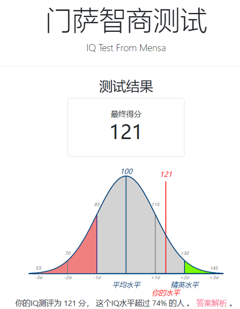
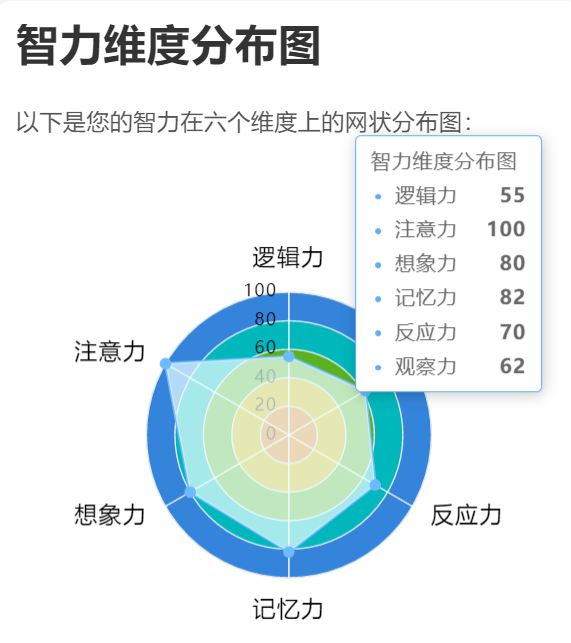
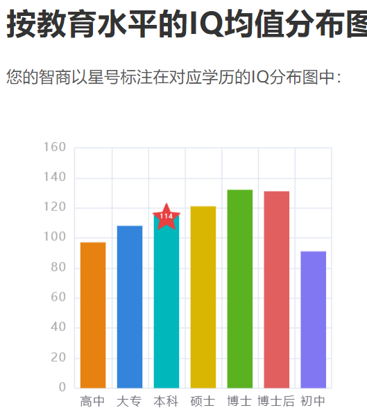
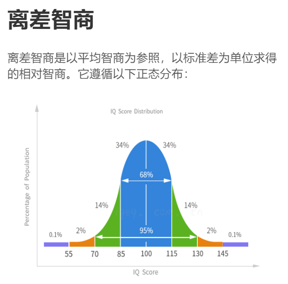
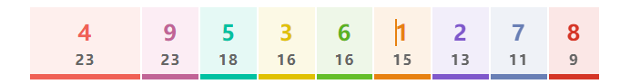
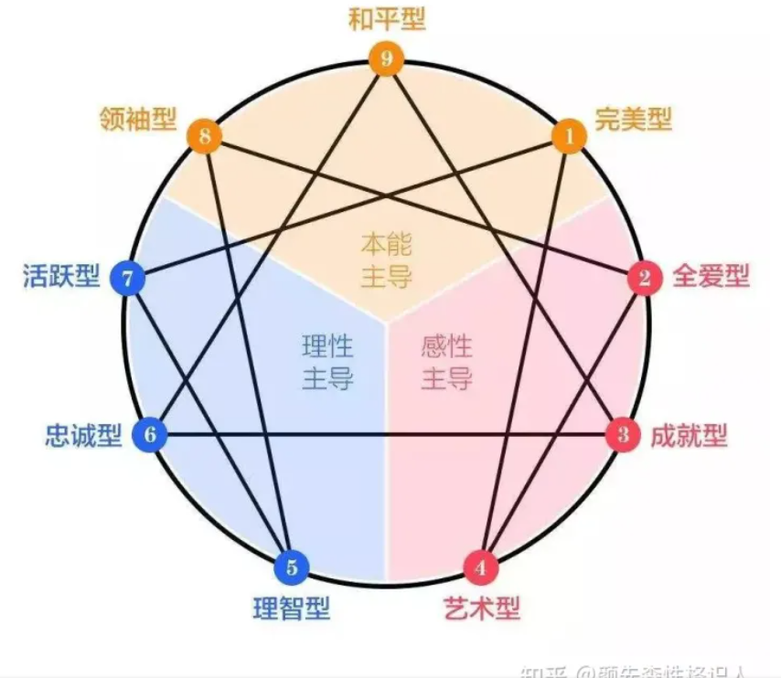
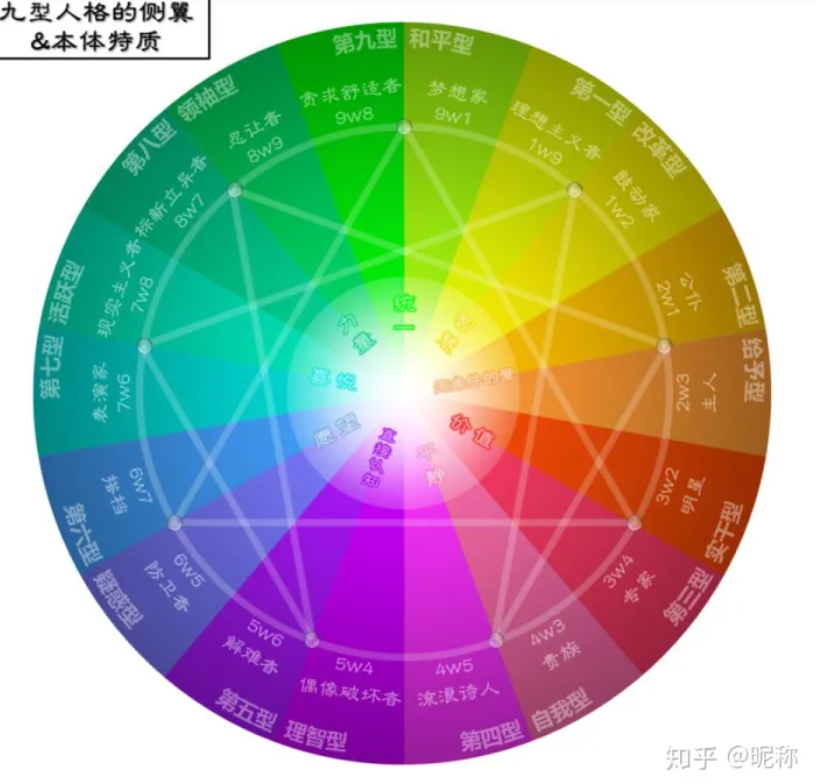
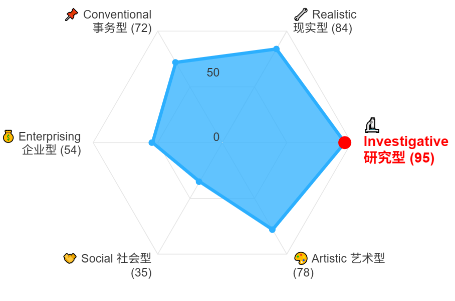

## 测试

### [Realme情商测试](https://www.arealme.com/eq/cn/)

选题困难有趣

哈佛心理学博士Daniel Goleman（1946.3.7 - ）所设计，共10题。

### 智商

#### [门萨智商测试](https://www.webhek.com/post/iq-test/)

{width="3.028242563429571in"
height="3.8916666666666666in"}

#### [测智网 智商](https://iqeq.com.cn/baogao/2121574943401.html)

号码：19963817447 查询码：7447

{width="5.768055555555556in"
height="1.9395833333333334in"}

{width="2.6597222222222223in"
height="2.857168635170604in"}

逻辑力 55 注意力 100 记忆力 82 想象力 80 反应力 70 观察力 62

我适合什么职业？

创意与内容创作类
职业示例：作家、编剧、广告文案、内容创作者、插画师、动画设计师

优势匹配：高注意力和想象力使您能够专注于创作过程，丰富的记忆力有助于构建复杂的故事情节或创意概念。

🧠 教育与培训类
职业示例：中小学教师、培训讲师、教育内容开发者

优势匹配：出色的注意力和记忆力有助于教学准备和课堂管理，良好的想象力可以使教学内容更生动有趣。

🧘 心理与人文关怀类
职业示例：心理咨询师、社工、职业生涯规划师

优势匹配：高注意力和记忆力使您能够深入理解他人需求，良好的想象力有助于提供个性化的建议和支持。

📊 数据与信息处理类
职业示例：数据分析师、信息管理专员、档案管理员

优势匹配：强大的注意力和记忆力有助于处理大量信息，反应力和观察力支持数据的快速分析和解读。

{width="2.5471172353455818in"
height="2.8986111111111112in"}

{width="2.732260498687664in"
height="2.694443350831146in"}

#### [raven瑞文智商测试](https://baijiahao.baidu.com/s?id=1604599533007861985)

2024年12月29日 周日 03时12分05秒

|      | A    | Ab   | B    | C    | D    | E    |      |
| ---- | ---- | ---- | ---- | ---- | ---- | ---- | ---- |
| 1    | 4    | 4    | 2    | 8    | 3    | 7    | 1    |
| 2    | 5    | 5    | 6    | 2    | 4    | 6    | 2    |
| 3    | 1    | 1    | 1    | 3    | 3    | 8    | 3    |
| 4    | 2    | 6    | 2    | 8    | 7    | 2    | 4    |
| 5    | 6    | 2    | 1    | 7    | 8    | 1    | 5    |
| 6    | 3    | 1    | 3    | 4    | 6    | 5    | 6    |
| 7    | 6    | 3    | 5    | 5    | 2 5  | 1    | 7    |
| 8    | 2    | 4    | 6    | 1    | 4    | 6    | 8    |
| 9    | 1    | 6    | 4    | 7    | 1    | 3    | 9    |
| 10   | 3    | 3    | 3    | 6    | 2    | 2    | 10   |
| 11   | 4    | 5    | 4    | 1    | 3 5  | 4    | 11   |
| 12   | 1 5  | 2    | 5    | 2    | 6    | 5    | 12   |

答案勘误：E12正确为5、A8为2

错 3

69	IQ：120

### 测智网人格测试

#### [MBTI-ISTP不准确](https://iqeq.com.cn/baogao2/2121582436561.html) 

号码：19963817447 查询码：0840s2

#### [真爱-迷恋测试](https://iqeq.com.cn/baogao2/2121585118427.html)

号码：19963817447 查询码：0840s2

#### [九型人格](https://iqeq.com.cn/baogao2/2121595614623.html)

号码：19963817447 查询码：6381

9号人格-和平型-一个和平者 && 4号自我型（感觉型）-一个浪漫主义者

{width="5.768055555555556in"
height="0.7895833333333333in"}

4w5

{width="4.864923447069116in"
height="4.227083333333334in"}

{width="5.055555555555555in"
height="5.055555555555555in"}

**第四型――感觉型**/
第四型想要逃避生命平凡的事物，总爱突出自己与人不同。由于自己丰富的感性，许多时得不到别人的理解和认同，容易产生"孤独感"。若第四型减少对得不到的事物理想化及挑剔已得到的东西,便可以更珍惜眼前所拥有的一切。

**建议**

告诉别人你的感觉，而不要别人来猜

讨论时要提防自己陷入情绪化的反应

多点理智

不要过于沉溺过去

控制自己的情绪

**切记**

你要明白陷在自己的情绪里解决不了任何问题！

沉溺于过去的痛苦不如沉溺于对某事物的迷恋。

**第九型――和平型**

第九型因为不善表达自己，许多时侯没有自己的立场；但反而能设身处地为别人着想，接受、了解别人的意见。有时他们对事情含糊其词、有时又喜欢逃避现实。第九型突破的关键在于勇于讲出自己内心的想法和感受，不要抑制自己内心的愤怒，而变得"阳奉阴违"。

**建议**

如果你感到生气，请说出来

尽可能切中重点

多作响应，以免别人以为你拒绝

尽量避免过于太被动

多点危机感

**切记**

你要勇于面对自己，时刻关注自己的立场！

#### [霍兰德职业倾向测试](https://www.arealme.com/holland-code-career-test/cn/)

霍兰德职业性格代码：IRA，具体结果：

[本地存储](F:\Files\My_Library\Books\Psychology\在线测试报告\我的霍兰德职业性格测试结果是：🔬 Investigative 研究型_ 95, 🔧 Realistic 现实型_ 84, 🎨 Artistic 艺术型_ 78, 📌 Conventional 事务型_ 72, 💰 Enterprising 企业型_ 54, 🤝 Social 社会型_ 35.html)

霍兰德编码：IRA

适合职业：地理学家、地质学家、声学物理学家、矿物学家、古生物学家、石油学家、地震学家、声学物理学家、气象学家、原子和分子物理学家、电学和磁学物理学家、设计审核员、人口统计学家、数学统计学家、外科医生、城市规划家、气象员。

霍兰德编码：IRC

适合职业：飞机领航员、飞行员、物理实验室技师、文献检查员、农业技术专家、生物技师、动植物技术专家、油管检查员、工商业规划者、矿藏安全检查员、纺织品检验员、照相机修理者、工程技术员、编计算程序者、工具设计者、仪器维修工。

### 医院测

[*测智商*一定要到正规精神科*医院*，不要用小网站](https://zhuanlan.zhihu.com/p/558014707)

这篇文章提一个醒：[智商测试](https://zhida.zhihu.com/search?content_id=212136112&content_type=Article&match_order=2&q=智商测试&zhida_source=entity)一定要到正规医院。而且必须是顶级的精神科医院。因为很多测试的方法，使用在线的方法没法测的。

那些所谓的在线测试智商的方法，其实都是模拟。在临床上，一般对儿童用瑞文，中国针对成年人一般使用韦式wais rc。具体的说应该是[龚耀](https://www.zhihu.com/search?q=龚耀&search_source=Entity&hybrid_search_source=Entity&hybrid_search_extra={"sourceType"%3A"answer"%2C"sourceId"%3A2639971937})先八几年针对中国的修订版，分成农村和城市。

成年人可以到医院测智商吗 需要挂哪个科? - 叶茗的回答 - 知乎
https://www.zhihu.com/question/603142466/answer/3072280647

心理科，神经内科/外科 精神科，建议去综合实力较强的医院，用的是新版的测试，测试结果更符合实际情况 ，成人测试可选用的量表有斯欧非言语智力测试中国版（6-40岁）韦氏成人智力量表第四版中文版（16-90岁）

发布于 2023-06-13 19:32

[如何测验自己的*智商*呢？](https://www.zhihu.com/question/4288914119/answer/36904654133)

成年人如果想要到医院测智商，一般需要挂[神经内科](https://zhida.zhihu.com/search?content_id=700496578&content_type=Answer&match_order=1&q=神经内科&zhida_source=entity)或者精神心理科，也可以去专科医院的精神卫生中心或者[认知功能障碍](https://zhida.zhihu.com/search?content_id=700496578&content_type=Answer&match_order=1&q=认知功能障碍&zhida_source=entity)科。费用因地区和医院而异，一般在两三百元到七八百之间。很多医院还在使用[韦氏第三版](https://zhida.zhihu.com/search?content_id=700496578&content_type=Answer&match_order=1&q=韦氏第三版&zhida_source=entity)，因此准确性可能不是那么高。所以可以找著名高校，或者专门研究[心理测试](https://zhida.zhihu.com/search?content_id=700496578&content_type=Answer&match_order=1&q=心理测试&zhida_source=entity)的公司。我之前研究了好几家比较出名的测评公司的测评网站，结果发现[寸辛综合智商测试](https://link.zhihu.com/?target=https%3A//www.baidu.com/link%3Furl%3DYyDOml_uPXR4c8i-jH25gC79rndqfoE2MKjWpUaLbGKo3v8acbC4mCPSiIVeqgnO%26wd%3D%26eqid%3Db402fd780000020b00000006642fe5ed)准确性是相对比较好的，从知识储备、语言理解、工作记忆、[空间思维](https://zhida.zhihu.com/search?content_id=700496578&content_type=Answer&match_order=1&q=空间思维&zhida_source=entity)、逻辑推理五个部分，全面测量智力水平，是一个较为完善的智商测量工具。主要是那些企业招聘选拔人才时使用。现在有朋友或者学生问的话，我一般是让他去测这个。*[寸辛综合智商测验](https://link.zhihu.com/?target=https%3A//www.baidu.com/link%3Furl%3DYyDOml_uPXR4c8i-jH25gC79rndqfoE2MKjWpUaLbGKo3v8acbC4mCPSiIVeqgnO%26wd%3D%26eqid%3Db402fd780000020b00000006642fe5ed)*当然，再过几年的话，结果就不好说了，毕竟时代一直在发展。

[发布于 2024-11-21 11:12]()

#### 湘雅附二

[*长沙*最好的精神病*医院*，长沙市精神卫生中心是哪家？](https://www.zhihu.com/question/31657651/answer/2176153197)

湘雅附二啊，[精神科](https://zhida.zhihu.com/search?content_id=425745570&content_type=Answer&match_order=1&q=精神科&zhida_source=entity)据说全国排名第三。长沙市[精神卫生](https://zhida.zhihu.com/search?content_id=425745570&content_type=Answer&match_order=1&q=精神卫生&zhida_source=entity)中心应该是长沙市精神病医院（长沙市第九医院）吧，但是是[二级医院](https://zhida.zhihu.com/search?content_id=425745570&content_type=Answer&match_order=1&q=二级医院&zhida_source=entity)

[发布于 2021-10-18 10:44](https://www.zhihu.com/question/31657651/answer/2176153197)

#### [*医院智商*测试准确吗？](https://www.zhihu.com/question/2749702936/answer/20273757918)

说出来你可能不信，医院做的智力测验结果也不一定准。

以韦氏智力为例，目前国内刚开始使用第四版不久，很多还在用第三版。但我要告诉你的是，韦氏智力其实已经出到第五版了。可能不了解权威智力测验的朋友，不太明白其中差异，那就具体讲一下。

一套智力测验是具有时效性的，一旦用过使用的时间较长就一定要进行更新，这个更新不仅是题目，更重要的还有量表的常模。先说测题，像我刚才说到的韦氏第三版，也是国内目前用得最多的一版，其实是1991年编制的。你再网上随便搜索韦氏测题能找到的也是这版，而智力测验的测题其实是有保密性质的，原则是不允许传播的。

如果一套智力测试你原本做过了好些题目，那么它还有准确性可言吗？而且这里不仅仅是你有没有接触过智力测试的问题。因为当这些测题编制的时间一久，经常会被一些人拆分成平时就能看到智力问答，乃至平时的数学题中。所以哪怕你没有接触过韦氏测题，生活中其实也是可能接触过的。

再所有测验的核心，常模问题。

智力测验其实是比较特殊的，因为有一个现象就是，随着时代的发展，人们的客观智力水平是一直在提升的。这一点不需要去看专业的文献，如果你在生活中稍微观察一下就能发现，现在的小朋友是一代比一代聪明了。一套九十年代的常模，绝不适合用于2021年的我们。以现在三十岁的我们为例，三十年前，同样处于三十岁那批人的整体智力水平能和我们现在这批三十岁的群体相比吗？显然是有明显差距的。

然后，我们回头看一下韦氏的发展，韦氏测验最早在1949年由美国心理公司( The Psychological Corporation)出版,1974年有修订版(WISC- R), 1991 发展出第三版(WISC-Ⅲ),到2003年出版了的第四版(WISC- IV)，至于第五版早就已于 2014 年，但目前国内其实基本是看不到第五版影子，第四版都很难看到。

最后，如果真有人确实想了解自己的客观智力水平，我是建议去进行寸辛的寸辛综合智商测验，应该是18或是19年才出的，用的也是国内自己的常模的，但注意肯定是收费，主要是用在企业人才招聘的测评，所以没有特别想知道自己智力水平的话，没有必要去做这个测试。

寸辛综合智商测验

发布于 2024-11-01 14:04)

#### [*医院*做的*智商*检测靠谱吗？能真实反映智力水平吗？](https://www.zhihu.com/question/667825749/answer/61196319932)

能一定程度上反映你的基本情况

比如，是不是智障

上限它是测不出来的

但是它有一定的筛选作用

纯智力低的人用它非常方便就能刷出来

比如我曾经在网上找到一个看着非常简单的题

试了试

110

过了一段时间又想起来了

又试了试

110

嗯，挺准

说明我纯智力上不是智障，挺好，哈哈

至于用这个测试刷出来的所谓全球最聪明的人

这东西就比较扯了

它没有能力测出天才的创造力

而决定高智商人群纯智力高低的最核心部分

就是在数学上的创造力强弱

这题在这方面等于摆设

天才做这个题肯定会高分

除去有阅读障碍啥的问题的 导致的不准

正常是一定会高分

如果你没测出高分

恭喜你，纯智力一定不高

如果你测出很高的分，说明属于高智商范畴

你有了入场券

至于互相之间的比分，没啥必要

没什么意义，他不一定比你差，哪怕你分更高

发布于 2024-12-22 15:11

## 理论

### [你好奇过自己的智商吗](https://www.bilibili.com/video/BV18LxFzYEm6)

#### 擅长记忆和抽象逻辑推理的能力成反比

你是瓜娃子咩

从科学的角度，为什么擅长记忆和抽象逻辑推理是一对trade off，好奇，因为和本人情况相似
2025-10-26 03:28 👍49

杨雨坤-Yukun

 因为符号抽象往往需要遗忘细节
2025-10-26 03:33 👍93

半桶豆油

为什么擅长记忆事物的细节和擅长抽象逻辑推理是此消彼长呢？假设作为侦探🕵️‍♂️来说，不就是既需要快速检索出事物发生的细节，又要合理运用逻辑推理嘛？而且我觉得自己也是既擅长记忆细节又擅长逻辑推理，，
2025-10-26 05:27 👍26

序列元件_穷墨合金

其实不是此消彼长，只是极其罕见。
比方说，有10%的人记忆能力强，有10%的人抽象思维好，而两者都强的人就只有2%。如果在统计的样本中忽略了那2%，就会误以为它们此消彼长。实际上它们反而是相辅相成的。
这个现象的名字叫做“模拟谬误”。描述的是“因为样本偏差，导致原本的正相关或无相关被误认为负相关”这一现象。
再强调一下，一般情况下，智力技能之间都是相辅相成的关系，只是有时候需要我们梳理清楚。
2025-10-26 06:21 👍38

### 阿斯伯格独处思考 大脑突触连接多

浪费硬币__

 回复 @火女薇洛 :如果改造基因改造出来一个不聪明的自闭症怎么办？学过脑科学的都知道，所谓聪明就是大脑突触，相互连接的数量，因为自闭症或者阿斯伯格综合症比较内向，除了自我思考和不断思考，就没有做任何其他的事情了，大脑突触连接自然会变得非常多
2025-02-15 07:21

### 智商的充分且必要条件是神经突触连接数量

浪费硬币__

 回复 @一树梨花压海棠-_ :还真不是，智商不是跟疾病挂钩，疾病不是智商的充分且必要条件，智商的充分且必要条件是神经突触连接数量，神经传导速度只是反应速度，一个问题，你立马就能反应出来，他的答案是什么？但是由于神经突出，连接较少，你给出的答案可能是错误的，或者你给不出答案，但是你能反应出来，如果神经突触连接较多，但是神经传导速度较慢，你长时间思考就可以思考出问题的答案，但是别人要是立即叫你回答，你可能需要短时间才能回答出正确答案，就比如跟你说西瓜，你就会关联到夏天
2025-02-15 07:27

### **注意力“跑偏”，记忆力“跑丢”**
[数字时代，青壮年记忆力为啥减退----中国科学院](https://www.cas.cn/kj/202011/t20201102_4764935.shtml)

研究人员通过受试者的脑电波活动和瞳孔直径的变化评估他们的注意力分散情况。受试者还要填写问卷，来评测他们每周的媒体多任务操作量、注意力缺陷多动障碍症状、冲动性、打游戏的情况、注意力和心智游移的趋势。

结果显示，记忆前一刻的注意力分散，与记忆的神经信号减少以及遗忘有关。

#### **并不是适合大脑的运作方式**

研究团队指出，更频繁的媒体多任务操作，或与注意力分散频率增加有关，而这种趋势会导致情景记忆力变差。

显然，同时处理完成更多的媒体任务，看似是很有效率的做法，但实际研究表明，这并不是适合我们大脑的运作方式。斯坦福大学稍早一项研究也表明，媒体多任务对人的认知能力和信息处理能力存在影响，我们人类大脑的认知资源有限，当我们尝试一次做多个任务时，任务完成速度就会减慢。

而无论是注意力“跑偏”，还是记忆力“跑丢”，皆得不偿失。

### [水哥为何反对记忆法？？](https://www.bilibili.com/video/BV11s4y1L75S)

[葡萄声明](https://space.bilibili.com/7106358)

然而鲍橒亲口表示，在这一点上他和水哥的观点是一致的，即“记忆术弊大于利，除非你是为了表演”。你是不是也要说鲍橒是懂记忆法的，但懂的不多啊![[喜极而泣]](psychology-IQ&EQ.assets/485a7e0c01c2d70707daae53bee4a9e2e31ef1ed.png@40w_40h.avif)。 我搬运一下鲍橒的原话吧： “通过记忆术所记住的内容往往是对真实记忆内容的严重扭曲，你不是真正地理解了你所记忆的内容，比如通过记忆术学到的英文单词根本无法用于流畅的对话和英语思维，材料本身逻辑上的联系在记忆中被破坏了，这会导致我们记忆内容的碎片化，并阻碍新记忆的内容与自己先前的知识经验发生整合，而这种理解与整合是进一步对知识应用于创新的基础所在，从这个意义上讲，通过记忆术学习到的内容根本无法内化成自己的知识体系。因此在认知科学与脑科学的对于有效记忆的研究当中，记忆术从来不是研究的重点，也不是任何一个心理学家和脑科学家会重点推荐的方法。不过，我们也应当说，记忆术作为一种辅助记忆的手段，在有些不需要对记忆的内容进行深入理解的场景中还是有一定的应用价值。例如，要按顺序背诵一些讲话内容，或是需要记忆大量的数字信息等，在这些场景中，我们的目的就是尽可能准确地记住材料，而不太需要深刻地理解其含义。就像是去参加记忆比赛，这时候记忆术就是一个很好的记忆手段。” 不过既然你是利益相关，我完全理解你发这个视频的意图。

2023-03-03 18:08 👍369

#### 物理本科生 公式只有多推多用才可以记忆

爱物理的凡人航

物理本科生支持水哥，我想up想的和水哥不一样第二条，水哥就是单纯指记忆宫殿这种联想记忆法，没有泛指学习生活中的其他记忆法，我们理科生的记忆法没有别的，就是多推，公式只有多推多用才可以记忆，所谓那些记忆法可以将一个物理概念记得很牢固，但卵用没有，其背后的物理内涵和数学逻辑根本没有体会到，我不否认它对人类创造的价值，但我认为它确实不是一种好的对世界记忆的方式，它总是用熟悉的东西去记不熟悉的东西，殊不知大自然或者人文社会就是有大量的不熟悉未知才会使人类进步，人类只有真正将不熟悉熟悉了而不是借助一些逻辑去转化概念才能变得强大！以上的它均指狭义的记忆宫殿记忆法，别的我不知道没有发言权
2023-03-03 18:20 👍129

### [获得「世界记忆大师」称号的人真的「过目不忘」吗？ - warfalcon的回答 - 知乎](https://www.zhihu.com/question/20692813/answer/15879173 )

#### 适合文科

向豪哥学习搞钱

 理科确实不太用得上记忆法，我初中的科学这个课公式记不住，但是知道原理，考试直接推，还是可以接近满分，但是对于文科那样的知识密集的科目记忆法很有用的
2023-03-03 18:35 👍6

#### 因为认识、理解事物本身而自然产生的记忆 对于真正的学习几乎没什么用 记忆虽然短时间能记住大量陌生的东西

蓝夜静雪

 非常同意你的观点，这也是为什么水哥说离真相越来越远，我也更推崇因为认识、理解事物本身而自然产生的记忆，而非那些机械的脱离事物本身的为了记忆而记忆的方式。我上学时也曾报过记忆宫殿的班，学过一段时间，后来放弃了，就当是体验一种游戏吧，对于真正的学习几乎没什么用，多此一举，对我来说不实用，何必走那个弯路呢？而且这种记忆虽然短时间能记住大量陌生的东西，但是不长久，而且久了会乱，确实更适合拿来表演。
2023-03-03 21:09 👍6

#### 记忆法需要检索 实际运用时并没有时间让你做地图展开

gamelife40v

因为记忆法需要检索，实际运用时并没有时间让你做地图展开。除非你的运用是文科类考试、写作这种非实时性的场景。
例如在实时对话中，你不可能用记忆检索来跟上嘴巴说话的速度，如果每个单词都要从记忆中一个一个检索而不是脱口而出，那就做不到流利的对话。
真正实际运用知识的场景，不仅是记忆，而是真正理解和融会贯通。

理科生表示记忆法几乎没用。就算把所有基础定理公式写给我，做不出的题还是做不出。

记忆法最大的误导就是让你以为你学会了（背出来了），而不是真正理解了。
2023-09-17 03:53 👍2

#### 9天背1500道题 过了一年半，由于没有复习过，题都差不多忘光了

JFangYQ 老粉
亲测记忆法背题无敌[喜欢]9天背1500道题，没有用到记忆宫殿，只靠关键词的联结和想象。虽说现在过了一年半，由于没有复习过，题都差不多忘光了，但当时在面对大量记忆的需求时，合理使用记忆法的帮助还是非常大的
2023-03-03 14:34 👍61

JFangYQ

 回复 @玄洲仙伯 :当你面对10天内必须要记住1500道题的情况时，直接用方法背，会比理解性的学习记忆要高效且轻松得多，至少以我的学习理解能力，10天我是拿不下这么庞大的知识体系的[doge]当然还有一个前提我没说清楚：当时背这些题只是为了应对应试需求
2023-03-04 17:26 👍9

地欲Dom

 水哥说他自己是天生就会这个东西，在接触了记忆法之后甚至还纳闷怎么会有人专门去学这个东西[笑哭]
2023-03-05 08:58 👍1

#### 工作记忆测试（数字正背倒背）

[张樱耀](https://www.zhihu.com/people/093ded8c92fa7e8f9da3616692d8fef0) -> [warfalcon](https://www.zhihu.com/people/d9adc24d8a761eebf51e9e87a635fa87)

其实光简单的工作记忆测试（数字正背倒背），挺多记忆大师的表现就和普通人没啥差别了，更别说双任务的工作记忆测试或是复杂得多的实际学习。

2015-06-06

### [获得「世界记忆大师」称号的人真的「过目不忘」吗？](https://www.zhihu.com/question/20692813/answer/66395585192)

世界记忆大师有一定的含金量，他们这群人是有天赋的，正常人比不了。我自己就做过这种记忆法训练，2014年最强大脑节目很火的时候开始，我就在网上找寻资料学习，比如记忆宫殿，地点桩，数字编码等。但是我发现我和记忆大师的差距不是一星半点，虽然我自学了10年，找过无数地点桩，编码数字背的滚瓜烂熟，上课下课，玩手机，参加社会工作，无时无刻都在研究记忆法。因为本身记忆力差，也听网上说记忆力可以通过锻炼提高，所以就一直热衷这样的记忆训练。训练到后面的结果是什么呢，如果刚开始5分钟能记住80个数字，那么后面多记几十个数字就开始吃力了，时间越来越长，越来越记不住直到隔了几天，忘记了前面所记的一串数字，才能记住新的数字，而以前记住的内容早已忘光光。举个简单的例子，就好比大脑是一个仓库，每个人的仓库大小是不同的，有的人容量大，有的人容量小，但是它的储存空间是有限度的，你要么忘记一些才能记住新的，要么记住新的忘记以前的，就这么个理。有人开始问，那你训练了个10年，有什么本质性的提高了吗？有，对于数字的专注度高了，虽然不能像记忆大师那样将数字记得滚瓜烂熟，但是对于数字的敏感度比一般人高一些，比如别人念一串手机号码速度很快，我能迅速反应并记下来，在快递架上找快递，看见数字能迅速找出来。所以大家也不要觉得学了这种方法没啥用，全凭个人爱好，说不定能培养个什么特长出来，总比什么都不学要好！

[发布于 2024-12-29 00:11]()

### [父母和孩子智商相关性](https://www.zhihu.com/question/20790548/answer/34361391)

Reed and Rich, Parent-Offspring Correlations and Regressions for IQ, Behavior Genetics, Vol. 12, No. 5, 1982

智商相关性

妈妈-孩子0.464

妈妈-女儿0.486

妈妈-儿子0.443

爸爸-孩子0.423

爸爸-女儿0.438

爸爸-儿子0.411

### [智商基因是不是在X染色体上](https://m.medsci.cn/article/show_article.do?id=ca90828021f)

最近的研究发现，Y染色体也影响智力，而常染色体对智力影响较X染色体更严重。已经发现，约70个位于非性染色体上的基因会影响智力。5、9、10、13、18、21、22号染色体异常均导致严重智商障碍，相比之下，X染色体对智力影响实在算不上大。

影响孩子智商的遗传因素并不是决定性的，后天的培养和塑造更加关键。父亲母亲和子女的智商都有着关系，但哪一方都不起决定作用。国外的研究发现，父亲和儿子智商的相关度为0.411，母亲和儿子智商的相关度也仅为 0.443 (相关度越接近1，两者相关性越强)，这不足10%的差距实在是微乎其微。

### [一只叫做Apollo的非洲灰鹦鹉，和它的训练者的对话...真的有这么聪明吗？](https://www.bilibili.com/video/BV1tm4y1H7PA/)

雅牧

 回复 @Ronnie_James_Dio : 错误的，自己去看Birds have primate-like numbers of neurons in the forebrain这篇论文，论文显示，同体重鹦鹉科的皮层神经元比鸦科数量多，渡鸦比黄蓝金刚体重大，但皮层神经元数量比黄蓝金刚少多了，但是鸦科有更发达的小脑。
2023-09-29 20:06 👍20

[雅牧](https://space.bilibili.com/811700)

回复 [@Ronnie_James_Dio](https://space.bilibili.com/16452300) : 更多的皮层神经元数量，意味着可以编码更多的信息，包括语言、社交信息等，这可以解释为什么鹦鹉语言能力比乌鸦们更强。研究显示，鹦鹉和人类趋同进化，鹦鹉和其他鸟类的关系，就像人类和其他灵长类一样，很特别（体现在寿命和智能上）。相关文献：Parrot Genomes and the Evolution of Heightened Longevity and Cognition

2023-09-29 20:12 👍13

### [聪明的人基本上大脑结构上优于普通人](https://www.bilibili.com/video/BV1tZ4y187BW/)

其实我专门收集过关于人类智商差异方面的论文，最后总结出的结论是，聪明的人基本上大脑结构上优于普通人。这些结构差异出现在大脑皮层的关键记忆和认知管理的部位，尤其是大脑额叶，顶叶等等，以及聪明的人神经元是择优分布的 拥有更短和高效的神经元连接。这些差异并不是后天努力能改变的
2022-06-01 16:46 👍4

## [记忆法示例](https://www.zhihu.com/question/20692813/answer/20220079)

### 数字编码转谐音图像转画面

在培训机构当过记忆术的培训老师，接触过这些世界记忆大师，不过是普通人而已。

「世界记忆大师」的三条标准2 分钟内记住一副无规则扑克牌的顺序；1 小时内记住 10 副扑克牌的顺序；1 小时内记住 1000 位以上无规律数字。。。如果你经过训练，也可以做到，每个人资质不同，训练的时间长短不同罢了。而且这三条标准都是同一个记忆的道理。

比如要记忆06728813225762，

先要给它们设定特定的图像，06编号为手枪，72编号为企鹅，88编号为爸爸，13编号为医生，22编号为双胞胎，57编号为武器，62编号为牛儿，

06728213225762就是手枪企鹅爸爸医生双胞胎武器牛儿，

采取连锁记忆法的时候就可以记忆为手枪砸到企鹅，企鹅咬住爸爸；爸爸揍医生，医生抱着双胞胎，双胞胎含着武器，武器砍在牛儿身上……

采取定位法的时候，采取固定的位置和顺序，例如进入自己家里的客厅，会遇到鞋柜，鞋柜前边是固定的凳子，凳子前面是VCD机，机子前面是纸巾盒，纸巾盒前面是很大的摆钟，摆钟旁边是植物……那么手枪卡在鞋柜上，企鹅坐在凳子上，爸爸在开VCD机，医生正在抽纸巾，双胞胎抱着钟摆荡秋千，武器砍碎了植物……

这么一来，就把这一串没有规律数字记忆下来了，多训练几次还可以做到倒背如流，是不是很腻害？所谓2 分钟内记住一副无规则扑克牌的顺序；1 小时内记住 10 副扑克牌的顺序；1 小时内记住 1000 位以上无规律数字。。。都是这么记忆的，不过会更有技巧一些，比如四个数字一起记忆。

而所谓的将一本书倒背如流，三字经，第几页第几句，也是抽取重点字，图像化，然后与编号相连接。再举个例子，《千字文》第十一句话：“始制文字，乃服衣裳”，11的编号为筷子，抽取的重点字词为“始制文字”、“乃服”，图像化为“十只蚊子”、“奶粉”，连接为图像“十只蚊子拿着筷子去夹奶粉”。当我要回忆第十一句话是什么的时候，我就会想到这个图像“ 十只蚊子拿着筷子去夹奶粉 ”，进行还原就是”始制文字，乃服衣裳“。

看文字好像很繁琐，其实做起来很快的，即使特别特别笨的人，一分钟就只是这么记忆一句话，一百句也就是一百分钟。整本千字文才多少句话呢？比起让他不用记忆术背下来要快多了吧，效果也比没有用记忆术的记忆要好多了。

至于说到这样记忆不能理解文章，这就是另外一个话题了。我只是介绍这些所谓的记忆大师，是怎么记忆东西的。

说到底，记忆术就是一些记忆的技巧，说它没有用，也的确很有用，说它很有用，也不过如此，就像是一个工具，不用他也可以，用了能提高一点效率，至于你能不能做得完所有的工作，不在于你有没有用工具，而在于你有没有去做。所以，学习记忆术的确可以提高自己记忆的效率，但是自己记不记得住，重点在于自己去不去记。

相信每个人都有过这样的体会，有些东西自己没有费力去记忆，但是就是能够记忆的很快很清楚，比如自己的孩子什么时候生日，比如自己的TA喜欢什么口味的东西，比如工作上的一些细节别人不记得可是自己会记得特别清楚，原因就在于自己是不是想要去记忆，有没有特的去记忆过。所以记忆力不好，很多时候是自己不想去记忆罢了。

所以

获得「世界记忆大师」称号的人真的是天才吗？是不是记任何东西都是过目不忘？

你说呢？

只要你愿意，你也可以啊！

发布于 2013-11-20 17:15

#### 背诗词 几年都不忘

走之旁
在背诗词的时候用这种方法有用么？用这种方法记忆的诗词能过几年都不忘或者需要用到的时候就能想起来么？
2014-11-19

[不求甚姐](https://www.zhihu.com/people/f013728ea041c27923b60c93d4344d88) 作者 [走之旁](https://www.zhihu.com/people/25abe8abb3668c8de4b1cce92c60cd3f)

都可以，自己设计的会更好记，别人的模板也可以参考，注意图像特点鲜明，不要重复即可。比如有人39是香蕉，89是芭蕉，两个就很难区分，在回忆的时候就会混淆；尽量不要有相近的图像，如15被设定为鹦鹉，37设定为山鸡，两者图像如果相近，回忆的时候不排除只想起一只鸟而记不起是山鸡还是鹦鹉。

2014-11-20

### 文字浓缩转谐音转画面

#### 1、电影下着金

[tomato](https://www.zhihu.com/people/fc5f10263abfcbc42968d56e8b76a577)

你好能说下记忆纯文字考试的方法么我举个例子：
电器交接试验应注意的事项
1：在高压试验设备和高电压引出线周围，均应装设遮栏并悬挂警示牌
2：进行高电压试验时，操作人员与高电压回路间应有足够的安全距离
3：高压试验结束后，应对直流试验设备及大电容的被检测设备多次放电，放电时间至少1min以上
4：凡吸收比小于1.2的电动机，都应先干燥后进行交流耐压试验。
5:断路器的交流耐压试验应在分合状态下分别进行
6：。。。。
7。。。。。
考试就是这样类型东西，咋个记忆比较有效能快呢？

2015-05-06

十分抱歉，今天才看到你的评论。纯文字记忆的还是很好拿分的。比如你举的那个例子： 电器交接试验应注意的事项 1：在高压试验设备和高电压引出线周围，均应装设遮栏并悬挂警示牌 2：进行高电压试验时，操作人员与高电压回路间应有足够的安全距离 3：高压试验结束后，应对直流试验设备及大电容的被检测设备多次放电，放电时间至少1min以上 4：凡吸收比小于1.2的电动机，都应先干燥后进行交流耐压试验。 5:断路器的交流耐压试验应在分合状态下分别进行 6：。。。。 7。。。。。 后面没打全，我就设计为六项注意事项好了。记忆线索选择“电器交接实验”六个字。第一项选择关键字引、线，遮、警，连在一起就是电引线遮警，谐音电影下着金，并想象画面。第二项选择关键字回路、距离，连起来器回路距离，谐音妻贿赂居里（夫人）并想象画面。第三项选择关键字直大多一，连起来交直大多一，谐音脚趾大多溢，并想象画面。第四项接先干后压，谐音姐先干后压了1.2小时。第五项试断压分合，谐音食断鸭分盒……复习时先看“电器交流实验”背出六句话，一一还原至原记忆内容。第一次第二次略困难，后面就容易多了。考试时看着题目就能还原答案。有七项注意内容怎么办？记忆线索加一个字。不会谐音怎么办，搜狗大法好。看起来好麻烦怎么办？你试一试再说吧。对学习和理解没什么帮助怎么办？妈蛋你问的是怎么背下来而不是怎么学习啊！都考完了你才回复我怎么办……那留着下次考试用吧……

2015-07-21

### 记忆宫殿站桩法

家为一层楼、楼里面有房间，多个地方可以并成多层的楼。家中的物品为桩。

作者：*记忆*女郎
链接：https://zhuanlan.zhihu.com/p/28318523
来源：知乎
著作权归作者所有。商业转载请联系作者获得授权，非商业转载请注明出处。

### [数字编码 记扑克牌](https://zhuanlan.zhihu.com/p/28318523)

#### **前言**

​     **记忆一副扑克牌是快速记忆力的入门[训练方法](https://zhida.zhihu.com/search?content_id=3515098&content_type=Article&match_order=1&q=训练方法&zhida_source=entity)之一。**

​       本教程提供完整、系统的训练方法，只要按照这个训练方法去做，每天训练2个小时，只需训练一个月，大部分人都能够获得这样的训练效果：在2-3分钟之内记住一副扑克牌。

​      获得“[世界记忆大师](https://zhida.zhihu.com/search?content_id=3515098&content_type=Article&match_order=1&q=世界记忆大师&zhida_source=entity)”这一称号有几个考核标准，其中一个标准就是能够在2分钟之内记住一副扑克牌。

​       因此可以说，按照这个方法训练，大部分人都能够在一个月之内获得世界级的记忆力！部分认真、努力的人甚至只需要半个月的时间，就能够达到这一训练效果，一个月之内就可以做到在100秒内记住一副扑克牌。

 **“记忆一副扑克牌”训练，是帮助你成为“世界记忆大师”的入门训练！**

​     快速记忆能力主要由联想能力与编码能力所组成，扑克牌训练就是锻炼这两种能力的最好的方法之一。

​     通过在最短时间内记忆一副扑克牌的训练，我们可以深刻地体会到快速记忆的整个过程是怎样的，到底是什么在影响着我们记忆的速度。

​     通过记忆扑克牌训练，我们的联想能力得到大幅度的提高，我们对编码法、[定桩法](https://zhida.zhihu.com/search?content_id=3515098&content_type=Article&match_order=1&q=定桩法&zhida_source=entity)的运用有了非常深入的体会，这时，我们就真正掌握了快速记忆的关键，以后再去尝试记任何东西，都会有完全不一样的感受。

​       更重要的是，通过扑克牌训练，我们的想象能力得到很大的锻炼，我们的想象速度被极大程度地调动起来，这对于我们进一步开发右脑潜能、全方位地提高我们的学习能力、创造能力、甚至艺术感受力等等，都有着非常重要的意义。

**这是一扇通向全新世界的大门，走进这个门，你的人生将会从此与众不同！**

**准备工作：**

（60小时达到“世界记忆大师”标准）——每天训练3小时，共训练20天，最后效果为：在2-3分钟之内记住一副扑克牌，倒背如流。这20天的训练分为4个阶段，每个阶段训练5天。

**52张牌（去掉大、小王）的对应密码：**

52张扑克牌为“数字牌”，用数字编码来代替。

**规则为：**

[黑桃](https://zhida.zhihu.com/search?content_id=3515098&content_type=Article&match_order=1&q=黑桃&zhida_source=entity)代表十位数的1（黑桃的下半部分像“1”），

红桃代表十位数的2（红桃的上半部分是两个半圆的弧形），

草花代表十位数的3（草花由三个半圆组成），

方片代表十位数的4（方片有4个尖角）。

黑桃J、Q、K分别用数字51、52、53代替。

红桃J、Q、K分别用数字61、62、63代替。

草花J、Q、K分别用数字71、72、73代替。

方片J、Q、K分别用数字81、82、83代替。

例如黑桃1代表11，黑桃2代表12；红桃1代表21，红桃2代表22，草花3代表33，方片4代表44，依此类推。对于数字为10的牌，可当作0，即黑桃10代表10，红桃10代表20，草花10代表30，方片10代表40。黑桃J为51，方片K为83。

#### **数字编码：**

1——  树；   2——鸭子；   3——耳朵；   4——红旗；   5——钩子；

6——勺子；   7——拐杖；   8——葫芦；   9——球拍；  10——棒球；

11——筷子；  12——婴儿；  13——医生；  14——钥匙；  15——鹦鹉；

16——杨柳；  17——玉玺；  18——篱笆；  19——泥鳅；  20——耳环；

21——鳄鱼；  22——鸳鸯；  23——和尚(james)；  24——盒子(kobe)；  25——二胡；

26——河流；  27——耳机；  28——恶霸；  29——阿胶；  30——森林；

31——鲨鱼；  32——扇儿；  33——仙丹；  34——绅士；  35——珊瑚；

36——[山鹿](https://zhida.zhihu.com/search?content_id=3515098&content_type=Article&match_order=1&q=山鹿&zhida_source=entity)；  37——山鸡；  38——沙发；  39——香蕉；  40——司令；

41——睡衣；  42——[柿儿](https://zhida.zhihu.com/search?content_id=3515098&content_type=Article&match_order=1&q=柿儿&zhida_source=entity)；  43——雪山；  44——石狮；  45——水壶；

46——石榴；  47——司机；  48——石板；  49——雪球；  50——五环；

51——铲子；52——木耳；53——牡丹；

61——儿童；62——炉儿；63——流沙；

71——洗衣机；72——企鹅；73——鸡蛋；

81——蚂蚁；82——耙子；83——大象。

**[记忆方法](https://zhida.zhihu.com/search?content_id=3515098&content_type=Article&match_order=1&q=记忆方法&zhida_source=entity)：**

首先熟悉每张牌所代表的相应图像，然后找到26个地点，记忆的时候，在每个地点上放2张牌，把这2张牌代表的图像与地点进行紧密的联结，26个地点刚好放下52张牌。回忆的时候，把这26个地点在大脑中过一遍，就能快速地回想起相应的52张牌。

**必备工具：**

1、去掉大、小王的扑克牌一副，共52张。

2、有秒针的钟或表一个。

3、训练进度表一份，记录每天的训练成绩以及心得。

4、需要为每一个编码找到对应的图片，我们提供的图片仅供参考。

**训练步骤：**

**第一步：熟悉数字编码和52张牌。 时间:5天。**

1、完全熟悉50个数字编码，30秒之内能够按顺序背诵出来。  3天

2、完全熟悉52张牌，找出每张牌的图像记忆点。  2天

**训练关键：**

1）、 首先要熟悉50个数字编码，虽然我们只需要用到其中的40个，但最好能够把50个编码都熟悉。训练的时候，从1到50，按顺序把50个数字的编码背诵出来。背的时候最好要发出声音，就像背书那样；不方便的时候则可以在心中默念。背诵效果的要求是能够清楚、流畅地背诵，要求做到30秒内能够很顺畅地把50个密码从头到尾全部背诵出来（极限速度是20秒左右）。刚开始随时随地可以背诵，然后则需要对着钟或表来检查自己的背诵速度。

2）、如果对于数字密码如果从数字联想起相应的图像不太容易，可做这样的联想练习：首先完全熟悉1—9这9个数字编码，然后把相应数字拆开来进行联想。如31（鲨鱼），可拆为3（耳朵）和1（树），可联想为树顶上有一只耳朵，一条鲨鱼要爬上树去吃这个耳朵。这样，当一时想不起31所代表的编码时，就可通过“树上有只耳朵”这个图像而把“鲨鱼”联想出来。其它不熟悉的编码都可按此方法来进行联结。

3）、通过看每张牌左上角的图标，熟悉每张数字牌所对应的数字，然后通过数字转换，熟悉每张数字牌所对应的密码。

4）、仔细观察52张牌，比较它们的相似之处与不同之处，找出52张牌的图像记忆点，无论数字牌还是人物牌都要从牌面的整体图像中找出独特的记忆特征，然后用这个特征与相应的编码进行联结，达到一看这张牌就能在脑海中条件反射出相应图像的目的。

5）、52张数字牌不太容易找到非常鲜明独特的特征，但为了能够达到相应的训练效果，即使再难也要找出这些记忆点，不能通过左上角的图标转换为相应数字后再得出密码，因为这样会降低记忆速度。

6）、对数字牌找记忆点的时候，可以把相同数字的4种花色牌放在一起，比较它们的异同，找出各不相同的记忆点，然后再通过与邻近数字牌的比较，区别并确认每张牌的记忆点，这样才能达到一看牌面特征就能认出相应编码的效果。通过把这些记忆点与相应编码进行联结来记忆，可以使数字牌的读牌速度与人物牌一样快。

7）、对整副牌的熟悉，还要求对52张数字牌能够在脑海中默想出每张牌的图案，以及默想出它们的记忆点。这样，就可以在默读40个编码的时候能够同时在脑海中浮现出相应的牌面，以及相应的记忆点。

#### **总结**

1、记忆速度第一取决于读牌的速度，所以，前10天的训练一定要达到相应的效果，如果达不到的话，必须找出原因进行针对训练；第二取决于联想的清晰与生动，因此最好能够找到相应的图片，对照来熟悉，这样在联想的时候会比较清晰。
2、必须连续30天每天训练2小时以上，每天可集中训练，也可分段训练，也可见缝插针进行训练，但必须保证有2个小时以上。30天的训练必须连续，如果不连续，效果会打折扣，因为一天不训练，前面所训练的就会有相应遗忘，必须再花更多的时间补回来。如果整段的时间不够，就要用零碎的时间来弥补。
3、如果增加每天的训练时间，一天训练时间即使再多，也要坚持训练20天以上，这样才能巩固效果。不是说每天10小时，6天就能达到相应效果，这是不能等同的。当然，如果时间允许，每天训练时间可以增多，训练天数也可以增多，最好养成训练扑克牌的习惯，一有空就来做一下扑克牌训练，这样可以持续训练想象力和联结能力。
4、为了能保证在30天内达到相应效果，每天应该充分利用可以利用的一切空余时间，在脑海中回想52张牌对应的图像，越熟练越好。最好能随身带一副扑克牌，抓紧一切时间进行练习。
5、“世界记忆大师”称号获得的三个衡量标准之一是在2分钟内记忆一副扑克牌，只要你能按照上述方法进行训练，就一定能够在30天时间内达到这一要求，为进一步成为“世界记忆大师”打下坚实的基础。
6、扑克牌训练是最基础而又最有效的记忆训练，扑克牌的记忆中同时包含了数字记忆、头像记忆、词语联想等基本的记忆技能。只要练好扑克牌，其它项目的训练都能以扑克牌训练为基础，迅速达到训练效果。在此基础上，只需3个月的时间就能通过“世界记忆大师”的三个标准，再加上2个月的补充训练和强化训练，就可以轻松应付“[世界记忆锦标赛](https://zhida.zhihu.com/search?content_id=3515098&content_type=Article&match_order=1&q=世界记忆锦标赛&zhida_source=entity)”的10个比赛项目，投身于“推动[中国记忆](https://zhida.zhihu.com/search?content_id=3515098&content_type=Article&match_order=1&q=中国记忆&zhida_source=entity)革命”这一宏伟的目标之中！
7、当然，如果想达到40秒或更快、极至的速度，那么最好先练习数字1万个联结。这样对提高记数字和记扑克速度都是非常有益的。
**【注：需要数字编码图片的朋友或记忆交流可以加微信jiyishu71赠送！另送300本记忆电子书。】**

[发布于 2017-08-04 17:17](http://zhuanlan.zhihu.com/p/28318523)

一天
两分钟牌都打的差不多了还记
2020-02-21

### [记忆大师三位数字编码失效](https://www.zhihu.com/question/282365299/answer/1699157999)

魔术看起来很炫，但是每个细节都是被精心设计过的，任何环节出了差错，都无法展现出来效果，比如魔术中把人切成两半，也仅限于舞台上的那些表演者，如果换成台下的任何一个没有训练过的观众，那是会死人的。

同样的道理，对于数字听记，所谓的记忆大师表现出来的惊人记忆力是有严格的实现条件的。虽然是随机采集的数字，没有经过事先准备和演练。但是，随机采集的数字只能是两位数字，57或者08这种，因为只有两位数是匹配代码的，那些记忆大师就只会这个。假如你给这些大师一堆三位数字，比如379, 208，477这种，我敢打赌，他们立刻就被打回原形，表现甚至还不如老年人，因为三位数字是没有对应代码的，这些记忆大师没办法再编故事了。

#### 理解的基础上进行反复的练习

学校里的知识千变万化，纷繁复杂，都是人类几十年上百年发展和积累的知识体系，要想把这些东西全部记住，唯一的办法就是在理解的基础上进行反复的练习。如果采用所谓“超级记忆学”的办法，把所有的东西都编个代码，再把代码都编个故事，这反而增加了学生的记忆负担，画蛇添足而已。等你从大脑里提取这些知识的时候，成千上万的小故事你记得清楚是哪一个吗？

#### （三）就算记忆力有提升，也不等于孩子成绩好。

成绩提升是孩子“综合智力+努力”的结果。先不说你的孩子愿意花多少时间在学习上，就单从智力上讲，国际上公认智力至少分为五种因素：1、观察力，2、注意力，3、记忆力，4，思维力，5，想象力。

们都知道木桶理论，一个木桶能装多少水，取决于最短的那个板。如果孩子其他四个方面都很差，单纯提升记忆力是没有用的。就像一台电脑，如果内存和CPU都是老古董，你就是把硬盘加到100T，这也是个废物。

现在国家对孩子的考试重点早就从单纯的死记硬背转移素质培养上面了，可以说思维力，观察力和想象力才是决定孩子成绩好坏的关键因素，至少也占80%的权重。

#### （四）“超级记忆学”的唬人光环

所谓的“超级记忆学”不过是个小小的记忆技巧，有些机构愣是把它包装成一门高大上的学问，目的就是敛财。教英语的最起码还有个专业八级证书，教钢琴的最起码还要钢琴十级证书。真才实学的东西哪个不是十年寒窗苦读才能有所成就的。可是所有教记忆学的机构，拿不出来任何一张由中国教育部门或者政府单位承认的资格证书。

还是那句话，一张小纸条就能写下的雕虫小技，根本就不是什么学问。中国也没有任何一家高校开设所谓的“记忆学”专业。所有宣称XX大学开设记忆学专业的机构全部在撒谎！

所以这些机构只好花钱买各种各样花里胡哨的光环粉饰自己，忽悠家长和学生们。“世界xx”，“国际xx”,再加上几张老外的面孔，无知的国人就已经被彻底征服了，很少有人调查这些光环究竟有什么门槛，需要付出怎样的努力来得到，还是仅仅花钱就可以买来。据我了解这一行除了“记忆大师”证书是需要练习和比赛才能拿到的以外，其他的什么“xx裁判，xx导师，xx讲师”，基本都是花钱就能买来的一张纸而已。

很多机构拿“世界脑力锦标赛”给自己脸上贴金，其实这个所谓的世界脑力锦标赛包括背后的组委会就是个纯商业机构，每年举办的比赛就是用上述方法记忆一些杂乱的符号信息，包括数字和扑克牌之类的。冠名“脑力锦标赛”本身就有虚假宣传的成分，人的脑子就只能用来记忆数字和扑克牌吗？大脑的运算力，理解力，推断力，领悟能力这些都没有包含在内，怎么能叫“脑力锦标赛”？按照这个逻辑，只要能拿来比赛的项目，包括打游戏，吃辣椒都可以叫“脑力锦标赛”，因为人类任何行为都离不开大脑的参与。

这个赛事源于英国不假，但是到了中国就被捧上天。因为国内教育机构把这个东西和“提升孩子学习成绩”刻意绑在了一起，拿着这个机构颁发的一系列“光环”来蒙骗学生和家长，赚取高额利润。

不相信的人可以自行搜索，不论这个赛事组委会官方网站，还是什么宣传资料都没有任何一丁点“可以提升学习成绩”的字眼。老外也不是傻子，假如真有这方面神奇功效，人家会不宣传吗？说到底还是怕承担法律风险。反观国内这些代理机构（所有这个机构的俱乐部成员都是要交年费的，身份其实就是代理商），天天各种媒体，各种“公开课”里宣传这一招雕虫小技可以让孩子变身学霸。真是有骆驼绝不吹牛。

#### （五）“超级记忆学”的营销套路

你有没有想过，为什么这些机构一天到晚的开“公开课”呢？所谓的公开课其实就是一场营销课，现场蛊惑学生和家长交智商税而已。如果这东西真的有那么神，可以让学渣秒变学霸，一传十，十传百，学生介绍学生，家长介绍家长，他们机构早就爆满了。根本没时间，也没必要在五星级酒店花大价钱租场地开营销课来招生。

实际的情况是，绝大多数家长报名后发现这玩意不过是个雕虫小技而已，效果也远没有公开课吹嘘的那么神，所以人家基本不会介绍自己的朋友的孩子来学习。所以这些机构只能天天开所谓的“公开课”，利用信息不透明，继续糊弄陌生人而已。正因为总是做陌生人的营销，每次都要支付大量的广告费和场地租金，所以招生成本很高，他们必须把课程价格抬高才能盖住这些成本，让学生和家长充当冤大头。这种课就好比是你花一千八买了盒豪华月饼，其实月饼成本只有2块钱一个，剩下的一千多都是包装。

你见过哪一个教绘画的，教钢琴的，教英语的，教书法的机构天天跑五星级酒店开公开课来招生的？说到底就是一张小纸条都能写下来的雕虫小技，根本就经不起推敲。

