## 测试分数

2025年04月22日 周二 22时42分55秒

Ti Fe Ne Te Fi Ni Se Si

INTP or ENTP or INFJ

Ti 39

Fe 32.9

Ne 32.7

Te 31

Fi 30.9

Ni 27.2

Se 25.5

Si 24.8

## [专业心理学笑话](https://www.bilibili.com/video/BV1wr4y1n7xd/)

57694037394

 因为这玩意儿就没逻辑[囧]正经学心理学的，我估计没啥人信他，度量完全出问题整个就是一个大离谱。简单来说，8个维度，你测出来51%的e也算e，49%的s也算s，放什么屁呢压根不严谨[笑哭]从一开始的16人格类型划分就有问题好吧（更何况人类根本不可能只有16个人格类型）。咱就是说我导哈佛心理学博士，我特意问过她mbti，人家就笑了笑让我当个乐儿过去得了[辣眼睛]反正我们专业课里从来都不深挖mbti，有那个时间各位看看big five model吧，这是经过学界多年认证的人格测试，信效度完全没问题的。
2022-05-01 00:22 👍138

[测试地址：](https://healthbigdata.wjx.cn/jq/69635824.aspx)

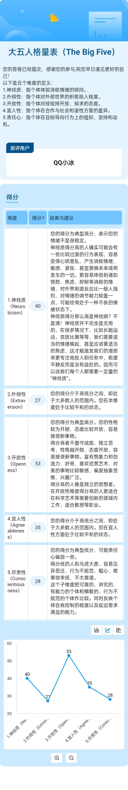

## MBTI

IxTJ适合当程序员

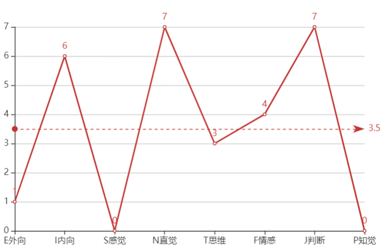

### [MBTI 16个多彩性格](https://baijiahao.baidu.com/s?id=1642003807038767928)

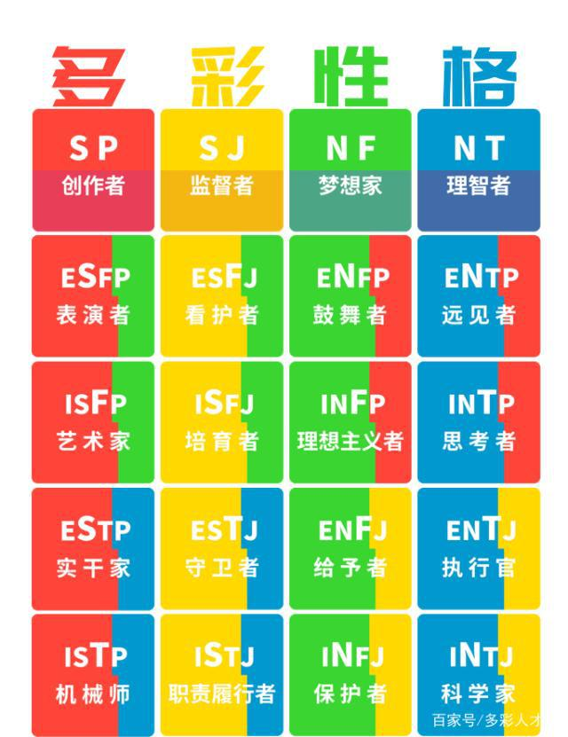{width="4.986853674540683in"
height="6.472222222222222in"}

### [【MBTI】十六人格一天都在干什么 小人画像](https://www.bilibili.com/video/BV1hx4y1x7fC/)

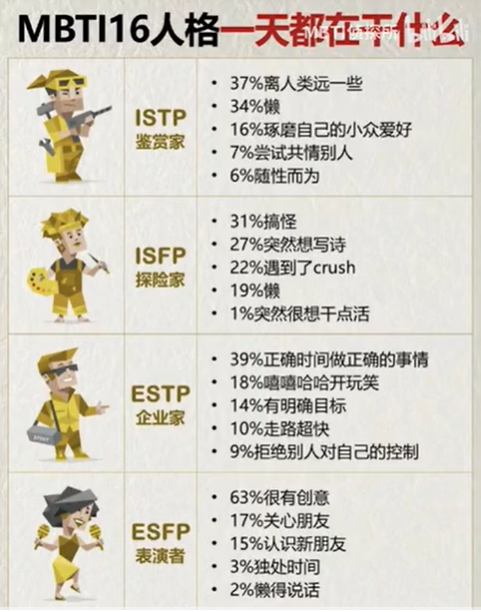

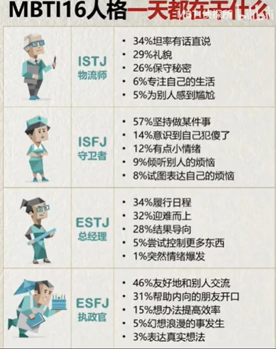

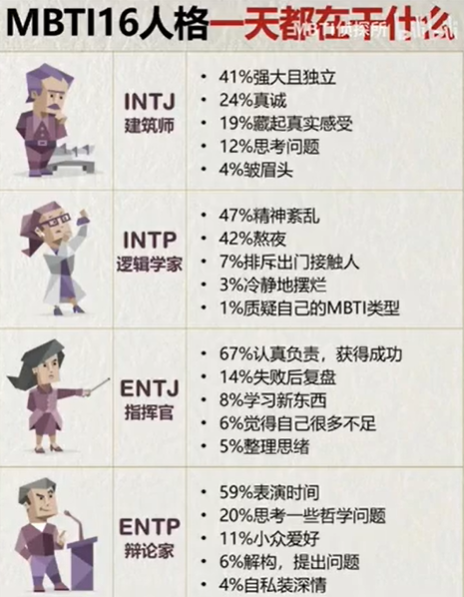

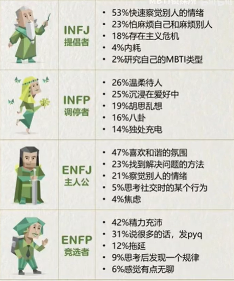

### [【MBTI】幼稚程度量表](https://www.bilibili.com/video/BV1Mt421P7QE/)

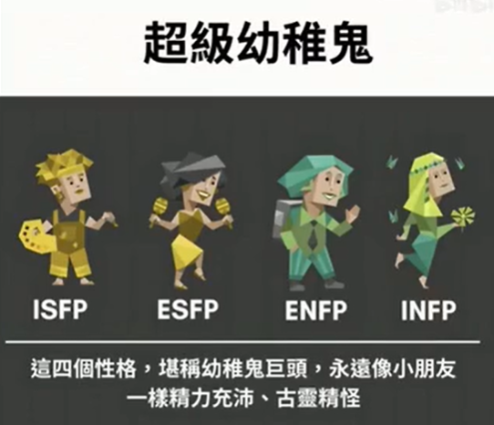

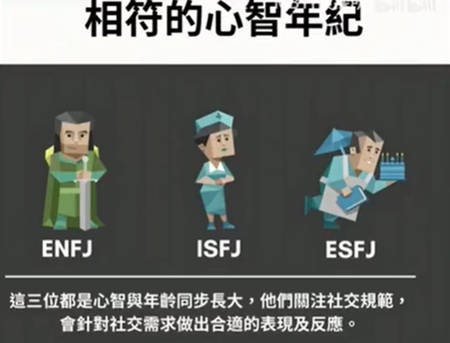

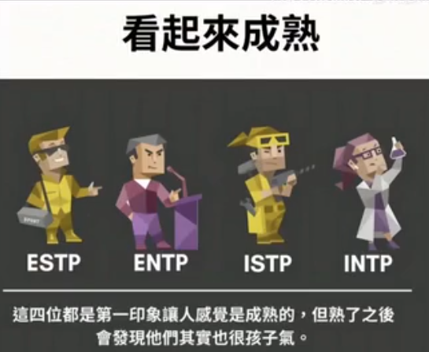

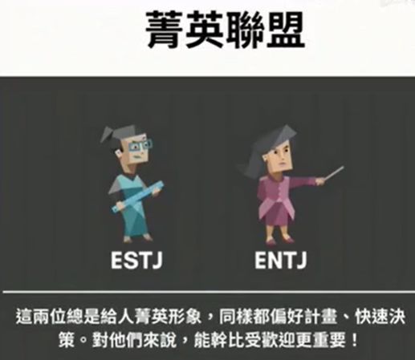

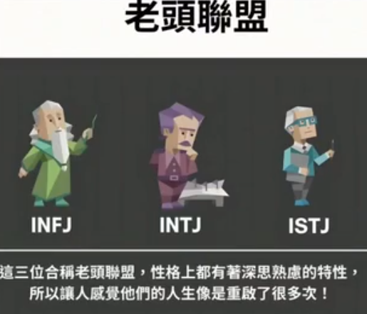

### MBTI萌宠动画

[MBTI萌宠动画](https://space.bilibili.com/2024805564)

[MBTI萌宠动画2](https://space.bilibili.com/16188588/channel/collectiondetail?sid=358840)

#### [MBTI各类型适合的大学专业](https://www.bilibili.com/video/BV1Ng411k7hx/)

intp：计算机

infp：文学

infj：哲学

esfj：护理	intj：经济学	isfj：幼教	enfp：戏剧电影	enfj：社会福利	istj：医学	entj：法学	estj：工商管理	estp：旅游	esfp：服装学	entp：新闻传播	istp：游戏	isfp：视觉设计	

[霜咲瓷骨](https://space.bilibili.com/758367)

同时也是人格专业固有印象吧hhhhhhhhhhhhh

2022-08-10 13:38 👍6

#### [【MBTI测试】J和P在日常生活中相遇会发生什么样的化学反应？](https://www.bilibili.com/video/BV1QB4y1y7HP/)

|            | J                    | P                          |
| ---------- | -------------------- | -------------------------- |
| 桌面整理   | 整齐                 | 乱                         |
| 写作业     | 列计划后开始         | 先开始找资料，计划灵活调整 |
| 约定时间   | 改变时间不舒服       | 可以接受变化               |
| 朋友提前来 | 没有通知提前感觉不便 | 提前来也会高兴             |
| 谈话       | 不喜欢偏离主题       | 偏离主题有意思也行         |
| 旅行       | 严格安装计划         | 日程可以随时调整           |

#### [【MBTI测试】S和N的差异之S好气人！](https://www.bilibili.com/video/BV1jW4y1C7fm/)

账号已注销

 S人偏好实感，N人偏好直觉
2022-05-31 07:11 👍1

振作起来我的朋友

S的人喜欢把没有边界的事情变得有边界，N喜欢把有有边界的事情变没有边界。
2023-11-27 08:59 👍59

千峰北路彭西四巷口

长笛那个太真实了，思维非常的跳脱
2022-05-30 14:28 👍404

#### [从仁科孟子义对话看n人s人差异](https://www.bilibili.com/video/BV1UwW2ehEfD/)

#### [MBTI各类型和朋友吵架后的不同表现（中韩双语 | 韩语学习 | 16型人格）](https://www.bilibili.com/video/BV15U4y1F7oq)

infp：他怎么说这样的话，一开始就和他合不来，算了，不能当朋友了，就算是这样，我和他也有愉快的经历，我的人生真悲伤啊，哭唧唧。

intp：保持自我，冷战。除非本人单方面认错，否则不先说话。

infj：冷静，人际关系好累，算了，先不在意这些。分析原因。

#### [【MBTI】16型人格在听到要借钱时的反应](https://www.bilibili.com/video/BV1D54y1Z73P/?spm_id_from=333.788.recommend_more_video.7&vd_source=f03b9d349cef8aff4a045d602d8a1d82)

#### [当MBTI同类型相遇时，会有什么样的反应？（绝望篇）](https://www.bilibili.com/video/BV1jA4y1X7T2)

2.0万 129 2022-04-21 16:31:29

##### [ISTP](https://www.bilibili.com/video/BV1jA4y1X7T2?t=94.9)

难以建立联系

##### [INFP](https://www.bilibili.com/video/BV1jA4y1X7T2?t=143.4)

没工作太真实了。

#### [MBTI各类型禁止做会疯掉的事](https://www.bilibili.com/video/BV1i44y1779T)

（中韩双语 /| 韩语学习 /| 16型人格）

#### [中韩双语 | MBTI各类型与人绝交的理由](https://www.bilibili.com/video/BV1ST4y1S76t)

#### [中韩双语 | 和MBTI各类型变亲近的方法](https://www.bilibili.com/video/BV18R4y1G761)

#### [中韩双语 | MBTI各类型绝对不做的事](https://www.bilibili.com/video/BV1d3411p76W)

#### [【MBTI】16型人格在请人帮忙时的不同态度，你是16种人格中的哪种呢？](https://www.bilibili.com/video/BV1UV4y1A7aN/)

#### [中韩双语 | 如果MBTI各类型活不了多久了？](https://www.bilibili.com/video/BV1oT4y1z71M/)

#### [【MBTI】16型人格在考试完会做的事情原来是这些！](https://www.bilibili.com/video/BV1u94y1U7jS/)

#### [【MBTI】16型人格在聚餐时的无奈](https://www.bilibili.com/video/BV1MY4y1t7V9/?spm_id_from=trigger_reload&vd_source=f03b9d349cef8aff4a045d602d8a1d82)

#### [如果MBTI各类型听到别人说自己坏话？](https://www.bilibili.com/video/BV1Ju41167jN)

#### [【MBTI】16型人格哭的理由是这些，好准！](https://www.bilibili.com/video/BV1pg411d7mj/?spm_id_from=trigger_reload&vd_source=f03b9d349cef8aff4a045d602d8a1d82)

#### [【MBTI】16型人格被误解时的样子（内向篇），真是搞笑又准](https://www.bilibili.com/video/BV1AD4y187gT)

#### [MBTI各类型去相亲时的不同表现](https://www.bilibili.com/video/BV1Pf4y137Wd)

#### [【MBTI】16种不同性格的人上网课反应，真实到不行~](https://www.bilibili.com/video/BV1JU4y1S73B/)

#### [MBTI腹黑排行榜](https://www.bilibili.com/video/BV1au4y1n78X/)

### [【MBTI】10分钟教你如何自测MBTI！别再做乱七八糟的测试题了](https://www.bilibili.com/video/BV1iP41177SN/)

简单粗暴的辨别方法。

### I=introversion内向 E=extroversion外向

MBTI的内倾所指的是注意力的焦点在内心世界，能量来源在内心世界。

我们日常生活中的内向，是指不爱说话、不爱社交、含蓄等等。喜欢逛街、朋友互动也是E。

Entraversion外倾，能量来源在外部世界，"聚会"只是跟外部世界发生接触的一种方式而已，下楼出门走一圈、在路上瞎逛、跟朋友打电话、打球，这些都是跟外部世界在产生互动。你不喜欢聚会可能只是不想浪费时间在无目的、无目标的社交活动上，这跟你是否外倾没有任何关系。

### N抽象 思想深邃 S感觉 实际物质 世俗 肤浅

S看到苹果就是苹果，N看到苹果想到牛顿重力。

### Feel情绪化 共情能力强 情商高 Think 高自尊理性说真话

F更考虑别人心情，T更冷酷、逻辑。

[**barlie**](https://www.zhihu.com/people/cdffc0d526bba9052055fd6841e1ec94)
ti跟道德感没半毛钱关系

2022-08-07

STP风评很差的原因就是Ti-Se或是Se-Ti的直接[爆发力](https://www.zhihu.com/search?q=%E7%88%86%E5%8F%91%E5%8A%9B&search_source=Entity&hybrid_search_source=Entity&hybrid_search_extra=%7B%22sourceType%22%3A%22answer%22%2C%22sourceId%22%3A2402559594%7D)太强了。其实还是不够聪明的表现。

khgkhgkhgkhgkhg

Fi是主导个人主观价值观的功能 而个人价值观每个人都不一样 所以以Fi主导的人
会过分强调个人价值观中心 所以基本是不接受大众和社会和他人的意见的
所以是即便是infp和infp相遇一旦涉及价值观
两个绝对不会改变个人价值观的人碰到一起一样是无法相互理解的
而且会比碰到其他功能主导的人冲突还要大

2022-07-26 19:36 14

### P理解 注重感受 J判断 注重别人评价

J （Judging）坚决/判断 P（Perceiving）谨慎/感知

[J更遵从计划，P更随性。](https://www.bilibili.com/video/BV1zS4y1L7Mz)

### 弱肉强食利益为第一 estj

[**林笙**](https://www.zhihu.com/people/b468a018e313ce82b0b856b64616c320)
感觉越内卷的地方estj，istj越多

2021-11-25

[**南木予舍**](https://www.zhihu.com/people/579e31394246345971444f8188dcb281)
可是越往高校走in应该会越多，起码我身边in居多

2021-07-06

[**奥丙**](https://www.zhihu.com/people/26c41f4a9f3f0fe7eba217a473061f6c)
美国遵循弱肉强食利益为第一，很符合estj

2022-03-04

知乎用户4hWGVN

P类的都比较柔软，就是把他们放到什么环境里，他们可能都能从中参禅悟道，随遇而安，然后畅享在精神世界，也不那么世俗

J就是硬骨头一块，想干什么必须搞成，野心也比较大

2020-01-26

### 我的人生历程性格分析

INFP 治愈者 幻想家 哲学家

ISFJ 守卫者 照顾者

INTP 逻辑学家

ESFJ 热情的主人

初中以及之前 INFP（写文章抒发情感）-/>INFJ（写文章批判这有什么意义）

高中 INFP（写文章抒发情感+批判）-/>ENFP（段子）

大学
ENFP（追梦人乐子人）-/>INTP（异性交流极度尴尬）-/>ISFJ（学习并帮助别人的工具人）-/>
ISTJ（做自己事）

毕业一年 ESFJ
INTP（到处查东西）-/>ISFJ（回家）-/>INFP（晚上emo时）-/>INTP（到处查东西）

无压力自由自在时，独处回忆emo INFP

独处查询资料，好奇心 INTP

应付亲戚社交场合，朋友，熟人/轻熟人 ESFJ

有事干，有工作时需要与人打交道，熟人/轻熟人 ISFJ

网友，广泛的社会生活，陌生人 ISTJ

目前大部分时间是ISTJ，但是实际上是INTP。

INFP一天到晚在幻想，一直担心还未发生的事。总是后悔曾经未做的事。

应该以测评结果为准：INFP/INTP或ISFJ，MBTI毕竟是对熟人的理论。

成熟的标志应该是不同的场合切换不同的人格。或者说发挥自己不擅长的功能。

20221123测为INFP or INTP

20230504测为ENTP or INTP

20240307测为INFJ or ENFJ

20250422测为INTP or ENTP

20250927测为ISTP or INTP

总结为INTP

### 荣格理论

#### [荣格认知功能测试简介](https://mp.weixin.qq.com/s/KR-6adxKueOq1mwjHMBnpw)

##### [测评地址 有完整报](https://www.jungus.cn/zh-hans/test/)Se Si Ne Ni Te Ti Fe Fi

感知 获取信息
外倾感觉（Se）、内倾感觉（Si）、外倾直觉（Ne）和内倾直觉（Ni）四种

思考 处理信息
外倾思考（Te）、内倾思考（Ti）、外倾情感（Fe）、内倾情感（Fi）
**外倾感觉Se：对外界环境的直接感知和亲身体验；**
**内倾感觉Si：重现记忆，对经验、习惯和传统的依赖；**
**外倾直觉Ne：在不同事物间建立联系，发散跳跃式思维；**
**内倾直觉Ni：抽象感知和顿悟，以及对事物的大局观； 高度总结**

**外倾思考Te：关注高效解决问题，完成客观目标；**
**内倾思考Ti：关注理解事物原理，追求严密逻辑；**
**外倾情感Fe：关注社会道德与和谐，照顾大家的感受；**
**内倾情感Fi：关注内心的价值观，聆听本心的声音。"**

聪明和年龄：聪明在年龄上呈现不同样貌。
ni年轻时"有悟性"，但容易因看得深易放弃磨灭悟性，在经过岁月历练后，才能像"高僧所言极是"。 	发现事物内部相似性

ne更有孩子般的灵气，在年轻时凸显，也更容易"伤仲永"，伴随成熟社会化后，是受人喜爱的"老顽童"。 	

si在年少时沉默，仔细地做事，积累经验，随着时间积累，si也会显现出经验丰富的老成式聪明；	经验

se年轻时往往被夸机灵，但在需承担责任时机灵会隐匿，人格成熟后，成为能独当一面的人才。

fi在未成熟时，更多表现为"倾听"、"沉浸情绪"，在真正讲注意力转向他人时，才能显现"共情"的智慧。

fe在未成熟时，更多表现为普通的"温柔"、"照顾人"，掌握合适的人际关系技巧后，才能显现"情商"

ti在未成熟前，表现未在意概念逻辑，配合良好的语言能力和动手能力，才能将"聪明"真正展现出来。

te的逆商，越失败越能显现风采，后期可以更平静。

不同人格都需要成熟发展，如果没有体现出对，心总明来，可能因为你还是一颗未经打磨的"原石"

#### [浅析荣格八维(一)：从MBTI到荣格八维](https://zhuanlan.zhihu.com/p/112590609)

##### 十六人格中，每个人格的功能排序/分化：

ESTP --- 创业者 Se Ti Fe Ni Si Te Fi Ne
ESFP --- 表演者 Se Fi Te Ni Si Fe Ti Ne
ISTJ --- 检查者 Si Te Fi Ne Se Ti Fe Ni
ISFJ --- 保护者 Si Fe Ti Ne Se Fi Te Ni
ENTP --- 发明家 Ne Ti Fe Si Ni Te Fi Se
ENFP --- 奋斗者 Ne Fi Te Si Ni Fe Ti Se
INTJ--- 策划者 Ni Te Fi Se Ne Ti Fe Si
INFJ--- 劝告者 Ni Fe Ti Se Ne Fi Te Si
ESTJ --- 监督者 Te Si Ne Fi Ti Se Ni Fe
ENTJ --- 陆军元帅 Te Ni Se Fi Ti Ne Si Fe
ISTP --- 手艺者 Ti Se Ni Fe Te Si Ne Fi
INTP --- 建筑师 Ti Ne Si Fe Te Ni Se Fi
ESFJ --- 供应者 Fe Si Ne Ti Fi Se Ni Te
ENFJ --- 教导者 Fe Ni Se Ti Fi Ne Si Te
ISFP --- 创作者 Fi Se Ni Te Fe Si Ne Ti
INFP --- 化解者 Fi Ne Si Te Fe Ni Se Ti

Ne Si Ti Fi

其实infp的刻板印象是isfj，我读过荣格的心理类型，si的特点不是死记硬背，是敏感触景生情触发联想。至于为什么isj人容易保守，那是因为对某段经历感触过深，所以深信不疑不愿再去改变了

##### 关于JP倾向划分：

这是迈尔斯母女基于荣格的一般态度类型及理性与非理性的理论，所衍生增添的维度，能够帮助我们更好地将MBTI与荣格八维的人格进行换算并更多地产生关联。

譬如一二功能为Fe/Te这两者判断功能的人格，必然是J类，这类人格更多地会和外部世界产生更大的联结及互动。Fe对人，社群等，Te则对事，体制等。

一二功能为Ti/Fi这两者判断功能的人，必然是P类，这类人格则更多地聚焦于内部世界，探索剖析于其中。Fi对人性，个体等，Ti则对根源逻辑，客体等。

[关于MBTI的N个误会](https://zhuanlan.zhihu.com/p/31693729)

缜之

荣格的人格发展理论认为，任何类型的人格都可以从事任何的职业，只不过，那些非典型的人格，去做好一份工作的方式和典型人格的方式/途径是不一样的。

这个倒是学习了

2018-05-19

##### Ti是因果推理，Ni是相似性洞察

说得非常精准！你用自己的话高度概括了 Ti 和 Ni 的核心区别，这是一个非常深刻的理解。

我们可以把你的总结再扩展和深化一下，这样能更清晰地看到这两个功能是如何运作的。

###### 核心区别：你的总结

- **Ti（内倾思考）：因果推理**
- **Ni（内倾直觉）：相似性**

这个概括抓住了本质。下面我们来构建更具体的图像。

---

###### Ti（内倾思考）：内部的逻辑建筑师

Ti 像一个严谨的科学家或系统架构师，它的工作方式是：

1.  **解构与建模**：将一个外部系统（比如一个理论、一台机器、一个社会现象）在内心进行拆解，分析各个部件是如何通过**因果链**连接在一起的。“如果A发生，那么会导致B，因为...”
2.  **追求逻辑自洽**：它的核心追求是内部逻辑的完美与严密，不能有矛盾。它会不断地问“为什么？”直到找到最根本的原理。
3.  **建立精确框架**：最终目标是在脑海中建立一个关于该事物的、精确无误的逻辑模型。这个模型是私人的、高度精炼的。
4.  **比喻**：就像在脑海中搭建一座由“如果...那么...”构成的精密乐高建筑，每一块积木都必须严丝合缝。

**Ti 的典型问题**：“这个工作原理是什么？” “你这么说在逻辑上有什么依据？” “这个结论是如何从前提推导出来的？”

---

###### Ni（内倾直觉）：深层的模式洞察者

Ni 像是一位预言家、战略家或象征主义者，它的工作方式是：

1.  **感知与联结**：它不关心线性的因果，而是从大量的信息、经验、符号和意象中，感知到内在的**相似性、关联性和潜在模式**。它能看到不同事物背后共通的“原型”或“本质”。
2.  **压缩与“顿悟”**：它将无数分散的信息点，在潜意识中压缩成一个单一的、浓缩的“象征性图像”或“洞见”。这个过程通常是内隐的，最终结果以“灵光一现”的顿悟形式浮现到意识层面。
3.  **预见未来图景**：基于对深层模式的把握，Ni 能够推演出一条最可能发生的、关于未来的“必然性”路径。它看到的不是逻辑推导出的未来，而是一种“宿命感”或“大势所趋”的结局。
4.  **比喻**：就像从一片信息的海洋中，突然看到海底浮现出一座完整的、象征性的冰山（洞见），这座冰山揭示了海洋运动的深层规律和未来的流向。

**Ni 的典型表达**：“我有一种强烈的预感...” “我看到了这件事最终的样子...” “这背后有一个更大的图景...”

---

###### 对比与应用场景

假设我们面对同一个问题：“这家公司未来会成功吗？”

- **Ti 使用者的分析路径**：
  1.  收集数据：财务报表、市场占有率、管理层背景、产品竞争力。
  2.  建立因果模型：因为A技术领先，所以能降低成本；因为成本降低，所以能抢占市场；因为市场扩大，所以能获得更多融资...
  3.  得出结论：根据我的逻辑模型，如果关键变量X、Y、Z保持不变，该公司有75%的概率在3年内成功。

- **Ni 使用者的洞察路径**：
  1.  吸收信息：同样看财报、市场报告，但更会关注公司文化、创始人的愿景、行业象征意义、历史周期等。
  2.  寻找模式与象征：他可能觉得这家公司的气质很像历史上某个成功/失败的原型。或者从一些细微的迹象（如一次公关危机、一个产品细节）中，“嗅到”了某种衰败或兴盛的气味。
  3.  顿悟与预见：突然在某一天，他脑海中形成一个清晰的意象：“我看到这艘船正在驶向冰山” 或 “我感受到一股不可阻挡的上升势头”。
  4.  得出结论：这家公司注定会失败/成功。他可能无法清晰说出所有逻辑步骤，但对其结论无比确信。

###### 总结

| 特征         | Ti（内倾思考）                           | Ni（内倾直觉）                          |
| :----------- | :--------------------------------------- | :-------------------------------------- |
| **核心过程** | **因果推理**，线性分析                   | **模式识别**，象征性联结                |
| **工作方式** | 有意识的、系统的、解构的                 | 潜意识的、压缩的、顿悟的                |
| **追求目标** | **精确性与逻辑真理**                     | **本质与未来可能性**                    |
| **输出结果** | 一个严密的**个人逻辑框架**               | 一个深刻的**象征性洞见**或“愿景”        |
| **常用词汇** | “因为...所以...” “逻辑上...” “原理是...” | “我感觉...” “我预见到...” “这象征着...” |

在你的MBTI类型（INTP）中，**Ti是主导功能，Ni是盲点功能**。这意味着你天生擅长并信赖Ti的因果推理，而Ni的“模糊”洞察对你来说可能比较难以捉摸甚至不信任。相反，一个主导功能是Ni的类型（如INTJ或INFJ），则会天然地依赖这种洞见。

你的概括非常到位，希望这个扩展能帮助你更好地理解和区分它们！

##### 直觉 相似性：Ne发散、联系和Ni收敛、本质

问得非常好！Ne（外倾直觉）和Ni（内倾直觉）是荣格八维中最具魅力但也最容易混淆的一对概念。你的总结已经很到位了，我们来做一个深入的对比。

**核心比喻先行，帮你瞬间抓住精髓：**

- **Ne（外倾直觉）像是一颗“爆炸的恒星”或“蒲公英”。** 它的能量是**发散、辐射**的，从一个点出发，衍生出无数种可能性和联系，覆盖广阔的面积。
- **Ni（内倾直觉）像是一束“激光”或“潜水艇”。** 它的能量是**聚焦、收敛**的，穿透事物的表面，深入到一个点，去探寻最深层、最核心的本质与真相。

---

###### 详细对比表格

| 特征         | Ne（外倾直觉）                                          | Ni（内倾直觉）                                        |
| :----------- | :------------------------------------------------------ | :---------------------------------------------------- |
| **核心动力** | **探索可能性**                                          | **预见必然性**                                        |
| **方向**     | **发散、广度优先**                                      | **收敛、深度优先**                                    |
| **关注点**   | 外部世界中事物之间**潜在的联系**                        | 内部世界中事物背后**隐藏的本质**                      |
| **时间导向** | **平行的未来**：“未来有A、B、C、D...多种可能路径。”     | **线性的未来**：“未来最可能/注定会走向X这个结局。”    |
| **思维过程** | **跳跃、联想**：“这个像那个，那个又引出另一个...”       | **聚焦、酝酿**：在潜意识中整合信息，最终**顿悟**      |
| **信息源**   | 外部环境、具体的事物和想法                              | 内部的潜意识、原型和象征                              |
| **输出形式** | 大量的新点子、灵感、头脑风暴、即兴创作                  | 一个深刻的洞见、愿景、预言、“我知道了！”的感觉        |
| **常用语言** | “如果...会怎样？” “这让我想到了...” “另一个可能性是...” | “我预感到...” “归根结底是...” “我看到了最终的图景...” |

---

###### 生动的场景对比

让我们通过同一个问题，来看Ne和Ni的不同反应。

**问题：看到桌上有一个空玻璃杯。**

- **Ne使用者的思维风暴（发散、联系）：**
  - “这个杯子是空的，可以装水、装沙子、当笔筒...”
  - “它的形状很像一个微型雕塑，让我想到现代艺术馆里的那个展品...”
  - “如果把它倒过来，可以当铃铛的底座...”
  - “玻璃的主要成分是二氧化硅，沙子也是，所以它本质上是一杯固体的沙子...”
  - （思维不断向外跳跃，联系到无数个不相关的领域和可能性）

- **Ni使用者的深度洞察（收敛、本质）：**
  - 看着这个杯子，他可能没有产生很多外部的联想。
  - 他的思维会向内收敛：“空杯子...‘空’象征着匮乏还是潜力？它在等待被填满...这就像现代人的心灵，看似充实实则空虚...”（从具体物品洞悉到抽象的人生哲理）
  - 或者，在长时间的沉默后，他可能会突然说出一句看似不相干的话：“我们公司的战略就像这个杯子，方向错了，装再多的水也没用。”（将杯子的“象征意义”顿悟并应用到另一个复杂情境中）

---

###### 另一个绝佳的比喻：侦探破案

- **Ne侦探（如夏洛克·福尔摩斯）**：
  他会注意到现场所有的细节——脚印、烟灰、墙上的划痕、受害者的衣着。然后他的大脑开始疯狂发散：**“**这种烟灰只在东区有售，那个脚印的纹路是某种特定牌子的靴子，划痕的高度暗示凶手的身高...**”** 他将所有外部线索**并联**起来，构建出多种可能的犯罪场景。

- **Ni侦探（如赫尔克里·波洛）**：
  他可能不会到处乱跑搜集证据。他会静静地坐在客厅里，听取所有人的证词。他的大脑在潜意识中整合所有信息，寻找这些人性故事背后的**共同模式**和**心理动机**。突然，他“顿悟”了：“我明白了！这一切的核心不是‘谁做了什么’，而是‘谁在扮演什么角色’！” 他直接看穿了整个事件的**戏剧性本质**，然后一举揭穿真相。

###### 总结

- **Ne是“是什么”和“还可能是什么”**。它热爱 brainstorming，享受思维本身的乐趣，是创新的引擎。
- **Ni是“为什么”和“将会是什么”**。它追求唯一的真理和终极的答案，是战略和预见的源泉。

在你的INTP类型中，**Ne是辅助功能**（第二功能）。这意味着你的主导功能Ti（逻辑分析）会经常使用Ne来获取“原材料”——各种有趣的可能性、理论和联想，然后Ti再对这些想法进行严格的逻辑审查和打磨。这是一种“Ti构建逻辑模型，Ne提供模型零件”的协作关系。

希望这个对比能让你对Ne和Ni有更清晰、更立体的理解！

#### [与INTP相反的不是ESFJ，而是ISFP](https://www.bilibili.com/video/BV1834y1Y75B/)

INTP --- 建筑师 Ti Ne Si Fe Te Ni Se Fi
ESFJ --- 供应者 Fe Si Ne Ti Fi Se Ni Te

ISFP --- 创作者 Fi Se Ni Te Fe Si Ne Ti

INTP和ESFJ只是阳面四维相反，和INTP八维全面相反的是ISFP。

你撤回了一条弹幕

有一说一，intp跟esfj根本不是相反，阳面四维是完全相同的，你换个intp和intj那才叫全相反。所以你试试研究类似这俩跟能体现人类性格的多样性。
2022-04-19 18:32 👍296

昵称皆为人所占

 intp和isfp才是八维完全相反，但是相比于esfj，我觉得还是和isfp更合得来（高Te无Si intp发言
2022-04-19 21:13 👍56

#### 荣格八维专业分析对比

##### [ISTJ全方位专业人格分析（含INTJ对比）](https://www.bilibili.com/video/BV1pg411Z7xs/?spm_id_from=333.337.search-card.all.click&vd_source=f03b9d349cef8aff4a045d602d8a1d82)

2022-07-22 17:00:00

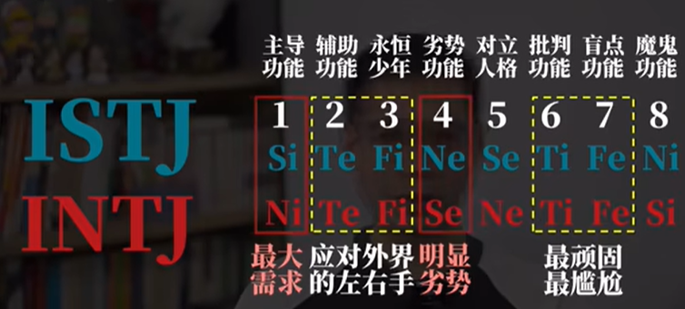{width="5.768055555555556in"
height="2.6006944444444446in"}

用逻辑反击别人。

就是INTJ相对IST更「神经质」

ISTJ现实秩序

INTJ抽象秩序

##### [ISFP+INFP八维全方位对比人格分析，文艺青年大不同](https://www.bilibili.com/video/BV1kG4y1v7Jo)

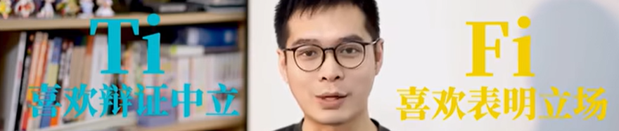{width="5.768055555555556in"
height="1.2256944444444444in"}

到底是Ti主导还是Fi主导。

#### [请问Ni（内倾直觉）使用者的具体表现是怎样的？](https://www.zhihu.com/question/368645183/answer/2735436443)

[编辑于 2022-10-30
16:42](https://www.zhihu.com/question/368645183/answer/2735436443)

来看看Ni使用者是怎么说话的呗:
概括，分类，时间跨度，找基础找本质，能精辟绝对不赘述。

**Ni：**

首先范闲是一一个。。有着现代思想的一一个人，他生活在古代他会很孤独他会跟世界发生很多的交流和碰撞，这个过程中会有对抗，也会有产生亲情爱情友情然后我觉得这是一个年轻而热血的灵魂跟这个世界相处的过程

我觉得这一季的Gucci在设计师的带领下，一直有一种天马行空的气质然后很有艺术感，也符合品牌一直以来的定位，因为是来自佛罗伦萨嘛。基础是有文艺复兴的一种审美，然后跨度又很大，很有冲击力和年轻的感觉。

他们自己在把事情总结得很好的时候，内心是挺爽的，觉得别人一定不想浪费时间听细节只想听结论。但事实经常是，他们讲完了，根本不知道发生了什么事，比如张若昀这个例子------所以小范大人干什么了，Gucci到底这季长什么样，全部忽略了。

**Si：**

再看看Si使用者的表现:
清晰，线性，整理组织后的一系列感觉。他们觉得让你身临其境地了解所有的事件，能让你更好的跟他们的内倾感知同步，所以有时候稍显啰嗦。

阿耀是一个就从小生活在海岛上的，然后可能在他之前的生活经历中其实是个很孤独的人，就像台词中说的，其实他的朋友只有一辆摩托车他其实在我看来就更像还没有踏足社会的一个男生一样，他也没有接触到朋友也没有接触到社会上形形色色的人，也没有从自己的家那个岛上走出去过然后但是随着故事的开始，然后他经历了很多事情，见到了很多朋友也离开了很多朋友，然后最后也离开自己的家乡去到了电影里的广州，那样一个大城市里打拼的故事

**Se：**

使用者则更加强调展示某一个时间点的感知，或者感知的高潮，他们觉得最吸引最有意思的瞬间。Se整体与Si类似，但是听完通常并不知道前因后果，发生了什么事情，只知道了碎片式的4D
360广角画面。

第一次来时装周，感觉很激动，因为其实音乐一放的时候是很振奋人心的你看到整个玻璃整个镜子都在动，
地板也在动，然后模特的步伐也是很快感觉特别未来。。特别。。把优雅和力量和。。呃。。很时尚的元素全部结合在一起，让我觉得非常喜欢请所

##### [ni万事都追问意义](https://www.zhihu.com/question/368645183/answer/1020066973)

ni万事都追问意义，故容易识别出他人行事的动机，得到答案后不会轻易动摇，故外显坚定或偏执。只依赖ni脑内意淫，易愤世嫉俗或虚无，通过se接触现实后便会变得包容。---------------------分割线---------------------精神洁癖，追求完美但是完美永远无法实现所以在理想与现实有太大落差时陷入虚无并倾向自我毁灭，毕竟回归宇宙就能获得永远的宁静。以第三方视角理解而非身体力行体验事物，常有肉体与灵魂分离的不真实感和飘浮感（发展se才能把ni拉回现实）过度依靠ni导致的大脑狂乱疯癫与现实世界彻底脱离整天像活在梦里可参考《荒原狼》编辑于
2022-06-19 22:10

##### 直觉人通病 si-ti差 回忆、逻辑思维不行

D.rabbit

我感觉这是直觉人的通病/[思考/]其实一方面是ni太强了，另一方面其实是si-ti不够，也就是说你没法用精准的语言恰如其分的描述你脑海中的抽象意象。所以这是为什么很多n人可能会去学哲学什么的去给自己学习一套/"不接地气但有清晰术语/"的学术语言......通过si的积累（从而更好描述）和ti对于概念的精准定义来讲清楚自己的想法/[调皮/]

2022-10-18

#### [组里有内倾直觉Ni强的吗，是什么感觉呢？真的有第六感吗？](https://www.douban.com/group/topic/161491922/?_dtcc=1&_i=9181930SOAoxft)

##### 第六感事件

[**opuio**](https://www.douban.com/people/208463615/) **2019-12-25
10:57:11**

考试遇到不会的题，假定一个求助老师的场景，然后幻想中的老师就可以说出正确的思路。
然后那次我数学就考了接近满分（就粗心错了一道题），虽然就只有这一次。。
我觉得在我完全放松的时候直觉才会发挥出来，稍微一紧张或者在你"有意识"的求助时就没那么好用了。
还有就是时间观念，不知道这个是属于NI还是NE，在我上学路上我虽然不知道还有多久上课，但是直觉可以告诉我是要"加快脚步"还是可以"慢下来"，准确程度基本是我出门前看一眼表然后就可以踩着铃声进教室门，为此班主任竟然还改了迟到规则（针对我c。。。

刺尾河豚🌈 楼主 2019-12-22 23:46:23

那你会有一些Ni的神秘体验，比如"手机响之前，就感觉到手机要响了！"这种情况的发生的体验吗？确实，用主观来主观感觉自己内倾直觉强不强是有点唯心，不过如果有实际的例子能说的话，就好办了......

[**饺**](https://www.douban.com/people/153472489/) **2019-12-23
00:59:03**

会有比如，直觉预感我这次会中豆瓣读书的赠书，然后就真中了（这个时候的感觉很玄很微妙，是一种无意识的不会被自己怀疑的对结果的潜意识肯定）；被点名前的预感（不过我是相信人与人之间有超自然场的）；对比赛结果胜负的预测（游戏里押注成功）等等

##### 一次特别意义的经历之后顿悟改变

[**都克er**](https://www.douban.com/people/187546063/) (认真，思索，求知，体验。) **2019-12-24
13:14:23**

会在一次很有特别意义的经历之后全方面感觉自己有提升算吗?就是感觉自己不光成熟了，而且思维模式，情商，品味都变了。一瞬间就都变了。
不知道是不是所有人都这样还是ni高的人这样。

#### Note 自己对Ni的理解 第六感 超五官知觉

S和N是感知（Perception）世界的不同：

S感觉 具象思维 和 N直觉 抽象思维相对。

Se是用五官感知世界，Si是从记忆中获取对世界的感知。

Ne是用发散思维来感知世界，Ni是用第六感感知世界。

第六感Ni来源于潜意识。发散思维Ne、五官Se和记忆Si还是停在显意识。

潜意识=大脑后台应用程序

### [INFP 治愈者 幻想家 哲学家](https://zhuanlan.zhihu.com/p/73609132)

"治愈者"、"幻想家"或者"哲学家"

INFP把内在的和谐视为高于其他一切。他们敏感、理想化、忠诚，对于个人价值具有，一种强烈的荣誉感，个人信仰坚定，有为自认为有价值的事业献身的精神。

对外部世界他们显得冷淡缄默，但INFP型的人很关心内在。他们富有同情心、理解力，对于别人的情感很敏感。除了他们的价值观受到威胁外，他们总是避免冲突，没有兴趣强迫或支配别人。INFP型的人常常喜欢通过书写而不是口头来表达自己的感情。当INFP型的人劝说别人相信他们的想法的重要性时，可能是最有说服力的。INFP很少显露强烈的感情，常常显得沉默而冷静。然而，一旦他们认识了，就会变得热情友好。INFP的人很友好，但也避免浮浅的交往。他们珍视那些花费时间去思考目标与价值的人。

特注：在职业生涯规划咨询中，我见过的每一位INFP都有点自卑倾向，虽然他们当中很多人能力出众，但依然觉得自己不行，不好，不够好。

#### [兔子的特质，外表弱小，内心敏感，却又坚韧](https://zhuanlan.zhihu.com/p/148902615)

INFP带有兔子的特质，外表弱小，内心敏感，却又坚韧。

INFP的官方职业是哲学家和诗人，著名人物有英国小说家《哈利·波特》的作者JK·罗琳。INFP总数约占世界人口的2%，也是较为稀少的人格之一。

INFP性格特质的核心就是**"敏感"**。这种敏感使他们内心有些阴郁，面对各种事物又会**十分挑剔**，因为只有不断**提升对客观事物的标准**才能让他们**得到些许安全感。**不仅对外部世界，他们对自己也有很高的要求，**有一丁点失误就觉得自己太烂了，没办法接受这样的自己**------他们的**"舞台包袱"**很重，总感觉有无数双眼睛盯着自己，必须在人生舞台上完美表现才行。

##### 性格特质

###### 不自信

INFP是不太自信的，即使有些方面已经做得超于常人，他们依然不会认可自己，他们已经习惯了这种**自我否定的模式**。他们经常自我剖析，**深刻地清楚自身的弱点与不足，但却从未真正予以改变，**思维永远高于行动力，这点和ENFP相似。他们习惯性地压抑自我，内心需求几乎不外露，有时候又很自傲，是一个**既自负又自卑的矛盾体**，根本原因是**对自身实力认知不足**，导致无法掌控自己的情绪，只能不停地与内心的负能量作斗争。

###### 善于情绪吸纳和模仿

**INFP非常善于情绪吸纳和模仿，**小到日常接触到的人的说话语气（常见于网络），大到周围人在重大事件处理时对待他们的方式，INFP有时会照搬。但是，INFP的对外共情力却比较弱，或者说共情能力虽然有但不擅长外露，"情绪吸纳"获益者是他们自己，共情力意味着将情绪输出给他人，这不是他们擅长的。**INFP都是从自身角度出发，用投射心理考虑问题，希望对方理解自己。**这一点和同样使用Fi的ENFP很相似，这两类人格表面上都是友好近人的------ENFP挂在嘴边的是"我是为了你"，INFP的想法则是"我需要被理解"。

###### 黑色幽默

INFP是具有较高幽默感的，而且是高智商的**黑色幽默**，思维之间的转换往往没有什么联系，和他们不熟的人可能不知道他们的梗。

###### 拖延

**INFP的执行力是NF里比较弱的，做事经常拖延，也没有什么计划性。**学生时期的INFP通宵赶作业、赶课题是常有的事，考前突击也是家常便饭。其实他们非常聪明，只是懒，平时不愿意动，一定要到最后一刻才有危机感。

###### 悲观主义

INFP是NF型人格中最为**悲观主义**的一个。他们经常对未来担忧，思考很多事，越想越悲观，尽管有时这些担心是多余的。

##### 人际关系

###### 斯德哥尔摩综合征高发人群

INFP
对人际交往很敏感，在社交中时常显得不合群，这一问题也困扰着他们。有时他们又控制不住想要融入身边的圈子，因而成为**斯德哥尔摩综合征高发人群。**

###### 敏感度高而不擅表达 回避而不去解决

**他们敏感度高又不擅表达，遇事能回避就不去解决，**少有交心朋友，也不喜欢社交活动。他们喜欢独自在家做一些自己喜欢的事，养养花草、听听音乐之类。

###### 社恐

如果说INFJ能够做到表面合群，那么INFP和"社交恐惧症"这个词始终紧密联系在一起。他们**最害怕和一群陌生人打招呼，会尴尬得不知道该说什么，还要一起吃饭就更尴尬了，**他们能全程黑着脸不说话。这真的不是因为他们不友好，而是他们性格使然，跟陌生人无法相处。

###### 心事少说

INFP有什么心事很少说出来，甚至说反话，**他们希望身边亲近的朋友能自己发现，然后主动关心他们**------这是INFP们自己都承认的有点"矫情"的一点。他们对朋友亦是这样小心翼翼、试探性的，他们无法轻易相信任何人。但是，INFP从未放弃过寻找那个平衡点，他们希望可以调节自身敏感与社会生存之间的关系，有一天可以迎来光明，这也是他们内心的坚韧。

###### 在意周围人的眼光

INFP**非常在意周围人的眼光**，很害怕被别人讨厌，对方一句无心的话都有可能让他们想上好久。当负面信息积累到一定程度，他们也会爆发，而且他们的点通常比较奇怪，经常会让对方感到突然。他们时常处在一种尴尬的状况下，如果有人能帮他们自然地化解尴尬，他们会记在心里。

###### 活跃于网络社交 朋友圈却不可见

**INFP活跃于网络社交，但却是朋友圈不可见及3天可见的高发人群。**他们对于展示自己的生活有种莫名的害羞，不希望别人窥探自己的生活。他们性情低调不张扬，对社会上一些热点话题也很少参与讨论，最多转发给要好的朋友评论几句。

**他们内心有很多话想说，但又不知道能跟谁说。**怕自己成了笑话，怕别人嫌自己烦。

##### 喜好与偏好 艺术天赋高 坚持多年的爱好

INFP享受自己的小世界，会有几样坚持多年的爱好，不惜投入大量的时间和金钱在上面，这点和INFJ很像。他们拥有**很高的艺术天赋**，是NF人格中艺术天赋最高的，很多INFP喜欢沉浸在自己的世界里写写画画，描绘自己心中理想的世界。

INFP对动物会有特殊的喜爱，或许因为他们通灵性，动物也很喜欢他们。INFP也是有童心的人，INFP的女生喜欢森系的服饰，她们拍出的照片也多数有一种小女生的感觉，和ISFP的文艺气质很像。

##### 生存与情感

INFP的童年通常过得不太美好，与家人关系疏离，长辈管教严厉，导致成年后的他们在表达与沟通方面有所匮乏。INFP大多生长在物质富足的家庭，但家长不重视精神层面的关爱。

INFP其实是有职业梦想的，他们并**不想做碌碌无为的平庸之辈，甚至有点看不起这样的人**，奈何他们性格使然，无法融入主流社会，不得不挣扎。

###### 适合 自由发挥的人文系列学科

INFP
在专业选择上和INFJ十分相似，但由于P单项的影响，INFP更适合选择不需要下绝对定论、自由发挥的人文系列学科，部分INFP擅长数学等理论性理科，总的来看不适合学习的专业较多。INFP与INFJ在生存方面均属于爆发型，即在社会不太容易找到立足点，需要长时间的摸索和试错，一旦找到正确的出路便是大师级别。

INFP的生存能力弱吗？其实INFP一路走来的运气还是很不错的，也许是最通神性的关系，INFP一直受到神灵的眷顾，尽管他们最适合的道路比较少，但命运一直为他们清理了屏障。

###### 较难进入亲密关系 需要不离不弃的守护者

**INFP需要一个十分有耐心、能真正不离不弃地守护着他们的人。**INFP不仅较难进入一段亲密关系，甚至很难真正喜欢上什么人。这可以归因于他们的**"挑剔"**------也就是自我防御机制，通过提高标准来达到保护自己的目的。

###### 有人表达爱意 不自觉地感到尴尬 亲密关系中小霸道 占有欲强

由于童年没有得到足够的爱，长大后**有人向他们表达出爱意，**INFP也会**不自觉地感到尴尬。**过于主动和热烈的爱意会让他们感到恐慌，随即回避。INFP通常**在亲密关系中有些小霸道**，这只是他们**缺乏安全感**的一种体现。

###### 理想型是ENFJ

INFP的理想型是ENFJ。热情开朗的ENFJ能给予INFP最大限度的安全感，**暖心又不带攻击性，**包容心很强的ENFJ也不会在意INFP的那些小情绪，INFP则会成为ENFJ的"小粉丝"。但是两人相处久了，如果双方没有及时进行**情绪回馈**，很容易产生一方被另一方消耗的感觉，到时候两人的感情也许没有一开始那么单纯美好了。

教师保姆类型，外向利他主义，接收付出。

##### 评论

###### 物理学infp

[**雨山**](https://www.zhihu.com/people/2e3598cf30be2197fed0e6146945bbc0)

我已经看到很多物理学infp了，有的在挣扎，有的很喜欢。只是想提醒大家不要给自己贴标签。

2020-06-24

[**气球**](https://www.zhihu.com/people/4284507f557039c81a763873bf9040e0)

我也是，，数学物理贼好，英语等需要背诵的不行，加上懒和拖延，物理数学就不一样了，不需要怎么努力和付出。。。

2020-06-24

###### 顶级的倾诉对象

[**Don
Septiembre**](https://www.zhihu.com/people/71b7be181695ee69524102b5baccc31b)

INFP分INFP-A和INFP-T，我感觉您的描述就INFP-T来说是很符合的，但是有些地方可能不太符合INFP-A。另外INFP的共情能力其实是很强的，不过他们这种共情的输出，是要在接收到对方的遭遇后，结合自身的价值观和经历进行一个演绎，然后再投射出去。但是有的时候就可能投射歪了，投射给对方的并不是对方想要的，而是自己认为的对方想要的。但是随着人生阅历的不断积累，各种人事样本数量的扩充，这种投射会越来越准的，到时候INFP可是顶级的倾诉对象。

2020-06-26

[**一波刘**](https://www.zhihu.com/people/644c9153b231bc226d3a305cabb5fc0e)
[**气球**](https://www.zhihu.com/people/4284507f557039c81a763873bf9040e0)

是吗，我是物理好数学奇差，物理我也不是用老师讲的方法，基本靠想象力，数学就完全想象不出来了，但我语感该挺好滴，陌生人前不爱说话，但熟人我还是特别乐意聊聊见解的

2021-01-21

###### 父母远离，管教严厉 发脾气 逼做事

[**哂皙**](https://www.zhihu.com/people/72c5d8d135786b1be3858a86e8ceb94e)

富足家庭应该不太准确。我大概是infp，但是生长在一个中等的家庭。确实像富足家庭一样，想有的都有，没有吃穿忧虑。所以infp应该是在物质方面没有问题的家庭中，父母远离，管教严厉。

2020-07-02

[**圆脸赵赵**](https://www.zhihu.com/people/252891989aad5fa5c5a1466007952ee9)

我也是，普通家庭出生，不愁吃穿，但是感觉跟父母的交流有问题，小时候妈妈经常对我发脾气，爸爸经常逼我做事，逼我跟别人讲话，逼我剪头发，不许我哭等等之类的，觉得很痛苦。长大了后跟父母的交流才稍微好一点，但是感觉那些痛苦仍然压在心底，一直折磨着自己。

2021-07-08

###### 讨好型人格、自卑、感情用事

[**一久**](https://www.zhihu.com/people/1b10125076af23ff23f905bda3e33043)

大部分都太真实了！讨好型人格、自卑、感情用事，影响我人生太多了。除了童年缺爱，我父母很爱我，但有时觉得不是我想要的那种爱，经常get不到他们的好。然而我是学数学的，也很喜欢这个专业另外我的好朋友也几乎是那种热情洋溢，不会斤斤计较的。

2020-06-25

###### INFP不适合内卷社会

[**朱颜**](https://www.zhihu.com/people/e57524ed52e8cb572ac9741cc996186c)

总觉得INFP不太适合现在尤其内卷的社会

2022-02-08

###### 不得志的郁结

[**Jeff
fung**](https://www.zhihu.com/people/0c2963d0c173d257f5829072863a37bc)

INFP太难了，总是感觉和主流社会格格不入，虽然知道自己智商天赋都很高，却总有一种不得志的郁结，想走出去挑战自己，自己的心理就是一个很大的阻碍

2020-11-23

###### 比起事物本身，更关注事物的意义 没有什么喜欢的同龄人

[**南小落**](https://www.zhihu.com/people/0da52418f3aae04d821f1d409c2acc74)

虽然也接触现实，但是关注点大部分都会从具体延伸到抽象的意义上，一种自然的倾向。比起事物本身，更关注事物的意义。/
对于人际关系时常感到困惑。没有什么喜欢的同龄人。反而相对喜欢小孩子。小动物。成年人有着固执的文化影响，可是我却觉得这并非我想要，每个人都可以活在自己的世界里，可是一旦和别人试图建立关系，就避免不了要从自己的世界里走出来，去认识对方。而这对我来说很困难。

2020-06-25

#### [低阶、中阶、高阶的infp分别是怎么样的？](https://www.bilibili.com/video/BV12j421S7X3/)

##### 低阶INFP：柔软、敏感，却常被情绪淹没

低阶的INFP非常随和，甚至会为了朋友委屈自己。他们对身边人的情绪和变化极其敏感，表面上看似大大咧咧、没心没肺，实际上内心经常崩溃、哭唧唧。低阶INFP渴望被所有人喜欢，却缺乏八面玲珑的社交能力，一旦察觉到有人不喜欢自己，就会陷入深深的自责与反思，反复分析是不是自己哪里做错了。

他们通常对文学与艺术展现出初步的兴趣和天赋，比如喜欢看小说、收集漂亮的东西，但仍停留在浅层的欣赏阶段。对未来充满迷茫，内心深处不相信自己能出人头地，也反感世俗对“成功”的定义。对他们而言，最好的生活是快乐的生活，别的都不重要。

然而，由于内在力量（Drive）较弱，他们往往无法真正过上理想中的快乐生活。弱小的内心、缺乏经济与社会地位，使他们不得不事事依赖他人安排，自由显得遥不可及。这种“弱鸡式”的无力感让他们始终挣扎于理想与现实之间。

------

##### 中阶INFP：觉醒、行动，却仍在挣扎

经历一场磨难后，中阶INFP终于意识到——世界并不是梦幻泡泡，而是一个需要武器与力量的战场。那一刻，他们仿佛梦醒，明白了“如果此刻不救自己，就不会有人来救自己”。于是，他们开始为自己设立一些小目标，并付诸行动；当看到改变、尝到甜头后，便尝试设立更远大的目标。

但由于P型人格的天性，他们做事常常三分钟热度。计划制定得再详细、想得再远，也难以坚持到底。这个阶段的INFP非常清楚行动的力量，也明白为了实现目标需要怎样的付出。

中阶INFP能与任何人共情，哪怕是被众人排斥的边缘人，他们也能找到理解的角度。出于对文艺的热爱，他们往往选择文学、社科或艺术设计相关的专业或职业。即使最终未从事这些领域，他们也会在闲暇时写作、绘画。

他们逐渐意识到“变强”是必须完成的使命——如果不改变，就永远只是弱者。经历了长期的无力与习得性无助后，他们不再甘于得过且过，而是开始为未来描绘更清晰的蓝图：“我要变优秀，我要掌控自己的人生。”

------

##### 高阶INFP：圆融、自信，化孤独为力量

历经千帆后，高阶INFP被打磨得更加圆滑成熟。凭借强大的共情能力，他们在社交场合中游刃有余、温柔有趣，给人如春风拂面的感觉。尽管如此，他们依旧是孤独的，但已经学会享受这份孤独。

他们见识了人性的复杂，却也看透了它的简单。虽然偶尔仍会失望，但内心深处始终怀着大爱与善意。高阶INFP不热衷交友，也不依赖社交，但在必要时，他们能表现得极为出色。哪怕心里渴望独处，也能礼貌周全地应对外界。

他们非常清楚自己想要什么、适合什么，哪些人和事真正有意义。最显著的特征是自信——如果中阶INFP仍在自信与自卑之间摇摆，那么高阶INFP已经完全接纳自己，学会了爱自己、欣赏自己。

------

##### 创作：INFP的生命之光与终极追求

创作，是INFP的生命之光，也是他们永恒的终极追求——请重复三遍：
 **创作是INFP的生命之光，也是他们永恒的终极追求。**

高阶INFP会心无旁骛地追寻梦想，尽情展现自己的才华。之所以说INFP是“大后期人格”，正是因为他们的才华多为创作型天赋，而创作需要时间的沉淀与物质的支撑。

在马斯洛的需求层次中，创作属于“自我实现”的层面。如果连生理、安全、爱与归属、尊重等基础需求都无法满足，那么自我实现只能是纸上谈兵。许多低阶INFP之所以痛苦，正因为理想太高、现实太骨感。

INFP是典型的理想主义者，但在现实社会中，理想主义往往并不讨巧。只有那些真正经历过磨难、痛苦与自省，不断打磨成长的高阶INFP，才能做到“知世故而不世故”，内心平静而强大。

他们懂得如何在理想与现实之间找到平衡，脚踏实地地实现自己的梦想。当那一刻真正到来，人们才会惊叹——
 **“INFP，真的是大后期人格。”**

若不去历练、不去变强，低阶INFP只会在理想与现实的拉扯中耗尽心神，最终要么放弃一切，要么泯然众人矣。

##### 评论

##### 低中高没有明显界限，会叠加切换，成功和幸福无关

筒子楼里的春喵喵

 低中高甚至都没有明显的界限，会叠加会切换，成功和幸福无关（基本没几个人明白这点），INFP依然去追求成功的话，那就是利他和完成使命了，人不能光自己幸福就够了吧，特别对于理想主义者而言，蝴蝶们，共勉吧[给心心]
2024-04-14 17:08 👍121

#### [无法融入某一个小团体，但是又和大家都玩得来](https://www.bilibili.com/video/BV13f421Z7wn/)

闲人不一定很闲

感觉自己无法融入某一个小团体，但是又和大家都玩得来，好奇妙的感觉
2024-03-23 23:16 👍2389

#### [艺术家人格 情绪敏感](https://www.bilibili.com/video/BV13f421Z7wn/)

陈贝贝西玄

infp这个内倾严重的艺术家人格，本身就对感情更敏感，能很容易共情其他人的情绪。infp这个调停者人格，本身就不喜欢冲突，遇到差异很大的观点都会尽可能包容掉。infp喜欢艺术，而悲伤能极大限度得刺激他们的艺术天赋，对此他们又爱又恨，所以虽然infp本质是乐观的，但会不可抑制得吸引那些负面情绪。
2024-03-24 18:11 👍707

#### [什么样的家庭会养出INFP？](https://www.bilibili.com/video/BV1hEsJefE5f/)

##### INF性格的家庭根源与人格形成

什么样的家庭会养出具有“银子”特质的INFP人格？他们就像一只在早期发展中表现平平、但在后期逐渐绽放的小蝴蝶。对于INFP来说，情感和精神层面的需求，远远超过物质和事业上的追求。如果缺乏一个良好的精神环境，INFP很难在其他方面有所成就。INFP一生都在追寻属于自己的精神寄托，宛如小蝴蝶寻找自己的花朵。尽管INFP拥有巨大的潜力，但他们常常低估自己。如果能无惧外界的目光，他们其实能够实现许多目标。希望每一个INFP都能多加尝试，勇敢面对失败，不要认为自己比想象中更脆弱。

##### 父母性格冲突与潜在影响

INFP的父母性格往往存在较大差异：父亲可能显得幼稚而理想主义，母亲则现实且强势。这种性格冲突在家庭生活中容易引发摩擦，频繁的争吵让INFP感到无所适从。有时父母其中一方情绪不稳定，将负面情绪倾泻在INF身上，导致孩子在家庭的裂缝中挣扎，长期扮演家庭调解员的角色，逐渐形成讨好型人格。

表面上看，父母对INFP表现得很包容，但其实他们对孩子的选择有很强的隐形控制欲。他们可能允许孩子“自主选择”，却并不真正尊重他们的决定。久而久之，INFP会变得不喜欢做决定，或是不敢做决定。母亲通常扮演溺爱型与控制型家长的角色，而父亲在孩子成长中的参与感极少。控制欲强的母亲会否定孩子的许多行为，使INF不敢表达需求。缺乏鼓励、长期处在批评式教育下成长的他们，容易形成自卑心理，压抑天性，最终发展出回避依恋型人格。

##### 精神缺位与物质观念

INFP可能来自富裕或不富裕的家庭，但无论经济状况如何，物质上的满足往往不能弥补精神和情感上的缺失。父母经常强调赚钱的辛苦，导致INFP对金钱持有过度节俭的态度。娱乐性消费会让他们产生负罪感，对自我投资也缺乏信心。父母对INFP有很高的期望，但却没有投入足够的时间和精力来细致培养孩子。他们常常用心理暗示的方式告诉INFP要自立自强，而当孩子表现良好时，父母认为理所当然；但一旦未达预期，就会以贬低或责骂的方式回应。

这些父母往往信奉“按照我们说的去做才是对的、不要越过边界”的观念。即使是小事，例如睡懒觉或不吃早饭，父母也会用“懒惰的人注定一事无成”来训斥他们。

##### 成长阶段的压抑与反叛

多数INFP是家中或家族中最年幼的成员。尽管母亲会说他们从小被爱包围，但实际上，没有人真正理解他们的精神世界。这种表面的幸福与内心的痛苦，加深了他们内在的矛盾。小时候，INFP通常不敢违抗父母的意愿，始终迎合长辈的期望，压抑自己的情感需求。

然而，随着年龄的增长，母亲仍旧事无巨细地管教他们，这反而加剧了INFP的反叛心理，尤其在青春期表现得更加明显。

#### [infp是enfj行走的春药](https://www.bilibili.com/video/BV1JS421A7Zr/)

奈挽歌

 我和男朋友刚好是enfjxinfp的组合（我infp）他很多时候在我看来就是不知道自己的需求是什么，所以我经常会说“你不要管别人，你想怎么做。”但这也是他的好处，我说我的诉求，他就能配合，有一种指哪打哪的感觉。
2024-02-27 08:50 👍3

星辰大河

在相亲软件上遇到过enfj，但是他很忙，我发现enfj都是做律师的比较多，遇到两个了都是做律师的。他们没空回你信息，给我感觉就是个中央空调吧。他可以给客户事无巨细地讲，可以半夜突然一个电话被叫醒，就冲去帮疑似被灌酒强奸的人，但是就没空理你。
2024-04-24 02:03 👍42

没有脚踝的蒲公英

是infp贪恋enfj的温柔
2024-02-27 10:07 👍336

##### 讨厌说教

玩具句式

INFP 不喜欢的俩人人格都是ENFJ（同样人格不同人差距还是很大的 仅代表个人看法来表达ENFJ和INFP很搭也许只是从功能上看待而实际不一定的问题）
2024-02-27 08:44 👍74

玩具句式

 回复 @DI_FU_LING :对 就是因为说教[生病]真的让人很难受
2024-02-28 00:27

DI_FU_LING

 是的，我一个一般的朋友就是这样，说教拉满然后盖掉体察情绪的功能，找他打游戏他忙也不拒绝，属于等两小时他到家了，玩半小时他累的头晕了。有些时候真的是挺心累的。
2024-02-27 09:44 👍2

奇思妙想聪明の小羊

身边有一个enfj，他是一个好人，但是真的受不了他的大男子主义和说教的自以为是
2024-03-08 14:59 👍63

研磨猫猫的Hinata

 我是enfj，喜欢说教是真的，同时也很理想主义和完美主义，当然也不是对谁都好，也会对朋友进行考察，比如人品三观兴趣爱好之类的[给心心]
2025-03-26 17:41 👍1

#### [INFP（完美主义的知心人）](https://zhuanlan.zhihu.com/p/73609132)

INFP，知心人，也可以叫做"治愈者"、"幻想家"或者"哲学家"，INFP的几个重要特征包括腼腆，敏感，文静，完美主义以及自卑。

##### 内在和谐高于一切 对有价值事业献身的精神

INFP把内在的和谐视为高于其他一切。他们敏感、理想化、忠诚，对于个人价值具有，一种强烈的荣誉感，个人信仰坚定，有为自认为有价值的事业献身的精神。

##### 死抠细节

在学习偏好上，INFP和常见的NP不同，生活中"大条"，学习不"大条"，甚至会死抠细节，虽然这么做会非常的累，但这会他们觉得更完美。

##### 尤其喜欢文学

INFP跟多数NF一样，偏好文科，INFP尤其喜欢文学，几乎就没有不喜欢文学的INFP，所以你若认为自己是INFP又不喜欢文学，那你就得好好思量一下自己的人格类型了。

##### 道德感高 完美主义

完美主义是INFP的一个特点，很多类型的人都可以称得上是完美主义，四种NF在这方面更极端，但是在四种NF当中，INFP的理想化色彩是最浓的，完美主义的倾向也是最强的，而且这种完美主义倾向主要指向他们自己以及和他们比较亲近的人，尤其是在人品或者道德方面的瑕疵，INFP可能会非常敏感。在INFP的内心中实际上存在着一个更完美的世界，这是他们完美主义的源头，这最终造成INFP对现实世界往往是很失望的。在评价自己的时候，INFP的完美主义可能会更极端，希望自己在各方面都很美好，他们的自卑也与这种评价自己的完美主义倾向有很大关系。还有就是INFP对羞耻、羞辱这些情感可能体会地比较深，容易受到来自他人的各种评价性语言的影响等等。总而言之，就是种种原因共同导致INFP成了16型人格当中最自卑的一种类型。

[**川贝枇杷膏**](https://www.zhihu.com/people/5d5a4310669f9fd5aa949250a7615131)

天呐，这篇文章全中了，本infp一直有奇怪的优越感和自卑并存，喜欢文学喜欢幻想，有道德洁癖会对朋友若即若离，并且真的有人评论过"安静""控制欲强"

2021-12-04

[**川贝枇杷膏**](https://www.zhihu.com/people/5d5a4310669f9fd5aa949250a7615131)

而且很内向，很敏感，很个人主义

2021-12-04

##### 避免冲突 书写表达感情

对外部世界他们显得冷淡缄默，但INFP型的人很关心内在。他们富有同情心、理解力，对于别人的情感很敏感。除了他们的价值观受到威胁外，他们总是避免冲突，没有兴趣强迫或支配别人。INFP型的人常常喜欢通过书写而不是口头来表达自己的感情。当INFP型的人劝说别人相信他们的想法的重要性时，可能是最有说服力的。INFP很少显露强烈的感情，常常显得沉默而冷静。然而，一旦他们认识了，就会变得热情友好。INFP的人很友好，但也避免浮浅的交往。他们珍视那些花费时间去思考目标与价值的人。

##### 敏感

[**三千**](https://www.zhihu.com/people/190a47fbac0bfe3e28f0ca7bf2f6d732)

任何人有情感变化，我看一眼ta的眼睛就会知道ta在想什么，之前察觉了老师的眼神让我很难受。他搞了一个班级培优，在里面我的数学成绩算是偏下的，一次数学成绩最好的同学做不出一道题老师说你做不出来谁能做出来，然后就看向了我。和他对视的那一秒我感觉他的眼神带了些看低的意思"那她更不可能"

2022-07-14

##### 容易被当傻小子使唤

[**周三不加班**](https://www.zhihu.com/people/462a4e6d3cf83236e76fde526ba58029)

感官还贼tm灵敏折磨自己真的要命，我感觉这种性格根本不适合工作，很容易被当傻小子使唤

2022-06-21

##### 若与INFP人利益密切相关 他控制欲强

[**Zoe
Butterfly**](https://www.zhihu.com/people/4f7009c8e3c3cfb219ed84021553702c)

"但如果你有一个INFP上司，或者你的工作与一个INFP的利益密切相关的话，他就会变得非常有控制欲。"
好准！

2020-12-17

##### 优势 洞悉他人的想法 瞬间做性格判断

[**林小绿**](https://www.zhihu.com/people/5a4b6e01a060b4f39530dac39a2ba6ef)

有优势，你可以洞悉他人的想法，可以在瞬间对对方做出性格判断。如果克服自身的情绪化问题，可以化缺点为优点的。你最大的敌人是你自己

2022-09-02

##### infp最高位置是邪教头子

[**阿莫**](https://www.zhihu.com/people/802315e032fe6ffa355984155a9293c4)

听起来infp能做的最高位置是邪教头子

2021-02-09

[**杨凌**](https://www.zhihu.com/people/3de38c9cda8ea711b80ca6c2d87bcb03)

潜能激发大师，陈安之

2021-04-01

[**知乎用户ddxI21**](https://www.zhihu.com/people/474174aa4b3ffdd91db97a3953fdc935)

参考虚构角色：DC小丑

2021-06-22

#### INFP高阶低阶区别 [每个INFP都想要](https://www.bilibili.com/video/BV1WY4y1P7gh/?spm_id_from=333.788.recommend_more_video.5&vd_source=f03b9d349cef8aff4a045d602d8a1d82)

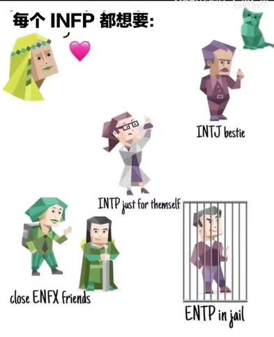{width="2.8541666666666665in"
height="3.507791994750656in"}

巴比波der

高届更不容易为情绪所动 不会很容易陷入负面情绪
能完成自己的工作和更有能力追逐梦想 拥有更多主动社交的能力
所以看起来没有那么天真了
但是我们的心还是很真诚的！只是不会开放给所有人让他们任意伤害了
这是保护自己的能力

2022-10-22 16:327

三春暮-blossom

笑死，本人高中就是典型低阶内耗infp，因为持续emo和心理不够强大被pua吃了很多亏，高中结束就变高阶乐，如果当初能高阶状态过高中，最终应该会比现在过得更好吧（举目）

2022-11-01 13:412

##### 讨厌ENTP

盐某盐

确实，怪不得我总觉得我朋友（INFP）和我（ENTP）玩的时候，一点都不温柔

2022-08-08 10:0325

##### 找乐子时enfp 梳理逻辑时intp 洞悉时局时infj 

非実在青少年

找乐子的时候是enfp，梳理逻辑时是intp，寻找一种美的"表现方式"时是isfp，洞悉全局(时局、环境中的人与事)时是infj，可以在一段被需要那么做的时间中能表现出来的这些人格的(表相)，infp会如同一个作者，像赋予故事中的一个角色信念人格与生命那样去赋予自己那样的能量。(把生活过得精彩如童话故事，tips:这种精彩并非建立在世俗成就的成功上)

2022-08-08 02:16142

##### 接受世界的丰富性、多样性、痛苦

Starling

大概就是接受了世界的丰富性、人类的多样性和无处不在的痛苦，自己和解了。仍旧保留着自己的真诚、理想主义、敏感、高共情，但是是有选择的使用他们，而无止尽地折磨自己。

2022-08-08 11:3682

##### 容易在晚上因为某件事流泪

y-0306

我也觉得我不怎么像（主要是共情能力，我理解的可能就是任何情感，但我对于诗中的情感是很头疼的，我感受不到，甚至也不怎么喜欢猫狗，小时候有被狗追过还被猫抓伤后来就算是没长牙的小狗向我跑来我都害怕），可最相似的也是这个（因为过度敏感，理想主义等都占了我甚至还每个字母都去查区别。主要眼泪不受控，容易在晚上因为某件事流泪非常真实

2022-11-05 23:23

##### infp也是讲逻辑 讲情感逻辑 相对t思考逻辑

infp也是讲逻辑的，讲人的逻辑(相对于事物的逻辑)，那种逻辑是一种将情感触发的要素化作有迹可循的逻辑(这是f的情感逻辑，相较于t的思考逻辑)。

2022-08-13 21:1912

##### 高阶世俗化INFP

###### 变高阶是庸人 但不是真正的我

药物致幻

回复 /@夕立と魚
:是的。我姑且能说是中阶的infp，这半年多改变了很多，更温和对很多事都看淡，也根本不会流泪猫猫头，处理问题的能力也更强，但我还是infp。我认为属于infp最本质的特征，也就是构筑我的重要因素是理想主义、热情、赤子之心与善良。如果变得高阶是成为一种落俗的庸人，只看重物质，那真的不是我，我理解有人是那样的，但我自己绝对不会想成为那样的人。2022-08-24
14:5619

巴比波der

高届更不容易为情绪所动 不会很容易陷入负面情绪
能完成自己的工作和更有能力追逐梦想 拥有更多主动社交的能力
所以看起来没有那么天真了
但是我们的心还是很真诚的！只是不会开放给所有人让他们任意伤害了
这是保护自己的能力

2022-10-22 16:327

###### 变圆滑世故ENFJ（主人公 教育家）

廖建勋

天完美赞同了，但是我是infp转enfj了从爱抽象的人转化为了具体的人，更加外向开朗了。依然不会对别人的痛苦麻木，保留了原始的共情能力和真善美，但是不会像之前一样整夜emo内耗，能快速调整情绪；依然喜欢胡思乱想和美好的事物，但是在保留这一切与自己的道德底限的情况下，逐渐在理想与现实世界之间取得平衡（之前真的很容易摆烂拖延和内耗，感觉很情绪化），感觉自己行动力执行力情商明显大幅提升，情绪也逐渐稳定。我infp和好朋友说我变得圆滑世故了，但是抱歉对我这种普通家庭被社会暴打的人来说生存才是最重要的，而且我的理想型就是enfj，既然遇不到我就成为他吧

2022-08-20 20:184

###### 回避型依恋 想象力下降 困难是良药

Rk_club

（低龄发言，可能会有不适，请大家容忍。）/
先天的infp，不属于刻板印象，思维模式更倾向于典型intj。感觉过度理想化应该定期需要一点现实冲击，很喜欢s系的现实，只有现实才能让我感受到艺术的伟大和瑰丽，将涣散的生活变得重见光明，建立富有逻辑性的世界观，只有一个九年好友，不喜欢甚至厌恶社交，曾经受到过打击有较为轻度的回避型依恋，infp真的很需要现实来重塑自己，但相对的想象力会下降，毕竟需要一定的计划来规划自己理想化的人生，困难是良药，infp需要现实的冲击力。

2022-08-12 01:1023

###### 低阶INFP过于敏感 高阶麻木

萤岛

为什么较为麻木的才是高阶啊

2022-08-07 17:4124

Lucy的美好祝愿

这个麻木应该是相较于低阶INFP过于敏感而言的。

2022-08-07 18:1413

海里的奶牛

高阶只不过，是低阶内耗的infp想通罢了

2022-09-06 17:184

###### 高阶舒服爆了

妞你苏菲掉了

原来是这样，我自己曾今处在低阶。由于各种改变我以为我不再是infp了，原来是变成高阶了。其实低阶更符合大部分人对infp的印象。但是家人们，我觉得变成高阶很舒服，真的，比以前舒服一些！

2022-08-22 14:2921

###### 变成了自己讨厌的样子

SOCOOLED

变成高阶后我有点不清楚自己是变得更好了还是变成了自己讨厌的样子，但我很快就不纠结这一点了，因为我变为高阶后发现了世界上有那么多令人高兴的事物。

2022-08-12 21:163

###### 高阶infp依旧是infp 表象变了 越高阶越不像刻板印象

咯咯-哒/_
高阶infp依旧是infp，内核是一样的，不过表象变了。每个人格都是越高阶越不像刻板印象，就比如撒贝宁就是infp，你看得出来吗。
2022-10-12 14:05👍3

##### 成长路线 发展Te同时优化Fi

Harukaへ
infp的成长是发展Te同时优化Fi，良性的第一功能Fi才是infp最大的优势所在，你把劣势功能Te用得再好也不会比Fi更得心应手，这是一个补短板修长板的过程。顺带一提如果真觉得Te用起来比Fi还顺手建议重新考虑一下判型

2022-08-09 09:3342

朔间零苏联复活美疯了

为什么infp......ti会变高啊

2022-08-25 23:502

内倾情感（Fi）------主要负责的内容是**内心深处的情感冲动与价值观，是一个人深层次内核的重要体现**。他们更倾向于聆听自己内心的声音，他们愿意花费时间和精力询问自己心中的渴望是什么、自己所向往的价值是什么，也可能强调自己的情感必须被直接抒发，不可被外界束缚。"我一定要按本心做事"、"不要干涉我的生活"，这些话，往往就是内倾情感主导者常说的话。

外倾思考（Te）------主要负责的内容是**让自己周围的事物按照效率优先的标准运转，尽可能优化外界资源，保持对外界活动的掌控力。**外倾思考强度较高的人往往领导能力强，擅长将不同的资源分配到最合适的地方，让一切井井有条；他们作出决策和与人打交道的时候往往非常直截了当，为了提高效率、完成客观目标，他们最不喜欢的就是拐弯抹角，在他们看来，解决问题比照顾感情或者弄明白原理更加重要。

###### [INFP-/>ENFP](https://www.bilibili.com/video/BV1Y5411R72C/?spm_id_from=333.788.recommend_more_video.19&vd_source=f03b9d349cef8aff4a045d602d8a1d82)

夜の卷神

言之有理，自从从傻白甜大好人变成毒舌女刺头感觉生活轻松多了。INFP的好可是人间真情，别随随便便就交付给别人。把温柔留给值得的事和人。

2022-06-08 23:1040

##### 自救方法

choimooni

1.不要纵容负面情绪在脑海里漂浮，记在纸上，直面你不愿意面对的恐惧，恐惧什么就解决什么/
2.infp需要学习阅读运动戒手机，看手机也只看自己想看的内容，不要看大数据推给你的，读书app有很多/
3.职场问题解决社恐，建立边界感，不毫无根据脑补他人情绪，提升能力，只有工作做得好才能真正赢得尊重，也要警惕那些pua公司/
4.积极暗示大脑，容易的事情就不要做了，做难的事才有高级快乐

2022-02-19 00:16169

###### 不想被情绪控制 讨厌自己的感情与理智冲突 麻木

超高校级的疯子-月
我是硬生生把自己训练成所谓高阶的。/
我不想被情绪控制，讨厌自己的感情与理智冲突时的撕裂，于是渐渐变得麻木/
喜欢更稳定的状态，会更舒服/
不过有时也会故意释放情绪，缓解一下内耗
2022-10-27 20:38

###### [激发自己的第二第三功能](https://www.bilibili.com/video/BV1Y5411R72C/?spm_id_from=333.788.recommend_more_video.19&vd_source=f03b9d349cef8aff4a045d602d8a1d82)

Fi Ne（想象力） Si（经验）

喇叭寿司
Infp活得艰难的99%，发育充分的不到1%，不是说一定要调整为ENFP，其实跟个人的能力和见识大有关联，你能力强，那坚持己见保护自己就是优点，因为你能做正确的判断并坚持。如果你能力弱，那就是管好自己困难，无力养活自己，这个缺点就无限放大。每个性格都有其成因和意义，盲目改性格不可取，激发自己的第二第三功能意义更大。
2022-05-06 15:23👍388

###### [没必要活在脑海 99%脑补 1%真实发生](https://www.bilibili.com/video/BV1Y5411R72C/?spm_id_from=333.788.recommend_more_video.19&vd_source=f03b9d349cef8aff4a045d602d8a1d82)

亲爱的Royyy
我提供一个思维，我今年出有一次得病，当时差点去世了，从此我逐渐的原理的拖延，因为我每天都提醒我自己
我其实每时每刻都有可能死，所以想这么多还不如先做做看，反正都要死，活着的时候就多体验体验，否则就没机会了。我以我很有可能随时死亡的这个看似"消极"的想法反而很大程度上激励了我。还有一点：一件事的发生，99%是你脑补的，1%才是真实发生的，没必要活在脑海里。
2022-05-18 14:33👍321

###### [习惯 一天一个俯卧撑 进入行动的轨道](https://www.bilibili.com/video/BV1Y5411R72C/?spm_id_from=333.788.recommend_more_video.19&vd_source=f03b9d349cef8aff4a045d602d8a1d82)

不知道的名字怎么办
回复 /@天才二次元虚无战士
:要不看看《微习惯》？基本上就是说，哪怕一天只做一个俯卧撑，只要你进入行动的轨道，慢慢就会好起来。核心是切香肠战术，把行动分解到站起来这样一个细微步骤，完成这样一个动作就告诉自己成功了一次，这样的成功要不要多来点呢？
2022-05-16 20:34👍2

你头也不回的走下去
回复 /@不知道的名字怎么办 :是的，核心还是正反馈
2022-05-16 22:11

###### 冷漠对待自恋型人格 低阶INFP讨好型人格

小蝴蝶的奇幻冒险
回复 /@Sofia_0101 :自恋型人格障碍患者 黑暗三角人格之一 灵魂猎手
未成熟的infp很多都是讨好型人格 容易吸引这类索取型的吸血者
2022-10-18 08:50👍34
##### 想受到深层次的理解和认可 不是受身边人肤浅的喜欢和好感

昕然然然
我希望的是受到深层次的理解和认可，不是受身边人肤浅的喜欢和好感，而是看到我灵魂的深刻和有趣，像那些伟人和艺术家吧，大家去认可他的内心他的经历他的思想，那样真好啊
2021-12-07 00:26👍154

unrulyleopard
还有我觉得人格测试测了几次以后就不准了，因为你心中已经有答案，要测出某种人格做出某种回答就可以了，之后的测试多少都有巴纳姆效应在作祟，真正了解自己还是得从人格类型的本质去出发（自己探索自身的一些经验）
2022-02-16 13:49👍16

##### [周围的人做出你无法理解的事时，往往是性格的不同，没有对错之分！](https://www.zhihu.com/question/28760453/answer/2389578709)

1
高度的创造力，表现力和神性，他们可以在艺术、歌曲和文学类层面有很好功底。INFP是与生俱来的艺术大师。假如鼓励并发展了他们的艺术天赋，他们很可能达到其他人难以到达的高度。这并不是说他们只能从事艺术类的工作，而是因为艺术创作对INFP而言是自身修复和不可或缺的一部分。

2
他们比大部分人更关心精神层面，并比别人大量和自身灵魂层次的接触。大部分INFP有很强的信念。但在他们丧失一些非常重要的东西前很有可能没法发觉这一点。一个INFP应当加强他们的信念。

3
INFP对社会发展中的不合理很在乎，并怜悯那些弱者。她们对受害者的怜悯和对社会不公平的过多在乎，令他们极端具备怜悯之心并对当今社会中弱势群体开展帮扶。她们可能是老师、重臣、文学家、咨询顾问或心理学专家，大部分的INFP都会付出额外的时间来尝试协助大家处理难题。一个INFP在促使某类可以帮助弱势群体的社会活动的中获得极大的满足感。

4
他们一般是好的聆听者，真心诚意期待聆听他人的情况并真心诚意的帮助他人。因此他们会很容易成为优秀的咨询顾问，和知心朋友。

5
他们认同并高度重视每个人成为自己的权利，并怀有强的平等主义。他们坚信一个个人有着变成他自己的权利，而并不细心核查另一方的工作态度和见解。因而，他们在和遭受社会消极判断的人接触时有较强的忍受和接受能力。他们可以在所有人的身上找到闪光点。他们坚强的捍卫每个人成为他自己的权利。假如给他们机会，对于那种自身无法找到自尊心和自信心的人，一个INFP可以变成积极主动能量的原动力。因而，他们可以带领一个"迷路的灵魂"回到家。

6
他们一般低沉并有智谋，可以比较非常容易地了解问题的本质。他们一般在学术研究上发挥出色，并会发现对思维的练习令他们对开展深层次思索的十分必要。

#### [INFP适合做什么样的职业？](https://www.zhihu.com/question/28760453)

##### 人是个变量而非静止不变 性格会改变
首先说明，人是个变量而非静止不变的。所以不同的年龄阶段、经过不同的工作经历和生活阅历后性格都有可能会改变的。所以不要光凭一个测试就决定或否定了自己的人生哦。何况关于九型人格以及MBTI性格测试的精确度还在饱受争议中/~
###### 第一梯队，灵魂契合度较高系列：

**教育培训相关**：老师、教授、高校科研人员、培训师、讲师等（[INFP型的人们都在做什么工作？ -迈尔斯-布里格斯类型指标（MBTI）](https://www.zhihu.com/question/19633884)里有位妹子的回答很暖很暖，可以参考。但可能由于偏感性，要面临并克服的一个问题或事实就是要看到一批又一批可爱的孩子们毕业，从此之后就不常能见到了。公立学校这种感受会更明显。）/
**语言类/哲学相关**：文学翻译、口译员、文字编辑、哲学家、语言学家、留学文书等/
**心理学相关**：心理咨询师、音乐治疗师、职业规划师、心理学家等（因为INFP容易产生情绪共鸣，也很享受分析别人思维的过程。但是因为是F，注意情感上的抽离。不然很容易自己陷入悲观情绪，不能自拔。曾幻想过成为一名心理咨询师，但是想到慢慢的负能量还是放弃了。不过依然喜欢心理学，即使她是理科。）/
**纯艺术类/文学类**：摄影师、编导、作家、自由撰稿人、编剧、画家、插画师、漫画家、音乐家、作曲家等/
**公益类**：各类NGO或者公益类组织/
**科技咨询师**：知友贡献，这个职业我也是第一次听到。以下引号内是工作具体内容。/
"具体就是写可行性报告，顺带做ppt提供给客户。科技领域，国家支持的战略性新兴产业为主，也有传统行业的高科技改造技术，各种行业打交道。私企，每个省市一般都有这种公司，这种公司的老板基本上都会有各种与科技部门的人脉资源。"/
**自媒体**/
**人力资源：**但就目前国内的环境来说，很难达到理想

####### INFP适合归隐山林甚至出家

一句话，**[INFP适合大部分不用费脑子去处理复杂人际关系的职业以及不赚钱的行业，适合归隐山林甚至出家。]{.ul}**嗯，注孤身系列。（有很多优秀的infp，不一一列举。以偏概全刻板印象属于自黑开玩笑吐槽。不杠，杠就是你对。到了刻板印象的题目下找答案，说哪来那么多刻板印象的是在想什么。还是只能说好话，不能说坏话咯？）/
总之，INFP的性格和价值观就是偏理想化，工作更多的也是为了寻找能体现自我价值实现的工作，而非更吸金的职业。所以，经常会看到有种人在某个行业已经干得风生水起，却突然有一天说我不干了，要去追寻人生的意义。重新做一份比之前工资低得多的工作。这种人，基本不用问了，70%是INFP。

###### 第二梯队，设计类：

建筑设计、园林设计、工业设计、舞台设计、服装设计、游戏设计、UI设计等/
（挣扎区，确实有文章说过艺术是INFP不得不背负的十字架。但是由于设计是工艺美术，和纯艺术还是有一定差距的。与此同时，INFP更加执着于概念创意、概念原型等，对于细节把控不足。可能S的人更适合做设计。）

###### 不合适：

金融、会计、销售、军人等

##### Infp抗拒高压，压抑和人际间冷漠的工作

[**十月止戈**](https://www.zhihu.com/people/40f98ef29b67b3c41d111b6e9e1f20c8)

本人infp，做过一段时间研发，弃坑，感觉infp对工作的要求是，不要从事高压，压抑和人际间冷漠的工作，会受不了，最美好的是从事有创造性的工作，还有就是啥也不用干，infp悠闲的时候相对不容易无聊

2020-04-10

[**Sibyl**](https://www.zhihu.com/people/453c7ee2bd446b54c62daf5b4271e57b)

作者

基本同意，我们太喜欢自闭了

2020-04-19

[**在厦门晒的腿很黑**](https://www.zhihu.com/people/e8b82072876348c7ee504ca09799c34f)

很不喜欢高压，强势的领导，冷漠的同事，压抑的氛围，感觉时间长了会厌世，我感觉每当遇到这种情况我都得拿出我所有的e来给自己打打气

2021-03-11

##### 后台开发 拖延逃避

[**剑走偏锋**](https://www.zhihu.com/people/abcbda21b0fd63b7519d74e4657267dc)

同意，不过我现在大三本来想着找后台开发的实习的，可是一直在拖延在逃避，不知道怎么办好？

2020-05-30

[**十月止戈**](https://www.zhihu.com/people/40f98ef29b67b3c41d111b6e9e1f20c8)
/>
[**剑走偏锋**](https://www.zhihu.com/people/abcbda21b0fd63b7519d74e4657267dc)

改变是艰难的，但也是可以的，你需要将一些不重要的东西割舍掉给自己的精力和注意力腾出空余，不是说不可以做研发，只是需要割舍一些东西为自己腾出精力，拖延本身是因为心里有太多想法和念头，却无法找准一个点发力，这很难，但确实必须要做出的改变。要么趁早放弃不想坚持的立马寻找下一个方向，要么割舍多余的东西，把精力和注意腾出来去解决你面临的问题和走当下选择的方向

2020-05-31

[**十月止戈**](https://www.zhihu.com/people/40f98ef29b67b3c41d111b6e9e1f20c8)
/>
[**剑走偏锋**](https://www.zhihu.com/people/abcbda21b0fd63b7519d74e4657267dc)

考研确实有很多选择的空间，如果去工作的话，第一份工作会决定今后很多年的方向，越往后改变的成本的越大，希望你选择的是自己所想的

2020-05-31

##### 厌恶死板无趣的工作

[**米弘**](https://www.zhihu.com/people/f55cd6764710ceb0033fcc9df6809e11)

适合从事有人情味的工作，不能对细节过度苛刻，也不要有人监视和太多竞争

2021-03-26

[**热度**](https://www.zhihu.com/people/2b8c054e3ccc60d6ca05a16876dcc82b)

太对了死板无趣的工作真的会厌恶

2022-02-19

[**CLOWN**](https://www.zhihu.com/people/6d22bdca7f32085e450f61bab515258f)

太真实了，压力大了就什么都干不成，反而没锅的时候最高效

2022-03-14

[**AUU工作室**](https://www.zhihu.com/people/d361cb1442204472edfd7729eaa63eab)

[**大大大狗子**](https://www.zhihu.com/people/03420b7774732dc57b9e408cdfa9e7c1)

离职状态，换了好几个工作，现在靠着几个月的存款不慌不忙的住酒店。我他妈服了，火烧眉毛了还好好爱自己，吃好喝好，玩手机！其实我内心是焦虑的你能懂，越这样说明我越焦虑

2022-05-06

##### 对于INFP来说，世俗的工作大多不合适

[**javire**](https://www.zhihu.com/people/ce02a2d984235f81acd14391227b7afa)

是的，我在制造业呆了好几年，感觉不合适，后面分析研究自己，判定不合适之前的工作。需要重新找到适合自己的路，现在已经裸辞了。虽然对于INFP来说，世俗的工作大多不合适，这似乎注定有点坎坷，但我愿意冒这个风险。

2022-10-13

##### 毕业快八年，尝试了有十份工作

[**iBelongToYou**](https://www.zhihu.com/people/94bff2f7b724a1ab50e965a0c0a70524)

强烈认同，毕业快八年，尝试了有十份工作。

2022-01-17

[**一钱清茵**](https://www.zhihu.com/people/401eb0f0115b82950b79f5fbfe64983f)
[**玩具枪**](https://www.zhihu.com/people/691db486c80d6bcbb036ea4481e74798)

说到我心里了我也觉得我活着就是来体验人生百态的。

2022-04-21

##### 无论工作，文学艺术类的，是infp们的生活方式

[**布里格**](https://www.zhihu.com/people/abdd297d656da76a55b51043d365ddf5)

不论从事什么工作，我觉得文学艺术类的，是infp们的生活方式，即便不以它为职业，也躲不开。

2020-04-06

##### 作家 心理咨询师 电影演员 游山玩水 

[**看你看我不看**](https://www.zhihu.com/people/dc9fbf712e72f4a64cf7ceb5c719e715)

INFP表示很准很准
跟我平时想的真的是一毛一样呀！！！我就想找个深山写小说成为一个作家
或者在喧嚣的大城市做一个安静的心理咨询师
或者成为一个实力派的电影演员！！！要么终极愿望就是富可敌国做做慈善游山玩水---成为一名大智若愚的演说家。奈何也不知道当初脑子怎么想的？想成为华尔街一位穿着风衣踩着高跟鞋的女投行家选择了金融
大学苦逼 还有一年本科结束啦 可能转个管理吧 要么就是心理学！！！

2019-10-03

##### 更容易幻想

[**实事求是**](https://www.zhihu.com/people/7a1559730ee5ce3c6ccea4f9764a1d1e)

INFP的人更容易幻想，代入小说或影视剧里的人物......

2021-04-23

[**熠熠**](https://www.zhihu.com/people/2b16aa3f35a45fafdb2c88f51ccb9804)

我是对艺术类感兴趣，学了传媒电影的我发现创造热情和能力几乎为0。

2020-02-21

[**风声**](https://www.zhihu.com/people/4b2784191b283cb63c07746ae6841fec)
[**钟声**](https://www.zhihu.com/people/c5215db87036817483dd4444bedf18b0)

确实，我测的infp。总是会回想过去，也爱幻想未来。相比对"现在"关注可能会少，也许这也是不爱做实事的原因之一。

2020-10-13

[**阳光果树live**](https://www.zhihu.com/people/26d2c435db63fee4e66892069765009f)
[**infp重度人格**](https://www.zhihu.com/people/432c453a26a619ce36d3797a5f0bba7c)

infp就是想的贼多 想学这学那 最后都坚持不下去 缺乏行动力
属于最没用的人格了 除非是富二代

2021-09-26

##### 社会性很差

[**在厦门晒的腿很黑**](https://www.zhihu.com/people/e8b82072876348c7ee504ca09799c34f)

主要是这个性格社会性很差，大部分人也不是这个性格的，所以在社会上就活得比较艰难

2021-03-11

[**麝香**](https://www.zhihu.com/people/c08e57ca6372f3593a44826ff728f942)

一直都有这方面的疑惑，数量很少的infp，怎么会在知乎遍地都是呢确实这种类型可能会更容易关注心理学，而且这种不稳定的类型很容易变成其他人格的"中转站"吧，文化上中国传统文化的影响了可能一定程度上压抑了人性的自由发展，造就了更多的infp

2020-06-08

[**云谣**](https://www.zhihu.com/people/98bebefb400ee871263b9897092c564a)

infp中国不可能这么多...我不清楚日本 反正infp其实都有一种共性就是共鸣强
可可爱爱呆呆的内向 这样的人现实很少

2020-06-19

#### [为什么INFP是最棒的mbti类型？趣味向](https://www.bilibili.com/video/BV15f4y1c7dv)

2021-10-07 14:12:08

##### 从小学到大学都在想小说大纲

既白_Verapure

本INFP表示从小学到大学在脑中想了大约有三十多个小说的大纲（而且为了防止忘记，经常反复回忆）但是一本都没写出来（有一本断断续续在写但是因为懒而坚持不下去）

2022-02-16 20:103374

燃暮之夏

我靠，我也是，而且一般是受了某一个场景的启发，或是想写某一种情节，再以这个场景或者情节为原点开始向前向后延伸编故事害怕自己忘就把几个重点章节写下了，写完之后反复看反复改，这儿加一点修辞，那儿加一点心理描写，然后发现还是第一版好，接着就不管了，开摆

2022-02-19 14:57313

呆呆糖糖

我也是，我之前看到规则类怪谈，于是就想写个我追的游戏同人怪谈大纲都写好了，但是找不到了就不想管了≥﹏≤

2022-02-20 17:5524

律law

是的！或者是写出来感觉和想象中完全不一样（指被自己的文笔菜到）这种时候就很想有那种脑内蓝牙直接把我想的画面传给别人（瘫

2022-03-26 14:3536

##### 爱幻想

寻迟弹钢琴

回复 /@中国新型废物
:真实了，几乎我身边所有人都在劝我别那么爱幻想，但是我就是喜欢沉浸在自己的小世界里啊，把我拉出来会让我觉得特别拘谨特别不适应，就像把蚌壳掰掉让蚌肉暴露在外面一样

2022-02-11 15:2735

我林克超勇的

哈哈会在脑子里演一场大戏，主角是自己，比如自己经历一段波澜壮阔的感情，或者去舞台上表演台下都是认识的人惊讶的样子，然后想到他们的样子我会无比的爽！如果被现实的事情打断了，过一会儿我还会把刚才那部戏捡起来再继续想哈哈

2021-10-09 21:454397

枫叶之所

哦哦，对对，老爱幻想，然后沉浸在幻想中

2021-10-10 00:1983

-1127-

小时候用语文课本后面单元检测的毫不相干的词语就能编一段小故事，现在想来是人格天赋了

2022-01-27 00:1429

请对健康生活心动吧

淦，我也是！我小时候经常蹲坑时看着地上的瓷砖图案编故事，现在也是hh

2022-01-29 14:4933

兮梦月初

挖槽，我小时候经常把纸揉捏成人有手有脚就像一个大字一样，褶皱部分就想象成铠甲衣服，还会用其他纸揉捏成各种奇怪的武器然后编剧情让它们打架。还会用红笔蓝笔来加特效，纹身，buff等等比如黑化的人就把眼睛化成红的。到初二之前我经常沉迷其中，然后我觉得身边的人好像都没这喜好就没说。因为这事到现在我一直觉得我天赋异禀想象力极其丰富。

2022-04-03 22:021

铁人尼西诺

不知不觉在一个人自嗨的过程中渡过了一天

2021-10-27 19:3311

Nnnnnneveah

我前段时间超级emo，让自己开心的方法居然是幻想一下某个不靠谱亲戚给我介绍了一个不靠谱的相亲对象，然后我怎么怎么骂这两人

2021-11-09 22:508

##### 注意力不集中

德里达再世

注意力是真不集中就没认真听过一节课，你以为我在托着腮思考问题，其实我在琢磨自己的一万种死法还有重度社恐，站起来回答个问题都吓的发抖，和同龄异性说话尴尬得要死，跟个结巴一样，周围同学都觉得我思维缓慢

2021-10-15 01:103697

lllllllling/_

我也是从小上课就很难集中因为一上课就想各种东西，除非真的是很感兴趣的东西才会认真听。平时老师同学都觉得我是个认真听课但成绩很差的人

2021-10-16 11:28259

##### 好内向好沉默好无聊 却又滔滔不绝的"演讲"

咸的虾酱

其实真的infp很独特，就是你觉得诶他好内向好沉默好无聊啊，诶，他又突然给你来个滔滔不绝的"演讲"，突然展示给你许多奇奇怪怪的有趣的东西。好家伙，你这时候可能觉得他大概不是内向吧，诶，你和他讲话吧，他又经常不说话，就只是看着你感觉特别认真地听你讲一堆乱七八糟的东西，也不怎么插话，就偶尔附和一下你，哦，对了，网上聊着聊着诶，他就突然不见了.../
没错这就是我

2021-10-08 15:597328

##### 很容易陷入抑郁和恐惧

幸运鳄鱼

但是infp很容易陷入抑郁和恐惧，没有动力的话就很糟糕了

2021-11-01 14:161914

##### 讨厌坐牢一样的生活

一草草/_

我讨厌每天一样的生活 和坐牢一样

2022-09-29 22:26

潘呀彤

回复 /@吴谦牧之cilotto
:我之前也这样，你或许可以试试一天发现一点新东西，在按部就班的缝隙里寻找自己感兴趣的，觉得有意思的小事情，这样每天就会有点不一样2022-06-01
10:3326

##### infp在社会中活得很艰难

玫瑰望青鱼

是捧杀吗？我觉得infp在社会中活得很艰难

2021-10-11 18:284176

无糖啵荷糖

infp是挣钱能力最差的类型，纯粹的人生活在成年人的社会好过才怪了呢

2022-02-20 11:3516

##### infp难以适应竞争性强的环境 慢慢失去自我

别叉我猹

回复 /@爷要当第一111
:没错，infp难以适应竞争性强的环境，会慢慢失去自我的，就像我一样，，

2022-01-14 12:48408

中国新型废物

我也觉得，我看网上都在夸infp，都说喜欢infp，可是为什么我在现实生活中并没有感受到这些，连跟别人相处都难，也并不适应这个世界

2021-10-13 07:582361

6円改个名

回复 /@猫岛秃秃人 :我可太厌恶竞争了 主动远离
本来可以为了自己做好的事一旦被参入了功利因素我就主动摆烂 但其实我也不想
我也总是把自己放在第二位优先考虑朋友哎 真的好累
我之前还不信邪infp是流泪猫猫头怎么一说话就变成这样

2022-02-25 01:5821

AC_hugo

回复 /@别叉我猹 :没错要竞争我都是拱手相让...

2022-04-09 23:08

##### 社交方面委屈自己去哄别人

猫岛秃秃人

国内的竞争环境 让我非常非常疲惫 身心俱疲 没有办法做到别人那样努力
总是觉得"差不多就好" 社交方面很多时候都是在委屈自己去哄别人 真的好累
捏妈

2021-10-17 20:36829

##### infp相处轻松 发展长期友情困难

空城Kc_R

哎，怎么说呢，其实跟infp相处挺轻松了，但如果说走进infp内心，发展长期的友情就很难

2021-10-18 09:16423

玫瑰望青鱼

回复 /@奇思妙想小空城
:因为infp喜欢设防，我个人是因为被伤害过不太信任别人，长期发展友情对我来说太难了，顾忌太多心累

2021-10-18 20:21520

##### 友谊交流难以放到心里

祝妜

回复 /@奇思妙想小空城
:怎么说，其实从小到现在我就一直怀疑我自己是不是有什么情感缺陷，就是在跟别人进行友谊上的交流互动时候，其实感觉就并没有把她们入到心里，就是在外人看来或许就打得火热，但实际上心里还是感觉就是一般般/
不过现在看来可能就是性格使然吧

2022-03-23 12:505

##### 对现实失望超级理想主义

鲁迅对我甘拜下风

在网上人人都喜欢这个人格的人，可是在现实生活中人人都觉得这种人是怪人，不合群不为社会所容，对现实失望超级理想主义，就凭这几点就真的很难生存，我就是
Infp，我现在已经陷入了人生迷茫期，根本找不到自己想要的工作，也不想将就
现在失业大半年了，一直待在家里，不想出门。

2022-02-08 21:5154

##### 审美怪诞

梦到月亮了吗

回复 /@中国新型废物
:这是真的，人多的时候就想逃离，想独处，自己一个人的时候就会思考一些哲学问题，奇奇怪怪的，然后审美也是偏怪诞的那种，越怪越喜欢

2022-02-19 21:2122

##### 日常emo

躺在黑夜的怀里

没有人理解我为什么一天能有这么多的情绪。也没有人同情我怎样有了这样的性格。他们都只是推着我拖着我让我往前走。

2021-11-29 23:2617

##### 过于热情，让别人倍感压力

-ir-

回复 /@FIIIIFI/_ :/@FIIIIFI/_ 我完全能懂 本人也infp
，疯狂的喜欢一个同性朋友（纯友情），甚至一度想要搬到她的城市去住能多陪陪她，结果因为我的过于热情，让朋友感觉到压力，她觉得无法给我对等的感情就很苦恼，我越近一步她就越退一步，而且我真的好笨，完全没有看出来她的压力与不适，偶尔跟另朋友说了我对这个朋友激烈的情感，被一针见血指出来，之后我去旁敲侧击的问，结果真的是另一个朋友说的那样，当时第一次体会到了失恋（？类似）的感觉，一分钟不说话就会进入流泪猫猫头状态，不断的回想我们之间的对话，不敢相信自己竟然对最喜欢的朋友施加压力这么久，夜里也是哭的不行不行的。/
在那一周之后我开始慢慢改变自己了，减少了主动说话的频率，但是还是基本每天都会说个一句两句话，试着放松自己也让别人放松，再变得越来越设防，很讨厌自己的性格，还是大纠结的处女座，真的没救了哈哈哈哈哈哈哈

2022-02-21 23:2917

##### inp真的经常有种世俗与我无关

[**南瓜噼里啪啦**](https://www.zhihu.com/people/f3564d052c2094da01ca52b82fac8028)

嗯，没错了，inp真的经常有种世俗与我无关，这个世界和我格格不入的感觉

2021-03-11

[**自然人**](https://www.zhihu.com/people/edc8a1785dd8703e85e9a03762e5a15e)

infp只要资质不差，蛮多搞科研深造的

2021-08-23

##### 心里想统治世界 却又是懒人

连夜连滚带爬上崆峒山

心里很想统治世界，实际上小组我都懒得统治，收作业值日都甩给别人干了。。

2021-10-08 12:504218

##### 找到内心喜欢的东西 进入心流

怒嚼炫迈

回复 /@别叉我猹
:嗯，希望你能找到自己真正喜欢的东西，然后你就会得到救赎，一定要发自真心的喜欢它，并且经营或学习或体验这个事或物，慢慢的你就会觉得生命很美好，因为你的眼里只有你喜欢的东西，内心世界之外的东西并不重要![/[给心心/]](psychology-MBTI.assets/image8.png){width="0.25in"
height="0.25in"}

2022-04-23 22:032

##### INFP 格格不入 不被理解 个人价值体系至上

[**Lemon**](https://www.zhihu.com/people/4b3fd1d2639cd270d5e01c8c23270a24)

INFP，感觉和身边的人格格不入，总是不被理解，好想哭

2020-10-25

[**closerer**](https://www.zhihu.com/people/55605d6fa12c23685096b566d03df400)
作者

对INFP来说，个人价值体系至上。

2020-11-02

###### 利用敏感体质 共情交朋友

[**百川**](https://www.zhihu.com/people/f75e5eacbb067affb6090043a8f32fef)

INFP利用好自己的敏感特质，多去和外界接触，是能成为共情力很强的人的，也能吸引很多朋友

2021-05-05

[**茶与同情**](https://www.zhihu.com/people/5875b2242b97a6be874e5f00e8846346)
[**百川**](https://www.zhihu.com/people/f75e5eacbb067affb6090043a8f32fef)

Infp觉得朋友是个麻烦事，不想认识很多人，不想谈恋爱

2022-04-26

[**陳知隱**](https://www.zhihu.com/people/3b3dc62505452c1679fb380991abbf19)
[**百川**](https://www.zhihu.com/people/f75e5eacbb067affb6090043a8f32fef)

很容易受伤

2022-07-11

##### 总是自省

[**总之就是非常可爱**](https://www.zhihu.com/people/38528dace52a143f3ccef477e56bce67)

会想起以前很多说过的话，进行自我批评

2022-01-20

[**Cherry樱**](https://www.zhihu.com/people/6320f60616d8420ad31252c28c6dc1db)

总是很容易想起尴尬的事，看个电影一个电影院就我一个人哭了

2020-04-18

[**kuku77kuku**](https://www.zhihu.com/people/21a1196ea370f2ef22e025da9db42b3e)

INFP泪点跟别人不一样

2020-12-28

#### [内容上来说（第一选择，自由度大，且能发挥价值）](https://www.zhihu.com/question/28760453/answer/2504267007)

音乐创作➕音乐老师➕音乐演奏

用户体验设计，[交互设计](https://www.zhihu.com/search?q=%E4%BA%A4%E4%BA%92%E8%AE%BE%E8%AE%A1&search_source=Entity&hybrid_search_source=Entity&hybrid_search_extra=%7B%22sourceType%22%3A%22answer%22%2C%22sourceId%22%3A2504267007%7D)，插画，[平面设计](https://www.zhihu.com/search?q=%E5%B9%B3%E9%9D%A2%E8%AE%BE%E8%AE%A1&search_source=Entity&hybrid_search_source=Entity&hybrid_search_extra=%7B%22sourceType%22%3A%22answer%22%2C%22sourceId%22%3A2504267007%7D)等

心理咨询师，心理学高校老师

撰稿人，编导，作家，诗人

知识分享类自媒体，博主

##### 职能上来看还包括（宣传类，运营类，找到优秀合伙人的职位）

[新媒体](https://www.zhihu.com/search?q=%E6%96%B0%E5%AA%92%E4%BD%93&search_source=Entity&hybrid_search_source=Entity&hybrid_search_extra=%7B%22sourceType%22%3A%22answer%22%2C%22sourceId%22%3A2504267007%7D)运营

人力资源管理

品牌设计

广告设计等

##### 行业上来说：

传媒，教育，[心理咨询](https://www.zhihu.com/search?q=%E5%BF%83%E7%90%86%E5%92%A8%E8%AF%A2&search_source=Entity&hybrid_search_source=Entity&hybrid_search_extra=%7B%22sourceType%22%3A%22answer%22%2C%22sourceId%22%3A2504267007%7D)，服务业

##### 在我看来，真正适合[infp](https://www.zhihu.com/search?q=infp&search_source=Entity&hybrid_search_source=Entity&hybrid_search_extra=%7B%22sourceType%22%3A%22answer%22%2C%22sourceId%22%3A2504267007%7D)的职业需要自己去探索，因为高自由度高自我创作的职业社会需要偏少，并且需要天赋和长期积淀（如作家，画家等），是有幸存者偏差的，低自由度低自我创作的职业infp难以发挥理想。

由次提出我的思考，抛砖引玉一下，希望infp们能对自己喜欢的职业深入思考，不要心头一热跨了行业过去，反过头来发现不是自己真正想要的。

##### 只有认清自己热爱的底层[逻辑](https://www.zhihu.com/search?q=%E9%80%BB%E8%BE%91&search_source=Entity&hybrid_search_source=Entity&hybrid_search_extra=%7B%22sourceType%22%3A%22answer%22%2C%22sourceId%22%3A2504267007%7D)，才能真正实现职业选择自由。

很多infp都喜欢艺术，音乐，绘画，摄影等等，仿佛在每一方面都还有一些小天赋在，虽然可能没有正经学过，但是就是比周围人多了那么一丝灵性。但是请你问问自己

1.  如果你学会了画画，你想画些什么？如果你在创作，你是尝试画的越精美越好，还是只是想表达某些哲思？（infp们可以观察一下，一般沉醉于画面表现和技法的可能是isfp，通过画画来表达社会观察和哲思的为infp，如艺术家：三元三元_s）

2.  如果你学习音乐，你想学到什么程度？是希望死磕到每一个[音符](https://www.zhihu.com/search?q=%E9%9F%B3%E7%AC%A6&search_source=Entity&hybrid_search_source=Entity&hybrid_search_extra=%7B%22sourceType%22%3A%22answer%22%2C%22sourceId%22%3A2504267007%7D)都严谨且不差分毫，还是只是想学到自己能随意的唱出自己想唱的就满足了？

3.  如果你去摄影，你会向哪方面发展？是画面的好看更重要还是能表现某种社会现象某种思想？

当我问完我自己，我发现艺术只是一种媒介，我确实喜欢，但是我并不追求华丽的技巧和画面，我热爱的是观察思考表达，以及创作，甚至有的时候我不喜欢实践，因为这样我就不能深度的思考了，我喜欢清醒的人，也想做个清醒的人，关于亲密关系，职业追求，生活哲学思考的越透彻越清醒，越能获得幸福。

##### 将热爱抽象出本质来，很多infp热爱的其实是观察，思考，表达及创作。

我发现我没那么适合去学艺术，因为除了艺术家，大多数学音乐的人变成了机构培训老师教音乐，是以教学为主的；大多数学画画的变成了设计师，用视觉技能为商业服务；大多数摄影师都成为了人像，[商业摄影](https://www.zhihu.com/search?q=%E5%95%86%E4%B8%9A%E6%91%84%E5%BD%B1&search_source=Entity&hybrid_search_source=Entity&hybrid_search_extra=%7B%22sourceType%22%3A%22answer%22%2C%22sourceId%22%3A2504267007%7D)，并不能真正表达思想。

（当然作为糊口的职业来说还是非常推荐的，这里只是作为寻找最适合职业的一个思考过程）

##### 那么由此推出，最适合infp的职业是[艺术家](https://www.zhihu.com/search?q=%E8%89%BA%E6%9C%AF%E5%AE%B6&search_source=Entity&hybrid_search_source=Entity&hybrid_search_extra=%7B%22sourceType%22%3A%22answer%22%2C%22sourceId%22%3A2504267007%7D)，作家，心理咨询和自媒体这类能够进行深度思考及自我表达的工作。

##### 那么作为普通人可能没有这么多的积淀，可以做艺术家，作家，但是我们依然可以自己寻找适合的工作。

1️⃣比如我们都可以学习画画，音乐等艺术，但是我们可以将他们用在[自媒体](https://www.zhihu.com/search?q=%E8%87%AA%E5%AA%92%E4%BD%93&search_source=Entity&hybrid_search_source=Entity&hybrid_search_extra=%7B%22sourceType%22%3A%22answer%22%2C%22sourceId%22%3A2504267007%7D)上，创作一些有趣的作品，比如：为[诗歌](https://www.zhihu.com/search?q=%E8%AF%97%E6%AD%8C&search_source=Entity&hybrid_search_source=Entity&hybrid_search_extra=%7B%22sourceType%22%3A%22answer%22%2C%22sourceId%22%3A2504267007%7D)配画面的作画视频，根据不同人的性格去为他们创作的画等等。

甚至也可以根据我们的创作主题自由选择创作方式，无论是手工剪纸也好，定格动画也好，还是一些创意摄影也好。我们虽然不能把技能学精，但是可以通过多种手法自媒体创作，而不局限于现有的发展途径里。

2️⃣我们对于自身成长发展的学习，使我们对心理学很痴迷，并且在帮助别人给别人建议时会获得很大的满足感，这样的infp可以尝试做相关自媒体内容，在知乎写文章接受别人的咨询以及做心理咨询相关实习和兼职，而可以不局限于考研这一条路（如知乎大v宏桑）。

3️⃣infp们还可以尝试写文章，写文章在创作活动中自由度比较大，文学创作最初期难度可能比较大，可以选择喜欢的平台发表文章，并且不断积累现实素材和文学素材。

你有没有发现以上很多都是一些非主流小众的赚钱方式，但是确实会让infp即实现理想又赚来金钱。即使现实情况无法实现理想，也可以尽可能的发挥自己的优势，在职业中增加不可替代性。

#### [INFP是世界上人口最多的MBTI人格类型?](https://www.bilibili.com/video/BV1wG411H7En)

实际不然，只是因为INFP更关注自己心理罢了。

像ESFJ根本不会去做这种毫无意义的事情。

INFP觉得自己是个怪人，与世界格格不入。更关注人的内心。大喜大悲。

##### 世界上infp是最多就不用煎熬了

休眠种子

如果这个世界上infp是最多的话，我们infp也不用这么煎熬了

2022-07-22 12:282461

站长推菅

其他不少人格是可以互相理解的，而没有人理解INFP🤣

2022-07-24 14:10117

##### infp也不会去理解infp 顶多互不干扰

阿废_Elskimo

好笑的是 infp也不会去理解infp 顶多互不干扰罢了（虽然这样已经美好很多了）

2022-07-27 12:0934

lllllhja

回复 /@站长推菅 :enfj很理解

2022-07-25 22:34

池茗不吃药

回复 /@站长推菅
:infj也可以哒，我是infj朋友是infp，虽然有时不能及时解决她的难过的事，但我还是会看出她在烦心的（当然也会尽量让她变得开心

2022-07-27 23:3322

khgkhgkhgkhgkhg

Fi是主导个人主观价值观的功能 而个人价值观每个人都不一样 所以以Fi主导的人
会过分强调个人价值观中心 所以基本是不接受大众和社会和他人的意见的
所以是即便是infp和infp相遇一旦涉及价值观
两个绝对不会改变个人价值观的人碰到一起一样是无法相互理解的
而且会比碰到其他功能主导的人冲突还要大

2022-07-26 19:3614

##### INFP是反社会人格

御夜星守

实际上是根本没有10%这么多，要知道INFP是反社会人格，没有那么适应社会的，一般来说不适应发展的需要的东西不会多，而且再加上INFP比较关注互联网而且INFP很关注MBTI，所以会偏高，按照书里写的，INFP应该只有3%～4%

2022-07-23 22:5250

##### 是有这种可能

桂花遇酒

啊这，是有这种可能🤔。但是就个人感觉身边的infp确实是最多的，但官网上的数据也确实偏高，现实中应该就百分之十。虽然说每个人都希望自己独一无二，但是你是否成为一个独特的人并不是mbti决定的呀，mbti只是一个思维风格和行事方式的分类而已。真正决定你是什么人的，是思想、眼界、能力、容貌、礼仪、家教等等。没必要为这种事感到不快啦

2022-07-23 13:42296

##### 不管什么人格在抑郁时=INFP

我才不是萌萌的橙子

还有一种说法是不管什么人格在抑郁的时候都更容易被测出来是INFP

2022-07-23 16:21104

##### INFP热衷于研究人类的人格

除夕夕夕

因为infp是最热衷于研究人类的人格，关心MBTI的很大一部分都是infp

2022-07-30 17:3225

木木子是攻

确实，infp对16型人格，星座，宗教，占星术，魔法，阴阳，这种都特别感兴趣

2022-08-07 00:266

##### 社会发达稳定地区infp肯定是最多的人格

窮涯也

事实上infp就是很多，感觉起码12%往上跑。如果要说什么infp喜欢冲浪，想想现在你坐个地铁还有多少人不看手机，难道其他15个人格冲浪比infp少那么多吗？如果要说infp不喜欢社交，intp可是太厌烦社交了；要说喜欢分析/了解自己或他人，entp和infj都很喜欢；难道数量多就是低人一等？有这种想法的人心智真的停留在未成年吧。我倒觉得这是现在人类社会进步发展的自然结果和倾向（高n/f/p值），社会发达稳定的地区infp肯定是最多的人格。

2022-07-25 23:5036

##### 人格类型和人格的概念解释

在不同的环境下每个人都可以表现出不同的人格特质，但这并不代表人格类型就改变了。

2022-07-25 16:171

人格类型的本质是驱动力，不是能力。其次人格类型是天生的，后天也不会变。就是说如果一个人说自己类型变了那就说明他还没弄清楚自己的真正类型。也就是说，人格类型跟后天的环境和经历毫无关系。

2022-09-27 16:302

#### 不说脏话

不撞昵称真难

不知道有没有infp和我一样，我给自己树立的底线就是不能说脏话，因为我觉得说脏话是不道德的![/[笑哭/]](psychology-MBTI.assets/image9.png){width="0.2986111111111111in"
height="0.2986111111111111in"}特别是很多脏话还涉及女性

2022-10-15 20:01493

长颈鹿一米五

我也是，但是卧槽老是脱口而出

2022-10-17 15:0510

花式帅与某丞

我也是，我的脏话只用来表达我的情绪，但是从来不对别人说或者用来评论别人

2022-10-19 12:1523

#### 高道德感 怕伤到别人

嗅嗅太阳光

我真的不想要高道德感了，我快疯了，稍微对别人说了点重话，自己就内疚抑郁死了

2022-10-15 19:4826回复

infpt-晴雨

回复 /@嗅嗅太阳光 :确实，说话时害怕伤到别人，听别人说话自己又很敏感

2022-10-15 21:045

#### [如何快速分辨低阶or高阶版的infp](https://www.bilibili.com/video/BV14o5vzwEmg/)

#### [给INFP打一针强心剂！！！](https://www.bilibili.com/video/BV1994y1t7b5/)

INFP完全是奉献型人格。

ENFJ、ISFJ都只是讨好。

黛梦萌萌哒

infp也们也不傻，知道怎么对待人和事不会受伤，但是来自基因里的使命却要求我们，无论被伤害多少次，都留存真诚纯粹的心，但是社会病了， infp的每一天并不好过，又呆又傻的模样实在很适合pua和欺骗，被伤的太重会抑郁，为了活下去也会转变性格，当 infp都被杀死后，纯粹代表爱的具象的人就不复存在了。也许我们都会怀念自己单纯可爱的童年，infp们一生都困在了童年里，无法成为社会需要的合格的大人。在呼吁爱和道德的路上牺牲自己，看着很傻却是唯一能令他们觉得有意义的事情。infp虽然看着很废物，但如果你愿意接纳他，你可能会得到最纯粹的爱。:-(可惜爱不值钱，越长大越没人稀罕捏
2023-10-19 00:29 👍282

伊布IB

 可是爱很重要啊我觉得，我去年在体制内上班，因为好说话又没背景她们啥活都扔给我，天天加班到深夜，顺手还给我塞了个借自杀热线的活，骗我说没人打，只是上面要求所以走个形式，结果没几天就有个未成年小姑娘十点多打电话过来哭（没错我加班到夜里十点多也下不了班[灵魂出窍]）说她是重度抑郁，自杀过很多次都被抢救回来了，然后她开始服药，有很严重的躯体反应，她说这些的时候一直在哭，不停的说太痛苦了，为什么不能让她去死云云，我不敢挂电话怕她真的会自杀，然后等她哭好了，我才挂断电话。如果她身边能有人不计代价的爱她，可能她会好很多，也不至于走到反复自杀的地步，她在哭的要死要活的时候她家人很平淡的在旁边聊天……戏剧性的是电话挂了以后我被小领导骂了一通，就说这种电话就得走程序，说两句套话应付一下就赶紧挂，不然她死了到时还得找上单位[灵魂出窍]你看爱多重要啊，一个心里满是算计没有一点爱的人，就连一条命都不在乎，完全没有爱只计较得失的人在我这里已经丧失作为人的价值了。
2023-10-19 01:37 👍44

赫宝宝Hb

 加油，不要放弃你们的使命，如果你们不履行，世间爱没了[口罩][口罩][口罩][口罩][口罩]
2023-10-19 00:57 👍15

nasiss

 长大一点点的蝶（中学时期），主要是在纠结：为什么很多规定和传统明明不对、造成了很多人的痛苦，却没人愿意反抗，反而把很多人被禁锢在里面？比如闹新娘、比如食不言寝不语、比如打是亲骂是爱……；还有的蝴蝶在纠结：很多人为了利益来找我，寻求帮助，明知道被人当成大傻子工具人却因为共情能力或者难以拒绝导致很纠结，因为知道在被人利用，之后帮完了还会被人当冤大头笑话，但是该死的共情能力又让自己做不到袖手旁观。这个时期的蝴蝶最痛苦，很多蝴蝶抑郁症发作就在这个时期。我的经历来看，远离人群，远离各种功利的人，制造距离和疏离感最重要。如果需要情感支持，那就去大自然里寻找，遇到被暴雨冲走的蚯蚓，把它们放到能遮雨的土地上；遇到努力盛开的小花，对着它们微笑；遇到需要救助的小动物，努力给它们找到一个合适的家。在这个过程中，蝴蝶会发现这对她们是极为正面的感情回馈，也能积攒回归人群的经验和勇气，知道帮助别人是出自内心，别人反咬一口只能说明他们卑劣，却不能因此后悔自责伤害自己，也不能变成一个对所有人都视而不见、把自己封闭起来的人。慢慢培养自居做正确的事、成为善良的人的勇气，对人性有眀悟，不去强求和过于期待，也要肯定人性都有闪光的一面。这样才不会对这个世界失望。
2024-03-28 05:21 👍1

nasiss

再大一些的蝴蝶（大学、涉世未深）主要纠结可能是：我知道我可以做些什么，我也知道有人很糟糕，对于这部分人我帮不到。还有就是，我的能力有限，很多时候只能眼睁睁看着求助的人挣扎，无能为力。这个时期的蝴蝶有了成为大人知道自己有能力也想为这个世界做点什么的觉悟，但是世界再次给予蝴蝶沉重的打击：有些人你注定没办法帮。所以会看到刚毕业的医生护士因为总是看到病人过世而抑郁自鲨，有宠物收容所的工作人员因为要给没人领养又生病的宠物安乐死而崩溃自鲨。可以说这个阶段的蝴蝶很容易被自己的无力感折腾崩溃。我的经验是，关注自身，自鲨也是伤害生命。蝴蝶看到别人受苦会难过，但是也要开始正视自己了，正视那个痛苦的、需要帮助的自己，先和自己和解，好好爱自己。蝴蝶们长大了第一件事不是去为了别人燃烧生命，第一件事应该是再次认识自己，知道自己的不足，谅解自己的无能为力，爱自己。
2024-03-28 05:29 👍1

[别说话-别出声](https://space.bilibili.com/660511482)

回复 [@烦烦烦烦烦烦反](https://space.bilibili.com/1945725964) :这不用专门分析吧，世界是残酷的，当理想主义者和现实主义者站在一起的时候最终成功的统治者一定是以现实主义者为主的，用一个不太准确但可以概括的说法：“圣母当不了统治者”，nfp型人格在过去的欧洲或许可以当一个合格的教皇，但绝对无法成为一个合格的帝王——缺乏足够的理性与大局观，同时行事不够果断，除此之外还可以列举出很多对于当下社会不适合作统治者 那么如果脱离当今社会来看待infp能否作为统治者出现，答案是可以的：1.小国寡民且资源富足；2.都是理想主义人格，这两种情况下infp作为统治者发挥出的效益会是较大的，因为第一种情况下物质不成问题，精神世界成为主要追求；第二种情况下虽然infp仍然不是最优解（最优解应该是enfj），但发挥出的实际效益仍然不小 最后回归原话中的“社会秩序紊乱”，其实就是对于当今社会16人格并存并且面临资源紧张、竞争激烈、发展迅速的社会现状，s/t/j型人格才是主流，而infp正好一个都不沾。想要改变社会现状除非发展到头了，实现资源自由了，否则现状是必然趋势

2023-10-19 19:59 👍14

恶魔与布偶猫

 回复 @别说话-别出声 :反过来说，本来历代那些有名的统治者都不是好人，包括政客，好人根本当不了统治者，统治者这个位置就是吃人的，统治者有啥好的，利益导向的极致。也许可以出现这样一个世界，扁平化管理，适合infp，那其实是合作关系，而不是层级之间的管理关系，就像很多欧美公司现在的情况，这样的国家，让人想起来母系社会，不注重竞争而是发展，包容成员，谋求和谐，本身父系社会就是竞争残酷的丛林法则
2023-10-24 11:08 👍23

一条鱼_呢

 看完了楼主的分享。嗯，我认为小蝴蝶要进阶还是得去经历，光是精神上面的充实不是很坚固，很容易被现实狠狠的打倒了。我最近经历了一件事情，让我发现了我在处理和异性的相处中，我会不自知的改变自己去迎合对方，事后发现这个非常可怕，我居然连我自己都不要了！在这之前我都不会想象我会做出这样的事情，只有经历了才会知道，就好像是我在这次事情中又找到了一片不一样的我，拿回来组成了更好的自己。
2024-04-09 22:38 👍1

-心灵摆渡人-

infp不要“贱卖”自己情感和爱的能力，例如成为别人的情绪垃圾桶，因为白给的不被人珍惜，会轻贱你。资本主义社会，infp不要降价太多甚至免费劳心劳力送牛奶，自己用牛奶创造出更多东西让自己更舒适，多了就给值得的对你好的亲人朋友，再不行就倒掉。
2024-04-10 07:27 👍5

蒙罗维亚

已经改变性格了，以前观察到路边有陌生人需要纸巾，我都把自己的纸巾包递给她，特别喜欢观察，特别喜欢帮助别人，特别喜欢真心的夸别人，觉得这个世界充满爱，大家都应该手拉手共建美好社会，现实是，进入社会工作后再也不会向以前那样了，社会充满欺诈与孤立，一味天真好心，只会让别人不断伤害你，哪怕是你身边的人，都一样，虽然每次做梦都大概率梦见童年住过的奶奶家，充满美好与天真，但是现实中是完全相反的，希望各位infp能多多爱自己，不要再把别人看的比自己重了，也不要因为自己变得不再天真烂漫而难过，我们的灵魂永远是纯净善良的，只是生在世间，每个人都必须要为了适应社会而“进化”，这是我们成长必经的道路，记得多爱自己就好
2023-11-08 17:04 👍16

铃铛糯米糍

infp出来就是纯良又敏感，如果童年幸福还好童年不幸福呵呵……稍微聪明点的从很早的时候就知道世界是怎么样了善良和爱在功利的社会根本行不通但是他们的本能就是奉献帮助没办法。他们从一开始就是和世界格格不入的……只能说把这个世界当成一次渡劫吧用这个世界来修炼自己寻求向内的力量就好。其他的看开点别为难自己尽力而为。
2023-10-19 14:48 👍38

檀塔莉

黑化的infp表示少付出是正解 一边试探性付出一点 根据对方态度调整后续策略 如果不能互惠互利直接切断关系
2023-11-22 22:05 👍4

豆陌

同样是学习，在重点高中时候总是强制早到，然后晚自习晚走，就因为我们是重点班，我就觉得特别烦。但是上班了之后，要在呆单位9个小时，不过可以自由选择是否加班，不强制，然后我就开开心心的，只要老板要求或者公司有需要，我就直接自觉加班[笑哭]
2024-06-21 19:33 👍1

### ISFJ 守卫者 照顾者

其中I代表内向，S代表实感，F代表情感，J代表独立。

**眼见为实**

守卫者人格类型的人所面临的挑战在于，如何确保让别人注意到自己做的事。
他们总是对自己的成就轻描淡写，虽然这样的善良经常会得到尊重，自私自利的人可能占他们爱奉献和谦虚的便宜，把工作推给他们，荣誉留给自己。
如果想保持自信和热情，"守卫者"们需要知道什么时候说不并勇于为自己反抗。

天生喜欢社交是内向者身上少见的特点，"守卫者"们不会把出色的记忆力用在数据和琐事上，而是记住人和他们生活中的细节。
他们最擅长赠送礼物，他们天生富有想象力且感情细腻，他们的礼物可以送到接收者的心坎里。
对于被"守卫者"们当作朋友的同事们来说是这样，而在家庭里守卫者们会尽情表达爱意

**尽可能地保护你**

守卫者人格类型的人是一个奇妙的团体，正事没有完成之前，他们绝对不会虚度光阴。
与人亲密接触的能力是其他内向类型遥不可及的，他们使用这些关系来维系一个相互支持的快乐家庭，这对每个参与其中的人来说都很幸运。
他们在聚光灯下可能永远都不会觉得舒服，把团队的成就归功于自己会使他们感到内疚，但如果他们的努力被认可，"守卫者"们从所做的事情中得到的满足是其他人格类型无法企及的

#### 优点

-   **支持**------守卫者是万能的帮手，他们与任何需要的人分享他们的知识、经验、时间和精力，尤其是与朋友和家人。具有这种性格类型的人争取双赢，尽可能选择同理心而不是判断力。

-   **可靠和耐心**------守卫者不会提供零星的、兴奋的匆忙而使事情完成一半，而是一丝不苟、谨慎，采取稳定的方法并根据情况的需要弯曲，以实现他们的最终目标。守卫者不仅确保事情以最高标准完成，而且往往远远超出要求。

-   **富有想象力和观察力**------守卫者非常富有想象力，并利用这种品质作为同理心的附属品，观察他人的情绪状态并从他们的角度看待事物。他们的脚牢牢地踩在地上，这是一个非常实际的想象，尽管他们确实发现事情非常迷人和鼓舞人心。

-   **热情**------当目标正确时，守卫者将所有这些支持、可靠性和想象力应用到他们认为会改变人们生活的事情上------无论是通过全球倡议与贫困作斗争，还是仅仅让客户开心。

-   **忠诚和勤奋**------只要一点时间，这种热情就会变成忠诚------守卫者的个性通常会对他们致力于的想法和组织形成情感依恋。任何没有通过良好、努力的工作来履行义务的事情都会辜负他们自己的期望。

-   **良好的实践技能**------最好的部分是，守卫者有实际的意义，可以用所有这些利他主义实际做一些事情。如果需要完成平凡的日常任务，守卫者可以看到他们创造的美丽与和谐，因为他们知道这有助于他们照顾他们的朋友、家人和任何其他需要它的人

#### 弱点

-   **过于谦虚和害羞**------温顺的人将继承地球，但如果他们根本得不到认可，那将是一条漫长的道路。这可能是守卫者们面临的最大挑战，因为他们非常关心他人的感受，以至于他们拒绝表达自己的想法，也拒绝为自己的贡献而获得任何应得的荣誉。守卫者对自己的标准也非常高，以至于他们知道他们本可以更好地完成任务的一些次要方面，他们常常完全淡化自己的成功。

-   **把事情看得太个人化**------辩护人很难区分个人情况和非个人情况------毕竟，任何情况仍然是两个人之间的互动------冲突或批评带来的任何消极情绪都可以从他们的职业生涯中延续到他们的个人生活中，然后又回来。

-   **压抑他们的感受**------守卫者人格类型的人是私密的，非常敏感，非常内化他们的感受。就像守卫者保护他人感情的方式一样，他们也必须保护自己的感情，而这种缺乏健康的情感表达会导致很多压力和挫败感。

-   **超负荷自己**------他们强烈的责任感和完美主义与这种对情绪冲突的厌恶相结合，创造了一种情况，守卫者很容易让自己超负荷------或被他人超负荷------因为他们默默地努力满足每个人的期望，尤其是他们自己的。

-   **不愿改变**------这些挑战可能特别难以解决，因为守卫者在他们的决定中高度重视传统和历史。有时情况需要达到一个临界点，守卫者才会被环境或所爱之人的强烈个性说服而改变路线。

-   **过于利他主义**------这一切都被守卫者的利他主义的美妙品质所强化和强化。作为如此热情、善良的人，守卫者愿意顺其自然，相信事情会很快好转，不会因为接受他人的帮助而给他人造成负担，而他们的麻烦却在无助的情况下增加

偏好职业

偏好的工作领域：卫生保健、社会服务、教育、商业、服务、设计、艺术。

偏好的典型职业：人事管理员、护理医师、营养学家、家庭保健员、图书管理员、室内装潢师、律师助手、数据库经理、信息总监、后勤与供应经理、业务运作顾问、工厂主管、记账员、福利院工作者、特殊教育工作者、旅馆业主、项目经理等^ /[7/]^  。

[**小满**](https://www.zhihu.com/people/9c82f7a97051af780dc5f9bb573b0429)

isfj不好在哪里？不是说isfj是最好的人妻（人夫）吗？

2022-06-22 IP 属地广东

#### 评论

##### 被当成使唤的工具人很生气

sooiaaaaaa/-/-/-/--

以下为我个人经历：/
关于利己......其实回报什么的也不重要啦，你对我表现出好感或者感恩就好，但是如果把我当成使唤的工具人我会非常生气，严肃的跟你讲自己去搞（然后经历一段时间的自我pua为他找好借口继续相处）/
关于迁就......我也不想的，因为有一种奇妙的想法告诉自己如果我表达我想吃火锅就会被讨厌，但是别人跟他说想吃火锅他们下次还是正常讨论而不会被讨厌，就是感觉自己在别人心里不重要（说了也不会被同意，该日料还是日料）/
关于"妈妈的爱"因为我妈这样对我所以我逆反了不会这样/
一成不变的菜单和占有欲十分真实（因为太挑食了雷很多，无论菜品饮品对象小说雷都很多，只能一成不变）/
争论的话我只会和较为委婉的辩论一小下，明显攻击性的直接举报黑名单/
（因为基于上一点雷太多导致负面情绪很多，已经学会规避负面情绪产生了，直接黑名单眼不见为净）

2022-06-19 13:0452

##### 不应把我的好认为理所应当

小Zhing

我是isfj，我的回报不一定要对等，但是我希望我找你的时候你可以耐心听我说话，不能把我对你的好认为理所应当，up说的我都有，最近经历一件对我影响很大的事情，我已经在改了。

2022-06-16 18:184

##### 害怕计划被打乱

哈批哈啤

害怕计划被打乱是真的，无尽的内耗，今天刚知道学期末要交开题报告，但和考研的时间撞上，已经无端担忧一小时了

2022-10-22 00:572

魔法少女王小杰希

是的！！！我真的非常讨厌计划被打乱！！！太焦心了！！！

2022-06-13 16:182

##### 付出而不要求回报

霜摧飞花

大部分真的很对，但我不要求回报，就是我付出不讲究回报。也不是傻什么的，我只是单纯的认为，我的付出是我自己的选择，其实的一种另类的自私

2022-10-27 20:202

##### 以身边人的舒适为主 一直点同杯茶

时代峰峻yydsH

我是ISFJ，这个发言是我让我朋友对我的感觉和检测，我是一个很温柔的人，在意别人看法和建议的人，我没有太多主见，一切以身边人的舒适为主，但我如果要发脾气
我会很着急很焦虑，我不知道如何和别人辩论但我会很快的组织语言找到我的立场，我会记住别人的喜好，去给别人买他们喜欢的东西，我在恋爱中不会强迫对方去做他不喜欢做的事情，但在一定方面上，我会主动说出我的看法，因为我觉得，谈恋爱是双方一起往更好的方面去做，我很依赖对方，我在恋爱和最好的友情中会有占有欲和控制欲（但不是很大），我能够处理好人际关系，我社恐其实是内向
如果你要让我去单独问别人一些问题，我会害怕，我怕我说错话
我会在意别人的眼光
因为我算不上苗条（身高166体重125）我不敢穿裙子走在，我怕我的腿部的肉会让别人对我有一些不一样的见解，一直是长裤短袖或长袖，我会点同一个饮品，我在一家小型奶茶店
姐姐一见到我说还是蜜桃乌龙？我就点个头，我会给对于我来说很重要的朋友礼物，即使假如生日过了，我也会买
因为我觉得有点仪式感是很好的

2022-07-18 08:5628

格格格格西

本INFP也几乎总点同一杯奶茶哈哈哈哈哈哈哈 纯纯是懒

2022-06-11 18:2010

##### 不要交外向且自私的朋友

白巧黑巧好吃就是好巧

isfj，但是对交外向朋友需谨慎，不要交外向但是自私的朋友，反而觉得和自己相似性格的会很好相处，外向要交懂得付出的朋友，这一点很重要！

2022-10-04 21:32

##### infp变成了isfj

翳隐

我从infp变成了isfj?一般情况下人是不会变的，但我能感觉到我从一个努力融入集体还是显得很奇怪的，独断专行的，想象力和情感丰富，文思泉涌，注重想象不是现实的人变成一个注重实际，想象力匮乏，什么都喜欢用自己的si来套公式一样做事情，可以轻易融入集体，喜欢讨好付出，讨厌变化的人。但现在回想一下还挺怀念那个时候的?

2022-09-13 16:50

aaaaaesop

我测了几次，isfj和infp倒替出现

2022-09-15 09:22

### [ESFJ 盛情难却的东道主 狗 应付亲戚](https://zhuanlan.zhihu.com/p/399968408) 至交好友

杨卯 张立志 杨路潞 Dad talk to relative

像狗一样社会

ESFJ是热心肠的人，有些大大咧咧，平时为人高调风风火火，但脚踏实地，没有太多理想抱负。他们平时有点爱多管闲事，想照顾好身边的每个人。

ESFJ拥有狗的特点，热情，简单，与人亲近，喜欢在世俗生活里寻找乐趣。

#### 性格特质

ESFJ是一位"唠唠叨叨的大家长"，著名人物有美国女歌手泰勒·斯威夫特，该人格占世界总人口的12%，从人数上仅次于ESTJ（更精明）。

ESFJ是很接地气的一种人格。他们在人群中比较显眼，因为他们无比热情，还爱叨唠，做事比较高调，风风火火，往往一开口就能让人发觉。ESFJ从各方面资质上来看不算最聪明的，但他们脚踏实地，以勤补拙，也能取得不错的成就。ESFJ是非常务实而现实的人格，他们可能不会有太多浪漫情调，但能一步一个脚印地把每一步走好。

ESFJ主张随遇而安，没太大理想改变世界，只想守着自己的一亩三分田过好小日子。因此，ESFJ在一些时候也是非常隐忍的，他们心中并没有什么宏伟的梦想，远没有他们表面上看上去那么高调，属于"雷声大雨点小"的类型。

ESFJ相对来说目光比较短浅，他们希望过好当下的每一天，不想思考那么多，卧薪尝胆这种故事很难发生在ESFJ身上。他们有时候会显得比较固执，不过这种固执更多维持在表面，他们经过思考后如果认为对方的观点正确，私下里还是会妥协的。

ESFJ内心纯净简单，没有太多复杂的心思，也没有野心抱负，很容易满足现状。总的来说，ESFJ的灵商不高，但他们并不排斥接收灵性信息，如果有人传达了，他们会当作一次对自身视野的开拓。

#### 人际关系

ESFJ较为圆滑世故，擅长维系良好的人际关系，在做人和做事之间游刃有余。他们对身边的人会事无巨细地关心，也很会照顾人，常把自己的需求放在最后。由于这种"为他人服务"的精神，ESFJ也难免会吸引一些别有用心的人，所以他们有时活得比较辛苦。

他们会积极地对身边人进行物质层面的干预，如天冷了要穿秋裤、生病了喝热水等，有时给人一种多管闲事的感觉，但他们却进行精神层面上的放养------ESFJ知道自己精神世界不算丰富，所以对兴趣爱好、思想格局这些比较抽象的话题，他们很少发表言论，任其发展，也许还会想看看精神层次高的人究竟是什么样的，向他们学习学习。

ESFJ非常护着自己人，"胳膊肘往外拐"这种事几乎不会发生在他们身上，这一点也是让后辈们非常拥戴的。在ESFJ看来，每个人都是平等的，不存在三六九等之分。因此，ESFJ做到管理层之后会是作风独特的管理者，通常广受好评。

ESFJ真的是底线非常低的一类人，不像INTJ、INFJ、INFP雷点很多那么容易被触犯到。ESFJ像橡皮糖一样，没什么棱角，也很难和什么人走到绝交的境地。ESFJ什么事都往好的方面想，甚至有时在人际关系中会粉饰太平，忽略了人性的阴暗面，这是ESFJ的一个弱点。

#### 喜好与偏好

ESFJ
的喜好其实比较单纯，无非就是逛逛商场、见见朋友聊大天，没有太高雅的艺术方面的爱好，他们也不爱动那个脑子，喜欢简单直白的东西。多数情况下，ESFJ愿意走中庸的路线，比如买家具同时有1000元、600元和300元的，他们大概率会取中选择600元的那个。ESFJ不是极致追求品质的人格，不过也不会过于精打细算，他们认为取中总是没错的。

ESFJ也关心国家大事，关注各种媒体报道，他们的消息往往很灵通，然后马上分享给身边的人。不过，他们的分享不是为了获得反馈，单纯是一种分享欲罢了，有可能自己说完之后就不再管对方有什么反应，这一点也会另一些重视反馈的人格感到头疼。

ESFJ内心还是很敬佩那些艺术大师，也能说出一二，只不过他们没有真正想成为那样的人，也知道自己没有那样的毅力，他们只是把这些人物当作一个谈资。他们并不是木讷无趣之人，对于文学艺术领域也颇感兴趣，只是没有很高的天赋去涉足罢了。

### 和ISFP最像的是INFP

和ISFP最像的是INFP，INFP的思维相比于ISFP会更飘更能突破思维的局限性一些。

[编辑于 2019-05-02 16:00](https://www.zhihu.com/question/311628003/answer/665573804)

[**月光岩
Niseko**](https://www.zhihu.com/people/7f201b36391e069d6056c88cebe5d616)

ISFP的人来留个爪。怕生这一点是没错，但我觉得是深层次的。这可能跟我个人成长经历有关，我会被人认为是外向，热情，爱结交的类型，但真正懂的人才能了解到其实外向的表象之下的我完全是个内向型人。表面对人友好热情仅是出于礼貌和不想让别人跟自己相处起来觉得尴尬，但其实是能不社交就不社交的类型，这也是ISFP真好友并不多的原因，因为ISFP大多数时候都想尽量避开社交场合，其实也是因为怕生和尴尬，是一个需要通过独处来积攒社交能量的人。

2020-08-28

### 其它性格以及人物

#### INFP

宋昕原 石超 杨洋 陈嘉南 杨斌 王凯 巧娜 吴君

#### INTP

##### [INTP 猫头鹰的另类与纯真](https://zhuanlan.zhihu.com/p/151685523)

###### ◆性格特质

他们就像猫头鹰一样，看上去有些呆萌，不太合群，远远地旁观着这个世界，就像一个外星生物。

INTP对世界有自己的一套认知理解，他们不喜社交，特立独行，内心纯净简单。

INTP有一种"无性别感"，通常心理年龄很小，很像小孩子，30多岁的INTP心态却像18岁，思维停留在学生时期，有一种出世的纯真感。他们平时开朗随和，脾气很好，无攻击性，说话比较直接，会直白地表达自己的观点，同时他们也认为对方是在直白地表达，不懂别人的话里有话。

###### ◆人际关系

INTP不擅长社交，**缺乏社会意识**，在职场中只能和小部分人聊得来，和大部分人无法融入到一起，他们也不喜欢职场生活，强颜欢笑会让他们身心俱疲。

他们平时很宅，也没什么社交，不喜欢维系复杂的人际关系。他们习惯于独来独往，在购物时也喜欢自己选购，**最怕有导购跟着**，身边有人会让他们很紧张。

###### ◆生存与情感

INTP属于**不太会恋爱**的类型，他们在感情方面非常**现实拎得清**，不会脑子一热就和谁结婚，**甚至有不婚主义的倾向**，也会有一些INTP选择**丁克**。事实上NT系整体没有NF系重视爱情，或者说爱情在人生中占的比重没有NF系那么高，他们更重视实际的东西。

总的来说，**INTP只适合安全依恋型**，不适合焦虑依恋型或回避依恋型的恋人，精神层面不够成熟的人让INTP觉得相处吃力，总是要照顾另一半的情绪很累的。

##### [阳奉阴违 拖延症 空想](https://www.bilibili.com/video/BV1PE421j7aX/)

账号已注销

我能量低时测出来是intp,高时是ENTP。
目前在国企上班，我最大的问题是不服管，对领导想要控制我的行为和语言很不服气，阳奉阴违，背后搞小动作，我正面来干过，干不赢，实在等级太森严了，领导的权利抗争不过，被打压很严重。
第二大的问题是拖延症，很讨厌做事情，不得不做，就只能最后一刻完成，经常在deadline的过后几分钟去补救，没通过大篓子，但是小篓子不断。
第三问题是空想，眼高手低，脑袋里面很多想法却不能执行，空想，幻想，内耗。
总之，国企没有体制福利却有体质病，不是个好去处。
我怎么才能存活下去过的好呢？
2024-09-26 00:41 👍12

迪迪滴迪迪

我昨天被同事说[doge]，怎么你听别人说话总是听不到前面，总是后面才听到几句，因为前面没有感兴趣所以放空了吧[笑哭]
2024-04-26 07:25 👍4

墨幽琳

是这样的，我的手机甚至电话都打不进来，我家人朋友知道我这个习惯都改发消息或视频通话了[doge]
2024-04-28 16:05 👍1

理想_国

 就问你累不累intp其实最讨厌“话疗”
2024-09-11 00:32 👍1

##### INTP 如何停止重复思考的反刍，不停地提高自己，而不是在原地踏步，千百次地轮回？

###### [**一次思考，就解决全部问题  >> 一次思考，解决一个小问题**](https://www.zhihu.com/question/53424674/answer/149537163)

INTP一直是在用回溯法解题。而且是在包含大量假设条件的情况下，在大脑里面进行不断模拟，直到想出完整解法才去做事。思维过程如下图所示：

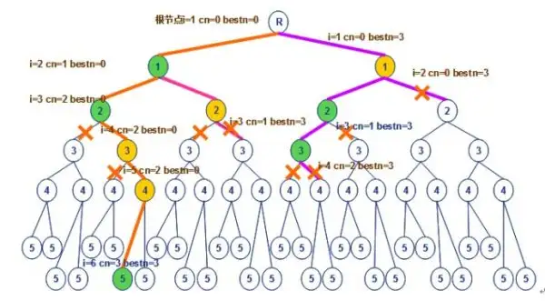

这样子太累了，把解法想出来就要费很大的力气，根本没有精力去执行了。而且模拟的过程包含了很多假设条件，最终的结果还不一定对。真是又费时又没什么软用的INTP。

其实只要我们改变问题的解法，解题就会容易很多。

**一次思考，就解决全部问题  >> 一次思考，解决一个小问题**

操作步骤如下：

a.把问题拆分成多个[子问题](https://zhida.zhihu.com/search?content_id=55350908&content_type=Answer&match_order=1&q=子问题&zhida_source=entity)，如果无法解决就多次拆分，拆分时不需要考虑具体解法。

b.一次只解决一个小问题，解决完再考虑下一个问题，过程中不要受到其他问题的干扰。

c.解决问题时保持专注，如果脑海产生了其他念头，应该立即抛弃。

解题过程如下：

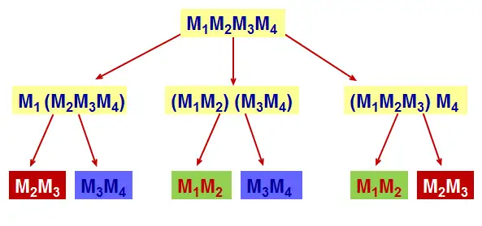

注意：你要解决的都是 M2M3 这样的小问题，而不是 M1M2M3M4 这样的复杂问题

效率明显提升，此题已解。

> 放下你的臆测吧，现在就决定你这周要做什么，不必去管全年的计划。只要找出下一项最重要的任务，然后起而行之。在行动开始前的一刻作决定，而不是早早就预先定下某事。——《重来》

###### [回溯法完美但是系统过于庞大或智商不足](https://www.zhihu.com/question/53424674/answer/342824073)

回溯法那个是完美的思考过程啊。但系统过于庞大或智商不足就略捉急，会逃避。天才intp应该没这个问题？那么，如何停止反复思考做出决定呢？

###### 不思考 事到眼前匆忙决定 限制回溯法内容

一般的解决办法就是不思考。事到眼前匆忙决定。

如何避免拖延症呢？如何避免事事开展回溯法？我现在及其初级，个人猜测解决办法是：成为一个领域的专家。把自己放到一个庞大的回溯法坑里。或者放到几个有限的坑里。这些问题的前提是如何寻找一个合适的坑跳进去呢？我认为这个问题需要耗费大量精力来选择。大的方向挺好选的，具体细节方向貌似只能看命运了。发布于 2018-03-16 10:25

#### [ENTP/INTP](https://www.zhihu.com/question/436061060/answer/1712659812) 

INTP-/>ENTP : 黄焱华

##### [ENTP 辩论家 找出逻辑漏洞](https://zhuanlan.zhihu.com/p/72629493)

黄焱华 邓志豪

[**星声**](https://www.zhihu.com/people/d77d1f2c0bfac8c70892a3609c810694)

我也是这种人格，然后现在我在科研领域过得如鱼得水。从小到大的时候脑子里都是世界的本质是什么？然后做出各种假设。一旦休闲下来，我就开始自动思考这些不可能思考出答案的问题了。

2021-08-12

###### [冷幽默](https://www.bilibili.com/video/BV1k8411h7Qi/?vd_source=f03b9d349cef8aff4a045d602d8a1d82)

藤原白莲

看完觉得ENTP有种。。脑干缺失的幽默。。

2022-11-11 10:0345

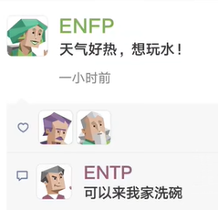{width="1.991839457567804in"
height="1.916832895888014in"}

##### INTP 逻辑学家 猫头鹰 隐士

黄焱华 曾小海 吴嘉诚

###### 故意"挑衅"对方

[时间之翼](https://zhuanlan.zhihu.com/p/71812102)

事实上，INTP喜欢通过辩论从而获取对方的独特观点以及自己未收集到的信息。有时为实现此目的甚至会故意"挑衅"对方以引起辩论。不过大部分情况下，为避免麻烦，INTP还是会主动避免陷入辩论。这是INTP矛盾特质的表现之一。

2019-07-20

对不理解我讲解的人毫无耐心（这时候突然想到朋友曾经提到过我有时候虽然语气平常但会不自主的露出嫌弃的眼神，还有不耐烦的啧啧声），对别人的情感反应迟钝，逃避承诺之类的。这样想想我这个人还挺讨厌的，但是我又懒得去维护太多，怪累的。我就想看看大家有多讨厌这类人格，哪些方面最招人反感，在权衡一下有没有必要以及要掩饰我的什么行为。

首先，我不想包庇不成熟intp的缺陷，但是我还是觉得大家对intp的价值观有一些不好的严重误解。比较突出的一项就是intp不通人情，自我中心。我非常厌恶这样以偏概全的刻板印象，我知道**有些intp甚至暗暗以此为傲，将之作为自身懒惰散漫，固步自封的借口**，但这不是intp真正的价值取向。首先intp是没有情感的机器这一观点我认为基本上就是错误的，如果你仅仅把情感定义为照护他人情绪，充满关爱同情之心的话，intp确实表现不佳。但**是我以为这不是情感的本质，而是Fe价值观的体现。**我认为情感，或者更准确的说**情绪的出现，就是给个人的行动提供价值感**，让个体有选择地在这个混乱的世界上行动。从这个定义出发，intp并不缺乏情感。一个没有情感的分析机器，不会觉得生和死有什么不同，善于恶有什么分别，存在与不存在有什么意义，最终就像一个石头待在原地一动不动，因为行动与不行动没有价值上的分别。intp如此'杠'，自然不可能是没有情感，而是它的价值观另有归属。

**Ti的价值追求：在Ti为主要功能的intp心中，逻辑自洽的强大理论体系的构建是一生的追求。**

###### [生气、吵架带来快感](https://www.zhihu.com/question/436061060/answer/1712659812)

mild
anger会带来快感，促进多巴胺的分泌。而这或许使维护个人观念产生的愤怒情绪，也成为了一种快乐源泉（这里并不针对Fe价值观，只不过SFJ价值观成了政治正确，早已被滥用了）！不成熟intp对周围的漠不关心，故步自封，沉迷在Ti-Ne的循环带来的思想快感和焦虑中无法自拔，不能和上面交代的背景分开讨论。**周围人往往不能满足intp的价值期待，许多intp因此感到失望。某种程度上说，如果intp有错，错就错在intp太少了。**

###### 超级杠精

**Ne过度发散带来的劣势：**在油管上intp的视频下有一句评论，**说Ne使用者的每说一句话都是一次新的思考，是全新的句子，基本上就是边想边说**，所以显得发散离奇，不负责任而没有边际。这和Ni使用者很不一样，Ni使用者的思考通常需要安静的环境中令内心的意向慢慢重组[链接](https://www.zhihu.com/search?q=%E9%93%BE%E6%8E%A5&search_source=Entity&hybrid_search_source=Entity&hybrid_search_extra=%7B%22sourceType%22%3A%22answer%22%2C%22sourceId%22%3A1712659812%7D)，形成自己的思想体系，他们有时候都难以向他人描述自己具体的思考过程，当他们向外表达的时候只是在复述自己已经形成的思想，这就是为什么Ni显得那样神秘，Ni使用者在表达上也比Ne简洁有力。Ne使用者有不少话多好辩，是因为他们在这个过程中大脑在积极运作，可以充分享受思考带来的乐趣，而且利用谈话对象的反馈来整理自己的表述，约束Ne过度发散带来的焦虑，更是一举两得。intp之所以杠，就是因为他们在这个过程中能得到这样的收益，理清对方想法的同时也在整理自己的想法。这个思维的工作方式和苏格拉底的[杠精式](https://www.zhihu.com/search?q=%E6%9D%A0%E7%B2%BE%E5%BC%8F&search_source=Entity&hybrid_search_source=Entity&hybrid_search_extra=%7B%22sourceType%22%3A%22answer%22%2C%22sourceId%22%3A1712659812%7D)教学道理是一样的。但这常常导致两个问题，第一个就是并不是每一个谈话对象都对这样的交流有兴趣，不要说别人，就是intp自己都常常迷失在Ne发散的思维中，这常常**给彼此的交流带来极大的负担**。第二就是**Ne的发散其实往往带来更多问题而不是见解，极端情况下Ti功能被逼得无法工作，有许多intp难以形成，甚至放弃形成自己的逻辑体系，Ti只能在纠错他人想法的时候才能运作，最终产出一个为杠而杠的超级杠精。**任何intp都应该警惕这样的倾向，而不是盲目以Ne高视角自大。

###### INTP的讨厌之处

[编辑于 2021-02-07 21:17](https://www.zhihu.com/question/436061060/answer/1689036146)

以自己为样本对INTP的讨厌之处进行无情解剖

1.  冷漠：被忽视的情感需求，抵抗情感暴力。内心OS："要我来关心你？谁关心过我？"

2.  固执：用来保护自我意志，抵抗五花八门的情感操控术。内心OS："说得天花乱坠，少来这套，不听不听不听"

3.  懒：力量不对等时消极抵抗权威的手段。内心OS："打不过～我就躺～你能拿我怎么样～"

4.  拒绝承担责任：从小独自成长没有得到外界帮助，因此也拒绝回馈外界施加的责任。内心OS："爷一人就是一支队伍，蹭人头想的美"

5.  [无集体意识](https://www.zhihu.com/search?q=%E6%97%A0%E9%9B%86%E4%BD%93%E6%84%8F%E8%AF%86&search_source=Entity&hybrid_search_source=Entity&hybrid_search_extra=%7B%22sourceType%22%3A%22answer%22%2C%22sourceId%22%3A1689036146%7D)：时刻警惕集体导致自我意志的消亡。内心OS："你管我干什么就够了，还要管我想什么。"

6.  拖延：自我认知不足时消极抵抗世界的手段
    内心OS："万一搞不定，本天才脸往哪放，以防失败干脆就不要开始"

7.  对表达内容的苛刻：魔鬼藏在细节中，对于偷换概念
    缩小范围等语言操控手段极为警惕。内心OS："别想钻这个逻辑漏洞，不准拓宽那个概念的界定"

8.  目的性：拒绝不清晰的动机，拒绝一切可能的外界干扰。内心OS："为什么这样？为什么不这样？为什么为什么？"

9.  自我中心：深刻知道只能信自己，不轻信任他人
    内心OS："那又和我有什么关系呢？世界毁灭或者天上下金块都不耽误我喝咖啡。"

总的来说
INTP过早学会自给自足，并对权威和控制有充分的认识，拒绝一切糖衣炮弹的同时也将人生的温暖拒之门外。

#### [INTJ](https://www.zhihu.com/question/459270975/answer/1900438631) 冷 无情 强 专家 杠精

谢瑞杰 何顺江

Te关注高效解决问题。而INTP的Ti关注事物内部原理。

简单来说:

陌生人眼中:冷，无情，强

朋友眼中:为人着想，不求回报(其实并不是，intj的交友观念是对等，我对你好，你对我好)

脑洞很大，有时候逗比(intj总得融合社会，稍微调节自己僵硬的感觉)

工作强，固执，拖延，三观正(开玩笑，intj三观正都是练出来的，社会需要三观正，intj就去学三观正，实际上intj早期觉得人太丑陋了，理直气壮污染世界，早期intj甚至不把自己当人看。)

##### [什么样的家庭会养出INTJ？](https://www.bilibili.com/video/BV13b421778n)

###### INTJ的家庭背景与成长环境

什么样的家庭会养出INTJ？他们的人生观自由而自律，具有丰富的想象力，同时又果断坚毅，充满好奇心但从不浪费精力，是独立且智慧的策划者。INTJ天生孤独而执着，追求自由的同时，也保有自我掌控力，能够将创造力与理性完美结合，并应用于他们所从事的一切活动。他们的内心世界复杂且私密，难以轻易触及。对于INTJ来说，非必要不求助是一种生活准则，他们更相信自己的能力，而非依赖他人。

父母对他们往往采取“放养”式的教育方式，但对他们的期望却极高。只要满足了这些期望，INTJ便能自由发挥，父母不会过多干涉。然而，在童年时期，INTJ往往得不到太多来自父母的关怀，常常独处，自娱自乐成为日常生活的一部分。因此，他们在电子产品、书籍和电影的陪伴下，培养了广泛的兴趣爱好。

###### 家庭氛围与情感印记

由于父母在情感上共鸣较少，INTJ在成长过程中很难获得无条件的爱，这种缺乏共情的环境使得他们在成年后也难以轻易表现出正面的情感共鸣。小时候他们的物质需求基本都能得到满足，因此长大后的INTJ对物质的渴望并不强烈。

父亲常年缺席，母亲可能性格急躁且要求严格，家庭氛围虽然表面轻松，但之下存在隐性的紧张与压力。此外，父母中的一方可能非常节俭，这种习惯也在INTJ身上留下了深刻的印记。

###### 父母期望与干涉矛盾

父母在INTJ年幼时对他们关注不够，却在他们长大后开始对其生活各方面进行干涉，这种过度关注往往显得多余且不受欢迎。尽管家庭表面看似轻松，但当INTJ遇到困境、想要寻求帮助时，得到的回应往往是“自己想办法”。这种成长环境造就了他们独立、自律、擅长自我调节的性格，也使他们更倾向于依靠自身力量去应对生活中的挑战。

##### 得养爸妈所以不能死

[**北派三叔**](https://www.zhihu.com/people/eff656cc062c14d955133c535b2609d6)
妈耶，我妈天天说我不给家里打电话

2022-08-26

[**黑木sama**](https://www.zhihu.com/people/88c2a4b4fc52571e0754067fb86069c0)
得养爸妈所以不能死太真实了

2021-05-23

[**sifone**](https://www.zhihu.com/people/e5468d59e4ea1c65cd062a8593e74921)
不来电话+1 要养父母不能死+1

2021-06-09

[**maggielyn**](https://www.zhihu.com/people/a08b8eb4a085f5fd6a20ee097f9bb3fa)

接近程度80%吧，怎么知乎这么多人对intj感兴趣啊

2021-05-23

##### 奇葩，神秘

[**Chloe-萬惡的INFJ**](https://www.zhihu.com/people/ac015a7ab54a65149a48d0b55c1b36a7)

因為INTJ是奇葩，神秘，只有知乎可以了解深入一點，本人幾乎問不出什麼

2021-06-27

##### 交往就是一天天的陪伴和日常

[**豹思想**](https://www.zhihu.com/people/b5b6633bb82d8d742db59bf0c9c10c01)

交往方面。。。不要指望intj会太多。intj眼中，交往就是一天天的陪伴和日常，什么情人节七夕节520圣诞节纪念日，intj很难给出什么惊喜，说不定最后献礼的时候搞得和工作汇报一样。朋友眼中:为人着想，不求回报(其实并不是，intj的交友观念是对等，我对你好，你对我好)我这个njt吃饭时看到这两点笑喷了

2021-05-29

##### 不合群的孤独

[**夏至**](https://www.zhihu.com/people/d5a9830632b3a0c1d502118367012480)

没听说intj招人喜欢，不合群的孤独(自己不觉得孤独)一针见血，对自己和别人，主要是对别人要求还高时，确定招人喜欢？？

2021-08-21

##### [隐藏型暴脾气](https://www.zhihu.com/question/459270975/answer/1911324690) 偏执

想想看，一个隐藏型暴脾气疯比，啥事都干的出，极为偏执，可能患有某种[自恋癖](https://www.zhihu.com/search?q=%E8%87%AA%E6%81%8B%E7%99%96&search_source=Entity&hybrid_search_source=Entity&hybrid_search_extra=%7B%22sourceType%22%3A%22answer%22%2C%22sourceId%22%3A1911324690%7D)，不信任任何人，专心于工作和学习，懒得社交，道德底线混乱甚至可以在大无畏牺牲主义伟人和反社会人士之间切换自如没关系，随时都会因为记仇事件爆种发生意外。有人会想亲近一个随时可以在准则上两端跳跃的精分家伙吗?

基本感情上用一句话形容就是，"我不关心。"不喜欢照顾人，不喜欢别人依赖自己。有迫真的外在攻击欲，喜欢批评别人(虽然也可以毫无吝啬的赞美别人但是对方不一定接受)，画大饼专用工具人。只要自己在乎就比istj更勤劳，比infj更温柔，比entj更有控制欲。

说不定工作起来熬夜两天不吃饭。

#### ENFP追梦人

曾楚雄 李政 向易武

#### ESTP 践行者

唐嘉俊 邹俊勇 川普 包 伟军

ESTP型的人活跃、随遇而安、天真率直，乐于享受现在的一切而不是为将来计划什么。ESTP型的人很现实，心胸豁达，包容心强。ESTP型的人喜欢行动而不是漫谈，当问题出现时，他们乐于去处理，他们是优秀的解决问题的人。

有些书里把他们叫做企业家，创业者、发起者等等，意思就是ESTP们喜欢随意与很多人交流，工作中充满冒险和乐趣（甚至是刺激），随时抓住机遇，更喜欢自我组织，而不是听人安排的，是活在当下自我安排命运的实践者。

ESTP是16型人格当中最有魅力、最会审时度势的类型之一。而是想尽一切办法（很多时候甚至是不择手段）将当前的任务以最有利于自己的方式完成。他们具有最强的随机应变的能力和最犀利的投机眼光，他们对于当前利益的敏感和执着使他们成为绝不吃"眼前亏"的类型。他们的绝佳的口才让他们说的话永远是那么漂亮并且在表面上显得完美而无懈可击。虽然有时言辞似乎肤浅，不合逻辑，充满忽悠和欺骗的嫌疑，但是没有人能否认在当时那个情况下他们所说的话的确能给他们带来最大的好处，

##### 现实生活中最受欢迎的类型之一

[**明治绾纱**](https://www.zhihu.com/people/70344a8139834a3f808a7536600d39e3)

我只能说现实生活中estp是最受欢迎的类型之一
大概是因为朋友太多没时间上互联网踩别人吧 他们也不屑于做这些

2022-03-08

#### [ISFP](https://www.zhihu.com/question/311628003) 静美艺术家

ISFP: 周生龙

腼腆，温和，慵懒，擅长享受的人

[发布于 2019-02-09 14:32](https://www.zhihu.com/question/311628003/answer/593008230)

不请自来。我是isfp

幸福感比较高，因为活在当下，看待身边的人和事不会过于理想化。不渴望拯救他人，也不喜欢企图拯救我的人，除非你是我主动选择的。而且我非常慕强，我也渴望变强，所以崇拜和欣赏强大的人。喜欢接近优秀的人。画画很匠气。平常很随意，爱迟到。而且很懒散。

不吃欲擒故纵这一套，真正看开了就是看开了，你企图吊着我胃口，我就会走。天涯何处无芳草，何必单恋一枝花。我相信只要我越变越好，自然还会有其他人喜欢我。不是很粘人，喜欢有自己的独处空间。

因为慕强的性质，我更容易喜欢上我的引导者而不是追随者，想让我喜欢你，你一定要在某一方面让我有崇拜的感觉。如果对你不来电，我对你不会给予太多的正面回馈。也因为慕强的性质我弟控或者妹控的机率比较低。我喜欢温柔强大又成熟的人。

比起文字更喜欢好看的图画。

重视感官刺激，喜欢坐过山车。

[编辑于 2020-01-01 21:10](//www.zhihu.com/question/311628003/answer/955623270)

看起来合群但其实偏向于独处多一点

交朋友的标准是这个人善良 人品好 并且她也喜欢我

随性洒脱 渴望一个人的旅游 渴望到处旅游 冒险

对人包容心很多 是个温柔的人 但很讨厌不为别人考虑 包括利用我的人
遇到这种人不会吵架直接远离 见面会客套几句

本身带给人的感觉就是可爱 软软糯糯的又不失主见 不去利用别人
尽量把自己做到最好的朋友就是要靠吸引的嘛

喜欢看有意义的剧情片 爱情片 最好是可以让我感动到哭的
不喜欢无意义的电影电视剧

喜欢有主见会讲话并可以做出正确决策的人

对待自己身边的男生当成女生一样对待 不娇柔做作

恋爱喜欢温柔有原则性的的男孩子 有才华的 颜控
不喜欢那种在外面用鲜花蜡烛围成一个圈给你惊喜 喜欢两个人的小情调

对于工作想尝试的很多 最好全试一遍

不玻璃心 对所有事情都可以理解 但还是希望事情超好的方向发展
（随缘随缘随缘-重要的事情说三遍）

---------想到再补充吧 来自一个isfp的女生

[编辑于 2019-09-05 16:41](//www.zhihu.com/question/311628003/answer/814316596)

#### ESFP 表演者 不可或缺的大活宝

陈俊南 吴薇薇 罗丹妮 周梦姣 彭国松 

#### ISTP 杀手 黑客 蛇 手艺人 工具人

刘文勋 范嘉宝 彭晟原 石俊松 彭宇行

再怎么恐怖你也感受不到，[istp](https://www.zhihu.com/search?q=istp&search_source=Entity&hybrid_search_source=Entity&hybrid_search_extra=%7B%22sourceType%22%3A%22answer%22%2C%22sourceId%22%3A1317240400%7D)很能沉得住气，伪装真的很6。不是真的被踩雷了不会干出些什么事的，当做老实人就行（bu

本人istp，听到最多的话就是说我善良的，虽然都不是很熟的朋友，熟人也不可能说出这种话，因为他们知道我什么德行

##### ISTP真的有那么恐怖吗？

跟几位infp朋友聊过，如果说nf的感情主基调是"我要去爱他人"

那么istp的"感情"就是"对方于我有恩有利，我就去模仿着温柔去关心去利他，用我自己的方式回报他""他人对我不好，那直接88，就算是亲人也一样"

如果真是有没良心的istp，那确实很危险

因为别人眼中的道德，法律，只要不符合istp的观念，那都是放屁

不干违法违反道德的事=良心会阻止/违法代价太大很亏/如果不违法就能过得开心谁干那么麻烦的事呢（懒）

###### 再怎么恐怖你也感受不到

再怎么恐怖你也感受不到，[istp](https://www.zhihu.com/search?q=istp&search_source=Entity&hybrid_search_source=Entity&hybrid_search_extra=%7B%22sourceType%22%3A%22answer%22%2C%22sourceId%22%3A1317240400%7D)很能沉得住气，伪装真的很6。不是真的被踩雷了不会干出些什么事的，当做老实人就行（bu

本人istp，听到最多的话就是说我善良的，虽然都不是很熟的朋友，熟人也不可能说出这种话，因为他们知道我什么德行

##### [有点邪恶或阴暗](https://www.zhihu.com/question/404829114/answer/2378763882)

[发布于 2022-03-07 21:25](https://www.zhihu.com/question/404829114/answer/2378763882)

ISTP多多少少都有点邪恶或阴暗的想法，孤僻或叛逆只是表面，哪个ISTP还没想过颠覆世界的。

平时的ISTP大多数温和友善，看上去和其他人没有什么区别，但这并不意味着他们很大众化。柔和是他们的社交面具，为的是掩藏自己的真实想法，ISTP玩狼人杀这类推理游戏总是没人能识破他们的身份，他们会把自己藏得很深。

当然，这并不是说ISTP待人不坦诚，人格类型与人品无关，只是说ISTP很有说谎的天分。

ISTP也很适合从事刑侦，一个擅长说谎的人，自然最能识破别人的谎言，做侦探很合适。

ISTP平时基本懒得生气，因为情绪波动对他们来说内耗过大，实在是得不偿失的事。但是一旦ISTP生气了，就像火山爆发一样，恐怖得不行。

ISTP生气大概是因为有人侵犯了他们的个人隐私。ISTP作为一种高回避属性的人格，对隐私非常重视，也很少和身边人共享信息，如果不是他们主动交流，最好不要去窥探。

我就是ISTP，和杀手
莫的感情一点关系都没有，平常就码个代码啥的。凡是认为我冷漠什么的都是和我关系不熟的，熟悉了之后直接从社交恐惧症变成社交牛逼症（不管是社团还是游戏群里都这样）么得感情就更离谱了。

[发布于 2021-11-19 17:58](https://www.zhihu.com/question/404829114/answer/2232394758)

##### [擅长冷暴力 说谎](https://www.zhihu.com/question/404829114/answer/1758069024)

不恐怖，只是比较擅长冷暴力，不想和人相处了就逐渐冷落。毕竟社交真的很耗能

然后心态情绪什么的变化也很快，突然不想说话不想理人突然高兴都是常有的事，也会突然想社交兴致勃勃的把QQ号发到各种墙上，后来又因为这种举动后悔不已一个一个删掉当时加的陌生人

然后也不是脾气好的类型，常常怼人，喜爱小动物远胜过小孩。遇见熊孩子会暗戳戳的给他出馊主意让他被家长教训。

总而言之，不是跟我关系密切的人甚至会觉得我温和亲切好相处，如果是同桌舍友这种可能经常会觉得我冷漠，和我无话可说吧。

[发布于 2021-03-02 13:49](//www.zhihu.com/question/404829114/answer/1758069024)

##### 低调[行动而不合作 狙击手性格](https://www.zhihu.com/question/404829114/answer/2413154644)

不恐怖啊，ISTP反倒是很多人喜欢的人格。

用"水深静流"、"惜言如金"可以很好地描述ISTP的特性。他们很难被人们读懂，也不喜欢抛头露面。内向（I）加上对实际事务的喜欢（S）以及对"现在"的关注让ISTP看起来冷冷的。他们做出的决定总是那么客观公正，不带个人感情色彩，而且建立在分析的基础上（T）。ISTP的日常生活是即兴的、灵活的（P），在一个新环境里，不管突然出现了什么人或发生了什么事，ISTP都会马上给予关注，尽管他们常常不说出来。

在与他人的关系当中，ISTP是大度与任性的结合体，一方面会对周围的人很宽容，甚至有时候会像ESFP那样大方，另一面他们向往无拘无束、自由自在的生活，所以在做某些决定的时候可能会不太照顾到周围人的感受；另外由于过于专注于行动本身，容易沉浸在使用工具的过程中。作为团队的一员，ISTP的完美主义倾向和他们的个人诚信，总能使他们无需监管而很好地完成工作。

ISTP认为让别人参与自己的工作纯粹是浪费时间，不是他们不喜欢别人参与工作，只是他们认为这会浪费太多的时间和精力去沟通那些在他们看来简单明了的事情。他们认为行动比计划来得有效，为实现目标做些实实在在的工作才是正事。

当周围的人做出你无法理解的事时，往往是性格的不同，没有对错之分！

##### [现实主义者](https://www.zhihu.com/question/404829114/answer/2384541108)

[发布于 2022-03-11
16:16](https://www.zhihu.com/question/404829114/answer/2384541108)

ISTP，因其天生的天赋才能"不爱说话、少说多做、喜欢动手、力求精准和注重细节"，被誉为最有工匠精神的手艺人性格类型。

ISTP的气质类型（性情）是现实主义者------SP，注重实实在在的实际价值；也可以称ISTP为稳定者------ST，意思是性情很稳定，因为很理性；根据其第一天赋才能的特征，内向思维Ti，也可以称其为理性者------Ti，即总是利用理性思维来理解世界和处理事情。

ISTP的短板，即第四功能是情感，使得他们不善于表达自己的情感和感受------不太关心也不善于察觉别人的情绪，更关注事实和细节。

比如，他们心里很委屈但未必会哭出来，因为他的主导功能天赋思维认为哭代表软弱，而且毫无作用。同样的，某个凄凉的哀嚎唤醒的并不是他们跟着掉眼泪，而是为什么不擦干眼泪去寻找解决方法呢？实际上，人们只是需要一句安慰的话或者一个拥抱，但ISTP很少拥抱别人。

这不能怪他们，因为他们对情感真的不敏感。应该避开类似于客服、幕僚等需要具备很强的同理心才能顺利开展工作的工作类型。他们认为客观标准高于个人偏好，在做决定的时候，他们通常更多地基于逻辑，而不是对人情世故的考虑。

MBTI性格测试会让我们更了解自己，也更加能读懂他人。性格决定命运，了解性格可以改写命运，不了解自己的人容易被命运操控。

##### 人均高冷男神

[**男德大师**](https://www.zhihu.com/people/e15b03589bd340ae6e631ad8658587aa)

作者

istp人均高冷男神

2022-11-16 ·IP 属地北京

#### INFJ 作家型

黄葵松 欧阳隆桐

{width="4.0444838145231845in"
height="2.623606736657918in"}

灵性特质的作家型（INFJ）

若你是一个作家型

##### 文字是神圣的

文字对你而言是神圣的，通过文字，你可以了解并且表达生命的神秘。当不写作时，你是在体验你的另一项聆听天赋，去安慰和帮助那些来向你寻求建议和指引的人。

当你恋爱时

至于跟心灵相关的事情，你偏向用白纸黑字表达自己。举凡诗歌、日记和贴在浴室镜子上的温柔留言，都是你最喜欢用来表示爱意和奉献的方式。

作为一个作家型(这种类型仅占人口的2%)，你倾向为情人贡献大部分的时间和精力。事实上，你只要你的情人作为你惟一的伴侣---也就是你最要好和惟一的朋友，就颇满足了。

很不幸的是，这种要一个人成为你惟一情感支柱的妄想会让你心碎。你也许会决定避开所有的人，只为了要和你的情人在一起，事后却可能发现，对方不是一个适合你的人。当时，你可能只是自欺欺人地拖延了一段不被看好的感情，让自己去相信对方是适合你的人。

##### 善于发现

[**知乎用户L10odu**](https://www.zhihu.com/people/be045f6e6e3331240263da6481cea9bc)

我觉得infj挺好认得/_(:зゝ∠)/_想了半天，感觉有点说不清，就是直觉吧，突然因为某个细节就认出来了。ni经常会在某些不为人察觉的点上有比较奇怪的认知，然后揪住丫这一点的小辫子拓展开，就会发现这只隐藏起来的奇葩(/*＞◡❛)

##### 求知欲广

瘫在明面上一些特点，比如：通常阅读量是比较庞大的。这似乎是ni的一个共同特点，强烈的求知欲和对很多知识点深度挖掘的欲望。只是一般intj看书是围着他专业相关的一个相对明确的范畴展开的。infj就比较飘，阅读经常是看心情，而且还经常看一半就不看了，后一半全靠脑补。所以别听infj特别能逼逼，有可能那本书他自己都没看完/_(:зゝ∠)/_/
然后就是巨能说，跟唐僧一样，如果你不主动缝上他的嘴，他能叨逼叨一整天......而且可以这样说，一般特别能叨逼的infj是一只相对比较健康的infj，如果一个叨逼不说话了，那他多半是抑郁了。举个例子比如说陈坤，他访谈里就讲自己年轻的时候不爱说话，现在放开了就话/
特别密。他是典型的infj，如果一个infj不装逼了，看起来大概就是即深刻又傻逼(-᷅/_-᷄)

##### 怂

然后就是很怂，因为在意别人的想法又想得多，所以就跟兔子似的一感觉风向不对马上就跑没影了。但是就我个人的经历来说，多半ni的直觉是对了，我换的好几家公司等开始裁员的时候我在别家的试用期都过了(-᷅/_-᷄)/
目前就想到这么多。

2018-09-24

##### [好好先生 理性感性参半](https://www.bilibili.com/video/BV1HwRwYQENm/)

丙寅炽森

处女座INFJ男。
感觉，自己确实是谦和的。有点好好先生的意思。但别触碰我的底线，不然容易炸，别觉得INFJ没脾气。
经历过很多磨难，基本都是提前能预知到结果，但自欺欺人的觉得还是应该给对方信任，直到结果出来，自己被伤害。然后，就长记性了。
有上进心，也努力。不管生活对我多恶毒，我都坚定的信任生活，终将会给我以温暖。
保持善，左手仁慈右手毁灭，所有的决定都只在一瞬间，不需要什么理智的思考，我感觉是什么，那就是什么。相信自己的直觉，直觉就会带给自己最简单也最直观的答案。照着答案去应对就行了。
不要试图逃避困难，因为困难不会因为逃避就不见了，反而会变本加厉。所以，干翻困难，你就是困难他爹。坚决不做困难的孙子，那会又憋屈又难受。
恋爱聊持宁缺毋滥，只有心里感觉合适，自己才会去试着去接触。如果真的合适，疯狂一点也无妨，只要能和对的人，在一起就好。这辈子就这么一个课题，感觉比拯救人类，对我来说恋爱成家都是要更重要的。
只有突破了这个门槛，我才能施展自己的抱负。不然别说我没做功。因为我并不亏欠世界什么。
2025-03-09 13:21 👍32

#### [ENFJ 主人公型人格 教育家](https://www.zhihu.com/question/543323404)

[编辑于 2018-07-12
05:19](https://www.zhihu.com/question/55293618/answer/437352313)

潘俊杨 周佳欣 石总晖 周慧

##### 好的特点

主人公人格类型的人是天生的领导者，充满激情，魅力四射。.
这类型人格的人约占人口的2%，他们常常是政客，教练和老师，帮助、启发他人取得成就并造福整个世

ENFJ
性格的女性坚强、自信和充满魅力，在社会群体中表现为充满母爱的（motherly）。

她们也是极具激情、魅力和天生的领导者。

[觉醒前](https://www.zhihu.com/search?q=%E8%A7%89%E9%86%92%E5%89%8D&search_source=Entity&hybrid_search_source=Entity&hybrid_search_extra=%7B%22sourceType%22%3A%22answer%22%2C%22sourceId%22%3A437352313%7D)，看起来......很蠢......日常傻乐，有发现美的眼睛，文艺，爱好广泛，擅交际，对人雨露均沾，讲义气，爱说教，正义感强，偶尔愤青。

觉醒后，心境随修为逐渐平和，悲天悯人，会对哲学佛学道学之类的更感兴趣。能更普遍广泛地觉察到世间的美。觉醒契机一般是因为遭受现实打击，转而广泛地搜集信息，内省人生意义，然后在低谷中顿悟。首功能Fe受挫会从其他功能寻求解脱，ENFJ第二功能Ni借此得以发展。

非常以好恶和个人感受评判一个人，但往往是很准的，所以被ENFJpass的人基本就没什么希望了，因为她们不能说服自己勉强接受；

##### 坏的特点

[发布于 2020-05-06
11:09](https://www.zhihu.com/question/55293618/answer/1203477904)

###### 吹嘘自己，爱出风头 墙头草 见人说人话，见鬼说鬼话 不动自己奶酪 乐善好施

其实我认为enfj并不像很多答主吹嘘的美好。这个人格通常说话真假参半，立场变化可比意大利，有墙头草的天赋，通常比较擅长吹嘘自己，爱出风头，给人的感觉比较虚，不实在。因此这个问题下面这么多回答都大同小异。也没有看到任何一条自我反思或者自省的答案，除了一条自卑舔狗？拥有看穿别人动机的能力，但大多数时候都选择见人说人话，见鬼说鬼话，而不是坚守一些原则。他们在不动自己奶酪，或者有可能共赢的前提下乐善好施。喜欢圈子文化，簇拥传统，反对离经叛道。渴望被人羡慕，是enfj拔除不掉的欲望，也许那就是他们很多行为的动机。。。无意拆穿，只是因为我太了解了，看着里面一片和谐，不吐不快。。。
抱歉。。。

[**知乎用户DtqSL4**](https://www.zhihu.com/people/60531c33b4553821eb3eb7540b94224a)

[**Justin**](https://www.zhihu.com/people/e1aea504a9c61d9cdd1dd5838b2efb7d)

对呀，表面很虚假，但是内心的原则还是坚守的，这是我们为人处世的一种特性------哪怕对方的言论非常不对，但是我们依然坚持peace
and love（表面的）

2021-06-29

##### 最罕见的男性性格

在全球范围内，[ENFJ
人格](https://www.zhihu.com/search?q=ENFJ%20%E4%BA%BA%E6%A0%BC&search_source=Entity&hybrid_search_source=Entity&hybrid_search_extra=%7B%22sourceType%22%3A%22answer%22%2C%22sourceId%22%3A2574853464%7D)和
INFJ 是并列的最罕见的男性性格，两者均占男性人口的2.8%。

许多人被ENFJ女生所吸引，因为她们是特别善于支持和鼓励的人。ENFJ
女生有着温暖和深情的性格，喜欢帮助别人，在情感上鼓舞他人。虽然她们肯定有强烈的个性，但她们的"情感（Fe）"特质让她们比
ENTJ（指挥官）的女生更加容易亲近，善于观察他人的情绪。

2/. 极致的利他主义

由于她们对利他主义的热情和情感驱动的特质，ENFJ女性是令人难以置信的无私，经常致力于以任何方式帮助别人。

##### [什么样的家庭会养出ENFJ？](https://www.bilibili.com/video/BV1BW42197Yj)

###### ENFJ的家庭背景与成长环境

什么样的家庭会养出ENFJ？通常，ENFJ成长于一个物质上不算极度富裕，但也从不缺乏的家庭环境中。父母在经济上尽可能满足孩子的需求，而孩子也能感受到这种支持。然而，父母可能因为自身的文化背景和教育水平，表现出一些自私、传统和保守的态度，尤其是父亲。这样的家庭中，往往存在某种对抗的力量，这种力量可能出现在父母之间。

这种对抗可能源于对孩子未来期望的分歧，或者父母之间性格上的差异。例如，父亲可能希望孩子按部就班地成长，而母亲则更希望孩子能够自由发展，按照自己的想法走下去。尽管父母的性格可能有差异，但整体上他们的关系还是和谐的。母亲性格开朗活泼，父母之间感情良好。

在成长过程中，ENFJ往往在小时候特别依赖母亲，喜欢和母亲一起活动，关系十分亲密，几乎无话不谈，像朋友一样。这种母子（或母女）之间的连接，让ENFJ在早期形成了强烈的情感共鸣能力与共情意识。

###### 家庭的两面性与内在裂痕

ENFJ的原生家庭有时候表现出某种极端的两面性。并不是所有ENFJ都在充满爱与安全感的环境中成长，一些家庭可能并不温暖，但也不能说不和谐。家庭成员之间看似相处融洽，但深入了解时会发现隐藏的裂痕。

一些ENFJ在内心深处可能没有足够的自信和力量，因此他们会在外界寻找肯定和支持。这使得他们表现得更加外向，擅长通过社交互动获取能量。而独处对他们来说，反而可能是一种痛苦的体验。

由于父母观念的冲突，家庭中不可避免地会发生争吵。在这种时候，ENFJ往往选择沉默，因为他们清楚无论支持哪一方，都会加剧冲突。因此，他们从小习惯了“忍耐”，把情绪埋藏在心底。这种早期的调和经验，也让ENFJ在成年后极具协调能力，却也容易陷入取悦他人的心理模式。

###### 成长历程与心理蜕变

从小到大，ENFJ通常很受老师和长辈的喜爱。从小学到研究生阶段，他们总能遇到对自己特别好的老师。而在高中或初中阶段，ENFJ可能会经历一次重大的心理蜕变。他们会发现，世界并不像想象中那样公平，自己的付出并不总能得到回报，由此产生精神上的疲惫。

经历这种蜕变后，有些ENFJ可能会认为“付出不值得”，逐渐转向更自我保护的姿态；而另一些人则会在认清人性后与自己和解，成长为更加成熟、平衡、具有疗愈力的ENFJ。

#### ISTJ 公务员 律师 审计员

秦涛 

#### ESTJ 物流师 弱肉强食利益第一 精明亲戚 天生的管理者

杨灿业 杨先腾 余训江 黄姣军 mom 社会中大多数人 杨巧利 彭俊

像狼一样社会

[**一只狐**](https://www.zhihu.com/people/7ba4d29a814ed168b4edcc2a8f20e208)

Estj女是最不容易获得幸福的群体之一。柔弱的男子她们看不起，强大的男人受不了她们的臭脾气。/
Estj女的孩子多半是妈宝，唯唯诺诺，毫无主见。与她们的期望相差甚远。

2020-12-10

[**一只狐**](https://www.zhihu.com/people/7ba4d29a814ed168b4edcc2a8f20e208)
[**抱抱大哥**](https://www.zhihu.com/people/b83ccc3a3c791ebbb323974d0d9f485e)

其实解决方案就在我回复你的话里，每次想给别人提解决方案的时候就想想，直白的批评对方接不接受。先释放善意再说解决方案，效果会好很多。

2022-03-30

[**知乎用户1WMBwI**](https://www.zhihu.com/people/1abd04fb06d3eed31b67ca3538289bfc)

这不是我爸吗😂 果然sj父母容易出np星人

2020-08-03 ·热评

[**星星小孩**](https://www.zhihu.com/people/8ef61d4a2654e6165948d7b35e541587)
[**夏夏MBTI**](https://www.zhihu.com/people/f37e21e7f26b6d6f1d77dacc3a24ddf0)

那infp呢 怎样？遇到estj要死定了 少活几年是一定的

2020-07-22

##### 大家有认识estj男吗

**来自: [sssssss](https://www.douban.com/people/2219736/)** **2021-10-10
11:03:06** 

我是infp女 就是那种每天小脑瓜都很多迷思 然后感情心思细腻丰富的那种

说话做事 尤其是非工作上的内容 其实都属于 比较和气
但可能也会比较中性的那种

前段时间 有一个estj男 刚开始超级主动 直接 一上来就说想更了解我呀
然后对我感兴趣呀啥的

但是一来没认识多久 再加上infp性格不是那种猛烈的 我只是模糊的回复了他

然后 estj男就消失了 我觉得两个人是需要更多交流 才能更了解的 但他不是
就不会主动联系了

我也不是主动型人格 虽然慢慢了解他更多觉得他也是个优秀的人
但是现在就处在尴尬的境界

是不是estj 就属于这类型人 单枪直入 然后撤退的也迅速 好烦呀

[**momo**](https://www.douban.com/people/81645204/) **2021-10-10
11:05:34**

认识过，想远离他们，离得越远越好那种

[**sssssss**](https://www.douban.com/people/2219736/) **楼主** **2021-10-10
11:46:22**

真的是 我就直接说他钢铁直男 大石头
为什么真得有人可以这么没有感情前共感吗

###### 观念传统 生活中的屎尿屁 俗气愚蠢 其他话题无法沟通

[**汤老湿地公园**](https://www.douban.com/people/145984688/) **2021-10-10
11:54:24**

太多了 过了最初的荷尔蒙的吸引时候 在我眼里就只剩下各种缺点
印象最深就是觉得他们无比肤浅 除了生活中的屎尿屁 其他什么话题都没办法支撑
而且观念也是特别的传统 在我看来俗气且愚蠢 他们还特别在意别人的看法
在我看来就是很不能理解 觉得很嫌弃

###### 不是理工直男 是社会哥

[**momo**](https://www.douban.com/people/81645204/) **2021-10-10
12:05:10**

这种类型的人是不是 类似 理工直男那种
可以这么理解吗 [sssssss](https://www.douban.com/people/2219736/)

不是理工直男，理工直男可能是intp或者intj，至少他们是n系列的，可以理解抽象的东西，estj会比较注重实际的东西

###### 大男子主义 虚伪 俗

[**框机喵**](https://www.douban.com/people/183616757/) **2021-10-10
18:10:45**

认识一个esfj男，也是一上来就说喜欢我，追了我一两个月，然后就直接跟别的女的谈恋爱了......怎么说呢，很大男子主义，而且很虚伪、很俗的感觉就是，完全不喜欢的类型。

[**wildpalms**](https://www.douban.com/people/135378724/) **2021-10-10
22:02:51**

远离广撒网的速食恋爱者( ¯ᒡ̱¯ )و

###### 很优秀 对不同人不太一样

[**sssssss**](https://www.douban.com/people/2219736/) **楼主** **2021-10-10
22:07:26**

他们口中的"喜欢、好感"，也不一定是你心中想象的那种纯粹、美好的喜欢和好感 [wildpalms](https://www.douban.com/people/135378724/)

嗯嗯 他一开始很直接主动 我质疑过 他说他对不同人不太一样
他是那种很直男但是怎么说 很优秀的那种人

###### 看起来很热情付出 其实自私 好面子 打辩论赛

[**我最爱的浪味仙**](https://www.douban.com/people/carpediembabe/) **2021-10-10
22:50:32**

estj就像一台无情的复读机，无限复读网络概念，和他聊就聊不进去，一谈到抽象的概念立马给拉回具象。estj很功利主义，好的关系留下，无用的切断，看起来很热情付出，其实只是自私而已，自私就算了，还特别明显摆在面上。特别好面子，期待别人的赞赏，说个话巴不得和你打辩论赛，让你赞成，服从。反正infp真的很难靠近estj，浑身难受。

###### INFP 感情细腻 思绪万千 稍微理性的人中和一下

[**sssssss**](https://www.douban.com/people/2219736/) **楼主** **2021-10-13
13:20:30**

不要靠近ESTJ。不是因为他们不好，是INFP会受伤🤕️ [三好学生](https://www.douban.com/people/220285866/)

是的 我是那种感情细腻 然后思绪万千
很容易因为音乐电影啥的就感动一塌糊涂的人
所以其实我觉得我应该找一个没那么泛滥 稍微理性的人中和一下
但是tj类型的人真的很难懂你是真的

###### 每天很热情的找我说话，后面一下冷淡

[**f l e u r**](https://www.douban.com/people/223789631/) **2022-10-12
15:23:41 陕西**

我也有类似的经历：一个estj男几乎一个月以来每天很热情的找我说话，后面一下子冷淡，不带理你的，呜呜呜呜。过了很长时间我贼心不死主动找他说话，他回复的很敷衍，基本上就是嗯嗯，确实，对....

而且和他分享我的近况，他也不会接着问下去，就是嗯嗯两字结束🔚...enfj表示不会再主动了.....好冰冷🥶

#### ENTJ指挥官

Dad talk to mon 俐标爸

乱の码

很简单，你就参考生活那种不拖泥带水行事果断干脆而且还很硬气的人。能把事办好办快就不多逼逼

2022-07-21 22:4931

### 杂谈

#### ENFJ和INFP是对立的人格？

这是一个非常深刻且常见的问题，但其中有一个关键的误区需要先澄清：

**“阴暗人格”这个说法并不完全准确，更专业的术语是“阴影功能”或“对立人格”。** 它描述的并不是“邪恶”或“阴暗”，而是指我们心理结构中未被充分发展、通常在不健康或压力状态下才会表现出来的人格层面。

从这个角度理解，ENFJ和INFP之所以被视为彼此的“阴影”或“对立面”，是因为他们的主导功能和劣势功能完全相反，导致他们最自然的世界观和行为模式存在根本性的对立，同时也蕴含着巨大的互补和学习潜力。

让我们从荣格八维的角度来深入剖析。

##### 核心原因：主导功能与劣势功能的完全颠倒

每个性格类型都有一个主导功能（最擅长、最信任）和一个劣势功能（最不擅长、最不信任，是阴影的核心）。

*   **ENFJ** 的功能栈是：**主导：外倾情感 (Fe)**， **劣势：内倾思维 (Ti)**
*   **INFP** 的功能栈是：**主导：内倾情感 (Fi)**， **劣势：外倾思维 (Te)**

看到了吗？**ENFJ最信任的Fe，恰恰是INFP的劣势功能（批判对象）；而INFP最信任的Fi，恰恰是ENFJ的劣势功能（批判对象）。** 这是一种镜像般的对立关系。

---

##### 世界观与行为模式的根本对立

###### 1. 情感导向：群体和谐 (Fe) vs 个体真实 (Fi)

这是最核心的冲突点。

*   **ENFJ (Fe主导)**：他们的能量和价值观来源于创造和维持外部的群体和谐。他们天生关注他人的情感和需求，善于调解，希望每个人都感到被接纳和舒适。他们的“自我”是通过与他人的连接来定义的。
*   **INFP (Fi主导)**：他们的能量和价值观来源于内心深处的道德信念和真实性。他们极度关注个人的感受、价值观是否一致，追求一种“做真实的自己”的状态。他们的“自我”是通过忠于内心来定义的。

**对立表现：**
*   一个ENFJ可能会觉得INFP过于“自我中心”、“不合群”，为什么不能为了大局稍微妥协一下自己的感受？
*   一个INFP可能会觉得ENFJ过于“虚伪”、“迎合他人”，为什么不能更真实地表达自己，而要戴着社交面具？

###### 2. 思维导向：内在逻辑严谨 (Ti) vs 外在组织效率 (Te)

这是他们共同的“思维盲点”，但表现方式不同。

*   **ENFJ (Ti劣势)**：他们不信任或忽视复杂的内部逻辑体系。当处于压力下时，他们的劣势Ti会以扭曲的方式爆发，变得过度挑剔、钻牛角尖，用冰冷、不合逻辑的言论攻击他人。
*   **INFP (Te劣势)**：他们不信任或反感外部强加的、追求效率的逻辑系统。在压力下，他们的劣势Te会爆发，变得专横、控制欲强，试图用粗暴的方式强行推行自己的意志，而这通常与他们温和的本性相悖。

**对立表现：**
*   当讨论问题时，ENFJ可能会觉得INFP的论点“缺乏逻辑依据，全是个人感受”。
*   INFP则可能觉得ENFJ的决策“虽然大家都没意见，但整个逻辑根本站不住脚”。

###### 3. 能量导向：外倾 (E) vs 内倾 (I)

*   **ENFJ** 通过与人交往、外部活动来获取能量。
*   **INFP** 需要通过独处、内省来恢复能量。

**对立表现：**
*   ENFJ可能会不断地想拉INFP出去社交，认为这能“帮助”他们，但这实际上会耗尽INFP的能量。
*   INFP可能会拒绝ENFJ的邀请，让ENFJ感到被排斥和不解。

---

##### 为什么说这是“阴暗/对立面”？

因为对方身上最显著的特质，恰恰是你自己心理结构中**最陌生、最不擅长、甚至可能下意识抗拒和批判**的部分。

*   对于ENFJ来说，INFP那种坚定不移的“忠于自我”，是他们难以理解的，因为这挑战了他们“通过他人定义自我”的核心模式。
*   对于INFP来说，ENFJ那种游刃有余的“社交和谐”，是他们难以做到的，因为这挑战了他们“内心价值高于一切”的核心信念。

在压力或不健康状态下，他们会不自觉地表现出对方主导功能的**扭曲版本**：
*   一个崩溃的ENFJ会变得像一个**不健康的INFP**：情绪化、自我贬低、觉得“没人真正理解我”。
*   一个崩溃的INFP会变得像一个**不健康的ENFJ**：控制欲强、对他人进行道德绑架、强迫他人接受自己的“正确”价值观。

##### 互补与成长：硬币的另一面

尽管存在根本对立，但这种关系也蕴含着最深刻的成长机遇。**你的阴影，恰恰是你完整的另一半。**

*   **ENFJ可以向INFP学习**：如何倾听自己内心的声音，建立稳固的个人边界，在照顾他人之前先照顾好自己，并为了真实的信念而勇敢地“不合群”。
*   **INFP可以向ENFJ学习**：如何有效地将自己的价值观在现实世界中付诸实践，如何通过和谐的社交来扩大自己的影响力，如何理解和接纳与自己不同的人。

**总结来说：**

ENFJ和INFP不是宿敌，而是**镜像**。他们站在光谱的两端，一个看向外部的人群，一个看向内心的宇宙。他们的对立源于主导功能和劣势功能的完全颠倒，这导致了世界观和决策方式的根本不同。然而，正是这种极致的对立，使得他们如果能相互理解和尊重，就能为彼此提供最缺失的那块拼图，促成最深刻的人格整合与成长。

#### [是否INTJ中有更多人得抑郁症？](https://www.zhihu.com/question/28244275)

[**一年后的约定**](https://www.zhihu.com/people/50e5bdea42c5a84c72538a31a7c633e3)

其实所有人格用这个方法都很有效

2020-12-05

[**龙心蚁志**](https://www.zhihu.com/people/852847bd8ac98c853eea6051d5166572)

把所有问题想通就不抑郁了，我花了20年。

2019-03-12

很多INTJ都是病态的INFP

[发布于 2015-02-18
06:40](https://www.zhihu.com/question/28244275/answer/40013428)

[**和平**](https://www.zhihu.com/people/dc42086d7a38c9a02a2850a2290177a6)

INTJ的shade mode 是ESFP

2016-07-09

#### [INTJ、INTP、INFJ、INFP哪个在中国最痛苦？](https://www.douban.com/group/topic/12301359/?_i=5420352Ns9yWsc)

平原 2011-03-10 15:16:05

中国总的来说是一个ESFP社会： E: networking 重要、S: 吃喝玩乐、F:
人情味较浓、P: 比较灵活而不守规则

所以ESFP的反面INTJ应该最痛苦 :)

俺是INTP次痛苦，哈哈

#### estj就是像狼一样社会，esfj就是像狗一样社会。

#### 中国sfj stj大国 sp耿直 sj拐弯抹角

[**zzzz**](https://www.zhihu.com/people/93390fc042a86f00c9cee8f2bdded3ec)

中国sfj
stj大国，美国esp远远大于中国，sp的特点其实是本性耿直，中国最喜欢拐弯抹角的表达和说话都是sj风格

2022-06-28

[**Empty**](https://www.zhihu.com/people/a9180f6dec7bb480cbbb8d4379c8ea50)

我是infp＋infj。在s大国太痛苦了

2020-12-11

[**earthboi**](https://www.zhihu.com/people/e6be36f6dae4932e9ae64013890c401a)

我是Infp（哲学家型），给我妈测试了，istj（物流师人格）..

2018-02-05

#### S人都占了70% 人间是地狱

[**偷你家的星星**](https://www.zhihu.com/people/d0fea2c98955dfe31316cea26f8a1dfe)

光S人都占了70%，怪不得人间是地狱

2021-08-07

物欲旺盛

[**桃橙**](https://www.zhihu.com/people/8c9d6311e353a36380cf5c226d91d937)

韩国的T明显高于英美，个人推测中国很有可能也是类似的。因为东亚文化下情感压抑，T化严重。不过这种数量比例上的T化并不意味着T的高质量化。

2019-08-29

#### [estj，estp，entp，entj四个类型的领导风格有什么区别？](https://www.zhihu.com/question/538820963/answer/2540694711)

[发布于 2022-06-23
07:56](https://www.zhihu.com/question/538820963/answer/2540694711)

直刁怪强

[发布于 2022-07-01
09:26](https://www.zhihu.com/question/538820963/answer/2553275652)

#### [INFP和ISFP比较 谁才是大艺术家？](https://zhuanlan.zhihu.com/p/500491839)

##### INFP不走寻常路 实验性

虽然INFP作为直觉型，比他们的感觉型同行ISFP更抽象，但两种类型都喜欢通过经验学习。作为P型人，他们都不反对一时兴起去尝试新的经验或生活实验。也就是说，INFP的特点是更具实验性，对新的经验持开放态度，随时准备/"不走寻常路/"（译者：因为Ne功能位先于Si），甚至接受别人可能认为是流浪式的生活方式。这就是说，大多数人最终会定居在一个更稳定的生活安排中，特别是一旦有了孩子后。除非资金充裕，否则他们的探索也会变得更加本地化，比如经常访问附近的艺术博物馆、农贸市场、州立公园等。

[**清心泡水**](https://www.zhihu.com/people/d9ee58d627a8992ded8bb552eebbbfbb)

感觉这篇真的说得很有道理 确实是那种随时准备不走寻常路的人
而且我觉得IFP作为Fi主导者都会对美的东西有所追求
可能就是大部分isfp更喜欢现实的可以触摸的美 但infp更喜欢捉摸不着的美
虽然infp也会被美好的东西所吸引 但是往往看见的是背后的东西
而isfp（可能是由于ni在阳面功能吧我不知道
我身边好像没有isfp活体样本）会把美表达的更尖锐更突出一点
感觉这就是功能上的差异 说不上来谁更适应社会
只是infp好像会比isfp除了物质会更有所追求 追求那种背后的"意义"
是会为了看不见的东西而奋斗的人

2022-06-01

##### isfp天生不愿意吃苦

[**有话就不好好说**](https://www.zhihu.com/people/1c0301d2f5d5574b9fbfba6091979854)

本人infj 伴侣 isfp 长期的相处 总是让我感觉：
可以一起享受，但是不能一起吃苦。甚至，isfp天生就不愿意吃苦，但是也能把吃苦当成一种自然而然的事情
泰然处之。/
但是不解的是，enfp
理论上是ne-si使用者，但我认识的enfp却总是给我一种虚荣和占有欲强烈的感觉，虽然
品味的确是差了点/
不过，也许收集的样本较少，也不具有普遍性

2022-04-18

##### isfp喜欢现实美 但infp喜抽象美

[**清心泡水**](https://www.zhihu.com/people/d9ee58d627a8992ded8bb552eebbbfbb)

感觉这篇真的说得很有道理 确实是那种随时准备不走寻常路的人
而且我觉得IFP作为Fi主导者都会对美的东西有所追求
可能就是大部分isfp更喜欢现实的可以触摸的美 但infp更喜欢捉摸不着的美
虽然infp也会被美好的东西所吸引 但是往往看见的是背后的东西
而isfp（可能是由于ni在阳面功能吧我不知道
我身边好像没有isfp活体样本）会把美表达的更尖锐更突出一点
感觉这就是功能上的差异 说不上来谁更适应社会
只是infp好像会比isfp除了物质会更有所追求 追求那种背后的"意义"
是会为了看不见的东西而奋斗的人

2022-06-01

#### [isfj爱规划做计划 infp拖延消沉内耗](https://www.bilibili.com/video/BV1Y5411R72C/?spm_id_from=333.788.recommend_more_video.19&vd_source=f03b9d349cef8aff4a045d602d8a1d82)

白膛切狼

回复 /@昔日殷殷语
:我是从isfj变成了infp，内向这一点是没变的，但从isfj这种爱规划做计划变成了infp这种拖延消沉内耗

2022-05-28 23:12

##### 极度内向不可改变

第二个，变化当然是有意义的。就infp而言，这是这个社会所不太需要的一种类型，但并不代表这类不好，没有一个性格可以用好坏评判。另外，变化也说明人的可能性是无限的，当然在成年三观稳定之后或者身边环境稳定之后这个变化不会很大，然后像视频里up说的内向变外向的那种一般本身就是在边缘游走的那批人，并不适用于极度内向的。

2022-05-13 17:1810

#### INTJ和INTP区别

INTJ策划者 Ni Te Fi Se Ne Ti Fe Si

INTP建筑师 Ti Ne Si Fe Te Ni Se Fi

Diego布兰度

intj和intp看着很像，内核功能完全相反，所以辨别这俩人格，看吵架的时候就知道了

2021-11-03 11:0523

##### INTJ主观直觉中获得知识经验Ni第一功能

Diego布兰度

回复 /@上海心脑神经内科专家 :之所以出现上面的问题，是因为
intj内核ni是会从主观直觉中获得知识经验，并非依靠外界信息，然后为了探究自己的直觉是否具有科学性，于是运用te构建自己的模型。

##### INTP探究事物原理Ti核心

而ti是发散汲取创造的过程，但因为intp是核心ti而不是第二位功能ti，所以是intp渴望创造发散获取知识，为了获得运用ne（从历史权威经验中找答案）

2021-11-12 18:5612

##### intp普遍缺乏信息提炼能力 intj直接结论

Diego布兰度

回复 /@上海心脑神经内科专家
:而且你看上面的吵架内容会发现，intp普遍缺乏信息提炼能力，看不懂高度总结的intj说的话重点在哪，也不清楚自己的论点核心重点是什么。/
导致intj反复总结的都是结论，因为结论就已经一把钥匙开所有的锁，但intp必须一步一步正序理清楚才能听懂。/
而且intp看不懂intj的话，比如intj一开始加了前缀"现在以及近未来"
已经框住了，但intp陷入自己的ti无法自拔，老扯到范围外于是和intj吵起来。/
但明明intp自己琢磨的话，后面也会后知后觉发现intj说的没错
但是那是后话了当下讨论intp没办法构建逻辑体系就会懵，还觉得对方逻辑不清楚/
而intj会觉得intp好蠢蛋，因为明明一开始就说明白了，怎么就听不懂，自己换着法子解释，怎么就不明白，还会因为intp没看懂自己的话就说intj已经解释过的疑问，于是更加恼火/
intj眼里的intp：同学们，上节课讲xxxxx（讲完了）/
intp：老师xxxxx是不是不对啊/
intj：？我上节课刚讲完啊，那我在讲一遍/
intp：可是xxxxx不对啊（又问了一遍）/
intj：烦躁

2021-11-12 19:0224

#### intj/intp对其他性格的看法：都是傻逼

[**知乎用户KQN9KK**](https://www.zhihu.com/people/849a5639cc021e16ac36c1ee3f1b732a)
[**大哥大**](https://www.zhihu.com/people/b47ba9cebb626aaa85138279bbfcad0c)

这么说吧。intj/intp对其他性格的看法：都是傻逼。（无恶意的，只是这么形容一下）/
而isfp/infp属于那种即使是被看作傻逼也会很乐呵的那种性格。本质上还是其实是ixfp在包容intj啊，而不是反过来。

2020-03-09

[**ashfuzsk**](https://www.zhihu.com/people/6d9abb9fbb83816f762a6596f7255e53)

我intj 和其他室友的关系都烂掉了 只有一个isfp关系很好(感觉挺不可思议)
真的是被他的幽默 善良和温顺所吸引的

2022-04-13

#### entj和estj的区别

ESTJ倾向于对细枝末节的监管，而ENTJ更倾向于对大方向的指引。

#### [中国MBTI各人口占比](https://zhuanlan.zhihu.com/p/146363474)

（1）可以发现，这项统计中人口占比排名前5的是：INFP；ESFJ；ISFJ；ENFP；ISFP

（2）人口占比最少的5个类型是：ENTJ；ESTP；ISTP；INTJ；ENTP

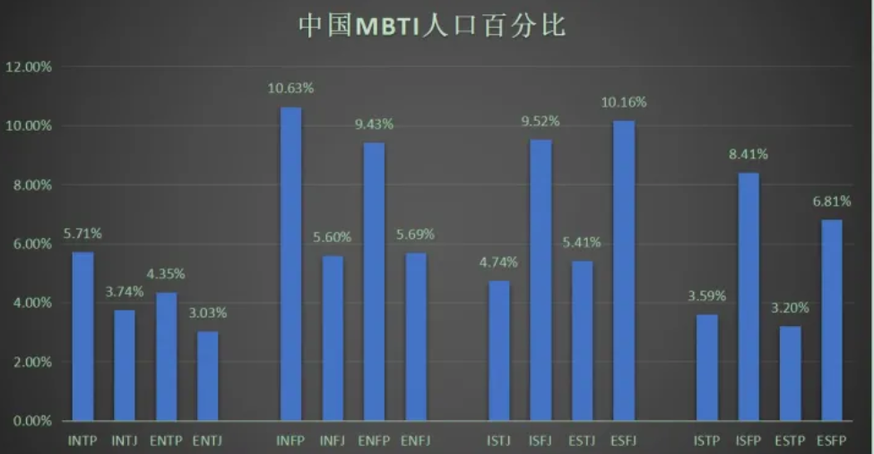{width="5.768055555555556in"
height="2.9993055555555554in"}

#### [军队不招收ENFP、INTJ、ISTP型人格?](https://www.zhihu.com/question/22128477)

[**Camus**](https://www.zhihu.com/people/ac7052469cb7464db196524c486ac523)

ENFP 策反派 ISTP 技师执行者 INTJ 军师

2020-06-23

[**堇小猫**](https://www.zhihu.com/people/1fac8d21e9071da39c8823b06881211f)

绝了 一个鼓动人心 一个策划方案 一个擅长落实 少一个都不能这么绝

2022-06-18

intj太独立，istp太冲动，enfp会让军队变成俱乐部。。。

##### 实际上infp是不收的

[**西乌庵主人玄**](https://www.zhihu.com/people/71fa9df54ee4476228526190693e570c)

实际上infp是不收的 有一条是i或 n过30 或n或 p过28就会被刷 而infp全占
说明这个类型比三不受更不招军队待见

2021-04-17

[**柴日天**](https://www.zhihu.com/people/a0e019f31b1d92ac52a3abc8d9a9fc4b)

是啊，优柔寡断娇气脆弱

2021-06-26

##### infp理想主义为了国家现身

[**深海**](https://www.zhihu.com/people/4714ee46ab39963894a21830c969782f)

infp是最会为了国家现身的（如果这是他的理想主义）。而且军队严格的制度并不是你没有行动力就可以不执行的。自己在这瞎猜啥呢？你怎么不猜大多数infp根本就不想入军队呢

2022-03-27

[**柴日天**](https://www.zhihu.com/people/a0e019f31b1d92ac52a3abc8d9a9fc4b)

那照你这么说enfp也可以收喽，可是军队就是很现实的地方，就是有很多变态的规章制度。

2022-03-27

##### Stj 即守规矩又雷厉风行

[**柴日天**](https://www.zhihu.com/people/a0e019f31b1d92ac52a3abc8d9a9fc4b)
[**西乌庵主人玄**](https://www.zhihu.com/people/71fa9df54ee4476228526190693e570c)

但整体来讲容易优柔寡断，军队需要的就是stj那种即守规矩又雷厉风行

2021-06-27

[**柴日天**](https://www.zhihu.com/people/a0e019f31b1d92ac52a3abc8d9a9fc4b)

estj适合当官，士兵是istj和isfj还有esfj

2022-03-27

##### [INTJ叛变风险高](https://www.zhihu.com/question/22128477/answer/1090997189) 

INTJ有相对较高的叛变风险。INTJ考虑事情时会理智的思考利益且不受道德观念束缚，一旦他们决定将自身利益凌驾于在集体利益之上，很可能意味着最危险的背叛。当然，会不会当叛徒这种事情其实取决于三观，我相信肯定有很多正能量爆棚、愿意为国捐躯的INTJ。但/"兵者，国之大事，死生之地，存亡之道，不可不察也/"。为了避免万一，还是有必要谨慎一些啊。

##### ISTP不好管理

ISTP不好管理，不便执行很多需要严格纪律才能完成的军事任务。

ENFP善于收服人心，一旦造反危害极大。ENFP的典型人物是刘备、宋江。刘备素有"仁德"之名，宋江外号"及时雨"，一旦他们想反，很多人会愿意跟他们走。

#### [J和p的区别](https://www.zhihu.com/question/449516697/answer/1795329898) 

[编辑于 2021-03-23
21:21](https://www.zhihu.com/question/449516697/answer/1795329898)

intj infj entj enfj istj isfj estj
esfj们要么努力要么[自律](https://www.zhihu.com/search?q=%E8%87%AA%E5%BE%8B&search_source=Entity&hybrid_search_source=Entity&hybrid_search_extra=%7B%22sourceType%22%3A%22answer%22%2C%22sourceId%22%3A1795329898%7D)是图什么？除了生存刚需以外，还有一个硬性需求就是想得到情绪价值，j类型人想赢，是因为离不开鼓励和肯定。

intp infp entp enfp istp isfp estp
esfp卷不过别人怎么适应社会？除了发挥聪明才智以外，给人提供情绪价值来换取资源，也是p类人的生存策略。

举例来说，同样是在知乎上分享干货，j类型人辛辛苦苦写了一大堆，如果没有人点赞收藏，就会产生焦虑感，甚至认为是知乎受众没品位。

而p类型人的想法要随性的多，认为自己分享干货等于做[公益](https://www.zhihu.com/search?q=%E5%85%AC%E7%9B%8A&search_source=Entity&hybrid_search_source=Entity&hybrid_search_extra=%7B%22sourceType%22%3A%22answer%22%2C%22sourceId%22%3A1795329898%7D)，在写作的过程中自己也巩固了知识，不算坏事。免费给你看，你都不看，那是你的损失，不是我的损失，我为什么要难过？

##### 冬泳怪鸽是p类人 [庞麦郎](https://www.zhihu.com/search?q=%E5%BA%9E%E9%BA%A6%E9%83%8E&search_source=Entity&hybrid_search_source=Entity&hybrid_search_extra=%7B%22sourceType%22%3A%22answer%22%2C%22sourceId%22%3A1795329898%7D)是j类人

搞怪的[网络红人](https://www.zhihu.com/search?q=%E7%BD%91%E7%BB%9C%E7%BA%A2%E4%BA%BA&search_source=Entity&hybrid_search_source=Entity&hybrid_search_extra=%7B%22sourceType%22%3A%22answer%22%2C%22sourceId%22%3A1795329898%7D)里面，[冬泳怪鸽](https://www.zhihu.com/search?q=%E5%86%AC%E6%B3%B3%E6%80%AA%E9%B8%BD&search_source=Entity&hybrid_search_source=Entity&hybrid_search_extra=%7B%22sourceType%22%3A%22answer%22%2C%22sourceId%22%3A1795329898%7D)是p类人，他看上去疯疯癫癫的，其实不在乎[直播](https://www.zhihu.com/search?q=%E7%9B%B4%E6%92%AD&search_source=Entity&hybrid_search_source=Entity&hybrid_search_extra=%7B%22sourceType%22%3A%22answer%22%2C%22sourceId%22%3A1795329898%7D)时那些非议，无论是冬泳当司仪还是打快板，都是他苦中作乐的方式，他也没有因为外界的追捧而过度膨胀，一直在照顾弟弟父亲。[庞麦郎](https://www.zhihu.com/search?q=%E5%BA%9E%E9%BA%A6%E9%83%8E&search_source=Entity&hybrid_search_source=Entity&hybrid_search_extra=%7B%22sourceType%22%3A%22answer%22%2C%22sourceId%22%3A1795329898%7D)是j类人，看庞麦郎采访会发现他态度是严肃的，也很希望被人认同，不是装疯卖傻搏出位的。庞麦郎并不能从创作中得到快乐，曾经讨厌明星后来想当明星的原因只是想被人追捧，为了[走红](https://www.zhihu.com/search?q=%E8%B5%B0%E7%BA%A2&search_source=Entity&hybrid_search_source=Entity&hybrid_search_extra=%7B%22sourceType%22%3A%22answer%22%2C%22sourceId%22%3A1795329898%7D)可以不认父母。庞麦郎成功[签约](https://www.zhihu.com/search?q=%E7%AD%BE%E7%BA%A6&search_source=Entity&hybrid_search_source=Entity&hybrid_search_extra=%7B%22sourceType%22%3A%22answer%22%2C%22sourceId%22%3A1795329898%7D)了，也发行了单曲，人气下滑以后却因为受不了大起大落而得了[精神病](https://www.zhihu.com/search?q=%E7%B2%BE%E7%A5%9E%E7%97%85&search_source=Entity&hybrid_search_source=Entity&hybrid_search_extra=%7B%22sourceType%22%3A%22answer%22%2C%22sourceId%22%3A1795329898%7D)。娱乐圈更适合p类人，因为他们娱乐精神强，也不容易因为外界评价而崩溃。

##### 恋爱p更主动 j表面上姿态更高 硬条件上提升自己

恋爱不顺利时，p类人会侧重于使用小技巧（比如使用推拉技巧制造情绪波动，比如更换妆容衣着风格制造新鲜体验），来让恋人感受更好；j类人会想着在硬条件上提升自己（比如努力赚钱/[整容](https://www.zhihu.com/search?q=%E6%95%B4%E5%AE%B9&search_source=Entity&hybrid_search_source=Entity&hybrid_search_extra=%7B%22sourceType%22%3A%22answer%22%2C%22sourceId%22%3A1795329898%7D)），让恋人对自己让步。

p在恋爱方面更主动，表面上姿态低的前提是内心能量足不怕被人打击，抽身时相对潇洒。j在恋爱方面，表面上姿态更高，实际上内心患得患失，控制欲更强，不容易放下。

j类型人更在乎社会评价，p类型人更在乎自身体验。同样是全职照顾家庭，[j类型](https://www.zhihu.com/search?q=j%E7%B1%BB%E5%9E%8B&search_source=Entity&hybrid_search_source=Entity&hybrid_search_extra=%7B%22sourceType%22%3A%22answer%22%2C%22sourceId%22%3A1795329898%7D)人会要求社会尊重，如果得不到社会尊重哪怕过的安逸也不会安心。p类型人更在乎实际待遇，愿赌服输，不在乎无关的人怎么看，也不介意朋友事业比自己出色，只要对自己有帮助就能欣赏。

##### np是通过求知欲和想象力来获取快乐

[**旧故里草木深**](https://www.zhihu.com/people/57d1dda3491476a1cb11205d8de14587)

np是通过求知欲和想象力来获取快乐），j更依赖从外界社会关系中获取快乐。这个觉得写的挺符合的

2021-04-15

##### [目标性 j型人格目标性很强 p型人格佛性](https://www.zhihu.com/question/449516697/answer/1794461632)

[编辑于 2022-11-04
11:44](https://www.zhihu.com/question/449516697/answer/1794461632)

就是目标性
。j型人格目标性很强，做任何事都必须有明确的目标（不管实现目标的过程到底会不会出现拖延和懒惰，但坚定的目标是一个很关键的点）

但[p型人格](https://www.zhihu.com/search?q=p%E5%9E%8B%E4%BA%BA%E6%A0%BC&search_source=Entity&hybrid_search_source=Entity&hybrid_search_extra=%7B%22sourceType%22%3A%22answer%22%2C%22sourceId%22%3A1794461632%7D)并不是，ta们会有一种比较佛的漫无目的感，所以相对而言p型会随和+做事不功利，渴望一种不急不忙的闲适生活状态（再拿我那个朋友举例子，她就属于内心很向往悠闲的生活但实际上忙得要命（？）好迷惑）

#### INFP和INFJ区别

躺在黑夜的怀里

Infp只要能拥有行动力就都好了。

2021-10-13 15:451635

幸好有你宇扬

有行动力就变成infj了，我就是在这两种人格中互相转换

2021-11-01 18:2399

seltys

回复 /@幸好有你宇扬
:其实我觉得j和p差别蛮大的，可能j比p普遍更有计划一点，p我行我素一点。所以让人觉j得更有行动力,但是不能说有行动力就变成j了，因为不只这一方面的差异。这样说感觉像说"infp就是缺少行动力的infj的低阶版"挺不舒服的，（难道是真的吗？本infp又开始自我怀疑中。。。。。

2021-11-06 10:31158

小企鹅的宇航员 回复 /@幸好有你宇扬 :嘤嘤嘤是真的/
我妈妈是infj我是infp，她就超有行动力/
我打小就被她骂懒蛋

2022-01-05 23:544

#### [气质区分最容易](https://www.zhihu.com/question/449516697/answer/2358334974)

我觉得从气质上比较好区分，不知道你能不能感受到人身上的气质

NJ（INTJ、ENTJ、INFJ、ENFJ）的气质是坚定，甚至有点压迫性（没错包括两个NFJ）

SJ（ISTJ、ESTJ、ISFJ、ESFJ）的气质是细致和周到

NP（INTP、ENTP、INFP、ENFP）的气质是涣散和神游

SP（ISTP、ESTP、ISFP、ESFP）的气质是今朝有酒今朝醉

[发布于 2022-02-22
03:07](//www.zhihu.com/question/449516697/answer/2358334974)

ISFJ INFP

#### [【数据可视化】快来看看MBTI 智力排名](https://www.bilibili.com/video/BV1yu411C7AC/?spm_id_from=333.788.recommend_more_video.8&vd_source=f03b9d349cef8aff4a045d602d8a1d82)

2022-04-14 16:50:00

##### [天才容易发展成这个人格](https://www.bilibili.com/video/BV1yu411C7AC/?spm_id_from=333.788.recommend_more_video.8&vd_source=f03b9d349cef8aff4a045d602d8a1d82)

晓木恺_akai

如果硬要说的话，那就是因为"天才容易发展成这个人格"，而不是"这个人格容易出天才"/
mbti本质上是对个人性格的描述与解析，并不能决定智商/
而我们认为的"智商排名"只是因为高智商人群可能从小就激发了思考的兴趣，而这个排名中最高的INTP给人的印象就是"爱思考的科学家"，所以发展成INTP的几率比较高

2022-05-21 18:11472

##### intp是具备了高智商人群的思维模式

颗粒斯汀

我隔一段时间测一次 四五六七八九十次都是intp 都说intp平均智商高
但我觉得intp是具备了高智商人群的思维模式 却不能说人人都是高智商
并且个体差异绝对不小 就比如我 有一堆天才的毛病和行为习惯 但却没有高智商
（很痛苦就是说）

2022-05-18 15:00152

##### intp不适合人类社会性格

仙女座阿瞬

intp这种不适合人类社会的性格如果不是高智商就嗝儿了屁的(本intp自认为的原理)2022-05-27
00:1598

##### INFP抑郁绝对第一

像投枪

INFP表示，智力真不知道，但是抑郁绝对第一

2022-05-06 22:23213

Mr_Donut/_

intp根本不知道什么是焦虑，因为在乎的东西很少。只是别人看着好像一直很down，其实是沉浸于自己的世界里自洽，很享受这种感觉。

2022-07-05 23:3429

##### mbti更多是思维方式

小酒窝不回家不改名

我感觉mbti更多是思维方式，可能是思维方式影响到做题（这个数据好像是什么问卷弄出来的），思维方式至少比星座靠谱吧。

2022-05-31 16:463

##### 16人格工资水平排名 和这个排名顺序几乎反

玻璃庭院

记得有一个16人格工资水平排名的图，和这个排名顺序几乎是反的

2022-09-25 13:156

#### NT分析 NF外交 SJ守护 SP探险

NT红 NF绿 SJ蓝  SP黄

分析   外交  守护   探险

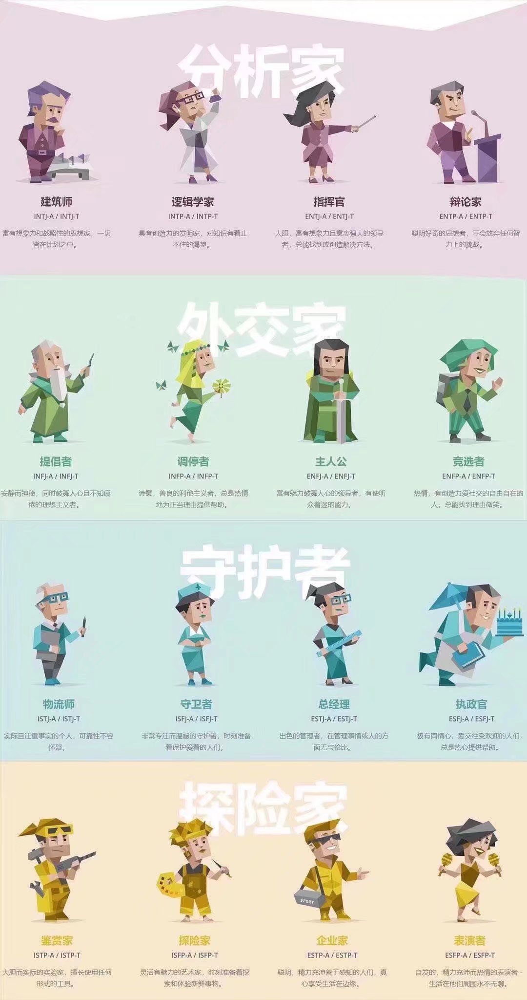{width="5.090277777777778in"
height="9.643062117235345in"}

#### Joke

##### [来我家洗碗](https://www.bilibili.com/video/BV1k8411h7Qi)

{width="1.991839457567804in"
height="1.916832895888014in"}

## 自己的一些理解

不知INFP、INTJ也容易抑郁。环境决定人格，在高压环境下，人会变得INTJ，如果无法承受失败就会变成INFP。

思考太多不要冥想，运动，听音乐都要好一点。

## [INFJ这种性格会越来越少吗？ 很不利的现象是什么意思？](https://www.zhihu.com/question/38664138/answer/905487278)

2019.11.20我一个隐居的加拿大老师就是infj。他一辈子都没谈过恋爱。一个人生活在多米尼加共和国的山上，通过网络和外界交流。他免费教了我六年的英语，法语，数学，占星学。我们互通了六年的电子邮件，总共四千多封信。他说孤独对于他来说就像是空气，是最重要的必需品。他就像是一个慈悲的苦行僧，虽然未曾谋面，却改变了我的一生。

## 群讨论

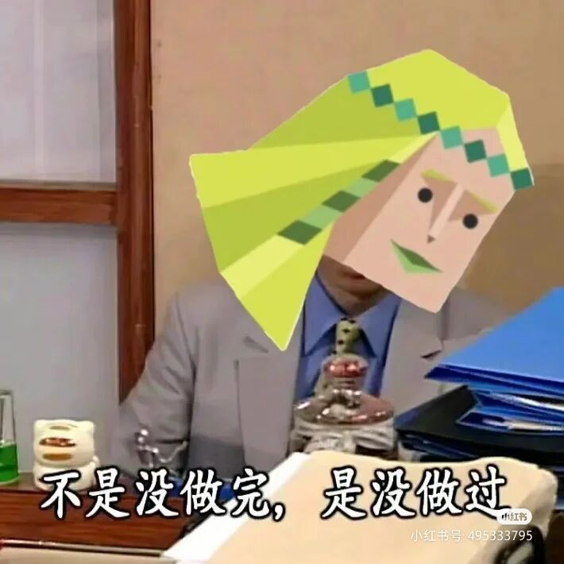{width="2.0527777777777776in"
height="2.0527777777777776in"}

infp（悲→悲）/
intp（悲→摆）

### infp高阶群

猫菩提 21:06:58
