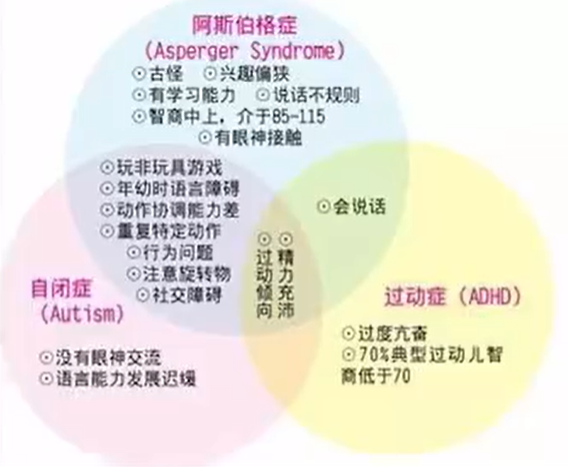
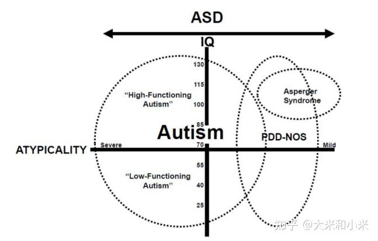
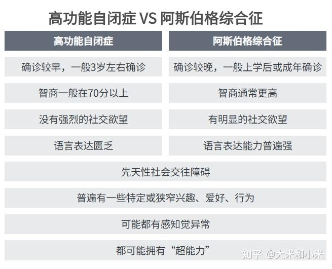
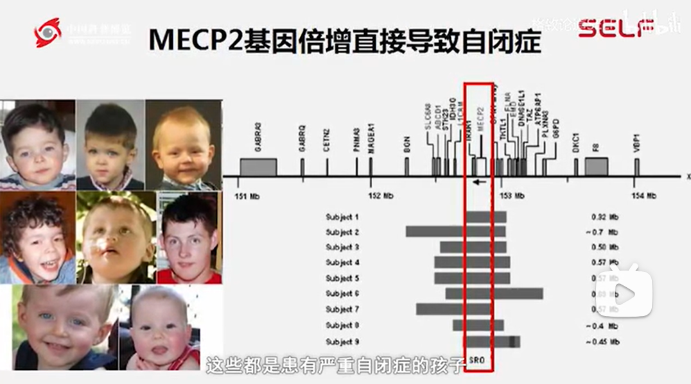

## [日本22岁男子为坐牢，无差别袭击致1死2伤，被判无期后高声欢呼](https://www.bilibili.com/video/BV1aMxyeiEvM)

### [阿斯伯格、自闭症、过动症区别](https://www.bilibili.com/video/BV1aMxyeiEvM?t=107.2)

## 选择性缄默症

## [对aspie-quiz常见问题的解答](https://zhuanlan.zhihu.com/p/36395983)

1. 关于阿斯伯格的误解

   阿斯伯格人士中智力较高（IQ超过120）的比例的确比普通人群要高，但是这并不代表大多数人都是新闻中的那种天才。相反，只有少数人得到了适合的环境，得以施展自己的长处，大部分人在生活中挣扎。

   媒体报道也往往会聚焦于天才的才华，而很少对他们所承受的痛苦和付出的努力做描述。可能这样才有物以稀为贵的感觉吧。

2. 关于刻板行为的误解

   一个常见的理解认为刻板行为是强迫症，这是不对的。简单的说，刻板行为是不做会难受，而强迫症是做了和不做都难受。

   孤独症谱系的刻板行为在儿童期就会有所表现，比如转圈，物品摆放习惯，摇晃身体，对食物的挑剔等等。

最后，看到国旗有点小激动

## [阿斯和高功能自闭症到底怎么区分？一张图就说清楚了](https://zhuanlan.zhihu.com/p/669407784)

阿斯伯格=轻度自闭症

### 02 千丝万缕的联系

在诊断定义中，并没有专门的高功能自闭症的说法。在生活中，医生和家长常将智力水平达到70以上，具备语言功能，学习能力较佳的自闭症人士称为高功能。

阿斯伯格和高功能自闭症有很多相同点。

比如：

1.他们的核心都是先天性社会交往障碍。

2.高功能自闭症和阿斯伯格综合征人士普遍有一些特定或狭窄兴趣、爱好、行为。

3. 高功能自闭症和阿斯伯格综合征可能都有感知觉异常，他们的触觉、痛觉、嗅觉等阈值可能跟普通人有差异。比如不喜欢被人触碰，过分怕疼或者不知道疼，不喜欢吃某种食物，忍受不了强光，也受不了噪音……

4. 无论阿斯伯格综合征，高功能还是低功能自闭症人士，都可能拥有“超能力”，比如记忆力强，空间感好，会画画，对音乐超级敏感，但这样的孩子只是少数。

正如LornaWing所言，阿斯伯格综合征与自闭症核心症状相符，并没有明确的分界线，只是在向父母传达孩子的状况时，这个名字会轻松一点。

### 03 区别阿斯伯格和高功能自闭症

如果一定要区分阿斯伯格和高功能自闭症，也有一些端倪。

1.阿斯伯格人士智商更高

高功能自闭症人士智力测试虽然一般在70分以上，但是普遍还达不到“智力超常”的水平， 阿斯伯格综合征的人士通常智商较高。

**2.阿斯伯格综合征人士更有社交欲望**

高功能自闭症人士经过训练可能发展出一些社交技巧，但没有强烈的社交欲望；而阿斯伯格综合征人士有明显的社交欲望，但社交方法和技巧让他人难以接受。

**3.阿斯伯格综合征人士确诊的年龄较晚**

大概因为高功能自闭症人士的障碍更明显，所以获得诊断的时间会更早一些，一般在3岁左右就能诊断。但阿斯伯格综合征人士通常的诊断年龄是在上小学或成年后。

**4.阿斯伯格综合征人士的语言功能较强**

阿斯伯格综合征人士语言表达能力，普遍强于高功能自闭症人士。

高功能自闭症人士的问题是语言表达匮乏，而一部分阿斯伯格综合征人士的语言表达基本正常，甚至可以叽里呱啦说一堆，乍看还挺牛，但换个不感兴趣的话题，就露馅了。

如果做个总结，那么：

高功能自闭症人士是接受和表达信息轻微障碍，在跟人互动中，很难get到对方的社交信号，回应社交时说几句话就断片，在社交活动中感受不到快乐，更喜欢独自待着。

阿斯伯格更倾向于接受信息轻微障碍，他们的表达信息能力比高功能自闭症稍好（但也存在一定障碍，尤其在表述情感、概述事情时会有困难），他们会主动加入社交活动，遇到感兴趣的话题，还能滔滔不绝地分享观点，甚至无视他人终止谈话的信号。

### **04 所谓的“阿斯特质**

阿斯伯格综合征人士可能还会有些特点更典型，但这些并不能成为诊断标准。

**1.执拗，规则感、秩序感更强**

阿斯伯格人士可能更加墨守成规，不知变通。比如不会插队，不会说谎等。

普通儿童可能会漠视规则，做出使自己的利益达到最大化的行为，但阿斯伯格综合征儿童则是认同某个规则后，就会非常刻板地遵守它。

比如老师让大家排队拿糖果，普通儿童可能会伺机插队，但阿斯伯格儿童则不会。

**2.情绪比较极端，大喜大悲**

《阿斯伯格综合征完全指南》指出，普通儿童的情绪表达是逐渐增强的，从由一级渐变到十级，而有些阿斯伯格综合征可能只有两个强度指数，从一级直接到十级。

此外，庆幸、失望、尴尬、自豪、嫉妒等更高级细致的情绪，在阿斯伯格人士身上很难看到。

**3.淡定，冷漠，荣辱不惊**

某些时刻，某些阿斯伯格人士对环境的反应不敏感，表现更像“钢铁直男”。比如看到车祸现场，普通人可能会逃避，阿斯伯格人士则会冷静地分析原因。（当然，这和阿斯伯格本人应对环境的敏感程度有关）

**4.化悲伤为气愤**

《阿斯伯格综合征完全指南》指出，有一部分阿斯伯格综合征人士很难流露和表达伤心的情绪，他们在悲伤时，常常用愤怒表达。

比如，阿斯伯格儿童的宠物死亡后，他可能不是伤心落泪，而是乱扔东西。

**表现机械，像人工智能**

《阿斯伯格综合征完全指南》中指出，假以时日，阿斯伯格综合征人士获得了相对高级的新理论能力，但是他们处理社交信息的时候，需要耗费相当大的精力，这种运用后天认知机制补偿心理理论能力的先天不足，很容易令他们精疲力竭。

普通人天生具备社交直觉，很多时候只要遵循本能，不需要过多思考，就能在社交场景中做出恰当的反应。

而很多阿斯伯格人士必须提取过去的经验教训，生搬硬套到新的社交场景之中，才能做出还算恰当反应。

所以，阿斯伯格人士会在即时或全新的社交的场景中反应迟钝，出现障碍。一位阿斯少女曾这样形容自己：“我们在社交场景中不是人类，而是人工智能” 。这些特征，在大米和小米往期报道的阿斯相关文章中，可见一二：

## [孤独症（自闭症）、阿斯伯格、孤独症谱系障碍，是一回事吗？](https://zhuanlan.zhihu.com/p/264982441)

现在国内采用的是第五版诊断标准，医院给孩子开的诊断证明上，一般写的是“孤独症谱系障碍”或者“ASD”，有少数医生会加上备注比如“孤独症谱系障碍（自闭症）”、“孤独症谱系障碍（阿斯伯格）”，但是不再单独诊断为“孤独症”或者“阿斯伯格”。

如果家长想明确孩子的障碍类型，可以询问医生：孩子的谱系障碍是属于孤独症还是属于阿斯伯格？有些医生会按照2013年以前的诊断标准，给家长明确回复。

发布于 2020-10-12 10:12

## [阿斯伯格和自闭症的区别](https://www.bilibili.com/video/BV1Wh411K7ip/)

虽然社交能力不行，但是阿斯伯格有主动与别人社交的意愿，而自闭症没有这个意愿。

很难从别人的角度来思考问题。也就是说他们缺乏同理心。他们缺乏对别人处境、对别人的行为、对别人的感受力、对别人态度的这种基本的感受能力和理解能力。，所以他们经常就说一些不沾边的话，就别人耻笑。大多数阿斯伯格综合症的孩子在成长过程中，都被同龄孩子欺负过，或者被同龄孩子，这个堪称异类嘲效果。

（注：末句"异类嘲效果"疑似表述误差，可能指"被视作异类而遭到嘲笑"，但严格按原文呈现）

你比如说我治疗过一个阿斯伯格综合症的孩子啊，他把深圳所有的地铁、所有的地铁线路的地铁站都记得清清楚楚，哪一站下的是哪一站，哪一站下的是哪一站啊，包括几号口出来通往哪里，他都记得清清楚楚。其他的人情世故，他却完全没有基本的概念，基本的常识。还有一个我干预过的孩子啊，他非常喜欢公交车，整天在街上看公交车的，他就说没事，就坐在公交车上，在城市里转来转去，和公交车司机说话，他在研究公交车的，

### 3 感兴趣的东西往往缺乏现实性

他们感兴趣的东西往往缺乏现实性，都是比较无用的，没有现实意义的，唉这是第三点。

### 4 偏执

第四点，大多数阿斯伯格综合症的孩子都有偏执的、表现的就是一根筋，他们看问题非常的固执，他们很难改变自己的观点。

### 5 易怒

最后一点，阿斯伯格综合症的孩子，大多数都存在着情绪不稳定、易怒的表现，尤其是他们的愿望受阻以后，他们的愿望不能实现以后，他们就会失去啊情绪上的这个啊稳定性，他们就会发火，发怒啊，耍赖。知识点如果具备了，我们就可以把它诊断为阿斯伯格综合症。

### 坚持早期干预

我前面说过啊，抽动症、多动症、阿斯伯格综合症，不要小瞧他啊，如果不早期干预，有可能就耽误了他，这一生可能就比较麻烦，尤其是阿斯伯格综合症，一定要坚持早期干预，干预的越早越好，这就是阿斯伯格综合症快速诊断的几个重点。抓住这几个重点，我们就能够迅速的诊断、准确的诊断，这个孩子是不是患有阿斯伯格综合症。但是这里必须提醒一点啊，上述表现必须是持续存在，哎你不要看了一天两天，这个孩子有点不正常啊，人家前面是正常的，人家过了这段时间又正常的，那这个不算必须是持续存在。在这里我特别提醒，有些家长认为阿斯伯格综合症的孩子这些表现是妈妈惯坏了、爷爷来了、宠坏了，不抓紧去治疗，却怪孩子的妈妈，却怪爷爷奶奶，这样就把孩子耽误掉了。阿斯伯格综合人生孩子最好在青春期以前治疗，过了青春期，以我的经验，多数孩子都不愿意治疗，他可能会把自己封闭起来，或者沉迷于某种爱好当中，尤其是游戏或者其他的，到那个时候那就完了。孩子如果患上了阿斯伯格综合症啊，对父母来说是非常痛苦的，因为你看不到他的希望，或者很难看到他的希望。阿斯伯格综合症的孩子的治疗，最最关键的就是引导他学会向他人学习、借鉴别人的经验，把这一点如果啊这个做好了，阿斯伯格症的患者，将会在质量上有一个突破。  

## 阿斯伯格都是天生的吗?

### [阿斯伯格都是天生的吗? - SOMEONE的回答](https://www.zhihu.com/question/742744412/answer/4274864376)

看看父母，再看看祖父母或者外祖父母，假如你们家族每一代都有一个情商低，思考问题会很复杂，不会看人脸色的那种。那么你是阿斯的概率很大。另外，学历低的阿斯，往往有比较多的强迫行为，为了省点时间或者省点钱，或者为了更好的未来更好的健康，折腾出来很多事情那种。

阿斯优秀的个体很多，很一般的个体一样很多。具体到个人身上，阿斯和NT是一样的，也就是一个概率问题而已。

你如果能够通过遗传上确定阿斯这条线，那么你再看看你有没有天赋，ADHD是减天赋的，如果没有天赋，你就克服情商缺点，其余的啥都别想。有天赋的也能发挥出来的，那就好好努力呗。

[发布于 2024-10-06 02:07]()

### [阿斯伯格的成因是先天还是后天的？](https://www.zhihu.com/question/643023471/answer/3427253673)

先天的，是大脑神经发育异常（意思是和大多数普通人不同）。而且遗传性还很高，不过阿斯伯格生出的孩子，有可能是阿斯伯格（高功能自闭症），也有可能是低重典，当然也有可能是普通孩子

编辑于 2024-03-12 09:41

### [将阿斯理解为情商方面弱化版的常人](https://www.zhihu.com/question/492126784/answer/2175597945)

阿斯伯格都是天生的 而且很多自称阿斯特质的其实不是阿斯

我女儿患有阿斯伯格症（高功能自闭症），我确实有这方面特质。但思维和行为方面其实跟普通人没有太大差别。

可以将阿斯理解为情商方面弱化版的常人，一切将阿斯神秘化的说法都是忽悠。

刻板行为或执着于某种学科、话题，可能会有一点，例如我也会比较执着的回答某几个话题，例如自闭症之类的。就是兴趣吧，没有为什么。

[发布于 2021-10-17 22:25]()

无名氏
只能说脑回路和世界观是不一样的 我就这样 比如普通人唇枪舌剑用言下之意羞辱对方的时候 阿斯大部分时间都感觉不到 就是后来想明白了也不在乎 也不会报复 纯觉得没必要计较 如果你在我喜欢的领域戳到了我的痛处我是真的会跳起来 如果只是人际交往方面 只能说没有能力感觉出来 脸皮也厚 对那种挤兑无所谓
2021-12-24

凉空
算了吧，AS的一大并发症就是抑郁。
2024-03-28

aspieluvsuzuna
何止弱化版，阿斯伯格是基因缺陷，所以和普通的低情商是本质不同，低情商和普通人都是安卓系统的话，低情商的应用程序版本低，升级和学习即可，阿斯伯格是iPhone，装着各种盗版软件
阿斯是智商未受损的典闭，外星人和机器人，生活非常艰难，如果不在乎社交，满足于狭隘兴趣，虽然错过太多人生的美好，但也算一种简单的幸福？
2021-10-18

舞者的光影 作者 舞者的光影
总之阿斯对社交的影响肯定有，但如果一个人从长相到学业、工作、情绪，一点被利用的价值都没有，靠吃点小亏换取隐藏都不能，那确实需要提升自己被利用的价值。
2021-10-18

舞者的光影 作者 aspieluvsuzuna
例如上学时如果某几科学得比较好，有的同学就会找你“讲题”，如果不在乎浪费自己的时间有求必应，为了这种免费的家教会有同学特别主动的来交朋友，如果你这人再厚道一些肯吃点亏，别人觉得这个人“特别好”，就愿意变成真心朋友。我上学时朋友基本都是这样来的。作为A S跟正常人社交能力肯定不一样，但不至于隐藏不了。
2021-10-18

婆娑
情商是正常的，只是识别社交信号出了问题。可以理解成手机麦克风和摄像头接触不良，手机本身运行是Ok的
2024-09-02

### 阿斯症状

胡萝北

我有一个弟弟，我觉得他完全符合阿斯症状，听不出话中话，看不懂人的脸色，笑点很奇怪，经常别人讨论a话题，他突然蹦出b话题，从小社交能力差，说话情商特别低，经常好好的话说出来让人一听就觉得来气，但实际他又没有恶意，小时候经常出现穿上一件衣服就不能换的执着，还有吃饭的时候必须做他专属的小板凳，不然就不吃，我觉得很像，但是又没法告诉他
2021-10-25

## [阿斯伯格都是天生的吗?](https://www.zhihu.com/question/742744412/answer/4213325301)

### 遗传度80%

遗传度80%以上，加上基因突变这些没有后天阿斯伯格，但是要注意区分阿斯伯格和spcd，spcd和阿斯具有类似症状如社交障碍，但是spcd没有精神症状，阿斯具有类似双相情感障碍的躁郁症症状

[发布于 2024-10-05 10:16](https://www.zhihu.com/question/742744412/answer/4213325301)

### 脑子都是乱乱的很活跃的都在想东西

[知乎用户Yu](https://www.zhihu.com/people/27c831c0795810048844b024f4af3994)	提问者

应该不是spcd 我还是能跟正常人正常相处的（有最基本的社交能力） 只是融不进去各个小圈子 可能是我觉得累吧 伪装过一段时间 效果不错但太累了就放弃了 目前很渴望独处
应该有抑郁和adhd （字数过多补充说明里我给删了）高三压力大 抑郁的情绪被我重视了起来 不能忽视的那种 adhd的话 初二就埋了伏笔 高二高三都不能正常上课了会分心 整天每时每刻脑子都是乱乱的很活跃的都在想东西 几乎每晚都会做梦

2024-10-05 · 广东

## [某些阿斯伯格综合症（Asperger syndrome）是如何一步一步成为“天才”的？](https://www.zhihu.com/question/469970522/answer/2422536739)

### 过于理性 抛弃感性 深入本质

阿斯伯格不是一步一步被环境影响成为天才的，而是天生被基因设计为天才的。

除了天生具有超乎常人的智力，还有很多其他因素导致他们成为天才。

**天生过于理性，导致他们看事物可以抛弃感性因素，深入到事物的本质，**从一个高深的造物者角度去分析世界。

### 对某种狭小事物的强烈兴趣

**天生对某种狭小事物的强烈兴趣，**给了他们强烈的好奇心，成为了他们研究事物源源不断的动力。这种强烈兴趣并不是后天培养的，就是天生的。

天生不同于常人的注意力模式，**使他们只能做好自己感兴趣的事，且一旦深入进去就停不下来**，这是天生的ADHD注意缺陷造成的。所以他们能在某个领域开辟独一无二的深度，而不是肤浅的广度。

天生不同于常人的记忆模式，**让他们对于自己天生感兴趣的领域，像计算机一样具有永久不忘的“超忆”能力。**但是对于自己理解不了的，就很难记忆，因为所有事物只有经过本质上地理解后，他们才能去记忆。所以，对于课本上死记硬背、照本宣科的“权威”东西，别人会盲信，而他们则会自己去找出事物的真相。

### 反社会化，只在乎真理，不在乎人际关系

**天生的反社会化，让他们只在乎真理，不在乎人际关系。这种反社会化，也会让他保持清醒，不随波逐流，怀疑任何权威。**他们的精力只会为自己的兴趣付出，不会为其他人际关系付出，这也为他们的科研之路扫除了障碍。（追求真理和追求人际关系是冲突的，因为在乎人际关系的人肯定会因为随波逐流耗费自己的大量精力）

还有反社会化带来的自我意识缺乏。

### 社会化常人维护自己利益 阿斯伯格只有真理

社会化的常人，会因为维护自己的集体利益，而排斥所有和自己不同的人，当然也会排斥异类的所有观点。但是阿斯伯格眼里，**没有这种集体意识，对他来说所有人都是平等的，所以他们会求同存异**，虚心吸取不同人的建议，因为他们的眼里没有“人”，只有真理。

### 天生刻板的规律行为

**天生刻板的规律行为，**可以让他们把起居时间精细化到分秒，**分配更多精力来做自己热爱的事**。

天生像显微镜一样的眼睛，可以让他们看到更细致的东西。普通人的眼睛像全景镜头，广而不细，但阿斯伯格的眼睛像特写镜头，**虽然只能看到的局部，但是分毫毕现，鞭辟入里，极其细腻，所以总能发现常人注意不到的东西。**

### 喜欢收集和整理东西的癖好

天生喜欢收集和整理东西的癖好，**可以让他们乐此不疲地把自己发现的碎片收集和整理起来，**继而像拼图一样发现事物的整体规律。

**还有其他性格特质也能成为他们成功的动力。比如强迫型人格带来的完美主义，**会让他思维极其缜密，不允许自己出任何错误。**还有被人排挤带来的强烈的自尊心和好胜心，也会成为他成功的动力。**

但本质上，天生对某种事物狭小而强烈的兴趣才是他们成功的根本原因，而不是什么环境和意志力。**对于常人来说，与人交往才是他们的兴趣，被人认可能给他们带来快乐。但是阿斯伯格只有研究自己喜欢的事物，而非和人类相处，才能感到开心，所以不管能不能得到认可，他们都要偏执而风雨无阻地去做，因为只有他的兴趣才能给他带来快乐。**

### 自我封闭反而在多巴胺分泌

**你以为他们自我封闭起来很痛苦，其实他们反而在多巴胺分泌，所以天才总是孤独并快乐着。**

所以说，他们天生就拥有“怀疑一切、批判一切、探索一切”的科学精神，这个不是后天培养的，也不是环境影响的，就是天生的。

[编辑于 2022-04-04 12:07]()

### 评论

#### 近乎纯理性人

展翅吧小翼
关于阿斯其实我也怀疑过自己，量表也做过确实存在可能，不过没有深究。要说最大的不同，应该是我的情绪超级稳定完全没有易怒的特点。我觉得我应该是周围所有人里最接近纯理性人的，以至于大部分观点没法交流。高敏这个问题和情绪稳定不知道有没有冲突。我对人其实不读表情，只读氛围，但我不太解释的出那是什么，自从可以做到无视读到的氛围而强行友好之后，我的人际基本没有问题了。还有我不理解为什么有人认为人无法忍受独自一人，独自一人真的很爽。精神病态这篇我也读了，我确实也能轻易控制注意力。还有一点，我好像不太能分辨异常，比如bpd，别人诊断的我一概不怎么同意，但也许是我判定异常的阈值特别高也说不定。
2024-02-10 · 浙江

#### 律令创伤者早年经历长期要求做其不愿意做的事情，同时还时常遭受羞辱和语言暴力 

[知乎用户瑾](https://www.zhihu.com/people/24a93c33d72e6a191c03246543a47827)

律令创伤者早年经历长期要求做其不愿意做的事情，同时还时常遭受羞辱和语言暴力，而且，这种暴力通常是喜怒无常、缺乏逻辑从而难以藉由特定征兆提前预测的。请问，如果母亲就是习惯于通过否定羞辱打压孩子来体验控制感优越感，达成奴役孩子为自己服务的目的，并且合理化其做法为宗教化善有善报，恶有恶报，以宗教来恐吓孩子。这样的原生家庭，造就的女儿进一步成为母亲后继续该模式，几代后，是不是会造成阿斯伯格？

2024-02-10 · 北京

## [什么是阿斯伯格？](https://www.bilibili.com/video/BV1Zr4y1J7d7/)

### 语言正常、智商正常的自闭症患者

阿斯伯格呢是是以前呢对自闭症呢单独叫的一个名称，他就是语言正常、智商正常的自闭症患者，就是阿斯伯格。阿斯伯格的人呢通常呢就是说话也没问题，智商也很好，但是他有社交障碍。

#### 马斯克 执着，一根筋 但高智商成功

马斯克呢在我们看来，确实也是个很典型的阿斯伯格或者也是个自闭症患者，就是他是非常的这个说话很冲很直接，那么他处世的风格呢也是这样，比如说在他的公司，你不能说NO，我说了一个这件事情能怎么做，如果有人说NO，你立刻开掉它，就是一种就是非常这个直截了当的处事的方方式。而且呢做事呢就非常的执着，一根筋，就是他说哇我我认为这是对的，他说电动汽车，我我就认为这是方向，唉就是多少人哎呀就是想过这个事情，但是都不敢那么做，他就是我站在人类发展的角度，哎这个污染啊、能量啊、这个这个能源能源呀等等这些问题上，他说哎我就认为他对了，他就拼死的就去做。曾经就是特斯拉差一点就破产的状态，对不对？唉就是公司几次都要卖掉，但是呢挺过来，现在成为这个世界首富，嗯非常聪明的、又语言又非常好的阿斯伯格人，就是这个自闭症人呢，往往他们会有一些非常优秀的表现，会成为非常杰出的人。所以也就是说自闭症的生存的好与坏，很大程度上就是说在没有什么外界特殊干预的情况下，还是他的智商本身占了一个非常重要的因素，可以这么理解吗？可以这么理解，因为他呢实际上就沾了他的智商高的一个这样的一个好处，就是因为他确实非常聪明，他尽管社交能力确实比较弱，他跟各方面打交道的能力确实比较弱，但是因为他足够聪明、足够碾压别人的智商，所以他能够很好地生存。

#### 没有他那么聪明 太冲就GG

但是呢翻过来呢，如果没有他那么聪明，对不对？唉如果也这么冲，那完了，那你你只有被开掉的份儿了。

#### 阿斯伯格适合CEO

曾经有一个说法，阿斯伯格的人，他们只有一个职位适合他们嗯，哎就是CEO，因为他们不会听相反的意见，他们一意孤行，那如果他足够聪明，坚持就成功了，如果他不够不足够聪明呢，那失败了就会被赶走。所以呢在目前台面上，又承认自己是自闭症患者的，哎又比较有名的就是马斯克。但是呢同样被大家认为是的呢，其实还有乔布斯，但是他没同他没承认识吗？唉他没有承认过，但是呢大家同样认为呢，他也是一个阿斯伯格。

#### 乔布斯实际沟通能力差 演讲是找人修正的

就在您的角度，您也这么觉得，就是它的特征是对，这个呢就是我前一段时间啊看了一篇文章，就坚信了我的这个观点，这篇文章是呃呃美国的一个非常有名的啊这个电视台呢采访苹果的啊联合创始人和乔布斯，同时创立苹果的史蒂夫·沃兹尼亚克，唉对那么他就说呢，大家都认为乔布斯啊有非常强的沟通能力，为什么呢？因为每次苹果的发布会，都是乔布斯在上面来发布，乔布斯的演讲的技巧对吧，和大众沟通的技巧，大家都觉得非常棒。但是呢这个他的联合创始人呢，这篇采访里面他就说了，他说其实那是表面的现象，他说每一次发布会，那么乔布斯在发布会之前，全部都要请人给他专门的来讲怎么来讲嗯，所以那个不是他的一个天然的能力，而是他呢呃一种训练而得来的，所以这一点呢更加让我确信了对吧，他他其实不是有那么强的这种沟通能力的。

#### 乔布斯追求完美 走弯路后足够聪明解决问题

实际上，但是呢乔布斯呢确实有一个特别重要的品质呢，就是他的这个追求完美的那种、十全十美的那那么一根筋啊。好崔老师，因为您是一个非常有经验的自闭症训练师的这么一个身份，所以从您的角度看，就是说刚才我们举的这些例子，是他们都需要训练呢，还是说有一类特定的人才需要训练，马斯克或者乔布斯就不需要训练吗？其实不是的，他们都走过很多弯路，每一次的弯路就是因为他们足够聪明，他们会总结找到问题。

#### 乔布斯因为要求十分苛刻被团队踢出去 而因为团队不知道什么是好的设计而把乔布斯召回来

你说乔布斯曾经被赶出苹果，然后最后他又回到苹果，那么他当时为什么被赶出苹果，其实原因也很简单，因为他对产品太苛刻了，嗯他对产品那么苛刻，那公司受不了了，如果你这样的话，那我们的这个新产品就出不来了，但是他说这东西就不是我要的，我就不满意，最后没有办法，最后对不对？你你不行，你你你你你走吧，我们那个不能再让你在这里搞下去，我们就要倒闭了，所以呢他就被轰走了，最后呢就当苹果真的不行的时候，又把它哎再请回来嗯，对不对？

#### 不断的学习、冲撞 训练

就是说呢这些人他们也需要不断的学习，因为他们也不断的冲撞，嗯对吧，他们和周围的人冲撞，他们和制度冲撞，他们和整个的这个社会呢都会产生很多的冲撞。那么在这个过程中，他们就会学习什么人需要训练，其实什么人都需要训练，只要你是有社交障碍的人，都应该得到训练。如果你不去训练也可以，如果你足够聪明，那你就东撞西撞，你慢慢的也可以学会，但是呢你要走很多弯路。那么对那些如果不够聪明的呢，那么它就一直会有一种社交障碍，会影响他们的人生。尤其是比较聪明的孩子。

#### 不那么的聪明 未经训练 能想明白事情 却没有极高智商 难以融入集体产生精神问题

不是那么的聪明，就是不是顶尖聪明的，如果他没有经过训练的话，他很容易就是有精神疾病，他们又能想明白事情，但是他们又没有碾压别人智商的那种水平，所以呢他们呢就跟别人交往的时候呢，就会遇到很多的问题，相处的时候他就觉得别人也不听你的，然后你又觉得自己是对的，又不能融入到一些集体里面，所以呢你这样的话就有很多挫折感，以后呢就容易产生精神问题。那么翻过来对那些就是智商比较低的，那么如果他们不训练的话，更糟糕，他们智商本来就低，然后他们再加上又不会社交的话，他们怎么生活，他们怎么进入社会，所以那时候问题那就又严重。从这个角度上来讲，什么人都需要训练。  

### 喜欢学习 查资料

whyyouareawesome

我老公就是阿斯。我刚和他拍拖就觉得他思维异于常人。例如不够共情，不懂得哄人。但是我要是没有生气攻击性在伤心的话，他就像个温暖的小狗匍匐在你旁边。陪着你一起不开心希望你开心点。后来我去让他看医生，才发现是个智商超高的阿斯！难怪上世界名校对他来说轻而易举。他最大的爱好就是学习，看个电影可以从地理，历史，文化差异一直在查资料一边学习！[笑哭]他说他人生一点都不无聊，因为有很好的东西可以学！
2022-10-26 00:30 👍1072

时间教主

 这……我也是这样，看个电影会不断地找资料分析，有很多想法，所以后来就开始写影评，后来和今日头条签约了，但我觉得我并不是一个特别聪明的人，只是一个很喜欢思考的人，每天都要花大量的时间去思考。这就导致一个结果，如果智商足够，这种思考会让一个人非常成功，但如果没有那么聪明，就会爱学习但是学习学不明白，每天为各种细节空耗大量的时间又没有结果，整个人慢慢就废了，有些时候还会因为比身边的人聪明而和身边的人不断争论，于是身边的人就会疏远他，所以除非他所处的环境非常好，这种人一般都不会成功的
2024-03-18 20:44 👍13

## [阿斯与生俱来的低情商和注意力缺陷](https://www.bilibili.com/video/BV1iPg4eHEV3/)

ID为取名废本废

 回复 @lovingFather :这种就是赌命，赌阿斯的智力和性格能够弥补这一缺陷，但问题是如果没有这个缺陷，他至少可以在社交和学习上少吃点苦头
阿斯与生俱来的低情商和注意力缺陷都很容易让他们在社交中屡屡碰壁[生病]
2024-06-30 12:53 👍4

MlKU-葱是信仰

 回复 @lovingFather : 就是度人的惊喜，因为有利就有弊，上帝就是让他们牺牲社会能力，去强化某个特殊地方的能力这个样子
2024-08-22 20:45

云的彼端111

 回复 @MlKU-葱是信仰 :阿斯伯格需要的是好的大环境，和多动症类似，国内这种讲究人情世故的环境给自闭症和多动群体犹如一台绞肉机
2024-09-07 09:58

### 自闭症和ADHD多动症都和家族遗传关系大

云的彼端111

自闭症和ADHD多动症都和家族遗传关系最大~ 我本人就是ADHD+阿斯伯格，我儿子就是遗传了我，我26岁生孩子，这个年龄段是正正好好的生育年龄，我也不吸烟喝酒，没有其他家族病史，孩子生下来也是母乳喝了没多久，但是比那些长期喝母乳的看上去要结实，月子里看上去像将近3个月大，长的像个小女生眉清目秀，可那个时候我就觉得他有点不对劲，对周围的事物不够敏感，其实就是注意力缺陷~ 讨厌别人贴他耳朵，会发出冷笑，而不是婴儿那种咯咯咯的笑~
2024-09-06 13:35 👍27

## [什么是自闭症](https://www.bilibili.com/video/BV1yZ4y1m7mH/)

### 定义

面对面交流有时需要看其他地方，这是为了减少信息输入，保持自己处在沟通的状态中。

而自闭症是一直处于屏蔽状态，无法社交，或社交差。6岁之前出现的才是自闭症，6岁以后的叫自我封闭。有时发展挺好的，但是突然就自闭了，是退行性自闭症，也是出现在6岁之前的。

专辑拂花寻路_

我妹妹就是自闭症，自闭症不是心理不是性格问题！！！自闭症是先天的病，没有什么被打被欺负得自闭症的，那些是抑郁症或者社交障碍等心理压抑后才导致的病变，自闭症是先天性的，难听点就是精神有点问题。性格内向不擅长交流都跟自闭症没有关系！自闭症是根本不会交流，是精神障碍！希望更多人不会误解自闭症吧…有很多人不了解以为是性格或者心理问题。更希望不要有正常人装自闭症的，身体健康真的是福，日子有多难过只有真正的自闭症家属知道。
2022-04-16 20:07 👍336

立志成为德鲁伊的汪君

 自闭症的孩子和小猫一样，猫咪也是这样的敏感，因为五感太强烈摄入太多信息而难受，猫猫人[doge]
2022-04-02 07:47 👍109

### [自闭症女孩紫悦哭着找老师，大哥哥大姐姐温柔安慰](https://www.bilibili.com/video/BV1LZBkYUEz1/)

长崎素食不熬夜

 回复 @随地大小便被罚200块 :普遍有社交障碍，就是失去了人类作为社交动物的本能社交反应，比如说同理心和等级观念以及示好这些行为，都是人天生就会的，但自闭症患者就不会这些，也不懂这些，而且逻辑能力存在障碍，不是一根筋，是有障碍，重度自闭症患者连条件反射都没办法建立。。。。要知道单细胞生物都会条件反射，部分自闭患者在这块连个草履虫都不如，因此这是种很可怕的疾病
2024-12-26 23:32 👍4

一块红布红块一

 有逻辑，但是他们不喜欢被打破常规，很多正常人认为不是问题的事情会让他们很焦虑
2025-01-14 19:37

痞老板_Payson

这种感觉是不是能理解4/2能刚好等于2，但3/2就一直除不尽，就崩溃难受
2024-12-23 21:16 👍79

双岛牛奶代理商

 不是不愿意，是无法与人正常交流。对话没有逻辑，或者重复他人的话语。
2025-01-02 03:39

## [自闭症表现](https://www.bilibili.com/video/BV1nq4y1d7eZ/)

### 无法正常交流，有暴力倾向，反复的机械性动作

喝茶盘串的你大爷璇

我家邻居有个跟我同龄的自闭症，几乎无法正常交流，有暴力倾向，反复的机械性动作，他会拦住别人然后反反复复地问同样的话题，而被拉住的人不回复他或者是回答他的问题让他不满意他就会急躁，会怪吼怪叫，经常凌晨三四点了还在家里跑来跑去，一边跑一边叫，永远活在自己的世界里，很容易愤怒、很容易愤怒、很容易愤怒…父母在他小的时候没有积极的治疗（父母自身文化水平受限，不知道是病，去拜菩萨也不不知道去医院），长大读书后又不愿意把他送到特殊学校，让他和正常的同龄人一起读书，导致从小到大一直受欺凌（跟本人从初中同校到高中看在眼里但是确实无能为力），后面甚至让他读了一个高职高专（花了很大的精力才让他进的），他父母对他真的特别照顾了，可是努力的方向不对，从小到大父母都把他当正常儿童养的不敢面对事实，导致孩子没有接受积极有效的治疗，如今还不能正常讲话，而且已经定型以后到老也是这个样子了。
2021-10-22 09:34 👍2684

### 自闭症 小动物有关的职业

账号已注销

 回复 @人在亚楠飚轮椅 :我也有自闭症，我其实是那种什么都没做但就是很容易让周围人生气的类型，因为我似乎没办法理解别人的情绪，就算我不说话，别人也会觉得我不可理喻然后疏远我。现在只能从事和小动物有关的职业，比起和人交流，与动物相处会更舒服一些
2022-06-19 22:20 👍7

### [在自闭症的认知里“脸”是什么东西？](https://www.bilibili.com/video/BV1nq4y1d7eZ/)

海洋__

我没去检查过有没有自闭症，但我有点脸盲，我对我两个如果放在一起能感觉完全不像的同学，只要单独见到她们就没法辨认她们两个，她们确实长得不像但在我的感觉里她们很相似，甚至在我感觉里只有微弱的区别[辣眼睛]
2024-03-21 21:31 👍2

雪松木屑1

我也是，天生区分不了细节上的美丑。结果就是小时候牙齿不整齐不知道整牙，痤疮严重不知道去看，现在通过大量训练积累终于意识到问题，在艰难补救。而且我也分不清字的美丑，导致我字写得很认真但不好看，因为我根本不知道好看的字是啥样的[微笑]
2024-04-08 13:18 👍1

### [无法正常交流，暴力倾向，反复的机械性动作、提问](https://www.bilibili.com/video/BV1nq4y1d7eZ/)

喝茶盘串的你大爷璇

我家邻居有个跟我同龄的自闭症，几乎无法正常交流，有暴力倾向，反复的机械性动作，他会拦住别人然后反反复复地问同样的话题，而被拉住的人不回复他或者是回答他的问题让他不满意他就会急躁，会怪吼怪叫，经常凌晨三四点了还在家里跑来跑去，一边跑一边叫，永远活在自己的世界里，很容易愤怒、很容易愤怒、很容易愤怒…父母在他小的时候没有积极的治疗（父母自身文化水平受限，不知道是病，去拜菩萨也不不知道去医院），长大读书后又不愿意把他送到特殊学校，让他和正常的同龄人一起读书，导致从小到大一直受欺凌（跟本人从初中同校到高中看在眼里但是确实无能为力），后面甚至让他读了一个高职高专（花了很大的精力才让他进的），他父母对他真的特别照顾了，可是努力的方向不对，从小到大父母都把他当正常儿童养的不敢面对事实，导致孩子没有接受积极有效的治疗，如今还不能正常讲话，而且已经定型以后到老也是这个样子了。
2021-10-22 09:34 👍2684

### [大冰连麦自闭症粉丝](https://www.bilibili.com/video/BV1mG6GY9E6c/)

他只能一问一答，不能进行逻辑思维

弧形闪现

原来自闭是这样，让我想起了小时候和不熟悉长辈说话，为了显示自己成熟，各种找话，但因为敬畏，各种规矩礼仪背的死死的，害怕说错，长辈问话，自己说不出个所以然，显得很怕生，很拘谨，没自己的想法，就像视频里那样。

后面长大点，明白长辈是人，我也是人，也少了那份畏，规矩礼仪到底是为了让人舒服，稍微出格一点，一般人都不会记挂。
当然了，有些特别讨人嫌的可能背地里说你，那就说呗，他还敢在你面前说不成，你也不用呛嘴，阴阳几句就行。毕竟拉架的时候人家拉的永远是先级的那个
2025-01-15 16:30 👍160

## [有一个「疑似」阿斯伯格老公是什么体验？](https://mp.weixin.qq.com/s?__biz=MzA4NDgzMjk3Ng==&mid=2650834584&idx=1&sn=25c571c7c2e348ae573ada547b291749&chksm=84150127b36288312a35585b2b8e260740788048549de45d501f59803f07beef2a3283575285&scene=21#wechat_redirect)

在知乎平台上，一位妈妈分享，曾经她的人生也一度顺风顺水：211本硕，985博士，31岁上副教授，36岁上教授......

直到她在38岁那年生下孩子，40岁得知孩子是自闭症，去年，42岁的她被告知，孩子是重度低功能自闭症。

我是在工作后才认识我老公的，当时系里定制了一套软件，他是这个项目的负责人。

说是负责人，其实啥活都干，调试机器、写代码、改应用、送发票，一来二去，俩人就很自然地在一起了。

直到开始检票入场了，他把电影票给我，说你去看吧。

我懵了，你不去？他也懵了，你不是要看电影吗？现在带你来了，你怎么还不高兴了呢？

然后，我第一次一个人默默看完了一场并不喜欢看的电影。

他说：“不是，我的座位在前面，我喜欢坐前排。”

要说我为啥能忍下来，现在想想主要就是看他长得帅，像电影明星（那会儿像年轻版的赵文宣），又莫名的老实，没谈过恋爱，我居然是他初恋。

结婚后，很多优点变成了缺点，也为此争吵很多次，觉得他不爱我，而他也很委屈，很多时候不知道我为什么生气。

我和老公很少有深情款款的对视，热恋期时，我喜欢把他的脸托起来跟我对视。

他常常坚持不了太长时间就低下头去，那时候觉得他很害羞。后来因为孩子自闭症，知道自闭症的一大特征是没有目光交流，我就特地观察老公，发现他跟人的目光交流也很少，短暂的目光对视后，他的视线就落在人的衣服、手表、纽扣等物品上。

### 看人脸一大堆的信息大脑似乎处理不了

我有些朋友、同事跟他见过好多面了，路上遇见，他都是视而不见。

我有问过他为什么这样，他说看物品会让他心情平静，看人的脸就感觉有一大堆的信息扑面而来，大脑似乎处理不了，让他很不舒服。他原以为别人也是这样的，没觉得自己有问题。

### 叔叔是个大傻逼

不是人品好，是真的不会。

其实说谎是一种能力，首先要有足够的想象力，把没有发生过的事情想象出来，再用语言表达出来。然后自己还要分清哪些是谎言，那些是现实，要来回切换自如。

结婚之前觉得他不会说谎还挺好的，觉得是他人品好，让他做什么事情，他答应了就100%会按时按量完成，做不到的事情绝对不会答应。

后来才发现是真的不会，没有发生过的事情，他无法想象，而且对别人的谎言也没有分辨能力，哪怕是漏洞百出的牛皮。

而生活里没有谎言，很多时候特别残忍。

我父亲得了癌症之后，叔叔经常会搞一些偏方带过来，什么蛤蟆皮、蝎子之类的。

叔叔走后，父亲会让我们把这些东西统统都扔掉。可能是因为一直以来都是他照顾叔叔，现在反过来让他心理有些接受不了，更大的可能是得了癌症心情不好。

叔叔走后，父亲发了好一顿牢骚，说叔叔是个大SB，用脚趾头想想也知道这些东西治疗癌症一点用处都没有，但凡能证明有一丁点的作用，早拿诺贝尔了。

但这些话听在老公耳里就不一样了，叔叔再来的时候，他就跟我叔叔说，以后别整这些偏方了，屁用都没有。而且也别让我父亲做这些那些，父亲觉得你们都是大SB。

我叔叔和父亲当场脸上都挂不住了，叔叔质问父亲什么意思，父亲本能地说谎，说我没说过。老公迷惑不解的说，明明说过的呀，就那天几点在哪个房间里说的。

我们家人恨不得他原地去世。

后来叔叔看在父亲快死的面上，原谅了父亲，但是对我老公那是恨到心里了。

### 7点会带孩子去骑车，无论刮风下雨

我父亲去世了，我很痛苦。我跟他声泪俱下的诉说我跟父亲之间的点点滴滴，他拍着我的后背安慰我。突然，他毫无预兆地站起身走出去，打开电视机看天气预报，把我一个人扔在房间里。

对，他每天雷打不动地要看天气预报，不管之前在做什么。

现在，他每天早上7点会带孩子去骑车，无论刮风下雨。

### 能不能把灯关了啊？

跟他说话，要非常非常清晰直接，不能带一点拐弯。他听不懂言外之意，更听不懂指桑骂槐，话里有话。

例如，我跟他说：“能不能把灯关了啊？”

他说：“能啊。”然后就没有然后了。

因为我问的是能不能，他觉得他有能力关灯。我必须发出，去把灯关了这个指令，他才会去做。

这两天我又故意试他：”能把电视关了吗？“他说：”能“，然后就不理我了。

如果我骂他：“你眼睛瞎了吗？”他会一本正经的回答我：“没有，只不过400度近视，看东西没问题。”

很多笑话、冷幽默他都听不懂，跟别人聊不到一块儿去。自己不感兴趣的话题他会一言不发，直接走掉。对自己感兴趣的话题会一直说一直说，别人的不耐烦、暗示他完全听不懂。

我老公还有很多在常人，在我看来无法理解、无法接受的行为，我曾经也以为是他不爱我，但是在我儿子被诊断为自闭症后，我找到了原因，从此，把我老公当成一个有特质的人，我们的相处就和谐多了。

### 不会违法犯罪

我永远不需要担心，哪天他会做出违法犯罪的事情。

只要是规则，他就会严格遵守。

以前，跟他回苏北老家，半夜三更的路口，他乖乖地停在路口等红灯，我告诉他这里没摄像头，开过去吧。

他迷惑不解，说这是红灯不能开，跟摄像头有什么关系？

因为工作关系，打车票，办公用品都是可以报销的。很多时候因为私事打车的票拿去报销也没人会发现，而且最后报销是他自己签字审核。但是他会把公事和私事分得很清，办公用品和私人用品分得很清，绝对不占公司一分钱的便宜。

### 忠诚

一旦确认了关系，他们会很认真地对待。

例如，出轨在他们看来是很不可思议的事情，也不会因为遇到困难，就要抛弃家庭成员。

有些自闭症家庭，因为太想过正常人的生活把孩子抛弃了；也有些是妈妈抛夫弃子，离家出走；有些是爸爸离婚，重新组建家庭，把孩子丢给妈妈不管不问。

我也曾经因为太痛苦，想过净身出户，把孩子给他。他觉得很不可思议，结婚的时候，不是说好有困难要互相帮扶的吗？

在工作上，老公96年开始工作，老板是他学长。自从进了公司，他就没想过要离开，一干就是二十多年，中间经历了几次风雨飘摇，发不出工资。

将来，只要公司不倒闭，估计他会干到退休。期间，很多公司高薪来挖他，都被拒绝了。

### 情绪稳定

经常在一些社会新闻里，发生了重大事件后，常常有一句：家属情绪稳定。

我的孩子发现是自闭症后，我就陷入了抑郁，感觉这辈子的眼泪都哭干了，经常陷入自责，自责生孩子晚了，自责孕期不小心。责怪他不理解我，责怪他基因不好，责怪两边大人不能提供更多的帮助……

但是，从头至今，他就觉得没必要，焦虑没有用。遇到事情就一个一个解决，解决不了就躺平了接受。

我说孩子以后可能上不了学，他说那就在家待着；

我说孩子以后可能没办法养活自己，他说那我们养着他；

我说孩子以后可能生活不能自理，他说我们照顾他；

我说我们以后会老，以后会死他前头，到时他该怎么办？他说那就到那一天再去操心，现在他也不知道怎么办；

他的态度也渐渐平息了我的焦虑，我慢慢也冷静了下来。

## [自闭症是怎么产生的？](https://www.bilibili.com/video/BV1L4411k7B7/)

中科院格致论道

[视频时间戳：](https://www.bilibili.com/video/BV1L4411k7B7?t=346.9)

68人中有一个。

[MECP2基因倍增直接导致自闭症](https://www.bilibili.com/video/BV1L4411k7B7?t=559.5)

他们的特点就是红框里面的基因变多，从一份变成了两份。

这个基因好像是在x染色体上

[视频时间戳：](https://www.bilibili.com/video/BV1L4411k7B7?t=619.2)

如果21号染色体是3条的话，孩子一定患上唐氏综合症，无药可救，现在孕妇都查这个。花费不贵。孕期3个月就可发现。

安吉莉娜·朱莉的妈妈和姐姐都换上乳腺癌去世，她去查BRCA基因，医生说她可能70%可能患上乳腺癌。她就去切除乳房和子宫了。

其他的基因多了不一定增加患自闭症的概率。

[视频时间戳：](https://www.bilibili.com/video/BV1L4411k7B7?t=948.2)

许多自闭症病人中发生的基因突变破坏了突触的正常功能，
神经网络的联接被破坏导致了自闭症？

[脑疾病的精准医学之路](https://www.bilibili.com/video/BV1L4411k7B7?t=1220.7)

## [上高中算不上自闭症，最多有自闭现象](https://www.bilibili.com/video/BV1KgFReRE7m/)

daiva888

 能上高中算不上自闭症了，最多有自闭现象。真正的自闭症，小学都没法上，基本的日常生活交流都很难。
2025-02-22 21:46 👍1

噜吗裤

 回复 @81页 :这种平时很孤僻突然会自顾自地跟人说自己感兴的东西其实还挺典型的asd的，这种自闭群体有个更好的说法是叫做谱系障碍，而且谱系障碍其实并不是没有社交能力，甚至有些还会非常e，只不过对于事物还有社交的理解以及理解方式跟主流群体不一样
2025-02-23 00:12 👍1

## 阿斯伯格综合征 常染色体10+基因患病

AS爸爸，有50%概率生出AS宝宝；

AS妈妈，有25%概率生出AS宝宝；

是个概率问题……上帝是掷骰子的……

阿斯伯格综合征病因至今尚未明确，目前研究发现主要与遗传和环境因素有关。 研究发现，孤独症谱系障碍患儿的母亲再次怀孕，第二个孩子的患病危险率约为5%，显著高于国内0~6岁儿童孤独症谱系障碍的患病率1.53%。 而且一些患儿的父母和其他家属，也有社会交往障碍和重复刻板行为。 同卵双胞胎 中的一个患有孤独症谱系障碍，另一个患病率在37%~90%。 目前研究已经发现，常染色体有10个以上基因与孤独症有关。 以上这些都说明孤独症谱系障碍以及该病的发病与遗传有关，可能是多基因异常所致。

## [孤独谱系障碍科普丨特立独行的“天才” ：阿斯伯格综合征](http://www.gssey.com/ylzs/12117.jhtml)

### 什么是阿斯伯格综合征？

阿斯伯格综合征（Asperger Syndrome，AS）是孤独症谱系障碍的一种，目前属于神经发育障碍，以社交技巧欠佳，孤僻，兴趣狭窄，行为刻板为主要特征。但与典型孤独症不同的是，阿斯伯格综合征患者的语言和认知发育正常。阿斯伯格综合症通常可被认为是轻微的孤独症。 

阿斯伯格综合征日常社交能力较差，通常更愿意与成人交往，虽然他们较之典型孤独症，掌握着丰富的词汇，有时也会滔滔不绝的表达，但他们的语言书面古板，用词中对评价和表达自我情感也十分有困难；这种情况有时可被认定是。

### 少年聪明、懂事 无趣、刻板、高冷、生硬、自私 不向他人求助请教，不会向父母朋友倾诉

    医生解释这样的孩子确实是这样的，平时乍一接触，会感觉阿斯少年聪明、懂事，但进一步了解就会感觉到他们无趣、刻板、高冷、生硬、自我为中心、好像难以深交。当然，当他们遭受委屈欺辱也不大会向他人求助请教，也不会轻易向父母朋友倾诉内心感受，除非是他非常熟悉信任的人（跟别人建立信任也是非常困难的）。
    
     也正是因为这样，所以阿斯少年们可能会因学习生活中的不如意导致慢性焦虑，继而出现愤怒、冲动、情绪崩溃、孤僻回避、暴力攻击、自伤自杀等行为。
    
     虽然在社交方面有明显障碍，但是他们大都会有独特的兴趣爱好，并且会专注于此。如果成长顺利，他们往往会在某些领域取得超乎常人的成就。比如一些影视作品，《雨人》中的主人公雷蒙，虽然生活习惯奇异，有很多古怪的行为，但是拥有过目不忘的本领。电影《自闭历程》中的主人公天宝经历也与众不同，被诊断为阿斯伯格综合征的她不仅顺利考入大学，还因为她独有的思考方式在畜牧业大有成就。《天才基因: 阿斯伯格症天才如果改变世界》的作者在书中提到了牛顿、贝多芬、爱因斯坦等多位名人可能有孤独症倾向。因此阿斯伯格综合征也会被认为是“天才病”。

### 阿斯伯格综合征如何治疗？

    目前，阿斯伯格综合征治疗以行为训练、心理治疗、家庭治疗为主，如共病精神、情绪行为问题，可辅以药物对症治疗。

## [先天大脑发育缓慢，思维逻辑异于常人](https://www.bilibili.com/video/BV1ttB7YwEMJ/)

清风昉日

我觉得这个不是自闭症，是智商低下。亲戚家的一个小孩就是因为妊娠高血压，生下来脑子就有一部分坏了，就是这个样子。说话很晚还说不清，对周围的事物不能完全理解就会有非常执拗的做法。
2024-12-31 21:34

光与暗的分割点

 大概就是先天大脑发育缓慢，思维逻辑异于常人，无法理解正常人的思想，但是随着年龄的增长大部分的自闭症患者会变得正常，我的理解是大脑终于逐渐发育到正常人的程度了。
但是不是所有的自闭症都可以变得正常，你们或许在生活中见到过这样的人
2025-01-13 02:02 👍5

MeowDuke

 婴幼儿时候表现就是不认生，不害怕，极难吸引他们的注意力。不和你对视，语言发育迟缓。
2025-03-02 17:36

土豆勇闯水果届

我没见过自闭症孩子吃饭，我见过自闭症孩子玩猫，他就一定要那只猫，猫头冲着墙角，然后忽然冲那只猫大吼一声，如果那只猫没反应，它就会把那只猫从墙角处拖出来，重新把猫禁锢在墙角，再冲它大吼，他们的很多行为正常人是没法理解的。
2024-12-30 20:29 👍30

## [自闭症孩子的眼神为什么抓不到人？](https://www.bilibili.com/video/BV1o14y1v7wY)

塞勒姆苏娜

外界太吵了信息太多了停摆了，或者单纯放空了而已，自闭症对于人的关注偏好是天生更低的，逐步培养共同注意力和提升集中力吧，我现在跑神放空的情况就不太频繁发作了
2023-08-20 22:04 👍87

云的彼端111

 我小时候也有这类问题，现在觉得有点自闭谱系的感觉，对于不感兴趣的事情通常就好像真的听不见，但又有些ADHD的特征，我也是搞不懂，反正我儿子也遗传了我这些问题，女孩子还好些，男孩子就真的是问题很大，尤其青春期，简直是炸裂了
2024-03-04 12:55 👍1

猫猫虫扭来扭去

 回复 @云的彼端111 :我小时候问题好像很严重，整个家族都知道我注意力不太集中，永远沉浸在自己的世界里，而且外人跟我说话我从来不搭理人，上课一直扣手不理老师，眼神永远都有不对着别人的眼睛，说话沟通也有一点问题，但是我越长大越好了[笑哭]，我妈还有我表姐姑姑他们一直说我小时候好像那种自闭症小孩，但是我智力又没问题，虽然上课不理老师，但是考试不会有问题[笑哭]。现在想想，可能是是真的有点自闭症，但是不严重的那种，随着成长，大脑逐渐发育完善就看不出什么问题了[笑哭]，我小时候识字挺厉害的，幼儿园就把小学要学的字都基本认全了[笑哭]，而且对图案和音频的记忆能力离奇的强，背单词一天背一百个生词，正确率也有八九十，但是社交真的比别人要领悟得慢一点，而且几十岁了，还是经常无视别人（我真不是故意的，我控制不住。。。）[笑哭]最后造成人际交往的误会。。。。。
我现在其实有点害怕我以后小孩会不会遗传。。。。我还好不太严重，万一我小孩严重了就完了[笑哭]
2024-07-13 18:30 👍1

### 自闭症和内向是截然相反的两种心理状态，内向是过度看重他者，恐惧他者的目光，而自闭症患者则是完全看不到他者，他者不存在

GesacATWD

在自闭症患者眼里，人和物是一样的，一个活生生的人和一张死的桌子没有区别，都是外在的静态环境。自闭症患者无法将他人识别为可以交流的主体，因此会有视而不见、听不到指令等症状。
自闭症和内向是截然相反的两种心理状态，内向是由于过度看重他者，恐惧他者的目光，而自闭症患者则是完全看不到他者，他者不存在。
2024-04-14 11:35 👍49

### 小时候看爸妈吵架就干看着，内心没有什么触动

猫猫虫扭来扭去

 回复 @云的彼端111 :我和你好像[笑哭]我小时候看爸妈吵架就干看着，内心没有什么触动，离婚也是，他们各自再婚以后无视我，我其实也没有任何感觉。。。。。[笑哭]我一直不敢说，怕别人骂我白眼狼。。。。。。但是我从来没去医院里检查过。这个怎么检查啊
2024-07-13 18:37

云的彼端111

 我自己就是谱系，小时候我爸妈说我总是站在旁边看他们吵架，完全没反应，还有其他各种问题，比如感统失调，但很奇怪，到了20岁之后，各方面反而比以前好，但是心智年龄比同龄人小十岁，然后运动方面也是30岁之后反而更好，学习能力也比20岁好
2024-04-21 09:12 👍5

### 没有应名，也没有眼神交流，甚至都没有目光反馈

小熊奈美酱_

 这个孩子就是很典型的自闭症状态，没有应名，也没有眼神交流，甚至都没有目光反馈。因为我儿子也是，但症状比她轻的多，在自闭症干预中心见过太多了，一眼就能分辨出来正常与非正常的孩子。
2024-02-21 02:57 👍6

## [阿斯伯格心理成熟度0.7](https://www.zhihu.com/question/471095666/answer/1987959737)

知乎用户fYub8Z
心理成熟度不是实际年龄的三分之二到百分之七十吗？[飙泪笑][飙泪笑][飙泪笑]
2021-07-10

一个女孩
对，确实是心理年龄成熟，我感同深受，但是应该是情商年龄（是这个词吗，自己编的，大概就是社交技巧方面的能力）不成熟
2021-12-21

知乎用户CiS08M
很少有心理疾病？[捂脸]阿斯有三分之一会出现抑郁症。双相这种精神病爆发率也挺高的[捂脸]

## [阿斯伯格不是轻度孤独症 属于孤独谱系但不是孤独症](https://www.zhihu.com/question/573007663/answer/2809332725)

嗷刚刚看了一下你的描述，阿斯伯格不是轻度孤独症，我要纠正一下它在国内的传统说法是高功能自闭症，它属于孤独谱系但和普通孤独症可以说是两个层面的东西，具体你看看青衫aspie的说法。

编辑于 2023-01-25 16:15

## [真阿斯大概率随着年龄增长，高社会化程度](https://www.zhihu.com/question/538371907/answer/3507031615)

真阿斯大概率随着年龄增长，社会化程度越来越高，伪装越来越好。

成年后依然一直保持低情商、自负且不懂得反思、攻击力外溢的大概率不是阿斯。

发布于 2024-05-23 05:32

山茶
哈哈说得对，我已经很会伪装了。回想起过去简直尴尬的不行
2024-06-05 · 陕西

### 会伪装，但大概率是泛泛之交

lynn TL
会伪装，但是大概率是泛泛之交。我记得有人把这种行为叫masking。这种伪装还是跟社交健全的人不一样。我的体验是，不能跟人建立长久的联系。即使拥有充分的社交技巧（是的全是技巧没有感情），但是就跟演员要下班一样，我需要休息。我在“扮演”一个非常受欢迎的自己，并且需要观察别人的反应“纠偏”。
2024-09-21 · 广东

lynn TL
我是女性阿斯。这件事有明显的性别差异。我爸爸我觉得他大概率是男性阿斯。我狭隘兴趣和能力偏向于语言图形，他则偏向于数学和逻辑。他比我偏执的多，在社交上要么一言不发要么不恰当的发言，爱“抬杠”，这一点贯穿始终。
2024-09-21 · 广东

MAANNY
我怀疑自己是，但是还没有确诊，量表自测166-174。
我记得阿斯伯格综合症好像是小时候比较严重，长大之后随着社会化以及智力的发育，还有自我反省，学习等，那些症状表现都不太明显了，也就是被伪装覆盖了。小学的时候闹过一次笑话，好像是一次小组讨论，我发了一个比较离谱的言，然后我们小组的一个女生给我说“哥，你......”省略号里面好像是其他的话语我记不清了，反正第1个哥,在绝大多数人眼里就是一个交流时候的语气词或者是称呼吧，当时我以为他真的叫我哥，然后我飞速的回忆了一下我和她的生日，判断出来我的年龄比他小，然后我给她说，“你不是应该叫我弟吗”[发呆]，别人都在那里笑，就我一个不知道为什么[为难]
2024-12-28 · 陕西

MAANNY
我回想起过去的好多事情都特别尴尬[流泪]
2024-12-28 · 陕西

## [30岁以后慢慢发觉，其实成年人不需要朋友](https://www.zhihu.com/question/513014672/answer/2716803683)

我应该是个阿斯伯格，还是高智商那类阿斯。在上学以前，我父母以为我是傻子，要不聋子，经常不搭理人。后来入学了，成绩很好，父母才放心。我的注意力很专注，大脑是单线程任务模式，如果多线程，我就难受，需要花很大的精力去控制自己。主要是社交上，我很大的困惑，就是那个度如何把握。很抓狂，明明答案就在前面，你就是无法Get.

### 精力在学习与人相处上，而不是学习技能上。人到中年，有些后悔

我把很多精力在学习与人相处上，而不是学习技能上。人到中年，有些后悔，道路走偏了。希望阿斯的同类，不要把精力放在社交上，能基本社交就可以了，其他的不如投入学习工作吧！当你有能力时，一切不一样。～～活在自己的世界里，有的，理智和感性常常打架。过段时间，感性就占上风了，然后就做蠢事了。我讨厌固执的冲动的时刻，讨厌爱多管闲事的自己。我希望我的感性不要再冒出来了，我要做个理智的人，不要再受到伤害。

[编辑于 2022-10-15 21:13]()

### 有能力自然会有人欣赏你

lisbyugyugdusb
是啊，30岁以后慢慢发觉，其实成年人不需要朋友，女人更不需要，塑料姐妹花罢了。你有能力自然会有人欣赏你，基于这层关系的社交更长久。
2022-10-16 · 海南

### 扬长避短

上网冲浪路人甲

这个非常赞同 不仅是阿斯 任何人都是这样 要扬长避短 把短处控制在一个勉强及格的水平就可以了 强行改正缺点就是和上帝（基因）作对
2023-02-22 · 加拿大

### 最麻烦的是后代

乘风破浪
最麻烦的是后代，我经济问题已经基本解决，就是后代三个孩子，目前看2个是阿斯女儿，一个是自闭症儿子，很麻烦，阿斯的后代遗传概率太大
2022-11-25 · 广东

夏日初蕾 Fantasy
我老公就是，我跟他说，他不回答，他想到啥就跟我说啥，从小到大没朋友，一个人，智商高，超级自律。
2024-01-09 · 江苏

### 阿斯的自然的社交就是诚心正意

天青
需要去学习社交，但不是他人的社交，最符合阿斯的自然的社交就是诚心正意
2024-05-08 · 北京

## [无交流意向 对视困难、很难说好场面话 过度信任他人](https://www.zhihu.com/question/632465341/answer/3372929401) 

非专业人员，以下仅供参考。仅透过表述来看，“儿时开始没有和小伙伴出去玩交流的意向”、“不知道怎么和人聊天”、“对视困难”、“很难说好场面话”、“很容易把所有人说的话都信以为真”都说明从小的社交障碍都较为明显，符合阿斯特征。

自然的因为从小就非常不擅长社交，无法协调好人际利益斗争，所以倾向于独立完成自己的事，“没有办法配合别人完成工作”。

### 擅长机械性背诵 过分在意秩序与道德 伴发注意力问题

擅长机械性背诵、过分在意秩序与道德基本算作阿斯的通病了，部分阿斯伴发五官敏锐、感官敏感、运动不协调的问题。部分阿斯易伴发注意力问题，如果感觉受自闭症或多动症困扰较多，建议寻找专业医生就诊。

[发布于 2024-01-23 12:23]()

### 特别不爱动，四肢不协调

[阿印](https://www.zhihu.com/people/d7dcf495ffb944037db71f130b7e2aa1) 提问者

谢谢您的关注，回答的好仔细啊我其实从大概出众开始就感觉自己是不是自闭症了，因为我真的特别不爱动，而且加上我四肢不协调，还经常会被绊倒磕到什么的，但我出了社会以后遇到有些人会告诉我自闭症多数智商是有缺陷的，他们会觉得我只是逻辑思维混乱，但是日常沟通是完全可以做到的，所以我也就没有往这方面想了

2024-01-26 · 上海

### 情商极低，无法理解人情世故、欠缺社交技能。

[面馆老板娘](https://www.zhihu.com/people/ff84299ab521ee86cfd7befcb84a29d9) 作者

阿斯最早被观察到并命名的时候，本来就没说有智力障碍，反而因对物有高度专注力，部分阿斯表现出较高的智商。但通俗的理解，阿斯确实先天情商极低，无法理解人情世故、欠缺社交技能。
阿斯是近些年才和中低功能自闭症合并到一个谱系中，中低功能自闭症的症状更严重，没有后天干预甚至无法自理，表现仿佛智力低的样子，也可能是高度专注于其他世界无法从外界学习呢？自闭症可能有智力障碍，但智力障碍从来不是诊断标准

2024-01-26 · 河北

### 机械复读机械模仿

面馆老板娘 作者
还有机械复读机械模仿
2025-01-17 · 北京

Uranus.
机械背诵？
2025-01-16 · 宁夏

## [猫萌主的回答](https://www.zhihu.com/question/267088372/answer/3326498347)

### 擅长总结而且记忆力好

我想过，我为什么比其他同事更擅长说服客户使用罪恶公司的塑料呢？阿斯伯格不是不擅长沟通吗？是的，我不擅长沟通，可是我擅长总结而且记忆力好，因为是作为技术出现的，不是销售，所以我在前期接触大客户负责人的时候不用客套，可以默默观察，根据他们的长相和说话方式来尽量猜测性格，后期做PPT的时候，每一页都是问自己，我要是朱总杨总牛总会想知道什么会想要什么。哈哈哈哈......真挺有用的，不过很费精力而且我并不喜欢做。

### 特别害怕那些精明人 看起来傻头傻脑 让我来总结，理由还特别冠冕堂皇

猫萌主 作者
不是的，阿斯伯格谱系范围很广，一般的，大家都说阿斯的智商高的比例和正常人群一致。但是按照我的观察，应该是不如正常人群的多。大多数阿斯有学习障碍和交流障碍，所以看起来傻头傻脑。
比如我，如果没有阿斯，可能事业上能更好一些。
因为我特别害怕那些精明人，年轻时候的我老被他们利用，当枪使，得罪人，全凭自己专业能力好才能得到大老板的支持。大家都知道A方案行不通，但是是副总搞的，可行性会议上谁都不说破，就会有人让我来总结，理由还特别冠冕堂皇，我就会真的分析哪里对哪里不对。

### 老板每年都找理由给我加薪水 恶战群sales

我心里也知道大老板肯定要去安抚那些人的，然后大家都觉得我是个大傻子。但是老板每年都找理由给我加薪水，导致我不得不每次都是恶战群sales，来让自己觉得对的起薪水。
所以我一直战战兢兢，后来失眠焦虑，再后来心脏都不好了。
所以阿斯真的很痛苦。
2023-12-16 · 天津

猫萌主 作者
还有就是阿斯伯格有更大概率生出自闭症后代。
2023-12-16 · 天津

## [上帝为什么要创造AS？](https://tieba.baidu.com/p/1707217725)

那远灯好亮: 因为as擅长单兵生存，在某些环境下，独立性极强，不需要和别人沟通和陪伴的人有绝对的生存率。当然现在21世纪需要沟通社交的时代as是很难生存了。只是基因多样性罢了，永远都有as存在，我觉得

2018-3-28 17:43回复

## [自闭症谱系障碍人士的“非典型”思维](https://www.bilibili.com/video/BV1LZ4y1S7Bt/)

### 聪明的应该会更善于模仿和伪装

LINXUANLUO

那种聪明的应该会更善于模仿和伪装(毕竟聪明的学习能力和感知力相对较强），即使有时候看起来格格不入，毕竟这个症状，再怎么学习模仿分析都终归是自闭症，有些自闭症出现的某种症状还会类似于强迫症，至少我观察是这样的[笑哭]
2022-01-08 17:21 👍173

### 感官都很敏感 人群中的信息扰乱自己大脑特殊逻辑 喜欢一个人待着

LINXUANLUO

 我观察来看，某些自闭症(智力正常或者超常)感官都很敏感的，在人群中能感知到的信息很有可能会扰乱自己大脑中形成的特殊的逻辑，，这样就没办法专注于自己的学习或工作等等，那对那种智力正常或超常的自闭症孩子来说，接收干扰自己思绪的信息还是蛮痛苦的，所以通常来说，都喜欢一个人待着(指那种周围没有人的环境)，否则会比正常人接受信息时更痛苦和敏感。
2022-01-08 17:33 👍90

### 习惯性避开眼睛对视

J2032

我其实从小到大跟别人说话都会习惯性避开眼睛对视，即使知道这样不礼貌但也很难做到，但我又不知道为什么会这样，我只要不直视别人的眼睛我就可以自然对话[笑哭]
2022-01-19 02:26 👍51

垄锈

 这个很正常！看对方的脸看一会会感到压力感到累，于是不由自主地移开，这是正常的反射，一些孤独症患者没有这种能力，导致交流压力过大，所以不看人不理人(°∀°)ﾉ
2024-03-04 06:48 👍1

### 自闭症不需要“施舍” 包容就够了

来份走路草

 自闭症其实不需要别人的什么“帮助”或者什么“施舍”，自闭症也根本不想要什么“和其他人一样正常生活”，在自闭症眼中，周围那些反逻辑的人才是有病的。大部分自闭症是不愿意加入到周围人之中的，更反感别人自顾自地特殊照顾与所谓“治疗”。
只要包容就够了。真的，包容，就这么简单，对自闭症来说就完全足够了。不要在包容中掺杂任何的同情、鄙夷、或者疑惑。可惜很多人都做不到
2022-01-09 00:22 👍45

### 自闭症患者喜欢特殊的职位，喜欢自己的小世界

狩野実里

 回复 @蓝语dream洁 :对重度自闭症来说，特殊的引导是有效的，但真正融入社会的可能性很小，而且这对于他们自己和其他人来说都有危险和不便，所以其实没有必要。
而且，和一般人所想的不同。很多人误以为自闭症患者希望平等对待，但其实多数自闭症患者并不喜欢和普通人相处，也不喜欢普通的工作，更不希望被当作普通人来对待。他们讨厌普通人的交流方式，也不喜欢多数人的工作内容。所以其实没有必要去让他们融入社会。
自闭症患者更喜欢选择特殊的职位，也喜欢自己的小世界，而不是与普通人相处。
2022-01-10 01:26 👍12

家家去哪了

 回复 @夕惕若厉鸥鹭忘机 :阿斯伯格是一种神经发育多样性，是不能治愈的，但是有行为疗法帮助学习社交能力。阿斯的次生疾病，比如强迫症、焦虑症、抑郁症可以靠药物治疗。
2024-09-16 09:57 👍5

## [认知僵化是阿斯伯格综合症一个重要的特征](https://www.bilibili.com/video/BV1QM4y1177v/)

### 同一家早餐店每次都点一模一样的东西吃

点击即送小型电波兎

对 我就是好僵化 我总一直在同一家早餐店每次都点一模一样的东西吃...潜意识里觉得这样有一种安全感 就是熟悉的地方
2023-09-27 04:20 👍231

### 大脑神经元不感受他人情绪 不识别面部表情 但有同理心 后天学习可纠正

LollipopQvQ

 回复 @布拉洛尔 :阿斯是大脑神经发育的问题属于自闭症范畴（先天的还有一定几率遗传），阿斯的大脑神经元功能不具备感受他人情绪的能力通常还无法识别面部表情，但不代表阿斯没有同理心，具备反省意识，后天教育他们如何理解人的情绪做合理的回应的话他们愿意学习就能像正常人一样。

### npd全能自恋 自私

npd是婴儿出生后天遭受了养育创伤，没有被示范人性关怀从而一辈子在追逐婴幼儿时期的全能自恋需求，高度自我中心不具备同理心是一种人格障碍（神经发育没什么问题，人格没稳定前的儿童时期及时换个心理健康科学养育的家庭中去能变正常人不会遗传），主要是这种人格障碍的心理防御挺完美的能逻辑自洽不可能去自我反省屡教不改，甚至认为自己是凌驾于他人之上。
2024-11-24 18:21 👍3

### 阿斯 感官过载 难学社交 喜独处 忠诚

LollipopQvQ

 回复 @布拉洛尔 :阿斯和npd能不能共患我确实不太清楚，因为迄今为止我没听说过，我知道阿斯容易感官过载而且学习打交道不那么轻松，通常他们比较喜欢独处减少跟人社交（阿斯有刻板忠诚于一件事的习惯，延伸到情感方面也是如此不太容易换伴侣）。npd相反，独处简直要他们命似的，得不停地外出社交接机挑唆他人情绪才能让自己舒服（还热衷于性方面的，喜欢不停更换性伴侣），不然的话会抑郁，在我看来是道德方面有障碍。npd能共患其他人格障碍的，最极端的是共患反社会人格就会变成恶性自恋，恶性砂仁犯多数是这种类型。
2024-11-24 18:44 👍1

## [在此忠告所有阿斯伯格两件事.也是本人经历这么多年亲身总结的一](https://tieba.baidu.com/p/6181275915)

楼主说得很好，这世上不存在一劳永逸的解决办法，也不存在永恒不变的顽固问题，想要生存在这个世界，就必须逼迫自己不断经历和适应，以灵活突破刻板。
AS有先天不足，但是仍然具备学习的能力，坦然面对自己的不完美，认真努力地做好自己能力范围内的事情，人生也会圆满充实得多。

2019-07-02 15:06

## [你的小孩十几年来一直情感淡漠，甚至一开始并不觉得你和陌生人有什么不同](https://www.bilibili.com/video/BV1Pb411N7MD/)

无脑酸豆角

 回復 @壹口香菜YE :如果你的小孩十几年来一直情感淡漠，甚至一开始并不觉得你和陌生人有什么不同，大部分情感是后天习得的，那心寒埋怨也很正常吧。视频里的母亲仅仅是和孩子说心里话而已，他们的日常生活肯定也一直是这种直来直往的模式呀，否则没法跟患者交流的
2022-12-22 23:20 👍11

起个名儿好难啊啊啊

阿斯伯格综合征是一种神经系统发育障碍性疾病，特点是社会交往困难，局限、刻板的兴趣和活动障碍，希望早日康复
2022-06-25 14:44 👍8

壹口香菜YE

 他妈妈充满埋怨，一直在责怪孩子不够爱她，就让人窒息
2022-08-30 15:38 👍2

### 不看别人面部表情和言谈，去社交

蝴蝶效应wf

我妈，我感觉她也有AS，就是她不看别人面部表情和言谈，去社交的，(正常人会根据别人的面部表情言谈，再适时调整语句，话题，语气，她都不懂不看的，不知是看不懂，还是如果看懂了，会自卑，她从小不好看又笨)，总是自顾自在那说自己的事和感受，看法，她对我又挑剔又
2020-10-11 18:11 👍42

### 小时候是被当成傻子欺负 不学习成绩还不出班前十

杰斯顿

 我从五岁入学到现在一直是，只不过小时候是被当成傻子欺负，然而我这个傻子天天不学习成绩还不出班前十。初中同学觉得我是个怪物，高中和大学同学则逐渐对我敬而远之
从初中开始抑郁，后来成了双相障碍，大二因此休学，我也想正常，但我真的无法理解他们的生活
2021-06-03 08:05 👍30

### 不知道怎么适应集体，不容易分辨敌我，被攻击利用也是经常

_星辰大海n

从小一直都不知道怎么适应集体，不容易分辨敌我，被攻击利用也是经常的，阿斯伯格的症状：强迫症、说话容易书面化且容易结巴、感觉比正常年龄要晚熟一年、动作不是那么协调显得刻板、社交技能有限过去经常讨好。改变的过程非常痛苦，可又有什么办法呢？只能熬着
2022-12-14 06:20 👍9

### 反思行为造成痛苦 极度共情他人痛苦甚至偏执激进的善良人一定是阿斯

七笔落

 有不少阿斯人【女性居多】有很强的模仿能力和共情能力，会不停反思自己的行为，甚至会因此造成自身的痛苦。我不敢保证所有阿斯都很善良，但是你遇见的极度共情他人痛苦甚至有些偏执激进的善良人一定是阿斯。
2022-02-08 18:02 👍14

The-conspirator

 回复 @七笔落 :我觉得我是你说的这个，[笑哭]我看个动画玩个游戏总是，恶人一有苦衷啥啥的（懂的）就心软，就觉得是不是能放过他这类的，然后一时间甚至不计他的过错了，不过我也觉得我这种想法不太正常，所以现在的话是“做错事的人要付出相应的代价”，但是心软还是肯定会有的。。。。我就没办法理解为啥有人能“管他怎么样，做错事我宰了它还来不及，还同情他？”，尤其是当这人苦衷出来后，实在是没办法[辣眼睛]。。。
2022-09-09 10:55 👍1

### 不是精神性疾病，是多种现象的综合征 从儿保科范划入心理科

YQ-2104A01

 不是精神性疾病，就是一种多种现象的综合征；目前国内的儿童医院心理科已将此病症划出儿保科范畴划入心理科。别问我是怎么知道的我就是阿斯伯格[酸了]
2022-11-02 19:03 👍4

## [阿斯伯格综合征（孤独症谱系障碍)+注意力缺陷 (ADHD) 感受分享｜关于社交，关于内耗，关于梦想 - Diversity in Life EP1](https://www.bilibili.com/video/BV15h411b7hE/)

### 阅读专注 考试听讲 不专注 沉浸在幻想中

licht-beingway

我在阅读上可以变得很专注，，哪怕是给我本字典我也可以看的津津有味……小时候待的最长时间的地方就是图书馆。但是听讲，考试和写作业注意力不集中。我大多数时间都是沉浸在幻想里面，这些事更像是我停下来幻想抽空做的。小学还好，成绩不错，中学就慢慢不行了，需要花更多时间学习，我当时并没觉得这种注意力不集中是一种不好现象，甚至把分神作为一种奖励机制，听三十分钟课的话，就允许我发呆五分钟，写完一道题，允许我发呆三分钟等等，就是这么一点点挨过来，但是这种方式用在考试上会很糟糕，考试时间是有限的，经常会导致我匆忙写完试卷或者写不完。高中就更难了，原先的奖励机制就很难起效了。现在大学，对学习的专注系统完全崩溃了一样，大一下就开始频繁挂科……我要怎么毕业才好……
有听力障碍的我和别人交往总是不太顺利，我一度把它归为听力的原因，甚至把它作为我社交的挡箭牌。即使佩戴助听器后，仍然是喜忧参半，助听器除了让我更清晰听到老师讲课声，我还要同时处理一起被放大的各种嘈杂声，精疲力尽。但很显然，助听器并没有为我的社交起到助力作用，反而让我的社交短板变得更加突出。对话是费神费劲的事，我逐渐发现我很死板的把概念细化。比如家人问我肉熟了没有？我会答我不知道。小姨会说我怎么连肉生熟都尝不出来。这个问题对我来说很抽象，肉熟的标准是什么，是软硬度还是味道？然后姐姐在旁边问我嚼不嚼的烂？我说可以。才知道肉熟了等于嚼的烂……即使和朋友出去吃烤肉和火锅，我绝对不会是烤和下菜的人，我对于食物生熟有着很不清晰认知。虽然我不知道是否能把这个例子作为佐证，但也许是我生活经验不足和生活常识的缺乏。
只是倾诉一下，明年一月份的时候打算去武汉那边进行诊断啦
2021-12-27 08:45 👍148

### 他看一眼就知道 

安宁息

 我类似情况 当时我不知道什么毛病 我觉得我真的有问题 在上海市区看的还专家门诊 甚至没有拿量表敷衍我还说他看一眼就知道。。。我讲了自己的一些表现 问我是不是会把东西弄很整齐我确实是 就说这种小孩会自己管好自己的 (bi——) 没有问题 几分钟就出来了 现在情况是得到由强迫型人格障碍引起的焦虑症的结论 但感觉还不是杠杆解 因为之后看的医生几次提到疑似ADHD 因为量表症状不够那么那么严重以及有诊断资质的人不多所以没找人诊断 后面也有自己各种查了解到ADHD可能会导致完美主义和强迫倾向 就是说我在挖更深的原因 如果不是严重影响到大学学业 我可能也不会开始过多关注这块吧
2022-04-26 07:58 👍11

## 阿斯伯格 高比例严格刻板教师家庭 原生家庭有问题 （单亲，父母出轨，家庭暴力）

袖袖柚柚

虽然理论都在说阿斯伯格不是后天环境引起的，但发现周围已确诊或者具有明显阿斯伯格特质的人，非常高比例出生在严格刻板的教师家庭，或者原生家庭有些问题（单亲，父母出轨，家庭暴力），所以在思考，究竟会不会也有一些环境因素
2021-11-21 13:01 👍113

阿星球的阿星人

 需要思考的是：严格刻板 单亲 出轨 暴力这些问题是否是因神经多样性导致
2021-11-21 18:55 👍100

多尔Asj

有可能是这样的特质导致他们适合这样的工作。本人确诊ADHD和ASD特质，父亲军人工程师，母亲教师，确实如你所属
2021-12-15 18:48 👍46

