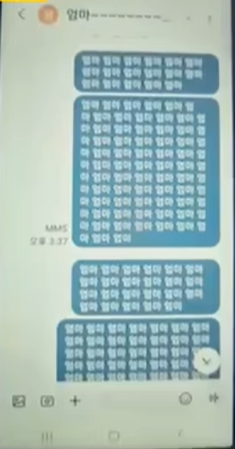
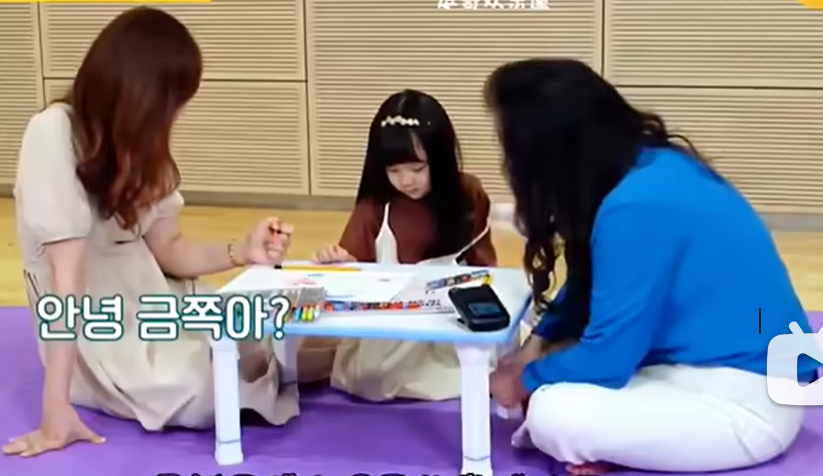
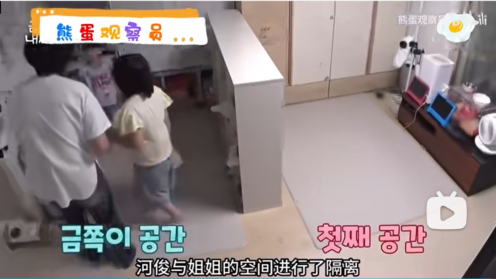
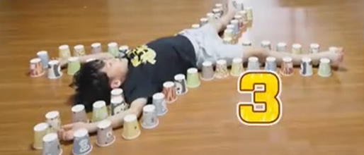

### 养女家学之道

编辑于2026-05-14 07:14

#### [养女儿的真谛：从"保护"到"训练"的思维革命](https://zhuanlan.zhihu.com/p/2027346815482172003)

普通父母以为给女儿最好的物质、教育和保护，把她养成公主，就是成功的培养。但现实往往事与愿违，这样养出的女儿可能轻易被花言巧语拐走，或在复杂社会中不堪一击。核心问题在于：只教了"优秀"，没教"生存"；只给了"公主待遇"，没给"公主心智"；只展现了"美好"，没让其见识"阴暗"。而传承数代的家族，其养女核心逻辑是"训练"——在安全环境下，让女儿从小接触真实世界，经历小范围挫折、被拒、欺骗，然后在父母指导下复盘。因为只有经历过"小坏"，才能识别"大坏"；只有吃过"小亏"，才能避开"大亏"；只有在父母眼皮底下摔过跟头，将来才不会在别人面前摔得粉身碎骨。普通女儿第一次被骗可能是感情与青春，而上流家庭的女儿第一次被骗可能只是几百块钱或一次机会，前者是"事故"，后者是"经验"。

#### 善良必须明码标价，不可廉价施舍

永远不要只教女儿"善良"，要教她"善良的定价"。普通母亲常告诫女儿要善良、感恩、助人，而明智的母亲会告诉女儿：善良很贵，不能随便给。你的善良要有门槛、有价格，要让对方付出代价才能得到。不是谁对你笑一下或说几句好话，你就要掏心掏肺。善良应留给值得的人，判断标准有三：对方是否在你需要时帮过你？在利益冲突时是否让过你？在背后是否维护过你？若无，请收起善良。无数女人一生的亏，就吃在"善良没有门槛"上，见谁都帮，最终养了一群白眼狼与吸血虫，自己过得一塌糊涂。

#### 身体是核心资产，从小建立管理意识

你的身体是你最重要的资产，从小就要有"资产意识"。这并非物化，而是现实。明智的家庭会教女儿：你的身体很贵，不是随便什么人、场合或关系都能靠近与给予的。教育方式不是恐吓式禁止，而是用资产管理逻辑：身体是最重要的核心资产，管理方式决定其未来价值。你可以选择现在"消费"它——随随便便给出去，换几句好话、小恩小惠或短暂关系；也可以选择"投资"它——留给值得、有能力、愿与你共度一生的人。普通家庭常让女儿对"身体"感到羞耻，导致其要么过度保守，要么过度放纵；而明智家庭的女儿，懂得如何保护、经营并发挥其最大价值。

#### 识人辨物，比独善其身更重要

教女儿识人，比教她做人更重要。普通家庭侧重教"做人"——礼貌、懂事、谦让、忍让；而明智家庭侧重教"识人"——谁值得交，谁必须防，谁可利用，谁必须远离。因为做人是自我要求，识人是判断世界。把自己炼得再好，不会识人，最终也会被利用、消耗与榨干。如何教识人？从小带女儿参加社交场合，让她观察不同的人，回家后复盘：那人说话时眼神如何？对服务员什么态度？提到某些人时表情怎样？这不是八卦，而是训练她的大脑形成本能的"识人系统"，让她在几秒内判断一个人是否靠谱、有诚意、值得交往。这种能力，完全是练出来的。

### [经常打的孩子，长大后不是自卑，就是冷血](https://www.bilibili.com/video/BV1SsGMzHE43/)

维斗终古

经常打的孩子，长大后不是自卑，就是冷血。女孩前者更多，男孩后者更多。
别男孩小时候没表现就以为没事，等人家决定拔氧气管的时候，你想哄已经完了。
现在条件好了，都是文化人，已经不是以前的土孩子了。有学识的人，特点就是士可杀不可辱，基本都是吃软不吃硬的。
你给现在的孩子来硬的，很容易直接用自杀去报复。如果扛过了小时候，并不是就不会如此极端了，而是他能杀的不只是自己了。
2025-07-13 11:52 👍4

### [离开家从不主动联系父母---回避型依恋！](https://www.bilibili.com/video/BV1bJ4m1u7x1/)

#### 回避型依恋的形成与特征

离开家从来不主动联系父母的人，就处于一种被称为“和平依恋”的状态。这类人有个显著特点：生活特别独立，但这种独立并不是源于获得足够的爱与安全感，而是因为失望，被迫独立。他们告诉自己要成为理性、独立、冷漠的人。因此在亲密关系中，他们很难与他人深交，遇到困难会自动回避。这一切的根源在于幼年时期遭遇过太多打压、贬低甚至嘲笑，内心因此充满恐惧与担忧，性格逐渐变得敏感、脆弱、胆小、不自信。长期的恐惧感还会对大脑造成持续损伤，影响其正常发育。

回避型的孩子往往比同龄人更迟钝，这种迟钝并不是愚笨，而是反应速度没有同龄人快。他们在感知冷热、饥饱等方面会迟缓，思想变得死板，思维也比较直。因此，当同龄人走进人生下一个阶段时，他们还不知道自己要什么，也不会主动去争取机会和表现自己，这限制了他们的事业发展。只有在潜意识里觉得自己是安全的，才能安心学习、专注做事、静心谋划。然而回避型的骨子里不安全感一直在阻碍他们突破。

此外，回避型性格相对懦弱，源于童年长期的打压，导致他们长大后产生心理阴影，觉得自己不如别人，不相信自己能比别人强。绝大多数回避型都善于压抑自己的情绪和需求，表面情绪稳定，内心却一直破碎。这也是他们长大后不愿回家、不愿与父母亲近的原因。早年原生家庭父母从未关注过他们的真实感受，迫使他们关闭感受渠道，屏蔽父母的贬低，否则无法生存。为了适应这种环境，他们必须培养钝感力，让自己麻木一点才能活下去。

#### 回避型依恋的行为表现与自我保护

长大后，几乎所有回避型的人都有些“自我”，听不进别人的意见，在职场里常像个“神隐”的存在。如果你在日常中遇到那种木讷、说话直、没有情商的人，不要嘲笑他，这其实是一种自我保护机制，是他长大的铠甲。因此，长大后他们的潜意识依旧迷信这种保护机制，用它来对待人际关系和生活。

在亲密关系中，回避型的人也不会主动联系伴侣。你给他发消息，他会热情回应，但你不联系他，他不会找你。他们把“钝感力”延续到生活的方方面面。如果有人指责他们，他们会反驳“关你什么事”。当伴侣有过多情感需求时，他们也会冷漠地说“每个人都应该有自己的空间”。然而如果你对他说“你这样独立背后一定吃过很多亏”，他反而会绷不住。因为触动这类人的从不是持续的指责和打压，那只会让他们持续回避；真正能触动他们的是真诚和温暖。

有人可能会说，自己小时候也被打压过，但长大依旧和正常人一样，那是因为你遭受的打压没那么严重。如果真遇到恶劣的打压，你多半也会成为这样的人。

#### 走出回避型依恋的办法

如果发现自己已经是“回避型”了，该如何破局？你得先把心打开，看见自己内心的恐惧和担心、委屈和怨恨、迷茫和焦虑。这些都是导致你停滞不前的阻力。如果不知道怎么做，可以通过学习疗愈课程，把“内在小孩”重新养大，建立安全、富足、强大的内心世界。那些原生家庭没给你的爱，长大后可以通过学习自己给自己。不要期待别人来改变，改变自己才是更容易的途径。

我是雨辰，如果你有情感或心理上的困惑，每周三到周天的中午11点到下午两点，欢迎来我的直播间。

#### 高于常人的察言观色能力与共情能力

桑习小白

正确了一部分。我也是回避型的，但在父母长期贬低与打压的情况下，我锻炼出来的是高于常人的察言观色能力与共情能力，不存在情商不在线的情况，只可能我们愿不愿意把情商用在某处。至于自卑，在中学时期我就意思到自己的自卑，不断的在调整自己的心态。参加工作后基本完全放平了心态
2024-06-30 10:16 👍246

太平张角

回避型人格反而特别擅长察言观色，因为从小到大一直在做这个事情，他们谨慎多疑，冷漠，跟父母朋友都是在逢场作戏，看透人性，活的很累。
2024-07-17 13:35 👍149

#### 很讨厌自己迅速切换面具的能力，不能坚持做自己

YN老张

 打小就会察言观色，现在32了，很讨厌自己迅速切换面具的能力，不能坚持做自己，就八面玲珑后遗症。。自适应环境变化性格，但冷眼旁观跳出来靠自己总感觉自己像个小丑。反而羡慕那些盲目自信，自我为中心的人[大哭]
2024-07-12 08:40 👍15

桑习小白

 回复 @YN老张 :我也是不断切换面具，但我觉得这就是我，我的面具都是下意识切换的，说明我潜意识觉得这样会让我现在的环境更舒服。只要保持互相尊重，善良就够了。然后最重要的是，当有人不知好歹不断碰撞你底线时，一定要敢于拒绝和反抗。
2024-07-12 10:01 👍1

#### 钝感力和自我保护机制

过期笑语

前半部分都蛮客观的，还有大家不要误会这个迟钝和反应力慢，这个和智商无关，而是后面说的一种钝感力和自我保护机制。但是其实也不一定就是会发展成愣头青低情商的，我觉得共情能力也是一个重要因素，虽然你可能对一些事情一下子做不出反应，但是你可以感同身受的话也是不至于变成低情商的
2024-06-24 01:34 👍705

### [父母双全的孤儿是什么样的？](https://www.bilibili.com/video/BV1RS411P7vY/)

#### 失望性情感隔离的心理特征

没有避风港的人，不期待回家的父母双全的孤儿，他们往往具有一种“无言”的特质——父母觉得无法依靠，对自己的亲生父母没有亲人的感觉，对家里也没有太多牵挂，绝对不会想家。哪怕遇到委屈，也不愿意与家人分享，十分抗拒分享这件事。在心理学上，这种现象被称为“失望性情感隔离”。这类人与父母缘分浅，感情生活往往不顺利，很难找到合适的伴侣，要么被欺骗，要么因为同情而去爱。

失望性情感隔离往往源自童年的创伤。创伤越深，对制造创伤的父母就越失望，从而对感情也越失望。比如从小被父母输出大量负面情绪的孩子，他们只能被动承受。即使回到家，也不想与父母交谈，无论好事还是坏事都不会分享，因为他们知道父母不会帮忙，反而可能冷嘲热讽，于是只能依靠自己。

#### 童年创伤与人格防御

有些孩子长期面对父母的“完全缺席”，比如留守儿童，他们对父母的期待一次次落空，最终彻底失望。这类人在觉醒之前活得很累，当别人努力工作赚钱时，他们还在和童年的创伤抗争，能量不足，容易“躺平”，一事无成。

还有的孩子经历过长期被指责、打压的家庭氛围，父母本身负能量爆棚，还拉着孩子一同承受。父母一开口就是评价、指责、审判，像一个情绪黑洞，把孩子的精气神吸干。明明可以好好说话，却非要阴阳怪气、讽刺挖苦，而且不允许孩子反抗。孩子为了保护自己不至于崩溃，只能把真正的情感隔离起来。

他们心中常有疑问：为什么别的孩子有父母疼爱，而我没有？当这样的孩子长大，意识到父母的行为极其自私，就会产生一定的觉醒——明白自己值得被爱。但骨子里的“不配得感”已经形成。童年匮乏的爱让他们成年后也极度匮乏，骨子里渴望被爱，却又难以接受来自现实的情感滋养。

#### 成人后的情感困境

这类人与父母的关系常常“有父母如无父母”。对于失望性情感隔离的人来说，越是冷漠艰难的环境，他们反而能处理得很好，因为他们早已形成一套自我生存法则。然而，当别人试图给予他们爱与温暖时，他们反而不知所措，甚至想逃，因为他们不习惯被爱。

即便父母后来想要弥补，他们也会觉得不适应，不想再给机会。之前的创伤有多深，现在的失望就有多深。表面上他们父母双全，实际上内心却是孤独的孤儿。当父母试图弥补时，他们甚至会感到愧疚，因为隔离机制早已形成，无法做出回应。最多能做的，是用金钱去弥补。别人可能觉得他们“没有心”，其实他们的内心早已被冻结，除非遭遇极大的情感波动，否则难以再感受热量。

#### 走出隔离的关键

靠父母是无法治愈这种创伤的。但这类人往往容易被情绪热烈、焦虑型依恋的恋人吸引，因为那种强烈的情感能唤醒他们被压抑的情绪。虽然这样的关系有可能带来治愈，但真正的疗愈并非来自他人，而是来自自己。

可以这么说，这类人表面无懈可击，只有从内部才能被击破。唯有自己，才能让自己走出创伤，重新接受外界的温暖。如果你发现自己也有失望性情感隔离，不要责怪自己，这并不是错。你可以选择把缺失的部分一点点补给自己，降低对他人的期待，提高对自我的关注，慢慢地，这种状态就会好起来。

### [讨恩是债，施恩是仁](https://www.bilibili.com/video/BV13CVPz2EsC/)

一个企业家说我妈妈是最好的投资者，这种话不能讲。父母爱孩子是本分，不能参杂利益。

舒克_____

含章之美，讨恩是债，托举是恩
2025-05-04 20:50 👍143

Letitrot_

 真是愚蠢，你压根没看懂曾老的意思。讨恩是债，施恩是仁。有些话确实从父母说出口就变味了，孩子需要的从来都是引导，而不是灌输你的恩德，你的付出，这本来就是你作为父母的义务，因为孩子从出生可没得选，没得选是否出生，没得选父母是谁。如果孩子出生在一个好的家庭，健全人格，有爱的孩子自然会孝顺父母。孝顺从来都不是以强制灌输“你得孝顺，你得养我”的观念，这样做只会让孩子反感。你所说的，所看的所谓不孝顺的事，人都是如此，我敢说绝大部分这样的不孝顺父母绝对是有问题的，孩子的善恶都是父母作为的因而结的果。
2025-05-06 15:56 👍4

jrhan86

 没用的...只求本分发自内心就不会出现普遍那么多养儿防老的父母
2025-05-05 20:54 👍8

紫气东来君主

没用的...只求本分发自内心就不会出现现在越来越多不孝敬父母的...看到很多多地老人都是老年行动不便，即使有多个子女也不照顾老人，老人凄惨离世的...讲本分没用的，特别是现在世风日下，国人大多都是自私自利逐利心态....如果都能讲求对等回报也挺好，父母悉心付出照顾你十几二十年，供养你几十年...哪怕父母最后几年行动不便无法自理，你能陪伴悉心照料几年...世间也就不会出现那么多晚年凄惨的老人...
2025-05-05 11:31 👍15

### [李玫瑾教授：孩子犯错后，不要打孩子，这种方式最有威慑力](https://www.bilibili.com/video/BV1T4411y7h9/)

#### 瞪眼威胁+私下原因解释

如果父母能控制自己尽量不要动手，要动手之后一定要道歉。

动手了，孩子觉得平了这件事，反正你动手了，你还想怎么地。而且他知道你的底线，你大不了再打我一顿。他知道反正你不能打死我。

无言自威，当孩子做错，盯着他一分钟。此法叫长目光，警告+威胁，长时间注视他会觉得难受。人多的时候，他有一个尊严问题，就不要有其它动作。

两个人私下的时候，就叫他解释一下为什么这样，你可能不是故意，或者是故意的，如果是故意的，说一下原因。

我妈就这样，所以我妈一般不发火，一发火眼睛一瞪我都不敢动了

#### 不是冷暴力

斯科皮埃斯

这不是冷暴力？
2019-09-13 00:23 👍6

账号已注销

这不就是我爷爷的教育方式吗[尴尬]，就是李玫瑾教授视频之中所说的不言自威；听我奶奶说过我爷爷这个辈子从还没有动手打过任何一个孩子。父辈们及孙子辈们犯错误从来都不说话就是给你一个眼神，这个眼神中接受到具体的信息，带有警告的意思，严重点咳嗽一声，等行为停止后，在没人的时候单独叫你过来沟通，解释一下刚才为什么这么做的行为跟原因；指正错误后就警告不要再犯第二次⚠️这种方法确实非常奏效，小时候的父辈们和孙子辈们都特别害怕我爷爷生气，但一家人也都特别尊敬我爷爷。平时也对每个人还是很宠的，一碗水端平从来不偏袒任何一个人。
2019-10-04 18:47 👍43

小灰子1135

 关键一点是长目光之后还给解释的过程。
相比冷暴力而已，语言眼色都带有攻击性且不你给解释机会。例如哥哥不小心打碎杯子，母亲却对弟弟说：“你以后别学哥哥这样做，别跟他学坏了。”
2019-09-25 01:44 👍3

### [【超级育儿师】管教熊孩子(第一季)](https://www.bilibili.com/video/BV1is411S7iX?p=3)

https://www.bilibili.com/video/BV1is411S7iX?t=1185.5&p=3

妈妈和邱天沟通的时候，居然靠贿赂。

你们要注意给她提要求的时候，你们刚才是给她商量的语气。

以后没有奖励她不就不过来了吗？

因为觉得外婆无条件服从她不需要尊重外婆

对，就是外婆对她太好了

#### [你需要好好和大家说话，你刚才叫嚷嚷了。](https://www.bilibili.com/video/BV1is411S7iX?t=1236.1&p=3)

#### [问题核心 爸爸与外婆教育理念的不同](https://www.bilibili.com/video/BV1is411S7iX?t=1646.6&p=3)

那外婆是不是会觉得，现在邱天的这种状况。其实和您没有直接的关系，由于他们自己陪得少了。但是现在大家又觉得您做得多，外婆这样会觉得很委屈吗？

外婆：不委屈，邱天实在是有一些问题。我还是后退吧。

外婆这样累也跟她太过宠爱孩子有关

看得出来外婆私下还是比较强势的

#### 我觉得你不是不喜欢运动，而是怕自己不如别人。

其实最后一名和第一名都是你参加了之后才知道，但中间这个过程很重要，你想想你画画是一开始就画得好吗？

女儿：不是，我以前画画很差的。我每天都在家里画的。

育儿师：对啊，所以我们运动也是一样的，所以每天练习就好了。所以我们不怕。

#### [包饺子 溜冰都是评比](https://www.bilibili.com/video/BV1is411S7iX?t=2047.9&p=3)

不应该比较的，我带我弟弟妹妹都是玩，有时还看谁做的比较怪

小孩胜负心强就是因为外婆在平常生活中要比来比去

比较的心态真的太不好了，磨灭了这过程中的乐趣和收获了

外婆也是无聊 无端端评比什么 直接赞赏孩子的行为不就够了

小孩子太好赢 一直都是不能输的心态 也不能让别人指出她的不足之处

本来很高兴的事情，突然扫兴

辛辛苦苦包了半天，在小朋友里面已经很棒了，还要和妈妈比，真让人伤心

为什么非要去比赛呢……就简单包个馄饨，能包多少包多少啊

不要以结果来评价孩子，我们会把评价的重点不是放在说谁包得更好。而是在这个当中每个人，克服了自己的什么弱点。

外婆经常下意识来评比，“最棒”“最好”的词汇还是少一点比较好

我觉得妈妈像是姐姐，而外婆先是妈麻的母亲

#### [弹琴 好胜心](https://www.bilibili.com/video/BV1is411S7iX?t=2690.8&p=3)

幼儿园就开始学琴。。这孩子其实挺厉害的，好胜心强的什么事都很想做得好

我七岁都考了电子琴八级了，五岁学琴很早吗？

他浮躁主要是因为并不喜欢音乐，喜欢的只是自己被赞美的感觉

就是害怕练琴的时候别人评价，就很烦不想在家里练这样

#### 你自己不能独立完成，那也没关系

告诉爸爸是怎么样，我是不熟练。是不熟练是吧？不是不会弹是吧？只不过是不熟。

如果在家里觉得，家里没有人能帮助你。你自己不能独立完成，那也没关系。那今天就先不要弹了，但是明天上课的时候。你能当着老师提出来，我叫老师重点帮你再复习一下。明天我回来我要问的。

爸爸总体做得不错。可能之前在家没发言权

就是说，你不懂的地方第二天问老师。这样让她意识到，所有的事情是需要她完成的。爸爸只是给她建议。

#### 成就动机特别强

面对邱天这种成就动机特别强，那我们现在需要做什么。

解决强烈成就动机
第一 关注过程

我们要赞扬她，你在中间做了很大的努力。

第二 要去赞赏她的突破

这是你第一次做这件事，你做得真好。

所以她在面对成败的时候，会变得容易一些。

这孩子该做的都做得很好，所以并没有必要拿淘气椅

这孩子就是被惯的，让她学会独立就好了，需要用什么淘气椅啊？

#### [蛋糕画画](https://www.bilibili.com/video/BV1is411S7iX?t=2877.7&p=3)

爸爸：把巧克力酱熬好，灌在这个笔里面。然后你在这个盘子里画画写字

女儿：你来画吧

妈妈：没关系啊，画错了再换一个盘子好了。

爸爸：我们有三块地方，我们一个人画一块好吧。

女儿：这是个好主意

我特别想知道，为什么要给外婆做这个蛋糕啊？

生日礼物

借这个机会表达一下我们对外婆的谢意，谢谢外婆这么多年来对我们的照顾。

外婆为了这个家庭付出了这么多。

老人就是这样 儿女的事 孩子的事 不能干预太多

爸爸不是要当局外人，已经提过两三次了，怕家庭矛盾

外公也没有哈哈哈哈哈哈哈

#### 评论

无罪之空

确实得注重教育，我以前就是被我爸打大的，什么也不管我，以至我性格很温和，小学的时候遭受了6年校园暴力，而且我的老师也参与过，拿我开玩笑，随便打随便踹，我和老师说要上厕所，结果他不让，那天我肚难受，结果就拉裤了，后来他还和我妈说我没和他说我要上厕所，以前还被人威胁过钱，还有很多发生在我身上的校园暴力就不多说了，当时我一忍在忍，忍成了tm的抑郁症，我本该是一个中上生，本该现在上了高中，以后做警察，结果呢？我啥都不敢和别人说，就是我的家人我都不敢，被他们活活打怕了，说什么都不对，做什么都是错，劝导他们被叫多管闲事，以至于当时我**我天天撸天天撸，真的那是我觉得最舒服的时候，当时真的太难受了，只能从那寻找到一丝温暖安心的感觉，觉得我变态?对我是变态，那也他妈是他们逼的!我没疯已经够可以的了，每次他们把我骂了以后都说是开玩笑，我当时连真假话都分不清了，后来我锻炼了以后我才把那些骂我的全收拾了个遍，****世界
2018-07-15 23:48 👍168

### [【超级育儿师】管教熊孩子(第一季)](https://www.bilibili.com/video/BV1is411S7iX/)

纳米1岁，小米5岁。

#### 没有称呼过爷爷奶奶，喂

我发现她没有称呼过爷爷奶奶，她都是喂

#### 先宠坏姐姐 再偏心妹妹

宠坏了，但是有了老二家里对老大关心太少了，以后老二也会这样把…教育问题

两巴掌这孩子就毁了，要么会变暴力打人，要么懦弱缺乏安全感

钻桌子底下吃饭，退行性行为，孩子为了关注。

其实就是偏心，看到后面就知道了

小米吃饭随心所欲，毫无规矩。

#### 小米也想要抱抱。妈妈只能抱一个

刚才能看出来，小米也想要抱抱。妈妈只能抱一个

小米想让妈妈抱，但是妈妈却选择了只抱一个

先给大女儿一个拥抱，再抱小的

可以理解吧……小女儿确实讨喜，再说妈妈也问了大女儿吃饭没有啊

小孩子中午必须睡觉，保证充足的睡眠

看地区 香港那边的小孩在中班左右就不午睡了 

#### 教育孩子不要很多人一起教，而且不要互相干涉

教育孩子不要很多人一起教，而且不要互相干涉

这样是最糟糕的，孩子就分不清到底谁是对谁是错

真的，公公婆婆插手这个问题真的不知道怎么办，说他们他们也是顽固不然就生气

我是一个有弟弟的姐姐,从小到大听到的都是你大你应该让着小的，东西给弟弟吃的给弟弟什么都要给弟弟

#### 对小米的评价的好和坏，只建立在妹妹高兴了还是哭了

这是谁的礼物啊，纳米的，纳米玩高兴了再给你。

妈妈对小米的评价的好和坏，只建立在妹妹高兴了还是哭了。

玩的高兴再给姐姐，我哭了，真的好熟悉

“谁的东西谁说了算啊”去您喵的

#### 这是妹妹的东西

虽然本来就是妹妹的东西，但听到这么说还是会委屈的

这就是妹妹的礼物啊 妹妹的东西

根本就没抓住重点，重点是那是妹妹的东西，她们一直在强调妹妹哭了

#### [小米向爸爸告状](https://www.bilibili.com/video/BV1is411S7iX?t=920.3)

我觉得爸爸他至少应该是说：“哦，小米，这样做是错的。”所以全家人都给我的感觉是，在开玩笑的过程当中，看见了一件不该发生的事情去发生，然后又用一种哈哈笑的这种状态去接受了她。

父亲未能给孩子营造正确的对待妹妹的态度

其实这些问题真的很难平衡，把玩具给姐姐妹妹哭，给妹妹姐姐又委屈

#### 唯一的奖惩手段就是忽视、不理，讲道理呢？

我爸就是 永远是在开玩笑 要么就装听不见

爸爸："好，走，洗手去。不要那你就不要来吃饭。反正我吃饭了，你不用管，让他呆着吧。"

唯一的奖惩手段就是忽视、不理，讲道理呢？

#### 五岁的孩子应该九点前睡觉

五岁的孩子应该九点前睡觉。他们需要保证充足的睡眠，因为它们需要长身体。

#### 她晚睡是因为她可以独占父母的时间

爸爸会用一些很激烈的游戏在和小米在玩

我感觉她晚睡是因为妹妹睡了不在了，只有这个时候爸爸妈妈才会不冷落她

很明显，这段时间是她可以独占父母的时间。会早睡才怪。

晚上玩这个游戏，只能让她更兴奋，不利于孩子快速入睡

十点了，小米还在往外跑。她还是没睡觉。

#### 夸奖爸爸回来和孩子玩

两个孩子实在是太可爱了，而且看到爸爸回来还会和孩子们在一块玩，这些都是非常非常好的地方。但是我们从很多的环节都在看到，小米在试图控制。是的是，孩子姐姐是这样。你们认为小米的这种控制还会给他带来什么其他的害处吗？她会太任性了，然后呢觉得她有的时候可能会有点走极端。还有呢他就会挑战父母的权威，感觉。还有呢想不到。

#### 小米不断地在推让纳米 没有一个明确的态度，你们没有说对还是错

没有任何一个人可以永远是第一的，对对也许是小米无意识的嗯。但是这件事情是需要我们注意的。小米不断地在推让纳米，这个让我觉得很可怕。你们没有一个明确的态度，你们没有说对还是错。那小米怎么才能从你们两个人的态度上去判断我的行为呢？

#### 小米因为行为都是为了别人 无本能爱

小米对纳米的影响，纳米对小米的模仿，这个实际上是我最担心的。你们已经把小米和纳米两个人分开了。在这个家庭里面，我最同情的人是小米。你们表扬它的过程都是建立在"小米你做得真好，你让纳米开心了"。如果是我，我都要疯掉了。我做的所有的一切都是为了别人。

那种本能的爱没有了，他才会去嫉妒。也正是因为如此，小米才一定要拿第一。

我和我姐基本没怎么吵过，唯一吵架的原因就是我一直粘着我姐

#### [家庭规则](https://www.bilibili.com/video/BV1is411S7iX?t=1278.0)

第一条规则是爸爸妈妈必须要做决定。一个家庭当中应该有这么一个，谁说了算就听谁的。

第二条呢就是我们不要有任何的肢体冲突。不能咬人，不能打人，不能推人。不能去吓人啊。

第三条就是一定要学会分享纳米的东西。有一些姐姐是可以玩的，对不对？

第四一个，每个人在没有吃完自己的饭之前，不要离开座位。我们所有的人都需要做到。

她不离开座椅，就是真的是现在就这么两天就不可能的，绝对是不可能的。

第五条是下午四点以后就不能再吃零食了。

第六条，每个人需要在规定的时间内睡觉。既然这个要求是所有人都要做的，那我现在需要大家给我一个确认。我希望上面每个人都能签上自己的名字，贴在墙上。

#### [淘气椅](https://www.bilibili.com/video/BV1is411S7iX?t=1382.0)

其实惩罚的第一步是你们需要有明确的态度，就是用一句很短的话告诉他"你错了"。然后呢就这把椅子啊哈哈，我们给它取名字叫做淘气椅。

第一步，当孩子有一个不太合适的行为的时候，你需要警告他。

第二步

然后我送给你一个道具计时器，你需要告诉他在椅子上做多长时间。每长一岁就一分钟，比如说如果是小米的话，那就是5岁，5分钟。

第三步

当5分钟时间到了以后，你过去。然后你说"我需要你说对不起，我以后不这样了"。当她说完这些以后，

第四步

你抱抱她，然后亲一下她。一定要说一句"妈妈相信你"。"这个给你好，谢谢。"

其实我觉得可能和我以前的方法差不多，所以我保持这种怀疑的态度。

这是惩罚机制。有了惩罚机制就不会随便犯错，也不存在什么“觉得对不起是随意的事情”

这不就是照搬国外吗/还没抄到点子上

#### [惩罚](https://www.bilibili.com/video/BV1is411S7iX?t=1485.2)

"妈妈现在警告你一次，如果下次再对妹妹大叫，我们就会在淘气椅上坐5分钟。好的。"

"哎呀这咋打骂你了？爸爸一会嘴巴子。我们是不是有一个规则说不能发生肢体冲突啊？"

应该是不能打人，而不是说不能打妹妹

惩罚过程中，如果孩子违反规则，需重新计时。x3

孩子还在哭说明自己的调节还没完成啊

先安抚吧

小米：“我以后都不会这样子欺负妹妹了。”

育儿师："真的好。然后妈妈相信你，然后这个时候再抱他。"

#### [晚睡纠正练习](https://www.bilibili.com/video/BV1is411S7iX?t=1626.3)

重复狠心抱她回去睡觉，不说多余的话。

留孩子一个人在那么黑的房间一个人睡…

已经养成很晚睡觉的习惯现在很难改

第一次睡觉就没有过渡，这是恐吓孩子。要有孩子能接受的过程啊。

我们以前就是花很长时间，还要再做一个小时甚至一个半小时的斗争。

必须刚柔并济，育儿师很专业

很少很少，爸爸刚才眼泪都快出来了吧。是啊，我这种哭是真的哭，她不是撒娇都哭，能听出来的。

这个时刻有点像第一次送小米去上学的感受，就是你让她成长，你自己也要承担一些伤痛。

学前教育的表示这里面所有的做法都是学到的正确做法

#### [释放育儿压力](https://www.bilibili.com/video/BV1is411S7iX?t=1924.7)

正确释放情绪啊 为什么要压抑

#### [修复和小米的关系](https://www.bilibili.com/video/BV1is411S7iX?t=1929.7)

有了这样的一个突破之后，我需要他进行第二次突破。这个突破就是他需要去修复和小米的关系来。

#### 你要去猜她的感受 是不是妈妈跟纳米玩的时候，你觉得妈妈只爱妹妹呀

"小米，妈妈问你看着妈妈。妈妈问你，妈妈在抱娜美的时候，你怎么想的？嗯告诉妈妈。你这样不说，我不知道的。是不想谈啊？那我们就谈点高兴的事不行？继续这个话题需要继续。"

"这把你猜测她为什么会伤心？那你是不是不喜欢妈妈抱她？是不是你也喜欢妈妈抱着你呀？小米你要看着妈妈的眼睛。你不想让妈妈抱他是吗？那妈妈能跟娜美玩的时候，你高兴吗？不高兴。"

"你要去猜她的感受，你还是没说。加油。是不是妈妈跟纳米玩的时候，你觉得妈妈只爱妹妹呀？"

"呵，妈妈觉得你长大了。可是纳米很小，她更需要妈妈的保护。不会因为蜡笔很小，妈妈就不爱你了。知道吗？"

妈妈是很爱很爱你的，知道吗？

妈妈没有不爱姐姐啊，只是纳米太小了会先照顾她啊。

#### 需要一次敞开心扉的机会 表达爱

说无声无息改变的，矛盾积累到这个程度，就是需要一次敞开心扉的机会，把事情说开了

妈妈可能以前处理得不好，但是我希望小米可以给妈妈一次机会。你们都是我的女儿，我两个都很喜欢的，知道吗？

这一刻她已经意识到妈妈是这么的爱他。"你现在也要抱我了，我需要你两个胳膊抱住我。"

孩子做得非常好，看到小米这样真的很开心。我觉得这个谈话太重要了。

#### [只做规则，无心理上的弥补，小米不会去听你的](https://www.bilibili.com/video/BV1is411S7iX?t=2208.8)

我们最希望解决的问题是小米，但是我们会发现小米的问题不是他的行为，而是他内心的需要。如果我们只做了规则，但是没有心理上的这种弥补，那小米绝对不会去听你的。

#### [控制好胜心](https://www.bilibili.com/video/BV1is411S7iX?t=2268.2)

"是爷爷赢了吗？我们要说出来是谁赢了，那才是谁也赢。嗯很好，我们给他鼓鼓掌好不好？诶，鼓掌。"

你只有当小米的内心情绪得到释放，才有可能用规则、用乘法、用奖励来帮助他行为上的改善。

我老师说 从小和孩子玩游戏 大人要先输 然后开始有输有赢

不能让孩子学会耍赖皮

小孩子真的要好好引导 真的不知道哪句话就影响了他的价值观啊

#### [吃饭行为纠正](https://www.bilibili.com/video/BV1is411S7iX?t=2292.4)

但是这些规则都是针对小米不针对其他人啊

这样是否只针对了孩子 规则应该大家一起遵守的

"好在吃饭之前妈妈要宣布一些规则。第一，吃饭的时候一定要用筷子。我都知道了。第二条是吃饭的时候不能离开饭桌。如果违反了这两条规则，就要坐在淘气椅上接受惩罚。好吗好？那我们开始吃饭了。"

"看着妈妈，刚才我们已经说好了，第一条规则就是要用筷子。妈妈现在警告你一次，如果再这样的话，我们就要去淘气椅了。"

"妈妈他没眼睛用手掏。那你还不会用筷子。等一下吃饭的时候要好好吃饭。小米赶快吃饭，别玩了。慢一点全都咽下去，再离开饭桌。"

"今天真不错，我们把所有的饭和菜都吃完了，对不对？我觉得小米真棒。只要你定下了规则，其实小米是能够按照规则去做的。"

教好了让爸爸洗没关系的 我到幼儿园大班都还是爸爸帮我洗 也一直知道不能让男生随便碰

#### [爸爸睡前讲故事](https://www.bilibili.com/video/BV1is411S7iX?t=2406.8)

哪里早啊 五岁小孩正常就该八点左右睡觉

#### 两个孩子争斗时，父母应该怎么办？

A. 大的要让着小的
B. 公平判断对错
C. 不发表意见，孩子过一会就好了

#### [回访 小米吃饭时唱歌 不在家庭规则之内 小米就会觉得爷爷奶奶是不遵守规则的](https://www.bilibili.com/video/BV1is411S7iX?t=2730.0)

完全把淘气椅当成了一个惩罚的工具，忘掉了淘气椅的目的是什么了

可以跟她说唱的很好听，吃完饭唱给大家听

"然后呢有一天吃饭，小米在哼哼'小米吃饭'。不要唱歌。除了你记住了没再唱就做淘气椅前。从现在开始，因为这个吃饭的时候不能唱歌这件事是我们之前没有说过的，那是小米不知道的。"

"那如果总是这样的话，小米就会觉得爷爷奶奶是不遵守规则的。那应该怎么说呢？就是当时就说'小米吃饭的时候不要唱歌，如果你再唱，那就要惩罚了'。一下就好了是吧？"

"先需要让她知道，不让他感觉就是什么都惩罚了。"

##### 正确的表达方式：

就是当时就说小米吃饭的时候不要唱歌。如果你再唱，那就要惩罚了一下就好了是吧。

#### [惩罚变为工具](https://www.bilibili.com/video/BV1is411S7iX?t=2796.6)

如果没吃完就要去做淘气椅了呀。没有2分钟我就完蛋啊。

孩子的一些行为是需要通过惩罚强化的

不是说饭桌上不能教训孩子吗

我之前就是父母让我练电动车我没劲还摔了，他们说我笨还骂我，现在我就反感练车，何况一个小孩呢，会反感吃饭的

为了惩罚而惩罚

#### 过分苛责 只是晃脚

对于淘气椅的使用，妈妈还是掌握了基本的原则。但是是大人不拥有随便定规则、毫无节制地定规则的权利。如果说小米并没有挪动那个椅子的位置，它只是在上面晃一晃，我们提前如果没有说过这个，那我们再把时间从头对小米是不公平的。

#### 惩罚对她无所谓了 表扬认可也有效 不要惩罚无限制地制定规则

我昨天就发现一个现象，就是他一听到铃声，他就笑了一下。但是我不能分辨，他是觉得"你看我就是能做5分钟"，可能她觉得这个东西对她已经无所谓的那种。取决于她后面的行为有没有改变啊。

对于他来说，还有比惩罚可能更有效的就是表扬，就是认可。不要认为规则有效，就是无限制的去制定规则。这种错误不能再犯了。

#### 评论

AAA象牙山永强果园种植

p1看的我太难受了。我五岁的时候我弟弟出生了，那个时候我根本没多想什么，一年两年就那么过去了。他三岁的时候开始皮，那个时候我渐渐觉得家里人都喜欢他不喜欢我，等到我11,12岁的时候他开始破坏我的东西，我心心念念好久的玩具拼好了上好色小心翼翼的放在那里摆着，他给我拆了，还拿着水笔在上面乱涂乱画，我看见的时候眼泪一下子就崩了，我妈在一边说“一个玩具坏了就坏了你弟碰一下能死啊，他是你弟你得让着他。”就因为这句让着他，我讨厌他到现在。这种情况不是一次两次了，甚至在我弟弟把我的金丝熊拿在手里不小心摔在地上然后用遥控汽车轧过去死掉了也让我让着他...我根本没有想过［重男轻女］这四个字。有时候我妈跟我聊天不经意间说了我出生时我姥不喜欢我，她仿佛是在当笑话说，根本不考虑我的感受。我现在想起来从我断奶后她就不在我身边陪着我，把我扔在乡下和爷爷奶奶生活，从小撒野乱跑性格像个男生。我妈现在还说我什么时候能像个女生....17年我都是这么大大咧咧的过来的现在让我改？
2018-02-11 18:54 👍614

追光的怪孩子

 我就是，我爸妈都是那种情绪很不稳定的人。我很小就学会了看他们脸色做事，事事都要小心，因为我也不知道什么时候哪些事情就会惹他们生气。有时候可能只是因为五六岁的我出去玩了一天把衣服弄脏了，而那天刚好我妈又累心情又不好，就是一顿狠狠的打骂，是程度和事情严重性根本不匹配的打骂，就像是是在发泄她今天的不快。这种随机和不确定让我很没有安全感，甚至是委屈，但是我为了讨好他们安抚他们的情绪，我会乖乖认下所有“错”哪怕我自己知道我是委屈的，就是为了他们开心，可是还是避免不了打骂，因为大人上班生活总会有不顺心的时候。所以我现在长大了自卑，胆小，甚至本能地想远离他们。和他们在一起全身都是绷紧的，精神高度紧张，太难受了！这种长期的紧张状态让我体质很差，初中就发现xiong部有好几个纤维瘤，甲状腺有结节，还经常头疼、消化道溃疡……最后大学发现自己有抑郁症……我真的也很希望自己有个能够依靠的家，可是我的家会把我害死，我不得不远离它！
2020-03-26 22:15 👍20

是凯文儿鸭

我哥哥从小就特喜欢我，他比我大两岁，我还记得我以前还很不喜欢他，我也不知道为什么，他对我这么好但我就是不喜欢他，到小学三年级的时候，我开始跟他很亲近了，突然觉得哥哥真的对我好好，还记得初三的时候，有一阵天天跟他闹脾气，他就还是宠着我哄我，觉得自己这个弟弟被惯坏了😂现在我都上高中了，我哥还是这么宠我嘿嘿，我真的好喜欢我哥，能这么包容我，到现在他的压力比较大，我现在终于也可以帮他分担压力，他也会夸我说我长大了，想着想着就哭了，我哥真的好好[大哭]
2019-05-05 23:48 👍53

##### “保姆式”教育 老师很喜欢她，但同学不太喜欢她

颜值与小动作很重要

我妹妹，😂和我相差10多岁，因为，我比较横，父母从小教育妹妹要礼让长辈……包括姐姐。长辈吃饭不上桌妹妹作为最小的不能上桌，不能动筷。要对出门的长辈说再见。要给家人以及长辈洗水果……（我也要洗的，给父母及祖父母外祖父母）……
我妹妹如今7岁，洗碗洗菜拖地，收拾家务，帮出门的家人准备她能想到的用物。……一切动手能力。
如今，妹妹在学前班最后一年，学习很一般，但是……老师反应，热爱帮老师拖地，班级老好人，给低年级孩子喂饭。安慰有疲惫感的老师……老师很喜欢她，但同学不太喜欢她……
也不知道这样的教育是否正确。因为我小时候是被全家上下娇惯出来的，可以说……初中上学穿衣服有时候都是母亲帮的忙……
2018-06-11 22:33 👍41

### [【我金子般的孩子 混乱型依恋】女孩镜头前是乖巧女孩，镜头后竟希望抚养自己的外婆去死，外婆伤心委屈，但专家却说是外婆的错！](https://www.bilibili.com/video/BV1HE421F7Lh/)

而且刚刚在来录节目的路上，女孩也是要求外婆立马下车。外婆不明白自己是做错了什么，还是因为自己看着好欺负。所以一想到被无视，自己的语气就会变得粗鲁起来。

吴博士表示，女孩是否是耍赖的孩子，对外婆的行为是否符合这个年龄段该有的行为，取决于你怎么看。首先刚刚在吃饭的时候，女孩说讨厌蘑菇，因为陌生的食物适应口腔感觉需要时间。但外婆直接说女孩挑食，女孩回击强调不喜欢，这是符合他年龄段的反应。相反的哥哥说蘑菇对身体好，让妹妹用舌头先舔一下，这才是让人舒服的表达方式。

#### 咬指甲 嘴唇撕破，撕出血 为了情绪和心理上的稳定

而且正常四五岁的孩子都会说想和爸爸妈妈一起生活，但女孩是想和哥哥一起生活。所以吴博士很好奇，女孩是否有类似咬指甲的行为。妈妈表示有过，当她第一次看到女儿这个行为时，恨不得把她头砍下来。妈妈说，在拍摄前，女孩只有一半眉毛，有时也会把嘴唇撕破，撕出血。

吴博士表示，这些行为都是为了得到情绪和心理上的稳定。也就是说女孩现在是情感和心理有困难的状态。所以女孩内心到底有什么痛处呢？

#### 外婆的年代吃不上饭的艰难时期 无情感共鸣 外婆说的最多不行 拒绝式育儿

外婆解释说，自己和自己的孩子都是这么过来的。吴博士表示，外婆成长的那个年代正值吃不上饭的艰难时期，所以现在外婆对准备饭菜是很尽力的。但是从外婆的人生经历来看，外婆从未得到过情感共鸣，所以外婆育儿的方式是拒绝式育儿。

从视频中就能看出，外婆说的最多的就是不行。但女孩提出要出去玩的请求是正当合理的，合理的要求应该被接受。但是女孩提出的所有要求都被拒绝了，所以才会出现请求满足，想得到爱和关心的表现。

外婆表示，她也有自己的苦衷，因为孩子的衣服每一件都是手洗，要洗的衣服太多了才会拒绝。但其实五岁的孩子喜欢翻箱倒柜也是很正常的，如果外婆能冷静的说，孩子是能够接受的。但是外婆表现的太粗鲁了。

所以从孩子的立场来看，外婆打了我。尤其女孩还是对他人的反应非常敏感的孩子，当外婆把她推开时，正常人感受到的是五个强度，但女孩接受到的却是50个强度，觉得受到了攻击。

#### 脚被撞到，撒娇让妈妈揉揉，得不到妈妈的关注 

当女孩从楼梯下来，脚被撞到，撒娇让妈妈揉揉时，妈妈却只顾看电话，不顾身后呼唤的女儿直接离开。看到这，众人都很心疼。女孩期待了一整天，却依然得不到妈妈的关注。

片刻后，外婆进到厨房，跟妈妈说起女孩不听话的事。外婆喋喋不休，妈妈却一声不吭。而另一面，哥哥突然用力踩住女孩的胳膊，女孩起身喊救命，外婆竟直言女孩是在演戏。

女孩悲伤的跟妈妈告状，妈妈一言不发，最后不情愿的表示哥哥不是故意的。这时女孩表示想跟妈妈一起吃饭，外婆直接一嗓子，然后咬牙切齿的起身。女孩吓得赶紧逃离，最后外婆呵斥女孩不要出这个房间。看到这我真的是有些看不下去了。

#### 育儿方式都是拒绝加攻击 孩子角度，应该爱我的人同时在攻击我，陷入混乱 

吴博士直言，妈妈对女孩的态度不亚于外婆。在孩子发出各种信号时，妈妈很难理解到信号。母女俩的育儿方式都是拒绝加攻击。从孩子的角度看，应该爱我的人同时在攻击我，这样孩子就会陷入混乱，会责怪自己，认为自己是不起眼的存在，觉得世上没有可信任的人。这也就是不稳定型中的混乱型依恋。

而妈妈应该也是如此。从妈妈对待孩子的方式来看，妈妈自己也有相同的成长经历。因为依恋是代代相传的，自己经历过的依恋模式，八九十%都会传递给孩子。而混乱型依恋有良恶性之分：恶性指的是家庭暴力、虐待儿童等；良性指太情绪化，没有诚意的轻率对待孩子的情况。妈妈认为女孩是恶性。

#### 离异家庭 

爸爸建议妈妈不要总责怪女孩，但妈妈觉得爸爸只会这样说，却不知道女孩总哭唧唧的样子。对话中能看出来俩人育儿观的差异。随后妈妈表示，想在孩子们上小学前告诉孩子们爸爸妈妈离婚的事情，但爸爸却害怕孩子们受到打击。俩人因为这事起了争执，最终也没达成一致。

#### 怕孩子越晚知道就越受伤

回到演播室，妈妈说她其实害怕孩子越晚知道就越受伤。此时吴博士询问外婆，看到孩子和爸爸相处的感受。外婆觉得孩子们如果能和爸爸生活就好了，看到这些，她是有些遗憾的。

#### 爸爸能很好的与孩子互动，更容易接受孩子的感情

吴博士说，从视频中看，爸爸能很好的与孩子互动，更容易接受孩子的感情。女孩在被接受感情后就很少哼哼唧唧。但是俩人离婚，孩子们不能经常见到爸爸，孩子会困惑。每天看着爸爸的空位也会有所察觉，只是不知道离婚这个词的概念。

但不管怎样，父母离婚对孩子都是一种巨大的冲击，会有失落感。更何况孩子们和爸爸的关系很好，空位时间越久，就越会给孩子留下心灵创伤。而隐瞒离婚会给孩子带来更大的影响。

接下来节目组展示了女孩的测试结果，女孩把家画的超级小。吴博士解释，这话能反映出家庭关系和家庭情况。

#### 家已经没有意义了

对女孩来说家是什么？已经没有意义了。最重要这不是能温暖我的心和身体的休息地方。

#### 亲近关系中 依恋重要 孩子缺失的话会一生弥补

所以吴博士表示，在亲近关系中依恋很重要。如果很难形成依恋，孩子心灵就会有巨大的缺失。这种缺失可能需要一辈子来弥补。所以为了孩子心灵充实，就必须多给她爱和关心。

次日早晨，女孩因见到爸爸食欲大开。但是饭粒粘到了脸上，外婆伸手擦，女孩习惯性躲开。在女孩大口吃饭时，饭粒又掉在地上，外婆又忍不住伸手。因为怕被打，女孩小心翼翼地吃着。

看孙女吃这么香，外婆第一次夸赞女孩。但女孩却反问，外婆不是讨厌她吗？听到这话真的让人心酸。在她心里，自己是被讨厌的。随后又问外婆有多爱她，她真的是每一瞬间都在祈求爱。

#### 孩子传达出信号时，养育者不要无视

吴博士表示，在孩子传达出信号时，养育者不要无视，要用共鸣的话语和尊重的态度对待，让孩子觉得自己被爱着很重要。

### [【我金子般的孩子 语言发育迟缓】男孩每天看17个小时电视，上课问题行为也很多，专家最后诊断男孩很可怜！](https://www.bilibili.com/video/BV1tr421c75N)

#### 开始处方后，女孩行为更加激烈，一天打十次架

妈妈说，自从开始处方后，女孩行为更加激烈，已经到了一天打十次架的程度。但是吴博士却说，这是好的现象，因为已经开始展现真实的一面。以前外婆呵斥时，女孩是害怕的，现在哭声减少，也开始用语言表达自己的意见。

#### 女孩与外婆顶嘴应教他正确的互动

能够用语言表达是好的，只不过目前语言系统还没有修整好，仍在复制粘贴外婆说话语气阶段。而且女孩的这些行为也是为了保护自己，免受攻击。

这时妈妈询问吴博士，当女孩像刚才那样与外婆顶嘴时，是否可以教训他。吴博士表示，顶嘴的行为虽然需要改变，但目前而言，他能表达意见是非常积极的信号。这样表达看起来像是打架，是因为女孩觉得外婆就是这样表达的。在他看来，好的表达就是这样的，所以父母此后要做好榜样，让女孩学会健康的互动。

#### 哥哥语言发育缓慢 无法集中注意力 混乱焦急 

妈妈说，周围人也说哥哥其他方面做的很好，但语言发育有些缓慢。可她认为男孩发育缓慢很正常，因为他的哥哥五岁时也这样。

吴博士随即表示，妈妈的想法是错误的。男孩的语言发育问题是急需改善的状况。因为上次录制结束，吴博士跟孩子们见了一面。他发现女孩能够认真倾听并能很好的表达，但是哥哥却无法集中注意力。尽管吴博士多次提醒吴博士，试图用游戏对话吸引男孩，但男孩表示听不懂，理解不了，随后就开始变得混乱焦急起来。所以那时吴博士就发现了男孩严重的语言发展问题。

#### 正常六岁可以正常与人交流

吴博士表示，如果只是语言发展问题，那么70%的人以后也会好转。可毕竟是70%，不是百分之百，另外30%还是有困难的。特别是36个月以后，语言发展也晚的话，就建议早期积极介入。正常六岁已经可以正常与人交流，但是男孩比同龄人晚了很多。

从发展角度看，男孩已经是明确的语言发育迟缓的状态。所以现在一定要找出来，男孩语言发育迟缓的原因。

#### 每天看电视13h+ 缺乏与人互动生活语言沟通 语言迟缓

俩娃争吵，妈妈开始调解。可是妈妈的注意力都在手机中的电视剧上，所以调解的也很随意。片刻后，妈妈要男孩换衣服。可即使换衣服，男孩的眼睛也一刻不离电视，甚至还要求要在卧室吃饭。妈妈当然不许。这时妈妈说要出去帮外婆干活，让哥俩在家好好玩耍。

妈妈刚一出门，男孩就手握遥控器，目不转睛，面无表情的陷入进去。这毫无节制限制的看电视也真是入了迷。节目组连续观察八天，兄妹俩每天都是观看13个小时以上。第一天15个小时，第二天17个小时，这简直比我看手机的时间还要长。

最糟糕的是，三代人没事时还一起看电视，没有一句沟通。甚至到了凌晨电视也不能休息，真的被这家人的行为震惊到。

回到演播室，吴博士询问睡觉也不关电视的理由。妈妈解释是因为孩子们怕黑。吴博士表示很理解妈妈的立场，但是对孩子来说，从早到晚都开着电视，听着电视里漫画卡通人物的声音，对孩子正确的语言发展作用并不大。因为语言不仅是学习单词，重要的是与人的交互作用。而电视只是单方面的输出。

从睁开双眼到睡觉前，孩子都没有适当的语言发展刺激，这也就很有可能导致男孩语言发展迟缓。所以有这个问题的孩子，需要父母进行实际互动教育。最重要的是生活语言，而电视一定要杜绝。

#### 发育过程中对自己的身体探索的自我刺激。对幼儿来说，是为获得安全感 转移注意力，伸展运动，伸伸手指

可当妈妈视线离开时，男孩转身又拿了枕头，重复既定动作。看到这里，吴博士立马喊了暂停。她表示，男孩的这种行为是在发育过程中对自己的身体探索时出现的自我刺激。对幼儿来说，这种行为是为了获得安全感。

随后吴博士询问了妈妈的应对方法。妈妈表示，如果越是制止就会越严重，所以干脆当不知道就不管了。吴博士表示，首先还是要弄清孩子不安的原因，强行制止是解决不了问题的。如果被训斥，孩子以后就会偷偷做，产生羞耻心，会有负罪感。所以比起无休止的制止训斥，妈妈更应该转移他的注意力，比如做做伸展运动，伸伸手指之类的。

但是话又说回来，男孩的不安又是从哪里来的呢？难道与语言发育迟缓有关系吗？吴博士表示有很大关系。因为男孩明年就要上小学了，但是这个年纪这种程度的语言知识上学会遇到很多困难。在语言领域中，口语听力写作说话都与阅读有关。这不仅仅是简单说句"我饿了，给我做饭"这样，而是当有了矛盾后，会用语言沟通解决。但是男孩这样已经很久了，像正常人一样流利地表达自己是有很大困难的。

#### 男孩跟不上课 积极乐观看待，看的太重，太担心，最后自己也承受不了

妈妈说去跆拳道馆接男孩时，经常会听到"男孩跟不上课"这样的话。每每听到这句话，妈妈都很不服气，觉得他们这样说就是在说我的孩子有问题，有给孩子换其他补习班的想法。而现在意识到问题的外婆表示，不管怎样都希望男孩上学前能够改变。

妈妈说，如果是语言问题，接受治疗应该会好。但她担心孩子是自闭症。难道男孩还有自闭症倾向吗？

回到演播室，吴博士安慰妈妈，还是要积极乐观的看待。如果把他看的太重，也会太担心，最后自己也承受不了。

### [【我金子般的孩子 行为异常的女孩】四年级的女孩行为却像四岁的孩子，专家看过视频后表示发育没有问题，可最终原因又是什么呢？](https://www.bilibili.com/video/BV1yrCRY1Eck)

小叮当综合征

因为高强度训练而没有正常人的童年。

#### 根源还是没有朋友 一个人的朋友对ta情商的影响是相当大

芸豆君奇遇记

我个人觉得根源还是没有朋友……妈妈虽然有不足，但问题算不上很大吧[笑哭]专家都说了女孩行为是相对幼稚的，不像这个年龄段的人，我觉得是因为从小练体操，缺失了很多和同龄人交流的机会，从小的世界观也是体操（舞蹈）练好就会得到夸奖，所以她训练时完全是个正常人，但是社交方面就欠缺一些。大家回想一下自己的成长，其实十多岁的时候一个人的朋友对ta情商的影响是相当大的。也因为没有亲密的朋友，她格外在意与父母的关系，以至于几乎是有一点不顺心就炸了，因为她没有其他让她宣泄情绪的人，所以没法接受和父母沟通中的不完美[撇嘴]
2024-11-13 20:52 👍3

#### 除了发脾气之外很少夸奖孩子很少对孩子笑 对母亲的这种若即若离产生困惑，不安全感

当我们自火焰中醒来

 朋友这个是一个原因，但我觉得问题主要在他妈妈身上。你会发现他很多的行为都是冲着他妈妈去的，因为他妈妈永远……就是按孩子的话来说，感受不到她的感情，就除了发脾气之外很少夸奖孩子很少对孩子笑，然后孩子就会很茫然：他每天除了面无表情就是骂我，所以妈妈不爱我，他甚至不会对着我笑。
这样的话，孩子情绪会慢慢失衡，他会对母亲的这种若即若离产生困惑，进而自己也不知道怎么样表达，是不是只有我大哭大闹，妈妈才能表现出面无表情之外的情绪呢？所以他就一直这么做了。

#### 注意力全在家庭上 没有精力去交朋友

至于朋友，其实如果家庭里面有很大的问题，你的注意力全在家庭上的话，是没有精力去交朋友的，交朋友肯定是想交的，但是交朋友也需要你花费时间，而你每天都在试图从母亲那里得到关注的话，你就没有时间去交朋友了，本质上来说，依然是母亲带来的问题。
2024-11-15 11:10

#### 被我妈贬低长大

画锦鲤的官官

我也是从小被我妈贬低大的。但是我给我女儿最多的就是拥抱，小时候她哭，表达不出原因的时候我都是不管任何原因先抱她，轻轻拍她的背。这样她就安静的特别块。长大了一点小事我都会大夸特夸我女儿，有时候夸的她都不好意思，还给我女儿取很多我们之间才知道的昵称。是错了也是要被打拖鞋的[呲牙]
2024-10-20 10:37 👍189

#### 一个根本不关心对方想啥，一个得不到关注

嗷嗷-嗷嗷嗷嗷

 这种就好典型的一个啥都不管，出现问题两边骂的爹，和俩相互折磨的母女，妈妈控制欲强，以为你好的借口各种要求，根本不会听孩子意见，经典例子就是那个孩子不喜欢吃鱼妈妈不停劝的，这个里边小孩想吃巧克力，想了一天了明明先吃再洗手也不会怎样，但是就是不行，孩子早饭想吃剩饭，不需要妈妈单独做，但是还是不行，你必须吃我辛辛苦苦为你准备的你喜欢的健康东西，你不吃就是辜负我，孩子又是高需求，渴望得到关注，没被注意到就发疯，一个根本不关心对方想啥，一个得不到关注，俩人相互折磨吵架，爹就出来各骂一顿离开现场，剩下俩人继续相互折磨
2024-11-04 10:19 👍3

#### 希望跟朋友们亲近 接近人的唯一方法展现自己的特长

她觉得女孩是很希望跟朋友们亲近的，而他接近人的唯一方法也只是展现自己的特长。但旁边的孩子就像观众在看一场表演，这种关系好像是通过作品在沟通，而在现实生活中很难与人交流。

穿着漂亮的体操服，化着美美的妆，这样只能得到掌声。但自我认同感不知是精神上的，还有身体上的认同。青少年时期牢固确立身体自我认同的话，不管自己什么样子，最终我都是我。

但女孩现在误把只有自己美丽才有价值当成了坚定的信念。这样的话未来的人生就会充满艰苦。所以青少年时期，注意孩子自我身体认同感的正确形成就尤为重要。

#### [父母教育态度不一致还在孩子面前讨论这很不好](https://www.bilibili.com/video/BV1yrCRY1Eck?t=347.7)

妈妈坚持孩子耍赖要进行耐心训练，爸爸则觉得要视情况而定。俩人就这样当着女孩面大声去去，女孩只是因为一件小事就争吵不休。

#### ADHD不能一心多用，要想着很多的事，让她压力加倍。失去信心 俩人说是母子，不如说是姐妹。女孩被爱是本能的依赖欲望，欲望需要被填满

ADHD智力是没有问题的，但她的症状之一就是不能一心多用。在养育孩子时，免不了要想着很多的事，但这样的话就会让她压力加倍，总觉得自己做的不好，最后失去了信心。而现在妈妈和孩子都有相同的病症，那么战争的火就会源源不断。

与其说俩人是母子，不如说是姐妹。俩人你一言我一语，都觉得自己是对的，最后为了各自的主张开始了争吵。但女孩觉得自己在父母那里是被爱的对象，这是本能的依赖欲望，这种欲望需要被填满。如果欲望得不到满足，他就会觉得爸爸妈妈怎么可以这么对我，然后就觉得自己不够好，在爸爸妈妈眼里微不足道，最后陷入悲伤。

就会因为一点小事过度生气，这样的话又会被怀疑是躁郁症。但其实这是他内心深处出现了一个漏洞而已，依赖需求不足，自尊心也会下降。

#### 妈妈从小缺乏父爱母爱 

妈妈从小就没有对亲生母亲的记忆，而亲生父亲喝酒后就会家暴。从小就缺少父爱母爱的妈妈时常想着自己哪一天可能就会死去。在这样的环境下生长起来都实属不易，就更别提能学会爱人了。正因如此，妈妈也时常对自己的两个孩子感到抱歉。

#### 妈妈会努力学习如何表达爱 关心着你 冷漠脸

吴博士表示很同情妈妈儿时的经历。但妈妈现在为了能让孩子变好做了很多努力，这本就是爱的体现。能够继承妈妈温暖的爱的基因也是如获巨财。但母女俩现在最需要的是彼此真诚的对话。妈妈应该要很好的诠释自己的心意，让女孩知道因为爱你，妈妈会努力学习如何表达爱。让女孩知道妈妈没有对你不感兴趣，而是一直在关心着你。

那么女孩的真实想法又是怎样的呢？当被问到想对妈妈说什么时，女孩表示自己很委屈。他来都不知道，过不带都不知道哦。他每次看向妈妈，都觉得妈妈的表情很僵硬，不管做什么都是一副冷漠脸，让她没办法理解妈妈的感受。他觉得自己在妈妈眼里就是丑小鸭一样的存在，因为妈妈从来没有站在她那边过。但即使这样，她还是想看到妈妈开怀大笑，因为看到妈妈笑。

#### 儿童心理疾病一般家里病的最轻的是患者

岂可隆冬强

儿童心理疾病一般家里病的最轻的是患者
2024-10-21 11:29 👍503

### [【我金子般的孩子 社交零分的男孩】13岁男孩害怕与人交往，40度的天也全副武装，在家常带口罩不说话。医院诊断为选择性缄默症，也有人说社恐，但专家表示并非这么简单](https://www.bilibili.com/video/BV18vtAe9EQH)

社恐男孩第一期

疫情后选择性缄默症。

选择性缄默症是儿童期焦虑症，是语言发展中的一大问题。当需要说话或者被要求说话时，因为太紧张就说不出来话。不仅说不出话，就连生理性声音也发不出来。比如当我可以哈哈哈笑出声时，他却发不出声，连伸懒腰也是一点声音没有。陷入紧张状态时，身体就像冻僵了一般。但选择性缄默症的孩子普遍在熟悉的家人面前也会滔滔不绝。

但已经6年级的男孩，此时就像六个月大的孩子一样躲在妈妈身后。不管旁边有没有人，他都像树袋熊一样挂在妈妈身上。

#### 社交恐惧症 10-11岁开始 对于自我能力、颜值、评价都无自信

从视频来看，男孩用口罩衣服把自己包裹得很严实，而且用雨伞拼命隐藏自己。这样可以视为社交恐惧症。社交恐惧症是一种在建立社会关系时感到极度恐惧的焦虑症。这种症状往往是在十岁到11岁开始，而这个时期无一例外对他人的视线都很敏感，想把最帅的一面展现出来。

在经历这个过程时，我所拥有的优势与他人眼中的自己相统一后，才确立了自我认同感。但现在看来，男孩对于自我的能力、颜值以及别人对我的评价都没有自信，这也是他现在焦虑不安的原因。她的问题已经不是简单的羞涩了。

在吴博士看来，他的一切行为都出于羞耻。没有做错什么，却总是低着头，如果有老鼠洞都恨不得钻进去。所以男孩这样羞耻的原因是什么呢？

#### 重力焦虑状态 低头前进

这时社团老师来到家里，叫男孩去踢足球。一听到要出去，男孩立马蜷缩身子抱紧自己。来到足球场后，也是远远的坐在一边，这不自信的样子也让人甚是惋惜。虽然最后在朋友的坚持下走向球场，但左看右看后怎么也插不上脚，像机器人一样左右走动，看着球一次又一次的从眼前飞过。

看到这，吴博士喊了暂停。她询问男孩平时是否经常走动，妈妈表示平时不怎么走路。吴博士又询问是否常爬楼梯，妈妈表示几乎没有，也几乎没看过他跑，多数时间都在家里，坐在桌前做自己的事。

听到这些，吴博士已心中有数。他表示男孩可能处于重力焦虑状态，经常低头前进也是这个原因，因为他移动身体对抗重力困难重重。吴博士解释，人从出生开始学会翻身、爬行到平躺都需要重力，但是行走是逆重力。如果处理不好，即使大脑神经都没有问题，走路也会有困难。男孩现在的情况是，一抬起脚就会不安，害怕前倾摔倒。

妈妈表示，会不会也有小时候不能常在外面玩的原因。吴博士表示，也有这个可能。

#### 妈妈有严重的健康担忧症

妈妈说天冷是要吃黑山羊补充热量的。虽然但是我是真的不能理解这个妈妈，这也正是吴博士担心的原因。她表示，妈妈要能深刻认识到自己过度的健康担忧的问题。如果不改变，那么对孩子的问题就没有任何帮助。

这天妈妈订了外卖。妈妈和外婆尝试让男孩独自面对外卖小哥，可等外卖小哥进门后，男孩竟直接把头伸到了桌子底下。

#### 用短信对妈妈进行数百次的呼叫

画面中，男孩用短信对的妈妈进行数百次的呼叫。

#### 无菌式育儿 男孩没有做好迎接日常所有刺激的准备

以前去洗手间都是让妈妈待在外面，现在6年级了才好一点。但现在怕孩子忍着不排便会出现问题，妈妈就坚持给孩子喝乳酸菌。

吴博士表示，这不是便不便秘的问题。问题的根本原因在于，男孩没有做好迎接日常所有刺激的准备。该承受的事情，不是孩子没有能力，而是从来没尝试过，不知道自己的能力在哪。

一旦有什么事，妈妈担心孩子的健康就会全权包办。这种做法就是无菌式育儿，这也是男孩缺乏自信、自尊心下降的真正原因。

但孩子一生病，妈妈就过度自责，这样太累了。而且孩子一旦有什么风吹草动，妈妈就阻断一切刺激。

#### 不管问什么，男孩的回答都是沉默 最后通过手机表达想法

面对采访，男孩有些局促不安。不管问什么，男孩的回答都是沉默，然后干脆离开。最后只能通过手机表达想法。

"爱哭。我妈妈头疼大半。为什么？"

当问到看到妈妈会有什么心情时，男孩犹豫了很久，很久后才打出"很抱歉"三个字。他知道妈妈因为自己很累，虽然始终没有说出口，但心中对妈妈还是满满的爱意。他希望妈妈能永远在他身边。

#### 过渡关注 “双忙家庭”关系是最和睦的

南河-再见

妈妈去上班就好了，忙点自己的事，把精力从孩子身上分出来一些
2024-09-15 07:54 👍2215

斯是陋室唯

这是母子之间的精神共生，母亲对孩子的照顾太周到了，这种周全的照顾也会对娃娃造成压迫和紧张
2024-09-15 10:35 👍379

量子小辐Bongo

 是的，就像最不稳定的夫妻关系就是一人忙一人闲一样，闲的一方精力无处发泄，而忙的一方又精力透支，所以很容易出现精力过剩一方找透支一方茬的情况，自然容易摩擦生厌。反而老一辈最不喜欢的“双忙家庭”关系是最和睦的，夫妻、亲子关系都更融洽。
2024-09-15 14:17 👍130

川口那小子-_-

 确实 当时我妈生病之后就一直是短期离岗在家等退休状态，我放假回家老是觉得不自在
2024-09-15 16:55 👍13

之萌Caroline

你是对的 很多人说母亲辞职在家对孩子好 但我是不相信一个缺少社交的脱产者真的能教好小孩 还是双职工好 对妈妈也好 对孩子也好 对家庭承担经济风险也好
2024-09-15 18:00 👍60

#### 温柔的强迫 娇气 晚睡 第二天直接请假

连小竹

 这个妈妈跟我妈的一些行为是有点像的，比如坚持做自己觉得健康的东西，却不相信医生，买衣服的时候会有各种“温柔的强迫”。举个例子，就是小学时候如果我某一天比较晚睡着，她就会直接帮我给老师请假，第二天不喊我起来，但其实我没说不要去学校，因为经常这样会让老师同学都觉得我很“娇气”。稍微好一点的或许也是妈妈要上班，假期和晚上跟朋友出去会放纵一点，加上爸爸虽然也挺溺爱我但是方式会不太一样，不至于变成视频里的小男孩那样。但是有时候也觉得自己被过度保护，面对一些事情不自信，害怕改变，心里不成熟
2025-04-14 23:18

#### 孩子不是傻瓜，不要强制他们吃

sallygirl123456

视频里的妈妈让我想起我的同事，她连方正的脸形都和视频里的妈妈很像。我同事怀二胎的时候，听别人说吃水果可以让孩子皮肤白，然后坚持每天吃多个水果，我看了就说，西医里准妈妈饮食指导是说一天不能自己一个拳头的水果量，而且要吃些果糖偏低的水果，怕会有妊娠糖尿病。中医里是指导准妈妈多吃蔬菜和温性的水果，寒凉的水果对子宫并不友好。不管中西医都认为水果要控制，选择性的吃，但我同事就跟着了魔一样，一天三四个不同的水果吃，吃到中期做糖耐的时候险险的压着线过，在医生的强烈要求下，她才控制的水果量，但还是没有放弃吃水果。后来孩子出生后就开始体弱多病，4岁时切掉了腺样体和扁桃体，6、7岁感冒就容易发展成支气管炎和肺炎。她认为是自己第四个月发烧断奶造成的孩子抵抗力不够，就想办法给孩子补充营养，还硬性要求孩子一顿一定要吃掉定量的饭菜，但她孩子就是长不胖，甚至还很瘦，几乎就一身的骨架。她还总跟我抱怨孩子吃饭慢，要吃一个多小时。我听很无语，孩子吃不下，当然吃得慢啊。她看到我女儿总说我女儿天生体质好，吃什么都能吸收，脸上总有小肉肉。我怀孩子和养孩子正好跟她相反，医生说控制吃什么我就控制，到了孕后期医生建议我多吃面食和瘦肉，我就多吃点，水果我也到了孕后期才吃的，也是控制着量吃。我女儿出生后是混合喂养，除了辅食阶段我们会特别注意，后面吃饭都跟我们大人一样，我们吃什么她吃什么，吃多少她自己决定。其实小孩子不是傻瓜，他们知道吃饱了没有，不要强制他们吃。我同事总把孩子的体质归究于先天的，确实父精母血决定了孩子先天的，但孩子后天呢，我觉得她就是把自己焦虑强加在孩子身上，宁愿孩子吃一个小时，也必须吃完定量的饭，确定是为孩子好吗？实际上孩子积食也很可怕的，她似乎对积食没有任何概念。我认为孩子吃饭超过20分钟，就没有必要吃了，孩子饿了，下一顿自然会吃多点，实在不行，中间再给补一餐就是了。实际上了小学后，作息时间固定，基本回来都会喊饿，不喊饿才奇怪。我同事就说，她从来没听到过她儿子会喊饿，她儿子今年9岁了
2024-09-16 11:07 👍213

#### 俄狄浦斯时期 全能的母亲 被母亲的欲望吞噬 需要父性大他者来切断（阉割）主体和母亲之间的想象性关系 进入到社会秩序当中

Tidal-Disruption

这男孩的父亲哪去了，如果一个人在俄狄浦斯时期有一个全能的母亲时，这个主体容易被母亲的欲望吞噬从而陷入和母亲混元一体的想象性关系中，这时候就需要父性大他者来切断（阉割）主体和母亲之间的想象性关系将其独立出来再进入到社会秩序当中。如果没有经过这一步，这个主体会一直陷入到一种高度自恋的状态下而无法再把精力投放到外界当中。
2024-09-15 15:02 👍104

#### 我妈就是习惯性反驳我的一切想法和决定 一切决定都不会和她说，也不和她商量任何事

希望之风鸣

我妈就是习惯性反驳我的一切想法和决定，她否定我我就很激烈的让她走开。我现在的一切决定都不会和她说，也不和她商量任何事。她说她就像孤寡老人。我有时也会想她年纪大了不必太在意了，但人是得寸进尺的，我一松她就会干涉我的事。有时我在想，也许她去世了，我才能真正惬意的过自己的生活。
2024-09-17 23:16 👍2

#### 家长控制欲很强 单亲居多 怕自己的孩子像另一半一样从他身边跑掉

我就是个臭看动画片的

和我小时候一模一样，家长控制欲很强就会这样，一般单亲居多，因为另一半靠不住，非常害怕自己的孩子像另一半一样从他身边跑掉，所以一直控制这一举一动
2024-09-30 17:30 👍2

待我回首

妈妈太焦虑了，得让孩子自己去面对刺激，适当的社会化刺激才能让孩子把握住如何在社会上融入和自处
2024-09-15 15:48 👍3

### [【我金子般的孩子 社交零分的男孩】妈妈自以为是的爱将儿子养成废人，害怕与人说话，40度的天也全副武装，专家提醒后妈妈的做法仍然让人想对其翻白眼！](https://www.bilibili.com/video/BV1iubAevE6d)

社恐男孩第二期

不买的话，去别的地方看看吧。

即使和老板的视线对上，也是立马回避判断这种吧。哎可能老板的这句话刺激到了男孩，最后下定决心，开口说出了自己要买的东西。

### [【我金子般的孩子 选择性缄默症女孩】女孩在家里和在外面性格截然不同，人们都说她是害羞性格高傲，被人说被人骂，专家表示绝非是性格问题！](https://www.bilibili.com/video/BV1kb421b7Q7/)

社恐男孩第一期

#### 主要原因就是不安

吴博士表示，这种病主要原因就是不安。不安是人都会有的本能，是对自己的一种保护。比如当陌生人靠近时，人本能会警惕；接触新环境也会很小心谨慎。但不同的人不安的程度不同。这种病与遗传有很大关系，父母中肯定有一人胆小或者容易害羞，那么这类人在面对新环境和外人时会有不安的表现。

吴博士表示，这种病症多在八周岁诊断出。因为上学前他们与家人在一起时会滔滔不绝，家人察觉不出来。但出了这个门，上学的话就像被封印了，可能一学期都听不到他说一句话，所以这时父母可能才意识到问题的严重性。

#### 27 遇陌生人 仍是静默

Charlottie

我妹妹今年27岁了 她小学就被老师认为是选择性缄默
但家里大人都不当一回事 觉得长大后就不会了
但她因为没有及时发现 导致整个成长过程都非常痛苦
中学时期 甚至到大学常因无法说话 而被我父母责骂
她27了 至今撇开因工作需要的社交外
她私下遇到陌生人 仍是静默的不象这个年纪的人

大家身边要是有这样的孩子 真的去做个检测或帮助他们吧
2024-06-08 23:57 👍156

Yoru_Awatakuchi

我小时候好像就是这样，一出门就不说话，一去幼儿园就只会坐着学习或者哭，只跟自己妹妹一起玩，老师让大家一起讲故事轮到我了我不说话，被老师告家长说我装怪不配合，不跟其他小朋友玩，小学被老师评价不会笑，初高中被老师怀疑有心理问题，请过家长，还专门安排外向的同学带我一起玩，都大学了还是只跟自己宿舍的和很小一部分人交流，工作了才逼迫自己开始主动跟别人说话的[笑哭]
2024-07-27 22:38 👍9

#### 选择性缄默症 压抑的气质 陌生环境，即使疼痛也说

吴博士说，选择性缄默症的孩子虽然看上去有些害羞，但其实表现出的是压抑的气质的特性。他们在陌生的环境，即使疼痛也不会说出来，而且最先表现的感受是反感，所以父母一定要考虑到这样的特性来对待孩子。

#### 被要求说话时不安感太高，全身就会僵硬住 哭时无法发出声音

选择性缄默症的孩子在社会交往中被要求说话时不安感太高，全身就会僵硬住。正常人说话时声带振动发出声音，声带振动也是肌肉的功能，而女孩是肌肉都僵住了，所以哭的时候是无法发出声音的。

#### 当朋友说，金子在说话时，正我感觉那样很丢人

节目组等待了很长时间，看样子吴博士都等困了。好在终于等到了女孩说出了第一句话。节目趁机询问女孩为什么会对朋友害羞。女孩在犹豫片刻后，终于开口表达了：“当朋友说，金子在说话时，正我感觉那样很丢人”。

#### 在外面说话时的感受时，很吃力

当被问到妈妈让她在外面说话时的感受时，女孩表示很吃力。虽然不喜欢，也会尽力做，因为他知道妈妈每天都会盖着被子偷偷哭。她不想妈妈哭。这个女孩真的什么都知道，她说她任何时候都喜欢妈妈，但是除了妈妈要求自己在外面说话时。

#### 心里很固执 被要求说话时 倔强的不说 要做一个轻快的妈妈减压 爸爸告诉女儿自己的经历感化

所以吴博士认为，女孩是心里很固执的人。被要求说话时就会倔强的不说，一旦心理固执就很难改变。另外一个原因就是妈妈一直在哭，所以吴博士建议妈妈要做一个轻快的妈妈。因为虽然女孩不说话，但是很会观察他人的表情，所以妈妈伤心哭泣，也给女孩说话增加了难度。

而关于女孩心理固执的问题，需要爸爸告诉女儿自己的经历，用同样的经历融化女孩心中的固执。当然女孩还需要配合吃药等其他合理的治疗。可能短时间女孩不会完全好起来，但至少可以降低她现在正在经历的、被撕裂一般的痛苦。

录制结束后，吴博士与女孩见了一面。为了减轻女孩对视的不安感，吴博士选择坐在女孩一侧。虽然吴博士温柔的尝试对话，但女孩依然表现惊慌，因为他不可能这么快对一个陌生人敞开心扉。

#### 两人来到美术室画画 爸爸第一次向女儿讲述了自己小时候同样的经历 让女儿敞开心扉 妈妈，不再强求孩子去跟朋友说话

两人来到美术室画画。对话中，爸爸第一次向女儿讲述了自己小时候同样的经历，希望通过自己的经历能够让女儿敞开心扉，迎接朋友。并根据吴博士的建议，鼓励孩子先用非语言的方式表达，在孩子能做的范围内逐渐的提高，因为先让他有成功的经验很重要。

此后妈妈也根据建议，不再强求孩子去跟朋友说话。虽然女孩改变的过程很艰难，但他自己也在努力尝试着黄金处方。

#### 评论

#### 小时候对周围人感知弱 表现大胆

夺神识

 小时候和青春期有些不一样，小时候因为对周围人的感知较弱，所以会有一些世界是自己的的感觉，表现会比较大胆。但进入社会越深，身体里不适应的毛病会越来越突显，自己对自己这种问题的认知也变强，就会逐渐感到自己越被排除的感觉。会逐渐变社恐
这种病一般需要经历多过普通人，来确定安全感和边界，慢慢就能有限度的融入社会，就类似于视频中三个人对小孩子不同的帮助，长大之后用知识认知经历等来代替帮助自己
2024-06-28 15:48 👍4

#### 陌生人跟她说话不回应 陌生人走后又说

我就是我呀

我发现我女儿跟这个小朋友一模一样，陌生人跟她说话她一点都不回应，但是陌生人走后她又会跟爸爸妈妈说那个人跟我说XX了。在外边玩要是遇到其他小朋友，她就没办法专心的自己玩，注意力就全部放在其他小朋友身上了，但也不跟小朋友说话……
2024-05-15 21:35 👍28

#### 别人跟她打招呼她都不理人家

看的是戏

这个妈妈真的好努力好负责啊，我家小女儿跟这个孩子有点像，刚上学那会儿我发现别的小朋友跟她打招呼她都不理人家，一开始我说这样不礼貌你也问人家好啊，她不说话，后来我降低要求说要是别人打招呼你如果不愿意说话就单纯摆摆手也好，别装没看到或者没听见呀，她现在也开始回应别人了
2024-08-18 02:55 👍20

#### 初中时候最严重

怎么还没睡阿

我初中这种情况最严重 但不知道是什么原因 日常买东西扫码扫不了都会紧张到手抖 有次去和家人去美国玩 我爸以“看看补习费有没有浪费”为借口 硬是逼迫我和外国人对话 我掩饰尴尬的说我社恐 我爸一瞬间变脸 在公共场合大声训斥我 说我没用之类的话 至今高中了 症状依然存在 但对我来说已经习惯 反正我也不是很喜欢出门
2025-01-28 01:47 👍2

### [11岁男孩嫉妒3岁弟弟受宠，每天想尽一切办法除掉自己的亲生弟弟](https://www.bilibili.com/video/BV1Amq6Y9Epq/)

### [患有精神病的姐姐家暴年幼弟弟，已构成虐待儿童，而妈妈却选择视而不见](https://www.bilibili.com/video/BV1Sz421q7i6)

单亲家庭，姐8岁，弟6岁。

姐姐自闭症，妈妈偏心姐姐。大致因为丈夫渣男离婚，而讨厌弟弟。

弟弟因缺乏爱、关注，而少儿忧郁症。

本应是一的孩子，何俊已经做到了1.5。

#### 鸡蛋羹 妈妈用夹子推到何俊身边

在吴博士看来，妈妈似乎总是将何俊的独立自主视为理所当然，忽略了他同样是一个需要关爱与呵护的孩子。用餐时还处于沸腾状态的鸡蛋羹，比起用勺子，妈妈选择直接用夹子推到何俊身边，而何俊也习惯性的自己舀着吃。

这一切都透露出妈妈对何俊自理能力的熟悉与依赖。然而这种依赖背后却隐藏着对何俊需求的忽视。何俊在家庭中扮演的角色，已经远远超出了他应有的年龄范畴。

#### 父母化的孩子 何俊

无论事情的原委如何，何俊总是被要求优先照顾姐姐。这对于六岁的何俊来说，这种无形的压力有些过于沉重。

吴博士说，这种现象被称为父母化的孩子。孩子稚嫩的肩膀过早扛起了家庭的一角。而因为孩子的年龄小，所以有些事情做不好，这是很正常的现象。就像照顾生病的姐姐是我的生活，如果这样想的话，哪怕是一点点没做好，让姐姐流泪的时候，他就会开始质疑自己，将一切归咎于自身的不足，仿佛自己就是那个永远无法让所有人满意的失败者。

何俊无疑成为了那个被暗地里抓住照顾姐姐的人。妈妈的这些举动对于年幼的何俊有些过于残酷。

#### 虐待儿童 妈妈每天的漠不关心 

吴博士以凝重的语调缓缓开口说，这种行为已经涉及到了虐待儿童。对于何俊而言，妈妈每天的漠不关心，如同将她缓缓推向无尽的深渊。以上的情况宛若何俊不慎踏入了一片被野兽环伺的密林，没有狱警，没有退路，每一步都踏在未知的恐惧之上。何俊孤立无援，深陷危机之中，急待外界的救赎之手。

面对病中姐姐的每一个举动，那份未知如同锋利的刀刃悬于何俊心头。而对于年幼的何俊来说，用恶语为刃，不断的刺向周遭，才能勉强守护自己那脆弱的心灵。于是脏话与尖叫，这些本不应属于孩童世界的语言，成了何俊自卫的唯一武器。

#### 脏话和大喊大叫虽然是攻击性的行为 内心深处极度害怕与恐慌的呐喊

何俊说，脏话和大喊大叫虽然是攻击性的行为，但实则是他内心深处极度害怕与恐慌的呐喊。站在何俊的角度上，当四周皆是未知与恐惧，每一次呼吸都伴随着颤抖。虽然自己在不停的发出求救信号，然而这些信号却并未换来妈妈温柔的抚慰与关切的眼神。妈妈的回应永远是冰冷的指责与无情的批评，如同锋利的刀刃，一次次割裂着何俊本就破碎的心。

#### 姐姐智力障碍 非自闭症谱系障碍

并且在吴博士看来，姐姐并不属于自闭症谱系障碍，她的状况更像是智力障碍。自闭症谱系障碍特点其一就是情感解读的隔阂，而姐姐却能敞开自己的心扉，与人交流，虽言语匆匆，却也铺就了基本交流的桥梁特点。其二则是自闭症常使人如置身孤岛，难一捕捉人际间的微妙波澜，但姐姐是一个很有眼力见的孩子。因此姐姐更像是智力障碍，而非自闭症谱系障碍。

#### 智力障碍能掌握生活的各项技能 滞后于实际的年龄层次

智力障碍的孩子，他们虽能掌握生活的各项技能，但这些技能的掌握程度却往往滞后于他们实际的年龄层次。而此时的妈妈已经陷入了早已为他设好的陷阱，他总是被对女儿无尽的怜爱紧紧缠绕，以至于难以狠下心来给予必要的管教。当然智力障碍为姐姐的学习之路铺设了重重障碍，使得那些对普通孩子而言轻而易举的知识，对姐姐来说却需要20遍或200遍的重复与努力。

然而妈妈目前的状态却是放任自流，没有给予姐姐应有的指导与管教。如果妈妈继续沉浸在这种对女儿的过度怜爱之中，到头来并不会对姐姐以后的生活和人生有任何帮助。事实上，妈妈不教姐姐分辨是非对错的后果已经显现。面对独自抚养两个孩子的压力，妈妈或许会感到不安与焦虑。

#### [心理剧治疗](https://www.bilibili.com/video/BV1Sz421q7i6?t=1614.3)

治疗妈妈童年伤痛。

老师尝试将妈妈踢歪的椅子摆正，但是很明显，妈妈是在拒绝面对自己的伤痛。妈妈甚至用脚直接将椅子挪离自己的视线。老师尝试再次与妈妈沟通，引导妈妈去回想自己的童年，但妈妈却似乎不敢触及童年的回忆。

很快成为哥哥撒气对象的场景被老师生动的呈现在眼前。面对哥哥不分青红皂白的殴打，他无法反击。在不知不觉间，他紧紧攥住了拳头。没有家人保护的她只能自己独自支撑。就这样他一言不发的低头良久。

老师回来后，再次尝试询问妈妈的感受。妈妈说自己真的很好，以后她也一定能做得更好。她承诺会更多的陪伴自己的孩子。

#### 直到最后，何俊也未能向妈妈表达爱意

https://www.bilibili.com/video/BV1Sz421q7i6?t=1679.4

什么都不想告诉你，说一句我爱你。

可是直到最后，何俊也未能向妈妈表达爱意。

#### 新的布局中，河俊与姐姐的空间进行了隔离

新的布局中，河俊与姐姐的空间进行了隔离。

妈妈告诉姐姐，如果想进入何俊的区域，必须要得到弟弟的许可。姐姐也答应妈妈自己可以做到。到了晚上睡觉的时候，姐姐未经询问就走到了何俊的区域，妈妈立刻对姐姐展开了教育。

### [九岁男孩屡次偷窃，究其原因竟是为了偷窃成功的满足感](https://www.bilibili.com/video/BV1aJ4m1M7eU/)

混世魔王。

体罚缺陷

1、带给孩子物理力量的恐惧

即便在孩子成年后，也可能影响他们的情绪状态和心理健康。

2、就是会让孩子产生错误在身上的想法

你做错了吗？你还是直接打我吧！

这种反应实际上是在试图用体罚来抵消对错误的思考。

从而失去了真正领悟错误，改正错误的机会。

在爸爸的暴怒中，承宇被吓得瑟瑟发抖，从这点可以看出承宇是一个非常胆小不安的孩子。

在某些情况下感到害怕后，为了能够消除内心的不安和恐惧。他就会通过更多的权利，来摆脱这种不安感和恐惧感。

承宇是想通过战胜妈妈获取安全感，并且可能会为了更加占据优势。使用暴力的行动。这无是一种恶性循环。

正常章鱼

这位母亲活该挨打，父亲也没想往重了打，还处在合理教育的范围，就死命拦着，是以为自己保护了孩子，孩子就会感激自己，就不会打自己了吗？如果是一个正常的成年人也许会感激你，但是你的孩子已经是一个打你的人了，你还指望他能像一个正常人一样不再打你？就和那些认为家暴男会因为自己乖乖忍受和讨好就不会再打自己的女性一样的心理[笑哭]
2024-07-17 22:09 👍42

正常章鱼

 一味地打骂当然教育不好孩子，但惩罚是必须的，可以安全的打两下作为惩罚，有时候找不到其他更合适的惩罚方式，疼痛是最简单快捷的，因为光用嘴说真的有时候不顶用
2024-07-17 22:14 👍3

诶嘿诶嘿一碗酒

这个妈妈跟我某个亲戚很像，被儿子打、控制不住自己儿子的时候到处哭诉，求别人帮自己，当别人帮她治住儿子的时候，她又在儿子面前当好人，反过来责怪别人。所以到后来所有人都觉得她被打是活该，谁让她惯小孩。
2024-07-17 10:08 👍56

#### [E197-3.2](https://www.bilibili.com/video/BV1Jr421F7NN)

实际上我多少有些预料到的部分。我多少有些预料到，爸爸这样逼你，从某种角度看真的是不该做的行为。以前的话，爸爸会怎么做？那么老实说吧。那么我们来预测一下。那么你们会怎么做？下来说错了。

因为那个瞬间，爸爸太有力量，太可怕太恐怖，只是为了避开那种情况，就完全被恐惧和害怕吓到跑了。不是说真的做错了，但是啊，爸爸没打。爸爸没打，以前的话，这孩子用了以前的方式，一开始就知道会这样。啊不，那然后这孩子又对爸爸挑衅，以为会被打，这样才能轮到我自己。应该做出某种熟悉的反应并结束。

妈妈没打我。这个我从那时起这孩子脑子里就复杂了，变得复杂就像失控的火车一样。就这样现在和爸爸对着干。对但昨天没打我。看，之前都打过了看，有这种想法。那么就要考虑各种想法。

与其说是戏弄父母，不如说是认为受到了父母的攻击，对吧？那么会有什么心情呢？我们的父母在任何情况下都不会攻击我，会好好引导我。我们的父母在任何情况下都不会放弃我，努力把我培养成合格的人，引导我。

#### [E197-4](https://www.bilibili.com/video/BV1ki421a7nq?t=149.0)

adhd行为纠正

#### [E197-5](https://www.bilibili.com/video/BV1uJ4m1u7zp)

##### 行为纠正的过度标准

这是在做什么妈妈？为什么那样？妈妈必须坚决去做。虽然今天不能赢，但输赢不是重点。虽然想放弃这种事，妈妈看着也很辛苦吧。其实从之前开始就稍微感觉到了，家里气氛太冷了。家人看我的眼神很...看到我们儿子对我做的，感觉有点舒服。但平时不要感情用事，虽然那样说了，还是一样。其实很担心。

妈妈今天真的明白了很多。应该离开的部分先看看这种情况。现在这种情况，孩子没有做错任何事。是的，我们和孩子一起生活的每一天，没有让他们挺直腰坐端正。为什么在家不能舒服点？与父母一起努力的解决方案过程中，看到他们在纸杯里躺着，等待三分钟也看到了。这是努力过程中的一个试了一整天。让安静呆着是有问题的。

纠正的步子迈太大了。

这是妈妈所有的框架。在妈妈的框架里，孩子稍微脱离那个框架，自己心情不好。但是真正让人心情不好的事，打妈妈或骂妈妈是心情不好。这不是孩子做错的事，其实不是让人心情不好的事。所以大部分人心情不会不好，这就是让人心情不好的担心的意思。很担心那以后也会那样吗？

那么那么强烈地表达给孩子，我做了什么错？妈妈这样让我很困惑。那怎么办？不安。不知道应该遵循什么指导。也许妈妈想给孩子设定一些能承受的标准。妈妈是这么想的，不是对孩子的标准。妈妈不要那么急躁不安，妈妈好像受不了了，所以好像是对妈妈的标准。

妈妈自己怎么看自己？别以为对孩子有帮助。家人这样相处，非常痛苦和难受。

##### [妈妈的暴力行为](https://www.bilibili.com/video/BV1uJ4m1u7zp?t=296.6)

但越看这个越担心。妈妈才是问题所在，因为孩子们会吃拉面。那通常怎么说？吃好最后擦嘴，我会打扫一次电器的。吃完再说，结束这问题。这样养孩子会出问题。这不是问题所在，不是那种问题，不是那种情况。

妈妈这样做，我才会担心。但是妈妈这样做的话，这就是在用暴力。妈妈还攻击了孩子。孩子怎么能理解这个？孩子怎么能接受这个？别误会那是妈妈的爱，那不是爱，妈妈。这是虐待。

孩子可能会那样想。她还小，害怕妈妈的暴力。此外，暴力且攻击性，也学会了解决问题的方法。因此暴力得以复制。孩子们因此就顺着妈妈的话说，妈妈打我们一回的事全忘了。

爸爸不是那样说的吗？如果我们没开这次会，只开一次就结束了的话，这孩子暴力部分的原因差点就错过了重要部分。没给那数据。

妈妈总对我说，我一直以为他是对的人。但后来发现，是施暴和受暴的事。说白了就是打和挨。请不要说母亲惩罚的话，这就是输的恐惧。困难就接受治疗，请接受强力治疗。

##### [妈妈道歉](https://www.bilibili.com/video/BV1gS421d7y5?t=514.5)

看视频回忆错误虐待行为，妈妈道歉。

#### [E197-7 妈妈接受治疗 感受虐待行为模拟](https://www.bilibili.com/video/BV1NH4y1w7vj)

让我怎么做？为什么不听我说话，你清醒点！看看你们家。扔掉就行，就一次。为什么饭吃完了不擦，这么显眼？妈妈让我打扫，我没做。让我打扫，我没做，为什么不够，为什么为什么？忙着，现在打扫，快去！你像谁？

### [【我金子般的孩子 讨好型人格】十岁孩子脸上却没有孩童该有的笑容，过多的为他人着想过度坚强，看的人心痛！](https://www.bilibili.com/video/BV1VZ421g7uy)

扶弟魔养成记

照顾小孩的责任本来该交给父母，这爹直接下达指令给大孩子了

#### 减轻规则压力

吴博士首先肯定了爸爸给出指示后，女孩努力守护的样子。但是孩子太可怜了，为了遵守约定的06:30，看起来很累。所以吴博士建议，只要孩子行为符合年龄发育，不做坏事，就可以适当调整约定的框架，因为出现错误的过程也是他们学习的过程，这对孩子学习自律性也更有帮助。另外爸爸在提出指示时缺少情感互动。

#### 向妈妈说起自己今天一天都在整理被弟弟们弄乱的房间。可妈妈好像没听见一样，一句夸奖都没有

当晚妈妈终于下班回家，女孩立马向妈妈说起自己今天一天都在整理被弟弟们弄乱的房间。可妈妈好像没听见一样，一句夸奖都没有。片刻，妈妈拿来零食询问大家吃什么。女孩要吃饼干，但妈妈直接给了她弟弟们爱吃的华夫饼。女孩再次表示自己喜欢饼干，并且不断向妈妈诉说今天的辛苦，但妈妈又是一句话不说，并直接用饼干堵住了女孩的嘴。

明眼人都能看出来，女孩只是想要一句夸奖，但妈妈愣是没反应。看着女孩的样子，估计很多人看到了以前的自己。正因为她不是那种会耍赖的孩子，才会更让人心疼。

吴博士表示，当妈妈下班回家时，女孩是独自躺在床上的。此时他是很希望妈妈可以过去抱抱她，认可她今天的付出。但是妈妈什么反应都没有，女孩只好再次尝试。

#### 女孩的笔记本被撕，正常妈妈都会让弟弟给姐姐道歉

吴博士表示，刚才的场景中，女孩的笔记本被撕，正常妈妈都会让弟弟给姐姐道歉。但是妈妈不管是语言上还是情绪上都没反应，反而是女孩很照顾弟弟的情绪。这说明女孩是利他主义者，他觉得对弟弟让步是应该的。

拉倒吧，这妈妈可清楚自己女儿就是个免费保姆了

#### 十岁小孩活的像三胎宝妈一样辛苦

十岁小孩活的像三胎宝妈一样辛苦，爸爸来一句“不喜欢女孩模仿大人”

不让模仿大人但是处处都让女孩当个大人呢

#### 让孩子觉得自己的正当性得不到认可，会产生挫败感，会伤心

女孩哭诉自己不喜欢拔牙，对妈妈感到抱歉。看到这里，吴博士喊了暂停。他表情严肃的表示感觉很惋惜，很心痛。当孩子提出正当的要求时，妈妈一次都不配合妈妈解释。以前自己帮她拔牙时，女孩也都是这样哭哭啼啼的。

吴博士表示，正因为这样，女孩害怕拔牙的情绪，妈妈一次都没接受过妈妈沟通的方式。像是跟大人沟通一样，这会让孩子觉得自己的正当性得不到认可，会产生挫败感，会伤心，最后就不会再提出要求。

#### 父母化孩子

但女孩每天都像在做作业，弟弟们对他而言既是喜欢又是负担。像女孩这样的孩子被称为父母画的孩子。孩子有孩子的位置，父母有父母的角色，但是这个家里位置对换了女孩，充当了父母的角色，做了很多事。表面看女孩很稳重懂事，但其实是可怜的。处于需要关心和爱的年龄段，却没有享受过。虽然父母很爱孩子，但孩子没有接收到，因为互动和对话太少了。

妈妈也承认，自从弟弟们出生后，对老大的关心越来越少。因为看到女儿很懂事，所以也会经常忽略他。虽然对女儿很愧疚，但就是没法改变。那么女孩的想法又是什么呢？当被问到对妈妈有什么要求时，女孩希望妈妈不要生病。当她看到妈妈头疼时，她很伤心。

#### 多胎家庭，老大就是倒霉蛋 

熊是奇迹的王牌

这个小妹妹已经超乖了。笔记本被撕哪里，放小学时的我，已经有恨不得捂死那个弟弟的想法了。这种多胎家庭，老大就是倒霉蛋。弟弟妹妹无论干什么讨人厌的事，有时姐姐可能宁愿只要一份道歉，都会很难；你翻脸报复了，父母还会怪你没有承担起姐姐的责任。
2024-10-04 07:15 👍43

#### 拔牙不如咬苹果

罗小黑是我永远的猫

拔牙那里其实没必要这么快就拔，硬拔很痛的，还不如咬几个苹果啥的让它自己掉，实在不行再拔[哈欠]
2024-06-29 18:31 👍20

乳牙用着用着自己就掉了，没必要拔吧，强行拔肯定会疼的

### [【我金子般的孩子 社会敏感度高】男孩情绪瞬息万变，一会哭一会笑，还只对妈妈哭闹，妈妈担心遗传了丈夫的精神疾病，但专家看过视频后诊断结果出人意料！](https://www.bilibili.com/video/BV1BZ421u7R8)

#### 新生儿哭比较多 表达需求

这是吴博士表示，人在成长过程中，新生儿是哭的比较多的，因为他们不会说话，这是表达需求的方式。随着年龄增长，语言发达后，哭的次数就会越来越少。但男孩已经五岁了，为什么还用这种方式表达呢？

#### ExFP vs IxTJ

母子俩性格是完全不同的类型。男孩是一个情感很丰富的孩子，比起微笑，他更喜欢灿烂的笑，这样的人在与人进行情感互动时会非常幸福，只有别人感情表达清楚，他才能满足。

而妈妈属于解决问题型，男孩说鼻塞就立马去拿药。虽然男孩也知道感冒了要吃药，但这并不是她的需求，她想要的是妈妈能拿起手电筒，仔细观察并与她共鸣。

而且一般擦眼泪都是用手，但妈妈拿了毛巾虽然也没错，但男孩想的是肌肤接触，这也就是她经常摸妈妈肚子的原因。

这时妈妈询问自己需不需要改变，吴博士表示，与其硬着头皮改变，不如先了解孩子的性格，这样才有助于均衡的育儿。

妈妈询问儿子昨天去接她时，只剩他自己有什么感受。男孩表示很无聊。

#### 男孩五岁，有着大人成熟的思想

妈妈说从早07:30开始到晚上11点放学后都是奶奶照顾她，这回答真让人怀疑自己的耳朵。可即便如此，男孩也安慰妈妈"没关系"。这一刻大家都很心酸。

幼儿园放学后，妈妈继续工作。奶奶见男孩无聊要给妈妈打电话，男孩表示不能打扰妈妈工作。看到这众人都被男孩这话暖到。

吴博士表示，虽然男孩才五岁，却有着大人成熟的思想，能为妈妈着想。在日常生活中，妈妈也一定因为男孩感到舒适和开心。

妈妈表示，男孩本不喜欢跳舞，但当她心情不好时，他会尽力舞蹈逗妈妈开心，也会疯狂夸赞妈妈的手艺。男孩这一切不符合年龄的样子，只是希望妈妈能舒服一点。

#### 约定的时间，主动关闭电视，露出她那灿烂的笑容

到了与妈妈约定的时间，也是立马主动关闭电视，随后又露出她那灿烂的笑容。

终于妈妈下课给儿子打去电话。听见妈妈的声音，男孩脸上也变得明朗起来。男孩询问妈妈可不可以看电视。妈妈首先为没能接听电话道了歉。

#### 比实际年龄更稳重，努力照顾妈妈 社会敏感度高 毫不吝啬地牺牲自己

像男孩这样比实际年龄更稳重，努力照顾妈妈，让妈妈舒服的样子，实际是社会敏感度高。社会敏感度高的人，不管去到哪里都能把握气氛，而且容易受周围人的表情语气等影响，为了照顾对方，可以毫不吝啬地牺牲自己。

虽然这种能读懂对方心意的能力很好，以后遇到相同类型的伴侣，也会是至高无上的幸福。但若是相反的情况，倾注在对方身上的感情得不到回应，就会产生被拒绝的挫败感。

所以现在对男孩来说，妈妈的认可才是她幸福的基准。

#### 理解能力、领悟能力、语言表达能力都很强

男孩又开始哭闹，即使美术老师在场也哭闹不停。为了能顺利上课，妈妈躲到另一个房间，老师也试图转移男孩的注意力。过了好长时间，男孩终于开始对上课感兴趣，也露出了灿烂的笑容。

课程中很明显能看出男孩理解能力、领悟能力、语言表达能力都很强。在画作快完成时，男孩突然呼唤妈妈妈。

#### 男孩这样说是怕妈妈担心

男孩突然呼唤妈妈。妈妈！我和老师一起好好做宇宙。

男孩这样说是怕妈妈担心，最后还向妈妈炫耀自己的作品。本来是挺好的可以称赞的机会，可妈妈只是简单一句"继续好好做"。这简陋的称赞，真是让人忍不住笑出声。

#### 把自己生活幸福的标准定为妈妈的快乐

那么男孩这么想让妈妈快乐的理由又是什么呢？吴博士表示，虽然男孩喜欢和妈妈相处这样很好，但毕竟他人生的主人是他自己。现在他把自己生活幸福的标准定为妈妈的幸福，是有问题的。

从视频中能看到，男孩讨厌上美术课，但最后自己调整好后，怕妈妈担心又特意向妈妈报告。像男孩这类善良的孩子，都是压抑着自己的欲望和愿望，过分努力的成全别人。

但从一定意义上说，人还是要有适当方式的表达和协调，一味的顺从是不可取的。所以在对这类人称赞时也要注意，如果称赞过多，他们就会因为是善良的孩子而失去真正的我。

#### 丈夫躁郁症加重，不得已住院治疗

可妈妈有些吃不下饭，似乎有什么话要跟婆婆说。这也就是开头一幕。婚前婆家人藏着掖着，现在丈夫躁郁症加重，不得已住院治疗，女人才得知实情。

这是个人都会很愤怒。爸爸现在不能履行丈夫和爸爸的责任，妈妈担心以后生活也会很糟糕。

但婆婆却表示，这种病很常见，婚前不说也正常。俩人嗓门越来越大，一旁的男孩察觉气氛不对，立马跑过来转移话题。最后在男孩的妨碍下，两人话题终于结束。

#### 男孩哭闹严重。爸爸的缺席让他害怕妈妈哪一天也会离开

吴博士表示，男孩今年五岁，正是需要爸爸的时候，而且他还是一个感情丰富很重要的孩子。

但爸爸住院后，与爸爸的情感表达处于空白的状态。应该从那时起，男孩才会哭闹严重。爸爸的缺席让他害怕妈妈哪一天也会离开，所以现在注意力才会全部集中在妈妈身上。

### [ADHD 注意力缺陷涣散障碍(多动症)患者，一生过的有多辛苦？](https://www.zhihu.com/question/500787862/answer/3633673850)

#### 注意力失调 无法集中注意力在自己不感兴趣的事情

首先和不了解ADHD的朋友们科普一下，ADHD并不是单纯的缺乏注意力，它更像是一种注意力失调。许多ADHD患者无法集中注意力在自己不感兴趣的事情上但是能在自己喜爱的事情上hyperfocus（翻译为聚精会神？）。

以我自己为例，我在不喜欢的课上集中五秒的注意力都困难，但是可以在喜欢的课程内容上集中注意力四个小时以上。

ADHD患者的处境并不乐观，这是因为世界上绝大多数东西都是为neuro typical设计的而不是为neuro diversity设计的。学校也好，公司的工作方式也好…ADHD人群很难找到一条合适的道路去存在，这一切似乎都不是为你准备的，而你只能去适应（）

ADHD的理想生活应该是面前的一切都是ta所感兴趣的，喜欢的，那么ta其实很少会表现出注意力问题，甚至会比neuro typical要专注的多。但现实世界不可能是如此，学校/公司也很难说针对ADHD来开课（你喜欢的topic，不拖沓的节奏）并安排考核方式/安排任务。

#### ADHD的优势 良好的创造力

ADHD的优势（一些书籍的作者甚至会称之为gift）诸如hyperfocus，良好的创造力…很难被发挥出来（因为这是个为neuro typical打造的世界，ADHD在这里显得有些格格不入）。于是大量ADHD患者会表现出完全不符合其天赋的低成就水平（可以参考Smart but stuck）而周围的人则会把这归结于懒惰或者其它什么品质问题对ADHD进行攻击或者恨铁不成钢（）这主要来自ADHD的父母和老师，这又可能导致一些童年不良经历诱导躁郁症/抑郁症/焦虑/解离等等。

#### 诱导成ADHD 比如极端化的情绪、不安全感的环境、无法倾诉自身情感等

八尺月坛
我觉得除了遗传应该还有生长环境，比如我父母都是正常的但自己仍然有严重的ADHD。ADHD这种疾病或许与童年遭遇有关，在父母的映射下，孩子也会被诱导成ADHD（比如极端化的情绪、不安全感的环境、无法倾诉自身情感等），或者说是大脑组织病变。或许通过改变孩子的培养方式，可以使得ADHD改善？

2024-10-25 · 广东

### [ADHD患者的智商很高吗?](https://www.zhihu.com/question/315562212/answer/2971266625)

#### adhd工作记忆有短板

MMMMMMM
智商里有一项 working memory,并不等同记忆力，有点像大脑的驱动能力，这项高基本可以handle大学两年级以下的课程。我孩子adhd所以我们到了美国生活，这里adhd确诊都需要测智商wisc,可能是巧合，我发现因为adhd离开中国到美国的这些家长我们这个学区的 智商综合都在135-145之间，但是工作记忆低的孩子只有90，高的相当高，这里amc的教练会看智商报告，工作记忆低的总智商再高他也是劝退，说amc8以后工作记忆不行，几乎没有出竞赛成绩的可能，不要冒险。这里的精神科医生说其实综合智商125左右 各项都在125的是他们统计最容易出成绩的人群，很多高智商都容易被working memory拖后腿，因为adhd的基因表现就是额叶障碍，影响的就是工作记忆。
2024-02-04 · 美国

战隼

adhd不就是工作记忆🈶短板么
2024-06-07 · 河北

#### adhd兴趣专注，广泛，来代偿

阿波
adhd在感兴趣的地方会特别专注，兴趣甚至会很广泛，这是一种代偿。就像瞎子听力好，因为普通的事情无法引起他们的兴趣[捂脸]
2023-07-09 · 山东

#### adhd+阿斯伯格 adhd=无法等待 脑袋里持续写小说

黑白花的猫

我感觉我就是adhd+阿斯伯格。 交谈需要看别人鼻尖是我后天学的。 说话手要比比划划也是后天学的。 作为一个男性，我一直不理解一堆大老爷们聚在一起喝酒有什么乐趣[捂脸] 虽然我也跟他们喝，但是很累，当成任务完成的[捂脸]。 adhd就更明显，无法等待，看到什么事情脑袋里容易写小说，不强迫停止能写到几百几千年以后[捂脸]
普通学校，学习一直名列前矛，正常985，从来没觉得吃力，也没怎么用功。 强项是数学和物理。 但是有个特点就是，老师简单就容易犯错，只要考的狗难，兴奋度一起来，就可以年级中一骑绝尘，幸运的是高考那年特别难。 2003。
现在我女儿刚上小学两个多月就被老师定性为问题儿童，医院检查也是确诊adhd[捂脸] ，怀疑轻度自闭。还需要下个月继续测试
拿到诊断的那一刻，我突然感觉我一身绝学有传人了[捂脸]
2024-11-06 · 重庆

#### adhd小动作多 好动

有球必硬->努特的星辰
都是女孩的多动更隐蔽，常见于小动作多，做父母的因为已经被同化了所以很难发现，我老婆就是，刚开始谈朋友的时候觉得她手有点好动，时间长了就慢慢的觉着不是啥问题了，到了我儿子被查出问题，我才慢慢反思为什么我老婆总是容易丢东西？为什么她每天晚上都喊腿酸要我敲腿？他亲哥为什么这么大了手机还拿跟绳子挂在脖子上？可能这都和遗传基因有关

2025-03-14 · 上海

### [adhd缺乏正常人的信息过滤能力 普通人刷网页半小时就感觉厌倦，ADHD一直刷 adhd无法逼迫自己](https://www.zhihu.com/question/605840710/answer/3210179239)

准确来说是没压力，不能说快乐，ADHD对于信息的接受能力比常人强很多，可以持续接受信息都不会存在压力或是疲倦。拿刷网页来说的话，普通人可能刷个半小时一小时就感觉厌倦了，对ADHD来说可以一直刷下去，对于不断出现的新信息不会表现出厌倦。

对ADHD来说，每时每刻都有不断出现的新信息等待自己去处理，而平常人不是这样的，对平常人来说他们要做的事一般是他们关注的事，对于在关注范围以外的，他们不会去在意，所以在没有处理的事情的时候就容易陷入疲倦当中。而且对于ADHD来说大部分是很少有常人感觉到的压力的，因为ADHD无法逼迫自己，即使自己想逼迫自己也做不到，总是保持一个放松的状态，如果ADHD需要去做一件能让他感觉到压力的事情，那大多数时候ADHD会直接被淘汰，所以也感受不到太多压力

发布于 2023-09-14 01:48

#### ADHD紧急压力可 但是平时压力无法承受

evelyn
🤔️虽然感觉你的描述有点对，但总觉得哪里怪怪的。也不是不能应对压力吧[捂脸]，在真正的紧急压力下，ADHDer抗压能力比NT强太多了。只是平时不能逼迫自己去像NT一样而已。因为工作记忆和多巴胺水平等的问题，没办法达到NT对现代社会那么好的适应能力。而且高敏ADHDer觉得，平时也逼自己去未雨绸缪会因神经紧张和疲劳到想shi
2023-09-15 · 加拿大

### [揭秘 刷手机 暴食 狂买 内心最深的渴望](https://www.bilibili.com/video/BV16c9jYREiM/)

### 寄养

超级美丽的水蜜桃
我以前单位的副局长就是寄养在阿姨家，他家农村，父母把他送到城里的姨家读重点初中。我不知道他青春期的时候苦不苦。
但是他在单位是非常圆滑的一个人，并且很细心，也很会照顾人。对领导能认干爹，但对我们这种毫无助力的下属，也能真心帮助。仕途一帆风顺，朋友很多，绝不冷场，公婆和自己父母能住一个房子里两三年还和和美美。
他和他阿姨一家也都很亲近。
他自己说的就是，寄人篱下，都习惯了。
2019-06-16

乌南村

不矛盾，每个人站在不同角度看是不一样的。
你管他，他嫌你管了。你不管他，他又觉得你不关心他。小孩子住在别人家里，肯定是心思要重一些，敏感一些。
2019-06-15

### [失望性情感隔离](https://www.bilibili.com/video/BV1PHrrYNEy4/)

2025-01-09 17:15:13

你很少主动给父母打电话，真的是天生冷漠吗？其实这可能是一种回避依恋人格的表现。这类人常表现为情感隔离状态，虽然生活中独立且感性，但在与家人或朋友的关系上却显得疏离。他们即便共情力很强，却很少主动联系亲人或朋友。

这种性格的形成往往与成长经历息息相关。当一个人在需要爱与安全感的年纪，却长期被父母忽视，生活在一个缺乏爱的环境中，他们最终会对情感失去期待，最终形成独立冷漠的回避依恋型人格。

这类人还有两个显著特点：难以与他人建立深层情感连接。尽管他们适应新环境的能力很强，也能与周围人表面交好，但内心深处始终难以敞开心扉。遇到冲突时，他们更倾向于回避而非解决，容易游离于现实。与其说他们慢半拍，不如说是在情绪上常处于游神状态。听他们讲述自己的故事，往往充满遗憾和感伤。

很多时候，这类人的家庭环境是情绪价值缺失的。比如父母总在孩子面前抱怨经济困难、家庭不和睦。即使成年后，父母依然无法提供情感支持，甚至在很多时候会让人感到压力。慢慢的家就不再是温暖的港湾，而变得无足轻重。

一些家长的言行更加深了这种隔阂。他们一边说好好照顾自己，该花的钱要花，一边又强调家里不容易要节约；一边宣称我们爱你，一边又质问你不努力怎么对得起我们。这种反复的矛盾信息，让孩子难以真正感受到被爱。

北大教授曾指出，这种现象在心理学中被称为失望性情感隔离。这种隔离机制的本质是对父母的过度失望导致的情感切断。早年的情感需求得不到满足，使得孩子成年后不再将父母视为情感依靠，从而更倾向于各过各的。

然而这种人格也会带来很多问题，比如自卑敏感、缺乏安全感。尽管独立冷漠是他们的保护色，但内心的情感匮乏却需要被关注和疗愈。对于回避依恋型人格者来说，首先需要认识到自己的情感需求，并尝试通过心理咨询或倾诉重建与他人之间的信任。对于父母而言，则需要学会提供情绪价值，少些指责和压力，多些理解和支持。在亲子关系中，真诚的爱与沟通永远是最好的治愈方式。

是窗边的小豆豆啊-

我现在看见室友朋友们父母和谐，还有父母和他们开玩笑，以及如何关爱他们的场景，心里第一个想法是这样是真的存在的吗，我怎么都想象不到这种感觉和家庭氛围是什么样的，感觉那些场景像是电视剧里的场景那样不真实
2025-02-01 21:03 👍801

ゞw饼

 我也是，我看同学每天都和家里人打电话我甚至觉得很奇怪，感觉不像真的
2025-02-03 03:04 👍119

急则乱慌则疲

 [大哭]对，第一次看到别人和父母这样的时候，我诧异了好久，觉得那好假，好恶心。。。。但后来发现有问题的是我自己
2025-02-18 10:24 👍57

### [从小缺乏爱和安全感的人会有什么样的表现？](https://www.zhihu.com/question/473995624/answer/2016708291)

分男女。

女性缺父爱，则容易缺乏安全感，敏感、脆弱、有时焦点又会太过单一。缺乏母爱，则容易冷漠、自卑、情商低、较常人更显木讷。父爱母爱都缺，则除了上述的几点外，还会额外增加对感情过度需求、对自我认知不足、处世只用感性、内心极度匮乏等。

男性缺父爱，则容易消极、处世犹豫不决、对女性产生依赖。缺乏母爱，则容易暴戾、情绪化、情商低、惯于冷战。父爱母爱都缺，则除了上述几点外，额外增加自私（其实女性也一样）、反社会、偏执、边缘型等人格障碍。

这就是为什么根本没必要在男女之间寻求平等，因为只从心理的角度来分析，差别太大。

发布于 2021-07-24 11:08

### [男生缺父爱，母爱会怎么样？女生会怎么样？](https://www.zhihu.com/question/633492711/answer/3314856974)

男生缺父爱会内向，缺母爱会依恋女人，都缺的话就不好说。

女生缺母爱不够柔，缺父爱会依恋男人，都缺的话就不好说。人性复杂，砖家都还研究不全，一个标题一个回答，看看就行。

[发布于 2023-12-06 03:57](https://www.zhihu.com/question/633492711/answer/3314856974)

### [缺乏母爱与缺乏父爱在心理上的区别？](https://www.zhihu.com/question/40234073/answer/1768971959)

女孩子缺乏母爱，性格就会像男孩子，自尊心强，喜欢依靠自己，不会利用女性优势拿到好处，更不会撒娇，卖萌，会把事业当作第一位的。跟男生容易变成哥们。也希望男生能理解自己的高自尊心。

女孩子缺乏父爱，就会喜欢大叔，尤其是多金，温柔，帅气的男人，会很虚荣，想靠性别红利走捷径。也特别没担当，不独立，喜欢和一堆塑料姐妹玩在一起。

编辑于 2021-03-21 00:18

吸猫的少女
感觉没反 我们宿舍一个女生 跟妈妈关系特别好 和父亲没什么交流 现在就是很女孩子气 很会利用女性优势 比较温柔
2021-07-03

赵廿一
母爱不足（不算缺），但是父爱溢出就容易自尊心强把自己当男孩子但又擅长对男孩撒娇，笑死[飙泪笑]
2021-10-26

### [缺失父爱和缺失母爱的孩子长大后有什么区别？](https://www.zhihu.com/question/288181530/answer/1177673991)

我自己是单亲家庭，跟着老妈，身边也有很多单亲家庭的，有的是跟爸爸，有的是跟妈妈，总结一下，我感觉跟着父亲的，性格会稍微阳光积极一点，会比较有安全感，但是内心非常非常非常渴望亲密关系，情感也很细腻，有时候我感觉都太敏感了，不过无一例外都非常主动关怀别人。

跟着妈妈过的，都坚强独立，好像性格大大咧咧的还居多，但是内心绝对没安全感，外强中干，对待亲密关系比较被动，内心当然也是渴望的，但是自我价值感都比较低，在亲密关系里容易被动讨好，要不就是冷漠生硬。

但是，这也跟父母另一方是什么性格有关，如果父亲做得好，能适当弥补母爱的缺失，给予孩子更多关心和照顾，或者母亲性格强大，能弥补父爱的缺失，给予孩子更多安全和保护，那相对而言对孩子的成长就比较有益，反正我遇到的缺少母爱，但是性格仍然温暖阳光的，无一例外都是父亲又当爹又当妈。缺少父爱但是母亲性格比较好的，就相对而言比较有主意，懂得爱自己。

当然这里说的都是没有因为家庭原因造成明显心理障碍的，只是说成年后会形成这样的性格，奇怪的是，缺少母爱的人成年后自己形成了母亲的特质，对人温暖关怀，缺少父爱的人自己形成了父亲的特质，学会坚强独立。人都是被逼的~~

[发布于 2020-04-24 22:00]()

### [缺父爱和缺母爱的孩子，长大后哪个更严重？](https://www.zhihu.com/question/388403391/answer/1698991953)

父母在孩子的成长过程中是不可缺少的。父亲教会孩子独立勇敢，有担当，有责任，敢于面对困难克服困难，而母亲则教会孩子温柔，有耐心。对于孩子来说，缺少任何一方面的爱都是不可以的，不完整的爱对他们的成长来说只能是有百害而无一例！   

#### **男孩子缺少父爱：**

人的知识和技能基本都是习得的，没有父亲的男孩，对男人如何行为缺乏感性认识，不明白如何做一个男人，可能会很娘，也可能会很暴戾，当然，他也可能从学校或其他男人身上学会如何做一个男人，因人而异。就像一个中国人从小养在美国，也只会英语不会汉语一样。长期缺乏父爱，在他的人生里，没有男性榜样可以作为参考，所以他往往不知道作为一个男人，作为一个丈夫，在婚姻中应该承担怎样的使命，更不懂得如何来呵护和爱护自己的另一半。这一类男人，往往缺乏主见，性格优柔寡断，甚至脾气暴躁，缺乏耐心。人的知识和技能基本都是习得的，没有父亲的男孩，对男人如何行为缺乏感性认识，不明白如何做一个男人，可能会很娘，也可能会很暴戾，当然，他也可能从学校或其他男人身上学会如何做一个男人，因人而异。

#### **男孩子缺少母爱：**

母亲是男人生命中出现的第一个女人，她在男人的潜意识中塑造了未来爱情生活的模型。这是一种独一无二的爱。每个母亲都很清楚，母子之间的情感纽带有多么强烈和特殊。母亲与儿子之间的关系建立在一种任何竞争对手都不可能动摇的自恋的基础之上。男孩的一生缺少了母爱，那是一件多么悲哀的事情，缺少了母爱，或许孩子的一生就永远缺少了爱，他们会变得对未来另一边更有依赖性，内心也会更加空虚，没有母亲细腻的爱滋润他们也会行事鲁莽，不认真考虑。这是多么令人心疼的事。

#### **女孩子缺少父爱：**

对于一些没有父爱的女孩子，在其性格塑造上如果不能妥善引导，如果不能对其心理的变化有及时的了解和分析的话，很容易让其在歧途中越滑越远。恋爱的选择上，因为心里对父亲的不认同（觉得男性这种角色不好）或者没有和一个“真实的”父亲相处过，让这些女孩子对男性缺乏最基本的了解，开始去幻想一个在她心目中的完美男性。　缺乏父爱的女孩长大之后，在恋爱期间更是极力在情感里面寻找那种父爱。他们往往在选择男朋友的时候，把外表形象高大和宽阔的胸怀看的尤为重要，特别是那种具有像爱护小鸟一样爱护女人的男人更是他们所青睐的。在婚姻中，她可能会毫无原则的付出，毫无底线的妥协，穷尽一生的去讨自己丈夫的欢心。这样的女孩总在成心有意根究父亲式的情人，但尽量找到了，相处也会成为成绩，并且她会认为身边爱自己的汉子永远不克不及吻合自己的要求，缺乏完满，以是这类女孩婚后出轨的几率较高！
缺少父爱的女孩，往往内心敏感，细腻多情，骨子里伤感浪漫。在婚姻中，她可能会毫无原则的付出，毫无底线的妥协，穷尽一生的去讨自己丈夫的欢心。这样的女孩总在成心有意根究父亲式的情人，但尽量找到了，相处也会成为成绩，并且她会认为身边爱自己的汉子永远不克不及吻合自己的要求，缺乏完满，以是这类女孩婚后出轨的几率较高！如果他的父亲是一个没有责任感，毫无担当的男人。那女孩在成长的过程里，不仅三餐不继，还会被人欺负，其实她就是父爱母爱双缺失。这样的女孩会逼着自己变的很强大，这样才能保护自己。

#### **女孩子缺少母爱：**

现在的女孩就是未来的母亲，如果我们不能好好教育女孩，她将来就难以成为一个好母亲，自然也教不出好的子女。从小处说，这是子女的不幸，家庭的不幸，因为这样的女孩将来嫁给夫家，不能给夫家教育好下一代。母亲就是女儿的根，是女儿汲取生命营养的源泉，但是缺失了母爱，纵使外边阳光雨露再滋润，这花也必将会枯萎。她们会感到自卑、敏感、不安全感强，情绪落差大，脾气不好，不够温柔，不相信别人，有点依赖身边的女性朋友，她们在别人眼里就是一只刺猬，以保护自己的想法却总是伤害到身边的人。她们会防备心强、没有安全感等等，还会对以后与异性相处的过程中产生一定的影响。她们大部分都会比较早熟,她们看起来或许比谁都要坚强自信,其实内心是非常脆弱和不安全感。

[发布于 2021-01-26 17:23]()

### [缺父爱和缺母爱的孩子，长大后哪个更严重？](https://www.zhihu.com/question/388403391/answer/1698991953)

#### 父亲独立勇敢，有担当、责任 母亲温柔，有耐心

父母在孩子的成长过程中是不可缺少的。父亲教会孩子独立勇敢，有担当，有责任，敢于面对困难克服困难，而母亲则教会孩子温柔，有耐心。

对于孩子来说，缺少任何一方面的爱都是不可以的，不完整的爱对他们的成长来说只能是有百害而无一例！

### [父爱和母爱有什么区别？](https://www.zhihu.com/question/50156672/answer/2784277336)

母爱是无条件的，也可以叫做无底线的，如果自己的崽受到伤害，为母的都不问因由，只会闷头护崽，所以有慈母多败儿一说。父爱是内敛深沉的，父亲没有护孩子一世周全的想法，因为父亲这个角色，除了需要保护自己，还要保护家人，父亲这个角色天然要担当，而担当也意味着负重。所以父亲的爱是沉重的、严肃的，甚至是苛刻的。母亲，希望你好。父亲，希望你有能力对你爱的人好。

[发布于 2022-12-02 16:09]()

### [缺乏父爱的女孩有什么特点？](https://www.zhihu.com/question/25427026/answer/2817020466)

**没有底气。****从来不知道背后有人撑腰是什么感觉，甚至从来不知道竟然还有“有爸爸撑腰”这一说，**万事只能靠自己，我一直以为这是古往今来的唯一真理。面对问题第一反应是尝试自己解决，有时候会被认为是不自量力、自以为是。
有时候感觉人世间万事艰难，身心俱疲，因为试图自己摆平一切问题，无论是学习、事业、家庭、友情，还是有关人生的终极问题。只有两个武器——自己的思考和自己的行动，赤手空拳，并且以为大家都是这么过来的。
**从小人生规划就里有事业和买房买车的各种细节**，**内心深处极度相信男女平等，不觉得自己跟男人有什么差别。**性别意识模糊，和男生不是兄弟就是哥们，几乎没有男女有别的边界感。不知道爸爸的作用，不知道有爸爸的好处，也不知道爸爸和妈妈的区别。**对男性的力量缺乏认识**，总觉得自己和男性力气一样大，所以胆大包天，经常凌晨两三点在外面溜达，看到女性被伤害的新闻从来没想过和自己有啥关系。
和朋友家人只聊正能量积极美好的话题，心情不好的时候一个人藏起来第二天又是一条好汉。下雨忘带伞第一反应是把外套脱下来遮住头向前走，提着几大袋子重物徒步几公里走走停停不在话下，会用电钻、螺丝刀等各种工具，会换灯泡、组装鞋柜书柜。会买菜做饭干家务也会拎包提箱修水管，从没觉得自己有多厉害，因为家里没有男人，从小都是自己和妈妈做这些，完全习以为常。
**有时候无意识地把对爸爸的失望投射到自己身上**，怪自己不够强大、不够富有、不够有力量。潜意识里相信男人是不靠谱的、让人失望的。
虽然大大咧咧但是比较多疑，**凡事都要亲力亲为，不敢把事情交给别人去做**，不仅是不信任人性，更多的是不相信别人的能力、效率和方法。
无意识地在心里构建了一个男性的人格，但是因为没有真正的父亲表率，所以基本靠想象。所以最终既不像女人也不像男人，**在思维和行为方式上具有两种性别的特征。**
从来没想过有的人在前进路上是有保护的、被指导的，内心非常平静且努力让自己精神富足。
因为自己成功得不够快而着急，经常刻意让自己成长、改变，逼迫自己向前走，**内驱力十分强大，因为要保护妈妈**。
**最后磨练出了女强人的内心**，但是外表还是温顺，于是经常被呵护，但是心里非常有数，有时候会对自以为比我强大的人表面赞同内心不屑。喜欢绝对强悍的人物，在心里给自己选爸爸，挑性格非常阳刚的影视剧人物，例如modern family里的Jay Pritchett 或教父里的Don Vito Corleone，所以对比之下经常对现实中的男性感到失望。
**慕强且爱自由**，无论朋友还是恋爱都不喜欢依赖心重的人，并对拿性别做挡箭牌的行为十分反感。**自尊心极强，胜负心极强，输不起，且领地意识强烈**。因为从小缺乏权威管束，所以长大后也讨厌任何形式限制，不服从，不信邪，吃软不吃硬，对试图干涉我选择的行为极度敏感且反感，几乎是底线。从来不给自己设限，唯一的限制是心里不够自信不够勇敢。因为完全由自己承担，所以做事必须考虑后果和自己的实力。没有敬畏，没大没小，心里没有等级、地位的意识，跟所谓大人物说话不犯怵，不认为他们是什么绝对权威。对权力一无所知，不吃命令、强迫这一套。心中想法是：**既然以前没人管我，那么现在就没人管得了我**。世界的底色是黑暗的，一路上靠自己才打拼出一道光。所以坚硬、清醒，接受自己的不幸运，接受自己要想获得任何东西都要付出巨大努力的现实。

[编辑于 2022-12-28 10:23]()

### [留守儿童长大后跟父母感情怎么样？有很亲的吗？](https://www.zhihu.com/question/65763972/answer/86734310697)

即使是全国最难上学的北京

其实也是可以读到 公办小学，公办初中的

无非就是学校稍微差一点

但是这个在这么差，他也是比老家好，或者说，也不会比老家的教学质量差的

父母完全可以把自己的孩子带在身边，

一直读到初中毕业

然后回老家参加中考，

读高中。

高中的时候，孩子已经开始住校了，

这个时候，只需要一个月回老家一次，每次陪伴个三四天，完全没有问题

暑假也可以接到身边

寒假也可以陪伴

穷有穷的方式

富也有富的方式

我无法接受我的小孩在家庭教育有任何缺失！！

[编辑于 2025-01-25 13:39]()

### [缺乏父爱的男生，性格上会有哪些具体表现？](https://www.zhihu.com/question/364385363/answer/3540479800)

#### 1 思维模式偏女性化，缺乏自信主见 或成指令→执行思维

1.思维模式偏女性化，缺乏自信主见。因为生活中没有与母亲在同一等级的亲密关系人也就是父亲这样一个男性角色作为榜样，男孩的行为意识完全由母亲引导，就算本能产生分歧也常被母亲否定，久而久之会按照母亲的思维方式解决问题。或形成固化思维:听到指令→执行。因为自己的观点从不被认同，故而慢慢习惯，接受，而后形成固定思维模式，导致没有主见。

#### 2 缺乏全局意识

2.缺乏全局意识。成长阶段只能听见一种观点，没有中和意识，也容易造成思维局限性。

#### 3 缺乏胆量

3.缺乏胆量。在单方面女性角色的小心照料下，也变得小心翼翼，缺乏胆量。

#### 4 母爱过量 内耗沉重 死气沉沉

4.被远超同龄人量的母爱压得喘不过气，反而还要更加体谅母亲，情绪压力超负荷，自身又不明白问题出在哪，内耗沉重，久而久之导致孩子死气沉沉。

[发布于 2024-06-24 14:01]()

### [长期缺乏父爱的孩子会怎么样？](https://zhuanlan.zhihu.com/p/472827352)

长期缺乏父爱的孩子，可能会患上“缺乏父爱综合征”

什么是“缺乏父爱综合征”？

就是指与父亲接触少的孩子，其体重、身高、动作等方面的发育速度都要落后，普遍存在焦虑、自尊心低下、自控力弱等情感障碍，表现抑郁、孤独、任性、多动、有依赖感。

首先，幼儿期是孩子形成正确性别角色的关键时期，女孩子会从父亲那里接纳、学习同异性接触和交往的经验；男孩会从父亲那里观察、模仿男性的语言和行为，从而建立起“男子汉”的气概；这对于孩子以后的身心成长帮助都很大。

而耶鲁大学一项研究则表明：由爸爸从小陪伴带大的孩子，智商往往较高，学习成绩更好，走向社会的成功率也更高。

但是实际上，很多爸爸因为一心扑到工作上，应酬和人际交往上，努力挣钱，想给孩子提供更好的物质条件，却往往忽视了这点，觉得家里有妈妈陪伴孩子就足够了，结果让孩子的童年缺乏父爱。

如果孩子长期缺乏父爱，就有可能会患上“缺乏父爱综合征”，随着孩子长大，就会造成孩子在认知、个性、情感、体格方面的障碍与缺陷。

所以说，爸爸对孩子的影响力除了智商之外，对孩子的情感、性格、品德、人格和阳光之气都会带来很大的影响。

[编辑于 2022-02-26 14:45](http://zhuanlan.zhihu.com/p/472827352)

### [童年缺爱的男人有哪些表现？](https://www.zhihu.com/question/322445636/answer/2598670636)

#### 父亲缺位 母爱严厉而慈爱 有条件性+无条件性 不安全感

一个在原生家庭中缺失母亲的男生，他们都有同一个共同点，那就是：他**们从来都没有体验过无条件的爱，所以他们内心深处极度缺乏安全感。**

这种安全感的缺失，和缺少父亲的情况是不同的。

**当父亲缺位时，母亲通常会自动填上父亲的位置，所以这个时候母亲会同时表现出严厉和慈爱两个属性。**

**而这完全相反的两种爱，会让孩子对爱本身产生出不确定性**，比如在我咨询中特别常见的一个场景，就是妈妈说的孩子作业的的前后——

- 辅导作业时特别严厉，特别有原则，如果你这道题不能做对，你今天晚上就不能吃饭。
-  但真到了吃饭的时候，妈妈又会表现出无条件的爱，无论你刚才作业做的怎么样，我都会给你做好吃的，甚至我还会让你给你夹菜，让你多吃一点。

这种反复横跳的感觉会让孩子不清楚，这个“爱”，到底是该有原则还是不该有原则，会变得对爱非常的惶恐。

#### 母爱缺失 只有原则性、条件性的父爱 

**而母爱缺失的原生家庭中，父亲却很少会去弥补上母亲的位置，所以在这些男生的童年中几乎难见到无条件的爱。**

**所以他们只感受得到一种爱，这种爱充满了原则，充满了条件——**

- 你今天没有做完作业不准吃饭，就是不准吃饭；
-  你的成绩没有达到我的要求，我不想给你好脸色就一定会全程垮着脸；

这种稳定的爱，一定程度上可以给到这些男孩子一种安稳的感觉，但同时它有完全的扼杀了男生对于无条件的爱的感觉。

所以他们的不安全感，就变得非常的诡异了。**因为他们只见过有条件的爱，而且童年的经历中也让他认定了，世界上就只有这一种爱。**

#### 遇亲密关系时 没有免疫力

以至于当他当遇到亲密关系时，就会把对方所有的付出都视为“有条件”，其中细微的区别无非是这个条件是隐藏的，还是不隐藏的。

**总而言之，他们对于亲密关系中这种不需要条件的爱，完全没有免疫力。**

**所以首先他会非常容易的被你这种全新形式的爱所吸引住，无法自拔。但紧接着就是因为感染了这种无条件的爱，而引发大量的焦虑情绪。**

- 第一种男生他有强大的自我，所以他会把这种**焦虑转化为一种向上奋斗的动力**。

这些男生在面对女孩子的关心时，他们通常会以更加努力工作，更加努力学习的方式来回馈，因为在他们的意识中，这就是回馈爱的最好方法。

- 而第二种男生他没有强大的自我，他就会**把这种焦虑转化为疑心病**。

因为他们想不到办法，来回报你这种无条件的爱。但是呢，他们在潜意识中又不想认输。所以就会把你这种付出异化成一种绑架，异化成一种控制。

虽然他们的嘴巴里一直在说的是：*你到底还想要我做什么？我已经仁至义尽了。*

但其实他们的内心深处确实在恳求你：*不要再付出这么多了，我实在不知道该怎么回报。*

**母亲缺位的男生，很难在童年时期形成安全的俄狄浦斯情结，也就是恋母情结。**

一个男生需要一个母亲来仰慕，同时在这个过程中，发现母亲爱着父亲，以此来告诉自己，要成为父亲这样的人，才能够得到母亲的爱。

**认识了父母之间的关系之后，才能将自己的心理世界连连接起来，形成一个俄狄浦斯三角，也就是三角空间（triangular space）。**

这个空间是相对稳定和安全的，每当这个孩子在遇到外界的危险，痛苦和创伤时就会回看这个安全的空间，他才能感受到被保护者。

而那些没有在心中链接上父母关系的孩子，内心则没有安全的空间来涵容（contain）外部世界的攻击和创伤，所以只能分裂（splitting）的形式，将自己的一部分割开，来涵容这部分创伤，而这就造成了自我攻击和自我否定。

**因为没有安全的俄狄浦斯三角来消化这些创伤，所以只能以“坏的我”来承接。所以很多来访者在面临亲密关系的挑战时，只能以削弱自我价值的方式来应对——**

- 他太好了，我没有能力让她幸福；
- 我和他在一起只会毁了他；
- 她怎么可能真正的爱上我呢？

这些自我怀疑最终变成了各种对抗的手段：

- 回避是因为不知道怎么从对方身上证明自己的存在；
- 指责是因为除了贬低对方，就不知道怎么证明自己；
- 讨好是因为认为只有把对方捧的高高的，对方才不会抛弃自己；

**究其原因，是因为他们的内心中始终对爱有着一个固定的框架：所有爱都是有条件的，而亲密关系中的爱，他从来没有见过，所以对他来说条件就是无限大。**

他可能很独立，很自主，很有性格，但是这并不妨碍，他在“如何爱人”这一方面，依然只是一个井底之蛙。

不要嘲笑他对爱的肤浅，要知道，他已经在努力做到最好了。

#### 控制欲强和亲情裹挟 孩子没有勇气反抗母亲，无法有独立人格

凤鸟
那不是因为缺失父亲，而是母子关系出了问题，母亲控制欲强和亲情裹挟导致孩子没有勇气反抗母亲，即永远无法有独立人格。
2022-09-06 · 浙江

低调勇敢	大xian
我说的勇气和力量是在面对困难的时候依然微笑地过好人生，不被任何事打倒。不是独裁，不是占有……有些母亲确实占有欲太强，喜欢干涉孩子的一切，让孩子很压抑。
2023-08-27 · 新加坡

#### 缺父爱的男孩都喜欢中年大叔，但又怕被当成同性恋 对一切女性包括同龄男性都排斥

惆之心
看了好多回答都是说女孩的。男孩才严重好吧，反正我碰到缺父爱的男孩都喜欢中年大叔，但又怕被当成同性恋，对一切女性包括同龄男性都排斥。
2018-09-05

#### 缺母爱的男孩更可怕，心比较硬

LUCY shadow
缺母爱的男孩更可怕，心比较硬，同理心比普通人少，容易暴躁
2022-02-27

### [缺少父爱的孩子性格上会有什么特点？](https://www.zhihu.com/question/20439630/answer/201146090)

山中无甲子

缺爱的人的的确确存在两面性
勇敢、强韧、叛逆是一面
敏感、脆弱、自卑是一面
这两面的程度比平常人强多了，无论你处在哪一面，你都与常人不同，会给人一种感觉，这人怎么不一样
之前我和答主一样，人格魅力爆表，宝藏女孩，能力和依靠感十分强劲
可近两年情绪障碍的“双相”，人格障碍的“偏执型人格”都出来了
第一次经历了敏感，脆弱，自卑的一面，正在努力往另一面回去[捂脸]
2021-07-25

知乎用户D86nJ4
我也是，之前坚强又独立，没有被原生家庭拖累的感觉，甚至有点庆幸是家庭造就了这样独立的能力，啥都能自己干。但是自从有了亲密关系所有性格问题都暴露放大了，看了点心理学的书，真真切切的感受到了自己的性格缺陷，慢慢来吧[抱抱]
2021-09-29

### [Masochism analysis](https://zhuanlan.zhihu.com/p/106248517)

#### 家暴回忆

##### 三， 成长经历带来的经验所触发的受虐癖

###### 3.2 回归共生关系下的无间亲密，通过被虐、被控制，获得熟悉的安全感。

不称职的父母，是个社会现象，他们中有些人，是环境所迫，因谋生的沉重压力，花在儿女身上的心思，少得可怜，不得不把互动过程，都简化为简单粗暴的方式。而其中有些父母，则完全是自身有性格缺陷，如果其中一方，或者双方，是急功近利、脾气暴躁的，甚至恶劣到有暴力倾向，长期满怀戾气，而同时，这些人并非变态，也会关心子女、呵护子女。

对于每天都处于这种家居氛围中的小孩来说，有些事是他们不得不习惯的。首先来说，暴戾和温情是掺杂在一起的，这些个每天以打骂他们为消遣的人，会因各种无厘头的缘由，对他们进行咬牙切齿的责罚，以宣泄自己的苦闷与愤恨的父母，刚好也是最为关爱他们的，是他们生活上、精神上最有力的倚靠。其次，一个充斥着压制、暴躁与不安的紧张环境，也恰好是他们唯一熟悉的港湾所在，一种令人踏实的熟悉感、亲切感，只有在类似的处境中，才能被真切感受到，从人的行为逻辑上来讲，把舒适区建立在这样的环境氛围下，当然是人生悲剧，但总比没有舒适区，要好一些。

为了适应这种环境，有些小孩，会发展出一些狡猾的互动策略，在父母忙于自己的争吵撕逼的时候，小孩就努力当一个透明人，越没存在感就越安全，当父母的注意力聚焦在自己身上的时候，就极力地去迎合，玩命地表现为乖巧、配合、顺从，甚至于说，对父母施加过来的暴戾，也要表达出“乐享”的姿态，“知道”他们所做的一切，都是为了自己好，并为此感恩。其实是希望暴风雨尽快过去，在大家都心情平复、精疲力竭之际，享受那份“相互舔舐”的温情。

这种情形，是我接诊的患者中，出现频率最高的诱因之一，我将这认定为一种“假性受虐倾向”，其中又以女性居多。她们的行为，是导向性虐的，希望自己被捆绑，怂恿对方凌辱、打骂自己，不能有丝毫怜惜，越暴戾越好，唯有如此，她们才能忘我地投入性爱之中。更为重要的是，在激情碰撞之后，她们会要求一段缠绵温存，温存之中，一种以“委屈”为主导的心绪会席卷而来，令她们痛哭失声，如果对方能表达一些“对所作所为，有所抱歉，愿意此后更加怜爱”之类的话语，哪怕明显是应付场面，她们也常常从痛哭转为哀嚎，直至精疲力竭，然后在幸福安宁中睡去。很显然，此历程中的“虐待”部分，只是单纯的固定套路而已，最核心的需求，其实是过后的“温存”，与那种“爽够了，穿裤子走人”的受虐癖有明显区别，她们只是需要这种“被粗暴压制的权利关系”，在这样的氛围中，回归儿时最熟悉的处境，去体验曾经常伴左右的“与某人达成了无间亲密”的感受，用以缓解“某种无所归依的慌张与焦虑”，当其中的委屈感、焦虑感、不安全感得到缓解之后，她们才能去应付压抑乏味的日常生活，直至下次轮回。之所以称之为“假性受虐倾向”，是因为局面明显的，不必非得如此，有很多种方式可以干扰、扭转这种模式，她们完全具备潜质，全身心投入地，去享受正常健康的性爱，只是某些卑劣的坏分子，横加阻拦，将事态导向了另一个极端。不是纯粹的受虐癖，也就意味着，她们的其他精神需求，与正常女性是一样的，也会表现出忠诚、专一等等自我期许，几乎不会滥交，通俗一点来讲，这样的“假性受虐癖”，才是虐恋圈子里，心术不正之徒最期待的理想猎物。

关于这种“儿时经验的重新体验”，也有另一种截然不同的解读。有人认为，虐恋是沉迷于“对童年期的记忆之中”的表现，虐恋者希望通过重新表演童年期的软弱无力感，和不能控制自己命运的经验，来超越控制，并因此获得掌握记忆中的场景的象征性权力。通过重演过去恐怖的记忆，虐恋者对过去获得了一种精神上的胜利，这一胜利导致快感。这比“重新体验儿时的无间亲密”又更进了一步，还蕴含着“希望以当下的我，令当年其中的互动模式有所更改”的愿望。

###### 3.3 与“存在感”关联的触发

这种情形，最容易发生在各方面都平庸的受虐癖身上，身高、样貌、才华，没有一样不平庸，是往人群里一扎，不拿显微镜都找不到的那种平庸。问题的关键在于，这种平庸，不是天生的，虽然硬件条件确实不优越，但整个形象气质、脾气秉性上的平庸，其实跟从小被忽视、不被看好、不被充满期许的成长历程有关，这种小孩，往往是在犯了错以后会被责罚，而不会在事先得到鼓励，事后得到赞许，与亲人互动的模式，就是“要么被无视，要么被责罚”。当“我不值得，我不配被人高看一眼”这样的认知，进入自我意向的感知之中，往往会发展出一种甘于平庸的应对策略：“不存在就不存在吧，反正我也搞不好事情，总好过被人盯着挑错”。自我认知和应对策略都成型以后，可以预见，他们在玩伴中是可有可无的，在学习路上是平庸的，在婚恋中的角色地位，也是平庸的。

从心理学角度，我们需要知道的是，平庸不平庸，是这些人最常提及的话题，但并不是他们最在乎的痛点，最令他们备受煎熬的困境，其实是“总是不能以持久、饱满、强烈、浓郁的方式，感知到自己的存在，包括存在的价值，存在的意义”。也不是全然没有这种机会，在曾经遭受责罚的时候，最起码，自己是得到关注的，在那个时候感受到的那些感觉，是非常强烈的，那些强烈的感觉，也是存在感。对于没有获得过什么“存在感”的人来说，糟糕的存在感至少也是存在感。当你曾经感受过非常巨大的、非常强烈的、很特别的东西之后，现在在每天保持着一潭死水的生活，你会怀念那种存在感。痛苦的存在感，或是快乐的存在感，两者看似性质不同，但是浓郁程度一致。如果机缘巧合之下，他们得知，可以以某种方式感知到强烈的存在感，虽然过程是屈辱的、痛苦的，但自己的存在，确实具备了价值、具备了意义，自己在其中，是至关重要的一份子，是不可或缺的。那么，这些人肯定会上瘾。

##### **四，** **童年愿望的变相延迟满足**

###### 4.1 主动牺牲、付出，换取“被负责，不会被离弃”的承诺。

###### 4.2 圣母心态

这种心态，更多地发生于女性身上，我个人喜欢称之为“拯救人渣的迷之执念”，一般跟家庭暴力相关联，多与童年经历有关。

在有家庭暴力背景的氛围里成长的小孩，因为对时常施放暴力的亲人，有依赖、爱恋、厌恶、害怕、痛恨等等诸多复杂感受，还会有“希望找到某种方式，终止暴力”的强烈愿望，这造成他们对暴力的解读及态度，有各种各样的可能性。其中的一种理解，是他们认为施放暴力，是一种充满可怜、无奈的无能狂暴，这大概是默认了，施放暴力的人，其本质是个可爱的人，只是受困于自身的无能、无力，才会陷入狂暴，而这种狂暴，如果受到好的对待，是可以很快平息的，平息之后，依旧还是可爱的人。

当其还是小孩的时候，当然找不到好的处理办法，也给不出“良好的对待”，往往只能瑟瑟发抖，等着暴力自己平息，但“希望自己能做点什么”的强烈愿望，会深植心中。到长大成人以后，愿望还在，同时觉得自己当下，是个大人了，是个有能力，可以有所作为的存在，这种心态一旦成型，她们反而会觉得，男人是她们的孩子，世界上只有自己的爱，可以支撑这个男人，唯有自己的爱，才能拯救终止他的狂暴，才能拯救他，她们会沉浸在这种伟大的献身精神中，获得成就感与快感。

##### 五， 道德受虐狂

直到弗洛伊德时代，受虐狂都是用来指代性癖好。直到20世纪30年代，精神分析学家才将受虐狂的概念扩展到其最初的性意义之外。这些分析家和其他人提出了“**道德受虐狂**”的概念，**以解释那些似乎总是从痛苦、失败和自我毁灭中获得快乐的人，而与性爱相关的行为，只是其中的一种表现**。这些理论家中最有影响力的人可能是威廉·赖希，他认为受虐狂是由性本能引起的，但在反复的自我毁灭行为中，它表现得更明显。

DSM-III（《精神疾病诊断与统计手册》第三版）于1980年出版，由罗伯特•斯皮策担任主席。**它对受虐狂的诊断标准为：**

有一种以自我毁灭行为为主的模式，从成年早期开始，出现在各种环境中。这个人可能**会经常避开或破坏让人愉快的经历**，他们**总是会被遭受痛苦的情况或关系所吸引**，并阻止别人帮助他们，至少以下八种情况可以说明这一点：

1、即便有明显更好的选择，仍然会选择导致失望、失败或虐待的人或事；

2、拒绝或故意阻扰他人对自己的帮助；

3、在积极的事情（例如取得新的成就）发生在自己身上时，却以压抑、内疚或是其他带来痛楚的行为（例如事故）作为回应；

4、故意引起别人的愤怒或者否定性的反应，并感到受伤害、挫折或屈辱，例如在公开场合取笑配偶、挑起别人愤怒的反驳；

5、拒绝享受快乐的机会，或是不愿承认自己的快乐（虽然有足够的社交技巧和能力）；

6、虽然已经展现出足够的能力，仍不能完成对于实现个人目标至为关键的任务，例如能够帮助同学写论文，却不能完成自己的论文；

7、对一直善待自己的人不感兴趣或是干脆拒绝，例如不喜欢具有关爱心的性伴侣；

8、在被帮助者没有要求的情况下，有意、主动地做出过度的自我牺牲。 

（注：以上行为并非只有在个人感到压抑时才会发生）

###### 5.1 被内疚驱使，渴望体验支配与顺服

许多分析认为，虐恋倾向（尤其是受虐倾向）与负罪感有关。弗洛伊德曾说：“在受虐幻想中，  可以发现一种明显的内容，即负罪感。当事人假想他犯了某种罪过（犯罪性质是不确定的），必须用忍受痛苦和折磨的过程来赎罪。”弗洛伊德还说：“就我所知，在施虐倾向转变为受虐倾向的过程中，负罪感是一个不可或缺的因素。”

这种心理状态，往往与过为严厉的超我有关。这种极富攻击性的自我要求，一般是源自外部，有时是因为苛刻严厉的成长氛围，由家长们对子女们过高的人生期待所造成，也有些家长，懒于奋进而痴迷于抱怨，也会给子女带来阴影。当这种超我成型后，当事人常常会莫名认定，自己的人生是失败的，没有达成理想的目标，但对于“怎样才算成功、才算理想人生？”等问题，又没有明确的答案，甚至都不愿去思考。一般认为，这是一种神经症性的负罪感，他们中许多人，其实是努力上进的，而且是自觉主动地追求上进，真正令他们无法接受的，是长时间处于松懈状态，或者不能充分感受到自己取得进步，并为之获得赞许，这会令他们迷茫、困惑，他们会觉得这是辜负时间、浪费生命，不是“好孩子”该有的表现，并为此感受到焦虑和恐惧，也就是说，这是“为了负罪而负罪，为了内疚而内疚”，与真实所处的人生状态，关联不大。

为了化解内疚感，他们需要找到某种方式来达到心理平衡，“采取自我惩罚”是方式之一。经过某种惩罚仪式，罪过就算得到了审判，事情也就算彻底过去了。这种惩罚，可以是自己给予自己的，以“损害自身，令自己感受痛苦”的方式进行，也可以是他人给予的，当事人会渴望去体验性虐中的支配、凌辱、打骂等等，其中的痛苦是无关紧要的，因为从中可以体验到强烈的快感释放。

###### 5.2 对弱势人格的补偿

因家庭原因或者环境原因，一些人会提前发展出非正常的强势性格，比如大家庭中每个人各自为阵，比如过早的走入社会，受到欺负而需要做出强势回应。在这样的情况下，人们等于是为了应付环境，针对性地为自己塑造了一个新的人格，如果内化不彻底，就会与原本正在缓慢发展的主人格发生分离，平时主人格隐藏，由强势的副人格去回应世界的恶意。而一旦到了能够让她觉得不再需要伪装自己的场合，例如性交，独处的时候，脆弱敏感人格的需求会占据主导，基于对平时生活强势的补偿心理，会更加希望自己受到他人的支配与凌辱，来获得快感。

这种情况其实是有征兆的，比如与他人发生激烈争吵。有的人过后就放下了，甚至为其中的强势表现陶醉不已，这就属于只有一个强势的人格在运作；有的人是“被迫不得不去争取”，但当时就战战兢兢，过后也长时间心绪难平，这就属于只有一个弱势人格，本身不愿与人争吵；而有些人，心境是复杂的，表现出强势，对他们而言，是信手捏来，但他们并不以此为乐、以此为荣，隐隐间，也同时觉得，这是不对的、是不好的，这就属于“内心的撕裂感”，往往是人格整合不彻底造成的。

##### **六，** **女性享受“小女人”的快乐**

有些女性在面对男人的暴力时，希望通过跟他做爱以阻止对方施暴。她们故意表现出可怜的样子，或者去拥抱对方，以唤醒对方的性欲，唤醒了之后就开始激烈地做爱，做爱之后大家筋疲力尽，就没有精力再施暴了。这其中令人费解的是，男性所表达出来的暴力，或者暴力倾向，是女人所害怕，同时也是他们所允许、期待的，甚至是令她们享受的，如果男的温柔体贴，反倒会让女人觉得“没有男人味”，因此而不够有吸引力。这种痴迷的背后，可能是一种文化影响，在世俗观念、文艺作品的熏陶下，男性被赋予了一些性别特征，这会转化成相互攀比、角逐的标准，而女性，则对男性形成英雄主义幻想，从这种幻想的满足中，获得自我陶醉式的快感。

##### 【附：受虐癖治疗方法参考】

①认知-领悟。近似厌弃疗法，主要用于心因性受虐倾向。

②脱敏疗法：许多性受虐者的病根与孩提时第一次性唤起的刺激物有关，因而找出最初的刺激物十分重要。根据卡莱尔提出的条件反射理论，性高潮往往是最早记忆的刺激物显现后才出现的，而真实的性交刺激力量反会显得不足，此时模拟的幻想物就成了主要的性刺激来源。所以，混合使用脱敏疗法有一定的效用。

③用幻想代替受虐刺激物：比如原先要求对方用牙咬自己才有快感。

④逐步减少受虐行为的刺激量比如说原先需要让对方卡住脖子才能有紧张的快

⑤把刺激与被刺激行为变为情感性言语表达出来。性心理治疗的一个原则是发泄原始欲望，而不能用压抑。“转换”不是压抑，而是替代。受虐者尽情地表达接受虐待的感受，抒发想象中的声息、狂叫、呻吟等自我声音、言词反应。若能取得同受虐相似或略的兴奋效果，则离成功地克服这种性心理障碍就不远了。
编辑于 2020-02-11 15:29

 
