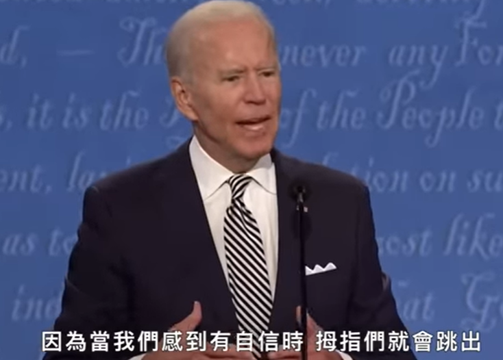
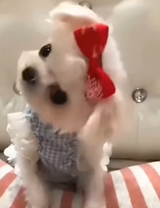
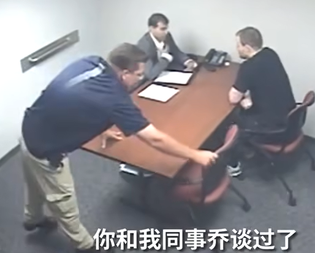
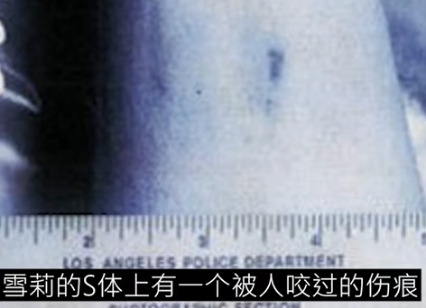
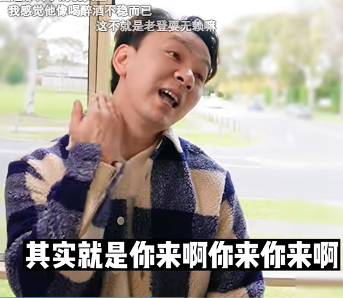

## 1 肢体语言分析

### [FBI-肢体语言告诉你的事](https://www.youtube.com/playlist?list=PLiyT3ZJaRwTtSP5JkIhutS4Tqv46EV8cs)

#### [FBI日常动作心理学：习惯性拿掉眼镜、逃避眼神接触、抖脚代表什么？Former FBI Agent Answers Body Language Questions｜名人专业问答 ｜GQ Taiwan](https://www.youtube.com/watch?v=PJ9r74Towlg)

1,998,246 views Jul 7, 2021

表示厌恶，角度转向，后退。

不要扑克脸，适时表达惊讶、微笑、点头。扑克脸带来负面评价。

##### 摘下眼镜

1.融入环境(思考)

2.强调重点(指挥棒)

2.表达新意(吸引他人注意)

/--

##### 改善扑克脸

手肘放桌上，双手交握，大拇指抵住嘴唇

透过遮掩面部表情→没有新意→他人忽略你的存在

/--

##### 感到自在而一言不发

稍微修改面对面角度(直视改成微侧视)

/--

##### 欺骗性快感 炫耀性假笑

##### 握手

纽约：习惯握很大力

中西部：轻轻碰一下就移开

/--

同步就是和谐，使用当地环境。

/--

法庭中可以采纳肢体语言作证据

/--

##### 该如何礼貌地与聒噪的人结束对话

把其中一脚转向出口方向

OR直接告知我很想留下但我必须走了，保重、我先走了再会

/--

##### 坐着时抖脚 玩手指 抓头发 重复强迫

任何重复性行为都是安抚行为，让自己缓和下来。

/--

##### 找出带有敌意的肢体语言避免冲突

展现敌意没有特定肢体语言，但有特定动作或姿态稍能避免冲突

挺胸大步伐(身体更醒目更高大)、放下手机环顾四周不要低头

/-

人物采访，你不能得知镜头后方有些什么、多少人、什么情况

以及打开摄影机的整段过程(会剪辑)

所以只可与既有事实比、较难作为观察资料

/--

##### 模仿对方动作 暗示调情

##### 当对方暴怒时避免争吵

后退一步、转到某个角度歪头

降低音量、避免接触对方目光，控制好自己情绪

/--

让对方大喊大叫看起来很荒谬。

##### 权力姿势

1.手插腰

2.塔式：手肘放桌上，十指相碰、手肘拉开距离(表示自信)

/--

##### 表示亲昵，脚会不自觉靠近对方

面试与初次约会有很多共通点

注意脚：当一人表示亲昵，脚会不自觉靠近对方

/--

##### 假笑 假赞同 嘴唇上抬

{width="1.9512554680664917in"
height="2.352777777777778in"}

Yeah, I really like that, 说like时嘴唇上抬，在撒谎。

观察日常行为，得出撒谎规律。

##### 肢体语言重要性

1.出生后不会说话仅靠肢体语言

2.靠肢体语言评估危险性

3.追求他人时也会用肢体语言

#### [FBI的「约会心理学」：这些举动看出初次约会顺不顺利！｜Former FBI Agent Analyzes First Date Body Language｜科普长知识｜GQ Taiwan](https://www.youtube.com/watch?v=P-c2Mge9w_M&list=PLiyT3ZJaRwTvXozWLF6VBth80U4V_fA9U&index=8)

1,009,111 views Feb 18, 2021

##### 互相模仿 伸手、腿来靠近 手腕腹部朝向你

1 互相模仿，表示亲密；

2 伸手、腿来靠近，以表示好感，友好；

3 手腕朝向你表示友好。如捏头发时，手腕朝向你；

4 抚摸自己表示舒服，缓解不适。

5 腹部柔弱，正向转向对方表示喜欢。

[Combination](https://www.youtube.com/channel/UCiQZOy5woOqUHjMApxFuD9g)
[1 year
ago](https://www.youtube.com/watch?v=P-c2Mge9w_M&lc=UgxTwguHL_D1g4NdLel4AaABAg)

我之前对班花比中指她都会模仿我的动作回敬我
原来是对我有好感还装作很讨厌我 真的谢谢这部影片 我等等去密她

👍549

[Lin Lin](https://www.youtube.com/channel/UCPredriTgjdjsQYNJYLwFRQ) [1
year
ago](https://www.youtube.com/watch?v=P-c2Mge9w_M&lc=UgxTwguHL_D1g4NdLel4AaABAg.9K-4tOi6nxO9KEQ1kxZ_V4)

并没有，她的手腕向着自己

👍92

#### [识破谎言的三种方法！前FBI特务解密：「嫌犯会揣摩说实话的反应！」Former FBI Agent Explains How to Detect Lying｜科普长知识｜GQ Taiwan](https://www.youtube.com/watch?v=VnTGlI5ra7Y)

367,748 views Feb 25, 2020

##### 故事性细节 不强调自己说实话 避免开放性、狭义言论 随时放松自我 真假混淆 语气言辞不刻意强烈 

[黄鼎轩](https://www.youtube.com/channel/UCBv15rGE1scpU1mNb2-PrSA) [2
years
ago](https://www.youtube.com/watch?v=VnTGlI5ra7Y&lc=Ugwzzfx5CGaL3VkH2YB4AaABAg)

所以，说谎的时候：

1.编辑完整逻辑与架构，具有深度与故事性的事件。

2.不要强调自身在说实话。

3.避免说出开放性、狭义的言辞。

4.平时养成随时放松自我的能力，揣摩与熟知自身谈吐的模样。

5.谎言与真实参杂与混淆，且避免不熟悉的谎言。

6.说谎时的语气与言辞不应刻意强烈、真诚、愤怒、积极，肢体上不应激进表现。

7.若有同伴应以赛局的角度切入，寻找奈许平衡。

##### 重点 不过份紧张 准备细节 音量音调平稳 说真相直接一点

[Kennedy](https://www.youtube.com/channel/UCdkLrnd8EaPrYKjwHs72eXA) [2
years
ago](https://www.youtube.com/watch?v=VnTGlI5ra7Y&lc=UgwuNmZAJLYU1SUzQat4AaABAg)

整理不被轻易识破谎言的重点：

一、清楚认知到被鸰抓走开始，自己就已经被监视。绝对不可以过份紧张（但也要表现合理的紧张）

二、预先拟好谎言的一切细节，工作当天的不在场证据准备好，回答时保持自信与从容

三、说话时保持平稳，在非必要时绝对不要轻易改变音量与音调

四、说真相直接一点，即使被鸰多次质疑，都绝对不要自我怀疑
在法治国家，鸰可以扣留、调查你的时间是有限的。保持谎言不被识破，可以帮助自己渡过第一关。不过，千万别小看现代鉴证技术，之后还是请找方法逃到没有引渡条例的国家。

Show less

##### 真假参杂

[徐翊竓](https://www.youtube.com/channel/UC781rnwyl-RJmSeMPzx4AYA) [2
years
ago](https://www.youtube.com/watch?v=VnTGlI5ra7Y&lc=Ugwzzfx5CGaL3VkH2YB4AaABAg.95ZTVtklXWm95hUMevWtzu)

不，在你说谎时，你应该把所有实话混杂着谎话都坐立不安的说出来，如此一来别人便分不清什么是假的了。👍64

##### 扑克脸

[Yu Kwan Lam](https://www.youtube.com/channel/UCHc3bG1tx3dij2mv9V-RVJQ)
[2 years
ago](https://www.youtube.com/watch?v=VnTGlI5ra7Y&lc=Ugwzzfx5CGaL3VkH2YB4AaABAg.95ZTVtklXWm965yb7v3KUI)

还有，要保持扑克脸

👍5

##### 无愧疚人无法分辨真假

[Yi Li](https://www.youtube.com/channel/UChVfpTz5MnrJN-oeqDq1F1A) [2
years
ago](https://www.youtube.com/watch?v=VnTGlI5ra7Y&lc=Ugw0NftaEcXjllSI7bN4AaABAg)

His method might be useful when liar feels guilty. Nowadays people lies
without any guilty, I guess he can/'t tell anymore.

#### [为什么电影中的英雄总会遮住眼睛、坏蛋则是遮住嘴巴？前FBI探员告诉你脸部表情的微妙之处！｜科普长知识｜GQ Taiwan](https://www.youtube.com/watch?v=kg6eBMicC48)

即使戴着口罩，看眼睛也知表情。眼周肌肉传递信息太多。

##### 手指张开强调重点 闭合则否

手指张开强调重点，手指闭合非重点。

##### 视频会议侧身轻松

视频会议时，侧身让彼此更放松。有共鸣就是和谐。The same is harmoy.

SYNCHRONY 同步性

##### 脸怪可能是表情不对称 可深究

感觉脸很怪，可能是表情不对称，如一边微笑，一边冷漠，可能值得深究。

#### [FBI审问秘诀：让嫌犯坐门边，而不是「角落」 Former FBI Agent Breaks Down Interrogation Techniques｜科普长知识｜GQ Taiwan](https://youtu.be/QkT2YgMsP0Q?list=PLiyT3ZJaRwTvXozWLF6VBth80U4V_fA9U)

##### 单一的行为不能辨别撒谎

清嗓子、碰耳朵、摸鼻头并非撒谎，而是抚慰。

没有单一的行为能辨别撒谎。

##### 咬嘴唇、摸锁骨，紧抓项链，搓手。有事吐露

有压力，有事吐露。

##### 审问小朋友在角落 安全感

##### 坐门边让嫌犯更放松 

##### 语速放慢 语调降低 缓和对方情绪

##### 保持距离 减少目光接触 放松警觉 

##### 看笔记叹气 让对方因趋向稳定而模仿

{width="1.7569444444444444in"
height="1.914113079615048in"}{width="1.8057600612423448in"
height="1.9186187664041994in"}

我会看一下笔记，然后做这样的动作。听者潜意识其实会模仿这件事，因为人类会趋向稳定性。

##### 简单问题开始 说说你名字 对方想正面的事情 心理舒缓

接着我会从非常简单的问题开始，我会说跟我说说你的宾字，这会让他们有机会说，我父亲他的祖母也是这个名字，现在这个人会无意识地联想到，他们尽生中一些正面的事情，他们想起这件事后。

##### 制造不适感 少用0.5-1h恢复状态

制造不适感，我不建议这么做，因为你一旦裂造了心理压力，我们知道需要半小时到一小时，才能让对方回到正常状态，或者稳定状态。

###### 恶化情况无好处 音量+压力+无用 

在进行13,000多次审问后我可以告诉你，我从没看过，让情况恶化会有任何好处，这种情况的结果是，它让身为审讯者的我崩溃，我记得有一场间谍调查案，而那是一场很怪异的审问，审问了超过三个半小时，而我和嫌犯不断来回争辩，我变得越来越懊恼，那个人重复着相同的故事，而我开始失去耐心，我必须结束那场审问，因为我当时已无法清楚思，最后的结果是，这个人并没有从事间谍活动，他不断地重复相同的故事，跟实际发生的状况一致，他没有犯罪，因此这个发生在职涯中期的状况，又再次验证出，提高你的音量，裂造压力，无用。

##### 1976年警校关于说谎的错误教育

###### 碰鼻子 眼睛向上左右看 非撒谎

关于说谎的迷思，他们当时还教大家如果某人碰鼻子，这完全是无稽之谈，I
而且他们几十年来都这么教，甚至在我于1979年进入FBI后，依旧还有人误解说，如果某人要求喝杯水，或者他如果往左上方看，那他们就是在编造一个答案等等，事实止，胡说，我们被告知的说谎迹象当中，有些事是错的，像是碰触脸部吸鼻子，用舌颐来回舔口内等等，以下就是缺点，我看过过去几十年间所发生的，261起DNA镒定除罪案，后来的DNA锴定证明他们与犯罪无关，人难过的事，在每一个案例中没有一个，没有一位警官，没有一位检察官能够侦测到实话，但他们全都说自己能够侦测到谎话，另外一件有趣的是，在这261起DNA镏定除罪案中，有25%的人愿意承部犯罪，这代表在番讯过程。曾施加了许多心理压力，过程中被拷问了数个小时，亚出现许多威智性态度，护对方终于愿意说，你知道吗，推然这曾牺牲我的性命，25
%的人因长时间的讯问而假意招供，非常可怕。

###### 从别人的肢体动作判断撒谎 假

所以我每次听到有人说，我可以透过他们的肢体语，所以我每次听到有人说，我可以选过他们的肢体动作，知道他是否在说谎，我会说这简直是胡说，这毫无科学道理。

你想来硬的我也可以，尔要面临20年的刑期，你要我说什么说是我干的吗？

###### Ricky的审讯

{width="1.443015091863517in"
height="2.093940288713911in"}

###### 你会用冰凿吗？说对答案反常反应

我们发现被害人发银争报名叫Ricky的人，于是我和Ricky碰面，Ricky说这不关我的事，又说那么Ricky，你说你没杀死这位男士，但如果是你的话你会用开山刀吗，他说，他说不会，好那你会用枪吗不会，那么斧头呢，不会，，后来我说Ricky那你会用冰凿吗，我说到冰凿，我说到冰凿，显然心虚的人会有所反应，这是阻挡的行为保护的行为，于是我看着他说Ricky拜托，有人看到你跟他起争执，，现在他死了，最终
他认罪了，记住光是肢体语，在法庭上不是合法证据，我可以就这个人看起来心神不宁，你怎么会知道这件事。

###### 眼皮向下 缩下巴 护卫反应

{width="2.5835575240594926in"
height="2.083513779527559in"}
{width="1.447503280839895in"
height="2.0166666666666666in"}

我可以说他有闭眼睛，并缩起下巴，他们可以辩论说，这并不代表任何事，但这就是我们使用肢体语言的方法。

##### 最厉害的骗子

最厉害的骗子，我们必须做到某一程度的说谎，能与彼此相处，我们会说，说谎是在社曾生存的基石。我们其实蛮会说谎的，大部分人都会说谎。研究显示说每小时曾说3到5次谎，我在一小时内几乎不跟任何人说话，所以我不觉得自己会说那么多谎，但我知道如果我今天过得不顺，某人问我嘿你好吗，我大概会说我还好但其实没有。

###### 简单问题应有简单答案 出现认知负荷有疑但非谎

我觉得最厉害的，就是会习惯性说谎的人，此生碰过最属告的骗子，她是位间谍，我从未碰过如此曾说故事的人，那些故事令人深信不疑，而她的答案会非常流畅，虽然她描述的事发生在德国，所以我们无法隔天过去验证，而我们唯一能保护自己不被骗的就是，你开始提出问题，那个故事便会瓦解，或导致认知负荷。**哦你去了墨西哥，你在哪个机场落地**。你知道，然后他们会想不到一个答案，简单的问题应该要有简单的答案，当他们出现认知负荷，这亚不是说谎的迹象，但这应该要让你思考，这边出了什么问题，这名女性间谍的其中一点是，她事实上被判了25年刑期，我们一抵连德国，业被允许进行这项调查，我们立刻发现她的故事在瓦解，你可以选择相信某人所说的故事，或者你可以鑫全力提出质疑。

###### 测谎无根据 仅知心理不适

我认为当任何人说出，我可以帮你侦测到谎，其实都在骗你，因为这毫无科学根据，我们只能说自己看到，显示出心里不适的行为。

#### [前FBI教你破解 「黑帮老大」肢体语言](https://www.youtube.com/watch?v=HVjaePXSopY)

##### 手扶鼻根，不想看到目前的状况

##### 嘴角向下，悲伤

##### 抬起裤脚，太热，紧张

##### 紧闭嘴唇 压力

##### 周边语言，如咳嗽、清嗓子 舒缓自己

周边语言，如咳嗽、清嗓子。是为缓解说话之前的压力，在心理上舒缓自己。可能有时有人问了你难以回答的问题。

抖腿表紧张

[fs dds](https://www.youtube.com/channel/UCqB3AxNQkVMnr_oyw3-zwwQ) [1
year
ago](https://www.youtube.com/watch?v=HVjaePXSopY&lc=UgyMB5W7ju0dT0vcdpl4AaABAg.90TfqfYBX1J9BgPzo_iN9k)

代表一种紧张感，此人选的都是上世纪前半的案例，本身是为了避免透露任何消息，但这也意味着他不熟悉这些例子，而他讲述的都是通论，这很可能使他潜意识里认为自己在刻意隐藏真相或者讲大话，这些都产生了一种罪恶感和紧张感，而抖脚只不过是一种自我舒缓的反应而已。（雾

👍7

##### 不同国家、人种、语系、时代，思考回路都不一样

[Li](https://www.youtube.com/channel/UCMIDNOsGbqiw9eWMLZjLtww) [2 years
ago
(edited)](https://www.youtube.com/watch?v=HVjaePXSopY&lc=UgwNalbCdWQ2sOk85W94AaABAg.909GwHSZrJY91FlKvYkmYD)

不同国家、人种、语系、时代，思考回路都不一样，心理学也不会一样，华人看欧美人影片当然会有bug，这么简单的问题，你这种不会动脑的才让人想笑。

👍7

#### [破解候选人的肢体语言，看「手指」最准确！](https://www.youtube.com/watch?v=MNWEuXg22CM)

##### 有自信时 拇指俩伸出 缺乏则收回

{width="3.451918197725284in"
height="2.473611111111111in"}

##### 指尖相搭 信心十足

{width="3.037361111111111in"
height="1.95in"}

##### 手指交缠 我有困扰

{width="3.0157895888014in"
height="1.5916666666666666in"}

##### 指尖轻碰眼睛 阻挡 轻抚

{width="2.959879702537183in"
height="1.8027777777777778in"}{width="1.4834623797025372in"
height="1.8001563867016623in"}

附在眼皮上的脉部神经之一，当我们对那条神经施压，它会传送信息到脑中使我们镇静。

我搞砸了或我真的不喜欢那样。

##### 边缘系统 小动作显示真实情况

{width="1.8133005249343832in"
height="1.4125in"}

候选人拒绝握手，使用并非善意谎言。真实性的表现。

##### 姿势跟对答都是密不可分的

###### 将人的手限制住时，限制记忆 交谈

{width="2.6134886264216974in"
height="2.515277777777778in"}

人更少地去记忆、交谈。

##### 显示权威 夸大动作 流畅姿势

{width="4.4079407261592305in"
height="2.0930555555555554in"}

##### 手指指人 负面感受 换成掌示

{width="2.9722222222222223in"
height="1.7408923884514436in"}

{width="2.658333333333333in"
height="2.3831725721784776in"}

##### 表达主张

{width="3.2708333333333335in"
height="2.3974048556430447in"}

我正在跟你讲些对我而言重要的事，我在认真把握表达。

##### 精确表达

{width="4.669525371828521in"
height="2.095833333333333in"}

##### 我们开明开放

{width="3.761473097112861in"
height="2.252083333333333in"}

##### 推开 掌心下落姿势 缓着

{width="4.067281277340332in"
height="2.325in"}

等等，我妈先缓着，我没有那么认可。因为这基本上就是一个推开用的动作，而不是去接纳它。

##### 政客表演 难辨真假

问题是你知道的有多少是他们发自内心的，还是借来的。

##### 阻挡 眼睛向下 不喜欢

{width="2.8725984251968506in"
height="2.1069444444444443in"}

##### 嘲讽 轻蔑

{width="2.1675120297462818in"
height="2.183333333333333in"}{width="1.8928816710411198in"
height="2.188888888888889in"}

##### 川普在白宫时 环抱自己 在自己节目则宣誓主权

{width="1.6734372265966755in"
height="1.8in"}{width="2.1319444444444446in"
height="1.9345428696412947in"}

要思考现象背后的原因。

{width="3.8023534558180225in"
height="2.1090113735783027in"}

说明在政治斗争中，川普没什么地位。

##### 摸嘴唇 沉思行为

{width="3.7282502187226596in"
height="2.4243055555555557in"}

##### 遇到些烦人事时嘴唇会抵成一条线

{width="2.2305555555555556in"
height="2.7375in"}

#### [FBI传授谈判技巧：成功要求加薪、杀价谈判中需占上风！](https://www.youtube.com/watch?v=xM5DXBSNMJg)

##### 谈判步骤

/@HiDo-fb2mu 1 year ago

1、计划

目标、预期对方响应

2、评估

模仿行为开始、解读信息。前几周他拿报纸，假装我也拿。无意靠近。等几周后则再次拿拿报纸靠近，不会有fbi像我一样拿同个报纸吧。

3、交涉

选择合适地点（你来选位置吧）

4、交易(随时反思前述遗漏的问题

选择对方易配合的时间与地点，能掌握谈判节奏获得较佳结果

熵

让对方尽情发泄消耗能量直到疲惫，再平静说出自己能给予的价码。

当对方是激进分子，发泄完成，冷静后，答你能再说一遍吗？能再跟我聊聊这件事吗？不断一而再再而三地让对方发泄。

航空公司，面对大声嚷嚷的乘客。让他尽情发泄，长时间处在负面情绪是非常疲惫的。然后冷静后，我能做的只有这些。结束。

整理情绪在谈判中保持冷静，勿刺激对方心情，循序渐进

##### 同理心进攻 为他着想

/@frencisshuen1054 1 year ago

同意!

真正有效的手段就是同理心/--让对方感受到你不只要从他身上获得什么，同时也在为他着想。
12

审判恋童癖例子。少提女孩、孩子字眼。你知道，现在外边成千上万的人都想打死你，而除了我。是想帮助你的。

#### [FBI盤點十項秒怒對方的動作：「坐下腿張超開的，父母沒跟你好好溝通吧？」](https://www.youtube.com/watch?v=o9r3ZzKY07M&list=PLiyT3ZJaRwTtSP5JkIhutS4Tqv46EV8cs)

/@judyl.7811 3 months ago (edited)

1:00 工作場合 business setting

2:10 小腿肌 second heart. pacing can help thinking.

6:20 that/'s by social convention of you entitled to.

6:35 when it infringes侵略 on other people.

6:40 verbal tics 不自主的

7:25 周邊語言線索 paralinguistic cues

7:50 錄下自己演講的5-10
分鐘，然後請另一個人看我，是不是有讓人分心的小舉動。

##### 清嗓子，有压力。可能会说出令你失望的事情。

### 一些行为

#### [手敲击桌面 力度大 思考沉重 轻则悠闲](https://www.jianshu.com/p/c533ec7f8bca) 交谈时则抵触心理

用手敲击桌面是思考时的辅助动作；用手指敲击桌面是一个人的思考问题时伴随的辅助动作。
需要注意的是，当领导手指敲击桌面，并且敲击的力度很大，那么就说明他此时思考的问题十分沉重，他用这个动作来减压
。
用手指敲击桌面是悠闲自得的信号；有时候当一个老人哼唱着小曲儿，微闭眼睛。
并用手指敲击桌面时 我们能够感觉出这位老人此时悠闲自得。
正沉浸于目前生活状态的满足之中。
当然，这个动作代表的这种意思，不仅适用于老人。
任何人的悠闲自在状态都可能通过这个动作来减轻压力。

用手指敲击桌面表明期内心有抵触情绪
；假如你在与别人交谈时，对方的手指在桌面上敲击起来。很显然，他对你的观点或者话题产生了抵触情绪。他的心情有些急躁，注意力涣散，
因为他已经分配一些注意力在他的手指运动上。手指敲击桌面的速度越快，说明对方心里越急躁，越厌烦
。

#### [说话眨眼频率上升有问题](https://www.bilibili.com/video/BV1PL4y1P726?t=1143.8)

他说话的时候

#### [微表情专家看《东八区的油腻》](https://www.bilibili.com/video/BV1Kg411e76N)

##### 真实的笑容

{width="1.3147845581802275in"
height="1.5041130796150481in"}{width="1.3335476815398075in"
height="1.503386920384952in"}{width="1.5424715660542432in"
height="1.5006408573928258in"}{width="1.3648906386701662in"
height="1.5041666666666667in"}

它们的共性基本包括了，嘴角对称，向耳根或者眼角拉动 (au12/14)。

{width="3.0320516185476816in"
height="2.131441382327209in"}

{width="1.9230774278215224in"
height="2.0299146981627296in"}{width="2.0013877952755905in"
height="2.026281714785652in"}

{width="3.1193449256342958in"
height="2.4784722222222224in"}

{width="3.11875in"
height="0.2871489501312336in"}

{width="3.11875in"
height="0.2512160979877515in"}

而这句话贯穿了整个东八区的先生们，整部剧压根就没有看到对除了主角四人之外。

任何一个人的尊重。整部剧都充斥着，/"因为我有实力"，因为我有梦想，因为我是男人，所以我比你优秀，所以你要听我的。这样的强烈自我中心表达。

{width="3.0683234908136483in"
height="1.6935892388451443in"}轻蔑，眼睛微微眯起。嘴唇一边拉动，不对称。

### [[九先生的阁楼]{.ul}](https://space.bilibili.com/288408181)

#### [看左边就是说真话？太初级，心理咨询师教你高阶辩眼识心](https://www.bilibili.com/video/BV1KE411F7pu)

落枫亦化尘

回忆，倾向于调动右脑，创造，倾向于调动左脑，左右脑交叉管理肢体。（右看，利用左脑创造力，左看，利用右脑回忆能力）/
当我们眼睛看向不同的方向，还分别对应了调取我们不同的感知回路。/
眼睛看向左上，意着我们在调取视觉回路，在回忆当时看到的画面。/
左中，调去听觉回路，回忆当时听到的声音。/
左下，调取感觉或触觉回路，回忆当时自己的感受，或思考或触觉/
向右，调取回路相同，但从回忆，变为创造。例：看向右上，创造想要看到的图像，或并没有看到的图像。/
用处：/
①识人，投其所好。观察人的主要感知类型（眼睛倾向于向上，中，下？）/
视觉回路（中）画廊，送鲜花，风景优美的地方旅游/
听觉回路（上）音乐会，亲自唱歌，温暖的话/
感觉回路（下）情感上的共情外，刺激体验，鬼屋，滑翔等/
②鉴慌，（可能有差错）对方向你描述视觉记忆的时候，提出听觉类型的问题或感知类型的问题，对方尝试创造其他类型的内容，更可能出现向右看的情况。

2021-12-16 16:212

#### [心理咨询师教你，正确靠近他人的方法是？](https://www.bilibili.com/video/BV1m7411C7an)

私人空间，个人半臂之内的圆圈。

##### 1、合理进入私人空间

没错 如果你能合理的不引起反感经常的进入另一个一人的私人空间。

比如说找对方合影让对方签字，或者帮对方拿掉衣服上的头发。

这样合理的讲入对方私人空间的行为会使对方潜意识将你规划为关系好的人，不需要警惕。

##### 2、警戒边

当进入私人空间的时候会引起对方的警戒，但很有趣的地方就是。

我们对左边和右边的警戒感是不一样的，往往有一边更强，更难以接近，我们管更强的这一边叫警戒边。

##### 3、警戒边该如何判断呢？

观察对方经常将手机放在哪一侧的口袋，或者经常将背包背到哪一侧，那么这一侧就是对方的警戒边了。

##### 4、中等或者偏正面的态度 才进入私人空间

要从非警戒边合理的靠近对方的私人空间来说服对方的潜意识，我们是可信的，亲密的。

合理的接近对方的私人空间需要对方对你保持至少中等或者偏正面的态度。

如果对方已经对你抱持着负面的看法，无论如何接近对方的私人空间都会引发对方的反感。

一定不要轻易的在这种情况下接近对方的私人空间。

如何在第一次见面就带给对方至少中等的印象，如何将对方的负面印象转化为正面，后续。

#### [启示还是警告？心理咨询师眼中的第六感](https://www.bilibili.com/video/BV1fa4y147bM)

1、前意识处理不完的信息放入潜意识来处理；

2、人类的第六感越来越弱，不如动物，怎么利用？有时候第六感感觉不对就要停下来，仔细观察周围信息。

#### [满干货砸脸的高级肢体语言分析学，不看完亏大](https://www.bilibili.com/video/BV1oA411t7Jk)

##### 1、胸腹 被四肢挡住 保护自己 不自信

{width="2.300029527559055in"
height="2.0064096675415573in"}

（1）四肢放在胸前往往意味着一种"自我防护"也就是对当前的情况感到不安或不自信的表现，"双手向外推"甚至是"含胸"也都是不自信的一种表现，因此，当你身边的人出现用了四肢或者借助物体挡住胸腹的情况时，无论她的语言和面部表情什么样，实际上，她的内心，都处于对当前环境的不适应或者不自信的状态中。

（2）特意把手放在背后或者特意把胸腹挺的非常靠前这都是自信爆棚，甚至达到自负的表现。(邢平，强背手图)

实际上，她的内心都处于对当前环境的不适应或者不自信状态。

此时尝试谈论一些对方擅长或者熟悉的话题能有放的让对方放松下来。

##### 2、嘴唇 被[手指或者拳头，挡住，或者捏住的动作 有隐瞒](https://www.bilibili.com/video/BV1oA411t7Jk?t=374.2)

用手指或者拳头，挡住，或者捏住嘴唇的动作，往往代表着对方潜意识有表达的欲望。

但是被主意识拦截。或者控制住。

换言之，如果你正在跟一个人对话。对方出现了类似挡住嘴唇的微小动作

{width="0.9239206036745407in"
height="1.2782053805774278in"}

{width="3.1153838582677165in"
height="2.2838396762904636in"}

{width="3.1152777777777776in"
height="0.28701224846894136in"}

{width="3.1152777777777776in"
height="0.3115277777777778in"}

{width="3.1152777777777776in"
height="0.3121522309711286in"}

{width="3.153846237970254in"
height="0.3512073490813648in"}

{width="3.1152777777777776in"
height="0.2799584426946632in"}

{width="3.1152777777777776in"
height="0.3378827646544182in"}

对于很多时候的销售，或者谈判行为中。我们可能认为自己谈的顺风顺水。

对方并不是完全同意你的想法，而是认为不方便，或者不愿意违逆你的看法。

有时这是对方主意识上的不赞同，这种反而好解决。你可以直接问对方哪里需要修改。

但是更麻烦的是对方潜意识上的不接受。

{width="3.3673611111111112in"
height="1.4870548993875765in"}这边是医院。

{width="3.3677099737532807in"
height="0.3198720472440945in"}

{width="3.3320395888013996in"
height="0.31217957130358703in"}

{width="3.3319444444444444in"
height="0.2922758092738408in"}

{width="3.1372430008748906in"
height="2.0038462379702535in"}企业方 瑞士制药公司

###### 我再考虑考虑 捂嘴 暗含拒绝

而这种不接受会直接以"我觉得不行/"的冲动反馈给主意识。

你甚至无法从对方身上问到对方到底是哪里不满意。参老我们上一期的第六感。对方只会说/"我再考虑考虑"。

而如果你会看对方的肢体语言，那么在对方挡住嘴唇的一瞬间、你就可以即刻反应。

{width="1.6813123359580053in"
height="1.8070516185476815in"}{width="1.2284722222222222in"
height="0.2979505686789151in"}{width="1.7051279527559056in"
height="1.7743099300087488in"}

刚才所提及的话题是什么，问题很有可能就出在刚才这个位置。

从而给了你修改和重新争取的可能。

##### 3、脖子 [歪头潜意识感兴趣、喜欢](https://www.bilibili.com/video/BV1oA411t7Jk?t=479.1)

歪头代表着有好感

2020-04-16 22:5140

但是在有些时候，对方让我们感到有趣又亲近的时候。

我们会把自己的薄弱部位表露给对方，表示我们的喜爱(和好奇)。

{width="1.3141021434820648in"
height="1.4302646544181978in"}{width="1.0380479002624672in"
height="1.439744094488189in"}{width="1.113277559055118in"
height="1.4435903324584427in"}{width="1.1215277777777777in"
height="1.4270472440944881in"}

所以，如果你看到有个人对着你歪头。那么别犹豫，至少她的潜意识喜欢你。

{width="1.0091163604549431in"
height="1.2384612860892388in"}

#### [心理咨询师级的情绪安抚教学，满分暖友的必修课](https://www.bilibili.com/video/BV1HV411o7rg)

落枫亦化尘

##### 温和不良情绪

陪伴（适用于情绪尚没有失控的情况。）

注意：不评价，不参与。真正的陪伴，在于安静接受对方的情绪，不对其进行分析，建议，或者干预。这种纯粹的、没有多余话题的陪伴，往往是只来那个最高，安抚效果最快的。

难点：如何真正的放下自己内心的评判和想法。要真正的放下自己，容纳对方的想法，才是最好的陪伴方法。

##### 爆发不良情绪

退行（强制使对方产生退行，会带给对方收到保护的感觉，从而有效的安抚失控的情绪。要让人感受到未成年时代收到妈妈保护的感觉。忍不住手插入米缸，摇摇椅更舒服）

直接要求对方停止情绪的话，只能起反效果，不要说。

常用安抚动作（使用的时候，要具有保护和容纳对方的心态，并且尽量保持自己情绪稳定，会效果更好）：

1.单手环抱对方，并且轻轻的用手心揉搓对方的后心，原理就是模拟退行到婴儿时期的拍奶和揉背动作。

{width="1.18411854768154in"
height="1.2493591426071742in"}

2.双手环抱对方,并且注意,用双臂固定对方的双臂，让其不能自由活动,也可以有效的让对方退行。

3.不要递纸巾,而是直接用纸巾帮助对方擦掉眼泪,或者汗水。

4.紧握住对方的双手，并且直视对方的眼睛。

{width="1.3012817147856517in"
height="1.1030905511811024in"}

5.用手掌轻轻的从对方的颈椎开始，向下轻抚，尽量确保你手心的热量,可以传递到对方的背上，一直轻抚到对方的脊柱中段结束。（适合手掌温度较高的同学使用）

2021-12-16 17:17 7

{width="1.474359142607174in"
height="0.7106944444444444in"}

女性心理咨询师可做，up主作为男性，不适合。家人朋友可用。

首先，注意自己的情绪和自己的想法，自己的情绪都很糟糕，是很难容纳他人的情绪的。像这种情况，就不如暂时不要担任安抚他人的角色，
转而优先处理自己的情绪让自己的心态好起来，比安抚他人更重要。

## 2 审讯视频案例

### [FBI审讯章莹颖案嫌犯录像曝光 嫌犯谎言被拆穿后呼吸急促](https://www.bilibili.com/video/BV1X4411g7so)

#### 打安慰缓解剂

西装探员一开始说的话：我们正在调查章莹颖的失踪案，因为你现在在我的办公室里天色也晚了，我会跟你读一下你的基本权利好吧。
我重申一下这是自愿的侦讯，所以事情办完了我们就会开车送你回去，就没你事了。

#### 红白脸搭配

很合理，一个警官让他放松警惕，另外一个开始步步紧逼，寻找破绽

#### [夺取椅子 营造劣势地位](https://www.bilibili.com/video/BV1X4411g7so?t=65.7)

{width="2.600042650918635in"
height="1.644430227471566in"}{width="2.0694444444444446in"
height="1.6628029308836396in"}{width="3.0154429133858267in"
height="1.8902777777777777in"}

整个审讯过程中，黑衣警都是手肘压于桌面的进攻性姿势。

#### [去除戒心 请求帮助](https://www.bilibili.com/video/BV1X4411g7so?t=253.7)

{width="3.8420614610673667in"
height="2.6875in"}

这些人每晚都在外面找这个女孩，外面在下大雨情况很糟糕，她是留学生才到这里几周。我想找到她，想请你帮忙。

#### 反复严肃～轻松话题变化，衰弱神经

不停的做反复严肃～轻松话题变化，衰弱被审者的神经

#### 假设是你做的 套话

套话嘛 先假设是你做的

#### 问话后 长时沉默 营造尴尬逼迫回答

#### [脚点动 缓解压力](https://www.bilibili.com/video/BV1X4411g7so?t=360.7)

脚开始有频率的点动（企图缓解压力）

{width="2.905825678040245in"
height="1.825in"}

#### [故意详述 造成败露错觉](https://www.bilibili.com/video/BV1X4411g7so?t=351.6)

技巧：故意说得很详细，造成败露错觉

你以为我没看到你那天在古德温路开着你的车吗？

你以为我没看到你向右开到一个停车场的缴费处后，开出校园到古德温街上一直往南开吗？然后你就在角落的树下看到了那个姑娘是吧?
那就是你第一次看见她的时候。

然后你调了个头在克拉克街上，在那儿我们也有监控。

双手双臂抱在胸前做警惕姿势，脚在抖动说明他在撒谎

{width="3.362222222222222in"
height="2.4722222222222223in"}

#### [手放到桌下，他想逃避现在的场景](https://www.bilibili.com/video/BV1X4411g7so?t=412.2)

{width="2.6258431758530185in"
height="2.375in"}

我知道你载了她，我很清楚。我看到你穿的衣服双手伸着把方向盘，

#### 

[黑衣警压迫感](https://www.bilibili.com/video/BV1X4411g7so?t=398.2)我觉着们带你来这是让你看录像的？我们想搞清楚为什么你要这么做。我们想知道为什么你要载她，是想载她一程吗？你害怕告诉我们吗？我知道你载了她我很清楚。我看到你穿的衣服双手伸着把方向盘。

{width="3.0214195100612424in"
height="2.0555555555555554in"}

你把她撇在哪了？她只想搭个车。她告诉了你她想去北面，那你把她丢在哪里。

[非暂停画面](https://www.bilibili.com/video/BV1X4411g7so?t=441.9)
长时沉默 尴尬气氛 逼迫回答

{width="2.3072222222222223in"
height="1.2916666666666667in"}

#### [西装迷惑放松 排除嫌疑](https://www.bilibili.com/video/BV1X4411g7so?t=421.1)

这人刚才还以为探员只是来询问排除嫌疑，西装探员迷惑性太强了

看向西装探员，寻求帮助

{width="2.575395888013998in"
height="1.6666655730533684in"}{width="2.7927077865266843in"
height="1.6637412510936134in"}

西装探员一开始说的话：我们正在调查章莹颖的失踪案，因为你现在在我的办公室里天色也晚了，我会跟你读一下你的基本权利好吧。
我重申一下这是自愿的侦讯，所以事情办完了我们就会开车送你回去，就没你事了。

身体后倾开始（放缓情绪思考对策）

#### [开始害怕](https://www.bilibili.com/video/BV1X4411g7so?t=458.1)

此时罪犯喘气声加大，语气不稳，开始慌了。

#### [身体姿态从压在桌子上进攻性 变成抱紧自己](https://www.bilibili.com/video/BV1X4411g7so?t=563.0)

到这里这个人的身体姿态已经是从压在桌子上进攻性的 变成抱紧自己了

{width="2.4375in"
height="1.6794969378827647in"}

### [FBI审讯教科书心理战，凶犯最终在压力之下意志力崩溃 /| 犯罪心理学经典Chris Watts案（五）](https://www.bilibili.com/video/BV1bu411k7XH)

245.7万

### [最经典的Chris Watts案（一），妻女失踪，老公举止奇异，警察上门调查互动全程录像解析/| Eric长安万年](https://www.bilibili.com/video/BV1pS4y1Z7x4)

搓手手，期待后面发生的事情。

[和警察握手](https://www.bilibili.com/video/BV1pS4y1Z7x4?t=702.0)

Watts
妻女失踪，警察通知他到家后，他没有第一时间冲进房子找妻女，而是来找警察握手，诡异。

[进门后不呼喊](https://www.bilibili.com/video/BV1pS4y1Z7x4?t=911.9)妻女

但是听不到他进去之后是否有呼喊老婆和孩子的名字。并且进门之后的状态好诡异啊。

Chris自己在里面待了1分12秒，开门后一个字都没有说。

{width="2.774537401574803in"
height="1.4444444444444444in"}

[Nickole触碰shannon手机触电反映](https://www.bilibili.com/video/BV1pS4y1Z7x4?t=1134.0)

摸脖子侧面的耳道，不敢相信自己所听到的。

{width="3.103234908136483in"
height="1.9611100174978127in"}

nickole躲闪

{width="3.5625in"
height="1.598131014873141in"}

{width="3.6150306211723535in"
height="1.6722222222222223in"}

同时她也看向警案:眼睛里有求救的意思。

估计昨天被害人已经跟闺蜜说了一些不好的猜测，所以闺蜜才这么第一时间就觉着不对，被害者估计已经隐约间觉着老公有杀意。

这男的为什么不把手机拿起来，他看起来很不想碰它的样子。

操作手机也很奇怪，感觉他根本不想碰但是又不得不碰手机。

是的是的，老公用老婆手机比拆弹还紧张的感觉，根本不像着急查看有没有老婆失踪的有用信息。

两个朋友都慌的到处走，他却很冷静

{width="3.736111111111111in"
height="2.3973851706036746in"}

Nickole的手现在放在脖子根的这个叫做Suprasternal
notch的位置。这里因为没有骨头顶着，能够反应出来人的胸膜里面的压力。人在突然间的压力或者焦虑的时候呼吸心跳加速，按摩这个位置可以帮助自己呼吸，NIckole惊呆了。

对，我有焦虑症，这简直是招牌动作。是的，我有这种动作的时候特别焦虑紧张。

[否定看监控](https://www.bilibili.com/video/BV1pS4y1Z7x4?t=1331.8)

{width="4.246430446194226in"
height="1.8798611111111112in"}

心里有鬼的人会对所有解决问题的方法做出否定

但是他似乎一以贯之的对于新的信息和建议表现的很负面。

{width="3.388426290463692in"
height="1.9680555555555554in"}

[打电话远远近近有隐瞒](https://www.bilibili.com/video/BV1pS4y1Z7x4?t=1497.7)

走来走去远远近近的这样走(尤其是声音忽大忽小)，这个人八成是有什么事情瞒着你。

重点不是走来走去，而是声音忽大忽小。

邻居的监控只有watt的车来过。

{width="3.7777777777777777in"
height="1.0384678477690288in"}

因为紧急情况出现后，人会第一时间或者看向自己想保护的人或者东西。或者看向自己最信任最能保护自己的人或者东西。

他给人感觉最大的问题就是不积极

海龟心理

不知道做什么了，只能通过看手机缓解情绪和心态 从而不用面对警察

{width="1.3402777777777777in"
height="1.5702274715660542in"}

他真的太刻意了为什么我下面说，先说结婚戒指他既然专门把戒指拿出来给大家看。

意思就是这个东西应该Shannan是一直戴上手上的，结果现在没有戴放在床头柜上。

他不应该是/"无意/"中发现更合理一些吗？

或者说OK他之前也进过这个房间，之前就看到了戒指，那你要不然看到了很诧异当时就拿出来给大家看。

要不然不在意，然后话说到这里了。

[之前都是低头玩手机，现手指头张开](https://www.bilibili.com/video/BV1pS4y1Z7x4?t=2190.1)拇指高翘
自信

{width="2.905505249343832in"
height="1.6909722222222223in"}{width="2.7328969816272966in"
height="1.6784722222222221in"}

另外双手打开呈现一个把东西托着递给你的感觉。非常自信的把这个八成是提前准备好的说辞。

Nickole和她儿子都是忧心忡忡的样子，而只有警察和chris
watt都是平静的表情，因为他们都在担心对方。

{width="3.6333858267716534in"
height="1.7020833333333334in"}

然后到这里我终于明白他整个的意思了，有个他不认识的人来把他老婆和孩子接走了。戒指不要了，手机不带。然后可能有人来过，但是家里的传威系统有问题所以没记录下来。

你说他这一套逻辑有可能，但是他最大的解释不了的问题就是邻居的摄像头。

和杭州杀妻案说辞完全一致，自己出轨想要污蔑老婆出轨是吧。

#### 真实的情绪反应在脸上的表情一定是对称的

[真实的情绪反应在脸上的表情一定是对称的](https://www.bilibili.com/video/BV1pS4y1Z7x4?t=2509.9)

右脸无表情{width="3.9875623359580055in"
height="2.2395833333333335in"}左脸笑

### [最经典的Chris Watts案（二），疑犯老公众人面前不敢看监控，电视台采访演技炸裂/| Eric长安万年](https://www.bilibili.com/video/BV18R4y1j7KV)

2022-01-30 18:05:42

#### [背对监控](https://www.bilibili.com/video/BV18R4y1j7KV?t=70.9)

{width="2.701388888888889in"
height="1.9339490376202975in"}

感觉就像是已经知道既定结果了没必要看

自己干了什么自己心里清楚，大家都想从监控上找线索，男主没有那心思。完全不好奇发生了什么。

{width="3.0750853018372704in"
height="1.3944444444444444in"}

我把车停在旁边把所有东西拿过来，这样我拿所有的工具过来装车更方便一点。

为什么要解说自己的行为啊？这段解释属实自爆了

33分钟十几次进出车库，分尸。

[投石车显示肌肉表示自信](https://www.bilibili.com/video/BV18R4y1j7KV?t=223.1)

{width="5.055950349956255in"
height="2.21875in"}

双手交叉放头顶完蛋了

{width="2.951388888888889in"
height="2.0612871828521433in"}

这个动作出现的原因是这样心理上可以打开胸腔，更得呼吸变得更顺畅。

[Nate怀疑](https://www.bilibili.com/video/BV18R4y1j7KV?t=620.3)

{width="2.8472222222222223in"
height="2.1081649168853893in"}{width="2.735939413823272in"
height="2.109388670166229in"}

这已经不能算支开了 他简直就是冲出去哈哈哈哈。

他从来不会进进出出车库装车

老实跟你说，我和我老婆以为他老婆度假的时候发生什么事情了。

他听到他们歇斯底里的互相大喊大叫。

可能这就是她为什么要去度假，因为她想逃离这个局面。

对我来说奇怪的是，他为什么把车的一半倒进车库。我从来没见过他停到里面。

但是他在这里一遍一遍又一遍的解释，他看上去并不担心！

邻居普通人吧，正常人老婆孩子失踪，恨不得看遍所有监控的每一帧画面

你可以问他们他平时比较安静更加镇定，他刚才在这边告诉你三次，他拿出去了什么干了什么。他基本上很不合群，他从来不说话。

所以他刚才这里说这么多，让我很怀疑。

这回他停车，车的一半在车库门里，一半在车库门外。邻居觉得这样很奇怪:他认为Chris知道他有摄像头。

#### 物化人也是自恋型人格障碍的特点

I check everything in my contact list.

Everything而不是everyone，物化人。

我希望她在一个安全的地方，很奇怪。

{width="3.205923009623797in"
height="2.341666666666667in"}

#### 真笑眼角有皱纹

{width="4.1875in"
height="2.0534175415573053in"}

{width="1.875in"
height="2.1123414260717412in"}

#### [狼不敢提出怀疑对象 知道不可能是别人](https://www.bilibili.com/video/BV18R4y1j7KV?t=1614.0)

这段经常玩狼人杀的能看出来太经典了

同理还有狼不敢提出怀疑对象，因为知道不可能是别人。你看他到现在说了他觉得可能是谁干的了嘛？

记者：有人怀疑是你做的。

Chris
watt：任何人都可以提出自己的看法。我就是想让大家知道我想让我的家人回来。

两段式，先回应问题，这里开始转折。

[保护自己抱胸姿势](https://www.bilibili.com/video/BV18R4y1j7KV?t=1715.3)
示弱

{width="4.236111111111111in"
height="2.27921697287839in"}

Chris这里的是一种偏示弱的抱法，更常见于人冷了或者肚子疼的时候出现。

#### 犯罪心理学铁律 侥幸逃避 简单事情弄复杂 哪都有可能

我如果偷了一个东西我肯定会有这种侥幸心理。可能性太多了接触过那个东西的人多了。怎么可能知道是我？如果我把一个什么东西藏起来了不想让某个人发现。

可能性太多了，我肯定也会想，能藏东西的地方多了。

总是在尝试把事情弄的很复杂，把找出真相的难度放大。

##### 找不到钥匙只想就在这几个地方

但是大家想想比如说你找不到钥匙了，你找了半天也找不到你心里想的是。

平时就在这几个地方但是现在没有了，这没错但是你不会觉得我肯定找不到了。

虽然我不知道在哪里但是肯定是在家里。

你永远有地方想去找，你会圈定一个范围。即使这个范围会在寻找的过程中一直变也是正常的。

##### 会肯定而不是消极的否定

#### 坐里面且坐旁边是示弱套近乎

[故意坐边上（施加压力）
还让他坐在外面的（放松）](https://www.bilibili.com/video/BV18R4y1j7KV?t=1994.3){width="2.6168930446194225in"
height="1.2084383202099738in"}

是不是让他觉得随时可以从门离开，是优势方，心里负担少，更容易放松警惕套出信息。

坐旁边能看到他全身动作，而坐对面只能看到上半身。

这个男的很自大，所以就选择并排坐让他放松警惕逼出他的虚荣心？

{width="2.6168930446194225in"
height="1.6834787839020122in"}

FBI: 门铃检测到人什么意思？

Chris watt: 门铃有个摄像头，当你按门铃或者靠近到一定程度，

#### 随意社交 普通衣服 装笨 降低防备

FBI上来先装笨，说话问问题都很怪。显得不太精明的样子。

北美的审讯特别强调building
rappor，一定要跟被审讯的人搞好关系，所以Grahm探员一上来先表现出来都是他的interpersonal
skills跟人打交道的能力。

我们注意他穿的是一个很普通的polo衫FBI是有制服的，但是在审讯中他们从来不穿。

大多数情况下会穿西服是比较常见的，整的自己像个会计或者房产中介一样。

Grahm这里更随意直接穿这样的一个短袖牛仔裤，这都是为了降低Chris的防备心。

面对面坐着容易产生敌意，究其原因可能跟我们刻在基因里的敌我分辨程序有关。对面敌人，同边队友。

六水是淼淼

原来男生会觉得坐在对面的是敌人，坐在同侧的是朋友！/[热词系列_知识增加/]

作为女生我觉得想要良好的沟通就做对面，坐在同侧或者身侧会有胁迫感，感觉靠太近是要威胁我，会有压力，加深不安全感

2022-03-18 15:55 17

北美审讯室，房间很小，没有窗户，房间里面没有任何装饰。墙上光秃秃的什么都没有，这都是为了使被审讯的人集中注意力。同时给他们一种被困住了的感觉，增加他们被孤立的感觉。

### [审讯重度精神病人，史上最快招供，细节令人不寒而栗/| Eric长安万年](https://www.bilibili.com/video/BV1pG4y1z7Q6)

2022-09-12 12:39:37

五岳轻

回复 /@nunva :可以打，空军上校案和chris
watts两个案子，Eric都讲过，上校怕JC打扰自己的老婆所以招供，chris是怕同事怎么看待自己所以招供。所谓精神病就是精神障碍，精神弱点。

2022-09-18 20:46

漫漫漫漫漫迷

双相情感障碍患者告诉你，没有必要去尝试了解精神病者的思想并共情。为什么呢？很多时候我们情绪是不受控的，思想跟着情绪走，我们清楚的知道自己在做什么具有思考能力，但不会去思考哪来的情绪为什么要跟着情绪做些什么。其实我看来他就是被情绪带着走了，一直处于轻躁的情绪当中莫名其妙的有个杀人的冲动，然后因为反社会人格并没有去抑制这种冲动没察觉这是不正常的，觉得自己就是这么一个人，很干脆的想到就去做了。他非常清楚自己在做什么，所以供认不讳。但什么机器人我不认同，只是对于这件事他心里很清楚是怎么样的，且做好了接受审判结果的心理准备，所以不愧疚没有什么感情。顶多是不把生命当回事，跟机器人不懂感情还是有区别的，从撒谎保人也能看得出来。

2022-09-14 16:30 4374

### [23年前发生命案，23年后被审问！史蒂芬妮·拉扎勒斯审讯分析（2） /| Eric长安万年](https://www.bilibili.com/video/BV1nx4y1g7fx)

2023-01-21 09:00:00

[判断谎言原理](https://www.bilibili.com/video/BV1nx4y1g7fx?t=908.7)

我们最常见的3个判断谎言的原理，Fight a flight，认知负荷，表情控制。

Fight a flight最简单，是哺乳动物就会。

复杂一点就是cognitive complexity，认知复杂性，认知负荷。

撒谎高级功能，非常消耗脑力。嘴上撒谎，别的地方就暴漏出来了。

比如嘴上说是的，实际轻微摇头。

最高级deception
management，这种情况是你不仅知道自己是在撒谎。并且你还有足够的脑力去想，我应该去怎么掩盖住我自己撒谎。怎么去掩盖我的身体语言，

[脑子快速运转](https://www.bilibili.com/video/BV1nx4y1g7fx?t=952.8)的表情

Stephanie这里脑子在快速的运转，她知道警察问这个回题是想要干什么的。她在想自己应该怎么去应对，不仅是怎么应对这个问题。包括怎么去应对，下一个问题下下个问题，但是思考呢是要花时间的。而她又不想让对方觉得，她在深度的思考。于是用了这一套，复杂的表情和动作去掩盖，但其实她的脑力已经不够用了。所以她一边思考，一边这表情啊动作就特别的夸张。

假装自己对曾经开过的车记不太清楚。

她是被突击审讯的，而且是一个23年前的案子

警察更进一步：你的车曾经有过问题吗？

大概说，车辆被毁坏，任何事情，

{width="1.7948720472440944in"
height="1.7175535870516185in"}

喔不，撞过，肇事逃逸。

[手指向上靠着是感兴趣评估](https://www.bilibili.com/video/BV1nx4y1g7fx?t=1139.2)

{width="1.8589741907261592in"
height="2.30370406824147in"}

下来一点，则是就是没有兴趣，甚至是有负面情绪的表现。

{width="1.878205380577428in"
height="2.042049431321085in"}

[车被破窗重复多次](https://www.bilibili.com/video/BV1nx4y1g7fx?t=1156.8)

{width="2.5461450131233594in"
height="1.685255905511811in"}

关于爆窗这事的说辞应该是早就准备好了的。

[开始审讯坐姿和被强制取证坐姿对比](https://www.bilibili.com/video/BV1nx4y1g7fx?t=1530.4)

{width="1.7915944881889765in"
height="1.650640857392826in"}{width="1.8494225721784776in"
height="1.2525634295713035in"}

{width="2.376279527559055in"
height="1.7217957130358705in"}

单凭咬伤就知道袭击者女性，男性枪杀不需要咬。

{width="2.9730194663167104in"
height="1.5097758092738407in"}

23年之后警察成功的从中提取出了DNA。

而当时嫌疑人中间，只有Siephanie是女的。案发前也有记录显示，Stephanie跟死者雪莉是有过争执的。在案发当天Steghanie又请假了，没有来上班。她又丢了一个跟案中一样的武器，一个点38口径的手枪。警察偷偷的针对了Stephanie展开了调查。

导致了这两个警察可以以同事的身份，非常轻松随意的出现在Stephanie的身达，他们偷偷的捡了一个Stephanie喝水用过的杯子，取了DNA。鸿门宴审讯。

### [网络爆火热门视频身体语言心理学分析（二），全球最有钱神父，"听懂掌声"枭哥，火车霸座老大爷/| Eric长安万年](https://www.bilibili.com/video/BV1Qo4y1K7La)

2023-06-06 15:49:30

#### [舔嘴唇](https://www.bilibili.com/video/BV1Qo4y1K7La?t=73.6) 魅惑or嘴干or紧张

是女性的魅惑，对于年长的人来说可能是嘴巴干。

#### [手心向下向外](https://www.bilibili.com/video/BV1Qo4y1K7La?t=91.0) 控制

{width="2.802962598425197in"
height="2.084615048118985in"}

首先这样的手心向下向外啊，向上是乞求向下是控制。

#### [眼睛往旁边扫了一眼](https://www.bilibili.com/video/BV1Qo4y1K7La?t=340.0)

{width="2.768409886264217in"
height="2.2262817147856517in"}

这种行为是典型的discomfort的象征，他现在说的这个话呢是让他不舒服的。

<https://www.bilibili.com/video/BV1Qo4y1K7La?t=452.6>

感动的时候，喉咙一紧，就是声带中间的这个东西在肿胀。防止鼻涕、眼泪进入肺部。

说话的声音也不一样，我们中文叫做哽咽。

人嫉妒的情绪，如喜悦、愤怒，极端的情绪都会哭。极端的情绪激发下丘脑触发逃跑、防卫机制，这时声音会哽咽。身体发抖也是一样，做好战斗、逃跑的准备。肾上腺素爆发，肌肉膨胀，但是自己克制，就会发抖。

#### [看两次](https://www.bilibili.com/video/BV1Qo4y1K7La?t=538.7)

说回到视频里面这个小男孩，首先当他看到妈妈的时候，他其实是看了两次。

Up主粉丝有时认出up主，但是比较含蓄，没有过来打招呼。但是会出现看两次的情况，其实都会有一个上下打量的眼神出现。我就知道他们大概率是认出来我了。

这个叫cognitive
processing，是一个认知处理的过程。小男孩，他看两次，大脑确定了啊是自己的妈妈。

<https://www.bilibili.com/video/BV1Qo4y1K7La?t=675.3>

闭着眼睛说话感觉很屌，其实就是一个拒绝交流，隔绝对方的信号。

组合动作，头转向一侧然后向下。头转向一侧，表示拒绝。头向下，表示加强语气。

#### [侧头 感兴趣 撑着则不感兴趣](https://www.bilibili.com/video/BV1Qo4y1K7La?t=716.9)

普通情况下，头侧向一边，跟狗狗一样是感兴趣的动作。

{width="1.3379232283464566in"
height="1.6192300962379702in"}

头侧向一边，但是有手撑着，就是不感兴趣。

{width="2.269753937007874in"
height="1.9660258092738407in"}

#### 头大幅度侧边 挑衅

头大幅度侧向一边，甚至身体也侧倾，表示挑衅。

{width="2.04825021872266in"
height="1.7807688101487313in"}

人的脖子两侧啊，有非常大的颈动脉，也是人体最要命的地方之一。

暴露出来这个人体非常要命的地方，你能拿我怎么祥？

#### [皱眉头前伸困惑 皱眉后仰装傻](https://www.bilibili.com/video/BV1Qo4y1K7La?t=765.7)

{width="1.9403926071741033in"
height="2.0634623797025373in"}

皱眉头表现自己很困惑的意思，我不知道你在说什么。当然他是在装傻。

第一次皱眉头，头往前伸了，表示真的不知道。第二次皱眉头，是在装傻。

#### [摇头晃脑，表示耍无赖](https://www.bilibili.com/video/BV1Qo4y1K7La?t=883.4)

{width="1.358173665791776in"
height="1.2820516185476816in"}
{width="1.1895188101487315in"
height="1.2903838582677165in"}

摇头晃脑，表示耍无赖。

几重意思：

1.  从物理上加强个人边界，简单来说就是你看我奇怪不啊，你离我远一点。

二、也是因为这一类的动作呢，都属于，相对来说比较奇怪不太正常的动作；独特的动作会制造出来一种sense
of
enpawierinent，一种权力和一种力量感，这会加强他们的个人意识。他会把自己这种比较奇怪的动作，作为一种排战既有的正常的从世俗中解脱出来的一个感觉。你们啊都太普通了，我就要跟你们不一样。

三、这一类型的表现，都会牵扯到头的这个动作。他都会通过一些特定的一些动作，把你们的注意力吸引到他的身上来。然后再通过以摇头的方式，去表达他强烈的不满。

这种动作是还要考虑到文化背景的，印度人去做这样的动作的话，他表达呢就可能是完全相反的意思，上面说的这个太复杂了。

其简单就说你呀离我远点，你拿我没有办法。

人不是说吗人至贱则无敌，

#### [听懂掌声](https://www.bilibili.com/video/BV1Qo4y1K7La?t=1163.1)

第一个特点是他很喜欢说听懂掌声

{width="1.6089741907261592in"
height="2.0393383639545055in"}{width="1.6427230971128608in"
height="2.040384951881015in"}{width="1.7243580489938757in"
height="2.041076115485564in"}

就是你要是不鼓掌，不是我讲的不好，而是你没听懂。然后事实呢，音乐一放犯气氛组带头一鼓掌。你坐到邢里你都不好意思不鼓掌。

#### 手大部分的时候手心是向下的，

{width="2.435906605424322in"
height="1.8185892388451443in"}

{width="2.0770942694663166in"
height="1.8788462379702537in"}

而在说听懂掌声的时候，手心呢，是向上的。向下控制，向上请求。

#### 听懂掌声后 眼神缥缈 心里没谱

其实从这个角度来讲，他是很希望大家鼓掌。

他的每次说完听懂掌声之后，眼神其实都有一点缥缈。

{width="1.9807688101487315in"
height="1.9415463692038495in"}{width="2.11245406824147in"
height="1.9596150481189851in"}

{width="1.9910312773403325in"
height="2.124359142607174in"}{width="1.9393919510061242in"
height="2.122435476815398in"}

更明显的是，在每次说完这个听懂掌声之后啊。

他都会转身或者说是侧身，而不是选择面向观众。

这都是一个disengage和distancing，是逃避和拉开距离的一个表现。是更显得他其实没谱。

#### 听懂掌声后 咬嘴唇 对自己的话不自信

另外一个特点，当他说一些很2的东西的时候，他都会出现一个lip
biting的动作。

{width="1.525640857392826in"
height="1.503530183727034in"}
{width="1.4884897200349956in"
height="1.5006408573928258in"}

当你用上牙去顶住你的下嘴唇的时候，用力顶住，你其实控制的是你的舌头。

你的舌头是没有点办法向前移动的，其实这就是一种自我约束，显示出来的是对自己己经说出来的话，感觉到不安全和不自信。

{width="1.5605643044619422in"
height="1.5852569991251093in"}

因为他说的话越夸张，他眼睛啊，往往越是眯起来，眼神从远处的观众，慢慢收回到近处的观众。

#### 成功学 你只去做，就能成功之事

所有成功学的思路就是大炮打蚊子。但是成功学的生意模式，其实是我心中啊成功，挺直接的方法之一啊。

那么我觉得成功的最好的办法，其实就是你只去做，很快能成功的事情。这话听起来很扯，但道理就是这个样子。

电竞选手，玩过很多游戏，但这个游戏第二天教我的那个人就打不过我。一个礼拜之后，我们学校没人能打得过我。不出一个月，整个网吧，整个个地区都没人是我的对手。然后呢，我就参加了比赛。然后呢，我就成为职业选手。这个人，就是中国最早一批的职业电竞选手。两届WCG魔兽争霸的世界冠军Infi。

华人著名的服装设计师Valor
Wong，一开始他是一个花样滑冰的运动员。后来去杂志社做了一名编辑，在那个杂志社苦哈哈的干了十几年也没什么大成绩。后来是因为自己结婚，他怎么都找不到她喜欢的婚纱。于是冲冠一怒老娘起义了，他自己开始设计婚纱。没想到一下子取得了巨大的成功，成为了世界级的顶尖的设计师。

麦当劳的老板Ray
Kroc，一开始是个开救护车的司机。后来觉得没意思了就去弹钢琴了，弹着弹着钢琴没劲了又开始干销售了。后面十多年间，他卖过很多乱七八糟的东西，混得都是一塌糊涂。有一次，他看到一个做奶昔的机器不错，他决定卖这个玩意，但生意也是很惨淡。于是，突然间有一天有一个餐厅，他一下买了八个奶昔鸡。就很好奇这什么餐厅居然需要这么多的奶昔鸡，于是他就去看看。随后就遇到了Dick
& Mac McDonald/'s两兄弟，随后就打造出来了今天遍布全世界的麦当劳帝国。

他们的共同特点就是，在这些人，找到那个能他们成功的东西之前。他们都是普通的不能再普通的人，但是找到那个东西之后。他们一夜之间变得极为成功。

如果你能短时间内超过你同期同行90%的人，就能成功。

#### 精力专注 可赚钱之人就行

大部分其实混的不太好的人，都跟优秀与否无关啊，只是在错误的这个事情上面，花了太多的时间了。

很多人都知道，经常能接到一些诈骗的短信啊，一些邮件啊什么的。这些短信和邮件写得那叫一塌糊涂，单词的拼写到处都是错，语法是一塌糊涂。这东西啊，放国内大学四级都不够，但是他依然能够这么做的原因呢，就是为了去筛选出来那些不怎么仔细，可能文化程度并不怎么高，也看不出来的那些人。一眼就能看出来他们是骗子的人，根本不是他们的目标。在我们身上花一秒钟都是浪费时间，不如直接用一个方法去排除掉。如果今天小哥穿的西装比挺说一些正常的话，反而可能会吸引来更多的观众，但是中间有相当一部分，在进一步了解他之后就知道他是个骗子。这对他来说，浪费时间，所以他穿的你看，他的个性目的呢也是从一开始就排除掉那些不可能让他赚到钱的人，他只把精力专注在那些可以让他赚到钱的人就行。

### [网络爆火热门视频身体语言心理学分析，威尔史密斯奥斯卡，过年返程感人场面，五一插队婆孙，我很丑吗？那我走？/| Eric长安万年](https://www.bilibili.com/video/BV1Sg4y157H7?t=1665.4)

#### [手握在一起，压力和沮丧。](https://www.bilibili.com/video/BV1Sg4y157H7?t=1155.4)

{width="1.57750656167979in"
height="2.0125in"}

{width="2.3366240157480314in"
height="2.2597222222222224in"}

被打之后，抬手防止持续进攻。

证明此视频并非造假。

#### 西安插队母女[认知失调](https://www.bilibili.com/video/BV1Sg4y157H7?t=1376.6)

##### 动作分析

插队者高频次调整眼镜，刘海发髻，是大脑、精神过载，用熟悉的动作自适应（self-adapter）抚慰自己的行为，。

{width="3.0070581802274714in"
height="2.3291655730533685in"}

动作都在面部附近，是在表达统治力。吸引别人的目光，看我看我的意思。

{width="3.0481594488188977in"
height="2.022222222222222in"}

恼羞成怒，只能发疯一样掩饰错误。

情绪复杂：一方面她也确实焦虑，她需要做一些动作来控制自己。另外呢，她也对于自己所以的这个局面，她很不满，她觉得自己的观点没有个很好的传达。

或者说没有很好的被对方去接受，于是呢她希整你们都安静，你们看我你们听我说。

##### 情绪分析认知失调

为什么明明是他们不对，而他们反而特别强烈的去攻击别人。

其实从心理学的角度来讲吧，心理学上有个概念叫做coqnitive
dissonance。能够产生这些行为的人啊，平日里面很有可能人还不错。

##### 认知失调是什么

认知失调：就指一个人他做了一个错事，与自己平时一贯对于自己的认知，他的价值他的道德标准是不相符的。

自己一贯的好，和现在做的这个事情的不好是冲突的。而这种冲突呢会导致他很不舒服。尤其是被人当场指出或者说强制制正。这就更更大的放大的这种不舒服。为了解决这个不舒服他们需要去找到一个能够解释自己行为的原因。说白了就要合理化自己的行为。

这个原因的目的就是我自己啊，虽然做错事情了但是呢，我不是一个坏人。典型的话就是是你们逼的。

她知道所以才用暴怒情绪来掩盖她理亏的事实。

它们认为自己插队没错，但是别人告诉它们这个不行，就认知失调了。

<https://www.bilibili.com/video/BV1Sg4y157H7?t=1618.5>

经常性情况，家人、朋友都有可能发生。

##### 如何安慰

一定不要去攻击这个人。对事不对人，就事论事，讨论这个行为。问她你想怎么做，怎么是符合你的要求。

承认她的感受，我理解你的感受，我现在只想怎么解决。

对于朋友这样关注，对于外人想怎么怼怎么怼。

#### [农村大妈吵架](https://www.bilibili.com/video/BV1Sg4y157H7?t=1665.4)

##### 表面情绪分析

不以伤人为目的，说白了他是一种彰显统治力的表现，就是更高更快更强更聪明。

##### 心理动机

其实我们发现很多人在年纪大了之后，反倒他的这个好胜之心会更强。他身体机能不如以前了。对于家人啊对于社会的价值呢，其实也在下降。

所以他们会通过一些竞争类的方式，去体现自己的价值。体现自己的社会价值啊，去证明自己的能力啊。也是为了巩固自己的自尊，

在争吵中他的目标不是说打死你，而是让你服气，我更强。

### [【抄袭无耻】Eric长安万年，何时才能正面回应您的抄袭行为？](https://www.bilibili.com/read/cv9726393)

里面有Chris watts杀妻女案的详细视频截图、技巧笔记。

其实大大方方承认是jcs的搬运工，从生肉到大家都能听懂语言，给大家一个了解的机会，也肯定会收获很多粉丝。但是硬掰原创知识up主的人设就太引人反感了。我看了不下三遍jcs讲chris
watts，因为觉得这个case太震惊太"有趣"了，然后有一天youtube推荐我长安万年，我也津津有味看完了，虽然看得时候就发现抄袭了，但毕竟变成母语讲解，感觉听着更舒服明白了，还subscribe了他的账号。后来看到他对于抄袭各种洗，各种控评，就觉得这人太没品了。

[**Amelier**](https://www.douban.com/people/70798262/) **2022-03-15
04:14:14**

我是在Eric发第一篇视频的时候就开始关注他的，那时候YouTube上面的评论也只有几条。当时那段时间正看过许多其他YouTuber的案件分析视频，包括JSC，大数据把Eric第一时间推给了我也是情理之中的。直观感受就是：这不就是翻译其他YouTuber的英文视频吗？hello？直到后来，Eric开始删除之前的视频，发表视频为自己声辩，怼揭露他抄袭行为的网友，后来陆陆续续开始重新制作之前做过的视频。我的直观感受就是：承认自己的错误有那么难吗？欲盖弥彰......知识产权很重要，保护知识产权的意识更要有！

哈哈哈没想到在B站和你讨论了很久，在这里又看到你了亲。

我看了他视频下面课代表总结的内容，总之就是诡辩。

1/.
不是抄袭，因为原视频20分钟，他的视频1小时：我看不出时长和抄袭有什么联系。简单举例：一个1000字的文章，其中200字是把另外一个作者的文章全部搬过来，难道这就不是抄袭了吗？

2/.
油管JCS和他的视频是一起推荐的，连着看很明显：就是很明显啊，要不然怎么油管也有人说他抄袭呢？（其实Reddit和Huaren网也有人说）当然英语用户不会觉得明显，因为人家根本不看。

3/.
他没有卖人设：一个主业是做房贷的人，拍专业犯罪分析视频，可信度有多高？粉丝真的不用洗什么商科的也可以学刑侦。可以是可以，专业度差远了（油管上的True
Crime
Loser博主在动态里发过他参加犯罪行为研讨会的图片，请问Eric发过啥？）

4/.
只是借鉴/模仿，不是抄袭：借鉴可以，但是没有标注原出处就等同于抄袭。谢谢Eric发视频锤自己。

5/.
删除了几个没标注参考素材的视频：迷惑，没标注参考资料难道不是应该在简介里加上吗？为什么要删除呢？而且如果原作者认为是抄袭，第一步就是让抄袭的作者删掉侵权视频，这下好了，啥都没说他自己先删了，再加一锤。

澳洲好多华人房地产中介其实主要客户也都是华人...一般就是忽悠国内不会英文的游客来澳洲买房投资或者是接待那些炒房团。华人在澳洲做房地产中介一般是最多的也是最没啥出息的

## 3 套话审讯技巧

### [前FBI刑讯科大佬科普如何分辨证词谎言（C.U.E）](https://www.bilibili.com/video/BV1ZC4y1p7jv)

2020-04-28 03:29:52

调查性访谈可以分为非对抗性访谈和审问，但两者的目标都是获得准确可靠的信息。为了实现这一目标，我们使用的工具之一是欺骗检测，我们采取整体方法来观察许多不同类型的指标。

我们将战斗或逃跑、认知复杂性和表现细节管理视为检测欺骗的三种不同方式。

难度：战斗逃跑(紧张的动作，哺乳动物都会)/<认知复杂性(问嗅觉感觉与世界交互空间位置，具体细节)/<表现细节管理(动作镇定但言语模糊，好像，一点)。

突然想起那个医生问确诊艾滋女是否发生过性行为，女生突然情绪激烈，回答怎么可能，不要乱讲这种话。

#### 战斗或逃跑

[有心理负担或者压力代表嫌疑人可能会撒谎](https://www.bilibili.com/video/BV1ZC4y1p7jv?t=89.9)

比如说唾液分泌的减少，这会导致嫌疑人用力吞口水

{width="1.3055555555555556in"
height="1.6226192038495189in"}{width="1.345148731408574in"
height="1.6222222222222222in"}

或者心率暴跳，又或者对四肢分泌的肾上腺素增加。

因为嫌疑人的潜意识，想告诉他们这时候要么就F2A一把梭要么赶紧你跑路打油。当你被一个人带进审讯房时，你想跑却跑不了。这会让你很紧张，下意识绷紧四肢。

或者你因为紧张而做一些动作去掩饰紧张，比如打理头发之类的。

当乔迪·阿里亚斯在男友被残忍谋杀后被带进来接受审问时，她坐在那里，被警察的摄像机观察到。

很多嫌疑人在被问询的时候会迫于压力而紧张，当他们准备对供词撒谎的时候。

可能会有轻微的不安表现或者打理自己的动作。

{width="1.6299584426946632in"
height="1.173076334208224in"}
{width="1.388753280839895in"
height="1.1741983814523185in"}

但有时候紧张会发展成大幅度的肢体动作。

没有比乔迪·阿里亚斯从椅子上站起来，到墙上倒立几秒钟来消耗紧张情绪更好的例子了。

{width="0.7777799650043744in"
height="1.7762806211723534in"}

#### 认知复杂性

Cognitive complexity

认知复杂性的概念是，当人们撒谎时，他们会尽量保持简单。而且他们通常也只撒两种感官方面的谎，一种是听到的，另一种是看到的。

他们不会加上比如"这个闻上去是什么味道"或者几件事的空间实体关系。以及他们与其他人的互动这些对事物复杂的修饰。他们通常会将其保持在非常肤浅的水平上。

你说你星期五整天都玩电子游戏？是在他询问的时间段之间，还是一整天？整整一天。所以，如果你把它想象成把洋葱切成两半，然后看看洋葱的环，通常骗子会对第一环撒谎。第一层就是问那天他们在哪里，也许他们和谁在一起。有时，不是真的和太多人在一起，和太多的人交谈。但如果你深入研究，问他们在那段时间里做了什么？他们在电视上看什么？谁赢得了足球赛？最后一次触地得分是谁？通常情况下，这会分崩离析。

这时候你再去问证人，证人说的和嫌疑人说的不一致。

直接说记不住（滑稽）

#### 表现[细节管理](https://www.bilibili.com/video/BV1ZC4y1p7jv?t=229.9)

perception management，装镇定。

当一个嫌疑人被审问官问询的时候他会推测审问官希望看到的结果。也就是自己说实话，所以他们会表现的很老实，像坦白了一样，因此嫌疑人会觉得，如果他表现的很紧张会让人误以为他们在撒谎。所以他们在撒谎的时候会故作镇定从而掩盖撒谎的事。

但事实是，在其他时间里，他们可能一直坐立不安。然后这种静止实际上是它们在欺骗的迹象。

然后我们看一下言语、非言语和非语言的交流。欺骗的言语比较模糊，比如：好像、有点、几乎、有点之类的词。当句子中插入这样的单词时，表示他是没有信心的。例如，我做了/[那么一点/]家庭作业(for
example I sort of did my homework)。或者我/[开始/]上班了or I siarted to
go to work。这表明有人没有完成他们声称已经完成的任务。

#### [非言语欺骗](https://www.bilibili.com/video/BV1ZC4y1p7jv?t=287.5)

**Non-verbal，身体语言欺骗。**

可能表明欺骗的非言语行为是受访者肢体语言和行为的变化。当你警告了一个嫌疑人，你需要注意仔细观察他行为举止的变化。例如正常情况下的嫌疑人在接受问询时，端坐在审问官的对面与审问官对视，非常配合的回答问题。

{width="2.09997375328084in"
height="1.4326924759405075in"}
{width="1.3510225284339457in"
height="1.437820428696413in"}
{width="1.2107720909886264in"
height="1.439636920384952in"}

而当他们撒谎，开始在压力下被问询的时候，则会紧张，做出奇怪的动作。

比如腿脚发抖，手臂乱摆，整理仪态，整理衣物等动作，

#### [非语言类交流欺骗](https://www.bilibili.com/video/BV1ZC4y1p7jv?t=321.2)

**Non-linguistic verbal非语言类交流上的欺骗，音量语调语速变化。**

可以体现在比如谈话中语速的增加，或者谈话音量的增加降低，谈话音调的变化。有时候当人撒谎时，迫于压力，他们说话的的音调会升高几度。你可以从这个迹象着手深入发掘一下，来确定他们是否对你所调查的事情说了假话。

去寻找欺骗性暗示的目标为找到你想深入调查的部分，然后问更多关键性的问题。并以不同的顺序去问这些问题，以及针对先前提出的问题再围绕着深入调查的部分问些，可能得到能破坏之前证词和与之前证词相悖的答案的问题。

#### [尼克松总统 "我不是骗子"演讲](https://www.bilibili.com/video/BV1ZC4y1p7jv?t=437.7)

"在我从政的生涯里我欢迎这一类的调查"，为了给自己打气，他甚至用上了"我也这么认为"。"我能断定"这种与演讲内容无关紧要的话语，而且他演讲时的语速也会突然变得很急促。这，就是非言语表达中包含欺骗的暗示。同时也是行为举止上的改变。

克林顿莱文斯基事件

我，没有，和，那位，女性，发生，关系

/| did not have sexual relations with that woman.

在这个片段里克林顿明显是想混淆公众的认知，

他说: 我想对广大美国人民说一些东西。

he says I want to say something to the American people.

我希望你们能听我说完。

I want you to listen to me.

I'm gonna say this again.

他总共用了三段陈述来铺垫他接下来要说的话，而不是直接把这段话说出来。当你陈述事实的时候，你只需要把事实陈述出来就好。但当你说谎时，你可能需要让对方相信你接下来说的话是真话。

克林顿前总统是个十分聪明的男人，所以这里他所用的每个词都是精挑细选的。

没有，和，那位，女性，发生，性关系！那个女人指的是莫妮卡·莱温斯基，但他说用"那个女人"这个词来和莱温斯基扯开联系。但事实上现在我们都知道，当时他确实和莱温斯基发生过。"性关系"他同样使用了一个词。

他之所以用这些特定的词，就是因为他需要民众对他所说的有一个一丝不苟的理解。他所做的正是在大事化小，他只说了他没有和莱温斯基发生过性关系。但他却没有坦白，与莱温斯基发生性关系犯了什么罪。他在暗示他们之间无事发生，但事实上他说的则是，我们没有进行过性行为。所以这就是一个明显的思维误导，同时也是他的谎言。不过它们小心的隐藏在了一段花言巧语之下。一段看上去是对事实的否认，但实际上完全没有否认的花言巧语。

### [犯罪心理学/| FBI审讯专用测谎技巧，3招看穿TA的谎言](https://www.bilibili.com/video/BV13G411K7dc)

2022-12-12 15:53:32

#### 开放式问题

你昨天有没有去他家-/>你昨天干了什么。

挖掘更多细节，对这些细节进行质疑，能增加对方撒谎的难度。

#### 反顺序问题

对撒谎者来说，谎言不是依赖记忆中的时间叙事，而是逻辑叙事。

而反顺序叙事，不会扰乱人们说实话时参考的时间顺序。却会扰乱人们说讲时参考的逻辑顺序。

#### 隐藏已知事实

当知道对方说的有谎言的时候，先不着急指出。而是等对方叙述完，再一条一条地丢出证据，慢慢打脸。降低对方可信度，增加心理压力。

### [精神科医生教你玩狼人杀 4招教你识破谎言！](https://www.bilibili.com/video/BV1KU4y1j72A)

2021-06-03 18:03:32

#### 言语信息判断谎言更可靠

魔鬼的左脸 置顶

全是干货的狼人杀（假）审讯技巧（建议收藏，早晚能用上）：

1.  肢体语言获得的信息不可靠，利用对话发现痕迹更可靠

#### 开放性问题

2.  不要提可以用是/否来回答的问题，要提出开放性问题，增加自己能获得的信息。

#### 已知问题故意说错下套 让对方补充

3.  利用自己已知为真的信息，故意把其中一部分对的说成错，或把已知的说成未知的让对方补充，俗称下套

#### 要求补充细节增加认知负荷

4、增大认知负荷。说谎远比说真话对大脑负荷更高，可以要求补充细节，然后用时间跳跃+多次重复让嫌疑犯到后面弄不明白自己前面扯了什么谎，当圆一个谎需要再撒无数个谎时早晚会忘记前面说过啥了。

2021-06-03 22:124943

### [一招帮你识别他是否撒谎](https://www.bilibili.com/video/BV1ov4y1c7cn/?spm_id_from=333.999.0.0&vd_source=f03b9d349cef8aff4a045d602d8a1d82)

2022-05-24 20:59:52

#### 细节 展开描述 不要问是或者不是

让他说出整个流程和事情的发展和细节，而不是单纯的是或者不是，1或者2你不要去做选择题。

让他进行展开描述，或者问一些出其不意的问题，这些问题会增加他的压力和负荷。有的撒谎者会表现出愤怒的一面，当然对于撒谎和记忆高手的话，那难度会很大。对一般人判断来说比较难。因为撒谎高手已经轻车熟路，他会事先假装，这一切都是真实发生过的。他知道我先说服了我自己，我才能说服别人。

这样的话就不容易有纰漏。他甚至还会有一种态度，就是你为什么要问我呢？我跟你说的都是真的呀。因为我自己都信了，

#### 评论

#### 真话假话参杂

不熟不甜

真正会撒谎的是真话假话参杂在一起说

2022-05-25 10:30👍144

密法师

我撒谎时，一般把某一天的事直接代入到要撒谎的那一天，事情就真实了，只不过时间不对应

2022-05-24 21:31👍3

#### 支支吾吾破案

聪明小潘

可交友之道是看破不说破，如果感觉对方支支吾吾，就别追问了，心里有个数就行了
2022-05-25 00:35👍75

#### 只适合办案，或非亲密人

ches

up这个比较适合办案，或非亲密人。我是靠表情和直觉。且一般是亲人。追问或知道是撒谎已无意义，因为我试过太多，我更想知道撒谎的原因，然后帮助走出来。如果真的坚如盘石走不出，只能稍稍撼动，那就那样吧。但我会永远警醒自己。2022-06-01
10:04👍4

#### 现实日常中 直接拒绝

铲屎官邪见大人

基础的审讯手段 基础到警察都懒得保密的程度 方法是有用的
但这是审犯人的技巧 前提在于你有一个强大无比的优势地位 对手必须配合你
就这样还得在小黑屋里 坐个忏悔凳 打个灯照你脸上 现实日常中没有发挥空间
直接拒绝你就完了

2022-05-26 15:14👍59

### [读心专家松明过招华人神探李昌钰 展开心理界刑侦界大对决](https://www.bilibili.com/video/BV1hs411x7Pb)

2016-11-08 17:28:58

十六的茶

回复 /@jin123df
:他就是魔术，松明没有任何心理学背景，是学表演专业的，他的身份也是心灵魔术师，并不是心理学家。我承认松明很厉害也很会带动气氛，但他确实是魔术师。

2020-10-04 13:31 23

叫我硫酸铜

看过完全版，真正的号码是688，小撒打算找出真钥匙的时候，李博士说就在假号的附近，很近/....他根本没忘，只不过一个小辈面对他，做到那种地步，李博士已经不吝赞赏了，所以顺势说自己忘了，给人台阶下。

（为什么是688？可能因为他知道，就算松明指着688验证，李博士有自信自己不会出现异动反应。结果就是，松明溜过688，被成功误导，选了689/...）

2018-11-11 23:39 1582

隔壁的小伙

从youtube过来看看，其实就是李博士戏弄了节目组。如果真的测试，只要找到钥匙就可以了，完全没有必要写在纸上去证明，完整节目中松明都知道最后就是8.9.10中的一个数。节目组直接告诉了他答案，所以当知道自己猜错非常慌张、这个视频删除了很多片段，完整的里面有很多松明自己的破绽，董卿最后听到松明算胜利以后的表情也很有意思。李博士很聪明了，既不让节目组作弊踩着自己的名声上位，也给了节目组台阶下。youtube完整版看起来更能看出节目组的意图.

2019-04-20 14:03 852

爱健身的小眼睛

视频里面是669，但是看了完整版，李博士在很多架子前面都动了动钥匙，把节目组也晃过去了，最后是选择了688，但是写在纸条上面是689。当时开锁失败以后王力宏突然问李博士他自己知不知道写的哪一个，李博士说等会我就解释。没想到导演直接告诉撒贝宁让李博士掏出纸条，导致第一次挑战完就揭开谜底。其实689
和688挨着很近，李博士怎么可能不知道？他已经知道节目组做了什么，没必要太为难大家。

2022-01-15 19:52 89

#### 节目造假 松明失态

星卒聿人

第三，松明在发现钥匙打不开时，明显慌了。说话都有点结巴和极速了。这说明他经历了巨大反差，结果出乎意料。除非他十分确信答案就是689，否则不会慌张到这种程度。

2019-10-29 03:34 119

二妍阿

是的，看完了YouTube完整版，松明发现车没打开以后明显非常慌张，立马失态了，在李博士还没拿出卡片时就急着说/"那我猜对了吧/"
，明显是提前知道卡片上写的什么了。

2019-11-15 11:14 133

小拧巴吹泡泡糖

李博士厉害，他知道这个节目就是做假的节目，无论你把钥匙放哪里，你最后必须要把真钥匙的位置写下来。
对，写下来，造假就在这，剧组立马把号码給松明，然后假惺惺地走一遍节目套路，最后神奇地找到了钥匙。

然而，只要把最后一步改改，让写下的号码不对应真钥匙，这样，就算节目组偷偷告诉松明答案，他取下的钥匙也打不开车门。
其实李昌钰真正厉害的地方是让节自己揭露自己造假。

看看松明表情，拿到钥匙以为稳赢了，节目组不会给错号码的，狂按几下打不开有点急了，最后王力宏问李博士自己知不知道答案，李博士说待会揭秘，而松明很失态，他是真的想不通节目组都安排好了，咋出洋相了?

李昌钰真是厉害👍🏻

2019-12-04 20:51 1300

诗债酒

李昌钰博士，以他的学术素养，节目开始前必然知道松明所采取的"套路"，如果他一步就把钥匙换到位，那松明绝对"稳赢"。但李博士是有良知的，他不想让trick踩在科学的头上，不想人们为"伪科学"而欢呼雀跃。

2020-09-29 11:19 166

恶魔天使1234

回复 /@kxnnxk
:估计你分不清楚魔术和科学以及逻辑，不过很正常，这种娱乐节目就是骗那些容易上当受骗的人，而且这种人很多。

2021-12-15 01:27 17

#### 李昌钰 背着摄像头乱换

御坂17637号

回复 /@Star-flyer :好像说李博士当时用身体挡住了/[笑哭/]

2023-01-10 00:07

Schlachtkreuzern

回复 /@Star-flyer :
李昌钰刚开始就没把钥匙从兜里拿出来，然后从第三个板和第二个板上各摘了一个钥匙，然后就背着摄像师走远了一阵，然后就开始在各个板上疯狂的换。从他手里拿着两个假的一个真的，又从摄像师和板上摄像机的视角跑出去的时候，哪个是真钥匙，就真的只有他自己能控制了。就算节目组通过台上摄像师的录影和十个板上摄像机的录影把疯狂调换的顺序给捋清楚了，李昌钰那个西服裤子的小兜始终是个只有他自己知道究竟发生了什么的神秘空间。

2023-06-08 07:48

#### 李博士看出节目有问题，故意试探一下

hyndan

回复 /@bili_13588947241
:我感觉不是李博士不愿意配合，是节目组没告诉李博士。李博士看出来有问题，故意试探一下，后面还是非常给面子的圆了回来的

2022-10-21 13:10 5

对xx严重过敏

我也觉得这个是真相，李博士换了那么多次钥匙还用身体遮挡住就是不希望现场有除他自己之外的人知道真正位置。而且他在写数字时在最后一个数字犹豫了一下，应该是当即决定写下一个假的数字，也就是说真正的数字他还记得。

2019-08-20 22:51 133

#### 踩着李博士的名声来宣传自己

半月空巷

如果那个挑战者成功解读了李博士的心理，到时候他会怎么宣传自己？"连国际著名侦探都被我看穿了"，别人一听好厉害。本质上其实就是踩着李博士的名声来宣传自己。不管作没作弊，最后的结果都是：赢了，名声大振；输了，没损失，小辈比不过长辈正常。所以其实这个挑战设置非常不怀好意。李博士是被动的那一位。但他很聪明，来了这一手。"我不知道你有没有作弊，我准备故意写错了来试你。如果你答了我纸上写的，那说明有人告诉了你纸上的答案；如果你真正答出了我心里的想法，那说明你有两把刷子，借我名声也不是不可以"。但最后结果我们也看见了，他答的是纸上的答案。然后李博士就给了个台阶，"啊我忘啦"。人家是20年前犯罪现场细节都能回想起来的人，怎么可能忘。（复制）

2022-04-22 14:00 47

### [新警察与老警察在审讯时的区别](https://www.bilibili.com/video/BV11a4y1a7qB)

#### 黑脸，单刀直入 白脸扯无关降低心理防线

吔哈哈

审讯技巧的一种，一个人唱黑脸，单刀直入，用气势把让嫌疑人捉摸不透。一个唱白脸，讲道理，说点和案件无关的内容，把嫌疑人的心里防线降低后，慢慢的把话题带到案件上，等证词出现矛盾的地方后，开始进攻。

不要问我为什么知道这么多，因为我爸是警察，我小时候撒的好几个慌都是这么被戳穿了。/[笑哭/]/[大哭/]

2020-07-24 18:03 14452

#### 应用心理学

阴世白灯

学过应用心理学，基本上可以对付大多数审讯，但学得会的人，也应该知道对抗审讯没有什么意义。

2020-07-25 02:17 390

神之彻

黑白脸的套路很常见，关键是审讯的地方是个小房子，警察还能和你消耗时间，除非受过反审讯训练的，一般人很难顶得住。

2020-07-26 05:34 67

#### 楞了一下，表示不信

吔哈哈

回复 /@秋_绪
:练是练不出来的，你是不知道在当警察的老爸面前说谎是有多可怕。不过知道套路了可以反套路倒是真的

记得有一次放学7点多才回来，我爸问我去哪了这么晚，我实话实说:下课和同学去网吧玩游戏了，他先是楞了一下，表示不信......后来还是撒谎说是我考的不好，被老师留校。他才觉得我说的是真话。/[笑哭/]

2020-07-25 12:45 2237

#### 假定 都已经交代了 没有证据我们会抓你

吔哈哈

回复 /@Misayya :貌似类似的心理战还不止这一种，什么"你的XX已经都交代了"
"他说都是你做的" "没有找到证据我们会抓你？"
"案发时间段XXX看到你就在附近"。

这种亦真亦假的话，心理防线薄弱的一些罪犯估计就会顶不住，把作案经过全盘托出了。

还是那句话，别问我是怎么知道的，小时候想说个谎真的太难了....../[笑哭/]/[大哭/]

2020-08-01 23:24 17

#### 故事里的故事 两套口供

Sinclairrrrr

记得以前看过奥莱斯特（二战时候的一个很有名的spy
catcher）写的回忆录说是间谍在出任务之前一般会准备两套口供，第二套口供用作第一套口供里面的"故事里的故事"，审问的时候先供出第一套故事，故意露出马脚，再把第二套故事说出。一般这样都不会被怀疑......有点想试试到底可不可行但是没机会啊/[喜极而泣/]/[喜极而泣/]/[喜极而泣/]

2020-08-13 10:02

#### 心理防线 高度戒备 难套话

手擎标枪的斗士

说点和案件无关的话题，是因为此时对方心理防线处于高度戒备状态，思维高度活跃。直接审问的话，对方会精心组织语言或者干脆沉默不语。在这种情况下，审案人员是无法从对方嘴里套出有用的线索，无法使案件得到有效进展。

##### 说一些无关话题放松警惕

说一些与案件无关的话题，可以让对方放松警惕，降低心理防线的戒备程度；疲劳战术，消磨对方的戒备心，无法集中精力来应对后面的审问；

##### 消磨耐心 使其情绪化 无意之言暴露真实想法

消磨对方的耐心，让对方心理状态变得不平稳，情绪化起来，无意之间说出的话就会暴露他的真实想法；

##### 拉家常 谈论日常 分析性格背景思维方式 言多必失

旁敲侧击的拉家常或者是谈论日常话题，从谈话中就能大致分析出对方的性格、背景条件、思维方式，是一个什么样的人......这些情报可比之前的笔录上的东西真实多；对方只要开口说话多了，正所谓言多必失，对方偶然间说出的某句话，就能成为审案的突破口。

##### 观察神情、姿态、动作 判断可信度

在对方开口说话的同时要仔细的观察其神情、姿态、小动作等细节。从中可以判断对方说的话可信度有多少以及对方此时的心理状态。只有对方的心理状态处于失衡的时候，就能够在接下来的审问中掌握主动权，得到自己想要的线索。

2022-03-14 22:05

#### 审问然后接个电话 强姦案指纹相同

阿久津凛子

老警察（至少电视剧里）先是自由审问然后接个电话，"不好意思，我们同事调查后发现你的指纹和三年前一起强姦案凶手留下的指纹相同""你等着吃牢饭吧"然后犯罪嫌疑人交代自己盗窃"我没有啊
警察先生你是诬告我只是偷了2000块钱而已"然后警官说"黎警官起诉他盗窃"说罢走出审讯室

2020-08-30 14:14 29

### [《中国刑侦大案纪实》 合集](https://www.bilibili.com/video/BV1KV411h76i)

2020-12-06 19:00:53

#### [村老大的辩解](https://www.bilibili.com/video/BV1KV411h76i?t=1334.7)

说纯属乡里干部利用时，眨眼明显加快。

## 作案技巧

Wd-40可除锈，润滑，还可除指纹。来自B站反社会人格精神病审讯案例。
干脆沉默不语。在这种情况下，审案人员是无法从对方嘴里套出有用的线索，无法使案件得到有效进展。

##### 说一些无关话题放松警惕

说一些与案件无关的话题，可以让对方放松警惕，降低心理防线的戒备程度；疲劳战术，消磨对方的戒备心，无法集中精力来应对后面的审问；

##### 消磨耐心 使其情绪化 无意之言暴露真实想法

消磨对方的耐心，让对方心理状态变得不平稳，情绪化起来，无意之间说出的话就会暴露他的真实想法；

##### 拉家常 谈论日常 分析性格背景思维方式 言多必失

旁敲侧击的拉家常或者是谈论日常话题，从谈话中就能大致分析出对方的性格、背景条件、思维方式，是一个什么样的人......这些情报可比之前的笔录上的东西真实多；对方只要开口说话多了，正所谓言多必失，对方偶然间说出的某句话，就能成为审案的突破口。

##### 观察神情、姿态、动作 判断可信度

在对方开口说话的同时要仔细的观察其神情、姿态、小动作等细节。从中可以判断对方说的话可信度有多少以及对方此时的心理状态。只有对方的心理状态处于失衡的时候，就能够在接下来的审问中掌握主动权，得到自己想要的线索。

2022-03-14 22:05

#### 审问然后接个电话 强姦案指纹相同

阿久津凛子

老警察（至少电视剧里）先是自由审问然后接个电话，"不好意思，我们同事调查后发现你的指纹和三年前一起强姦案凶手留下的指纹相同""你等着吃牢饭吧"然后犯罪嫌疑人交代自己盗窃"我没有啊
警察先生你是诬告我只是偷了2000块钱而已"然后警官说"黎警官起诉他盗窃"说罢走出审讯室

2020-08-30 14:14 29

### [《中国刑侦大案纪实》 合集](https://www.bilibili.com/video/BV1KV411h76i)

2020-12-06 19:00:53

#### [村老大的辩解](https://www.bilibili.com/video/BV1KV411h76i?t=1334.7)

说纯属乡里干部利用时，眨眼明显加快。

## 作案技巧

Wd-40可除锈，润滑，还可除指纹。来自B站反社会人格精神病审讯案例。
