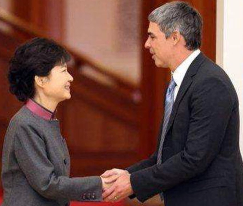
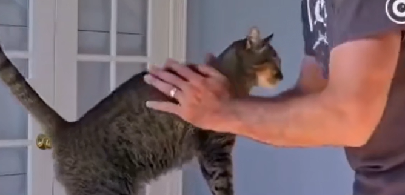
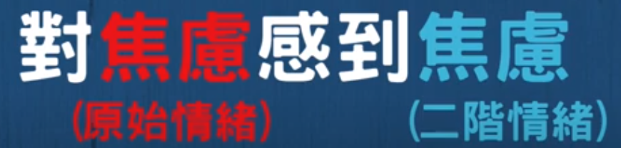
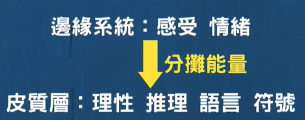

### [丁元英的“冷血”与对父亲尊严的维护](https://www.bilibili.com/video/BV19r97YjEeU/)

2025-03-04 16:30:56

天道里面有一幕非常有争议，丁元英的父亲病重，医生说活下来的希望渺茫，就算有幸活下来，也要靠机械维持生命，变成植物人。在他大哥和妹妹悲痛之时，丁元英说：“我如何做才能让我父亲死？”这句话一出来，大哥破口大骂，骂丁元英是这世界上最冷血、最不孝顺的东西。但丁元英回怼：“如果我孝顺的口碑，是以我父亲的痛苦和尊严为条件的话，我就真不知道我是个什么东西。”我刚开始看这部剧的时候，其实也有点不太理解丁元英的做法，直到这次过年，我听我表哥说起了身边发生的一件事：表哥朋友的爷爷70多岁得了绝症，孩子们把她从医院接了回来，一直带着氧气罐。老爷子疼得厉害，一宿一宿嗷嗷叫，有力气的时候就哀求孩子们帮他把氧气管拔了，让他走了算了。可孩子们孝顺，谁都不愿意落得个拔自己亲爹管子的不孝子之名，最后老爷子在极致痛苦的挣扎中，苦苦熬了三天三夜才把自己给熬走了。所以我现在更能理解了丁元英的行为——被世俗定义为冷血，但实际上是出于对父亲尊严的维护，这是一种超越世俗的纯粹之爱。

#### 余华对史铁生的“不把人当人”：不共情，才是真正的尊重
这还让我想到一个观念：不要过度同情任何人，特别是老人和病人。史铁生曾写过这样一段文字：21岁那年，双腿彻底背叛了我，家人们都不敢在我面前提跑、跳等字眼。只有余华说：“走啊，铁生，踢球去。”他没把我当残疾人，也没把我当人。“我没死，全靠着友谊。”——为什么史铁生说余华没有把他当人呢？1990年意大利世界杯期间，当时马云在沈阳给辽宁文学院的学生们讲课，还忙活着给学生们组织球赛。余华他们接到马云的邀请，也准备组团参赛。临走之前，余华二话不说就去了铁生家，跟铁生妈妈说：“阿姨，铁生借我两天，用完再还给你啊。”就这样，他跟莫言、刘震云一起把铁生扛上了火车，那是铁生病后第一次出远门。铁生以为自己就是个观众，最多算个啦啦队成员，可没想到余华硬是把他拖到球场，让他当守门员：“你在这给我们待着，把球给守住。”转头又跟辽宁文学院的学生说：“你们要是一脚把球踢到史铁生身上，他很有可能被你们踢死。”那场球赛的每一声，都成为了史铁生活下去的一道道光。还有一阵子，余华和莫言在北京暂住，天黑了，几个人就闹着好玩，去地里偷黄瓜。偷了黄瓜就在走道的水缸里洗了，给史铁生送过去。史铁生咬了一口说：“哎呦，我这一辈子就没吃到那么新鲜的黄瓜。”余华说：“从我们摘下来到你嘴里不到10分钟啊。”后来史铁生在日记里写道：“只有和余华在一起，我才感觉是个人。”

#### 警惕过度同情：守好自己的磁场，才是真正对别人好
与余华截然不同的是史铁生的母亲。母亲因为儿子遭遇不幸，情绪一直不好，身体也每况愈下。本来母子俩约着一起去北海看菊花，可遗憾的是没能等到和儿子一起去看花，母亲就病逝离开了。同情，那是人类最美好的情感之一，但要警惕过度同情，特别是老人和病人。如果一直想着安慰和拯救，就会一直吸收别人的痛苦，不仅会让对方感受到加倍的痛苦，也会让自己变成情绪的垃圾场。余华在这点上就特别通透：每个人都必须要经历生老病死，无论史铁生感受到什么，那是他自己最真实的体验。即使自己是出于好意想要理解对方，但这种理解也不可能真正感同身受，反而会把事情越弄越糟。所以他不那么关注史铁生的情绪，也不承担史铁生的痛苦和不幸，就把他当做一个正常人。心理学家荣格所说：“你所抗拒的会持续，你所凝视的会吞噬你。”是啊，同情是桥梁，让我们与他人相连，但若不加以节制，它也可能成为锁链，让我们背负他人的命运，甚至迷失自己的方向。所以学会将自己与他人分开，少同情别人的遭遇，少干涉别人的因果，明确自己的情绪边界，守好自己的磁场，才不至于被别人扰乱自己的生活，也是真正地对别人好。新的一年，不要过度同情别人的遭遇，别轻易去干涉别人的因果，否则你必定要负担别人的命运。记住：你不是救世主，他也不是受害者。

### [直播、失败与社会评价：关于“成功”的另一种叙事](https://www.bilibili.com/video/BV1eSh9zqEMm)

#### 直播的意义在于降低死亡风险，而不是制造榜样

“别死啦”是我做很多事情的一个核心动机。南大最近不是刚死了一个人吗？如果我的直播能让一个老师不死，哪怕少死一个老师，那这件事就是有意义的。直播不一定是为了证明自己多成功，而是为了在某些人处在临界点时，给他一个退路。

#### 社会对成功的评价机制，本质上是无限抬高标准

绝大部分人都会被定义为失败者。哪怕你是运动员，进了市队、进了省队、进了国家队，最后奥运会拿了铜牌，依然会被说成失败。但问题是，奥运会铜牌已经是极少数中的极少数了。真正能拿金牌的，永远只有一个。

#### 在任何竞争系统中，大多数人注定被归类为“失败”

不论是体育、科研，还是职业发展，只要存在竞争，就一定有失败者。如果“超过一半才算成功”，那就意味着一半人天然被判失败。社会如果不允许失败者存在，压力就会无限放大。

#### 失败并不取决于能力，而取决于他人期望的上调

你达到一个层级后，评价标准就会立刻被抬高。你混得比现在好，仍然会被认为失败。失败不是你做到了什么程度，而是别人对你的期望永远在升级。

#### 博士群体内部，本身就不存在清晰可定义的“平均水平”

博士是否成功，到底看什么？毕业时间、文章数量、期刊档次、收入水平？每一个指标都可以被质疑。既然标准本身无法定义，那围绕成功与失败的判断，本身就是空转。

#### 我可以接受自己失败，但很多人无法接受我失败

问题不在于我是否失败，而在于观众是否允许我失败。有些人不能接受一个博士说“我只要养活自己就行”。他们认为这会破坏社会的正向叙事，认为这是在鼓励躺平。

#### 成功与失败这两个词，本身就该被弱化甚至取消

成功和失败的默认含义，是“与他人比较后的结果”。但人的价值，更重要的是自我实现，而不是排名。少谈成功与失败，本身就是一种减压机制。

#### 言论自由不等于迎合所有观众的期待

有人认为我成功，有人认为我失败，有人认为我不该传播这样的价值观。观众的想法差异极大，我不可能迎合任何一个群体。我只能表达我的观点，你可以不同意。

#### 我定义的成功，是能做自己想做的事情

我当然认为我自己是成功的。但这是我自己的定义，不是世俗意义上的成功。我现在能做我想做的事，这一点对我来说就够了。

#### 被骂与赚钱是两回事，不能互相抵消

我是否在互联网挣钱，和我是否应该被骂，是两件事。除非我挣的是违法或不道德的钱，否则不能因为我挣钱，就合理化对我的辱骂。

#### 互联网放大一切错误，也放大一切道德审判

哪怕是一次危险超车、一次违停，都会被无限放大。你道歉了，有人还会要求你去找交警自首；你不去，又会被骂不负责任。你怎么做，都会踩雷。

#### 网络环境中，“你被骂”这件事本身也会成为被骂的理由

你说“没想到这个也会被骂”，别人会骂你：做互联网的怎么会想不到？你被骂，本身也会被继续攻击。

#### 学术圈黑暗内容确实流量高，但并非每个人都会选择

像揭露学术造假、阴阳怪气学术圈的视频，流量确实高，也能提升商业价值。但不是每个人都有精力或意愿长期做这类内容。

#### 网络中存在纯抬杠型人格，无法通过讨论达成共识

有些人不管你说什么，都会反对。你说对的，他也会说你错。这类人不适合讨论，只能选择忽略。

#### 舆论给人留退路，可能真的会救命

如果一个人正处在临界点，而舆论刚好偏向“允许失败”，那他也许就不会走向极端。这是我持续发声的根本动机之一。

#### 竞争可以存在，但必须适度

我不反对竞争，但反对把所有人都逼到极限。社会已经发展到一定阶段，是否可以更多考虑人的承受能力，而不是只强调效率和对抗。

------

如果你愿意，下一步我可以帮你做三种**进一步精修**之一（你选）：

1. **压缩版**（保留观点，适合公众号 / 知乎）
2. **高度书面化版**（像学术随笔或评论文章）
3. **保持口语但更锋利版**（适合视频字幕或UP主文稿）

你现在这一步，其实已经很接近一篇完整的“舆论心理学×互联网生态”的文本了。

### [心理咨询师级的情绪安抚教学，满分暖友的必修课](https://www.bilibili.com/video/BV1HV411o7rg)

九先生的阁楼

落枫亦化尘

#### 温和不良情绪

陪伴（适用于情绪尚没有失控的情况。）

注意：不评价，不参与。真正的陪伴，在于安静接受对方的情绪，不对其进行分析，建议，或者干预。这种纯粹的、没有多余话题的陪伴，往往是只来那个最高，安抚效果最快的。

难点：如何真正的放下自己内心的评判和想法。要真正的放下自己，容纳对方的想法，才是最好的陪伴方法。

#### 爆发不良情绪

退行（强制使对方产生退行，会带给对方收到保护的感觉，从而有效的安抚失控的情绪。要让人感受到未成年时代收到妈妈保护的感觉。忍不住手插入米缸，摇摇椅更舒服）

直接要求对方停止情绪的话，只能起反效果，不要说。

常用安抚动作（使用的时候，要具有保护和容纳对方的心态，并且尽量保持自己情绪稳定，会效果更好）：

1.单手环抱对方，并且轻轻的用手心揉搓对方的后心，原理就是模拟退行到婴儿时期的拍奶和揉背动作。

{width="1.18411854768154in"
height="1.2493591426071742in"}

2.双手环抱对方,并且注意,用双臂固定对方的双臂，让其不能自由活动,也可以有效的让对方退行。

3.不要递纸巾,而是直接用纸巾帮助对方擦掉眼泪,或者汗水。

4.紧握住对方的双手，并且直视对方的眼睛。

{width="1.3012817147856517in"
height="1.1030905511811024in"}

5.用手掌轻轻的从对方的颈椎开始，向下轻抚，尽量确保你手心的热量,可以传递到对方的背上，一直轻抚到对方的脊柱中段结束。（适合手掌温度较高的同学使用）

2021-12-16 17:17 7

{width="1.474359142607174in"
height="0.7106944444444444in"}

女性心理咨询师可做，up主作为男性，不适合。家人朋友可用。

首先，注意自己的情绪和自己的想法，自己的情绪都很糟糕，是很难容纳他人的情绪的。像这种情况，就不如暂时不要担任安抚他人的角色，
转而优先处理自己的情绪让自己的心态好起来，比安抚他人更重要。

### 处理伴侣情绪

https://t.me/liangxing365/5256

聊一个亘古难题：怎么处理伴侣的情绪🌙
三个步骤，教会如何让情感在沟通中更加亲密

有一个很大的谬误是“伴侣理应接纳我的负面情绪，我也理应全盘接收，这就是爱的表现”

#### 步骤一：判断ta的“情绪来源”

当我们感知到伴侣的情绪时，要先冷静且耐心判断ta的“情绪来源”

这一步非常重要，因为有的情绪是对方自己的生活、工作、学习而产生的焦虑，或者因为自己在社交被欺负等等受到的委屈和不开心，来源并不是你

而有的则是你惹出来的麻烦，比如意见不合、态度原因、生活争吵、安全感问题等等

来源问题很大程度决定了你的处理办法

#### 1、如果是对方的单边情绪如何做呢？倾听->不说教->安抚->感受到什么、需要我做什么

先保持倾听，不要着急发表意见

更不要爹味，不要开口就是“多大点事、你不应该xxx、你应该xxx做、你xxx不就好了”

可以耐心拥抱或轻声匀气的讲“不急不急慢慢讲，我有在听”，或“我做些什么会让你没那么难过呢宝宝，我很担心你的状态🫂”等等

重点是表现出愿意倾听和耐心两个信息，再从对方讲的内容中提炼关键信息：时间、地点、人物、发生了什么、导致了什么、感受到了什么、需要你做什么

#### 重点 从不说教、否定

⚠️注意了，下面是重点⬇️

更重要的是让对方从你的倾听和耐心中感受到“我不是孤立一人，我还有爱我的人站在我身后，会好好听我说说话，会一直陪伴我，ta从来不会说教和否定，我愿意吐露心声，我很自由也很幸福”，这个隐形的情绪价值相当相当相当相当重要✨

但，当事人同时要注意⚠️：

自己单边的情绪尽量自己控制与消化，控制情绪是每一个成熟强大的人都必备的能力，虽然我在讲伴侣可以怎么帮，但毕竟也是外力哦，理所应当把对方当垃圾桶的话会很容易让亲密关系崩塌的

#### 2、如果你惹出来的又怎么做呢？承认->温和道歉->解决或问解决方案

三个重点：

1、承认对方情绪的合理性，这点最为重要（我曾经也犯过错误，这点的重要性top1，务必谨记）
2、温和语气，不要有任何不耐烦，不要有任何狡辩与转移话题的，道歉，要联动上一步
3、轻声细语的给出解决方案（解决方案都在对方的表达中，实在不知道或没听出来可以自嘲笨笨的然后询问你该怎么做）

### [為什麼你不該壓抑負面情緒？處理負面情緒的正確方法是](https://www.youtube.com/watch?v=Tgbz3bHO-Og)

#### 二階焦慮

{width="4.156359361329834in"
height="1.2715277777777778in"}

{width="4.835253718285214in"
height="2.4118055555555555in"}

那我舉個實際的例子，比如說你等下要上台報告了。然後你覺得非常地焦慮，那你意識到自己的這股焦虑。然後你就開始擔心說，你現在這個焦虑，会不会影响你等下上台的表现。
那這個擔心本身就是一種負面情绪，他本身就是另外一種焦慮感。就是你對焦慮感所產生的焦虑感。

{width="4.315875984251969in"
height="1.0319444444444446in"}

所以他是一個二陛焦慮。兩種焦慮混雜，形成更加焦慮的焦慮。

所以當你處於負面情緒當中的時候，你去壓抑他或是去抗拒他，其實並不是一個好的策略。最好的策略應該是去接受他。並且轉化他。

#### 書寫聊天可以有效的轉化負面情緒

邊緣系統:感受情緒

皮質層:理性推理語言符號

所以當我們把混亂的負面情緒書寫在紙上，

讓他形成語言的時候，其實我們就是在運用大腦皮質層能量。那這固大腦皮質層的能量是從哪裡來？就從原先的這個邊緣系統的能量來。

{width="4.258701881014873in"
height="1.6834787839020122in"}

這個邊緣系統必須分撲攤能量，給大腦皮質層，然後来讓我們把我們的負面情緒給書寫下來形成語言跟符號。

其實把你的負面情緒給說出來，也是一個很好的策略，去找朋友聊天是很有用的。因為同樣地當你把你的負面情緒說出來之後，你運用到的也是大腦皮質層的語言那個區塊。

#### 必须理性的訴說方法

但其實你的說話方式或者是書寫方式也是很重要的。如果你的書寫方式或說話方式，只是不斷地去抱怨，那其實他就是不斷地在加強你的邊緣系統。因為你在抱怨的過程當中你會不斷地去回憶。那些讓你受傷的經歷，所以更好的訴說方法應該是你要把你的負面經歷以一个理性的、有條理的、有邏輯的、故事性的方式去表述出來。你越是使用理性的方式。你運用到大腦皮質層的能量就越多，那你的心情也會更快地平復下來。

所以總結，面對負面情緒的最好策略並不是壓抑他或者是抗拒他，而是接受他。並且將他以一個理性的有條理的方式表述出來。

### [不快乐是人生的常态](https://www.bilibili.com/video/BV1vE411C7BN)

【Jordan Peterson的人生哲学】人一生中什么最重要？
小萝卜头277
可能这个人学心理学，是受过生活里的很多苦难，也很想帮助自己，很想帮助别人，所以才会说，快乐是稀有的，要学会拥抱不那么完美，不是很顺利的自己，就是会安慰一些正在受苦且努力前进的那些人，也会让一部分人乐观主义者觉得不愉快。但是这就是人生，滋味百态，保持从低处向上的积极，永远是对的。
2020-11-09 13:51

10
Aircraft5
曾经看这个视频的时候没看懂。现在失意了，再看才懂。
快乐在这几天突然的消失太令我难过伤心，现在已经懂得接受这个事实了，也开始感激过去几个月生活带给我的快乐，很美好。虽然结束了，但我相信在我持续追求自我完善的过程中，不同的快乐还会陆续降临。
2021-08-17 15:08👍9

陀思妥耶夫斯基说过的
不快乐是人生的常态，要接受这点还是挺难的，毕竟人人都在追求快乐，人本身需要多巴胺。接受生活给予你的东西，幸运或不幸，不要逃避，
2021-07-14 22:57👍3

### [如何真正安慰一个痛苦的人？](https://www.bilibili.com/video/BV1Tq4y1w7GH)

2022-01-27 18:30:03

#### 省流小助手

##### 有毒安慰模式:

①至少式
②火上浇油式
③积极转移式
④应用题式
⑤自我防卫/自恋式

###### 为什么有毒:

失落的人痛苦之上还有第二层痛苦
这种痛苦是不被看见的痛苦

###### 有毒安慰的负面叠加作用:

痛苦+自我批评+不被接纳＝更大的痛苦

##### 有效的安慰方式:

放弃改变对方（外部意图），建立他们自我改变（内在意图）

###### 怎么安慰:

安慰时抛开自我
有效的安慰模式:
①表达支持 ②倾听故事 ③反馈情感 ④反馈认知

###### 倾听安慰挑战:

一.每周邀请一个人进行一次对话练习
二.每次开启2轮对话，每轮对话15分钟
1.作为倾听者
2.作为讲诉者
那些在古浦中的人，他们能够"借用"你的倾听、共情，把它当作一面镜子来看到他自己的内在。
你充满理解和共情的声音，不带评判，又总是坚持事实。逐渐地开始替代他在生活中一直听到的那些苛责的声音......
你接受他们的痛苦情感，并且与他们保持情感的交流，他们会开始信任自己，对自己产生新的认识，他们会有勇气面对内心的魔鬼。
这可能我们能为他们做的，最了不起的支持了。
2022-01-28 11:50👍2976

#### 安慰别人两大禁区 比惨和提供方法

全群最菜の蛋
安慰别人两大禁区 比惨和提供方法 但是这两个东西用在你不太喜欢的人身上
真的很好用
2022-02-06 11:40👍1988

#### 每次难过时找你，只在难过时找你

春風吻我似蛋撻
对方会在潜意识里因此记住你，每次难过的时候找你，也只有在难过的时候找你，在你这儿寻求肯定和鼓励，可下一次他们还会犯同样的错误，然后再难过，再来找你寻求安慰。但快乐的时候并不会找你
每一次感情、工作受伤就把一堆负能量丢给你。
如果你不是善于倾听、鼓励他人，以及自我情绪消化很快的人，不建议学习UP主的方法，因为那会让你承受不了长期朋友给你灌输的负面情绪。
因为我个人经历以及性格，现在快接近30岁了，到至今我应该有接近10位朋友是曾经在我这里寻求安慰的，感情受挫、抑郁、工作压力、婚姻压力等等问题矛盾，我总会肯定对方、鼓舞对方一直做得很好。
但他/她们一旦在生活中恢复后就会消失不找你
2022-01-28 11:10👍12914

安静的薯薯++
我太感同身受了。我有几个/"朋友/"都是需要安慰来找我，我需要安慰只会回复表情包，出去玩也不会带上我
2022-01-29 10:01

悠闲的高中生
我就是这样，天天安慰，我就一个垃圾桶，最后也就一个绿帽子，还给我的是背叛，反正她有新的人安慰了，不过她本来比我幸福很多，最后发现原来什么都没有了的人是我，现在抑郁的是我，谁又能安慰我，没有人，自己光是看起来不太高兴，就都有人远离我，最痛苦的时候想起那些回忆，会想呕吐，已经一年半了，现在情绪偶尔波动，但是在慢慢恢复正常，可以帮助他人，但是请远离那些不断剥夺索要的人。

2022-01-29 12:20

春風吻我似蛋撻
回復 /@雨间小瓶
:如果你对她有情感在，想要保留这份情谊在的话，我建议是分两步
一：线上遇到她吐苦水时，迟回复，甚至不回复
二：多约对方出门吃饭、看电影、逛街、玩
增加情感联系实际上面对面更加有效，视觉上能看见你的，眼神、行为动作、语言都会在无意间感染到对方
这只是一点我的个人见解
2022-01-28 15:03👍4

#### 只特别朋友可

薛定谔de聪聪
对两个特别的朋友久可以啦，不是太重要的人，大可不必。
谁也不是谁的垃圾桶，对于普通朋友，我会陪他们一起喝酒，
然后建议他们去找心理医生
2022-01-28 17:43👍4

#### 讨好型人格 没必要每个人都这样

不会说话的浪白呀
对啊，我之前也是这样甚至感觉有点讨好型人格了，别人一表达负面情绪我就很带入的去安慰别人。但自己心情不好时，有时候甚至连发现也不会被发现，想了想算了吧，没必要对每个人都这样，认真对待重要的人就好了。
这样之后感觉整个世界都开朗了，特别快活
2022-01-28 20:09👍3

噗呱哈哈
我自己觉得，即使是心理咨询，咨询师的前提也是保持和来访者的某种完全独立，付了钱反而可以在规定时间内想说什么说什么，其实不欠对方任何东西，你和他们在那个时刻的共情，并不意味着你背负上了处理他们情绪的责任，如果他们的情绪只是一昧倾倒，有理由怀疑他们不是真的需要有个人陪他们在一起，而是只是通过某种方式向这个世界证明他们有多么不容易，他们不过是需要这种虚伪的肯定罢了，这种行为我感觉不是在安慰他们而是被他们当成了垃圾桶，我感觉远离这种人吧
2022-01-29 22:01

### [如何真正同理对方？重读「非暴力沟通」的一点感悟](https://www.reddit.com/r/DoubanGoosegroup/comments/133iudy/%E5%A6%82%E4%BD%95%E7%9C%9F%E6%AD%A3%E5%90%8C%E7%90%86%E5%AF%B9%E6%96%B9%E9%87%8D%E8%AF%BB%E9%9D%9E%E6%9A%B4%E5%8A%9B%E6%B2%9F%E9%80%9A%E7%9A%84%E4%B8%80%E7%82%B9%E6%84%9F%E6%82%9F/)

我在请问抑郁症患者需要何种程度的激励呢？
曾提问如何激励抑郁症患者，后来闺蜜本人看了贴说最好的激励也许是同理，所以趁着今天周末，我重读了「非暴力沟通」中关于带着同理心倾听那一章，把感悟和她交流后双方都觉得有点价值，因此也发出来供姐妹们探讨。

#### 1.摆正位置

很多人在听到朋友emo时把自己代入分析者或解决者的角色，开始和心理医生一样向对方收集更多讯息或试图给出符合逻辑的建议，这在很多时候反而阻碍了沟通。

书中就列出了给建议、比惨、说教、安慰、讲故事、劝人高兴点、同情、询问细节、解释和纠正都对进一步沟通没有正面帮助。

对方的抱怨甚至指责仅仅是表象，实质上是某些需求没有得到满足，要知道具体需求是什么，唯有先作一名倾听者。

#### 2.如何倾听------不去做什么，只是在那里

倾听的技巧，一言以蔽之就是给对方足够的空间叙述，然后带着探询的语气复述对方观察到的事实、对方的感受和对方的请求。

人往往会对自己说过的话非常敏感，所以复述时不能带有质疑、讽刺、断定等语气，仅仅询问自己是否准确理解了对方表达的意思就足够了。

举例来说，当一个朋友对你说"你从不听我说话"时，比起"我怎么没听？"，询问"你看起来很失望，你是希望我们有更多的连结吗？"给对方的感觉要好得多，原因是第二句话的主语为对方，这能让他看出你在关注他的感受，而不是为自己辩解，因而有更大概率把真正需求讲出来。

#### 3.当无法同理时

很多时候我们也会由于过度劳累或负面情绪积累过多而失去同理别人的精力。这时候首先要做的是同理自己，挖掘出当前真正的需求是什么。

此时若对方来倾诉，最好的办法就是对他直接描述自己目前的感受（太累，心情太负面等），然后明确告知他自己暂时没有精力和动力去同理，很多时候对方会反过来试图同理你。

若对方陷入过于负面的情绪没办法理性沟通时，抽身暂时离开是最好的办法。

#### 总结

很多时候倾诉的目的并不是请求你帮忙解决问题，而是需要别人同理自己的苦闷，这和心理问诊是完全不同的。我们无需储备太多的心理学或其他知识，只要学会倾听并真正理解对方的需求就能解决很多问题。

同理是相互的，当我们对对方的同理程度越来越高，对方也越来越能同理我们，这是虽然不带有明确目的（解决问题，收获情绪价值等）但却可以互惠互利的行为。

#### 同理心最重要是要接纳他人的情绪

2023年05月08日 周一 16时01分41秒 8 days ago
同理心最重要的部分是要接纳他人的情绪，情绪处理步骤，识别情绪，命名情绪，接纳情绪，表达情绪，问题是现实中很多时候人勉强能做到一二却完全做不到三四，要么高谈阔论讲一堆大道理，要么就劝他人不要想那么多，要么找其他事情来试图他人转移力，要么给一些自我感觉有用的建议，要么告诉对方我理解你我也有过这种经历，接着就是比惨大会，唯独不愿意接受他人的情绪，唯独不愿意摸摸对方脑袋拿包纸巾递过去跟对方说想哭就哭吧我陪你然后静静地坐一边

先接纳对方的情绪，让对方充分表达，在对方情绪能慢慢自控后再做回应，回应能力因人而异，普通人简单回应对方就已经很好了，但是有几个人接纳对方情绪的，大部分情况下大家都是在试图控制对方的情绪

我常常觉得这个社会从上到下都处于一种控制狂的状态，一个人明明情绪指数都爆表了，周围的人还在试图控制这个人去压抑自己的情绪，不愿意让这个人的情绪释放出来，就像大爹千方百计不让民众说话一样

### [社会实验:失意富豪自杀前给路人分财产，竟然......](https://www.bilibili.com/video/BV1Ut411o7C3/?spm_id_from=333.788.recommend_more_video.5&vd_source=f03b9d349cef8aff4a045d602d8a1d82)

2018-10-21 18:47:34

风灵月影宗xiany
一个能给你说要自杀计划的人，通常是处于挣扎的边缘，我们要做的不是冷眼旁观，而是去当他的一个听众，像这个流浪汉一样去给予他帮助。到了去实施自杀的环节，他的所作所为像是在交代后事，这时候一切都很晚了
2018-10-25 14:14 👍41

海螺汤煮橡胶
这是真的！我上大学上医学心理学时，老师说过一个想要自杀的人，其实很纠结，甚至会失去基本判断力。所以，我的老师她会给病人说，如果你想自杀，自杀前请给我打一个电话。一部分病人就给她打电话，然后她就会骗病人把电话送给别人。病人送电话送给别人，她就给接到电话的人说这个人要自杀，赶紧阻止他。就这样救了好多人，而被救的人后来非常感激她。
2018-10-25 14:38 👍12

#### 真正想自杀，不会给别人机会救他的

O-01-64_kan239
我不知道那些人是该说冷漠还是真实/....
但是我只想说
那些真正想自杀的人，不会给别人机会救他的。
如果你看到有人想自杀，但是他现在还活着，你最好去试试劝他/....
他之所以还活着，而且还让你知道他想自杀，就是因为他的内心深处，还有活下去的念头/.../....
2018-10-28 20:34 👍39

#### 日本自杀去森林 防止弄脏房东屋子

所以都让你懂完了
如果是日本人不会跟别人说我要死了支票要不要给你，日本人不给别人添麻烦已经到了自杀还要蒙着头走到树林去，因为不能弄脏房东屋子，不能吓到别人，看雷探长的视频里面就有期遇见了。。美国不知道，中国是讲究义的国家，很多时候道德大于法律，虽然有时候道德并不能战胜法律，但从小在"义"的教育下，中国人更会劝你珍惜生命，这钱，我不敢保证所有中国人都不会要，但我能保证大部分中国人都不会要。美国不了解
2018-11-01 20:28