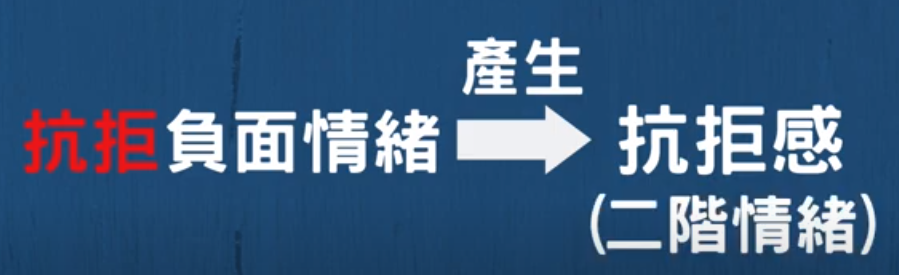
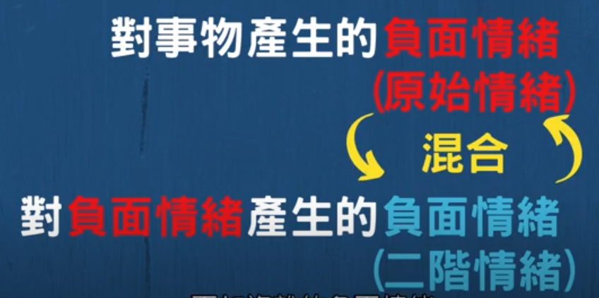
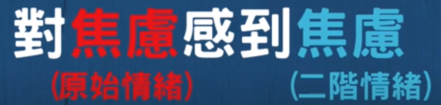
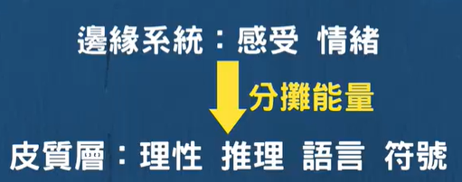
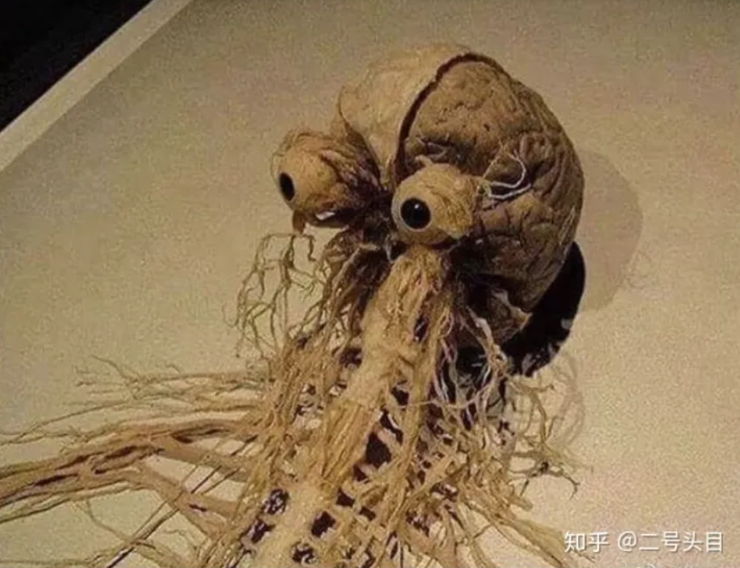
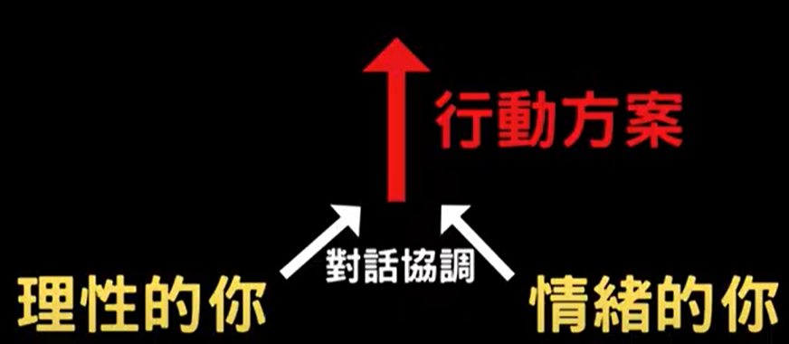

### [為什麼你不該壓抑負面情緒？處理負面情緒的正確方法是](https://www.youtube.com/watch?v=Tgbz3bHO-Og)

#### 二階焦慮

{width="4.156359361329834in"
height="1.2715277777777778in"}

{width="4.835253718285214in"
height="2.4118055555555555in"}

那我舉個實際的例子，比如說你等下要上台報告了。然後你覺得非常地焦慮，那你意識到自己的這股焦虑。然後你就開始擔心說，你現在這個焦虑，会不会影响你等下上台的表现。-
那這個擔心本身就是一種負面情绪，他本身就是另外一種焦慮感。就是你對焦慮感所產生的焦虑感。

{width="4.315875984251969in"
height="1.0319444444444446in"}

所以他是一個二陛焦慮。兩種焦慮混雜，形成更加焦慮的焦慮。

所以當你處於負面情緒當中的時候，你去壓抑他或是去抗拒他，其實並不是一個好的策略。最好的策略應該是去接受他。並且轉化他。

#### 書寫聊天可以有效的轉化負面情緒

邊緣系統:感受情緒

皮質層:理性推理語言符號

所以當我們把混亂的負面情緒書寫在紙上，

讓他形成語言的時候，其實我們就是在運用大腦皮質層能量。那這固大腦皮質層的能量是從哪裡來？就從原先的這個邊緣系統的能量來。

{width="4.258701881014873in"
height="1.6834787839020122in"}

這個邊緣系統必須分撲攤能量，給大腦皮質層，然後来讓我們把我們的負面情緒給書寫下來形成語言跟符號。

其實把你的負面情緒給說出來，也是一個很好的策略，去找朋友聊天是很有用的。因為同樣地當你把你的負面情緒說出來之後，你運用到的也是大腦皮質層的語言那個區塊。

#### 必须理性的訴說方法

但其實你的說話方式或者是書寫方式也是很重要的。如果你的書寫方式或說話方式，只是不斷地去抱怨，那其實他就是不斷地在加強你的邊緣系統。因為你在抱怨的過程當中你會不斷地去回憶。那些讓你受傷的經歷，所以更好的訴說方法應該是你要把你的負面經歷以一个理性的、有條理的、有邏輯的、故事性的方式去表述出來。你越是使用理性的方式。你運用到大腦皮質層的能量就越多，那你的心情也會更快地平復下來。

所以總結，面對負面情緒的最好策略並不是壓抑他或者是抗拒他，而是接受他。並且將他以一個理性的有條理的方式表述出來。

### [不快乐是人生的常态](https://www.bilibili.com/video/BV1vE411C7BN)

【Jordan Peterson的人生哲学】人一生中什么最重要？

小萝卜头277

可能这个人学心理学，是受过生活里的很多苦难，也很想帮助自己，很想帮助别人，所以才会说，快乐是稀有的，要学会拥抱不那么完美，不是很顺利的自己，就是会安慰一些正在受苦且努力前进的那些人，也会让一部分人乐观主义者觉得不愉快。但是这就是人生，滋味百态，保持从低处向上的积极，永远是对的。

2020-11-09 13:51

10

Aircraft5

曾经看这个视频的时候没看懂。现在失意了，再看才懂。

快乐在这几天突然的消失太令我难过伤心，现在已经懂得接受这个事实了，也开始感激过去几个月生活带给我的快乐，很美好。虽然结束了，但我相信在我持续追求自我完善的过程中，不同的快乐还会陆续降临。

2021-08-17 15:08

9

陀思妥耶夫斯基说过的

不快乐是人生的常态，要接受这点还是挺难的，毕竟人人都在追求快乐，人本身需要多巴胺。接受生活给予你的东西，幸运或不幸，不要逃避，

2021-07-14 22:57

3

### [如何真正安慰一个痛苦的人？](https://www.bilibili.com/video/BV1Tq4y1w7GH)

2022-01-27 18:30:03

#### 省流小助手

有毒安慰模式:/
①至少式/
②火上浇油式/
③积极转移式/
④应用题式/
⑤自我防卫/自恋式/
为什么有毒:/
失落的人痛苦之上还有第二层痛苦/
这种痛苦是不被看见的痛苦/
有毒安慰的负面叠加作用:/
痛苦+自我批评+不被接纳＝更大的痛苦/
有效的安慰方式:/
放弃改变对方（外部意图），建立他们自我改变（内在意图）/
怎么安慰:/
/-/--安慰时抛开自我/
有效的安慰模式:/
①表达支持 ②倾听故事 ③反馈情感 ④反馈认知/
倾听安慰挑战:/
一.每周邀请一个人进行一次对话练习/
二.每次开启2轮对话，每轮对话15分钟/
1.作为倾听者/
2.作为讲诉者/
那些在古浦中的人，他们能够"借用"你的倾听、共情，把它当作一面镜子来看到他自己的内在。/
你充满理解和共情的声音，不带评判，又总是坚持事实。逐渐地开始替代他在生活中一直听到的那些苛责的声音....../
你接受他们的痛苦情感，并且与他们保持情感的交流，他们会开始信任自己，对自己产生新的认识，他们会有勇气面对内心的魔鬼。/
这可能我们能为他们做的，最了不起的支持了。

2022-01-28 11:502976

#### 安慰别人两大禁区 比惨和提供方法

全群最菜の蛋

安慰别人两大禁区 比惨和提供方法 但是这两个东西用在你不太喜欢的人身上
真的很好用

2022-02-06 11:401988

#### 每次难过时找你，只在难过时找你

春風吻我似蛋撻

对方会在潜意识里因此记住你，每次难过的时候找你，也只有在难过的时候找你，在你这儿寻求肯定和鼓励，可下一次他们还会犯同样的错误，然后再难过，再来找你寻求安慰。但快乐的时候并不会找你/
每一次感情、工作受伤就把一堆负能量丢给你。/
如果你不是善于倾听、鼓励他人，以及自我情绪消化很快的人，不建议学习UP主的方法，因为那会让你承受不了长期朋友给你灌输的负面情绪。/
因为我个人经历以及性格，现在快接近30岁了，到至今我应该有接近10位朋友是曾经在我这里寻求安慰的，感情受挫、抑郁、工作压力、婚姻压力等等问题矛盾，我总会肯定对方、鼓舞对方一直做得很好。/
但他/她们一旦在生活中恢复后就会消失不找你

2022-01-28 11:1012914

安静的薯薯

我太感同身受了。我有几个/"朋友/"都是需要安慰来找我，我需要安慰只会回复表情包，出去玩也不会带上我

2022-01-29 10:01

悠闲的高中生

我就是这样，天天安慰，我就一个垃圾桶，最后也就一个绿帽子，还给我的是背叛，反正她有新的人安慰了，不过她本来比我幸福很多，最后发现原来什么都没有了的人是我，现在抑郁的是我，谁又能安慰我，没有人，自己光是看起来不太高兴，就都有人远离我，最痛苦的时候想起那些回忆，会想呕吐，已经一年半了，现在情绪偶尔波动，但是在慢慢恢复正常，可以帮助他人，但是请远离那些不断剥夺索要的人。

2022-01-29 12:20

春風吻我似蛋撻

回復 /@雨间小瓶
:如果你对她有情感在，想要保留这份情谊在的话，我建议是分两步/
一：线上遇到她吐苦水时，迟回复，甚至不回复/
二：多约对方出门吃饭、看电影、逛街、玩/
增加情感联系实际上面对面更加有效，视觉上能看见你的，眼神、行为动作、语言都会在无意间感染到对方/
这只是一点我的个人见解

2022-01-28 15:034

#### 只特别朋友可

薛定谔de聪聪

对两个特别的朋友久可以啦，不是太重要的人，大可不必。/
谁也不是谁的垃圾桶，对于普通朋友，我会陪他们一起喝酒，/
然后建议他们去找心理医生

2022-01-28 17:434

#### 讨好型人格 没必要每个人都这样

不会说话的浪白呀

对啊，我之前也是这样甚至感觉有点讨好型人格了，别人一表达负面情绪我就很带入的去安慰别人。但自己心情不好时，有时候甚至连发现也不会被发现，想了想算了吧，没必要对每个人都这样，认真对待重要的人就好了。/
这样之后感觉整个世界都开朗了，特别快活

2022-01-28 20:093

噗呱哈哈

我自己觉得，即使是心理咨询，咨询师的前提也是保持和来访者的某种完全独立，付了钱反而可以在规定时间内想说什么说什么，其实不欠对方任何东西，你和他们在那个时刻的共情，并不意味着你背负上了处理他们情绪的责任，如果他们的情绪只是一昧倾倒，有理由怀疑他们不是真的需要有个人陪他们在一起，而是只是通过某种方式向这个世界证明他们有多么不容易，他们不过是需要这种虚伪的肯定罢了，这种行为我感觉不是在安慰他们而是被他们当成了垃圾桶，我感觉远离这种人吧

2022-01-29 22:01

### [如何真正同理对方？重读「非暴力沟通」的一点感悟](https://www.reddit.com/r/DoubanGoosegroup/comments/133iudy/%E5%A6%82%E4%BD%95%E7%9C%9F%E6%AD%A3%E5%90%8C%E7%90%86%E5%AF%B9%E6%96%B9%E9%87%8D%E8%AF%BB%E9%9D%9E%E6%9A%B4%E5%8A%9B%E6%B2%9F%E9%80%9A%E7%9A%84%E4%B8%80%E7%82%B9%E6%84%9F%E6%82%9F/)

我在请问抑郁症患者需要何种程度的激励呢？
曾提问如何激励抑郁症患者，后来闺蜜本人看了贴说最好的激励也许是同理，所以趁着今天周末，我重读了「非暴力沟通」中关于带着同理心倾听那一章，把感悟和她交流后双方都觉得有点价值，因此也发出来供姐妹们探讨。

#### 1.摆正位置

很多人在听到朋友emo时把自己代入分析者或解决者的角色，开始和心理医生一样向对方收集更多讯息或试图给出符合逻辑的建议，这在很多时候反而阻碍了沟通。

书中就列出了给建议、比惨、说教、安慰、讲故事、劝人高兴点、同情、询问细节、解释和纠正都对进一步沟通没有正面帮助。

对方的抱怨甚至指责仅仅是表象，实质上是某些需求没有得到满足，要知道具体需求是什么，唯有先作一名倾听者。

#### 2.如何倾听------不去做什么，只是在那里

倾听的技巧，一言以蔽之就是给对方足够的空间叙述，然后带着探询的语气复述对方观察到的事实、对方的感受和对方的请求。

人往往会对自己说过的话非常敏感，所以复述时不能带有质疑、讽刺、断定等语气，仅仅询问自己是否准确理解了对方表达的意思就足够了。

举例来说，当一个朋友对你说"你从不听我说话"时，比起"我怎么没听？"，询问"你看起来很失望，你是希望我们有更多的连结吗？"给对方的感觉要好得多，原因是第二句话的主语为对方，这能让他看出你在关注他的感受，而不是为自己辩解，因而有更大概率把真正需求讲出来。

#### 3.当无法同理时

很多时候我们也会由于过度劳累或负面情绪积累过多而失去同理别人的精力。这时候首先要做的是同理自己，挖掘出当前真正的需求是什么。

此时若对方来倾诉，最好的办法就是对他直接描述自己目前的感受（太累，心情太负面等），然后明确告知他自己暂时没有精力和动力去同理，很多时候对方会反过来试图同理你。

若对方陷入过于负面的情绪没办法理性沟通时，抽身暂时离开是最好的办法。

#### 总结

很多时候倾诉的目的并不是请求你帮忙解决问题，而是需要别人同理自己的苦闷，这和心理问诊是完全不同的。我们无需储备太多的心理学或其他知识，只要学会倾听并真正理解对方的需求就能解决很多问题。

同理是相互的，当我们对对方的同理程度越来越高，对方也越来越能同理我们，这是虽然不带有明确目的（解决问题，收获情绪价值等）但却可以互惠互利的行为。

#### 同理心最重要是要接纳他人的情绪

2023年05月08日 周一 16时01分41秒8 days ago

同理心最重要的部分是要接纳他人的情绪，情绪处理步骤，识别情绪，命名情绪，接纳情绪，表达情绪，问题是现实中很多时候人勉强能做到一二却完全做不到三四，要么高谈阔论讲一堆大道理，要么就劝他人不要想那么多，要么找其他事情来试图他人转移力，要么给一些自我感觉有用的建议，要么告诉对方我理解你我也有过这种经历，接着就是比惨大会，唯独不愿意接受他人的情绪，唯独不愿意摸摸对方脑袋拿包纸巾递过去跟对方说想哭就哭吧我陪你然后静静地坐一边

先接纳对方的情绪，让对方充分表达，在对方情绪能慢慢自控后再做回应，回应能力因人而异，普通人简单回应对方就已经很好了，但是有几个人接纳对方情绪的，大部分情况下大家都是在试图控制对方的情绪

我常常觉得这个社会从上到下都处于一种控制狂的状态，一个人明明情绪指数都爆表了，周围的人还在试图控制这个人去压抑自己的情绪，不愿意让这个人的情绪释放出来，就像大爹千方百计不让民众说话一样

### [社会实验:失意富豪自杀前给路人分财产，竟然......](https://www.bilibili.com/video/BV1Ut411o7C3/?spm_id_from=333.788.recommend_more_video.5&vd_source=f03b9d349cef8aff4a045d602d8a1d82)

2018-10-21 18:47:34

风灵月影宗xiany

一个能给你说要自杀计划的人，通常是处于挣扎的边缘，我们要做的不是冷眼旁观，而是去当他的一个听众，像这个流浪汉一样去给予他帮助。到了去实施自杀的环节，他的所作所为像是在交代后事，这时候一切都很晚了

2018-10-25 14:14 41

海螺汤煮橡胶

这是真的！我上大学上医学心理学时，老师说过一个想要自杀的人，其实很纠结，甚至会失去基本判断力。所以，我的老师她会给病人说，如果你想自杀，自杀前请给我打一个电话。一部分病人就给她打电话，然后她就会骗病人把电话送给别人。病人送电话送给别人，她就给接到电话的人说这个人要自杀，赶紧阻止他。就这样救了好多人，而被救的人后来非常感激她。

2018-10-25 14:38 12

#### 真正想自杀，不会给别人机会救他的

O-01-64_kan239

我不知道那些人是该说冷漠还是真实/....

但是我只想说

那些真正想自杀的人，不会给别人机会救他的。

如果你看到有人想自杀，但是他现在还活着，你最好去试试劝他/....

他之所以还活着，而且还让你知道他想自杀，就是因为他的内心深处，还有活下去的念头/.../....

2018-10-28 20:34 39

#### 日本自杀去森林 防止弄脏房东屋子

所以都让你懂完了

如果是日本人不会跟别人说我要死了支票要不要给你，日本人不给别人添麻烦已经到了自杀还要蒙着头走到树林去，因为不能弄脏房东屋子，不能吓到别人，看雷探长的视频里面就有期遇见了。。美国不知道，中国是讲究义的国家，很多时候道德大于法律，虽然有时候道德并不能战胜法律，但从小在"义"的教育下，中国人更会劝你珍惜生命，这钱，我不敢保证所有中国人都不会要，但我能保证大部分中国人都不会要。美国不了解

2018-11-01 20:28

### [大脑可塑性原理 张朝阳 不去想问题就不会焦虑](https://www.bilibili.com/video/BV1wa411f7d5)
发布于 2023-01-22 07:00
#### 诺贝尔奖金级别研究 放大自我

有一个很著名的获得诺贝尔奖金级别的一个研究，就是叫做大脑可塑性原理。人的大脑是可塑的。如果你的行为不对，它就会加强你的负向，你过去什么样的，会加强你现在什么样的。如果你的行为正确，那你就可以彻底改变自己。这样的意思就是说，从教育来讲的话，一个人不要抱怨自己从小在哪长大，父母是怎么样的，真的不要抱怨，就因为那个是你的小时候。但是你是可以彻底改变自己的。这是最先进的心理学的研究。对于我们的话，每个人都是可以去重塑我们的大脑的。

#### 动物是在贪婪和恐惧中长大

其实，我们人类作为动物来讲的话，我们动物是在贪婪和恐惧中长大的。我们的动物脑是在贪婪和恐惧中构成的。后来人类在动物脑之上构建了前额叶和海马区的扩大，所以说，我们的恐惧和焦虑是我们人类的本质。我们在恐惧当中去避免了什么？我们在狼群来了我们逃跑。焦虑和恐惧是我们人类思想的本质。

#### 人天生喜钻牛角尖

所以说，很多人无论是某些人自杀了或者是深陷泥潭，其实你就说他一定碰到了什么特别巨大的事情，一定是很糟糕的。不是的，可能是一件很小的事情，是他后来的行为不正确把它放大了。人是具有天生的钻牛角尖的能力的。对我们现在就要有一种正确的行为。心理学告诉我们如何叫我们不钻牛角尖。行为心理学和脑科学，它是一个雪山的两面。行为心理学是从人的感受方面建立一个理论。行为上的一种反应，而大脑是研究大脑的结构，你的Cerebral就是你的深层脑和上层脑。

#### 海马区和前额叶与恐惧中心建立回路

然后，你会发现海马区和前额叶是你的地方，它们跟整个你的恐惧中心建立了一个回路。这个回路是自行会消失的，它的营养来自于你对它的关注。当你关注的时候，它就会生长。所以说，大脑科学研究的英文叫做Wiring
and Firing Together。

#### 发热就是脑神经之间的钙离子交换

#### 关注的时候，它就会连接 放大

当你发热的时候就在思考关注，发热就是脑神经之间的钙离子交换，是在思考过程和关注。当你关注的时候，它就会连接，就Wiring。发热的时候就会Wiring。所以，你只要一关注它，它就会放大。因此，你的海马区和前额叶会产生一些推理、论证、焦虑、想象、联想等疯狂想法，然后它们会跟你的恐惧中心建立一个回路。这时候，如果你去解决它，你就相当于给这个回路增加营养，这个回路就会加强。因为我们的大脑可以比喻为一个像一个灭蚊器里边啪啪啪各种想法，也可以比喻为一个沼泽地。我们很容易就陷入一个想法里面去了，但是经常是当我们有主动的去对很多东西兴奋的时候，对很多东西兴奋就好像我们在这个在沼泽地上有很多的连接的东西，让我们不容易陷下去。我们可能对很多兴奋，所以我们每天早上念经也好，或者跟别人说话也好，这种说话让我们兴奋起来，兴奋起来使得我们随时的关注了一些事情，而且这些事情让我们感觉到很有意义。这样的话，我们的关注都一直在这，使得我们陷入某些东西。

#### 一旦形成回路 越陷越深

一旦形成回路，本来不是一个什么大事，变成了特别巨大的事，然后就越陷越深。所以一个行为、一个想法、一个动作是一个行为，这个行为就像物理学里面一样，它有一个坐标，有几个参数，其中它的动机是一个参数。所以就说你的解决焦虑就放大焦虑，然后你的不小心就跟走钢丝似的。你以为你没有在解决焦虑，你又在解决焦虑，好吧这是最大的问题。看起来不像你在做这个东西。

#### 对自己彻底的诚实 当你焦虑、恐惧、难受 做人生更重要的事

所以对自己彻底的诚实就是当你焦虑、恐惧、难受的时候，你忍着难受，但是你还有人生更重要的事情要做。你去做那件事情，这件事情跟你这事没有关系。这样你就会突然发现，你焦虑本来在这
Diffused。OK
走，然后你当走了以后，你说唉，别人说你是不是要得什么病了，谁告诉我没有这个事儿。你就会这种态度，你就当他远离一口。但是没想到几周前或者几个月前，你还每天在忐忑不安的我要得这个病，我要得那个病，对吧。这就叫远离。知道了吗？网友，你们都记住好吗？
#### 评论

我话山居不记年 慕尚
这是当今神经心理学非常重要的研究成果，在你这成了忽悠了
2023-03-09 · IP 属地北京
##### 精力集中到弱化相关神经而不是bad things

阳了个阳

同时也给我们启示：

我们要把精力集中到弱化相关神经的方向，而不是错误地将精力集中到bad
things上（虽然你觉得集中到错误上很有用，但是实际上是制造焦虑的过程）

2023-01-26 · IP 属地湖南

##### 人的思想会扭曲事实

luzhiyuan

其实就是，人的思想会扭曲事实。

事实不会伤害我们，伤害我们的是我们对事实的解读。

2023-01-31 · IP 属地江苏

### [张朝阳谈焦虑：焦虑是不能解决的，越解决越放大](https://www.bilibili.com/video/BV1s24y1q7zo/)

2023-02-09 20:01:44

### [所有心理问题本质都是生理问题](https://www.zhihu.com/question/283474944/answer/816084307)

**首先要好好锻炼身体**

**人就是大脑这坨蛋白质和脂肪泡在一个大培养皿里，培养皿就是身体，如果培养皿本身有问题，大脑也会跟着出问题，表现就是各种精神病，或者虚，啥也不想干等等，近代心理学研究最前沿的观点认为，所有心理问题本质都是生理问题，可以通过改造体质来得到解决。前两天这么一个图特别火：**

{width="4.333333333333333in"
height="3.326388888888889in"}

这是人体的神经系统，剩下的身体是这个神经体统在地球上生活的"太空服"，或者说是个培养皿，负责输入输出的提供能量的。所以练起来，提前练起来，到了35岁才会不那么"懈怠"，如果你不那么懈怠，不那么虚，可能就不会在35岁被抛到人才市场了，或者如果发生了什么事，也有心力去重新开始。其次要提前给生活增加不确定性。

前段时间有个小伙伴跟我说，他说他看我业余写文章觉得自己周末刷抖音充满罪恶感，想业余做电影解说，可是自己是个丑逼，不敢上镜头，而且担心视频做的不好丢人。我跟他说别这么想，尽管你确实很丑，但是这个不是不去做的借口，你可以不露面嘛，而且刚开始视频肯定做不好，这个不用担心，我认识几个电影博主和B站游戏博主，都是做了好些年，慢慢人气越来越高，而且得加入自己的特色，不管做啥，大众传媒类的东西都得有博主自己的特点在里边，不然几乎不会火。而这种个人特色，需要大家去慢慢挖掘，你不可能一上来就有人看，也不可能刚开始做就火，人家别的主播都是费尽心机日以继夜地搞，你凭啥轻轻松松的火起来？而且吧，要有"卖弄思维"，学会了点啥赶紧发个视频，做个小成果发什么平台上去，万一火了呢，油管上有个up主天天拍他闺女溜达来溜达去竟然火了，微博上某大V养了一只猫一只狗天天拍也拍成了一线网红，要相信这个星球上有玄学。当然了，不是说做了几年就能火起来，到底最终能做成啥样，一方面是个人风格是不是那种长线能吸引人；另一方面是人生的关键，运气。但是首先得去做。

运气这玩意我之前聊过一次，再贴出来吧：一般来说吧，你做的每件事确定性都很强，学校时候好学生，毕业好员工，你很少冒险，人生按部就班，这样的话，你很容易成为彻彻底底无神论者，也不太迷信。因为拜佛不拜佛对你没啥差别，你也感觉不到有差别。如果你从事高冒险性质的活动，对运气要求很高，比如打鱼为生，需要出海，或者从事黑社会，每天睡着不知道能不能醒来，或者你跟博主一样，业余写文章，就能发现文章能不能破十万加很大程度上是随缘的，好几次我马上要十万加或者已经上去了，就被删了。

### [如何透過自我對話提升你的行動力？](https://www.youtube.com/watch?v=Ne79Sg-btTs)

{width="5.768055555555556in"
height="2.5131944444444443in"}

image-20211218185004067

7点到了，不想工作，不想写东西。不要忽视自己身体里的另一个情绪的你，不要强迫他马上去工作，而是慢慢协调，不想写五千字写五百字好不好，不想写五百字写十个字好不好，不想写任何多少字打开电脑，手放在键盘上好不好。手放在键盘上后我们可以去吃宵夜。

经常性地这样协调，化解体内两个自我的冲突，这样你的行动力会越来越强。
�地这样协调，化解体内两个自我的冲突，这样你的行动力会越来越强。
