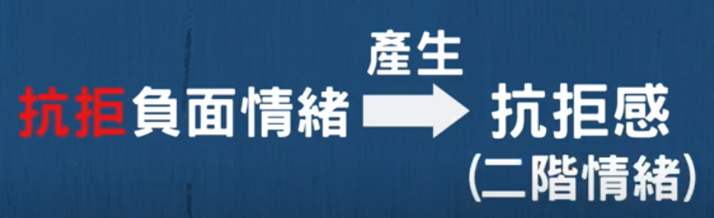
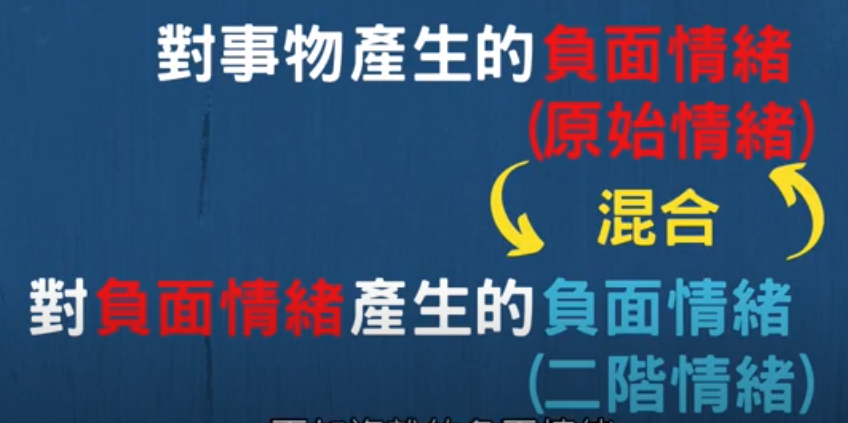
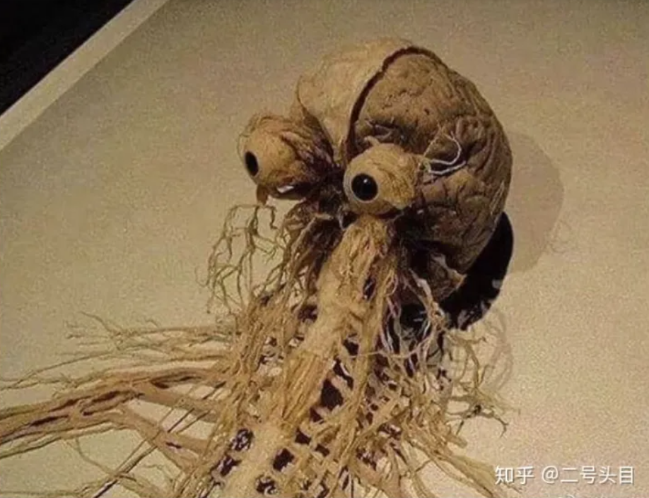
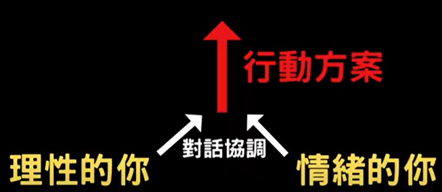

### [25到30岁的精神崩溃，是童年创伤的精准兑付](https://www.zhihu.com/question/1943330524467819558/answer/2043812111076393732)

发布于2026-05-29 21:52

你有没有发现一个极其精准的规律——很多人25岁之前活得没心没肺，再大的事睡一觉就过去了。但一脚踏入25到30岁这个区间，会毫无征兆地经历一场连根拔起的精神崩溃。你可能会突然抑郁，突然焦虑，突然对所有热爱的东西失去兴趣，突然觉得活着毫无意义。你会把这一切归咎于工作不顺、感情失败、房贷压力，但你不知道的是，这些都只是点燃炸药的火星。真正的炸药包早在你五六岁的时候，就已经埋在了你的潜意识里。25到30岁的这场大爆发，从来不是一场意外的灾难，而是童年创伤迟到了二三十年的精准兑付。

#### 不是突然崩溃，是大脑终于醒了

为什么偏偏是25到30岁，不是18岁成年那天，也不是40岁不惑之年？答案藏在神经科学最基础的结论里——人类大脑的前额叶皮层，也就是负责理性决策、情绪调节、自我认知的最高司令部，要到25岁左右才会完全发育成熟。在这之前的二十多年里，在真正拥有自我觉察之前，我们的一举一动都循着童年时期被环境塑造的行为惯性前行。你所有的行为模式、所有的情绪反应、所有的人际关系模板，都是在你6岁之前，为了适应当时的生存环境，被父母和环境打磨定型的。

小时候被忽视的孩子，会自动写好“讨好”的程序；小时候被控制的孩子，会自动写好“反抗”的程序；

小时候被抛弃的孩子，会自动写好“先离开”的程序。这些程序在小时候是救命的，只有运行它们，你才能在那个弱小无助的年纪获得足够的爱和关注，活下来。

18岁你拿到了身份证，但你的大脑没有成年，你只是换了一个地方，继续运行着6岁时写好的旧程序。你用讨好的方式和同事相处，用先离开的方式经营感情，用反抗的方式和领导沟通，你一次次受伤，却不知道为什么。直到25岁，你的前额叶终于通电上线，你第一次拥有了真正的自我意识，你第一次开始停下来问自己：我为什么要这么活？也就是在这一刻，你才第一次有能力看见那个躲在潜意识角落、抱着膝盖哭了二三十年的小孩。所有的崩溃都始于这一眼。

#### 创伤从来不在记忆里，它在身体里

很多人说，我的童年很幸福，我根本不记得有什么创伤——这才是创伤最狡猾的地方。真正致命的创伤，从来不会以清晰的记忆存在，它会被大脑主动压抑，然后以身体症状的形式刻进你的每一个细胞里。世界顶级创伤专家范德考克在他的传世著作《身体从未忘记》里写过一个颠覆所有人认知的结论——他说，你的身体会记得你大脑想要忘记的一切。你久治不愈的偏头痛，你毫无缘由的失眠，你一紧张就发作的肠胃病，你在某些特定场景下突然失控的心慌和愤怒，这些都不是无缘无故的，这些都是你的身体在替那个不会说话的小孩喊救命。苹果官网公开记载过乔布斯的故事。乔布斯从小就知道自己是被收养的，这件事成了他生命最深的黑洞，但在30岁之前他从来不敢直面它。他用疯狂的工作麻痹自己，用极致的成功证明自己值得被爱，用冷酷的控制欲保护自己不再被抛弃。直到1985年他正好30岁，被自己亲手创立的苹果公司当众扫地出门。所有人都以为他崩溃是因为失去了公司，只有他自己后来承认，真正击垮他的是那种熟悉到骨髓里的、再一次被抛弃的感觉——这种感觉和他刚出生时被亲生父母放在孤儿院门口的感觉分毫不差。这场崩溃没有毁掉乔布斯，反而救了他。他第一次停下了奔跑的脚步，第一次回头拥抱了那个被抛弃的小男孩，第一次学会了柔软和爱。12年后他王者归来的时候，已经不再是那个浑身是刺的暴君，而是一个真正完整的人。也只有那样的他，才能创造出后来那些改变世界的产品。

#### 系统崩溃，是为了更高版本的重建

绝大多数人害怕这场崩溃，觉得自己的人生彻底毁了。但从系统论的角度看，所有的崩溃都是系统在进行自我升级。你在童年建立起来的那套人格系统，本质上是一套“生存系统”，它的唯一目标就是活下来。为了活下来你压抑了自己所有的真实感受，剪掉了自己所有的棱角，戴上了一个又一个别人喜欢的面具。这套系统在小时候是有效的，但当你长大成人需要建立亲密关系、需要开创自己的事业、需要为自己的人生负责的时候，它就彻底失效了，甚至会变成杀死你的毒药。当旧系统再也无法支撑你走下去的时候，它就会自我毁灭。这不是你的失败，这是你的潜意识在救你——它在拼尽全力告诉你，旧的活法已经死了，你必须拆掉所有的旧东西，重建一个真正属于你自己的人生。特斯拉官网公开的马斯克传记里也记录了完全一样的节点。马斯克的童年是地狱般的，长期被父亲精神虐待，在学校被霸凌到差点被打死。为了活下来，他给自己打造了一副钢铁般的铠甲——变得极度偏执、极度冷漠、极度不怕死。29岁那年，他经历了人生第一次全面崩溃：被自己创立的公司踢出局，第一段婚姻破裂，身无分文，露宿街头。他后来回忆说，那段时间我每天醒来都希望自己没有醒过来。但正是这场彻底的破碎，让他有机会把原来的自己全部打碎了重新拼凑。重建之后的马斯克保留了原来的偏执和勇敢，但多了柔软和共情，多了对人类命运的责任感，才有了后来的特斯拉和SpaceX。所有能成大事的人，都必须经历这样一场打碎自己再重建的过程。没有破碎过的人永远不可能真正强大，因为你从来没有机会看见自己灵魂深处的力量。

#### 最好的疗愈，是把创伤变成你的天赋

很多人问我，童年创伤可以被治愈吗？我的答案是不能，至少不能被完全消除。真正的疗愈从来不是把创伤擦掉、假装它从来没有发生过，而是学会和创伤共存，把它从你的软肋变成你最坚硬的铠甲。荣格说过一句被无数人奉为真理的话：你没有觉察到的事情就会变成你的命运。童年创伤最可怕的地方从来不是创伤本身，而是你对它的无知——你被它操控了二三十年，却不知道为什么。而当你一旦看见它，叫出它的名字，它就再也不能操控你了。高手面对创伤的方式，从来不是逃避，也不是对抗，而是转化。第一步，停止自我攻击。你不是软弱，你只是太坚强了，你一个人扛了二三十年，现在撑不住了，这太正常了，一点都不丢人。第二步，把身份变成经历。不要再说“我是一个缺爱的人”，要说“我曾经有过一段缺爱的经历”；不要再说“我是一个没有安全感的人”，要说“我曾经有过一段没有安全感的经历”。经历是过去的，是可以被改写的，而身份是现在的，是会困住你一生的。第三步，把诅咒变成天赋——这是只有少数人才能掌握的最顶级的认知。

**童年被忽视的人往往有极强的观察力和共情能力，童年被否定的人往往有远超常人的上进心和完美主义，童年被抛弃的人往往有最强大的独立性和危机意识。**

这些特质用错了地方就是你的诅咒，用对了地方就是你独一无二的天赋。乔布斯把被抛弃的创伤转化成了对产品极致的追求，马斯克把被虐待的创伤转化成了对失败的极致耐受，而你也一定可以把你的经历转化成别人拿不走的力量。

最后我想对你说，如果你此刻正在经历这场不见天日的黑暗，请你一定一定要再坚持一下。这不是你的末日，这是你的重生，这是上天专门给你准备的独一无二的成年礼。那些你以为跨不过去的坎，那些你以为熬不过去的夜，终有一天你会笑着说出来。你不需要原谅任何伤害过你的人，你只需要原谅那个曾经那么不容易的自己。你不需要回到过去拯救那个小孩，你只需要走到现在，好好拥抱那个终于长大了的自己。当你穿过这场暴风雨，你就不再是原来的那个人了。你会变得通透，变得温柔，变得无比强大。你会终于明白，原来所有的黑暗，都是为了让你成为自己的光。

#### 评论

#### 25到30是成家立业的年纪, 上压力了，找借口

呃呃呃
那是因为25到30是成家立业的年纪, 上压力了,承受不住的就会寻找一些借口

2026-05-31 · 浙江

#### 人只要想成长就必须经历各种针对自己弱点的痛苦，除非你不想成长

不知道呀
所有的压力铺面而来 旧系统的大部分逻辑和思维确实不能用了 只能更新 而更新迭代需要克服各种痛苦 而且还是按照你的缺点特意为你设立的
而这些痛苦一旦突破 确实会变得更强 如果你没有经历这些 你确实感受不到

比如我天性不爱学习 但是我为了继续变强就必须克服这个问题 而这个问题可能对别人来说不痛苦 但是对我来说非常痛苦 因为天性疲懒和小时候也没养成习惯
比如我天性单纯 对人没有防备心 那么我肯定会在这方面吃到一个大亏 幡然醒悟后才能继续 但是过程中我肯定是怀疑自己的 是抑郁的 这就是成长

所以我觉得仅仅用一句压力是不合适的 人只要想成长就必须经历各种针对自己弱点的痛苦 至于为何集中在25-30爆发 那肯定还是因为现实社会压力太大，外部力量致使更新迭代 除非你不想成长 否则每个人都会经历这个时期
2026-06-01 · 湖北

### [黑色生命力：创伤后生长出的更强适应性](https://zhuanlan.zhihu.com/p/1929158842496811149)

发布于2025-07-17 12:48

心理学中有个概念叫做黑色生命力，它是指一个人经历了极端的悲伤、压抑和委屈等境地之后，重新生长出的更强的适应性力量。就像一个从抑郁症康复的人，经历了自我破碎，在重建中历尽极致的心灵痛苦之后，涅槃重生。

心理学诺曼·加梅奇认为，糟糕的早期经历未必会带来有问题的人格，有些人在与痛苦的不断博弈之中，生命力反而变得更加强悍。就像破损的皮肤重新生长愈合，这样的修复力就是黑色生命力。

#### 黑色生命力带来的三个巨大变化

就像我在《抑郁的好处》那些文章里聊的，一个生长出黑色生命力的人，会出现以下几个巨大变化。

**第一，对于情绪有了更宽广的认知和体悟。** 他们体验过极端的负面情绪，又熟悉痛苦，因此他们比一般人有更复杂和广泛的情绪体验，更能共情他人。

**第二，对于人性有更深刻的洞察。** 他们更加坦然地接受人性的阴暗面，能够光明正大地主张自己的权利，捍卫自己的利益。

**第三，内核变得更加稳定并自强。** 在度过创伤的岁月里，他们体验到了自己的韧性和强大，因此他们变得更加自我依靠。

#### 决定心境的不是经历，而是看待经历的方式

这里我必须先防御一下，我可不是歌颂苦难。毕竟决定我们心境的，不是过去的经历，而是我们看待这些经历的方式。也许你现在也正在面临人生的困境，或许是学业上的压力，或许是工作上的为难，亦或是情感上的纠缠。在接纳自己的畏难情绪之后，就当这是给自己释放黑色生命力的机会。

就像那句很多人称之为鸡汤、但我却非常欣赏的名言：任何杀不死我的，都会让我变得更加强大。拥有黑色生命力的人，见过黑暗，却依然相信美好。

#### 历经世故后保持纯洁，需要极高的心灵品质

正如精神分析里的一句话：一个人经历了人世间的冷暖，然后变得世故与圆滑，这真的只需要中等资质的人就能够达到。但是一个人在经历世故之后，还能保持内心的纯洁，这就需要非常高的心灵品质。

### [重大挫折后失去心气的两种表现](https://www.zhihu.com/question/1926745869190923173/answer/2044736663256138822)

编辑于2026-06-01 11:07

经历了重大挫折后，会出现两种看起来失去心气的人。

**第一种是抑郁。** 感觉内心像被抽干，没有欲望、没有目标、没有喜怒哀乐。不是"不想做"，而是"做任何事的动力按钮彻底坏了"。麻木、虚无、彻底的无望，甚至不觉得痛苦，因为痛苦也是一种情感投入。可能会持续失眠或嗜睡，食欲显著改变，精力枯竭到说话都累。

**第二种是把心气藏起来的人。** 在逆境里面，你把心气展现出来只是自找麻烦。因为这不仅没用，反而会被某些刻薄的大嘴巴视为倔强、不识时务、异类等，招致不必要的消耗或打击。所以在逆境里，要先把心气藏起来，等到自己起势的时候，才把它放出来。这个时候就没有人在意你的心气了，他们的注意力都集中在你的成就上。

#### 社会评价是结果导向的

社会评价体系本质上是结果导向的，也就是事后诸葛亮。你落魄时的高傲，叫"死要面子"；你成功时的同样姿态，叫"风骨"或"自信"。你没成就时隐藏心气，别人觉得你"普通、甚至有点蔫"；你有成就后展现心气，别人会说"果然卧薪尝胆，一直没放弃"。

由此可见，别人说的话都是屁话，同一件事换个说法就可以有不一样的意思，光听别人怎么说自己不会长脑子的。重要的永远是自己怎么做，而不是听别人怎么说。

#### 重大挫折打击了三个核心

回到这个问题，为什么重大挫折容易"杀死"心气？因为它同时打击了这三者：第一，它模糊了目的——"我原来追求的东西还有意义吗？"第二，它摧毁了自我效能感——"我做什么都没用"。第三，它动摇了"我命由我"的信念——"原来我根本掌控不了什么"。

#### 如何对待"藏起心气"的人

对于"藏起心气"的人而言，需要的是安全的环境、耐心的等待、不评判的陪伴。强行"唤醒"可能适得其反。当他们感受到"即使我表现不好，也不会被抛弃"时，心气会像春天解冻的溪流，自己流出来。因为意义可以再找，自我效能感可以再做，真的做不到也可以摆烂，这也是一种心气。

### [走出心理打击的两种路径与核心心法](https://www.zhihu.com/question/26852767/answer/1934615754491265539)

发布于2025-08-01 14:05

#### 走出来的关键：接纳过去，充分“哀悼”
经历过重大心理打击后，能否走出来，关键分野在于对待“过去”的态度。走不出来的人，会越来越无法接纳过去，而这种对过去的无法接纳，又很容易泛化成对当下现实的全面抗拒。相反，能够走出来的人，则选择了接纳过去，他们对已发生的丧失进行了充分的“哀悼”，正是这份接纳与哀悼，为他们改变了未来的可能性。

#### 心理的悖论：越想控制，越失控，接纳才是改变的起点
人其实无法直接控制自己的心理。这就像“别去想白色的大象”这个经典实验一样，你不仅做不到不去想，反而会控制不住地去想。越想控制自己的想法，反而越会失控。我们能做的，是接纳自己现在的样子，充分理解自己的行为，并分辨这些行为产生的原因——有多少归因于外界，又有多少归因于自身。

#### 重新定义爱自己：慈悲地抱持那些“不够好”
所谓爱自己，不是挥霍财物，也不是放纵享乐，而是能够接纳自己过去的“无能”、“不足”和“做不到”。因为这些事情在既定的时间线上已经发生，我们无法穿越回去改变它们。真正的接纳，是看见，是抱持，是用慈悲之心去呵护自己那些“不好的”、“不足的”、“幼稚的”部分。这构成了一个现实意义上的悖论：越不接纳，就越难以改变；越是看见、抱持与慈悲地照顾自己，真正的、由内而外的改变才越有可能发生。

#### 在当下开始生活：告别被动承受，选择主动改变
正如罗杰斯所说，接纳是改变的开始。过度批判自己的“不足”只会产生严重的羞耻感，而这种羞耻感又会反过来阻止我们发生改变。请记住，你不需要等到自己变得“足够好”才能好好生活，也不需要等到痛苦和问题完全消失才可以开始生活。就在当下，你就可以生活。接纳已经发生的事实，改变我们能改变的；观察并接纳无法改变的现实，然后把宝贵的精力投入到真正有用的事情上。这是一种用主动选择的自由，去告别被动承受叙事的勇敢姿态。

#### 评论

#### 无我

环保的伐木工
学会翻篇的第一步，就是停止翻篇这个概念，因为翻篇，天然的带有否定过去的意思。翻篇的本质是一种自我怀疑，怀疑过去的遗憾，失误，不被理解，不公平，等等。

过去的一切都是有利于我的，哪怕是门口被泼红油漆，写着欠债还钱，哪怕是在工地睡硬纸板，也是有利于我的，不存在翻篇的概念，过去的一切都是好事，都会让我做梦都笑醒的。就是保持这种疯狗感，人生就真的翻盘了。

2025-09-01 · 新西兰
unclean 作者 环保的伐木工
这个说法很像“无我”。

2025-09-03 · 辽宁

### [抑郁症治疗的困境与个体选择](https://www.bilibili.com/video/BV1j4jRz3ET3)

2025-05-27 12:56:19

#### 医生认为必须开处方，病人也希望这样

三十年来我一直断断续续地服用抗抑郁药，试过几种不同的款式，我绝对感觉到了它们的副作用——感觉麻木，有时候你只是不太在那里。现在我害怕吃药，因为过去三年里我做的那些事情似乎有助于稳定我的情绪。我一直对药物治疗持怀疑态度，我从来都不喜欢，但我认为当你知道它在哪里工作时，那我就很舒服了。但我知道家里有其他成员对此不太舒服，我爸爸不会总是吃抗抑郁药，我想外面还有别的东西他会愿意尝试。所以我同意去见心理医生，他认为长期使用抗抑郁药是错误的。我偶然遇到了一位精神病医生，他提到太多精神病医生只是认为“我们只有抗抑郁药，这是病人所期望的，这就是我们要分发的”——但这已经成了一种期望，精神病医生和全科医生认为他们必须开处方，很多病人也希望开对处方。

#### 吃药可能是有害的方法，抑郁症的诱因多种多样

在过去的几年里，我一直很担心，告诉人们精神病医生开的药是改变精神的物质。但这也是我服用它们的原因——我想改变我的想法，因为感觉糟透了。然而有一种想法是，我们给药物来调整精神功能不正常的部分，但实际并非如此，它们比那粗鲁得多，正在以一种普遍的方式改变每个人的精神功能，而我们还没有真正彻底地研究它们产生了什么样的变化。我真的很担心每一张抗抑郁药的处方给人们传递的信息：他们有一种疾病，那是在他们的大脑里，他们对此无能为力，只需要吃这种药——这可能是一个有害的信息。重要的是要强调，没有一个单一的选择，抑郁症和患有抑郁症的人一样多种多样。我实际上发现乔安娜说的非常引人注目、很有道理，但它不知道给我留下了什么，因为我现在甚至不冒停止服用抗抑郁药的风险，我觉得这就像是信仰的飞跃，所以至少现在我要待在原地。

#### 免疫系统与抑郁症的关联：约三分之一患者存在过度免疫反应

科学家们长期以来一直怀疑我们的免疫系统和情绪之间有联系。我们免疫系统的主要功能之一，是通过产生一种叫做炎症的反应来实现的。但在有些人身上，我们的免疫系统表现得好像总是在与感染作斗争。哥拉姆发现，大约三分之一的抑郁症患者有这种过度活跃的免疫系统，而且有证据表明这往往是第一位的，抑郁随之而来。炎症的危险因素包括工作压力大、酗酒、大量吸烟等。通过检查血液中C反应蛋白（CRP）的浓度，如果大于十，表明健康人患有急性感染，应该在不到三个的地方。测试结果显示CRP浓度小于1.9毫克，这非常好，表明已经做出了正确的选择，控制住了炎症的火焰——经常锻炼、良好的饮食、保持健康、保持大脑活跃。但四十年前在这里的时候，每天大量吸烟和饮酒，也不怎么运动，吃得不好，这些都会导致炎症水平增加。十几岁和二十多岁时的坏习惯可能引发了抑郁，而现在身体状况良好，情绪也不像以前那么严重了，完全相信身心之间的联系，只希望身体健康能保证一个健康的头脑。

#### 遗传与环境的共同作用：精神疾病的“罐子”模型

遗传学家专门研究精神疾病，他们指出，当我们谈论遗传学时，我们习惯于考虑单一基因的原因，比如亨廷顿病——如果你有基因的问题，那么你的经历中发生了什么并不重要，你会得这种病。但精神病完全不同，不是那样的，一点都没有。我们没有发现单一的基因变异是必要的或足够的，来让某人患上精神疾病，没有一个基因表明你会抑郁、会得精神分裂症或会成为强迫症患者。遗传学家认为可能有数百种不同的基因共同作用，确实增加了一些人对精神疾病的易感性，但这不如你出生后发生的事情重要。

有一个视觉类比用在人们身上，那就是每个人都有一个精神疾病罐。有两种不同的漏洞因素可以装满你的罐子：遗传因素（用黄色的球来代表）和环境脆弱性因素或经验因素。为了积极地经历疾病的发作，罐子必须一直装满到顶部。我们都是从罐子里有一定数量的遗传脆弱性开始的，但随着时间的推移，罐子可以装满了我们一生中的压力经历。这个模型最棒的一点是，我们不拘泥于罐子的大小，因为我们有保护因素——睡眠、营养、运动、良好的社会支持，这些对每个人的心理健康都是有益的策略。它们本质上是堆叠在罐子顶部的环，让它变得更高，所以它可以容纳更多的环境或体验的东西而不装满。

### [人生的痛苦为何从未停止：彼得·韦塞尔·扎普夫的哲学观点](https://www.bilibili.com/video/BV1ohVs6NE3z/)

2026-05-29 05:20:32

#### 过度发达的意识：一项带来存在性恐慌的“馈赠”与诅咒
挪威哲学家彼得·韦塞尔·扎普夫认为，让我们痛苦的往往不是世界本身，而是人类感知世界的意识方式。人类意识过度超前发展，这与其说是馈赠，不如说是诅咒。他用一个生动的对比来说明：鸭子打架后会迅速释怀，心中不留怨恨，而人类的一次争吵却能让人心怀怨恨好几年。这种差异源于人类拥有能对生活几乎所有方面进行深入思考与反思的大脑。扎普夫在《最后的弥赛亚》中描述，人类的觉醒就像猛然意识到自己在浩瀚宇宙中无依无靠，万事万物在宿命性的思绪前消解，极致的惊叹与极致的恐惧一同铺展。这种觉醒与动物本能的冲突，让我们开始用充满困惑和痛苦的视角看待世界——曾经受本能指引、无需思考的生活，突然变成了一个需要不断审视和质疑的对象，我们对世界的体验变得更深、更强，也伴随更多痛苦。

#### 意识如同无柄之剑：我们既被割伤又无法逃脱
扎普夫用“无柄之剑”的比喻来说明过度发达意识的巨大弊端。这把剑能刺穿所有遮挡现实的面纱，带来认知能力的提升，但因为它没有剑柄，握剑时也会割伤自己——我们戳破的幻想越多，伤到自己的程度就越深。更可悲的是，哪怕我们深刻意识到存在本身的痛苦，却还是被牢牢困在物质世界中，无法逃脱。正如他所写：“人类哪怕拥有了全新的认知能力，却还是扎根在物质世界里，他的灵魂被裹挟其中，不得不遵从物质世界盲目的法则，可他又能像个局外人一样看待物质，把自己和所有现象做对比，看透并定位自己的生命活动过程。”我们既承受物质世界的痛苦，又无法从中逃脱，这个悖论本身就是一个痛苦来源。我们不只是在经历痛苦，还会反复回味已经遭受的伤痛，预判未来将要到来的苦难。大自然给了我们远超其他生物的意识，却没有给我们任何指引和解释，像一个不负责任的甩手掌柜，留下无数关于存在意义的问题，却对虚空中的呼喊不做任何回应。

#### 四种防御机制：隔离、锚定、分心与升华
扎普夫提出，人类为了应对过度发达意识带来的沉重负担，发展出了四种心理防御机制，它们能人为限制我们的意识，让我们得以承受生存的压力。这些机制通常被无意识地使用，但也可以主动刻意运用。

**隔离**，指的是主动摒弃所有令人不安、具有破坏性的想法和感受，直接选择不让这些念头和情绪进入意识层面。比如医生只关注工作的技术层面，屏蔽眼前不断上演的悲剧；社会也会把精神疾病、疾病和死亡等不愿面对的事物藏在公众视野之外，甚至向孩子屏蔽这类话题。但我们不可能完全躲开生活的残酷现实，它们始终蛰伏在表象之下。

**锚定**，可能是四种机制里最能让人感到信服的一种。我们试图在毫无逻辑、令人恐惧的宇宙混沌中筑起围墙，创造秩序和意义，然后把这些构建出来的框架（如父母永远强大正确、信仰上帝等）当成既定事实和永恒不变的存在来对待。这些认知在童年时期给了我们确定感，但这些围墙很容易出现裂痕——当孩子发现父亲的弱点、母亲的缺陷，或家庭功能严重失调时；有时这些围墙甚至会被彻底推倒，当某个集体的价值体系或世界观彻底崩塌时，就会引发严重的存在危机。

**分心**，是如今非常常见的防御机制。我们拥有无穷无尽可供分心的事物，尤其是智能手机上呈指数级增长的内容。扎普夫将分心比作一种生存策略，就像飞行器必须一直保持运动才能维持漂浮，一旦停止就会坠毁。这些分散注意力的事物包括感官享乐、积累知识、打拼事业、实现目标、积累财富、追逐名望等。但如果这些方式不再起作用，我们就会遭遇危机症状，从对一切漠不关心，到陷入绝望和致命的抑郁。扎普夫指出，我们总以为自己是在朝着某个方向努力，但这只是表象，因为我们同时也在逃离自身的存在——“没有人清楚自己到底在渴求什么，但每个人都发自内心地知道自己在逃避什么，也就是这俗世的愁苦，我们自身那令人无法承受的存在处境。”

**升华**，是四种机制中最罕见的一种。它与其他机制不同，不会压抑痛苦，而是直面痛苦，把痛苦转化为艺术作品。我们可以通过写作、绘画、表演、音乐等方式改造问题，把丑恶的事物转化为美好的事物，从自身处境中抽离出来，以审美的视角看待它，从而身处其中时也不会感到痛苦。扎普夫坦言，他的散文《最后的弥赛亚》本身就是一种升华的产物。

#### 终极方案与开放思考：痛苦无解还是另有出路？
扎普夫明确指出，这四种防御机制只是暂时的逃避手段，无法从根本上解决意识带来的问题。他认为，意识带来的问题不可能在生命存续的范畴内得到真正解决。他否定了通过劳动和爱过上自洽和谐生活的可能性，并认为现代社会的技术和标准化剥夺了我们源于自然的精神活动，导致普遍的精神失业。当所有希望破灭时，他提出一个激进的解决方案：人类主动停止繁衍，让物种灭绝，从而终结所有痛苦。他的“最后的弥赛亚”会传达真言：“认识你自己，停止繁衍，让地球在你们离去后重归寂静。”这一观点与叔本华、大卫·贝纳塔等反生育主义哲学家的结论相似。

不过，扎普夫的结论并非唯一答案。视频最后也列举了其他思想路径：主张正悟的佛陀及其教义、追求平等心的斯多葛学派、主张顺应自然规律的道家先贤，以及认为保持简朴就能获得幸福的伊壁鸠鲁学派。这引出了几个值得深思的问题：哪怕要承受意识带来的痛苦，生命仍然值得一过吗？活着的理由是否比不活的理由更充分？我们有可能彻底超越这种痛苦，还是说它根本无解？这些问题或许没有标准答案，但正是对这些问题的持续思考，构成了我们面对存在困境时最真实的挣扎与探索。

#### deepseek解释弥赛亚

是的，“弥赛亚”的基本含义可以被理解为“救世主”，但在你之前提到的哲学家彼得·韦塞尔·扎普夫的语境中，这个概念被赋予了非常独特和颠覆性的含义。

我们可以从两个层面来理解：

#### 📖 “弥赛亚”一词的基本含义
*   **词源本意**：“弥赛亚”源于希伯来语，原意为“**受膏者**”。
*   **宗教语境**：在犹太教中，它指代上帝将派来复兴犹太民族的复国救主；在基督教中，它等同于“基督”，指代拯救人类灵魂的救世主耶稣。

#### 💡 扎普夫哲学中的“最后的弥赛亚”
在扎普夫1933年的论文《**最后的弥赛亚**》里，这个概念被彻底改造了。他笔下的“最后的弥赛亚”并非传统意义上的拯救者，而是一个拥有终极洞见的先知式人物。

*   **洞见真相**：这位“弥赛亚”是第一个完全看透人类处境，并敢于**直面“人类注定毁灭”这一终极思想**的人。
*   **宣告信息**：他带来的“拯救”信息并非救赎，而是对人类说：“**认识你自己——停止繁衍，让地球在你们离去后重归寂静**。” 也就是说，终结人类物种，才能终结由过度意识带来的所有痛苦。

所以，在扎普夫的悲观主义哲学里，“弥赛亚”依然是“拯救者”，但他要拯救的方式，是宣告人类通过**主动不再存在**来获得最终的解脱。

### [痛苦上瘾？当人长期负能量后大脑会发生哪些变化？](https://www.bilibili.com/video/BV1FG4y1677a/)

2022-08-29 22:34:57

#### 习惯化与神经连接的退化：大脑如何对痛苦“习以为常”
20世纪70年代，生物学家埃里克·坎德尔使用海蛞蝓（海兔）证实了神经突触连接是可以改变的。他发现，即便是非常轻微的触碰，海兔都会灵活地缩回去；但在没有受到伤害的情况下，如果反复暴露于触碰中，它很快就会习以为常，收缩本能随之消失。坎德尔观察到，这种习得性行为与神经突触连接的逐渐退化有着一一对应的镜像关系——负责感受触碰的感觉神经元和负责退缩的运动神经元之间的连接退化了。实验早期，海兔鳃上的感觉神经元中有90%多与运动神经元保持着连接，但在鳃被触碰40次之后，只剩下10%的感觉神经元还保留这个连接。本质上，我们的大脑具有随时自我重新编程的能力，几乎所有的神经回路都可以被改变，这就是神经可塑性。但随着时间增加，大脑中的沟回越深，相关行为就越牢固，通过重新训练来改变这些行为就越困难——虽然神经可塑性随年龄下降，但永不消失。

#### 是先有抑郁症，还是先有导致抑郁的思维习惯？
这里需要思考一个关键问题：是先有抑郁症（大脑出问题）才导致我们出现某些思维或行为，还是先有大量的这类思维或行为，才引起这些问题？就像面对青少年游戏成瘾的新闻，我们常认为只有遭遇重大创伤或有严重问题的人才会成瘾，但事实上，有不少人是因为先大量消费了游戏内容，才引发了成瘾问题。同理，我们需要反思：我们是否在“享受”痛苦？我们的大脑是否已经习惯了自己在痛苦时的神经回路？比如当你面临二择一的困难时，你会想很多，一直焦虑，觉得自己没准备好，担心做不好，内心矛盾，每天心思很重，无法集中注意力——哪怕这件事只是在你脑海中想象，你并没有真正面临离职换工作的选择，只是想象“如果有一天处于二择一的困境该怎么办”，这也一样会让你的大脑习惯化。

#### 想象即训练：仅凭思考就能重塑大脑回路
哈佛医学院的神经病学研究者阿尔瓦罗·帕斯库尔-莱昂内招募了一组从未弹过钢琴的人，教他们学习一段基本旋律，然后将他们分成两组：一组在接下来的五天中每天在钢琴键盘上练习几个小时；另一组被要求坐在钢琴键盘前，用同样多的时间想象自己在演奏，但不可以真正触碰琴键。通过经颅磁刺激扫描大脑活动，结果令人咋舌：两组人的大脑都产生了同样的变化。仅仅因为想象，而没有真正的主动行为，思考和想象也成真了——大脑在短期暴露于条件作用之后，就能对重复而熟悉的体验产生习惯化。当你习惯碎片化思维，成天处于高强度的短视频等快回报刺激下，你就会发现自己越来越难以静下心来好好看一本书，因为你的大脑已经在不知不觉中发生了改变。

#### 恶性循环：否定性思维加深痛苦，改变受阻时转向攻击
一开始，你由于某种认知方式引起了一系列想法和行为，比如习惯否定自己，在问题还没发生之前先想象所有可能发生的坏结果，这时你可能会产生回避、焦虑、抑郁的状态，体现在行为上就是一面临选择就思维不受控制，无法集中注意力，感到痛苦。你渴望改善，通过各类自救手段包括寻找心理咨询师，然而在跟着心理咨询师引导去行动时，你常常感觉受阻，状态反复，稍微不注意就回到从前，或者怎么努力也很难完全摆脱从前的状态。也许最初是因为罹患抑郁症无法出门交际，而当时你很希望能走出去跟人交流、保持良好的人际关系，但到后面你已经习惯了不出门、不着急，却仍然觉得自己希望能跟他人保持良好人际关系。这时心理咨询师或家人朋友建议“再难也得迈出那一步”，你便觉得他们讲的是空谈废话，把愤怒的矛盾点转移到他们身上，开始攻击。然而如果心理咨询师或家人随便你“摆烂”，给予足够空间时间去休息，摆烂几年之后，当你再度面临要出去交际的选项时，你会惊讶地发现，自己的行为模式和思考内容与从前并无分别——好像一直停留在原地打转。现在再回到最初的问题：你的大脑是否已经对痛苦成瘾了呢？

### 性与受虐是一个人逃避糟糕现实的消极表现

欧卡助眠

我理解的up主的内容：性与受虐是一个人逃避糟糕现实的消极表现。我想这个的解决方式是：首先，努力让自己从糟糕现实中挣脱出来（搞钱）；然后观察那些无性瘾积极生活的人，映照自身（三人行，必有我师）。
2022-11-26 13:54 👍321

卿本佳杏

 当理想主义者认识到一个系统根本无法通过个体力量改变时，在系统中做得越多，反而距离理想越来越远时，抑郁几乎是必然结果。
2022-11-26 21:12 👍91

### [告诉你一个心理学秘密：你会焦虑，是因为你有完成这件事情的能力](https://zhuanlan.zhihu.com/p/32202482231)

其实，从心理学与脑科学的角度来分析，焦虑在很多时候恰恰意味着你并非“无能为力”，而是由于你深知自己有一定能力，才会担心表现不佳或没有达到预期。

换言之，如果你对一件事毫无把握、注定无从下手，反而很可能不会有太强烈的焦虑，更多会是无奈或放弃。

我给大家提供一个简易好用的方法，我把它称为“三步自我对话法”，帮助你将焦虑引导到积极轨道上。

（一）承认焦虑，肯定潜能

1、正视焦虑

当你心神不安时，不要立刻排斥或压制，先承认：“我现在确实在担忧，因为我很想做好这件事。”

2、看见你的在意与能力

告诉自己：“我之所以紧张，正是因为我并非毫无机会；如果完全不行，我也不会这么纠结。”

这一步能让你转变思路：焦虑是对你潜能的一种反映，而非失败的证据。

不必把焦虑当敌人，它其实在提醒你：你想要并可以完成这件事。

（二）直面担忧，拆解恐惧

1、列举具体担心

拿出纸笔，写下“我到底在怕什么？”是时间不够？还是能力不足？或害怕他人评价？把模糊的惶恐变成具体条目。

2、逐一评估现实性

问自己：“这个担心是确有其事，还是被我夸大了？”、“最糟的后果是否真那么毁灭性？” 学会用事实和数据来稀释焦虑的力量。

3、找到可能的解决方案

对每条担心，头脑风暴三个可行对策。例如，你觉得能力不足？也许可以做更多资料查阅，或找人请教。担心社交时说错话？可以提前演练、准备话题。

拆解焦虑的过程，就是理性与情绪进行对话，让担忧变得可控，进而被化解。

（三）探索行动，创造成功的机会

1、行动清单

根据前一步的对策，制定一个简易行动清单。哪怕是“小到连写三段演讲稿提纲”，只要能让你感觉到自己在推进，就能有效消解焦虑。

2、给自己设置“微成就”

把目标分解成几个小阶段，每完成一个步骤就给予自己肯定。

成功体验不必等到最终成果才能获得，过程中的每一次进展都值得认可。

3、持续迭代与反馈

实施后，不断总结与调整。这里的关键在于：当你看到行动效果，焦虑自然会下降。

越早付诸行动，越能减少对未来不确定性的胡思乱想。

行动是对焦虑最好的回应，当你把脚步迈向目标，每一步都在证明你能，且值得。

### [為什麼你不該壓抑負面情緒？處理負面情緒的正確方法是](https://www.youtube.com/watch?v=Tgbz3bHO-Og)

#### 二階焦慮

{width="4.156359361329834in"
height="1.2715277777777778in"}

{width="4.835253718285214in"
height="2.4118055555555555in"}

那我舉個實際的例子，比如說你等下要上台報告了。然後你覺得非常地焦慮，那你意識到自己的這股焦虑。然後你就開始擔心說，你現在這個焦虑，会不会影响你等下上台的表现。-
那這個擔心本身就是一種負面情绪，他本身就是另外一種焦慮感。就是你對焦慮感所產生的焦虑感。

{width="4.315875984251969in"
height="1.0319444444444446in"}

所以他是一個二陛焦慮。兩種焦慮混雜，形成更加焦慮的焦慮。

所以當你處於負面情緒當中的時候，你去壓抑他或是去抗拒他，其實並不是一個好的策略。最好的策略應該是去接受他。並且轉化他。

#### 書寫聊天可以有效的轉化負面情緒

邊緣系統:感受情緒

皮質層:理性推理語言符號

所以當我們把混亂的負面情緒書寫在紙上，

讓他形成語言的時候，其實我們就是在運用大腦皮質層能量。那這固大腦皮質層的能量是從哪裡來？就從原先的這個邊緣系統的能量來。

{width="4.258701881014873in"
height="1.6834787839020122in"}

這個邊緣系統必須分撲攤能量，給大腦皮質層，然後来讓我們把我們的負面情緒給書寫下來形成語言跟符號。

其實把你的負面情緒給說出來，也是一個很好的策略，去找朋友聊天是很有用的。因為同樣地當你把你的負面情緒說出來之後，你運用到的也是大腦皮質層的語言那個區塊。

#### 必须理性的訴說方法

但其實你的說話方式或者是書寫方式也是很重要的。如果你的書寫方式或說話方式，只是不斷地去抱怨，那其實他就是不斷地在加強你的邊緣系統。因為你在抱怨的過程當中你會不斷地去回憶。那些讓你受傷的經歷，所以更好的訴說方法應該是你要把你的負面經歷以一个理性的、有條理的、有邏輯的、故事性的方式去表述出來。你越是使用理性的方式。你運用到大腦皮質層的能量就越多，那你的心情也會更快地平復下來。

所以總結，面對負面情緒的最好策略並不是壓抑他或者是抗拒他，而是接受他。並且將他以一個理性的有條理的方式表述出來。

### [不快乐是人生的常态](https://www.bilibili.com/video/BV1vE411C7BN)

【Jordan Peterson的人生哲学】人一生中什么最重要？

小萝卜头277

可能这个人学心理学，是受过生活里的很多苦难，也很想帮助自己，很想帮助别人，所以才会说，快乐是稀有的，要学会拥抱不那么完美，不是很顺利的自己，就是会安慰一些正在受苦且努力前进的那些人，也会让一部分人乐观主义者觉得不愉快。但是这就是人生，滋味百态，保持从低处向上的积极，永远是对的。

2020-11-09 13:51

10

Aircraft5

曾经看这个视频的时候没看懂。现在失意了，再看才懂。

快乐在这几天突然的消失太令我难过伤心，现在已经懂得接受这个事实了，也开始感激过去几个月生活带给我的快乐，很美好。虽然结束了，但我相信在我持续追求自我完善的过程中，不同的快乐还会陆续降临。

2021-08-17 15:08

9

陀思妥耶夫斯基说过的

不快乐是人生的常态，要接受这点还是挺难的，毕竟人人都在追求快乐，人本身需要多巴胺。接受生活给予你的东西，幸运或不幸，不要逃避，

2021-07-14 22:57

3

### [如何真正安慰一个痛苦的人？](https://www.bilibili.com/video/BV1Tq4y1w7GH)

2022-01-27 18:30:03

#### 省流小助手

有毒安慰模式:/
①至少式/
②火上浇油式/
③积极转移式/
④应用题式/
⑤自我防卫/自恋式/
为什么有毒:/
失落的人痛苦之上还有第二层痛苦/
这种痛苦是不被看见的痛苦/
有毒安慰的负面叠加作用:/
痛苦+自我批评+不被接纳＝更大的痛苦/
有效的安慰方式:/
放弃改变对方（外部意图），建立他们自我改变（内在意图）/
怎么安慰:/
/-/--安慰时抛开自我/
有效的安慰模式:/
①表达支持 ②倾听故事 ③反馈情感 ④反馈认知/
倾听安慰挑战:/
一.每周邀请一个人进行一次对话练习/
二.每次开启2轮对话，每轮对话15分钟/
1.作为倾听者/
2.作为讲诉者/
那些在古浦中的人，他们能够"借用"你的倾听、共情，把它当作一面镜子来看到他自己的内在。/
你充满理解和共情的声音，不带评判，又总是坚持事实。逐渐地开始替代他在生活中一直听到的那些苛责的声音....../
你接受他们的痛苦情感，并且与他们保持情感的交流，他们会开始信任自己，对自己产生新的认识，他们会有勇气面对内心的魔鬼。/
这可能我们能为他们做的，最了不起的支持了。

2022-01-28 11:502976

#### 安慰别人两大禁区 比惨和提供方法

全群最菜の蛋

安慰别人两大禁区 比惨和提供方法 但是这两个东西用在你不太喜欢的人身上
真的很好用

2022-02-06 11:401988

#### 每次难过时找你，只在难过时找你

春風吻我似蛋撻

对方会在潜意识里因此记住你，每次难过的时候找你，也只有在难过的时候找你，在你这儿寻求肯定和鼓励，可下一次他们还会犯同样的错误，然后再难过，再来找你寻求安慰。但快乐的时候并不会找你/
每一次感情、工作受伤就把一堆负能量丢给你。/
如果你不是善于倾听、鼓励他人，以及自我情绪消化很快的人，不建议学习UP主的方法，因为那会让你承受不了长期朋友给你灌输的负面情绪。/
因为我个人经历以及性格，现在快接近30岁了，到至今我应该有接近10位朋友是曾经在我这里寻求安慰的，感情受挫、抑郁、工作压力、婚姻压力等等问题矛盾，我总会肯定对方、鼓舞对方一直做得很好。/
但他/她们一旦在生活中恢复后就会消失不找你

2022-01-28 11:1012914

安静的薯薯

我太感同身受了。我有几个/"朋友/"都是需要安慰来找我，我需要安慰只会回复表情包，出去玩也不会带上我

2022-01-29 10:01

悠闲的高中生

我就是这样，天天安慰，我就一个垃圾桶，最后也就一个绿帽子，还给我的是背叛，反正她有新的人安慰了，不过她本来比我幸福很多，最后发现原来什么都没有了的人是我，现在抑郁的是我，谁又能安慰我，没有人，自己光是看起来不太高兴，就都有人远离我，最痛苦的时候想起那些回忆，会想呕吐，已经一年半了，现在情绪偶尔波动，但是在慢慢恢复正常，可以帮助他人，但是请远离那些不断剥夺索要的人。

2022-01-29 12:20

春風吻我似蛋撻

回復 /@雨间小瓶
:如果你对她有情感在，想要保留这份情谊在的话，我建议是分两步/
一：线上遇到她吐苦水时，迟回复，甚至不回复/
二：多约对方出门吃饭、看电影、逛街、玩/
增加情感联系实际上面对面更加有效，视觉上能看见你的，眼神、行为动作、语言都会在无意间感染到对方/
这只是一点我的个人见解

2022-01-28 15:034

#### 只特别朋友可

薛定谔de聪聪

对两个特别的朋友久可以啦，不是太重要的人，大可不必。/
谁也不是谁的垃圾桶，对于普通朋友，我会陪他们一起喝酒，/
然后建议他们去找心理医生

2022-01-28 17:434

#### 讨好型人格 没必要每个人都这样

不会说话的浪白呀

对啊，我之前也是这样甚至感觉有点讨好型人格了，别人一表达负面情绪我就很带入的去安慰别人。但自己心情不好时，有时候甚至连发现也不会被发现，想了想算了吧，没必要对每个人都这样，认真对待重要的人就好了。/
这样之后感觉整个世界都开朗了，特别快活

2022-01-28 20:093

噗呱哈哈

我自己觉得，即使是心理咨询，咨询师的前提也是保持和来访者的某种完全独立，付了钱反而可以在规定时间内想说什么说什么，其实不欠对方任何东西，你和他们在那个时刻的共情，并不意味着你背负上了处理他们情绪的责任，如果他们的情绪只是一昧倾倒，有理由怀疑他们不是真的需要有个人陪他们在一起，而是只是通过某种方式向这个世界证明他们有多么不容易，他们不过是需要这种虚伪的肯定罢了，这种行为我感觉不是在安慰他们而是被他们当成了垃圾桶，我感觉远离这种人吧

2022-01-29 22:01

### [如何真正同理对方？重读「非暴力沟通」的一点感悟](https://www.reddit.com/r/DoubanGoosegroup/comments/133iudy/%E5%A6%82%E4%BD%95%E7%9C%9F%E6%AD%A3%E5%90%8C%E7%90%86%E5%AF%B9%E6%96%B9%E9%87%8D%E8%AF%BB%E9%9D%9E%E6%9A%B4%E5%8A%9B%E6%B2%9F%E9%80%9A%E7%9A%84%E4%B8%80%E7%82%B9%E6%84%9F%E6%82%9F/)

我在请问抑郁症患者需要何种程度的激励呢？
曾提问如何激励抑郁症患者，后来闺蜜本人看了贴说最好的激励也许是同理，所以趁着今天周末，我重读了「非暴力沟通」中关于带着同理心倾听那一章，把感悟和她交流后双方都觉得有点价值，因此也发出来供姐妹们探讨。

#### 1.摆正位置

很多人在听到朋友emo时把自己代入分析者或解决者的角色，开始和心理医生一样向对方收集更多讯息或试图给出符合逻辑的建议，这在很多时候反而阻碍了沟通。

书中就列出了给建议、比惨、说教、安慰、讲故事、劝人高兴点、同情、询问细节、解释和纠正都对进一步沟通没有正面帮助。

对方的抱怨甚至指责仅仅是表象，实质上是某些需求没有得到满足，要知道具体需求是什么，唯有先作一名倾听者。

#### 2.如何倾听------不去做什么，只是在那里

倾听的技巧，一言以蔽之就是给对方足够的空间叙述，然后带着探询的语气复述对方观察到的事实、对方的感受和对方的请求。

人往往会对自己说过的话非常敏感，所以复述时不能带有质疑、讽刺、断定等语气，仅仅询问自己是否准确理解了对方表达的意思就足够了。

举例来说，当一个朋友对你说"你从不听我说话"时，比起"我怎么没听？"，询问"你看起来很失望，你是希望我们有更多的连结吗？"给对方的感觉要好得多，原因是第二句话的主语为对方，这能让他看出你在关注他的感受，而不是为自己辩解，因而有更大概率把真正需求讲出来。

#### 3.当无法同理时

很多时候我们也会由于过度劳累或负面情绪积累过多而失去同理别人的精力。这时候首先要做的是同理自己，挖掘出当前真正的需求是什么。

此时若对方来倾诉，最好的办法就是对他直接描述自己目前的感受（太累，心情太负面等），然后明确告知他自己暂时没有精力和动力去同理，很多时候对方会反过来试图同理你。

若对方陷入过于负面的情绪没办法理性沟通时，抽身暂时离开是最好的办法。

#### 总结

很多时候倾诉的目的并不是请求你帮忙解决问题，而是需要别人同理自己的苦闷，这和心理问诊是完全不同的。我们无需储备太多的心理学或其他知识，只要学会倾听并真正理解对方的需求就能解决很多问题。

同理是相互的，当我们对对方的同理程度越来越高，对方也越来越能同理我们，这是虽然不带有明确目的（解决问题，收获情绪价值等）但却可以互惠互利的行为。

#### 同理心最重要是要接纳他人的情绪

2023年05月08日 周一 16时01分41秒8 days ago

同理心最重要的部分是要接纳他人的情绪，情绪处理步骤，识别情绪，命名情绪，接纳情绪，表达情绪，问题是现实中很多时候人勉强能做到一二却完全做不到三四，要么高谈阔论讲一堆大道理，要么就劝他人不要想那么多，要么找其他事情来试图他人转移力，要么给一些自我感觉有用的建议，要么告诉对方我理解你我也有过这种经历，接着就是比惨大会，唯独不愿意接受他人的情绪，唯独不愿意摸摸对方脑袋拿包纸巾递过去跟对方说想哭就哭吧我陪你然后静静地坐一边

先接纳对方的情绪，让对方充分表达，在对方情绪能慢慢自控后再做回应，回应能力因人而异，普通人简单回应对方就已经很好了，但是有几个人接纳对方情绪的，大部分情况下大家都是在试图控制对方的情绪

我常常觉得这个社会从上到下都处于一种控制狂的状态，一个人明明情绪指数都爆表了，周围的人还在试图控制这个人去压抑自己的情绪，不愿意让这个人的情绪释放出来，就像大爹千方百计不让民众说话一样

### [社会实验:失意富豪自杀前给路人分财产，竟然......](https://www.bilibili.com/video/BV1Ut411o7C3/?spm_id_from=333.788.recommend_more_video.5&vd_source=f03b9d349cef8aff4a045d602d8a1d82)

2018-10-21 18:47:34

风灵月影宗xiany

一个能给你说要自杀计划的人，通常是处于挣扎的边缘，我们要做的不是冷眼旁观，而是去当他的一个听众，像这个流浪汉一样去给予他帮助。到了去实施自杀的环节，他的所作所为像是在交代后事，这时候一切都很晚了

2018-10-25 14:14 41

海螺汤煮橡胶

这是真的！我上大学上医学心理学时，老师说过一个想要自杀的人，其实很纠结，甚至会失去基本判断力。所以，我的老师她会给病人说，如果你想自杀，自杀前请给我打一个电话。一部分病人就给她打电话，然后她就会骗病人把电话送给别人。病人送电话送给别人，她就给接到电话的人说这个人要自杀，赶紧阻止他。就这样救了好多人，而被救的人后来非常感激她。

2018-10-25 14:38 12

#### 真正想自杀，不会给别人机会救他的

O-01-64_kan239

我不知道那些人是该说冷漠还是真实/....

但是我只想说

那些真正想自杀的人，不会给别人机会救他的。

如果你看到有人想自杀，但是他现在还活着，你最好去试试劝他/....

他之所以还活着，而且还让你知道他想自杀，就是因为他的内心深处，还有活下去的念头/.../....

2018-10-28 20:34 39

#### 日本自杀去森林 防止弄脏房东屋子

所以都让你懂完了

如果是日本人不会跟别人说我要死了支票要不要给你，日本人不给别人添麻烦已经到了自杀还要蒙着头走到树林去，因为不能弄脏房东屋子，不能吓到别人，看雷探长的视频里面就有期遇见了。。美国不知道，中国是讲究义的国家，很多时候道德大于法律，虽然有时候道德并不能战胜法律，但从小在"义"的教育下，中国人更会劝你珍惜生命，这钱，我不敢保证所有中国人都不会要，但我能保证大部分中国人都不会要。美国不了解

2018-11-01 20:28

### [大脑可塑性原理 张朝阳 不去想问题就不会焦虑](https://www.bilibili.com/video/BV1wa411f7d5)
发布于 2023-01-22 07:00
#### 诺贝尔奖金级别研究 放大自我

有一个很著名的获得诺贝尔奖金级别的一个研究，就是叫做大脑可塑性原理。人的大脑是可塑的。如果你的行为不对，它就会加强你的负向，你过去什么样的，会加强你现在什么样的。如果你的行为正确，那你就可以彻底改变自己。这样的意思就是说，从教育来讲的话，一个人不要抱怨自己从小在哪长大，父母是怎么样的，真的不要抱怨，就因为那个是你的小时候。但是你是可以彻底改变自己的。这是最先进的心理学的研究。对于我们的话，每个人都是可以去重塑我们的大脑的。

#### 动物是在贪婪和恐惧中长大

其实，我们人类作为动物来讲的话，我们动物是在贪婪和恐惧中长大的。我们的动物脑是在贪婪和恐惧中构成的。后来人类在动物脑之上构建了前额叶和海马区的扩大，所以说，我们的恐惧和焦虑是我们人类的本质。我们在恐惧当中去避免了什么？我们在狼群来了我们逃跑。焦虑和恐惧是我们人类思想的本质。

#### 人天生喜钻牛角尖

所以说，很多人无论是某些人自杀了或者是深陷泥潭，其实你就说他一定碰到了什么特别巨大的事情，一定是很糟糕的。不是的，可能是一件很小的事情，是他后来的行为不正确把它放大了。人是具有天生的钻牛角尖的能力的。对我们现在就要有一种正确的行为。心理学告诉我们如何叫我们不钻牛角尖。行为心理学和脑科学，它是一个雪山的两面。行为心理学是从人的感受方面建立一个理论。行为上的一种反应，而大脑是研究大脑的结构，你的Cerebral就是你的深层脑和上层脑。

#### 海马区和前额叶与恐惧中心建立回路

然后，你会发现海马区和前额叶是你的地方，它们跟整个你的恐惧中心建立了一个回路。这个回路是自行会消失的，它的营养来自于你对它的关注。当你关注的时候，它就会生长。所以说，大脑科学研究的英文叫做Wiring and Firing Together。

#### 发热就是脑神经之间的钙离子交换

#### 关注的时候，它就会连接 放大

当你发热的时候就在思考关注，发热就是脑神经之间的钙离子交换，是在思考过程和关注。当你关注的时候，它就会连接，就Wiring。发热的时候就会Wiring。所以，你只要一关注它，它就会放大。因此，你的海马区和前额叶会产生一些推理、论证、焦虑、想象、联想等疯狂想法，然后它们会跟你的恐惧中心建立一个回路。这时候，如果你去解决它，你就相当于给这个回路增加营养，这个回路就会加强。因为我们的大脑可以比喻为一个像一个灭蚊器里边啪啪啪各种想法，也可以比喻为一个沼泽地。我们很容易就陷入一个想法里面去了，但是经常是当我们有主动的去对很多东西兴奋的时候，对很多东西兴奋就好像我们在这个在沼泽地上有很多的连接的东西，让我们不容易陷下去。我们可能对很多兴奋，所以我们每天早上念经也好，或者跟别人说话也好，这种说话让我们兴奋起来，兴奋起来使得我们随时的关注了一些事情，而且这些事情让我们感觉到很有意义。这样的话，我们的关注都一直在这，使得我们陷入某些东西。

#### 一旦形成回路 越陷越深

一旦形成回路，本来不是一个什么大事，变成了特别巨大的事，然后就越陷越深。所以一个行为、一个想法、一个动作是一个行为，这个行为就像物理学里面一样，它有一个坐标，有几个参数，其中它的动机是一个参数。所以就说你的解决焦虑就放大焦虑，然后你的不小心就跟走钢丝似的。你以为你没有在解决焦虑，你又在解决焦虑，好吧这是最大的问题。看起来不像你在做这个东西。

#### 对自己彻底的诚实 当你焦虑、恐惧、难受 做人生更重要的事

所以对自己彻底的诚实就是当你焦虑、恐惧、难受的时候，你忍着难受，但是你还有人生更重要的事情要做。你去做那件事情，这件事情跟你这事没有关系。这样你就会突然发现，你焦虑本来在这
Diffused。OK
走，然后你当走了以后，你说唉，别人说你是不是要得什么病了，谁告诉我没有这个事儿。你就会这种态度，你就当他远离一口。但是没想到几周前或者几个月前，你还每天在忐忑不安的我要得这个病，我要得那个病，对吧。这就叫远离。知道了吗？网友，你们都记住好吗？
#### 评论

我话山居不记年 慕尚
这是当今神经心理学非常重要的研究成果，在你这成了忽悠了
2023-03-09 · IP 属地北京
##### 精力集中到弱化相关神经而不是bad things

阳了个阳

同时也给我们启示：

我们要把精力集中到弱化相关神经的方向，而不是错误地将精力集中到bad
things上（虽然你觉得集中到错误上很有用，但是实际上是制造焦虑的过程）

2023-01-26 · IP 属地湖南

##### 人的思想会扭曲事实

luzhiyuan

其实就是，人的思想会扭曲事实。

事实不会伤害我们，伤害我们的是我们对事实的解读。

2023-01-31 · IP 属地江苏

### [张朝阳谈焦虑：焦虑是不能解决的，越解决越放大](https://www.bilibili.com/video/BV1s24y1q7zo/)

2023-02-09 20:01:44

### [所有心理问题本质都是生理问题](https://www.zhihu.com/question/283474944/answer/816084307)

**首先要好好锻炼身体**

**人就是大脑这坨蛋白质和脂肪泡在一个大培养皿里，培养皿就是身体，如果培养皿本身有问题，大脑也会跟着出问题，表现就是各种精神病，或者虚，啥也不想干等等，近代心理学研究最前沿的观点认为，所有心理问题本质都是生理问题，可以通过改造体质来得到解决。前两天这么一个图特别火：**

{width="4.333333333333333in"
height="3.326388888888889in"}

这是人体的神经系统，剩下的身体是这个神经体统在地球上生活的"太空服"，或者说是个培养皿，负责输入输出的提供能量的。所以练起来，提前练起来，到了35岁才会不那么"懈怠"，如果你不那么懈怠，不那么虚，可能就不会在35岁被抛到人才市场了，或者如果发生了什么事，也有心力去重新开始。其次要提前给生活增加不确定性。

前段时间有个小伙伴跟我说，他说他看我业余写文章觉得自己周末刷抖音充满罪恶感，想业余做电影解说，可是自己是个丑逼，不敢上镜头，而且担心视频做的不好丢人。我跟他说别这么想，尽管你确实很丑，但是这个不是不去做的借口，你可以不露面嘛，而且刚开始视频肯定做不好，这个不用担心，我认识几个电影博主和B站游戏博主，都是做了好些年，慢慢人气越来越高，而且得加入自己的特色，不管做啥，大众传媒类的东西都得有博主自己的特点在里边，不然几乎不会火。而这种个人特色，需要大家去慢慢挖掘，你不可能一上来就有人看，也不可能刚开始做就火，人家别的主播都是费尽心机日以继夜地搞，你凭啥轻轻松松的火起来？而且吧，要有"卖弄思维"，学会了点啥赶紧发个视频，做个小成果发什么平台上去，万一火了呢，油管上有个up主天天拍他闺女溜达来溜达去竟然火了，微博上某大V养了一只猫一只狗天天拍也拍成了一线网红，要相信这个星球上有玄学。当然了，不是说做了几年就能火起来，到底最终能做成啥样，一方面是个人风格是不是那种长线能吸引人；另一方面是人生的关键，运气。但是首先得去做。

运气这玩意我之前聊过一次，再贴出来吧：一般来说吧，你做的每件事确定性都很强，学校时候好学生，毕业好员工，你很少冒险，人生按部就班，这样的话，你很容易成为彻彻底底无神论者，也不太迷信。因为拜佛不拜佛对你没啥差别，你也感觉不到有差别。如果你从事高冒险性质的活动，对运气要求很高，比如打鱼为生，需要出海，或者从事黑社会，每天睡着不知道能不能醒来，或者你跟博主一样，业余写文章，就能发现文章能不能破十万加很大程度上是随缘的，好几次我马上要十万加或者已经上去了，就被删了。

### [如何透過自我對話提升你的行動力？](https://www.youtube.com/watch?v=Ne79Sg-btTs)

{width="5.768055555555556in"
height="2.5131944444444443in"}

image-20211218185004067

7点到了，不想工作，不想写东西。不要忽视自己身体里的另一个情绪的你，不要强迫他马上去工作，而是慢慢协调，不想写五千字写五百字好不好，不想写五百字写十个字好不好，不想写任何多少字打开电脑，手放在键盘上好不好。手放在键盘上后我们可以去吃宵夜。

经常性地这样协调，化解体内两个自我的冲突，这样你的行动力会越来越强。
�地这样协调，化解体内两个自我的冲突，这样你的行动力会越来越强。

### [躁狂抑郁症](https://zhuanlan.zhihu.com/p/21603162)

**最核心的概括起来就一句话：转移注意力。**

我通过阅读转移自己的注意力。我从高中那小小的图书馆里（只有300平左右的校图书馆）搜罗各种自己感兴趣的书籍。看各种人物的传记，也看各种心理学和哲学类的书籍（不是那种民间的鸡汤心理学和哲学书，是名哲的原著，在此就不一一举例了）。甚至在抑郁袭来的时候会翘课去图书馆捧着自己喜爱的书籍，在一个角落忘我的读着。

期初并非兴趣使然，大部分是为了转移自己的注意力，不让自己陷在自身内部做过度无益的自省。那时候一张学生证只能借2本书，我经常拿着好几张同学的学生证去借书，一借就是十几本。在周围的同学们为了高考夜以继日的学习课内知识时，我却沉浸在另一个世界里。在同学的眼里，我无疑是个怪异的人。然而，那时候的我已经逐渐变得不介意了，因为我发现了一个新的世界，我整个身心被不可遏止的、深深的被更为精彩的事物吸引了。有了这个爱好后，我的抑郁情绪居然逐渐减弱，以至慢慢的消失。

就这样，高二高三两年时间，我几乎读遍了图书室里自己感兴趣的所有书籍。从这段经历里我悟出一个至今仍然受用的道理：

**越是心理健康的人在平日的思维习惯上就越对自我之外的事物感兴趣**------他是否能把对自我过分关注的向内的注意力里抽离开来，转而对自我之外的事物感兴趣上。消散了对自我的过度关注，所有的情绪问题自然就消失了。而且，我的整个性格和价值观变得更富于现世意义。

人的注意力都是有限的，向内的多了向外的就少了。我从来没见过哪个人开心的时候是把注意力转向自我内部的。更多的情况是，人在开心的时候注意力被自我之外的事物急剧的吸引，甚至达到一个忘我的境界。

**"人的很多念头就像天空的云朵，随时会来，随时会走"。**一旦你过度的注意它，容易就此陷进去。随后，一般人都有的正常心思被这种向内的注意力"妖魔化"，从此把你带进一个万劫不复的深渊里。大部分的抑郁症或神经症都是由此而起。

换句话说，我把"存在的事实"当成了"问题"，随后以"问题"的视角把问题不断放大，直至一个不可控制的局面。我们要做的是去拥抱这个事实而不是千方百计的把它当成问题逃避它。当你承认它拥抱它之时，你会发现，它对你的影响已经降到可以忽略的境地了。

### [抑郁并非抑郁症](https://www.bilibili.com/video/BV1Ao4y1L7o9/)

2023-04-27 14:13:09

昭烈酱

科普一下，很多人都是假的抑郁症。

抑郁症和抑郁是两码事。
抑郁不代表有抑郁症，相反，有件很反直觉的事情，那就是，真正的抑郁症是没有“抑郁”这种情绪的。
抑郁症不是心理状态，而是生理性疾病。

真正的抑郁症不是多愁善感，不是可怜，不是倒霉，不是不幸。抑郁症是一种疾病，是指体内无法分泌多巴胺，无论做什么都无法感受快乐。

举例，一个喜欢游戏的人，玩游戏会快乐，哪怕生活很累，只要能玩到游戏，就会放松，感到快乐。
甚至因为平日太辛苦，所以在能玩到游戏的那一刻就会无比的满足，非常的开心。
这种就算平日再苦再累再难受，他也只是“抑郁”而不是“抑郁症”。

得了抑郁症有多绝望？就是当一个原本喜欢玩游戏的人，却发现玩游戏再也无法感受到那种快乐了，无论做什么。都不会分泌出让你快乐的内分泌。这就是抑郁症。
这才是抑郁症。

所以，我接触过的自称有抑郁症的人群里，99%的都没有抑郁症。都只是正常的心理低谷罢了。
抑郁症和抑郁，从来不是一回事。
很多医院给你确诊抑郁症，无非是为了赚钱。
因为真正的抑郁症属于“多巴胺失调症”的一个分支，是非常难治疗，至少到目前为止，全球没有任何真正有效的治疗方法，只能靠治疗感冒一样，缓解症状，等病人自愈。
顺便说一下，中医反而更有效。药也极为便宜，就是逍遥丸和天王补心丹，9块钱一瓶的那种。但是因为不赚钱，所以没几个人说。
2025-11-19 14:21 👍12

昭烈酱

 补充，抑郁是对比出来的。对比快乐，才有抑郁。
而真正的抑郁症，是没有快乐这个感觉的。
既然没有快乐，也就谈不上抑郁，他们单纯就是因为多巴胺分泌出问题了，导致做什么都“活的没意思”，有快乐，甚至也没有“难受”。
如果你会觉得“心里很难受”，恰恰说明你没有抑郁症，只是抑郁了。
现在大部分所谓的抑郁症，单纯是其他的心理原因导致的“容易抑郁”，而不是科学上的抑郁症。
2025-11-19 14:28 👍5

夜曲四面楚歌

 那些抑郁的药物，如草酸，舍其林，吃了就能让你的多巴胺失调，你没有抑郁都会吃成郁抑躯体化，停不下来
2026-03-07 12:42

### 朴树的抑郁源头：0.5分之差与父母的不接纳

51岁的朴树抑郁了40多年，生不如死。他是我很喜欢的一位歌手，歌里有很多关于生命的体悟。但就是这样一位歌手，曾受抑郁症困扰40年，到现在也没有全然好起来。他说自己很长一段时间是生不如死，其实很多人都是这么一种状态。曾经有主持人问他：在你情绪最低落的时候，你想过放弃生命吗？朴树回答：有啊，不止一次想过，确实有。他第一次爆出抑郁症并隐退，是在2003年《生如夏花》发表之后。其实在那之前，他已经抑郁很多年了。

#### 朴树的原生家庭

朴树的原生家庭：他生长在北大家属院，父母都是北大教授。升初中时，以0.5分之差没能考上父母满意的学校。他说，那0.5分是自己患上抑郁症的源头。父母带他去看心理医生，有一道测试提示：如果你死了，你认为身边人会怎样？朴树在“无动于衷”那栏打了勾。后来朴树说自己不想参加高考，父亲气得跺脚，说哪有北大教授的儿子不考大学的。所以可想而知，朴树从小在家庭环境里，父母的接纳和尊重很多地方肯定是不够的，父母对他很多地方肯定是看不惯的，甚至是深恶痛绝的。其实摊上朴树这么一个孩子，可能他的父母也很痛苦，但对朴树来讲，他是一个孩子啊，他遇到对自己的选择不认同的父母，这是他内心很深的一个创伤。所以他很长时间没有机会做自己，只能努力成为父母期待的那个样子。后来他实在受不了了，最后毅然从大学退学，开始做音乐创作。

#### 他找到的疗愈之路：允许自己崩溃、慢吞吞、躺平、穷困潦倒

这才有了如今的音乐才子朴树，他也找到了一条疗愈自己的道路，就是他允许自己什么？在演唱会上崩溃大哭，允许自己慢慢来，慢到可以14年出一张专辑，也允许自己在节目录到一半的时候突然站起来，说到点了，我得回去睡觉了，最后就真的离开现场回家睡觉了。他甚至每次到了没钱养活乐队的时候，才会出来参加一下综艺或者演出。他在干嘛？他在以自己的方式给自己的生命以休养生息，不然他扛不过去了。这是他自己给自己拯救的一条道路、一种方式。他这个孩子很真性情，用真性情让自己度过那些被抑郁症困扰的时光。当然在大众眼里看来，这个孩子就完全格格不入了——为什么不承认自己火的时候多出专辑、多开演唱会挣钱呢？但是朴树很清晰明了，他选择了和自己的心在一起，知道自己是什么情况，他允许自己这个样子。他很真实，就这个东西救了他。他允许自己懒散，允许自己慢吞吞，允许自己躺平，允许自己贫困潦倒，允许自己慢慢来。半躺平的朴树，慢慢慢慢地就开始和抑郁症和谐相处了。

#### 朴树的例子，就是很多孩子未来的道路

我想通过朴树讲什么东西呢？朴树的例子就是我们很多孩子未来的道路。一个个从小被父母严格要求，为了父母的面子放弃自我，从6岁就开始刷题，考试机器疯狂地卷，没有机会做自己。朴树的未来，有很多孩子的未来，就是很多孩子以后都会得精神病、抑郁症。长时间的躺平，朴树算是走出了一条自己的道路，努力和抑郁症和谐共生。那有多少孩子能走到自己的道路呢？现在社会的抑郁症、躺平、空心病越来越多了，大家也只能多听听朴树的歌，聊一聊自己。但朴树本身还在努力地和自己的抑郁症作斗争，还在努力地跟自己的抑郁症和谐共处。他的一些方式和方法可以供大家参考。其实没有别的：允许自己躺平，允许自己懒散，允许自己穷困潦倒，允许自己很慢很慢，允许自己按照自己的心走，允许自己真实的样子。或许这个是朴树送给我们的最好的精神的礼物。

### 抑郁症

#### [治疗抑郁症的简单方法：每天强制户外行走、游泳，累到能睡着为止](https://www.bilibili.com/video/BV1Af42117eQ/)

2024-05-17 15:16:23

李玫瑾讲治愈抑郁症的最好方法是什么。知道崔永元有得过抑郁症，他怎么好的？他办了一期节目，叫《我的长征》对吧。他这长征怎么办呢，他是招募一个团队，一边走一边拍，一边走一边拍，有一年的时间走回来，回来以后宣布好了。所以我说我没时间，我有时间我就开一抑郁症的门诊。我治病的方式是：您来了先做一个检测，检测完以后我给你治疗方案。我的方案就是每天早上起来吃完早饭，八点钟您就给我往外走，能走多快走多快，往哪走，我中间让你休息，但是必须走到11点半。然后中午吃完饭以后让你休息完，两点没歇着，给我往外走，走到五点半。五点半回来，我吃完饭没完了，您到游泳池里去，不到十点你不许上楼。我要这么给你治疗一个月，那三个月您要到时候再睡不着觉，我给你倒贴去。

##### 为什么大学生跳楼的那么多？因为从小只会学习，缺乏体力之苦，没有锻炼神经系统

所以什么意思呢，就是说我们为什么现在大学生跳楼的那么多？因为大学生都是好孩子，从小就爱学习，因为他爱学习，我们忽略了他体力之苦，没有锻炼他的神经系统，尤其是小脑没有让他真正的释放。所以我们一定要给孩子从小练就体育的习惯，而且通过体育练就他的神经系统。两类锻炼：第一长跑，第二游泳。这俩一个是耐力，一个是胆量。

##### 从四岁开始跑步，先慢颠200米，慢慢加到800米、1000米，上小学能跑几千米，中学跑万米

跑的意义在哪？只要这孩子，我就说了，四岁开始，咱们家里的爸爸最好勤快点。周六周日您甭管几点起床，您六点也行，八点也行，总而言之您起来第一件事，他妈做饭，您带孩子到楼下去跑步去。你就慢慢颠着也行，200米，800米，1000米，你先让孩子颠成，颠习惯了以后干嘛呢，稍微加快点速度，再干嘛呢，再加大点范围。等到颠能上小学，他能跑上几千米，到中学跑万米，那这孩子心脏上就没问题了。所以这个运动呢非常重要，而且我讲他是救命的。游泳也一样，现在清华大学出台一个政策，说游泳不过关不让毕业，我非常赞同。如果你从四岁开始练完以后，你绝对不会说这些电话被骗钱和心脏猝死。所以上面讲的这些呢都是性格培养。

##### 三岁对他说不行，让他学会沟通、克制冲动、抵制诱惑、学会分享、练就意志

我讲的六个问题：第一三岁上下对他说不行；第二让他学会沟通；第三克制冲动；第四抵制诱惑；第五学会分享；最后一点练就意志。那么如果我们的孩子在他的未成年时期，我们把这些做到，刚才我讲的一些理念，我想我们的孩子会有非常健康的成长。等他上学，你就拉着他手去吧，他回来有话跟你商量，他会自我选择，他会知道利弊。不培养孩子自我管理和耐性，上学一定会出问题。

##### 用三天给一次零食的方式训练克制冲动，保留三天就加三份，吃掉了就没有

那么这个克制控制是什么意思呢？就是刚才那个是他跟前跟你闹，是直接的，那么还有一个情况就是我不在的时候，他能不能自我管理、自我控制。因为人成长过程当中必须学会自我控制。那么这怎么来做呢？我觉得这也很有意思，这个我们可以通过一些诱惑的东西，比如说你找点小吃的东西、好吃的东西，刚开始有意识的三天给他一次。三天给一次呢，比如鱼片啊、他喜欢的巧克力啊，这些东西都是孩子很爱吃的，你不要天天给，三天给一次。然后当成差不多成习惯的时候，坚持半个月一个月了，你有一次跟他提一个要求：孩子，你这次给的东西能不能先不吃，你保留三天，三天之后我给你加三份。但如果你吃掉了，三天之后那天就不给了。提这么一个要求，然后你就不要管他了，你走开，东西给他。但你一定要做到这一点：三天之后他要吃掉了，你就说今天这份没有了，等再过三天；然后呢，如果他有保留下来了，你就真的给他三分。这样这孩子会知道什么呢，等待获取更大的满足。所以这些呢都是克制孩子的冲动。等他上学也是这样，你要告诉他，你现在的克制是为了你今后的长远，他就明白这道理。否则的话这孩子就没有耐心，没有耐性的孩子就跟我讲，他上学一定会出问题。

##### 孩子小时候必须吃皮肉之苦，学校不敢搞训练就带孩子学游泳，扔下水让他知道扑腾就死不了

孩子小时候必须要受些皮肉之苦，所以孩子小的时候要让他吃一点体力之苦。像我们小的时候有拉练，我觉得那非常好，走不动啊也得走，那大队也跟着走，你不跟着走也得走。所以我觉得我们现在教育当中有一个缺点，什么呢？我们现在家长动不动就告学校，孩子受伤了告学校，孩子什么什么事儿告学校。其实这种家长很愚蠢，你这种告法导致学校很多事情不敢干了。而有些训练就得学校来做，其实这个方式我们可以走保险。就是如果学校出问题走保险赔，你不能什么都归到学校去。而学校如果不做这些吃苦耐劳的一些训练的话，家长很难做。你父母有时间带着孩子步行走上三天吗？不可能啊。但是学校可以搞啊。然后呢这个学校搞不成，那怎么办呢？现在我还有个建议，就带孩子学游泳，去这个游泳，也是早，让他六七岁、七八岁、四五岁都可以。什么呢？大家都知道到游泳池，那我们扭头家长都得走出去对吧，教练肯定说你们走吧，你们要在这孩子学不了。然后教练怎么办呢？拿那杆儿往下轰，再不行，抱在这扔下去了。那孩子到水里全扑腾，那教练其实都看着好好的，哪个该给杆儿、哪个该给板儿都给下去了。所以孩子到最后你放心去领回来吧，没问题。但是领回来那天你一定要问他一个问题：孩子，你第一次下水什么感觉？他一定会说我喝了好几口水，吓死我了。那后来怎么样了？现在上来了没有？上来了。你就记住孩子，今后你长大了一辈子都要记住这感受。你无论到什么情况，你就是觉得快死了，只要你扑腾，你肯定死不了。以后他再遇到挫折，你就跟他讲这个道理，他一定能坚持下来。也就是说你觉得是要死了，但是只要你努力，肯定死不了。

##### 真正的恋爱可以不成婚姻，交朋友先从舒服的相处开始，不要一上来就往恋上走

那什么叫真正的恋爱？你在探讨这个话题，我就在想，那你怎么去理解恋爱？这个恋字在情感当中是一对一的情感，这个一对一的情感呢其实爱是非常多的，但是恋呢是非常少的。换句话讲，生活当中真正的恋能成功的不多。也就是说就像假如说我这成长过程当中，就这一个人，我心里永远有他一个地方，不一定成婚姻。所以我觉得真正的恋爱是可以不成婚姻的，但是就是心里喜欢你，然后呢看着你快乐我就特别快乐。还有一种呢，我觉得我们其实很多时候实际上想交朋友，就算一种也算一种情感，但我认为够不上恋。所以有些人他才会跟你一分手马上要跟别人好了。真正要恋的话，就真的是恋的感觉了，就是很受伤的感觉了。所以我是觉得，要是我们稍微有点那方面的知识的话，就最开始都不要往恋子上走，就先往这个交朋友。交朋友就是说咱俩不是那个关系啊，咱就是一个朋友关系，买卖不成仁义在，就是朋友关系。最后这个朋友关系到什么程度呢？就两个人在一块相处特别舒服。就是说我并不是为了跟你恋，但是我就觉得跟你在一块舒服就舒服，不舒服就分手，但是我们就是好朋友。我觉得这种的情感就是比较成熟，因为他确实有一个配不配的问题。所以在很多年轻人，他就觉得这就是爱我自己啊，爱结果她不知道爱其实是一种付出，而且是一种包容。很多人的爱就是我要得到。

##### 失去的痛苦怎么熬？再来一个。28岁的人生有20年没有那个人，你为什么要为他搭上未来40多年

失去的很在乎很珍惜的东西，这失去的痛苦怎么熬？那就再来一个呗。你比如说我养的小狗，第一条狗当时我带出去非常喜欢，结果被车给撞了。我当时一天不敢见人，就是一接电话都要哭，我从来不哭的一个人。最后我女儿特别能理解我，她第二天就领着我到外面去买了一条。回来以后，这条一报到心里头马上就特喜欢了。所以我觉得这就是一种，你可以用一种方法来让自己解除这个痛苦。

那男方离婚女性该怎么办？我遇到过一个情况，一个女孩，她大学同学，同窗谈恋爱，然后毕业以后一块到一个城市去创业，两个人最后开一个公司也很顺利，后来就生了一个儿子。后来呢就出现了男孩和秘书又好上了，这女的就发现男的回来越来越少，所以他很痛苦。最后打到最后离婚，离婚之后孩子归女方了，财产和公司归男的了。这女的是越想越生气，后来他又以孩子的名义又一次起诉，然后这个男的在探亲的时候把孩子一下带走了，公司也撤掉了，人也离开这个城市了。这女的就是又没有得到公司，又找不到老公，孩子也找不着了。然后他就到了一个报社希望帮助，结果报社请了几个专家，有社会学的、有女性问题的、有法律的、有律师。很多专家有的就出主意，说你这事应该冻结户账户，那个说你应该找什么什么地方。后来我们因为做心理学的，我当时在看这女孩其实长得非常清秀，也南方人，也是一种很干净的女孩，但是因为他很悲哀，所以脸色确实不太好。我一直没说话，后来他们问我说李老师你为什么不发表意见，我说我这话吧怕可能你们不一定能接受。然后这个后来他们说哎呀你既然来了还是说一说。然后我就转向这女孩，我说刚才他们都给你出了很多主意哈，但这些主意呢会让你后边继续付出你的痛苦，然后继续付出你的努力。我说我想问你几个问题，我们心理去咨询的过程当中，我们一般不告诉他该怎么怎么做，我们就把问题提给他。我说第一个问题就是你活到现在28岁，跟他从认识到现在8年，那也就是28岁当中，有20年是没有这个人的，你活的好不好？能不能活？然后第二呢，我说这8年当中，和那个女性相比你其实有很多优势，你们同窗4年，共同创业成功，还生了一个儿子。我说为什么她最后离开了你？我说你有没有考虑到这里的问题，如果你不考虑的话，你现在仍然痛苦，但是你仍然不明白痛苦原因怎么造成的。然后第三我说你现在28岁就活到70，你还有40多年，活到80还有50多年。我说你就这样找孩子，找他，找到以后你们俩会什么结果？你们俩会继续的互相诉讼，然后孩子就在你们之间分裂对吧。所以我说你要如果现在这个事儿，这三个问题你自己回答，你就知道后边该怎么办。实际上这就是心理学，给他一个建议，他自己要选择的话，你还有40多年，你找到他闹到最后又是多少年对吧。你不如现在就疼是疼，但是你画一个句号，我会活的更好，也就是让今后如果再让你看到，我活的比你跟你那会儿更好。我说这才是你的努力方向。

##### 二胎发生争执时，把东西交给大的由他决定怎么分，不要护着小的

二胎家庭如何教育好两个孩子？因为二胎呢也是最近刚放开不久，很多家庭很快就有了二胎。那么因为以前的孩子都是独生，他们那么小要接受这个事实，但这个过程我觉得重点还是在父母身上。首先呢就是我们在有小的这孩子的情况下呢，不要把大的晾在一边，而是要把它加入进来，就是让他参与照顾的活动，比如说拿个东西啊，帮着看一眼啊。然后呢，如果大的和小的在一起玩的时候发生了争执，这个很重要一点就是什么呢，就是不要护着小的。当大和小发生争执的时候，你把那东西，比如他们俩争一什么东西，你拿过来交给大的，由大的决定这东西怎么办。那么大的呢，如果他一旦拿走自己玩的话，你看在那里他可能会不好意思的，所以他会。你要如果这时候就想，你要比如当哥哥的当姐姐的，她是你的这个小弟弟，他比你也要小，你试想你小的时候哈，周围人怎么带你，所以你就怎么带她。然后呢也就是说你把教育的重点放在大的身上，不放在护小的上头。只要发生争执，比如吃的，你说这个吃的是你们俩的，然后你来决定怎么分对吧。如果他要都吃掉了，没关系，你就看着他，然后第二次还交给他。那么在这个过程当中他自己就会知道了，哦爸爸妈妈挺在乎我的感受的。所以他要是能够就是觉得既然我决定，我肯定也不能亏着弟弟或者妹妹，这样的话呢他就更容易成长。所以在处理这个二胎的时候，要更多的关注大的。

##### 评论

##### 最好的药是美好的回忆

乱舞千华

最好的药是美好的回忆[doge]有科研机构做过研究的，这个大脑恢复效果最好
2024-05-19 13:10 👍92

##### 抑郁症和抑郁情绪两个概念

偶尔超越了神

傻吧，大家要搞清楚，什么叫抑郁症，什么叫抑郁情绪。这是完全不一样的。真正的抑郁症或多或少兜与天生基因有关，或者是婴幼儿创伤等，是正真生理加心里病，不是情绪病。后天形成抑郁症当然也有，但并不是压力太大心情非常抑郁就是抑郁症。
2024-05-23 17:33 👍9

#### [层级概率](https://www.bilibili.com/video/BV1eY411R7bT)

2023-03-05 07:05:54

灵月巛心痕

中国压力比较大，小学抑郁症10%，初中30%，高中40%，大学四分之一左右，青少年重度抑郁率7.4%，每年十万人死于抑郁症自杀，大概百分之一的人会死在教育阶段，所以，可能你可能不是对号入座，是真的。

2022-12-01 21:50262

#### 缓解情绪低落 随意坐公交到终点站

前进的卷毛

回复 /@初夏久不遇/_
:分享一个我很喜欢的缓解情绪低落的办法，不确定适不适合你，我喜欢休假的时候漫无目的地搭公交一直坐到终点站，因为休息日不用担心通勤时间，可以很放松地坐在车窗位置循环自己的歌单，看着窗外天马行空想很多，也可以说是发呆走神，感觉压抑的时候需要让自己的思维分散出去，潜意识会自己整理好，有的时候甚至会灵光一闪，想到很好的创意和想法，这个过程超级治愈！最近状态非常好，感觉自己正处在一种微妙的平衡中，对周围的包容度很高，得益于一周两次休闲的搭公交梳理，感觉自己对一切由内而外地释怀了，并且生出了很多不错的想法和创意，感觉自己充满能量，非常充实饱满，有一点像破冰发芽的感觉，有时间可以试试看。

2023-03-28 21:44 56

#### 悟透症结所在 内心强过抑郁症

初夏久不遇/_

回复 /@前进的卷毛
:谢谢，任何能够取悦自己的事都是适合的。我已经走出来了，我想说以我的经验能够解决抑郁症的答案就是悟透症结所在，然后让内心强过抑郁症，不要惧怕痛苦。有时候摆脱痛苦可能是错误的方向，而强大到习惯这种痛苦，让这种痛苦不再对你造成困扰也是一种解决办法。

2023-03-29 00:05 15

#### 重度抑郁 必须 开药

chenqianxiaozhu

过来人给你个建议，如果已经是重度抑郁，需要强迫自己定期去医院开药，按时服药。如果家庭有条件，可以强迫自己每周去见一次心理医生，在最重的期间，心理医生聊天虽然无法治愈疾病，但可以让自己感觉稍微好一些。我就是吃了七年的药，现在好了。你也加油。要相信，慢慢会好的。

2023-03-27 16:29 131

#### 不要去看心理医生 直接不用动脑上班

水军和营销号的爹

不要去看心理医生，别问我为什么

2023-04-07 18:332

流云111111

不要看心理医生，找个不用动脑工作上班，工作氛围好你的心情也会好，还有不要吃西药可以吃中成药，挂中医专家号，多看喜剧多晒太阳多去热闹的地方

2023-04-08 17:41

6138891542

多运动，信我信我，有医学证明，例如跑步，一定的运动量，规律运动，很大程度能产生抗抑郁药物类似疗效

2023-04-13 00:341

#### 善良而无法自拔 运动

增广之道

抑郁症都属于内心极其善良但是又无法自拔的人，不忍心伤害别人，留恋过去美好事物的一种外在体现。内心想突破但又不敢突破，想改变但是又心智不足无法短期改变现状。如此往复循环，我当时的方法是坚持街头健身，第五年的时候见好转，建议将自己的注意力转移到一项没兴趣的目标上去，并且持之以恒将其变为自己兴趣，和时间做朋友，和大自然做朋友，习惯后再慢慢和周围不熟悉的人交朋友，年轻人切记屏蔽黄赌毒，记住不以恶小而为之，不以善小而不为。坚持住小姑娘。

2023-04-03 15:03 177

### 没事千万别去医院，太多人不知道这些了

临溪月Moon

最后补充一条，没事千万别去医院，太多人不知道这些了，我是没办法，家人住院，必须要去照顾。必须要去的话，诚心持咒，或者干脆带个护身符。这事儿我也是遭过了才知道东西烫。太后怕。

2021-03-26 07:111

### [轻、中、重度抑郁分别有哪些表现？](https://www.bilibili.com/video/BV14P411g7dR/?spm_id_from=333.788.recommend_more_video.0&vd_source=f03b9d349cef8aff4a045d602d8a1d82)

2022-11-15 17:57:51

#### 轻度抑郁症

1、情绪低落、心情沉重食欲减退等状况一直特续

2、对曾经十分喜欢的事情也失去了兴趣无论如何他无法恢复到原有的健康状况

3、肠胃不适、恶心、体重减轻、性欲减退

4、生活中喜欢安静浊处，远离热闹人群

5、睡眠障碍，多数患者伴有失眠，心慌、胸闷、憋气

#### 中度抑郁症

1、总感觉自己容易疲劳精力不够就像一个泄了气的皮球，各方面能力都在快速下降悲伤、失望等情绪会进一步加重。

2、懒散，对任何事都感觉不到快乐，在做事情时注意力总不能集中。思考能力，判断力也在持续下降。

3、经常紧张焦虑，犹豫不决。也会感觉特别自卑总认为别人对自己存在恶意。

4、说话变慢，言语少。时有答非所问的情况，躯体动作较少，可长时间保特姿势不变。

5、非常痛苦，甚至伴有轻生念头。但会因为仅存的理智控制，而不会做出傻事。

#### 重度抑郁症

1、非常脆弱，深深的无力感，不能进行正常活动。

2、会出现幻觉、妄想等精神疾病综合征，一般是幻听、自罪、妄想等。

3、主观伴有强烈的自责、无用感对过去和将来存有歪曲的认知。过分贬低自己，逐渐认为自己罪孽深重，将受到惩罚。

4、脑子反应非常的迟钝，不愿出门，与家人和朋友也无交流。

5、严重者可不语不动，拒绝进食，无法完成日常生活。自伤、自杀念头强烈。

仿佛这样才能感觉到自己的存在。

#### 评论

大虾今天更了吗-

注意力不能集中，脑子迟钝也太真实了，会想会有飞机突然坠毁砸死我

2022-11-17 00:08 235

OkazakiUshio

我也是这样，有时候洗碗，洗着洗着脑子想到别处去了，然后回过神发现想了好几分钟了。迟钝是我在考虑一个东西先后顺序的时候或者事情的小细节时，明明知道却老是走神忘记啥的/[捂眼/]

2022-11-17 00:51 15

### [不要开导抑郁症患者，开导等于否定！我教你如何引导他们走出困境](https://www.bilibili.com/video/BV1SL411x7g5)

2021-09-16 06:40:00

🧠引导比开导更有效

🤝 接受抑郁症患者的感受

🏋️‍♀️ 建立积极行动计划

本视频强调了不要试图开导抑郁症患者，而是要接受他们的感受并引导他们积极思考和行动。建议与抑郁症患者建立信任，让他们自行找到解决问题的方法，并制定积极的行动计划来摆脱负面情绪和负面思维。

#### 肯定想法和情绪、能力、价值

1.肯定你的想法和情绪。表示人就是会有这种想法，你是有同类的，你是有依靠和后盾的，你是可以理解并且值得理解的。

2.肯定你的能力，并举出有力的例子和事实。比如你曾经克服过的困难。

3.肯定你的价值。你是值得信任的。你信任我，我信任你，所以你信任你自己。

以我个人角度来看，up主的方法适用于不服输和不曾放弃过的人。引导你相当于让你找回自信的自己，所以这个方法是有用的。

但是对于放弃过的人，他已经迷路了很久，早就忘记自己的家是什么样子的，再怎么引导，我也不能帮他找回自我。这个时候要寻求专业人士的帮助，比如心理医生。

另一位up主心理满曾科普过，情绪、想法和行为是互相影响的。情绪影响想法，想法影响行为，行为影响情绪。因此苦思冥想就像钻牛角尖，只是不断地徘徊在原地而已。所以这时要做的事如up主所说，坚持做简单的事情，这其实也肯定了自己，我能做到一些事情的，我是有价值的。直到情绪过去，才能好好思考。

2021-09-18 14:30 524

人間無常

我鼓励一个抑郁症朋友 结果好像把他捧杀了/[囧/]他现在不可一世 目中无人

2021-12-06 19:53 24

#### 不要以为开始一段关系能治愈患者

居住在东海之滨的咸鱼

还有不要以为开始一段关系(友情，爱情)能治愈(医学层面上的那种)患者，你不是专业人士，你日常中的行为很有可能伤害到他

2021-09-18 14:03 184

#### 积极的行动

翊恒的书苑

经常有人问我，克服抑郁最好的方法是什么？

我的答案永远只有5个字：积极的行动！

做力所能及的事情，而不是什么都不做！

2022-01-21 19:58 8

kix9812

抑郁症无法彻底摆脱，因为抑郁症患者身患抑郁症会让患者无法认清自我，解决抑郁症只有向心中的堕落的自己重新振作起来，打败那长时间困扰自己的铁墙，即使做每件事情时自己第一时间都觉得自己不行，不想做，不敢做，"算了"这种想法，这时候，如果做了与这些做法相反的举动，那么就算是打败了困难，让自己压力减小点，让自己重新振作起来，才会让自己重返新生活，摆脱了过去那个令自己讨厌的自己。

2022-11-30 19:09 6

#### 啥都不说 吃好吃的，玩好玩的

我爱螺plus

我朋友是啥话都不说，就带我去吃好吃的，带我去玩好玩的，虽然我不感兴趣，很多都不去，但是他会继续尝试找让我感兴趣的吃的，玩的。

2021-09-18 02:53 369

小鳕生

回复 /@OwO想当up但没能力 :难办 但我还是说个事例吧 在得知一个朋友重抑后
我也没问原因 也没说过什么 我就拉着他玩游戏 发点有意思的视频
偶尔抽出时间去看看他（当时高三 能抽出时间的机会太少了QAQ
）其实合适的陪伴就能帮助很多了 不过我这个例子仅供参考
因为朋友曾经喜欢玩游戏 而且稍稍的提一句 陪伴抑郁症要做好充足心理准备

2023-04-11 11:201

#### 能帮我干点活再自尽吗

谜之醒悟

我想起了以前看的一个故事，大概内容是老爷爷看见一个年轻人觉得生活没有意义想自尽，老爷爷就对他说年轻人你能帮我干点活再自尽吗，然后他和青年一起花了很久的时间盖了一座房子，开垦了一片地，还种了一园子的葡萄。最后老人说，谢谢你的帮助，年轻人，你现在还想寻死吗？年轻人回道：现在不想了。后来他在自己建造的这片庄园里度过了平凡而快乐的一生。

2021-09-22 17:43 349

翊恒的书苑

当你迷茫到不知所措的时候，记住，眼下能做的事情，就是最重要的事情

2022-01-21 19:59 28

Panda0108

可是我抑郁的根源就是干活，如果我抑郁的时候别人让我干活，我可能会让他先死

2023-02-02 21:52 1

#### 普通人只能帮一点 医生能帮很多

摊牌了我是色胚

普通人能帮，只能帮一点。医生能帮，可能帮很多。我的观点，抑郁是身体疾病。

2021-09-30 01:397

镜音铃来了哦

回复 /@humunculusfan :没错，是精神疾病心理疾病，关键是让ta解开心结

2022-04-10 20:33

夏コ

其实不只是抑郁症患者，这是对每个人都应该做到的，不要把自己的逻辑强加给别人，这是对所有人的尊重

2022-01-24 00:5814

### [幻听骂她](https://www.bilibili.com/video/BV1CM411H7rQ)

腐者菲也

我舍友也这样，她一个人坚持了好几年都没有跟我们讲，她办休学的时候一直幻听我们在骂她，我当时都不知道，还自以为很好心地一直在跟她聊天安慰她，结果给她带来了很大的心里压力，她害怕得不敢回来拿行李，直到看到一个舍友哭了，她才反应过来我们真的很舍不得她

2023-03-28 11:24 1238

鱼铲酱

因为真的非常真实 我曾经因为幻听到别人骂我差点上去掐那个人 但是克制住了
事后回想起来就觉得很可怕

2023-04-05 18:16 38

### [高校心理咨询机构已沦为监控学生的"东厂"？！](https://telegra.ph/Lacan%E5%BF%83%E7%90%86%E9%AB%98%E6%A0%A1%E5%BF%83%E7%90%86%E5%92%A8%E8%AF%A2%E6%9C%BA%E6%9E%84%E5%B7%B2%E6%B2%A6%E4%B8%BA%E7%9B%91%E6%8E%A7%E5%AD%A6%E7%94%9F%E7%9A%84%E4%B8%9C%E5%8E%82---%E4%B8%AD%E5%9B%BD%E6%95%B0%E5%AD%97%E6%97%B6%E4%BB%A3-04-19-2)

中国数字时代April 19, 2023

然而，人们在关注高校心理咨询机构"东厂化"甚至因此指责高校心理咨询师不专业的同时，往往忽视了故事的另一面。

事发后，苏某家属主张XX大学对于苏某的自杀存有过错，认为XX大学在新生心理健康普查时明确知悉苏某患有中度心理疾病，并且确切得知其持有自杀药物和有自杀的行动，却未对苏某采取任何有效措施予以阻止，也未将上述心理问题和行为告知学生家属，从而导致苏某死亡的悲剧，XX大学对此应承担主要责任。

据此，苏某家属向法院请求:判决XX大学赔偿苏某家属死亡赔偿金、丧葬费879759.2元；2.判令XX大学支付苏某家属精神损害抚慰金500000元；3.判令XX大学向苏某家属支付为处理苏某丧葬事宜而支付的交通费、住宿费、误工费等合理费用217534元；4.判令XX大学承认在处理苏某自杀事件过程中存在严重不当并书面向苏某家属赔礼道歉；5.判令诉讼费用由XX大学承担。

而XX大学心理咨询中心主任注册督导师李某作为被告方，在案件审理中被要求出具相关证明，陈述其在苏某自杀事件中的履职情况。

很多人不知道的是，当学生因心理问题发生自伤、自伤事件时，高校心理咨询师（机构）是首要的问责对象。

这就导致高校心理咨询师（机构）在面对有心理问题（疾病）的尤其是有自杀自伤、风险学生时，首先考虑的并不是如何为学生提供专业帮助，而是如何自保。

尤其是涉及学生自伤、自杀的危机个案，严重的"责任焦虑"导致高校心理咨询师（机构）更倾向于选择突破伦理以规避风险。

此前，搜狐旗下极昼工作室发表过一篇题为《高校心理咨询师的伦理困境》的文章，通过一些具体的事例，揭露了高校心理咨询师工作中面临的诸多困境。

**一方面是高校心理咨询师（机构）被指责设置不够专业频频泄密"监控"学生；另一方面则是学生因心理问题出现自伤、自杀事件时，又会被家属指责未尽到告知义务甚至被告上法庭。**

曾有高校心理咨询师向我们吐槽：

十年的高校心理咨询专职工作，咨询量少的可怜。省级教育管理部门的领导公开场合说专职老师去参加培训是错误选择，哪来那么多培训要参加，哪个省就不说了，也明确说心理咨询中心专职老师咨询不是主业。所以，你看，打杂就是必然了缺乏系统督导，缺少专业培训，行政事务一大堆，每次学生预约咨询和行政工作冲突，一定是被要求和学生另外约时间，长此以往，恶性循环。
