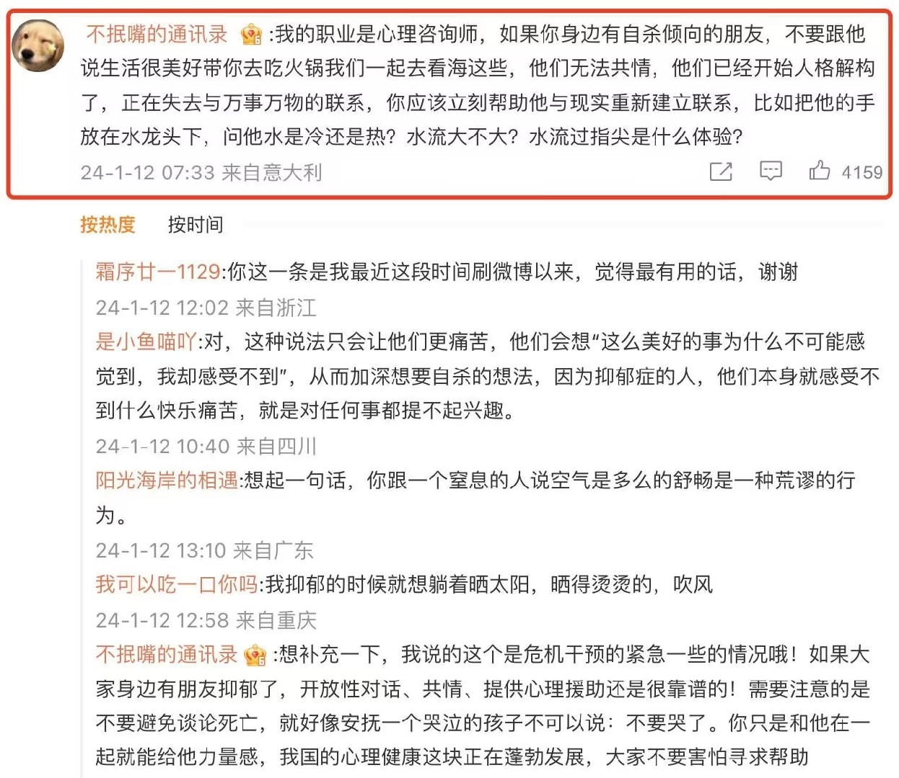

### [第一视角沉浸式体验【现实解体】](https://www.bilibili.com/video/BV1hV411R7SN/)

停止猜笨谜

 这个特别好，我记得自杀行为干预热线的一位志愿者她说，会轻轻问求助者，你在哪里呀，能感觉到有风吹过吗。我听到差点直接哭了，很感动
2024-09-14 05:54 👍23

六十七星

 是的，做出伤害自己的行为大多情况也只是为了感受到痛感，这也是比较容易获得的感觉。
2024-10-06 19:11 👍2

#### 人格解体/现实解体障碍的症状和体征

Prudentra

 人格解体/现实解体障碍的症状和体征
人格解体/现实解体障碍的症状通常是短暂而波动的。发作可以持续几个小时或几天或数周，数月，或数年。但在某些患者中，症状是持续存在数年或shu十年且强度不变。

人格解体症状包括

感觉从自己的身体、感情、思维和/或感觉中分离。
感觉是生活的旁观者。多数患者会感到不真实或像一个机器人或有自动体验（对自己说的和做的无法控制）。他们可能会感到情绪和躯体的麻木，或感到隔离，情绪低落。 有些患者无法识别或描述自己的情绪（述情障碍）。会觉得记忆断裂，无法清楚地回忆。

现实解体症状包括：

感觉身边的周围环境（如人，物，所有的事物）不真实
患者可能会觉得好像身处梦中或雾里或好象一个玻璃墙或面纱从他们的四周隔开它们。世界似乎毫无生气，缺乏颜色像是人造的。对于世界感知的主观性扭曲很常见。例如，物体可能会变得模糊或异常清晰，可能看起来平坦或更小或更大。声音似乎变得更响或更柔和，时间似乎过慢或过快。

症状严重时让患者十分痛苦难以忍受焦虑和抑郁常见。有些患者害怕存在不可逆的脑损伤或者他们患有精神病。有些则纠结与自己是否真实存在或反复检查，以确定其是否感知是否真实。虽然感受真切（即使有完整的真实体验），但患者一般能意识到这并非事实。这是人格解体/现实解体障碍区别于精神病的重要标志，后者往往没有自知力。
2024-02-06 19:34 👍2

