## 为什么有些人喜欢嘲讽别人呢？ - 苏槿夕的回答

**我们身边自信的人似乎不少，但仔细观察你便会发现，很多人的自信似乎必须要建立在别人自卑的基础上。**这些人常常会嘲讽、抨击、贬低别人，很多时候是忍不住不自觉地就那么做了。

精神分析的[客体关系派](https://www.zhihu.com/search?q=%E5%AE%A2%E4%BD%93%E5%85%B3%E7%B3%BB%E6%B4%BE&search_source=Entity&hybrid_search_source=Entity&hybrid_search_extra=%7B%22sourceType%22%3A%22answer%22%2C%22sourceId%22%3A43483053%7D)

提出了人的内在的关系模式，即我**们每个人的心中都存在着一个内在关系世界，它是以母子关系为原型，且是所有客体关系的基础。**换句话说，即我们童年时和重要亲人的人际关系互动，都会被我们内化到内心深处。我们的一生，便是将这些内在的关系投射到外部的人际关系上的一生。当然，成年后的外部人际关系也会部分地改变内在的关系，但这很难。

其中，最重要的即是我们心中"内在父母"与"内在小孩"的关系。基本有四种模式：

**1."我行，你也行"**

也即"'内在的小孩'行，'内在的父母'也行"。假若父母爱自己的孩子，同时又给予孩子自由，认可孩子的独立空间和能力，那么这个孩子就会发展出这样的[内在关系模式](https://www.zhihu.com/search?q=%E5%86%85%E5%9C%A8%E5%85%B3%E7%B3%BB%E6%A8%A1%E5%BC%8F&search_source=Entity&hybrid_search_source=Entity&hybrid_search_extra=%7B%22sourceType%22%3A%22answer%22%2C%22sourceId%22%3A43483053%7D)。

**2."我行，你不行"**

也即"'内在的父母'行，'内在的小孩'不行"。假若父母至少有一人爱孩子，但同时又对孩子极其严厉，甚至常用暴力方式对待孩子，那么这个孩子就容易形成这种内在关系模式。将'内在的父母'投射给自己，'内在的小孩'投射给别人。

**3."我不行，你行"**

仍是"'内在的小孩'不行，'内在的父母'行"。假若父母至少有一人爱孩子，但同时又喜欢孩子温顺而听话，那么这个孩子就容易形成这种内在关系模式。

"我行，你不行"与"我不行，你行"的差别是：前者以"内在的父母"自居，而在建立外部人际关系时将"内在的小孩"投射给对方；后者则以"内在的小孩"自居，而在建立外部人际关系时将"内在的父母"投射给对方。

**4."我不行，你也不行"**

即"'[内在的小孩](https://www.zhihu.com/search?q=%E5%86%85%E5%9C%A8%E7%9A%84%E5%B0%8F%E5%AD%A9&search_source=Entity&hybrid_search_source=Entity&hybrid_search_extra=%7B%22sourceType%22%3A%22answer%22%2C%22sourceId%22%3A43483053%7D)'不行，'内在的父母'也不行"。如果父母不爱自己的孩子，又经常折磨孩子，那么这个孩子就容易形成这种内在关系模式。

具备第四种内在关系模式的人，最容易制造凶杀案件，譬如连环杀手和偏执狂。看新浪网的新闻，每天都可以看到情杀案件，即男人杀死了要和自己分手的女友或太太。这类案件的制造者多是偏执狂，爱人离开他们，是对他们最大的否定，令他们感到"我不行"。他们受不了这种打击，于是将爱人杀死，隐含的意思是"我夺了你的性命，你更不行"。

连环杀手和偏执狂自然是最危险的，但他们不是对社会危害最大的人，因为人们很容易对他们产生防范。

**对社会危害最大的人，常常是第二种人。因为他们看起来很自信，甚至在某些人眼中称得上"非常优秀"，于是非常具有迷惑性。**

**最极端的"我行，你不行"的人，他们会处处都要自己说了算，并且不能接受别人展示自己强大的一面。他们要么用霸道的方式，要么用巧妙的方式，让周围人感到自卑，从而将他的"我行，你不行"的内在关系模式充分地展现在他的外部人际关系上。**

### [怼回 你也挺有意思的哈](https://zhuanlan.zhihu.com/p/307410023)

尝试用幽默化解这个矛盾。比如，你可以在他下次贬低你的时候，对他说："你也挺有意思的哈，脑子里装了那么多损人的话，还总喜欢说给我听。"或者："是不是贬低我，让你觉得特有成就感？"。你借幽默指出了事实，也能让朋友意识到这件事，有所反思。

## 同理心与同情心区别

### [同理心 他会如何感受 同情心 我会如何感受](https://www.zhihu.com/question/21654492/answer/31651294)

[发布于 2014-10-10
16:34](https://www.zhihu.com/question/21654492/answer/31651294)

看过一本书，说的是同情心和同理心的区别，有同情心的人考虑的是：如果我是他，遇到他经历的事情【我】会有什么感受；而有同理心的人考虑的是：如果我是他，遇到他经历的事情【他】会有什么感受。这两者的细微差别就造成了有的人特别善于安慰别人，有的人虽然很善良，可是他们安慰的话听上去很空（因为他们考虑的是，如果我遇到这样的情况，怎样才能让【我】感觉好一点，而不是怎样让【他】感觉好一点
）

当时很感慨，后来发现家人／夫妻相处，这点细微之处其实很关键

#### 同理心需要更深挖掘感受

[**itsviv**](https://www.zhihu.com/people/d6fe4ab1c2eaf2decde23bf662347c03)

说的挺好的，但是难做到，大部分人只能感受到自己会有什么样的想法，而只有在极度了解对方的情况下，才能感受到对方会有什么样的想法。虽然看起来像是细微差别，但认真思考其实是天差地别。

2016-01-25 28

[**孟佳明**](https://www.zhihu.com/people/e6adc9c028ebc74d5a429a25ed6bad44)

说得挺好。同理心是完完全全地尽可能让我变成他，以他过去的遭遇和曾有的可能有的感受，来理解他现在的行为、遭遇和处境。同理心要感受的不仅是当下我听到他的遭遇，还包括去挖掘理解他去过曾有的遭遇。

2018-04-05 27

[**知乎用户0E4w4n**](https://www.zhihu.com/people/046773c36527bb2f2e0c5487cc9c373b)

同理心，不是在朋友难过时用他尚可的地方去安慰他
而是对朋友的痛苦感同深受，虽然我不能为你做什么 但我会一直陪着你。

2016-08-10 21

[**小马爺**](https://www.zhihu.com/people/a573e73f64bd9b4790ae7f2cf4f0924b)

同理心是一种难得的品质，它不仅仅能够帮助他人换位思考，更为关键的是能够让人始终保持一颗平常心。有同理心的人往往节俭朴素，在他们的身上看不到太过招摇的东西；他们往往保持一种在简陋的办公室里也能热忱地投入工作的能力，因为是所从事的工作让他们感到自豪；他们闷头做事，服务于远大构想和宏伟蓝图，但同时又在同样的方向不断积累。任何时候，都不要让处境、金钱、教育背景以及其他东西成为你的负担，让你与现实和他人产生隔阂。

2021-08-29 8

### [经典乞丐例子](https://www.zhihu.com/question/21654492/answer/2401433552)

还有一个经典的例子：

大人领着孩子路过一个乞讨者，大人给了乞讨者两块钱，顺便教育孩子："如果你不努力学习，将来就会和乞丐一样，活在别人的同情里。"这是同情心

大人领着孩子路过一个乞讨者，大人给了乞讨者两块钱，顺便教育孩子："你要努力学习，这样才能改变这个社会，让不幸的人过上幸福的生活。"这是同理心

同情心：现实中我会帮不受欢迎的人说话，因为别人都知道我富裕，贵气，美丽，高挑，不缺人喜爱，这样我会觉得自己很善良，别人也觉得我的内在和外在一样完美，至于那些不受欢迎的人内心在想什么，我不关心。网上我不会帮不受欢迎的人或群体说话，因为这些人的名声都很不好，别人也不知道我是和他们截然不同的人，万一误会我就是不受欢迎的人，喜欢比烂就完了，我想被人夸奖就需要和不受欢迎的人群划清界限。

同理心：现实中我会帮（部分）不受欢迎的人说话，网上我也会帮（部分）不受欢迎的人说话，我不怕被当成贫穷，低微，不美，矮小的人，因为这些条件都是相对的，也不会一成不变，谁的人生都不可能一帆风顺，对同类雪中送炭总是好过落井下石。当然我的同理心也不是无条件的，我只对和我一样有灵魂，不会麻木不仁伤害无辜的人有同理心，哪怕ta贫穷，低微，不美，矮小，这些我通通不在意。

编辑于 2022-03-22 13:26

[**观棋不语**](https://www.zhihu.com/people/8099fc8dd68f6725cb645473fa0e8ae4)

#### fi和fe

2023-01-03

## [人生十二法则 皮亚杰系统](https://www.zhihu.com/question/266897617/answer/1586217322) 

看乔丹彼得森讲皮亚杰的儿童心理发展阶段，特别是讲了这背后逻辑，从一个婴儿到一个成年人，一个所谓的功能完善的人，适应社会各种规则的人，在各种领域内都能玩的开的人，皮亚杰的一个隐性主张是，人类间的社会互动，来源于一个有限制的空间，这个空间就是游戏的空间，我们永远都在玩游戏。你可以把游戏当作一个微观世界，小孩子的游戏就是微观世界的一小部分。你长大后会参与到大人的游戏，你可以把它们想成更多玩家的在线游戏，更精密的游戏，比如当律师或者在金拱门打工，这些都是游戏的不同形式。人们会商讨规则，小游戏嵌于更大的游戏内。皮亚杰认为孩子们所玩的游戏会不可避免地，逐渐转变成大人的游戏。

有几个关键点，孩子在2/~3岁的时候，对于[皮亚杰系统](https://www.zhihu.com/search?q=%E7%9A%AE%E4%BA%9A%E6%9D%B0%E7%B3%BB%E7%BB%9F&search_source=Entity&hybrid_search_source=Entity&hybrid_search_extra=%7B%22sourceType%22%3A%22answer%22%2C%22sourceId%22%3A%221586217322%22%7D)，你可以这么想，这个两岁的孩子处于很混沌的状态，他们经常从一个[高动机情绪](https://www.zhihu.com/search?q=%E9%AB%98%E5%8A%A8%E6%9C%BA%E6%83%85%E7%BB%AA&search_source=Entity&hybrid_search_source=Entity&hybrid_search_extra=%7B%22sourceType%22%3A%22answer%22%2C%22sourceId%22%3A%221586217322%22%7D)中飞到另一个。所以两岁儿童要学会的第一件事，在头脑中规范自己的行为。两岁的孩子还是很爱发脾气的，他们像小疯子一样四处乱跑乱窜，开心着，疯狂着。而你必须训练他们不要这么做。因为这种行为只会打扰到他人，这是为人父母非常痛苦的时刻。

皮亚杰认为这种整合发生在孩子的内部，他认为孩子都是以自我为中心的，发展也发生于他们内部。孩子到了大约3岁时，才有能力将他的系统整合好，和另一个整合好的孩子一起玩游戏，要到孩子3岁左右才能做到。换句话说，孩子不再会一味地追求自己的目标，尽管这个目标经过了社会环境的调试。孩子之间能够交流了，并且设立共同目标，他们玩耍时就在做这件事。这也是所谓社会化的过程

回忆我自己的经历，然后我大概三四岁的时候，父母闹离婚，我跟着妈妈来到了姥姥村，在姥姥村的学校里，我现在回忆起来，当年的我就不太能够流畅的跟小朋友玩耍，融入到圈子里，某种程度上可以讲这个社会化的功课，其实没有完成的。

到我十二三岁去继父村，感觉更加融入不了新环境。去县城读初中，很不适应，又遇到了一些校园霸凌，回到乡里读初中留了一级，开始慢慢在学习上找到了一些信心，存在感，当时读陈安之读安东尼罗宾，其实是给我找到了一个新赛道，也可以讲新的秩序，激情着维持到了高中，遇到了母亲的离开，打破了所有我对世界的设想，希望，秩序，完全陷入到了混乱混沌之中，抑郁了，到大学，其实是浑浑噩噩，紧接着是真正的考试，大三实习，毕业工作，各种不适应吧，各种拉胯

其实这个社会化的规训是没有完成的，没有走出自我中心，放松去玩儿大家在玩的游戏，没有尝试着积极的去理解游戏规则，反倒是有意淫出来的傲慢，老子玩儿不好，那是你们的问题，都是些庸俗的人，庸俗的游戏，我不屑于参与。

从结构主义的角度来说，这是个渐进的过程，婴儿到童年到青少年到成年，这是个不断打破自己，重构自己的过程，可能我的社会化的发展阶段还停留在更初始的阶段

学习时间管理，学习理财挣钱，学习耐心专注，这是很多的不同的游戏，各自有各自的规则

乔丹彼得森非常理性的讲解，让我释怀了很多，是应该给自己一些宽容。变成一个好男人，有条理的男人，自律的男人，成功的男人，高情商商的男人，这些目标对我来讲其实是超纲了，拿这些超纲的标签来怼自己，其实是愚蠢的，只能加深自己的无力感，加深自恨。/
还是要有耐心吧，
罗马不是一天建成，把自己分裂成两个角色：一个慈祥的爸爸，一个幼稚混乱的孩子，给自己一些宽容，小目标，不断给自己一些小鼓励，不说能走多远，变得如何吧，看到自己的进步

[发布于 2020-11-20 23:05](/question/266897617/answer/1586217322)

### [人生十二法则摘录（干货提取）](https://zhuanlan.zhihu.com/p/524454738)

法则一：笔直站立、昂首挺胸

建立自我觉察、走出失败者模式

法则二：待己如助人

认识你自己、自助者天助

法则三：与真心希望你好的人做朋友

摆脱"强迫性重复"、建立互惠关系

法则四：和昨天的自己比、别和今天的别人比

与自我博弈、走出认知困局

法则五：别让孩子做出令你讨厌的事

建立规则与结构意识、不止是孩子

法则六：批判世界之前先清理你的房间

痛苦时如何抉择、清理你的生活

法则七：追求意义、拒绝苟且

自由需建立在约束之上、超越当下、着眼未来

法则八：说真话、或者至少别撒谎

拒绝欺骗、选择真相

法则九：假设你聆听的人知道你不知道的事

共同探索、互惠互利

别给建议、选择聆听，表达思考、聆听自己

法则十：直面问题、言辞精确

精确分析、创造结构、重建秩序

法则十一：承认现实、反对偏见

文化源于人类的创造、未来需要坚毅

法则十二：关注存在的善

用专注代替思考、发现美好

结语：生活是好的，至少目前是

## [二本学历是人生中的耻辱吗？](https://www.zhihu.com/question/33727346)

我在面试的时候，特别喜欢问求职者一个问题。

不管求职者是一批本科，还是专科毕业的，我就会问他：你对当时高考的成绩满意吗？你当时为什么没有考的更好？或者你有没有想过怎么做，才能考得更好？

然后我就很惊讶地发现，大多数人没有思考过这个问题，就很可惜。

因为在我们年轻的时候，甚至我们这辈子，系统去做一个事情的机会并不多。这么大的事，高考就是其中最典型的一个。

如果说高考不尽如人意的话，怎么能不分析一下，人生难道就这么往前走了吗？

可是那些号称高考失败之后要考研翻身的人，号称高考不如意学历低受歧视的人，并没有分析过自己身上失败的原因。

所以在我问的时候，大家首先都是一愣，然后思考一会他们会说「因为我当时不够努力」，或者说「因为我没有好好复习」，还有一次，有一个男生给我的答案是「因为我高三的时候谈恋爱了/...
」

但这样的分析显然是没有道理的，正确的分析方法应该是这样的，叫做「不要上来就分析为什么，先分析是什么。」

什么意思呢？下面我详细说一说。

### 一、接受失败

不管是高考失利还是考研失利，本质上是一种「失败」，而接受失败本身就是一种能力。

什么是接受失败？不是说失败了不自杀，就是接受了。

### 接受失败，至少要分三个步骤：

第一个步骤，就是对于失败的后果，先看看自己能不能承受。

失败带来的后果，一般四个方面：首先是物质的，可能会赔钱；然后是精神的，可能失败之后自信受损，周围的人对自己有看法，所以精神压力很大；然后是人际的，可能会失去一些朋友；最后是机会的，因为失败之后，可能会失去一些机会。

一般人面临挑战的时候，他只要想到「失败了别人怎么看我」，仅仅这一点，就足够他恐惧跟退却了。这种恐惧其实是夸张的，远远超过失败之后，实际后果给我们带来的痛苦。

我给大家举个例子，打针的时候，想想打针是不是很恐惧，很多人特别怕打针，他觉得打针太可怕了，但实际上打针是不会怎么样的，打针带来的后果你是完全可以承受的。

所以如果要打破这种情绪的话，可以先把失败带来的后果一一列明，物质的、精神的、人际的、机会的，为每一个后果最好也标注上对应的办法。

这样的好处，第一就是帮助你理清楚自己的恐惧。

比如你想一下没考上研究生，你可能都特别恐惧，不敢报名了。但其实没有考上，也没有什么特别严重的后果，顶多就是晚一年找工作，结果完全是可以承担的。

因为人生很长，80
岁现在都不算长寿，比别人晚一年开始工作，好像也没有什么。

我当时选择考研的时候，就是列了一下后果，觉得可以承担，然后就报名了。

这是列明后果带来的第一个好处，就是降低恐惧程度。

这样做的第二个好处，就是以后，当你又一次面临可能失败的时候，你翻开以前的记录，你发现自己其实是可以承受那些东西的，你会好好的，也会更勇敢一些。

可是，也有一种情况是你列完了之后，发现自己接受不了。

提高失败承受力的第二个方法，就是今天我们提出的另外一个法则，叫做允许失败法则。

在我们的成长过程当中，其实是非常缺乏失败教育的，导致我们根本就没有失败能力。

这个词「失败能力」，可能很多人没有听过，但失败确实是需要能力的，因为本质上，我们的教育都是不允许失败的。

比如小孩没有考好，妈妈一般会怎么说？

妈妈会说：「没有关系，这次考不好没关系，下一次一定会考好的。」

但妈妈的意思其实是我不能接受你的失败，但是我可以暂时的忍受，下一次考好就行了。

事实上可能下次还是考的不行，或者有的妈妈会说：「我相信你，这次只是失误。」但这句话背后的意思是：你本来应该成功的，如果没失误的话。

**还是不允许失败的教育模式。**

基本上我们对于成功、失败的认识，会有两个误区：第一个误区，就是要求自己一上来就成功。第二个误区，就是要求自己永远都成功，一次失败都不行。

这么听，大家可能觉得很荒谬，怎么会有人这么要求自己，但更荒谬的其实是，很多人并不认为自己是这么想的，不会把这当成一个问题，他意识不到自己身上就有这样的问题存在。

如果不是要求自己一上来就成功，请问：为什么第一次创业失败，就觉得痛苦的不行？为什么第一次追女生没有成功，就觉得想自杀了？

如果不是要求自己永远成功，请问为什么学习好的，你小测验考失败就接受不了？

实际上，背后真的是要求自己一开始就成功并永远成功。

但事实上，我们的人生当中，面临失败的次数，远远比成功的次数要多。

所以当你经历失败的时候，必须拿一种很长线的思维，来看待自己所处的失败点，你得允许自己的人生起伏，知道自己现在只是处在一个下滑的点上，稳住就可以了。

忘了是哪个大人物说的：「人的一生当中需要做 20 多个决策，做对其中的 3 到
4 次，你的人生就很成功了。」

还有一个类似的说法是乔丹代言的耐克广告当中，有一句广告词是这么说的：「我有超过
9000 次投篮不中，输了将近 300 场比赛，还有 26
次错失了绝杀的机会，当你每次投篮不中的时候，你都想这是 9000
次当中的一次就可以了，这样的话失败更容易接受了。」

所以我就给自己定了一个法则，叫做允许失败法则，在同一个事情上，一般允许自己失败三次。

就连结婚，我们都要允许自己失败的，我们之前又没有结过婚，即便做了充分的调研，到自己身上，还是有意想不到的情况，所以即便第一次婚姻失败，其实也挺正常的。

### 另外还有一个法则，一定要介绍一下，叫做练习法则。

我们要把每一次做的事情，都当作是人生当中的一次练习，每件事情都是需要练习的。

事实上整个人生都是一个漫长的练习过程，我们在这个过程当中，优化自己的各种行为、各种努力，优化的过程当中，肯定会有一些不完美存在的。

有了这种思维之后，你会发现自己的反弹力会非常好。

触底不见得会有反弹，因为反弹力不是来自于你跌得多惨，落的多低，而是来源于分析跟消化失败的能力。

所以接受失败是第一步，下一步比这还重要，就是怎么分析这个失败。

就像乔丹，他失败了之后，肯定是回到球场上去找原因，继续练习才可以。

比如我也见过很多演讲不好的人，找不到自己演讲失败的原因，然后就一直失败，一直尝试，一直用那种打鸡血的方式在坚持，这样是不行的。

原因诊断是一个很厉害的技能，找到失败的原因，然后消灭它，这个失败才是有效失败。

开头我们说了，正确的分析失败的方法应该是「不要上来就分析为什么，先分析是什么。」

什么叫做上来就分析为什么？

比如高考没有考好，因为没有好好复习。不好好复习当然是没有考好的原因，而且这个原因一点错都没有，复习时间不够，不专心，方向不对，这些都可以叫做不好好复习。

可是这个原因分析出来没有用，因为我不好好复习没有考好，所以我应该好好复习。

但是怎么是好好复习，接下来应该怎么做，没有给一个做法。换句话说，我们找到的失败原因，必须给我们一个指示，按照这个指示去做，就不再会失败了，这样分析才是有效的。

但很多时候，我们分析的原因都特别模糊，根本就不具备指导性。有效的失败分析用一句话就可以形容「如果我这么做了，一定能避免失败吗？」

问自己「为什么」并不能避免失败，问「是什么」，能。

举个例子，比如我这次没有考好，为什么没有考好？因为马虎了。

不行的，因为马虎没有考好，所以下次要认真，就告诉自己要认真，你下次仍然避免不了马虎。

你应该怎么分析？你要分析这个失败是什么，这个失败是其中的五道题做错了，这五道题是因为忘了一个符号导致错误的，所以我告诉自己，下一次不能把这五个符号忘掉了，我一定能够避免再次在这五道题上失败，这就是「是什么」的魔力。

还有这次没考好，因为没有复习。「没有复习」太笼统了，

## [低学历引发的自卑感比低学历可怕一万倍](https://www.bilibili.com/video/BV1vh411M7RS)

2023-04-10 16:19:13

/_如巷

在法国生活了一段时间，想在对比中表达下自己的观点

法国：学历歧视有吗？几乎感受不到。为什么？掌握社会资源的只有金字塔尖尖上的人，实现阶级跨越是极其困难，甚至是不可能的。对于法国人而言，学历，甚至教育，与社会的其他方面分得很开。教育是教育，工作是工作，生活是生活。阶级固化的概念深入人心，但人们又拥有良好的社会福利。所以呢？我何不好好享受自己的生活，何必去为与自己毫不相关的事情费心力。

中国：人口庞大，资源有限，竞争激烈。努力学习，获得更高的学历，"可能"改变生活现状，改变阶级，尤其在盛行"奋斗"主义的中国。但事实是这样吗？学历只是万千因素中的一小个，实现阶级跨越，或者俗了说，赚更多的钱，牵扯到太多太多不可量化的事物。而往往，当精英主义盛行的今天，我们很多时候只看到了所谓"学历"这个标签。

所以呢？学历自卑同样来源于对学历的绝对化。而这样的社会风气与国家的经济水平，社会水平...息息相关。这意味着在短期，甚至很长一段时间，这样的焦虑和风气都会存在。对于年轻人而言，如何调节心智以面对现实更为重要。无论低学历，高学历，你需要明确自己的方向，大了说是自己对人生意义的定义，小了说是我下周要干什么，明天要吃什么，我能吃得饱饭吗？然后为了达成这些目标而不留余力，这是更要紧的。一味得陷入精神内耗，为"不切实际"的幻想而自怨自艾才是最可怕，可悲的！树欲静而风不止。无论外界如何，人生是你自己的，怎样活出自己认为的精彩，不让自己白走一趟人生，比任何东西都有价值和意义！

2023-04-11 05:25 73

## [过分沉溺于幻想无法自拔怎么办?](https://www.zhihu.com/question/312274241/answer/867535801)

(5月19日更)想到一些技巧，当然不可能完全解决问题，但是有点用吧

1、把大脑里的事情写出来，心情会好很多。大脑想的事情不输出，就会一直萦绕在脑海里面，只有把他们写出去，人才能不被其牵制。当然，说出来也有用，但是我一般不喜欢和别人说这些，我就写在日记里。

2、多运动。运动的好处自不必说，我没记错的话，运动效果比吃药还好。

3、上厕所。这个就有点玄学，但是亲自实践表明，蹲坑后人会轻松很多啊。

4、肠胃问题。和上条有点相似，之前在《肠子的小心思》里看到，人的肠道的迷走神经直通大脑，会影响人的情绪。主要是，我自己肠胃有一点小问题的时候，心情变化非常大，人很消极。不知道大家有没有这种情况。

5、换一种表达方式，例如，这个好难啊，改为这个好有挑战啊；我好烦，改为我的思绪很乱，我可以整理一下。

6、我认为沉迷与过去主要原因还是在当下，如果对当下满意且专注就不会思考过去。要想不沉迷与过去，解决方法不是思考如何避免沉迷于过去，而是思考如何活在当下，如何积极的面对生活。这里面的方法多了去了，可以看一看这方面的回答。

PS：有时间再写一些，一定要试一下把大脑中的内容写出来，真的超级有效！PS：技巧归技巧，当然治标不治本，要想彻底摆脱，还得多阅读，多实践。======================

打开知乎看到还有人点赞，甚是感动。再次写回答是因为，我想告诉大家，我摆脱了那种一直在回忆过去的状态，目前没有再"沉溺"于过去了。想着来分享一下，或许能有点帮助，为社会做点贡献。想一想我大概经历了三个过程：

1.最开始"沉溺"过去，就是如原回答的那种状态

2.后来开始刻意避开谈论自己过去，即使大家谈论自己的光辉历史，表达欲爆炸那种，我也避而不谈。这样的状态大概有一两年。

3.现在大概是放下了，有时候谈一谈，装个逼什么的，算回归正常了。当然，这三个过程并不是有意为之，只是在那个时候，就单纯的想怎么做，大家不要强迫自己这样做。====================

然后，讲一下我的经历吧，如果说经验方法之类的话，其实没什么价值，毕竟我也不知道具体是哪一点改变了我。首先是原回答提到的公开课，我当时是心理问题到了极点了，把当时知乎的心理贴大概逛了一圈，最后落脚到公开课上。听完之后改变我三观，我整个人的价值观都刷新了。生平最讨厌写作文的我，听了沙哈尔教授的话，开始写日记，下血本买了一个很好看的本子，好的坏的，一股脑的都写上去，也不管什么格式。写完心情会确实好很多，但是也没有就此解决问题。那时候也开始跑步，是为了生存，因为身体顶不住了。此后仍然每天逛知乎，看别人的回答，发现好多回答会推荐一些书。我便看书，（此前我几乎不看书的人），可能是因为当时把这些当救命稻草了，反正看了挺多的，再到后来，便一发不可收拾，什么书都看一点，算是爱上了看书。我真的看了很多书，我坐在图书馆翻阅各种书，只要没课，没作业，我反正就在图书馆看书，想看什么，就看什么，从心理学到历史到自我成长甚至哲学书都看一点点。想看什么，就看什么，不想看就不看了，看一半就扔是常有的事情。在这个阶段，我真正见识了世界之大，真正对自己的过去妥协了，我彻底接纳了自己，原谅了自己，承认自己只是大千世界的一个普通人。不认为过去是好的，也不认为过去是坏的，它就是那样，它可能是原生家庭的产物，它可能是自已犯的错，也可能是自己唯一的骄傲，但它已经过去了。我反正坦然接受了，就那样吧，我要把今天过好，明天过好。其实我认为，真正让我改变的是一直在看书，过去认为看书是一种手段，可以取得成绩，获取功名利禄，所以不想看。现在则发现更像是在与作者对话，通过它重新认识世界，学习、进步、感悟、重新生活。所以要说是具体什么方法或是行为让我不再沉溺于过去，其实我也不能确定，但是我可以肯定的是，只有不断的获取新的知识，不断的认识世界就能突破重围，从心理困境中走出来。以我亲身经历为证。还有就是身体健康的影响，非常之大，极度影响心理健康，以后再写吧目前知乎有那种通过一两个技巧就想解决问题的风气，我认为不太可能，真正要解决问题还是得慢慢来，得坚持，得花时间。希望能对大家有所帮助吧几年前的回答（我至今仍然觉得适用）：写日记
锻炼身体建议看一看哈佛大学公开课：幸福课我从绝望中走出来，靠的就是这个公开课沉迷于过去必然是现在的不得志我曾经整整一年回望过去，迷失自我，抑郁，每天都在想生命的意义
，晚上充满恐惧与绝望，难以入睡，白天害怕与人交流，焦虑，胆怯，无法集中注意力。直到我不得不在死亡与改变之间做出选择，没错我碰巧看了这个公开课，彻底改变了我。我不是推销的，公开课是免费的，但是确实能让你重新找回自我，回到现实生活，你会发现一切都很美好。要不是泰尔
本 沙哈尔 教授
，我也不会在知乎上去写回答，在这里，我十分诚恳地感谢他。哦(´-ω-/`)，B站上目前可以看上一次的编辑，是2020年6月3号，但最早的回答应该是19年写的，这一次是2022年5月14号，在此记录一下,and
公开课一生推！

编辑于 2022-05-19 17:10

## 

什么人容易沉迷于幻想带来的快感？有过这种经历的可以共享一下，并告诉我们你是怎么摆脱的？关于[臆想](https://www.zhihu.com/search?q=%E8%87%86%E6%83%B3&search_source=Entity&hybrid_search_source=Entity&hybrid_search_extra=%7B%22sourceType%22%3A%22answer%22%2C%22sourceId%22%3A%221085613244%22%7D)，我想联系自身实际，从认知和[方法论](https://www.zhihu.com/search?q=%E6%96%B9%E6%B3%95%E8%AE%BA&search_source=Entity&hybrid_search_source=Entity&hybrid_search_extra=%7B%22sourceType%22%3A%22answer%22%2C%22sourceId%22%3A%221085613244%22%7D)来谈下这个问题。希望对你有帮助。

先来讲一下沉浸臆想很可能的状态，怎么说，浑浑噩噩，活在梦里活在自己反应现实生活却又轻松满足的臆想里。

这里有一个认知是需要提出来讲的。臆想，有点难听，那么我们说[幻想](https://www.zhihu.com/search?q=%E5%B9%BB%E6%83%B3&search_source=Entity&hybrid_search_source=Entity&hybrid_search_extra=%7B%22sourceType%22%3A%22answer%22%2C%22sourceId%22%3A%221085613244%22%7D)。我觉得，我喜欢幻想，有部分原因一定是因为遗传，父亲一辈子活在自己的世界里，所以我或多或少也会喜欢沉浸在自己的世界里。可以说我不切实际，但是，不可否认的也是我更具有创造力，不可否认的是，无论现实世界如何艰难险阻，[对更好世界](https://www.zhihu.com/search?q=%E5%AF%B9%E6%9B%B4%E5%A5%BD%E4%B8%96%E7%95%8C&search_source=Entity&hybrid_search_source=Entity&hybrid_search_extra=%7B%22sourceType%22%3A%22answer%22%2C%22sourceId%22%3A%221085613244%22%7D)的图景一定会开展在我的脑海里。

在有自己的意识以来，我当然面临了很多很多的问题：贫穷、歧视、压抑、愤怒、压力、痛苦、爱而不得......但可以肯定是，我还是活下来了，相对可以地我现在活着。我想，我脑海中不断涌现的幻想是很大的一个原因。某种程度上，它是一剂强大的安慰药，安慰着我内心那个楚楚可怜的小女孩。给她现实生活中她无法得到却又渴望的事物。举个例子吧，高中的时候讲我难看的不是一个两个，当面说的也有，当众说的也有。说不[自卑](https://www.zhihu.com/search?q=%E8%87%AA%E5%8D%91&search_source=Entity&hybrid_search_source=Entity&hybrid_search_extra=%7B%22sourceType%22%3A%22answer%22%2C%22sourceId%22%3A%221085613244%22%7D)是不可能的，深夜哭的是我，深夜幻想的也是我。但是我从来没有认可过这个观点。我知道世界上有减肥有化妆有健身有穿搭，再不济还有整容。上大学后，在实践上，我也确实是这样做的。事实上，无论是心态还是外在，我也确实是有长进的。

这么看来，幻想是一大良药。那么为什么它会导致一些不好的现状？

我想，因为没有节制。[古希腊](https://www.zhihu.com/search?q=%E5%8F%A4%E5%B8%8C%E8%85%8A&search_source=Entity&hybrid_search_source=Entity&hybrid_search_extra=%7B%22sourceType%22%3A%22answer%22%2C%22sourceId%22%3A%221085613244%22%7D)四大德：正义、勇敢、智慧、节制。中华民族精神：以[爱国主义](https://www.zhihu.com/search?q=%E7%88%B1%E5%9B%BD%E4%B8%BB%E4%B9%89&search_source=Entity&hybrid_search_source=Entity&hybrid_search_extra=%7B%22sourceType%22%3A%22answer%22%2C%22sourceId%22%3A%221085613244%22%7D)为核心，勤劳勇敢、爱好和平、团结统一、自强不息。我没有做到对幻想使用本身的节制，和对改变现实的勤劳勇敢。

不对的不是幻想，也不是沉浸在幻想，而是没有节制地一味地沉浸在幻想。

我知道我自己所渴望的的。沉浸幻想是不利于实现我的目标的。所以我要攻克的是，怎样让自己不要沉浸在幻想。

我注意到一个现象，如果我和别人过多地讨论市侩的东西，比如说婚恋市场，比如说买房，比如说[幼儿园](https://www.zhihu.com/search?q=%E5%B9%BC%E5%84%BF%E5%9B%AD&search_source=Entity&hybrid_search_source=Entity&hybrid_search_extra=%7B%22sourceType%22%3A%22answer%22%2C%22sourceId%22%3A%221085613244%22%7D)教师生存状况。我会觉得头晕。其实本质来看都是提前想着洗未来碗的事情。[被贩卖](https://www.zhihu.com/search?q=%E8%A2%AB%E8%B4%A9%E5%8D%96&search_source=Entity&hybrid_search_source=Entity&hybrid_search_extra=%7B%22sourceType%22%3A%22answer%22%2C%22sourceId%22%3A%221085613244%22%7D)焦虑，活活牺牲了自己去奋斗或者去享乐的一天。

还有一件事情，我没有正确面对自己的[欲望](https://www.zhihu.com/search?q=%E6%AC%B2%E6%9C%9B&search_source=Entity&hybrid_search_source=Entity&hybrid_search_extra=%7B%22sourceType%22%3A%22answer%22%2C%22sourceId%22%3A%221085613244%22%7D)。其实我的欲望也不过分。我想漂漂亮亮，想get
better academic performance，想和异性接触，想要别人的尊重和热情......

其实这些都是正当的欲望。只是我采取的方式是，在现实生活中什么都不去做，然后一通臆想。完事在现实生活还是一无所获，然后需求得不到满足，甚至进一步恶化，陷入一种恶性循环。

写了这些，我觉得，无论是在认知，还是在方法论上都是干货。

最后总结下方法论：①正确地看待幻想，它在一定程度上保护了我们。②要节制，要勤奋，要勇敢地面对自己真实人生中的问题。③不要花时间焦虑，时间用来奋斗和用来[享乐](https://www.zhihu.com/search?q=%E4%BA%AB%E4%B9%90&search_source=Entity&hybrid_search_source=Entity&hybrid_search_extra=%7B%22sourceType%22%3A%22answer%22%2C%22sourceId%22%3A%221085613244%22%7D)不是更香吗？④正确地认识自己的欲望，为它现实中能实现去做一件又一件事情，而不是只用幻想这种最快又最没用的方式解决。比如想当学霸就先掏出书读它个20min，想和异性出去玩就选个对象从问候开始。

加油！[真实世界](https://www.zhihu.com/search?q=%E7%9C%9F%E5%AE%9E%E4%B8%96%E7%95%8C&search_source=Entity&hybrid_search_source=Entity&hybrid_search_extra=%7B%22sourceType%22%3A%22answer%22%2C%22sourceId%22%3A%221085613244%22%7D)欢迎你来打怪。

Welcome [to the real
world](https://www.zhihu.com/search?q=to%20the%20real%20world&search_source=Entity&hybrid_search_source=Entity&hybrid_search_extra=%7B%22sourceType%22%3A%22answer%22%2C%22sourceId%22%3A%221085613244%22%7D)，it
sucks， but you will fall in love it.

[编辑于 2020-04-02 15:23](/question/24395915/answer/1085613244)

[**风清扬**](https://www.zhihu.com/people/d107e750c57c92817cdf182919a0aae9)

讲的挺好对我有启发，我从小的时候起就爱幻想，然后到现在20多岁一直这样，喜欢活着自己的世界里，一段时间比较沉迷，一段时间可能还达不到沉迷。我觉得沉迷幻想有一部分原因确实是和天性有关，还有一个我以前没意识到的，就是我不能正确面对自己的欲望和感情，在现实中对自己过分的压抑，然后通过幻想来满足。2020-03-31

[**Melo**](https://www.zhihu.com/people/fb41b5dcae8b8ae5b49d16fb794c6378)

谢谢答主，让我找到了沉迷幻想可能的原因。小时候人际关系中遭遇的挫折我会通过幻想安抚自己，久而久之竟沉迷了，变成了不管是什么痛苦三七二十一就开始幻想，而现实中的我却因为把情感投入到幻想中显得更加无情。最近又有一个作业完全不想写导致一直在幻想，啥都没做。尝试正视幻想的源头也许会很多帮助。希望能早点回归现实。

2020-11-09

## [自律 内心的觉醒](https://www.bilibili.com/video/BV1iG4y1b7Np)

### 碎片时间想方案

阿赖哇waaa

别的不说，碎片时间想方案是最可行的（特别是洗澡的时候，身体和脑子都处于非常舒适的状态），特别是可以帮助你理顺你的方案逻辑

2022-11-21 17:263

学习玩具

理论还可以，但是具体方法没有用。自律从来不是"自己逼自己"。我有一种自律的方法，供大家参考。我是工程师，写专利，在碎片时间，或者上班时间，或者在公园，或者在公交车上等受限时空，也能静心①把方案想一想，②把计算机绘图的步骤，也想好，梳理一下思路等③在笔记本上简单记一下④从最简单的事情开始，也想好，⑤回家之后，由于有想法了，也着急实现，但是都规划好了，打开电脑，看着视频，听音乐，无脑在电脑上绘图，有方案在，也不着急，慢慢来，也不累，特别舒服，时不时喝茶吃零食。这一招特别适合工程师、程序员、设计师，写作，UP主播等文案工作。也是上班摸鱼创业的好办法。多实践，就成习惯了。不怕慢，就怕方向错。

2022-11-03 01:22633

## [3个实用眼神技巧，摆脱社交恐惧](https://www.youtube.com/watch?v=fzACQHt74h8)

963 views Jul 28, 2021

1）左眼、右眼、鼻子三角视角转移法。两眼中与鼻子交互移动。

2）5070原则：自己说话时50%时间看对方，50%时间不看。听别人说话时70%时间看对方，30%不看。

## 使眼睛囧囧有神

1）W眼球转动法。

2）手指撑眉毛，用力闭眼法。

3）

## 就算覺得對方很帥，很合眼，也不想和對方有眼神接觸

[**陌璃**](https://www.youtube.com/channel/UCiGgkbYhmMX9OJdEH43ohDw) [1
year
ago](https://www.youtube.com/watch?v=P-c2Mge9w_M&lc=UgwWROJKoIhmuPUsEzZ4AaABAg)

不知道為什麼，就算覺得對方很帥，很合眼，也不想和對方有眼神接觸，眼神一對上就忍不住低頭

41

[**mikaa_百々綠衣**](https://www.youtube.com/channel/UCBpQaWQYyHS2m9leimnO_tA)
[1 year
ago](https://www.youtube.com/watch?v=P-c2Mge9w_M&lc=UgwWROJKoIhmuPUsEzZ4AaABAg.9JwiGpSN-N-9JydWH0h3Bh)

有可能是怕自己的眼神透露出些什麼訊息給對方知道？有些訊號是能從眼神裡被判斷的（也取決於當下是害怕對眼，還是害羞對眼，可以自己深度觀察自己的感受️）

9

### 沒安全感的由來有很多，主要是對自己沒信心，外表、原生家庭、綜合經濟

[**mrken1987**](https://www.youtube.com/channel/UCNMrwWXMaopOs_k_FmKxnkw)
[1 year
ago](https://www.youtube.com/watch?v=P-c2Mge9w_M&lc=UgwWROJKoIhmuPUsEzZ4AaABAg.9JwiGpSN-N-9K0IurJx6xA)

估計是你心理層面沒安全感。沒安全感的由來有很多，主要是對自己沒信心，外表、原生家庭、綜合經濟，等等很多社會上的客觀價值；你會害怕因為這些外在條件而遭受傷害，或者早因這些外在因素而受過傷或委屈。不管是在工作上或求學階段上曾經的遭遇，這些過往不開心的經驗會讓你淺意識下就會藉此來迴避、保護自己，一種沒有太多期待就不會有太多傷害的概念。所以才都說戀愛需要有梁靜茹的勇氣。

23

### 不要自我厌恶 懂得表現自己但不要太進取

[**Stiles
Lau**](https://www.youtube.com/channel/UC9xiYYAl7IC3Hq-LPvHEE2A) [1 year
ago](https://www.youtube.com/watch?v=P-c2Mge9w_M&lc=Ugx3CSUC5614Gh860JJ4AaABAg.9JuZpnNUTh29Jub3y7k06I)

自我厭惡是一種人不想要的特質，只要你注意跟任何人聊天的時候，不要給予他人這種感覺，懂得表現自己但不要太進取，相信對你感情生活會有很大幫助，加油

132

## [氪金游戏为何让你欲罢不能？「为什么要做独立游戏开发」02](https://www.bilibili.com/video/BV1tt411u7oT?spm_id_from=333.999.0.0&vd_source=f03b9d349cef8aff4a045d602d8a1d82)

3.4万 176 2019-08-03 14:14:24

就是你虽然抽到SSR的几率很小，但你也有可能抽到SR啊，实在不行抽个R也好啊。还有各种各样没有卵用的碎片啊材料啊药水啊。反正你每次总能抽到东西而不是什么都没得到。从玩家的心理来讲这个时候，"小范围的伤害"就变成了"小范围的补偿"。

那么如果我们把彩票的规则改一改，你每次花2块钱买的彩票都一定会中奖最低的奖励是2块。你信不信从此可以开启"全民买彩票"的热潮。当然对于彩票而言这2块的补偿是硬成本，但对于游戏厂商而言你抽到的那些乱七八糟的东西。不光不是成本还是精心设计好的"垃圾"，这些东西对于玩家的游戏体验来说没有任何实质性的帮助，把玩家"小范围伤害"的心理扭转成"小范围补偿"。

## 游戏化学习

国内竞争太强，效率才是一切

### [【虚拟世界漫游指南②】游戏改变应试教育](https://www.bilibili.com/video/BV16W411o7fa/?spm_id_from=333.788.recommend_more_video.11&vd_source=f03b9d349cef8aff4a045d602d8a1d82)

3.0万 750 2018-09-02 14:49:19

#### 循环的设计非常反应游戏素质

螺旋式重复，所谓学以致用，比如学会跳跃战胜高台，,学习立段跳战胜更高的高台，从消灭一个怪物完成一个任务，到队友和敌人的一一个套路，循环的设计非常反应游戏素质。

在塞尔达对林克的教学中，国内竞争太强，效率才是一切通过后没有拖延，马上再给玩家远程武器安排远程敌人，现实里，数学老师也会先讲基本公式出正常例题，大家学会以后，都是良好的循环控制。

不良好的循环怎么样?循环终止快乐消失，还有学习与挑战某占比过多，会导致失衡，开场内容丰富但却让人找不到北，进入贤者模式?

植物大战僵尸的设计者在制作时，遵循，不超过8个词。文本太多的情况下玩家懵逼，想想如果，开始就全部可用，反例就要提EVE的教程，)学习过长挑战过短，且需要阅读大量文本，那如果告诉你，再让你去读呢，我们都会遇到这类问题，信息的接受和处理失衡，比如被安利一个东西时听到无数优点，我们反倒抓不住重心，包括安利自己。

游戏教学与现实教育没什么本质不同，而学校无聊不能随便逃课，游戏教程做得稍微不好，玩家可能马上溜走，迫使虚拟教育的发展速度远快于学校，不仅诞生了功能类游戏的变种。想一想，比起他人灌输，我们更没办法抗拒自己产生的念头，主角上课溜号，老师提问答不上来被批评一顿，玩家气不过，会尝试用时间回溯的超能力改变结果。传说之下中，这就是讽刺那些把人当成低能儿，手把手教的游戏教程，效率低体验差让人拒绝，观察玩家能发现，我们本质都热爱学习，只是不喜欢被人教，没有坏学生只有差老师，游戏作为娱乐工具，教育属性却如此耀眼，那么是否能靠游戏重塑教育。

评论：工业化社会需要大量的基础人才，你说的这种成本实在太高了。

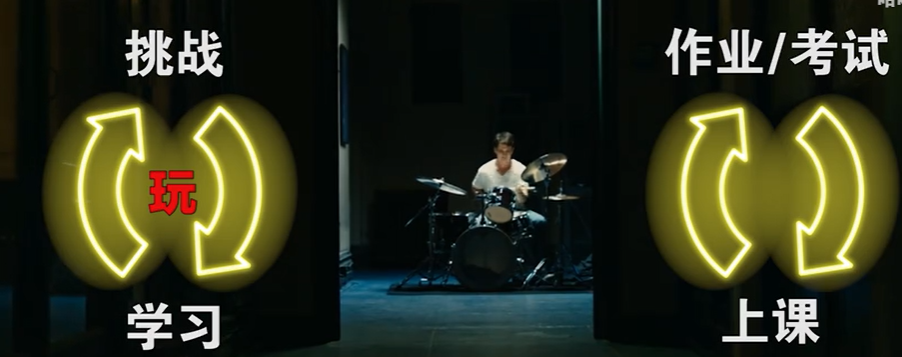{width="5.768055555555556in"
height="2.282638888888889in"}

然而文明的基石一教育，然而文明的基石一教育，却像个迟暮的老人，固执刻板观念落后，小孩子不爱学习爱玩游戏，可本质上应该思考的是，游戏为何吸引人，通过对比来考察游戏与教育的关系，左边是游戏体验。右边是应试教育，乍看之下两者的形式很相似，其实区别很大，先看左侧游戏的循环，我们出生对线，通过补刀升级游走gank，击杀敌人再升级团战，继而装备成形推高地，学习与挑战的形式变化多端，节奏有张有弛，体验流畅，但在学校里，且毫无变数，做题讲题无限循环。

评论：在游戏里你学了以后马上就有反馈。而小学生你学了一个知识后你要等考试考好以后，如果你的家长足够开明才会得到反馈，反正现实中反馈来得太迟了。

每一个游戏难题都是我们进一步成长的契机，每一个游戏难题都是我们进一步成长的契机，也解释了为什么学习有系统性，要比自学有效，因为系统性的学习正如游戏，是设计过循环节奏的。

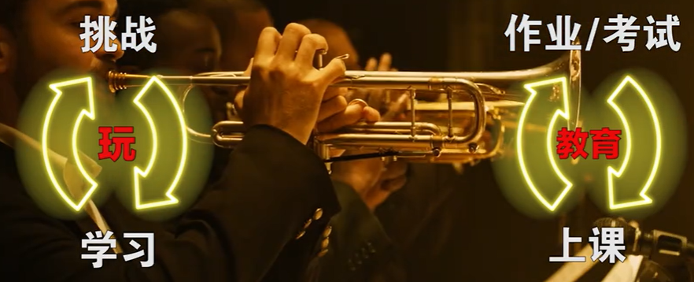{width="5.768055555555556in"
height="2.3409722222222222in"}

玩和上学两种行为本质区别在哪?

#### 玩和上学两种行为本质区别关键在于我们是否觉得自己掌控了命运

玩和上学两种行为本质区别在哪?主动与被动，主动与被动，玩游戏时在野外偶遇一个精英怪，可能会很兴奋，好像就要了命一样，都是被预先设计好的挑战，体验却天上地下，问题关键在于我们是否觉得自己掌控了命运？

评论：同样，如果写题是大部分会做的和小部分不会的，也会有所欣喜，

上章曾说过，游戏虽然是既定好的伪自由，但我们从没觉得被控制，每一个选择都是自己做的，预设好的怪物也被认为是自己探索到的，也有让同学们自主决定的情况，比如上课举手回答问题，文理综合的选做题，但谁都看得出这个选择不对等，我们反倒觉得被父母控制，被工作控制，教育在未来要逐渐放权，上课内容，课堂时间，任课老师，作业布置，考试安排，甚至是同桌性别，都会由我们自己选择，还要注意，没人强迫有些人会自己先放弃选择，也就是所谓的人就是贱，这是个恶性循环。

评论：告诉你们一个真相：国外的精英教育就是这样的，说白了，你命不好。哈哈哈

但愿我们都找回并维护做选择的权利，塞满强制剧情的落后游戏，进一步观察下这两个循环，游戏的挑战如boss战等，一定都有奖励，至少应该赠送所有人一个活动课，哪怕只是回头称赞，奖励是对付出的认可，更多是心理需求，其次二者看待方式也不同，每过一天就流逝天，可以以为生命从0开始，而不是更接近死亡，在应试教育里，老师默认每个人都该拿到100分，你也就应该受到批评，一开始默认玩家都是0分，我们每战胜一个困难就获得加分，体验截然相反，这种思维定势很打击我们的试错精神，考试总在无形中质问，这些题你会不会?潜台词就是，这些题你本应都会，游戏则会说，能不能想办法解决这个问题?这题怎么都做不对，游戏会说，再试一次，答对了题目感觉自己逃过一劫，而战胜了boss，游戏也有死亡惩罚，但成功的奖励和获胜的喜悦，会让我们克服失败的阴影，而考试失利令人沮丧，发挥正常又被认为理所当然，实在辛苦了同学们，

#### 关于处理失败游戏是高手 胜利终结乐趣失败维持乐趣

关于处理失败游戏是高手，玩家学习潜行是在家里尝试吓唬妻子，一而这个技能却是以后猎杀敌人用的，孤岛危机合金装备崛起中，没有任何风险，可以让玩家无畏地摸索学习，而课堂作业之于考试，都应看作安全空间，在马里奥的教学关某处，设计师根据可能误操作的跳跃距离，预留了一个隐藏奖励专门给犯了错误的玩家，犯错也有正面作用，堪称教育里的大师手笔，胜利终结乐趣失败维持乐趣，只要失败有趣我们就会继续尝试。并保持成功的希望

#### 学习游戏规则取代掌握书本知识 强化反馈

教育的观念正该由此进步，最后从技术这个核心角度，比较一下写作业和考试，考试分数是老师给我们的反馈，行为导向结果，而写作业靠自己对答案，会觉得只有行为没有结果，反馈更弱体验缺失，容易让人感到无聊，好游戏则强大得多，几乎玩家每个选择都有及时的正负反馈，告诉我们是否做对了，明确的结果又促进总结并思考下一
步，过程清晰体验极好，由此老师们就要知道，教育系统应该利用技术手段，大力强化反馈机制，使我们每答道题都可以速得到反馈，答错了鼓励我们继续尝试，就跟玩游戏样，让试错精神有具体落实，反馈是交互的核心，而现实之所以更加硬核，道理都在于此，生活的因果关系复杂，行为产生的结果，让人迷茫自发限制思维，人们常说玩游戏就是逃避现实，游戏的确更简单反馈更明显，这当然不正常，虚拟世界的诞生受制于现实世界，现实才更是我们自由发挥创造性的舞台，现实的可玩性可比游戏高多了，长辈忌惮游戏孩子厌恶学习，忽视了教育游戏化才是真如的解决方案，阻碍了社会发展，现代教育本质是对书本知识的掌握，而玩游戏是对游戏规则的掌握，是因为形式几千年不变，从根本上分析，教育以书本为根基，用书本记录文字是人类文明进化的一次飞跃，再深一层，文字是凝固的语言，文明的传承正是思维的延续，那么游戏若能成为教育的新形式，成为新的思维训练工具，到底能不能行，思维又是什么?

#### 第三节，虚拟认知律上，观察和看的区别

掌握书本知识思维又是什么?，思维又是什么?，动物走到悬崖知道停下，因为看到了危险，也说不出悬崖是什么，更不会把悬崖危险这一概念归纳出来，而人类得以学习和进步，就是把观察到的复杂现实抽象出概念，进而推导演化传播，现应到概念的转化可以称为，象能力，抽象能大，想把抽象的概念传达给别人，记泉下来就是文字和书籍，而做出可见可感的直观形式，那就成了，游戏系统就抽象于现实的运转规则，且高度概括直达核心，比如战斗需要体力，跑步需要耐力，受伤需要吃药，所以游戏规则的确定和我们对现实概念的确定，本质是一样的，开可以拿握在现买中没礼会按触，或是没能力概括的概念，这是一条提升认知的捷径，全面战争里。我们用上帝视角观看打仗阵型的重要性，我们都能从机制上理解，北起合纵连横或是横刀立马，真正左右战争形势的可能是经济与科技，人与人有多亲近，界定为交换过多少秘密，游戏把现实总结的简练又灵性，我们也已经不由自主地接受了很多，来自游戏系统的概念，比如用"升级"的概念，直观概括人与事物的变化本质，面对问题时，使用同理
"刷副本"的，刷题，刷作业等词，背后暗藏着我们将任务模块化的认知方法，甚至在谈论英雄电影时，哪些角色是小怪哪些是BOSS，而极大方便了理解，不只是方便交流，就完全明白对方的表达，背后意味着游戏，带给玩家趋同又先进的认知方法，语境的改变体现着思维的整体进步，如果你不理解什么是游戏系统，可能真的会在几十年后被淘汰，可能现在已经被智能机淘汰了，游戏虽贵为捷径，但负面就是可能脱离现实，不止游戏，电影小说等虚构作品体现出的概念都可能是完全错误的，而缺乏常识又渴望深刻的我们，很容易在其中接受完全虚构的人生观，纠正的方法就是在现实中验证概念的真伪，但行动要脚踏实地，却可能还没实践过，那么现在就来复习下。

#### 第三节，虚拟认知律下 靠自己观察后形成概念

观察和看，有什么区别?既然游戏和书本都可以是概念的承载工具，那游戏得以取代书本的关键在哪里呢?，我们掌握游戏规则靠的是自己的观察，再形成概念，而书本是单方面的灌输，那么再看真实情况，我们对现实世界的认知，点点积累，这样得到的概念才真实无误，教育就更应该帮助我们，形成观察思考推导的能力，但现实却是，几乎所有人在对世界缺乏观察的情况下，就容易脱离实际，比如迂腐的观念，先吸收了很多他人的观点，评论：仅仅靠自我观察，自我推导，那就是在重复前人的路，杠精的逻辑游戏，评论：虽然会有更好的理解，但是时间上是来不及的，这是偏见的一个来源，很多人为了保护先入为主的偏见不受伤害，游戏让我们一步步掌握了复杂的规则，靠的就是引导玩家不断观察不断总结，把敌人设计的很凶恶，让我们自己确认攻击性，让宝物发光表现贵重，在各种横板游戏中角色一直处于屏幕中间，但刚出生却被放在了左侧，就是在暗示玩家，游戏目标是向右探索，想表示个地方有危险也不会说出来，利用我们的观察传递信息，教育的发展仍需要时间，尝试在虚拟中锻炼观察力，总结概念并指导现实，我们解决了boss也可以在现实中实践，寻找问题突破口的方法论，通过氪金抽卡学会用概率判断风险，在植物大战僵里，玩家看到植物就知道自己操控的目标无法行动，更可以进一步明白，不能动在对战中到底有多分势，那么明白了这个道理，也要让自己在竞争中，提高行动力，游戏和教育都帮不了你，自以为高动物一等的人类，很多时候都没发挥出这种力量，一个战斗力强悍的士兵，反应快打得准身法好，但这只能解决某个级别的问题，而打赢一场战争，在游戏里表现为，很多人虽然操作猛如虎，但就是赢不了，当然也不要归纳错了角度，不管是守望先锋还是cs
go，解决问题的关键，而不是如何瞄准，而是团队合作。这既是教育的真理，也是游戏设计的基础，教育从填鸭变为引导，课堂也成为知识的乐园，不会再有"知之者不如好之者好之者不如乐之者"的区别，如果你真的擅长抽象和推导概念，当然千别的同样也有前途，存在着一懂百懂的可能，正所谓触类旁通，一味追求堆砌知识却从不思辨的人，

评论：然而当你知道好大学对人生影响有多大时，自然会有学习动力。

评论：填鸭的鸭肝挺好吃的，推荐，，

评论：跟复读机有什么区别?

游戏来自现实又反哺回现实，只有几十年历史的游戏，将击破千年不变的教育壁垒，这个游戏思路可不仅适用手教育，但别忘记，还要拷问出虚拟下面的真实，我们天然想跳过直接玩把来学习，这没有错，不是新手上路的指导手册。

#### 一个老师通常要对很多学生负责，所以无法像游戏一样，给予学生及时的反馈

初风roky 心灵使

一个老师通常要对很多学生负责，所以无法像游戏一样，给予学生及时的反馈。在教学过程中，又要以教学大纲的要求，使学生全体完成某一阶段的学习，无法根据每个学生的完成度不同，做出及时的调整。在5人团队游戏中，尚且还会因为某个队友跟不上队友而输掉比赛，在学校中，一个老师往往要带超过30个学生，某个学生跟不上整体进度，这是常事。然而老师通常并不能因为某个学生跟不上进度，就放弃他或者让他去层次更低的班级里，而是只能要求他更加努力，追上班级的整体进度，那么如何让他更加努力，显然老师可以使用的手段不多，大多数只能是强制他进行更多的学习时间，至于一对一补习，老师显然会分身乏术，那么只能期待学生的自觉性，但是学生往往很难从学习中获得乐趣，因为他无法从学习中获得及时反馈。那么问题便又回到了最初，老师无法像游戏一样，给予学生及时的反馈。所以教育只能采取另外一种方式，去迫使学生进行学习，系统性的知识灌输，只是手段之一，题海战术，也只是为了增加学生的练习量，而突击检查，定时考试，并公布考试成绩，排名次，也是为了提醒学生，你和其他学生有多少差距，你需要掌握的知识究竟掌握了多少。诚然，这种体制下的教育无疑糟糕透顶，却又是迫于现实的客观条件而做出的妥协，经济基础决定上层建筑，学生可以不理解这种制度的良苦用心，甚至抨击这种制度对于人类天性的抹杀，但是无可否认的是，每个人其实都是这种制度的受益者，你或许数学分数不高，并不明白学会三角函数又能在生活中有什么用处，但至少你会知道三角函数是三角形的某种性质，当你遇到一个三角形的问题时，你知道有一种知识能够解决它，而不会因为你对它毫无兴趣，便对此一无所知。

当然，科技的发展必将改变我们的生活，经济基础的稳定与雄厚，也将为人们带来更多的可能性，陈旧与传统的教育理念将会过时，基于游戏而产生的教育理念无疑是未来的一种可能。

但是现在，我们还需脚踏实地，在抬头远望天空的同时，也要做好分内的事情。

所以同学们，还请你们一定要好好学习，因为只有当你们足够优秀成为未来时代的领军人，我们曾经梦想过的东西，才可能在你们手中实现。

2018-09-02 17:01

51

#### 评论：应试教育和素质教育比较

[挝酨](https://i0.hdslb.com/bfs/face/ef4398c9e2b812dd035a50aeb165191598444aa3.jpg@160w_160h_1c_1s.webp)

其实我们浸泡在应试教育太久，会忘记了素质教育的存在。在别的国家里，采用素质教育的大有人在，但是，素质教育也不等同于游戏化教育，素质教育着重培养学生的自我探索和创造的能力，这就是为什么外国学生即使前期的学期速度没有中国学生快，但是后期也能并肩甚至超越，因为他们大部分都有自主学习的能力，明白什么是他们所想要的，他们的独立的想法相对于我们来说更加的丰富，并不是说外国一定比中国好，但是应试教育最劣处正是素质教育所培养的地方。打个比方，比如在初中的时候，大部分人的故事基本是捏造出来的，包括我自己在内，其实都没有经历这些事。然后我们自己会明白，这些都是为了考试，换句话来说，我们觉得学习就是为了考试。而大部分的故事也都基本大同小异，没有经历过的事，又怎么知道事情的真正感受。换而言之，素质教育的探索求真精神正是我们所缺的，我们要做的，就是努力去改变使自己更好，只有这样才能感染他人，从而改变教育。或许这个时间会很长，但是，仿照"正义会迟到，但永远不会缺席"来讲就是，"好的教育体系会迟到，但永远不会缺席"

2018-09-02 18:58

3

#### 评论：教育无法游戏化 娱乐可以选择 学习必修

Moozathogel·Azathoth

我觉得up说的很多都是挺有道理的，但是我还是觉得教育游戏化并不合适，游戏是娱乐的一种。只要合乎法律与道德，那么你选择的娱乐方式和内容完全可以按照自己主观意愿来选择。其实也就是说，游戏之所以让人沉浸，除了up说的很多反馈因素，更多在于其本身轻量化的信息和可以自我选择的能力。也就是说，游戏可以自己选自己想玩的，但是学习却不同。事实上，在学习教育这种事上不能说让你由着自己的喜恶来选择到底学什么和受到什么的教育，可是又有很多东西是必须要你去学习的。就好比同样的教育模式下，但是有些人很爱数学却讨厌物理，有些人喜欢物理却讨厌数学一样，有些人喜欢动作游戏，而有些人喜欢回合制的策略游戏。说到底，很多时候可能并非教育模式的问题，而真的只是个人兴趣问题罢了。

2018-09-02 17:13

4

## [持续烂梗的"平直性"](https://www.zhihu.com/question/525704191/answer/2427203279)

都说贴吧没落了，但为啥大多数梗都出自于贴吧？

因为一个持续的烂梗，一定要有一个叫做的特性，才能让人们持续使用。换句话说，你的梗，必须能让人直接的联想到广泛的使用场景，才能继续火起来。比如同样是描述遇见了特别能装的人的场景，一两年前火起来的"蓝衣记者",相对于
"羊胎素"就没有那么平直。而徉胎素又相对于"绿茶婊"，也没多么平直。所以"蓝衣记者"慢慢被人忘记，羊胎素时不时被人拿出来挖坟。而绿茶婊最后成为了老百姓的口头禅。

没有平直性的梗，如/"吴签/'，"快乐风男"，/"一爽"，"一起爬山吗"，"泡芙还是雪饼/"要么随着时间热度消逝，要么出不了圈。无论多么精妙,总之都要消失在大众视野中。

而有平直性的梗，比如"步子迈太大扯到蛋了"，"三年之后又三年,
三年之后又三年!"这类梗

即便是一个不知道出处的人，都能一眼看出用法。所以能够源远流长。即便是平直的恶意，比如："你m什么时候4"，/"你寄吧谁啊?
"，也广泛传播，经久不衰。

贴吧聚集了各种教育背景，知识水平的人物。所以一个梗在贴吧能火，就代表它经过了不同层次，不同教育水平，不同信息，不同学科的人的一致认同。所以是有较大的平直性的。

发布于2022-04-07 10:37

## Sex

### 心里性别是社会性别

[编辑于 2014-11-04
14:12](https://www.zhihu.com/question/22789853/answer/25527491)

[**知乎用户yWJV3k**](https://www.zhihu.com/people/912d35b797170b7829e1c037e86f2abc)

一直感觉心里性别是社会性别，不知道两者是不是有区别。有的时候想到自己去像女孩子那样相夫教子，穿裙子高跟孩扮可爱，喜欢男人永远都归因为性吸引，我就感觉窒息到想死。但是因为生理是女孩，不去做那些事情又觉得我是不是不接受自己，我的逻辑里不接受自己就是给我判了死刑，不接受自己造成厌弃，意识到到这种不接受又是一种厌弃。太烦恼了，总是说着不想了直接做吧，但是不找到个解决方式就会一直焦虑。

2021-10-01

[**笨宝醇**](https://www.zhihu.com/people/0b5976d48a446df969b1dad400393302)

对于爱好这个层面，是不是可以具体细分喜欢的那个男的或女的是生理男女还是心理男女。比如，一个生理男，心理女，喜欢上一个，心理女，喜好男的生理男。而另一个生理男，心理女，却喜欢上了一个心理男，喜好男的生理女。一个喜欢的是生理层面的男性，一个喜欢的是心理层面的男性。

2019-08-17

### 

对象是跨性别女性（生理男，心理女）我不是（生理女心理女），怎么办，要继续坚持吗不知道自己能不能接受？
[编辑于 2019-11-22
14:46](https://www.zhihu.com/question/357084391/answer/905118027)

我好感谢好爱我的女朋友。三年前我是以男性的身份和她网恋的，但是因为[性别焦虑](https://www.zhihu.com/search?q=%E6%80%A7%E5%88%AB%E7%84%A6%E8%99%91&search_source=Entity&hybrid_search_source=Entity&hybrid_search_extra=%7B%22sourceType%22%3A%22answer%22%2C%22sourceId%22%3A%22905118027%22%7D)产生的自卑，我从来没有发给她照片，而且对自己的男性形象逐渐产生厌恶。我数次经过她的城市，但是从来不敢与她见面。这一切直到我出国留学，她忙于考试，我也忙于应付足足12小时的时差。我们分手了。

在美国的独自生活的时间里，我变得越来越孤僻，除了上学我不再想出门，留学的两年间甚至没有交过朋友。我的抑郁和性别焦虑从来没停过，它们折磨着我，让我不再愿意面对自己生来是男性的事实。我终于开始了hrt。

最初的几个月可能是[睾酮](https://www.zhihu.com/search?q=%E7%9D%BE%E9%85%AE&search_source=Entity&hybrid_search_source=Entity&hybrid_search_extra=%7B%22sourceType%22%3A%22answer%22%2C%22sourceId%22%3A%22905118027%22%7D)大降引起的情绪问题，我不再出门了，连课也不上。我害怕和陌生男性说话，暴露我是mtf的事实，担心上厕所被陌生女性指责而赶出厕所，甚至害怕快递上门送件时的敲门声。因为这一学期的差成绩，我被学校[停学](https://www.zhihu.com/search?q=%E5%81%9C%E5%AD%A6&search_source=Entity&hybrid_search_source=Entity&hybrid_search_extra=%7B%22sourceType%22%3A%22answer%22%2C%22sourceId%22%3A%22905118027%22%7D)半年。我回国了。

之前留学第一年的时候，我已经和我爸妈暗喻了我是[跨性别](https://www.zhihu.com/search?q=%E8%B7%A8%E6%80%A7%E5%88%AB&search_source=Entity&hybrid_search_source=Entity&hybrid_search_extra=%7B%22sourceType%22%3A%22answer%22%2C%22sourceId%22%3A%22905118027%22%7D)，但是他们因为不知道跨性别为何物而无视、忘记我的话，这是我后来总结出来的。他们攻击着我的性别，认为我男生的样子多好。我抑郁越来越严重。我已经尝试过改变自己了，努力成为女性了。无奈hrt的时间太晚，能变的也就是想法和一些脂肪。也许下辈子能生为女性吧。但是在那之前我还有一个心愿没有了结，我要见一见前女友，我要告诉她我是跨性别，我要告诉她我不会再因为性别而自卑了。

今年六月的时候，我们见面了。以前她很爱发自拍，我却从来不敢分享太多生活中的事情，怕被她发现我的抑郁和焦虑，所以她不知道我真实的样子。我们约定在某地的地铁站外见面。我在室内等着，一眼就认出了刚到约定地点的她。正值夏天，她却站在阳光下毫无顾忌地玩着手机，在微信里问我在哪。我拿起遮阳伞急忙跑出去。我从她身后跟上，和她说的第一句话却是抱怨她那么大太阳也不怕晒黑。她惊讶地转头看着我，我们笑了。她还是和三年前一样，可爱得让人攥紧拳头的直女，而我变了，我不再因为性别而过分自卑，我有勇气面对她。我有活下去的自信了，我要成为她的女人。

我们聊着过去，聊着现状。我们重新在一起了，在现实世界里。短短几个月，我们的关系发展得比任何时候都要快。总会有吵架的时候，我一声不吭地哭，她在旁边叹气烦躁不安。有时会感到很安心，躺在她的旁边，感受她比我高的体温，想要更亲密更近地拥抱。

我决定不再继续出国留学，是为了我自己。我不愿意再回到那个挂着厚窗帘的出租屋，紧闭自己的眼睛，一个人躺在床上，闻着地毯的霉味，脑中空无一物却始终无法睡着。我要留下来，和她在一起。

这是我和她的故事。因为想偷懒，我没有特别详细的写出这段时间的经历。我很爱她，她也很爱我，我们的关系并没有被性别限制。

诚然，我虽然是女跨性别，但是没有像不少姐妹一样，过分地追求女性化的身材和心理，我明白二十岁才开始的[激素治疗](https://www.zhihu.com/search?q=%E6%BF%80%E7%B4%A0%E6%B2%BB%E7%96%97&search_source=Entity&hybrid_search_source=Entity&hybrid_search_extra=%7B%22sourceType%22%3A%22answer%22%2C%22sourceId%22%3A%22905118027%22%7D)带来的改变的并不多。幸运的是，我的面部足够平滑柔和，男性特征也不是非常明显，除了[喉结](https://www.zhihu.com/search?q=%E5%96%89%E7%BB%93&search_source=Entity&hybrid_search_source=Entity&hybrid_search_extra=%7B%22sourceType%22%3A%22answer%22%2C%22sourceId%22%3A%22905118027%22%7D)脚长之类避免不了的。我大体上性格比较中性，我也没有刻意去模仿女性性格的刻板印象。也许是因为这样，我和女朋友的关系才那么稳定吧。她曾经坦诚，说如果不是我，她的[性取向](https://www.zhihu.com/search?q=%E6%80%A7%E5%8F%96%E5%90%91&search_source=Entity&hybrid_search_source=Entity&hybrid_search_extra=%7B%22sourceType%22%3A%22answer%22%2C%22sourceId%22%3A%22905118027%22%7D)一直都会是男生。

### [生理性别男，心里性别女，但讨厌心里性别，该怎么纠正呢？](https://www.zhihu.com/question/363886260/answer/957213485)

我个人的感觉吧，你的详述里就已经否定了你"[心理性别女](https://www.zhihu.com/search?q=%E5%BF%83%E7%90%86%E6%80%A7%E5%88%AB%E5%A5%B3&search_source=Entity&hybrid_search_source=Entity&hybrid_search_extra=%7B%22sourceType%22%3A%22answer%22%2C%22sourceId%22%3A%22957213485%22%7D)"这件事了，因为身男心女的人的表达和需求往往是"我被困在一个男性的躯壳里了，我要怎么才能变成/成为一个普通的女性？"

所以基于这个前提，我觉得你并不是"心理性别女"，而是"一个认为自己不够阳刚的男性"。

然后剩下的事就很（从道理来说）很简单了，根据自己的情况，积极参与健身和挑战，连续的正反馈就能渐渐让自己获得自信。

[发布于 2019-12-31 10:02](/question/363886260/answer/957213485)

### 

有没有男性身体，自我性别认同为女性，却喜欢女人，在身体上是异性恋，在心理上是同性恋的人？有，可称其为"跨性别拉拉"

[编辑于 2017-01-12
09:40](https://www.zhihu.com/question/24463453/answer/27880300)

### 

跨性别女生灵儿（一系列的感觉变化）（3月）之后便回到了大学开始最后半年的学业了。回到学校之后，就和闺蜜又穿汉服出去玩了，当时去吃海底捞，居然被叫小姐姐，高兴炸了（就是这么容易开心）。但是同时自己的抑郁和焦虑也慢慢的到了重度。

[发布于 2021-09-23 21:15](https://zhuanlan.zhihu.com/p/413271745)

我是一名跨性别女性，花了4个月进行过度，希望这篇文章能让更多人理解跨性别（特别是跨女生）的自我厌恶的心理。（这里以女生为例，因为跨性别女生，在[抑郁焦虑](https://www.zhihu.com/search?q=%E6%8A%91%E9%83%81%E7%84%A6%E8%99%91&search_source=Entity&hybrid_search_source=Entity&hybrid_search_extra=%7B%22sourceType%22%3A%22article%22%2C%22sourceId%22%3A%22413271745%22%7D)，"紫商紫餐"的方面比其他跨性别还要强。）总的来说就是觉醒，自我挣扎，抑郁，慢慢心情好转，到现在有时抑郁又稳定的状态。

那天是2020年的最后一天，也是灵儿新的开始的一天。那一天穿上了，感觉到异常的适合，感觉就像量身定做的一样，虽然男生的骨相还是很明显的，但是那一刻就是灵魂找到了"身体"。在那之后的一段时间都没有穿过女装了。

（1月）然后就到了放假的时间啦，回到家，整个人都傻傻的，就像魂没了一样睡眠也不正常了，XXX，但是怕出什么事，差点以为自己是[精神分裂症](https://www.zhihu.com/search?q=%E7%B2%BE%E7%A5%9E%E5%88%86%E8%A3%82%E7%97%87&search_source=Entity&hybrid_search_source=Entity&hybrid_search_extra=%7B%22sourceType%22%3A%22article%22%2C%22sourceId%22%3A%22413271745%22%7D)。所以就去看了精神科，后来发现是焦虑症和抑郁症。

"[抑郁状态](https://www.zhihu.com/search?q=%E6%8A%91%E9%83%81%E7%8A%B6%E6%80%81&search_source=Entity&hybrid_search_source=Entity&hybrid_search_extra=%7B%22sourceType%22%3A%22article%22%2C%22sourceId%22%3A%22413271745%22%7D)下，恐惧声音，破坏冲动。性别刺激极强"

"现在每次感觉到自己的声音就会有喉咙的堵塞感"

总的来说就是对自己的声音有很强的厌恶不适感。

[**灵儿**](https://www.zhihu.com/people/a9aeb6c36d21647caf5a28fab00e27fa)
作者

0一般是gay里面的受。跨性别女生是性别认同为女生的有男性身体的女生

2021-10-05

### [性别认同障碍（生理男，心理女，喜欢女）和喜欢并理解自己的女性结婚，该不该和女儿摊牌？如何处理家庭关系？](https://www.zhihu.com/question/306911520/answer/559757448)

[**優子**](https://www.zhihu.com/people/dx-you-zi)

如果你的外观是男，对女儿坦白不坦白，可以选择，不坦白，与传统的[父爱](https://www.zhihu.com/search?q=%E7%88%B6%E7%88%B1&search_source=Entity&hybrid_search_source=Entity&hybrid_search_extra=%7B%22sourceType%22%3A%22answer%22%2C%22sourceId%22%3A%22559757448%22%7D)如山不同，你可以选择展现一个温柔的父亲形象。坦白，你就需要做多点事情，教育女儿正视各类小数群体，一步一步引导。

如果你的外观是女，那就只有坦白，同样的，你不仅需要做到前面所说的，还需要给予她比[普通家庭](https://www.zhihu.com/search?q=%E6%99%AE%E9%80%9A%E5%AE%B6%E5%BA%AD&search_source=Entity&hybrid_search_source=Entity&hybrid_search_extra=%7B%22sourceType%22%3A%22answer%22%2C%22sourceId%22%3A%22559757448%22%7D)更充足，强而有力的亲情与爱，但不是传统那套我为了你好，来让女儿觉得我的两个妈妈，都是我的[骄傲](https://www.zhihu.com/search?q=%E9%AA%84%E5%82%B2&search_source=Entity&hybrid_search_source=Entity&hybrid_search_extra=%7B%22sourceType%22%3A%22answer%22%2C%22sourceId%22%3A%22559757448%22%7D)。

[发布于 2018-12-26
02:06](https://www.zhihu.com/question/306911520/answer/559757448)

### 男性女装是对期望中伴侣的具象化表现

其实男性女装后的样子，只是他对期望中伴侣的具象化表现。

那没有女装的男性就是不想找女朋友/[抠鼻/]？

不一定，可能是没有具象化。

## [从人生尺度上看，你能拥有最奢侈的东西是什么？](https://www.bilibili.com/video/BV1Yt4y1S7Wd)

2020-09-04 08:30:47

### 幸福的童年和随之而来的稳定的亲密关系

在1937年，哈佛大学的心理学家开始了一场叫格兰特研究（the Grant
Study）的实验。他们的问题是：到底什么健康因素会决定人未来的成功？

答案是：什么健康因素都不是，而是幸福的童年和随之而来的稳定的亲密关系。

### [该研究定义的成功的标准](https://www.bilibili.com/video/BV1Yt4y1S7Wd?t=134.8)

1 被收录入《美国名人录》

2 在所有实验对象中收入排名前25%

3 低级别的心理不安感

4 在65岁后的互作情感的娱乐中有真实的享受感和成功感

5 75岁时保持良好的主观健康(即在75岁时保持活跃)

6 在80岁时保持好的主客观身体与精神健康

7 掌握埃里克森的心理繁殖要求(心理学术语)/*

8 除妻子与孩子外 在60到75岁之间拥有社会支持

9 在60到85岁之间拥有良好的婚姻笑系

10 在60到75岁文间与子女保持亲密

### 应对机制是压力和人际冲突调动我们情绪的机制

谢谢大家支持我的视频！我收到了不少留言和私信，在这里回答一下大家的问题：/
1. 到底应对机制是什么意思？/
应对机制是压力和人际冲突调动我们情绪的机制。在压力面前，我们需要用一定的方式去面对它，比如逃避问题、压抑情感、愤怒，这些都是应对的方式。它在我们没有意识到的情况下放大我们的感受。要理解自己应对机制，可以在自己对他人感到挫败和愤怒的时候问自己，"我现在的感受让我想到了什么"？/
2. 《经验的胜利》这本书在哪里可以买到？/
很遗憾，这本书现在还没有中文版。如果大家想要阅读英文版的话可以像我一样去Library
Genesis下载pdf（但在有条件的情况下请支持正版！）/
3. 这本书的结论只是相关性，不是因果性，所以可靠吗？/
很遗憾，现有的社会科学研究，凡是涉及到统计学方法的，确实只能给我们提供相关性的结论。我们可以通过增加变量和使用工具变量的方式尽可能减少统计学上的偏差，但我们得到的结论都是基于相关性的。关于相关性和因果性的区别，这是一个非常有意思的哲学问题，我也想改天出一期视频讲讲。

### 幸运儿一生都在被童年治愈 不幸者一生都在治愈童年

T未知T

幸运的人一生都在被童年治愈，不幸的人一生都在治愈童年。而人的一生并不会由开始的经历而影响一辈子，可以学习，可以尝试不求回报的热爱，可以学会舍弃也可以学会重新拾起，爱就是这么伟大和不同寻常，好好爱吧，越热爱自己和生活，就越会有更多声音爱你

2020-09-20 11:1111

### 评论

#### 自己现在这个样子都怪家庭 大四了才醒悟

降谷凛

看到一半差点绝望了，就感觉自己现在这个样子都怪家庭。然后又觉得自己很卑鄙，总想着推锅给别人。认识自己接纳自己真的太重要了，都大四了才开始接触这些，感觉自己太落后了，但是看着很多同学又觉得似乎走在前面。（真的是太矛盾太纠结了）看老师的视频收获很多，谢谢老师呀！

2020-09-04 10:471946

#### 过于严厉的教育

愿人如晚

每个月都打？？？这个很惨了/
我小时候是每天都挨打，去读寄宿学校周五回家挨打零花钱拿去买零食花完了，没有存下来就挨打，还要我跪着继续打我，骂我败家子女。没洗衣服要挨打，洗不干净要挨打，不做饭要挨打，不打扫卫生要挨打。有零食一定要先给妹妹，不先给妹妹要挨打。妹妹的零食吃完了问我要，不给我就挨打是个不负责任的姐姐/
我很清楚我父母是怎样的人，我不理解她们为什么非要这样对我。如果要我真的和我自己和解给自己一个合理的解释，就是我不是她们所喜爱的孩子

2020-09-07 12:563

#### 预感下一次挨打到来的时间而焦虑

北美救赎

我从有记忆开始到小学六年级，每年都会被妈妈打，尤其是幼小的时候，几乎每个月都要被打一顿。我甚至在被打一次后，在预感下一次挨打到来的时间而焦虑。每次被打了，我都躲起来，想过自杀，幻想自杀后，妈妈一定会后悔打我，好让她难过。也有过自残，用锤子锤肚子，来换得我妈妈的爱。但是却没有得到需要的关心，反而是继续言语刺激我。多年后回忆自己因为调皮而多次被打的记忆，我真的感觉自己的童年却有一定的不幸。相反我最好的朋友，或者说发小，他的妈妈与他的关系，让我曾经一度羡慕。为啥我要叛逆地选择去离家远的地方读高中，远的地方读大学，甚至要跑到国外，最初的想法就是摆脱母亲的控制，不仅仅是行为上的棍棒教育，更是思想上的束缚。妈妈给我的教育有积极的一面，让我坚强，倔强和不走寻常路的独立性。也有她的抱怨，变化无常的情绪带给我消极的悲观想法。倘若今后的人生有机会弥补这些缺失，我乐于接受这样的自己。Sep
4th 2020 美东时间03:44

2020-09-04 15:44696

#### 戾气这么重 父亲把笑脸给了领导和客户 劳累冷漠带回家

福楼拜的星期天

父亲的经济和母亲的格局基本上可以决定一个人的人生走向，戾气这么重不外乎是父亲把笑脸给了领导和客户，把劳累和冷漠带回了家；母亲把心思用在了斤斤计较，而没有真正关心到孩子真正想要的

2020-09-05 00:08147

#### 经济独立

这位公子大人

回复 /@prpr冷小漠
:是的，我非常明白，我爸妈在我读高中时，骂我是家里的寄生虫......是他们的附属品......然后有一次我和他们吵架，吵的挺厉害，我说我要离家出走，他们说赶紧走，然后我出门前，他们让我把我身上的外套鞋子都脱下来，说这是他们买给我的，不是属于我自己的东西......我身上那背心和短裤就当施舍给我了....../
/
然后我就光着脚丫走了......一个人躲在一个角落里哭来着，后来夜里被他们边骂边叫回去的......我也只能受着，因为当时他们说的也对，我没有任何反抗的余地....../
/
所以后来我大学时就到处打工，实习，做家教啥的......为了能够经济独立，我知道经济独立对我而言太太太重要了，甚至是我保住自己尊严的基础......经济不独立的我什么都不是....../
/
我现在毕业工作了，也一直保持经济独立，不问别人要一分钱，哪怕自己再累，也撑着......想想是觉得还挺心酸的，但至少爸妈再也不能骂我是个寄生虫了....../
/
我特别能理解你，别怕，你再熬一熬，再忍一忍，等你上了大学，就有时间找工作了，当然，我建议大学期间一样不要放弃学业哦，对你以后出来工作赚多赚少也很重要的，只有赚的越多，在他们面前才有底气！等有一天赚的比他们还多时，他们自然而然不敢再骂你了

2020-09-12 23:367

#### 童年无忧无虑 接触人比较少 无法维系长期关系

这回我不会撞昵称了吧

但我的人际关系依然无法处理好。第一次见面的人会很喜欢我会夸我，也就是看起来讨喜吧，但慢慢地越来越疏远，我无法理解怎样维系关系/

2020-09-04 14:1933

霸道总裁王铁柱

回复 /@这回我不会撞昵称了吧 :因为小时候你接触人比较少

2020-09-04 16:13

#### 成长是要不断和解的 复盘找原因 思想方式变化

Nice家_亻火

上了大学以后，一个很重要的经验就是，人的成长是要不断和解的，和不完美的童年和解，和不完美的家庭和解，和不完美的自己和解，试着去理解接受自己的幸与不幸，不要总被过去纠缠，伤口可能无法被治愈，那就承认接受他的存在，生活总要前进

2020-09-05 09:1980

吧噗噗的后花园

回复 /@九三可依
:不止，小时候的记忆有时候再拿出来想又会有不同的定义，小时候毕竟知识水平有限，那时候对一件不好的事情做了定义，过一阵子再翻出来想一想又发现了新的华点，不断的复盘，不断的找原因，会发现过去的自己跟现在的自己思想方式完全不是一样了

2021-07-19 00:46

#### 大多不幸童年源于大量的个人时间被工作生存

#### 所占用而忘记情感沟通

机言鸠

我说一点我不认同的观点，祖辈的创伤的根本性来源如果归纳与社会动荡与政治变革未免有点太宽泛，而且在我看来也是不严谨和不全面的，创伤的来源在形式上可以是多种多样的，但是归根结底，一切最根本的原因是经济问题，你可以发现，绝大多数拥有不辛福的童年的人都来自于穷人家庭，祖辈的贫困导致祖辈的受教育程度低以及需要在很早的时候就需要打工扶持家庭，因此在穷人的生活当中，如动物本能一般的生存占据了主导地位，因此对情感和沟通的忽视也是必然的，而如果我们把穷人这个概念展开来讲的话，引申为无产阶级这个概念，那么这里的穷人就不单单是指物质上匮乏的人，而是指大量的个人时间被工作所占用，缺乏能够自己自由支配的时间的人。

#### 通过后天的调整来改变 相当奢侈 价格高昂心理咨询师

那么根据我的这个看法，最后up提到的能够通过后天的调整来改变，其实也是相当奢侈的事情，先不说举的这个例子的人的童年阴影只不过是几次轻微程度的家暴，而且父亲在当时就曾经表现过和解与原谅的态度，而很多的人的不幸的童年要比这悲惨更多，而视频里最后的那个例子，那个人之所以能改变，是因为他有钱请的起价格高昂的心理咨询师（尤其是在美国），能够在不工作的情况下靠积蓄脱产一年在医院疗养，我的天，这种条件对于现在全世界的绝大多数的家庭都是天方夜谭，根本就不可能实现的。

2020-09-06 14:1013

## [强大的善良](https://www.bilibili.com/video/BV1yS4y177C8)

ONETREESHEEP一棵羊

善良是一种上位者和拥有者的给予的时候，才不容易被人利用。一定是你要比对方更强大的方式才能去帮助对方，如果一样的话也帮不到什么，如果比对方弱小遇到同样善良的人就还是帮不到什么但是能有情绪价值，遇到不善良的人就会被对方剥削

2022-07-23 09:50 3

迈K朗基罗

深有体会 当你一次又一次放低下限去体谅别人帮助别人时
回报你的不是感谢和理解 而且别人认为你好说话好欺负
一而再再而三的变本加厉的索取

2022-07-23 13:16

## MBTI

IxTJ适合当程序员

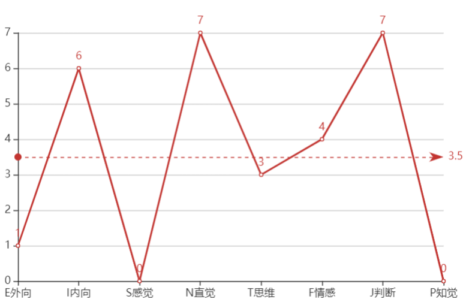{width="4.0444838145231845in"
height="2.623606736657918in"}

### [MBTI 16个多彩性格](https://baijiahao.baidu.com/s?id=1642003807038767928)

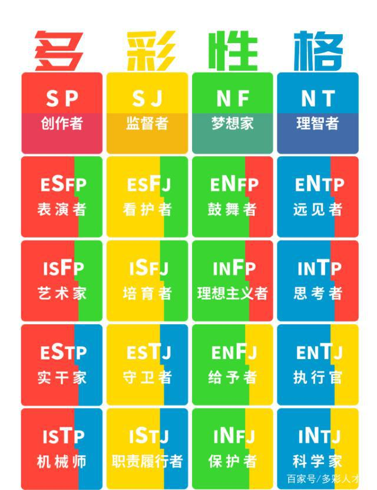{width="4.986853674540683in"
height="6.472222222222222in"}

### [这个测评更准确：](https://space.bilibili.com/16188588/channel/collectiondetail?sid=358840)

#### [MBTI萌宠动画](https://space.bilibili.com/2024805564)

#### [MBTI区别](https://space.bilibili.com/16188588/channel/collectiondetail?sid=358840) SN FT JP区别

#### [【MBTI】16型人格在听到要借钱时的反应](https://www.bilibili.com/video/BV1D54y1Z73P/?spm_id_from=333.788.recommend_more_video.7&vd_source=f03b9d349cef8aff4a045d602d8a1d82)

#### [当MBTI同类型相遇时，会有什么样的反应？（绝望篇）](https://www.bilibili.com/video/BV1jA4y1X7T2)

2.0万 129 2022-04-21 16:31:29

##### [ISTP](https://www.bilibili.com/video/BV1jA4y1X7T2?t=94.9)

难以建立联系

##### [INFP](https://www.bilibili.com/video/BV1jA4y1X7T2?t=143.4)

没工作太真实了。

#### [MBTI各类型禁止做会疯掉的事](https://www.bilibili.com/video/BV1i44y1779T)

（中韩双语 /| 韩语学习 /| 16型人格）

#### [【MBTI】16型人格在聚餐时的无奈](https://www.bilibili.com/video/BV1MY4y1t7V9/?spm_id_from=trigger_reload&vd_source=f03b9d349cef8aff4a045d602d8a1d82)

#### [如果MBTI各类型听到别人说自己坏话？](https://www.bilibili.com/video/BV1Ju41167jN)

#### [【MBTI】16型人格哭的理由是这些，好准！](https://www.bilibili.com/video/BV1pg411d7mj/?spm_id_from=trigger_reload&vd_source=f03b9d349cef8aff4a045d602d8a1d82)

#### [【MBTI】16型人格被误解时的样子（内向篇），真是搞笑又准](https://www.bilibili.com/video/BV1AD4y187gT)

#### [MBTI各类型去相亲时的不同表现](https://www.bilibili.com/video/BV1Pf4y137Wd)

#### [【MBTI测试】S和N的差异之S好气人！](https://www.bilibili.com/video/BV1jW4y1C7fm)

2022-05-30 14:14:43

### I=introversion内向 E=extroversion外向

MBTI的内倾所指的是注意力的焦点在内心世界，能量来源在内心世界。

我们日常生活中的内向，是指不爱说话、不爱社交、含蓄等等。喜欢逛街、朋友互动也是E。

Entraversion外倾，能量来源在外部世界，"聚会"只是跟外部世界发生接触的一种方式而已，下楼出门走一圈、在路上瞎逛、跟朋友打电话、打球，这些都是跟外部世界在产生互动。你不喜欢聚会可能只是不想浪费时间在无目的、无目标的社交活动上，这跟你是否外倾没有任何关系。

### N抽象 思想深邃 S感觉 实际物质 世俗 肤浅

S看到苹果就是苹果，N看到苹果想到牛顿重力。

### Feel情绪化 共情能力强 情商高 Think 高自尊理性说真话

F更考虑别人心情，T更冷酷、逻辑。

[**barlie**](https://www.zhihu.com/people/cdffc0d526bba9052055fd6841e1ec94)
ti跟道德感没半毛钱关系

2022-08-07

STP风评很差的原因就是Ti-Se或是Se-Ti的直接[爆发力](https://www.zhihu.com/search?q=%E7%88%86%E5%8F%91%E5%8A%9B&search_source=Entity&hybrid_search_source=Entity&hybrid_search_extra=%7B%22sourceType%22%3A%22answer%22%2C%22sourceId%22%3A2402559594%7D)太强了。其实还是不够聪明的表现。

khgkhgkhgkhgkhg

Fi是主导个人主观价值观的功能 而个人价值观每个人都不一样 所以以Fi主导的人
会过分强调个人价值观中心 所以基本是不接受大众和社会和他人的意见的
所以是即便是infp和infp相遇一旦涉及价值观
两个绝对不会改变个人价值观的人碰到一起一样是无法相互理解的
而且会比碰到其他功能主导的人冲突还要大

2022-07-26 19:36 14

### P理解 注重感受 J判断 注重别人评价

J （Judging）坚决/判断 P（Perceiving）谨慎/感知

[J更遵从计划，P更随性。](https://www.bilibili.com/video/BV1zS4y1L7Mz)

### 弱肉强食利益为第一 estj

[**林笙**](https://www.zhihu.com/people/b468a018e313ce82b0b856b64616c320)
感觉越内卷的地方estj，istj越多

2021-11-25

[**南木予舍**](https://www.zhihu.com/people/579e31394246345971444f8188dcb281)
可是越往高校走in应该会越多，起码我身边in居多

2021-07-06

[**奥丙**](https://www.zhihu.com/people/26c41f4a9f3f0fe7eba217a473061f6c)
美国遵循弱肉强食利益为第一，很符合estj

2022-03-04

知乎用户4hWGVN

P类的都比较柔软，就是把他们放到什么环境里，他们可能都能从中参禅悟道，随遇而安，然后畅享在精神世界，也不那么世俗

J就是硬骨头一块，想干什么必须搞成，野心也比较大

2020-01-26

### 我的人生历程性格分析

INFP 治愈者 幻想家 哲学家

ISFJ 守卫者 照顾者

INTP 逻辑学家

ESFJ 热情的主人

初中以及之前 INFP（写文章抒发情感）-/>INFJ（写文章批判这有什么意义）

高中 INFP（写文章抒发情感+批判）-/>ENFP（段子）

大学
ENFP（追梦人乐子人）-/>INTP（异性交流极度尴尬）-/>ISFJ（学习并帮助别人的工具人）-/>
ISTJ（做自己事）

毕业一年
INTP（到处查东西）-/>ISFJ（回家）-/>INFP（晚上emo时）-/>INTP（到处查东西）

无压力自由自在时，独处回忆emo INFP

独处查询资料，好奇心 INTP

应付亲戚社交场合，朋友，熟人/轻熟人 ESFJ

有事干，有工作时需要与人打交道，熟人/轻熟人 ISFJ

网友，广泛的社会生活，陌生人 ISTJ

目前大部分时间是ISTJ，但是实际上是INTP。

INFP一天到晚在幻想，一直担心还未发生的事。总是后悔曾经未做的事。

应该以测评结果为准：INFP/INTP或ISFJ，MBTI毕竟是对熟人的理论。

成熟的标志应该是不同的场合切换不同的人格。或者说发挥自己不擅长的功能。

### 荣格理论

#### [荣格认知功能测试简介](https://mp.weixin.qq.com/s/KR-6adxKueOq1mwjHMBnpw)

##### 

##### [测评地址 有完整报](https://www.jungus.cn/zh-hans/test/)Se Si Ne Ni Te Ti Fe Fi

感知 获取信息

外倾感觉（Se）、内倾感觉（Si）、外倾直觉（Ne）和内倾直觉（Ni）四种

思考 处理信息

外倾思考（Te）、内倾思考（Ti）、外倾情感（Fe）、内倾情感（Fi）

** 外倾感觉Se：对外界环境的直接感知和亲身体验；**

** 内倾感觉Si：重现记忆，对经验、习惯和传统的依赖；**

** 外倾直觉Ne：在不同事物间建立联系，发散跳跃式思维；**

** 内倾直觉Ni：抽象感知和顿悟，以及对事物的大局观； 高度总结**

** 外倾思考Te：关注高效解决问题，完成客观目标；**

** 内倾思考Ti：关注理解事物原理，追求严密逻辑；**

** 外倾情感Fe：关注社会道德与和谐，照顾大家的感受；**

** 内倾情感Fi：关注内心的价值观，聆听本心的声音。"**

聪明和年龄：聪明在年龄上呈现不同样貌。

ni年轻时"有悟性"，但容易因看得深易放弃磨灭悟性，在经过岁月历练后，才能像"高僧所言极是"。

ne更有孩子般的灵气，在年轻时凸显，也更容易"伤仲永"，伴随成熟社会化后，是受人喜爱的"老顽童"

si在年少时沉默，仔细地做事，积累经验，随着时间积累，si也会显现出经验丰富的老成式聪明；

se年轻时往往被夸机灵，但在需承担责任时机灵会隐匿，人格成熟后，成为能独当一面的人才。

fi在未成熟时，更多表现为"倾听"、"沉浸情绪"，在真正讲注意力转向他人时，才能显现"共情"的智慧。

fe在未成熟时，更多表现为普通的"温柔"、"照顾人"，掌握合适的人际关系技巧后，才能显现"情商"

ti在未成熟前，表现未在意概念逻辑，配合良好的语言能力和动手能力，才能将"聪明"真正展现出来。

te的逆商，越失败越能显现风采，后期可以更平静。

不同人格都需要成熟发展，如果没有体现出对，心总明来，可能因为你还是一颗未经打磨的"原石"

#### [浅析荣格八维(一)：从MBTI到荣格八维](https://zhuanlan.zhihu.com/p/112590609)

##### 十六人格中，每个人格的功能排序/分化：

ESTP --- 创业者 Se Ti Fe Ni Si Te Fi Ne

ESFP --- 表演者 Se Fi Te Ni Si Fe Ti Ne

ISTJ --- 检查者 Si Te Fi Ne Se Ti Fe Ni

ISFJ --- 保护者 Si Fe Ti Ne Se Fi Te Ni

ENTP --- 发明家 Ne Ti Fe Si Ni Te Fi Se

ENFP --- 奋斗者 Ne Fi Te Si Ni Fe Ti Se

INTJ--- 策划者 Ni Te Fi Se Ne Ti Fe Si

INFJ--- 劝告者 Ni Fe Ti Se Ne Fi Te Si

ESTJ --- 监督者 Te Si Ne Fi Ti Se Ni Fe

ENTJ --- 陆军元帅 Te Ni Se Fi Ti Ne Si Fe

ISTP --- 手艺者 Ti Se Ni Fe Te Si Ne Fi

INTP --- 建筑师 Ti Ne Si Fe Te Ni Se Fi

ESFJ --- 供应者 Fe Si Ne Ti Fi Se Ni Te

ENFJ --- 教导者 Fe Ni Se Ti Fi Ne Si Te

ISFP --- 创作者 Fi Se Ni Te Fe Si Ne Ti

INFP --- 化解者 Fi Ne Si Te Fe Ni Se Ti

Ne Si Ti Fi

其实infp的刻板印象是isfj，我读过荣格的心理类型，si的特点不是死记硬背，是敏感触景生情触发联想。至于为什么isj人容易保守，那是因为对某段经历感触过深，所以深信不疑不愿再去改变了

##### 关于JP倾向划分：

这是迈尔斯母女基于荣格的一般态度类型及理性与非理性的理论，所衍生增添的维度，能够帮助我们更好地将MBTI与荣格八维的人格进行换算并更多地产生关联。

譬如一二功能为Fe/Te这两者判断功能的人格，必然是J类，这类人格更多地会和外部世界产生更大的联结及互动。Fe对人，社群等，Te则对事，体制等。

一二功能为Ti/Fi这两者判断功能的人，必然是P类，这类人格则更多地聚焦于内部世界，探索剖析于其中。Fi对人性，个体等，Ti则对根源逻辑，客体等。

[关于MBTI的N个误会](https://zhuanlan.zhihu.com/p/31693729)

缜之

荣格的人格发展理论认为，任何类型的人格都可以从事任何的职业，只不过，那些非典型的人格，去做好一份工作的方式和典型人格的方式/途径是不一样的。

这个倒是学习了

2018-05-19

#### 荣格八维专业分析对比

##### [ISTJ全方位专业人格分析（含INTJ对比）](https://www.bilibili.com/video/BV1pg411Z7xs/?spm_id_from=333.337.search-card.all.click&vd_source=f03b9d349cef8aff4a045d602d8a1d82)

2022-07-22 17:00:00

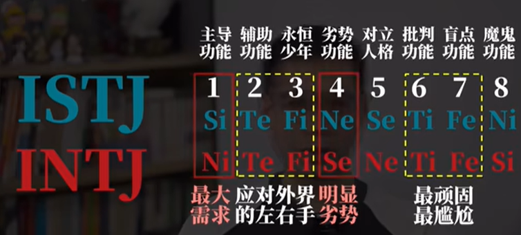{width="5.768055555555556in"
height="2.6006944444444446in"}

用逻辑反击别人。

就是INTJ相对IST更「神经质」

ISTJ现实秩序

INTJ抽象秩序

##### [ISFP+INFP八维全方位对比人格分析，文艺青年大不同](https://www.bilibili.com/video/BV1kG4y1v7Jo)

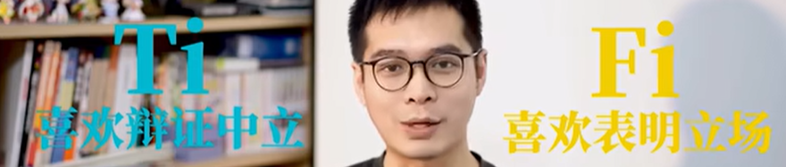{width="5.768055555555556in"
height="1.2256944444444444in"}

到底是Ti主导还是Fi主导。

#### [请问Ni（内倾直觉）使用者的具体表现是怎样的？](https://www.zhihu.com/question/368645183/answer/2735436443)

[编辑于 2022-10-30
16:42](https://www.zhihu.com/question/368645183/answer/2735436443)

来看看Ni使用者是怎么说话的呗:
概括，分类，时间跨度，找基础找本质，能精辟绝对不赘述。

**Ni：**

首先范闲是一一个。。有着现代思想的一一个人，他生活在古代他会很孤独他会跟世界发生很多的交流和碰撞，这个过程中会有对抗，也会有产生亲情爱情友情然后我觉得这是一个年轻而热血的灵魂跟这个世界相处的过程

我觉得这一季的Gucci在设计师的带领下，一直有一种天马行空的气质然后很有艺术感，也符合品牌一直以来的定位，因为是来自佛罗伦萨嘛。基础是有文艺复兴的一种审美，然后跨度又很大，很有冲击力和年轻的感觉。

他们自己在把事情总结得很好的时候，内心是挺爽的，觉得别人一定不想浪费时间听细节只想听结论。但事实经常是，他们讲完了，根本不知道发生了什么事，比如张若昀这个例子------所以小范大人干什么了，Gucci到底这季长什么样，全部忽略了。

**Si：**

再看看Si使用者的表现:
清晰，线性，整理组织后的一系列感觉。他们觉得让你身临其境地了解所有的事件，能让你更好的跟他们的内倾感知同步，所以有时候稍显啰嗦。

阿耀是一个就从小生活在海岛上的，然后可能在他之前的生活经历中其实是个很孤独的人，就像台词中说的，其实他的朋友只有一辆摩托车他其实在我看来就更像还没有踏足社会的一个男生一样，他也没有接触到朋友也没有接触到社会上形形色色的人，也没有从自己的家那个岛上走出去过然后但是随着故事的开始，然后他经历了很多事情，见到了很多朋友也离开了很多朋友，然后最后也离开自己的家乡去到了电影里的广州，那样一个大城市里打拼的故事

**Se：**

使用者则更加强调展示某一个时间点的感知，或者感知的高潮，他们觉得最吸引最有意思的瞬间。Se整体与Si类似，但是听完通常并不知道前因后果，发生了什么事情，只知道了碎片式的4D
360广角画面。

第一次来时装周，感觉很激动，因为其实音乐一放的时候是很振奋人心的你看到整个玻璃整个镜子都在动，
地板也在动，然后模特的步伐也是很快感觉特别未来。。特别。。把优雅和力量和。。呃。。很时尚的元素全部结合在一起，让我觉得非常喜欢请所

##### [ni万事都追问意义](https://www.zhihu.com/question/368645183/answer/1020066973)

ni万事都追问意义，故容易识别出他人行事的动机，得到答案后不会轻易动摇，故外显坚定或偏执。只依赖ni脑内意淫，易愤世嫉俗或虚无，通过se接触现实后便会变得包容。---------------------分割线---------------------精神洁癖，追求完美但是完美永远无法实现所以在理想与现实有太大落差时陷入虚无并倾向自我毁灭，毕竟回归宇宙就能获得永远的宁静。以第三方视角理解而非身体力行体验事物，常有肉体与灵魂分离的不真实感和飘浮感（发展se才能把ni拉回现实）过度依靠ni导致的大脑狂乱疯癫与现实世界彻底脱离整天像活在梦里可参考《荒原狼》编辑于
2022-06-19 22:10

##### 直觉人通病 si-ti差 回忆、逻辑思维不行

D.rabbit

我感觉这是直觉人的通病/[思考/]其实一方面是ni太强了，另一方面其实是si-ti不够，也就是说你没法用精准的语言恰如其分的描述你脑海中的抽象意象。所以这是为什么很多n人可能会去学哲学什么的去给自己学习一套/"不接地气但有清晰术语/"的学术语言......通过si的积累（从而更好描述）和ti对于概念的精准定义来讲清楚自己的想法/[调皮/]

2022-10-18

#### [组里有内倾直觉Ni强的吗，是什么感觉呢？真的有第六感吗？](https://www.douban.com/group/topic/161491922/?_dtcc=1&_i=9181930SOAoxft)

##### 第六感事件

[**opuio**](https://www.douban.com/people/208463615/) **2019-12-25
10:57:11**

考试遇到不会的题，假定一个求助老师的场景，然后幻想中的老师就可以说出正确的思路。
然后那次我数学就考了接近满分（就粗心错了一道题），虽然就只有这一次。。
我觉得在我完全放松的时候直觉才会发挥出来，稍微一紧张或者在你"有意识"的求助时就没那么好用了。
还有就是时间观念，不知道这个是属于NI还是NE，在我上学路上我虽然不知道还有多久上课，但是直觉可以告诉我是要"加快脚步"还是可以"慢下来"，准确程度基本是我出门前看一眼表然后就可以踩着铃声进教室门，为此班主任竟然还改了迟到规则（针对我c。。。

刺尾河豚🌈 楼主 2019-12-22 23:46:23

那你会有一些Ni的神秘体验，比如"手机响之前，就感觉到手机要响了！"这种情况的发生的体验吗？确实，用主观来主观感觉自己内倾直觉强不强是有点唯心，不过如果有实际的例子能说的话，就好办了......

[**饺**](https://www.douban.com/people/153472489/) **2019-12-23
00:59:03**

会有比如，直觉预感我这次会中豆瓣读书的赠书，然后就真中了（这个时候的感觉很玄很微妙，是一种无意识的不会被自己怀疑的对结果的潜意识肯定）；被点名前的预感（不过我是相信人与人之间有超自然场的）；对比赛结果胜负的预测（游戏里押注成功）等等

##### 一次特别意义的经历之后顿悟改变

[**都克er**](https://www.douban.com/people/187546063/) (认真，思索，求知，体验。) **2019-12-24
13:14:23**

会在一次很有特别意义的经历之后全方面感觉自己有提升算吗?就是感觉自己不光成熟了，而且思维模式，情商，品味都变了。一瞬间就都变了。
不知道是不是所有人都这样还是ni高的人这样。

#### Note 自己对Ni的理解 第六感 超五官知觉

S和N是感知（Perception）世界的不同：

S感觉 具象思维 和 N直觉 抽象思维相对。

Se是用五官感知世界，Si是从记忆中获取对世界的感知。

Ne是用发散思维来感知世界，Ni是用第六感感知世界。

第六感Ni来源于潜意识。发散思维Ne、五官Se和记忆Si还是停在显意识。

潜意识=大脑后台应用程序

### [INFP 治愈者 幻想家 哲学家](https://zhuanlan.zhihu.com/p/73609132)

"治愈者"、"幻想家"或者"哲学家"

INFP把内在的和谐视为高于其他一切。他们敏感、理想化、忠诚，对于个人价值具有，一种强烈的荣誉感，个人信仰坚定，有为自认为有价值的事业献身的精神。

对外部世界他们显得冷淡缄默，但INFP型的人很关心内在。他们富有同情心、理解力，对于别人的情感很敏感。除了他们的价值观受到威胁外，他们总是避免冲突，没有兴趣强迫或支配别人。INFP型的人常常喜欢通过书写而不是口头来表达自己的感情。当INFP型的人劝说别人相信他们的想法的重要性时，可能是最有说服力的。INFP很少显露强烈的感情，常常显得沉默而冷静。然而，一旦他们认识了，就会变得热情友好。INFP的人很友好，但也避免浮浅的交往。他们珍视那些花费时间去思考目标与价值的人。

特注：在职业生涯规划咨询中，我见过的每一位INFP都有点自卑倾向，虽然他们当中很多人能力出众，但依然觉得自己不行，不好，不够好。

#### [兔子的特质，外表弱小，内心敏感，却又坚韧](https://zhuanlan.zhihu.com/p/148902615)

INFP带有兔子的特质，外表弱小，内心敏感，却又坚韧。

INFP的官方职业是哲学家和诗人，著名人物有英国小说家《哈利·波特》的作者JK·罗琳。INFP总数约占世界人口的2%，也是较为稀少的人格之一。

INFP性格特质的核心就是**"敏感"**。这种敏感使他们内心有些阴郁，面对各种事物又会**十分挑剔**，因为只有不断**提升对客观事物的标准**才能让他们**得到些许安全感。**不仅对外部世界，他们对自己也有很高的要求，**有一丁点失误就觉得自己太烂了，没办法接受这样的自己**------他们的**"舞台包袱"**很重，总感觉有无数双眼睛盯着自己，必须在人生舞台上完美表现才行。

##### 性格特质

###### 不自信

INFP是不太自信的，即使有些方面已经做得超于常人，他们依然不会认可自己，他们已经习惯了这种**自我否定的模式**。他们经常自我剖析，**深刻地清楚自身的弱点与不足，但却从未真正予以改变，**思维永远高于行动力，这点和ENFP相似。他们习惯性地压抑自我，内心需求几乎不外露，有时候又很自傲，是一个**既自负又自卑的矛盾体**，根本原因是**对自身实力认知不足**，导致无法掌控自己的情绪，只能不停地与内心的负能量作斗争。

###### 善于情绪吸纳和模仿

**INFP非常善于情绪吸纳和模仿，**小到日常接触到的人的说话语气（常见于网络），大到周围人在重大事件处理时对待他们的方式，INFP有时会照搬。但是，INFP的对外共情力却比较弱，或者说共情能力虽然有但不擅长外露，"情绪吸纳"获益者是他们自己，共情力意味着将情绪输出给他人，这不是他们擅长的。**INFP都是从自身角度出发，用投射心理考虑问题，希望对方理解自己。**这一点和同样使用Fi的ENFP很相似，这两类人格表面上都是友好近人的------ENFP挂在嘴边的是"我是为了你"，INFP的想法则是"我需要被理解"。

###### 黑色幽默

INFP是具有较高幽默感的，而且是高智商的**黑色幽默**，思维之间的转换往往没有什么联系，和他们不熟的人可能不知道他们的梗。

###### 拖延

**INFP的执行力是NF里比较弱的，做事经常拖延，也没有什么计划性。**学生时期的INFP通宵赶作业、赶课题是常有的事，考前突击也是家常便饭。其实他们非常聪明，只是懒，平时不愿意动，一定要到最后一刻才有危机感。

###### 悲观主义

INFP是NF型人格中最为**悲观主义**的一个。他们经常对未来担忧，思考很多事，越想越悲观，尽管有时这些担心是多余的。

##### 人际关系

###### 斯德哥尔摩综合征高发人群

INFP
对人际交往很敏感，在社交中时常显得不合群，这一问题也困扰着他们。有时他们又控制不住想要融入身边的圈子，因而成为**斯德哥尔摩综合征高发人群。**

###### 敏感度高而不擅表达 回避而不去解决

**他们敏感度高又不擅表达，遇事能回避就不去解决，**少有交心朋友，也不喜欢社交活动。他们喜欢独自在家做一些自己喜欢的事，养养花草、听听音乐之类。

###### 社恐

如果说INFJ能够做到表面合群，那么INFP和"社交恐惧症"这个词始终紧密联系在一起。他们**最害怕和一群陌生人打招呼，会尴尬得不知道该说什么，还要一起吃饭就更尴尬了，**他们能全程黑着脸不说话。这真的不是因为他们不友好，而是他们性格使然，跟陌生人无法相处。

###### 心事少说

INFP有什么心事很少说出来，甚至说反话，**他们希望身边亲近的朋友能自己发现，然后主动关心他们**------这是INFP们自己都承认的有点"矫情"的一点。他们对朋友亦是这样小心翼翼、试探性的，他们无法轻易相信任何人。但是，INFP从未放弃过寻找那个平衡点，他们希望可以调节自身敏感与社会生存之间的关系，有一天可以迎来光明，这也是他们内心的坚韧。

###### 在意周围人的眼光

INFP**非常在意周围人的眼光**，很害怕被别人讨厌，对方一句无心的话都有可能让他们想上好久。当负面信息积累到一定程度，他们也会爆发，而且他们的点通常比较奇怪，经常会让对方感到突然。他们时常处在一种尴尬的状况下，如果有人能帮他们自然地化解尴尬，他们会记在心里。

###### 活跃于网络社交 朋友圈却不可见

**INFP活跃于网络社交，但却是朋友圈不可见及3天可见的高发人群。**他们对于展示自己的生活有种莫名的害羞，不希望别人窥探自己的生活。他们性情低调不张扬，对社会上一些热点话题也很少参与讨论，最多转发给要好的朋友评论几句。

**他们内心有很多话想说，但又不知道能跟谁说。**怕自己成了笑话，怕别人嫌自己烦。

##### 喜好与偏好 艺术天赋高 坚持多年的爱好

INFP享受自己的小世界，会有几样坚持多年的爱好，不惜投入大量的时间和金钱在上面，这点和INFJ很像。他们拥有**很高的艺术天赋**，是NF人格中艺术天赋最高的，很多INFP喜欢沉浸在自己的世界里写写画画，描绘自己心中理想的世界。

INFP对动物会有特殊的喜爱，或许因为他们通灵性，动物也很喜欢他们。INFP也是有童心的人，INFP的女生喜欢森系的服饰，她们拍出的照片也多数有一种小女生的感觉，和ISFP的文艺气质很像。

##### 生存与情感

INFP的童年通常过得不太美好，与家人关系疏离，长辈管教严厉，导致成年后的他们在表达与沟通方面有所匮乏。INFP大多生长在物质富足的家庭，但家长不重视精神层面的关爱。

INFP其实是有职业梦想的，他们并**不想做碌碌无为的平庸之辈，甚至有点看不起这样的人**，奈何他们性格使然，无法融入主流社会，不得不挣扎。

###### 适合 自由发挥的人文系列学科

INFP
在专业选择上和INFJ十分相似，但由于P单项的影响，INFP更适合选择不需要下绝对定论、自由发挥的人文系列学科，部分INFP擅长数学等理论性理科，总的来看不适合学习的专业较多。INFP与INFJ在生存方面均属于爆发型，即在社会不太容易找到立足点，需要长时间的摸索和试错，一旦找到正确的出路便是大师级别。

INFP的生存能力弱吗？其实INFP一路走来的运气还是很不错的，也许是最通神性的关系，INFP一直受到神灵的眷顾，尽管他们最适合的道路比较少，但命运一直为他们清理了屏障。

###### 较难进入亲密关系 需要不离不弃的守护者

**INFP需要一个十分有耐心、能真正不离不弃地守护着他们的人。**INFP不仅较难进入一段亲密关系，甚至很难真正喜欢上什么人。这可以归因于他们的**"挑剔"**------也就是自我防御机制，通过提高标准来达到保护自己的目的。

###### 有人表达爱意 不自觉地感到尴尬 亲密关系中小霸道 占有欲强

由于童年没有得到足够的爱，长大后**有人向他们表达出爱意，**INFP也会**不自觉地感到尴尬。**过于主动和热烈的爱意会让他们感到恐慌，随即回避。INFP通常**在亲密关系中有些小霸道**，这只是他们**缺乏安全感**的一种体现。

###### 理想型是ENFJ

INFP的理想型是ENFJ。热情开朗的ENFJ能给予INFP最大限度的安全感，**暖心又不带攻击性，**包容心很强的ENFJ也不会在意INFP的那些小情绪，INFP则会成为ENFJ的"小粉丝"。但是两人相处久了，如果双方没有及时进行**情绪回馈**，很容易产生一方被另一方消耗的感觉，到时候两人的感情也许没有一开始那么单纯美好了。

教师保姆类型，外向利他主义，接收付出。

##### 评论

###### 物理学infp

[**雨山**](https://www.zhihu.com/people/2e3598cf30be2197fed0e6146945bbc0)

我已经看到很多物理学infp了，有的在挣扎，有的很喜欢。只是想提醒大家不要给自己贴标签。

2020-06-24

[**气球**](https://www.zhihu.com/people/4284507f557039c81a763873bf9040e0)

我也是，，数学物理贼好，英语等需要背诵的不行，加上懒和拖延，物理数学就不一样了，不需要怎么努力和付出。。。

2020-06-24

###### 顶级的倾诉对象

[**Don
Septiembre**](https://www.zhihu.com/people/71b7be181695ee69524102b5baccc31b)

INFP分INFP-A和INFP-T，我感觉您的描述就INFP-T来说是很符合的，但是有些地方可能不太符合INFP-A。另外INFP的共情能力其实是很强的，不过他们这种共情的输出，是要在接收到对方的遭遇后，结合自身的价值观和经历进行一个演绎，然后再投射出去。但是有的时候就可能投射歪了，投射给对方的并不是对方想要的，而是自己认为的对方想要的。但是随着人生阅历的不断积累，各种人事样本数量的扩充，这种投射会越来越准的，到时候INFP可是顶级的倾诉对象。

2020-06-26

[**一波刘**](https://www.zhihu.com/people/644c9153b231bc226d3a305cabb5fc0e)
[**气球**](https://www.zhihu.com/people/4284507f557039c81a763873bf9040e0)

是吗，我是物理好数学奇差，物理我也不是用老师讲的方法，基本靠想象力，数学就完全想象不出来了，但我语感该挺好滴，陌生人前不爱说话，但熟人我还是特别乐意聊聊见解的

2021-01-21

###### 父母远离，管教严厉 发脾气 逼做事

[**哂皙**](https://www.zhihu.com/people/72c5d8d135786b1be3858a86e8ceb94e)

富足家庭应该不太准确。我大概是infp，但是生长在一个中等的家庭。确实像富足家庭一样，想有的都有，没有吃穿忧虑。所以infp应该是在物质方面没有问题的家庭中，父母远离，管教严厉。

2020-07-02

[**圆脸赵赵**](https://www.zhihu.com/people/252891989aad5fa5c5a1466007952ee9)

我也是，普通家庭出生，不愁吃穿，但是感觉跟父母的交流有问题，小时候妈妈经常对我发脾气，爸爸经常逼我做事，逼我跟别人讲话，逼我剪头发，不许我哭等等之类的，觉得很痛苦。长大了后跟父母的交流才稍微好一点，但是感觉那些痛苦仍然压在心底，一直折磨着自己。

2021-07-08

###### 讨好型人格、自卑、感情用事

[**一久**](https://www.zhihu.com/people/1b10125076af23ff23f905bda3e33043)

大部分都太真实了！讨好型人格、自卑、感情用事，影响我人生太多了。除了童年缺爱，我父母很爱我，但有时觉得不是我想要的那种爱，经常get不到他们的好。然而我是学数学的，也很喜欢这个专业另外我的好朋友也几乎是那种热情洋溢，不会斤斤计较的。

2020-06-25

###### INFP不适合内卷社会

[**朱颜**](https://www.zhihu.com/people/e57524ed52e8cb572ac9741cc996186c)

总觉得INFP不太适合现在尤其内卷的社会

2022-02-08

###### 不得志的郁结

[**Jeff
fung**](https://www.zhihu.com/people/0c2963d0c173d257f5829072863a37bc)

INFP太难了，总是感觉和主流社会格格不入，虽然知道自己智商天赋都很高，却总有一种不得志的郁结，想走出去挑战自己，自己的心理就是一个很大的阻碍

2020-11-23

###### 比起事物本身，更关注事物的意义 没有什么喜欢的同龄人

[**南小落**](https://www.zhihu.com/people/0da52418f3aae04d821f1d409c2acc74)

虽然也接触现实，但是关注点大部分都会从具体延伸到抽象的意义上，一种自然的倾向。比起事物本身，更关注事物的意义。/
对于人际关系时常感到困惑。没有什么喜欢的同龄人。反而相对喜欢小孩子。小动物。成年人有着固执的文化影响，可是我却觉得这并非我想要，每个人都可以活在自己的世界里，可是一旦和别人试图建立关系，就避免不了要从自己的世界里走出来，去认识对方。而这对我来说很困难。

2020-06-25

#### [INFP（完美主义的知心人）](https://zhuanlan.zhihu.com/p/73609132)

INFP，知心人，也可以叫做"治愈者"、"幻想家"或者"哲学家"，INFP的几个重要特征包括腼腆，敏感，文静，完美主义以及自卑。

##### 内在和谐高于一切 对有价值事业献身的精神

INFP把内在的和谐视为高于其他一切。他们敏感、理想化、忠诚，对于个人价值具有，一种强烈的荣誉感，个人信仰坚定，有为自认为有价值的事业献身的精神。

##### 死抠细节

在学习偏好上，INFP和常见的NP不同，生活中"大条"，学习不"大条"，甚至会死抠细节，虽然这么做会非常的累，但这会他们觉得更完美。

##### 尤其喜欢文学

INFP跟多数NF一样，偏好文科，INFP尤其喜欢文学，几乎就没有不喜欢文学的INFP，所以你若认为自己是INFP又不喜欢文学，那你就得好好思量一下自己的人格类型了。

##### 道德感高 完美主义

完美主义是INFP的一个特点，很多类型的人都可以称得上是完美主义，四种NF在这方面更极端，但是在四种NF当中，INFP的理想化色彩是最浓的，完美主义的倾向也是最强的，而且这种完美主义倾向主要指向他们自己以及和他们比较亲近的人，尤其是在人品或者道德方面的瑕疵，INFP可能会非常敏感。在INFP的内心中实际上存在着一个更完美的世界，这是他们完美主义的源头，这最终造成INFP对现实世界往往是很失望的。在评价自己的时候，INFP的完美主义可能会更极端，希望自己在各方面都很美好，他们的自卑也与这种评价自己的完美主义倾向有很大关系。还有就是INFP对羞耻、羞辱这些情感可能体会地比较深，容易受到来自他人的各种评价性语言的影响等等。总而言之，就是种种原因共同导致INFP成了16型人格当中最自卑的一种类型。

[**川贝枇杷膏**](https://www.zhihu.com/people/5d5a4310669f9fd5aa949250a7615131)

天呐，这篇文章全中了，本infp一直有奇怪的优越感和自卑并存，喜欢文学喜欢幻想，有道德洁癖会对朋友若即若离，并且真的有人评论过"安静""控制欲强"

2021-12-04

[**川贝枇杷膏**](https://www.zhihu.com/people/5d5a4310669f9fd5aa949250a7615131)

而且很内向，很敏感，很个人主义

2021-12-04

##### 避免冲突 书写表达感情

对外部世界他们显得冷淡缄默，但INFP型的人很关心内在。他们富有同情心、理解力，对于别人的情感很敏感。除了他们的价值观受到威胁外，他们总是避免冲突，没有兴趣强迫或支配别人。INFP型的人常常喜欢通过书写而不是口头来表达自己的感情。当INFP型的人劝说别人相信他们的想法的重要性时，可能是最有说服力的。INFP很少显露强烈的感情，常常显得沉默而冷静。然而，一旦他们认识了，就会变得热情友好。INFP的人很友好，但也避免浮浅的交往。他们珍视那些花费时间去思考目标与价值的人。

##### 敏感

[**三千**](https://www.zhihu.com/people/190a47fbac0bfe3e28f0ca7bf2f6d732)

任何人有情感变化，我看一眼ta的眼睛就会知道ta在想什么，之前察觉了老师的眼神让我很难受。他搞了一个班级培优，在里面我的数学成绩算是偏下的，一次数学成绩最好的同学做不出一道题老师说你做不出来谁能做出来，然后就看向了我。和他对视的那一秒我感觉他的眼神带了些看低的意思"那她更不可能"

2022-07-14

##### 容易被当傻小子使唤

[**周三不加班**](https://www.zhihu.com/people/462a4e6d3cf83236e76fde526ba58029)

感官还贼tm灵敏折磨自己真的要命，我感觉这种性格根本不适合工作，很容易被当傻小子使唤

2022-06-21

##### 若与INFP人利益密切相关 他控制欲强

[**Zoe
Butterfly**](https://www.zhihu.com/people/4f7009c8e3c3cfb219ed84021553702c)

"但如果你有一个INFP上司，或者你的工作与一个INFP的利益密切相关的话，他就会变得非常有控制欲。"
好准！

2020-12-17

##### 优势 洞悉他人的想法 瞬间做性格判断

[**林小绿**](https://www.zhihu.com/people/5a4b6e01a060b4f39530dac39a2ba6ef)

有优势，你可以洞悉他人的想法，可以在瞬间对对方做出性格判断。如果克服自身的情绪化问题，可以化缺点为优点的。你最大的敌人是你自己

2022-09-02

##### infp最高位置是邪教头子

[**阿莫**](https://www.zhihu.com/people/802315e032fe6ffa355984155a9293c4)

听起来infp能做的最高位置是邪教头子

2021-02-09

[**杨凌**](https://www.zhihu.com/people/3de38c9cda8ea711b80ca6c2d87bcb03)

潜能激发大师，陈安之

2021-04-01

[**知乎用户ddxI21**](https://www.zhihu.com/people/474174aa4b3ffdd91db97a3953fdc935)

参考虚构角色：DC小丑

2021-06-22

#### INFP高阶低阶区别 [每个INFP都想要](https://www.bilibili.com/video/BV1WY4y1P7gh/?spm_id_from=333.788.recommend_more_video.5&vd_source=f03b9d349cef8aff4a045d602d8a1d82)

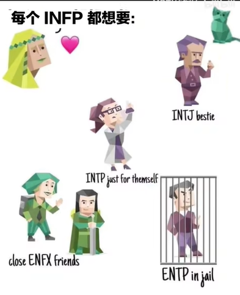{width="2.8541666666666665in"
height="3.507791994750656in"}

巴比波der

高届更不容易为情绪所动 不会很容易陷入负面情绪
能完成自己的工作和更有能力追逐梦想 拥有更多主动社交的能力
所以看起来没有那么天真了
但是我们的心还是很真诚的！只是不会开放给所有人让他们任意伤害了
这是保护自己的能力

2022-10-22 16:327

三春暮-blossom

笑死，本人高中就是典型低阶内耗infp，因为持续emo和心理不够强大被pua吃了很多亏，高中结束就变高阶乐，如果当初能高阶状态过高中，最终应该会比现在过得更好吧（举目）

2022-11-01 13:412

##### 讨厌ENTP

盐某盐

确实，怪不得我总觉得我朋友（INFP）和我（ENTP）玩的时候，一点都不温柔

2022-08-08 10:0325

##### 找乐子时enfp 梳理逻辑时intp 洞悉时局时infj 

非実在青少年

找乐子的时候是enfp，梳理逻辑时是intp，寻找一种美的"表现方式"时是isfp，洞悉全局(时局、环境中的人与事)时是infj，可以在一段被需要那么做的时间中能表现出来的这些人格的(表相)，infp会如同一个作者，像赋予故事中的一个角色信念人格与生命那样去赋予自己那样的能量。(把生活过得精彩如童话故事，tips:这种精彩并非建立在世俗成就的成功上)

2022-08-08 02:16142

##### 接受世界的丰富性、多样性、痛苦

Starling

大概就是接受了世界的丰富性、人类的多样性和无处不在的痛苦，自己和解了。仍旧保留着自己的真诚、理想主义、敏感、高共情，但是是有选择的使用他们，而无止尽地折磨自己。

2022-08-08 11:3682

##### 容易在晚上因为某件事流泪

y-0306

我也觉得我不怎么像（主要是共情能力，我理解的可能就是任何情感，但我对于诗中的情感是很头疼的，我感受不到，甚至也不怎么喜欢猫狗，小时候有被狗追过还被猫抓伤后来就算是没长牙的小狗向我跑来我都害怕），可最相似的也是这个（因为过度敏感，理想主义等都占了我甚至还每个字母都去查区别。主要眼泪不受控，容易在晚上因为某件事流泪非常真实

2022-11-05 23:23

##### infp也是讲逻辑 讲情感逻辑 相对t思考逻辑

infp也是讲逻辑的，讲人的逻辑(相对于事物的逻辑)，那种逻辑是一种将情感触发的要素化作有迹可循的逻辑(这是f的情感逻辑，相较于t的思考逻辑)。

2022-08-13 21:1912

##### 高阶世俗化INFP

###### 变高阶是庸人 但不是真正的我

药物致幻

回复 /@夕立と魚
:是的。我姑且能说是中阶的infp，这半年多改变了很多，更温和对很多事都看淡，也根本不会流泪猫猫头，处理问题的能力也更强，但我还是infp。我认为属于infp最本质的特征，也就是构筑我的重要因素是理想主义、热情、赤子之心与善良。如果变得高阶是成为一种落俗的庸人，只看重物质，那真的不是我，我理解有人是那样的，但我自己绝对不会想成为那样的人。2022-08-24
14:5619

巴比波der

高届更不容易为情绪所动 不会很容易陷入负面情绪
能完成自己的工作和更有能力追逐梦想 拥有更多主动社交的能力
所以看起来没有那么天真了
但是我们的心还是很真诚的！只是不会开放给所有人让他们任意伤害了
这是保护自己的能力

2022-10-22 16:327

###### 变圆滑世故ENFJ（主人公 教育家）

廖建勋

天完美赞同了，但是我是infp转enfj了从爱抽象的人转化为了具体的人，更加外向开朗了。依然不会对别人的痛苦麻木，保留了原始的共情能力和真善美，但是不会像之前一样整夜emo内耗，能快速调整情绪；依然喜欢胡思乱想和美好的事物，但是在保留这一切与自己的道德底限的情况下，逐渐在理想与现实世界之间取得平衡（之前真的很容易摆烂拖延和内耗，感觉很情绪化），感觉自己行动力执行力情商明显大幅提升，情绪也逐渐稳定。我infp和好朋友说我变得圆滑世故了，但是抱歉对我这种普通家庭被社会暴打的人来说生存才是最重要的，而且我的理想型就是enfj，既然遇不到我就成为他吧

2022-08-20 20:184

###### 回避型依恋 想象力下降 困难是良药

Rk_club

（低龄发言，可能会有不适，请大家容忍。）/
先天的infp，不属于刻板印象，思维模式更倾向于典型intj。感觉过度理想化应该定期需要一点现实冲击，很喜欢s系的现实，只有现实才能让我感受到艺术的伟大和瑰丽，将涣散的生活变得重见光明，建立富有逻辑性的世界观，只有一个九年好友，不喜欢甚至厌恶社交，曾经受到过打击有较为轻度的回避型依恋，infp真的很需要现实来重塑自己，但相对的想象力会下降，毕竟需要一定的计划来规划自己理想化的人生，困难是良药，infp需要现实的冲击力。

2022-08-12 01:1023

###### 低阶INFP过于敏感 高阶麻木

萤岛

为什么较为麻木的才是高阶啊

2022-08-07 17:4124

Lucy的美好祝愿

这个麻木应该是相较于低阶INFP过于敏感而言的。

2022-08-07 18:1413

海里的奶牛

高阶只不过，是低阶内耗的infp想通罢了

2022-09-06 17:184

###### 高阶舒服爆了

妞你苏菲掉了

原来是这样，我自己曾今处在低阶。由于各种改变我以为我不再是infp了，原来是变成高阶了。其实低阶更符合大部分人对infp的印象。但是家人们，我觉得变成高阶很舒服，真的，比以前舒服一些！

2022-08-22 14:2921

###### 变成了自己讨厌的样子

SOCOOLED

变成高阶后我有点不清楚自己是变得更好了还是变成了自己讨厌的样子，但我很快就不纠结这一点了，因为我变为高阶后发现了世界上有那么多令人高兴的事物。

2022-08-12 21:163

###### 高阶infp依旧是infp 表象变了 越高阶越不像刻板印象

咯咯-哒/_

高阶infp依旧是infp，内核是一样的，不过表象变了。每个人格都是越高阶越不像刻板印象，就比如撒贝宁就是infp，你看得出来吗。

2022-10-12 14:053

##### 成长路线 发展Te同时优化Fi

Harukaへ

infp的成长是发展Te同时优化Fi，良性的第一功能Fi才是infp最大的优势所在，你把劣势功能Te用得再好也不会比Fi更得心应手，这是一个补短板修长板的过程。顺带一提如果真觉得Te用起来比Fi还顺手建议重新考虑一下判型

2022-08-09 09:3342

朔间零苏联复活美疯了

为什么infp......ti会变高啊

2022-08-25 23:502

内倾情感（Fi）------主要负责的内容是**内心深处的情感冲动与价值观，是一个人深层次内核的重要体现**。他们更倾向于聆听自己内心的声音，他们愿意花费时间和精力询问自己心中的渴望是什么、自己所向往的价值是什么，也可能强调自己的情感必须被直接抒发，不可被外界束缚。"我一定要按本心做事"、"不要干涉我的生活"，这些话，往往就是内倾情感主导者常说的话。

外倾思考（Te）------主要负责的内容是**让自己周围的事物按照效率优先的标准运转，尽可能优化外界资源，保持对外界活动的掌控力。**外倾思考强度较高的人往往领导能力强，擅长将不同的资源分配到最合适的地方，让一切井井有条；他们作出决策和与人打交道的时候往往非常直截了当，为了提高效率、完成客观目标，他们最不喜欢的就是拐弯抹角，在他们看来，解决问题比照顾感情或者弄明白原理更加重要。

###### [INFP-/>ENFP](https://www.bilibili.com/video/BV1Y5411R72C/?spm_id_from=333.788.recommend_more_video.19&vd_source=f03b9d349cef8aff4a045d602d8a1d82)

夜の卷神

言之有理，自从从傻白甜大好人变成毒舌女刺头感觉生活轻松多了。INFP的好可是人间真情，别随随便便就交付给别人。把温柔留给值得的事和人。

2022-06-08 23:1040

##### 自救方法

choimooni

1.不要纵容负面情绪在脑海里漂浮，记在纸上，直面你不愿意面对的恐惧，恐惧什么就解决什么/
2.infp需要学习阅读运动戒手机，看手机也只看自己想看的内容，不要看大数据推给你的，读书app有很多/
3.职场问题解决社恐，建立边界感，不毫无根据脑补他人情绪，提升能力，只有工作做得好才能真正赢得尊重，也要警惕那些pua公司/
4.积极暗示大脑，容易的事情就不要做了，做难的事才有高级快乐

2022-02-19 00:16169

###### 不想被情绪控制 讨厌自己的感情与理智冲突 麻木

超高校级的疯子-月

我是硬生生把自己训练成所谓高阶的。/
我不想被情绪控制，讨厌自己的感情与理智冲突时的撕裂，于是渐渐变得麻木/
喜欢更稳定的状态，会更舒服/
不过有时也会故意释放情绪，缓解一下内耗

2022-10-27 20:38

###### [激发自己的第二第三功能](https://www.bilibili.com/video/BV1Y5411R72C/?spm_id_from=333.788.recommend_more_video.19&vd_source=f03b9d349cef8aff4a045d602d8a1d82)

Fi Ne（想象力） Si（经验）

喇叭寿司

Infp活得艰难的99%，发育充分的不到1%，不是说一定要调整为ENFP，其实跟个人的能力和见识大有关联，你能力强，那坚持己见保护自己就是优点，因为你能做正确的判断并坚持。如果你能力弱，那就是管好自己困难，无力养活自己，这个缺点就无限放大。每个性格都有其成因和意义，盲目改性格不可取，激发自己的第二第三功能意义更大。

2022-05-06 15:23388

###### [没必要活在脑海 99%脑补 1%真实发生](https://www.bilibili.com/video/BV1Y5411R72C/?spm_id_from=333.788.recommend_more_video.19&vd_source=f03b9d349cef8aff4a045d602d8a1d82)

亲爱的Royyy

我提供一个思维，我今年出有一次得病，当时差点去世了，从此我逐渐的原理的拖延，因为我每天都提醒我自己
我其实每时每刻都有可能死，所以想这么多还不如先做做看，反正都要死，活着的时候就多体验体验，否则就没机会了。我以我很有可能随时死亡的这个看似"消极"的想法反而很大程度上激励了我。还有一点：一件事的发生，99%是你脑补的，1%才是真实发生的，没必要活在脑海里。

2022-05-18 14:33321

###### [习惯 一天一个俯卧撑 进入行动的轨道](https://www.bilibili.com/video/BV1Y5411R72C/?spm_id_from=333.788.recommend_more_video.19&vd_source=f03b9d349cef8aff4a045d602d8a1d82)

不知道的名字怎么办

回复 /@天才二次元虚无战士
:要不看看《微习惯》？基本上就是说，哪怕一天只做一个俯卧撑，只要你进入行动的轨道，慢慢就会好起来。核心是切香肠战术，把行动分解到站起来这样一个细微步骤，完成这样一个动作就告诉自己成功了一次，这样的成功要不要多来点呢？

2022-05-16 20:342

你头也不回的走下去

回复 /@不知道的名字怎么办 :是的，核心还是正反馈

2022-05-16 22:11

###### 冷漠对待自恋型人格 低阶INFP讨好型人格

小蝴蝶的奇幻冒险

回复 /@Sofia_0101 :自恋型人格障碍患者 黑暗三角人格之一 灵魂猎手
未成熟的infp很多都是讨好型人格 容易吸引这类索取型的吸血者

2022-10-18 08:5034

##### 想受到深层次的理解和认可 不是受身边人肤浅的喜欢和好感

昕然然然

我希望的是受到深层次的理解和认可，不是受身边人肤浅的喜欢和好感，而是看到我灵魂的深刻和有趣，像那些伟人和艺术家吧，大家去认可他的内心他的经历他的思想，那样真好啊

2021-12-07 00:26154

unrulyleopard

还有我觉得人格测试测了几次以后就不准了，因为你心中已经有答案，要测出某种人格做出某种回答就可以了，之后的测试多少都有巴纳姆效应在作祟，真正了解自己还是得从人格类型的本质去出发（自己探索自身的一些经验）

2022-02-16 13:4916

##### [周围的人做出你无法理解的事时，往往是性格的不同，没有对错之分！](https://www.zhihu.com/question/28760453/answer/2389578709)

1
高度的创造力，表现力和神性，他们可以在艺术、歌曲和文学类层面有很好功底。INFP是与生俱来的艺术大师。假如鼓励并发展了他们的艺术天赋，他们很可能达到其他人难以到达的高度。这并不是说他们只能从事艺术类的工作，而是因为艺术创作对INFP而言是自身修复和不可或缺的一部分。

2
他们比大部分人更关心精神层面，并比别人大量和自身灵魂层次的接触。大部分INFP有很强的信念。但在他们丧失一些非常重要的东西前很有可能没法发觉这一点。一个INFP应当加强他们的信念。

3
INFP对社会发展中的不合理很在乎，并怜悯那些弱者。她们对受害者的怜悯和对社会不公平的过多在乎，令他们极端具备怜悯之心并对当今社会中弱势群体开展帮扶。她们可能是老师、重臣、文学家、咨询顾问或心理学专家，大部分的INFP都会付出额外的时间来尝试协助大家处理难题。一个INFP在促使某类可以帮助弱势群体的社会活动的中获得极大的满足感。

4
他们一般是好的聆听者，真心诚意期待聆听他人的情况并真心诚意的帮助他人。因此他们会很容易成为优秀的咨询顾问，和知心朋友。

5
他们认同并高度重视每个人成为自己的权利，并怀有强的平等主义。他们坚信一个个人有着变成他自己的权利，而并不细心核查另一方的工作态度和见解。因而，他们在和遭受社会消极判断的人接触时有较强的忍受和接受能力。他们可以在所有人的身上找到闪光点。他们坚强的捍卫每个人成为他自己的权利。假如给他们机会，对于那种自身无法找到自尊心和自信心的人，一个INFP可以变成积极主动能量的原动力。因而，他们可以带领一个"迷路的灵魂"回到家。

6
他们一般低沉并有智谋，可以比较非常容易地了解问题的本质。他们一般在学术研究上发挥出色，并会发现对思维的练习令他们对开展深层次思索的十分必要。

#### [INFP适合做什么样的职业？](https://www.zhihu.com/question/28760453)

##### 人是个变量而非静止不变 性格会改变

首先说明，人是个变量而非静止不变的。所以不同的年龄阶段、经过不同的工作经历和生活阅历后性格都有可能会改变的。所以不要光凭一个测试就决定或否定了自己的人生哦。何况关于九型人格以及MBTI性格测试的精确度还在饱受争议中/~

###### 第一梯队，灵魂契合度较高系列：

**教育培训相关**：老师、教授、高校科研人员、培训师、讲师等（[INFP
型的人们都在做什么工作？ -
迈尔斯-布里格斯类型指标（MBTI）](https://www.zhihu.com/question/19633884)里有位妹子的回答很暖很暖，可以参考。但可能由于偏感性，要面临并克服的一个问题或事实就是要看到一批又一批可爱的孩子们毕业，从此之后就不常能见到了。公立学校这种感受会更明显。）/
**语言类/哲学相关**：文学翻译、口译员、文字编辑、哲学家、语言学家、留学文书等/
**心理学相关**：心理咨询师、音乐治疗师、职业规划师、心理学家等（因为INFP容易产生情绪共鸣，也很享受分析别人思维的过程。但是因为是F，注意情感上的抽离。不然很容易自己陷入悲观情绪，不能自拔。曾幻想过成为一名心理咨询师，但是想到慢慢的负能量还是放弃了。不过依然喜欢心理学，即使她是理科。）/
**纯艺术类/文学类**：摄影师、编导、作家、自由撰稿人、编剧、画家、插画师、漫画家、音乐家、作曲家等/
**公益类**：各类NGO或者公益类组织/
**科技咨询师**：知友贡献，这个职业我也是第一次听到。以下引号内是工作具体内容。/
"具体就是写可行性报告，顺带做ppt提供给客户。科技领域，国家支持的战略性新兴产业为主，也有传统行业的高科技改造技术，各种行业打交道。私企，每个省市一般都有这种公司，这种公司的老板基本上都会有各种与科技部门的人脉资源。"/
**自媒体**/
**人力资源：**但就目前国内的环境来说，很难达到理想

####### INFP适合归隐山林甚至出家

一句话，**[INFP适合大部分不用费脑子去处理复杂人际关系的职业以及不赚钱的行业，适合归隐山林甚至出家。]{.ul}**嗯，注孤身系列。（有很多优秀的infp，不一一列举。以偏概全刻板印象属于自黑开玩笑吐槽。不杠，杠就是你对。到了刻板印象的题目下找答案，说哪来那么多刻板印象的是在想什么。还是只能说好话，不能说坏话咯？）/
总之，INFP的性格和价值观就是偏理想化，工作更多的也是为了寻找能体现自我价值实现的工作，而非更吸金的职业。所以，经常会看到有种人在某个行业已经干得风生水起，却突然有一天说我不干了，要去追寻人生的意义。重新做一份比之前工资低得多的工作。这种人，基本不用问了，70%是INFP。

###### 第二梯队，设计类：

建筑设计、园林设计、工业设计、舞台设计、服装设计、游戏设计、UI设计等/
（挣扎区，确实有文章说过艺术是INFP不得不背负的十字架。但是由于设计是工艺美术，和纯艺术还是有一定差距的。与此同时，INFP更加执着于概念创意、概念原型等，对于细节把控不足。可能S的人更适合做设计。）

###### 不合适：

金融、会计、销售、军人等

##### Infp抗拒高压，压抑和人际间冷漠的工作

[**十月止戈**](https://www.zhihu.com/people/40f98ef29b67b3c41d111b6e9e1f20c8)

本人infp，做过一段时间研发，弃坑，感觉infp对工作的要求是，不要从事高压，压抑和人际间冷漠的工作，会受不了，最美好的是从事有创造性的工作，还有就是啥也不用干，infp悠闲的时候相对不容易无聊

2020-04-10

[**Sibyl**](https://www.zhihu.com/people/453c7ee2bd446b54c62daf5b4271e57b)

作者

基本同意，我们太喜欢自闭了

2020-04-19

[**在厦门晒的腿很黑**](https://www.zhihu.com/people/e8b82072876348c7ee504ca09799c34f)

很不喜欢高压，强势的领导，冷漠的同事，压抑的氛围，感觉时间长了会厌世，我感觉每当遇到这种情况我都得拿出我所有的e来给自己打打气

2021-03-11

##### 后台开发 拖延逃避

[**剑走偏锋**](https://www.zhihu.com/people/abcbda21b0fd63b7519d74e4657267dc)

同意，不过我现在大三本来想着找后台开发的实习的，可是一直在拖延在逃避，不知道怎么办好？

2020-05-30

[**十月止戈**](https://www.zhihu.com/people/40f98ef29b67b3c41d111b6e9e1f20c8)
/>
[**剑走偏锋**](https://www.zhihu.com/people/abcbda21b0fd63b7519d74e4657267dc)

改变是艰难的，但也是可以的，你需要将一些不重要的东西割舍掉给自己的精力和注意力腾出空余，不是说不可以做研发，只是需要割舍一些东西为自己腾出精力，拖延本身是因为心里有太多想法和念头，却无法找准一个点发力，这很难，但确实必须要做出的改变。要么趁早放弃不想坚持的立马寻找下一个方向，要么割舍多余的东西，把精力和注意腾出来去解决你面临的问题和走当下选择的方向

2020-05-31

[**十月止戈**](https://www.zhihu.com/people/40f98ef29b67b3c41d111b6e9e1f20c8)
/>
[**剑走偏锋**](https://www.zhihu.com/people/abcbda21b0fd63b7519d74e4657267dc)

考研确实有很多选择的空间，如果去工作的话，第一份工作会决定今后很多年的方向，越往后改变的成本的越大，希望你选择的是自己所想的

2020-05-31

##### 厌恶死板无趣的工作

[**米弘**](https://www.zhihu.com/people/f55cd6764710ceb0033fcc9df6809e11)

适合从事有人情味的工作，不能对细节过度苛刻，也不要有人监视和太多竞争

2021-03-26

[**热度**](https://www.zhihu.com/people/2b8c054e3ccc60d6ca05a16876dcc82b)

太对了死板无趣的工作真的会厌恶

2022-02-19

[**CLOWN**](https://www.zhihu.com/people/6d22bdca7f32085e450f61bab515258f)

太真实了，压力大了就什么都干不成，反而没锅的时候最高效

2022-03-14

[**AUU工作室**](https://www.zhihu.com/people/d361cb1442204472edfd7729eaa63eab)

[**大大大狗子**](https://www.zhihu.com/people/03420b7774732dc57b9e408cdfa9e7c1)

离职状态，换了好几个工作，现在靠着几个月的存款不慌不忙的住酒店。我他妈服了，火烧眉毛了还好好爱自己，吃好喝好，玩手机！其实我内心是焦虑的你能懂，越这样说明我越焦虑

2022-05-06

##### 对于INFP来说，世俗的工作大多不合适

[**javire**](https://www.zhihu.com/people/ce02a2d984235f81acd14391227b7afa)

是的，我在制造业呆了好几年，感觉不合适，后面分析研究自己，判定不合适之前的工作。需要重新找到适合自己的路，现在已经裸辞了。虽然对于INFP来说，世俗的工作大多不合适，这似乎注定有点坎坷，但我愿意冒这个风险。

2022-10-13

##### 毕业快八年，尝试了有十份工作

[**iBelongToYou**](https://www.zhihu.com/people/94bff2f7b724a1ab50e965a0c0a70524)

强烈认同，毕业快八年，尝试了有十份工作。

2022-01-17

[**一钱清茵**](https://www.zhihu.com/people/401eb0f0115b82950b79f5fbfe64983f)
[**玩具枪**](https://www.zhihu.com/people/691db486c80d6bcbb036ea4481e74798)

说到我心里了我也觉得我活着就是来体验人生百态的。

2022-04-21

##### 无论工作，文学艺术类的，是infp们的生活方式

[**布里格**](https://www.zhihu.com/people/abdd297d656da76a55b51043d365ddf5)

不论从事什么工作，我觉得文学艺术类的，是infp们的生活方式，即便不以它为职业，也躲不开。

2020-04-06

##### 作家 心理咨询师 电影演员 游山玩水 

[**看你看我不看**](https://www.zhihu.com/people/dc9fbf712e72f4a64cf7ceb5c719e715)

INFP表示很准很准
跟我平时想的真的是一毛一样呀！！！我就想找个深山写小说成为一个作家
或者在喧嚣的大城市做一个安静的心理咨询师
或者成为一个实力派的电影演员！！！要么终极愿望就是富可敌国做做慈善游山玩水---成为一名大智若愚的演说家。奈何也不知道当初脑子怎么想的？想成为华尔街一位穿着风衣踩着高跟鞋的女投行家选择了金融
大学苦逼 还有一年本科结束啦 可能转个管理吧 要么就是心理学！！！

2019-10-03

##### 更容易幻想

[**实事求是**](https://www.zhihu.com/people/7a1559730ee5ce3c6ccea4f9764a1d1e)

INFP的人更容易幻想，代入小说或影视剧里的人物......

2021-04-23

[**熠熠**](https://www.zhihu.com/people/2b16aa3f35a45fafdb2c88f51ccb9804)

我是对艺术类感兴趣，学了传媒电影的我发现创造热情和能力几乎为0。

2020-02-21

[**风声**](https://www.zhihu.com/people/4b2784191b283cb63c07746ae6841fec)
[**钟声**](https://www.zhihu.com/people/c5215db87036817483dd4444bedf18b0)

确实，我测的infp。总是会回想过去，也爱幻想未来。相比对"现在"关注可能会少，也许这也是不爱做实事的原因之一。

2020-10-13

[**阳光果树live**](https://www.zhihu.com/people/26d2c435db63fee4e66892069765009f)
[**infp重度人格**](https://www.zhihu.com/people/432c453a26a619ce36d3797a5f0bba7c)

infp就是想的贼多 想学这学那 最后都坚持不下去 缺乏行动力
属于最没用的人格了 除非是富二代

2021-09-26

##### 社会性很差

[**在厦门晒的腿很黑**](https://www.zhihu.com/people/e8b82072876348c7ee504ca09799c34f)

主要是这个性格社会性很差，大部分人也不是这个性格的，所以在社会上就活得比较艰难

2021-03-11

[**麝香**](https://www.zhihu.com/people/c08e57ca6372f3593a44826ff728f942)

一直都有这方面的疑惑，数量很少的infp，怎么会在知乎遍地都是呢确实这种类型可能会更容易关注心理学，而且这种不稳定的类型很容易变成其他人格的"中转站"吧，文化上中国传统文化的影响了可能一定程度上压抑了人性的自由发展，造就了更多的infp

2020-06-08

[**云谣**](https://www.zhihu.com/people/98bebefb400ee871263b9897092c564a)

infp中国不可能这么多...我不清楚日本 反正infp其实都有一种共性就是共鸣强
可可爱爱呆呆的内向 这样的人现实很少

2020-06-19

#### [为什么INFP是最棒的mbti类型？趣味向](https://www.bilibili.com/video/BV15f4y1c7dv)

2021-10-07 14:12:08

##### 从小学到大学都在想小说大纲

既白_Verapure

本INFP表示从小学到大学在脑中想了大约有三十多个小说的大纲（而且为了防止忘记，经常反复回忆）但是一本都没写出来（有一本断断续续在写但是因为懒而坚持不下去）

2022-02-16 20:103374

燃暮之夏

我靠，我也是，而且一般是受了某一个场景的启发，或是想写某一种情节，再以这个场景或者情节为原点开始向前向后延伸编故事害怕自己忘就把几个重点章节写下了，写完之后反复看反复改，这儿加一点修辞，那儿加一点心理描写，然后发现还是第一版好，接着就不管了，开摆

2022-02-19 14:57313

呆呆糖糖

我也是，我之前看到规则类怪谈，于是就想写个我追的游戏同人怪谈大纲都写好了，但是找不到了就不想管了≥﹏≤

2022-02-20 17:5524

律law

是的！或者是写出来感觉和想象中完全不一样（指被自己的文笔菜到）这种时候就很想有那种脑内蓝牙直接把我想的画面传给别人（瘫

2022-03-26 14:3536

##### 爱幻想

寻迟弹钢琴

回复 /@中国新型废物
:真实了，几乎我身边所有人都在劝我别那么爱幻想，但是我就是喜欢沉浸在自己的小世界里啊，把我拉出来会让我觉得特别拘谨特别不适应，就像把蚌壳掰掉让蚌肉暴露在外面一样

2022-02-11 15:2735

我林克超勇的

哈哈会在脑子里演一场大戏，主角是自己，比如自己经历一段波澜壮阔的感情，或者去舞台上表演台下都是认识的人惊讶的样子，然后想到他们的样子我会无比的爽！如果被现实的事情打断了，过一会儿我还会把刚才那部戏捡起来再继续想哈哈

2021-10-09 21:454397

枫叶之所

哦哦，对对，老爱幻想，然后沉浸在幻想中

2021-10-10 00:1983

-1127-

小时候用语文课本后面单元检测的毫不相干的词语就能编一段小故事，现在想来是人格天赋了

2022-01-27 00:1429

请对健康生活心动吧

淦，我也是！我小时候经常蹲坑时看着地上的瓷砖图案编故事，现在也是hh

2022-01-29 14:4933

兮梦月初

挖槽，我小时候经常把纸揉捏成人有手有脚就像一个大字一样，褶皱部分就想象成铠甲衣服，还会用其他纸揉捏成各种奇怪的武器然后编剧情让它们打架。还会用红笔蓝笔来加特效，纹身，buff等等比如黑化的人就把眼睛化成红的。到初二之前我经常沉迷其中，然后我觉得身边的人好像都没这喜好就没说。因为这事到现在我一直觉得我天赋异禀想象力极其丰富。

2022-04-03 22:021

铁人尼西诺

不知不觉在一个人自嗨的过程中渡过了一天

2021-10-27 19:3311

Nnnnnneveah

我前段时间超级emo，让自己开心的方法居然是幻想一下某个不靠谱亲戚给我介绍了一个不靠谱的相亲对象，然后我怎么怎么骂这两人

2021-11-09 22:508

##### 注意力不集中

德里达再世

注意力是真不集中就没认真听过一节课，你以为我在托着腮思考问题，其实我在琢磨自己的一万种死法还有重度社恐，站起来回答个问题都吓的发抖，和同龄异性说话尴尬得要死，跟个结巴一样，周围同学都觉得我思维缓慢

2021-10-15 01:103697

lllllllling/_

我也是从小上课就很难集中因为一上课就想各种东西，除非真的是很感兴趣的东西才会认真听。平时老师同学都觉得我是个认真听课但成绩很差的人

2021-10-16 11:28259

##### 好内向好沉默好无聊 却又滔滔不绝的"演讲"

咸的虾酱

其实真的infp很独特，就是你觉得诶他好内向好沉默好无聊啊，诶，他又突然给你来个滔滔不绝的"演讲"，突然展示给你许多奇奇怪怪的有趣的东西。好家伙，你这时候可能觉得他大概不是内向吧，诶，你和他讲话吧，他又经常不说话，就只是看着你感觉特别认真地听你讲一堆乱七八糟的东西，也不怎么插话，就偶尔附和一下你，哦，对了，网上聊着聊着诶，他就突然不见了.../
没错这就是我

2021-10-08 15:597328

##### 很容易陷入抑郁和恐惧

幸运鳄鱼

但是infp很容易陷入抑郁和恐惧，没有动力的话就很糟糕了

2021-11-01 14:161914

##### 讨厌坐牢一样的生活

一草草/_

我讨厌每天一样的生活 和坐牢一样

2022-09-29 22:26

潘呀彤

回复 /@吴谦牧之cilotto
:我之前也这样，你或许可以试试一天发现一点新东西，在按部就班的缝隙里寻找自己感兴趣的，觉得有意思的小事情，这样每天就会有点不一样2022-06-01
10:3326

##### infp在社会中活得很艰难

玫瑰望青鱼

是捧杀吗？我觉得infp在社会中活得很艰难

2021-10-11 18:284176

无糖啵荷糖

infp是挣钱能力最差的类型，纯粹的人生活在成年人的社会好过才怪了呢

2022-02-20 11:3516

##### infp难以适应竞争性强的环境 慢慢失去自我

别叉我猹

回复 /@爷要当第一111
:没错，infp难以适应竞争性强的环境，会慢慢失去自我的，就像我一样，，

2022-01-14 12:48408

中国新型废物

我也觉得，我看网上都在夸infp，都说喜欢infp，可是为什么我在现实生活中并没有感受到这些，连跟别人相处都难，也并不适应这个世界

2021-10-13 07:582361

6円改个名

回复 /@猫岛秃秃人 :我可太厌恶竞争了 主动远离
本来可以为了自己做好的事一旦被参入了功利因素我就主动摆烂 但其实我也不想
我也总是把自己放在第二位优先考虑朋友哎 真的好累
我之前还不信邪infp是流泪猫猫头怎么一说话就变成这样

2022-02-25 01:5821

AC_hugo

回复 /@别叉我猹 :没错要竞争我都是拱手相让...

2022-04-09 23:08

##### 社交方面委屈自己去哄别人

猫岛秃秃人

国内的竞争环境 让我非常非常疲惫 身心俱疲 没有办法做到别人那样努力
总是觉得"差不多就好" 社交方面很多时候都是在委屈自己去哄别人 真的好累
捏妈

2021-10-17 20:36829

##### infp相处轻松 发展长期友情困难

空城Kc_R

哎，怎么说呢，其实跟infp相处挺轻松了，但如果说走进infp内心，发展长期的友情就很难

2021-10-18 09:16423

玫瑰望青鱼

回复 /@奇思妙想小空城
:因为infp喜欢设防，我个人是因为被伤害过不太信任别人，长期发展友情对我来说太难了，顾忌太多心累

2021-10-18 20:21520

##### 友谊交流难以放到心里

祝妜

回复 /@奇思妙想小空城
:怎么说，其实从小到现在我就一直怀疑我自己是不是有什么情感缺陷，就是在跟别人进行友谊上的交流互动时候，其实感觉就并没有把她们入到心里，就是在外人看来或许就打得火热，但实际上心里还是感觉就是一般般/
不过现在看来可能就是性格使然吧

2022-03-23 12:505

##### 对现实失望超级理想主义

鲁迅对我甘拜下风

在网上人人都喜欢这个人格的人，可是在现实生活中人人都觉得这种人是怪人，不合群不为社会所容，对现实失望超级理想主义，就凭这几点就真的很难生存，我就是
Infp，我现在已经陷入了人生迷茫期，根本找不到自己想要的工作，也不想将就
现在失业大半年了，一直待在家里，不想出门。

2022-02-08 21:5154

##### 审美怪诞

梦到月亮了吗

回复 /@中国新型废物
:这是真的，人多的时候就想逃离，想独处，自己一个人的时候就会思考一些哲学问题，奇奇怪怪的，然后审美也是偏怪诞的那种，越怪越喜欢

2022-02-19 21:2122

##### 日常emo

躺在黑夜的怀里

没有人理解我为什么一天能有这么多的情绪。也没有人同情我怎样有了这样的性格。他们都只是推着我拖着我让我往前走。

2021-11-29 23:2617

##### 过于热情，让别人倍感压力

-ir-

回复 /@FIIIIFI/_ :/@FIIIIFI/_ 我完全能懂 本人也infp
，疯狂的喜欢一个同性朋友（纯友情），甚至一度想要搬到她的城市去住能多陪陪她，结果因为我的过于热情，让朋友感觉到压力，她觉得无法给我对等的感情就很苦恼，我越近一步她就越退一步，而且我真的好笨，完全没有看出来她的压力与不适，偶尔跟另朋友说了我对这个朋友激烈的情感，被一针见血指出来，之后我去旁敲侧击的问，结果真的是另一个朋友说的那样，当时第一次体会到了失恋（？类似）的感觉，一分钟不说话就会进入流泪猫猫头状态，不断的回想我们之间的对话，不敢相信自己竟然对最喜欢的朋友施加压力这么久，夜里也是哭的不行不行的。/
在那一周之后我开始慢慢改变自己了，减少了主动说话的频率，但是还是基本每天都会说个一句两句话，试着放松自己也让别人放松，再变得越来越设防，很讨厌自己的性格，还是大纠结的处女座，真的没救了哈哈哈哈哈哈哈

2022-02-21 23:2917

##### inp真的经常有种世俗与我无关

[**南瓜噼里啪啦**](https://www.zhihu.com/people/f3564d052c2094da01ca52b82fac8028)

嗯，没错了，inp真的经常有种世俗与我无关，这个世界和我格格不入的感觉

2021-03-11

[**自然人**](https://www.zhihu.com/people/edc8a1785dd8703e85e9a03762e5a15e)

infp只要资质不差，蛮多搞科研深造的

2021-08-23

##### 心里想统治世界 却又是懒人

连夜连滚带爬上崆峒山

心里很想统治世界，实际上小组我都懒得统治，收作业值日都甩给别人干了。。

2021-10-08 12:504218

##### 找到内心喜欢的东西 进入心流

怒嚼炫迈

回复 /@别叉我猹
:嗯，希望你能找到自己真正喜欢的东西，然后你就会得到救赎，一定要发自真心的喜欢它，并且经营或学习或体验这个事或物，慢慢的你就会觉得生命很美好，因为你的眼里只有你喜欢的东西，内心世界之外的东西并不重要![/[给心心/]](psychology.assets/image8.png){width="0.25in"
height="0.25in"}

2022-04-23 22:032

##### INFP 格格不入 不被理解 个人价值体系至上

[**Lemon**](https://www.zhihu.com/people/4b3fd1d2639cd270d5e01c8c23270a24)

INFP，感觉和身边的人格格不入，总是不被理解，好想哭

2020-10-25

[**closerer**](https://www.zhihu.com/people/55605d6fa12c23685096b566d03df400)
作者

对INFP来说，个人价值体系至上。

2020-11-02

###### 利用敏感体质 共情交朋友

[**百川**](https://www.zhihu.com/people/f75e5eacbb067affb6090043a8f32fef)

INFP利用好自己的敏感特质，多去和外界接触，是能成为共情力很强的人的，也能吸引很多朋友

2021-05-05

[**茶与同情**](https://www.zhihu.com/people/5875b2242b97a6be874e5f00e8846346)
[**百川**](https://www.zhihu.com/people/f75e5eacbb067affb6090043a8f32fef)

Infp觉得朋友是个麻烦事，不想认识很多人，不想谈恋爱

2022-04-26

[**陳知隱**](https://www.zhihu.com/people/3b3dc62505452c1679fb380991abbf19)
[**百川**](https://www.zhihu.com/people/f75e5eacbb067affb6090043a8f32fef)

很容易受伤

2022-07-11

##### 总是自省

[**总之就是非常可爱**](https://www.zhihu.com/people/38528dace52a143f3ccef477e56bce67)

会想起以前很多说过的话，进行自我批评

2022-01-20

[**Cherry樱**](https://www.zhihu.com/people/6320f60616d8420ad31252c28c6dc1db)

总是很容易想起尴尬的事，看个电影一个电影院就我一个人哭了

2020-04-18

[**kuku77kuku**](https://www.zhihu.com/people/21a1196ea370f2ef22e025da9db42b3e)

INFP泪点跟别人不一样

2020-12-28

#### [内容上来说（第一选择，自由度大，且能发挥价值）](https://www.zhihu.com/question/28760453/answer/2504267007)

音乐创作➕音乐老师➕音乐演奏

用户体验设计，[交互设计](https://www.zhihu.com/search?q=%E4%BA%A4%E4%BA%92%E8%AE%BE%E8%AE%A1&search_source=Entity&hybrid_search_source=Entity&hybrid_search_extra=%7B%22sourceType%22%3A%22answer%22%2C%22sourceId%22%3A2504267007%7D)，插画，[平面设计](https://www.zhihu.com/search?q=%E5%B9%B3%E9%9D%A2%E8%AE%BE%E8%AE%A1&search_source=Entity&hybrid_search_source=Entity&hybrid_search_extra=%7B%22sourceType%22%3A%22answer%22%2C%22sourceId%22%3A2504267007%7D)等

心理咨询师，心理学高校老师

撰稿人，编导，作家，诗人

知识分享类自媒体，博主

##### 职能上来看还包括（宣传类，运营类，找到优秀合伙人的职位）

[新媒体](https://www.zhihu.com/search?q=%E6%96%B0%E5%AA%92%E4%BD%93&search_source=Entity&hybrid_search_source=Entity&hybrid_search_extra=%7B%22sourceType%22%3A%22answer%22%2C%22sourceId%22%3A2504267007%7D)运营

人力资源管理

品牌设计

广告设计等

##### 行业上来说：

传媒，教育，[心理咨询](https://www.zhihu.com/search?q=%E5%BF%83%E7%90%86%E5%92%A8%E8%AF%A2&search_source=Entity&hybrid_search_source=Entity&hybrid_search_extra=%7B%22sourceType%22%3A%22answer%22%2C%22sourceId%22%3A2504267007%7D)，服务业

##### 在我看来，真正适合[infp](https://www.zhihu.com/search?q=infp&search_source=Entity&hybrid_search_source=Entity&hybrid_search_extra=%7B%22sourceType%22%3A%22answer%22%2C%22sourceId%22%3A2504267007%7D)的职业需要自己去探索，因为高自由度高自我创作的职业社会需要偏少，并且需要天赋和长期积淀（如作家，画家等），是有幸存者偏差的，低自由度低自我创作的职业infp难以发挥理想。

由次提出我的思考，抛砖引玉一下，希望infp们能对自己喜欢的职业深入思考，不要心头一热跨了行业过去，反过头来发现不是自己真正想要的。

##### 只有认清自己热爱的底层[逻辑](https://www.zhihu.com/search?q=%E9%80%BB%E8%BE%91&search_source=Entity&hybrid_search_source=Entity&hybrid_search_extra=%7B%22sourceType%22%3A%22answer%22%2C%22sourceId%22%3A2504267007%7D)，才能真正实现职业选择自由。

很多infp都喜欢艺术，音乐，绘画，摄影等等，仿佛在每一方面都还有一些小天赋在，虽然可能没有正经学过，但是就是比周围人多了那么一丝灵性。但是请你问问自己

1.  如果你学会了画画，你想画些什么？如果你在创作，你是尝试画的越精美越好，还是只是想表达某些哲思？（infp们可以观察一下，一般沉醉于画面表现和技法的可能是isfp，通过画画来表达社会观察和哲思的为infp，如艺术家：三元三元_s）

2.  如果你学习音乐，你想学到什么程度？是希望死磕到每一个[音符](https://www.zhihu.com/search?q=%E9%9F%B3%E7%AC%A6&search_source=Entity&hybrid_search_source=Entity&hybrid_search_extra=%7B%22sourceType%22%3A%22answer%22%2C%22sourceId%22%3A2504267007%7D)都严谨且不差分毫，还是只是想学到自己能随意的唱出自己想唱的就满足了？

3.  如果你去摄影，你会向哪方面发展？是画面的好看更重要还是能表现某种社会现象某种思想？

当我问完我自己，我发现艺术只是一种媒介，我确实喜欢，但是我并不追求华丽的技巧和画面，我热爱的是观察思考表达，以及创作，甚至有的时候我不喜欢实践，因为这样我就不能深度的思考了，我喜欢清醒的人，也想做个清醒的人，关于亲密关系，职业追求，生活哲学思考的越透彻越清醒，越能获得幸福。

##### 将热爱抽象出本质来，很多infp热爱的其实是观察，思考，表达及创作。

我发现我没那么适合去学艺术，因为除了艺术家，大多数学音乐的人变成了机构培训老师教音乐，是以教学为主的；大多数学画画的变成了设计师，用视觉技能为商业服务；大多数摄影师都成为了人像，[商业摄影](https://www.zhihu.com/search?q=%E5%95%86%E4%B8%9A%E6%91%84%E5%BD%B1&search_source=Entity&hybrid_search_source=Entity&hybrid_search_extra=%7B%22sourceType%22%3A%22answer%22%2C%22sourceId%22%3A2504267007%7D)，并不能真正表达思想。

（当然作为糊口的职业来说还是非常推荐的，这里只是作为寻找最适合职业的一个思考过程）

##### 那么由此推出，最适合infp的职业是[艺术家](https://www.zhihu.com/search?q=%E8%89%BA%E6%9C%AF%E5%AE%B6&search_source=Entity&hybrid_search_source=Entity&hybrid_search_extra=%7B%22sourceType%22%3A%22answer%22%2C%22sourceId%22%3A2504267007%7D)，作家，心理咨询和自媒体这类能够进行深度思考及自我表达的工作。

##### 那么作为普通人可能没有这么多的积淀，可以做艺术家，作家，但是我们依然可以自己寻找适合的工作。

1️⃣比如我们都可以学习画画，音乐等艺术，但是我们可以将他们用在[自媒体](https://www.zhihu.com/search?q=%E8%87%AA%E5%AA%92%E4%BD%93&search_source=Entity&hybrid_search_source=Entity&hybrid_search_extra=%7B%22sourceType%22%3A%22answer%22%2C%22sourceId%22%3A2504267007%7D)上，创作一些有趣的作品，比如：为[诗歌](https://www.zhihu.com/search?q=%E8%AF%97%E6%AD%8C&search_source=Entity&hybrid_search_source=Entity&hybrid_search_extra=%7B%22sourceType%22%3A%22answer%22%2C%22sourceId%22%3A2504267007%7D)配画面的作画视频，根据不同人的性格去为他们创作的画等等。

甚至也可以根据我们的创作主题自由选择创作方式，无论是手工剪纸也好，定格动画也好，还是一些创意摄影也好。我们虽然不能把技能学精，但是可以通过多种手法自媒体创作，而不局限于现有的发展途径里。

2️⃣我们对于自身成长发展的学习，使我们对心理学很痴迷，并且在帮助别人给别人建议时会获得很大的满足感，这样的infp可以尝试做相关自媒体内容，在知乎写文章接受别人的咨询以及做心理咨询相关实习和兼职，而可以不局限于考研这一条路（如知乎大v宏桑）。

3️⃣infp们还可以尝试写文章，写文章在创作活动中自由度比较大，文学创作最初期难度可能比较大，可以选择喜欢的平台发表文章，并且不断积累现实素材和文学素材。

你有没有发现以上很多都是一些非主流小众的赚钱方式，但是确实会让infp即实现理想又赚来金钱。即使现实情况无法实现理想，也可以尽可能的发挥自己的优势，在职业中增加不可替代性。

#### [INFP是世界上人口最多的MBTI人格类型?](https://www.bilibili.com/video/BV1wG411H7En)

实际不然，只是因为INFP更关注自己心理罢了。

像ESFJ根本不会去做这种毫无意义的事情。

INFP觉得自己是个怪人，与世界格格不入。更关注人的内心。大喜大悲。

##### 世界上infp是最多就不用煎熬了

休眠种子

如果这个世界上infp是最多的话，我们infp也不用这么煎熬了

2022-07-22 12:282461

站长推菅

其他不少人格是可以互相理解的，而没有人理解INFP🤣

2022-07-24 14:10117

##### infp也不会去理解infp 顶多互不干扰

阿废_Elskimo

好笑的是 infp也不会去理解infp 顶多互不干扰罢了（虽然这样已经美好很多了）

2022-07-27 12:0934

lllllhja

回复 /@站长推菅 :enfj很理解

2022-07-25 22:34

池茗不吃药

回复 /@站长推菅
:infj也可以哒，我是infj朋友是infp，虽然有时不能及时解决她的难过的事，但我还是会看出她在烦心的（当然也会尽量让她变得开心

2022-07-27 23:3322

khgkhgkhgkhgkhg

Fi是主导个人主观价值观的功能 而个人价值观每个人都不一样 所以以Fi主导的人
会过分强调个人价值观中心 所以基本是不接受大众和社会和他人的意见的
所以是即便是infp和infp相遇一旦涉及价值观
两个绝对不会改变个人价值观的人碰到一起一样是无法相互理解的
而且会比碰到其他功能主导的人冲突还要大

2022-07-26 19:3614

##### INFP是反社会人格

御夜星守

实际上是根本没有10%这么多，要知道INFP是反社会人格，没有那么适应社会的，一般来说不适应发展的需要的东西不会多，而且再加上INFP比较关注互联网而且INFP很关注MBTI，所以会偏高，按照书里写的，INFP应该只有3%～4%

2022-07-23 22:5250

##### 是有这种可能

桂花遇酒

啊这，是有这种可能🤔。但是就个人感觉身边的infp确实是最多的，但官网上的数据也确实偏高，现实中应该就百分之十。虽然说每个人都希望自己独一无二，但是你是否成为一个独特的人并不是mbti决定的呀，mbti只是一个思维风格和行事方式的分类而已。真正决定你是什么人的，是思想、眼界、能力、容貌、礼仪、家教等等。没必要为这种事感到不快啦

2022-07-23 13:42296

##### 不管什么人格在抑郁时=INFP

我才不是萌萌的橙子

还有一种说法是不管什么人格在抑郁的时候都更容易被测出来是INFP

2022-07-23 16:21104

##### INFP热衷于研究人类的人格

除夕夕夕

因为infp是最热衷于研究人类的人格，关心MBTI的很大一部分都是infp

2022-07-30 17:3225

木木子是攻

确实，infp对16型人格，星座，宗教，占星术，魔法，阴阳，这种都特别感兴趣

2022-08-07 00:266

##### 社会发达稳定地区infp肯定是最多的人格

窮涯也

事实上infp就是很多，感觉起码12%往上跑。如果要说什么infp喜欢冲浪，想想现在你坐个地铁还有多少人不看手机，难道其他15个人格冲浪比infp少那么多吗？如果要说infp不喜欢社交，intp可是太厌烦社交了；要说喜欢分析/了解自己或他人，entp和infj都很喜欢；难道数量多就是低人一等？有这种想法的人心智真的停留在未成年吧。我倒觉得这是现在人类社会进步发展的自然结果和倾向（高n/f/p值），社会发达稳定的地区infp肯定是最多的人格。

2022-07-25 23:5036

##### 人格类型和人格的概念解释

在不同的环境下每个人都可以表现出不同的人格特质，但这并不代表人格类型就改变了。

2022-07-25 16:171

人格类型的本质是驱动力，不是能力。其次人格类型是天生的，后天也不会变。就是说如果一个人说自己类型变了那就说明他还没弄清楚自己的真正类型。也就是说，人格类型跟后天的环境和经历毫无关系。

2022-09-27 16:302

#### 不说脏话

不撞昵称真难

不知道有没有infp和我一样，我给自己树立的底线就是不能说脏话，因为我觉得说脏话是不道德的![/[笑哭/]](psychology.assets/image9.png){width="0.2986111111111111in"
height="0.2986111111111111in"}特别是很多脏话还涉及女性

2022-10-15 20:01493

长颈鹿一米五

我也是，但是卧槽老是脱口而出

2022-10-17 15:0510

花式帅与某丞

我也是，我的脏话只用来表达我的情绪，但是从来不对别人说或者用来评论别人

2022-10-19 12:1523

#### 高道德感 怕伤到别人

嗅嗅太阳光

我真的不想要高道德感了，我快疯了，稍微对别人说了点重话，自己就内疚抑郁死了

2022-10-15 19:4826回复

infpt-晴雨

回复 /@嗅嗅太阳光 :确实，说话时害怕伤到别人，听别人说话自己又很敏感

2022-10-15 21:045

### ISFJ 守卫者 照顾者

其中I代表内向，S代表实感，F代表情感，J代表独立。

**眼见为实**

守卫者人格类型的人所面临的挑战在于，如何确保让别人注意到自己做的事。
他们总是对自己的成就轻描淡写，虽然这样的善良经常会得到尊重，自私自利的人可能占他们爱奉献和谦虚的便宜，把工作推给他们，荣誉留给自己。
如果想保持自信和热情，"守卫者"们需要知道什么时候说不并勇于为自己反抗。

天生喜欢社交是内向者身上少见的特点，"守卫者"们不会把出色的记忆力用在数据和琐事上，而是记住人和他们生活中的细节。
他们最擅长赠送礼物，他们天生富有想象力且感情细腻，他们的礼物可以送到接收者的心坎里。
对于被"守卫者"们当作朋友的同事们来说是这样，而在家庭里守卫者们会尽情表达爱意

**尽可能地保护你**

守卫者人格类型的人是一个奇妙的团体，正事没有完成之前，他们绝对不会虚度光阴。
与人亲密接触的能力是其他内向类型遥不可及的，他们使用这些关系来维系一个相互支持的快乐家庭，这对每个参与其中的人来说都很幸运。
他们在聚光灯下可能永远都不会觉得舒服，把团队的成就归功于自己会使他们感到内疚，但如果他们的努力被认可，"守卫者"们从所做的事情中得到的满足是其他人格类型无法企及的

#### 优点

-   **支持**------守卫者是万能的帮手，他们与任何需要的人分享他们的知识、经验、时间和精力，尤其是与朋友和家人。具有这种性格类型的人争取双赢，尽可能选择同理心而不是判断力。

-   **可靠和耐心**------守卫者不会提供零星的、兴奋的匆忙而使事情完成一半，而是一丝不苟、谨慎，采取稳定的方法并根据情况的需要弯曲，以实现他们的最终目标。守卫者不仅确保事情以最高标准完成，而且往往远远超出要求。

-   **富有想象力和观察力**------守卫者非常富有想象力，并利用这种品质作为同理心的附属品，观察他人的情绪状态并从他们的角度看待事物。他们的脚牢牢地踩在地上，这是一个非常实际的想象，尽管他们确实发现事情非常迷人和鼓舞人心。

-   **热情**------当目标正确时，守卫者将所有这些支持、可靠性和想象力应用到他们认为会改变人们生活的事情上------无论是通过全球倡议与贫困作斗争，还是仅仅让客户开心。

-   **忠诚和勤奋**------只要一点时间，这种热情就会变成忠诚------守卫者的个性通常会对他们致力于的想法和组织形成情感依恋。任何没有通过良好、努力的工作来履行义务的事情都会辜负他们自己的期望。

-   **良好的实践技能**------最好的部分是，守卫者有实际的意义，可以用所有这些利他主义实际做一些事情。如果需要完成平凡的日常任务，守卫者可以看到他们创造的美丽与和谐，因为他们知道这有助于他们照顾他们的朋友、家人和任何其他需要它的人

#### 弱点

-   **过于谦虚和害羞**------温顺的人将继承地球，但如果他们根本得不到认可，那将是一条漫长的道路。这可能是守卫者们面临的最大挑战，因为他们非常关心他人的感受，以至于他们拒绝表达自己的想法，也拒绝为自己的贡献而获得任何应得的荣誉。守卫者对自己的标准也非常高，以至于他们知道他们本可以更好地完成任务的一些次要方面，他们常常完全淡化自己的成功。

-   **把事情看得太个人化**------辩护人很难区分个人情况和非个人情况------毕竟，任何情况仍然是两个人之间的互动------冲突或批评带来的任何消极情绪都可以从他们的职业生涯中延续到他们的个人生活中，然后又回来。

-   **压抑他们的感受**------守卫者人格类型的人是私密的，非常敏感，非常内化他们的感受。就像守卫者保护他人感情的方式一样，他们也必须保护自己的感情，而这种缺乏健康的情感表达会导致很多压力和挫败感。

-   **超负荷自己**------他们强烈的责任感和完美主义与这种对情绪冲突的厌恶相结合，创造了一种情况，守卫者很容易让自己超负荷------或被他人超负荷------因为他们默默地努力满足每个人的期望，尤其是他们自己的。

-   **不愿改变**------这些挑战可能特别难以解决，因为守卫者在他们的决定中高度重视传统和历史。有时情况需要达到一个临界点，守卫者才会被环境或所爱之人的强烈个性说服而改变路线。

-   **过于利他主义**------这一切都被守卫者的利他主义的美妙品质所强化和强化。作为如此热情、善良的人，守卫者愿意顺其自然，相信事情会很快好转，不会因为接受他人的帮助而给他人造成负担，而他们的麻烦却在无助的情况下增加

偏好职业

偏好的工作领域：卫生保健、社会服务、教育、商业、服务、设计、艺术。

偏好的典型职业：人事管理员、护理医师、营养学家、家庭保健员、图书管理员、室内装潢师、律师助手、数据库经理、信息总监、后勤与供应经理、业务运作顾问、工厂主管、记账员、福利院工作者、特殊教育工作者、旅馆业主、项目经理等^ /[7/]^  。

[**小满**](https://www.zhihu.com/people/9c82f7a97051af780dc5f9bb573b0429)

isfj不好在哪里？不是说isfj是最好的人妻（人夫）吗？

2022-06-22 IP 属地广东

#### 评论

##### 被当成使唤的工具人很生气

sooiaaaaaa/-/-/-/--

以下为我个人经历：/
关于利己......其实回报什么的也不重要啦，你对我表现出好感或者感恩就好，但是如果把我当成使唤的工具人我会非常生气，严肃的跟你讲自己去搞（然后经历一段时间的自我pua为他找好借口继续相处）/
关于迁就......我也不想的，因为有一种奇妙的想法告诉自己如果我表达我想吃火锅就会被讨厌，但是别人跟他说想吃火锅他们下次还是正常讨论而不会被讨厌，就是感觉自己在别人心里不重要（说了也不会被同意，该日料还是日料）/
关于"妈妈的爱"因为我妈这样对我所以我逆反了不会这样/
一成不变的菜单和占有欲十分真实（因为太挑食了雷很多，无论菜品饮品对象小说雷都很多，只能一成不变）/
争论的话我只会和较为委婉的辩论一小下，明显攻击性的直接举报黑名单/
（因为基于上一点雷太多导致负面情绪很多，已经学会规避负面情绪产生了，直接黑名单眼不见为净）

2022-06-19 13:0452

##### 不应把我的好认为理所应当

小Zhing

我是isfj，我的回报不一定要对等，但是我希望我找你的时候你可以耐心听我说话，不能把我对你的好认为理所应当，up说的我都有，最近经历一件对我影响很大的事情，我已经在改了。

2022-06-16 18:184

##### 害怕计划被打乱

哈批哈啤

害怕计划被打乱是真的，无尽的内耗，今天刚知道学期末要交开题报告，但和考研的时间撞上，已经无端担忧一小时了

2022-10-22 00:572

魔法少女王小杰希

是的！！！我真的非常讨厌计划被打乱！！！太焦心了！！！

2022-06-13 16:182

##### 付出而不要求回报

霜摧飞花

大部分真的很对，但我不要求回报，就是我付出不讲究回报。也不是傻什么的，我只是单纯的认为，我的付出是我自己的选择，其实的一种另类的自私

2022-10-27 20:202

##### 以身边人的舒适为主 一直点同杯茶

时代峰峻yydsH

我是ISFJ，这个发言是我让我朋友对我的感觉和检测，我是一个很温柔的人，在意别人看法和建议的人，我没有太多主见，一切以身边人的舒适为主，但我如果要发脾气
我会很着急很焦虑，我不知道如何和别人辩论但我会很快的组织语言找到我的立场，我会记住别人的喜好，去给别人买他们喜欢的东西，我在恋爱中不会强迫对方去做他不喜欢做的事情，但在一定方面上，我会主动说出我的看法，因为我觉得，谈恋爱是双方一起往更好的方面去做，我很依赖对方，我在恋爱和最好的友情中会有占有欲和控制欲（但不是很大），我能够处理好人际关系，我社恐其实是内向
如果你要让我去单独问别人一些问题，我会害怕，我怕我说错话
我会在意别人的眼光
因为我算不上苗条（身高166体重125）我不敢穿裙子走在，我怕我的腿部的肉会让别人对我有一些不一样的见解，一直是长裤短袖或长袖，我会点同一个饮品，我在一家小型奶茶店
姐姐一见到我说还是蜜桃乌龙？我就点个头，我会给对于我来说很重要的朋友礼物，即使假如生日过了，我也会买
因为我觉得有点仪式感是很好的

2022-07-18 08:5628

格格格格西

本INFP也几乎总点同一杯奶茶哈哈哈哈哈哈哈 纯纯是懒

2022-06-11 18:2010

##### 不要交外向且自私的朋友

白巧黑巧好吃就是好巧

isfj，但是对交外向朋友需谨慎，不要交外向但是自私的朋友，反而觉得和自己相似性格的会很好相处，外向要交懂得付出的朋友，这一点很重要！

2022-10-04 21:32

##### infp变成了isfj

翳隐

我从infp变成了isfj?一般情况下人是不会变的，但我能感觉到我从一个努力融入集体还是显得很奇怪的，独断专行的，想象力和情感丰富，文思泉涌，注重想象不是现实的人变成一个注重实际，想象力匮乏，什么都喜欢用自己的si来套公式一样做事情，可以轻易融入集体，喜欢讨好付出，讨厌变化的人。但现在回想一下还挺怀念那个时候的?

2022-09-13 16:50

aaaaaesop

我测了几次，isfj和infp倒替出现

2022-09-15 09:22

### [ESFJ 盛情难却的东道主 狗 应付亲戚](https://zhuanlan.zhihu.com/p/399968408) 至交好友

杨卯 张立志 杨路潞 Dad talk to relative

像狗一样社会

ESFJ是热心肠的人，有些大大咧咧，平时为人高调风风火火，但脚踏实地，没有太多理想抱负。他们平时有点爱多管闲事，想照顾好身边的每个人。

ESFJ拥有狗的特点，热情，简单，与人亲近，喜欢在世俗生活里寻找乐趣。

#### 性格特质

ESFJ是一位"唠唠叨叨的大家长"，著名人物有美国女歌手泰勒·斯威夫特，该人格占世界总人口的12%，从人数上仅次于ESTJ（更精明）。

ESFJ是很接地气的一种人格。他们在人群中比较显眼，因为他们无比热情，还爱叨唠，做事比较高调，风风火火，往往一开口就能让人发觉。ESFJ从各方面资质上来看不算最聪明的，但他们脚踏实地，以勤补拙，也能取得不错的成就。ESFJ是非常务实而现实的人格，他们可能不会有太多浪漫情调，但能一步一个脚印地把每一步走好。

ESFJ主张随遇而安，没太大理想改变世界，只想守着自己的一亩三分田过好小日子。因此，ESFJ在一些时候也是非常隐忍的，他们心中并没有什么宏伟的梦想，远没有他们表面上看上去那么高调，属于"雷声大雨点小"的类型。

ESFJ相对来说目光比较短浅，他们希望过好当下的每一天，不想思考那么多，卧薪尝胆这种故事很难发生在ESFJ身上。他们有时候会显得比较固执，不过这种固执更多维持在表面，他们经过思考后如果认为对方的观点正确，私下里还是会妥协的。

ESFJ内心纯净简单，没有太多复杂的心思，也没有野心抱负，很容易满足现状。总的来说，ESFJ的灵商不高，但他们并不排斥接收灵性信息，如果有人传达了，他们会当作一次对自身视野的开拓。

#### 人际关系

ESFJ较为圆滑世故，擅长维系良好的人际关系，在做人和做事之间游刃有余。他们对身边的人会事无巨细地关心，也很会照顾人，常把自己的需求放在最后。由于这种"为他人服务"的精神，ESFJ也难免会吸引一些别有用心的人，所以他们有时活得比较辛苦。

他们会积极地对身边人进行物质层面的干预，如天冷了要穿秋裤、生病了喝热水等，有时给人一种多管闲事的感觉，但他们却进行精神层面上的放养------ESFJ知道自己精神世界不算丰富，所以对兴趣爱好、思想格局这些比较抽象的话题，他们很少发表言论，任其发展，也许还会想看看精神层次高的人究竟是什么样的，向他们学习学习。

ESFJ非常护着自己人，"胳膊肘往外拐"这种事几乎不会发生在他们身上，这一点也是让后辈们非常拥戴的。在ESFJ看来，每个人都是平等的，不存在三六九等之分。因此，ESFJ做到管理层之后会是作风独特的管理者，通常广受好评。

ESFJ真的是底线非常低的一类人，不像INTJ、INFJ、INFP雷点很多那么容易被触犯到。ESFJ像橡皮糖一样，没什么棱角，也很难和什么人走到绝交的境地。ESFJ什么事都往好的方面想，甚至有时在人际关系中会粉饰太平，忽略了人性的阴暗面，这是ESFJ的一个弱点。

#### 喜好与偏好

ESFJ
的喜好其实比较单纯，无非就是逛逛商场、见见朋友聊大天，没有太高雅的艺术方面的爱好，他们也不爱动那个脑子，喜欢简单直白的东西。多数情况下，ESFJ愿意走中庸的路线，比如买家具同时有1000元、600元和300元的，他们大概率会取中选择600元的那个。ESFJ不是极致追求品质的人格，不过也不会过于精打细算，他们认为取中总是没错的。

ESFJ也关心国家大事，关注各种媒体报道，他们的消息往往很灵通，然后马上分享给身边的人。不过，他们的分享不是为了获得反馈，单纯是一种分享欲罢了，有可能自己说完之后就不再管对方有什么反应，这一点也会另一些重视反馈的人格感到头疼。

ESFJ内心还是很敬佩那些艺术大师，也能说出一二，只不过他们没有真正想成为那样的人，也知道自己没有那样的毅力，他们只是把这些人物当作一个谈资。他们并不是木讷无趣之人，对于文学艺术领域也颇感兴趣，只是没有很高的天赋去涉足罢了。

### 和ISFP最像的是INFP

和ISFP最像的是INFP，INFP的思维相比于ISFP会更飘更能突破思维的局限性一些。

[编辑于 2019-05-02
16:00](https://www.zhihu.com/question/311628003/answer/665573804)

[**月光岩
Niseko**](https://www.zhihu.com/people/7f201b36391e069d6056c88cebe5d616)

ISFP的人来留个爪。怕生这一点是没错，但我觉得是深层次的。这可能跟我个人成长经历有关，我会被人认为是外向，热情，爱结交的类型，但真正懂的人才能了解到其实外向的表象之下的我完全是个内向型人。表面对人友好热情仅是出于礼貌和不想让别人跟自己相处起来觉得尴尬，但其实是能不社交就不社交的类型，这也是ISFP真好友并不多的原因，因为ISFP大多数时候都想尽量避开社交场合，其实也是因为怕生和尴尬，是一个需要通过独处来积攒社交能量的人。

2020-08-28

### 其它性格以及人物

#### INFP

宋昕原 吴君 石超 杨洋 陈嘉南 杨斌 王凯

#### [INTP 猫头鹰的另类与纯真](https://zhuanlan.zhihu.com/p/151685523)

##### ◆性格特质

他们就像猫头鹰一样，看上去有些呆萌，不太合群，远远地旁观着这个世界，就像一个外星生物。

INTP对世界有自己的一套认知理解，他们不喜社交，特立独行，内心纯净简单。

INTP有一种"无性别感"，通常心理年龄很小，很像小孩子，30多岁的INTP心态却像18岁，思维停留在学生时期，有一种出世的纯真感。他们平时开朗随和，脾气很好，无攻击性，说话比较直接，会直白地表达自己的观点，同时他们也认为对方是在直白地表达，不懂别人的话里有话。

##### ◆人际关系

INTP不擅长社交，**缺乏社会意识**，在职场中只能和小部分人聊得来，和大部分人无法融入到一起，他们也不喜欢职场生活，强颜欢笑会让他们身心俱疲。

他们平时很宅，也没什么社交，不喜欢维系复杂的人际关系。他们习惯于独来独往，在购物时也喜欢自己选购，**最怕有导购跟着**，身边有人会让他们很紧张。

##### ◆生存与情感

INTP属于**不太会恋爱**的类型，他们在感情方面非常**现实拎得清**，不会脑子一热就和谁结婚，**甚至有不婚主义的倾向**，也会有一些INTP选择**丁克**。事实上NT系整体没有NF系重视爱情，或者说爱情在人生中占的比重没有NF系那么高，他们更重视实际的东西。

总的来说，**INTP只适合安全依恋型**，不适合焦虑依恋型或回避依恋型的恋人，精神层面不够成熟的人让INTP觉得相处吃力，总是要照顾另一半的情绪很累的。

#### [ENTP/INTP](https://www.zhihu.com/question/436061060/answer/1712659812) 

INTP-/>ENTP : 黄焱华

##### [ENTP 辩论家 找出逻辑漏洞](https://zhuanlan.zhihu.com/p/72629493)

黄焱华 邓志豪

[**星声**](https://www.zhihu.com/people/d77d1f2c0bfac8c70892a3609c810694)

我也是这种人格，然后现在我在科研领域过得如鱼得水。从小到大的时候脑子里都是世界的本质是什么？然后做出各种假设。一旦休闲下来，我就开始自动思考这些不可能思考出答案的问题了。

2021-08-12

###### [冷幽默](https://www.bilibili.com/video/BV1k8411h7Qi/?vd_source=f03b9d349cef8aff4a045d602d8a1d82)

藤原白莲

看完觉得ENTP有种。。脑干缺失的幽默。。

2022-11-11 10:0345

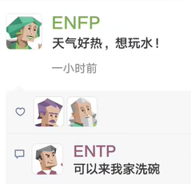{width="1.991839457567804in"
height="1.916832895888014in"}

##### INTP 逻辑学家 猫头鹰 隐士

黄焱华 曾小海 吴嘉诚

###### 故意"挑衅"对方

[时间之翼](https://zhuanlan.zhihu.com/p/71812102)

事实上，INTP喜欢通过辩论从而获取对方的独特观点以及自己未收集到的信息。有时为实现此目的甚至会故意"挑衅"对方以引起辩论。不过大部分情况下，为避免麻烦，INTP还是会主动避免陷入辩论。这是INTP矛盾特质的表现之一。

2019-07-20

对不理解我讲解的人毫无耐心（这时候突然想到朋友曾经提到过我有时候虽然语气平常但会不自主的露出嫌弃的眼神，还有不耐烦的啧啧声），对别人的情感反应迟钝，逃避承诺之类的。这样想想我这个人还挺讨厌的，但是我又懒得去维护太多，怪累的。我就想看看大家有多讨厌这类人格，哪些方面最招人反感，在权衡一下有没有必要以及要掩饰我的什么行为。

首先，我不想包庇不成熟intp的缺陷，但是我还是觉得大家对intp的价值观有一些不好的严重误解。比较突出的一项就是intp不通人情，自我中心。我非常厌恶这样以偏概全的刻板印象，我知道**有些intp甚至暗暗以此为傲，将之作为自身懒惰散漫，固步自封的借口**，但这不是intp真正的价值取向。首先intp是没有情感的机器这一观点我认为基本上就是错误的，如果你仅仅把情感定义为照护他人情绪，充满关爱同情之心的话，intp确实表现不佳。但**是我以为这不是情感的本质，而是Fe价值观的体现。**我认为情感，或者更准确的说**情绪的出现，就是给个人的行动提供价值感**，让个体有选择地在这个混乱的世界上行动。从这个定义出发，intp并不缺乏情感。一个没有情感的分析机器，不会觉得生和死有什么不同，善于恶有什么分别，存在与不存在有什么意义，最终就像一个石头待在原地一动不动，因为行动与不行动没有价值上的分别。intp如此'杠'，自然不可能是没有情感，而是它的价值观另有归属。

**Ti的价值追求：在Ti为主要功能的intp心中，逻辑自洽的强大理论体系的构建是一生的追求。**

###### [生气、吵架带来快感](https://www.zhihu.com/question/436061060/answer/1712659812)

mild
anger会带来快感，促进多巴胺的分泌。而这或许使维护个人观念产生的愤怒情绪，也成为了一种快乐源泉（这里并不针对Fe价值观，只不过SFJ价值观成了政治正确，早已被滥用了）！不成熟intp对周围的漠不关心，故步自封，沉迷在Ti-Ne的循环带来的思想快感和焦虑中无法自拔，不能和上面交代的背景分开讨论。**周围人往往不能满足intp的价值期待，许多intp因此感到失望。某种程度上说，如果intp有错，错就错在intp太少了。**

###### 超级杠精

**Ne过度发散带来的劣势：**在油管上intp的视频下有一句评论，**说Ne使用者的每说一句话都是一次新的思考，是全新的句子，基本上就是边想边说**，所以显得发散离奇，不负责任而没有边际。这和Ni使用者很不一样，Ni使用者的思考通常需要安静的环境中令内心的意向慢慢重组[链接](https://www.zhihu.com/search?q=%E9%93%BE%E6%8E%A5&search_source=Entity&hybrid_search_source=Entity&hybrid_search_extra=%7B%22sourceType%22%3A%22answer%22%2C%22sourceId%22%3A1712659812%7D)，形成自己的思想体系，他们有时候都难以向他人描述自己具体的思考过程，当他们向外表达的时候只是在复述自己已经形成的思想，这就是为什么Ni显得那样神秘，Ni使用者在表达上也比Ne简洁有力。Ne使用者有不少话多好辩，是因为他们在这个过程中大脑在积极运作，可以充分享受思考带来的乐趣，而且利用谈话对象的反馈来整理自己的表述，约束Ne过度发散带来的焦虑，更是一举两得。intp之所以杠，就是因为他们在这个过程中能得到这样的收益，理清对方想法的同时也在整理自己的想法。这个思维的工作方式和苏格拉底的[杠精式](https://www.zhihu.com/search?q=%E6%9D%A0%E7%B2%BE%E5%BC%8F&search_source=Entity&hybrid_search_source=Entity&hybrid_search_extra=%7B%22sourceType%22%3A%22answer%22%2C%22sourceId%22%3A1712659812%7D)教学道理是一样的。但这常常导致两个问题，第一个就是并不是每一个谈话对象都对这样的交流有兴趣，不要说别人，就是intp自己都常常迷失在Ne发散的思维中，这常常**给彼此的交流带来极大的负担**。第二就是**Ne的发散其实往往带来更多问题而不是见解，极端情况下Ti功能被逼得无法工作，有许多intp难以形成，甚至放弃形成自己的逻辑体系，Ti只能在纠错他人想法的时候才能运作，最终产出一个为杠而杠的超级杠精。**任何intp都应该警惕这样的倾向，而不是盲目以Ne高视角自大。

###### INTP的讨厌之处

[编辑于 2021-02-07
21:17](https://www.zhihu.com/question/436061060/answer/1689036146)

以自己为样本对INTP的讨厌之处进行无情解剖

1.  冷漠：被忽视的情感需求，抵抗情感暴力。内心OS："要我来关心你？谁关心过我？"

2.  固执：用来保护自我意志，抵抗五花八门的情感操控术。内心OS："说得天花乱坠，少来这套，不听不听不听"

3.  懒：力量不对等时消极抵抗权威的手段。内心OS："打不过～我就躺～你能拿我怎么样～"

4.  拒绝承担责任：从小独自成长没有得到外界帮助，因此也拒绝回馈外界施加的责任。内心OS："爷一人就是一支队伍，蹭人头想的美"

5.  [无集体意识](https://www.zhihu.com/search?q=%E6%97%A0%E9%9B%86%E4%BD%93%E6%84%8F%E8%AF%86&search_source=Entity&hybrid_search_source=Entity&hybrid_search_extra=%7B%22sourceType%22%3A%22answer%22%2C%22sourceId%22%3A1689036146%7D)：时刻警惕集体导致自我意志的消亡。内心OS："你管我干什么就够了，还要管我想什么。"

6.  拖延：自我认知不足时消极抵抗世界的手段
    内心OS："万一搞不定，本天才脸往哪放，以防失败干脆就不要开始"

7.  对表达内容的苛刻：魔鬼藏在细节中，对于偷换概念
    缩小范围等语言操控手段极为警惕。内心OS："别想钻这个逻辑漏洞，不准拓宽那个概念的界定"

8.  目的性：拒绝不清晰的动机，拒绝一切可能的外界干扰。内心OS："为什么这样？为什么不这样？为什么为什么？"

9.  自我中心：深刻知道只能信自己，不轻信任他人
    内心OS："那又和我有什么关系呢？世界毁灭或者天上下金块都不耽误我喝咖啡。"

总的来说
INTP过早学会自给自足，并对权威和控制有充分的认识，拒绝一切糖衣炮弹的同时也将人生的温暖拒之门外。

#### [INTJ](https://www.zhihu.com/question/459270975/answer/1900438631) 冷 无情 强 专家 杠精

谢瑞杰 何顺江

Te关注高效解决问题。而INTP的Ti关注事物内部原理。

简单来说:

陌生人眼中:冷，无情，强

朋友眼中:为人着想，不求回报(其实并不是，intj的交友观念是对等，我对你好，你对我好)

脑洞很大，有时候逗比(intj总得融合社会，稍微调节自己僵硬的感觉)

工作强，固执，拖延，三观正(开玩笑，intj三观正都是练出来的，社会需要三观正，intj就去学三观正，实际上intj早期觉得人太丑陋了，理直气壮污染世界，早期intj甚至不把自己当人看。)

##### 得养爸妈所以不能死

[**北派三叔**](https://www.zhihu.com/people/eff656cc062c14d955133c535b2609d6)
妈耶，我妈天天说我不给家里打电话

2022-08-26

[**黑木sama**](https://www.zhihu.com/people/88c2a4b4fc52571e0754067fb86069c0)
得养爸妈所以不能死太真实了

2021-05-23

[**sifone**](https://www.zhihu.com/people/e5468d59e4ea1c65cd062a8593e74921)
不来电话+1 要养父母不能死+1

2021-06-09

[**maggielyn**](https://www.zhihu.com/people/a08b8eb4a085f5fd6a20ee097f9bb3fa)

接近程度80%吧，怎么知乎这么多人对intj感兴趣啊

2021-05-23

##### 奇葩，神秘

[**Chloe-萬惡的INFJ**](https://www.zhihu.com/people/ac015a7ab54a65149a48d0b55c1b36a7)

因為INTJ是奇葩，神秘，只有知乎可以了解深入一點，本人幾乎問不出什麼

2021-06-27

##### 交往就是一天天的陪伴和日常

[**豹思想**](https://www.zhihu.com/people/b5b6633bb82d8d742db59bf0c9c10c01)

交往方面。。。不要指望intj会太多。intj眼中，交往就是一天天的陪伴和日常，什么情人节七夕节520圣诞节纪念日，intj很难给出什么惊喜，说不定最后献礼的时候搞得和工作汇报一样。朋友眼中:为人着想，不求回报(其实并不是，intj的交友观念是对等，我对你好，你对我好)我这个njt吃饭时看到这两点笑喷了

2021-05-29

##### 不合群的孤独

[**夏至**](https://www.zhihu.com/people/d5a9830632b3a0c1d502118367012480)

没听说intj招人喜欢，不合群的孤独(自己不觉得孤独)一针见血，对自己和别人，主要是对别人要求还高时，确定招人喜欢？？

2021-08-21

##### [隐藏型暴脾气](https://www.zhihu.com/question/459270975/answer/1911324690) 偏执

想想看，一个隐藏型暴脾气疯比，啥事都干的出，极为偏执，可能患有某种[自恋癖](https://www.zhihu.com/search?q=%E8%87%AA%E6%81%8B%E7%99%96&search_source=Entity&hybrid_search_source=Entity&hybrid_search_extra=%7B%22sourceType%22%3A%22answer%22%2C%22sourceId%22%3A1911324690%7D)，不信任任何人，专心于工作和学习，懒得社交，道德底线混乱甚至可以在大无畏牺牲主义伟人和反社会人士之间切换自如没关系，随时都会因为记仇事件爆种发生意外。有人会想亲近一个随时可以在准则上两端跳跃的精分家伙吗?

基本感情上用一句话形容就是，"我不关心。"不喜欢照顾人，不喜欢别人依赖自己。有迫真的外在攻击欲，喜欢批评别人(虽然也可以毫无吝啬的赞美别人但是对方不一定接受)，画大饼专用工具人。只要自己在乎就比istj更勤劳，比infj更温柔，比entj更有控制欲。

说不定工作起来熬夜两天不吃饭。

#### ENFP追梦人

曾楚雄 李政 向易武

#### ESTP 践行者

唐嘉俊 邹俊勇 川普 包

ESTP型的人活跃、随遇而安、天真率直，乐于享受现在的一切而不是为将来计划什么。ESTP型的人很现实，心胸豁达，包容心强。ESTP型的人喜欢行动而不是漫谈，当问题出现时，他们乐于去处理，他们是优秀的解决问题的人。

有些书里把他们叫做企业家，创业者、发起者等等，意思就是ESTP们喜欢随意与很多人交流，工作中充满冒险和乐趣（甚至是刺激），随时抓住机遇，更喜欢自我组织，而不是听人安排的，是活在当下自我安排命运的实践者。

ESTP是16型人格当中最有魅力、最会审时度势的类型之一。而是想尽一切办法（很多时候甚至是不择手段）将当前的任务以最有利于自己的方式完成。他们具有最强的随机应变的能力和最犀利的投机眼光，他们对于当前利益的敏感和执着使他们成为绝不吃"眼前亏"的类型。他们的绝佳的口才让他们说的话永远是那么漂亮并且在表面上显得完美而无懈可击。虽然有时言辞似乎肤浅，不合逻辑，充满忽悠和欺骗的嫌疑，但是没有人能否认在当时那个情况下他们所说的话的确能给他们带来最大的好处，

##### 现实生活中最受欢迎的类型之一

[**明治绾纱**](https://www.zhihu.com/people/70344a8139834a3f808a7536600d39e3)

我只能说现实生活中estp是最受欢迎的类型之一
大概是因为朋友太多没时间上互联网踩别人吧 他们也不屑于做这些

2022-03-08

#### [ISFP](https://www.zhihu.com/question/311628003) 静美艺术家

ISFP: 欧阳隆桐、周生龙、巧娜

腼腆，温和，慵懒，擅长享受的人

[发布于 2019-02-09
14:32](https://www.zhihu.com/question/311628003/answer/593008230)

不请自来。我是isfp

幸福感比较高，因为活在当下，看待身边的人和事不会过于理想化。不渴望拯救他人，也不喜欢企图拯救我的人，除非你是我主动选择的。而且我非常慕强，我也渴望变强，所以崇拜和欣赏强大的人。喜欢接近优秀的人。画画很匠气。平常很随意，爱迟到。而且很懒散。

不吃欲擒故纵这一套，真正看开了就是看开了，你企图吊着我胃口，我就会走。天涯何处无芳草，何必单恋一枝花。我相信只要我越变越好，自然还会有其他人喜欢我。不是很粘人，喜欢有自己的独处空间。

因为慕强的性质，我更容易喜欢上我的引导者而不是追随者，想让我喜欢你，你一定要在某一方面让我有崇拜的感觉。如果对你不来电，我对你不会给予太多的正面回馈。也因为慕强的性质我弟控或者妹控的机率比较低。我喜欢温柔强大又成熟的人。

比起文字更喜欢好看的图画。

重视感官刺激，喜欢坐过山车。

[编辑于 2020-01-01
21:10](//www.zhihu.com/question/311628003/answer/955623270)

看起来合群但其实偏向于独处多一点

交朋友的标准是这个人善良 人品好 并且她也喜欢我

随性洒脱 渴望一个人的旅游 渴望到处旅游 冒险

对人包容心很多 是个温柔的人 但很讨厌不为别人考虑 包括利用我的人
遇到这种人不会吵架直接远离 见面会客套几句

本身带给人的感觉就是可爱 软软糯糯的又不失主见 不去利用别人
尽量把自己做到最好的朋友就是要靠吸引的嘛

喜欢看有意义的剧情片 爱情片 最好是可以让我感动到哭的
不喜欢无意义的电影电视剧

喜欢有主见会讲话并可以做出正确决策的人

对待自己身边的男生当成女生一样对待 不娇柔做作

恋爱喜欢温柔有原则性的的男孩子 有才华的 颜控
不喜欢那种在外面用鲜花蜡烛围成一个圈给你惊喜 喜欢两个人的小情调

对于工作想尝试的很多 最好全试一遍

不玻璃心 对所有事情都可以理解 但还是希望事情超好的方向发展
（随缘随缘随缘-重要的事情说三遍）

---------想到再补充吧 来自一个isfp的女生

[编辑于 2019-09-05
16:41](//www.zhihu.com/question/311628003/answer/814316596)

#### ESFP 表演者 不可或缺的大活宝

陈俊南 吴薇薇 罗丹妮 周梦姣 彭国松

#### ISTP 杀手 黑客 蛇 手艺人 工具人

刘文勋 范嘉宝 彭晟原 石俊松 彭宇行

再怎么恐怖你也感受不到，[istp](https://www.zhihu.com/search?q=istp&search_source=Entity&hybrid_search_source=Entity&hybrid_search_extra=%7B%22sourceType%22%3A%22answer%22%2C%22sourceId%22%3A1317240400%7D)很能沉得住气，伪装真的很6。不是真的被踩雷了不会干出些什么事的，当做老实人就行（bu

本人istp，听到最多的话就是说我善良的，虽然都不是很熟的朋友，熟人也不可能说出这种话，因为他们知道我什么德行

##### ISTP真的有那么恐怖吗？

跟几位infp朋友聊过，如果说nf的感情主基调是"我要去爱他人"

那么istp的"感情"就是"对方于我有恩有利，我就去模仿着温柔去关心去利他，用我自己的方式回报他""他人对我不好，那直接88，就算是亲人也一样"

如果真是有没良心的istp，那确实很危险

因为别人眼中的道德，法律，只要不符合istp的观念，那都是放屁

不干违法违反道德的事=良心会阻止/违法代价太大很亏/如果不违法就能过得开心谁干那么麻烦的事呢（懒）

###### 再怎么恐怖你也感受不到

再怎么恐怖你也感受不到，[istp](https://www.zhihu.com/search?q=istp&search_source=Entity&hybrid_search_source=Entity&hybrid_search_extra=%7B%22sourceType%22%3A%22answer%22%2C%22sourceId%22%3A1317240400%7D)很能沉得住气，伪装真的很6。不是真的被踩雷了不会干出些什么事的，当做老实人就行（bu

本人istp，听到最多的话就是说我善良的，虽然都不是很熟的朋友，熟人也不可能说出这种话，因为他们知道我什么德行

##### [有点邪恶或阴暗](https://www.zhihu.com/question/404829114/answer/2378763882)

[发布于 2022-03-07
21:25](https://www.zhihu.com/question/404829114/answer/2378763882)

ISTP多多少少都有点邪恶或阴暗的想法，孤僻或叛逆只是表面，哪个ISTP还没想过颠覆世界的。

平时的ISTP大多数温和友善，看上去和其他人没有什么区别，但这并不意味着他们很大众化。柔和是他们的社交面具，为的是掩藏自己的真实想法，ISTP玩狼人杀这类推理游戏总是没人能识破他们的身份，他们会把自己藏得很深。

当然，这并不是说ISTP待人不坦诚，人格类型与人品无关，只是说ISTP很有说谎的天分。

ISTP也很适合从事刑侦，一个擅长说谎的人，自然最能识破别人的谎言，做侦探很合适。

ISTP平时基本懒得生气，因为情绪波动对他们来说内耗过大，实在是得不偿失的事。但是一旦ISTP生气了，就像火山爆发一样，恐怖得不行。

ISTP生气大概是因为有人侵犯了他们的个人隐私。ISTP作为一种高回避属性的人格，对隐私非常重视，也很少和身边人共享信息，如果不是他们主动交流，最好不要去窥探。

我就是ISTP，和杀手
莫的感情一点关系都没有，平常就码个代码啥的。凡是认为我冷漠什么的都是和我关系不熟的，熟悉了之后直接从社交恐惧症变成社交牛逼症（不管是社团还是游戏群里都这样）么得感情就更离谱了。

[发布于 2021-11-19
17:58](https://www.zhihu.com/question/404829114/answer/2232394758)

##### [擅长冷暴力 说谎](https://www.zhihu.com/question/404829114/answer/1758069024)

不恐怖，只是比较擅长冷暴力，不想和人相处了就逐渐冷落。毕竟社交真的很耗能

然后心态情绪什么的变化也很快，突然不想说话不想理人突然高兴都是常有的事，也会突然想社交兴致勃勃的把QQ号发到各种墙上，后来又因为这种举动后悔不已一个一个删掉当时加的陌生人

然后也不是脾气好的类型，常常怼人，喜爱小动物远胜过小孩。遇见熊孩子会暗戳戳的给他出馊主意让他被家长教训。

总而言之，不是跟我关系密切的人甚至会觉得我温和亲切好相处，如果是同桌舍友这种可能经常会觉得我冷漠，和我无话可说吧。

[发布于 2021-03-02
13:49](//www.zhihu.com/question/404829114/answer/1758069024)

##### 低调[行动而不合作 狙击手性格](https://www.zhihu.com/question/404829114/answer/2413154644)

不恐怖啊，ISTP反倒是很多人喜欢的人格。

用"水深静流"、"惜言如金"可以很好地描述ISTP的特性。他们很难被人们读懂，也不喜欢抛头露面。内向（I）加上对实际事务的喜欢（S）以及对"现在"的关注让ISTP看起来冷冷的。他们做出的决定总是那么客观公正，不带个人感情色彩，而且建立在分析的基础上（T）。ISTP的日常生活是即兴的、灵活的（P），在一个新环境里，不管突然出现了什么人或发生了什么事，ISTP都会马上给予关注，尽管他们常常不说出来。

在与他人的关系当中，ISTP是大度与任性的结合体，一方面会对周围的人很宽容，甚至有时候会像ESFP那样大方，另一面他们向往无拘无束、自由自在的生活，所以在做某些决定的时候可能会不太照顾到周围人的感受；另外由于过于专注于行动本身，容易沉浸在使用工具的过程中。作为团队的一员，ISTP的完美主义倾向和他们的个人诚信，总能使他们无需监管而很好地完成工作。

ISTP认为让别人参与自己的工作纯粹是浪费时间，不是他们不喜欢别人参与工作，只是他们认为这会浪费太多的时间和精力去沟通那些在他们看来简单明了的事情。他们认为行动比计划来得有效，为实现目标做些实实在在的工作才是正事。

当周围的人做出你无法理解的事时，往往是性格的不同，没有对错之分！

##### [现实主义者](https://www.zhihu.com/question/404829114/answer/2384541108)

[发布于 2022-03-11
16:16](https://www.zhihu.com/question/404829114/answer/2384541108)

ISTP，因其天生的天赋才能"不爱说话、少说多做、喜欢动手、力求精准和注重细节"，被誉为最有工匠精神的手艺人性格类型。

ISTP的气质类型（性情）是现实主义者------SP，注重实实在在的实际价值；也可以称ISTP为稳定者------ST，意思是性情很稳定，因为很理性；根据其第一天赋才能的特征，内向思维Ti，也可以称其为理性者------Ti，即总是利用理性思维来理解世界和处理事情。

ISTP的短板，即第四功能是情感，使得他们不善于表达自己的情感和感受------不太关心也不善于察觉别人的情绪，更关注事实和细节。

比如，他们心里很委屈但未必会哭出来，因为他的主导功能天赋思维认为哭代表软弱，而且毫无作用。同样的，某个凄凉的哀嚎唤醒的并不是他们跟着掉眼泪，而是为什么不擦干眼泪去寻找解决方法呢？实际上，人们只是需要一句安慰的话或者一个拥抱，但ISTP很少拥抱别人。

这不能怪他们，因为他们对情感真的不敏感。应该避开类似于客服、幕僚等需要具备很强的同理心才能顺利开展工作的工作类型。他们认为客观标准高于个人偏好，在做决定的时候，他们通常更多地基于逻辑，而不是对人情世故的考虑。

MBTI性格测试会让我们更了解自己，也更加能读懂他人。性格决定命运，了解性格可以改写命运，不了解自己的人容易被命运操控。

##### 人均高冷男神

[**男德大师**](https://www.zhihu.com/people/e15b03589bd340ae6e631ad8658587aa)

作者

istp人均高冷男神

2022-11-16 ·IP 属地北京

#### INFJ 作家型

黄葵松

{width="4.0444838145231845in"
height="2.623606736657918in"}

灵性特质的作家型（INFJ）

若你是一个作家型

##### 文字是神圣的

文字对你而言是神圣的，通过文字，你可以了解并且表达生命的神秘。当不写作时，你是在体验你的另一项聆听天赋，去安慰和帮助那些来向你寻求建议和指引的人。

当你恋爱时

至于跟心灵相关的事情，你偏向用白纸黑字表达自己。举凡诗歌、日记和贴在浴室镜子上的温柔留言，都是你最喜欢用来表示爱意和奉献的方式。

作为一个作家型(这种类型仅占人口的2%)，你倾向为情人贡献大部分的时间和精力。事实上，你只要你的情人作为你惟一的伴侣---也就是你最要好和惟一的朋友，就颇满足了。

很不幸的是，这种要一个人成为你惟一情感支柱的妄想会让你心碎。你也许会决定避开所有的人，只为了要和你的情人在一起，事后却可能发现，对方不是一个适合你的人。当时，你可能只是自欺欺人地拖延了一段不被看好的感情，让自己去相信对方是适合你的人。

##### 善于发现

[**知乎用户L10odu**](https://www.zhihu.com/people/be045f6e6e3331240263da6481cea9bc)

我觉得infj挺好认得/_(:зゝ∠)/_想了半天，感觉有点说不清，就是直觉吧，突然因为某个细节就认出来了。ni经常会在某些不为人察觉的点上有比较奇怪的认知，然后揪住丫这一点的小辫子拓展开，就会发现这只隐藏起来的奇葩(/*＞◡❛)

##### 求知欲广

瘫在明面上一些特点，比如：通常阅读量是比较庞大的。这似乎是ni的一个共同特点，强烈的求知欲和对很多知识点深度挖掘的欲望。只是一般intj看书是围着他专业相关的一个相对明确的范畴展开的。infj就比较飘，阅读经常是看心情，而且还经常看一半就不看了，后一半全靠脑补。所以别听infj特别能逼逼，有可能那本书他自己都没看完/_(:зゝ∠)/_/
然后就是巨能说，跟唐僧一样，如果你不主动缝上他的嘴，他能叨逼叨一整天......而且可以这样说，一般特别能叨逼的infj是一只相对比较健康的infj，如果一个叨逼不说话了，那他多半是抑郁了。举个例子比如说陈坤，他访谈里就讲自己年轻的时候不爱说话，现在放开了就话/
特别密。他是典型的infj，如果一个infj不装逼了，看起来大概就是即深刻又傻逼(-᷅/_-᷄)

##### 怂

然后就是很怂，因为在意别人的想法又想得多，所以就跟兔子似的一感觉风向不对马上就跑没影了。但是就我个人的经历来说，多半ni的直觉是对了，我换的好几家公司等开始裁员的时候我在别家的试用期都过了(-᷅/_-᷄)/
目前就想到这么多。

2018-09-24

#### [ENFJ 主人公型人格 教育家](https://www.zhihu.com/question/543323404)

[编辑于 2018-07-12
05:19](https://www.zhihu.com/question/55293618/answer/437352313)

潘俊杨 周佳欣 石总晖 周慧

##### 好的特点

主人公人格类型的人是天生的领导者，充满激情，魅力四射。.
这类型人格的人约占人口的2%，他们常常是政客，教练和老师，帮助、启发他人取得成就并造福整个世

ENFJ
性格的女性坚强、自信和充满魅力，在社会群体中表现为充满母爱的（motherly）。

她们也是极具激情、魅力和天生的领导者。

[觉醒前](https://www.zhihu.com/search?q=%E8%A7%89%E9%86%92%E5%89%8D&search_source=Entity&hybrid_search_source=Entity&hybrid_search_extra=%7B%22sourceType%22%3A%22answer%22%2C%22sourceId%22%3A437352313%7D)，看起来......很蠢......日常傻乐，有发现美的眼睛，文艺，爱好广泛，擅交际，对人雨露均沾，讲义气，爱说教，正义感强，偶尔愤青。

觉醒后，心境随修为逐渐平和，悲天悯人，会对哲学佛学道学之类的更感兴趣。能更普遍广泛地觉察到世间的美。觉醒契机一般是因为遭受现实打击，转而广泛地搜集信息，内省人生意义，然后在低谷中顿悟。首功能Fe受挫会从其他功能寻求解脱，ENFJ第二功能Ni借此得以发展。

非常以好恶和个人感受评判一个人，但往往是很准的，所以被ENFJpass的人基本就没什么希望了，因为她们不能说服自己勉强接受；

##### 坏的特点

[发布于 2020-05-06
11:09](https://www.zhihu.com/question/55293618/answer/1203477904)

###### 吹嘘自己，爱出风头 墙头草 见人说人话，见鬼说鬼话 不动自己奶酪 乐善好施

其实我认为enfj并不像很多答主吹嘘的美好。这个人格通常说话真假参半，立场变化可比意大利，有墙头草的天赋，通常比较擅长吹嘘自己，爱出风头，给人的感觉比较虚，不实在。因此这个问题下面这么多回答都大同小异。也没有看到任何一条自我反思或者自省的答案，除了一条自卑舔狗？拥有看穿别人动机的能力，但大多数时候都选择见人说人话，见鬼说鬼话，而不是坚守一些原则。他们在不动自己奶酪，或者有可能共赢的前提下乐善好施。喜欢圈子文化，簇拥传统，反对离经叛道。渴望被人羡慕，是enfj拔除不掉的欲望，也许那就是他们很多行为的动机。。。无意拆穿，只是因为我太了解了，看着里面一片和谐，不吐不快。。。
抱歉。。。

[**知乎用户DtqSL4**](https://www.zhihu.com/people/60531c33b4553821eb3eb7540b94224a)

[**Justin**](https://www.zhihu.com/people/e1aea504a9c61d9cdd1dd5838b2efb7d)

对呀，表面很虚假，但是内心的原则还是坚守的，这是我们为人处世的一种特性------哪怕对方的言论非常不对，但是我们依然坚持peace
and love（表面的）

2021-06-29

##### 最罕见的男性性格

在全球范围内，[ENFJ
人格](https://www.zhihu.com/search?q=ENFJ%20%E4%BA%BA%E6%A0%BC&search_source=Entity&hybrid_search_source=Entity&hybrid_search_extra=%7B%22sourceType%22%3A%22answer%22%2C%22sourceId%22%3A2574853464%7D)和
INFJ 是并列的最罕见的男性性格，两者均占男性人口的2.8%。

许多人被ENFJ女生所吸引，因为她们是特别善于支持和鼓励的人。ENFJ
女生有着温暖和深情的性格，喜欢帮助别人，在情感上鼓舞他人。虽然她们肯定有强烈的个性，但她们的"情感（Fe）"特质让她们比
ENTJ（指挥官）的女生更加容易亲近，善于观察他人的情绪。

2/. 极致的利他主义

由于她们对利他主义的热情和情感驱动的特质，ENFJ女性是令人难以置信的无私，经常致力于以任何方式帮助别人。

#### ISTJ 公务员 律师 审计员

秦涛 伟军

#### ESTJ 物流师 弱肉强食利益第一 精明亲戚 天生的管理者

杨灿业 杨先腾 余训江 黄姣军 mom 社会中大多数人 杨巧利 彭俊

像狼一样社会

[**一只狐**](https://www.zhihu.com/people/7ba4d29a814ed168b4edcc2a8f20e208)

Estj女是最不容易获得幸福的群体之一。柔弱的男子她们看不起，强大的男人受不了她们的臭脾气。/
Estj女的孩子多半是妈宝，唯唯诺诺，毫无主见。与她们的期望相差甚远。

2020-12-10

[**一只狐**](https://www.zhihu.com/people/7ba4d29a814ed168b4edcc2a8f20e208)
[**抱抱大哥**](https://www.zhihu.com/people/b83ccc3a3c791ebbb323974d0d9f485e)

其实解决方案就在我回复你的话里，每次想给别人提解决方案的时候就想想，直白的批评对方接不接受。先释放善意再说解决方案，效果会好很多。

2022-03-30

[**知乎用户1WMBwI**](https://www.zhihu.com/people/1abd04fb06d3eed31b67ca3538289bfc)

这不是我爸吗😂 果然sj父母容易出np星人

2020-08-03 ·热评

[**星星小孩**](https://www.zhihu.com/people/8ef61d4a2654e6165948d7b35e541587)
[**夏夏MBTI**](https://www.zhihu.com/people/f37e21e7f26b6d6f1d77dacc3a24ddf0)

那infp呢 怎样？遇到estj要死定了 少活几年是一定的

2020-07-22

##### 大家有认识estj男吗

**来自: [sssssss](https://www.douban.com/people/2219736/)** **2021-10-10
11:03:06** 

我是infp女 就是那种每天小脑瓜都很多迷思 然后感情心思细腻丰富的那种

说话做事 尤其是非工作上的内容 其实都属于 比较和气
但可能也会比较中性的那种

前段时间 有一个estj男 刚开始超级主动 直接 一上来就说想更了解我呀
然后对我感兴趣呀啥的

但是一来没认识多久 再加上infp性格不是那种猛烈的 我只是模糊的回复了他

然后 estj男就消失了 我觉得两个人是需要更多交流 才能更了解的 但他不是
就不会主动联系了

我也不是主动型人格 虽然慢慢了解他更多觉得他也是个优秀的人
但是现在就处在尴尬的境界

是不是estj 就属于这类型人 单枪直入 然后撤退的也迅速 好烦呀

[**momo**](https://www.douban.com/people/81645204/) **2021-10-10
11:05:34**

认识过，想远离他们，离得越远越好那种

[**sssssss**](https://www.douban.com/people/2219736/) **楼主** **2021-10-10
11:46:22**

真的是 我就直接说他钢铁直男 大石头
为什么真得有人可以这么没有感情前共感吗

###### 观念传统 生活中的屎尿屁 俗气愚蠢 其他话题无法沟通

[**汤老湿地公园**](https://www.douban.com/people/145984688/) **2021-10-10
11:54:24**

太多了 过了最初的荷尔蒙的吸引时候 在我眼里就只剩下各种缺点
印象最深就是觉得他们无比肤浅 除了生活中的屎尿屁 其他什么话题都没办法支撑
而且观念也是特别的传统 在我看来俗气且愚蠢 他们还特别在意别人的看法
在我看来就是很不能理解 觉得很嫌弃

###### 不是理工直男 是社会哥

[**momo**](https://www.douban.com/people/81645204/) **2021-10-10
12:05:10**

这种类型的人是不是 类似 理工直男那种
可以这么理解吗 [sssssss](https://www.douban.com/people/2219736/)

不是理工直男，理工直男可能是intp或者intj，至少他们是n系列的，可以理解抽象的东西，estj会比较注重实际的东西

###### 大男子主义 虚伪 俗

[**框机喵**](https://www.douban.com/people/183616757/) **2021-10-10
18:10:45**

认识一个esfj男，也是一上来就说喜欢我，追了我一两个月，然后就直接跟别的女的谈恋爱了......怎么说呢，很大男子主义，而且很虚伪、很俗的感觉就是，完全不喜欢的类型。

[**wildpalms**](https://www.douban.com/people/135378724/) **2021-10-10
22:02:51**

远离广撒网的速食恋爱者( ¯ᒡ̱¯ )و

###### 很优秀 对不同人不太一样

[**sssssss**](https://www.douban.com/people/2219736/) **楼主** **2021-10-10
22:07:26**

他们口中的"喜欢、好感"，也不一定是你心中想象的那种纯粹、美好的喜欢和好感 [wildpalms](https://www.douban.com/people/135378724/)

嗯嗯 他一开始很直接主动 我质疑过 他说他对不同人不太一样
他是那种很直男但是怎么说 很优秀的那种人

###### 看起来很热情付出 其实自私 好面子 打辩论赛

[**我最爱的浪味仙**](https://www.douban.com/people/carpediembabe/) **2021-10-10
22:50:32**

estj就像一台无情的复读机，无限复读网络概念，和他聊就聊不进去，一谈到抽象的概念立马给拉回具象。estj很功利主义，好的关系留下，无用的切断，看起来很热情付出，其实只是自私而已，自私就算了，还特别明显摆在面上。特别好面子，期待别人的赞赏，说个话巴不得和你打辩论赛，让你赞成，服从。反正infp真的很难靠近estj，浑身难受。

###### INFP 感情细腻 思绪万千 稍微理性的人中和一下

[**sssssss**](https://www.douban.com/people/2219736/) **楼主** **2021-10-13
13:20:30**

不要靠近ESTJ。不是因为他们不好，是INFP会受伤🤕️ [三好学生](https://www.douban.com/people/220285866/)

是的 我是那种感情细腻 然后思绪万千
很容易因为音乐电影啥的就感动一塌糊涂的人
所以其实我觉得我应该找一个没那么泛滥 稍微理性的人中和一下
但是tj类型的人真的很难懂你是真的

###### 每天很热情的找我说话，后面一下冷淡

[**f l e u r**](https://www.douban.com/people/223789631/) **2022-10-12
15:23:41 陕西**

我也有类似的经历：一个estj男几乎一个月以来每天很热情的找我说话，后面一下子冷淡，不带理你的，呜呜呜呜。过了很长时间我贼心不死主动找他说话，他回复的很敷衍，基本上就是嗯嗯，确实，对....

而且和他分享我的近况，他也不会接着问下去，就是嗯嗯两字结束🔚...enfj表示不会再主动了.....好冰冷🥶

#### ENTJ指挥官

Dad talk to mon 俐标爸

乱の码

很简单，你就参考生活那种不拖泥带水行事果断干脆而且还很硬气的人。能把事办好办快就不多逼逼

2022-07-21 22:4931

### 杂谈

#### [是否INTJ中有更多人得抑郁症？](https://www.zhihu.com/question/28244275)

[**一年后的约定**](https://www.zhihu.com/people/50e5bdea42c5a84c72538a31a7c633e3)

其实所有人格用这个方法都很有效

2020-12-05

[**龙心蚁志**](https://www.zhihu.com/people/852847bd8ac98c853eea6051d5166572)

把所有问题想通就不抑郁了，我花了20年。

2019-03-12

很多INTJ都是病态的INFP

[发布于 2015-02-18
06:40](https://www.zhihu.com/question/28244275/answer/40013428)

[**和平**](https://www.zhihu.com/people/dc42086d7a38c9a02a2850a2290177a6)

INTJ的shade mode 是ESFP

2016-07-09

#### [INTJ、INTP、INFJ、INFP哪个在中国最痛苦？](https://www.douban.com/group/topic/12301359/?_i=5420352Ns9yWsc)

平原 2011-03-10 15:16:05

中国总的来说是一个ESFP社会： E: networking 重要、S: 吃喝玩乐、F:
人情味较浓、P: 比较灵活而不守规则

所以ESFP的反面INTJ应该最痛苦 :)

俺是INTP次痛苦，哈哈

#### estj就是像狼一样社会，esfj就是像狗一样社会。

#### 中国sfj stj大国 sp耿直 sj拐弯抹角

[**zzzz**](https://www.zhihu.com/people/93390fc042a86f00c9cee8f2bdded3ec)

中国sfj
stj大国，美国esp远远大于中国，sp的特点其实是本性耿直，中国最喜欢拐弯抹角的表达和说话都是sj风格

2022-06-28

[**Empty**](https://www.zhihu.com/people/a9180f6dec7bb480cbbb8d4379c8ea50)

我是infp＋infj。在s大国太痛苦了

2020-12-11

[**earthboi**](https://www.zhihu.com/people/e6be36f6dae4932e9ae64013890c401a)

我是Infp（哲学家型），给我妈测试了，istj（物流师人格）..

2018-02-05

#### S人都占了70% 人间是地狱

[**偷你家的星星**](https://www.zhihu.com/people/d0fea2c98955dfe31316cea26f8a1dfe)

光S人都占了70%，怪不得人间是地狱

2021-08-07

物欲旺盛

[**桃橙**](https://www.zhihu.com/people/8c9d6311e353a36380cf5c226d91d937)

韩国的T明显高于英美，个人推测中国很有可能也是类似的。因为东亚文化下情感压抑，T化严重。不过这种数量比例上的T化并不意味着T的高质量化。

2019-08-29

#### [estj，estp，entp，entj四个类型的领导风格有什么区别？](https://www.zhihu.com/question/538820963/answer/2540694711)

[发布于 2022-06-23
07:56](https://www.zhihu.com/question/538820963/answer/2540694711)

直刁怪强

[发布于 2022-07-01
09:26](https://www.zhihu.com/question/538820963/answer/2553275652)

#### [INFP和ISFP比较 谁才是大艺术家？](https://zhuanlan.zhihu.com/p/500491839)

##### INFP不走寻常路 实验性

虽然INFP作为直觉型，比他们的感觉型同行ISFP更抽象，但两种类型都喜欢通过经验学习。作为P型人，他们都不反对一时兴起去尝试新的经验或生活实验。也就是说，INFP的特点是更具实验性，对新的经验持开放态度，随时准备/"不走寻常路/"（译者：因为Ne功能位先于Si），甚至接受别人可能认为是流浪式的生活方式。这就是说，大多数人最终会定居在一个更稳定的生活安排中，特别是一旦有了孩子后。除非资金充裕，否则他们的探索也会变得更加本地化，比如经常访问附近的艺术博物馆、农贸市场、州立公园等。

[**清心泡水**](https://www.zhihu.com/people/d9ee58d627a8992ded8bb552eebbbfbb)

感觉这篇真的说得很有道理 确实是那种随时准备不走寻常路的人
而且我觉得IFP作为Fi主导者都会对美的东西有所追求
可能就是大部分isfp更喜欢现实的可以触摸的美 但infp更喜欢捉摸不着的美
虽然infp也会被美好的东西所吸引 但是往往看见的是背后的东西
而isfp（可能是由于ni在阳面功能吧我不知道
我身边好像没有isfp活体样本）会把美表达的更尖锐更突出一点
感觉这就是功能上的差异 说不上来谁更适应社会
只是infp好像会比isfp除了物质会更有所追求 追求那种背后的"意义"
是会为了看不见的东西而奋斗的人

2022-06-01

##### isfp天生不愿意吃苦

[**有话就不好好说**](https://www.zhihu.com/people/1c0301d2f5d5574b9fbfba6091979854)

本人infj 伴侣 isfp 长期的相处 总是让我感觉：
可以一起享受，但是不能一起吃苦。甚至，isfp天生就不愿意吃苦，但是也能把吃苦当成一种自然而然的事情
泰然处之。/
但是不解的是，enfp
理论上是ne-si使用者，但我认识的enfp却总是给我一种虚荣和占有欲强烈的感觉，虽然
品味的确是差了点/
不过，也许收集的样本较少，也不具有普遍性

2022-04-18

##### isfp喜欢现实美 但infp喜抽象美

[**清心泡水**](https://www.zhihu.com/people/d9ee58d627a8992ded8bb552eebbbfbb)

感觉这篇真的说得很有道理 确实是那种随时准备不走寻常路的人
而且我觉得IFP作为Fi主导者都会对美的东西有所追求
可能就是大部分isfp更喜欢现实的可以触摸的美 但infp更喜欢捉摸不着的美
虽然infp也会被美好的东西所吸引 但是往往看见的是背后的东西
而isfp（可能是由于ni在阳面功能吧我不知道
我身边好像没有isfp活体样本）会把美表达的更尖锐更突出一点
感觉这就是功能上的差异 说不上来谁更适应社会
只是infp好像会比isfp除了物质会更有所追求 追求那种背后的"意义"
是会为了看不见的东西而奋斗的人

2022-06-01

#### [isfj爱规划做计划 infp拖延消沉内耗](https://www.bilibili.com/video/BV1Y5411R72C/?spm_id_from=333.788.recommend_more_video.19&vd_source=f03b9d349cef8aff4a045d602d8a1d82)

白膛切狼

回复 /@昔日殷殷语
:我是从isfj变成了infp，内向这一点是没变的，但从isfj这种爱规划做计划变成了infp这种拖延消沉内耗

2022-05-28 23:12

##### 极度内向不可改变

第二个，变化当然是有意义的。就infp而言，这是这个社会所不太需要的一种类型，但并不代表这类不好，没有一个性格可以用好坏评判。另外，变化也说明人的可能性是无限的，当然在成年三观稳定之后或者身边环境稳定之后这个变化不会很大，然后像视频里up说的内向变外向的那种一般本身就是在边缘游走的那批人，并不适用于极度内向的。

2022-05-13 17:1810

#### INTJ和INTP区别

INTJ策划者 Ni Te Fi Se Ne Ti Fe Si

INTP建筑师 Ti Ne Si Fe Te Ni Se Fi

Diego布兰度

intj和intp看着很像，内核功能完全相反，所以辨别这俩人格，看吵架的时候就知道了

2021-11-03 11:0523

##### INTJ主观直觉中获得知识经验Ni第一功能

Diego布兰度

回复 /@上海心脑神经内科专家 :之所以出现上面的问题，是因为
intj内核ni是会从主观直觉中获得知识经验，并非依靠外界信息，然后为了探究自己的直觉是否具有科学性，于是运用te构建自己的模型。

##### INTP探究事物原理Ti核心

而ti是发散汲取创造的过程，但因为intp是核心ti而不是第二位功能ti，所以是intp渴望创造发散获取知识，为了获得运用ne（从历史权威经验中找答案）

2021-11-12 18:5612

##### intp普遍缺乏信息提炼能力 intj直接结论

Diego布兰度

回复 /@上海心脑神经内科专家
:而且你看上面的吵架内容会发现，intp普遍缺乏信息提炼能力，看不懂高度总结的intj说的话重点在哪，也不清楚自己的论点核心重点是什么。/
导致intj反复总结的都是结论，因为结论就已经一把钥匙开所有的锁，但intp必须一步一步正序理清楚才能听懂。/
而且intp看不懂intj的话，比如intj一开始加了前缀"现在以及近未来"
已经框住了，但intp陷入自己的ti无法自拔，老扯到范围外于是和intj吵起来。/
但明明intp自己琢磨的话，后面也会后知后觉发现intj说的没错
但是那是后话了当下讨论intp没办法构建逻辑体系就会懵，还觉得对方逻辑不清楚/
而intj会觉得intp好蠢蛋，因为明明一开始就说明白了，怎么就听不懂，自己换着法子解释，怎么就不明白，还会因为intp没看懂自己的话就说intj已经解释过的疑问，于是更加恼火/
intj眼里的intp：同学们，上节课讲xxxxx（讲完了）/
intp：老师xxxxx是不是不对啊/
intj：？我上节课刚讲完啊，那我在讲一遍/
intp：可是xxxxx不对啊（又问了一遍）/
intj：烦躁

2021-11-12 19:0224

#### intj/intp对其他性格的看法：都是傻逼

[**知乎用户KQN9KK**](https://www.zhihu.com/people/849a5639cc021e16ac36c1ee3f1b732a)
[**大哥大**](https://www.zhihu.com/people/b47ba9cebb626aaa85138279bbfcad0c)

这么说吧。intj/intp对其他性格的看法：都是傻逼。（无恶意的，只是这么形容一下）/
而isfp/infp属于那种即使是被看作傻逼也会很乐呵的那种性格。本质上还是其实是ixfp在包容intj啊，而不是反过来。

2020-03-09

[**ashfuzsk**](https://www.zhihu.com/people/6d9abb9fbb83816f762a6596f7255e53)

我intj 和其他室友的关系都烂掉了 只有一个isfp关系很好(感觉挺不可思议)
真的是被他的幽默 善良和温顺所吸引的

2022-04-13

#### entj和estj的区别

ESTJ倾向于对细枝末节的监管，而ENTJ更倾向于对大方向的指引。

#### [中国MBTI各人口占比](https://zhuanlan.zhihu.com/p/146363474)

（1）可以发现，这项统计中人口占比排名前5的是：INFP；ESFJ；ISFJ；ENFP；ISFP

（2）人口占比最少的5个类型是：ENTJ；ESTP；ISTP；INTJ；ENTP

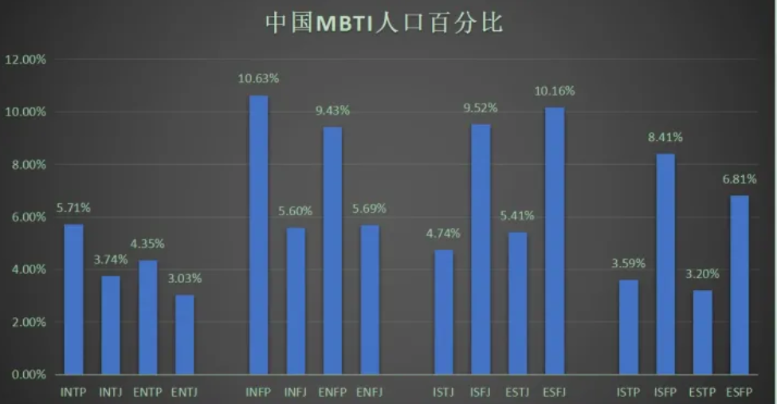{width="5.768055555555556in"
height="2.9993055555555554in"}

#### [军队不招收ENFP、INTJ、ISTP型人格?](https://www.zhihu.com/question/22128477)

[**Camus**](https://www.zhihu.com/people/ac7052469cb7464db196524c486ac523)

ENFP 策反派 ISTP 技师执行者 INTJ 军师

2020-06-23

[**堇小猫**](https://www.zhihu.com/people/1fac8d21e9071da39c8823b06881211f)

绝了 一个鼓动人心 一个策划方案 一个擅长落实 少一个都不能这么绝

2022-06-18

intj太独立，istp太冲动，enfp会让军队变成俱乐部。。。

##### 实际上infp是不收的

[**西乌庵主人玄**](https://www.zhihu.com/people/71fa9df54ee4476228526190693e570c)

实际上infp是不收的 有一条是i或 n过30 或n或 p过28就会被刷 而infp全占
说明这个类型比三不受更不招军队待见

2021-04-17

[**柴日天**](https://www.zhihu.com/people/a0e019f31b1d92ac52a3abc8d9a9fc4b)

是啊，优柔寡断娇气脆弱

2021-06-26

##### infp理想主义为了国家现身

[**深海**](https://www.zhihu.com/people/4714ee46ab39963894a21830c969782f)

infp是最会为了国家现身的（如果这是他的理想主义）。而且军队严格的制度并不是你没有行动力就可以不执行的。自己在这瞎猜啥呢？你怎么不猜大多数infp根本就不想入军队呢

2022-03-27

[**柴日天**](https://www.zhihu.com/people/a0e019f31b1d92ac52a3abc8d9a9fc4b)

那照你这么说enfp也可以收喽，可是军队就是很现实的地方，就是有很多变态的规章制度。

2022-03-27

##### Stj 即守规矩又雷厉风行

[**柴日天**](https://www.zhihu.com/people/a0e019f31b1d92ac52a3abc8d9a9fc4b)
[**西乌庵主人玄**](https://www.zhihu.com/people/71fa9df54ee4476228526190693e570c)

但整体来讲容易优柔寡断，军队需要的就是stj那种即守规矩又雷厉风行

2021-06-27

[**柴日天**](https://www.zhihu.com/people/a0e019f31b1d92ac52a3abc8d9a9fc4b)

estj适合当官，士兵是istj和isfj还有esfj

2022-03-27

##### [INTJ叛变风险高](https://www.zhihu.com/question/22128477/answer/1090997189) 

INTJ有相对较高的叛变风险。INTJ考虑事情时会理智的思考利益且不受道德观念束缚，一旦他们决定将自身利益凌驾于在集体利益之上，很可能意味着最危险的背叛。当然，会不会当叛徒这种事情其实取决于三观，我相信肯定有很多正能量爆棚、愿意为国捐躯的INTJ。但/"兵者，国之大事，死生之地，存亡之道，不可不察也/"。为了避免万一，还是有必要谨慎一些啊。

##### ISTP不好管理

ISTP不好管理，不便执行很多需要严格纪律才能完成的军事任务。

ENFP善于收服人心，一旦造反危害极大。ENFP的典型人物是刘备、宋江。刘备素有"仁德"之名，宋江外号"及时雨"，一旦他们想反，很多人会愿意跟他们走。

#### [J和p的区别](https://www.zhihu.com/question/449516697/answer/1795329898) 

[编辑于 2021-03-23
21:21](https://www.zhihu.com/question/449516697/answer/1795329898)

intj infj entj enfj istj isfj estj
esfj们要么努力要么[自律](https://www.zhihu.com/search?q=%E8%87%AA%E5%BE%8B&search_source=Entity&hybrid_search_source=Entity&hybrid_search_extra=%7B%22sourceType%22%3A%22answer%22%2C%22sourceId%22%3A1795329898%7D)是图什么？除了生存刚需以外，还有一个硬性需求就是想得到情绪价值，j类型人想赢，是因为离不开鼓励和肯定。

intp infp entp enfp istp isfp estp
esfp卷不过别人怎么适应社会？除了发挥聪明才智以外，给人提供情绪价值来换取资源，也是p类人的生存策略。

举例来说，同样是在知乎上分享干货，j类型人辛辛苦苦写了一大堆，如果没有人点赞收藏，就会产生焦虑感，甚至认为是知乎受众没品位。

而p类型人的想法要随性的多，认为自己分享干货等于做[公益](https://www.zhihu.com/search?q=%E5%85%AC%E7%9B%8A&search_source=Entity&hybrid_search_source=Entity&hybrid_search_extra=%7B%22sourceType%22%3A%22answer%22%2C%22sourceId%22%3A1795329898%7D)，在写作的过程中自己也巩固了知识，不算坏事。免费给你看，你都不看，那是你的损失，不是我的损失，我为什么要难过？

##### 冬泳怪鸽是p类人 [庞麦郎](https://www.zhihu.com/search?q=%E5%BA%9E%E9%BA%A6%E9%83%8E&search_source=Entity&hybrid_search_source=Entity&hybrid_search_extra=%7B%22sourceType%22%3A%22answer%22%2C%22sourceId%22%3A1795329898%7D)是j类人

搞怪的[网络红人](https://www.zhihu.com/search?q=%E7%BD%91%E7%BB%9C%E7%BA%A2%E4%BA%BA&search_source=Entity&hybrid_search_source=Entity&hybrid_search_extra=%7B%22sourceType%22%3A%22answer%22%2C%22sourceId%22%3A1795329898%7D)里面，[冬泳怪鸽](https://www.zhihu.com/search?q=%E5%86%AC%E6%B3%B3%E6%80%AA%E9%B8%BD&search_source=Entity&hybrid_search_source=Entity&hybrid_search_extra=%7B%22sourceType%22%3A%22answer%22%2C%22sourceId%22%3A1795329898%7D)是p类人，他看上去疯疯癫癫的，其实不在乎[直播](https://www.zhihu.com/search?q=%E7%9B%B4%E6%92%AD&search_source=Entity&hybrid_search_source=Entity&hybrid_search_extra=%7B%22sourceType%22%3A%22answer%22%2C%22sourceId%22%3A1795329898%7D)时那些非议，无论是冬泳当司仪还是打快板，都是他苦中作乐的方式，他也没有因为外界的追捧而过度膨胀，一直在照顾弟弟父亲。[庞麦郎](https://www.zhihu.com/search?q=%E5%BA%9E%E9%BA%A6%E9%83%8E&search_source=Entity&hybrid_search_source=Entity&hybrid_search_extra=%7B%22sourceType%22%3A%22answer%22%2C%22sourceId%22%3A1795329898%7D)是j类人，看庞麦郎采访会发现他态度是严肃的，也很希望被人认同，不是装疯卖傻搏出位的。庞麦郎并不能从创作中得到快乐，曾经讨厌明星后来想当明星的原因只是想被人追捧，为了[走红](https://www.zhihu.com/search?q=%E8%B5%B0%E7%BA%A2&search_source=Entity&hybrid_search_source=Entity&hybrid_search_extra=%7B%22sourceType%22%3A%22answer%22%2C%22sourceId%22%3A1795329898%7D)可以不认父母。庞麦郎成功[签约](https://www.zhihu.com/search?q=%E7%AD%BE%E7%BA%A6&search_source=Entity&hybrid_search_source=Entity&hybrid_search_extra=%7B%22sourceType%22%3A%22answer%22%2C%22sourceId%22%3A1795329898%7D)了，也发行了单曲，人气下滑以后却因为受不了大起大落而得了[精神病](https://www.zhihu.com/search?q=%E7%B2%BE%E7%A5%9E%E7%97%85&search_source=Entity&hybrid_search_source=Entity&hybrid_search_extra=%7B%22sourceType%22%3A%22answer%22%2C%22sourceId%22%3A1795329898%7D)。娱乐圈更适合p类人，因为他们娱乐精神强，也不容易因为外界评价而崩溃。

##### 恋爱p更主动 j表面上姿态更高 硬条件上提升自己

恋爱不顺利时，p类人会侧重于使用小技巧（比如使用推拉技巧制造情绪波动，比如更换妆容衣着风格制造新鲜体验），来让恋人感受更好；j类人会想着在硬条件上提升自己（比如努力赚钱/[整容](https://www.zhihu.com/search?q=%E6%95%B4%E5%AE%B9&search_source=Entity&hybrid_search_source=Entity&hybrid_search_extra=%7B%22sourceType%22%3A%22answer%22%2C%22sourceId%22%3A1795329898%7D)），让恋人对自己让步。

p在恋爱方面更主动，表面上姿态低的前提是内心能量足不怕被人打击，抽身时相对潇洒。j在恋爱方面，表面上姿态更高，实际上内心患得患失，控制欲更强，不容易放下。

j类型人更在乎社会评价，p类型人更在乎自身体验。同样是全职照顾家庭，[j类型](https://www.zhihu.com/search?q=j%E7%B1%BB%E5%9E%8B&search_source=Entity&hybrid_search_source=Entity&hybrid_search_extra=%7B%22sourceType%22%3A%22answer%22%2C%22sourceId%22%3A1795329898%7D)人会要求社会尊重，如果得不到社会尊重哪怕过的安逸也不会安心。p类型人更在乎实际待遇，愿赌服输，不在乎无关的人怎么看，也不介意朋友事业比自己出色，只要对自己有帮助就能欣赏。

##### np是通过求知欲和想象力来获取快乐

[**旧故里草木深**](https://www.zhihu.com/people/57d1dda3491476a1cb11205d8de14587)

np是通过求知欲和想象力来获取快乐），j更依赖从外界社会关系中获取快乐。这个觉得写的挺符合的

2021-04-15

##### [目标性 j型人格目标性很强 p型人格佛性](https://www.zhihu.com/question/449516697/answer/1794461632)

[编辑于 2022-11-04
11:44](https://www.zhihu.com/question/449516697/answer/1794461632)

就是目标性
。j型人格目标性很强，做任何事都必须有明确的目标（不管实现目标的过程到底会不会出现拖延和懒惰，但坚定的目标是一个很关键的点）

但[p型人格](https://www.zhihu.com/search?q=p%E5%9E%8B%E4%BA%BA%E6%A0%BC&search_source=Entity&hybrid_search_source=Entity&hybrid_search_extra=%7B%22sourceType%22%3A%22answer%22%2C%22sourceId%22%3A1794461632%7D)并不是，ta们会有一种比较佛的漫无目的感，所以相对而言p型会随和+做事不功利，渴望一种不急不忙的闲适生活状态（再拿我那个朋友举例子，她就属于内心很向往悠闲的生活但实际上忙得要命（？）好迷惑）

#### INFP和INFJ区别

躺在黑夜的怀里

Infp只要能拥有行动力就都好了。

2021-10-13 15:451635

幸好有你宇扬

有行动力就变成infj了，我就是在这两种人格中互相转换

2021-11-01 18:2399

seltys

回复 /@幸好有你宇扬
:其实我觉得j和p差别蛮大的，可能j比p普遍更有计划一点，p我行我素一点。所以让人觉j得更有行动力,但是不能说有行动力就变成j了，因为不只这一方面的差异。这样说感觉像说"infp就是缺少行动力的infj的低阶版"挺不舒服的，（难道是真的吗？本infp又开始自我怀疑中。。。。。

2021-11-06 10:31158

小企鹅的宇航员 回复 /@幸好有你宇扬 :嘤嘤嘤是真的/
我妈妈是infj我是infp，她就超有行动力/
我打小就被她骂懒蛋

2022-01-05 23:544

#### [气质区分最容易](https://www.zhihu.com/question/449516697/answer/2358334974)

我觉得从气质上比较好区分，不知道你能不能感受到人身上的气质

NJ（INTJ、ENTJ、INFJ、ENFJ）的气质是坚定，甚至有点压迫性（没错包括两个NFJ）

SJ（ISTJ、ESTJ、ISFJ、ESFJ）的气质是细致和周到

NP（INTP、ENTP、INFP、ENFP）的气质是涣散和神游

SP（ISTP、ESTP、ISFP、ESFP）的气质是今朝有酒今朝醉

[发布于 2022-02-22
03:07](//www.zhihu.com/question/449516697/answer/2358334974)

ISFJ INFP

#### [【数据可视化】快来看看MBTI 智力排名](https://www.bilibili.com/video/BV1yu411C7AC/?spm_id_from=333.788.recommend_more_video.8&vd_source=f03b9d349cef8aff4a045d602d8a1d82)

2022-04-14 16:50:00

##### [天才容易发展成这个人格](https://www.bilibili.com/video/BV1yu411C7AC/?spm_id_from=333.788.recommend_more_video.8&vd_source=f03b9d349cef8aff4a045d602d8a1d82)

晓木恺_akai

如果硬要说的话，那就是因为"天才容易发展成这个人格"，而不是"这个人格容易出天才"/
mbti本质上是对个人性格的描述与解析，并不能决定智商/
而我们认为的"智商排名"只是因为高智商人群可能从小就激发了思考的兴趣，而这个排名中最高的INTP给人的印象就是"爱思考的科学家"，所以发展成INTP的几率比较高

2022-05-21 18:11472

##### intp是具备了高智商人群的思维模式

颗粒斯汀

我隔一段时间测一次 四五六七八九十次都是intp 都说intp平均智商高
但我觉得intp是具备了高智商人群的思维模式 却不能说人人都是高智商
并且个体差异绝对不小 就比如我 有一堆天才的毛病和行为习惯 但却没有高智商
（很痛苦就是说）

2022-05-18 15:00152

##### intp不适合人类社会性格

仙女座阿瞬

intp这种不适合人类社会的性格如果不是高智商就嗝儿了屁的(本intp自认为的原理)2022-05-27
00:1598

##### INFP抑郁绝对第一

像投枪

INFP表示，智力真不知道，但是抑郁绝对第一

2022-05-06 22:23213

Mr_Donut/_

intp根本不知道什么是焦虑，因为在乎的东西很少。只是别人看着好像一直很down，其实是沉浸于自己的世界里自洽，很享受这种感觉。

2022-07-05 23:3429

##### mbti更多是思维方式

小酒窝不回家不改名

我感觉mbti更多是思维方式，可能是思维方式影响到做题（这个数据好像是什么问卷弄出来的），思维方式至少比星座靠谱吧。

2022-05-31 16:463

##### 16人格工资水平排名 和这个排名顺序几乎反

玻璃庭院

记得有一个16人格工资水平排名的图，和这个排名顺序几乎是反的

2022-09-25 13:156

#### NT分析 NF外交 SJ守护 SP探险

NT红 NF绿 SJ蓝  SP黄

分析   外交  守护   探险

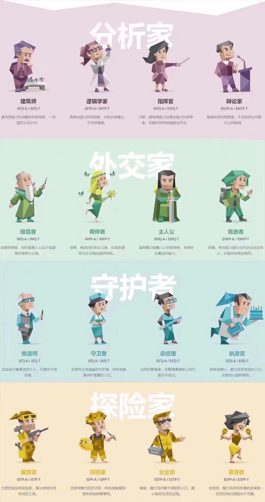{width="5.090277777777778in"
height="9.643062117235345in"}

#### Joke

##### [来我家洗碗](https://www.bilibili.com/video/BV1k8411h7Qi)

{width="1.991839457567804in"
height="1.916832895888014in"}

## 自己的一些理解

不知INFP、INTJ也容易抑郁。环境决定人格，在高压环境下，人会变得INTJ，如果无法承受失败就会变成INFP。

思考太多不要冥想，运动，听音乐都要好一点。

## [INFJ这种性格会越来越少吗？ 很不利的现象是什么意思？](https://www.zhihu.com/question/38664138/answer/905487278)

2019.11.20我一个隐居的加拿大老师就是infj。他一辈子都没谈过恋爱。一个人生活在多米尼加共和国的山上，通过网络和外界交流。他免费教了我六年的英语，法语，数学，占星学。我们互通了六年的电子邮件，总共四千多封信。他说孤独对于他来说就像是空气，是最重要的必需品。他就像是一个慈悲的苦行僧，虽然未曾谋面，却改变了我的一生。

## 群讨论

{width="2.0527777777777776in"
height="2.0527777777777776in"}

infp（悲→悲）/
intp（悲→摆）

### infp高阶群

猫菩提 21:06:58

## 测试

### [Realme情商测试](https://www.arealme.com/eq/cn/)

选题困难有趣

哈佛心理学博士Daniel Goleman（1946.3.7 - ）所设计，共10题。

### 测智网

#### [智商](https://iqeq.com.cn/baogao/2121574943401.html)

号码：19963817447 查询码：7447

{width="5.768055555555556in"
height="1.9395833333333334in"}

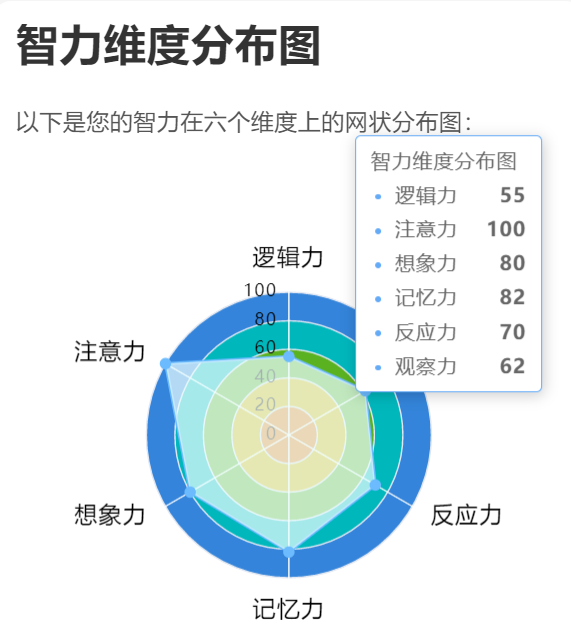{width="2.6597222222222223in"
height="2.857168635170604in"}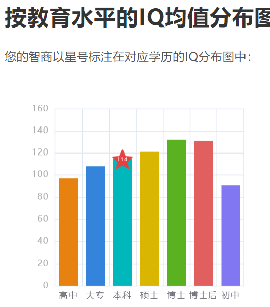{width="2.5471172353455818in"
height="2.8986111111111112in"}

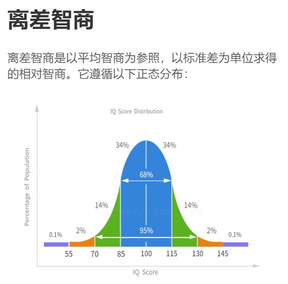{width="2.732260498687664in"
height="2.694443350831146in"}

##### [门萨智商测试](https://www.webhek.com/post/iq-test/)

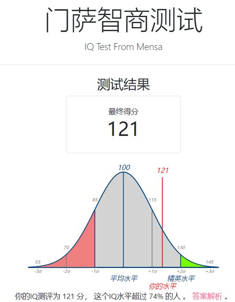{width="3.028242563429571in"
height="3.8916666666666666in"}

#### [MBTI-ISTP不准确](https://iqeq.com.cn/baogao2/2121582436561.html) 

号码：19963817447 查询码：0840s2

#### [真爱-迷恋测试](https://iqeq.com.cn/baogao2/2121585118427.html)

号码：19963817447 查询码：0840s2

#### [九型人格](https://iqeq.com.cn/baogao2/2121595614623.html)

号码：19963817447 查询码：6381

9号人格-和平型-一个和平者 && 4号自我型（感觉型）-一个浪漫主义者

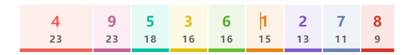{width="5.768055555555556in"
height="0.7895833333333333in"}

4w5

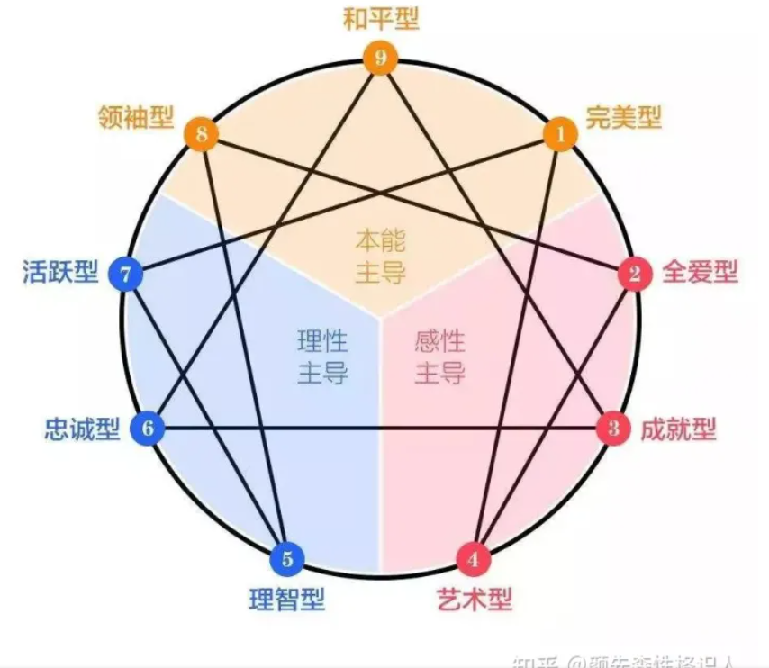{width="4.864923447069116in"
height="4.227083333333334in"}

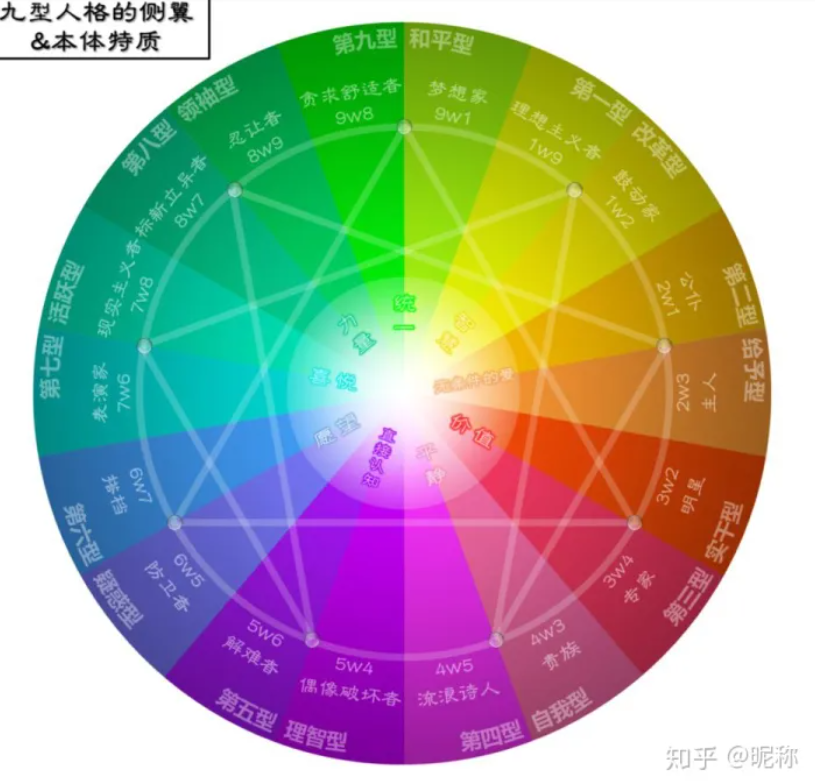{width="5.055555555555555in"
height="5.055555555555555in"}

**第四型――感觉型**/
第四型想要逃避生命平凡的事物，总爱突出自己与人不同。由于自己丰富的感性，许多时得不到别人的理解和认同，容易产生"孤独感"。若第四型减少对得不到的事物理想化及挑剔已得到的东西,便可以更珍惜眼前所拥有的一切。

**建议**

告诉别人你的感觉，而不要别人来猜

讨论时要提防自己陷入情绪化的反应

多点理智

不要过于沉溺过去

控制自己的情绪

**切记**

你要明白陷在自己的情绪里解决不了任何问题！

沉溺于过去的痛苦不如沉溺于对某事物的迷恋。

**第九型――和平型**

第九型因为不善表达自己，许多时侯没有自己的立场；但反而能设身处地为别人着想，接受、了解别人的意见。有时他们对事情含糊其词、有时又喜欢逃避现实。第九型突破的关键在于勇于讲出自己内心的想法和感受，不要抑制自己内心的愤怒，而变得"阳奉阴违"。

**建议**

如果你感到生气，请说出来

尽可能切中重点

多作响应，以免别人以为你拒绝

尽量避免过于太被动

多点危机感

**切记**

你要勇于面对自己，时刻关注自己的立场！

## [躁狂抑郁症](https://zhuanlan.zhihu.com/p/21603162)

**最核心的概括起来就一句话：转移注意力。**

我通过阅读转移自己的注意力。我从高中那小小的图书馆里（只有300平左右的校图书馆）搜罗各种自己感兴趣的书籍。看各种人物的传记，也看各种心理学和哲学类的书籍（不是那种民间的鸡汤心理学和哲学书，是名哲的原著，在此就不一一举例了）。甚至在抑郁袭来的时候会翘课去图书馆捧着自己喜爱的书籍，在一个角落忘我的读着。

期初并非兴趣使然，大部分是为了转移自己的注意力，不让自己陷在自身内部做过度无益的自省。那时候一张学生证只能借2本书，我经常拿着好几张同学的学生证去借书，一借就是十几本。在周围的同学们为了高考夜以继日的学习课内知识时，我却沉浸在另一个世界里。在同学的眼里，我无疑是个怪异的人。然而，那时候的我已经逐渐变得不介意了，因为我发现了一个新的世界，我整个身心被不可遏止的、深深的被更为精彩的事物吸引了。有了这个爱好后，我的抑郁情绪居然逐渐减弱，以至慢慢的消失。

就这样，高二高三两年时间，我几乎读遍了图书室里自己感兴趣的所有书籍。从这段经历里我悟出一个至今仍然受用的道理：

**越是心理健康的人在平日的思维习惯上就越对自我之外的事物感兴趣**------他是否能把对自我过分关注的向内的注意力里抽离开来，转而对自我之外的事物感兴趣上。消散了对自我的过度关注，所有的情绪问题自然就消失了。而且，我的整个性格和价值观变得更富于现世意义。

人的注意力都是有限的，向内的多了向外的就少了。我从来没见过哪个人开心的时候是把注意力转向自我内部的。更多的情况是，人在开心的时候注意力被自我之外的事物急剧的吸引，甚至达到一个忘我的境界。

**"人的很多念头就像天空的云朵，随时会来，随时会走"。**一旦你过度的注意它，容易就此陷进去。随后，一般人都有的正常心思被这种向内的注意力"妖魔化"，从此把你带进一个万劫不复的深渊里。大部分的抑郁症或神经症都是由此而起。

换句话说，我把"存在的事实"当成了"问题"，随后以"问题"的视角把问题不断放大，直至一个不可控制的局面。我们要做的是去拥抱这个事实而不是千方百计的把它当成问题逃避它。当你承认它拥抱它之时，你会发现，它对你的影响已经降到可以忽略的境地了。

## 抑郁症

2023-03-05 07:05:54

### [层级概率](https://www.bilibili.com/video/BV1eY411R7bT)

灵月巛心痕

中国压力比较大，小学抑郁症10%，初中30%，高中40%，大学四分之一左右，青少年重度抑郁率7.4%，每年十万人死于抑郁症自杀，大概百分之一的人会死在教育阶段，所以，可能你可能不是对号入座，是真的。

2022-12-01 21:50262

### 缓解情绪低落 随意坐公交到终点站

前进的卷毛

回复 /@初夏久不遇/_
:分享一个我很喜欢的缓解情绪低落的办法，不确定适不适合你，我喜欢休假的时候漫无目的地搭公交一直坐到终点站，因为休息日不用担心通勤时间，可以很放松地坐在车窗位置循环自己的歌单，看着窗外天马行空想很多，也可以说是发呆走神，感觉压抑的时候需要让自己的思维分散出去，潜意识会自己整理好，有的时候甚至会灵光一闪，想到很好的创意和想法，这个过程超级治愈！最近状态非常好，感觉自己正处在一种微妙的平衡中，对周围的包容度很高，得益于一周两次休闲的搭公交梳理，感觉自己对一切由内而外地释怀了，并且生出了很多不错的想法和创意，感觉自己充满能量，非常充实饱满，有一点像破冰发芽的感觉，有时间可以试试看。

2023-03-28 21:44 56

### 悟透症结所在 内心强过抑郁症

初夏久不遇/_

回复 /@前进的卷毛
:谢谢，任何能够取悦自己的事都是适合的。我已经走出来了，我想说以我的经验能够解决抑郁症的答案就是悟透症结所在，然后让内心强过抑郁症，不要惧怕痛苦。有时候摆脱痛苦可能是错误的方向，而强大到习惯这种痛苦，让这种痛苦不再对你造成困扰也是一种解决办法。

2023-03-29 00:05 15

### 重度抑郁 必须 开药

chenqianxiaozhu

过来人给你个建议，如果已经是重度抑郁，需要强迫自己定期去医院开药，按时服药。如果家庭有条件，可以强迫自己每周去见一次心理医生，在最重的期间，心理医生聊天虽然无法治愈疾病，但可以让自己感觉稍微好一些。我就是吃了七年的药，现在好了。你也加油。要相信，慢慢会好的。

2023-03-27 16:29 131

### 不要去看心理医生 直接不用动脑上班

水军和营销号的爹

不要去看心理医生，别问我为什么

2023-04-07 18:332

流云111111

不要看心理医生，找个不用动脑工作上班，工作氛围好你的心情也会好，还有不要吃西药可以吃中成药，挂中医专家号，多看喜剧多晒太阳多去热闹的地方

2023-04-08 17:41

6138891542

多运动，信我信我，有医学证明，例如跑步，一定的运动量，规律运动，很大程度能产生抗抑郁药物类似疗效

2023-04-13 00:341

### 善良而无法自拔 运动

增广之道

抑郁症都属于内心极其善良但是又无法自拔的人，不忍心伤害别人，留恋过去美好事物的一种外在体现。内心想突破但又不敢突破，想改变但是又心智不足无法短期改变现状。如此往复循环，我当时的方法是坚持街头健身，第五年的时候见好转，建议将自己的注意力转移到一项没兴趣的目标上去，并且持之以恒将其变为自己兴趣，和时间做朋友，和大自然做朋友，习惯后再慢慢和周围不熟悉的人交朋友，年轻人切记屏蔽黄赌毒，记住不以恶小而为之，不以善小而不为。坚持住小姑娘。

2023-04-03 15:03 177

## 没事千万别去医院，太多人不知道这些了

临溪月Moon

最后补充一条，没事千万别去医院，太多人不知道这些了，我是没办法，家人住院，必须要去照顾。必须要去的话，诚心持咒，或者干脆带个护身符。这事儿我也是遭过了才知道东西烫。太后怕。

2021-03-26 07:111

## [轻、中、重度抑郁分别有哪些表现？](https://www.bilibili.com/video/BV14P411g7dR/?spm_id_from=333.788.recommend_more_video.0&vd_source=f03b9d349cef8aff4a045d602d8a1d82)

2022-11-15 17:57:51

### 轻度抑郁症

1、情绪低落、心情沉重食欲减退等状况一直特续

2、对曾经十分喜欢的事情也失去了兴趣无论如何他无法恢复到原有的健康状况

在

3、肠胃不适、恶心、体重减轻、性欲减退

4、生活中喜欢安静浊处，远离热闹人群

5、睡眠障碍，多数患者伴有失眠，心慌、胸闷、憋气

### 中度抑郁症

1、总感觉自己容易疲劳精力不够就像一个泄了气的皮球，各方面能力都在快速下降悲伤、失望等情绪会进一步加重。

2、懒散，对任何事都感觉不到快乐，在做事情时注意力总不能集中。

思考能力，判断力也在持续下降。

3、经常紧张焦虑，犹豫不决。也会感觉特别自卑总认为别人对自己存在恶意。

4、说话变慢，言语少。时有答非所问的情况，躯体动作较少，可长时间保特姿势不变。

5、非常痛苦，甚至伴有轻生念头。但会因为仅存的理智控制，而不会做出傻事。

### 重度抑郁症

1、非常脆弱，深深的无力感，不能进行正常活动。

2、会出现幻觉、妄想等精神疾病综合征，一般是幻听、自罪、妄想等。

3、主观伴有强烈的自责、无用感对过去和将来存有歪曲的认知。过分贬低自己，逐渐认为自己罪孽深重，将受到惩罚。

4、脑子反应非常的迟钝，不愿出门，与家人和朋友也无交流。

5、严重者可不语不动，拒绝进食，无法完成日常生活。自伤、自杀念头强烈。

仿佛这样才能感觉到自己的存在。

大虾今天更了吗-

注意力不能集中，脑子迟钝也太真实了，会想会有飞机突然坠毁砸死我

2022-11-17 00:08 235

OkazakiUshio

我也是这样，有时候洗碗，洗着洗着脑子想到别处去了，然后回过神发现想了好几分钟了。迟钝是我在考虑一个东西先后顺序的时候或者事情的小细节时，明明知道却老是走神忘记啥的/[捂眼/]

2022-11-17 00:51 15

## [不要开导抑郁症患者，开导等于否定！我教你如何引导他们走出困境](https://www.bilibili.com/video/BV1SL411x7g5)

2021-09-16 06:40:00

🧠引导比开导更有效

🤝 接受抑郁症患者的感受

🏋️‍♀️ 建立积极行动计划

本视频强调了不要试图开导抑郁症患者，而是要接受他们的感受并引导他们积极思考和行动。建议与抑郁症患者建立信任，让他们自行找到解决问题的方法，并制定积极的行动计划来摆脱负面情绪和负面思维。

### 肯定想法和情绪、能力、价值

1.肯定你的想法和情绪。表示人就是会有这种想法，你是有同类的，你是有依靠和后盾的，你是可以理解并且值得理解的。

2.肯定你的能力，并举出有力的例子和事实。比如你曾经克服过的困难。

3.肯定你的价值。你是值得信任的。你信任我，我信任你，所以你信任你自己。

以我个人角度来看，up主的方法适用于不服输和不曾放弃过的人。引导你相当于让你找回自信的自己，所以这个方法是有用的。

但是对于放弃过的人，他已经迷路了很久，早就忘记自己的家是什么样子的，再怎么引导，我也不能帮他找回自我。这个时候要寻求专业人士的帮助，比如心理医生。

另一位up主心理满曾科普过，情绪、想法和行为是互相影响的。情绪影响想法，想法影响行为，行为影响情绪。因此苦思冥想就像钻牛角尖，只是不断地徘徊在原地而已。所以这时要做的事如up主所说，坚持做简单的事情，这其实也肯定了自己，我能做到一些事情的，我是有价值的。直到情绪过去，才能好好思考。

2021-09-18 14:30 524

人間無常

我鼓励一个抑郁症朋友 结果好像把他捧杀了/[囧/]他现在不可一世 目中无人

2021-12-06 19:53 24

### 不要以为开始一段关系能治愈患者

居住在东海之滨的咸鱼

还有不要以为开始一段关系(友情，爱情)能治愈(医学层面上的那种)患者，你不是专业人士，你日常中的行为很有可能伤害到他

2021-09-18 14:03 184

### 积极的行动

翊恒的书苑

经常有人问我，克服抑郁最好的方法是什么？

我的答案永远只有5个字：积极的行动！

做力所能及的事情，而不是什么都不做！

2022-01-21 19:58 8

kix9812

抑郁症无法彻底摆脱，因为抑郁症患者身患抑郁症会让患者无法认清自我，解决抑郁症只有向心中的堕落的自己重新振作起来，打败那长时间困扰自己的铁墙，即使做每件事情时自己第一时间都觉得自己不行，不想做，不敢做，"算了"这种想法，这时候，如果做了与这些做法相反的举动，那么就算是打败了困难，让自己压力减小点，让自己重新振作起来，才会让自己重返新生活，摆脱了过去那个令自己讨厌的自己。

2022-11-30 19:09 6

### 啥都不说 吃好吃的，玩好玩的

我爱螺plus

我朋友是啥话都不说，就带我去吃好吃的，带我去玩好玩的，虽然我不感兴趣，很多都不去，但是他会继续尝试找让我感兴趣的吃的，玩的。

2021-09-18 02:53 369

小鳕生

回复 /@OwO想当up但没能力 :难办 但我还是说个事例吧 在得知一个朋友重抑后
我也没问原因 也没说过什么 我就拉着他玩游戏 发点有意思的视频
偶尔抽出时间去看看他（当时高三 能抽出时间的机会太少了QAQ
）其实合适的陪伴就能帮助很多了 不过我这个例子仅供参考
因为朋友曾经喜欢玩游戏 而且稍稍的提一句 陪伴抑郁症要做好充足心理准备

2023-04-11 11:201

### 能帮我干点活再自尽吗

谜之醒悟

我想起了以前看的一个故事，大概内容是老爷爷看见一个年轻人觉得生活没有意义想自尽，老爷爷就对他说年轻人你能帮我干点活再自尽吗，然后他和青年一起花了很久的时间盖了一座房子，开垦了一片地，还种了一园子的葡萄。最后老人说，谢谢你的帮助，年轻人，你现在还想寻死吗？年轻人回道：现在不想了。后来他在自己建造的这片庄园里度过了平凡而快乐的一生。

2021-09-22 17:43 349

翊恒的书苑

当你迷茫到不知所措的时候，记住，眼下能做的事情，就是最重要的事情

2022-01-21 19:59 28

Panda0108

可是我抑郁的根源就是干活，如果我抑郁的时候别人让我干活，我可能会让他先死

2023-02-02 21:52 1

### 普通人只能帮一点 医生能帮很多

摊牌了我是色胚

普通人能帮，只能帮一点。医生能帮，可能帮很多。我的观点，抑郁是身体疾病。

2021-09-30 01:397

镜音铃来了哦

回复 /@humunculusfan :没错，是精神疾病心理疾病，关键是让ta解开心结

2022-04-10 20:33

夏コ

其实不只是抑郁症患者，这是对每个人都应该做到的，不要把自己的逻辑强加给别人，这是对所有人的尊重

2022-01-24 00:5814

## [幻听骂她](https://www.bilibili.com/video/BV1CM411H7rQ)

腐者菲也

我舍友也这样，她一个人坚持了好几年都没有跟我们讲，她办休学的时候一直幻听我们在骂她，我当时都不知道，还自以为很好心地一直在跟她聊天安慰她，结果给她带来了很大的心里压力，她害怕得不敢回来拿行李，直到看到一个舍友哭了，她才反应过来我们真的很舍不得她

2023-03-28 11:24 1238

鱼铲酱

因为真的非常真实 我曾经因为幻听到别人骂我差点上去掐那个人 但是克制住了
事后回想起来就觉得很可怕

2023-04-05 18:16 38

## [高校心理咨询机构已沦为监控学生的"东厂"？！](https://telegra.ph/Lacan%E5%BF%83%E7%90%86%E9%AB%98%E6%A0%A1%E5%BF%83%E7%90%86%E5%92%A8%E8%AF%A2%E6%9C%BA%E6%9E%84%E5%B7%B2%E6%B2%A6%E4%B8%BA%E7%9B%91%E6%8E%A7%E5%AD%A6%E7%94%9F%E7%9A%84%E4%B8%9C%E5%8E%82---%E4%B8%AD%E5%9B%BD%E6%95%B0%E5%AD%97%E6%97%B6%E4%BB%A3-04-19-2)

中国数字时代April 19, 2023

然而，人们在关注高校心理咨询机构"东厂化"甚至因此指责高校心理咨询师不专业的同时，往往忽视了故事的另一面。

事发后，苏某家属主张XX大学对于苏某的自杀存有过错，认为XX大学在新生心理健康普查时明确知悉苏某患有中度心理疾病，并且确切得知其持有自杀药物和有自杀的行动，却未对苏某采取任何有效措施予以阻止，也未将上述心理问题和行为告知学生家属，从而导致苏某死亡的悲剧，XX大学对此应承担主要责任。

据此，苏某家属向法院请求:判决XX大学赔偿苏某家属死亡赔偿金、丧葬费879759.2元；2.判令XX大学支付苏某家属精神损害抚慰金500000元；3.判令XX大学向苏某家属支付为处理苏某丧葬事宜而支付的交通费、住宿费、误工费等合理费用217534元；4.判令XX大学承认在处理苏某自杀事件过程中存在严重不当并书面向苏某家属赔礼道歉；5.判令诉讼费用由XX大学承担。

而XX大学心理咨询中心主任注册督导师李某作为被告方，在案件审理中被要求出具相关证明，陈述其在苏某自杀事件中的履职情况。

很多人不知道的是，当学生因心理问题发生自伤、自伤事件时，高校心理咨询师（机构）是首要的问责对象。

这就导致高校心理咨询师（机构）在面对有心理问题（疾病）的尤其是有自杀自伤、风险学生时，首先考虑的并不是如何为学生提供专业帮助，而是如何自保。

尤其是涉及学生自伤、自杀的危机个案，严重的"责任焦虑"导致高校心理咨询师（机构）更倾向于选择突破伦理以规避风险。

此前，搜狐旗下极昼工作室发表过一篇题为《高校心理咨询师的伦理困境》的文章，通过一些具体的事例，揭露了高校心理咨询师工作中面临的诸多困境。

**一方面是高校心理咨询师（机构）被指责设置不够专业频频泄密"监控"学生；另一方面则是学生因心理问题出现自伤、自杀事件时，又会被家属指责未尽到告知义务甚至被告上法庭。**

曾有高校心理咨询师向我们吐槽：

十年的高校心理咨询专职工作，咨询量少的可怜。省级教育管理部门的领导公开场合说专职老师去参加培训是错误选择，哪来那么多培训要参加，哪个省就不说了，也明确说心理咨询中心专职老师咨询不是主业。所以，你看，打杂就是必然了缺乏系统督导，缺少专业培训，行政事务一大堆，每次学生预约咨询和行政工作冲突，一定是被要求和学生另外约时间，长此以往，恶性循环。

## [爱吃辣的人，有什么特殊的心理呢？](https://zhuanlan.zhihu.com/p/357968731)

[发布于 2021-03-18 09:32](https://zhuanlan.zhihu.com/p/357968731)

**先提一个问题，人喜欢吃辣是天生的吗？**

**答案是否定的。**至少从上个世纪八十年代开始，大量的调查和研究结果都表明，人们并非天生喜欢吃辣，即便是在嗜辣的地区，对辣味的喜好也不是与生俱来的，而是后天获得的，从不喜欢到喜欢存在一个明显的喜好反转。

至于人为什么会喜欢吃辣，有很多理论因素的解释，比如环境因素，良性自虐理论等等。但由于不确定其核心因素究竟是什么，所以这方面就不多说了。咱们主要说说吃辣与心理的关系吧。

吃辣与心理的关系大概分为三个方面，即感觉寻求（大致就是追求刺激，后面会解释）、冒险行为、攻击和易怒。

### 越喜欢吃辣越喜欢体验新鲜刺激

首先是感觉寻求，所谓感觉寻求就是指倾向于参加刺激性强、新颖性高的活动，说白了就是体验那些新鲜刺激的内容。
研究发现感觉寻求是所有性格特点中与吃辣联系最密切的。几乎所有研究都表明二者之间存在显著的正相关，**也就是越喜欢吃辣、吃辣越频繁的人，越倾向于体验那些新鲜刺激的内容。**
2017年国外的一项研究发现，在商场的餐厅里面，被试吃的薯条越辣，在之后的消费行为中更倾向于多样化的选择。

### 冒险行为

其次是冒险行为。2016年国内外的多项研究都发现，吃辣和冒险行为有显著正相关，也就是吃辣的人更倾向于选择那些冒险行为。需要特别强调的是，这里的吃辣是指行为，而不是喜好。简单点说就是，人吃了辣的食物，接下来冒险行为就增多了，和这个人喜不喜欢吃辣没关系。

2016年国外的一项研究显示，让被试分别食用辣味面包和原味面包，然后进行赌博游戏，结果前者比后者更倾向于采取高风险策略。（这是不是告诉我们在做重大决定之前，少吃点辣啊。）

### 攻击和易怒

最后是攻击和易怒。2017年印度的一项研究发现，吃辣越频繁的人，在攻击特质方面越明显。2013年我国的一项研究表明，对辣味的偏好与易怒性格有关，容易愤怒的人往往更喜欢吃辣。

2017年国外的阅读研究发现，吃辣后人们更容易觉得故事中人物具有攻击性。而且还进一步发现，即便不吃辣，而仅仅是暴露在辣味的信息下，比如图片、文字等，人们就会对故事中人物的攻击性更加敏感。当然，图片的效果比文字更加明显一些。

总结一下：

1、越喜欢吃辣，越喜欢体验那些新鲜刺激的内容。

2、刚吃过辣的人，会有更多的冒险行为，也更倾向于选择高风险策略。

3、比较容易愤怒的人，往往更喜欢吃辣；刚吃过辣的人，更容易具备攻击性。

## 人格障碍筛查测试PDQ-4

### [真免费人格障碍筛查测试PDQ-4-心理测试](https://www.lgpc.com.cn/2/606.html)

[保存到本地的测试报告](file:///F:/Files/Books/Psychology/人格障碍筛查测试PDQ-4.html)

分数1-10

强迫10 分裂型8 分裂样6 偏执5 抑郁5 反社会3

### [[PDQ-4修正评分版110924](https://www.docin.com/p-726952977.html) doc文章]{.ul}

2013-11-17 上传14页

偏执：1+1+1+1+1+0+1=6>=4

分裂样：1+1+1+1+1+1+1=7>=4

分裂型：1+1+1+1+1+1+0+1+1=8>=5

反社会：1+0+0+1+1+1+1+0=5>=3

~~边缘：1+0+1+0+0+1+1+0+0=4/<=5~~

~~表演：1+1+0+0+0+1+0+1+0=4/<=5~~

~~自恋：0+1+1+0+1+0+0+0+0+1=4/<=5~~

回避：1+1+1+1+1+0+1+0=6>=4

~~依赖：0+0+1+0+0+0+0+0=1/<=5~~

强迫：0+1+1+1+1+1+1+1+0+1+1=9>=4

~~被动攻击：0+0+0+1+0+1+1=3/<=4~~

抑郁型：1+1+1+1+0+1+1=6>=5

~~掩饰：0+0+0+0+0+1+1=2/<=5~~

偏执、分裂样、分裂型、反社会、回避、强迫、抑郁型

得分排序：强迫、分裂型、分裂样、偏执、回避、抑郁型、反社会

### [强迫型人格障碍 默沙东](https://www.msdmanuals.cn/home/mental-health-disorders/personality-disorders/obsessive-compulsive-personality-disorder)

**强迫型人格障碍的普遍特点是被有序，完美主义和控制（没有灵活性或效率的空间）所占据，最终干扰任务的完成。**

#### 对工作的影响

此病患者专注于规则、细节和组织问题，因此他们会失去项目或活动的重点。他们反复检查错误，并注意每个细节。他们不会妥善利用时间，经常把最重要的任务留到最后。他们过于专注细节并确保一切完美，这可能会无限期推迟任务的完成。他们并未意识到自己的行为对同事的影响。当专注于一项任务时，他们可能忽略其生活的所有其他方面。

由于强迫型人格障碍患者希望以特定方式完成所有事情，他们难以委派任务并与他人合作。在与他人合作时，他们可能会制作详细的列表，列明应如何完成任务；如果同事建议使用另一种方式，他们会变得不快。即使已经落后于时间安排，他们也可能会拒绝帮助。

强迫型人格障碍患者倾向于对工作和产出十分投入。他们的动机不是迫于生计。

#### 对生活其他方面的影响

由于他们过于致力于工作，而忽视了休闲活动和人际关系。他们可能认为自己没有时间放松或与朋友一起外出。他们可能会过久地延迟休假，以至于根本不休假；或者他们可能认为必须带上工作，以免浪费时间。如果与朋友一起共度时间，往往是正式的组织活动（比如运动）。业余爱好和娱乐活动被视为需要组织规划和努力达到高超水平的重要任务。他们的目标是达到完美。

这些人提前制定详细的计划，不希望考虑更改。他们无休止的僵化态度可能会让同事和朋友受不了。

感情的表达也受到严格控制。此病患者可能会以正式、僵硬或严肃的方式与他人建立关系。通常，他们只在想到完美的话语之后才会说话。他们可能专注于逻辑和智力，不能忍受情绪或表达行为。

#### 其他症状

有强迫型人格障碍的人对道德，伦理和价值观问题可能过分热衷，挑剔和僵化。他们对自己和他人应用严格的道德原则，并且苛刻地自我批评。

这些人严格保持对权威的恭敬，坚持严格遵守规则，没有情有可原的例外情况。

对于此病患者而言，丢弃破旧或无价值的物品（例如破损的家电），即使是没有感情价值的物品，也是非常困难的。

强迫型人格障碍患者可能不愿意花钱，他们认为钱应该存起来应对未来的灾难。

#### 诊断

医生如需诊断强迫型人格障碍，当事人必须持续执着于秩序，完美主义和对自我，他人和情境的控制，至少有以下
4 点：

1、他们执着于细节，规则，时间表，组织和列表。

2、他们试图事事完美的尝试会干扰完成任务。

3、他们非常热衷于工作和生产力（不是因为经济需要），导致忽视了休闲活动和朋友。

4、在道德和道德问题和价值观方面，他们过于认真，苛刻，缺乏灵活性。

5、他们拒绝扔掉破旧或毫无价值的物品，即使那些没有感情价值的物品。

6、他们不愿意委托他人或与其他人一起工作，除非他人同意按照患者的意愿完成任务。

7、他们不愿花钱在自己和他人身上，因为他们认为钱应该为应付未来的灾难而存起来。

8、他们僵硬而固执。

### [分裂型人格障碍 默沙东](https://www.msdmanuals.cn/home/mental-health-disorders/personality-disorders/schizotypal-personality-disorder) 

医生如需诊断分裂型人格障碍，患者必须有强烈的不适感，几乎没有密切关系，思维和行为怪异。此外，患者至少有下列情况中的
5 个：

1、牵连观念

2、奇怪的信念或奇幻思维

3、扭曲的感知

4、奇怪的思想和言论

5、怀疑或偏执的想法

6、不适当的或有限的情绪表达

7、奇怪、偏离或奇特的行为和/或外貌举止

8、缺少亲密朋友或知己，除了一级亲属

9、过度的社交焦虑，不会随熟悉程度而减轻，主要与偏执恐惧有关

此外，症状早在成年早期就已经开始了。

### 

[分裂样人格障碍
默沙东](https://www.msdmanuals.cn/professional/psychiatric-disorders/personality-disorders/schizoid-personality-disorder-scpd)

#### ScPD的病因学

童年期照顾者情感冷漠、忽略或疏离，导致人际关系的感受不满意，可能与分裂样人格障碍的发生有关。

#### 诊断

分裂样人格障碍：（A与B都必须符合才行，才可确定为该人格障碍）

A. 定义及症状至少4项都满足才可以说A成立。

定义：一种脱离社交关系，在人际交往时情感表达受限的普遍模式，起始不晚于成年早期，存在于各种背景之下，表现为以下4种或更多症状。

1、既不渴望也不享受亲近的人际关系，包括成为家庭的一部分。

2、几乎总是选择独自活动。

3、对与他人发生性行为兴趣很少或者不感兴趣。

4、很少或几乎没有活动能够令其感到乐趣。

5、除了一级亲属外，缺少亲密的朋友或知己。

6、对他人的批评或赞扬都显得无所谓。

7、表现为情绪冷淡，疏离或者情感平淡。

B.并非仅仅出现于精神分裂症，伴精神病性的又相或者抑郁障碍或其他精神病性或孤独症（自闭症）谱系障碍的病程之中，也不能归因于其他躯体疾病的生理效应。临床表现：特别难以表达愤怒、呆板，没有情绪反应。（要考虑文化环境因素，从封闭农村到大城市的适应过程。）

发布于 2022-12-15 08:53

### [偏执型人格障碍 默沙东](https://www.msdmanuals.cn/home/mental-health-disorders/personality-disorders/paranoid-personality-disorder)

**偏执型人格障碍的特点是普遍存在对他人的不合理的不信任和怀疑，包括将他们的动机解释为敌对或有害。**

医生如需诊断偏执型人格障碍，当事人必须持续不信任和怀疑其他人，至少有以下
4 点：

1、他们怀疑其他人正在剥削，伤害或欺骗他们，而没有充分的理由。

2、他们执着于对朋友和同事的无理怀疑，质疑他们的可靠性。

3、他们不愿意向别人倾诉，以免泄露的信息今后对自己不利。

4、他们将无害的评论或事件误解为隐藏着贬低，敌意或威胁意义。

5、如果他们认为自己受到了侮辱，受伤或被轻视，他们就会怨恨。

6、他们很快认为他们的性格或声誉遭到了攻击，并且愤怒地反应或反击。

7、他们一再怀疑他们的配偶或伴侣是不忠诚的，尽管他们没有足够的理由这样怀疑。

此外，症状早在成年早期就已经开始了。

### 反社会人格 默沙东

#### [李玫瑾谈反社会人格](https://www.bilibili.com/video/BV1UZ4y1r7Ae?t=685.3)

反社会人格高智商非常多，对家庭、女人、孩子、照顾老人没兴趣。不一定犯罪。

如果就是调到就是假如说自己家的孩子，出现了不良行为，又发现它具有反社会人格特点。这是一种病，就是反社会人格它就是一种人格障碍。人格障碍就是说它会拢乱人的生活，和周围人的生活。但是呢不能用任何医疗手段，来解决的都叫人格障碍。

## 冥想

1.找一个安静的地方盘腿而坐，最好坐在枕头上以减少背部的压力，深呼吸。

2.闭上眼睛，倾听内心的声音和盘旋脑中挥之不去的想法。你的想法可能停留在工作、家庭、电视机或者其他事物。可以把这些想法当做你"思维猴子"的喋喋不休。不要试图停止这些窃窃私语，至少现在不行。现在你要做的就是观察思维的跳跃，从一个想法到另一想法。你需要每天做五分钟，持续七天。

3.一周后，把注意力转移到你的"公牛思维区"
，这指的是你大脑中思维较慢、较安静的一部分区域，可以感受周围环境，并不为事物赋予意义。它只是看、听和感受。大多数人只有在经历激动人心事件的那刻才能真正感受到"公牛思维区"，在那刻"思维猴子"暂时停止行动。但是，即使有时你的"思维猴子"不断地催促你、逼迫你，你的"公牛思维区"仍然存在，缓慢深刻地思考着。

4.一旦你感到了"公牛思维区"的存在，就让它开始平息你的"思维猴子"。我的方法是想象思维猴子因为看着公牛沿路缓慢前进而昏昏欲睡。就算猴子总是醒来也别沮丧，因为猴子毕竟是猴子，所以只能像只猴子一样难以静下来。尽管猴子总是不断抗议，但你会发现它也会停止活蹦乱跳，不再制造恼人的噪音。

5.随着猴子渐渐平静，继续把注意力转移到公牛区域。你的一呼一吸都非常缓慢，你会感受到皮肤周遭的空气，也会感到血液在身体中流淌。如果睁开眼睛，世界将会焕然一新，有时甚至有些陌生。窗户都好像变成了充满光的方形物体一样。你不需要开关窗户、打扫或修理它。窗户就在那里不动，你也就在那里。

6.虽然到这一步会花费一些时间，但如果你感受到冥想中时间过得飞快，冥想开始和结束时间间隔无几，你就会意识到自己在运用正确的方法冥想。到达这一步的时候，你就应该逐步增加每日冥想的时间。奇异的是，无论你冥想的时间多长，时间都像静止了似的。
就在那里。

6.虽然到这一步会花费一些时间，但如果你感受到冥想中时间过得飞快，冥想开始和结束时间间隔无几，你就会意识到自己在运用正确的方法冥想。到达这一步的时候，你就应该逐步增加每日冥想的时间。奇异的是，无论你冥想的时间多长，时间都像静止了似的。
