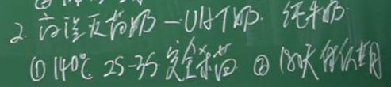

## 中国居民膳食2017-2018标准
[本地文件夹](F:\Files\My_Library\Important_thoughts\health)

### 第1部分：宏量营养素
表1 中国居民膳食能量需要量（EER）
[中国居民膳食营养素参考摄入量第1部分：宏量营养素.pdf page8](file:///F:/Files/My_Library/Important_thoughts/health/%E4%B8%AD%E5%9B%BD%E5%B1%85%E6%B0%91%E8%86%B3%E9%A3%9F%E8%90%A5%E5%85%BB%E7%B4%A0%E5%8F%82%E8%80%83%E6%91%84%E5%85%A5%E9%87%8F%E7%AC%AC1%E9%83%A8%E5%88%86%EF%BC%9A%E5%AE%8F%E9%87%8F%E8%90%A5%E5%85%BB%E7%B4%A0.pdf)


[中国居民膳食营养素参考摄入量第1部分：宏量营养素.pdf page9](file:///F:/Files/My_Library/Important_thoughts/health/%E4%B8%AD%E5%9B%BD%E5%B1%85%E6%B0%91%E8%86%B3%E9%A3%9F%E8%90%A5%E5%85%BB%E7%B4%A0%E5%8F%82%E8%80%83%E6%91%84%E5%85%A5%E9%87%8F%E7%AC%AC1%E9%83%A8%E5%88%86%EF%BC%9A%E5%AE%8F%E9%87%8F%E8%90%A5%E5%85%BB%E7%B4%A0.pdf)
表2 中国居民膳食蛋白质参考摄入量


表3 中国居民膳食脂肪、脂肪酸参考摄入量和可接受范围
[中国居民膳食营养素参考摄入量第1部分：宏量营养素.pdf page10](file:///F:/Files/My_Library/Important_thoughts/health/%E4%B8%AD%E5%9B%BD%E5%B1%85%E6%B0%91%E8%86%B3%E9%A3%9F%E8%90%A5%E5%85%BB%E7%B4%A0%E5%8F%82%E8%80%83%E6%91%84%E5%85%A5%E9%87%8F%E7%AC%AC1%E9%83%A8%E5%88%86%EF%BC%9A%E5%AE%8F%E9%87%8F%E8%90%A5%E5%85%BB%E7%B4%A0.pdf)


表4 中国居民膳食碳水化合物参考摄入量和可接受范围
[中国居民膳食营养素参考摄入量第1部分：宏量营养素.pdf page10](file:///F:/Files/My_Library/Important_thoughts/health/%E4%B8%AD%E5%9B%BD%E5%B1%85%E6%B0%91%E8%86%B3%E9%A3%9F%E8%90%A5%E5%85%BB%E7%B4%A0%E5%8F%82%E8%80%83%E6%91%84%E5%85%A5%E9%87%8F%E7%AC%AC1%E9%83%A8%E5%88%86%EF%BC%9A%E5%AE%8F%E9%87%8F%E8%90%A5%E5%85%BB%E7%B4%A0.pdf)


### 第2部分：常量元素
[中国居民膳食营养素参考摄入量第2部分：常量元素.pdf page6](file:///F:/Files/My_Library/Important_thoughts/health/%E4%B8%AD%E5%9B%BD%E5%B1%85%E6%B0%91%E8%86%B3%E9%A3%9F%E8%90%A5%E5%85%BB%E7%B4%A0%E5%8F%82%E8%80%83%E6%91%84%E5%85%A5%E9%87%8F%E7%AC%AC2%E9%83%A8%E5%88%86%EF%BC%9A%E5%B8%B8%E9%87%8F%E5%85%83%E7%B4%A0.pdf)


### 第3部分：微量元素
[中国居民膳食营养素参考摄入量第3部分：微量元素.pdf page6](file:///F:/Files/My_Library/Important_thoughts/health/%E4%B8%AD%E5%9B%BD%E5%B1%85%E6%B0%91%E8%86%B3%E9%A3%9F%E8%90%A5%E5%85%BB%E7%B4%A0%E5%8F%82%E8%80%83%E6%91%84%E5%85%A5%E9%87%8F%E7%AC%AC3%E9%83%A8%E5%88%86%EF%BC%9A%E5%BE%AE%E9%87%8F%E5%85%83%E7%B4%A0.pdf)


### 第4部分：脂溶性维生素
[中国居民膳食营养素参考摄入量第4部分：脂溶性维生素.pdf page6](file:///F:/Files/My_Library/Important_thoughts/health/%E4%B8%AD%E5%9B%BD%E5%B1%85%E6%B0%91%E8%86%B3%E9%A3%9F%E8%90%A5%E5%85%BB%E7%B4%A0%E5%8F%82%E8%80%83%E6%91%84%E5%85%A5%E9%87%8F%E7%AC%AC4%E9%83%A8%E5%88%86%EF%BC%9A%E8%84%82%E6%BA%B6%E6%80%A7%E7%BB%B4%E7%94%9F%E7%B4%A0.pdf)

### 第5部分：水溶性维生素
[中国居民膳食营养素参考摄入量第5部分：水溶性维生素.pdf page](file:///F:/Files/My_Library/Important_thoughts/health/%E4%B8%AD%E5%9B%BD%E5%B1%85%E6%B0%91%E8%86%B3%E9%A3%9F%E8%90%A5%E5%85%BB%E7%B4%A0%E5%8F%82%E8%80%83%E6%91%84%E5%85%A5%E9%87%8F%E7%AC%AC5%E9%83%A8%E5%88%86%EF%BC%9A%E6%B0%B4%E6%BA%B6%E6%80%A7%E7%BB%B4%E7%94%9F%E7%B4%A0.pdf)
表 1 中国居民膳食水溶性维生素参考摄入量


表 1 （续 1）


表 1（续）


### 维生素总览
[中国居民膳食维生素推荐摄入量清晰完整版可打印 - 知乎](https://zhuanlan.zhihu.com/p/392095332)


## Vitamin

### [维生素b每天摄入量，每种不超过多少？ - 知乎](https://www.zhihu.com/question/60292894)
[编辑于 2022-10-14 17:38](https://www.zhihu.com/question/60292894/answer/355813799)

下面这张表来自《中国居民膳食营养素参考摄入量（2013版）》，里面UL一栏是最高耐受量（每日摄入上限），RNI是推荐摄入量（每日摄入下限）：
1000μg微克 = 1mg毫克
10mg/d表示每天10毫克。


从图中可知，目前只有B6（吡哆素）、B9（叶酸）和B3（烟酸）有每日最高摄入量。B族维生素为水溶性维生素，很难在体内存留，所以通常不会出现过量现象，除非大量服用保健品补充剂。

#### 维生素B1-12和中文名对应

[发布于 2020-10-11 17:49](https://www.zhihu.com/question/60292894/answer/1518369713)

[发布于 2022-12-29 10:30](https://www.zhihu.com/question/60292894/answer/2820600487)

### 维生素C 可大量食用

[口服与注射的不同](http://med.china.com.cn/content/pid/202705/tid/1026/iswap/1)

维生素C是水溶性的，过多摄取的部分会通过尿液排出。维生素C的血浆浓度约400mg/天的情况下，处于饱和状态。因此，即使通过口服大量摄取维生素C，血液浓度也不会超过一定的数值。

但是，直接静脉注射大量的维生素C，会有比口服摄入量多十倍的维生素C进入血管。这样会提高血液中维生素C的浓度，直接将维生素C送往需要的各个器官。

我住院时是注射的2ml: 500mg维C+250ml的5%葡萄糖溶液，用于快速修复。

如果因为各种原因饮食量受限，又不想麻烦营养师，可服用含有多种维生素的制剂，成分越全越好。需要注意的是，保健品制剂维生素的含量是按国家规定的标准计量添加的，这个量是按进食量减少而不是完全禁食后的需求量设置的。因此，如果完全禁食，按说明书上规定的服用量是不够的。或请营养师或医生给个建议。

在特殊情况下，例如大运动量时，强力节食减肥时，可口服消耗大的维生素，例如维生素c、维生素b1、2、6等等，这些是水溶性维生素，适当多吃一点没问题，多余的可从尿中排泄。

### [维生素a、e 不可大量食用](https://www.zhihu.com/question/291342192/answer/475356902)

但脂溶性维生素例如维生素a、e，不能尿出，剂量过大可积蓄在体内，积蓄多了可引起中毒。编辑于
2018-08-22 18:28

### [常吃外卖？偏食挑食？哪些人要补充维生素及矿物质？](https://zhuanlan.zhihu.com/p/269896156)

根据 2012 年的调查结果显示，国人的维生素 A、维生素 B1、维生素 B2、维生素
C、维生素 E
摄入量明显低于推荐值，摄入不足风险的比例均较高，钙摄入量低于平均需要量的人群占
96.6%，约 35.6%
的居民存在锌的摄入不足风险，铁的摄入量存在摄入不足风险的人数占 11.5%。


[发布于 2020-10-29 17:14](https://zhuanlan.zhihu.com/p/269896156)

### [VB VC水溶多了尿排 VD VA脂溶 多了中毒](https://www.zhihu.com/question/59193930/answer/163734796)

[**寒翊**](https://www.zhihu.com/people/5c61627c82d8f07a774bfeba365d5820)

维B和维C是水溶性的，每天都需要补充，吃的多了，多余的会随着尿液排除。不用担心吃多了。但是会不会互相反应这个不清楚。直觉告诉我应该不会吧

2017-05-03

[**墩墩**](https://www.zhihu.com/people/58689b017bfea2a0ab1158376e253408)
作者

vc每天额外补200mg 完全在人类代谢能力范围内 吃几个橘子橙子
剂量完虐这俩药片...... vb族的话 如果吃后尿液在两三次变回到正常颜色
那就没啥问题...... 如果有吃其他药物 请与医师药师沟通......

2017-05-03

[**三月料峭**](https://www.zhihu.com/people/509746889b489b3adea07cd33fb36635)

只是维生素C或者B族维生素的话没有关系，这两种维生素是水溶性维生素，吃多了人类可以排泄掉的。维生素D或者维生素A就不能多吃了，因为这俩是脂溶性维生素，吃多了比较难排泄，容易蓄积在肝脏，吃多了会中毒。
2017-05-20

### 成人维生素D缺乏?

#### 缺乏VD人群

总的来说，容易缺乏维生素D的有这几类人群：户外活动少的人，如长期呆在室内的老人、在室内工作的白领、夜班人员、宅男宅女等，纯素食者。

**超重或肥胖。**身体脂肪过多会降低血液维生素D水平。其原因是维生素D具有脂溶性特点，身体脂肪越多，就越容易被"稀释"。超重或肥胖人群，可能需要补充更多的维生素D。

**骨头疼痛。**缺乏维生素D的成年人，更容易发生骨骼和肌肉疼痛，冬天尤其如此。**头部爱出汗。**头部爱出汗是维生素D缺乏的典型症状。

**肠道出现问题。**美国国立卫生研究院研究发现，克罗恩氏病以及腹腔或[肠炎](https://www.zhihu.com/search?q=肠炎&search_source=Entity&hybrid_search_source=Entity&hybrid_search_extra=%7b%22sourceType%22%3A%22article%22%2C%22sourceId%22%3A33315996%7d)，会影响脂肪吸收，因而更容易导致维生素D缺乏。

#### 建议摄入量

维生素D是一种脂溶维生素，主要用来帮助钙质吸收，促进骨骼生长和矿化，并参与多种免疫、消化、血液循环和神经系统功能。

人体获得的维生素 D 中，80～90% 都来源于晒太阳，皮肤中的
7-脱氢胆固醇在紫外线照射下可以转化为维生素 D，而剩余的维生素 D
则主要是从少量含维生素 D
的食物中获得。因此只通过食补来补充维生素D可不行。

1000IU VD=鸡蛋60gX40个=三文鱼10gX18块=母乳100mlX25杯

正常成年人维生素D每日建议摄取量约10ug，如果过量摄入会导致维生素D中毒。400IU=10ug；一个国际单位（IU）就是0.025微克（ug）\
我国儿童和成人维生素D的UL（可耐受最大摄入量）为800IU/d。没有特殊情况时，不建议服用过多维生素D。[编辑于
2018-10-12
09:57](https://www.zhihu.com/question/296302729/answer/508923216)

注：**中国推荐摄入量：10μg/d**；**《[营养品比较指南](https://www.zhihu.com/search?q=营养品比较指南&search_source=Entity&hybrid_search_source=Entity&hybrid_search_extra=%7b%22sourceType%22%3A%22answer%22%2C%22sourceId%22%3A499276980%7d)》推荐摄入量：2000IU/d
50μg/d**

推荐补充400-600IU，有文献记载成人维生素D中毒的量是每天服用6万 IU（1500
ug），一般正常是不会过量的。

因为Vd是[脂溶性维生素](https://www.zhihu.com/search?q=脂溶性维生素&search_source=Entity&hybrid_search_source=Entity&hybrid_search_extra=%7b%22sourceType%22%3A%22answer%22%2C%22sourceId%22%3A1234583937%7d)，可以在体内存储，所以可以每天吃，也可以一周吃一次，一般是不会过量的。而且这个量只靠天然食物可能不太够，可以选择吃一些强化VD的食品和补充剂。

#### 缺乏、过量的危害

成人的VD
缺乏可导致糖尿病、高血压、抑郁症、纤维肌痛、慢性疲劳综合征、骨质疏松症和包括阿尔茨海默氏症在内的神经退行性疾病。VD
缺乏甚至可能导致癌症的发展,
尤其是乳腺癌、前列腺癌和结肠癌\[5\]。掉发问题，已经建议测一下血，30的样子，哎，我的健康头发，维生素D每日800补起来。

长期过量摄入维生素D（100ug）将引起高血钙和高尿钙。表现为食欲减退、过度口渴、便秘、恶心、呕吐、烦躁、体弱、腹泻交替出现；严重者将因肾钙化、心脏和大动脉钙化而导致死亡。

#### 食物来源 干香菇top

**1、干香菇**

香菇中的维生素d含量是非常高的，而干香菇比鲜香菇的维生素d含量还会高，因为在干燥的过程中会提高维生素d的水平。研究表明，一份[平菇](https://www.zhihu.com/search?q=平菇&search_source=Entity&hybrid_search_source=Entity&hybrid_search_extra=%7b%22sourceType%22%3A%22answer%22%2C%22sourceId%22%3A1572986454%7d)在采摘后置于紫外线下照射近5分钟后，生成的维生素D是每人每日所需的维生素D量的8倍多。所以经常吃蘑菇会有助于补充维生素！

**2、鸡肝**
鸡肝含有丰富的蛋白质、钙、磷、铁、锌、维生素A、B族维生素。动物肝中维生素D的含量远远超过奶、蛋、肉、鱼等食品，

**3、蛋黄**
煎蛋比较好，因为VD溶于脂肪。

蛋黄富含很多种人体所需营养成分，人吃后均能能到补充。蛋黄即鸡蛋内部发黄的部分。鸡蛋的[蛋白质](https://www.zhihu.com/search?q=蛋白质&search_source=Entity&hybrid_search_source=Entity&hybrid_search_extra=%7b%22sourceType%22%3A%22answer%22%2C%22sourceId%22%3A1572986454%7d)集中在蛋清和蛋膜，其余营养物质集中在蛋黄。蛋黄富含脂溶性维生素D，单不饱和脂肪酸，磷，铁等[微量元素](https://www.zhihu.com/search?q=微量元素&search_source=Entity&hybrid_search_source=Entity&hybrid_search_extra=%7b%22sourceType%22%3A%22answer%22%2C%22sourceId%22%3A1572986454%7d)。蛋黄也是鸡蛋中的一部分营养物质，鸡蛋中主要的矿物质、维生素、磷脂等在蛋黄中。

那些没办法经常暴露在紫外线下或者不食用蘑菇和海鲜的人，应该适当补充维生素。

**4、让我们享受适度的日光浴**

我们的皮肤在变成"维生素D"之前就有维生素D的前体，当暴露在[紫外线](https://www.zhihu.com/search?q=紫外线&search_source=Entity&hybrid_search_source=Entity&hybrid_search_extra=%7b%22sourceType%22%3A%22answer%22%2C%22sourceId%22%3A1619774250%7d)下时，就会产生"维生素D"。因此，养成外出晒太阳的习惯，例如每天户外步行约20至30分钟。

成人每日维生素D的摄入量上限为100㎍微克=100x1e3mg毫克。

Ø 面部、双上下肢都暴露于日光下 5～30 分钟

Ø 每周进行 3 次

一旦隔着玻璃或做了防晒，维生素 D
的合成效果就会打折扣，所以太阳晒不够的人都容易缺维生素 D。

##### 7种富含维生素D的食物

但是，世界上多达50％的人可能没有足够的阳光，40％的美国居民缺乏维生素D。

建议每天从食物中摄取的维生素D的每日摄入量（DV）为**800 IU**（20 mcg）。

如果你没有足够的阳光，则你的摄入量可能应该接近每天1,000 IU（25 mcg）。

**鱼肝油**每茶匙（4.9 ml）含有448
IU维生素D，占每日摄入量的56％。它还富含其他营养素，例如维生素A和omega-3脂肪酸。

**鸡蛋**中的大多数蛋白质是白色的，而脂肪，维生素和矿物质的大部分是蛋黄的。蛋黄含有37
IU的维生素D或每日摄入量的5％。

蛋黄中的维生素D含量取决于阳光照射和鸡肉中维生素D的含量。当使用相同的饲料时，在阳光下经过草场饲养的鸡所产的含量要高3-4倍。此外，每只蛋中富含维生素D的饲料所产的鸡蛋可能含有6,000
IU的维生素D。这是每日摄入量的7倍之多。

**野生蘑菇**还是维生素D2的绝佳来源。实际上，一些品种每3.5盎司（100克）含有2300
IU的维生素D，几乎是每日摄入量的三倍。另一方面，商业种植的蘑菇通常在黑暗中生长并且含有很少的D2。但是，某些品牌使用紫外线（UV灯）处理。这些蘑菇每3.5盎司（100克）可以提供130-450
IU维生素D2。蘑菇在紫外线照射下可以合成维生素D2。只有野生蘑菇或经过紫外线照射的蘑菇才是维生素D的最佳来源。

在一些国家/地区，**牛奶中富含维生素D**.通常每杯（237毫升）约含115-130
IU，约占每日摄入量的15-22％。

早餐时喝一杯(237毫升)**强化橙汁**，一天的开始就能摄入100UI的维生素D，也就是每日所需维生素D的12%(40毫升)。

"维生素D"在海鲜中尤其是鱼皮中含量很高，因此在食用时可全部吃掉。此外，在蘑菇中也含量很高。建议烹饪之前在阳光下干燥2至3个小时，因为当暴露于紫外线下时，其含量会增加。由于"维生素D"具有耐热性，因此可以通过烘烤，煮沸和油炸等各种方式进行烹饪。

#### 血清体检怎么看是否缺乏VD

页面搜索：国际上根据血清中VD代谢中间体25-羟基维生素D（25(OH)D）的含量把成人VD营养状况分为六个级别

**VD充足**：75.0～250.0 nmol/L，随着血清25(OH)D水平逐渐升高至75.0
nmol/L。

25羟维生素D（25(OH)D）是人体内储存Vit
D的主要形式，需要时可激活为骨化三醇（1,25(OH)2
D），后者是唯一的生物活性Vit D代谢物。正常值：20-47ng/mL

◾一些大规模的临床试验，也可能会误读VD对于疾病的重要性。\
◾体内储存的VD含量高，不代表体内活性维生素D含量高，所以有时候晒再多太阳，也不一定能有效。\
◾肠道细菌可能是解决VD不足或者难以吸收和转化的根本。\
虽然看上去你带的水更多，但问题是你带的5桶水当中，有4桶是没净化过的，所以没法饮用。最终结果就是，你俩实际能在沙漠中饮用的水，一样多。这下应该好理解了。**阳光照射（或者是外源食物）可以给你补充VD，晒得越多，VD储存可能也越多。但是如果没有转化成活性VD的形式，再多也无益。**\
**从检测结果中他们意外地发现，肠道中的菌群多样性越高的人，血液中活性VD含量也越高。**

**第一，多晒太阳或者日常补充鱼肝油等富含VD的食品，的确可以提高体内整体VD的水平。**但VD整体含量高，不代表可吸收和转化的活性VD高，这是之前大规模临床试验时无法检测出来的。如果不能代谢和转化为活性VD，那讨论VD整体含量与骨骼和疾病之间的关系，意义也就没那么大了。

**第二，不管是相关性还是因果性，肠道细菌很可能是人体转化和吸收VD的关键，这个结论会是以后不少研究的突破口。**也就是说不能只看你补充了多少VD，而是你要如何让你的身体更好的使用它。

#### 体检

2021-01-29
400iu太低啦感觉，不过那个人吸收率不一样，吸收好的三个月就能补上，吸收不好补充就比较慢了，我补充的就比较快所以现在已经减量了

2020-05-21
我补充了一年半，每天吃vd3一粒，2000u,今天刚检测血液38，所以应该让更多人知道补充vd的重要性。\
2019-04-16 您好，检测维生素D是检测D2还是D3呢？\
2020-10-21请问是去什么科室检测的？\
2020-11-08内分泌科\
2020-10-23其实有两种的，一种就是查手指血，一种是抽血查。不过医生说抽血查会更准确一点。\
2020-11-03体检查出来的，有个验血查这个

VitD(2017/11/7): 25-羟基维生素D: 11.3↓ng/ml；[你好顾医生我维生素D3
11.3医生说我天吃2400国际单位的量但是药方上写。。。](https://m.weibo.cn/status/4206287941971240?)

#### 户外运动不足会近视散光

儿童时代户外运动不足会近视散光甚至弱视。国外有数据表明，儿童每天户外运动三小时，近视发生率不足1%。

东亚近视发病率高和补习班多户外运动少有很大关系，不全是用眼多姿势不正确的锅。

[发布于 2019-08-21 17:49](https://www.zhihu.com/question/280510575/answer/797329661)

有很多患者经常晒太阳，甚至皮肤会被晒伤，或者曾经患过皮肤癌，但他们大都很健康，状态非常好，也很少用到处方药。\
相反，有些患者，一直在回避阳光，皮肤特别好，也从未患过癌症。\
但是身体状态常常不是很好，经常因为各种各样的健康问题，而服用大量药物，也承受着很多疾病的痛苦。\
这让他开始怀疑：人们是不是高估了来自太阳照射的危害？\
相反，低估了不晒太阳可能带来的致命危害？

### 脂溶性维生素

发布于 2021-03-08 11:41

脂溶性维生素包括：维生素A、维生素D、维生素E和维生素K。

维生素A\
维生素A包括A1及A2，A1即视黄醇，维生素A2即3-脱氢视黄醇，维生素A在代谢过程中也会转化为维A酸。这是维生素A在人体内的三种主要形式。

维生素A对视力、免疫功能和人类发展至关重要。

维生素D

在健康的年轻人中，约有36%的人发现维生素D水平不足。此外，在大约56%的年轻运动员中观察到维生素D不足，这有可能在太阳照射较少的高纬度地区升高。

维生素E

维生素E保护细胞的一个主要机制是减少构成细胞膜和细胞内其他关键结构的脂肪酸的氧化。维生素E缺乏会导致神经系统紊乱，包括不受控制的运动和口齿不清。

维生素K

缺乏维生素K会导致出血失调，导致无法止血。此外，维生素K缺乏可导致骨质疏松症，恢复维生素K水平则可改善骨质疏松症。

总结：\
脂溶性维生素与水溶性维生素的主要区别在于，它们储存在身体组织中，必须与膳食脂肪一起食用，以确保能被吸收。
-   每周至少食用一次高脂肪鱼
-   每天食用两到三份富含维生素的坚果和种子
-   每天食用两到三份强化乳制品

## 碳水化合物

### 方便面 一个面饼85克 378kcal
方便面
热量：447 大卡(每100克)

煮方便面 加水膨胀
热量：180 大卡(每100克)

一个面饼就是378kcal
一个半差不多，170g/4\*3=127.5g，≈597kcal
两个就是756kcal
### 营养成分表上的碳水化合物为什么不直接写作糖类？

{width="5.833333333333333in"
height="3.028592519685039in"}

image-20220505061539639

摘自人民卫生出版社《临床营养学》第三版\
营养成分表上的碳水化合物包含所有的甜与不甜的成分，因此不直接写作糖。

[发布于 2020-06-17
00:48](https://www.zhihu.com/question/401704659/answer/1286978662)

在食物标签上，国家有出台规范，其中的明确要求是在表示中使用'碳水化物'一词，并且对此定义为糖、寡糖、多糖的总称。而其中对糖的定义为：糖(sugar)：指所有的单糖、双糖。如葡萄糖、蔗糖等。以上可以看出商家标注碳水化物而不是糖是出于对法规的遵守，而法规这样做，也许是为了便于与生活中的认知保持接近。另：新近出台的规定，在有碳水的情况下，在广告或描述中不得标注0糖，而要标注0添加糖

[发布于 2020-06-16
11:38](http://www.zhihu.com/question/401704659/answer/1285705723)

但是，约定俗成地说，俗话所谓的糖(sugar)，就是小分子、有甜味的碳水化合物，主要包括单糖，以及一部分二糖(蔗糖、麦芽糖和乳糖)。淀粉(一种可消化的多糖)是不能叫做糖的。

### 单糖二糖肠道吸收快

写在配料表里的糖一般指单糖（果糖，葡萄糖）和二糖（蔗糖），这两类肠道吸收快。写在配料表里的碳水化合物一般指淀粉等多糖，由于碳链较长，水解（消化）比较慢。在化学上，糖类就是碳水化合物，之所以这么称呼，是因为糖的分子式一般都可以写成Cn(H2O)nH2的形式，n个碳，n个水，2个自由基的形式

[发布于 2021-10-27
10:00](http://www.zhihu.com/question/50207425/answer/2191146742)

每点燃1克的碳水化合物化合物，就能释放出来4卡路里的发热量。假如摄取碳水化合物化合物过多，人体推积的动能会提升，人就非常容易肥胖症。西方国家的一些我国，如英国，膳食结构中碳水化合物化合物占的比例过大，如我们所闻，她们那里的大胖子会非常多。

2022年05月03日 上午10:05

#### 1.粗精粮配搭

大米白面粉味儿好，可是历经生产加工，之中的膳食纤维素外流过多，碳水化合物化合物成分高。而杂粮中保存有较多的膳食纤维素。杂粮和精粮配着吃既保证了口味，又能防止碳水化合物化合物摄取过多。

#### **2.挑选低血糖指数值（低GI值）的谷类做正餐**

黑米、燕麦片和一些豆类食品的血糖指数较低。用这种替代大米饭可以控制血糖，有利于减肥瘦身。

### 碳水化合物的生理功能

二、碳水化合物的生理功能

1、供给能量

中枢神经、成熟的红细胞只能靠葡萄糖提供能量，所以知道自己为什么记忆力越来越差了吧，虽然没人可以逆天，但也没人规定，人老了都一个样，对吧。

2、构成机体组织细胞的成分

每个细胞都有碳水化合物，主要以糖脂、糖蛋白和蛋白多糖的形式存在，如核糖和脱氧核糖是核酸的成分，糖脂是组成神经组织与细胞膜的重要成分。

3、解毒和保护肝脏

摄入充足的碳水化合物，可以增加肝糖原，有助于增强肝细胞的再生，促进肝脏的代谢和解毒功能，具有保护肝脏的作用。

4、节约蛋白质

只有在碳水化合物功能不足时，机体才动用蛋白质，通过糖异生作用产生葡萄糖，供给能量，所以摄入足够的碳水化合物可以减少蛋白质的分解。

我们也知道，蛋白质是生命活动的物质基础啊。

5、抗生酮作用

当碳水化合物供应不足时，体内脂肪或食物脂肪被动员，并加速分解为脂肪酸来供应能量，在这一代谢过程中，脂肪酸不能彻底氧化而产生过多的酮体，过多的酮体不能及时被氧化而在体内蓄积，就会导致酮症的发生。

### [荞麦面](https://www.bilibili.com/video/BV1XZ4y1b7QE/?spm_id_from=333.337.search-card.all.click&vd_source=f03b9d349cef8aff4a045d602d8a1d82)

a35354964

荞麦面缓慢释放血糖 饱腹感强 有利于减少摄入能量 延长空腹时间

2022-08-21 08:202

螺旋飞天青爷

荞麦面不降血糖，而是让你的血糖升的平稳一些，不会一下子升到一个特别高的数值。对需要控制血糖的人群有帮助。我二型糖尿病，一开始也是吃荞麦面，现在开始吃黑小麦面或者全麦面，做面食的时候加一点麸皮，效果和荞麦面一样的。

2022-06-18 19:302

噗噜赵

减肥方面具有一定帮助。虽然荞麦面的热量不低，但相对于普通的白面来讲，其中的膳食纤维含量较高，比较有利于促进胃肠蠕动，增加饱腹感，能够起到辅助减肥的作用。\
------冯一 上海新华医院副主任医师\
显然你比临床专家懂多了

2022-06-19 08:5946

## Protein
### 煮鸡蛋时间


鸡蛋放入冷水中 ，开中火煮，等到水开后计时。时间到后，取出鸡蛋在冷水中冷却即可。  
流黄蛋：水开后2分30秒  
半凝固蛋(完美蛋)：水开后约3分30秒至3分40秒（视鸡蛋尺寸而定）  
凝固的鸡蛋（凝固，但不是煮到完全硬的那种）：5分钟左右。
Tip1：水中剥蛋壳更容易。剥完用冷开水冲一下就好。
Tip2：鸡蛋尽量选用超市里的无菌蛋，避免沙门氏菌感染（感谢评论区伙伴提醒）
[编辑于 2020-12-01 12:53](https://www.zhihu.com/question/19813006/answer/13044819)

[我就看看](https://www.zhihu.com/people/48c91f5a078e50af5433bbd4acc0155d) 
水量刚好没过鸡蛋
2020-04-17

[编辑于 2021-05-10 00:51](https://www.zhihu.com/question/19813006/answer/154158128)

### [健身每天吃多少蛋白质](https://zhuanlan.zhihu.com/p/75254358)

#### 50x1.2=60g / 50x1.5=75g
这个问题的肌友估计是个有钱人，蛋白质靠鸡蛋摄入得多钱啊，家里有矿吧！（手动捂脸）

增肌人群每天蛋白质摄入大约为每公斤体重1.6～2g。例如你是70kg，那么你每天蛋白质摄入量为70×1.6＝112g/70×2＝140g，就是112～140g之间，这就是全天身体需要蛋白质的总量。

我是 50x1.6=80g / 50x2=100g
每天吃够1.2g，大量运动<3h，1.5g足以。
我是 50x1.2=60g / 50x1.5=75g

#### 主食里面也有蛋白质
但是有一点请不要忽略，就是我们吃的主食里面也有蛋白质，蔬菜、水果及豆类，坚果里面也有蛋白质。蛋白质不仅仅来自于我们所想象的肉类，蛋类及奶类。其他食物里面也含有比较丰富的蛋白质，如果你把全天蛋白质的摄入量，都有动物性食物进行补充的话，那你每天的蛋白质摄入就会超标。所以对于运动人群每天动物蛋白质的摄入建议占全天总蛋白质摄入的40%～50%。
#### 每个鸡蛋大约含7g蛋白质 蛋黄每天不得超过两个

接着来说鸡蛋，每个鸡蛋大约含7g蛋白质，其中蛋清含4g，蛋黄含3克。研究表明，每天对于蛋黄的摄入量不得超过两个，这里就不多说了。如果这样算下来，70公斤增肌人群每天动物蛋白质来源全部由鸡蛋供给的话。那么需要吃两个全蛋，加上14个蛋清，总共70克左右的动物蛋白摄入。这样天天吃你绝对会吐....（反正我已经吐了）

#### 80/7=11(个) / 100/7=14(个)

#### 乳清蛋白粉一勺20-30克蛋白质
肌哥推荐有条件的朋友可以购买乳清蛋白粉，一勺蛋白粉就拥有20-30克蛋白质，其实算下来比鸡蛋和牛肉更具有性价比，而且很方便。
#### 评论
#### 蛋黄不能超过两个的理论早被辟谣
[热爱工作](https://www.zhihu.com/people/181a83e7f910d48db62bf461a08e6235)
蛋黄不能超过两个的理论早被辟谣了
2019-07-26
#### 其它的高蛋白食品，很少比鸡蛋便宜
[futurekfk](https://www.zhihu.com/people/e04e752dc0b340cf63a3cd09b4c5d44c)
这个问题的肌友估计是个有钱人，蛋白质靠鸡蛋摄入得多钱啊，家里有矿吧！（手动捂脸）
－－－－－－－－－－－－－－－
全文第一句话就说错了。鸡蛋5块钱一斤，而其它的高蛋白食品，很少比鸡蛋便宜的。比如花生8块钱一斤，鸡肉10块钱一斤，猪肉20块钱一斤，牛肉50块钱一斤。
2020-11-15

#### 鸡蛋没有蛋白粉贵
[下午一点才会醒](https://www.zhihu.com/people/c66bc5ebc3bb4b7966b70bcf776e4c38)
鸡蛋哪有蛋白粉贵。这人把我整蒙了，还搁这一天最多俩鸡蛋呢
2021-09-03

[知乎用户u95tD0](https://www.zhihu.com/people/806ffb2cb219e1585d353cea26a64de7) [知乎用户NSciPE](https://www.zhihu.com/people/2757f99bfb678f4628cf3b5db99eb8ce)
蛋白粉把我喝吐了。我喝的是美国销量第一的那个蛋白粉。太难喝了，我觉得还是吃鸡蛋口感好些。
2021-02-25

#### 即使废除胆固醇破理论 吃这么多鸡蛋好吗？
[futurekfk](https://www.zhihu.com/people/e04e752dc0b340cf63a3cd09b4c5d44c)
每个鸡蛋大约含7g蛋白质，其中蛋清含4g，蛋黄含3克。研究表明，每天对于蛋黄的摄入量不得超过两个，这里就不多说了。如果这样算下来，70公斤增肌人群每天动物蛋白质来源全部由鸡蛋供给的话。那么需要吃两个全蛋，加上14个蛋清，总共70克左右的动物蛋白摄入。这样天天吃你绝对会吐....（反正我已经吐了）
－－－－－－－－－－
第一，吃蛋黄并不需要象楼主那样吓得要死，胆固醇破理论早被废除了。
第二，一天吃10个全蛋，我没有吐啊。鸡蛋羹并没吃吐啊。
但我真正担心的是，吃这么多鸡蛋，真的对身体好吗？即便把那个胆固醇破理论排除。
2020-11-15

#### 一个鸡蛋六到七毛钱。一天吃十五个，也才十块钱
[飞砖三昧](https://www.zhihu.com/people/69dc4ba77f5b06af7b39aff38348398a)
我大致计算过，一个鸡蛋约六到七毛钱。一天吃十五个，也才十块钱左右。比蛋白粉便宜吧？
2022-01-29

#### 一个鸡蛋50克 69kcal
鸡蛋(白皮)
热量：138 大卡(每100克)

[100克可食部分](https://www.boohee.com/shiwu/jidan_baipi)
热量(大卡)138.00
脂肪(克)9.00
蛋白质(克)12.70
### 火腿
#### 平均一根火腿肠的蛋白质含量和一个鸡蛋的蛋白质相仿

由此可见，如果你希望更高的蛋白质，「无淀粉」 三个字可能是关键词。

除此之外，剩下的火腿肠蛋白质都在12g左右，平均一根火腿肠的蛋白质含量和一个鸡蛋的蛋白质相仿，也算是妥妥的高蛋白食物。和肉类相比，火腿肠蛋白质含量≈猪肉(平均值)
,小于鸡肉，

鱼肉，牛肉。

#### 每根火腿肠高钠1.2g

作为一款加工肉类，火腿肠中的钠是我最关注的点，钠摄入过多可能会增加血压,甚至胃癌的风险，我们这次测评的火腿肠中钠含量都不低，通常都在900mg/100g以上。这意味着每根火腿肠

(50\~60g)中含有接近1.2g的盐，4\~ 5根就是成年人一天的盐用量。


### 煎蛋油炸

还在给孩子吃容易致癌的煎蛋吗？教你做健康完美煎蛋 完美煎蛋（Sunny Side Up
Egg）
很多人的早餐都少不了煎蛋，比较简单快手，又百搭的食品。无论是配吐司，配馒头都百搭，也是很多妈妈喜欢给宝宝做的营养早餐。可实际上煎蛋不是很健康，煎炸的食物会产生苯并芘等致癌物质，特别是油温很高，油很多，鸡蛋一下锅，刺啦一声那种尤其严重。蛋煎出来，边缘都已焦糊，气泡很多，中间还溏心就更增加了危害。溏心蛋，蛋黄还没有凝固，此时蛋黄里面的沙门氏菌还没有被完全杀死，误食含有沙门氏菌的食物可能会引起发热、持续高热、全身疼痛，严重的还会出现肠局部溃疡和坏死的情况。常食这种煎蛋也是有害健康的。有人还特别喜欢单面煎太阳蛋，样子倒是很美，但实在是不健康，更不适合宝宝食用。
煎蛋看似简单，零厨艺的人都能做的，但实际还是有很高的技术的，不是每个人都能轻易做得完美的。煎蛋在国外是考西餐大厨技艺的一道菜。蛋煎老了产生苯并芘容易致癌，蛋黄溏心又容易感染沙门氏菌，那怎么能煎出完美的鸡蛋呢，依旧是单面煎，边缘不焦糊，蛋黄不溏心，表面无气孔，不用模具那么呆板的完美煎蛋怎么做呢？

虽然吃起来非常美味，但是油煎的过程中会产生多种有害物质，比如2A类致癌物清单中有一种名为丙烯酰胺等致癌物，就是淀粉或氨基酸在120度的高温邮件之后所产生的有害物质。很多人喜欢吃
溏心鸡蛋，口感非常鲜嫩，但是这样的做法很容易造成沙门氏菌污染，食用后可能会造成腹痛腹泻等问题，73°C可杀沙门氏菌。

首先要从原料和器具的选择上，要选择新鲜的鸡蛋：
先说鸡蛋，鸡蛋要新鲜，要知道蛋壳特别光滑且发亮的其实是放久了的，新鲜鸡蛋表皮有明显的小颗粒且有层雾状的白霜。要是还分辨不出来的话，找个鸡蛋敲开，看蛋白摊开的程度就能明了，紧缩且分明显两边的蛋白是新鲜的，反之，摊成一片的则是放久了的

#### 经常吃鸡蛋能够防治动脉粥样硬化 卵磷脂

美国有效研究发现，经常吃鸡蛋能够防治动脉粥样硬化。他们从鸡蛋中提取卵磷脂，每天给血管病人吃4\~6汤匙，三个月后患者的血清胆固醇明显下降。

结果显示不吃鸡蛋的人相对于每天吃鸡蛋的人血管疾病风险下降很多，出血性中风风险降低了26%左右。所以经常吃鸡蛋更有助于保护血管的健康，爱吃的人真有福。

## 微量元素


### 锌
#### [运动流失锌则30-45mg/天](https://www.zhihu.com/question/22297011/answer/133724235)

##### 50mg锌/天 脂类代谢紊乱
有人实验，日常摄入锌50mg（0.2g葡萄糖酸锌），即会导致脂类代谢紊乱（没有排除从日常饮食中摄入锌的含量，有的人饮食比较丰富，摄入量会比较多，有的人少，比如我，每天就吃大饼米饭素菜和少量水果，是摄入不多的）
##### 135mg锌/天 低铜血症
有人实验每天摄入135mg锌，持续两年会导致低铜血症。运动员的锌流失量高，因为大量流汗，排尿的缘故。最后总结说日常摄入锌不应超过RDA的2-3倍，也就是30-45毫克。

##### 锌吸收率个体差异10%-40%
锌吸收率为多少呢——10%-40%，因个体而异

##### GNC50毫克补锌剂 腹泻恶心症状中毒
不说每片100mg的，GNC50毫克的补锌剂，有相当比例的人说，在服用后出现腹泻恶心症状，即出现了中毒症状。

所以可以将一粒药分两半，碾成粉末倒入水里，不一次性摄入体内。很明显，一次吃一粒会导致短时间内血液和肾脏的锌浓度大幅提高，产生中毒症状，不过轻微中毒症状可在1h-1d内恢复正常。

##### 手淫多变笨 精液含锌 锌同记忆力、注意力有关系
为什么手淫多了会变笨呢？这里提供一个答案版本，因为精液中含有大量的锌，而锌人的智力，大脑的记忆力以及体内参与多种酶的合成、作用，与人的注意力也有一定关系，本身锌的吸收率不高，摄入量少，如果频繁的手淫势必导致严重缺锌，导致影响人大脑发育、细胞合成代谢的多种酶反应无法顺利进行，人就变笨了。
##### 锌含量减少 头发枯黄、分叉
与此同时，导致发锌含量减少，头发枯黄、分叉。

##### 男每日摄入15毫克
根据中国居民膳食营养素参考摄入量表，成年男子每日推荐摄入量为15毫克，最高耐受量为45毫克，女性也分别为11.5毫克和37毫克
[编辑于 2016-11-30 19:44](https://www.zhihu.com/question/22297011/answer/133724235)

[小齿轮的危险发言](https://www.zhihu.com/people/bdb72145aca6e7be63523849946b99ab)
10ml:35mg葡萄糖酸锌：5mg锌
2021-11-30

##### 天天健身运动员会大量流失锌 排掉细胞修复都需要锌 
[李晨](https://www.zhihu.com/people/75773b07238be9d5e57649f35f4026ed)
文中提到了运动员会大量流失锌，代谢排掉细胞修复都需要锌。天天健身，强度大的话可以额外补充。
2020-04-16

##### 锌的排泄百分之九十通过粪便
[莫执](https://www.zhihu.com/people/e507dd12d93b782930a4493d85fcb168)[李晨](https://www.zhihu.com/people/75773b07238be9d5e57649f35f4026ed)
锌的排泄百分之九十通过粪便，百分之八左右通过尿液。还流汗大量流失锌，离谱
2022-09-02

##### 两片葡萄糖酸锌片，感觉头发有变好
[热河彩蛋](https://www.zhihu.com/people/fb57e2f8da3054a2268128cc552cae9b)
目前每天吃两片葡萄糖酸锌片，感觉头发有变好
2023-01-16


#### [每天只需11.5毫克 5～6倍则锌中毒](https://www.zhihu.com/question/474488160/answer/2016498508)
研究表明，0～6个月的婴儿每天只需要1.5毫克锌，7～12个月的婴儿为8毫克，之后随年龄增长，对锌的需求量缓慢递增，到14～18岁时增至最高量19毫克。一旦过了18岁，人体对锌的需求量就会下降，每天只需要摄入11.5毫克就够了。当摄入量超过正常需要量的5～6倍时，就可以引起锌中毒。

最好通过摄入自然的食物 来补锌：
蔬菜、肉类
牡蛎   高胆固醇
- 1天然食物中，牡蛎的含锌量最高，每100克牡砺含锌100毫克，因此食用牡砺可以起到补锌的作用。而且牡蛎肉味道鲜美，营养全面，还有降血压和滋阴养血、健身壮体等多种作用，所以牡蛎被视为健美强身的食品。但需要注意的是牡蛎含有高胆固醇，不宜天天食用。


[李机制](https://www.zhihu.com/people/37f0bbe186c1dc6fa248b925cfa04392)
每天超过4倍摄入量就是44克就会锌中毒，那吃一百克牡蛎的是不是都去世了
2022-07-01
[叶萧](https://www.zhihu.com/people/50a7b803d22cddb5570191277e63a0e2)
含量多少是一回事，能吸收多少又是另外一回事
2022-08-10
##### 连续使用锌可能造成铜耗竭
[TNT](https://www.zhihu.com/people/e10b2fa35db4b51b4987df94229f20f5)
连续使用锌可能造成铜耗竭，生物素安全上限比较高，保重
2022-09-05

#### [葡萄糖酸锌 摄入30mg过量](https://www.zhihu.com/question/453405814/answer/2471000224)

[淡竹](https://www.zhihu.com/people/e6a8d71222996f452e9778a22ef81d27) [Anyli](https://www.zhihu.com/people/2bbcaaf0f5a1edb6df584bec88081a8a)
葡萄糖酸锌的话 70mg转换锌是10mg  
虽然瓶子上写着一日三次 一次一片  
规格是210mg（锌30mg）但我想摄入30mg是摄入过量的
2022-03-06

你是不是缺铜啊？锌补充是容易缺铜的
2022-07-24

#### 锌的作用
##### [维持睾酮水平 促前列腺健康 蛋白质合成](https://www.zhihu.com/question/401658067/answer/2949304215)

作为一种必需矿物质，锌具有广泛的生理功能，体内至少有300种酶是以锌作为辅因子的，这些酶参与了糖类、脂质、蛋白质和核酸代谢。
锌的缺乏可能会导致[男性不育症](https://www.zhihu.com/search?q=%E7%94%B7%E6%80%A7%E4%B8%8D%E8%82%B2%E7%97%87&search_source=Entity&hybrid_search_source=Entity&hybrid_search_extra=%7B%22sourceType%22%3A%22answer%22%2C%22sourceId%22%3A%222949304215%22%7D)、性功能下降、免疫功能降低、低蛋白血症等。
**第一个：支持正常的睾酮水平**
日常有很多因素会导致睾酮的降低，比如遗传、药物、压力、年龄增长等，而睾酮水平过低会导致疲劳、肌肉质量下降，甚至勃起功能障碍和精子活力受损。
由于锌饮食摄入的不足可能会导致睾酮水平的下降，因而每天补充锌可以帮助改善低睾酮状态。

**第二个：促进前列腺健康和男性生育能力**
前列腺癌是男性癌症的常见原因，问题主要发生在老年男性身上，但是在此之前，还有前列腺肥大和前列腺炎可能会引起尿频、尿流微弱、排尿困难、排尿冲动，影响日常生活质量、扰乱睡眠。

作为一种天然的抗炎和抗氧化剂，锌有助于最大限度地降低前列腺肥大风险，而且还可能有助于减少已经患有良性前列腺增生男性的前列腺大小。因此，如果你患有良性前列腺增生或只是想降低长期风险，建议使用锌。

另外锌还可以创造出癌细胞不适宜生存的环境。一项研究表明［3］，定期摄入锌可以降低死于前列腺癌的风险。

**第三个：对蛋白质合成至关重要**
蛋白质几乎存在于身体的每个结构和细胞中，从脑细胞到动脉壁，再到DNA。
而且蛋白质有助于建立强壮的肌肉，比如阴茎本身就是由肌肉组成的，没有足够的蛋白质，它的硬度会受到影响，而且比较容易使人感到疲倦和虚弱，难以维持足够长的时间。
而补充锌可以促进蛋白质的合成，有利于保持硬度和持续时间。


##### [补锌的作用 小孩](https://www.zhihu.com/question/453405814/answer/2471000224)
1.增强免疫力：锌是免疫器官胸腺发育的重要营养元素，足量锌元素才可以保证胸腺发育，正常分化T淋巴细胞，增强免疫细胞功能。
2.身体中酶的组成成分：锌是身体中100多种酶的组成成分，这些酶和细胞组织、蛋白质、脂肪、糖、核酸等代谢都有重要关系。
3.维持正常食欲：锌元素可以增加味觉，促进食欲，同时促进肠胃消化。
4.促进生长发育和细胞组织再生
5.促进维生素A的正常代谢和生理功能

#### [葡萄糖酸锌片和维生素b一起吃可以治痘痘吗？](https://www.zhihu.com/question/29742285/answer/947390687)
##### 1、减少皮脂分泌 避免毛孔堵塞 减少炎症反应
OK，说完了痘痘的进化路线，我们回到正题，锌有以下三个作用，而且刚好针对痘痘的进化路线中的三个步骤，点对点地精确阻击：
1、减少皮脂分泌。这是从源头上解决问题
2、避免毛孔堵塞。改善上皮细胞的异常角化，提高维生素A的利用，避免毛孔阻塞
3、减少炎症反应。提高细胞免疫功能，增强人体免疫力，减少皮肤感染，同时能消炎
还有，更重要的一点，锌是个好同志，有始有终，善后处理也是把好手。如果你又不小心手贱了，挤爆了痘痘，锌能帮你修复皮肤的伤口，加快愈合。
所以，既已长痘，就该收“锌”！

三、怎么补锌？
俗话说，药补不如食补，可以通过食物来补充，比如，牡蛎、蛤、蚌等贝壳类食物都含有比较丰富的锌，其中首推牡蛎。其他的食品，比如肝脏、粗粮、鱼、肉、蛋也含有相当量的锌，水果含锌最少。
当然，葡萄糖酸锌、甘草锌也是个选择，方便快捷。另外，外用含有锌的产品，对痘痘肌肤的改善也有帮助。

五、补充
1、除了口服、外用含锌和维生素B6的产品，搭配抗氧化产品，也有助于改善痘痘并预防复发。
2、饮食作息注意：（1）不要熬夜，最好11点之前睡觉；（2）千万不要吃甜食、油炸、辛辣食物；（3）别喝牛奶等所有乳制品；（4）少喝可乐等碳酸饮料、酒、浓茶、咖啡；（5）平时多运动出汗，汗液中有乳酸、抗菌肽，对痘痘有好处；（6）别用手摸脸。
编辑于 2020-09-26 22:37

#### [锌不能和什么一起吃](http://www.5h.com/ys/30480.html)

##### 1、锌不能和钙一起吃
1、锌不能和钙一起吃 人体补充的钙剂和锌剂会转化为同一种物质二价阳离子的形式再被人体所收，补锌的同时又补钙的话，两者会同时竞争二价阳离子这一载体，由于钙的活性比锌强，其绝对量也比锌多，因此，钙获得载体的能力要远远大于锌，这使得钙离子在体内会干扰锌离子的吸收，如果人摄入太多的钙，那么锌必定会影响吸收，因此钙锌不能同补。 ...
##### 锌不能和乳制品一起吃
2、锌不能和乳制品一起吃 乳制品食物中含有丰富的矿物质，这些矿物质会干扰锌元素在人体内的吸收率，因此补锌的同时不宜与乳制品同食，可以选择在吃完乳制品食物的两个小时后再补锌，这样就不会影响人体对锌的吸收了。
3、锌不能和味精一起吃 ...
4、锌不能和铝盐、钙盐、碳酸盐、鞣酸一起吃 ...
5、锌不能和含有青霉胺、四环素的药品一起吃 ...


### 钙

#### 补钙

成人每日应摄入800mg的钙。

调查指出\
➊96.6%中国居民每日钙摄入量不足\
❷每日平均只有364.3mg ,不到推荐量的一半!


##### [哪种钙片都达不到你的预期](https://www.bilibili.com/video/BV158411n7jV/)
2016年一篇刊登在美国心脏协会杂志JAHA的论文，通过对五千多名受访者长达十年的跟踪研究，发现了钙片能力的美颜滤镜。摄入足量的钙确实降低了动脉钙化的风险，但是将钙的来源分为补充剂和膳食来源之后。研究者发现那些服用钙补充剂的人，相比于未服用补充剂的，冠状动脉钙化的发病风险反而增加了22%。

钙摄入量不宜超过每天1400毫克，否则多余的钙可能会在血管中钙化累积。
影响心血管健康，但该研究并没有区分，正常的膳食摄入和钙补充剂。而16年的研究提示，血管钙化很有可能是由钙补充剂导致的。至于为什么食物里的“自然钙”能保护身体，钙片这种“人工钙”反而会增加风险。

在食物里的钙不像钙片一样是孤零零的钙盐，共同吃下的其他东西可以帮助人体吸收。这也就是为什么各种钙片、营养片，都会建议在餐后服用，其实只要你经常吃，奶制品、豆制品、深色蔬菜、鱼虾类等等。正常饮食就能摄入足够的钙了，根本不用再补给自己挖坑。


[补钙？你可能被骗了【茼蒿会】\_哔哩哔哩\_bilibili](https://www.bilibili.com/video/BV158411n7jV?t=172.5)
早在2006年，就有研究者通过荟萃分析探索了，补钙与儿童身高之间的关联。这项汇总了17项随机对照试验数据的研究发现，在健康儿童中，补不补并不影响孩子身高，也就是说想通过补钙来促进长高，可能跟吃核桃长智力一样不靠谱。目前而言，仍没有看到补充钙片促进长高的有力证据。

再让我们来看看补钙预防老年人骨折方面，补钙之后可以提高骨质密度。
2017年美国医学会杂志JAMA，发表了一篇研究补钙和摔倒骨折关系的系统综述，总结了33个试验的研究结果。共涉及超过五万名老年人，其中与安慰剂组对比钙补充剂组，虽然在脊柱骨折非脊柱骨折以及总体骨折。的数量上略少一些，但在各有3000多人的两组髋部骨折统计中。补钙组骨折数反而多了二十几例，危险比为1.53。无论是钙补充剂还是维生素D补充剂，都不会降低骨折的发生概率。骨折折的虽然是骨头，但是会受到肌肉水平骨骼成分等多种因素影响。不是只靠吃吃药片这么简单就能防住的。

商家估计恨不得把每一个奥运冠军都拉去宣传，与补钙相关的各种概念。早已形成了一个有着巨大利益的市场，2013年钙剂全球年销售额高达390亿人民币。2012年仅在美国，维生素D制剂的年销售额就高达48.6亿人民币。
有43%的美国成年人在使用钙补充剂），虽然直接的销售额似乎还不算特别大，但是只要对比一下需要10年以上研发，且成功率堪比中六合彩的正经药物的成本。就不难明白为何会有越来越多的商家趋之若鹜了。
[补钙？你可能被骗了【茼蒿会】](https://www.bilibili.com/video/BV158411n7jV?t=357.9)
早在2015年，在英国医学杂志The BMJ上就有文章分析，钙和维生素D补充剂，虽然被广泛用于预防和治疗骨质疏松症。然而，这种补充剂不能降低骨折的风险，而且可能导致伤害。指导机构还继续推荐钙和维生素D补充剂。在这里，我们认为，企业、推荐机构和学术界之间复杂的互动网络使得改变
变得困难。


这也是各种保健品出现的原因，成本低利润高，虽然作用多少有点但完全配不上价格。

轻微缺钙我们的建议是多多膳食补钙，通过均衡丰富的食物来补充，

###### 中国内陆人最缺的是锌
孤独的训练家
中国内陆人最缺的是锌，日常食物没有好的来源，而且锌利用率不高
2022-12-31 14:01👍7

###### 喝牛奶
喵了个咪2014
我姥姥97岁，经常爬高上低摔到，但骨头一点事都没有，医生都啧啧称奇，她长期像小朋友一样喝大量含乳饮料，比如爽歪歪营养快线AD钙奶这种，所以个人觉得长期大量摄入应该也有用。
2022-12-30 23:15

##### 含钙量最高的9种食物，牛奶只能排第3，第一名许多人猜不到 

2020-04-08 00:19

第一名 芝麻酱 1057mg/100g

经常食用对骨骼、牙齿的发育都大有益处。它还含有丰富的卵磷脂，可防止头发过早变白或脱落；芝麻含有大量油脂，有很好的润肠通便作用。建议每天吃10到20克最好。

第二名 虾皮 991mg/100g

一次不可能吃很多，每次烹调几克即可，而且虾皮含盐量很高，老人吃虾皮过多也会导致盐的摄入过量，所以不可做为补钙的主要食品。

第三名 牛奶 676mg/100g

因为牛奶的摄取方便，因此牛奶成为补钙的首选食物。要喝原味纯牛奶，而不是添加各种口味的牛奶饮品哦。

第四名 奶酪 659mg/100g

不过奶酪不易消化，肠胃不好的不要多吃。

##### 常见食物中钙含量一览表，补钙必知！ 

2017-09-07 00:29

牛奶及其制品是膳食钙的最好来源，鲜奶钙含量介于100～120mg/100g，脱脂奶粉更高一点。

{width="5.708333333333333in"
height="2.4722222222222223in"}

img

成年人应每日摄入钙800毫克，中老年人每日1000毫克，妇女妊娠期和哺乳期应增加到1000毫克/天。但总钙摄入量不超过2000毫克/天，避免过度补钙造成结石。

结石形成的最危险因素是钙在尿中浓度增高。由于牛奶中含钙较多，饮牛奶后2～3小时，正是钙通过肾脏排除的高峰，如此时正处于睡眠状态，尿液浓缩，钙通过肾脏较多，易形成结石。因此，结石病的易患人群应避免在睡前喝牛奶，一般建议在晚上临睡4个小时前饮用。

##### 一枚钙片的补钙可以比一瓶250ml的纯牛奶还高吗？

然后我痛定思痛，一边吃钙片，一边喝牛奶，再加上食补！钙补多了影响铁，锌的吸收。\
100g牛奶的确含有104mg的钙，可是人体对牛奶中钙的吸收率只有32%，那实际100g牛奶，能被人体吸收的只有1040.32=33.28mg。\
年轻人每天需要800mg的钙，50岁以上的中老年人每天需要1200mg的钙，那他们每天要喝的牛奶分别是：800/33.28100=2403.85g，1200/33.28\*100=3605.77g。\
也就是说大家如果只靠喝牛奶补钙的话，那么年轻人，每天大约要喝掉5斤的牛奶，中老年人每天大约要喝掉7斤的牛奶！\
此外我们肾脏排泄那离子的同时也会带出钙，每排泄约6g食盐的钠量将丢失40-60mg钙，所以虽然虾壳皮中钙含量丰富，但是会打折扣。\
维生素k2的最大作用在于把血钙进一步引导入骨骼。吃该片到真正的进入骨骼，提升你的骨密度，是一个人体内部不断吸收转化的结果。补钙的目的是为了骨骼的健康，从口服钙到沉积在骨骼上的几个环节都需要维生素D参加。首先，维生素D可以通过促进十二指肠和近端空肠主动吸收钙；然后，维生素D还可使肾脏远曲小管重吸收钙增加，减少尿液中钙的排出；最后，钙和磷要沉积在骨基质上的过程也在一定程度上受维生素D的调节。维生素K2是一种独特的维生素。它是由肠道微生物中的一些细菌合成，可以直接穿过血管壁进入骨骼、组织中，在体内发挥多种作用。维生素K2具有帮助成骨细胞分泌的初级骨钙素羧化，变成活性骨钙素，从而促进血液中的钙离子沉积入骨。其中，最突出的就是助钙成骨。维生素K2多存在于发酵食品，如纳豆、酸菜和一些奶酪中。\
补钙，并不是看产品是otc还是保健品，而在于你自身，otc相对于保健品来说钙的含量普遍为高一点，但若你本身不是很缺钙的情况下，就没必要用otc，反而日常少量补钙的保健品更合适你。\
对于怎么看吸收率，建议看钙片中有没有低聚果糖以及胶原蛋白肽因为这两个都是帮助人体吸收钙以及阻止钙的流失的！我自己使用的是卡歌嚼嚼乐，没有这种科，只能挨个查，贫血是查的血，钙是查的骨科

##### 老年人骨骼变脆

###### 牛奶：必需品还是阴谋？告诉你关于牛奶的一切

50岁后，男性1/8得骨折类疾病，女性1/2得骨折类疾病。

####### 1、补钙

钙中游离Ca+很多，非常容易被人吸收。

{width="5.833333333333333in"
height="7.64367782152231in"}

亚洲人90%-100%乳糖不耐受。东亚人许多患有乳糖不耐症---缺少消化乳糖的酶，造成喝牛奶后会不舒服，喝酸奶和零乳糖牛奶可以解决这个问题。每天喝500ml无乳糖牛奶：新养道。

{width="5.833333333333333in"
height="1.4344258530183727in"}

菠菜含钙难以吸收，骨头汤里的钙都是羟基钙，无法吸收。实在不想喝牛奶吃大豆、海带。

{width="5.833333333333333in"
height="2.5241338582677164in"}

####### 2、同时晒太阳

光喝牛奶不晒太阳没用，补充维生素D。

####### 3、巴氏杀菌奶

{width="5.833333333333333in"
height="1.5927187226596675in"}

含巴氏奶、鲜奶字样。劣势：保质期2、8天。

####### 4、高温杀菌纯牛奶

完全杀毒，蛋白质有损失，但是不影响钙质吸收。

{width="5.833333333333333in"
height="1.301554024496938in"}

1.人体钙有两种：骨钙血钙，骨钙是牙齿骨上的，有99％，血钙是调节肌肉运动的占1％，之间可以相互协调\
2.大概在三四十岁之前钙的吸收是大于流失的，老年人易患骨质疏松\
3.中国人一天最好是摄入800ml的牛奶\
4.喝牛奶是最好的补钙方式，因为这里的钙是游离状的易吸收，像菠菜，含钙量高但不易吸收\
5.维生素D可以促进钙的吸收，还有一天尽量晒半个小时的太阳\
6.喝奶拉肚子是因为乳糖不耐受（欧洲30％，非洲80％，亚洲90％有乳糖不耐受）\
7.应对乳糖不耐受：少量多次，不空腹喝奶，喝酸奶，喝无乳糖牛奶\
8.保质期差异大是因为采用的杀菌方式不同，正规牛奶是不会添加防腐剂的\
9.不要喝生牛乳，细菌多\
10.牛奶不会致癌，一些对说牛奶有农药神魔的是假的\
11.能从食物中获取的营养物质尽量不要吃药来获得

###### 其它的声音

####### 牛奶真能补钙？是必需品还是销售阴谋？饮用牛奶増患癌风险？基于科学告诉你关于牛奶的一切

1.不是牛奶对骨折没用，而是所有膳食钙源都对骨折这个结局没啥用，那你就能不摄入钙了吗？钙作为必须营养元素和多种生命活动有关，并不单单仅仅是骨骼骨密度，身体并不能凭空变钙，就是需要外源补充的。就算说回钙与骨骼，虽然膳食钙不能改变骨折这个结局，缺可以改善骨质疏松，你知道这是为什么吗？为什么一味夸大没用的方面不说好的方面呢？

UP主视频极具误导性，补钙能否预防骨折，和喝牛奶能否补钙是两个问题。要找论文支持也应该直接找牛奶中的钙吸收效率的论文，而不是那些乱七八糟的。喝牛奶主要是因为其富含蛋白质，至于钙多少还是能吸收一些，要说补钙效果肯定不如直接吃钙片，但一般人并不需要补钙，食物中摄入的就足够了。是否需要补钙以及如何补钙则应当听从医生的建议，缺钙和钙摄入过多都对人体有害。

###### 上海台大胆披露能喝的酸奶型号，这会损失多少人的利益？

来来来。科普来了。\
如果你买酸奶，记住看瓶子的产品代号，GB19302 这种就是正儿八经的酸奶。\
如果你买纯牛奶，就买GB25190，如果买低温巴氏奶，就买GB19645,如果买有风味但也很营养的奶，就买25191。\
除此之外其他的乳制品，都是奶粉和香精加水调制的，没啥营养。记住看代号:\
19302 25190 25191 19645 只买这四种\
2020-07-06 20:10

这些添加剂大部分都是天然的，在规定的使用范围内是没有害的，也不算是曝光，更算是科普，任何东西，就算是水，白米饭，没有计量要求谈有无害都是扯淡。有些添加剂是功能是很有用的，比如木糖醇，阿斯巴甜至少能代替大量蔗糖，还有一些色素，很多和蔬菜水果里的色素没有本质区别。但没有营养是真的，这就看个人选择了。关键应该让大家对食品添加剂有一个正确的认识，既不过度依赖，也不会闻之色变，就像味精一样，现在还是很多人对味精有误解......\
2020-07-05 23:29

#### 奶酪

##### 奶酪棒测评_这种补钙零食靠谱吗？

首先不要被"奶酪棒"的名字带跑偏，认为它和天然奶酪一样健康，所有奶酪棒都属于再制奶酪，适合3岁以上的孩子偶尔当零食吃。

相反，建议给孩子健康的零食------孩子油箱小，需要一天内多次补充。零食可以是很好的营养补充，让食物更丰富的"小餐"。零食的内容并不需要完全和正餐的食物区分开，也可以包含蔬菜水果谷物等。

零食最大的特点应该是小分。**建议选择小分量、多样化、相对低糖、低钠、低油的零食**。遵循这个原则，尽量**低糖低钠高钙**的奶酪棒都可以是健康零食选择，**兼顾营养和好吃**。

###### 奶酪棒（再制干酪）VS天然奶酪

天然奶酪的成分全部为牛奶，所以配料表里第一位置是：牛奶。后面通常是发酵菌，凝乳霉菌，盐等成分。

相比再制干酪配料表都很长了，如果您看配料表的成分是奶酪或者干酪，后面还有添加剂，水，植物油，色素，香料等成分，那就一定是再制干酪。

下图这款名为安佳的奶酪标签上没有再制干酪的字样，配料表是：牛奶，乙酸，发酵菌，凝乳酶，盐。通过配料表能看出，这款奶酪是货真价实的天然奶酪。

所以如果您购买的再制干酪，价格只有同重量的天然奶酪价格的一半以下，那就没有问题，反之您就有可能花了冤枉钱。

再制干酪奶酪棒：

-   配料表:水，干酪，白砂糖，奶油，脱脂乳粉,浓缩牛乳，重白，柠檬酸钠，卡拉胶，六偏磷酸钠，乳酸，磷酸三势，明胶，刺槐豆胶，磷酸三钙,山梨酸钾，牛磺酸。过敏原信息：本产品为乳制品。

```{=html}
<!-- -->
```
-   配料表:巴氏杀菌乳，食盐，瑞士乳杆菌

{width="5.833333333333333in"
height="1.4259251968503937in"}

天然奶酪：

相对天然奶酪，**奶酪棒的配料表"长"很多，干酪一般排第二或第三位，此外还添加了白砂糖、奶油、乳化剂、防腐剂、食用胶、香精**......有的为了**强化钙添加了碳酸钙**，还有额外加盐的，Q弹细滑的口感是水、奶油和食用胶的功劳，所以奶酪棒可以看做"水做的奶酪零食"。大多数奶酪棒作为一种奶酪零食，钠和钙的含量都还不错.

干酪添加量大、干酪的产地也是很多奶酪棒宣传的卖点。我国对再制干酪中干酪添加标准为**大于15%**

区别太大了！奶酪棒的口感是像布丁一样又软又细滑，冰冰凉凉的，小小一支就像吃雪糕一样。它的干酪添加量少，还加了白砂糖所以略带甜味，口感很好，是孩子很容易爱上的零食，我也喜欢！而天然奶酪因为大量盐的加入，大多数都齁咸，奶酪的硬度因种类不同差别太大，这里不做比较。

###### 奶酪内幕多，绝对不能盲目吃，花5分钟看完本文，您就成为奶酪专家。 

2.有人还会问，天然奶酪我吃过，但是为什么没有再制干酪奶味香？

这个问题前面解释过，再制干酪有调味的奶香料，而天然奶酪是纯牛奶做的，不含添加剂，大家想下，牛奶能有多香？只会有淡淡的奶香，自然没有调味香料、香精味道浓。

3.为什么有的人觉得天然奶酪的口感很硬，有点像口香糖和胶的感觉？

这是一些消费者吃不惯奶酪的缘故，或者被再制干酪的口感先入为主了。

天然奶酪的成分全是鲜牛奶，而牛奶里含有大量的营养丰富的酪蛋白，酪蛋白本身很有韧性，所以天然奶酪烘烤后，口感就韧性十足，这是正常现象。所有的天然马苏里拉奶酪都是这种韧性口感。酪蛋白的熔点很高，所以天然马苏里拉奶酪不要放多，也一定要趁热吃。而国产的再制干酪里面85%的成分是水、添加剂、色素、调味香料等（看包装后的配料表），由于再制干酪不是鲜牛奶做的，所以酪蛋白的含量可以忽略不计，又因为含有大量的水和添加剂，起到软化作用，所以烘烤后水分很大，口感非常面软。

4.有人问，为什么天然奶酪切成小块后，在开水里不能煮化？是不是添加了什么东西？

开水只有一百度，根本融化不了奶酪，要看在烤箱中的融化程度，才能判断出奶酪的好坏。同时国外的乳制品安全法是非常严格的，天然奶酪里不允许有添加剂。

5.又有人问，我看再制干酪网上卖的很火呀，群众的眼睛是亮的，肯定是好才对。

尤其淘宝有销量排名制度，更会引导大家去买销量高的产品，如果您要去实体超市买，就不会被销量引导。而会关注品牌，包装，价格等因素。

大家再想，中国股市上涨的时候有一万个理由，大家疯狂的跟风，但下跌的时候却不需要任何理由，大家疯狂的抛售，所以大家不要被跟风和销量引导。

6.可能还会有人问，再制干酪的成本那么低，那么天然奶酪一定很贵吧？\
理论上来说，天然奶酪肯定会比再制干酪贵，但由于国外产奶量大，厂家机械化程度高，市场竞争透明，所以天然奶酪的价格其实很亲民。

而反观国内，个别再制干酪的厂家因为顾客不懂，故联合销售商和淘宝大店故意抬高价格，趁机谋取暴利。所以细心顾客比较就会发现，天然奶酪的价格已经跟再制干酪持平，甚至低于再制干酪。

###### 奶酪棒该怎么选？

挑选奶酪棒的基本标准和优先级为：

**首选高钙低钠的（考虑钙含量、钠含量以及钙钠比三个指标），然后低糖的。**

其中钙含量占2分权重，钠含量占2分权重，钙钠比占1分权重，糖含量占1分权重。之所以是这个顺序，是因为，对比之下发现：

1、
**这些奶酪棒的糖含量都差异不大**，因为含糖量差异对选择哪种奶酪棒影响就比较小；

\\2.
钙含量是比较重要的参考指标，毕竟很多人给孩子吃奶酪棒还是考虑它是"补钙食品"的。并且这些奶酪棒的钙含量差异确实比较大；

\\3.
**虽然总体上含钠都不高，但在比较时发现高钠和低钠的奶酪棒差异很大。**考虑到吃零食的孩子们吃的饭菜已经加盐了，同时还可能吃别的含钠零食，因此尽量选择含钠低的奶酪棒。

\\4.
钙钠比也是一个考虑因素，当钙含量不高，而相对钠含量较高时，则营养性价比低。

**低钠：**

奶酪制作时需要加入大量盐进行防腐，调节深度发酵，所以天然奶酪中钠含量普遍很高。作为添加在辅食中的"高营养调味品"，一般妈妈们会很注重量的把握。

但对于一口一个，口感很好的奶酪零食，孩子一下午就能吃好几只，**其实很容易摄入过量的钠和糖分。**

奶酪棒的钠含量不算低，比如很日常的百吉福奶酪棒，它的钠含量为303mg/100g，每只20g，**换算一下吃6只奶酪棒就相对于摄入1g的盐了**（1克盐含有390毫克钠）。

另外，蒙牛奶酪棒，干酪添加量（20%），它还额外添加了钙剂，因此钙含量（420mg/100g）是参加测评的奶酪棒里最高的。但另一方面，它的钠含量也最高，为420mg/100g，几乎是其它品牌的2倍，典型的高钙高钠型，选购时需要特别注意这点。**可以吃，但是真不能多吃，比起一些低钠的奶酪棒更加不能多吃。**

{width="4.152777777777778in"
height="5.75in"}

img

**牛磺酸和酪蛋白完全可以从正常健康的饮食中摄取（吃肉啊，吃奶制品啊），没有什么实际意义，所以它在我们挑选奶酪时，不是加分项。**

2021-08-25

价格才是王道,38￥/kg的妙飞才是我等穷逼的选择

##### 奶酪食用后胃胀胃痛是为什么

高脂肪，不易消化，肠胃如没习惯就承受不了。

5.乳糖不耐

吃过奶酪或喝完牛奶感觉肚子胀气，可能是乳糖不耐受所致。如果你因为乳糖不耐而胀气，最好的选择不是放弃牛奶，而是饮用那些不含乳糖的牛奶，或者吃一些帮助分解乳糖的药片。

<https://zhuanlan.zhihu.com/p/68552176>

**益生菌酸奶**（无糖）\
患有乳糖不耐症的人经常会发现，自己喝酸奶会比牛奶更容易消化。\
一项研究曾经比较过，喝牛奶与喝益生菌酸奶后乳糖的消化情况。[④](https://link.zhihu.com/?target=https%3A//www.ncbi.nlm.nih.gov/pubmed/6417539)\
结果发现，**当患有乳糖不耐症的人喝益生菌酸奶时，他们能消化比喝牛奶时多66%的乳糖。**\
这是因为，大多数益生菌酸奶都含有可以帮助分解乳糖的活性菌。\
**但酸奶并不是万能的**，在另一项研究中显示，20%的人在吃了酸奶后出现消化不良。[⑤](https://link.zhihu.com/?target=https%3A//www.ncbi.nlm.nih.gov/pubmed/24695892)\
建议选择全脂无糖的益生菌酸奶

**硬奶酪**\
奶酪是通过向牛奶中添加细菌或酸，然后将乳清中形成的奶酪凝乳分离而制成的。而牛奶中的乳糖存在于乳清中，所以**在制作奶酪过程中，本身就会去除大量乳糖。**但是，**陈年的硬奶酪中**乳糖的含量往往最低，这是因为，奶酪中的细菌能够分解剩余的一些乳糖，奶酪老化的时间越长，这些乳糖就会被分解的越多。常见的此类奶酪有**巴马干酪，瑞士奶酪和切达干酪**等等。

**时不时的喝点骨头汤**\
骨头汤中含有非常丰富的明胶。而发表在《临床肠胃病学》杂志上的一项研究表明，明胶有利于恢复肠道内层的强度，以及身体对食物（比如小麦或者乳制品）的敏感性，**有助于肠道中益生菌的生长**。

更令人欣喜的是，明胶中的氨基酸，有助于维持肠壁的健康，并且可以预防，甚至治愈一种被称为"肠漏"（肠道和血液之间的屏障受损，导致肠道中的细菌渗漏到血液中）的疾病。⑩也因此，**饮用骨头汤对于肠漏、肠易激综合征、结肠炎等患者**，可以起到非常积极的作用。这也从侧面说明，对于乳糖不耐症患者，尤其是继发性乳糖不耐症，骨头汤是一个值得选择的修复"利器"。

## Water

### [Ppm标准](https://www.zhihu.com/question/289732735/answer/466282996)

如何辨别净化水水质的好坏。？

铥啊瓢

PPM------0～9 水质------纯净水

10～60 山泉水矿化水

60～100 净化水

100\~300 自来水

300以上 污染水

发布于 2018-08-11 14:14

首先，[ppm](https://www.zhihu.com/search?q=ppm&search_source=Entity&hybrid_search_source=Entity&hybrid_search_extra=%7B%22sourceType%22%3A%22answer%22%2C%22sourceId%22%3A%22791542116%22%7D)只是一个单位分量，是百万分之一，不是任何物质，所以题主提问本身就有问题。而我们分析中常把ppm看成是浓度单位微克/升，即某种物质含量为1ppm。

[发布于 2019-08-17
00:54](https://www.zhihu.com/question/62246534/answer/791542116)

[**灬夜雨追风**](https://www.zhihu.com/people/d6448ebcda1b844ae471866815b1eb3f)

你这属于毫无责任心的误导，而且似乎是个喜欢钻牛角尖扣字眼的人。没错，你的结论可以说是正确，但是你误导了很多人。事实情况是：如果是不同地区水厂供应的，符合国家标准的自来水，如果tds越大，往往代表水质过硬。对身体健康不利，对生活负面影响大。Tds数值较小（小于50ppm）代表水相对较软，不容易得各种结石等疾病，对生活负面影响很小。

2020-07-11

### Tds是什么

TDS只反映水中溶解固体总量多少，与水质无关。

举例

1.[纯水](https://www.zhihu.com/search?q=%E7%BA%AF%E6%B0%B4&search_source=Entity&hybrid_search_source=Entity&hybrid_search_extra=%7B%22sourceType%22%3A%22answer%22%2C%22sourceId%22%3A%22135164806%22%7D)的TDS极低。

2.宝矿力水特TDS高达1000。

3.纯水中加入1ppm重金属离子，TDS值极低。

4.污染的小溪流，现在测TDS极高。（营养物质也是四个选项里最高的）

水质好坏与水中成分有关，与TDS高低无关。当然你不要和我提TDS为0时是水质好这点。

我现在回答的是TDS与水质的关系。

答案: 无关。

[发布于 2016-12-10 11:01](/question/46945410/answer/135164806)

### 电导率和TDS

水的[电阻率](https://www.zhihu.com/search?q=%E7%94%B5%E9%98%BB%E7%8E%87&search_source=Entity&hybrid_search_source=Entity&hybrid_search_extra=%7B%22sourceType%22%3A%22answer%22%2C%22sourceId%22%3A%222360909017%22%7D)是指某一温度下,边长为1cm正方体的相对两侧间的电阻,单位为Ω.cm或MΩ.cm.电导率为电阻率的倒数,单位为S/cm(或μs/cm).

水的电阻率(或电导率)反映了水中含盐量的多少.是水的纯度的一个重要指标,水的纯度越高,含盐量越低,水的电阻率越大(电导率越小).\
作者：天健创新(北京)监测仪表股份有限公司\
链接：https://www.zhihu.com/question/518296298/answer/2360909017\
来源：知乎\
著作权归作者所有。商业转载请联系作者获得授权，非商业转载请注明出处。

电导率和TDS之间的关系大部分随电导率的增加呈线性关系，以增加盐含量：TDS
=电导率/0.67。但是，对于电导率非常高的解决方案，该关系式接近TDS =电导率/
1。同样，对于低电导率溶液，分母中的常数减小。以下恒定范围概述了各种溶液的TDS与电导率之间的关系：

•TDS -- NaCl：0.47至0.50

•TDS --水：0.65至0.85

•TDS -- KCl：0.50至0.57

### TDS无法测细菌、病毒

从生活上来看，纯净水、蒸馏水中因为几乎没有离子存在，故其TDS值都接近0，而天然矿泉水常在1000mg/L以上，而市政自来水地域不同有较大变化区间，常见在200-500mg/L。其中北方的水因为硬度较高，通常TDS也会高一些。

所以，今后不要简单去看TDS值的高低，它仅能测出水中的可导电物质，但无法测出细菌、病毒等物质。尤其家家都购买的净水器产品，单纯看TDS值来判断是不科学、不严谨的，TDS只是生活饮用水检测指标中的一个，反正我是不会以TDS值来判断水质好坏了，大家也千万不要再被无良商家给忽悠了!

[发布于 2021-11-24 09:21](//zhuanlan.zhihu.com/p/436984371)

## 脂质

### 如何便宜有效的补充足够的欧米伽3？

搜到这篇帖子[康氏健康说：Omega-3脂肪酸种类---ALA、EPA、DHA三者有什么区别？](https://zhuanlan.zhihu.com/p/368741604)也就是说，没必要吃什么植物来补充欧米伽3，效果不好，仅能补充ALA一种真的想补充的话，可以吃深海鱼，比如说罐头，我之前看鲭鱼罐头大约7元450G含水，可以吃深海鱼油胶囊，根据自己的经济水平，药店有各种价位的，一分价钱一分货

[发布于 2021-07-19 12:47](http://www.zhihu.com/question/429011444/answer/2006939359)

奇亚籽吧,大概15到20元一斤;好像还有个亚麻籽,不过那个要碾碎

[发布于 2021-01-29 15:24](https://www.zhihu.com/question/429011444/answer/1704356104)

**补充欧米伽-3，不一定要吃昂贵的海鲜，还可以吃平价的核桃等。**

研究人员发现，**食用核桃和[亚麻籽](https://www.zhihu.com/search?q=亚麻籽&search_source=Entity&hybrid_search_source=Entity&hybrid_search_extra=%7b%22sourceType%22%3A%22answer%22%2C%22sourceId%22%3A2418507329%7d)**等植物性食物中的
ALA，也**可以降低 10% 的心血管疾病风险和 20%
的致命[冠心病](https://www.zhihu.com/search?q=冠心病&search_source=Entity&hybrid_search_source=Entity&hybrid_search_extra=%7b%22sourceType%22%3A%22answer%22%2C%22sourceId%22%3A2418507329%7d)风险。**

### Omega-3

大多数人需要补充Omega-3

这是基于2个原因：▼

→大多数人Omega-6和Omega-3摄入比例失衡，诱发诸多慢性疾病

Omega-3脂肪酸属于多不饱和脂肪，是一种必须脂肪酸，它是健康所必须的，但人体又不能自己制造，所以，食物成了获取它的必要途径。

但是现在，大多数人Omega-3摄入都不足，而且Omega-6摄入超标。

想想你家厨房，以及你这么多年都在吃什么油？是不是市面上常见的各种草本植物油，比如大豆油、葵花油、花生油、玉米油等等。

#### Omega-3脂肪酸益处

引用文献在源网页。

﹒对抗抑郁和焦虑，有很多研究表明，经常摄入omega-3脂肪酸的人，患抑郁症的可能性较小

﹒改善眼睛健康，摄入足够的omega-3可降低黄斑变性的风险。

**﹒抗击炎症**，ω-3脂肪酸可以减少与炎症相关的分子和物质的产生，如炎性类二十烷酸和细胞因子。

**﹒对抗自身免疫性疾病**，研究表明，在生命的第一年内摄入足够的ω-3脂肪酸可以降低许多自身免疫性疾病的风险，包括1型糖尿病，自身免疫性糖尿病和多发性硬化症。[③](https://link.zhihu.com/?target=https%3A//www.ncbi.nlm.nih.gov/pubmed/14668274)

**﹒改善精神障碍**，ω-3补充剂可以减少精神分裂症和双相情感障碍患者情绪波动和复发的频率，还能减少暴力行为。

**﹒改善心脏病的危险因素**，比如降低甘油三酯，或者血压等等。

**﹒抗击与年龄相关的精神衰退**，比如阿尔茨海默病

**﹒对于患有多动症的儿童**，omega-3补充剂被发现，可以**显着改善其症状**

#### 还有哪些食物富含Omega-3
##### 室温固态油 猪油 心血管疾病
##### 不饱和脂肪酸 植物油 健康o-3


每100g鲭鱼含有**5134mg**的Omega-3脂肪酸

每100g养殖三文鱼，才含有**2260mg**的Omega-3

每100g凤尾鱼含Omega-3约**2113mg。**

每100g鲱鱼包含**1729mg**的Omega-3脂肪酸。

每100g沙丁鱼，包含**1480mg**的Omega-3。

每100g牡蛎包含**672mg**的Omega-3。锌含量也非常高。

每100g鱼子酱的Omega-3含量却高的惊人，**达到6789mg。**

每100g鲈鱼含Omega-3**约670mg。**

每100g虾里面含有**540mg**的Omega-3脂肪酸。

每100g亚麻籽的Omega-3 含量为**22813mg。**

每100g包含**17552mg。**
##### 100g核桃Omega-3 9079mg
每100g核桃的Omega-3约**9079mg。**

#### Omega-6过量致肥胖 糖尿病

这些富含多不饱和脂肪酸（通常分为Omega-3和Omega-6）的植物油，Omega-6脂肪酸含量都非常高，且Omega-3含量很低。

这就导致，日常生活中，大多数人的Omega-6摄入量超量，仅在美国，过去50年里，人体体脂肪储存中的Omega-6脂肪酸含量，就增加了200％以上（3倍）。

而Omega-6脂肪酸有促炎作用，越来越多的研究也发现，Omega-6摄入过量，和肥胖、糖尿病、心脏病、肝病、抑郁症、自身免疫性疾病、过敏和癌症等都有关系。

#### Omega-6和Omega-3摄入比例3:1

所以，在Omega-6和Omega-3摄入比例严重失衡的今天（现代人的Omega-6与Omega-3摄入比例却高达16:1），应该急需关注的就是它们的摄入平衡（建议比例为4:1，甚至3:1）。

#### 动物性Omega-3更优质

这里说的不同食源，主要是指的植物和动物2大类。

**植物中的Omega-3脂肪酸来自ALA**（α-亚麻酸），**而动物中的Omega-3脂肪酸则来自DHA**（二十二碳六烯酸）**和EPA**（二十碳五烯酸）。

其中DHA和EPA是Omega-3脂肪酸的活性形式，而ALA需要通过人体转化为DHA和EPA，才能正常发挥生物功能。

#### 煮大限度保留omega-3 油炸70％至85％的omega-3被破坏 罐头全坏

结果发现，**在油炸过程中，70％至85％的omega-3脂肪酸被破坏**，而**制作成罐头的话，几乎毁掉了所有的omega-3脂肪酸**，但是如果**煮鱼的话，就能最大限度保留omega-3**。

结果发现，当他们在200°C下，烘烤富含omega-3脂肪酸的沙丁鱼20分钟时，鱼类保留了丰富的EPA和DHA含量。

然而，当他们炸鱼时，研究人员注意到omega-3脂肪酸的分布完全改变了。

#### 动物性Omega-3来源吸收率高

Omega-3脂肪酸对健康至关重要，而它的来源，并不仅仅局限于大家熟知的三文鱼。

各种食物，比如沙丁鱼、凤尾鱼、牡蛎、核桃等等都富含Omega-3。

但来自动物的Omega-3具有更好的吸收率，这是因为DHA和EPA（来自动物的Omega-3形式）是人体能高效吸收的活化形式。

所以，在选择补充Omega-3食物的过程中，建议首选动物来源。

其次，用油炸的方式处理食源，会较大范围的破坏其中的Omega-3，而蒸煮，或者烤制，则能较好保留，选对加工方式很重要哦。

除了补充Omega-3脂肪酸，大多数人更要注意的一点是，要降低Omega-6的摄入量。

大量摄入Omega-6脂肪酸会诱发人体炎症，这和很多慢性病（代谢综合征、糖尿病、心脏病等）有莫大的联系，而目前的状况是，大多数人Omega-6摄入量都已经超标。

### 茶油橄榄油双低菜籽油o-9

从营养学的角度来说，茶油和橄榄油，双低菜籽油类似，都是以omega-9单不饱和的油酸作为主要脂肪酸成分的油，单就健康好处来说，<font color="#ff0000">不逊于甚至强于omega-6多不饱和脂肪酸为主的玉米油葵花籽油之类是没什么问题的</font>，更是远远好于棕榈油。

但是，从市场的角度来说，棕榈油这种因为健康原因已经在超市货架上消失（除去西点区的起酥油）的油脂就不用提了。单就茶油，橄榄油和双低菜籽油来说。
#### 橄榄油贵
初榨橄榄油有地中海饮食的概念加成，有大量具有保健价值的多酚类物质，足以支撑其高昂的售价。
#### 双低菜籽油 芥酸残余
而双低菜籽油虽有少量芥酸残余的问题存在，但价格上足够亲民，相比大豆油之类主流家庭用油价格不会高出太多。
#### 茶油价格>双低菜籽油 健康不如初榨橄榄油
但夹在中间的茶油就很尴尬，价格远远超过了双低菜籽油等一干日常烹饪用油，但宣传卖点和健康加成又远不如初榨橄榄油，无法支撑其高昂的价格，曲高和寡不足为奇。<font color="#ff0000">如果茶油的价格能够控制在合理范围，其实是一种非常值得推荐的油脂。</font>但目前的价格，决定了它和橄榄油一样，更多的成为了一种送礼用油。
[发布于 2017-12-24 21:38](http://www.zhihu.com/question/67921614/answer/282308740)
#### 评论
##### 少吃动物油
2020-04-23
学化学的表示，看主要成分都是不饱和脂肪酸，少吃动物油才是关键。气味口味什么的都是微量物质。作用机理很可能和有双键更利于反应，好代谢的原因。
##### 不饱和脂肪酸结合低密度蛋白-胆固醇排出
不饱和脂肪酸与血管中的低密度蛋白-胆固醇结合，形成脂酸排出体外。
##### 茶油￥70-90/斤
2021-04-18
茶油要70-90元一斤，还有价无市。很多都是用人情买点做药用价值。
##### 茶油营养价值≈橄榄油
2020-01-18
但是茶油营养价值和橄榄油趋近，却烟点高，适合中餐，这是橄榄油远远无法相比的

##### 土榨的油菌群太多了
2018-07-25
精炼的茶油味道不一样，我们都是吃土榨。土榨出来的有一股香味，炒菜的时候炒出来有点苦味
2021-02-05
土榨的油和大厂的油比菌群太多了，以前有个文章专门写过
##### 茶油降血压
2020-07-23
茶油营养真的很高，.我有高血压，还有消化不良，后来买来茶油吃用，只吃几个月高血压高不高了，不消化现象也消失了，还觉得比往精神好多了。
油酸、亚油酸、花生四烯酸、二十碳五烯酸、亚麻酸、二十二碳六烯酸···都是人体需要的不饱和脂肪酸，但是不要总是怼着瓶装食用油不放，合理的饮食结构才是问题的解决方式。
[发布于 2019-09-24 20:09](https://www.zhihu.com/question/346713627/answer/834446267)

## cook

### 鸡蛋需要煮15分钟


### [西兰花用100度热水浸泡三分钟](https://www.zhihu.com/question/375804195/answer/1055700078)
建议西兰花不生吃
1、现在病菌和细菌都比较多，农药残留也很厉害，西兰花不容易洗干净，生吃非常危险
2、西兰花用100度热水浸泡三分钟以后就可以吃，不是很麻烦
3、如果非要吃生的西兰花，重则中毒拉稀，轻者肠胃不舒服，肠胃痉挛
发布于 2020-03-04 17:42

## diet

### 当前微量元素、维生素摄入
VB<sub>6</sub>每日推荐摄入1.4mg，不超过5mg，参考：[health-food#维生素b每天摄入量](Important_thoughts/health/health-food.md#维生素b每天摄入量，每种不超过多少？%20-%20知乎%20https%20www%20zhihu%20com%20question%2060292894)


维福佳 复合维生素B ￥5  100片
一片：VB<sub>1</sub>3mg，VB<sub>2</sub>1.5mg，VB<sub>6</sub>0.2mg，VB<sub>3</sub>烟酰胺10mg。
每日三次，一次一片。
每日摄入：VB<sub>1</sub>9mg，VB<sub>2</sub>4.5mg，VB<sub>6</sub>0.6mg，VB<sub>3</sub>烟酰胺30mg。
不良反应：
1、大量服用烦躁、疲倦、食欲减退。
2、偶尔皮肤潮红、瘙痒。
3、尿液黄色。

东北制药 维生素C片 ￥2  100mgx100片
一片：VC100mg
每日三次，一次一片。
每日摄入：VC300mg

南岛 葡萄糖酸锌片 ￥10 100片
每片：葡萄糖酸锌70mg 锌10mg
每日三次，一次一片。
每日摄入：锌30mg

阿里健康大药房 叶黄素酯片压片糖果  ￥22  36g(0.6gx60片) 
每2片（1.2g）含叶黄素酯80mg
每日一次，一次二片。
叶黄素酯每日限量<=12mg，每日不超过5片。

褪黑素维生素B6 ￥20
60片x0.5g = 30g，总共含褪黑素150mg，660mgVB<sub>6</sub>
每日一次，一次一片。
每片：重量0.5g，褪黑素2.5mg，1.1mgVB<sub>6</sub>

佳洪 右佐匹克隆 ￥12
0.35g/片x12片 = 4.2g，总共含褪黑素18.9mg，58.8mgVB<sub>6</sub>
每日一次，一次一片。
每片：重量0.35g，褪黑素1.575mg，VB<sub>6</sub>4.9mg


纽莱佛牌褪黑素片 ￥9 与每100g含褪黑素0.6g不符。放弃
310mg/片x60片 = 18.6g，总共含褪黑素111.6mg
每片：褪黑素1.86mg


### 长期单一饮食的危害

#### [长期食用即食鸡胸肉是否会对身体产生不良影响？](https://www.zhihu.com/question/340484146)
##### 天天吃西兰花 甲状腺素分泌减少
主要因为食物并不是单一的营养素+能量的简单体系。它们也是由基础的碳氢氧氮元素，外加其他微生物矿物质等微量元素组成，而至今西医也没有完全研究透彻我们身体对食物中所有物质的代谢是如何进行。

比如有人天天大量吃西蓝花（一种十字花科绿叶菜），目的是为了防癌。但是她吃了很久之后，发觉自己非常疲劳而且提不起劲做任何事，而后诊断出甲减（甲状腺素分泌减少）。而这个症状就很可能与长期大量吃西蓝花，导致其中的黑芥子酶干扰了甲状腺的正常功能。
##### 鸡胸肉中的胆碱
我们用鸡胸肉中的胆碱的代谢举例。

鸡胸肉中的胆碱其中一个作用就是在体内合成重要的产物磷脂酰胆碱，它与磷脂酰乙醇胺共同组成了血液中75%以上的磷脂，可以说是体内发挥作用的主要磷脂类物质。

而磷脂酰胆碱(PC）不仅在血液中丰富，也是人体细胞膜中最丰富的磷脂，它对维持细胞正常的分裂周期有密切关系，它的代谢对癌症的调控，阿尔茨海默病，脑卒中都有关联。

通过这一段目前西方生物化学研究的基础，我们可以知道：

我们目前只知道营养素与身体的关联，但是具体的作用和剂量完全不了解。
癌症，阿尔茨海默病，脑卒中远远比我们理解的复杂的多的多，尤其与食物和营养素的代谢是千丝万缕的联系，你还敢说「少吃油，少吃盐就减少中风」这种简单粗暴的话了吗？
多数食物与营养的研究仅仅停留在「缺乏」的害处，而「过量」的累积性伤害几乎没有研究，但是最终会以各种慢性病的形式还给我们。
人本身是有「吃腻」和「恶心」这种保护性机制的，去通过左脑的「自律」来克服这些本能无疑是不明智的做法。
而胆碱以及胆碱和磷酸的代谢仅仅是冰山一角，鸡胸肉里面如此丰富的营养素网络，你随便上网搜搜都只能是语焉不详的说：
##### 长期吃肉没有任何纤维和粗纤维摄入 导致便秘
- 长期吃肉没有任何纤维和粗纤维摄入，就会造成[蛋白质](https://www.zhihu.com/search?q=%E8%9B%8B%E7%99%BD%E8%B4%A8&search_source=Entity&hybrid_search_source=Entity&hybrid_search_extra=%7B%22sourceType%22%3A%22answer%22%2C%22sourceId%22%3A2218701755%7D)的过度摄入，首先就是胃部过度消化，导致便秘
- 因为肉质当中不全是我们身体需要，剩下多余的杂质是需要身体其他器官进行过滤，过滤不了就会对内脏产生巨大负担
- 剩下的就是维生素的缺失导致的问题

#### [高蛋白饮食 肾损伤](https://www.thepaper.cn/newsDetail_forward_15112402)
30岁男子一个月吃160袋鸡胸肉导致肾损伤，年轻的女白领每天用温水冲调一杯蛋白粉，最终“累”出了肾病。

据报道，30岁的马先生是名健身达人，为保持更低的体脂，他以高蛋白饮食为主。最近除了早餐，其余时间他都靠鸡胸肉充饥。不到一个月，马先生感到浑身无力。在公司组织的体检中，他的尿常规显示尿蛋白两个加号。医生判断他是因为摄入过多蛋白质造成肾脏代谢负担过重，继而出现肾损伤。

为什么高蛋白饮食会对肾脏造成损害？成梅初说，这是因为它可以导致肾小球出现“三高”，即高灌注、高压力、高滤过。在临床中，有肾病综合征的患者，蛋白补得越多，肾小管损伤越大，而一旦肾小管损伤，反过来会加重肾脏的损伤，形成一种恶性循环。同时，蛋白质摄入过多的时候，可导致血凝升高，而血凝的升高容易造成肾脏损伤。

中国营养学会推荐，健康成年男人每天吃65克蛋白质，健康成年女人每天吃55克蛋白质，也可以按一公斤体重0.8克至1克蛋白质来估算自己一天需要多少蛋白质。

“能引起肾损伤的药物很多，常见主要有抗感染药物、解热镇痛药、含生物毒素的中药、造影剂、抗肿瘤药物、免疫抑制剂等。”成梅初提醒，中国人喜欢使用中草药偏方，很多人认为中药没有副作用，其实许多中药含有生物毒素。“现在有一个专门的医学名称叫做马兜铃肾病，马兜铃酸具有明显肾毒性，可造成肾小管功能受损，导致的肾脏损害具有不可逆性。”
##### 尿常规检查 发现肾脏异常 化验小便
及时发现肾脏的异常，最为简便的方法就是尿常规检查。成梅初提醒，化验小便是最简单、最经济的筛查项目，孩子和成人应每年做一次体检，如果发现蛋白尿或血尿，要及时到医院就诊。

### [PE饮食](https://zhuanlan.zhihu.com/p/391119102)

#### 增加蛋白质和纤维，减少精制碳水和精制脂肪
“P:E 饮食书中的第一条信息是，为了改善身体成分，需要每卡热量获得更高的饱腹感，”奈曼医生说，“我认为，当增加每卡热量的饱腹感时，会获得更高的饱腹感。增加蛋白质和纤维，减少精制碳水和精制脂肪时。我认为这就是真正的意义所在。
#### 高 P:E 比 相对较高的蛋白质密度
根据奈曼的说法，目标是针对具有较高 P:E 比的食物，并避开具有较低 P:E 比的食物。 奈曼还敦促人们避免精制碳水和脂肪。
P:E 比为 1以上的食物被认为具有相对较高的蛋白质密度。
#### 一旦身体适应了脂肪，就可以使用储存的体脂来运作
在添加蛋白质的同时，奈曼建议人们减少碳水摄入的频率，以迫使身体变得更加适应脂肪。 一旦身体适应了脂肪，就可以使用储存的体脂来运作，而无需持续摄入碳水。
#### 避免碳水化和脂肪混合含量高的食物
根据奈曼的说法，另一个关键点是避免碳水化和脂肪混合含量高的食物。 “在自然界中很少发现同时富含脂肪和碳水的食物，”奈曼说。 “那会劫持我们的饱腹感，驱使我们吃得过饱。”

奈曼每天进行少量组数以力竭告终，利用渐进超负荷技术锻炼身体的推、拉和腿力。 书里描述了如何做各种各样的练习和选项，包括多少组、频率等等。
#### 增加多巴胺运动
“你需要在生活中添加一些可以增加多巴胺的东西。 不是食物的东西。 您需要沉迷于某种让您四处走动的运动或活动。 如果你能以其他方式提高多巴胺，那么你就不需要食物的多力多滋了。”

奈曼通过玩极限飞盘、在乐队中弹奏贝斯以及进行自重锻炼来提高自己的多巴胺水平。


**食物PE比**
- 鸡胸肉 - 8.6
- [简单意大利鸡肉小吃](https://link.zhihu.com/?target=https%3A//www.simplysnackin.com/italiano-chicken-with-romano-snack/) - 5.5
- 脱脂希腊酸奶 - 2.57
- [简单芒果照烧鸡](https://link.zhihu.com/?target=https%3A//www.simplysnackin.com/teriyaki-chicken-breast-with-mangos/) - 2.5
- 水浸野生三文鱼罐头 - 1.83
- 简单[Simply Snackin' Signature 牛肉](https://link.zhihu.com/?target=https%3A//www.simplysnackin.com/signature-beef-bold-original/) - 1.8
- 芦笋 - 1.36
- 鸡蛋 - 1.2
- 全脂希腊酸奶 - 1.13
- Kirkland Signature Trail Mix，0.63
- RxBar，巧克力海盐 - 0.44
- Clif Bar，巧克力片 - 0.21
- 马铃薯 - 0.13
- 蜂蜜坚果麦片 - 0.12
- 杏仁和椰子棒 - 0.1
- Cool Ranch Doritos - 0.09

### [增肌时减脂](https://www.zhihu.com/question/500707835/answer/2238545697)
有氧燃脂，力量增肌。

饿着，断碳水，一天碳水控制在100G，多吃蛋白，2粒鱼油。晚上不吃碳水，碳水放在力量训练的前半小时，
周日吃一顿欺骗餐，比如一个煎饼。一个肉夹馍，啥碳高就来什么
早饭10点，蛋白粉，午饭不吃。下午5点80G全麦面包，训练完一勺蛋白粉，加鱼油，加21金维他。

以上是我的个人饮食，训练和你的一样，一个月了，10KG。从29BMI到25了，我快正常了。现在卡86KG了。

#### 减脂期和增肌期必须严格区分开已经推翻
高长恭
国外的健身圈已经慢慢推翻了减脂期和增肌期必须严格区分开的这一误区，这个更多的是健美运动员为了追求极致低体脂效果的备赛手段，事实上普通人增肌和减脂的速度都没有职业运动员那么快，所以你放在一起，也就是不用追求太多的所谓“热量盈余”，基本上不会对增肌有太大影响，而且不追求极致低体脂，就不存在增肌的时候影响减脂。
2022-12-29
#### 每日400kcal热量赤字 蛋白质1.2g/kg=9个鸡蛋 碳水<300g 脂肪靠鸡蛋
[青天](https://www.zhihu.com/people/a8ef36a48e839f55cd448e166de296f3) 作者 [东风载千愁](https://www.zhihu.com/people/dc053e88cf52dbb499f4bc81c1615d16)
没赤字呀，会长胖一个是总热量高再个就是饮食中脂肪比例高，别让碳水背锅。因为宣传低碳饮食商机多，各种代餐、阻碳、还有自媒体营销涨粉、低gi成品以及半成品才能卖得好，碳水转化成脂肪比例很低很低的，但太高还是会转化的。  
你把碳水每日总摄入低于300g，蛋白质吃够1.2g每公斤体重数假如是运动量大（3小时以上）1.5g以下就行，脂肪每日从蛋黄、肉类、（除鸡胸肉）、牛奶摄入点就够了后面体重掉下来运动量上来再考虑别的脂肪来源。总热量控制在低于你日常代谢（加运动消耗）400大卡左右。  
不用听他们瞎碧讲各种循环，今天怎么吃明天怎么吃，那些目前都是公众号自媒体臆想出来吸引眼球的，因为看起来专业好玩。。你就认准我上面说的搭配，有条件饮食全自制。  
还有一点兄弟，不用纠结体重数字，做好自己每一餐，多喝水，注意睡眠，没有瘦不下来的。
2021-11-25
#### 脂肪70%是通过呼吸代谢 黄瓜小番茄饱腹
[青天](https://www.zhihu.com/people/a8ef36a48e839f55cd448e166de296f3) 作者 [东风载千愁](https://www.zhihu.com/people/dc053e88cf52dbb499f4bc81c1615d16)
脂肪70%是通过呼吸代谢出去的，以早上空腹为准吧。老哥，你那就是没减下来。严格把控下饮食吧，三餐先安排明白，除此之外嘴里就想嚼点东西就吃圣女果、甜椒、彩椒、黄瓜之类的能生吃的低卡蔬菜。
2021-11-27


### 权威的地中海饮食新鲜出炉，重磅解答适合我们中国人的又有哪些？

发布于 2021-04-12 08:45 · 331 次播放
### 我每天需要的营养
热量：久坐 1665kcal
[参考：每日能量总消耗（TDEE）](health-food.md#每日能量总消耗（TDEE）：)

蛋白质：80g-100g，11-14个鸡蛋，一个鸡蛋7g蛋白质。
50x1.6=80g / 50x2=100g
[参考](health-food.md#50x1.6=80g%20/%2050x2=100g)
运动量大（<3h）蛋白质1.5g/kg就行。每天吃够1.2g/kg
50x1.2=60g / 50x1.5=75g，9-10个鸡蛋。


### [代谢热量计算](https://www.zhihu.com/question/402076041/answer/1289103481)

**基础代谢（BMR）：**

身体在休息时每天需消耗的能量，也就是维持生命基本活动如神经系统、脏器运转、皮肤、肌肉所消耗的能量。
也可以理解为，你每天躺在床上什么都不干也要消耗掉的热量。

**每日热量总消耗（TDEE）：**

在预设的活动强度下，预估的每日总热量消耗**。**

#### [计算公式：（单位kcal）](https://www.zhihu.com/question/402076041/answer/1289103481)

##### 1卡路里=4.184焦耳

热量=蛋白质克数x4kcal/g+碳水克数x4kcal/g+脂肪克数x9kcal/g

##### 基础代谢率：

BMR（女） = 655 + ( 9.6 x 体重kg ) + ( 1.8 x 身高cm ) - ( 4.7 x 年龄)
BMR（男）= 66 + ( 13.7 x 体重kg ) + ( 5 x 身高cm ) - ( 6.8 x 年龄 )

$66+(13.7*50)+(5*160)-(6.8*24)=1387.8 kcal$

##### 每日能量总消耗（TDEE）：
TDEE=BMR×活动系数

My TDEE = BMRx1.2 = 1665.36 kcal

活动系数：

久坐：1.2
稍微运动（每周1-3次）：1.375
中度运动（每周3-5次）：1.55
积极运动（每周6-7次）：1.725
专业运动（2倍运动量）：1.9

##### [卡路里计算器 | 每日卡路里摄入量计算器](https://purecalculators.com/zh-CN/calorie-calculator)
高度 160 cm
重量 50 kg 
年龄 24年 
如果您久坐不动=一天几乎没有运动
1 662 卡路里

1725kcal
##### 食物热量计算

###### 2023年08月18日
早餐
	鸡蛋x2 50gx2 热量:138kcal 蛋白质:14g
	方便面饼x2 85gx2 热量:756kcal
午餐
	水蜜桃x1 200gx1 热量:93kcal
	鸡蛋x3 50gx3 热量:207kcal 蛋白质:21g
晚餐
	方便面饼x2 85gx2 热量:756kcal
	西瓜 1.3kg 热量:416kcal
运动
	跑路10km 热量:-519kcal
热量合计:1719kcal
蛋白质合计:35g

###### 热量表

慢跑:3.2km 配速:5'00'' 用时:17'00'' 热量:171kcal

1根香蕉(150.0克，可食部分89.0克)	82kcal
香蕉热量：93 大卡(每100克)

一个鸡蛋50克，69kcal
鸡蛋热量：138 大卡(每100克)

一个面饼85克 378kcal 两个就是756kcal
一个半差不多，170g/4\*3=127.5g，≈597kcal
方便面热量：447 大卡(每100克)

一小块月饼86g，有360kcal。
月饼热量：418 大卡(每100克)

1个(中)水蜜桃(230.0克，可食部分202.0克)	93kcal
水蜜桃热量：46 大卡(每100克)

西瓜皮占西瓜重量24.7%左右
西瓜热量：32 大卡（100克可食部分）

#### [过量吃香蕉 胃部不适](https://www.fqmq.net/86452.html)

首先，会导致微量元素比例失调。大量吃香蕉会导致其他食物的摄入量减少，这样一来身体无法摄入多样化的营养元素，会导致体内的微量元素比例失调，继而引起一系列健康问题出现。

##### 空腹吃香蕉 胃酸分泌异常

另外，过量吃香蕉还会导致胃部不适。一天吃十来个香蕉，基本上正餐都省了。在空腹状态下吃香蕉，会导致胃酸分泌异常，易引起胃酸反流等胃部不适症状出现。

另外香蕉内含有的维生素b6、c，可以消水肿、抗氧化作用，并且所含有的钾、镁、铜、锰等矿物质，可以起到放松肌肉、缓解失眠、保证造血功能正常以及促进维生素吸收等作用。

香蕉属高热量水果，每100克果肉的发热量达91大卡，

##### [空腹食香蕉 **胃部结石**](https://zhuanlan.zhihu.com/p/32614002)

**答案是否定的。**

我们先来看一个真是的医学案例\[6\]：一个患者连续一个月间断性空腹食香蕉作为早餐，每次大约2斤（约7\~10根香蕉），结果造成了**胃部结石**。香蕉成份中的纤维素为、灰分等含量在鲜果类中较高，在胃消化酶和胃酸的作用下，容易凝固成为不溶于水的固体物，形成坚硬的胃植物结石。**因此，我们应该避免经常性且大量地摄入香蕉，尤其是肠胃不适的人群。**

#### [肾脏或者内分泌有问题 控制钾的摄入](https://www.zhihu.com/question/35894964/answer/665229215)

但是，肾脏或者内分泌有问题的人，要控制钾的摄入量，

以防因[排钾功能](https://www.zhihu.com/search?q=%E6%8E%92%E9%92%BE%E5%8A%9F%E8%83%BD&search_source=Entity&hybrid_search_source=Entity&hybrid_search_extra=%7B%22sourceType%22%3A%22answer%22%2C%22sourceId%22%3A665229215%7D)受损而发生高钾血症。

### 一天吃两餐，可以维持健康吗？轻断食

#### 断食逼迫细胞自噬有利健康

说起自噬，这可是个斩获2016年诺贝尔生理学与医学奖的重要发现。虽然被发现已有50余年，但直到1992年，自噬作用的重要价值才由日本学者[大隅良典](https://www.zhihu.com/search?q=大隅良典&search_source=Entity&hybrid_search_source=Entity&hybrid_search_extra=%7b%22sourceType%22%3A%22answer%22%2C%22sourceId%22%3A278695273%7d)阐明。**自噬，顾名思义就是细胞吞噬自己的组件，将成分降解并循环利用，可以说是细胞自行"清理门户"，扫除垃圾的过程**。

**一旦正常的细胞自噬被扰乱，就可能导致肥胖、糖尿病、[帕金森病](https://www.zhihu.com/search?q=帕金森病&search_source=Entity&hybrid_search_source=Entity&hybrid_search_extra=%7b%22sourceType%22%3A%22answer%22%2C%22sourceId%22%3A278695273%7d)甚至是癌症的发生**\[5-6\]。这倒很好理解，毕竟房间不打扫，很快就脏乱差了。

可惜，红颜易老，英雄迟暮，**自噬作用也一样逃不过岁月无情的变迁，会随着年龄增长出现衰退**。为了恢复不再年轻的自噬作用，断食这种近年来不断被研究的减肥和改善代谢的方法也进入了科学家们的视野，已有研究显示，**断食确实可以诱导自噬作用，改善代谢**\[7\]。

**每日两次等卡路里饮食法（ITAD），即：在每天早上8-10点和晚5-7点内两次进食卡路里量相同的食物，餐间严格断食，从而在两餐间形成与昼夜节律相似的自噬作用时间窗，这样就可以恢复和改善机体代谢**！这让奇点糕想起了朱熹的话："饔飧，熟食也；朝曰饔，夕曰飧"，看来虽说生产力改善了，但古人在战国时期的一日两餐还是有些借鉴意义的。

##### 德国人不吃午饭
据我所知 我在德国留学的同学告诉我
德国人一般都是两餐
早餐和晚餐 没有午饭这个说法
[发布于 2015-08-04 16:37](https://www.zhihu.com/question/27387872/answer/57751949)

##### 现代人这活动量不配吃三餐
2021-05-21
现代人这活动量，说真的，真的不配吃三餐。诶，同痰湿体质，最近看了自午睡，发现吃中午饭好费事，花时间不说，吃完还得休息会儿才能睡。看了你的回答，更坚定我不吃午饭的决心了。

匿名用户 (作者)
回复[Ljmmm](https://www.zhihu.com/people/li-jia-meng-54)2020-09-18

早上八点多吃早饭，下午两点半后什么时候饿了，就先喝水，饿一会就吃饭，等不便秘了，下午拉+饿+喝水，然后吃饭，喜欢吃什么都可以吃，不会胖的，我经常肉配主食再来个甜点，以前是不敢这么吃的

匿名用户 (作者) 回复Ljmmm2020-09-18
我上午早饭后一个小时有喝咖啡的习惯，中午饭可以先吃一个水果，版小时后再吃饭，其他时候不进食，有吃零食的喜欢，把吃改成喝，喝个果汁咖啡酸奶什么的，慢慢戒掉，不仅不胖，如果原来胖的话，还会慢慢瘦下去，晚上睡前下午吃的东西基本都消化了，睡眠质量也好了

#### 饭后刷牙牙齿很干净

吃2餐还有个好处是牙齿也很干净, 因为是吃了早餐刷完牙出门的,
这样白天一天没有进食的话牙齿都是干净的;
当然额外的就是中午额外增加了本来用来吃午饭的悠闲时间;
编辑于 2021-02-25 15:48

[一夕nandy](https://www.zhihu.com/people/nandyanton) (作者)
回复知乎用户2021-05-13
是的 早上是饭后刷牙不用牙膏 清水刷

#### 轻断食参考blueprint

)

### 皮膚更年輕的秘訣.11項重點,柏格醫生 Dr Berg

472,163 views Feb 10, 2022

糖就像鐵鏽，會氧化動脈內部、神經、眼睛、大腦、腎、皮膚，糖讓皮膚看來很老。每次吃葡萄糖，會阻斷維生素C。維生素C的化學成分與葡萄糖很相似，C是很強的抗氧化劑。吃糖也消耗體内抗氧化劑，例:維生素B1
(抗氧化劑)，讓皮膚快速老化。

#### 食物补充很多抗氧化劑 而不是药丸

可以補充很多抗氧化劑，不是吃營養品丸，是吃天然食物，要吃大量綠蔬菜、
做斷食。做我上面提到的，來降低身體自由基損傷。

{width="5.833333333333333in"
height="2.4651596675415575in"}

image-20220523004551299

壓力是造成老化的重要原因

10.要吃優質蛋白質，吃有機、草飼肉，野抓的肥魚海鮮(含微量元素)使皮膚年輕。

要多菌群，吃發酵蔬菜最好像酸菜(泡菜)，對皮膚最好。各種醃泡菜，醃黃瓜和發酵蔬菜，都很好。都含有益生菌的原料、和益生菌。

### [钠摄入多 全谷物、水果摄入少致死](https://pc.yiyouliao.com/microsoft/article/rivers/newsfeed/1531576099383816194/ID0PLZI97I6FI6T.html?channel=84129b6b6fb24e1398d282ec0e4edd1d)

结果发现，2017年有1100万死亡和2.55亿DALY可归因于饮食风险因素，而中国是因为饮食结构问题造成的心血管疾病死亡率、癌症死亡率都是世界人口前20的大国中的第一名。

最颠覆认识的结论是，糖和脂肪并不是真正的饮食杀手（美国没有登顶就是很好的证明），钠摄入量高、全谷物摄入量低以及水果摄入量低才让中国人"吃死"了自己。

2017年，因为钠摄入量高而死亡的人有300万，杂粮吃太少而死亡的有300万，水果摄入太少而死的有200万，全球近20%的死亡案例是饮食问题导致的，在中国，这个比例更高。

### [蔬菜摄取vtamin 周2+运动 熬夜中午必午睡](https://www.bilibili.com/video/BV1kK4y1W7Xn) 

元气人妻

up主，我的先生就是程序员，如今入职已经七年。曾经也是有心率不齐，尿酸偏高的现象，后来通过我的调理全部改善了。今年详细体检，除了颈椎有些问题（这个退行性病变不可逆），其他都没有问题。调整方法如下：每日三餐务必要有至少一餐饭自己做，假如要加班，晚饭一定要吃一顿蔬菜沙拉保证每日蔬菜摄取一斤左右。因为吃外卖，程序员的蔬菜是根本没有达标的，这也是你脂肪肝的源泉。第二，一周至少有两次以上的运动，游泳是我首推的方式，其次是快走加慢跑。第三，即使要熬夜，中午必须午睡，准备好行军床和睡袋以及航空谈，睡一个好觉对你们来说太重要了，在调整睡眠初期，蒸汽眼罩和睡前泡脚都是不可少的，睡前半小时不看手机，要么聊天，要么听广播，早一点熄灯，保证即使睡不着，也得在黑暗中躺着的习惯。第四，不吃不应季的水果，远离高糖碳酸饮料等，换成东方树叶或者自己泡的茶，我老公实在想喝我会让他喝椰树椰汁。通过我的仔细观察，我发现，大部分问题的爆发是吃的问题，吃得越不健康，身体的调节机制越不灵敏，该饿你不饿，该困你不困，眼睛疲劳你也不知道，其次才是睡眠，最后是运动。这三者的关系相当于补给、修复、激活的三个循环。希望爱惜身体，保持健康\[呲牙\]

2021-01-19 10:42 289

### 饮食*结构*的调整

2019-07-16\
少吃碳水化合物，不吃含糖饮料和零食，，吃坚果，喝椰子水，尽可能的多吃蔬菜，鱼，简单烹饪，可以吃辣，泡菜，\
提高高密度脂蛋白：核桃，大蒜，鱼，胡麻油，长期锻炼。\
降低低密度脂蛋白：低脂低盐低糖，禁食内脏，蛋黄类，动物脂肪，减少碳水化合物。\
多吃蔬菜水果粗粮，每天110g豆类，茄子，香菇木耳，洋葱海带，喝绿茶。\
苹果每天一个，早餐粗燕麦，豆奶，坚果热量高，每周吃两三次即可。借楼存

### 羽衣甘蓝

1.  其他蔬菜可以替代吗？\
    可以！

我想告诉大家的是不用执着的去改变自己的饮食习惯去，买又贵又难吃的羽衣甘蓝，其实它的近亲有许多相同的特征，都富有多种营养：芝麻菜，白菜，西兰花，球芽甘蓝，卷心菜，菜花，芥菜，萝卜，豆瓣菜。

### 黑芝麻不如吃蔬菜

春夏季天气慢慢炎热，
人体皮脂腺分泌旺盛，所以春夏季节建议每天吃黑芝麻不要超过10g；

[怒火中烧](https://www.zhihu.com/people/nu-huo-zhong-shao-96)2021-08-18

含钙量是牛奶的两倍没错。但牛奶我可以一天喝一升！

你黑芝麻能吃一千吗？

抛开剂量谈毒性都是扯淡！

仔细分析，黑芝麻每天十g能够补充的营养，还不如西蓝花！

我西蓝花一天可以吃五百克，你黑芝麻拿什么比？

黑芝麻广泛的运用在哪？糕点，或者手抓饼，又或者黑芝麻糊等等地方！

不管是从量，还是用途广泛方面来说，都不如蔬菜能打！

所以结论就是：多吃蔬菜比什么都强！

[啦啦啦雷](https://www.zhihu.com/people/la-la-la-lei-34)2021-06-07

看迟了，刚直接两大勺入腹了，吃的我好腻。明天开始控制在8g

[还没看见我](https://www.zhihu.com/people/huan-mei-kan-jian-wo)2020-10-17

肾精亏 脚后跟疼 口内津液少 说话多觉得口干也可以吃黑芝麻补津液吗

[淼淼](https://www.zhihu.com/people/miao-miao-76-61-10)回复[还没看见我](https://www.zhihu.com/people/huan-mei-kan-jian-wo)2021-09-25

感觉不可以，黑芝麻本身就有些上火

#### 每天坚持吃黑芝麻丸身体会有什么改变？

无论男生女生，最常见的脱发情况\--都是雄性激素脱发。\
这种脱发又被叫做「脂溢性脱发」，简单来说就是雄激素水平太高，导致头皮油脂分泌旺盛，从而发生的脱发情况。但据临床研究，除了部分药物对雄性激素脱发可能有用以外，食物对它几乎没有任何作用。

真吃这么多黑芝麻，还会发生更恐怖的事一容易长体重。

##### 黑芝麻的脂肪很高

很多卖黑芝麻丸的商家都在规避一个重要点不说:\
黑芝麻的脂肪很高!\
黑芝麻本身的脂肪在46.1克/100克，基本一半都是油脂，做成黑芝麻丸也不见得会少。这款热\
销的黑芝麻丸，脂肪含量就在33.9克/100克。

还有网友反馈，吃了黑芝麻丸后，感觉头皮问题更严重了。

早中晚一勺芝麻，现在掉头发居然增多了，洗了头第二天就开始痒，头皮屑增多，扣一扣都是头屑和油的混合物。

##### 黑芝麻中的黑色素并不能进入头发

我们头发的黑色，主要来源于黑色素的合成。长白头发主要是因为毛囊中的黑色素颗粒减少、缺乏，或者不能被正常地输送到头发里。而黑芝麻中含有的黑色，是一种结构复杂的多酚\
类色素。我们吃下黑芝麻后，这些多酚类色素在肠道就被消化掉了，并不能直接转化成头发上的色素。

退一万步讲，如果真吃黑芝麻能让头发变黑，那这些黑色素也会让我们皮肤变黑啊。

##### 黑芝麻精氨酸无法壮阳

吃黑芝麻壮阳\....这，这真的做不到呀。有一些说法是芝麻含有丰富精氨酸，能促进-
-氧\
化氮的合成，让大兄弟的血管扩张，从而增强性功能。\
但根据动物研究显示，精氨酸可能只和精子有点关系，也许能提升精子的质量(请读出我语气中\
的勉强)但和男朋友厉不厉害是真没啥关系。

并且我们的身体可以通过其他必需氨基酸自行合成精氨酸，只要你蛋白质营养状况不错，根本不愁的。

##### 补锌并不确定能增强性功能

还有一种说法是\--黑芝麻壮阳是因为它含有丰富的锌。\
好吧，缺锌的确可能影响男性功能。但是目前也没有证据显示补锌就能增强性功能哇。

## 特殊营养补充剂


### 黑枸杞 你知道多少？有的卖1000，有的几十元？

**而且长期饮用黑枸杞，能够改善视力，对于夜驾车者、长时间注视屏幕的人是非常重要的。除此之外，黑枸杞同样还具有护肝补肾、抗癌强身的功效，适合大部分人群食用。**

{width="5.833333333333333in"
height="2.33836176727909in"}

image-20210927053138310

假的染色的黑枸杞，遇水也会变色，但是不会有拉丝。你看我们的黑枸杞泡水（上图），这拉丝多漂亮！

2.黑枸杞不分产区，都好。

黑枸杞是分产区的。而真正决定黑枸杞好坏的是土壤中的矿物质。而诺木洪在远古是海心。矿物质是原花青素的制造来源。

4、黑枸杞很好，应该多吃。

黑枸杞虽好，不能过量服用。每天服用量应该在2克到4克之间。正宗诺木洪野生黑枸杞的原花青素含量平均应该在5000mg/100g以上。而劣质黑枸杞不存在量的多少，因为劣质黑枸杞中原花青素含量不高。

2021-04-06

我在京东网上买的黑枸挤才30元一斤，和你的描述是一样的，干吃有果香，泡水也有果香味，有拉丝，有种子，就是小了，，没有你说的那么贵，，，，

黑枸杞有着"花青素之王"的美誉，其所含花青素是目前所有植物花青素中功能最优良的，由16种生物类黄酮组成，比一般植物花青素有着更优越的生理活性，故而应用范围最广。另外，黑枸杞的提取物具有抗血脂、降血糖、抗氧化、延缓衰老及预防治疗心血管疾病、动脉硬化、肿瘤等中老年常见疾病的功效。

作者：二丫颜究所\
链接：<https://www.zhihu.com/question/310762118/answer/1927397622>\
来源：知乎\
著作权归作者所有。商业转载请联系作者获得授权，非商业转载请注明出处。

花青素是目前科学界发现的防治疾病、维护人类健康最直接、最有效、最安全的自基清除剂，其清除自由基的能力是维生素C的20倍、维生素E的50倍。

#### 黑枸杞的真正价值所在原花青素 青海和新疆

黑枸杞的真正价值所在不是花青素不是微量元素，而是具有强大抗氧化功能的原花青素(OPC)。当然会有影响，原花青素是作物在强紫外线环境产生的，这就决定了为什么青海和新疆的黑枸杞是最好的。且不说华北的地质、气候条件是否适合黑枸杞，单就日照这一个因素就可能使其最重要的原花青素含量大打折扣。

[发布于
2016-11-27](https://www.zhihu.com/question/30180775/answer/133234255)

#### 黑枸杞选购方法 青海诺木洪 新疆 宁夏

要说产地，青海黑枸杞是最好的，其次是新疆，再来是甘肃宁夏，而在青海黑枸杞当中，诺木洪地区的黑枸杞算是最佳，但是正是因为这个地方黑枸杞品质好，所以很多商家都会打着诺木洪产区的招牌，但是真的有那么多诺木洪地区的货吗，答案是很明显的\
再来，近几年黑枸杞价格一路被压的很低，就是因为其他产区的黑枸杞冲击市场，很多非野生货也来凑数，在青海当地，纯野生鲜果35一斤，一般来说5-10斤晒一斤，这样的成本算下来，纯野生黑枸杞价格并不会低，基本在300一斤左右，所以市场上能卖到1000的，这种已经算是卖的比较贵了，正常价格300-500一斤，大家购买黑枸杞基本选择这个价位，至少被骗的几率会小很多（个人经验）\
最后，教大家如何辨别真假黑枸杞，其实很简单，一杯水放碱，一杯水放白醋，然后两杯水都放入黑枸杞，碱性水呈蓝色，酸性水呈紫色，如果能出现这个现象，那么黑枸杞就是真的，如果颜色都是一样的，那么黑枸杞就是假的。\
希望可以帮助大家 2017-09-22

我在青海省格尔木市，这几年种枸杞格尔木许多人发了财。你说的情况我们这也有。但真正种植规模较大的，还是比较规范的种植方法，听说是用牛粪等有机肥，而且主要出口，收购方有严格的质量管理体系。格尔木夏季光照时间长，昼夜温差大，枸杞的糖分比宁夏的高，据说品质不错。但由于扩大种植面积，这两年的价格特别低。就拿黑枸杞来说，我看淘宝上买五、六十块钱一斤，真是悲哀啊！有网上爆料说花青素的含量不如茄子，但我要说你见过说吃茄子眼睛不干涩了
，
\...\.....青海地处偏远地区，这么好的东西卖这么低的价格，\...\.....我真的为我们的农民感到悲哀！

#### 原花青素是透明色 花青素失活没有任何作用

花青素失活就没有任何作用，保存花青素的条件也很苛刻，对温度的要求也很高，温度高于50度花青素就失活，而且是怕光的必需避光保存。花青素是紫色的黑紫，原花青素是透明色的，不是一个东西。\
2018-12-24

并不是这样的，黑枸杞主要的是原花青素和花青素，这两者是不同的概念，原花青素是我们泡水可以看得到的拉丝，变色的元素；而且保存得当的黑枸杞，我们可以拿来检测一下，一般可以保存80-90%的原花青素和花青素；再者并不是说这个含量少就去否认它，至少黑枸杞是至今为止，发现花青素含量最高的植物。

**蓝莓花青素的作用**

**1、增强视力，消除眼睛疲劳；**

**2、延缓脑神经衰老；**

**3、对由糖尿病引起的毛细血管病有治疗作用；**

**4、增强心肺功能；**

**5、预防老年痴呆。**

#### 原花青素，简称OPC

原花青素，简称OPC，是一种有着特殊分子结构的生物类黄酮，是目前国际上公认的清除人体内自由基有效的天然抗氧化剂。一般为红棕色粉末，气微、味涩，溶于水和大多有机溶剂。研究表明蓝莓叶提取物原花青素可阻止丙肝病毒复制。

OPC的抗自由基氧化能力是维生素C的20倍

#### 不同样品中花青素的分布

**相对于蓝莓、黑枸杞中所含的花青素成分，紫薯的花青素含量确实不高。**

下图为不同样品中花青素的分布（其中锦葵色素、芍药色素等为花青素的不同种类）

{width="5.833333333333333in"
height="4.52586176727909in"}

###### 药店颗粒大，拉丝 淘宝小 部分拉丝

2018-10-24

我在药店买的和在淘宝买的明显不一样，药店买的颗粒大，拉丝。淘宝买的颗粒小，部分拉丝，一大部分不拉丝，而且一下子全部成紫色了，所以我不敢吃淘宝买的，断定是假的。药店买的吃了一个礼拜了，睡眠质量真的好了，痘痘消了，痘印也快没了，太神奇了。

黑枸杞已是世界公认的"花青素之王"，蓝莓则是黑枸杞被证明之前的花青素王者！经科学检测，黑枸杞约含OPC3690mg/100g；蓝莓约含OPC590mg/100g；黑加仑约含OPC750mg/100g；黑莓约含OPC326mg/100g；红树莓约含OPC60mg/100g......冻干花青素的花青素成分含量为7840mg/100g，利于人的身体吸收。桑葚总花青素含量为663
mg/100g，7.42g/100g？

###### 原花青素OPC是水溶性

同楼主疑惑，以前还特地问过我一个教生物的同学，哈哈。番茄红素和虾青素虽然有更强清除自由基的能力，但他们属于脂溶性物质，在水中溶解度较小，而原花青素OPC是水溶性的，人体体液中由含有大量水分，所以OPC在总体吸收率上远远超过它们。

###### 原花青素、低聚花青素和高聚花青素的区别？

原花青素是多酚中的一种成分，其他还包括其它酚类、单体等。而原花青素还要细分为两种，一种是低聚原花青素Oligomeric
Proanthocyanidins（OPCs），一种是高聚原花青素Polymeric
Proanthocyanidins（PPC），前者是抗氧化的核心功效成分，而后者在此范畴内的功效几乎为零。高聚原花青素也被成为单宁(Tannin)。

此四种单体，二、三、四聚合体构成了低聚原花青素OPC；如下图：

而五聚体以上的，则构成了"无效"的高聚原花青PPC

[原花青素学者2](https://www.zhihu.com/people/94-4-74-79) 2022-04-19

非常专业的解释，很正确！\
只有低聚原花青素才有生物活性和抗氧化作用。花青素、原花青素、多聚原花青素虽然都存在于富含花青素的果蔬植物中，但只有低聚原花青素才是真正发挥抗氧化作用的成分，消费者应该注意辨识这种成分的含量。

###### 基础颜究的三亩叔 清华大学 · 化学工程 寡聚原花青素（OPC）可吸收 多聚原花青素（PPC）无法吸收 被商家收智商税

编辑于 2021-05-08 12:06

**所以对于原花青素来说，只有寡聚原花青素**（OPC）**才能被我们的胃肠道吸收，而抗氧化活性更强的多聚原花青素**（PPC）**无法被吸收，吃了也是白吃...**

"我看到葡萄籽胶囊里标注的原花青素含量都注明是OPC啊，所以都是可以被吸收的寡聚原花青素吗？"丸子继续问。

虽然很多葡萄籽胶囊的网上宣传信息里提到原花青素的含量，都会在括号里备注是OPC，也就是寡聚原花青素，但是无论从原版的英文包装，还是在原产国（通常是澳洲）的注册信息里，都没有专门提到Oligomeric
Proanthocyanidins（就是OPC，寡聚原花青素），而一般都只是说Proanthocyanidins（概指所有的原花青素）或者grape
seed/Vitis vinifera（葡萄籽）。

至于厂商们大肆宣传的，所谓葡萄籽里的原花青素抗氧化能力是维E的50倍，维C的30倍，相关的测试也是用的并没有区分OPC和PPC的葡萄籽提取物：

根据相关的文献研究，这里面抗氧化活性更强但是不能吸收的高聚原花青素（PPC）约占65%，抗氧化活性较弱而可以吸收的寡聚原花青素（OPC）约占35%

**------也就是说，在这个抗氧化测试里贡献最大的，其实是吃下去也并不能吸收的多聚原花青素\...**

####### 现有方法无法区分OPC与PPC各自含量

而按照现在常用的原花青素含量测定方法（Bate-Smith法或者Porter法），也无法区别检测寡聚原花青素OPC和多聚原花青素PPC各自的含量，而是一锅端，最后得出的是葡萄籽提取物中所有原花青素混合在一起的总含量。

具体的检测方法：

我们前面讲过，原花青素之所以叫这个名字，是因为它在酸性条件下加热会变成花青素。

而目前常用的原花青素含量测定的方法，也就是利用了这个原理：先把无色的原花青素转变成红色的花青素，然后测花青素的含量，再换算成原花青素。

------也就是说，不管是两三个分子手拉手的寡聚原花青素还是十几个分子抱团的多聚原花青素，最后都通通打回原形变成单身狗的花青素，你中有我我中有你，完全无法区分

至于厂商们大肆宣传的，所谓葡萄籽里的原花青素抗氧化能力是维E的50倍，维C的30倍，相关的测试也是用的并没有区分OPC和PPC的葡萄籽提取物：

根据相关的文献研究，这里面抗氧化活性更强但是不能吸收的高聚原花青素（PPC）约占65%，抗氧化活性较弱而可以吸收的寡聚原花青素（OPC）约占35%

**■**
这些葡萄籽胶囊里应该就是各种原花青素的混合物，并没有专门区分寡聚原花青素（OPC）和高聚原花青素（PPC）；

####### 葡萄籽胶囊 比维C和维E更强的抗氧化能力PPC贡献 无法吸收

**■**
葡萄籽胶囊所谓的比维C和维E更强的抗氧化能力，很大一部分是靠高聚原花青素（PPC）贡献的，而这部分原花青素吃下去并不能被吸收；

**■**
综合来看，个人觉得吃所谓的葡萄籽胶囊得到的原花青素，和正常吃食物获得的花青素，抗氧化能力并没有什么区别。

[众星捧月是你啊](https://www.zhihu.com/people/wu-liang-85-35-91)2020-05-09

我就知道不确定要不要买一款产品时，看看基础颜究的文章总没错

[啾咪](https://www.zhihu.com/people/jiu-mi-75-38)2020-05-09

看到这篇文章，在看看我手跟前的葡萄籽胶囊，气的反手就是一巴掌

### [脱氢表雄酮](https://zhuanlan.zhihu.com/p/335313581)

#### 身体能将脱氢表雄甾酮转变成叫做雌激素和睾酮

脱氢表雄甾酮（Dehydroepiandrosterone）是一种由肾上腺分泌产生的甾类激素，其英文缩写是DHEA。它有时也被称为"母激素"，因为身体能将脱氢表雄甾酮转变成叫做雌激素和睾酮的另外
两种甾类激素。

年龄超过30岁的人，体内分泌的DHEA数量会逐年减少。由于人体要用DHEA生产雄性和雌性性激素，因此它还被誉为青春之源。脱氢表雄甾酮保健品有增大肌肉块，加快新陈代谢和增强性欲等作用，并有预防包括骨质疏松，关节炎，动脉硬化和癌症等与衰老有关疾病的功效。如今，科学家还在研究用DHEA治疗慢性疲劳综合征和狼疮等免疫系统疾病的可能性。初步研究结果基本确定，脱氢表雄甾酮确实有加强免疫系统的作用。

DHEA保健品有片剂，胶囊和外用软膏形式。它还被添加到一些专门促进肌肉生长，延长寿命和加强性欲的混合型保健品中。如果你担心脱氢表雄甾酮水平低，到医院化验血液或唾液是获知准确信息的最佳方法。虽然目前还没有发现与DHEA有关的毒性副作用，但有证据显示，DHEA会滋养由雌激素和睾酮刺激形成的肿瘤。

#### 6种功效及副作用16点使用禁忌

##### DHEA最高浓度出现在20岁左右

DHEA最高浓度出现在20岁左右，每十年并逐渐下降约10%，到70至80岁时，水平可能只有年轻时的10%-20%。

##### 可能降低高密度脂蛋白胆固醇水平

＊结论：

补充DHEA不会改变胆固醇、低密度脂蛋白胆固醇和三酸甘油酯的循环值，但它可能会降低高密度脂蛋白胆固醇水平。

２．DHEA改善忧郁现象

３．DHEA维持骨骼健康

４．DHEA增加体外人工受孕成功率

５．DHEA改善性功能

男性性功能障碍（Sexual
dysfunction），特别是勃起功能障碍，已被广泛研究，具有效的治疗方法，然而，女性性功能障碍更为复杂，而且人们对其的了解也明显较少。

６．DHEA改善肌肉力量和身体机能

人体最佳体适能状态约在20岁至30岁之间，随着年龄的增长，肌肉和骨量的减少以及体能的下降，身体组成也在发生变化，30岁以后，成年人每10年失去3%至8%的肌肉，此外，肌肉力量（muscle
strength）每10年可减少12至15%。

##### 口服剂量50mg以下 6个月

DHEA有副作用吗？

与多数维他命及矿物质不同的是，DHEA是一种人体中的强力荷尔蒙，除非必要，请勿擅自服用，或于使用前与医师或药师确认。

而一般经医疗人员评估后短期内服用都算安全（口服剂量50mg以下，并持续6个月）。

##### 副作用 青春痘、掉发、胃部不适

可能的副作用包括青春痘、掉发、胃部不适、头晕和高血压，部分女性可能出现月经失调、毛发生长异常及声音低沉，男性可能会出现乳房疼痛或乳房生长。

7\.
女性过量服用DHEA可能增加男性荷尔蒙制造，因此容易出现男性化的迹象，如头发脱落、声音变深沉、脸上长出毛发、青春痘等。

8\.
而男性过量服用DHEA也可能增加睪丸缩小、雄性秃、高血压或与睾酮（testosterone）相关癌症的机率。

9\. 可能降低好胆固醇（HDL cholesterol）或增加三酸甘油脂水平。

10\. 使用高剂量或长期使用可能增加潜在严重副作用的机会。

##### 冲突药品

###### 三唑仑、酮康唑

13\.
勿与要经过肝脏CYP450酶作用的药物合并使用，可能增加药物副作用，相关药物有：Lovastatin（洛伐他汀）、ketoconazole（酮康唑）、itraconazole（依曲康唑）
、fexofenadine（非索非那定）、triazolam（三唑仑）...等。

14\.
勿与皮质类固醇（Corticosteroids）类药物合并使用，可能影响DHEA补充剂效力，相关药物有：Dexamethasone（地塞米松）、hydrocortisone（氢化可的松）、methylprednisolone（甲基培尼皮质醇）、prednisone（强的松）。

15\.
勿与雌激素（Estrogen）及睾酮（Testosterone）相关补充剂合并使用，可能增加不良反应的机率。

##### **DHEA如何使用？剂量要多少？**

###### 皮肤老化每日50毫克

忧郁（depression）：每天服用30至50毫克，持续6至8周。

卵巢储备功能下降（Diminished ovarian
reserve）：每日50至75毫克（分次服用）。

皮肤老化（aging skin）：每日50毫克，持续1年。

### 二甲双胍

#### [美研究：父亲服用二甲双胍或致子女有缺陷](https://baijiahao.baidu.com/s?id=1729999374705305768)

2022-04-13 21:19

2016溪

一般都是四五十岁以后才服用吧，都过了生育年龄，这研究报告真实性有待？

2022-04-16

二甲双胍"神"在哪里？

二甲双胍除了能够控糖以外，还在其他治疗领域发光发热。

《自然》上刊登了厦门大学研究团队最新研究成果，研究二甲双胍在人体内的作用靶点，二甲双胍不仅有助于血糖降低，还能降脂延寿，一举三得。他们将小鼠作为实验对象，进行了相关研究，发现二甲双孤与PEN2结合时，能够激活AMPK信号通路，降血脂，降血糖。由此可见，二甲双胍在降脂延寿领域的未来，占据一席之地。

2、 补充维生素B12

二甲双胍一个比较典型的副作用，就是影响人体对维生素B12的吸收，所以最好搭配维生素B12来服用。注意饮食，合理补充片剂。

3、 身体过瘦的人不要服用二甲双胍

因为服用二甲双孤会影响食欲，从而会让体重变轻。但是如果体重太轻的人服用二甲双胍，会变得更瘦，对健康不利。糖尿病和肥胖关系密切，肥胖的糖尿病患者可以服用。

4、 检测肾肝功能

二甲双胍可能会影响到人的肾肝功能，所以在服药期间要定期检查，检查血清肌酐，检查肝功能。要关注这几项指标的高低，出现异常情况要及时汇报给医生。

### [天然富含亚精胺的食物有哪些?](https://www.zhihu.com/question/301803335/answer/2629364323)

含有亚精胺的食物

纳豆：冲绳作为地球上，平均寿命最高的地区之一，人们试图发掘冲绳人长寿的秘密，最后从冲绳人日常的饮食中发现了一点端倪。冲绳人的日常饮食中，通常都会含有纳豆，而纳豆又是诸多食物中，亚精胺含量相对较多的，含量为1mg/g。

小麦胚芽：人们在小麦胚芽中也发现含有亚精胺的存在，亚精胺含量为1mg/g。除了亚精胺之外，小麦胚芽还含有丰富的膳食纤维和矿物质，对人体健康也有非常大的裨益。

优质的亚精胺补充来源随着年龄的增长，亚精胺在人体内的水平会逐渐下降，根据研究数据表明，在亚精胺补剂中，使用富含亚精胺的植物提取物通常被认为是安全的，而且研究对象的耐受性也比较良好。

Youth &
Earth亚精胺补剂胶囊从来自奥地利的荞麦芽中提取亚精胺，亚精胺浓度高达3.5mg/g，素食主义者也可以安心地进行服用。服用亚精胺补剂胶囊对于细胞更新和回收、促进头发和指甲生长、支持健康老龄化、增加精力和健康、改善睡眠都有着一定的功效。Youth
&
Earth承诺产品成分天然，亚精胺源自天然荞麦胚芽，产品配方具备优越的生物利用度。产品包装没有塑料，是可回收和环保的可持续材料。我们的产品已经过第三方检测，以验证亚精胺的含量，对于想要补充亚精胺的人来说，这款补剂将是一个理想之选。

[发布于 2022-08-16 14:11](https://www.zhihu.com/question/301803335/answer/2629364323)

### 是否使用保健品

非常多的研究数据表明，服用保健品并不能延长我们的寿命，也不能降低癌症和心脑血管疾病的发病率。

不仅如此，盲目、错误的服用保健品还有可能有损健康。比如孕妇服用过量的维生素A会提高婴儿出生缺陷的风险；吸烟者或者有吸烟史的人群服用过量维生素A和β-胡萝卜素会提高患肺癌的风险；过量补充钙剂会增加结肠息肉的风险等等。

而从食物来获取这些营养元素即使过量了也不容易对身体造成不良影响，而且据统计，良好的饮食习惯可以使整体死亡的风险降低20％以上，特别是心血管疾病导致的死亡风险可以直接降低一半！\
所以反对派的意见是长期服用保健品不但是一笔不小的开销，还对寿命长短并无影响而且不正确的服用会损害健康；均衡饮食，合理作息才是养生王道。

能做到均衡饮食，严格按照上面宝塔里的饮食和运动建议去生活当然非常完美，关键是，有多少人能做到呢？！\
根据统计，中国居民中超过90%的人群钙摄入量不足，另外维生素A、B1、B2、C也普遍存在摄入量不足的情况。\
比如缺维A会导致皮肤干燥、夜盲症和长痘；缺乏B1会导致肌肉无力、疲劳和视力模糊；缺D3会影响钙吸收、肌肉流失和腰背疼痛等等。

有太多的临床结果证明，当有明确营养元素缺乏的时候，通过摄入营养补充剂往往可以有效缓解相关症状。所以支持派的意见是，只要合理补充保健品，可以有助于减少饮食不均衡对身体带来的负面影响。

## 其他
### [消除眼袋,浮腫,腎保養,高血糖,柏格醫生Dr Berg by 柏格醫生中文 健康知識](https://www.youtube.com/watch?v=XX-jZ29welM)

2022年05月23日 1 year ago 6 minutes, 56 seconds 808,982 views

### 现代人少运动 精米白面供能过大

这不难理解，因为相比粗粮，精制的加工谷物因为几乎只剩下富含淀粉的胚乳，更容易消化吸收，餐后血糖升高幅度是会增加。

不过，这不代表顿顿吃白米饭、白馒头就会导致糖尿病，因为"容易增加糖尿病的发病风险"不等同于"一定会导致糖尿病"。

事实上，导致2型糖尿病的真正原因是不合理的饮食结构（如高脂肪高热量饮食）和不健康的生活方式（如多吃少动）。

### 完全用粗粮代替白米白面可行吗？

如果一开始很难适应"只吃菜，不吃饭"的饮食模式，晚餐尝试加入贝贝南瓜或藕，可能会缓解一些。

谷物，尤其是精米白面之所以成为餐桌的主角儿，主要是最容易获取、可快速供能，同时具备价格低廉的属性。在过去经济不发达、劳动强度大的时代，它们是非常好的食物选择。

但现在大部分人，食物唾手可得、没有过高的劳动强度，谷物快速供能的特点，在当下反而成为了缺点。

特别是白米白面，会给身体传递迅速释放胰岛素信号，而过高的胰岛素水平，除了可以帮助细胞吃掉葡萄糖之外，也会促进脂肪的合成，同时限制脂肪分解。长期频繁的进食精制碳水，会让身体的代谢灵活性越来越差，导致身体过度依赖葡萄糖供能，结果是腰围过大、减脂困难、容易出现低血糖。粗粮会好一些，但对于肠胃本身不好，或者有自身免疫问题的人来说，也不是理想选择。为了减肥，考虑用粗粮替代细粮，这其实还没有摆脱每餐必需吃主食的固化思维。

编辑于 2022-03-10 14:18

### 悠着点吃吧,国内餐饮近年来的变化, 一些疾病悄然年轻化了(小叔TV EP157)

112,241 views Oct 3, 2021

华莱士、杨国福、小坎士爆出食品安全问题，国内疾病年轻化。二三十岁就得糖尿病，控制不住吃。天天吃外卖不健康。

麦当劳的食品很简单，不容易出事。中式外卖口味太丰富，里面充满了各种做手脚的机会

我以前在国内工作忙得天天点外卖，知道不健康但是没办法。国内资本拼的是廉价劳动力，加班到深夜也能点麻小吃，是方便，但是我们的方便都建立在别人廉价的劳动力和时间成本上。他们受到的教育和个体素质做不到食物掉地上丢掉再给客人做新的这种层次。再者，这些餐饮公司做餐饮本身就为了挣钱，除了压低劳动力成本以外食材的成本也压低到"只要吃不出人命"就行的低端成本线，所以别指望外卖里会有营养的食材。

就算是发霉的食物，经过脱臭脱酸後，你也分不出来。问题不是在你吃不吃的出来，有问题的油里面很复杂，有各式的化学反应物。用化学方法拿走了那些你可以查觉的，剩下的呢？人体有各式的修复机制，问题是你长久吃下来，铁打的金刚也受不了。

说实话，很多是客户的心理过不去这个坎。要说真有什么健康问题，怕是难以坐实。只要食材不是发霉的，即使是地沟油回收干净了的，其实没有什么严重的危害。营养是什么？食材就是营养。最坑人的恐怕是发霉的食材。加重口味调料掩盖。

食物掉地上丢掉再给客人做新的这种层次，这种其实能看到的脏都不是问题，最大的问题是添加剂高糖高脂都是小事，麦当劳、肯德基就是典型的高糖高脂，所以是\"垃圾食品\"。国内更应该关注的是诸如违禁物添加、过期、腐败霉变等，这些才是食品安全的重点。

赞同你的观点，
现在比如串串香，火锅，快餐等一些外卖连锁店都是用料理包（类似于方便面的调味包，工厂集中生产，配送）可以说全国各地的都是一样的味道
店里不需要厨师，只要打开包装，加热就行了
调味包生产出来也许都很久了也有可能过保质期，卫生状况堪忧

小叔难得讲真话的有良心的媒体人。我来自中国南方，以前在中国的时候，经常南方人有说上火。为什么会上火，百思不得其解。自从移民到了国外，什么煎的炸的烧烤的什么东西都吃，从来不会上火，为什么？因为这里的空气，水，米，面粉，蔬菜，水果，肉，那是真的，真正的东西吃的东西。天然的自然的东西，现在往回看。之前在国内吃的这些东西，鬼知道是加了什么。不仅仅是调料。

水是污染的。米面里面也有加一些什么漂白剂呀什么之类的，蔬菜是用各种有毒的农药，还有植物生长剂的。水果都是用农药泡过的，肉最基本的都要注水的，注的都是污水。

同意肯德基麦当劳最安全， 毕竟犯罪成本不是一个量级。
那种普通小店用肮脏食材，根本抓不到，即便抓到了停业个2\~3天又开门了。
而肯德基麦当劳有任何问题就是全国新闻和几千万的罚款

Jennifer Zhuang Jennifer Zhuang 1 month ago
前几天看到网易一个视频。视频里是一个餐馆的老板，说要结业了，因为他平均一份外卖是14块，其中5块给了滴滴送餐，剩下的9块他说你让我怎么赚钱？
而在手机上APP头几位的又要挣钱，又要便宜怎么可能？
他又不想昧着良心卖垃圾食品，所以选择了关门大吉

2021年11月20日 [1 month ago](https://www.youtube.com/watch?v=GrZFIeejk5c&lc=Ugw-EM0fGy5l1KVF6UZ4AaABAg)
美國的研究顯示這年頭21\~40歲的人是有紀錄以來健康最差勁的.
其實這在20年前就浮現出來了,
當時10幾歲的小伙子有遠超過一半體能過不了國家標準.
當時警鐘就已經打響了但是沒有人在意, 反正體能差一點也不代表不健康,
可能只是身體鍛鍊不足. 至少當時的看法是這樣.
直到現在同樣一批人要步入中年了, 什麼慢性病都提早駕到.

#### 点外卖点大实体店的

2021年11月20日 [1 month ago](https://www.youtube.com/watch?v=GrZFIeejk5c&lc=UgxIfK2xqGwC7lhRlll4AaABAg)
手机外卖平台上你看不到制作过程，看不到食品质量安全，所以大家只会选便宜的买。结果就是只有质量差但是便宜的店能存活。要是讲究安全新鲜健康，亏到你根本做不下去。
[1 month ago](https://www.youtube.com/watch?v=GrZFIeejk5c&lc=UgxIfK2xqGwC7lhRlll4AaABAg.9T0lshAbl4z9T4sP1SlEdA)
点线下吃过的店比较稳妥

2021年11月20日 [1 month ago](https://www.youtube.com/watch?v=GrZFIeejk5c&lc=UgzbKEWpezIvMfvQWUV4AaABAg)
我点外卖，一般都是大型连锁的快餐店，比如麦当劳、肯德基、必胜客、达美乐、赛百味这些......其余95%都是小作坊出品，不信你们循着外卖提供的地址去找那家店，然后你会发现那家店就是类似厨房的场所，几十家店占一层楼，专做送外卖的东西，那环境真是肮脏不堪

#### 健康的饮食习惯

[mingjian xu](https://www.youtube.com/channel/UC8ihXlHdu1bgi-FMAtxbaXg)
[1 month ago](https://www.youtube.com/watch?v=GrZFIeejk5c&lc=UgzUl0y2fso8smPTNl94AaABAg)
作为医生建议大家，要想保持健康、年轻，尽量杜绝含糖饮料。

2021年11月20日 1 month ago
喝奶茶其實不是得糖尿病的主要原因，而是現在的人忙碌，吃東西的時間不固定，加上攝取的糖分過多，長期下來造成胰島素阻抗，簡單說就是他錯亂了，這是第二型糖尿病的主要原因。我喝奶茶，平常不吃零食，平均一天大概兩餐，基本上不吃宵夜（很重要），幾年前開始會固定一個月找有一天不進食只喝水（這可以上網查在此就不說明了）好好保養身體很重要，祝大家身體健康。

[1 month ago](https://www.youtube.com/watch?v=GrZFIeejk5c&lc=UgzsP8dZKllEBsPvd1N4AaABAg.9T0ZiB20hg59THPSKgpvwY)
你説的是16/8断食法？確实有效的。

2021年11月20日 [1 month ago](https://www.youtube.com/watch?v=GrZFIeejk5c&lc=Ugw02K0S_KDf87TrYnx4AaABAg)
小叔你混淆了一个东西，其实标准化和流水线化生产食物并没有什么问题，只要食材质量不是对身体有害的，而且这种流水线的生产让更多人可以吃到各种美味食物，也是一件好事。最核心的点在于食材的有毒，不健康，这是一个问题，也是因为有毒的食物才导致各种疾病，而不是怎么做食物。那为什么这些有毒的食物可以频繁而没有监管地出现在我们的餐桌上呢？现在街边的麻辣烫还有什么奶茶里面对身体有害的东西太多了，而且质量检测也没有达标呢？不知道

2021年11月20日 [6 days ago (edited)](https://www.youtube.com/watch?v=GrZFIeejk5c&lc=Ugzyj59YTPFqnKGcOQl4AaABAg)
目前饮食很大问题是碳水太高 淀粉基本上就是黏在一起的葡萄糖。
还有就是劣质（氨基酸不全）的蛋白与被重度处理过的脂肪。
在70年代总体健康的时候，（记得是在美国的某饮食报告看到的）
健康饮食标准是 碳水摄取的上限是75克 蛋白质摄取体重每公斤2克以下
(10\~35%) 其他用没变质的脂肪补上。（动物脂肪）
之后修改是为了降低某国政府在食物津贴上的负担
把动物的成分砍掉用便宜的植物成分补上，就形成了今天的营养金字塔。

2021年11月20日 [1 month ago](https://www.youtube.com/watch?v=GrZFIeejk5c&lc=UgzilTEOhrJYcW5IDy94AaABAg)
常看美食影片就知道，重辣爆辣加上重油，串串上的添加物全部融入湯裡吃下，容易癌症。

#### 近两年激增的疾病

2021年11月20日 [1 month ago](https://www.youtube.com/watch?v=GrZFIeejk5c&lc=UgwNhGUgGzMXCHnYO_N4AaABAg)
天寿陵园的工作人员说，这三五年40-50的人入住很多，两大类病，心梗和癌症。压力和食品安全！

### 特香料AAA的成份是什么？

一种天然复合香料(原料皆从动植物中萃取出来).经精心研制,科学调配而成.是一种安全,方便,在食品中增香,添味最理想的添加物.可以放心食用。

[发布于 2018-05-01
15:36](https://www.zhihu.com/question/41174891/answer/380605522)

我想知道这个东西为什么叫上瘾粉呢，

[发布于 2018-06-15
22:12](https://www.zhihu.com/question/41174891/answer/418504262)

### 金属制的锅用来熬中药是大忌

金属制的锅用来熬中药是大忌！中药在熬制过程中有可能产生一定量的酸质成分或者碱质成分，这些都可以和金属制锅发生反应造成药效改变甚至中毒。别不信！\
最直白的例子是著名演员计春华，他小时候因为母亲在给他治病时使用铝锅炖中药，造成了药物和铝锅发生反应，生成了有毒物质造成中毒，直接导致他的头发眉毛甚至眼睫毛都掉光了，而且终生没有再长出来。\
2021-07-14 02:10

额 中药不能用铁锅跟铝锅煎煮 不锈钢是可以的\
2021-07-15 01:21

不锈钢锅也不可以。相信我，只有砂锅才是最保险的。中药成分复杂，不锈钢锅也不能百分之百确定不会和中药成分发生反应。\
2021-07-15 02:23

敬汉卿用的就是铝锅啊高压锅\
2021-07-15 08:06

我跟你说，不锈钢的只能说勉强，我之前用电磁炉煮过一次，味道不对，直接全到了，再也不敢用铁质的东西来熬了，陶瓷的\
2021-07-15 16:36

人家不粘锅的那涂层都没破，一堆人在讨论铝锅煮中药。。。服了\
2021-07-12 18:31

这不是熔点不熔点的问题，中医里面有效成分主要还是那些生物碱和有机酸，长时间炖煮肯定会和表面氧化铝反应，而且别忘了高温下也会加快反应速度，药效会降低的同时也会析出大量铝离子，这就是为什么中草药基本上都是用砂锅去煮。我是生物工程专业的，制药方向。\
2021-07-12 20:39

铝会导致老年痴呆很早就被证明是谣言。当年人们研究老年痴呆的时候，大脑切片保存在铝制品里面，导致检测结果老年痴呆的脑切片里面铝超量。这个谣言产生，第一是当年看外国的实验报告时，阅读理解产生偏差，第二，中国广大的营销号无脑传，导致到现在绝大多数人还相信使用铝锅会导致这类各种问题。而且铝锅都有氧化层，很稳定，煮东西，铝离子肯定是有，但微乎其微，根本没有到出事的地步。所以说铝锅煮东西还是很安全的。\
2021-07-12 20:39

另一方面
，以痴呆患者脑的病理学变化异常来透析老年痴呆病，在细胞中的有关部分有异常铝的浓缩。这就是铝在老年痴呆病患者中的行为，经透析患者确有明显异常，可见，脑已成为铝蓄积机构的关口。另看正常人的情况，体内铝的吸收率极低，现已研究表明，有必要控制减少铝的摄入量。------《老年痴呆与铝的分析》。这篇文献在知网上面是有的。\
2021-07-13 00:16

体外动物实验证明,铝的主要蓄积部位为脑,除使脑组织发生形态学变化外,也能对空间学习记忆功能造成严重损伤【1】。流行病学资料显示,职业性铝接触可导致认知功能损害,并可能与轻度认知功能障碍(mild
cognitive impairment,MCI)有关,后者是阿尔兹海默病(Alzheimer′s
disease,AD)的早期表现知网查的\
2021-07-13 01:09

纯铝才会出事吧，现在的锅大多数都是合金，有镀层的\
2021-07-12 20:54

铝，氧化铝的性质很活泼的，与酸碱都能反应，析出来的铝离子确实对人体有害。在评价别人评论前自己动动手指查资料不累的\
2021-07-12 20:59

这只是中学理论知识，实际上阿尔法氧化铝非常稳定，根本不鸟稀硫酸，而且即使用盐酸来溶解也需要一段时间，至于碱，必须熔融强碱才能干过氧化铝，一般的氢氧化钠溶液都打不过氧化铝。\
2021-07-14 14:31\
当然，要不然醋都没法放了\
2021-07-14 21:11\
OK，多谢，懂了。铝锅上的氧化铝为a型，锅里的条件不能让它与酸碱反应\[OK\]\
2021-07-14 22:21\
在这层物质及防粘图层的保护下，高压锅那点温度，铝根本就不可能出来（忽略不计）\
2021-07-22 18:44

有机酸大部分都为弱酸，一般条件下不反应\
2021-07-14 19:09\
304不锈钢锅和砂锅是一样的都是可以熬制的。不用铁质比如生铁锅和铜锅就可以。古代的技术不发达，锅为生铁或铜且易生锈。容易与中药成分发生反应。\
2021-08-11 17:26\
电饭煲内胆都是铝的\
2021-07-14 00:31

早就有相关研究以及文献了，现在铝对于人体的伤害已经加入高中教材了，就在必修内容中，很多老师在讲铝这个元素的时候都会提一嘴不要用铝锅做饭，而铝离子是以何种方式伤害人体脑神经也已经得到研究表明了，这还能是谣言？\
而且现在国家对于食品含铝量上有极其严格的管控，如果铝不能得到证实含量过高真的会对人体产生伤害，国家为什么还要废这么大劲去控制食物含铝量？\
而高温，和金属锅铲碰撞摩擦，不同重量食物接触，都有可能造成铝锅中铝的流出，熔点高并不意味着它的反应温度高，熔点是说一个元素在这个温度会融化为液态，真等到1400度的时候也轮不到铝离子流出了，而是直接成了液态，而与其他金属碰撞摩擦会造成铝离子外流是因为划破了表面的氧化铝，暴露了下层的金属铝，然后含有强酸强碱（如腌菜）的食物就更别提了，直接跟铝锅反应\
2021-08-03 22:07

### 长高科学：睡眠

[叶殇不伤](https://space.bilibili.com/504159077)回复 \@苍色行星
:据日本Livedoor新闻网5月10日报道，人民网5月11号报道，日本小儿内分泌科的第一人、田中成长诊所的田中敏章院长将在这里为我们一一解答。\
●喝牛奶能长个儿吗？假的\
●睡眠充足能长个儿吗？真的\
●打排球或篮球能长个儿？假的\
●增高补助产品有效吗？假的\
自己去搜一下，我相信科学

2020-04-19 11:03

排球能长个儿？
这也是骗人的。即使打排球或打篮球也不会长高的。在排球和篮球运动中个儿高的人占优势，因此吸引了很多个儿高的人参加，最后也是这群个儿高的留了下来。相反的，在体操运动中个儿矮的人占优势，因此个儿矮的人留下。\
悬挂在单杠上也不能长个儿。虽然暂时拉伸了关节和软组织，测量时会高出1至2厘米，但因为重力作用又会马上恢复到原身高。虽然也流传着如果经常锻炼肌肉就会停止长个儿的说法，但这完全是两回事。肌肉最发达的时期恰好在雄性荷尔蒙分泌旺盛的青春期之后，因此才产生了这样的误会。"

2020-04-02 14:28

### recreation

#### 卧底捐精群：一周4次就能怀孕？"真枪上阵"背后的扭曲人性【黑暗森林11】

211,661 views Nov 13, 2021

太好笑了。不过捐精至少有一个解决男性不育的途径，可对于女性不孕的问题，目前简直就是绝路，因为中国没面对大众的卵子库，而现代有生殖问题的女性数量比男性还要高，做试管婴儿的成功率实在是太低了，本来获取优质的授精卵就不容易，而让卵子着床也不容易，着床后不流产也不容易，各种因素加起来，试管的成功率只有40%不到，所以真正最有需要的其实是那些生殖正常的男性，因为配偶难以甚至无法怀孕，如果不再婚的话，那些剩下的60%试管不成功的夫妇，这辈子也就无法生育下一代了。

男性人类生殖能力下降的罪魁祸首之一，这些化学物质包括罐头食品，饮料和奶瓶内壁中的双酚a，还有食品塑料包装甲常驻的邻苯三甲酸脂，地毯家具衣服里的溴系阻燃剂等，各们当然都是有作用的。但这些化学物质紧密包裹我们的生活，尽管都很微量，但随着一袋袋的食物一瓶瓶的水，一套套的化妆品，它们会通过口中呼吸道，皮肤等途径悄然渗入我们的身体。但是如果有生育问题，就只能去找捐精的吗?其实现代医学很发达有很多治疗手段。精液轻微不正常的，可以用输精管输入女方体内，也就是博士哥所说的间接方式，如果女方输卵管有问题，男方缺乏正常精子，那还能走试管婴儿的渠道。在体外把精子和卵子结合为胚胎后，再放回女方的子宫成长。至于无精症患者也还有最后一线希望，手术切开睾对田医生通过显微镜，用细针抽吸可能存在的精子，如果抽出来的精子质量还可以，那也是有生育希望的，但如果这一步也失败了，那就只能求精了。但求精也不至于一定去地下，但精子库的问题在于，精源太紧缺了，首先精子库对合格精子的筛选极为严格，就算在供应充足的美国，大概只有2-3%的通过率。前面我们说过男人精子越来越不行了，简单来说你需要达到三个指标吧：第一单次排出量要在4毫升以上，二活力要够蝌蚪保持长时间，向同一方向游走的数量。半小时内应在60%以上，一小时内应在50%以上。三浓度要够1毫升精子数量，要达到6000w以上约是正常人的四倍吧，而现在国内其实很多精子库，都是找大学生捐赠嘛，首先智力没有问题而且也年轻，申请一次一般是1到2万，有人光买精就花了10万，之后做试管又花了土万，那如果人工授精最便宜的也要3万以上，但能用钱解决的都还算小事，有些人就算有钱也依然买不到精子，因为她们是拉拉或单身女性。按照我们国内规定，买精子必须有结婚证和准生证，还要证明老公无精。而这个群体其实并不是少数，总之以上种种原因，导致了地下捐精的蓬勃发展，感染风险、基因风险。其实结婚之前都是有婚检的，一份精子最多只能供5个妇女使用，捐精者只能固定在一个精子库捐赠，这其实就是为了规避近亲结婚的风险。但这些地下捐赠者，压根不知道他之前之后还捐给了谁，荷兰有位捐精者有100多个孩子，这些人和受捐家庭也不一定会保持联系。

#### 哪些食物男性吃会影响生育？

他们错过了最好的身体状态，无法做到高质量的优生优育。众所周知，在怀孕前需要进行长期的饮食控制。同理，也有些食物可能会损伤男性的生育能力。

[十大因素影响精子质量
江苏省卫生健康委员会](http://wjw.jiangsu.gov.cn/art/2006/1/13/art_49513_4577087.html)

##### 1、工业食物

当今社会的物产资源非常丰富，我们可以在市面上买到任何自己需要的，新鲜的，高质量的，充足的肉类，海鲜，蔬菜，水果等。但是在物资匮乏的年代，由于季节，环境，地域等原因，人们无法随心所欲的想吃自己想吃的食物，例如北方的冬天无法享受到新鲜的蔬菜、水果；干旱、远山地区无法吃到鲜活的海鲜，这就导致了很多工业食品的产生。

这些工业食品包括各种类型的肉罐头、海鲜罐头，加工过后的培根、香肠、熏肉等食物，这些物质中不但可能会含有防腐剂，还可能含有激素残留，严重影响精子质量，降低精子活力，有损男性生育能力。

邻苯二甲酸酯还会通过塑料容器包装的食品和水进入人体，如食品罐头内涂层、可回收的牛奶和矿泉水瓶等。研究表明，罐头食品中脂肪含量越高的食物越容易受污染，如猪肉、凤尾鱼、沙丁鱼等。胎儿、婴儿和青春期儿童对它最为敏感，健康也最易受到侵害。

为了减少邻苯二甲酸酯对人体的危害，平时要注意最好不要用泡沫塑料容器泡方便面，不要用含聚氯乙烯的塑料容器在微波炉中加热食品。正确的做法是把食品放到耐热玻璃器皿或陶瓷器皿中加热。

##### 2、饮料

对人体最健康的饮料就是白开水，其它无论是可以补充微量元素、矿物质元素的矿泉水；还是调节人体平衡的弱碱水；甚至是可以起到医疗作用的茶水，长期使用都会对身体产生负面影响，更是会影响到男性的生育能力。如果通过饮料摄入糖分过多，会导致胰岛素分泌失常，引起氧化应激。而市面上所谓的无糖饮料大多由人造甜味剂勾兑而成，会对男性生育能力产生极大的影响。

##### 3、烟啤酒

夏天又到了喝啤酒的季节，很多男性都喜欢冰冰凉凉的喝上几罐啤酒，又爽又解乏。但是啤酒也会降低男性生育能力，这也是得到科学论证的。啤酒里面含有啤酒花，啤酒花有一种成分是影响生育能力的，注意是直接会影响男性生育能力。所以男性在啤酒上还是应该克制一些，偶尔喝少量喝是没有问题的，天天喝，把啤酒当水喝则不行。

吸烟一直以来都是影响身体健康的大敌，对精液的影响同样明显。很早就有国外研究表明，吸烟者与非吸烟者相比，精液质量的各主要指标都显著降低，精子的畸形率升高，精液中白细胞数量增加。烟草中产生的尼古丁和多环芳香烃类化合物会引起睾丸萎缩和精子形态改变。

##### 4、烧烤

说了啤酒一定也要说到它的最佳搭档，也就是烧烤。烧烤也是会让男性生育能力降低的，它不仅会含有很多脂肪，而且也会产生致癌物质丙烯酰胺，会直接影响男性的精子质量、数量和活性。为了避免出现不育的情况，男性还是应该珍惜和养护一下自己的精子，不要等到生育的时候再去调理。

##### 5、大豆制品、雌激素

大豆是一种非常健康的食物，其中含有大量的雌性激素，对调节女性激素平衡有很好作用。但是，对于男性患者，可能会影响到雄性激素的分泌，进而降低睾酮分泌水平，降低精子活力质量，影响男性生育能力。

以上介绍的几种食物均对男性生育能力有负面影响，但是可以看到其中有部分食物，其实是比较健康的，例如乳制品，大豆制品。这就证明了饮食和药物其实都具有两面性，弥补我们身体某项损失时，可能会对其他方向造成负面影响。因此，对自己的身体进行调整时，一定要遵循医嘱。

男性短期服用含有雌激素的药物并不会对生殖系统造成明显影响，但长期接触生活中含有雌激素的物品，则会对生殖健康造成较大危害。如部分男性护肤时随意使用女性化妆品。这些专门为女性研制的化妆品中，有些含有一定的雌激素，长期使用会对男性生殖健康产生损害，造成性腺功能低下。

##### 、汽车尾气 

最严重的是，汽车尾气中含有的二恶英是极强的环境内分泌干扰物质，可以使男性的睾丸形态发生改变、精子数量减少、生精能力降低。

##### 、药物 抗癌、激素类、抗生素

抗癌、激素类、抗生素等药物会损害男性性腺功能，造成精子数量和质量下降，或通过影响性腺的内分泌功能，导致性功能障碍。药物对男性生育能力的影响受到药物的种类、剂量、疗程、患者的年龄等因素影响。一般使用药物的剂量越大、疗程越长、患者的年龄越小，对生育功能的损害越严重，恢复生育功能所需要的时间也越长。

目前，社会上性保健品泛滥，有些含有性激素或类似成分，可能会影响睾丸的正常生精功能，未婚未育者在选择时应格外小心。

#### 那么，哪些食物是需要少沾，甚至在备孕期间一定不能吃的呢？高油高糖酒精

##### 酒精类饮品

这个相信大家都知道了，有句话是"想要生个健康娃，备孕期间要戒酒"。这是很多准爸爸准妈妈的共识了，在准备怀孕期间戒掉酒精。自古时候以来大家就知道，醉后入房是不利于生育的，优生优育的概率更会减小。如果有些男性只是偶尔小酌怡情，还没有很大的影响。但是有酗酒习惯的男人就要注意了，酒精会使雄性激素的水平降低，大量的酒精更会让男性的性功能降低，还会使精子的质量和数量受到损害。受到酒精损伤的精子如果使卵子受孕，会有可能生出畸形胎儿，或低能儿。国外有种说法是"星期日孩子"，是用来形容畸形胎儿和低能儿的，认为这是到星期日大家放假休息夫妻大量饮酒后同房导致的不好结果。

##### 高脂食物

现在社会不断进步，很多在外打拼的男人也是应酬不断。他们总是时不时就要去餐馆酒店来场大鱼大肉，这期间要喝不少酒就不说了，这菜品里的高脂肪食物也会使精子的质量和数量发生改变。有研究显示，在高脂的饮食过后，精液量、精子的运动能力、畸形精子比例等等都改变显著。更可怕的是，高脂食物还会引起肥胖，超重不光会影响男性的性功能，更会影响其精子数量，降低其生育能力。同时，肥胖也是许多慢性病、例如高血压、高血脂的元凶。

##### 富含人造反式脂肪酸的食物

我们要知道，脂肪酸是一种有益的物质，是我们人体所需的营养。但出现在各种甜品零食中的反式脂肪酸却变成了一种"毒药"对人体健康是百害而无一利。人造反式脂肪酸的食物来源大部分为人造奶油、长时间油炸食品、起酥类食品、饼干、蛋挞等等。这些食物固然美味，但富含人造反式脂肪酸。如果大量摄入这种食物，特别是将他们变成日常饮食中不可缺少的一员的话，那对精子的浓度和总数都有极大影响，会增高弱精子症发生的概率。另外上述食物都是高油高糖的食物、会引起肥胖，多吃无益.

##### 亚硝酸盐类食物防腐剂或间磺胺类 芹菜 、生棉籽油 有色剂的食品

其次，长期食用某些加有亚硝酸盐类食物防腐剂或间磺胺类食物，比如有色剂的食品、生棉籽油、芹菜等，都有可能导致精子数量和质量下降。

最后，近十几年来，男性精子数量减少和睾丸体积缩小等，都跟辛基苯酚、双芬A和丁基苯甲基酞酸脂有关，这些物质广泛用于制造奶瓶、罐头盒、食品包装袋等的内壁涂层。

#### 芹菜素低量可 可乐500ml/天可 多了不好

百度学术有论文，芹菜素高剂量情况下的确会影响睾酮素和精子质量，但是低剂量反而可以提高精子运动速度，搜索一很关键的一个点，是摄入量。还有可乐，每天500ML对于生殖影响并不大，但如果每天喝产量的可乐，那么先考虑自己的健康问题吧。

#### 长期、过量的单一饮食造成健康问题
事实上大部分的食物对于男性生殖的影响不大，但是长期、过量的单一饮食会造成健康问题，从而影响生殖健康。

### [一个40岁心脑血管患者的自述](https://www.zhihu.com/question/294038760/answer/1654310044)

我之前有严重的劲动脉斑块，已经导致血管狭窄了，每天头昏、头晕、身体乏力。医生说再不引起重视后果会很严重，可能会引起卒中。吃了几个月的西洛他唑片后，症状稍微有点缓解，但是作业不大，复查后斑块并没有消退。那段时间很紧张自己的身体，一度陷入自闭。

后来一个很好的朋友给我介绍认识了脉博士，他给我私人订制了一整套康复治疗计划，这才让我稍微定下一点心来。

具体是这样的：饮食的总体原则:低盐、低脂、低糖、低热量饮食，吃七八成饱为宜，多吃蔬菜、水果。

1、吃富含碘、精氨酸、叶酸的食物，如海带、紫菜、海参、山药、葵花子、菠菜、苹果、香蕉。2、多摄入天然抗凝食物，如黑木耳、草莓、菠萝、红葡萄等等。

3、多吃富含维生素B、维生素C的食物，如青菜、苹果、香蕉、胡萝卜、山楂等等。

4、每天盐的含量不能超过5克。肥肉、油炸食品完全戒掉（因为我的血脂高，正常的可以少量吃）

5、开始服用利脉宝橡胶树种子油。严格按照它的使用说明服用。他们的健康管家会根据我的使用感受不断调整用量，服用三周后，身体发生了一系列的好转反应：有斑块的地方会有一点的麻，这是血管在慢慢的扩张。服用一月后，睡眠改善的很明显，不会整夜多梦了，一觉起来很有活力，这个和以前对比真的改变很大。服用半年后，症状慢慢没有了，我很惊讶。一年后，去医院复查，连医生都很惊讶，我的斑块对比半年前消退了近一半！

### 心脑血管症状

经过了解，老程在发病前，其实已经出现持续头痛、手臂发麻等情况。结合老程的生活习惯，医生推断这次脑梗发病跟他平时经常喝酒、熬夜、饮食油腻等行为有很大关系。

**5个生活习惯会伤害血管健康，建议及时制止**

1、熬夜 2、抽烟酗酒 3、大鱼大肉 4、久坐不动 5、精神压力大

**血管堵塞一旦有3种异常，脑梗或离你不远了**

1、频繁出现打哈欠：脑血管堵塞导致，导致呼吸中枢缺氧

2、头晕目眩：脑部缺血

3、手脚麻木：手脚突然出现麻木、无力或是无法动弹，很有可能是血管堵塞，导致血液不循环，若是长期有这样异常，要及时检查。

### 食道癌

我国食管癌高发与中国人的饮食习惯有很大关系。其中，喜食热烫食物和饮烈性酒是导致食管癌的重要因素。

**5、喝酒吸烟常吃发酵食品的人**

吸烟、饮酒，且长期食用发酵食品，如泡菜、腌菜等，对身体也很不利，很可能诱发食道癌。在日常饮食中缺乏维生素C、维生素B和胡萝卜素的人也应警惕食道癌的发生。

5、少吃酸菜

酸菜中含有大量的亚硝胺类物质，这些物质都有较强的致癌作用。减少或避免亚硝胺化学物质的摄入，亚硝胺是一类致癌性很强的化学致癌物。因此，要尽可能不吃久存变质的食品、腌制的肉食品和腌菜等。

在腌制第5、6天左右的酸菜中，亚硝酸盐含量最高，20天之后其含量下降到稳定数值，反复换水4次后可有效减少亚硝酸盐的含量，所以，我们应该吃制作卫生的、腌制时间至少超过20天的酸菜，使用前反复清洗几遍。

### 体检

#### 体检报告上的这些指标都意味着什么

{width="5.833333333333333in"
height="6.234374453193351in"}

img

对于年轻人，每年做一次常规体检就够了。

#### 血液化验单怎么看？人民日报

2021/02/02

#### 常规体检都检查什么？费用多少？

另外，一些生活环境影响为依据的体检项目可参考如下：\
吃外卖比较多：血糖、血脂、幽门螺杆菌呼气试验（胃）

熬夜比较多：心电图、肝功能

传染病：乙肝两对半、HIV、梅毒

工作压力大：甲状腺彩超、甲状腺功能检查、胃镜

女性：乳腺彩超、宫颈癌筛查

久坐不运动：结肠镜检查

长期吸烟酗酒：低剂量CT、结肠镜、腹部超声+AFP、胃镜+血清学筛查

20岁：

{width="5.833333333333333in"
height="3.450877077865267in"}

50岁：

{width="5.833333333333333in"
height="4.9245603674540686in"}

#### 四、中老年人体检要注意哪些项目？

对于中老年人，每半年做一次常规体检为宜，但是以上的基础项目就显得有点「不周到」了。

大部分人中老年人都被一些慢性疾病所困扰，比如高血压、高血脂、高血糖等。

这些慢性病中，高血压是最为常见的病症，对于患有高血压的中老年人，在选择体检项目时就需要比年轻人多一些针对性的筛查项目，比如「左心室肥厚」筛查。

**1.高血压患者要做「左心室肥厚」筛查**

#### 在体检中心体检和直接去医院体检有什么不一样？总结一下：

公立医院：公信度高，更正规；但人多，体验一般；

私立体检机构：服务体验好，但价格相对昂贵，但鱼龙混杂，需要注意甄别；

**如何查看体检机构的资质呢？这里为大家分享一个小窍门：**\
查询当地的体检网or卫健委，查看是否有相应的体检资质or正规医院的三甲资质即可。

体检会选择大型三甲医院的体检中心。\
**这里为大家整理了一线地区的[卫健委](https://www.zhihu.com/search?q=卫健委&search_source=Entity&hybrid_search_source=Entity&hybrid_search_extra=%7b%22sourceType%22%3A%22answer%22%2C%22sourceId%22%3A1886136711%7d)网站，可以登录后查询资质。**

深圳卫健委：[http://wjw.sz.gov.cn](https://link.zhihu.com/?target=http%3A//wjw.sz.gov.cn/)\
北京卫健委：[http://wjw.beijing.gov.cn](https://link.zhihu.com/?target=http%3A//wjw.beijing.gov.cn/)\
广州卫健委：[http://wjw.gz.gov.cn](https://link.zhihu.com/?target=http%3A//wjw.gz.gov.cn/)\
上海卫健委：[http://wsjkw.sh.gov.cn](https://link.zhihu.com/?target=http%3A//wsjkw.sh.gov.cn/)

**我花了几个小时的时间，找到了这样一个宝藏网站。里面不仅有全国医院的综合排名，还有针对各个科室的专项的医院排名。**

你可以选择适合你的地域和科室，找到匹配的信息：

[http://rank.cn-healthcare.com/rank/general-best](https://link.zhihu.com/?target=http%3A//rank.cn-healthcare.com/rank/general-best)

一旦患上了[恶性肿瘤](https://www.zhihu.com/search?q=恶性肿瘤&search_source=Entity&hybrid_search_source=Entity&hybrid_search_extra=%7b%22sourceType%22%3A%22article%22%2C%22sourceId%22%3A%22133721152%22%7d)势必会破坏正常的细胞，其实只要做到早发现早治疗就能够降低对身体带来的伤害，**治疗时有需要采取治疗与提高免疫力的方式来治疗**，这样才能够**提高生活质量**，**延长生存期**。患者要有能够战胜疾病的信心，全面的为身体摄入营养。

癌发病率2‰

这么说吧，你要是体检出问题，拿着体检机构的检查结果来医院进一步看病，医生肯定是这句话------你在我们医院再复查一个[b超](https://www.zhihu.com/search?q=b超&search_source=Entity&hybrid_search_source=Entity&hybrid_search_extra=%7b%22sourceType%22%3A%22answer%22%2C%22sourceId%22%3A1887001473%7d)（ct）吧

你要是拿着这个医院体检中心的结果，医生直接进入看病程序

大医院体检中心靠单位！团体！赚钱，不靠个人。那才是大户！每年几千人，根据年龄和级别划分套餐，最后单位直接打支票。

##### 防癌筛查

页面搜索：1、肺癌 2、乳腺癌 3、胃癌 4、结直肠癌 5、食道癌 6、肝癌

基于此，我挑选了中国人最高发的六大癌症；\
整理了对应的高危人群，检查手段，以及检查频率，希望可以从源头上帮到你。

### 如果身体无恙买保险前不要去体检

提炼下重点。除非身体不舒服，

**不然，买保险前不要去体检。**

买好了保险之后，体检查出一些小问题。

也不用告诉保险公司。

**因为保险公司只关心你投保那一刻是否符合健康要求。**

而且，只要体检查出的异常，没到保险理赔的程度，比如查出癌症了。

**也不会影响你的保障，以及后续的理赔。**

作者：大白读保-APril\
链接：<https://www.zhihu.com/question/24536825/answer/2051503951>\
来源：知乎\
著作权归作者所有。商业转载请联系作者获得授权，非商业转载请注明出处。

### 姜的成分黄樟素可引起肝癌 不过量

美国食品药物管理局(FDA)的研究显示，黄樟素可引起肝癌，在小鼠的饲料中添加0.04%～1%的黄樟素，150天到2年，可诱导小鼠产生肝癌。黄樟素经过代谢转化为活性致癌物的过程，目前已经比较清楚：黄樟素在小鼠体内首先代谢为苯乙醇形式，接着被激活转化为乙酸盐或硫酸盐，成为最终的致癌物。黄樟素若与氧化剂结合，会生成更强致癌活性的环氧黄樟素。

烂生姜的黄樟素含量更高，至少，不要天天在菜肴中加生姜等作料;尽量少吃卤菜。因为卤菜制作中，八角、桂皮、茴香、花椒等香辛料，是"当家"作料。生姜等天然香辛料中，或多或少含有黄樟素。如同"土豆长芽不能吃"一样。

吃太多姜引发胃病等问题

生姜等香辛料除了含有可引起肝癌的黄樟素外，食用过多还容易导致胃酸分泌过多和胃胀气，引起头痛、恶心、呕吐、呼吸困难，甚至影响肝、肾功能，对人体健康有较大危害。

#### 早上吃生姜对身体有益 晚上则少吃

古人云"早上三片姜，赛过喝参汤，晚上吃姜，等于吃砒霜。"这句话的意思是，早上吃姜，对身体有利，而晚上吃，会损害健康。这种说法真的有道理吗?

其实，从中医的角度来说，古人流传下来的这种说法具有一定道理。

人在清晨之时，胃中之气有待升发，姜味辛性温，含有姜辣素等活性成分，吃点姜可以健脾温胃，为一天中食物的消化吸收做好"铺垫"，并且姜中的挥发油可加快血液循环、兴奋神经，使全身变得温暖。另外，平时如果得了风寒感冒，喝点姜汤也会减缓感冒症状。但是，到了晚上，人体应该是阳气收敛、阴气外盛，因此应该多吃清热、下气消食的食物，这样更利于夜间休息，而姜中所含的姜酚会刺激肠道蠕动，白天可以增强脾胃功能，夜晚则可能成了影响睡眠伤及肠道的一大问题;其次，生姜的辛温发散作用会影响人们夜间的正常休息，且晚上进食辛温的生姜还很容易产生内热，日久出现"上火"的症状。说其像"砒霜"有些夸张，但确实对睡眠不利。

另外，便秘的人应该少吃姜，因为便秘多属于肠热，此时如果过食生姜，也会加重症状。特别提醒大家，千万不要食用腐烂的生姜，其中含有毒物质，可诱发肝癌等。

### 西兰花的营养价值

1、西兰花有着抗癌防癌的功效与作用。西兰花菜花含有抗氧化防癌症的微量元素，长期食用可以减少乳腺癌、直肠癌及胃癌等癌症的发病几率。据美国癌症协会的报道，在众多的蔬菜水果中，菜花、大白菜的抗癌效果最好。

2、西兰花有清化血管的功效与作用。西兰花菜花是含有类黄酮最多的食物之一，类黄酮除了可以防止感染，还是最好的血管清理剂，能够阻止胆固醇氧化，防止血小板凝结成块，因而减少心脏病与中风的危险。

3、西兰花有着丰富的维K。有些人的皮肤一旦受到小小的碰撞和伤害就会变得青一块紫一块的，这是因为体内缺乏维生素K的缘故。补充的最佳途径就是多吃西兰花菜花。

1、西兰花营养丰富，含有蛋白质、脂肪、磷、铁、胡萝卜素、维生素B1、维生素B2和维生素C、维生素A等，尤以维生素C丰富，每100克含88毫克，仅次于辣椒，是蔬菜中含量最高的一种;含蛋白质3.5克---4.5克，是菜花的3倍、番茄的4倍。其质地细嫩，味甘鲜美，容易消化，对保护血液有益。儿童食用有利于健康成长。

## junk food&harmful substance

### fight again wine

#### 醉酒

##### 酒精代谢过程

酒精作为一类致癌物不是因为乙醇而是乙醛。

乙醇-\>乙醛-\>乙酸-\>二氧化碳和水-\>尿与汗

喝下去的酒，里面的酒精（乙醇）会先转化为乙醛（世界卫生组织定义为一级致癌物），然后再由乙醛转化为乙酸。然后乙酸（也就是醋）最终被代谢为二氧化碳和水，以尿尿和出汗的方式被排出体外。

白酒主要成份就是酒精。酒精在人体内的分解代谢，主要靠肝脏的酶系统中的两种酶:一种是乙醇脱氢酶，另一种是乙醛脱氢酶。在两种酶的作用下，酒精最终分解产物为二氧化碳、水和脂肪。

分子式： 乙醇:CH3CH2OH 乙醛:CH3CHO 乙酸:CH3COOH 易分解

分解过程如下图：

{width="5.833333333333333in"
height="2.5093099300087487in"}

image-20220201204713820

酒精在体内代谢大概有三个步骤：\
1)消化道粘膜上的乙醇脱氢酶把少部分酒精转化为乙醛；\
2)大部分酒精进入肝脏，通过肝脏的乙醇脱氢酶转化为乙醛；\
3)依靠乙醛脱氢酶和肝内的P450把乙醛氧化为CO2和水排出体外。乙酸化为水和二氧化碳的时候堆积脂肪。

现在市售解酒药，没有一个能提供这两个代谢酶的作用或功能。所以说没有真正意义上的解酒药。

99%的解酒药，都是骗人的，剩下1%，原理跟喝水一样，就是通过加大水分和糖分的摄入，稀释掉体内酒精含量，以达到解酒的目的。我还不如直接喝糖水。\
与其寻思着吃解酒药增加酒量，还不如想想怎么少喝点或者不喝。\
发布于 2021-09-18 09:23

2022-01-06\
听过一种叫zui di的东西么？话别说那么满。

2022-01-22\
这药太神秘。难道是口服乙醇脱氢酶？

##### 醉酒原理 短时内摄入大量酒精不能迅速代谢 乙醇和乙醛堆积

一、没有真正意义上的解酒药。\
醉酒是由于短时间内摄入大量酒精导致机体不能迅速代谢，从而出现乙醇和乙醛的堆积在人体内的分解代谢。早期表现为兴奋、激动、健谈、情绪不稳定等，继而出现言语不清、语无伦次、视物模糊、共济失调。最后出现昏睡甚至昏迷。症状严重程度与饮酒速度、饮酒量、血中酒精浓度及体质有关。

签约作者 王树平 湖北省黄冈市中心医院药学部主任药师

2021-03-28 19:02 来源：澎湃新闻

#### 好的解酒方法

##### 医院输液目的促进酒精在体内排泄，并不是加速代谢

二、醉酒的治疗。\
咨询者又问：醉酒后送到医院治疗，医院用了哪些解酒药呢？\
医院解酒治疗，主要是输注葡萄糖、盐水，输液的目地是促进酒精尽快在体内排泄，并不是加速代谢。另外会使用一些胃粘膜保护药、质子泵抑制胃酸药和一些护肝药，改善胃部不适症状，预防消化道出血，减轻酒精对肝脏的损害。对于意识不清的醉酒患者会酌情用纳洛酮促醒。

葡萄糖+生理盐水(0.9%
NaCl)效果比白水好，因为酒精分子扩散到此类含分子溶液当中比白水更困难。

签约作者 王树平 湖北省黄冈市中心医院药学部主任药师

2021-03-28 19:02 来源：澎湃新闻

##### 健康的酒类型

不宿醉之秘技：喝初轨健康酒

初轨酒选用以下9种粮食，大米、糯米、高粱米、玉米、糙米、薏苡仁、小米、黍米、绿豆。经过传统的发酵工艺酿造成，此酒纯粮发酵，营养丰富，关键是酒力散发快，不宿醉。

##### 酒后大量喝水

酒后最好大量喝水，哪怕没有口渴症状，如果你不常喝水，那么喝富含维生素的果汁也可以

##### 真正有效解酒药只有纳洛酮

[一顿大脖溜子](https://www.zhihu.com/people/yidun-da-bo-liu-zi)2021-04-23

恕我直言，解酒药是扯淡的，真正有效的只有纳洛酮，买不到

##### 茴三硫酒精护肝，纳洛酮、纳美芬醒酒

[药师视野](https://www.zhihu.com/people/zhi-ye-yao-shi-83-23)
浙江大学附属第二医院余姚分院 主管药师

哥们，有解酒药吗？！护肝药倒是有，比如茴三硫，可以减少酒精对肝脏的损害作用。还有一个纳洛酮或者纳美芬能拮抗酒精对中枢神经的作用，能醒酒，表面看似乎解酒了，意识清醒了，但并不能促进酒精的代谢。

发布于 2021-10-22 19:33

###### 纳洛酮

<https://baike.1688.com/doc/view-d40758644.html>\
临床上常用于麻醉性镇静药及镇静催眠药急性中毒的抢救，解除呼吸抑制，促进苏醒

##### 美他多辛

美他多辛：实验研究证明本品对酒精性肝病有积极作用。\
目前被认可具有促进乙醛脱氢酶能力的有一种叫做美他多辛的处方药,该药可使肝脏ATP浓度及细胞内氨基酸转运增加。它能使色氨基酸吡咯酶不被乙酸抑制。\
本品对急，慢性酒精中毒也有效，特别是它能加速血浆及尿中乙酸及乙醛的清除。

##### 酒钥匙益生菌 提升酒量 快速醒酒 防止宿醉

[yiyi](https://www.zhihu.com/people/yiyi-27-10-95) 评论 2021-03-01

想要解酒，可以喝酒钥匙益生菌。酒前、酒中、酒后各喝一袋，对提升酒量；快速醒酒，防止宿醉有帮助。我喝了2两白酒，喝了一包酒钥匙益生菌，吃完饭下楼转会酒就醒了。第二天起来头也不疼不难受。而且是食品级益生菌，不是药品，也不是保健品，挺安全的。

#### 不好的解酒方法

##### 糖类溶液提升44.7%酒精代谢能力但摄入量不足

四、解酒误区。\
误区1.喝果汁、蜂蜜水解酒。虽然水果的浆汁和蜂蜜中，存在游离状态的果糖，有研究发现按照酒精与果糖摄入
1:1 比例摄入，酒精代谢能力大概可提高
44.7%，这就是民间一般认为蜂蜜有助于缓解醉酒的原理。\
但是根据这一比例计算，日常成人醉酒摄入的平均酒精量 150
mL，解酒所需要摄入的蜂蜜量是非常巨大的，至少需要350g
蜂蜜（蜂蜜果糖含量35-45%）；需要苹果1500g(果糖含量约10%)，而人体消化道并不能完全吸收和耐受这个量级的蜂蜜和苹果。

签约作者 王树平 湖北省黄冈市中心医院药学部主任药师

2021-03-28 19:02 来源：澎湃新闻

##### 蜂蜜、糖让胃好受并非真正醒酒

家里人和网上常说的喝点蜂蜜也是让自己的胃好受一点，并不能真正的解酒

##### 任何解酒药都难以促进肝脏解酒酶 只是利尿、止疼和兴奋剂

误区2.用药解酒。目前任何解酒药都难以促进肝脏解酒酶作用，预防醉酒的作用十分有限，但之所以会让醉酒者感到起作用，那是因为药物中含有利尿、止疼和兴奋剂的成分，起到暂时缓解头痛、恶心症状。\
实际上这类解酒药使醉酒时间延长，而且增加肝脏负担。

签约作者 王树平 湖北省黄冈市中心医院药学部主任药师

2021-03-28 19:02 来源：澎湃新闻

##### 阿司匹林缓解醉酒头痛损伤胃

另外应当注意的是，如阿司匹林、对乙酰氨基酚、H2
受体拮抗剂等药物会拮抗酒精的代谢，损伤胃黏膜，不建议在摄入酒精后使用这些药物用来缓解头痛。

签约作者 王树平 湖北省黄冈市中心医院药学部主任药师

2021-03-28 19:02 来源：澎湃新闻

##### 浓茶茶碱使尚未分解的酒精产物过早地进入并损伤肾脏

酒精进入肝脏后，通过酶的作用分解，最终成为水和二氧化碳，经肾脏排出体外。而茶碱有利尿作用，浓茶中含有较多的茶碱，它会使尚未分解的酒精产物过早地进入肾脏，而损害肾脏。

签约作者 王树平 湖北省黄冈市中心医院药学部主任药师

2021-03-28 19:02 来源：澎湃新闻

##### 胃酸干扰下高效降解酒精的无毒无害催化剂未被发现

因为人体降解酒精是在酒精进入血液循环之后的事了，而可以在胃酸干扰下高效降解酒精的无毒无害催化剂还没有被发现

发布于 2019-01-12 00:14

##### 酶口服就失活了

发布于 2019-01-11 07:20

##### 奶蓟草护肝片饮酒时使用加重胃炎

satanas2019-07-18\
别听他瞎忽悠还奶蓟草护肝片，这个护肝片最不能在饮酒时使用，会造成胃酸的大量分泌，加重胃炎胃溃疡十二指肠溃疡的症状，是光护肝了，胃你不考虑了？真要是想保肝，回家前吃点还原性谷胱甘肽，甘草酸苷，这些药不仅保肝(记住这是药需要处方)，还用于慢性乙肝及肝硬化的保肝治疗，保健品啥的一点用都没有，计量上也不可能达到药物的作用。如果真是要喝酒和大量的酒，解决方案去药店
奥美拉唑+果胶铋+还原性谷胱甘肽

##### 解酒药推荐

发布于 2019-07-24 16:55

1、日本姜黄之力\
产品状态：袋装颗粒 2g/袋\
服用方法：口服或温水送服\
服用感受：产品是鲜亮的黄色，闻起来像小时候喝的汽水的味道，有点甜橙味；\
提前半小时喝的，最大的感受是，女生平时1两白酒的量，可以喝到2两，平时喝的量大的，头条能减轻一点，据说这是日本比较火的一款产品，很多便利店都有售卖。\
推荐星级：四星

3、日本琉球酒豪传说解酒片\
产品状态：圆形颗粒 5g/袋\
服用方法：喝水服用\
服用感受：有点像吃药，小药丸，总有点怪怪的感觉。口感也不是特别好，包装很简单，就是用透明袋子装起来的。小伙伴食用完脸没有之前那么红，就是口感不太好。酒后没吃，喝酒太多怕伤身\
推荐星级：三星

4、国产醒酒食品-醒酒先生\
产品状态：颗粒粉末 1.5g/袋\
服用方法：开袋即食或温水冲服\
服用感受：酸酸甜甜的口感，有点麦芽的味道，有点生姜那个颜色，具体看图片，和日本的那个有点像，剂量不大，直接口服后喝的水，刚开始有点不在状态，喝酒的时候明显比之前要嗨，酒量大一些，后半场相比之前头脑还是挺清醒，是国产的，别的产品不好买，这个可以尝试一下\
推荐星级：四星

###### 网友评论

[Monster笑儿](https://www.zhihu.com/people/monsterxiao-er) (作者)
回复[兔兔](https://www.zhihu.com/people/ta-bu-xiang-tiao-gou-a)2019-10-10

您淘宝下都有，日本的那个注意别买假货，国产的那个醒9先生价格不贵挺合适

2020-01-18\
酒豪传说是真的有用

Monster笑儿 (作者) 回复一呀呀2020-09-28\
日本的其实都还不错，就是现在这个行情，买真的挺难

### [糖化产物AGEs 美拉德反应](https://zhuanlan.zhihu.com/p/45704869)

#### 高糖环境下产生 外部食物摄入产生

说到糖基化的最终产物（AGEs）简单的来讲就是糖分子，和蛋白质或是脂肪相结合的产物。**它的产生的过程分两种途径**，一种是我们体内在高糖环境下产生的；还有一种就是外部食物摄入产生的。

当我们摄入了过多的精细碳水或是糖类物质，体内会保持在一个高糖的环境。这时候，葡萄糖就容易直接赖在我们的蛋白质，脂肪或是DNA上，这一个过程也就是最初的糖化了，然后经过[**席夫碱反应**](https://www.zhihu.com/search?q=%E5%B8%AD%E5%A4%AB%E7%A2%B1%E5%8F%8D%E5%BA%94&search_source=Entity&hybrid_search_source=Entity&hybrid_search_extra=%7B%22sourceType%22%3A%22article%22%2C%22sourceId%22%3A%2245704869%22%7D)（Schiff
base
reaction）最终生棕色的产物AGEs，这整个过程将花去几周或是几个月，并且是不可逆转的。

#### AGEs影响蛋白质修复 降低细胞增殖，增加细胞的凋亡和衰老

AGEs如何加速我们的衰老？研究表明，AGEs在我们体内的堆积会持续影响着我们蛋白质修复功能，搅乱正常细胞的代谢活动。

我们都知道，维持健康青春的容颜本身就需要依靠自身蛋白质的及时修复和更新。然而AGEs却干扰了这个重要的更新修复的过程，通过改变我们皮肤蛋白质的物理化学性质，降低细胞增殖，增加细胞的凋亡和衰老，而且还诱导氧化应激，加速皮肤老化的整体情况。

#### 饮食中AGEs的形成 美拉德反应 烤肉

食物中AGEs的生成跟一种叫做美拉德反应（Maillard
reaction）是紧密挂钩的；而这种美拉德反应也被誉为是"美味的象征"，给食物带来深褐色闪亮的色泽和烘培独有的香味，让人垂涎三尺。

当然最经典的一个例子就是烤肉了，肉中的还原糖（reducing
sugar）在高温下跟其他蛋白质与游离的氨基酸（amino
acids）发生一系列复杂的反应后，最后带来了诱人可口的风味和色泽，但是也产生了AGEs这样的化学物质\[2\]。

除了高加工的肉制品，其他含有丰富蛋白质和糖分的食物比如各种烤制的甜食，酥饼和即食产品中都含有高含量的衰老因子AGEs。

{width="5.215277777777778in"
height="3.2402318460192476in"}

##### 用蒸煮，代替煎，炸

更有实验证明，如果加热过程中加水，缩短烹饪的时间和用中火烹饪食物，都可以抑制AGEs的大量产生，而且还能更好的保存营养素\[1\]。

##### 低GI饮食的习惯

这里的GI（glycemic
index）也就是食物食用后引起人体血糖升高程度的指标。我们都了解了当体内维持一个高的血糖水平是增加AGEs生产的主要因素。所以选择那些升糖指数慢的，也就是低GI值的食物是我们更好的选择！那些能够快速升高我们血糖的食物都有一种特色：那就是经过深加工的，或是多糖的；就比如我们所吃的精细白米，面条，还有那些让你难以戒掉的奶茶，甜品。所以增加低GI值的食物在自己的餐盘里，比如全谷物，蔬果，粗粮，海产品等，就可以控制餐后血糖的走向，保持一个没有负担的血糖水平，从而降低体内AGEs的循环量。

{width="4.819444444444445in"
height="2.6997812773403322in"}

#### 减少烧烤，油炸类饮食

减少烧烤，油炸类饮食习惯，多选择低GI值的食物，保持良好的睡眠和运动习惯，都抑制衰老因子AGEs的最有效的方法了！除了帮你保持健康容颜，还不用多花一分钱在美容上，就是这么简单！

发布于 2018-09-30 09:56

#### [高GI引发痘痘原因](https://www.zhihu.com/question/337374113/answer/787807354)

当你大量吃含糖的零食、甜点、饮料，会导致血液中的葡萄糖大量增加，这时候身体就会调动**胰岛素**来降糖。

胰岛素大量分泌会同时增加一种叫做[**胰岛素样生长因子**](https://www.zhihu.com/search?q=%E8%83%B0%E5%B2%9B%E7%B4%A0%E6%A0%B7%E7%94%9F%E9%95%BF%E5%9B%A0%E5%AD%90&search_source=Entity&hybrid_search_source=Entity&hybrid_search_extra=%7B%22sourceType%22%3A%22answer%22%2C%22sourceId%22%3A%22787807354%22%7D)（IGFs）的激素，它的增加会导致皮脂腺分泌亢进，从而引发**粉刺**等皮肤问题！

温馨提示：已有多项研究发现，牛奶也有助长痘痘的功效！爱长痘的同学要注意。

看配料

看到白糖、砂糖、蔗糖、果糖、葡萄糖、糊精、麦芽糊精、淀粉糖浆、[果葡糖浆](https://www.zhihu.com/search?q=%E6%9E%9C%E8%91%A1%E7%B3%96%E6%B5%86&search_source=Entity&hybrid_search_source=Entity&hybrid_search_extra=%7B%22sourceType%22%3A%22answer%22%2C%22sourceId%22%3A%22787807354%22%7D)、麦芽糖、玉米糖浆等字眼排在前面，说明糖含量不低\~

看营养成分表

主要看"碳水化合物"，含量很高的话，里面的糖也不会少。

[编辑于 2019-08-14
11:53](https://www.zhihu.com/question/337374113/answer/787807354)

### [曝光造假臭豆腐？事实究竟如何？](https://www.bilibili.com/video/BV1oc411c7nW/)

#### 臭豆腐加速做法
萌妹没长腿
首先臭豆腐的方法是卤水腌制 卤水时间非常长一般几个月臭豆腐传统的做法一般都是在水缸中加入豆豉、香菇、冬笋等优质原材料，然后由其自然发酵、腐败，经过几个月时间后形成卤水，再将制作好的新鲜豆腐放入卤水中浸泡，白豆腐才能变身臭豆腐，那么问题来了市场需求这么快最快的办法是什么，就加入<font color="#ff0000">硫酸亚铁、硫化钠和硼砂</font>。硫酸亚铁和硼砂勾兑出的水溶液可以让浸泡在其中的豆腐迅速染色硫化亚铁的深黑色，同时产生浓烈的恶臭味；硼砂能增加豆腐的韧性和脆度，延长保存期。硫化钠在空气中可以被潮解，不断释放硫化氢气体来增臭。而豆腐在发酵腌制和后发酵的过程中，其中所含蛋白质在蛋白酶的作用下分解，所含的硫氨基酸也充分水解，产生一种叫硫化氢(H2S)的化合物，这种化合物具有刺鼻的臭味。 在蛋白质分解后，即产生氨基酸，而氨基酸又具有鲜美的滋味，故"吃着香"。
2023-07-26 01:33👍105

叮咚9090
回复 @萌妹没长腿 :高等造假方式永远是一半真一半假，比如说硼砂，那tn是能毒死人的
2023-07-28 04:51

UMiStern
回复 @原天君 :长沙臭豆腐卤料用的是红茶，红茶里有鞣酸，鞣酸跟亚铁离子反应产物就是黑色的
2023-07-31 00:57

梦想-之天
硫酸亚铁：FeSO4  
硫化亚铁：FeS  
硫化氢：H2S（g）水溶液为氢硫酸  
硫酸：H2SO4水溶液
2023-07-25 10:01👍1
#### 硫化氢应该是水解产生的
一看：
臭豆腐的水是否黑得像墨水一样，有小颗粒的沉淀则不正常，或者是红褐色有沉淀。它们基本都分层，这些都属于不正常的。

绝代创造-融合
FeSO4 + Na2S = FeS + Na2SO4  
这不是初中化学知识吗
2023-07-24 21:25👍12168

叔叔你_什么时候_啊
不是的，豆腐变黑的这个反应实际上不会产生硫化氢，而是硫化钠暴露在空气中就会产生硫化氢
2023-07-25 06:39 👍457

星皇灬星凰
不是吧，说的是硫化钠单独这种物质暴露在空气中会与空气中的二氧化碳反应生成硫化氢吧，不知道我理解的对不对：Na2S+CO2+H2O=H2S⬆️+Na2CO3
不一定对，欢迎指正
2023-07-25 08:50 👍109

tigger6376
回复 @星皇灬星凰 :这个空气中很难发生，硫化氢的pka和碳酸的pka很接近，空气中CO2浓度不足以发生这个反应，大部分硫化氢应该是水解产生的
2023-07-25 11:05👍14

#### 硫酸亚铁 合法食品添加剂
小马快跑鸭 笔记
学医的路过，虽然我化学不是很好，但是我在临床上经常给贫血的患者开硫酸亚铁和维C，这玩意儿不光是合法的食品添加剂，也是治疗缺铁性贫血的常用药

豆腐干如果
先天缺铁性贫血，平时感觉身没力气，走路，上楼梯猛出虚汗的话就自己买点葡萄糖硫酸亚铁口服液吃吃的，这药吃了舌头跟牙齿只要沾到口服液都会变黑的，粑粑也是黑色的，自己知道是吃药的问题，不知道的人看起来挺可怕的。
2023-07-25 07:53👍306

#### 臭豆腐的黑色不是硫化亚铁 是植物鞣质
leoliuleo
首先，下面的别瞎科普。臭豆腐的黑色不是硫化亚铁，也不是硫酸亚铁！它的黑色来源于植物鞣质（鞣酸，没食子酸，EGCG等）和亚铁盐或其氧化产物铁盐形成的墨绿色配合物（专利：CN105124504A）。鞣酸铁的附着作用比硫化亚铁高，而且着色后对比度低，不影响食欲（想想假如食物是荧光绿荧光红你还有食欲么），更别说硫源的毒性。正常人不会随便用硫化亚铁去做食物着色（除非为了保留传统工艺之类的）。  
其次，硫酸亚铁添加量也是有严格限制的。没记错现在的国标是150毫克每千克。而且人摄入铁是有每日最高摄入量的的（国家卫健委：成年人50毫克，小孩30毫克。我国DRIs：成年人男12/女20毫克），所以还是应该吃正规厂家生产的以保证摄入不过量（如果按上限添加，即成年人摄入330克/约7两超标，如果添加过量，例如300毫克每千克，即摄入165克/约3两即超标）。
2023-07-25 02:50👍678

#### 真正好吃的臭豆腐闻起来其实都是香
IreneZoee
我现在吃过的街边臭豆腐感觉一点都不臭，以前的臭豆腐是很臭的，十里飘香，现在感觉都是假的臭豆腐，就是单纯的黑豆腐
2023-07-25 08:13👍108

xvsnrl
真正好吃的臭豆腐闻起来其实都是香的。那些闻起来臭臭的，其实都不咋好吃，很可能是粗制滥造的臭豆腐。跟榴莲一个道理，喜欢榴莲的闻到的榴莲味道其实是香味
2023-07-25 08:17👍29

船航
回复 @xvsnrl :臭豆腐的特点就是“闻起来臭，吃起来香”，正宗的好吃的怎么可能是闻起来也香啊，这和榴莲不一样。
2023-07-25 09:46👍9
#### 硫化钠的毒性作用 不用于非化工生产
IndexIreson
硫化钠这种物质怎么可能用于非化工生产 硫化钠溶液很容易产生硫化氢气体 空气中的浓度超过5ppm就有明显的沼气味道 10ppm就有慢性中毒风险 超过70ppm已经开始有明显反应了 超过150ppm会在几个小时内晕厥死亡 如果超过1000ppm吸入人体结果是触电式死亡 ppm是百万分之一气体浓度的意思 造谣也稍微动一丁点脑子吧
2023-07-24 21:59👍133


### 反式脂肪

反式脂肪酸是所有含有反式双键不饱和脂肪酸的总称

#### 危害

1、形成血栓。反式脂肪酸会增加人体血液的黏稠度和[凝聚力](https://baike.baidu.com/item/凝聚力)，容易导致血栓的形成，对于血管壁脆弱的老年人来说，危害尤为严重。

2、影响发育。怀孕期或哺乳期的妇女，过多摄入含有反式脂肪酸的食物会影响胎儿的健康。研究发现，胎儿或婴儿可以通过胎盘或乳汁被动摄入反式脂肪酸，他们比成人更容易患上必需脂肪酸缺乏症，影响胎儿和婴儿的生长发育。除此之外还会影响生长发育期的青少年对必需脂肪酸的吸收。反式脂肪酸还会对青少年中枢神经系统的生长发育造成不良影响。

3、影响生育。反式脂肪酸会减少[男性荷尔蒙](https://baike.baidu.com/item/男性荷尔蒙)的分泌，对精子的活跃性产生负面影响，中断[精子](https://baike.baidu.com/item/精子)在身体内的反应过程。

4、降低记忆。研究认为，青壮年时期饮食习惯不好的人，老年时患阿尔兹海默症（老年痴呆症）的比例更大。

5、容易发胖。反式脂肪酸不容易被人体消化，容易在腹部积累，导致肥胖。喜欢吃薯条等零食的人应提高警惕，油炸食品中的反式脂肪酸会造成明显的脂肪堆积。

6、容易引发冠心病。根据法国国家健康与医学研究所的一项最新研究成果表明，反式脂肪酸能使有效防止心脏病及其他心血管疾病的胆固醇（HDL）的含量下降。

#### 世卫组织要在全球停用人造反式脂肪

发布：2018-05-18 17:05:30 更新：2018-05-18 17:05:30

人造反式脂肪在我们日常食用的食品中随处可见，饼干、脆片、曲奇饼、炸薯条、蛋糕等，总之你爱吃的零食，几乎都逃不过反式脂肪的
"魔爪"，油炸过程也会产生反式脂肪。

需要明确的一个概念是，未完全氢化的植物油才会产生反式脂肪，植物油完全氢化后是不含反式脂肪的，如今经过技术改良，许多植物油中的反式脂肪含量已大为降低。

至于奶茶、三合一咖啡中常用的奶精或植脂末，也需要根据其成分区别对待。例如由部分氧化的大豆油制作的奶精，就含有大量反式脂肪，不建议经常食用；而采用了椰子油或菜籽油制作的奶精，反式脂肪含量不到
1%，相对健康，当然，还是要少吃为佳。

{width="1.0in"
height="1.0in"}

img

100 克或 100 毫升食物中反式脂肪含量低于 0.3 克即可标示为
"0"，所以即使购买了号称
"零反式脂肪"、"不含反式脂肪"、"百分百不含反式脂肪"
的食品，也不代表可以肆无忌惮地大吃特吃，仍需要注意产品包装上的成分标注。

#### 反式脂肪｜氢化植物油是健康杀手 [阿里村菇](https://www.zhihu.com/org/a-li-cun-gu-4)

脂肪酸是人体用来建造细胞膜与荷尔蒙的材料，反式脂肪酸却是经人为氢化处理后才产生,不存在于自然界，因此人体无法处理这种油脂，只能任由其堆积于体内，进而增加罹患心脏血管疾病的机率。最近研究发现
, 氢化植物油比动物性脂肪更糟 , 会使血中坏的胆固醇增加 , 好的胆固醇减少 ,
造成血管阻塞。

加拿大政府健康部门于 1992 年曾做过一个实验 , 将母奶收集起来化验 ,
发现其中有高达 7.2 % 的成分是反式脂肪酸 ,
这表示母亲本身吃了很多人造奶油、糕饼或其他氢化油。试想 , 母奶中有 7%
是根本不能吃的氢化油 , 多麽恐怖 !
也难怪现在有那麽多小朋友从小就有一大堆毛病。有些幼稚园会遇怪现象\--家长会问为什么没有在麦当劳办生日餐会。

##### 中风年龄层会越来越低

2 岁儿童已经开始有脂肪纹 ( Fatty Streaks ) 的现象。要知道 ,
血管壁本来应该是光滑的 , 可是现代很多小孩的血管壁却已经有脂肪纹 ,
使血小板与坏胆固醇开始堆积 , 形成硬化斑块 , 难怪中风年龄层会越来越低。

而在中国 ,
从相关政府机构、食品加工厂、麵包糕饼店、速食店、西餐厅、一般餐厅、饭店、传统早餐店、路边的小贩
\...\... 到消费者 , 更不知道反式脂肪 ( 氢化植物油 ) 对健康有多大的影响 ,
种种现象实在令人相当忧心。

##### 皮肤过敏 类固醇

反式脂肪酸会造成的众多问题 ,
其中之一就是皮肤过敏。西医对皮肤过敏没什麽好办法 ,
只能擦类固醇或吃类固醇 , 但症状压下去了 , 过一阵子又发作 ,
而且比上一次更严重。擦过类固醇的皮肤和原来的皮肤不一样 ,
照到阳光或接触到冷热水的反应 , 与健康皮肤大不相同 , 因此 ,
自然医学博士陈俊旭医师相当反对使用类固醇。

在我的观念裡 , 皮肤过敏其实是皮肤裡面有毒素 ( 或心理压抑 ) ,
而反式脂肪就是毒素的一种。」

氢化油或氧化油容易堵住皮脂腺形成皮肤乾燥或青春痘。

**现在开始永不嫌迟 脱胎换骨要 7 年**

看到这裡 , 也许读者会心生恐慌 , 心想已经吃这麽多年了 , 还有救吗 ? 当然有
, 只要现在开始吃好油 ,
然后逐渐把细胞膜坏油淘汰代谢掉就可以了。因为我们身体的细胞组织器官 ,
一直持续著一进一出不断新陈代谢的活动 , 今天身上这一层表皮 ,
一个月后就换另一层皮了。表皮细胞代谢的週期是一个月 , 有的组织代谢比较慢
, 人体全身的细胞更新需 7 年的时间。

也就是说 , 如果原本身体不好、体质不佳、甚至罹患了癌症 , 只要有心改善 ,
并能持之以恒的话 , 最晚 7 年的时间就可以脱胎换骨 , 把体质调回来。

{width="5.833333333333333in"
height="2.6930555555555555in"}

img

最明显的您反式脂肪吃多了就反应在皮肤上例如：您皮肤上的粉刺是否挤出来都是白白的呢?您在拿您的粉刺去与反式脂肪里的白油比对那就是最明显的显示了！所以注意您的健康请别再吃这种油了！

2021-11-17\
氢化植物油本身不含反式脂肪酸，这是中学生都不该犯的错误。不饱和脂肪酸才会有顺反问题，如果充分氢化反应了，那么都是饱和脂肪酸，何来的反式脂肪酸？！！此外，反式脂肪酸的最大来源并不是工业制品，而是反刍类动物动物制品，如牛羊肉和牛羊奶。

##### [全都含有氢化植物油，我疯了！](https://www.douban.com/group/topic/5577157/#8237318DQlGc10)

2009-03-04 17:59:58

早就不吃麦当劳肯德基了，吃进嘴的全是反式脂肪酸。
薯片饼干含氢化植物油，我戒了。
香喷喷的烤面包和蛋糕含氢化植物油，我也戒了。于是每天提早20分钟去饭堂买难吃得要死的冷冰冰的破馒头。
巧克力含氢化植物油，我也戒了。好喝的椰子粉，标着"植脂末"，这玩意儿也是氢化植物油，咱狠狠心也戒了。
现在，连我最喜欢的维维豆奶粉，冰泉女人豆浆都标着"精炼植物油"，我还以为是多好的东西呢，google一看，tmd还是氢化植物油！！！

如果食品标签的配料表里有"内含棕榈油"、"植物氢化油"、"人造黄油(奶油)"、"人造脂肪"、"氢化油"、"起酥油"、"精练"、"植脂末"、"复合脂质配料"等名称，都要意识到它们会含有反式脂肪酸。

那些速溶咖啡很多也有氢化植脂末的,咖啡伴侣也是这个玩意. 少喝点就是了。

2010-04-24 11:24:58

自从知道这东西的危害后，买食物的时候总会看一看配料表，也提醒爸妈和表弟表妹们，只不过这东西防不胜防，名称上耍的花样太多，反式脂肪酸，氢化植物油，氢化棕榈油，精炼植物油，精炼棕榈油，起酥油，人造黄油，人造可可脂......
老实说现在年轻人稍微吃点，还没啥，就是担心父母，50多的年纪，身体机能不如我们健康，原本血脂血糖之类的指标就不够标准，这东西对他们的危害尤其大。
我记得几年前纽约开始立法禁止快餐行业使用反式脂肪酸的时候，国内的k记还是m记出来辟谣，说在大陆没使用这种添加剂。
鬼信它们。
反式脂肪酸这东西，对于食品行业来说，成本不高又能改善口感，简单来说就是低投入高产出，在一片抵制声的欧美国家，不到行政立法禁止难以有效控制，在根本没有相关立法，甚至民众普遍不知道这是啥东西更不清楚其潜在危害的前提下，食品快餐从业者主动放弃那种可以带来不少利润的添加剂，那是不可能滴～

###### 奶茶

从垃圾箱中找出的奶精包装袋 原料纸包装上写着大大的奶精字样 "
珍珠奶茶竟然没有一点奶的成分，全是奶精调兑的。"
奶精的主要成分氢化植物油是一种反式脂肪酸，多用植脂末(俗称奶精)

中国农业大学食品学院副教授更直言目前市面的珍珠奶茶=奶精+色素+香精+木薯粉(指奶茶中的珍珠)+自来水，每天一杯500CC
珍珠奶茶中反式脂肪酸含量已超出正常人体承受极限，饮用者易患心血管疾病。1公斤奶精可调配100\~120杯珍珠奶茶，1公斤奶精的成本在10元左右。中国农业大学食品学院副教授范志红是国内较早关注反式脂肪酸问题的专家。

甜蜜素(即糖精)也叫环己基氨基磺酸钠，通常是指环己基氨基磺酸的钠盐或钙盐。这种情况一直持续到1969年。这一年美国国家科学院研究委员会收到有关甜蜜素为致癌物的实验证据，美国食品与药物管理局
(FDA)为此立即发布规定严格限制使用，并于1970年8月发出了全面禁止的命令。

###### 猪大油三天排出，反式脂肪40+

普通的脂肪 哪怕是动物脂肪（猪大油）在人体里停留也不超过三天
但是反式脂肪要停留40天左右。如果越来越多，你的身体就越来越滞重。基本上西方那些胖的像球一样的人就是这么来的。
那些快餐店所用的油，都是固体的。请童鞋们再想象黄颜色亮晶晶的油是怎么变成固体的，哪怕夏天都是。

基本上反式脂肪就是因为现代社会的需要被制造的------所有油里面有用的东西都不见了，但是容易保存，成本低廉，所以。。。。

担心这担心那！今天是牛奶明天是鸡蛋！别活了都！
这些零食偶尔吃吃又死不了！

###### 人造奶油学名是氢化植物油

点心最好买不带奶油的，一定要吃奶油的话，就舍得点去买个用天然奶油的吧
我这里说的不是会不会长胖的问题。而是人造奶油对人身体的影。人造奶油学名是氢化植物油。这个名字听上去蛮健康的（我妈就这么想的，只要有\"植物\"\"天然\"这样的字眼她就觉得蛮健康的）其它就是反式脂肪的一种。油炸食品被诟病为垃圾食品的主要原因之一就是它。
这里我直接引用文献好了：
\"研究显示反式脂肪含量高的饮食和诸如心脏动脉疾病以及动脉硬化等疾病有关联性每天摄入反式脂肪5g，心脏病的发病几率会增加25%\"

###### 为什么商家使用反式脂肪

反式脂肪现在已经渗透到食品的各个角落，油炸食品，蛋糕，甜甜圈，饼干几乎都是用的凡是脂肪。因为它便宜啊，而且烹调特性，又好起酥又不容易变质。于是你用我用大家用。少吃点没关系，每天坚持不懈的吃的话\...呵呵呵

###### 关于国外立法禁止反式脂肪酸：

2003年3月，丹麦成为第一个立法限制食品中反式脂肪酸含量的国家，要求从2003年6月1日起，禁售2%（以所含脂肪为基准）以上反式脂肪酸的油脂，2004年起，这个规定扩展到所有加工食品。
美国纽约自08年7月1日起禁止所有餐厅、快餐店、饼店等使用反式脂肪酸。
2007年7月，纽约市规定所有的速食店，都不可以再使用反式脂肪，否则将被罚款。美国加州立法2010年起餐馆禁用反式脂肪酸。

远离反式脂肪绝对不是不吃奶油这么简单，记住每天5g反式脂肪，心脏病的发病几率会增加25%哦。

###### 该吃吃该喝喝

2009-09-04 20:12:18

所以，想想真没必要太较真。能注意则注意，但是想太多，自己累坏身体，心理焦虑，可能更麻烦。

再其次, 全世界还是大多数地方在使用氢化植物油, 包括你所提到的美国.

###### 不过量 饮食策略 自制

2009-09-04 23:23:39

我也来说几句吧，我的工作也和食品行业的联系非常紧密
说实话，现在太多的食品里都含有反式脂肪酸了，奶油蛋糕、咖啡伴侣、起酥面包、冰淇淋、雪糕、棒冰、巧克力、油炸食品（KFC用的是氢化植物油，这个我确定，因为我以前在KFC做FM的，麦当劳用的应该也是）、带酥皮的点心或零食、薯条、薯片、蛋黄派或草莓派、大部分饼干、方便面、泡芙、薄脆饼、油酥饼、麻花、巧克力、沙拉酱。。。。。。等等
加入了反式脂肪酸之后可以使食品的保质期大大延长，并且产品会有更加良好的口感。
但是过量摄入反式脂肪酸是会大大增加患心血管疾病的风险的，注意是过量！！！我个人觉得楼主你有点因噎废食了，只要反式脂肪酸的含量小于2%，对健康造成的影响是微乎其微的。

你知道面粉里的过氧化苯甲酰和馒头粉改良剂对身体有什么危害吗？
你知道苯甲酸钠和山梨酸钾能造成什么不良影响吗？
不管你愿意不愿意，你所吃的所有东西里，绝大多数都是含有各种食品添加剂的
你还能都戒了？就算你出国，国外的食品也能保证全部不含食品添加剂吗？
食品添加剂只要控制在国家许可的标准以内，是不会对健康有什么影响的
在KFC工作的领导照样也吃KFC的产品，下到餐厅经理上到中国区总裁苏敬轼，
同样我相信康师傅或今麦郎的员工也要吃方便面
还有那些编制食品标准的专家们，他们不比你清楚食品添加剂的危害？
我才不信他们这也不吃那也不吃

出国有什么用？除非你很有钱，不然你照样吃垃圾。
你知道美国这专售有机食材的超市里东西多贵乜？普通超市的倍数。不是普通人日常消费得起的。
你在普通超市买的鸡肉，猪肉，不说了......还有饮用水，你知道这饮用水里有多少抗生素么？

至少国外的超市含不含反式脂肪都是标出来的 都有表明0 transfat

2010-04-23 17:32:09

去超市购物，不带反式脂肪酸的零食几乎为零

2010-04-23 18:32:25

还好我都是天天自己打豆浆喝

想开点吧。在本国没什么是绝对安全的。不过尽量吃食物的本来面目，不吃复合加工的。虽然说街头卖的馒头也添加增白剂（自己蒸馒头更好点）。但是我也觉得比吃加了地沟油和各种添加剂的烤蛋糕要健康点。哈哈

哎\~主要是为了减肥 一个月吃就吃一两次零食 昨天嘴馋买了包大白兔奶糖
吃完后才发现也含有氢化植物油 现在家里有豆浆机 都将自己做的喝 喜欢喝酸奶
也是自己买了个小酸奶机 在家做酸奶 其实自己动手做东西也很有成就感滴\~

###### 德国立法宽松只对婴儿要求

2011-01-03 20:05:31

刚才看了一眼德语维基百科，上面明确写道德国法律目前只对婴儿食品的反式脂肪含量有界限要求，对其他食品无要求。国内同胞可以放心了。再说法律条款在资本家面前的作用，凡是读过几句马克思语录的，基本也心知肚明了。

###### 连着吃了一个月氢化植物油的快餐暴毙

2010-12-21 21:54:39

前两天看节目
说外国一个男的连着吃了一个月含有氢化植物油的快餐（买当当的logo）
最后死掉了。。。。。我大受刺激

##### **反式脂肪酸究竟有哪些？**

###### 并不是所有的氢化植物油都是反式脂肪酸

我一直以为氢化植物油，人造XX的都是反式脂肪酸，但是从概念上理解了之后才发现我以往的认知都是错、误、的！

并不是所有的氢化植物油都是反式脂肪酸，而是氢化植物油会产生一些反式脂肪酸。

以前看到奶茶里面植脂末含量那么靠前（越靠前意味着含量越高），但是底下却声称不含有反式脂肪酸，我其实是十分难以理解的。但现在称得上是恍然大悟了。

但是，大家也不要轻易对这些氢化植物油放松警惕。

《食品营养标签管理规范》规定反式脂肪酸含量可以标示在"脂肪"下面，当反式脂肪酸含量≤0.3g/100g食品时，可标示为"0"或声称"无
"或"不含"反式脂肪酸。

所以食品标签上声称"不含"或是"无"反式脂肪酸并不一定是真的没有。\
氢化植物油一旦标示在食物成分表上，大家往往会对此产生警惕，进一步研究会不会有反式脂肪酸的问题，安全顾虑会让大家减少这种食物的购买。为此，食品生产者也想到了对策，将氢化植物油改名换姓，让大家看不出来。

常用的氢化植物油小名一般有：人造奶油，人造黄油，代可可脂，植脂末，棕榈油\...\...\
近几十年的研究表明，过多摄入反式脂肪酸，可增加心血管疾病的风险，比如降低"好的"高密度脂蛋白胆固醇，增加"坏的"低密度脂蛋白胆固醇。但目前还没有充足的证据表明反式脂肪酸会导致其他方面的危害。（这段话摘自：新华网，关于"反式脂肪酸"的8个真相
你该知道这些）。

此外，我研究了反式脂肪酸的代谢，最终会刺激身体合成胆固醇，提高体内VDL/LDL的水平，同时降低HDL的水平，而网上众多科普中所说的造成糖尿病、肥胖、高脂血症、心血管疾病等等都是在这一基础上产生的。

2020-03-16

纯巧克力是可以吃的，动物黄油做的蛋糕也是可以吃的，但是肯定价格比用了氢化植物油的同类产品贵\
2021-08-03

所以工业化的食品就是有原罪

###### 反式脂肪酸自然界的存在量很少人身体里的酶无法分解人造的

2021-05-15

反式脂肪酸在自然界的存在量很少，是人工合成的副产物，但是人身体里的酶等都是高度特化的，只能分解顺式的脂肪酸，反式脂肪酸就像垃圾一样累积下来，肯定是有害的\
2020-08-31

棕榈油是不含反式脂肪酸的，反式脂肪酸产生是在高热加工油脂自己的双键打开冷却后发生异构化，所以天然的不含反式脂肪酸。\
2020-09-05

所以这篇文章里面说"常用的氢化植物油小名一般有：人造奶油，人造黄油，代可可脂，植脂末，棕榈油\...\..."的棕榈油部分不精确，应该说是氢化棕榈油吧？\
2020-09-08

对的，因为其他的油种极度氢化之后会有（异味），棕榈油熔点就在40到50度，并且没有异味，是人造奶油的理想加工材料。

#### 多吃中餐 本博客含参考文献

以成人每天摄取2000千卡热量的计算，应摄取少于2.2克的反式脂肪酸。《中国居民膳食指南》推荐每日植物油摄入量应控制在25-30克，不宜过多食用含氢化植物油的加工食品。配料表中有氢化植物油、代可可脂、人造奶油、起酥油、植物奶油、人造酥油等食品都要注意。如珍珠奶茶；薯条，薯片；蛋黄派或草莓派；大部分饼干；方便面；泡芙，薄脆饼，油酥饼，麻花；巧克力，沙拉酱；奶油蛋糕，奶油面包；冰淇淋；咖啡伴侣或速溶咖啡。

食物及其成分对人体健康是好还是坏，关键在于搭配情况和摄入量。反式脂肪酸是饮食中的一个"风险因素"。目前，中国居民的反式脂肪平均摄入量低于WHO的"推荐限量"，需要坚持中国式的清淡饮食方式，减少烹调时的油温过高，控制油脂的总摄入量，尽量少食用含氢化植物油的食品。

比如2A类致癌物清单中有一种名为丙烯酰胺等致癌物，就是淀粉或氨基酸在120度的高温油煎之后所产生的有害物质。

**但，国家食品安全风险评估中心发布的《中国居民反式脂肪酸膳食摄入水平及其风险评估》显示，中国人通过膳食摄入的反式脂肪酸所提供的能量占膳食总能量的百分比仅为0.16%，北京、广州这样的大城市居民也仅为0.34%，远低于世界卫生组织和联合国粮食及农业组织建议的1%的限值，也显著低于西方发达国家居民的摄入量。**

**所以大家也不用太担心，只要多注意食品配料表就好。**\
2020-11-05

正常的食用油里都有，天然存在，就是量少\
2021-02-21

高油温都会有

#### 健康脂肪是有助减脂

综上所述，吃健康脂肪是有助减脂的，它能帮我们控制食欲，避免能量摄入过多。

那么什么是健康脂肪呢？

1.坚果种子类。大部分坚果富含不饱和脂肪酸。一定要吃原味的，生的。本来吃这个是为了健康，但是吃加工的坚果，根本无法控制商家在里面加什么乱码七糟的玩意儿。

2.肉蛋奶及动物油。里面的脂质对我们细胞机体的新陈代谢非常重要。

这里要注意，不饱和脂肪酸过高温度会扭曲成反式脂肪酸，因此煎炸炒不太适合用不饱和脂肪酸含量高的油脂。而动物脂肪在高温则表现更稳定。

絮叨了这么多，终于把这些误区一点点讲清楚了。

#### 这种油炒菜会致癌 油冒烟反式脂肪

可以看到，橄榄油本身是最健康的油脂，不饱和脂肪酸高达70%。但可怕的是，那些高档的初榨橄榄油的冒烟点不够高只有150度，中式炒菜油温基本要到200度左右，所以基本上只要一烹调，**就会产生[反式脂肪](https://link.zhihu.com/?target=https%3A//www.baidu.com/s%3Fwd%3D%E5%8F%8D%E5%BC%8F%E8%84%82%E8%82%AA%26tn%3D44039180_cpr%26fenlei%3Dmv6quAkxTZn0IZRqIHckPjm4nH00T1dBnWN9nvcsn1-bm1R1P1F-0ZwV5Hcvrjm3rH6sPfKWUMw85HfYnjn4nH6sgvPsT6KdThsqpZwYTjCEQLGCpyw9Uz4Bmy-bIi4WUvYETgN-TLwGUv3EPHT4PHc3n1f4)，甚至其它新的致癌物，而很多人还和我一样不知道这一点**。单不饱和脂肪加热到冒烟后，容易变成不健康的[反式脂肪](https://link.zhihu.com/?target=https%3A//www.baidu.com/s%3Fwd%3D%E5%8F%8D%E5%BC%8F%E8%84%82%E8%82%AA%26tn%3D44039180_cpr%26fenlei%3Dmv6quAkxTZn0IZRqIHckPjm4nH00T1dBnWN9nvcsn1-bm1R1P1F-0ZwV5Hcvrjm3rH6sPfKWUMw85HfYnjn4nH6sgvPsT6KdThsqpZwYTjCEQLGCpyw9Uz4Bmy-bIi4WUvYETgN-TLwGUv3EPHT4PHc3n1f4)。因此，国外都用橄榄油来拌凉菜，而不是炒菜。


**油的烟点跟其精炼程度和脂肪酸的组成有关。通常情况下，油精炼程度越低，多不饱和脂肪酸含量越高，其烟点越低，也就越不耐热。**现在随着技术进步，油品厂商对很多油品也做了技术革新，比如**精炼的橄榄油**烟点已经高达200度和中式炒菜温度持平，所以一般的炒蔬菜等快炒可以选用**精炼橄榄油**，但是**干煸、煎炸**等长时间的高温烹饪推荐选择冒烟点更高、耐温性更好的的花生油、茶籽油（不是油菜花是茶叶）

### 电饭煲内胆破碎不致癌但有毒

**文章电饭煲是肝癌的催化剂？注意：安全使用电饭煲，别犯2个错！**▲
疑问一.电饭煲内胆为什么不粘？涂层对人体有害吗？

○正常使用的话，涂层是对人体无害的。最常见的电饭煲涂层材质有三种，分别是PTFE、PFA与PEEK。PTFE（聚四氟乙烯）就是特氟龙，是最常见的锅具不粘涂层材料，特氟龙是摩擦力最小的物质之一，所以可以起到不粘的效果，而且它的疏水性也比较强，十分利于清洗。

特氟龙常态下是非常安全并且稳定的物质，在正确使用的情况下是无毒的。但是在温度达到260℃才会开始变质，而温度达到380℃才会产生有害物质，而我们日常使用过程中温度是不会达到200℃的，明火不粘锅只要不干烧是没有问题的，电饭煲就更不用担心啦。

▲ 疑问二：电饭煲的内胆涂层脱落，蒸出来的米饭还能食用吗?

○可以食用。一般来说，正常家用电饭煲的使用时温度在110℃-120℃，而特氟龙发生变质温度需要达到260℃。所以只要是正常家用的情况下，特氟龙不会发生变性分解，不会产生挥发性毒害，所以可以安心使用。即便涂层发生脱落随着米饭一起被摄入人体内，也不会在体内溶解，多半会随着食物残渣排出体外，所以无需太过担心。

▲ 疑问三：电饭煲内胆涂层脱落，还可以继续使用吗？

○不建议继续使用。虽说涂层脱落后，少量摄入对人体健康不会构成多大威胁，但是根据《食品安全国家标准食品接触用涂料及涂层》指出：电饭煲内胆涂层的总迁移量不能超过10mg/cm²，一旦超过这个迁移量，则会对人体带来一些伤害。一般来说，家用电饭煲是铝制内胆，涂层是特氟龙材质，特氟龙有个特点，就是被破坏了一点以后，破坏面积会逐渐扩大，就像一张纸被撕开了一个小洞，这个洞会慢慢变大。

这就相当于涂层破坏后你使用的是一个铝锅，如果再用这个铝锅去烹饪一些酸性物质或碱性食物的话，则极易与铝锅发生反应，产生一些有害人体的化学物质。所以说，为了减少一些不必要物质进入人体，如果发现电饭煲内胆涂层已经破损，最好是不再使用，并且尽快更换。一般建议电饭煲内胆3-5年更换一次，具体视使用情况而定，如果刚使用不久，但是内胆破损严重，也是建议更换。

### 老干妈

#### 老干妈吃多了对身体有什么影响？

老干妈被第三方机构检测出矿物油大幅偏高、含有多环芳烃化合物以及增味剂等问题。

东北农业大学食品学院教授李扬表示，矿物油不能被人体吸收、消化，但其携带的多环芳烃类等有害物质可能进入血液系统诱发细胞突变。他建议儿童尽量不要食用含矿物油成分的食品。

"离开剂量谈毒性是不科学的。"食品专家钟凯表示，对于酱油、辣椒酱这种辅助调味剂，每顿食用量不过几克到几十克，矿物油超标不会对身体健康造成很大伤害，消费者不必恐慌。

2015年第6期《食品安全质量检测学报》刊文《定量分析食品中的矿物油污染物》指出，几乎所有食品中都或多或少含矿物油。目前，国内对于食品中矿物油分析方法还仅局限于定性鉴别。

2017/05/21矿物油超标对可能会对人体器官造成危害。

#### 矿物油超标危害有多严重 海天老干妈等油辣椒产品卷入

中国商报2017-03-14 15:26

继德芙被爆出矿物油超标之后，海天、老干妈、老干爹、友加等多款油辣椒产品被优恪网送到德国实验室检测出矿物油超标、含有多环芳烃化合物、增味剂以及增塑剂等。消费者食用矿物油超标的食品会有危害吗？知名企业生产的产品为何会存在矿物油超标等多种问题？

那含有这些成分对人体又会造成什么样的影响呢？欧盟食品安全局(EFSA)2013年的评估报告显示，中低黏度的MOSH类物质能在动物体内积聚，并在肝脏、脾脏及淋巴结等器官中产生微肉芽肿。而多环芳烃化合物(PAHs)中的一些物质则有可能会致癌。

山东省生态与健康研究所副研究员孟祥兵在接受中国商报记者采访时说，矿物油泛指除植物油以外的石油烃类产品，目前国内有相关的研究指出，有些不法商贩刻意大量添加到食品内的矿物油，就是因为其具有延长食品货架期、改善食品外观，有利于节省生产成本，但食入被掺入过量矿物油的食品对人体的危害却很大，如长期超量摄入会引发全身乏力、恶心、头痛等症状，还会引起包括神经衰弱在内的一些神经性疾病，过量时甚至会出现中毒性的症状。

"而谷氨酸钠含量过多有可能和食品自身的发酵反应或者味精的使用有关。如果谷氨酸钠食用过多，其作为一种抑制性神经递质，会使人体中的各种神经功能处于抑制状态，从而出现眩晕、头晕、肌肉痉挛等一系列症状，部分体质比较敏感的人甚至会觉得骨头酸痛、肌肉无力。"孟祥兵表示。谷氨酸钠尤其对婴幼儿和哺乳期的妇女影响最大，这两类人群应该引起足够的重视。

"食品中有害物质有多种，对人体危害的大小，要看摄入量，辣椒油作为一种调味品，一般摄入量很少，基本不会对人体健康产生危害。"华中科技大学同济医学院营养与食品卫生学系教黄连珍教授认为。

针对优恪网的测评，记者以消费者身份致电老干妈食品有限公司，对于老干妈矿物油大幅偏高的顾虑，工作人员并不认可，"老干妈每一盒产品都经过多层检验符合标准才出厂销售，无论国内还是国外产品，都有很严格的成分含量标准，优恪网检测结果不权威，我们不认同。"

#### 摄入标准

对于矿物油的安全量，世卫组织曾经为矿物油制定了终生安全剂量，是每天每公斤体重20毫克。欧盟食品安全局制定的终生安全剂量是每天每公斤体重12毫克，相当于成年人每天摄入720毫克也没问题。过量的摄入后，人体会出现中毒性的症状，还会引起包括神经衰弱在内的一些神经性性的疾病，严重时会引起肺部的疾病甚至会出现生命危险。

#### 贵州六盘水政府回怼抹黑

日期：2017-04-27 08:59

这个安全摄入剂量，必须保证每天摄入，直至多年后也不会危害健康。

即使按照欧盟更为保守的标准，所谓矿物油"超大幅偏高"的巧克力，也要每天吃240公斤，才会超出安全摄入量。这当然是非常荒谬的。陈君石院士在接受微信公号"公共食谈"采访时，明确指出：食品中的矿物油研究结论很清晰，不用管那些矿物油是从哪来的，**它的毒性和食品中可能的含量都很低，根本不成为问题**。中国农大食品学院的罗云波教授，也对该测评机构的做法表达了愤慨。

有很多媒体和自媒体，也以不同的"态度"报道了争端。比如南方周末，发表了袁端端的长篇报道，全面报道了该机构与专业人士的争端。看起来，此事的舆论还会进一步发酵。食品中的一些成分不属于国家标准，有两个可能的原因，一个是该物质的安全性评估缺乏科学数据，不能妄下结论判断它是否"安全"，另一个是，它的危害之小，在食品中的含量之低，**根本不可能造成危害**，如本文提到的矿物油。

但他们"认为"这些物质可能对健康有害。虽然他们宣称的理念，因为"宁可信其有"、"小心一下总没错"的心态，会受到许多消费者的认同，但是，如果对食品生产有足够的了解，就会发现，这种思路会带来很大的负面影响。

### 微塑料


#### [进胃、进血，还能进脑子？关于微塑料的所有问题，你想知道的都在这里了【茼蒿会】](https://www.bilibili.com/video/BV1G14y1D7wG?t=270.2)

结果93%的瓶装水含有微塑料
Nestle Pure Life
San Pellegrino
Wahaha
每升水中直径大于100微米的明确的微塑料有10.4个，而更小的推测是塑料成分的颗粒有314个。
研究者认为塑料瓶内壁也会掉渣渣，以及手拧开盖子时也有塑料掉落。

##### 不同食品微塑料浓度

|名称| 微塑料浓度 |
|:-----|:-----|
|瓶装水|94.37MPs/L|
|酒精饮料|32.27MPs/L|
|自来水|4.24 MPs/L|
|海鲜|1.48 MPs/kg|
|糖|0.44 MPs/kg|
|盐|0.11 MPs/kg|
|蜂蜜|0.10 MPs/kg|

##### 进入身体的微塑料来源排序

|物品|每升颗粒数|
|:--|:--|
|Bottled water|94.37|
|Beer|32.27|
|Air|9.80|
|Tap water|4.24|
|seafood|1.48|
|sugar|0.44|
|salt|0.11|
|honey|0.1|
|  |  |
血液样本中微塑料可量化浓度的总和平均值达到1.6微克/毫升，
目前的观点是直径小于20微米的微塑料，就可以进入人体的血液循环系统。
最终停留在肺肝肾肠道和脾脏等器官中。

5纳米级的聚苯乙烯颗粒，被小鼠随水口服后，仅2小时即可穿过血脑屏障进入大脑。血脑屏障是一个生物重要的细胞屏障，本来是可以防止病原体或毒素进入大脑。
传统研究认为吸入微塑料颗粒可能会导致呼吸系统问题，食用含有微塑料的食物可能会导致消化系统问题。皮肤接触微塑料可能会引起过敏反应或其他皮肤问题。
##### 微塑料对身体的危害
接触双酚A与多种癌症类型多动症肥胖和精子数量低有关。
[进胃、进血，还能进脑子？关于微塑料的所有问题，你想知道的都在这里了【茼蒿会】\_哔哩哔哩\_bilibili](https://www.bilibili.com/video/BV1G14y1D7wG?t=507.3)
第二可能触发免疫反应，你体内的白细胞对付细菌没有问题，但微塑料不能溶解。当白细胞吞噬掉一定质量的微塑料后。它依然会挂掉，其结果是释放酶并引起局部炎症，与此同时被吃掉的塑料颗粒仍然存在。所以有可能让白细胞们前赴后继攻击。
第三和人体细胞结合，某些尺寸的微塑料能够与许多目标细胞相互作用。最终与溶酶体结合。会损伤溶酶体的降解功能。
第四作为更多有害物质的载体，微塑料可以像海绵一样吸收其他外界污染物质。如农药氟化物阻燃剂重金属等，可能导致癌症慢性炎症或其他未知影响。

##### [无法永久消除微塑料](https://www.bilibili.com/video/BV1G14y1D7wG?t=560.9)
人们普遍认为焚烧可以永久消除塑料废物，但是通过对多个大型垃圾焚烧炉的研究。底灰反而是一个被忽视的微塑料来源，每吨废塑料在焚烧后会产生360至102,000个微塑料颗粒。
那么大量使用生物可降解塑料，是不是能解决这个麻烦？相反生物可降解塑料可能比传统塑料更快地分解成微塑料。
可生物降解塑料PBAT与常见的低密度聚乙烯(LDPE)进行比较，结果表明PBAT形成的颗粒反而比聚乙烯的要多得多。
此外，模拟暴露在紫外线下。也会显著提高PBAT微塑料的形成率。

我国要求企业到2020年底彻底禁止生产含柔珠的日化用品，2022年底彻底停止销售。近年严格的限塑令本身就会对微塑料的释放起到很大抑制，比如包括停止生产和销售超薄购物袋超薄农用地膜等。

因为我们的确没有听说身边的谁谁因为微塑料出了大毛病，更深一步是包括世卫组织欧盟委员会在内的权威机构，目前给出的结论都是：“微塑料和纳米塑料不会对人类或环境构成广泛风险”。
他们认为：尽管在受控实验中，微塑料颗粒的高浓度已被证明会对环境和生物造成物理伤害。包括诱发炎症和压力，然而在许多现实世界测量的浓度水平远低于这个阈值。更小的纳米塑料尤其如此，它们很难测量和评估。没有关于这些颗粒的水平或影响的可靠证据，


我猜可能不是真的没事，而是没办法真的去做点什么有用的事。

##### 树木刚出现时 无生物以树木为食
kv300000f
塑料也是碳的一些列化学产品，只是暂时没有与之对应的循环再利用罢了。就像树木刚在地球出现的时候，根本没有任何生物细菌或者真菌以树木为食，导致树木大泛滥（可能导致了一次因氧气和二氧化碳对比度聚变而形成的生物大灭绝）并且最终形成了今天的煤炭。  
照此看来，塑料制品如果达到地球历史上树木的量级，早晚会出现以塑料为食物的生物。毕竟也是碳基的
2023-06-27 06:28👍1

##### BPA free的奶瓶
茼蒿会
回复 @阿豪的魔法啤酒 :我们说的防不了，是指目前这样的产业形态确实不是一朝一夕就能改变的。但是对于个体来说，充分了解它可能的威胁后，至少可以日常中回避一些风险。举个简单的例子，里面提到微塑料中双酚A的毒性，这个就可以尽量选择BPA free的奶瓶给婴儿使用

2023-06-03 11:07👍1

#### [如何防止或者减少微塑料的摄入？](https://www.zhihu.com/question/341799542/answer/1046230824)
一：饮水和食物

1. 家里装一台[反渗透](https://www.zhihu.com/search?q=%E5%8F%8D%E6%B8%97%E9%80%8F&search_source=Entity&hybrid_search_source=Entity&hybrid_search_extra=%7B%22sourceType%22%3A%22answer%22%2C%22sourceId%22%3A1046230824%7D)的饮水过滤机，中国是反渗透过滤机生产大国，1000元就能找到很不错的。只有反渗透才能把微塑料过滤掉。烧开水，不能去除微塑料。[过滤水壶](https://www.zhihu.com/search?q=%E8%BF%87%E6%BB%A4%E6%B0%B4%E5%A3%B6&search_source=Entity&hybrid_search_source=Entity&hybrid_search_extra=%7B%22sourceType%22%3A%22answer%22%2C%22sourceId%22%3A1046230824%7D)，也不能去除微塑料。避免用塑料容器盛水，水壶可以使用玻璃制的或者铝制的。
2. 蔬菜和粮食，目前还没有发现微塑料，购买的时候尽量用不袋子，别用塑料袋，既保护了环境，又能避免不含[微塑料](https://www.zhihu.com/search?q=%E5%BE%AE%E5%A1%91%E6%96%99&search_source=Entity&hybrid_search_source=Entity&hybrid_search_extra=%7B%22sourceType%22%3A%22answer%22%2C%22sourceId%22%3A1046230824%7D)。
3. 肉类，目前在禽类以及猪[牛羊肉](https://www.zhihu.com/search?q=%E7%89%9B%E7%BE%8A%E8%82%89&search_source=Entity&hybrid_search_source=Entity&hybrid_search_extra=%7B%22sourceType%22%3A%22answer%22%2C%22sourceId%22%3A1046230824%7D)中没有发现微塑料，别去[菜市场](https://www.zhihu.com/search?q=%E8%8F%9C%E5%B8%82%E5%9C%BA&search_source=Entity&hybrid_search_source=Entity&hybrid_search_extra=%7B%22sourceType%22%3A%22answer%22%2C%22sourceId%22%3A1046230824%7D)买[活禽](https://www.zhihu.com/search?q=%E6%B4%BB%E7%A6%BD&search_source=Entity&hybrid_search_source=Entity&hybrid_search_extra=%7B%22sourceType%22%3A%22answer%22%2C%22sourceId%22%3A1046230824%7D)或者没有通过检疫的肉类，最好去超市买。
4. 鱼肉类和水产类，鱼类和[水产品](https://www.zhihu.com/search?q=%E6%B0%B4%E4%BA%A7%E5%93%81&search_source=Entity&hybrid_search_source=Entity&hybrid_search_extra=%7B%22sourceType%22%3A%22answer%22%2C%22sourceId%22%3A1046230824%7D)是微塑料的[重灾区](https://www.zhihu.com/search?q=%E9%87%8D%E7%81%BE%E5%8C%BA&search_source=Entity&hybrid_search_source=Entity&hybrid_search_extra=%7B%22sourceType%22%3A%22answer%22%2C%22sourceId%22%3A1046230824%7D)，很多时候，微塑料甚至是肉眼可见的。尽量买深海出产的鱼类和水产品，[淡水鱼类](https://www.zhihu.com/search?q=%E6%B7%A1%E6%B0%B4%E9%B1%BC%E7%B1%BB&search_source=Entity&hybrid_search_source=Entity&hybrid_search_extra=%7B%22sourceType%22%3A%22answer%22%2C%22sourceId%22%3A1046230824%7D)也安全得多。应该重点避免的是，近海养殖的鱼类和水产品。

二：[日化用品](https://www.zhihu.com/search?q=%E6%97%A5%E5%8C%96%E7%94%A8%E5%93%81&search_source=Entity&hybrid_search_source=Entity&hybrid_search_extra=%7B%22sourceType%22%3A%22answer%22%2C%22sourceId%22%3A1046230824%7D)

1. 牙膏，这是直接进入口腔，继而进入消化道的物品。很多牙膏使用的磨料是[聚乙烯](https://www.zhihu.com/search?q=%E8%81%9A%E4%B9%99%E7%83%AF&search_source=Entity&hybrid_search_source=Entity&hybrid_search_extra=%7B%22sourceType%22%3A%22answer%22%2C%22sourceId%22%3A1046230824%7D)颗粒的，它是最常见的微塑料。可以选择通过了”不含微塑料”认证的牙膏产品，目前欧美有很多牙膏产品都通过了Ohne Mikroplastic（德文）或者Without Microplastic（英文），你看产品描述时，留意一下就好，比如德国有个牙膏品牌叫Prokudent，就属于这类。
2. [洗手液](https://www.zhihu.com/search?q=%E6%B4%97%E6%89%8B%E6%B6%B2&search_source=Entity&hybrid_search_source=Entity&hybrid_search_extra=%7B%22sourceType%22%3A%22answer%22%2C%22sourceId%22%3A1046230824%7D)、洗发水、[沐浴露](https://www.zhihu.com/search?q=%E6%B2%90%E6%B5%B4%E9%9C%B2&search_source=Entity&hybrid_search_source=Entity&hybrid_search_extra=%7B%22sourceType%22%3A%22answer%22%2C%22sourceId%22%3A1046230824%7D)，同样会通过双手或者口腔进入消化道。德国很多这类个人洁护用品都通过了”不含微塑料”的认证，德文叫Ohne Mikroplastic，你购买时留意一下就行，例如德国ISANA就是此类。
3. 护肤品，目前还没有证据显示微塑料能透过皮肤进入体内。但你要留意一些液态或者半液态性质的微塑料成分，这些成分会趴在皮肤上。同样的，德国很多护肤品都通过了”不含微塑料”的认证，德文叫Ohne Mikroplastic。要注意的是，”不含微塑料”不是昂贵护肤品的专有特点，其实它是品牌方的一种态度，很多平价的护肤品品牌都通过了“不含微塑料”的认证的。

    三：衣物和日常生活

1. 虽然说现在化纤衣物已经很少了，但选择衣物面料时，用棉质的可以确保不含微塑料。
2. 日常购物最好自带一个[布袋子](https://www.zhihu.com/search?q=%E5%B8%83%E8%A2%8B%E5%AD%90&search_source=Entity&hybrid_search_source=Entity&hybrid_search_extra=%7B%22sourceType%22%3A%22answer%22%2C%22sourceId%22%3A1046230824%7D)，既环保方便，又避免了塑料袋磨损后造成的微塑料粒。
3. 洗衣服时，可以放一张衣母片，这个可以吸附衣服断掉的纤维和微塑料粒。常见的衣母片有Domol衣母片，很便宜。
[发布于 2020-02-29 18:39](//www.zhihu.com/question/341799542/answer/1046230824)

#### [少吃盐 不喝瓶装水 过滤的自来水 少吃外卖](https://www.zhihu.com/question/341799542/answer/1219253107  )
1、盐要少吃，近年一份发表在《环境科学和技术》杂志上的研究表明，市面上销售的食盐90%含有微塑料。
2、外出尽量不喝瓶装水，自己用304不锈钢杯子或玻璃杯带水喝。
3、在家喝净水器过滤的自来水。
4、少吃外卖，少吃加工和包装食品，没事多回家自己做饭吃。
5、料垃圾分类回收，循环利用。
6、绝使用添加微塑料颗粒的洗护用品。
[编辑于 2020-06-09 15:57](//www.zhihu.com/question/341799542/answer/1219253107)

#### [每人每周吃下5g微塑料，相当于一张银行卡](https://www.thepaper.cn/newsDetail_forward_18667875)

在使用聚丙烯塑料瓶制备的每升婴儿配方奶粉中，婴儿可能摄入多达1600万个微塑料颗粒。
该研究中，研究人员按照世界卫生组织制备婴儿配方奶粉的标准，将聚丙烯婴儿奶瓶消毒、风干，然后倒入加热到70℃的水。在摇晃瓶子一分钟后，他们过滤了液体并在显微镜下进行分析，发现了数以百万计的微塑料颗粒。仅装瓶1分钟就能检测到，证实了微塑料产生的即时性。
此外，研究者还发现，冲奶粉使用的水温会极大地影响释放的污染颗粒的数量。当水温从25℃上升到95℃，每升释放的微塑料颗粒从60万增加到5500万个。也就是说，水温越高，释放的量就会越多。
由于人们不断地吃外卖、喝咖啡、吨瓶装饮料，微塑料自然也不停地被摄入进人体内。

更令人担忧的是，来自荷兰阿姆斯特丹自由大学的科学家于今年3月首次在人类血液中发现了微塑料的存在。这表明微塑料可能随着血液流经全身，对各器官造成影响！
研究者在22名健康志愿者的静脉血中检测到了5种最常见的塑料成分，分别是PET、PS、PE、PMMA和PP。
其次为：PS（36%）、PE（23%），最高血液浓度分别为4.8ug/ml及7.1ug/ml，这两类塑料主要应用在保鲜膜、一次性泡沫饭盒、塑料杯等，表明来自食物包装的微塑料也会进入人体血液循环中，并且进入的量不容小觑。
此前，已有动物实验证明，微塑料可以扰乱内分泌系统，导致出生缺陷，减少精子的产生，引发胰岛素抵抗，并损害学习和记忆。此外，科学家们还观察到了由于微粒刺破和摩擦器官壁而引起的物理损伤迹象，例如炎症。

具体结果为：
①IBD患者和健康人粪便中微塑料的浓度分别为41.8和28.0个/g dm，IBD患者的粪便中每克的微塑料颗粒比健康人的多1.5倍左右。
②该研究共检测到15种微塑料，以PET（用于瓶子和食品容器）和PA（聚酰胺；用于食品包装和纺织品）为主，主要形态分别为片状和纤维状。
③通过问卷调查，研究人员发现，喝瓶装水、吃外卖食品、并且经常暴露在灰尘中的患者，其粪便中含有更多的微塑料。

#### [食品级硅胶餐具在使用过程中是否会释放塑料微粒（微塑料）?](https://www.zhihu.com/question/407050324)
首先，只要是硅胶或塑料产品，那么在使用中会释放微塑料是不可避免的，但我们不必太过紧张。因为这两年研究发现连母乳中也已经含有了微塑料。只要是食品级的餐具，那么其耐温性和微塑料释放量必然都是经得起考验的，其进入人体中的微塑料的量以及塑料微粒的性质都不会对人体造成有害影响，会经过正常的代谢被人体排出体外。因此不用担心塑料在人体积累的这个问题。
希望我的回答对你有帮助。
[发布于 2022-11-13 17:45](//www.zhihu.com/question/407050324/answer/2756831343)

南大最新研究：硅胶奶嘴热水消毒释放大量微塑料，婴儿1岁时累计摄入66 万个！健康风险未知
[发布于 2022-11-12 06:23](https://www.zhihu.com/question/407050324/answer/2754833832)
### 亚硝酸盐

**加了亚硝酸盐的肉制品比不加亚硝酸盐的肉制品更安全。**

因为肉制品有可能感染[肉毒杆菌](https://www.zhihu.com/search?q=肉毒杆菌&search_source=Entity&hybrid_search_source=Entity&hybrid_search_extra=%7b%22sourceType%22%3A%22article%22%2C%22sourceId%22%3A94509563%7d)，肉毒杆菌非常非常毒，能轻易致死那么毒，最可怕的是，有没有肉毒杆菌，你用肉眼根本看不出来，它真的是非常危险的细菌。

但是加亚硝酸盐就能抑制肉毒杆菌生长，所以，肉制品里经常会添加亚硝酸钠。

我吃泡椒凤爪这么多年，还没见过不加亚硝酸钠的泡椒凤爪，加了亚硝酸钠的泡椒凤爪让我觉得更安全------不用担心被肉毒杆菌毒死。

因为肉毒杆菌毒素是目前人类已知的最毒物质，早在20世纪50年代，人们就已知其对成年人的致死剂量在0.01毫克（1毫克=0.001克）

除了泡椒凤爪，其他肉类制品里也常有亚硝酸盐，比如香肠腊肉[火腿肠](https://www.zhihu.com/search?q=火腿肠&search_source=Entity&hybrid_search_source=Entity&hybrid_search_extra=%7b%22sourceType%22%3A%22article%22%2C%22sourceId%22%3A94509563%7d)、肉罐头等。

**亚硝酸盐不直接致癌\***\*真正致癌的是亚硝酸盐在体内胃酸条件下与蛋白质发生反应产生的另一种化学物------[亚硝胺](https://www.zhihu.com/search?q=亚硝胺&search_source=Entity&hybrid_search_source=Entity&hybrid_search_extra=%7b%22sourceType%22%3A%22article%22%2C%22sourceId%22%3A94509563%7d)\*\*

而亚硝酸盐转化成亚硝胺是有条件的，并不是所有的亚硝酸盐都会转化成亚硝胺，只有在你吃得亚硝酸盐过多，你体内的维生素C又不足的时候，它才会转变为亚硝胺。

这些知识点食品人早就搞明白了，专业人士解决问题的方式当然也很专业------

维生素C能阻止亚硝胺的形成，那简单呀，凡是加了亚硝酸盐的食品，我们就给它再加点维生素C，完美解决问题！

回到开头那个问题，把他贴的配料表仔细看看，在这呢------D-异抗坏血酸钠，我们知道维生素C别名就叫[抗坏血酸](https://www.zhihu.com/search?q=抗坏血酸&search_source=Entity&hybrid_search_source=Entity&hybrid_search_extra=%7b%22sourceType%22%3A%22article%22%2C%22sourceId%22%3A94509563%7d)，抗坏血酸钠不就是维生素C钠吗！

当亚硝酸钠和抗坏血酸钠同时吃下去，在体内，抗坏血酸钠可以阻止亚硝酸钠转化为致癌的亚硝胺。

**2.加工肉制品本身的问题**------加工肉制品本来就被列为致癌物，吃多了不健康，有没有亚硝酸盐风险，都应该少吃。

### 腌菜真的会致癌么？当腌这种菜时要当心！

**自制腌菜，腌制时间是关键**\
因为经常说，「隔夜菜会产生亚硝酸盐」，所以有一种「放得越久，亚硝酸盐就越多」的错觉。\
对，是错觉。其实腌菜时亚硝酸盐的产生，是一个先增加后下降，最后达到一个安全水平的过程。\
由于实验室是[无菌操作](https://www.zhihu.com/search?q=无菌操作&search_source=Entity&hybrid_search_source=Entity&hybrid_search_extra=%7b%22sourceType%22%3A%22article%22%2C%22sourceId%22%3A50490763%7d)，所以亚硝酸盐达到高峰和安全水平的时间，比家庭操作短，产生亚硝酸盐的量也少。\
一般来说，在腌制几天到十几天，含量达到高峰；然后慢慢下降；到了20天之后，基本达到安全水平。\
所以，最怕的就是随便找个水桶，加点盐、腌了几天就吃的「暴腌菜」!\
纯菌种，网上就有卖；如果没有用，那要保证腌制时间，尽量保证20天+；\
另外，加入一些维C片，可以有效抑制亚硝酸盐的形成。实验发现，加维生素C的腌菜，在腌制第4天亚硝酸盐下降73%。\[3\]\
**如何买到安全腌菜？**\
尽量不要购买农家自制散装腌菜，因为他们不太可能用纯菌种制作，腌了多久也不知道，也没有经过任何检测。

2.搭配维C含量高的蔬菜水果。跟白菜一起炒、饭后来颗大橙子等等。\
3.实在想吃暴腌菜，就加点醋吧。研究表明，加入食醋可显著降低腌菜的[亚硝峰](https://www.zhihu.com/search?q=亚硝峰&search_source=Entity&hybrid_search_source=Entity&hybrid_search_extra=%7b%22sourceType%22%3A%22article%22%2C%22sourceId%22%3A50490763%7d)，就是亚硝酸盐的最高值。

发布于 2018-11-21 13:38
