## Ill

### [蒲地蓝和阿莫西林克拉维酸钾能一起吃吗](https://health.baidu.com/m/detail/ar_6386411999346704915)

百度健康基于 AI 生成经专家审阅阅读1000+ 不建议

阿莫西林克拉维酸钾和蒲地蓝消炎片不建议随意一起服用。它们可能相互作用导致副作用如恶心、呕吐或加重肝肾负担。务必在医生指导下使用，以确保安全有效。以下从多方面说明原因和建议。

#### 一、药物特性与潜在冲突

- 阿莫西林克拉维酸钾：这是抗生素类药物，用于治疗细菌感染（如上呼吸道感染），通过杀灭敏感菌发挥作用。
- 蒲地蓝消炎片：属于中成药，主要成分包括蒲公英、板蓝根等，有清热解毒、抗炎消肿的作用，但针对性不强。
- 冲突风险：两者成分不同，混合使用可能造成药物剂量过大或代谢干扰，影响疗效或增加身体负担。

#### 二、可能发生的副作用

- 胃肠道不适：同时服用容易刺激胃黏膜，引发腹痛、腹胀、腹泻或恶心呕吐。
- 肝肾负担加重：药物需要通过肝脏和肾脏代谢，叠加使用会加重这些器官的负担，可能导致药物性肝损伤或肾功能异常。
- 相互作用影响疗效：成分间可能竞争代谢酶（如P450酶），降低药效或诱发过敏反应（如皮疹、头晕）。

#### 三、安全使用建议

- 遵医嘱是关键：不要自行决定合用，医生会根据病情评估是否需要同时使用，并调整剂量。
- 间隔服用策略：若医生建议合用，通常需间隔半小时以上，以减少相互作用风险。
- 关注身体反应：用药期间如出现不适（如乏力、皮肤异常），立即停药并就医。平时应避免随意混合中西药，优先选择单一治疗方案。

### [阿莫西林可以和蒲地蓝一起吃吗？](https://health.baidu.com/m/detail/qr_12179746335294950349?frsrcid=rec&title=%E9%98%BF%E8%8E%AB%E8%A5%BF%E6%9E%97%E5%8F%AF%E4%BB%A5%E5%92%8C%E8%92%B2%E5%9C%B0%E8%93%9D%E4%B8%80%E8%B5%B7%E5%90%83%E5%90%97%EF%BC%9F&isBoxFrameExp=8&searchID=23841078350331&nPageID=23839606494634&lid=23839606494634&sf_ch=bing)

风险提示
提示：本内容仅作参考，不能代替面诊，如有不适请尽快线下就医
问题描述：我的感冒有三四天了，之前都是咳嗽、鼻塞，症状并不是很明显，这两天上班比较累，感冒症状加重了很多，特别是扁桃体发育严重，现在考虑吃点药，阿莫西林和蒲地蓝可以一起吃吗？
医生头像

杨苹 副主任医师妇产科 太和县人民医院 三甲
病情分析：一般情况下，如果扁桃体发育严重，特别是有化脓性感染，可以考虑这两个药一起吃。阿西莫林是西药的抗菌素，蒲地蓝是中成药，这两个药一起吃并不会影响到用药效果，不过建议你间隔半小时为好。吃完药后要随时关注病情，如果感冒加重，考虑下输液治疗。平时要注意多休息，吃点新鲜的水果蔬菜，饮食清淡。

### [蒲地蓝说明书被修改引发讨论，这药到底还敢不敢吃？](https://www.bilibili.com/video/BV11t411U7KB/)

油墨凯旋

我为啥吃5，6盒感冒都没好！？
2018-11-13 21:03 👍2

可乐罐子叮当响

 吃错了肯定有严重反应呀，蒲地蓝主要治风热，你要是着凉引起来的感冒，越吃越拉胯啊，风寒和流行性就吃感康，风热咽炎就吃蒲地蓝，细菌感染就得吃阿莫西林了，可别乱吃啊
2024-10-01 14:40

_ltrd

 这个药是吃风热感冒的，清热解毒，你要是风寒感冒就是病症加重了，寒上加寒，别乱吃药哦
2022-12-23 20:26 👍1

Yukia今天吃akira

蒲地蓝效果是真的好，扁桃体炎阿莫西林吃一周不好，这个两三天就有明显缓解。而且多次扁桃体发炎时，开始就吃阿莫西林就得熬一周，开始就吃蒲地蓝就不会有发烧症状很快就能缓解
2024-12-13 12:41

小缘嘿嘿嘿

 阿莫西林是抗生素，如果不是细菌引起的炎症是无效的
2024-12-26 20:38 👍1

社接会班主人义

我真是吐了 嗓子发炎吃了半个月了 没一点用 蒲地蓝消炎片真行
2024-06-17 10:24

时白ov0

 细菌感染还是病毒啊，肯定要先看西医啊，这个是配合西药用的中成药
2025-03-23 11:39

### [当身体出现这18个体征，可能是癌症前兆？](https://www.bilibili.com/video/BV173411g76W/)

2022-06-10 21:24:02

整形医生肖一丁

#### 体征一：发现肿块——三步初判法，警惕“推不动、压不疼、石头一样”的肿块
这是最简单直白的体征了。我发现身上长了一包，一摸里面有一种块状物。教你一个三步初判法：第一步是看，拿镜子或手机看这东西长什么样，是皮肤上的还是皮下面的？圆不圆？红不红？规则不规则？通常来说，圆圆的、越红的可能越像是炎症。比较怕的是那种在皮下面、揪着看不出来、颜色还不规则的肿块。第二步是摸，摸边界是否光滑，推一推看能否推动，以及压着疼不疼，有没有动脉搏动时的波动感。一般来说，越光滑、越能活动的那种可能是良性肿瘤或疝气。你压着如果特别疼或者有波动感，也许是感染脓肿。真正可怕的是那种推不动、压不疼、石头一样的肿块，特别是这肿块向外牵扯到了皮肤，出现了所谓的“酒窝征”，那种通常都不是什么好东西。第三步是想，你得想想这肿块什么时候有的？要是很明确昨天还没有、今天刚有的，那肯定不是癌，没有癌症发展这么快的。要说20年前就这么大、今天还这么大，那也肯定不是癌症。比较危险的是最近一两年才出来的肿块。最稳妥的办法就是去趟医院，先查个超声，必要时做穿刺活检，一般都能很快明确诊断。

#### 体征二：吞咽困难——尤其是“进行性”加重，警惕食管癌或贲门肿瘤
一日三餐加喝水都会做很多次吞咽动作。有朋友反映吞咽费劲，很难把食物吞下去，这是一个很危险的信号，有时预示着我们可能出现食管癌或贲门的肿瘤，一定要去医院拍片子甚至做食管镜检查。癌症相关的吞咽困难通常被描述为“进行性吞咽困难”，就是一段时间内越来越难吞东西。那些咽东西只疼一两天的，可能是个急性咽喉炎或卡了鱼刺。总之只要吞咽困难，别耽误，去医院看病肯定没错。

#### 体征三：不明原因发热——持续三周以上、查不出原因，可能是血液系统肿瘤
你最近发烧了吗？发烧多久了？体温多高？吃退烧药管不管用？有些人会毫无征兆地发烧，有人只是38度以下的低热但持续时间长，也有人出现高热不退。发烧第一时间找不到原因，医学上把多次体温测量超过38.3度、持续三周以上、在医院筛查一周仍不能明确的发热，称为“不明原因发热”。造成这种发热的元凶很可能就是隐藏在体内的恶性肿瘤，特别是血液系统肿瘤，它们藏得非常深。碰见这种情况千万别得过且过，一定要去上级医院做进一步全面检查。

#### 体征四：排便习惯改变——便秘或腹泻持续数月，提示消化系统肿瘤风险
人和人不一样，有一日三次的，也有三日一次的。习惯养成了，一般都比较稳定。可怕的是排便习惯的改变：原本每天要去好几次厕所，这一段时间突然便秘了；或者原本好几天拉一次，突然这几个月天天排便通畅。为什么便秘？有可能肠子里面长东西把路堵上了。为什么腹泻？比如胰腺癌、胃泌素瘤本身就有可能导致腹泻，也有一部分消化道肿瘤会刺激肠蠕动使排便增多。所以大便习惯改变本身就是一个高度提示消化系统肿瘤的危险信号，一定要去医院做抽血、超声、CT或肠镜检查。

#### 体征五：便血——经久不断的便血或柏油样黑便，比痔疮出血危险得多
人除了例假之外，无论任何地方出血都不应该。便血最常见，俗话说“十人九痔”，痔疮出血表现为排便之后的滴沥状鲜血，拿纸一擦一手血，那可能没啥事。真正危险的是经久不断的出血，你用力也好、放松也罢，大便里永远带点血，或者干脆排出来的是黑便或沥青色的“柏油样便”。偶尔一次可能是胃肠炎症，但要是天天出、月月出，就出大事了，赶紧去医院做抽血、胃镜、肠镜。就算不是肿瘤，长期慢性出血也受不了，消化性溃疡、克罗恩病有时候比癌还要命。

#### 体征六：尿血——全程无痛肉眼血尿或无症状镜下血尿，最可怕
撒尿一看是红的。但得看是怎么个血尿：刚跑完马拉松、一天没喝水突然喝很多水、或者吃了红心火龙果，都有可能尿出红色尿，那是生理性或假性血尿。血尿来得急，同时有发烧、尿频尿急尿痛、排尿困难，那大概率是急症，比如泌尿系感染或尿路结石。比较可怕的是“全程无痛肉眼血尿”，或者只在体检时发现的“无症状镜下血尿”，这种基本谈不上什么好病，泌尿系的各种癌症、慢性肾炎以及一些自身免疫病，有一个算一个都不好治，赶紧去肾内科或泌尿外科。

#### 体征七：口鼻出血——自发性鼻出血或痰中带血丝，警惕白血病、淋巴瘤或肺癌
鼻孔出血，咱们不谈抠鼻屎那种。自发性鼻腔出血有两类因素：一是局部原因，如鼻中隔偏曲或炎症，也可能预示鼻腔、鼻窦、鼻咽部的良恶性肿瘤；二是全身原因，这人本身就容易出血，比如血小板减少性紫癜，恶性的像白血病、淋巴瘤都能往上招呼。嘴里出血也要分：刷牙刷出血大概率是牙龈炎；但如果是口腔黏膜或牙龈的自发出血，特别是合并了皮肤的瘀斑，一定要赶紧去医院。还有一种是咳出来的痰里带点血丝，这种反而是比较可怕的，预示着肺癌风险，特别是持续一段时间出现，再加上这段时间经常干咳的话，有必要去医院查个胸部高分辨CT。

#### 体征八：异常阴道出血——绝经后重新出现不规则月经，警惕子宫内膜癌
月经是人类唯一的正常出血，但也不尽然。已经绝经的女性重新出现不规则月经，千万别觉得是返老还童的好事，子宫内膜癌已经在路上了。白带异常也一样，无论白带里头有血，还是呈现出稀水样、米汤样或脓性带恶臭的情况，都非常危险，可能提示存在以宫颈癌为代表的妇科恶性肿瘤。

#### 体征九：乳头溢液——单侧、无色、无痛的溢液比血性溢液更可怕
女性在非哺乳期出现乳头溢液通常没什么好事。能被暴力撞击或揉捏按摩解释的还好，更需要警惕的是“无症状性溢液”，而且单侧比双侧更危险，无色比血色更可怕。至于男性，无论啥时候出现乳头溢液，赶紧去筛查，男性乳腺癌往往比女性发现得更晚、更凶险。

#### 体征十：皮肤改变——痣突然长大变花、瘢痕破溃不愈、不明原因淤青、黄疸
原本多年没动静的色素痣突然长大了，颜色变花了，表面凹凸不平，有时还会出血破溃，那基本上要么皮肤癌要么恶性黑色素瘤。瘢痕体质的人身上增生性瘢痕或瘢痕疙瘩，常年瘙痒刺痛，最近破口怎么也长不上了，那可能演变成瘢痕癌。另外，各种出血造成明显贫血，皮肤表现为真正的“冷白皮”一摸都是凉的；全身出血倾向在皮肤上表现为多发紫癜，没受伤却青一块紫一块的，如果不是在例假期内也不吃抗凝药，那绝对不是什么好事。还有一个常见表现就是黄疸，整个皮肤黑黄黑黄的，连眼珠子都是黄的，不过一般发展到皮肤黄疸出现，癌症也基本上到了晚期。

#### 体征十一：腹部不适——持续、固定、严重的腹胀或腰酸，可能指向胃癌或胰腺癌
各种不同的腹痛、腹胀以及患者自己都描述不清的腹部不适感，最后都可能归咎于肿瘤。这里的不适感通常要满足三个条件：一是持续，只疼一次以后再也不难受的跟肿瘤没什么关系；二是固定，每次难受的位置和性质都得差不多，癌症不会到处跑；三是严重，能让你在睡着的时候难受醒，那多半是有问题的。比如胃癌、胰腺癌、腹膜癌症，包括一些腹部软组织肉瘤的早期表现可能都是持续性的腹胀甚至腰酸的感觉。遇见这种情况就去医院查个底，抽血查肿瘤标记物、做超声、CT、胃肠镜。

#### 体征十二：骨痛——儿童单侧肢体疼痛、癌症患者新发腰痛、胸骨按压剧痛
三类区域的骨痛可能预示着恶性肿瘤：第一是四肢痛，尤其要小心孩子的肢体疼痛，小朋友常规体检不查影像，还总磕磕碰碰，孩子说腿酸腿疼时家长经常觉得是生长痛，其实童年正是骨肉瘤的高发期。孩子告诉你自己单侧肢体疼痛，千万别不当回事，去医院拍片子。第二是腰椎疼痛，如果既往诊断过恶性肿瘤的患者突然出现非外伤劳损性的腰痛，要小心是否为肿瘤复发后的腰椎转移，一旦确诊转移癌，大概率已经是超级晚期。第三是胸骨疼痛，特别是按压之后的剧烈疼痛，常常预示着血液系统的恶性肿瘤如白血病，赶紧去血液内科查血、做骨穿。

#### 体征十三：淋巴结肿大——藏在腋窝深部、后颈部或腹股沟的无痛性球形淋巴结最危险
有很多癌症的主要转移途径之一是淋巴结，比如乳腺癌、甲状腺癌。但大部分被我们摸到的皮下肿块可能就是皮脂腺囊肿或脂肪瘤。即便是真的淋巴结，多半也是感染造成的局部淋巴结炎性肿大，会红会肿会疼，那跟恶性肿瘤关系不大。真正危险的是那些藏在腋窝深部、后颈部或腹股沟、能摸到但没什么感觉的球形淋巴结，它们预示着淋巴转移癌。但遗憾的是，这些淋巴结在生活中很难被发现并重视。

#### 体征十四：不能解释的血压、血糖、激素水平变化——考虑垂体、胰腺、肾上腺等神经内分泌肿瘤
原本正常的年轻人突然血压升高，短期内高压超过200且持续降不下来；或者最近突然低血糖，拼命吃碳水但血糖就是上不去；或者啥都没干，几个月之内脸突然像打了激素一样肿起来了。这些情况首先考虑的都是肿瘤，而且是一些有着神经内分泌功能的腺体肿瘤，比如垂体、胰腺、肾上腺的肿瘤。一旦发现各种不能解释的体征、数值或激素水平变化，及时去内分泌科就诊。

#### 体征十五：神经侵犯症状——固定且不对称的声嘶、呛咳、大小眼、一侧胳膊抬不起来
恶性肿瘤一旦侵犯神经，就会产生相应的症状。无缘无故出现声音嘶哑，可能是甲状腺癌累及喉返神经；饮水呛咳，可能是侵犯喉上神经；腹部一边有汗一边没有，还大小眼，可能是肺癌或乳腺癌引起的交感神经症状（霍纳综合征）；一侧脸突然变瘫了，要排除腮腺肿瘤；一侧胳膊突然抬不起来了，可能是肿瘤压迫臂丛神经。肿瘤导致的神经侵犯是固定的，你做啥活动、休息或改变体位都不能缓解。如果两侧身体的感觉和活动是不对称的，赶紧去医院。

#### 体征十六：恶心呕吐——不明原因的习惯性恶心、呕吐、打嗝，拿胃镜来排查
恶心呕吐可以有很多理由，电视剧里喜欢用来暗示怀孕。但在生活中，不明原因的恶心呕吐是很可怕的。除了胃肠道肿瘤之外，各种极恶之病的晚期症状都可能出现恶心呕吐，这是因为慢性酸中毒、电解质失调等一系列内环境变化导致的。还有没来由地经常打嗝（嗳气或呃逆），也很可能预示食管癌、贲门区域的慢性病变，甚至早期贲门癌或胃癌。不明原因、习惯性的恶心呕吐、打嗝，去医院拿个胃镜来溜溜。

#### 体征十七：脑子变笨——年轻人出现反应迟钝、记忆力明显变差，排查颅内肿瘤
这里说的不是随着年龄增大出现的反应变慢或老年痴呆，而是明明应该反应很快、记忆力很好的年纪，突然变得反应迟钝，逻辑思维跟不上，或者记忆力明显变差。以前交流很通畅，最近要叫他好几次才有反应，而且忘性特别大，所有人都记得的事就他一人忘了，反复提醒他都并不是很有印象。这时候赶紧去神经内科挂号，测定高级智力功能，必要时筛查头颅核磁，排除以颅内肿瘤为代表的中枢性病变。

#### 体征十八：不明原因变瘦——吃得不少动得不多但体重下降，几乎没有正常可能性
“胖”是月字旁，“瘦”是病字头。没啥事慢慢变胖纯属正常，但没啥事慢慢变瘦，一万个不对劲。你吃的不比原来少，动的不比原来多，体重去哪儿了？无非两种可能：进得少了，说明胃肠道吸收功能受损；排得多了，说明整个人处于非常强的代谢和消耗状态，甲亢、糖尿病、还有恶性肿瘤都可以快速消耗你的能量。无端变瘦几乎就没有任何正常的可能性，而且如果一个恶性肿瘤发展到体重开始减轻的阶段，那恐怕绝对不是什么早期病变了。

### [4年病友教大家如何缓解前列腺炎恢达到恢复](https://www.bilibili.com/video/BV1Uv4y1u762/)

发病期10分钟上厕所，现在1-2h上厕所。应多运动，自律戒色。不熬夜。

补充vb、vc、锌，番茄。忌口大蒜、辣椒、寒性、凉性食物，如西瓜、苦瓜、冷饮。

5km，凯格尔运动。

偶尔天气不好会尿频。

不用焦虑、吃中药。只要禁欲，禁一年两年就好。

#### 不要让前列腺持续充血

谢尔顿1111

总结一下就是。不良的生活习惯导致的。所以回复也是长期的过程。就是不要喝酒辛辣刺激的东西。不要手淫，不要久坐。一定要要锻炼。可以练练八部金刚功。长期的练。心里焦虑也是很重要的原因。就是不要让前列腺持续充血。然后就是坚持坚持在坚持。他是一个长久的过程。不是坚持十天半个月有用的。
2024-08-27 17:25 👍457

##### 左养+癃清胶囊+盐酸坦索罗辛 频率10天内

海棠君呀

我34在上海看的、第一次去了一家公立二乙、医生开了三件套（左养+癃清胶囊+盐酸坦索罗辛）盐酸那个我没吃、我又没增生；左养和癃清吃了2盒子（左养事0.25G*24颗/盒）；尿检几次白细胞正常的、彩超也正常；断断续续看了45天、中间停药过几次、感觉以为症状消失就可以了；后来医生说我是无菌的、继续吃癃清胶囊就可以了（中成药）我断药3天还行、3天之后症状来了还是要吃药、才开始隆清可以、后来还是要左养；第50天吧、我去了三甲（长海医院）、还挂的专家、没说啥、还是老说法，锻炼身体、早睡早起之类的，又给我开了12颗0.5G的左养，还有坦索罗辛、我说吃坦索罗辛没用，他说前列腺有个盔甲、坦索罗辛可以打开盔甲、一下子颠覆了我认知，我回来贴吧和B站翻了好久都没发现有没有这个作用；准备下周一再去另一个三甲（仁济西院）看一下；感觉这个病三甲现在都不做前列液检测了；反反复复发作真的很烦；另外和兄弟说一下手艺活、控制在10天；把手机里的小网站、QQ里开车群先删掉或屏蔽一下
2023-11-30 09:08 👍603

##### 不要去私立，只跟一个医生治

海棠君呀

 千万不要去私立医院、尤其是百度的弹窗广告、尽量去本地公立三甲，不一定要挂专家、普通医生只要经验丰富待人热情都可以；跟着一个医生治、我就是前期不知道每次去医院都换个医生、把前面宝贵的时间耽搁了
2023-11-30 09:12 👍27

##### 中间有孔坐垫

海棠君呀

 再分享一个小技巧、久坐的兄弟、可以网上买个中间有洞的坐垫、30元左右、能缓解一些
2023-11-30 09:19 👍11

##### 排尿不通畅尿不尽 坦索必要吃 前列腺发炎会肿大理论上=增生

婚前拒绝X行为

 如果你排尿不通畅尿不尽，坦索是很有必要的，不要去抵触，这个药并不是说增生才吃，因为前列腺发炎了会肿大理论上跟增生是一样的
2024-03-20 13:13

##### 尿痛

云边镇中刘十三

 我也是隆清胶囊加左氧，就只有尿痛，晨尿尿痛，前年12月份开始的，到现在，早上醒来尿尿就会痛，不知道怎么办，心情上受影响
2024-03-23 18:37 👍2

云边镇中刘十三

 平常尿尿只有轻微不适感，但是晨尿必痛不舒服
2024-03-23 18:38

##### 医生不建议做前列腺液检查

自闭宇宙人

 医生都不让做前列腺液检查，去了两家三甲医生都不建议做
2024-04-06 17:38 👍1

##### 射精时不疼、3～4小时之后会慢慢酸痒胀痛

海棠君呀

 回复 @不要听得风就是雨 :射精时不疼、3～4小时之后会慢慢酸痒胀痛
2024-06-20 11:37 👍2

##### 尿常规，PSD，细菌培养，支原体衣原体检查，前列腺B超，膀胱CT，膀胱B超，全是好的，但就是尿频。用药左氧，克拉霉素，前列倍喜跟坦索罗辛

你潮啊车有车行

 回复 @白昌川 :我特么也是这种，各种检查都做了，什么尿常规，PSD，细菌培养，支原体衣原体检查，前列腺B超，膀胱CT，膀胱B超，全是好的，但是就是尿频，宁波一院，浙一院泌尿科专家全看了，跟我说前列腺炎，然后也是左氧，克拉霉素，前列倍喜跟坦索罗辛。。。基本就这一套
2024-06-27 11:00 👍9

##### 有菌还是无菌现在医院都不做培养

社恐的布鲁斯

 现在医院都不做培养，不知道是有菌还是无菌，唉
2024-07-12 17:24

自闭宇宙人

 回复 @厚礼蟹人 :医生不负责就不会让你做，现在很多医生这样，误人子弟
2024-08-07 11:51

##### 吃前列倍喜+中药+针灸调理，反正好了很多，没有完全好

厚礼蟹人

 回复 @你潮啊车有车行 :兄弟你是无菌性的还是有菌性的
2024-08-05 23:02

你潮啊车有车行

 回复 @厚礼蟹人 :无菌
2024-08-06 06:06

你潮啊车有车行

 回复 @厚礼蟹人 :吃前列倍喜+中药+针灸调理，反正好了很多，没有完全好
2024-08-06 11:12

##### 一定去正规三甲医院，别去男科医院

你潮啊车有车行

 回复 @厚礼蟹人 :谢谢，提醒你千万别信网上什么卖药的，一定要去正规三甲医院，别去什么男科医院
2024-08-07 07:57 👍2

##### 躺下想睡觉就想去小便影响休息，尿不尽

哔哩星小精灵

 是这样的哥，规律作息肯定对缓解症状有好处，但是我有一个现象是每当躺下想睡觉就想去小便，小便完还是有感觉，就导致很影响休息，这个应该怎么办啊。
2024-09-04 15:40

风见丶Kazami

 回复 @哔哩星小精灵 :你这个可能是尿不尽，有时候前列腺炎跟肾虚或者尿道炎不一样，可以去医院做个尿检或者不想去也可以按照上面说的药去试试，我就是戒一段时间好一段时间一旦又开始频繁就会严重，现在半小时要尿一次烦的很
2024-09-21 07:25 👍1

鬼王粉丝

 回复 @L1F3n9 :我现在小腹 加大腿根连着呢一块疼 有尿就微涨疼
2024-09-27 19:23

##### 躺下肚子和阴茎中间这块有下坠感，然后开始有尿意

天天有班加

 回复 @哔哩星小精灵 :卧槽，终于找到同个症状的了，哥们你好了吗？我也是躺下肚子和阴茎中间这块有下坠感，然后开始有尿意，以后就是感觉尿排空了就可以睡了，平时坐着站着都没啥感觉，就感觉鸡儿有点堵堵的
2024-11-09 15:36 👍1

##### 不能频繁，一周一两次，四年没有复发

流木13

 回复 @风见丶Kazami :就是不能频繁[笑哭]，我一周一两次，四年没有复发，然后忘了这件事，最近频繁了就有点尿频。
2024-11-01 20:42 👍1

##### 盐酸坦洛新扩大尿道，尿结石也吃

阔乐西瓜

 盐酸坦洛新其实是扩大尿道，所以我尿结石也是吃的这个，哈哈
2025-01-13 18:19

##### 天冷尿多，然后站一会下腹坠胀疼痛

肯Kendall豆

 我就是天气冷的时候尿特别多，然后站一会下腹坠胀疼痛，21年到现在 最开始很疼 吃药断断续续现在是小幅疼，但是很烦影响心情，
2025-01-05 14:35

diwpitc

 回复 @海棠君呀 :我也是[笑哭]之前好转得只有这症状 最近不知道是不是因为生活不节制加天气冷 又又尿频了
2025-01-22 11:02

##### 吃左氧沙星一开始有效果，继续撸形成耐药性，并发肾虚尿路感染

风见丶Kazami

 回复 @Autrc : [doge]戒了能缓解可能是有点前列腺损伤过大的意思，肾炎跟尿路感染睾丸感染不一样的，我还是建议按我说的去看一下，这个检查花不了多少钱，也不要乱吃药，我之前乱吃那啥左氧沙星一开始还有点效果，后来还是继续🦌结果这药的效果就越来越差了，形成耐药性了，我现在已经戒了两个星期还是没有缓解的迹象，可能有肾虚尿路感染几种症状。我之前还有做过B超去检查前列腺，医生说我没卵事，纯粹的就是肾虚导致的尿频，但那医生太敷衍了，我去年入职体检是查出尿红细胞严重超标了，但当时没钱去医院就一直拖到现在。兄弟你先别担心，下个月我做了检查再给你具体的情况，我敢说我的情况绝对比你严重的，等我的好消息吧
2025-03-22 22:38 👍3

##### 尿频以后撸了感觉早泄

Autrc

 回复 @风见丶Kazami :谢谢，祝好运。我这个水肿我是真没见到有跟我一样的，查了也不是肾炎，但是水肿确实不是我心理作用。对了，哥们会早泄吗，我尿频以后🦌了感觉早泄了。我现在是想再查的，不过没时间，高三了，考虑高考完再去，之前太蠢了不知道寸的危害大
2025-03-23 00:18 👍1

##### 尿频尿急->尿不尽,硬久了前列腺痛

风见丶Kazami

 回复 @水叹阳菜 :没去看，等五一回老家了再看，目前最大问题是尿频尿急尿不尽，以前尿频尿急的时候觉得无所谓就是麻烦了点，现在尿不尽也有了，就是尿完后总感觉还有一点没出来巨难受。还有就是硬久了前列腺那个位置会疼，不过我感觉这个是正常的，说到最后我还是建议不要乱吃药，治疗这类病型的药物都容易出现耐药性，等几种药自己乱吃都吃出耐药性就得做手术了，而且这类病还会引起早泄还是早点去医院看看，这一类的病都花不了多少钱，年轻人也没那么容易得老年人才得的重病
2025-04-05 13:10 👍2

##### 尿频和尿细，用力尿刺痛感=非细菌慢性前列腺炎，

我做还不行吗

 回复 @海棠君呀 :我是尿频和尿细，用力尿会有刺痛感 非细菌慢性前列腺炎，几年了也没搞好，现在又有新症状了，sj的时候jy不出来了，不知道是不是堵了[笑哭]
2025-04-28 02:18

##### 左氧会抑制身高

不复存在的殿

 回复 @明月不知风意 :我听说左氧会抑制身高
2025-08-19 18:53

明月不知风意

 回复 @不复存在的殿 :你还在考虑长身体的年纪怎么可能得前列腺炎啊，人医生能开药就怪了，你现在就算有点症状也不用担心，不一定是前列腺炎不熬夜早睡规律作息慢慢就好了，还有少打
2025-08-20 22:49

##### 排除精索静脉曲张、白细胞异常

玄灵春风君

这一套下来，基本你会好的：[doge_金箍][doge_金箍][doge_金箍]

1.先确定是否有病变，做个彩超检查一下（有没有精索静脉曲张啥的，白细胞异常），90%的人应该都没啥太大问题，特别是年轻人。白细胞多也没啥，找医生开一点消炎药，先把验证消退稳固一下。

###### 手淫历史一次>30m

2.如果你有手淫历史，戒除看片大飞机的习惯，一个月1-2次慢撸是可以的。有正常夫妻生活的人了没啥问题，不需要特意控制，但也别太纵欲比如一天3次就太过了。（一次30min以上）

###### 静态拉伸，久坐重心靠左，

3.多做一些静态拉伸，比如久坐重心靠左侧很可能就是左侧血液循环不好肌肉紧张造成的炎症。那么根除的逻辑就是，适当消炎后，增加拉伸放松，中和掉长期的挤压。比如弓步拉伸，侧压腿拉伸，一次20秒，一天2-3次。久坐50min起来活动10分钟像上学一样。（这是我仔细思考后，最可能的原因之一，而且医院检查不出来，所以大概率是久坐的肌肉紧张血液循环问题。）

4.每天一遍金刚功，特别是凤凰展翅周身力好好做。

###### 1.5L水，快走800m

5.每天至少1.5L水。 快走800米
2026-06-01 14:26

##### 节欲否则复发

海棠君呀

我分享一下最新状况、去年11月份去了仁济西院后，先尊医医嘱满吃了1个月的左养（12天0.5G的可乐必妥的（之前长海医院开的）+18天国产1G的）吃完后10天还是有状况、然后去医院做了精液培养和药敏测试、是粪肠球菌、根据药敏结果吃了一个月的阿莫西林（0.25G、每天三颗），吃到过年、春节停药、春节状态勉强可以、可能是奖励了自己几次，元宵节后感觉又有状况、又去医院做细菌培养是铜绿假单胞菌、医生又给开了一个月左养、然后心态有点崩、又去了华山医院找专家碰运气、华山说可以试验一下多西，但是不保证好、和网上认识的病友交流后决定吃米诺环素（渗透率高但副作用大），吃了一周至3月8号、我不耐受药物过敏体内瘙痒耐受，又去仁济、没看之前经常挂的男科专家、就挂了普通泌尿，给开了抗组胺的药、缓解了症状就吃了一天、就停药了、今天3月21号，目前状态还行、恢复了90%没有很明显症状，只期待不要复发、能坚持一个月、我应该就算上岸了、我和北京的病友总结了原因、就是不要奖励自己、吃了那么多轮药其实是有效果的，因为恢复比较慢、一奖励就很容易复发；网上有节欲的观点、也有定期排的观点，目前自己实验下来、节欲的观点比较适合自己，以上经历供大家参考，大家还是要找一个靠谱医生跟着治疗花椒好；
2024-03-21 13:59 👍109

###### 最好能做前列腺液细菌培养

二十五岁的德鲁

 回复 @海棠君呀 :你做的精液细菌培养吗？
2024-05-28 18:37

海棠君呀

 是的、最好能做前列腺液
2024-05-28 19:00 👍1

### [一分钟教你自查前列腺炎](https://www.bilibili.com/video/BV1E8411b7r5/)

#### 急性前列腺炎的主要表现：尿频尿急尿痛，伴有高热和局部异常分泌物
急性前列腺炎常会出现尿频、尿急、尿痛以及局部异常分泌物，并且经常还伴有高热等全身症状。

#### 慢性前列腺炎的主要表现：骨盆疼痛、排尿异常、性功能紊乱，长期可导致失眠多梦和记忆力下降
慢性前列腺炎主要表现为骨盆疼痛、排尿异常、性功能紊乱等。长期的前列腺炎可以导致性功能下降，甚至还包括失眠多梦、记忆力下降等一系列全身症状，因此一定要做到早发现、早治疗。

### [若不想被前列腺炎折磨下半生，尽早改掉这些坏习惯！](https://www.bilibili.com/video/BV1Mk4y1D7v2/)

#### 坏习惯一：久坐，直接压迫前列腺导致充血
青年男性无论是学生还是上班族，都面临久坐问题。坐骨下方与板凳接触的区域会对前列腺产生较强压迫。人体直立时经脉完全舒展、气血运行通畅，但一旦久坐，经络受到挤压，气血运行不畅，导致前列腺长期处于压迫充血状态，久而久之就可能罹患慢性无菌性前列腺炎症。

#### 坏习惯二：骑行，运动中的久坐同样有害
骑行与久坐有相似之处，久坐是静止不动，骑行则是在运动中的久坐。骑行坐垫会对会阴部产生长期不良压迫，导致前列腺处于充血状态，同样容易诱发前列腺问题。

#### 坏习惯三：饮食不忌口，过食辛辣肥甘烟酒
过度烟酒刺激以及辛辣肥甘饮食，会阻碍脾胃正常运化，产生湿热之邪。湿热之邪易伤及人体下部，会下注到肛门、前列腺等部位，从而引发前列腺炎症，甚至同时出现痔疮。这两个病症有时相伴出现，因此一定要避免过度食用肥甘厚腻、辛辣刺激的食物，以免助长体内湿热之邪。

#### 坏习惯四：过度观看不良影像，导致前列腺反复充血
不要过度观看对人体无益的书籍、影像、电影等。一旦过度接触这些内容，性欲被不断唤醒，前列腺就会反复充血。当充血频次和次数超过其耐受范围后，就会发生病变，出现尿急、尿痛、尿不尽、会阴部潮湿等一系列症状。

#### 坏习惯五：憋尿，削弱尿道冲刷作用引发逆行感染
憋尿会使尿液在膀胱、输尿管、尿道内停留时间过长。尿液本身含有人体代谢产生的废液和不洁成分，尿道正常需要尿液冲刷来清除病原微生物和细菌。长时间憋尿会减弱对尿道的冲刷作用，导致尿道内的细菌出现逆行感染。原本可能只是慢性非炎症性前列腺炎，合并细菌感染后治疗会更加棘手。

### 前列腺肿大

反复充血导致前列腺炎

#### [想缩小前列腺肿大先避开这些食物！医生实用饮食调整方案](https://www.bilibili.com/video/BV1YAR1BnESa/)

炎症是BPH核心驱动，乳制品和谷蛋白会破坏肠道屏障加重系统炎症。视频提供检测敏感度方法、谷蛋白减量技巧（低麸或酸面包）和支持性营养建议，帮助男性缓解前列腺症状。

##### 乳制品

乳糖、酪蛋白敏感，不喝乳制品。

乳制品天然含有类胰岛素生长因子1(1GF-1)等生长激素。而这类物质可能影响前列腺组织生长，长期来看甚至会导到前列腺增大。

根据临床观察：导致患者前列腺肿大的首要食物中，乳制品就名列前茅。

如果你对乳制品不过敏，那么这大概不是你需要担心的问题。

检测自己是否乳制品过敏：空腹8h，喝杯牛奶或吃些酸奶油，看看身体反应如何？如果出现腹胀、胀气、腹部不适等消化问题，或胃部疼痛则过敏。

##### 麸质

任何会引发炎症的因素都会加重这个问题。

据估算，在末确诊乳糜泻的人群中，约有90%的人其实对麸质存在敏感反应，也就是说，他们食用面包时身体会持续产生低度炎症。你会发现它会引发肠道炎症，导致免疫系统激活，进而造成全身性炎症。很多人发现，当他们前列腺肿胀时，只要吃了面包接下来几天症状就会加重，因此，减少麸质摄入非常有益。

###### 无麸质饮食

首先，完全避免谷物类食物。如果你想缓解前列腺肿胀并使其缩小，我强烈建议这样做，你也可以选择无麸质饮食，还有一种方洁，虽然不是完全无麸质，但能显著降低你食用面包中的麸质含量。

那就是吃酸面包，所以再次强调，它仍然含有麸质。它仍然会引发炎症。

对于麸质，当我们思考它如何导致体内低度炎症时，它是通过自身免疫反应来实现的。

你不需要确诊乳糜泻就会因摄入麸质而产生低度炎症。而一旦你触发了这种完整的免疫反应。

##### 肠-前列腺关联

它会在全身范围内放大炎症，尤其是在前列腺部位。使这个问题变得更加严重。现在，存在一种称为肠前列腺关联的现象。即如果你损害肠道健康，那么随之后就会引发前列腺问题。

Inflammatory bowel disease 炎症性肠病

Hepatic steatosis 脂肪肝

microbiome 微生物组

肠与其他器官的关联，炎症性肠病引发前列腺癌、阿兹海默症、糖尿病、脂肪肝。

因此当你摄入扰乱肠胃的食物时，比如乳制品或麸质，就会破坏肠道黏膜。它会改变你的微生物群落。还会导致肠道通透性增加，通过激活免疫系统引发炎症反应。再次声明，我并非反对摄入乳制品，也不反对摄入麸质。但事实是，这些食物对我们弊大于利。如果你已出现前列腺肿大，它们就会导致问题。

##### 推荐补充剂

关键不仅在于剔除有害物质。不仅仅是戒掉那些诱发炎症的敏感食物，更重要的是要摄入有益物质。我想快速介绍几种确实能帮助缩小肿大的前列腺的营养素。

>原花青素
>
>锯棕榈
>
>β-谷固醇和锌
>
>VB6

第一种是蔓越莓果实中的原花青素。研究证明它有助于缩小前列腺。

锯棕榈是我们清单上第二种我认为非常有用的成分。

接下来是β-谷固醇和锌，因为锌在前列腺中的浓度非常高。当身体缺锌时，前列腺就会受损。然后是维生素B6。

这些是经科学验证的营养素，完全天然，存在于自然界中，有助于缩小前列腺，再次强调，当我每天在临床上与患者打交道时，发现这些疾病，对人们的生活质量和人生都会造成巨大困扰。显然，我们会关注饮食调整，但当我们考虑使用补剂时，重要的是要明白必须至少坚持三个月。这不是速效解决方案，你需要做的就是开始做出改变，并真正推动改变，同时保持自律长期坚持。如果你打算开始服用补充剂来帮助缩小前列腺。你应该至少坚持三个月。我经常看到有人，他们以为这是一种药物，能够超越生理机能，在一夜之间讯速起效。不，我们不是在贴创可贴。我们是在试图找到问题的根本原因，所以这不会在一夜之间发生。你将开始在一个月内摄入这些优质营养素，两个月，三个月。我们甚至可以开始记录下那些让我们的泌尿系统症状和前列腺症状恶化的事情。

##### 高糖加工食品

接下来要说的促炎食物是高糖加工食品。

原因在于，当摄入大量糖分时，引发胰岛素抵抗，血糖波动，在体内形成炎症级联反应，长期尤其显著。这种低度炎症，导致前列腺肿胀。我发现红肉并不会对个体的前列腺健康造成问题，我发现喝含咖啡因的咖啡也不会引发问题。我发现问题在于你摄入的食物在肠道中引发了炎症反应，随后这种反应传递到前列腺，进而引发自身免疫反应。我发现这些食物往往是最有问题的。

所以将它们从你的饮食中移除，开始记录你的身体反应。做好笔记，然后逐步加入有益的食物，

#### [【中英文字幕】每天喝1杯以缩小肿大的前列腺，柏格医生](https://www.bilibili.com/video/BV1xV411L7p8/)

https://www.youtube.com/watch?v=AIbhXK2UJ6w 尝试这种简单的自然疗法来治疗前列腺肥大。数据： https://www.ncbi.nlm.nih.gov/pmc/arti... https://pubmed.ncbi.nlm.nih.gov/23673... https://pubmed.ncbi.nlm.nih.gov/31169... https: //www.ncbi.nlm.nih.gov/pmc/arti... https://www.ncbi.nlm.nih.gov/pmc/arti... 

0:00简介：什么是良性前列腺增生？ 0:10前列腺肥大的症状 0:35前列腺肥大的原因 4:09增加芳香酶的因素 5:05减少芳香酶的因素 6:23如何自然缩小肥大的前列腺 7:19 了解更多关于柠檬皮的好处！我们来谈谈良性前列腺增生症BPH）。这意味着一个人的前列腺肥大。

##### 良性前列腺增生的症状：尿频（尤其夜间）尿流细弱，排尿后滴尿，感觉无法完全排空膀胱

良性前列腺增生的症状： • 尿频（尤其是在夜间） • 尿流细弱 • 排尿后滴尿 • 感觉无法完全排空膀胱 过多的雌激素会使前列腺增大。雌激素还会增加催乳素，从而增加前列腺的大小。雌激素是女性和男性睾酮的副产品。要将睾酮转化为雌激素，您需要一种称为芳香酶的酶。睾丸和脂肪细胞产生芳香酶。植物雌激素可以模仿雌激素，但效果不太好。为了自然缩小前列腺，我们需要抑制芳香酶以减少雌激素的产生。增加芳香酶的主要因素：• 年龄 • 身体脂肪 • 胰岛素 • 高碳水化合物饮食 • 酒精 • 全谷物 • 激素替代疗法 • 避孕药 降低芳香酶的物质： • 十字花科蔬菜 • 白蘑菇（炒） • 亚麻籽 • 绿茶 • 柑橘皮 除了使用 Healthy Keto® 减肥、减少胰岛素和食用十字花科蔬菜外，您还可以尝试一种涉及柑橘皮的神奇天然疗法来治疗前列腺肥大。支持前列腺健康的最佳自然疗法：将一整个柠檬和一杯水放入搅拌机中，搅拌约 30 秒。然后，再次与约 5 至 10 滴液体甜叶菊或 1/2 至 1 杯蓝莓混合。您可以在一天中的任何时间享用它——尽情享受！

### 尿毒症

#### [尿毒症发病率上升的现状与严重性](https://www.bilibili.com/video/BV1d8411V7y9/)

2022-12-03 17:59:01

大家好，我是郑医生。相关数据显示，目前我国慢性肾脏疾病的患者已经超过了1亿，其中尿毒症肾衰竭患者的数量每年以12到15万的趋势不断上涨。我们要知道，尿毒症属于严重的肾衰竭表现，一旦查出尿毒症，基本上就代表了肾脏的结构和功能已经发生了严重病变。而且就目前来说，尿毒症在临床上没有完全治好的方法，它是一种不可逆的肾病，肾脏一旦严重衰竭，要么坚持透析，要么换肾。所以说尿毒症非常严重，而且没有办法把它完全治好。

##### 坏习惯一：过度劳累，导致免疫力下降
我们生活中常见的三个坏习惯会大大增加尿毒症的风险。第一是过度劳累。人处于长期疲劳的状态下，导致精神紧张，会使脑功能紊乱，出现失眠多梦、注意力涣散等情况，更容易使机体的免疫力下降，从而导致呼吸道疾病和泌尿系统疾病。特别是慢性肾病的患者更应该注意，过度疲劳会加快尿毒症的发病率。

##### 坏习惯二：喝水少、憋尿，引发感染和逆行损伤
第二是喝水少、憋尿。我们要知道憋尿的危害非常多，其中最重要的危害就是导致慢性肾病的发生以及泌尿系统感染。人的尿液是持续不断产生的，如果人为控制排尿，会使大量尿液储留在膀胱当中，时间久了以后细菌就会容易滋生并大量繁殖，从而导致膀胱炎。不光如此，膀胱的细菌会逆行向上跑到我们的肾脏，引起肾盂肾炎，甚至导致肾衰竭和尿毒症。

##### 坏习惯三：乱服药物，擅自加量或听信偏方
第三是乱服药物。事实上，所有的药物都要经过肝脏和肾脏的系统来代谢，这样才能顺利排出体外。而有的患者希望病情尽快恢复，在中药上面擅自加大剂量，违背医嘱，长时间下去就会给肾脏造成很大的额外负担，造成肾脏损害。另外也不要听信市面上所谓的灵丹妙药，更不要相信别人口中的妙方与土方法，这些药物的成分当中很可能含有大量激素，也有可能损伤肾脏，导致肾衰，从肾炎最终发展到尿毒症的地步。这么有用的知识，你记住了吗？我是郑医生，关注我主页里还有几百个健康知识。

##### 中药肝毒性副作用大

随便一剂中药都有几千种生物碱，肝肾毒性可想而知，纸面副作用只有《不明》……

### 胃癌

#### [31岁小伙查出晚期胃癌，症状仅偶尔反酸烧心，医生说三大高危因素被其忽略](https://www.bilibili.com/video/BV1fb4y1j7ec/)

2022-02-08 03:07:03

销售酗酒，重油重盐，幽门螺旋杆菌感染胃粘膜。

##### 胃癌晚期扩散到肝

屋前猫咪溜达

我爱人的父亲就是胃癌去世的，发现时候就是晚期已经到肝了。
其实我爱人和他家人都是不太接受最后是癌症去世的。几乎不抽烟，就是逢年过节，意思意思抽一两支。
酒也是几乎不喝的，偶尔逢年过节陪人喝一杯这种，平时不喝，家里只有烧菜的酒。
疲劳和心理不存在，就是一辈子农民日出而作日入而息，真的晚上八点睡觉早上五点起床务农那种。没啥生存压力，够吃够喝，琢磨存点钱盖新房这种。人际关系也好，都是熟人朋友在身边，每天说说笑笑。
唯一我觉得有问题的，应该是他家吃得很咸，老两口都是高血压，我估计也是吃咸有关。
哦，他家没有癌症遗传史，就这一个例子。
2022-03-03 23:13 👍231

##### 适度辣椒素对胃黏膜有修复作用，并且对消化道癌症有正面作用

fallen_chen

 回复 @123busy :现在普遍观点是辣椒素对胃黏膜有修复作用，并且对消化道癌症有正面作用，但要自己身体扛得住，所以要适度，这个up主之前的视频也说过
2022-02-14 00:28 👍12

##### 中国幽门螺旋杆菌感染人群极多，跑业务天天和不同人吃饭几乎不可能不感染

隔壁老王13138

 回复 @制造业2025 :他跑业务的治好也没用，中国幽门螺旋杆菌感染人群极多，跑业务天天和不同人吃饭几乎不可能不感染，总不能一年到头天天吃药吧
2022-09-14 11:19

### [食道癌常被误认为“咽炎”，出现这些症状要警惕](https://www.bilibili.com/video/BV1Se4y1278j/)

2022-10-30 09:00:00

#### 吞咽困难是最常见的早期信号
食道癌最常见的症状就是吞咽困难。刚开始时，可能只是在吃固体食物时感觉下咽不顺畅，如果不及时就医，症状会逐渐加重，甚至发展到吃流质食物也变得困难。一旦出现这种情况，一定要重视。

#### 喉咙有咳不出咽不下的异物感
总感觉喉咙里有东西粘着，既咳不出来也咽不下去，即使喝水冲也冲不掉，这种异物感也是很多食道癌患者的早期表现。很多人最初不重视，等到确诊时已经是中晚期。

#### 胸骨后疼痛往往提示病情已不早期
胸骨后出现疼痛，一般已经不是食道癌的早期阶段了，往往代表病情进入中晚期。不过并不是所有胸骨后疼痛都是食道癌引起的，出现这种情况应尽快去正规医院就诊，根据具体情况进行检查和治疗。

### [胃食管反流治疗总纲：一促二护三养](https://www.bilibili.com/video/BV1Ny4y1M7ED/)

2021-06-24 20:51:57

#### 总结

小屁小屁小小屁

【课代表时间】
“三分治七分养。 ”
日常饮食（不吃过酸过甜过辣过油腻，尤其是酸的和辣的最好别吃，尽量不吃流质食物，特别是米粥，不抽烟不喝酒，戒碳酸饮料和浓茶、咖啡、巧克力）；
日常作息（一日三餐按时吃）；
日常生活（尽量避免弯腰、仰卧起坐这种负压式动作，不要吃完饭直接运动或直接躺着，睡觉时垫高15-20cm，左侧卧位，情绪也很重要）
2021-06-25 06:16 👍791

#### 促：解决动力问题，防止胃内容物往上反流

胃食管反流病，顾名思义就是胃里面的东西反流进食管了。反上去的可不只是胃酸，还有食物等其他东西。正常情况下，食物是由上往下蠕动，胃里的东西不可能反流上去。反流的一大因素就是动力出了问题，具体来说是食管和胃连接部位（贲门）松了。即便胃镜显示贲门不松弛，也可能是因为检查时受到刺激、肌肉收缩了，看起来不松。要想准确判断，可以做食管测压或24小时食管PH值测定。如果动力足，食管由上而下的压力足够大，胃里的东西是不可能逆流而上的。

针对动力问题，中药里常用的是促进胃肠道动力的药物，比如莫沙必利、伊托必利、多潘立酮、胃复安（也就是甲氧氯普胺）等。还有一种情况是食管痉挛、上下蠕动节律不一致导致的：食管往下正常蠕动，但胃却往上反，上下拧着来，也会造成反流。这时可能需要使用调节胃肠道神经的药物，比如曲美布汀、马来酸三氟拉嗪。如果是整个胃肠蠕动出现痉挛，往往会伴有腹痛，可以选择匹维溴铵、脾胃舒丸、颠茄片或解痉片等。不过，因为痉挛导致反流的情况比较少见，具体用什么药得根据个人情况来定。

#### 护：减少胃酸刺激，保护食管和胃黏膜

反酸、烧心的症状，本质上是反上来的胃酸刺激了贲门和食管黏膜。胃黏膜天生耐酸，但食管黏膜不耐酸，胃酸一烧上来，就会感到烧心、反酸。另外，如果胃酸过多，超过了胃黏膜能承受的限度，也会损伤胃黏膜，甚至导致糜烂、溃疡。这时候就需要保护黏膜了。

最常用的抑酸药是奥美拉唑、雷贝拉唑这类“拉唑”类药物，还有以前的西咪替丁、雷尼替丁、法莫替丁等“替丁”类药物，以及较新的伏诺拉生（商品名沃克）。它们减少胃酸的方向不同，要针对性选用。除了减少胃酸，还可以使用黏膜保护剂，比如最常用的达喜（铝碳酸镁）、氢氧化铝、硫糖铝。这些药物含有铝制剂，呈弱碱性，能中和胃酸，减少对黏膜的刺激；同时它们能在黏膜上形成一层保护层，尤其在有糜烂、溃疡时，可以保护创面、促进恢复。需要记住的是，这些药物并不能直接修复黏膜，它们的作用是减少伤害、给身体自己的恢复能力争取时间和空间，胃肠道黏膜的修复主要靠你自身的恢复能力。

#### 养：三分治七分养，从饮食、作息、情绪三方面入手

胃肠道和心脑血管病不一样，它的恢复能力很强。胃黏膜和口腔黏膜很像，咬到舌头一两天就好了，胃黏膜受损后，通过日常生活的调理完全可以修复。胃病要“三分治七分养”，主要从日常（饮食、作息、生活细节）和情绪两方面来养。

**饮食方面：** 记住一个原则——“胃喜为补，适口为珍”。你吃下去的东西，胃舒服、没不舒服，那就是对你最好的补品。不是你的舌头喜欢，是你的胃喜欢。别人的养胃方法不一定适合你。对于胃食管反流病，要避免过酸、过甜、过辣、过度油腻的东西（如油炸食品、红烧肉），这些东西会刺激胃酸分泌、影响胃肠蠕动。酸奶最好别吃，辣的最好别吃，甜的和咸的可以吃一点但别过量。另外，尽量不要吃流质的食物。因为贲门松弛或动力异常时，稀的粥、稀饭喝下去，稍微一弯腰就容易反上来。而固态的米饭、团状的东西反流上去反而更难。如果想喝粥，尽量喝稠一点的。抽烟喝酒一定要戒，这两样都是一类致癌物。酒精直接刺激胃酸分泌、麻痹神经、加重贲门松弛。抽烟的人十个里有九个半都有食管炎，尼古丁会直接刺激胃食管黏膜、破坏胃黏膜保护层、影响蠕动。碳酸饮料（汽水、可乐）不能喝，里面的气体会加重嗳气、增加蠕动负担，糖分会刺激胃酸。浓茶含大量茶碱，损伤黏膜、刺激反酸，而且茶碱中和胃酸后，大脑会反馈让胃分泌更多胃酸，导致胃酸失调。咖啡刺激胃酸、咖啡因减弱蠕动。巧克力等过甜的甜点也别吃。一日三餐要按时吃，因为人体有生物钟，到点胃酸开始分泌、胃肠开始热身，饿了胃咕咕响就是热身，这时候不吃东西，胃酸没地方消耗，停留久了就会反流。吃饭要细嚼慢咽，吃太快会刺激胃酸大量分泌，也会引起蠕动紊乱。

**日常生活方面：** 尽量避免腹压增大。胖人是反流的高危人群，因为肚子大、腹压大，压迫胃就像压一个气球，胃酸容易从贲门挤出去。避免弯腰、仰卧起坐等增加腹压的动作，不要穿过紧的衣服或系太紧的腰带。饭后不要马上运动，先站一会儿或直坐着，因为饭后半小时内胃里大量血液都在消化食物，直接运动会分流血液，影响蠕动和消化。饭后20-30分钟再去散散步，不要剧烈运动。晚上吃完饭过2-3小时再上床睡觉，哪怕坐着也别直接躺下，否则食物没消化完，会刺激胃酸过多、增加胃肠负担。睡觉时把上半身垫高15-20厘米，采取左侧卧位。平躺时胃是水平的，胃酸容易反流；垫高后胃呈一个角度，胃酸聚集在胃窦部，离贲门就远了。再配合左侧卧位，胃酸离贲门更远，能很好预防夜间反流，也能让贲门和食管在夜间得到休息、恢复正常压力。

**情绪方面：** 胃肠道受植物神经控制，植物神经不受大脑直接命令，但它和大脑的情绪是互相串联的。紧张、焦虑、情绪低落时，植物神经会紊乱，导致胃肠道蠕动异常。你一紧张，胃就轻微收缩，收缩厉害时有的人会想上厕所（蠕动过快），有的人感觉肚子缩成一团。这会导致胃酸分泌增多、胃的蠕动控制力下降，还会引起内分泌功能紊乱，进一步加重反流。所以情绪管理非常重要。

#### 评论

#### 喷门松弛和暴饮暴食后胃不太好

小屁小屁小小屁

 回复 @独玉佛 :我心情一直不错的，只是喷门松弛和暴饮暴食后胃不太好
2023-06-13 21:48

一瓶咸咸酱-

吃饭吃到一定饱的时候，就会有食物反上来，打一个嗝就会想呕吐，有时候喝完茶、豆浆和豆奶之类的尤其明显，这是不是胃反流的症状啊啊…还不敢去医院看，怕做胃镜[难过]
2021-07-08 14:24 👍115

### 反流性食管炎

#### 避免病症方法

饭后不要睡觉让胃食管反流，吃饭时不要蹲下、坐小凳子来挤压胃部，导致胃酸反流。饭中不要喝太多的水，减缓食物的消化，不要吃太多东西。胃中未消化的食物太多，食物会发酵胀气，撑大胃部，升高胃内压力，贲门括约肌松弛，胃酸就容易往上反流。

睡前三小时不要吃东西，晚上熬夜饿了的话，吃一点点，等消化完再睡觉。或者直接吃铝碳酸镁片中和胃酸。

不要熬夜，熬夜容易饿肚子。吃药是脚疼医脚、头痛医头，只能缓解一时的病症，保证疾病长期的不复发要靠良好的生活习惯。

#### [反流性食管炎,出现4个典型症状,就别再拖了](https://www.bilibili.com/video/BV1ruKuzfEfZ/)

##### 忌口咖啡、奶茶、咸菜，红薯胀气

空空空心糖

这个病需要每年都做胃肠镜吗 有些害怕癌变 建议大家少喝咖啡 奶茶 还有少吃咸菜等腌制类食物
2026-01-15 20:24 👍9

AiLittleLove

 我年纪轻轻 22 就得了 这个鬼病是真折磨 近段时间又复发了 胃气往上冲有异物感 还稍稍伴有点恶心 一旦忌口放纵就容易复发 我都不想吃药 全靠养了[笑哭][笑哭]
2026-01-20 22:35 👍10

北太平洋彼岸

 回复 @AiLittleLove :我比你大十岁，这个月也是莫名其妙就得了，不舒服啊，听说这个吃药是次要的，主要靠养，不能喝粥、咖啡奶茶，辣的酸的，红薯等，坚持游泳跑步锻炼
2026-03-30 18:44 👍1

不知道哎哈

 回复 @北太平洋彼岸 :怎么不能次怎么不能吃红薯？
2026-05-22 19:35

北太平洋彼岸

 回复 @不知道哎哈 :粗粮，很多粗纤维，胃里容易胀气
2026-05-23 12:49

##### 反流起因：饭后总爱坐小板凳导致胃被折叠挤压

丁丁狂飞的章鱼哥

 回复 @辰光YcY :我好像排查出我反流的起因了，原来是我饭后总爱坐小板凳导致胃被折叠挤压
2026-04-01 08:10

##### 反流性食管炎不能治好只能调理、缓解

弥火灬核桃

 回复 @我爱你哟 :反流性食管炎中国现在的医疗技术根本治不好，只能调理，缓解。说反流性食管炎能治好的一律都是骗子
2025-07-26 09:23 👍18

#### [嗳气和打嗝有啥区别，代表啥病，和胃癌有关吗？医生为您详谈](https://www.bilibili.com/video/BV19Z4y1e7vM/)

##### 胃酸反流胃炎导致嗳气

无留陀

 我和你一样 中午在学校 一般趴在桌子上睡觉 每次趴着睡过一会就嗳气 一直嗳气 我做了胃镜 就是胃酸反流胃炎
2023-09-09 05:43 👍47

#### [担心食管炎变食管癌？日常生活做好这两点，有效预防食管癌！](https://www.bilibili.com/video/BV1eT4y1A7b1/)

2020-09-23 21:51:51

##### 总结

吃饱了才有力气做饭

置顶 预防食管炎恶化为食管癌
1.病理：一般食管炎不会恶化至癌，但有时恶化是因为食管炎损伤处被反赌伤害，形成上皮内瘤变/异性增生，形成癌前病变
2.成因：可能与基因等内因有关，但主要由刺激性因素导致；刺激性因素分为1外部向内部的刺激与2其他疾病的影响
（1）外因：烟与酒（都是通过咽部直接刺激食管+进入血液刺激胃酸分泌反流间接刺激食管），烫的东西（高危），浓茶（尤其隔夜浓茶），咖啡，刺激性食物（过酸过甜过辣），不仔细咀嚼后吞咽
（2）内因：主要为胃食管反流病，表现不明显甚至胃镜查不出来但可能平躺时腐蚀食管
可能症状：早上起床口水多，嘴里发酸发苦；咽炎/气管炎/哮喘反复发作（因为反流时伤害了呼吸系统）
3.预防：晚饭后散步（忌马上运动），3小时后再睡；睡觉垫高上半身15-20厘米（不只是枕头）；避免紧身衣物和增加腹压的运动（仰卧起坐、弯腰）
2020-09-23 22:21 👍129

##### 大部分食管炎不会发展成食管癌，但要警惕“癌前病变”

一般来说，大部分食管炎是发展不到食管癌的。食管每天要通过大量食物，会对管壁造成摩擦，超过60岁的老年人多少都有些食管炎。但是，如果食管炎因为种种原因反复被损伤、反复被破坏，进而发展为上皮内瘤变、非典型增生或异型增生，这就进入了癌前病变阶段，再往下发展就可能进入食管癌。

##### 第一点：预防外界刺激因素——烟酒、烫食、刺激性饮食
导致食管炎进一步发展的原因，主要是刺激性因素。外界因素方面：第一，抽烟喝酒。酒精直接刺激食管黏膜；抽烟时烟雾通过食管会刺激黏膜，烟草进入血液后还会刺激胃酸分泌，加重胃食管反流。第二，不要吃特别烫的东西，这是造成食管癌的非常高危的因素——有些人必须吃烫饭、喝烫茶，甚至喝烫的浓茶和隔夜茶，有人从食管炎发展为食管癌只用了不到一年。第三，有食管炎的情况下，不要吃刺激性大的食物，过酸、过甜、过辣的东西都不要吃太多。另外，饮食一定要规律、细嚼慢咽，食物与唾液充分搅拌后咽下去，能起到保护和润滑作用，避免对食管黏膜的损伤。

##### 第二点：预防内在疾病——胃食管反流病，尤其是夜间隐性反流
内在原因主要是胃食管反流病。很多人以为反流病一定有反酸烧心，其实不然。有些人夜间平躺时胃酸进入食管，造成食管下段发炎、糜烂甚至溃疡，早上起床可能只感觉口水特别多、嘴里发酸发苦（胆汁也反流了），或者咽炎、气管炎、哮喘反复发作治不好，这就是夜间隐性胃食管反流病。

##### 日常调理具体做法：饭后散步、垫高上半身、避免增加腹压
预防胃食管反流：晚上吃过饭后最好散散步（不要剧烈运动），饭后停两到三个小时，让胃排空，避免夜间胃酸过度分泌。晚上睡觉时不要只垫高枕头（容易伤颈椎），而是把上半身垫高15到20厘米，利用重力作用避免胃酸和食物反流到食管。另外，避免举重、仰卧起坐、弯腰等增加腹压的动作，也不要穿紧身衣服，这些都会压迫胃部导致反流。

##### 评论

##### 晚饭后散步，晚上枕两个枕头预防，午饭后走路或者坐半小时再睡午觉

我最喜欢猪猪啦

我现在是每天晚饭后都会出去散步，晚上枕两个枕头预防，中午吃过饭会走路或者坐半小时再睡午觉，一起加油！
2020-09-23 23:02 👍12

##### 不要太高枕头，伤颈椎，抬高床头15公分

诗为知己者死

 不要太高枕头，容易伤颈椎，直接抬高床头15公分就行
2020-09-24 15:37 👍2

##### 鲁南地区食管癌高发，煎饼太粗糙

屁股大哈哈

有种说法，鲁南地区食管癌高发，就是吃煎饼太粗糙反复擦伤食管。
2020-09-24 00:16 👍10

#### [白开水这么喝，坚持一个月，反流性食管炎能好一大半](https://www.bilibili.com/video/BV1NsVh6eE6x/)

##### 适合脾胃虚弱的反流人群，不用花一分冤枉钱

这是一个简单又实用的喝水调理法，特别适合脾胃虚弱的反流人群，不用花一分冤枉钱。大家可以点个小红心收藏起来，免得划走之后就找不到了。我是深耕脾胃病诊疗50年的赵国秀，有脾胃方面不懂的问题都可以和我打个招呼。

##### 很多反流患者不只知道反酸烧心，还伴有胃胀、不消化、消瘦、乏力

很多反流性食管炎的患者，不光是反酸烧心，还经常胃胀、不消化、食欲差，长期吸收不好，身形日渐消瘦，整个人疲乏无力。多数人都不知道自己的反流、胀气，其实是喝水方式错了。

##### 胃病专用的喝水方式：干湿分离法

今天我教大家胃病专用的喝水方式，也就是干湿分离法。吃饭的时候不要喝汤，不要喝水，干吃主食和菜品，把咀嚼做到充分细化。等到饭后间隔一小时，再小口补充温水，切记不要大口猛灌，一次喝几口，慢慢润喉即可。

##### 为什么要这么喝：避免稀释胃液、撑大胃部、诱发反流

为什么要这么喝？吃饭时大量饮水会稀释胃液，降低消化能力，食物堆积在胃里发酵胀气，同时还会撑大胃部，升高胃内压力，贲门括约肌松弛，胃酸就容易往上反流。坚持干湿分离喝水法，能减轻胃部消化负担，减少反酸嗳气、饭后胃胀，慢慢改善胃气上逆的情况。

##### 提醒：喝温开水，不喝冰水凉水，不一次性大量饮水

我要提醒大家，喝水尽量选择温开水，不要喝冰水、凉水，也不要一次性大量饮水，避免刺激食管和胃黏膜。这个简单的喝水养胃方法，大家记住了吗？现在可以关注我，我会持续分享靠谱的养胃知识。

### 肝癌

#### [肌肥大训练降低免疫力，有氧运动加休息与蛋白质增加免疫力](https://www.bilibili.com/video/BV1Wn4y1f77y)

太岁好风光

置顶 得癌不要去过度锻炼因为锻炼只会加重病情恶化，最后送一句小伙一路走好
2024-08-01 14:51 👍466

以后喊我壮壮

健身人士都知道，肌肥大训练会降低免疫力，大量的肌肉撕裂重组的过程是会调动免疫系统的，真想增加免疫力应该是有氧运动加合理休息与蛋白质补充；
2024-08-01 19:21 👍457

柏拉图与风

 力训有必要，但这个时候的训练目的应该是防止肌肉流失为目的，而不是渐进超负荷继续增肌[doge]
2024-08-01 23:32 👍53

anily2号机

 回复 @天星云泪 :反攻不了啊，晚期癌细胞聚集成肿瘤之后，肿瘤内部环境免疫细胞会失活。而且被人体每天杀掉的早期癌细胞多了去了，只要细胞复制出错就会被免疫系统拎出来杀掉，而且复制错误的细胞自己也会吸引免疫细胞，但到后期癌细胞都和开了挂一样，免疫细胞可能都不认得癌细胞...
2024-08-03 01:05 👍4

##### 肝无痛觉，发现时已经晚了

纯萌派妖宝

肝不是唯一一个身体器官可以再生的部位吗？切掉一些不行吗
2024-08-02 01:47 👍2

大西瓜Ccccc

 晚期是扩散了等于全身都有癌细胞了怎么切都晚了 前期没扩散切掉 是很大概率能治愈的
2024-08-02 05:24 👍9

一剪你就笑

 道理是这样，不过肝脏号称“耐造王”等你发现他有问题的时候，基本就是晚期了，干啥都迟了。
2024-08-02 12:48 👍9

最爱sakura的士郎

 肝没痛觉神经，所以发现时候就注定死定了
2024-08-02 19:27 👍2

重生的大栋

 肝上有人的主动脉，切个看看[大笑]，怕病人死的不够快是吧。
2024-08-03 20:31 👍2

##### 人体的生存策略是维持身体活动的最小肌肉量，增大肌肉违背了身体的系统逻辑，增大了体内系统负担

1AMRain

人体的生存策略是维持身体活动的最小肌肉量，强行健身增大肌肉是违背了身体的系统逻辑，增大了体内系统负担
2025-06-27 22:25 👍12

1AMRain

 免疫系统本来有更重要的任务去清理异常癌细胞，却被浪费在肌肉上面，可惜
2025-06-27 22:27 👍2

##### 肝癌痛得要命

企鹅今天挝鲨鱼

 你是不知道癌症最折磨的就是肝癌 疼的要命一般人根本无法承受 我也能体会他为啥高强度的做力量行训练想与精神意志上和病痛的折磨对抗，可惜了！
2024-08-02 11:22 👍43

ydsrfr

 回复 @企鹅今天挝鲨鱼 :兄弟别乱编了好么，肝上压根没有痛觉神经，所以发现肝癌基本就是晚期，根本察觉不了。最疼的是胰腺癌。
2024-08-02 23:20 👍24

ydsrfr

 回复 @曳夜耶 :那不是肝癌的问题，说癌细胞转移到其他器官后其他器官导致的疼痛以及化疗放疗导致人体组织病变导致的疼痛。你连因果关系都搞不懂就别在这胡搅蛮缠了。
2024-08-03 01:44 👍15

我blue了了了了了

 回复 @阿木吉吖 :肝脏没有痛觉神经，真正的疼痛点是胰腺和胆管，懂了吗
2026-03-16 20:11 👍1

##### 瘦子不抗病

NumbIs

[笑哭]是不是过度健身的原因啊，有次跟医院朋友聊天，谈起脂肪的问题。说脂肪也必不可少，肚子微胖是最合适的。有适量脂肪能在生病时提供能量；脂肪很少的人，生病有时候更容易出现危机情况。这兄弟是不是天天健身，脂肪少，整的少活几年[笑哭]
2024-08-02 18:37 👍51

##### 撕裂肌肉增肌会分散免疫细胞的注意力

管管05289

 不是的. 而是得癌后 不能做负重训练 因为身体细胞每时每刻都在和癌细胞在战斗 你撕裂肌肉增肌 会分散你身体里免疫系统 细胞的注意力 . 这时候要增加免疫力最好是多补充蛋白 多做有氧运动. 当然最好还是静下来 吃好的睡好的保持愉悦的心态 不要给身体带来负担 分心 好好的战斗 配合治疗. 等康复了 再慢慢练
2024-08-23 09:22 👍44

##### 生病靠脂肪撑着，生病分泌白细胞介素-1，抑制食欲，靠脂肪分解供能需要蛋白质催化

紫苑sion

肌肉大多时候对身体可是负担。尤其对病人，多存点脂肪更好，生病的时候吃不下饭，主要是靠脂肪撑着。
2024-08-03 03:09 👍3

trivial-m

 分解脂肪需要蛋白质
2025-09-14 09:14

一拳打爆y

 回复 @trivial-m :这就形成了闭环懂了吧，疾病时体内会释放白细胞介素-1 这些细胞因子会作用于下丘脑的摄食调节中枢，抑制食欲的信号传导，从而导致不想进食，而脂肪分解供能需要蛋白质参与提高效率，而蛋白质只能通过食物获得，而患者没食欲吃不下，这就形成了闭环
2025-10-02 20:37 👍1

### 肠癌

#### [莫名原因腹泻，便秘交替，肠蠕动。便血半年即肠癌晚期](https://www.bilibili.com/video/BV1hE1DBGE6T/)

好人卡官方制卡中心

在此提醒大家，要是一直有不明原因腹泻，腹泻和便秘交替，或者肚子老莫名其妙肠子蠕动咕噜咕噜响，一定要去医院查明原因。
我大学的同班同学，21年底大四上学期的时候确诊恶性直肠癌晚期，多处腹膜种植转移。他之前连续腹泻半年，便血一个半月，才去医院检查，发现时已经晚期。我是班长，他的休学手续都是我在学校给他跑的。校医院医生那边开证明的时候都叹气。
后来他去中山大学的肿瘤医院配伍了化疗方案，回家化疗了一年多，头发掉完了，人也很瘦，但是成功降期了，然后手术切除。术后又化疗了半年，没有复发，想来学校完成学业，但是发现无法住校，因为一吃学校食堂的饭就腹泻。同时他还需要每个月去医院复查。最终他只能选择肄业。
现在他在家附近动物园找了个饲养员的工作，这是他的爱好。然后买了一辆摩托，没事的时候骑着出去玩。真的是非常好的结果了。
2025-11-09 09:25 👍7185

##### 中国的饮食习惯导致肠胃癌多

凉拌大鱼蛋

 回复 @pqt37i0z :很多癌前病变发展到癌症都要很久很久，像肠癌如果是因为生活习惯、疾病引诱发展都是五年十年为时间单位，视频这样二十来岁就晚期真的就是命了
2025-11-09 11:26 👍247

帥气表弟

中国的肠胃癌就是多，和饮食习惯有关系
2025-11-09 14:52 👍10

_9aura__

 回复 @pqt37i0z :确实是 我爸就喜欢喝烫水 跟他讲了很多次了 他还是喝 挺无语的[呆]
2025-11-10 03:03 👍2

##### 视频里这个年纪就是基因问题

Gut3丶

 回复 @pqt37i0z :视频里这个年纪就是基因问题
2025-11-09 21:10 👍2

##### 吃糖加熬夜

林闰珉

 基因也不一定。我亲人就得肠癌，家族就一个患癌。ta以前喜欢吃糖加熬夜，前短时间一则新闻的最新研究摄入过多的糖能增加患肠癌风险！
2025-11-09 21:45 👍6

##### 原癌基因和印癌基因突变则凉凉

A雪山之王

 回复 @阴晴不定小姐姐 :基因占比没这么高，每个人身体里的身体里每个细胞都有原癌基因和印癌基因。这是控制细胞分裂的，细胞每次分裂都会有概率导致这两个基因发生突变，如果真是这两个基因发生突变，细胞的分裂就不受控制了，如果这个突变细胞没有被免疫系统及时消灭，就会发展成癌症
2026-02-01 18:22

##### 家族没有患癌史，患癌概率低

斩仙杀神

其实癌症这回事....真的八成都是基因问题...如果你家族血亲都没有癌症史 你患癌的概率真的非常非常低 就是彩票的概率...

如果有的话...就真的要定时做身体检查. B站里就有个女的是结肠癌走的. 他爸爸也是得了结肠癌. 结果她不注重检查. 结果也确诊了结肠癌晚期
2025-11-18 23:01 👍593

约定..

 回复 @松坂サトウー :我不吓你，我自己就是科研这方面的，确切的说只要家里有人得过癌症就能证明你们家有癌症的基因倾向，环境因素只是加速这一过程，你既能看到天天喝酒也没得肝癌的，也能看到很少喝酒也得肝癌的，所以真的要健康生活，情绪，营养都要看重，多去体检，各种毛病别拖，每个毛病明确诊断，别怕被医院骗钱，医生开的检查又不算他的业绩，不会坑你的
2025-11-24 01:36 👍42

##### 放屁、便秘、腹泻、腹胀、肠鸣、肠癌，直肠炎

中國之音

我今年18岁，之前我一直放屁、便秘、腹泻、腹胀、肠鸣……这个症状已经有三年多了，最近一年一直在网上刷到关于肠癌的视频，然后心里就非常紧张，感觉自己是不是也是肠癌（我爷爷就是在我还没有出生时，因为结肠癌去世的）。上个月鼓起勇气去医院做了一次肠镜，检查结果是直肠炎，并没有多么严重，我才放下心来。
2025-11-09 19:53 👍121

中國之音

 回复 @本我的闭环 :我做的是普通肠镜，断食的话需要提前断一天
2025-11-11 10:41 👍1

中國之音

 回复 @本我的闭环 :不怎么疼，只是在管子拐弯的时候会有稍许疼痛，但是一般人都能忍受
2025-11-11 11:06 👍2

##### 近4年癌症高发，中餐高油高盐营养过剩，生活压力大引起肠道神经紊乱和器质改变

Kogoro-Kawazaki

中国很多人得癌症的，特别是最近这4年，每家都有或者认识的人里面有癌症患者，而且年轻人也有不少，什么原因有些人心里是有数的
2025-11-11 06:46 👍60

冥风葬主

 我的看法是现在吃得太好了，中餐高油高盐营养过剩，加上生活压力大引起肠道神经紊乱和器质改变。像老一辈人以前穷苦的时候一天只吃两顿饭还只能吃白粥就咸菜可不就健康一辈子[笑哭]不过营养过剩这说法缺乏时间检验，只能靠几十年后回过头来看是不是中餐高油高盐导致的，反正自从看到新闻说中国是癌症百分比最多最年轻化的国家，我就感觉控制变量法需要关注一些与国外不同的饮食习惯，我最近已经开始一日两餐了，然后饮食清淡[OK]
2025-11-11 07:03 👍44

##### 法国吃清淡，

十一的姨母

 回复 @冥风葬主 :确实，我来了法国之后他们吃的比较清淡，以前我在国内经常肠胃炎肚子痛，因为国内垃圾食品合成的外卖呀之类的太多了. 这边想吃都吃不到. 偶尔去巴黎吃顿中餐，高油高盐就会拉肚子或者胃胀气. 口味重好的对身体都不好其实
2026-03-31 06:54

##### 先买个百万医疗

An是个小孩纸

关于这一期我们家族里真的很惨 我大舅女儿24岁 淋巴癌晚期 已去世。幺舅女儿 印戒细胞癌晚期 10🈷️确诊 医生说最多2年 外公的哥哥姐姐全部是癌症去世的 医生说家族里很有可能是 李-弗 …综合症 母亲准备去做基因检查 我在考研 哥哥 二哥工作 妹妹也刚毕业工作 它大爷的 看了这一期 更多的感觉 是平静吧 平静的接受一切
2025-11-09 15:55 👍122

墙角的那本书

 先买个百万医疗
2025-11-10 23:12

墙角的那本书

 回复 @墙角的那本书 :用不了几个钱，一定要买百万医疗。
2025-11-10 23:14

##### 肚子疼便血，结肠恶性肿瘤肝转移

wilcly

我和这个兄弟很像，23年毕业的时候经常会肚子疼，会便血，但是一直没注意，直到后面11月份公司年度体检才查出来，去上海检查后是结肠恶性肿瘤肝转移。不过我比他幸运一点，治疗了两年目前情况还不错。我也一直是心态非常好啥事都无所谓的人，说实话一开始见到恶性可能的字眼有点担心，但是真的确定是恶性了反倒没有太害怕。我觉得我是不怕死的，我没有对于死亡的恐惧，我只是觉得活着很开心，很有意思，有很多好玩的东西。虽然我没有经历过，但是我觉得死亡可能和打全麻一样，就是任何意思都没有了那种“感觉”吧，所以我不怕死，我只是不想死。不过我怕疼，治疗的过程还是比较痛苦的。
2025-11-30 05:14 👍71

### [癌症8个月便离世](https://www.bilibili.com/video/BV1si4y1C7dK/)

胃癌

#### 结肠癌二期医保治疗7w

牛栏山六锅头

癌症治疗费用不算太高的。
我，21年10月确诊结肠癌二期。11月4日手术，十一月二十出院。出院后半个月开始转入肿瘤科开始化疗。跟这位不一样，我是每三周化疗一次，一共八次化疗。
话费费用如下：
术前检查，开腹切除手术，一共7万元。医保报销后自己花了四万。
化疗，一共八次，因为每次要做的检查项目不同，每次费用不等。大概的花销是：报销前八千元到一万块钱吧，报销完了以后最少的第一次是九百多，然后剩余七次大概自己得花将近两千块。还有往返大连七次的路费，每次得住一宿旅社等核酸结果，这样算下来，八次化疗自己花了两万块。
22年年五月结束第八次化疗以后，基本上没啥花销了，买了一些升血小板的药，买了一些护肝养肝的药，也就千把块钱。
总得算下来，我这一场病自己花了差不多七万块。要是没有医保报销的话，那就多了！手术七万，化疗八万。
2023-01-03 10:37 👍155

##### 抗癌五年成活率

牛栏山六锅头

 回复 @jinlinchangacd :暂时花了这些钱。
暂时算是“抗癌成功”。
其实，癌症没有痊愈一说，目前比较流行的说法是“五年存活率”。我们这帮病友，一般都是把坚持满五年作为一个标志性的时间点。
我自己的话，21年11月手术，到现在也就两年多点，要是按照22年五月完成化疗开始算，还不到两年。😂😂
2024-02-07 07:24 👍34

##### 结肠癌症状：肚子疼便血

Everlyn_

 回复 @牛栏山六锅头 :回复 @星星在心里z :我的爷爷也是结肠癌，三期查出来的时候完全看不出来，唯一症状就是肚子疼便血，第一次手术➕化疗后一年有复发迹象，做了第二次手术+放疗后身体一下子垮了，老人家当了一辈子一家之主，可能是因为害怕，固执的再也不去医院复查，我恨不得把他架去医院，结果老人家跟我撒谎去复查了一切正常，两年后复发到全身扩散才跟我坦白。后面在医院待了三个月，家都没回就脑出血走了。一定不要因为害怕就不去复查啊…这一年我每次哭的时候时常在想要是去复查是不是有机会控制住…
2024-04-19 10:06 👍8

#### 肺癌晚期抗住近日复发

什么名字都不行你要干嘛

我有个阿姨，前年查出了肺癌晚期，脑子里也有了癌细胞。说是最厉害的那种肺癌，一年后的存活率非常低。当时她儿子才工作两年，女儿还在上小学，儿子第一任老公生的，第一任老公在儿子还是婴儿的时候就死了，女儿第二任老公生的，后边离婚了男方基本不管女儿，家里父母毫无帮衬反而自己还要照顾老母亲。当时我们都感叹她命太苦了，上有老下有小的，而且那段时间她还经历了房子借给别人抵押结果那个人破产她房子也被银行收走的事，她特别漂亮，大家都说红颜薄命，说她就是经历了太多气的。结果人家现在活得好好的，前段时间去查癌细胞哪都没有了，说明治疗手段对她很起效果，她现在心态也变好了很多。
2024-02-08 00:26 👍120

##### 自查发现的

什么名字都不行你要干嘛

 回复 @想躺平的闲鱼啊 :小细胞癌，就正常放化疗，但是是她自己去医院体检查出来的，不是发作后查出来的，虽然也是晚期应该能好一点吧。
2024-11-28 23:57 👍1

什么名字都不行你要干嘛

 回复 @小樊的旅行日记 :现在很稳定，定时去复查，就怕复发。
2024-11-28 23:57 👍2

什么名字都不行你要干嘛

 前两个月还是复发了，现在又在化疗
2025-10-01 01:47

#### 走半小时的路就累的虚脱发烧，21天化疗一次

阿里抗癌中

其实很多癌症患者也并不像大部分人想的那样一看就是癌症。如果不迅速瘦下去基本看不出来癌症了。但是只有患者本人才知道真的没有力气，出去走半小时的路就累的虚脱发烧的感觉。真的无力。根本也无法长时间保持运动。所以像我也是。如果我不说我癌症也经常化疗，也一直在治疗。外表基本看不出来。但因为生病失去工作月月治疗，天天吃药。是事实。。。别的患者我不知道。但是我是真的没钱。连化疗本身应该21天一次得治疗。我都会一直拖着，拖到攒够钱才去做。也会被很多人说是骗子。。。但是真的不是骗子。。。我画画发视频真的是为了筹集治疗费生活费。真的，假如视频浏览超过百万的话有两三千的收益好像听朋友说的。我有一条视频超过百万我直以为那三千块钱是朋友们充的电。。。说了一堆呢忘了自己说的啥主题。只想说生病呀真的无助的。会失去一切，真的，身边的朋友都会失去。。。。最后只剩自己一个人。。。目前我就是基本只有网友陪着我。。。[保佑][保佑][保佑]只愿呀，大家都能健康幸福快乐都被生活温柔以待吧。不管怎样别得病呀[保佑][保佑][保佑][保佑][保佑][爱心][爱心][爱心][爱心]
2022-07-17 20:25 👍2268

妮可是宝宝的说

 我肾衰竭，也是，以前健康的时候打羽毛球一个上午不觉得累，后来随便运动个几分钟就踹不过气，身上还一直有乏力的感觉
2023-10-29 23:30 👍2

#### 癌症是不断的细胞磨损或被攻击受伤，在还未获得修复又陆续被攻击，分裂机制被破坏，遗传DNA未按程序复制

Johnny的摇滚哲学

癌症大多是来自不断的细胞磨损或被攻击受伤，在还未获得修复又陆续被攻击（受伤下），就会出现不好的细胞（癌细胞），比如长期酗酒，会造成胃部溃疡，受伤会使胃产生癌细胞，一两年时间，会逐渐形成胃癌
2023-11-14 14:09 👍25

肥宅的摆摊日记

 微观层面来说，就是细胞在恶劣环境下，分裂机制被破坏，遗传物质DNA没有按程序复制，出现了变异，导致分裂出来的细胞是变异细胞
2024-04-24 11:31 👍6

### [自喜无聊自躺平](https://t66y.com/htm_data/2605/7/7260656.html)

中国脑梗（缺血性脑卒中）与心梗（心肌梗死）的发病率确实极高，目前已成为我国居民死亡原因的“头号杀手”。以下是基于近年数据的核心分析：

**一、脑梗发病率及全球占比**

- **全球第一**：《柳叶刀》及相关医学报告显示，中国脑卒中（中风）发病率居世界第一。
- **占比40%**：研究数据显示，中国每年新发脑梗塞患者约占全球总数的40%。
- **数据对比**：中国人发生脑梗的平均年龄比美国人早10年，发病率高出2倍以上。
- **最新数据（2021-2023）**：《中国脑卒中防治报告(2023)》显示，我国现有脑卒中患者约1300万，年新发病例数依然维持在较高水平，约占全球总新发病例的34.2%–40%。

**二、心梗（心血管疾病）现状**

- 心血管疾病（包括心梗）同样处于高发状态，死亡人数约占全球心血管疾病死亡的1/3。
- 约80%的心源性猝死与冠心病相关。（来源：国家心血管病中心）

@Morris LT:为什么中国脑梗、脑出血这类脑血管疾病如此高发？表面看是饮食、吸烟、高血压的问题，但更底层，其实是社会结构、制度环境和长期文化观念共同塑造的结果。很多人一生都处在高压、内卷、缺乏安全感的生存状态里：人在长期焦虑和疲惫之下，身体会本能地寻找最廉价、最容易获得的“补偿”，高油高盐的食物、烟酒、熬夜后的暴食、久坐后的短暂娱乐，用口腹刺激去对抗精神空虚和现实压力。
【微视野】2026年5月15日

### 新冠

#### [[阳了*发烧*，但实在买不到退烧药怎么办？]{.ul}](https://www.zhihu.com/zvideo/1586304131555418112)

#### 判定

##### [来自发热门诊医生的总结](https://www.zhihu.com/question/571658347/answer/2796441296)

1、干咳十打喷嚏，是空气污染。

2、咳嗽十粘液十打喷嚏十流鼻涕，是感冒。

3、咳嗽十粘液十打喷嚏十流鼻涕十全身酸痛十虚弱十轻微发热，是流感。

4、干咳十打喷嚏十味觉失常十身体疼痛十虚弱十高烧十呼吸困难，是冠状病毒

根据个人免疫力的不同会持续不同的天数。

一般人都是2-3天退烧。

有的人会持续4-6天不等，期间也会出现一些并发症。如喉咙发炎，头疼等。

不要去盲目选择药物去服用，对症下药。在发烧期间一定要按时吃药，多喝水。拿热毛巾擦拭自己的身体。让身体快速退烧并回复。等体温回复也要测量抗原。还有就是检测好自己的体温，如觉得自己抗不过去一定要及时就医。

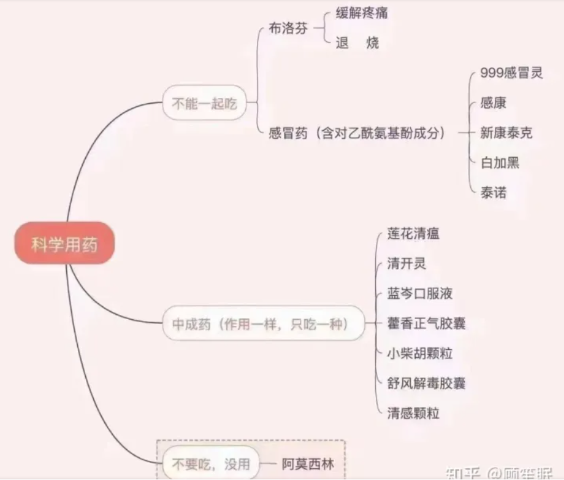{width="4.611111111111111in"
height="3.9166666666666665in"}

#### [N95口罩能否通过喷洒酒精的方式重复使用？](https://www.zhihu.com/question/367683843)

课题组曾经做过实验，如果对N95级别的口罩进行水蒸、水洗、紫外灯消毒，它的过滤效率将由95%快速降低到60%以下，和普通的纱布口罩、棉布口罩差不多。

2020-02-02

龙猫 阿里哈密瓜

好奇，如果不能用紫外线消毒柜的话，那么纯臭氧消毒柜呢？听说口罩工业上用环氧乙烷消毒（不确定，因为看到有网友说95口罩出厂期长是因为需要散发环氧乙烷消毒的残留）环氧乙烷这玩意有很强的氧化性吧，那么是否可以推测纯臭氧的消毒柜，可以用来消毒95口罩了呢？2020-02-28

实验结果显示在75%酒精浸泡24小时后，其过滤效率仅从99.58%下降到98.57%，变化值仅为1.01%。由此可以看出，对于聚丙烯熔喷层的过滤效率来说，75%酒精几乎没有影响。

但纯酒精则破坏力较大，根据此前的实验，纯酒精浸泡后的过滤层滤过率比实验前下降了77.42%。此外，在洗衣粉和清洁剂里浸泡后，其过滤效率也大幅下降，这些都不推荐使用。

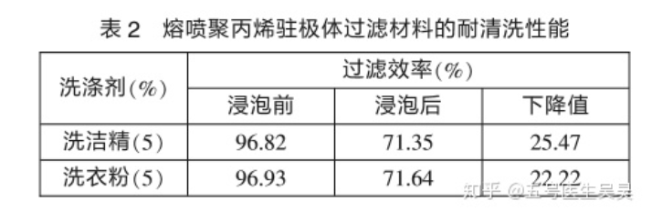{width="4.090277777777778in"
height="1.3333333333333333in"}

04
75%酒精不影响聚丙烯材质的过滤效果，但仍需谨慎使用在国家卫健委发布的《新型冠状病毒感染的肺炎诊疗方案（试行第四版）》中提到的，新型冠状病毒可通过紫外线、高温或75%酒精杀灭。因此对于非常时期，需要重复利用的口罩的居家消毒方式成为热议。专家们对于酒精喷洒口罩消毒有分歧，吴医生通过上述论述虽不能决断酒精能否用来消毒口罩。但是可以得出结论的是，75%酒精对于聚丙烯材质的影响不像其他人说的那样强烈。而至于究竟是否会通过变形影响口罩的密闭性，是否会对防水层造成破坏，还有待其他专家和科普作者求证。在实际应用中，还是应该优先选择大家公认的消毒方式，最好是能用紫外线灯照射消毒。对于酒精消毒口罩还应该谨慎，但不应该被当做谣言来处理。

#### [酒精消毒 0.3微米危害大 0.05微米危害小](https://www.zhihu.com/question/367683843/answer/1227161300)

结论：

1、用酒精给口罩消毒，对0.3微米的颗粒来说，危害比较大。但对于更小的颗粒，比如0.05微米，危害较小。但依然不是给口罩消毒的最好方式。

2、用肥皂和水清洗口罩会降低口罩的过滤颗粒效果，并不能让你的口罩重复使用。

#### 保鲜袋包裹，家用电热吹风处理30分钟

[**Zoogle**](https://www.zhihu.com/people/47daee0528226bcd801d1f958bc6b17b)

在中国工程院院士闻玉梅的建议与关心下，复旦大学上海医学院教育部/卫健委医学分子病毒学实验室联合公共卫生学院，在《微生物与感染》杂志在线发表科研论文《安全、快捷再生一次性医学口罩的实验研究》证实：使用后的一次性医学口罩，以家用保鲜袋包裹，家用电热吹风处理30分钟后可再次使用，不影响其原有的滤过截留效果，并可灭活污染的病毒。

2020-02-14

#### 口罩内外部湿润

[**阿鱼-自干五**](https://www.zhihu.com/people/eb4a2a187fd405449f9f1d197b0fb3b2)

分析可以，有理有据，但问题分析讨论的还是n95的防护透过性问题。还是建议使用时间在四到八个小时，不能用这样的分析让大家一个n95使用好几天。普通人家庭条件不能对口罩进行消毒，日常四到八个小时的使用时间，呼出的蒸汽已经润湿口罩内部，口罩外部也会被因为一定条件润湿，空气中布满了大量的细菌真菌，两三天的时间久足够在口罩上形成较大的菌落，即使不会得病，也会影响身体健康。

2020-03-15

#### 环氧乙烷是强致癌物

[**流风无霜**](https://www.zhihu.com/people/1a955ab359ad83701b89213e6bdf0e75)

环氧乙烷是强致癌物，一般人敢用这个灭菌是活腻了...

2020-08-06

#### [平均每天8小时降低1.2%](https://zhuanlan.zhihu.com/p/108051692)

建议

综合以上证据，我认为N95口罩主要随使用时间降低，平均每天8小时降低1.2%，在33-40小时后会降低到90%，也就是相当于N90的级别。每天工作8小时计算至少可以用5天，与CDC有限重复使用5次的建议吻合，防护效果还能接受。

#### [晾晒两天后重复使用](https://www.zhihu.com/question/367683843/answer/1005799601)

另：

烘烤的方式也不可以。会破坏表面结构尤其是塑料件和金属条的结构，失去密封性，俗称漏风。

理性的方式是晾晒两天后重复使用，直至戴上觉得呼吸阻力明显增大，则不可再用。

[编辑于 2020-02-09
00:44](https://www.zhihu.com/question/367683843/answer/1005799601)

#### [带呼吸阀口罩的不能进医院](https://new.qq.com/rain/a/20211206A029XT00)

带气阀的口罩不能用于防控，推荐公众和医疗机构的日常防护使用一次性医用口罩或者医用外科口罩。但偶尔还是会看到有部分人选择使用带气阀口罩，好像很高大上的样子，必须再次来敲重点！

尤其是在医院，会看到特别提示**带呼吸阀口罩的不能进医院**

为什么会被称做"自私口罩"呢？这种带气阀的口罩也就是所谓的呼吸阀口罩，是一种带有呼吸阀类型的口罩，呼吸阀内带有活瓣，吸气时活瓣关闭，呼气时活瓣开启，佩戴此口罩的人呼吸时候，呼出的气体不经过过滤，直接排入周围环境。（what？！！！）

#### 口罩标准 [工业防颗粒物口罩不能用于手术室](https://new.qq.com/rain/a/20211206A029XT00)

2021 12/06 09:55

3.医用防护口罩（N95）：推荐发热门诊、隔离病房医护人员，以及确诊新型冠状病毒感染患者转移使用。资源缺乏时，不建议公众过度防护，可留给一线医护人员使用。

4.工业防颗粒物口罩（N95）：颗粒物的阻隔能力与医用防护口罩类似，可用于工业防尘和雾霾防护。由于该类口罩无血液透过性测试，不推荐公众佩戴，也不能用于手术室等有卫生学要求的区域。

5.防护面具(加P100滤棉)：防护级别高于医用防护口罩，建议用于确诊或疑似病例的气管插管、内镜等操作。

#### [HomeTest家庭实验室](https://www.zhihu.com/question/367683843/answer/989065939) 可信

[编辑于 2020-02-04
13:31](https://www.zhihu.com/question/367683843/answer/989065939)

喷涂过程中发现一个问题，三款N95口罩和一款医用口罩的确都不具备防水功能，近距离喷涂正面的时候，就能明显看到酒精浸湿渗透的情况。

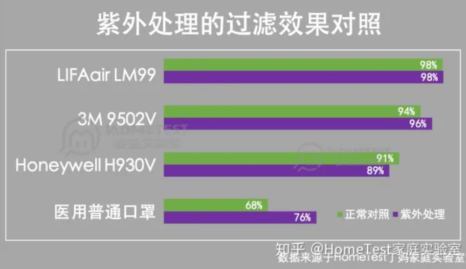{width="4.909722222222222in"
height="2.8333333333333335in"}

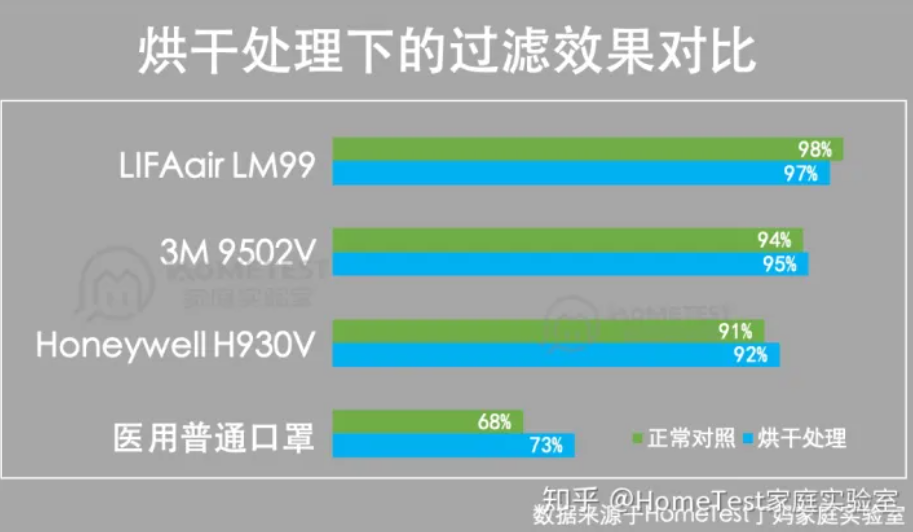{width="4.916666666666667in"
height="2.8680555555555554in"}

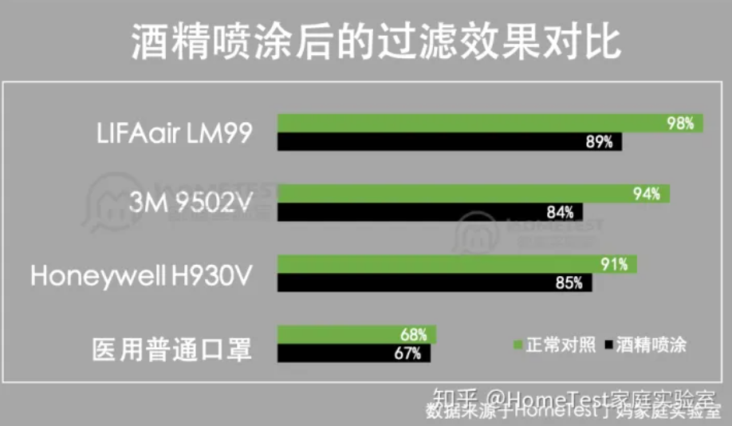{width="4.909722222222222in"
height="2.861111111111111in"}

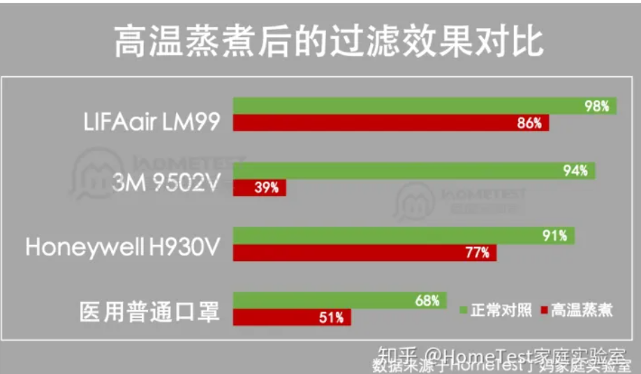{width="5.25in"
height="3.0694444444444446in"}

此外，艾薇瑞胞弟请注意，KN95不防水是合理的。不管是GB
2626-2006的国家强制标准，还是GB/T
32610-2016的国家推荐标准，对KN95口罩的防水性能均没有要求。

##### 总结

第一.
紫外和烘干没问题，不会对过滤效果造成明显影响，因此可以用来对口罩进行消毒处理。家里有这两种器具的可以直接使用。

第二.
在口罩内外表面，大量喷涂酒精会影响过滤效果。只建议在有防水外层的医用口罩喷涂，或者少量多次喷涂，每次少喷一些，尽量避免将内部滤芯打湿。

##### 紫外灯功率？

如果只是要对小物件（口罩，水杯，玩具等）进行消毒，建议购买带密闭箱体的，占用空间并不大，省事省心，扔进去后按键自动消毒。紫外灯的波长和功率可以问商家索取，也可以根据灯管上的标注查询。以我家使用这台消毒机为例，使用的是飞利浦TUV
4w灯管。

##### 吹风机吹口罩是否可行？

好多人问这个问题，感觉你们这个年过的，真的是"憋"出来的精彩。我们之前检测过不同品牌吹风机的出风口温度，大多数品牌在中，高温档都可以达到55℃以上，只能说理论上是可行（传送门\--家用吹风机检测）。但玩笑归玩笑，先想好怎么固定，毕竟要吹上半个小时。所以这个不靠谱的土豪方法，谁爱用就用吧。

##### 需要每天消毒吗？

我太了解HT的粉丝，当你们知道可以重复使用后，现在的神情一定是这样的。

恨不得出去扔个垃圾，回来也要口罩消毒。其实真的用不着。只要不去人口密集或者有疑似病患的地方，3-4天消毒一次即可。这样一来，一个口罩的使用时间就会被大大延长。

#### [奥密克戎 两层90% 单个70%](https://new.qq.com/rain/a/20220114A0DBEE00)

据《中国新闻周刊》1月9日报道，在天津出现奥密克戎本土病例后，汕头大学病毒学专家常荣山建议，没有准备N95或KN95口罩的天津市民，外出时应当戴双层外科口罩，或在布口罩外面套戴一个外科口罩增强密闭性。常荣山表示，叠加两个口罩的保护效果为90%，即可以减少90%的传染概率，而单个口罩的效果则为70%。

#### [kn95非医用口罩能不能有效防范新冠病毒 ？](https://www.zhihu.com/question/440699161/answer/1692557762)

N95医用，这个是无可置疑的最佳防护。但也不是完美，比如价格贵，比如待久了难受，所以不能持续带等等。

kn95，这是工业用防粉尘口罩，隔离飞沫，粉尘，或者是气溶胶都有一定的效果，跟医用N95的主要区别是这东西不防液体，但是考虑到我们平日使用也没问题。但问题一样是贵，而且不能久带，或者说是带一段时间就要摘下来换换气什么的。

医用外科口罩（YY开头的哪个），这就是平时医生护士带的口罩，这个从防护等级来说比N95和kn95都低，但是既然是医用的，也能也能防护液体的。

连YY开头都没有的就是普通口罩了，这种，只能说比不带好一点？

[**睡莲**](https://www.zhihu.com/people/22c18ec45fdb9fcf781821ca4d840261)
医用防护口罩n95>kn95>医用外科>普通一次性使用

2021-05-24

[**青禾**](https://www.zhihu.com/people/180a8897977f75c3b97669cdd51cea2d)
[**喔天**](https://www.zhihu.com/people/e9470ed39b363b31cec278d7e7f918f7)

kn95不防液体飞溅

10 小时前

#### [液体飞溅医用N95 日常N95](https://www.zhihu.com/question/440699161/answer/2795201168)

如果你站在血液四溅，体液横飙的手术台前，毫无疑问，普通N95是不管用的。因为它不防水，遇水就被击穿防护。

如果你站在日常生活环境里，医用N95当然更好，普通N95也够用，因为它们的区别只是防不防水而已。

那么医用外科口罩呢？这个是防水的，但它对新冠的防护力，比N95又弱一些。

### [[被*蚊子咬*了，擦它最止痒！花露水、木瓜膏、紫草膏真的弱鸡]{.ul}](https://zhuanlan.zhihu.com/p/72651886)

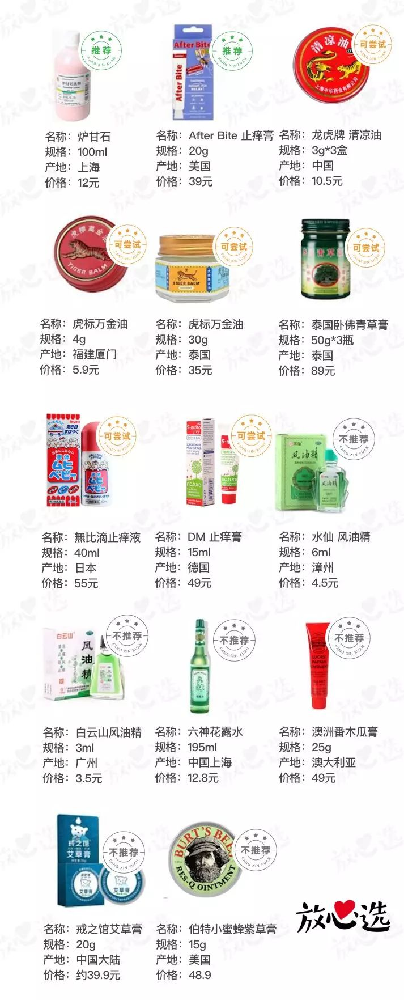{width="3.638888888888889in"
height="9.0in"}

### 避蚊胺

[**兔子不白**](https://www.zhihu.com/people/b0d9e57348f3073e61f4efe606c77705)作者

带避蚊胺成分的喷雾或驱蚊药水，一定要避蚊胺，什么全天然，草本，精油，都是智商税，或者捂严实点，还防晒

2020-06-16

### 能吃药就别打针，能打针就别输液

[灵梦の白丝](https://space.bilibili.com/119051)

一般没事根本用不着打针。除非播种疫苗。小的时候打过很多针。我怀疑就是那些医生乱整。\
特别的现在还有很多诊所，感冒都会叫你打针输液的。\
一般的小病，吃药可以解决任何问题。打针没有任何意义。甚至很多时候药都可以不用吃，吃点维生素就能解决问题。\
譬如一些医院，一个普通感冒引发的咽喉炎鼻炎之类，能给你开出几百元的东西。其实几元钱到药店买对药就能解决问题。\
我已经十五年没打针输液过。

2017-02-10 02:03👍6

[纯天然无公害甲氧西林](https://space.bilibili.com/198331316)\
NO.009278\
5号/5号半头皮针，儿科/女生专供\
2020-12-31 00:16👍186

#### [护士日常\|自己给自己扎针，又是作死的一天](https://www.bilibili.com/video/BV1ur4y1F7jJ/?spm_id_from=trigger_reload)

5.3万播放 · 总弹幕数9 2020-12-20 16:00:16

[动漫眼镜控的喜鹊](https://space.bilibili.com/33402471)\
角度太小了，在皮肤里，没在血管里，左手不是惯用手很不方便的，平时练习可以试试用头皮针，把头皮针的管子C字对折，盖上纸巾，摸到管子然后去扎，一个头皮针可以练习好多次，依次增加纸巾的厚度，扎进去后翻过来看看就知道在管子里没，很快就会找到扎进血管的落空感，亲测很有效，有几次在人手臂上完全看不到血管，但摸到了，都扎成功，就是这种皮肤厚血管深不好固定。\
2021-01-01 22:51👍101

#### [护士必读 \| 输液扎针技巧](https://zhuanlan.zhihu.com/p/398253366)

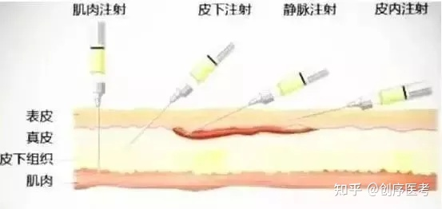{width="5.768055555555556in"
height="2.732638888888889in"}

进针方法\
皮肤绷紧，绷紧后以血管微凸为好，进针角度宜小，可保持小于20度的角度进针，刺穿皮肤刺入血管见回血后视血管走向再向前进一点点，随后平行进针。

回血慢/不回血\
最重要一点也是很多同学疑惑的一点就是有些病人回血很慢或者根本不回血，这也需要靠自己的，如果感觉自己确实扎进血管但没回血，可以试着捏下输液皮条，松开的时候如有回血则证明注射或输液成功。不见回血切不可盲目进针！

#### [新护士静脉输液打针技巧必看！让你百发百中，快准狠！](https://www.bilibili.com/video/BV1G64y197ka/)

4.0万播放 · 总弹幕数36 2021-06-23 18:14:17

#### 医生与护士的地位

[v威](https://www.zhihu.com/people/vwei-94)2017-03-10\
我们的老师讲课的时候告诉我们不能总是使唤护士，医生和护士是同事关系。不是上下级关系。但是基本上99%的人都觉得医生和护士是上下级关系。

[丸子](https://www.zhihu.com/people/wan-zi-48-41)2017-03-13\
最可怕的是，护理部的人都不把护士当人，欺压我们临床的小护士，没有人帮我们说法，一旦有纠纷，那就护士的错，医院最低贱的职业就是护士，连陪护都可以骂我们，还不能还嘴，只能骂不还口，打不还手，默默忍受，领导还不让你抱怨，发泄！

[郭德纲](https://www.zhihu.com/people/guo-de-gang-83-24)回复[lao
er](https://www.zhihu.com/people/lao-er-51-92)2019-06-05\
大家都认为护士是服务业的，医生是研究员。社会地位本来就是不平等，除非护士直接参与病人手术，指导病人治疗过程，患者用药指导，发几篇生物医学论文，在大学做生物医学的讲课，护士能当国家院长，卫生部部长都从护士里挑选，护士马上社会地位几何性增长。否则人们还是看不起，这个就像人们看不起水管工人，却佩服设计水管的人，如果这个设计水管的下地干活更加佩服了，护士和医生的社会地位不平等，本质是体力劳动和脑力劳动不平等

[penny](https://www.zhihu.com/people/bei-la-56-9-14)回复[我不是伟哥](https://www.zhihu.com/people/wo-bu-shi-wei-ge)2017-11-05\
这只是官方说法 就像护士的官方说法是只招本科及以上 现实中大专为主
很多没考上研究生临床医学生还不是参加规培了 本科医生并不少

[wuxirbi](https://www.zhihu.com/people/wuxirbi)2020-12-30

护士和医生天壤之别，地位怎么可能一样呢？一个是硕士博士，一个是卫校毕业；在学生时代一边是超级学霸，一边是学渣\...
虽然这话不好听

[小和尚](https://www.zhihu.com/people/9e4110d56b4e13fa7aa8f9a4f3a363e1)回复[wuxirbi](https://www.zhihu.com/people/34352c7e497770ee34a7d3c114cbd77b)2020-12-31\
首先，天壤之别是指哪方面？为人的基本尊重和权利应该可以享受吧？所以尊敬医生可以，为什么不可以给护士作为认真的社畜的尊重？然后入院条件不同医院肯定是不一样的啊？在基础医院能没有本科医生？我护士本科实习的时候被很多实习医生说我学校和学历比他们还高。现在卫校已经几乎不存在了，就算有也不可能进二级及以上的医院的，学渣这件事，其他行业没有大专的？而且医院考试多的要死，后期能力的提升不算提升？哎，答主可能是本科生吧，一些认知很难去改变

##### [医护平等政治正确 但实际靠医生自觉](https://www.zhihu.com/question/56521327/answer/150737206)

虽然医护平等是政治正确的\
但现实是 医护平等 永远是医生自律的原则 而不是护士应该追求的境界

这话的意思是 医护平等是教育医生尊重护士劳动的 护士要是揪着这句话要平等去
分分钟倒霉

决定地位的是能力 在医院就是不可替代性

护士也好 医生也好 决定地位的就是 离了你 这个科还是不是正常运转
科里能不能在最短时间内找到你的替代者

你会发现 护士 年轻护士也好 老护士也好 不可替代性都比同年资医生低

真有敢吐槽主任的护士 除了个别科室 大部分的科室主任可以直接让滚蛋
市面上又不是招不到 对吧

情况就这么个情况 职业都是很现实的 你想想一个医生进三甲要什么条件
护士要什么条件 你心里有数吧～差别这么大 我说两者收入地位话语权一样你信吗
你觉得公平吗

[知乎用户eL1aj2](https://www.zhihu.com/people/qian-lan-ping-fang) (作者)
回复[秋水仙碱](https://www.zhihu.com/people/tu-yun-han)2017-10-20\
医院和科室不同于别的单位 在企业里用人是人力资源的事
各部门负责具体安排工作 没有直接开掉的能力 而在科室
行政和业务都是主任全权负责 年轻医生搞事情 OK 封了你站 不让你上手术
不给病人 不出一个月你自己不走人？没病人没工作量你靠什么养家？至于护士
很多时候主任把权利下放给护士长 不代表他生气了不能开了你

[豹团](https://www.zhihu.com/people/sun-meng-99-25)2021-01-14\
大夫敢凶护士！？不怕夜班时候被穿小鞋啊，丁点鸡毛蒜皮的小事都把你叫起来，把你的医嘱拍下来一条一条找错告到医务处，以前轮转时候有个哥们儿就这么被教训的服服帖帖

### [颞下颌关节紊乱怎么办？](https://zhuanlan.zhihu.com/p/131273923)

一些读者反馈，没有弹响，没有疼痛，只有单/双侧髁突活动受限，表现为张口受限（不到三指）偏移，这时就可以介入下边这个治疗了，就是给颞下颌关节进行进展式静态牵伸

那么，怎么预防这个疾病的产生呢？

首先是要避免不正确的咀嚼习惯：不对称的咀嚼（偏侧咀嚼）、磨牙、嚼口香糖、甘蔗等需要重复咀嚼的动作，避免引起颞下颌关节功能障碍。

在平时打哈欠的时候，舌头要抵住上颚，避免趴着睡觉，不要在休息的时候用手托着下巴。

在关节不适时进食软食，不要吃坚果类或难咬的食物。

颈肩部不良姿势（头部前伸，上交叉综合征）都是颞下颌关节紊乱的高危因素。

#### 正确的口腔姿势

那么，什么才是**正确的口腔姿势**呢？颈椎保持自然生理曲度，收紧下巴，脸部肌肉放松，用鼻子呼吸，让舌尖放在下牙的牙根部，舌头微微隆起，正好抵住上腭，撑开上下牙齿，牙齿咬合放松，上下牙距离2\~3mm。如果把我们的口腔比作一个汉堡包，舌头就是其中的肉饼，在放松情况下，肉饼（舌头）自然将上下面饼（牙）撑开，下巴自然下坠，再抿唇。咽掉多余的口水，此时口腔里就是一个密闭的空间，既不透气也不漏气。

我们自我检查这步要求做到：后方的上下磨牙是松开的，放松的舌头可以填充这部分空隙。（注意是填充，而不是咬住舌头，就是说牙齿并未用力去咬，舌头上应该是无齿痕的。）这个状态下，关节周围的肌肉和舌肌都处于最放松的状态，关节也处于内部压力最小的状态。仔细体会下，会觉得舌下开始分泌口水，就是很放松的状态。此时将口水吞掉，再将舌头放回，贴住上腭。

#### 越是学历高，水平高的大夫越懂得尊重别人

现在大部分的年轻大夫会认为护士和医生是相辅相成的，并且工作上也并不是上下级关系，只是护士比较需要配合医生而已(越是学历高，水平高的大夫越懂得尊重别人)如果想转行的话，尽早吧。看看知乎上医生们受得委屈，护士比那只多不少

[编辑于 2017-03-04
01:06](http://www.zhihu.com/question/56521327/answer/149622588)

#### 傻了才会学本科护士 夜班伤身

[鱼小丸子](https://www.zhihu.com/people/yu-xiao-wan-zi-33)2017-11-03

我是傻了才会学本科护士，所以大家高考选志愿不要冲动，不要因为就业问题不考虑其他，女孩子不到迫不得已别选护士，真的，夜班真的很伤身，活脱脱的例子，月经不正常，内分泌紊乱，，才刚工作两年就感觉老了五岁以上，真的要听前辈的话，不然后悔一辈子

[heathcliff](https://www.zhihu.com/people/3b5f9485c51bd323f7374e31f242ae23)回复[df
sd](https://www.zhihu.com/people/0e98c51b8da29983b6da22a0225e70d4)2017-10-19

我相信211以上毕业的护士这个人群中应该也有不少后悔自己没学其他专业的吧！如果不是热爱这个职业，我真的想不到成绩非常好还去学护理的理由。北大护理系很多毕业后直接转行的，足以证明。

#### 厨师和服务员 飞行员和乘务员 法官和书记员

个人觉得，医院的医生护士间的关系类似于饭店的厨师和服务员，民航客机上的飞行员和乘务员，法院的法官和书记员。确实二者相辅相成缺一不可，但都是以前者为核心和基本盘展开的，后者更多的是辅助性工作。前者的受尊重程度、收入、不可替代性、专业性都高于后者。

[一朵大大的云](https://www.zhihu.com/people/239c0f69038ef9aa00793a3067625ea5)回复[吃我一喵喵拳](https://www.zhihu.com/people/0f400880af35448c53ec6de86d00f37b)2021-05-09\
护士一枚，喊我美女的，都觉得这种人很轻浮，而且并不想理。

[Unite](https://www.zhihu.com/people/552a3cd5677787676b8f82c9a0655e99)回复[一朵大大的云](https://www.zhihu.com/people/239c0f69038ef9aa00793a3067625ea5)2021-07-02\
在医院实习，我也不太喜欢别人叫我美女，直接叫护士小护士什么的都能接受

### [腰间盘突出患者？](https://www.zhihu.com/question/354855224/answer/1497259315)

1 拉伸练习，长期久坐腰部关节会僵硬
胸腰部肌肉会僵硬，因此需要重点松动腰椎关节和肌肉，促进血液循环，下面视频很好，可以练习

当然在家可以大幅度的去拉伸 晃动腰椎，单杠拉伸很关键

1.1 引体向上
双手抓住单杠上提的时候，腹部收紧，腰椎稳定不动，这样可以加强腰椎肌肉的力量和稳定性。

1.2 单杠晃腰法
双手把住单杠，脚心离地，脚尖微微接触地面，腰部发力，做前后左右的晃动，这样可以修复腰椎关节的错位。

2 坐骨神经 腿部拉伸

经常腰痛伴有坐骨神经痛的，要经常拉伸腿部肌肉筋膜
肌肉拉伸开了，神经就松动了

下面图片动作左右交替

{width="4.736111111111111in"
height="3.3194444444444446in"}

image-20220108064203755

3 泡沫轴松解腰背部

泡沫轴松解腰椎左侧肌肉

4 腰椎稳定性练习

这个动作，可以每次先练习一分钟，循序渐进的练习，能坚持多长时间就坚持多长时间，可以每天练习三次，每次一到五分钟。这个动作对腰椎很有帮助，能够改善骨盆前倾，腰曲过大，引起的腰部酸痛。

{width="1.6527777777777777in"
height="2.5in"}

5 坐姿很重要

如果坐着经常驼背的人，尤其是胸腰部结合处后凸，腰部会经常僵硬，那么应该在胸腰结合部垫一个硬物，防止过度后凸，请看图片。这个坐姿适合驼背
腰曲过大 骨盆前倾的人群

麦肯基疗法

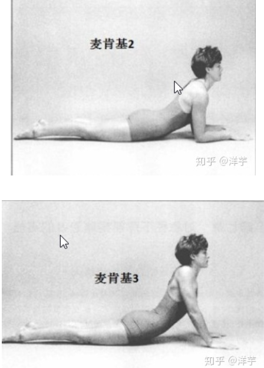{width="5.768055555555556in"
height="8.047916666666667in"}

image-20220108064604587

双手抱膝，可加一点滚动（就抱着膝盖头和屁股方向滚来滚去的那种）

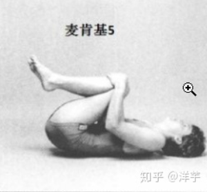{width="4.166666666666667in"
height="3.875in"}

\"死虫子\"练习

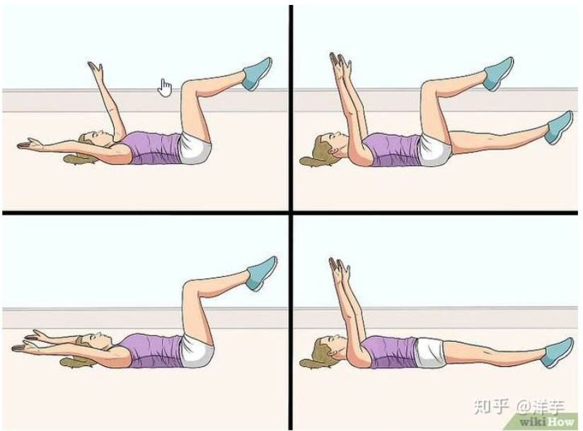{width="5.768055555555556in"
height="4.277777777777778in"}

image-20220108064904762

<https://vdn3.vzuu.com/SD/f0be79ba-b943-11eb-8991-2267deb1a25e.mp4?disable_local_cache=1&auth_key=1641598751-0-0-a5cc17c5b826c6569fde3dd90706e0f8&f=mp4&bu=pico&expiration=1641598751&v=tx>

#### [大刘抗腰突](https://www.zhihu.com/people/guo-wai-kong-tou-tang-guo)

发布于 2021-10-28 10:13

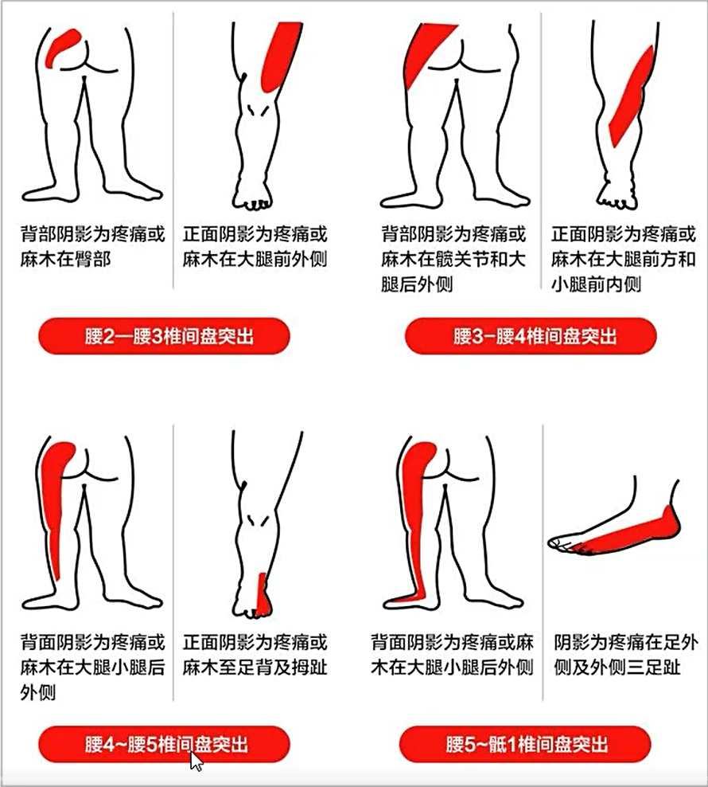{width="5.768055555555556in"
height="6.4in"}

image-20220108061520783

L5-S1椎间盘突出，腰椎内半固态物质流出。

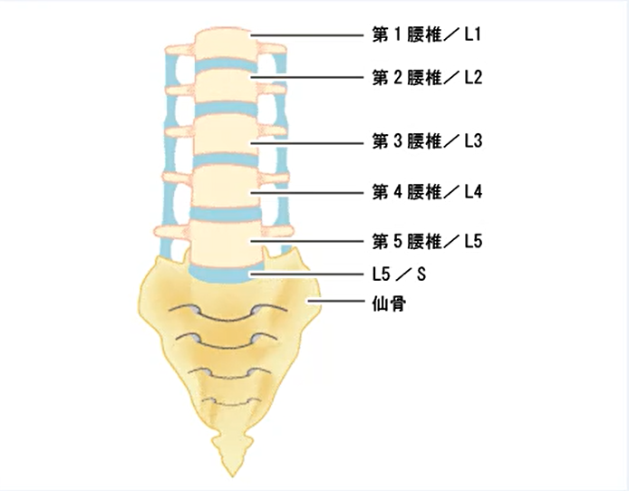{width="5.768055555555556in"
height="4.504861111111111in"}

image-20220108061611125

急性期：

急性期什么都不要做，卧床休息，因为此时你的椎间盘内液态物质流出，刺激腰部神经，形成炎症。就像伤口一样，不要去动它，越动越不好，一动刚愈合好的伤口又裂开了。

1.绝对卧床3-4周 2.硬板床+枕头 睡姿

这些方法都是为了缩短急性期：2.按摩推拿 3.针灸疗法 4.拔火罐 5.刮痧
6.手法治疗 7.牵引疗法 8.骶疗

缓解期：锻炼后腰椎肌肉更有力了，支撑腰部，减轻腰椎对椎间盘的压力。

游泳、倒走、骑自行车、慢跑

腰背肌训练、下肢训练

### [以为是鼻炎，其实是癌症！鼻咽癌来临时，身体会发出6个警示信号](https://zhuanlan.zhihu.com/p/365888825)

我国的鼻咽癌发病主要集中在南方地区，特别是两广、湖南和福建等地。而目前认为，鼻咽癌发病与遗传和环境因素有密切关系，例如癌症家族史、[EB病毒](https://www.zhihu.com/search?q=EB病毒&search_source=Entity&hybrid_search_source=Entity&hybrid_search_extra=%7b%22sourceType%22%3A%22article%22%2C%22sourceId%22%3A365888825%7d)感染、吸烟、常吃咸鱼或腌制食品等高含亚硝酸盐的食物等。

[鼻咽癌的早期症状有哪些？](https://zhuanlan.zhihu.com/p/290899082)

首先就是鼻塞的症状。这个症状就会让很多早期的鼻咽癌患者误认为自己患上了鼻炎，但是和鼻炎有些不同的是，鼻咽癌导致的[鼻塞症状](https://www.zhihu.com/search?q=鼻塞症状&search_source=Entity&hybrid_search_source=Entity&hybrid_search_extra=%7b%22sourceType%22%3A%22article%22%2C%22sourceId%22%3A290899082%7d)，一般都是从一侧鼻孔开始的，逐渐地就会变成两侧鼻孔都不通气的现象，特别是在秋冬季节，出现类似的症状之后不要再以为是普通的感冒或者是鼻炎了。鼻咽癌之所以会造成鼻塞，主要就是肿瘤堵住了鼻腔，一开始一侧鼻腔，肿瘤再大一些就会堵住两个鼻腔。

其次是鼻子总是出血。但是这种出血不会一下子就血流如注，血液掺杂着鼻涕一起地流出来，所以很多人就会把它当作是普通的上火症状，或者是[鼻窦炎](https://www.zhihu.com/search?q=鼻窦炎&search_source=Entity&hybrid_search_source=Entity&hybrid_search_extra=%7b%22sourceType%22%3A%22article%22%2C%22sourceId%22%3A290899082%7d)。但是后期随着肿瘤的不断入侵，鼻粘膜的损伤更加的严重，出血量将会增大，并且会更加的频繁。

还有就是患者的听力会受到一定的影响。鼻咽癌还会导致[咽鼓管](https://www.zhihu.com/search?q=咽鼓管&search_source=Entity&hybrid_search_source=Entity&hybrid_search_extra=%7b%22sourceType%22%3A%22article%22%2C%22sourceId%22%3A290899082%7d)被压迫，这样患者的听力就会出现下降的症状，因为会出现严重的耳鸣，有时候就像是海浪拍打礁石的声音，有时候就像是火车驶过的轰鸣声，这些症状有时候就会被患者误认为是耳朵部位的疾病。

最后就是小王出现的[淋巴结肿大症状](https://www.zhihu.com/search?q=淋巴结肿大症状&search_source=Entity&hybrid_search_source=Entity&hybrid_search_extra=%7b%22sourceType%22%3A%22article%22%2C%22sourceId%22%3A290899082%7d)，但是这种症状出现的时候，大部分已经不再是早期了。这种类似于身体炎症表现的小肿块，并不会因为吃一些消炎药而出现消减的迹象。所以脖子部位出现没有痛感的硬块一定不能够掉以轻心。

### 附耳

我也是跟你一样有附耳，我在广东佛山。我去广东佛山市一人民医院，做了附耳切除手术，因为我就一边，左边而已。花了2000元。手术20分钟，无需住院。包扎两天，术后，医生说大概一个月后线自动脱落。

[发布于 2019-05-11
11:39](https://www.zhihu.com/question/264108385/answer/679578370)

匿名用户 (作者)
回复[夏日的风](https://www.zhihu.com/people/mo-xiao-80-47)2020-02-27

我花了2000元

和和回复一个人 (提问者)2021-03-06\
我去三甲医院挂耳鼻喉，医生不给做让我去整形科

[一个人](https://www.zhihu.com/people/yige-ren-79-60) (提问者)
回复[平淡](https://www.zhihu.com/people/ping-dan-76-96)2019-11-23

软骨一样，三甲医院半小时弄完，一个星期拆线

今天终于鼓起勇气，去做了副耳切除手术，我两侧都有副耳且都有软骨，手术在局麻条件下完成，没有疼痛感。住院一天，第二就可以出院了\
[发布于 2022-01-14 23:17](https://zhuanlan.zhihu.com/p/457560889)

[绿水青山大卫](https://www.zhihu.com/people/lu-shui-qing-shan-da-wei)2022-02-07\
费用多少？

[来啦来啦](https://www.zhihu.com/people/lai-la-lai-la-19-8) (作者)
回复[绿水青山大卫](https://www.zhihu.com/people/lu-shui-qing-shan-da-wei)02-07\
4000

<https://zhuanlan.zhihu.com/p/128492802>

[闲暇](https://www.zhihu.com/people/xian-xia-67-20)2020-07-27\
会遗传吗？

[邱帅](https://www.zhihu.com/people/qiu-shuai-53-86)回复[闲暇](https://www.zhihu.com/people/xian-xia-67-20)2020-09-04\
会 我女儿就遗传的我

知乎用户回复[遗憾](https://www.zhihu.com/people/14bf45de0f8a1a71e582946cdb77cb53)2021-09-15\
检查加手术我花了600这样

[乔木](https://www.zhihu.com/people/adf563f4b64430e48041189fc234a39f)回复知乎用户02-02\
请问是在普通三甲医院检查之后就可以做手术吗

知乎用户回复[乔木](https://www.zhihu.com/people/adf563f4b64430e48041189fc234a39f)02-03\
这个小手术没有什么 直接就做了

大家要知道，附耳切除手术的原理很简单，是将耳部突出的部分进行切除，不会对神经、组织等造成损伤，只是一个小型的[外科手术](https://www.zhihu.com/search?q=外科手术&search_source=Entity&hybrid_search_source=Entity&hybrid_search_extra=%7b%22sourceType%22%3A%22article%22%2C%22sourceId%22%3A%22344461012%22%7d)。

<https://www.zhihu.com/question/290842050/answer/679570923>

[雨洛晨](https://www.zhihu.com/people/yu-luo-chen-66-28)回复[欧阳克](https://www.zhihu.com/people/ou-yang-ke-64-49)2020-03-07\
我在北京301医院做的，包括一次换药，术后拆线，总共花了不到2000

[雨洛晨](https://www.zhihu.com/people/a64245035c4d3372796dd8e0f6105af6)回复[兮溪儿](https://www.zhihu.com/people/0649d2902cff3f64cba67b913008c909)2020-12-10\
好像是整形外科吧。耳鼻喉科其实也行

附耳的形成原因。之所以会出现附耳，是因为[第一鳃弓发育异常](https://www.zhihu.com/search?q=第一鳃弓发育异常&search_source=Entity&hybrid_search_source=Entity&hybrid_search_extra=%7b%22sourceType%22%3A%22article%22%2C%22sourceId%22%3A%22376492345%22%7d)导致的。

#### 儿童

0-1岁 不建议处理，避免不必要麻醉风险。

1-3岁 建议全麻手术治疗，少部分特别配合可局麻手术处理。

3-6岁 比较配合建议局麻手术，少数不配合建议全麻下手术。

6岁以上 均在局麻下手术治疗。

<https://zhuanlan.zhihu.com/p/301199033>

我：长沙市望城区人民医院￥2640，包扎两天，一周拆线，无医保。

### 不吃早饭，后面胆囊结石

谎言是我的安生

不吃早饭，后面胆囊结石得切除胆囊，手术费上万，而且后续恢复也不比以前，早饭不能省。身边好些朋友都遭了这个。

2022-01-18 04:52👍3

### 蚊虫叮咬

#### [蚊虫叮咬 处置要早（健康关注）](http://health.people.com.cn/n1/2017/0729/c14739-29436093.html)

2017年07月29日04:38

　　绿药膏

　　主要成分是林可霉素（抗生素的一种）和利多卡因（局部麻药），因此止疼、止痒效果好，但对局部的非细菌性炎症没有任何效果。

　　炉甘石薄荷脑洗剂

　　非处方外用药物，药店有售。炉甘石有很好的止痒功效，并且对渗出有收敛作用，其中含有薄荷脑，能清凉止痒，适用于各类人群。

