## 微针 缩毛孔

### [在家作死---自己在做微针](https://www.bilibili.com/video/BV1ut4y1S7ZK)

2020-09-05 19:12:04
偏分少年
我去医院打水光的时候问了下微针 然后医生说那个你自己在家做就行
他们都自己在家做 但我还是下不了手
2022-06-29 21:05👍4

### [黄金微针射频的临床应用](https://zhuanlan.zhihu.com/p/404543549)
皮肤医生朱岳衡​
医师执业证持证人
发布于 2021-08-28 17:30

黄金微针是侵入性的点阵微针射频，射频是一种高频交流变化电磁波，微针对皮肤的机械作用，还能改善外用产品的经皮吸收。

射频在通过组织时，组织内的极性分子瞬间产生快速的振荡，在这个过程种相互摩擦产生热效应，刺激胶原蛋白收缩、变性、新生和重排，从而达到改善皱纹、紧致肌肤的效果。

其次，镀金的细小微针是绝缘针，只有到达真皮层的针尖部位才会发生射频，针体是不会发射射频的，这样对表皮是没有热损伤，黄金微针不仅仅有射频的热刺激外，在一平方厘米的面积上有49颗细小微针，还有微针本身的机械刺激，这种创伤性再修复极大程度的减少皮肤屏障的破坏和加速皮肤表面的恢复。

另外，通过全面部的治疗，会留下40000个左右的细小通道，如果在这个时候涂抹上一些医用营养素后会增加其吸收，加大导入的效果。

1、 毛孔粗大
无论是出油旺盛引起毛孔代偿性增大，还是皮肤光老化导致的毛孔粗大都可以通过黄金微针的治疗达到不同程度的改善。主要原理是射频能破坏皮脂腺，减少皮脂腺的分泌，这样毛孔就不会在持续高压状态下扩大。另外，在创伤性再修复的过程种增加胶原蛋白和重塑其排列。

2、 提亮肤色
通过在治疗靶部位的刺激，几乎是在整个面部真皮层平铺了一层新生的胶原蛋白，白色的胶原蛋白可以增加皮肤的白皙度，同时也能营养皮肤。

3、 萎缩性皮损
主要是面部痤疮愈后引起的痘坑，通过刺激胶原蛋白和重塑其效果。当然只对比较浅的冰锥型痘坑有改善作用，对于滚轮型和车厢型痘坑作用不大。其次还是有妊娠纹、浅表瘢痕可以通过黄金微针的治疗来改善。

4、 皮肤松弛
我们的皮肤每天会流失200-500毫克胶原蛋白，当面部皮肤的胶原蛋白流失后会引起皮肤变薄松弛，这个时候黄金微针很好侵入性刺激，准确的在真皮层刺激胶原蛋白形成，增加其真皮层的厚度，让皮肤变得更为紧致。
**以上是强推荐的几个适应症，以下皮肤问题可以考虑黄金微针治疗，但是需要专业评估酌情使用**

5、 痤疮
6、 玫瑰痤疮

#### 得2-3次
[安静的娃娃](https://www.zhihu.com/people/14d9800301eebcb13d4af94b0d2526bd)
这个好像得2-3次，医美都是这样吧
2021-09-16
## 光子嫩肤

### [IPL强脉冲光(光子嫩肤)定义 详细介绍](https://zhuanlan.zhihu.com/p/100058754)
发布于 2019-12-29 17:58
[皮肤医生朱岳衡](https://www.zhihu.com/people/yi-mei-lang-zi)
医师执业证持证人

#### **一、强脉冲光的定义及产生**
**【定义】**强脉冲光（intense pulsed light，IPL）或称脉冲强光，是以一种强度很高的光源经过聚焦和滤过后形成的一种宽谱光，**其本质是一种非相干的普通光而非激光。**
**【产生】**强光源（如氙灯）发出的光源首先经聚光镜聚焦发出，再经过系统初步滤过后，IPL的波长多为500～1200nm。强脉冲光的特点是作用范围广、辐射时扩散度较大。
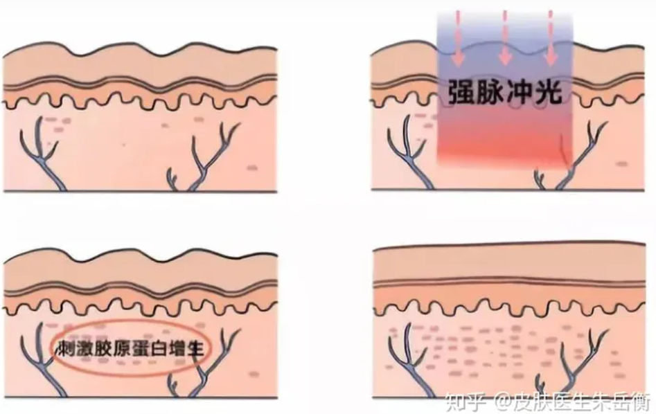

#### **二、IPL的特性及临床应用**
**Ⅰ型嫩肤：是针对色素性皮肤病和血管性皮肤病的IPL治疗。**色素性皮肤病包括雀斑、黄褐斑、日光性黑子、雀斑样痣等；血管性皮肤类病包括毛细血管扩张症、酒渣鼻、鲜红斑痣血管瘤等。IPL脱毛的治疗机制也同Ⅰ型嫩肤。

**Ⅱ型嫩肤：是针对真皮胶原组织结构改变相关性疾病的IPL治疗**，包括皱纹、皮肤松弛、毛孔粗大、皮肤粗糙，以及由于各种炎症性疾病如痤疮、水痘等遗留的细小凹陷性瘢痕等。
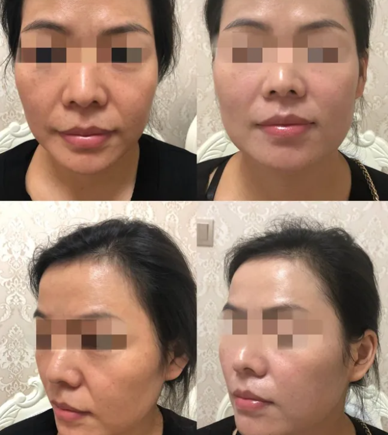

作为美容领域的一重要分支，IPL系统与激光系统相比有诸多的优点。
1、首先治疗费用相对较低是其能在市场上深受消费者青睐的一重要原因。
2、IPL治疗系统作为一个美容平台，其能解决多种皮肤美容问题，如脱毛（hair removal）、治疗色素性皮肤病、治疗血管性皮肤病、改善肤质等。

#### **三、IPL与激光的比较**

强脉冲光和激光在治疗过程中各具优势，强脉冲光的优势主要体现在以下几点

|   |   |   |
|---|---|---|
|     |强脉冲光|激光|
|单色性|宽光谱,可以调节|波长难以调节|
|方向性|好|好|
|能量|高|高|
|脉宽|连续可调|一般不可调|
|脉冲个数|每次激发可以选择1-3个脉冲|单个|
|光斑大小|8mm X 35mm |直径2-9mm|
|故障率|相对较低|相对价高|

1、不同于单种激光的应对症状相对单一，**强脉冲光波长的可调性决定了强脉冲光可以应对多种肌肤问题。**
如祛斑、去红血丝、脱毛以及嫩肤等等，所以利用强脉冲光技术以及由强脉冲光衍生出来的技术，可以有效应对多种肌肤问题，而不用像激光那样必须选择多种激光，才能全面修复肌肤健康。
2、**宽光谱**在改善肌肤问题主要诱因的同时，还能解决产生肌肤问题的次要因素，同时**兼顾改善肌肤衰老症状的作用**，具有解决肌肤问题多因素的能力。
3、**强脉冲光的安全性更高。**强脉冲光是一种以脉冲方式发射的强光，可以做到在光发射时，能量被发出，脉冲延迟，使靶组织冷却下来，因而保证了治疗的安全性。
#### **四、IPL治疗痤疮**

**IPL具有杀灭/抑制痤疮杆菌、减轻炎症、淡化色斑、预防和改善瘢痕等作用。**
**不仅能明显改善痤疮炎症和非炎症性皮损，对痤疮伴随的毛细血管扩张性红斑、色素沉着、细小瘢痕、皮肤粗糙或毛孔粗大等常见的皮肤缺陷也有一定程度的改善**

#### 强脉冲光￥1000/次，科医人
[E.L](https://www.zhihu.com/people/7aa89f4d7cde0892d4f5e3ceb8682287) [我等风没等我](https://www.zhihu.com/people/b133cdf0e09eac6034d7da37bdff192f)
我们这边强脉冲光一千多一次，科医人的

#### 毛细血管扩张，痘坑的话可以淡化 完全修复不可能
[我等风没等我](https://www.zhihu.com/people/b133cdf0e09eac6034d7da37bdff192f)
我今天刚去医院问，回来查查这个，医生说，痘印可以，就是毛细血管扩张，痘坑的话可以淡化，促进胶原蛋白再生，但是如果想完全修复这个不太可能。这个挺好的，就是贵一些，一次六百，六次一个疗程。而且县级医院很少有这种，市医院一般都有。
2021-01-11
#### 脸部胶原蛋白有再生功能，脉冲加速
我等风没等我
说白了就是我们脸部胶原蛋白有再生功能，脉冲给了一个加速效果
2021-01-11

#### M22、opt都是脉冲强光
2021-11-22
取个名字好难​
M22、opt都是脉冲强光，是光动力治疗，是需要持有执业医师资格证书的医生才可以操作的。
2022-08-06
#### 做完不长痘 红血丝减少
椰橘JoJo
我有做过这个，做完几乎不长痘了…红血丝也减少了
2020-12-18

### 每月1次超光子的经验总结！不要再浪费钱做无效医美了！最强光子嫩肤避雷！

2021-07-16 16:29:57

直接看视频吧，文字太长。关键点不好总结。

年续大半年，每个月都保持着打一次超光子的我呢，今天就打算来跟大家说一下光子嫩肤。今天会说到的几个：

第一个就是为什么有些光子嫩肤几百块，有些光子嫩肤几千块，它们的区别有什么；第二个呢就是光子嫩肤到底有没有用，是不是智商税要注意一些什么东西，怎么样去避雷；

第三呢就是光子嫩肤适合什么样的皮肤。那我们下一期来说，为什么有些光子嫩肤几百块，有些是几千块，

先给大家看一下我第一次做超光子的那个Visa图，还有后面连续做了几次之后的一个对比；那么很明显，其实可以看得到我的真皮层是有白透了不止一个度的。其实我刚开始第一次做超光子的时候效果并没有很明显，但是连续半年打下来，我会觉得我整个皮肤其实还是会有一些质的飞跃。那么先来说一下，其实它这个价格跟它所用的机器，还有医生的资质，然后还要打的模式都有关。

#### IPL皇后 老机器 波长不稳 损耗率

首先说到机器，建议大家做光子嫩肤之前都先问清楚你的诊所，它用的机器是什么，因为你是某点评所一圈里面看到大家写的都是光子嫩肤，但是他们完全没有写着他们用的是什么东西。其实机器本身这一点就非常重要。一般其实比较便宜的，他们用到的会是IPL皇后，那这个机器其实属于很早期的机器了，我是不太建议大家去用这个，因为它的波长不太稳定，然后加上机器的损耗率，在它的效果肯定会熏色的。

#### DPL 皮肤容易敏感发红 红血丝

至于我们做光子嫩肤选那个机器呢，比较常见的会有M22还有DPL。那么如果你是皮肤特别容易敏感发红，然后红血丝也严重的，我就建议你去选DPL。

#### M22擅长祛痘 祛除痘印

至于M22它其实就是我们经常见到的，他们所说的OPT（普通光子）还有AOPT（超光子）的一个统称，整体来说比较适合祛痘，就是在一个光子原有的基础上，它更擅长祛痘还有祛痘印。

##### AOPT比OPT可调节能量 贵区别小

aopt多了两个光滤镜

那其实AOPT就是OPT的升级版，有什么不一样呢？简单来说AOPT就是一个可以调节能量，然后参数更灵活的一个升级版，普遍来说AOPT也比OPT的价格要高一些。那其实除了红血丝等等的问题，我觉得多数时候打AOPT跟OPT之间的区别并没有很大。另外还有一个就是如果你是打AOPT的话，你打的时候一定要注意，医生他那个机器上操作页面，它有没有这样一个大写字母A，还有一个可调节的子脉充能量数字；不然你给了打AOPT的钱，实际上打了OPT就不值了。

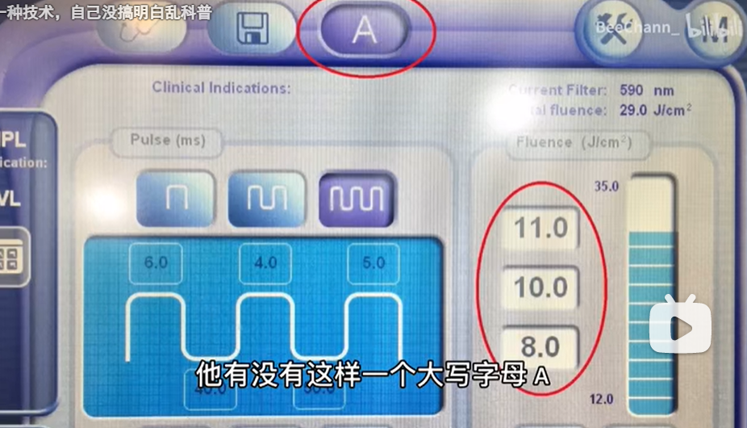{width="5.076388888888889in"
height="2.9055555555555554in"}

#### 几百的光子只一个滤片嫩肤模式打无用

因为大家也不要觉得自己就是打了一个光子，就等于去斑了美白的嫩肤了，去斑美白嫩肤这几个其实是不同的滤片来的，就是说是需要医生在帮你操作的时候，根据你的情况去做一个调整，去更换
但是它的价格是最低的 就是因为它只是用一个滤片去打 就是一个滤片去打
就是一个滤片去打，医生就是去给你用嫩肤模式随便打；然后全程他也不会更换一个滤片，甚至还有可能是一些实习医生去帮你打；那么这种情况下，就算你用的是王者士冠这种比较好的机器，价格其实也不会太贵，因为这样一个打法，其实跟打一个寂寞并没有什么区别；医生本身就是有一个成本，然后加上滤片，然后机器的损耗，这些都是成本，算一下，几百块的光子嫩肤，它能不能涵盖这些成本？不能的话，它自然就不能给你提供一些有效的质量；

#### 我打AOPT￥1600一次 多个滤片 

自己打AOPT，我的价格是一买买了十次，然后大概是1600一次的样子，这个是仅供参考；然后我价格的打法，基本上每次是打三遍，而且打的时候，你是可以很明显的感觉到，医生会根据你不同部位不同情况，他会去更换滤片的，而且还会在某些局部的区域去加强；医生其实他会通常根据每个人的不同情况，去用两到四种滤片，不得；还要再强调一下，医生的手法真的很重要，就是为什么AOPT的价格比OPT的要贵一些，但是我看到很多人都说，他打下来会觉得AOPT的效果反而没有OPT好，因为AOPT它的能量可调节吗？

#### 医生手法重要 咨询师、治疗师、护士、实习医生不要 问清楚医生资质

刚刚说到这一点，其实他就对医生的整个操作手法的要求会更加的高；如果医生的手法不行，他也不一定能打出来AOPT的好，所以一定要问清楚，给你操作的人是不是医生，一定是要医生资质的，那些什么咨询师、治疗师、护士、实习医生都不行。

#### 痘印、痤疮或者红血色明显 适合所有肤质去定期清理光损伤

虽然它这些方便单独拿哪一个出来在医美里面都不是最强的，但是光子嫩肤这东西本身它是个掉达80%的护肤品，就准确来说是适合所有肤质去定期清理光损伤，也不存在说只有痘印、痤疮或者红血色很严重的人才能去做，只不过是说这几种问题皮肤做出来的效果会更加的明显而已。

#### 敏感肌可做 光子嫩肤 刺激胶原蛋白生成

还有一个就是敏感肌能不能做呢？敏感肌是可以做的，因为光子嫩肤它本身它也可以刺激像你的胶原蛋白生成，然后它就可以强韧你皮肤的陪葬，但这些都是要根据医生读炼诊之后他给你个建议，那今天关于光子嫩肤的分享大概就这么多了，然后大家还有什么问题的话都可以在评论留言，我就会回复，然后我们下期再见，拜拜。

#### 评论

#### 敏感肌做光子 

ribuluo547

回复 \@L白勺地 :敏感肌做光子，光子嫩肤是治疗敏感肌的有效手段

2022-04-19 03:371

#### 三角区和下巴人中都一直发红 红血丝

老子是大西几

帅哥，我三角区和下巴人中都一直发红，鼻翼还拌着红血丝，这种可以做光子嫩肤吗

2023-03-27 20:02

##### 红是炎症表现 脂溢性皮炎或者玫瑰痤疮

ribuluo547

回复 \@老子是大西几
:可以，但是我觉得那两个位置的话有可能是脂溢性皮炎或者玫瑰痤疮，红是炎症表现，有可能一直处于炎症状态，除了红还有什么症状吗？如果是炎症的，炎症退了就不会红了

2023-03-27 20:39

老子是大西几

回复 \@ribuluo547
:我去看过医生，医生说我是轻度痤疮，说要做光子嫩肤，我仔细看过鼻翼两边，有血丝，然后就是前面跟你说的发红，这个发红的话，我记得已经好几年了，看起来我的脸色是偏红的，而不是那种黄皮肤的感觉

2023-03-27 21:02

ribuluo547

那你要做几次光子，不要做嫩肤模式，平时美容院体验的那种都是100左右的都是嫩肤模式没用，你做全模式或者专门去红血丝模式的

2023-03-27 21:20

#### 别指望三甲医院的主治医生帮你动手做

BPRS

是的，很多医美机构的医生都不一定是医生

2021-08-15 17:348

被子背在后背上

我觉得还是去三甲医院吧，普通人哪有鉴别是不是正规医美机构的措施

2021-07-24 11:28181

BeeChann\_

三甲医院的医生未必有耐性好好给你慢慢面诊

2021-07-29 11:2510

黑化的大双鱼

我这个月8号才去三甲医院做的，我跟面诊的医生前后加起来，聊了三分钟不到，我脸上有痘痘，毛孔粗大，皮肤粗糙，直说我要做光子嫩肤，他就给我电脑开了个单，问了我最近有没有晒太阳之类的问题，告诉我一些常规的注意事项，然后交了费，是护士帮我做的。也别指望三甲医院的主治医生帮你动手做

2022-06-10 00:55 21

#### 王者之星opt和王者之冠aopt两个设备好

ttkk123321

目前光子嫩肤就两个设备比较好。王者之星和王者之冠。 医院成本一次200左右。

2021-08-03 02:40 120

外婆凑cos多了

回复 \@小天冰雪酱
:这个好像就是王者之冠，叫aopt，算是超光子。王者之心是opt

2021-12-18 09:17 6

#### 五代、六代￥400、￥500+ 七代￥1000+

Gingerbreadbaby

第五代第六代四五百 第七代超光子差不多在1000以上

2021-10-19 11:37

#### 三甲医院的医美科，不要去私立医院或者美容机构

康看看呀

一定要去三甲医院的医美科，不要去私立医院或者美容机构，除了技术差别，三甲医院的抗风险能力也比美容机构和私立医院强太多太多。另外虽然用同样的仪器，但开出标准的发数不一样，价格也会不一样，比如都是
M22的仪器，北大深圳医院的一次2500，发数50,南山协和医院的价格2300,发数45。

2021-10-27 23:2422

#### 红血丝和毛孔明显改善 皮肤更嫩更光滑

而今乃后将图南

回覆 \@美羊羊公主殿下
:我的红血丝和毛孔明显改善，皮肤更嫩更光滑了，痘也少长了，效果真的还不错

2021-08-03 17:57

#### 去痘印，治疗毛孔粗大 皮肤紧致

木v绾菈

回复 \@稻草人w
:去痘印，治疗毛孔粗大，我就做了半年，皮肤会感觉紧致一点，有一定的提亮效果，没啥改善长痘，不过这个长期做下去皮肤质感的变化会比较大吧

2022-02-17 17:59

木v绾菈

我在南京三甲医院打的一次是2000

2021-10-16 13:0512

### [内行才知道！光子嫩肤的6个秘密](https://www.bilibili.com/video/BV1Zd4y1M7u2/?spm_id_from=333.337.search-card.all.click&vd_source=f03b9d349cef8aff4a045d602d8a1d82)

2022-09-27 20:00:00

哈喽大家好，我是小摩，一个死可皮肤的医学博士。今天又要给大家说一下光子了，打之前你一定要知道的6点冷知识，感兴趣的记得提前收藏和点赞哦！我也算是接触了不少光子了吧，100块钱的到2000块钱的都做过，算是好的坏的都打过了。今天给大家说一些内行秘密吧：

#### 第一 ￥99块机器走量

第一点，价格地道离谱的光子，很可能是被医生练手，一切只要是它是进口的，机器成本应该是50万左右，一个有经验的皮肤科医生月薪最少也是2万，如果是一天天流水操作，只做99块钱的光子，那这个医生基本不需要拿月薪了，99块走量就是用来毁机器的成本，所以地道离谱的光子价格，一定是给人家医生练手的呀！

#### 第二 皮秒更考验医生技术 医生无经验毁容 M22自动化

第二点，皮秒超皮秒比光子更考验医生技术，皮秒发射速度够快，直接戳到真皮层，不限皮肤的终点反应就会比较慢，不是说医生他在打的时候，很难当下就给你判断到他打到位了没有，需要过几天咱们才知道他是打好了还是打坏了，所以医生如果没有足够的经验，操作过皮秒超皮秒机器，打了反黑的可能性非常大，就是说充便宜的皮秒激光，还不如去做一次M22，起码不会毁容！

M22这个机器的革新技术，就在于它的完美卖充光，相对不太考验操作者的经验，因为它比较自动化，可以说是傻瓜机器吧！

#### 第三 5次卡10次卡效果才大

第三点，光子仪器之间，打个一次两次的效果真的不是差很大，姐妹经常问我这几个仪器的区别，她怎么做选择？我就想说，如果你不是买个5次卡10次卡，打哪个都一样！

#### 第四 坚持一个医生 知道你的情况

四做光子的话，最好坚持一个医生，同一个医生他知道你皮肤的基础状况，知道多大的能量是你能耐受的预值，下次再打上来就可以，直接按照你的情况进行操作，不用一次一次的重新评估！

我之前听到过的故事就是有的人，他每次都是去充医院的便宜的光子，然后他是新客家嘛，那其实没有这个必要，次换医院换医生，他都是在打一次低能量试水，浪费钱！

#### 第五 一个部位打一次就够 多次则缺乏经验

第五点，打的次数多少，并不是衡量医生水平的标准，不知道从什么时候开始，光子在脸上打的发受越多，越代表这个医生负责，越代表你获有所值！当医生一遍一遍在你脸上打的时候，那就要想一下，他是不是上一次没有打够，他没有办法判断，刚刚自己打到位了没有，所以一直在我们的脸上试来试去，在一个部位打一遍就够了，最多更换滤波片再加强一下。很少人精通18般武艺
经验丰富的医生也很难把所有的仪器 玩得出神入化的 所以你去公立医院
老主任们可能还是做的OPT 比较老的一些光子仪器 收费一千多一次 但是他熟啊
这是他老伙伴了

#### 第六 有个小斑点，第三次一定会淡化 否则浪费

第六点 我们用三次来判定一个医生到底行不行
如果普通的小问题的皮肤做光子一次是很难看见效果的，那么在第三次的时候，总是会有肉眼可见的改善，比如这里有个小斑点，第三次一定会淡化；要是一点变化都没有，就要考虑是不是医生对这台仪器根本就不熟练，或者无法清楚地判断你的皮肤状况，或者这台机器根本都不适合你，就不要死磕了！

好了，关于光子的六点那行人才知道的秘密，我都告诉你们了，希望你们能点个赞；有任何问题的话，欢迎来评论区留言哦。

### 对比图

#### 医美分享\|男人会骗你，但光子嫩肤不会\|含40天打卡记录

2022-01-10 14:56:56

##### 单模式 提亮或者消炎的滤片 全模式所有滤片

喵喵肖\_

单模式是指比如只给你提亮或者消炎的滤片 全模式是所有的滤片都打

2022-01-11 08:18 3

##### 新氧 深圳 M22的全模式*￥*300 

十月夜未央

有没有深圳的兄弟姐妹，这周末我要去做超光子嫩肤，有没有一起的！新氧买的才300多,M22的全模式

2022-01-21 00:24 👍8

##### 深圳宝安三甲福永医院￥700

不知所措的小米粥

光子要坚持呢，一次好像也要小1k吧

2022-01-10 18:53 11

及吾无身

回复 \@肥子的小快乐 :\@肥子的小快乐
我在深圳宝安二甲福永医院，医生说只要700一次唉

2022-03-03 22:24

#### [上周二去做M22的光子嫩肤！感觉医美真的很神奇啊！iPhone前置，我是真的很多很多痘印，立竿见影的淡化了广州已经痘痘没停过我还手很欠喜欢扣痘痘！惊喜！惊喜](https://www.bilibili.com/video/BV1aS4y1g7fx/?spm_id_from=333.788.recommend_more_video.4&vd_source=f03b9d349cef8aff4a045d602d8a1d82)

2022-03-21 23:25:25

前-\>后

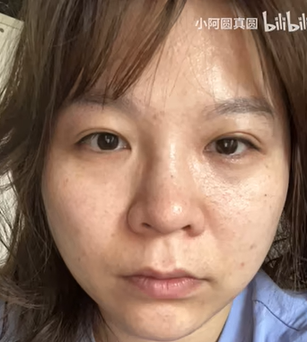{width="1.710690069991251in"
height="1.9057688101487313in"}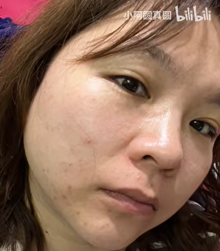{width="1.6742650918635171in"
height="1.9089752843394576in"}

##### m22神奇

微米酱666

不是医美神奇，是m22神奇，，我就没有听过有人说做m22效果不好的

2022-06-22 18:28 👍31

##### 淘宝 美莱 连锁

小阿圆真圆

一次！我是看淘宝活动想试一下效果\[捂脸\]立竿见影！美莱是个连锁好像。

2022-05-05 01:48

##### 黑眼圈没效果

小阿圆真圆

第三天你会发现自己简直不要太美，我好像没有啥红血丝，之前鼻下会有一点点现在好像不知道是不是我的错觉哈！因为我本来就少，但我感觉没有之前那么敏感了。黑眼圈没效果，或者效果太一般。

2022-10-18 13:00 👍4

##### m22光子嫩肤 是AOPT升级版

蔡文鸡泥太霉

回复 \@小阿圆真圆
:我百度那些医生说对黑眼圈有效果，我问了医美机构的她们说没效果。还有就是你做的是m22光子嫩肤吗。现在我看好像很多都是AOPT超光子嫩肤了，是光子嫩肤的升级版，比光子嫩肤效果更好，你有没有做过呀，我有点想试试，又怕被宰

2022-10-18 16:13

##### *M22*光子蛋模式效果不太明显 全模式明显

小阿圆真圆

回复 \@蔡文鸡泥太霉
:我是m22\[doge\]反正你可以先买一次试试，去淘宝买有活动的试一次\[doge\]我第一次是买普通的光子蛋模式效果不太明显也是有效果的！m22全模式就很明显的效果了

2022-10-20 16:00

##### 不去小美容院 去医院或知名机构

酷到汽水喝一半

最好去医院或者比较知名的机构，不要去小美容院，可能连资质都没有

2023-04-23 23:51

##### 淘宝活动买的券￥850三次

小阿圆真圆

我是在淘宝买了全我是淘宝活动买的券.850三次，现在应该没那么贵了吧

2023-02-16 16:50

##### 深圳北大医院￥2500

玉米地里出过事丶

深圳北大医院2500一次

2023-02-16 21:58

### [玻片弄错，能量过高 整容变毁容～](https://www.bilibili.com/video/BV1zt4y1i7Pc/?spm_id_from=333.337.search-card.all.click&vd_source=f03b9d349cef8aff4a045d602d8a1d82)

hwy柠檬玫瑰

估计玻片弄错，能量过高

2020-09-15 10:17 👍93

#### 整形科比皮肤科贵十倍 整形科外包

哎哎那个谁说你呢

有钱的话，去三甲医院整形科做不好么。

2020-09-14 07:08 👍66

李彩燕世首美

整形科比皮肤科贵十倍\[捂脸\]\[捂脸\]我问的同一家医院，一样是激光，也不知道为啥整形科这么贵

2020-09-17 15:12 👍17

jelysong

回复 \@Bili_157775854 :
的吧？虽然是挂着医院的牌子，但实际上人员应该不是医院的。或者是仪器有差别。

2020-09-25 13:11 👍8

#### 脸上皮肤薄的地方功率要调小

口o口ll

功率调大了。脸上皮肤薄的地方功率要调小点

2020-11-04 22:25

### 专业医美 [新氧 光子嫩肤](https://www.soyoung.com/itemk/solution/491) 

### [光子嫩肤做完之后没效果？协和博士告诉你为什么](https://www.bilibili.com/video/BV1uA411p7S4)

2021-01-27 18:00:00

本期指路:

#### 1 IPL DPI OPT AOPT有什么区别00:11

IPL呢是里面最不值钱的，它就是强脉冲光的英文缩写。

OPT呢是科医人公司提出来的，种叫完美脉冲技术的一种技术，这样呢就可以减轻疼痛啊，增加治疗的安全性。OPT也早就不是什么先进的技术了，现在基本上所有的光子，它用的都是类似0PT的这种输出方式，在能量的稳定性上面，可能会稍微有一些差别吧，所以呢还是会建议大家尽量选择。

DPL和AOPT这两个概念是比较新的，现在市场上也比较火。DPL呢又叫精准光，它是飞顿公司提出来的，它可以把发出来的那个光的波长范围，缩短到100nm之间就是缩的很窄，或者550-650nm这些，它呢有两个治疗的工具，还有一个呢，那还有一个AOPT它又叫超光子，是科医人公司提出来的，就我们前面说的OPT的升级版，那除了在调控方面的改进，那一个呢是专门用来治疗痤疮的，还有一个呢是专门用来治疗血管问题的，DPL它的效果呢可能就会更好一些，如果我们有痘痘那AOPT就更对症两点，那如果是要解决泛红血管这些问题呢，虽然会有一些小小的差別，但对我们来说都可以选择，只要医生有经验，就都会有很好的效果，

在这里我还想提醒大家一下，好仪器很重要，好医生其实更加重要。只有两者结合起来，才能够达到最好的治疗效果，虽然光子的副作用很小，但是如果说我们操作不当啊，或者适应症选择的不当，那还是会容易出现，比如红斑啊水泡啊。

#### 2 光子嫩陆的治疗步骤02:32

那我们在做光子之前呢，或者做一个皮肤检测，就是评估一下是不是合适。那光子做起来其实非常简单，它也不需要敷麻药，就洗个脸然后涂上冷凝胶之后呢，光子嫩肤它治疗的时候，它发出来的光会非常非常的亮。所以在治疗的过程中呢，大家一定不能睜开眼睛，而医生呢，也会比如再给你盖个眼罩啊，或者盖上块纱布这样遮盖一下，这种感觉是凉凉的挺舒服的，但是发光的时候就沒有那么舒服了，还是有点痛的。就是就有点像那个被牛皮筋弹了一下，那种火辣辣的那感觉，治疗大概20分钟左右就可以完成，然后治疗之后呢，再敷一片面膜就可以了。

#### 3 光子嫩肤做完之后需要注意的事项03:34

做完了光子以后呢，大多数人的脸上会觉得就是会有点红，然后会有点烫。有的呢还会有点肿。一般呢通过敷面膜或者做点冷敷，治疗的时候如果用的能量高啊，或者是那种就是敏盛期的人，那用的能量比较低，只是为了嫩嫩肤的人，光子在做完了以后呢，就是颜色会有所加深，会有点浅浅的结痂的，看上去不是特别美观之外，一般一周左右的时间，它的效果就可以完全的显现出来了，很多人呢做完了光子之后会觉得干，那是因为虽然光子的能量比较弱，但治疗的时候，这样皮肤屏障的功能会稍微有所减弱，像就容易出现干燥啊缺水啊之类的现象，所以做完光子之后，也是要注意多补水多敷面膜的，那还有一点就是，尤其是夏天或者紫外线相对比较强的地方，那要比平时更加严格的做好防晒，或者一些斑啊就容易复发。

#### 4 做光子嫩肤间隔周期05:04 永久脫毛去痘印

光子治疗的疗程一般来说，我们会让建议间隔一个月左右做一次，那么3-5次是一个疗程，三个疗程之同它的效果可以维持多久呢？它这个维持的时间很大程度上就取决于，你后期防晒工作做的是不是到位？如果经常就是暴露在户外的环境中，那有些色斑就是比较容易复发的。那如果为了脫毛啊去痘印啊这些，那这些去掉的就是永久的了。

##### 去红血丝或改善皮肤潮红会复发

那如果是为了去红血丝或者改善皮肤潮红，那这些问题其实常常和角质层比较薄啊，那可能就是或早或晚都会复发。光子呢对这些问题是有帮助的，但是有时候可能单一的做光子是不太够的，去做一些系统的治疗，那如果是为了嫩肤呢，这个大概一个疗程之后维持，其实会建议大家每隔3-4个月做上一次，这样嫩肤的效果，就可以此较好的维持下去。虽然它单次的治疗效果有限，比如说3
5年下来，就算你除了光子以外什么都不做，那皮肤的颜色啊毛孔皱纹弹性，当你回过头来再看的时候，好很多。

#### 总结一下:

1、人员仪器很重要，好医生更重要，两者结合，才能意到最好的治疗效果。

2、做完光子之后，多数人脸上会有点红，有点烫，通过敷面膜或者冷数，第二天就可以退的差不多。

3、所以做完光子之后，一定要注意多补水多敷面膜，也要做好防晒工作。

#### 评论

##### 长痘无法做

-乐乐儿-

上次去医院，问了一下，医生不建议我做因为零星长了几颗痘，他就说得要不长痘的时候再打，而且让我去之前就好好防晒两个月可难倒一直有痘痘的存在就一直不能做？而且只听说过做完要防晒，做之前防晒这个也是必要的嘛

2021-01-30 15:2243

-乐乐儿-

回复 \@栗子川酱
:谢谢科普我痘痘不是很严重，主要是皮肤角质层薄，所以红血丝和黑眼圈都很严重，稍微运动一下脸上就很容易泛红所以想改善一下，再去问问看医生怎么说吧

2021-02-01 01:295

##### M22最有劲 私立活动时便宜

佛系彭小纯

我做过M22,辉煌360，韩版，一路感觉下来M22最有劲，至于价钱公立医院比较稳定，私立的搞活动时候很便宜。。。

2021-01-27 19:5161

##### 敏感肌 晒太阳 洗澡脸红

Jessica3737

一晒太阳，或者洗完澡脸会很红，这也是皮肤有炎症吗？持续7-8年了

2021-02-09 17:347

欧阳么么哒i

敏感肌肤

2022-09-24 22:27

##### 深圳三甲 光子2000/次

万花谷的冉冉

回复 \@冬冬家的小可爱 :回复 \@冬冬家的小可爱
:我在深圳三甲医院，光子也是一次2000

2021-02-04 00:50

##### 妇幼保健1200/次

前排出售小可爱

回复 \@万花谷的冉冉 :同深圳三甲，我这边光子嫩肤1200一次

2021-02-04 21:14

前排出售小可爱

回复 \@gaga_hu
:妇幼保健，也是三甲，但是只能做光子嫩肤和果酸，皮秒什么的做不了

2021-02-04 22:10

前排出售小可爱

回复 \@gaga_hu
:红荔路和福强都可以面诊，但是所有的机器都是在福强那边，就算去了红荔也要跑去福强打，所以直接去福强那边会方便一点

2021-02-05 14:19

##### 光子 医生说做五次

万花谷的冉冉

回复 \@麻浦洞靓妹 :医生说五次

2021-02-19 11:10

都被跟我重名

我油痘肌做了3次 m22aopt
然后痘没了，白了......但是变干皮了......我建议你别超过3次。跟医生好好沟通，有痘的地方多打点祛痘的。

2021-02-19 21:36

##### 没钱了照红蓝光 杀菌消毒 不长痘不祛痘

都被跟我重名

回复 \@嗨哟喂可不就是我嘛 :aopt。最近我照红蓝光了因为没钱了

2021-05-03 10:50

嗨哟喂可不就是我嘛

回复 \@都被跟我重名
:怪不得我做的这个这么便宜。。。原来我是opt单纯的祛痘印不能祛痘

2021-05-03 10:52

##### opt单纯的祛痘印不能祛痘

嗨哟喂可不就是我嘛

回复 \@都被跟我重名
:怪不得我做的这个这么便宜。。。原来我是opt单纯的祛痘印不能祛痘

2021-05-03 10:52

##### 微针没用，别打

clio纪梵希

微针没用，别打

2021-12-11 18:03

##### 光子避开眼周 黑眼圈无用

re0EMT

黑眼圈做光子有效果吗？

2021-02-04 23:128

赛勒玛

做光子都会避开眼睛周围

2021-02-12 14:342

##### 建议医院做，不要美容院 价格不会差很多

拒绝刘亦菲

医院和美容院价格不会差很多，但是效果可能差很多，建议医院做，不要美容院，我是过来人。光子嫩肤的话，三甲医院一般1000-1500。

2021-01-29 19:15

##### 红血丝做dpl

玻璃心小仙女VIP

红血丝做哪个比较好呢 不敢去美容院三甲医院会不会很贵

2021-01-28 11:153

椒盐鴨

当然是dpl！三甲医生让我做的

2021-01-31 12:011

##### 过度洗脸仪烂脸4年

辣子达达

过度使用洗脸仪 然后烂脸4年了

2021-02-23 23:03

补水保湿➕防晒，不过度清洁

### [【抗初老指南】正确护肤你做了吗？抗初老让你肌肤逆龄不是梦！！](https://www.ixigua.com/6678186264954405390)

502次观看 · 发布于 2019-04-10 16:53

爽肤水：菌菇水

精华液：

### 连续做5年光子嫩肤会怎么样？

2234次观看 · 发布于 2022-04-18 18:24

### 光子嫩肤------谨慎！谨慎！再谨慎！

#### 贪便宜 小的美容院、工作室不规范

**// 安全**提示

正规医院、有资质的医生来操作的话，它一定是个非常好的项目。但如果你贪图便宜去找小的美容院或者工作室做，那么不规范的操作流程，没有消毒的操作环境以及无资质的操作师，这个项目肯定弊大于利！！

#### **什么是光子嫩肤？**

光子嫩肤是一种先进的高科技美容项目，采用特定的宽光谱彩光，直接照射于皮肤表面，它可以穿透至皮肤深层，选择性作用于皮下色素或血管，分解色斑，闭合异常的毛细血管，同时光子还能刺激皮下胶原蛋白的增生。所以肌肤的日常保养护理，光子嫩肤是最佳的选择。

I型嫩肤：就是消除色素性皮肤病包括雀斑、[日光性黑子](https://www.zhihu.com/search?q=日光性黑子&search_source=Entity&hybrid_search_source=Entity&hybrid_search_extra=%7b%22sourceType%22%3A%22article%22%2C%22sourceId%22%3A%22163388246%22%7d)/脂溢性角化等、雀斑样痣；[血管性皮肤病](https://www.zhihu.com/search?q=血管性皮肤病&search_source=Entity&hybrid_search_source=Entity&hybrid_search_extra=%7b%22sourceType%22%3A%22article%22%2C%22sourceId%22%3A%22163388246%22%7d)，消除毛细血管扩张症、[酒渣鼻](https://www.zhihu.com/search?q=酒渣鼻&search_source=Entity&hybrid_search_source=Entity&hybrid_search_extra=%7b%22sourceType%22%3A%22article%22%2C%22sourceId%22%3A%22163388246%22%7d)、鲜红斑痣、血管瘤等嫩肤治疗。

II型嫩肤：是针对真皮胶原组织结构改变相关疾病的治疗，包括皱纹、毛孔粗大、皮肤粗糙，以及各种炎症性疾病如痤疮、水痘等遗留的微小凹陷性瘢痕等。

#### 适合光子嫩肤的人

光子嫩肤适合的人大概可以分为四类：

1、脸上长小色斑的，不管是晒得，还是遗传的雀斑；

2、皮肤松弛，开始出现小细纹小皱纹，往中老年皮肤发展的人；

3、皮肤颜色晦暗（也就是俗称的黄脸婆），希望得到改善的；

4、痘痘，痘印，痤疮，毛孔，[毛细血管扩张](https://www.zhihu.com/search?q=毛细血管扩张&search_source=Entity&hybrid_search_source=Entity&hybrid_search_extra=%7b%22sourceType%22%3A%22article%22%2C%22sourceId%22%3A%22163388246%22%7d)等等问题的。

#### 术后立马冷却补水面膜 一个月内不暴晒 一周每天敷医美面膜

术后立马做好冷却补水面膜，好好敷，认真敷，马虎了还是有可能会导致皮肤受伤！！！

做好防晒：最好一个月内不暴晒，出门必涂防晒，我一般在室内待着不出门。不听话的10个当中，9个会色沉或者雀斑重新长出来。

补水：术后一周每天医美面膜好好敷，不化妆。如果不好好补水，一周后就能感觉皮肤越来越干，弹性越来越差。

以上这三点，基本就是很多人认为做光子嫩肤做毁了的原因，自己在恢复期，即皮肤屏障很薄弱的时候不好好护理，导致皮肤变差。

[编辑于 2020-07-24 12:28](https://zhuanlan.zhihu.com/p/163388246)

#### 后悔没有年轻时候做 延缓皮肤老化 皮肤很干净

[ivy](https://www.zhihu.com/people/ivy-99-54-34)2021-11-20

我皮肤没啥大问题，但还是经常做，后悔没有在年轻的时候开始做，\
我32岁才开始做，一个月一次连续搞了半年。这几年基本维持每年4-5次的频率。对延缓皮肤老化有好处，皮肤很干净。\
可惜我疤痕体质凝血也不太好，不能做水光针，不然皮肤应该可以无敌了

👍11

#### ￥380/次 太便宜恐怕有问题 只做鼻子差不多

[ICYOU](https://www.zhihu.com/people/edd2707757610eb9e85430d5719ea5f3)回复[ivy](https://www.zhihu.com/people/542a301010852b6762e5aac5e20fd62c)2021-12-12

你多少钱一次？我打听了一家，380一次，会不会太便宜了啊？\[捂脸\]

[ivy](https://www.zhihu.com/people/542a301010852b6762e5aac5e20fd62c)回复[ICYOU](https://www.zhihu.com/people/edd2707757610eb9e85430d5719ea5f3)2021-12-12

......这个价格恐怕有问题

[柚子少年](https://www.zhihu.com/people/7b03d6edd35fb957f766782bb1dc26e0)回复[ICYOU](https://www.zhihu.com/people/edd2707757610eb9e85430d5719ea5f3)02-10

380做一次鼻子差不多

[紫霞仙子](https://www.zhihu.com/people/3fcd0bb294ce0eb76cdd2d16086d6cb0)回复[ivy](https://www.zhihu.com/people/542a301010852b6762e5aac5e20fd62c)2021-12-27

我做的是1800一次的，啥情况

[ivy](https://www.zhihu.com/people/542a301010852b6762e5aac5e20fd62c)回复[紫霞仙子](https://www.zhihu.com/people/3fcd0bb294ce0eb76cdd2d16086d6cb0)2021-12-28

你这个价格是正常的

[ivy](https://www.zhihu.com/people/542a301010852b6762e5aac5e20fd62c)回复[敬山岱](https://www.zhihu.com/people/155285cebd1636fbebe0c274c29820c0)2022-02-10

可以提亮肤色，但是其他的估计够呛

医生建议术后 敷完之后一周1-2次就可

#### 正规价格￥1200-1800

[春水不下流](https://www.zhihu.com/people/kou-wu-zhe-lan-71)回复[耳又乐](https://www.zhihu.com/people/xiang-qu-wai-xing-qiu)2022-03-14

大的三甲医院，或者大型皮肤病专科医院都有的，正规价格都是在1200-1800之间

#### 术后一周每日敷，再之后一周1-2次

[知乎用户](https://www.zhihu.com/people/232abd6f3573ff26cbd03c27b1672950)2022-01-08

医生是不建议每天敷面膜的，术后敷完之后一周1-2次就可以了

👍3

#### 油皮+毛孔粗大+红血丝暗疮 光子+刷酸+针清

[Lucky](https://www.zhihu.com/people/zen-84-8)回复[桥豆麻袋](https://www.zhihu.com/people/nanase-28-80)2022-01-03

我是混油皮+毛孔粗大还有红血丝暗疮等问题，然后医生建议我去做的，还有刷酸和针清，现在感觉恢复良好。你可以先咨询一下让医生看一下皮肤情况,再做具体决定

#### 黄褐斑属活性斑 单独治疗

[然然](https://www.zhihu.com/people/deecf3bc91a887155246b7336b2412b1)回复[冷艳抠脚大婶](https://www.zhihu.com/people/d8d412f3bd52fd08690ed74328e18b74)2022-01-14

黄褐斑属于活性斑治疗起来比较复杂，还需要专业的人看情况去操作

[123](https://www.zhihu.com/people/9cdf93395d946079286f25f91ff02718)回复[冷艳抠脚大婶](https://www.zhihu.com/people/d8d412f3bd52fd08690ed74328e18b74)2021-07-27

黄褐斑要单独做的。我还在治疗中

#### 晒黑白不回可做

[大大的瓜子](https://www.zhihu.com/people/da-da-de-gua-zi)2021-12-17

小时候晒黑白不回来能做吗

[然然](https://www.zhihu.com/people/ran-ran-18-83-81)回复[大大的瓜子](https://www.zhihu.com/people/da-da-de-gua-zi)2022-01-14

可以做的啊

#### 我的光子医生也没说要敷面膜

[hey
guys](https://www.zhihu.com/people/zhi-zhi-59-20-17)回复[大z](https://www.zhihu.com/people/da-z-97-49)2022-01-21

我什么都没敷，我的光子医生也没说要敷

### 在三甲医院做了个光子嫩肤

#### 皮肤较白敏感，酒糟鼻，毛孔超级大，建议做光子嫩肤

本人情况是皮肤较白，及其敏感（缘于初中，高中时瞎整，做了很多错误的护肤动作（为了祛痘，我试过几乎一天用了半瓶所谓的祛痘精华液，几乎每小时大量涂抹的节奏；初中就用撕拉黑头贴；美容院做完护肤回家随即洗面奶狂洗等等一箩筐）

因为高中有过[酒糟鼻](https://www.zhihu.com/search?q=酒糟鼻&search_source=Entity&hybrid_search_source=Entity&hybrid_search_extra=%7b%22sourceType%22%3A%22article%22%2C%22sourceId%22%3A%22150128184%22%7d)的经历，且后续有不太讲究的挤黑头动作，现在鼻子毛孔超级大，比我妈妈，比我爸爸弟弟的还要大，常年可以挤出颗粒状的黑头，化妆也会卡粉。因为年纪缘故脸颊毛孔也渐渐大了，于是想要收缩一下毛孔。

摘了口罩后，他看了一下我脸部，对话中知道我来意，也直接告诉我说我肤色不均匀，很油，鼻子毛孔确实很大，然后建议做个光子嫩肤，让至少先做个两次，就是下个月还来一次。因为我不确定什么时候可以离开广州，医生也说到时人还在就继续来做，人不在了也没办法。

#### 价格 ￥1800

然后我问了费用，光子嫩肤一次是1800元，眼角的斑是480元。（医生有给我看价目表，去斑的话芝麻大小一粒50元，绿豆大小100元。。。我还趁机想要磨了一下价，说我的斑也就绿豆大小，老头儿告诉我至少有6颗绿豆的大小。）整个面诊过程也就10分钟吧。

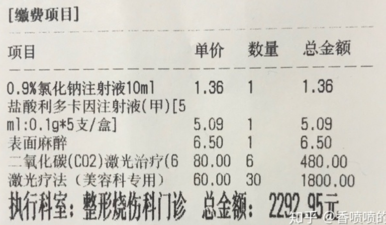{width="5.833333333333333in"
height="3.395181539807524in"}

image-20220523075333329

二氧化碳是点痣，激光才是能嫩肤

#### 激光治疗后须知

整形美容科激光治疗后须知\
1、激光治疗后有2-3天红肿不适，伤口修复至自然脱痂需要1-2
周/个别需要更长时间。\
2、保持伤口清洁干燥，湿水或淋浴后风简即时吹干伤口。\
3、勿进食辛辣刺激食物(包括海鲜)勿\...\...\
4、如有需要，随时复诊。\
5、脱痂后皮肤由嫩红恢复至正常肤色至少需要3-
6个月，个体差异，个别需要更长时间。\
6、注意防晒保湿。

1.晚上不要涂抹任何护肤品，白天化妆也好什么都行，晚上就不要抹任何东西了。而且不是这段期间，是以后晚上也不要抹任何。（我开始以为只是我皮肤比较油，他才如此告诫，后来等待治疗期间跟候场的其他女生聊了一下，才发现他对所有人都这么说。说现在的人听各种信息，每天在乱护肤。）

2.晚上12点前睡觉（臣妾做不到）

3.不要吃甜的

4.光子嫩肤可以长期做，就是前面2-3次可以安排一个月做一次，然后间隔开来，3-4个月做一次，后续一年2次，甚至更长间隔时间，维护得好皮肤就可以保养得很好

因为网上搜资料信息时，很多前人都在提到补水保湿，于是我问医生是否有什么配套产品要一起用，他就说楼下药房有敷料可以一起用，说找[创福康](https://www.zhihu.com/search?q=创福康&search_source=Entity&hybrid_search_source=Entity&hybrid_search_extra=%7b%22sourceType%22%3A%22article%22%2C%22sourceId%22%3A%22150128184%22%7d)（这里说了个品牌，会不会被认为是广告？这里我纠结了下下，后来想着，看这个帖子的人大多是计划要去做的人吧，大多都会去收集多方信息，并且这是医生说的话，我转述其实也是无妨）面膜就好，150元5张（具体金额不记得了）。但这个问题是我先问起，医生才告知的，而并不是医生主动要求需要使用的，我好懒，也就没有去买了。

#### 医院认为洗面奶也就那么一回事

（另外洗手台上是一款某品牌的洗面奶，就是超市或屈臣氏都能买到的普通洗面奶，医院对洗面奶挑选的随便加固了我的认知，就是市面上的很多各种功效的护肤品，其实也就那么一回事，求美者心心恋恋期待某种特定效果，比如说祛痘保湿之类的，弄一大堆护肤品其实也未必能达到你想要的，只因这些产品都抵达不了真皮层，用再多其实比不上一次医美效果来得好。而洗面奶算是里面最有功效的最实在的了，毕竟它确确实实可以清洁掉脸上各类东东。当然日常简单护肤还是有效的，只是太复杂的真没必要。个人愚见哈！）

我自己洗完脸后，就到了激光室趟着了，给我做治疗的还是上午面诊的医生（看来他是上午面诊，下午治疗），先做光子嫩肤。闭眼后，他就直接上机器打了一通，只是感觉一点点烫，也还能接受（但是我一直惦记着我鼻子上的黑头，美容院的话，小姐姐们肯定会帮我先清理一番的，然而他并没有）；

然后他又往我脸上抹了凝胶类东西，继续用设备打在我脸上，当时具体感觉也不太记得了，反正没有很不舒服（也可能从前我做的激光祛痘经历过太多疼痛，导致这回我却没有什么感觉了）。做的期间他还跟我不时的聊天，聊香港那堆戴黑口罩的青年，谈印度中国要打仗的事，谈他去了尼泊尔旅游之类的。

#### 木棒粗暴的刮跟挤黑头

我问起了黑头的事，他说不用处理。然而抹了凝胶，打了几通之后，他开始拿着一根木棒硬生生掰我鼻子处理黑头了，是的，你没看错，就是木棒，后来我网上查了一下，因为不记得医生说的那个名词，而网上我也没搜到究竟是什么。你可以想想平常去黑头都是用黑头针去挤，针对每一个黑头去挤，而当下医生是用一根不知道形状的木棒去刮跟挤（因为抹了凝胶，医生说黑头都浮上来了，这时候就可以处理了），并且医生非常粗暴的去刮跟挤，我一度担心鼻子会不会被他按歪按爆破了，并且木棒这玩意儿感觉没办法很细致地去处理黑头啊，顶多把大的弄出来。处理完黑头，他接着用机器打了一通，整个过程不到20分钟，1800元的光子嫩肤就做好了（女人的钱真是好赚）。

#### 应该先去美容院做个脸部清洁的，处理一下黑头

做好以后医院也没有给我冰块让我冰敷，或者贴个什么面膜之类的，就算是结束了。比起美容院，服务真的是，谈不上服务了。做完的当下，被二氧化碳激光冲击波灼伤的地方有一块块的小痂，要等待脱落，而斑的位置就是明显一块创伤的痕迹，估计脱落时间较长。但皮肤真的亮了好几度（我尝试自拍，可是拍出来的照片真的不忍心上传），而至于我的鼻子，脸颊的毛孔并没有觉得有明显的缩小迹象（有点小后悔的是，做之前我应该去美容院做个脸部清洁的，把黑头处理一下，再让医生来治疗，效果应该会好很多），顽固黑头仍旧看得到。

#### 做后脸上肤色变亮了 对光敏感

做后一两天内，脸上肤色确实有点不一样了，光亮了。据说做后对光敏感，而我也一直没有出门。就是洗脸的时候，只用了温水去清洗，也还没有涂抹任何护肤品，主要是自己感觉涂抹后结痂会变得很慢吧，还是想要那些痂赶紧掉下。并且我鼻子今天红了，感觉又要长痘痘了，而脸部也出现了一颗有脓包的痘痘。

建议的话，经济条件许可，又爱美的女生，光子嫩肤还是建议去做的。对皮肤要求不是那么高的话，其实日常护理也就足够了。但看此贴的估计都是有意向的，要做的话，还是尽可能地去正规医院吧，图个安心。

做完光子嫩肤的几天，自己没什么感觉，只是出油情况少了。但是跟男票视频时（我们目前异地，做完治疗后2天没有视频了，他不知道我做了光子嫩肤），他有明显感觉到我脸部白了并且发亮。我一度解释只是有油而已吧，他说油的话他是分得清的，现在是明显亮了，我只说用了个新面膜。再后来的一天，他又主动提起，新的面膜真的很管用，说我的脸真的白了跟亮了。
我想，旁观者清，这玩意儿看来确实有用。

#### 第10天后效果

光子嫩肤的第10天

2020年7月3日

昨晚光子嫩肤的第10天，我又来了。

今天我特意对比了一下10天前拍的照片（照片都是高清像素下的原图，比身份证还要难看，原谅我不能发出来。真的搞不懂其他人post出来的照片，感觉她们皮肤都好好啊），我仔细的对比了好久，真感觉差不多。但我想，跟自己没有好好维护有很大关系。

现在感觉：1.脸部出油确实没那么多，这个是很明显的。近几年我都只用温水洗脸，鼻子出油一直很厉害，现在洗的时候明显没那么多油了。

2.脸上的一些小痘痘或粉色还是像往常一样在长

3.先前医生说这有助于帮助肤色变均匀，暂时没有发现有此效果

#### 做后要好好保养 否则白做

1.做后至今，我仍旧凌晨3,4点才休息去睡

2.做后至今，我一张面膜都没有用，只买了瓶喷雾，干的时候喷喷

3.做后第5,6天我就没忍住，吃了好几顿海鲜（生蚝）），第7天，我就吃酸辣粉了,还吃了烧烤

4.我还去了学游泳，摘下泳镜的时候眼睛周边看着都像有淤血一样的感觉

5.我还去了游泳，露天，白天也去，并且没有抹防晒霜

反正我就是在找死，要是没有决心好好的护肤，其实做了基本无用。就是要做的小伙伴们，做后一定要做好保护防护工作，这样才有效。

#### 去痘印只能靠医美 抹护肤品，吃中西药无用

感觉身边越来越多人的人去做皮秒祛斑，光子嫩肤，刷酸之类的医美项目了，对于只是想要改善皮肤状态的人，你们研究研究去做就好。但是对于那种脸上有很多痘痘，痘印的人，我想要多说几句，并且自己有底气说几句，毕竟我是个曾经整块脸都发炎，通红，长满痘印，且有酒糟鼻的人。不要犹豫了，去痘印只能靠医美。抹护肤品，吃中西药之类的远远达不到你想要的效果。

我大学时期是整张脸烂了的节奏，那会儿吃了很多中药的汤包和中药丸，西药丸也吃了不少，还遵医嘱定时抹不一样的药物，但都没有用（我去了皮肤科防治所，也去了好几家三甲医院），但最终还是靠激光祛痘救了我

#### 一个疗程 前几次是做针清:挤痘痘，去粉刺消炎，后来上机器

当时（10年前）的医美，价格真心不低，但那是我最后的选择，也庆幸我选择了。一个疗程下来，我的脸就好了。当时前几次是做针清，就是挤痘痘，去粉刺，消炎，后来几次就是上机器，就是这样不到2个月的时间，我的脸就有了明显的好转。我不能说做了以后皮肤多么的娇嫩，光滑，但至少是寻常人的脸，也不再是痘痘脸。如果此刻满脸都是痘痘，被痘印困惑很久了，不要犹豫，试试医美吧，反正也不能再糟糕了吧\~

#### 学英语去中东

学英语的自己，却不敢接任何外单（兼职口译）

因为我离开了广州，也就没有继续做第2次，也庆幸没有做第2次，中东这个鬼地方，猛烈的太阳，及其干燥与高温，对于想要做皮肤护理与保养的人非常不友善！

[编辑于 2020-08-25 14:58](https://zhuanlan.zhihu.com/p/150128184)

#### 评论区 - 价格

#### 三甲光子￥4k/5次 北京空军总院

[迷途小猫](https://www.zhihu.com/people/mokanu-wang)2020-07-17

我昨天在三甲做了光子，4000元5次

👍10

[一一](https://www.zhihu.com/people/b4f78c0a884f7c11521bed1b6bd05c01)回复[迷途小猫](https://www.zhihu.com/people/69eba1df67453f31cbf9353c7b40b707)2020-09-24

北京空军总院？

[迷途小猫](https://www.zhihu.com/people/69eba1df67453f31cbf9353c7b40b707)回复[一一](https://www.zhihu.com/people/b4f78c0a884f7c11521bed1b6bd05c01)2020-09-25

嗯嗯

[迷途小猫](https://www.zhihu.com/people/69eba1df67453f31cbf9353c7b40b707)回复[林清雪](https://www.zhihu.com/people/2191e6bcaf0302e460967682cc8ad3c0)2020-08-15

热玛吉是真的有效果，光子嫩肤我刚做了第一次，提亮的确有，祛痘印效果还没感觉出来，不过夏天保持的太累了...

空总热玛吉 ￥18000

[一只叮当猫](https://www.zhihu.com/people/e3bdd2ba9d47568357f88eb9d9fcdc2a)回复[迷途小猫](https://www.zhihu.com/people/69eba1df67453f31cbf9353c7b40b707)2020-09-26

空总热玛吉多少钱啊？

[迷途小猫](https://www.zhihu.com/people/69eba1df67453f31cbf9353c7b40b707)回复[sophia](https://www.zhihu.com/people/58dc70fcc56cb1d733cbfd1a806c98a0)2020-12-04

激光美容科

#### 广医科大顺德医院￥900/次

[甜小糖](https://www.zhihu.com/people/3f085ce15bd302b0fce3190e1d57d906)回复[迷途小猫](https://www.zhihu.com/people/69eba1df67453f31cbf9353c7b40b707)2021-03-14

为什么我这边的二甲医院这么便宜，只要五百多一次，医生跟我说是在打折，是因为我们这边经济水平比较低吗？我在佛山

[甜小糖](https://www.zhihu.com/people/3f085ce15bd302b0fce3190e1d57d906)回复[景行](https://www.zhihu.com/people/a7234128b17c14744d87c4fdabc18d7d)2021-04-06

广州医科大学附属顺德医院，但是现在恢复原价了，要九百多一次，不过我还是准备去三甲医院打

[迷途小猫](https://www.zhihu.com/people/69eba1df67453f31cbf9353c7b40b707)回复[嘟嘟](https://www.zhihu.com/people/9476e15ce59a1770bf16206ccac62576)2021-05-02

不能医保卡余额支付，这个不是医保类

[小怪兽](https://www.zhihu.com/people/85687463a34a494b2f197f7c3d8f6ee4)回复[迷途小猫](https://www.zhihu.com/people/69eba1df67453f31cbf9353c7b40b707)2021-07-27

我也正想去空总呢，这比楼主的便宜这么多呀；就是跑来跑去好远，我在想有啥办法自己在家做么

#### 上海九院 ￥3k/次

[达不溜](https://www.zhihu.com/people/931e0a96ea1f73cf7fcccb6988960332)回复[迷途小猫](https://www.zhihu.com/people/69eba1df67453f31cbf9353c7b40b707)2022-01-16

为啥上海九院3千1次，肉疼

#### 2线城市 ￥600/次

[我想我是风](https://www.zhihu.com/people/cfbdb7a9bef5275af9746585c5ece59b)回复[焦糖咖啡](https://www.zhihu.com/people/fcbe1529af80fc625a4594cacd0d7fe3)2020-12-02

每个地方不一样吧，我2线城市 600一次

👍1

#### 三线首府城市的三甲 ￥3k/次

[六七姐](https://www.zhihu.com/people/liu-qi-jie-99)2020-08-23

三线首府城市的三甲，我昨天去问了做一次光子3000，直接给我劝退了。。。。。

[孤独的狗](https://www.zhihu.com/people/qian-qian-99-57-18)回复[六七姐](https://www.zhihu.com/people/liu-qi-jie-99)2020-09-28

太原三甲光子嫩肤3500一次，我也没舍得做，就做了一颗大的斑300块

#### 广州南医三院单次￥1850，三次￥4580

[mioo](https://www.zhihu.com/people/ef9181944dfe66d2822e22e9ea0a2bf0)回复[kikiynd](https://www.zhihu.com/people/dbb853b3578cbe2cf7df5dec37a026bc)2021-02-15

我去的广州南医三院，光子嫩肤单次1850，三次4580，不知道是在医院做还是去美容医院，价格差的很多，有在南医三院做过的吗

[龙
婷](https://www.zhihu.com/people/62cedf31c6bffed46540924c4b97b83e)回复[mioo](https://www.zhihu.com/people/ef9181944dfe66d2822e22e9ea0a2bf0)2021-03-03

呀，遇到友军了，我昨天就在这里做完了，1836一次，疼的老娘眼泪都要出来了，很多斑已经浮出表面了密密麻麻

#### 一疗程 1月/次 3次 ￥1.6k/次

[蛤蟆的天空](https://www.zhihu.com/people/9967a449b6f01de415e2a3817be28613)回复[小熊熊](https://www.zhihu.com/people/7c10612bf56ce70be55dd2814cabe83c)2021-03-25

效果挺好的，能感觉确实是有作用的，只不过作用只持续了半年不到，感觉性价比不算太高

[蛤蟆的天空](https://www.zhihu.com/people/9967a449b6f01de415e2a3817be28613)回复[小熊熊](https://www.zhihu.com/people/7c10612bf56ce70be55dd2814cabe83c)2021-03-25

三次吧，我的是一疗程，平均一个月一次吧，￥1600/次

#### 广东省皮肤病医院光子嫩肤￥1608/次

[NING](https://www.zhihu.com/people/ning-63-19-24)2021-02-27

广东省皮肤病医院光子嫩肤1608，就打一遍光5分钟搞定\[捂脸\]

👍2

#### 深圳北大医院￥2500/次

[Chuny](https://www.zhihu.com/people/chuny-13)2021-04-23

深圳北大医院一次2500，为什么这么贵

#### 广州中山二院￥1500/次

[专扮少女](https://www.zhihu.com/people/lin-shou-xing-69-9)2020-12-18

你好，我今天在广州中山二院做的光子嫩肤1500一次做完也是啥服务也没，让我自己洗掉脸上的凝胶，也没给我敷面膜涂保湿，就给了我一包薇诺娜防晒试用装，给我做的好像是一位学生，脸上有点刺痛能接受，昨晚看了下镜子也没啥变化，没有红肿结痂之类的，涂了防晒就走了，也不知下次该不该去。

👍1

#### 家后面普通医院皮肤科￥800/次

[Ottilie](https://www.zhihu.com/people/ottilie-97)2020-11-21

我家后面的医院，800一次

👍1

[Ottilie](https://www.zhihu.com/people/edb87ee3f95154098efe7cea36cb853b)回复[雨忧](https://www.zhihu.com/people/3568a60f76c68a399cffe21cf2beb7a2)2021-06-23

就是普通医院的皮肤科，比我家前面的私人医美便宜很多

#### 评论区 - 做

#### 三次才见效

[阡陌](https://www.zhihu.com/people/ec586202a56db9bfb914b5da5cc6d9dd)回复[糖果果](https://www.zhihu.com/people/461a55c23797868fc1e84825d90c0c7a)2020-09-21

医生说一个教程三次才会很见效的

#### 光子起码做五次才有效

[索猫](https://www.zhihu.com/people/bo-zi-75-36)回复[虫子姐](https://www.zhihu.com/people/chong-chong-63-71)2020-09-27

光子起码做五次才有效 这个太温和了

#### 能除斑点和痣 必须防晒

[小桃小姚](https://www.zhihu.com/people/4a4a772530b69be0b6dec3fb9a75d001)回复[星星](https://www.zhihu.com/people/61bd0a880f6b9b3bfd56cf79c8dc52d5)2020-08-13

常德做的，能去除有些斑点和痣，还是一点，必须要防晒

#### 皮肤检测是噱头 没用

[你脸红什么](https://www.zhihu.com/people/wang-li-28-93-40)2021-05-14

姐妹，我今天在上海华山做了第一次的光子，咨询前我还以为要做皮肤检测，做激光的医生跟我讲，皮肤检测就是机构的噱头。没啥用的。你做光子前医院又给你检测啥嘛？我就拍了个照。

👍2

#### 痘印和新痘 鼻子毛孔大 鼻翼颜色深 医生建议光子

[遇见LUCK](https://www.zhihu.com/people/febc356e99035bde931a6e70d0728880)回复[你脸红什么](https://www.zhihu.com/people/caeea0c9dc022ea74e3307a85a5b1767)2021-12-28

姐妹，我今天去华山看痘，主要是痘印和新痘，还有鼻子上毛孔大，鼻翼颜色很深，医生也是建议我做光子。我想问问你啊，你做光子后痘痘好点了吗？值不值得做啊？

#### 做完敷营养医美面膜 光子伤害皮肤

[Miaomiao](https://www.zhihu.com/people/miaomiao-40-63)2020-08-21

我在北京某总做的，医生护士都说做完得敷医美面膜。做光子刷酸这些对皮肤还有一定伤害的，医美面膜里有营养成分，是需要的哦。

#### 阿达帕林凝胶+夫西地酸乳膏 祛痘

[遇见LUCK](https://www.zhihu.com/people/febc356e99035bde931a6e70d0728880)回复[你脸红什么](https://www.zhihu.com/people/caeea0c9dc022ea74e3307a85a5b1767)2021-12-28

姐妹，你用什么产品去的痘痘啊[\
你脸红什么](https://www.zhihu.com/people/caeea0c9dc022ea74e3307a85a5b1767)回复[遇见LUCK](https://www.zhihu.com/people/febc356e99035bde931a6e70d0728880)2021-12-28

我没用什么护肤品祛痘，就是医生开的药膏。（夫西地酸乳膏，还有达芙文）护肤品就是普通保湿的

[你脸红什么](https://www.zhihu.com/people/caeea0c9dc022ea74e3307a85a5b1767)回复[遇见LUCK](https://www.zhihu.com/people/febc356e99035bde931a6e70d0728880)2021-12-28

不哭不哭，达芙文就是阿达帕林凝胶，复方克林霉素凝胶是华山自制的药膏，和夫西地酸乳膏都是会产生耐药性的药膏，都是抗生素类的，那个我也用过的，这两个用一个就行了。

#### 去了皮防所做光子 给开生长因子 怕闷痘

[Ninananana](https://www.zhihu.com/people/lu-ying-ying-28-9)2020-09-15

话说我昨天去了皮防所做光子，医生给我开了两种生长因子还有一个日晒防止膏，我涂完脸油光发亮！医生没让我不涂东西更没让我晚上不涂，我能不涂吗快油死了

[Ninananana](https://www.zhihu.com/people/lu-ying-ying-28-9)回复[香喷喷的烤鸡](https://www.zhihu.com/people/connie-62-17)
(作者)2020-09-16

给我开了很多呢，一个喷的生长因子，一款凝胶状生长因子，还有日晒防止膏（可以活血化瘀，清热解毒，也可以当防晒霜）涂完这些我就是猪刚烈！然后我现在早晚一片敷尔佳.目前看起来白了。不过我刚做完也觉得白了，没有红肿.可是我怕用那么多闷痘

#### 评论区 - 不做

#### 改善酒糟鼻 有更好的项目

[Qui
Qiu](https://www.zhihu.com/people/qui-qiu)回复[静静](https://www.zhihu.com/people/jing-jing-42-40)2021-02-27

改善酒糟鼻，酒糟鼻就是玫瑰痤疮，但是针对酒糟鼻有更好的项目，但这是世界难题，医生的原话，我昨天才去看了医生我也有玫瑰痤疮，但是不严重

#### 皮肤红色炎症多面积大 医生不做

[你脸红什么](https://www.zhihu.com/people/caeea0c9dc022ea74e3307a85a5b1767)回复[遇见LUCK](https://www.zhihu.com/people/febc356e99035bde931a6e70d0728880)2021-12-28

我是痘痘不太严重，基本很少红色炎症时候去打的。如果炎症很多，面积很大的话，医生不会打的。

#### 个人觉得光子效果不如早睡早起作息规律少吃甜

[Jsi](https://www.zhihu.com/people/jsi-87)2020-12-27

光子做过几次 我个人觉得效果不大 还不如早睡早起作息规律少吃甜的来的效果好

👍4

#### 省三甲皮肤科6次 红色痘印还在

我想我是风2020-10-02\
做了6次，每个月一次，省三甲皮肤科，我的顽固红色痘印依然还在，唉\
👍1

#### olay淡斑也还可以 光子嫩肤感觉去红印不明显

[Mr.任](https://www.zhihu.com/people/mr-ren-82-3)回复[我想我是风](https://www.zhihu.com/people/shao-da-qiang)2020-10-04

我没做光子嫩肤前总欧玛橄榄凝胶搭配olay淡斑和流光瓶，每天运动，淡斑也还可以，但是我嫌太慢了，今天做了一次光子嫩肤感觉去红印没太明显。。

#### 总体变化不大 

[桜玖](https://www.zhihu.com/people/shi-shi-yi-69)2020-11-18

我在武汉，医院一次3000\|ω・）\
现在已经做了两次\
之前在皮肤管理中心还做了一次，价格差不到是医院的一半\
emm\...痘印是淡了点\
不过，不知道是不是因为我喜欢甜食\
所以总体来说，感觉变化不大\...\
忧桑(┯\_┯)

#### 中大三院皮肤科广州最好的之一

[Fibroblast](https://www.zhihu.com/people/d5b902d386fd52ac911cc41816393f23)回复[南淮生橘](https://www.zhihu.com/people/63736aa117f956af8c061b35402bf4ce)2020-12-08

三院皮肤科是广州最好的之一

#### 不要做针清

我做完一周内去游泳了，而且是露天，白天，又是晒又是泡脏水，后来还作死的去小美容院做针清，又回到了解放前（不要做针清，前万不要做针清，除非后续加上医美项目）\~

### 最全的光子嫩肤科普，OPT、AOPT、IPL、DPL、黑金超光子、BBL、星耀光子、CC光哪个的效果最好？有何优缺点

编辑于 2021-12-31 16:50

毕竟每个人情况不同，这就有可能导致适合别人的不适合你

就因为如此，不少人去做了光子嫩肤，效果却并不理想

明明需要解决毛孔和红血丝，却仅仅只是做了嫩肤

#### 医生技术 远高于仪器

如果你是想祛斑，并且经济基础还可以的话，你可以选择星耀光子、BBL

想要性价比稍微高点，可以选择OPT也是可以的

如果你是想改善毛孔粗大问题，又不想做剥脱类的项目的话

可以考虑包含640nm波段的，比如M22系列

如果你是想改善痤疮或红血丝，经济基础可以的话，可以考虑AOPT

如果想要经济实惠一点，可以考虑含有420nm和590nm波段的，比如M22

其实对于光子嫩肤的治疗效果，医生的技术一定程度上远高于仪器

#### （4）OPT、AOPT

工作平台：M22

6+2个滤光片：

①515nm 浅表色斑、血管（浅肤色）

②560nm 深肤色表皮色素、浅表较大的血管

③590nm 红痘印、嫩肤、祛黄、色斑、瘢痕

④615nm 色沉、色斑、去细纹、嫩肤

⑤640nm 毛孔粗大、去细纹、嫩肤

OPT，全称：Optimal Pulse Technology 完美脉冲技术

从OPT王者风范，升级为M22王者之心，再到M22RFX王者之冠

OPT的价位300-1500元/次，AOPT的价位1200-2000元/次

优点：全能、亮肤嫩肤效果好，AOPT对炎性痤疮、血管病变针对性强

且舒适度和疗效都有很大的提高

OPT适合想全面提高肤质的，AOPT适合需要解决深层血管，炎性痤疮的人群

缺点：十分考验医生技术，两级评价最多

AOPT自由度相当高，基本全靠医生技术

[万能青年二十一](https://www.zhihu.com/people/wan-neng-qing-nian-er-shi-yi-41)回复[小小小鱿鱼](https://www.zhihu.com/people/xiao-xiao-xiao-you-yu-14)2022-02-01

说点个人体验:DPL应该算最好的，CC说是国内对标AOPT超光子出的仪器，但我个人体验其实也就是M22平级的样子，和M22画个等号，UP镭射是科医人出的针对痘坑毛孔的仪器，针对性更强一点，没法和普通光子嫩肤仪器比较。

#### IPL /DP/BBL/OPT/APOT 比较

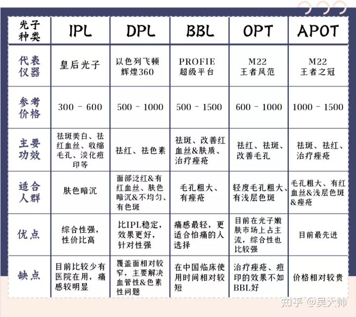{width="5.833333333333333in"
height="5.193286307961505in"}

### 光子嫩肤间隔多久做一次？

#### 1-2月/次 3-5次后3-4月/次 光子嫩肤预防型皮肤年轻化护理

每次光子嫩肤的治疗间隔至少在一个月，一般是推荐以3-4次左右的一个疗程为周期。可以先相对密集的每
1-2 月做一次，坚持做 3-5 次，之后转为定期的每 3-4
月做一次就可以了。光子嫩肤更多倾向于预防型的皮肤年轻化护理，而不是做1-2次就有「逆转型」改善的项目，所以定期坚持做下去还是更适合的。

[编辑于 2022-01-21
15:59](http://www.zhihu.com/question/507592156/answer/2319547772)

#### 光子嫩肤一年尽量不要做超过6次

*假装蟹邀\*\**先说结论，光子嫩肤一年尽量不要做超过6次**因为光子嫩肤是一种强光治疗仪，通过强光去掉面部的黑色素与红血丝，整体会使肌肤肤色更加完整，看起来人就会显得干净。但是**频繁做光子嫩肤，容易使得皮肤变薄，变敏感**。因此首先如果本身肌肤就属于比较薄也可以比较敏感的话，建议还是一开始至少隔3个月做一次，给予肌肤一个完整的休息期；其次同时做完要特别注意**防晒补水\*\*，这个时候肌肤会对光线更敏感，不好好防晒，反而会容易肌肤晒黑；补水则是强化后肌肤会干燥，即使的补水不仅可以有效防止肌肤干燥，更可以加快肌肤的修复

[发布于 2022-01-25
14:41](http://www.zhihu.com/question/507592156/answer/2324387493)

作者：张军利医生\
链接：<https://www.zhihu.com/question/507592156/answer/2324387493>\
来源：知乎\
著作权归作者所有。商业转载请联系作者获得授权，非商业转载请注明出处。

#### 非激光 强光治疗仪 吸收热量去掉黑色素、红血丝 使皮肤变薄 天热不主张做 七八月份之前或之后 日光照射浅

光子嫩肤并不是激光，它是一种强光治疗仪，就像太阳一样的强光，强光治疗照射在面部，一些黑色的东西或者是一些红色的东西，它就会吸收热量，能把黑色素或者红血丝去掉。当然光子嫩肤长期的按疗程做，它也会达到一个嫩肤的效果，这个就需要常年的、经常的去做，一般的光子嫩肤厂家推荐三周到一个月做一次，连续做五次。但是人们在做的过程中发现，光子嫩肤做完以后容易让皮肤变薄，所以不要做这么频繁，一般一年做两到三次，在天热的时候那就不主张做了，七八月份之前或者之后，凉快一点的天气，日光照射不是特别强烈的季节，一年做到两次，能达到去斑、嫩肤的效果，它的效果还是非常肯定的。

[发布于 2021-12-22
15:46](http://www.zhihu.com/question/507592156/answer/2281637694)

作者：江国平 黄冈市黄州区中西医结合医院 皮肤科医师\
链接：<https://www.zhihu.com/question/507592156/answer/2281637694>

### 肤色暗沉、粗糙、毛孔粗大、红血丝、晒斑 不同症状适合的疗程

一次光子嫩肤的治疗大约需要15-20分钟，7-15天慢慢出效果，一个月的时候效果比较明显，一般可维持1-2年，疗程、间隔因人而异，需要医生根据具体情况来判断。

例如若因光老化引起的各种皮肤问题（肤色暗沉、粗糙、毛孔粗大、红血丝、晒斑），建议光子嫩肤一年一个疗程，一个疗程4-6次，每次间隔3-4周。

如果单纯的祛斑的话，一般2-3次就差不多了，每次间隔3-4周；

祛红，疗程会长一些，可能需要6-8次，而且间隔的时间也会短一些，一般2周左右，因为间隔时间太长的话，血管会再通，前面等于白做；

修复皮肤屏障，疗程4-6次，每次间隔2周；

祛痘没有疗程限制，只要有炎性丘疹、脓疱就可以做，一般间隔2周以上。

#### 做过程中轻微疼痛感 半天内可缓解

在做光子嫩肤的过程中，会有轻微疼痛感，是在可承受范围内，无需麻醉，疗完成后部分人会有轻微灼热的感觉，一般半天内可缓解，也有部分可能会因皮肤受到热刺激，出现潮红现象，不过不必特别在意，属于光电美容后的正常现象，只要术后对操作部位进行冰敷、使用补水镇定面膜，30-60分钟后就会消失。

#### 术后防晒

另外，做完光子嫩肤之后轻易不会反黑，术后要做好防晒、保湿、补水护理，若出现反黑情况，也不必担心，这是色素代谢的一个正常情况，一般会在3-6个月之后自然消失，但是这期间一定要注意好防晒！

#### 轻微结痂不要自行抠掉

光子嫩肤治疗之后会有轻微结痂，一般会在一周内会脱落，所以千万不要自行抠掉。术前做好防晒，术后一周之内要避免使用刺激性保养品，如含有果酸、A酸、高浓度维他命C、水杨酸、酒精等刺激性保养品，注意保湿、规范饮食，不能吃色素含量过高的食物，防止色素在局部发生沉着，如咖啡，以及芹菜等感光性食物、辛辣的刺激性食物。

编辑于 2022-02-16 09:49

### 不适合人群

[成都玛丽亚美容科](https://www.zhihu.com/people/zheng-xing-yi-sheng-cui-peng)

虽然它的作用很广泛，又对皮肤基本无损伤，属于一个全能型的项目，但并不是说所有人都适合，光过敏、局部和全身有炎症、免疫系统缺陷、疤痕体质、近期内有使用过光过敏药物、孕妇、血凝不正常和正在使用阿司匹林的人，都不适合。

一次光子嫩肤的治疗大约需要15-20分钟，7-15天慢慢出效果，一个月的时候效果比较明显，一般可维持1-2年，疗程、间隔因人而异，需要医生根据具体情况来判断，例如若因光老化引起的各种皮肤问题（肤色暗沉、粗糙、毛孔粗大、红血丝、晒斑），建议光子嫩肤一年一个疗程，一个疗程4-6次，每次间隔3-4周。

如果单纯的祛斑的话，一般2-3次就差不多了，每次间隔3-4周；祛红，疗程会长一些，可能需要6-8次，而且间隔的时间也会短一些，一般2周左右，因为间隔时间太长的话，血管会再通，前面等于白做；修复皮肤屏障，疗程4-6次，每次间隔2周；祛痘没有疗程限制，只要有炎性丘疹、脓疱就可以做，一般间隔2周以上。

### 光子嫩肤原理浅析

#### 光子嫩肤强脉冲光 非激光

光子嫩肤学名叫Intense Pulsed
Light(IPL)，直译过来就是强脉冲光，是一种非剥脱的物理疗法，很多人会把强脉冲光和激光弄混淆，但二者是截然不同的。

激光是单色性的，即每种激光只有一种波长；但强脉冲光却能同时发出多种波长的光，其是宽谱的光波，可覆盖多种靶色基如黑色素、氧化血红蛋白、水等的多个吸收峰。脉冲光/强光/OPT/DPL/彩光是光子不同称呼。

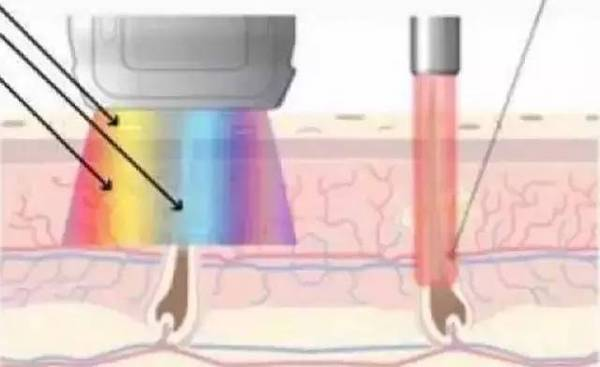{width="5.833333333333333in"
height="3.5680555555555555in"}

img

**强脉冲光和激光的比较示意图**

**左：强脉冲光 右：激光**

**技术原理：**

选择性光热作用原理。输出的强脉冲光中较长波长的光可穿透到皮肤较深处组织产生光热作用和光化学作用，使皮肤的胶原纤维和弹力纤维重新排列和再生，恢复弹性，从而达到消除或减轻皱纹的治疗效果。

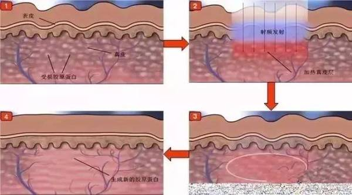{width="5.833333333333333in"
height="3.2375in"}

#### 光子嫩肤7大显著疗效

**大量的临床实践证明，光子嫩肤可同时在全面部达到以下7大显著疗效：**

?清除或减淡各种色斑和年龄斑；

?去除面部红血丝（毛细血管扩张）和红斑痤疮；

?抚平细小皱纹；

?收缩粗大毛孔，增厚肌肤胶原层，增强皮肤弹性；

?有效淡化面部黄气和黑眼圈；

?显著改善面部皮肤粗糙的状况；

?消除或减淡痤疮疤痕。

当大家对光子嫩肤有了大致了解后，我再来解答下这几大疑惑！

#### **1光子嫩肤不会使皮肤变薄吗？**

不会。很多人认为光子嫩肤会烫伤皮肤，破坏脆弱的角质层，就像墙皮被凿掉一样，越做越薄。

其实不然，**强脉冲光(光子嫩肤)能激活皮肤中的成纤维细胞，增加胶原纤维和弹力纤维、透明质酸(玻尿酸)的合成**。这些新生的胶原蛋白和弹力蛋白重新排列后，皮肤会变得更有弹性，光亮紧实，皱纹减少，毛孔细致。所以，激光美容不但不会使皮肤变薄，反而会使皮肤的厚度增加，并使之更加紧致、弹性，向年轻化转变。

#### **2 光子嫩肤不会使皮肤变敏感**

不会。很多人认为，光子嫩肤会导致皮肤变薄，皮肤没有"老皮"的保护，会变得敏感，不耐热、不耐风，对化妆品敏感。

事实远非如此。光子嫩肤虽然在短期内(术后7天)会因为光热作用加速水分蒸发，促进角质层的脱落，有时还会形成细小的微痂。但是所有的"损伤"都是在可控范围内，**7天**之后都会恢复的。

新愈合的皮肤具有完备的结构(包括角质层，角质层即使不做治疗，也会有新老更替)和健康的功能，所以光子嫩肤不会使皮肤变得敏感。

科学证实，强脉冲光能够修复发炎的皮肤，减少炎症介质的释放，去除多余的红血丝，增强皮肤的新陈代谢。因此强脉冲光不仅不会让皮肤变得更敏感，反而还可以治疗导致皮肤敏感的基础疾病------**脂溢性皮炎、激素依赖性皮炎、痤疮和红斑痤疮**等。

#### 皮肤美容门槛低 危险性大 形成水泡 留瘢痕

然而纵使有百般好处，**光子嫩肤实属医疗美容**；既然是医疗美容，就有风险。现如今随着皮肤美容行业的飞速发展，无照经营大行其道，经过几日培训就自称专家上岗操作、设备无安全保障等乱象行为频频发生。

很多人觉得皮肤美容门槛低，操作简单，但是，大家没看到美肤仪器的危险性，治疗不恰当，轻者会形成水泡，重者会留瘢痕，造成难以挽回的损害。因此激光美容属于医疗美容，一定要到正规的医疗机构进行就诊！

### 家庭用的光子嫩肤仪效果怎么样，有用吗？

#### 家庭光子嫩肤￥1000 见效慢便宜安全性高

据我所知光子嫩肤仪是从国外引进来的，国内起初用于航天员，现在还是以医院美容院大仪器为主，主要嫩肤、美白、祛斑、脱毛、褪红等效果。

从价格来讲美容院一次费用大概1000-3000元左右，基本话一个月一次，一般在5次以上会有明显效果；家庭用的光子嫩肤仪整体费用在1000左右，御美娇光子嫩肤仪效果就不错。

从效果来讲：
医院美容院采用的是强激光强脉冲光对皮肤进行美容项目，而家庭用的采用的是弱激光强脉冲光对皮肤进行美容。达到的效果是一样，只是前者需要医师指导看护，一般1个月使用一次，后者采用弱激光强脉冲光则每天闲暇时间每天15分钟即可。

目前国外已经开始接受家庭式光子嫩肤仪，缺点是见效慢，优点就是价格便宜，安全性也高于一次的光子嫩肤仪。

[发布于 2022-03-22
13:53](http://www.zhihu.com/question/523382393/answer/2401507483)

#### 医用强激光强脉冲 家用弱激光强脉冲

医用光子美容仪采用的是强激光强脉冲照射，御美娇家用光子美容仪采用的是弱激光强脉冲照射，医用的需要专人指导看护，见效快、成本高，家用的见效慢，简单方便，一般28天左右见效（每天坚持15分钟）。

#### 请问网络上的美容射频仪初普雅萌什么的到底是不是智商税？

射频仪跟热玛吉采用的是同一种技术原理，从这方面来说它是有抗衰效果的

但因为是家用，能量会小很多很多，效果也没有医美来的明显，只有长期坚持才会看到效果，并且这个效果大多都是"相差几何"的，

按照明星的工作强度，他们的好皮肤好状态基本还是来自医美，美容仪只是他们日常辅助护肤的一种方式而已。

说了这么多，并不是说射频仪不好，相反，作为普通人来说，射频仪是最好的保养、抗衰的方式，

只是大多数人在入手射频仪的时候期望值太高，后续达不到想要的效果，结果就觉得射频仪是"智商税"，

正所谓"保养是老样子，不保养是样子老"，如果期待自己从外貌上来起来能降低5-10岁，建议还是医美。

[发布于 2022-05-06
11:54](https://www.zhihu.com/question/531579555/answer/2472619685)

### 更多医美项目及其间隔时间

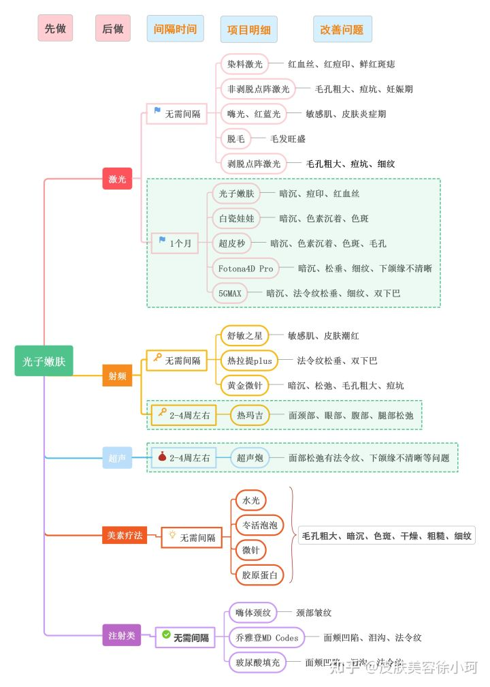{width="5.833333333333333in"
height="8.166666666666666in"}

①光子嫩肤与激光类 无需间隔的医美项目有

染料激光 ：红血丝、红痘印、鲜红斑痣

非剥脱点阵激光 ：毛孔粗大、痘坑、细纹、妊娠纹

嗨光、红蓝光 ：皮肤敏感、炎症期

脱毛 ：毛发旺盛

二氧化碳剥脱点阵激光 ：毛孔粗大、痘坑、细纹 \~

需间隔1个月的项目有⬇️

光子嫩肤 ：暗沉、痘印、红血丝

白瓷娃娃：暗沉、色素沉着、色斑

超皮秒 ：暗沉、色素沉着、细纹、毛孔粗大

Fotona4Dpro ： 暗沉、松垂、细纹、下颌缘不清晰

5GMAX ：暗沉、法令纹、细纹、双下巴

②光子嫩肤与射频类 无需间隔的医美项目有⬇️

舒敏之星 ：敏感肌、皮肤潮红

热拉提PLUS ：法令纹松垂、双下巴

黄金微针 ：暗沉、松弛、毛孔粗大、痘坑 .

需间隔2-4周的项目有热玛吉,可用于面颈部、眼部、腹部、腿部松弛问题 .。

③光子嫩肤和超声类
跟超声炮需间隔2-4周左右。也可用于面部松弛有法令纹、下颌缘不清晰的问题。

④光子嫩肤和美塑疗法 无需间隔的医美项目有：
水光、冭活炮炮、微针、胶原蛋白，这些都是可以用于毛孔粗大、暗沉、色斑、干燥、皮肤粗糙、细纹等问题。

⑤光子嫩肤和注射类 无需间隔的医美项目有⬇️

嗨体颈纹 ，用于颈部皱纹

乔雅登玻尿酸填充 ：面颊凹陷、泪沟、法令纹 \~。

关于医美项目你还有哪些想要了解的？欢迎随时与我交流！

发布于 2022-03-27 14:49

### 长沙价格

#### 医院医美都很方便，不要去美容机构

[CHELSYgirl](https://www.douban.com/people/mewhimsy/) (im feeling heavy
can\'t explain) 2022-06-05 14:46:04

没关系的 医院医美都很方便，不要去美容机构

#### 长沙美莱整形医院

贝贝18100736228

M22

￥969/3次

首次￥289+￥399\*2=￥1087

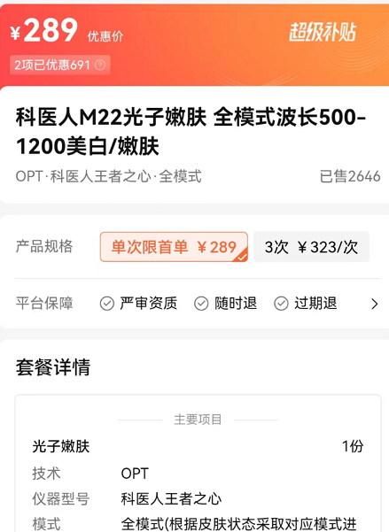{width="5.833333333333333in"
height="7.985952537182852in"}

image-20220524203915439

#### 韩华美

A华韩华美张顾问

opt，m22超光子

￥288/次

做多次要根据毛孔粗大、痘印暗红的程度才选择去做。

一般3-5次。

#### 爱思特

爱思特佳怡19118900789:\
美团有个￥680

爱思特佳怡19118900789:\
然后我们现在有个年卡是￥6800，不限次数的 时间为一年

爱思特佳怡19118900789:\
第7代黄金超光子

爱思特佳怡19118900789:\
有滤光片可以改善的

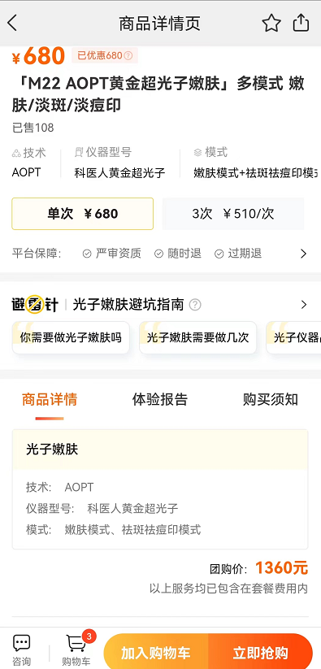{width="5.486111111111111in"
height="11.430555555555555in"}

image-20220524203814748

### 结痂

#### 有会有不会

CC辰儿

光子不会结痂，点阵和皮秒会

2020-09-12 20:52 3

小叮当的小丁当

光子一般是不会结痂的......点阵才会

2020-09-11 11:01 19

今夜想你神明

回复 \@小叮当的小丁当
:会结痂的，我的斑的位置就结痂了，只不过很小，我本身斑也很淡

2022-01-15 23:44

#### 医美尽量去 医院 最好三甲

闵桃果猫猫少年

做医美尽量且 最好去
医院做！最好是三甲医院！我知道有些三甲医院是可以打水光针和做光子嫩肤等等这种的！

2021-09-18 22:09 8
