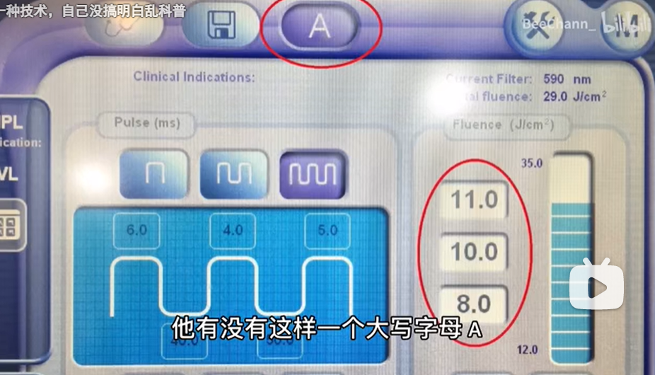
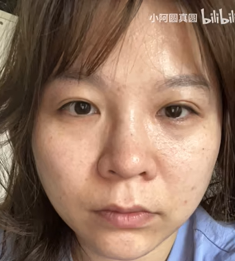
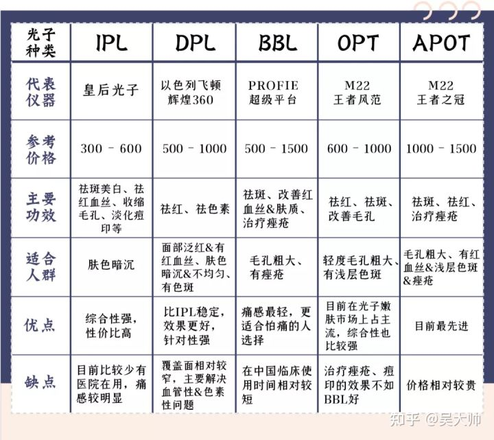
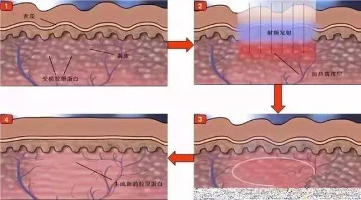
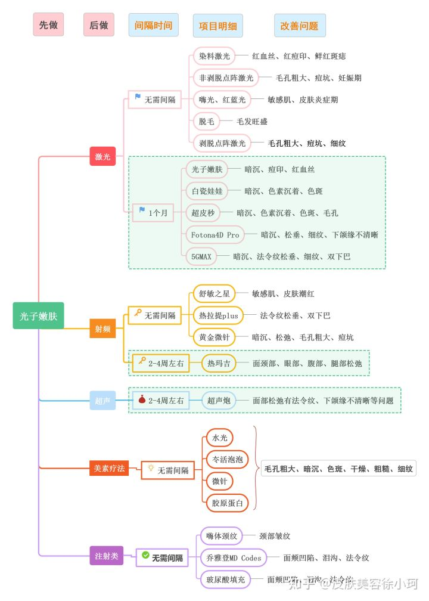
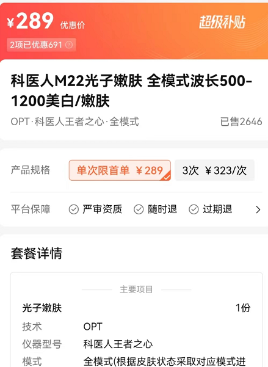
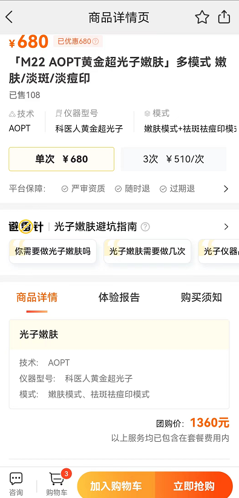

### skin

[真我app
查妆识美](https://link.zhihu.com/?target=https%3A//a.app.qq.com/o/simple.jsp%3Fpkgname%3Dcom.focusgene.findme%26fromcase%3D40003)

#### [一个冒牌配方师博主的忏悔](https://www.bilibili.com/video/BV1m84y1H71P/?spm_id_from=333.999.0.0&vd_source=f03b9d349cef8aff4a045d602d8a1d82)

2023-02-10 14:02:46

十六槐夏

做过品牌营销pr实习 从此不再相信任何种草 任何

2023-02-12 01:09 3995

57528078115_bili

就我个人而言，护肤做好三点，就可以了:

1.晚a酸+抗糖小白瓶（我已经耐受了，建议新手的换成a醇）

2.做好防晒，也就是防晒霜+帽子口罩

3.面霜用补骨脂酚（淘宝六七十块钱30ml）

我，男的，今年三十四岁，但看起来比较年轻。

仅仅针对我个人的方法，不一定具有普遍性。

2023-02-10 22:17 7524

57528078115_bili

回复 \@飞行中的下蛋的鹅 :看你心诚，我就在说的详细一点:

1.晚上 0.1%a酸+欧莱雅抗糖小白瓶

2.防晒 蜜思婷泰版+口罩+帽子

3.面霜 贝德玛补骨脂酚

你可以照抄作业，一个月后如果有效果可不可以V我10块钱辛苦费\[呲牙\]

2023-02-11 00:25 461

##### 不如医美强

未未的情绪垃圾桶

感觉还不如医美强，护肤品最好是那种私人订制的，之前杨蓉在节目上就是这样说的，但是这种都很贵

2023-02-19 10:53 41

##### 中国慕课大学 化妆品工艺学

##### 三甲皮肤科 国家监管更严

Luka梦想走遍全中国

一般三甲皮肤科都开有美容项目（因为赚钱），但这些医院背后有国家制定的一些条条框框约束，更加可靠。

我去年到医院刷酸，先后分别刷了20%和35%的果酸，我在咨询那些美容院以及祛痘专门店的时候，他们的酸远不到20%，目的是让你花更多的钱在里面，却不如皮肤科几次的治疗效果。大家一定要擦亮眼睛\[热词系列_保护\]

2023-02-12 11:37 606

##### 只做防嗮和保湿，其他就是做三甲医美 剥皮鸡蛋

笑狗乖乖

实话，我就是这样，只做防嗮和保湿，其他就是做医美，我本身脸上有斑，正规三甲医院做几次激光，脸上干净得像剥皮鸡蛋

2023-02-15 22:38 25

##### 硕士化妆品 医美见效更快

老太太与鸟

对啊，虽然我自己读硕士的研究方向就是化妆品，但是我个人还是认为医美可能见效更快\[笑哭\]

2023-02-14 19:07 1205

##### 再好的护肤品不如好好锻炼，早睡早起

顾小粥い

我讲句实在话，买再好的护肤品起的作用不如好好锻炼，早睡早起有效。之前调节作息，十点睡，六点半起，每周坚持跑两到三天，一个多月朋友说我皮肤好的不行，还问我用的啥护肤

2023-02-15 21:20 169

Ulrica007

🐏的时候在家 一周多 没怎么涂护肤品就是脸白的发光 黑眼圈都好了不少
多睡觉比任何护肤品都有用

2023-02-17 08:39 17

##### [业内造型设计师 不相信种草 医美手段 早睡早起](https://www.bilibili.com/video/BV12Y4y127rj/?spm_id_from=333.999.0.0&vd_source=f03b9d349cef8aff4a045d602d8a1d82)

多肉球球要变瘦

我是业内甲方品牌产品造型设计师，我可以负责任的说这个up所有视频揭露的都是真相。不要轻易相信网上的种草，包括素人博主。想要皮肤状态好，除了医美手段，平时早睡早起，清淡饮食，保持运动就可以。

2023-03-15 12:40 2989

想开啦想开啦

狠狠点了！俺也觉得是这样，不论怎么去寻找外补的，不如多多运动合理作息多吃水果补充维生素，尽量让自己内里保持年轻，杀掉内分泌失调可恶解决很多身体上的问题

2023-03-20 18:59 31

##### 祛皱针3k 几块钱

小李老师nl不分

我妈，之前跟我打电话说她要打一个祛皱针，我一问多少钱，3000块钱，然后他把打的注射液包装盒给我拍了一下，5ml一盒，我是临床药学，可能有一种敏感性，在一些专业实验物品网站上一搜，这个注射液是一种细胞营养液，几块钱能买几十毫升，化妆品的暴利我终于知道怎么来的了。

2023-03-01 10:03 5443

##### 护肤品原材料不贵 贵的就是宣传费用

喵星人能有啥坏心眼er

回复 \@锦鲤少女不会笑
:所以护肤品原材料都不贵，贵的就是宣传费用。海蓝之谜广东白云区都可以给你造出来，仿样。为什么那些卖假的被看出来？主要是包装问题还有他们不舍得真一比一。那样成本会上几十。他们的目的是要几块钱做出来。

2023-02-27 18:19 389

二次元メメ

回复 \@喵星人能有啥坏心眼er
:护肤品成本一直以来就不贵，一个是中间商太多，另一个就是宣传，还有就是品牌，太离谱了，有钱人的世界玩的就是品牌，不然玩什么，玩专利吗？\[撇嘴\]

2023-02-27 19:01 321

##### 薇诺娜 三甲医院皮肤科

想做若宮イヴ的武士刀

回复 \@二次元メメ
:护肤品我还是喜欢薇诺娜，我老妈一直回购的，她去三甲医院皮肤科的时候医生推荐的，我蹭点用用，反正我刚入坑觉得还可以，没香精也不是很刺激

2023-02-28 03:31 17

##### 薇诺娜也烂脸 最保守医疗器械

城北的狐狸吖

回复 \@想做若宮イヴ的武士刀
:薇诺娜也不好的，有几款薇诺娜产品也会刺激烂脸。护肤最保守的就是医疗器械的产品，基本很少刺激性。

2023-02-28 17:34 5

##### 有动物试验 械字号>妆字号、消字号 

ATRHXY

回复 \@想做若宮イヴ的武士刀
:那应该是械字号，属于医疗器械，起码也是做过动物实验的，比妆字号、消字号好多了。价格也不会太贵，至少不会像那些化妆品那样几千上万的智商税。买的时候要看清楚批准文号

2023-04-08 02:52

##### 每两个月一次m22光子嫩肤 ￥400

老长沙扛霸子

回复 \@追花一直跑
:我每两个月一次m22光子嫩肤（双十一囤的，400一次，正规医院），皮肤好到我爸打钱给我让我多去\.....自从来澳洲没钱做光子（这边人民币2300一次）脸就垮了，哪怕我换了lamer和娇韵诗双萃

2023-02-27 22:27100

###### 光子追求白 过一阵子毛孔和暗沉又上来 微针更贵 

49年后不许成精

回复 \@黑纱小萌主
:我出来之后起码半年没做了，皮肤状态稳定良好，没崩。但个人感受是，光子嫩肤有点难一劳永逸，我皮肤不差但是小瑕疵粉刺问题不断，加上喜欢熬夜，做光子主要是追求白，但是过一阵子毛孔问题和暗沉又上来了。后面买微针做，更贵些但是效果我还是很满意的

2023-02-28 02:4842

##### 再就业男团 不停上美容院 不用啥护肤品

回到八月十三

回复 \@路过的猫君
:是的，我关注的再就业男团里的，他们就是拍自己工作就是不停的上美容院，每天面膜，然后从来不用啥护肤品，一直都是各种医美，不把我们当外人，说打了美白针，做了瘦脸，接了头发啥的，每次化妆都能看出来多精致

2023-03-03 19:371

##### 化妆和医美 成本不到售价的十分之一

掰呀掰脚丫

制药行业路过，一直觉得护肤全是扯淡，从来没见过哪个学化学的同学加入化妆品公司，制药行业筛出来一个药筛几年几十亿的投资，化妆品的配如果是真实的，经过多期实验验证的话，绝不可能像大白菜一样谁都能造，生化科研的投资单位从来都是亿。

2023-03-01 00:411073

天地之间贰叁事

有的，我老师说他有一些同学就从事化妆和医美，但是私下跟他讲那些化妆品医美产品几乎都是智商税，随便整点什么普通人听不懂的成分说对哪哪好，宣传一下就能卖出去，还嘲笑那些人傻，成本不到售价的十分之一。反正我们听着觉得好笑，老师也说他们不坑穷人，卖的都超级贵。

2023-03-04 13:5735

##### 国家知识产权网查护肤品公司相关专利

掰呀掰脚丫

我是倾向于没啥用或者用处不大，我觉得你可以去国家知识产权网上简单的查一下你买的护肤品公司是否有茫茫多相关专业的专利，不要是配方什么的，在我的视角里需要有活性化合物专利才可能真正存在作用。

2023-03-14 11:21

##### 我妈化妆行业 好的￥500多一瓶 便宜洗面奶就好

画画的虎

有用，我妈化妆行业，亲眼看她自己和客户的脸一点点变好，但贵，起主要效果的东西一小瓶进价500多块，还要坚持长时间用。护肤以及修复皮肤等各种项目都有，但是真的很贵。

2023-04-08 22:22

画画的虎

我妈妈是化妆行业的，护肤必须要买正规的护肤品，一般来说不能信偏方。但是一般价钱是比较贵的。起主要效果的一小瓶含中草药成分的护肤品进价500多一瓶。但如果不是皮肤特别坏的话，买好点的洗面奶就行了。另外这个东西看基因和身体健康，如果皮肤好的话，你不需要任何护肤品。

2023-04-08 22:27

画画的虎

回复 \@夜中掌灯
:我妈妈是化妆行业的，从我自己的角度来说，如果你买的是比较好的洗面奶，那么可能是正面的把你的脸洗白了。我现在脸上长青春痘，妈妈建议我洗面奶天天洗，但是基本上我也只是周末洗一下，洗面奶基本上只有清理的作用，但是效果也是很好的。我周末去店里清理痘痘之前要先在家里面用洗面奶洗一遍才能去，因为不洗的话很明显，妈妈能看出来，脸上很脏，他就会骂我。

2023-04-08 22:36

##### 70%靠基因 角质层吸收不了多少 保湿就行

Chaos_sa

百分之70靠基因。护肤大部分人基础保湿就可以了，尤其是年轻人，真的没必要一层层往脸上涂，角质层吃不了那么多东西。富婆富哥当我没说

2023-02-27 11:08 342

##### 就算是点阵激光都不能100%治疗痘坑

噼味饭圈文化万岁

告诉各位,如果各位是毛孔粗大,黑头多,痘坑多,去三甲医院就行了,痘坑可以通过点阵激光治疗,但是连点阵激光都不能让你百分之百的治愈痘坑,最多也就百分之七十或者八十,而且还是得多次治疗的效果,所以市面上那些什么缩小毛孔,治疗痘坑的,全是假的,说白了,护肤品真正有效的也就保湿以及防晒,补水的话,你自己少熬夜,多喝水,少吃高糖高油脂,自然而然就会变好,皮肤自我修复功能比任何护肤品都强.

2023-02-27 15:571088

Major_Sum

回复 \@这价值6枚硬币名字 :一次点阵激光600左右做完要涂的药一两百
一般至少要做三次

2023-02-27 17:304

##### 黑头没办法只能改善，去除不掉 撕黑头表面功夫

噼味饭圈文化万岁

回复 \@\_\_\_\_陈甸甸
:去医院问，或者大概率去不掉，黑头没办法的，这种和基因有关系，只能改善，去除不掉的

2023-02-27 18:255

噼味饭圈文化万岁

回复 \@\_\_\_\_陈甸甸
:你用网上那些撕黑头的，一点用都没有，表面功夫，过几天反而越来越多黑头

2023-02-27 18:258

##### 粉底液，遮瑕霜遮黑头

噼味饭圈文化万岁

回复 \@\_\_\_\_陈甸甸
:你看别人明星没黑头，因为他们的粉底液，遮瑕霜，用的多，你可以去搜搜他们素颜在高清摄像头没有滤镜，一样也是有黑头的

2023-02-27 18:2719

Zukiv

回复 \@噼味饭圈文化万岁
:黑头几块钱的维a乳酸膏就能搞定，严重的就去刷酸，搞不定的是酒糟鼻那种病变的，是真的很难治疗

2023-02-28 02:043

#### 早晚洗面奶+爽肤水

{width="2.5555555555555554in"
height="3.4943307086614173in"}

奉壹 1:05:51

菌菇水也是爽肤水

奉壹 1:06:09

带点消炎镇静的作用

奉壹 1:07:13

这两款基本不会踩坑

奉壹 1:07:19

我是踩怕了

#### 收缩毛孔

##### 有收缩 

##### [水杨酸+活性酵液 缩毛孔组合](https://zhuanlan.zhihu.com/p/591938910)

早在16年的时候，带我入门的老师就教过我，水杨酸+活性酵液，最牛的缩毛孔组合，单纯的水杨酸远远不够，它只能帮助你疏松毛孔，溶解角质，相当于把毛孔掰开清理干净了，缺少一个让毛孔合上去的东西，而这个东西就是活性酵液，它能修复细胞活性，促使毛孔恢复弹性紧致的状态。非要对应到某个产品的话，我只能说teae家的细致啫喱做的还不错，0.5%水杨酸+7%活性酵母，效果好！可靠！就是名气小了点......

[**天羽**](https://www.zhihu.com/people/88354765fe9976c9efd647fc4c1e3fb8)

这个我正在用，用了一个月左右了，效果还是有的，脸上皮肤改善不少，毛孔有收缩但是不是像宣传的那么强，不知道是不是我毛孔太粗的原因，到一定程度用这个就收缩不了了\
买了两支目前第一支要用完了，准备继续用剩下一支，用完要是还是收缩不下来，我估计就只能去刷浓度更高的酸了

2023-03-10 · IP 属地广东

[**天羽**](https://www.zhihu.com/people/88354765fe9976c9efd647fc4c1e3fb8)
[**无所谓**](https://www.zhihu.com/people/e9c7ada5604d11038126da3032550bd4)

如果你毛孔很粗，这个有一定收缩效果，但是不是那么强，我的就是收缩了一点，但是看着还是粗，不过比之前好多了，另外就是皮肤确实变好了，当然用这个的时候记得做好保湿啊，保湿很重要

2023-03-19 · IP 属地广东

[**有个洞**](https://www.zhihu.com/people/189f3a4ceb6d9ceb74a858a175858d78)
来更新啦～\
用第五天的时候觉得脸有点干，就是有点紧绷难受那种感觉，然后改成了晚上用这个，厚涂，慢慢揉到吸收，早上用的玉泽的水和保湿乳，感觉舒服多了，这期间基本保持了不化妆不用其他的，今天对着镜子仔细看了一下，还是有一些效果的，额头毛孔细了一些，脸上也收缩了一点点。\
继续坚持看看，下周再来～

2023-03-29 ·

#### 电脑护肤

##### [【5+5】天天对着电脑办公要怎样做好护肤？](https://zhuanlan.zhihu.com/p/397925632)

[发布于 2021-08-09 15:55](https://zhuanlan.zhihu.com/p/397925632)

###### 隔离乳擦抹 隔灰

电脑族因为要对防辐射、[尖端放电](https://www.zhihu.com/search?q=%E5%B0%96%E7%AB%AF%E6%94%BE%E7%94%B5&search_source=Entity&hybrid_search_source=Entity&hybrid_search_extra=%7B%22sourceType%22%3A%22article%22%2C%22sourceId%22%3A%22397925632%22%7D)非常容易把尘吸入面部

###### 勤洗脸、洗手 除灰

平时工作中中后期内一定要勤洗脸、洗手，按皮肤种类选用不一样产品系列的[洁面乳](https://www.zhihu.com/search?q=%E6%B4%81%E9%9D%A2%E4%B9%B3&search_source=Entity&hybrid_search_source=Entity&hybrid_search_extra=%7B%22sourceType%22%3A%22article%22%2C%22sourceId%22%3A%22397925632%22%7D)清除，让肌肤缓解压力;下班啦要马上冼澡，最好是中午的状况下也清除一下。而且所有下午也感觉面部很清爽，工作效率自然就提高啦。

###### [保湿补水](https://www.zhihu.com/search?q=%E4%BF%9D%E6%B9%BF%E8%A1%A5%E6%B0%B4&search_source=Entity&hybrid_search_source=Entity&hybrid_search_extra=%7B%22sourceType%22%3A%22article%22%2C%22sourceId%22%3A%22397925632%22%7D)

保湿喷雾、润肤水、[精华水](https://www.zhihu.com/search?q=%E7%B2%BE%E5%8D%8E%E6%B0%B4&search_source=Entity&hybrid_search_source=Entity&hybrid_search_extra=%7B%22sourceType%22%3A%22article%22%2C%22sourceId%22%3A%22397925632%22%7D)等，经常给脸来补水保湿。

留意：多喝水也可以很好的给肌肤补水保湿，还能促进新陈代谢，虽速脂肪燃烧哦!

###### 眼部保养

眼部附近肌肤松驰、眼角下垂、黑眼圈严重、祛眼袋较为严重等眼部难点，看上去有气无力。它是因为眼睛长久性看到显示屏，眼睛疲劳过度，再再加上睡不好，日夜迎战地工作上，使你的眼睛提早衰老。

留意：要维护保养好眼部，[眼部精粹](https://www.zhihu.com/search?q=%E7%9C%BC%E9%83%A8%E7%B2%BE%E7%B2%B9&search_source=Entity&hybrid_search_source=Entity&hybrid_search_extra=%7B%22sourceType%22%3A%22article%22%2C%22sourceId%22%3A%22397925632%22%7D)是必不可少的类目，平时还必须
多留意眼部的休息，无须边走马路上玩手机，不要紧多远眺，也可以缓解眼睛疲劳。

###### 抗氧化

维他命D、绿茶茶叶中的茶多酚

###### 工作压力大 内分泌系统紊乱

工作压力大，心绪不良都会导致内分泌系统紊乱，出现功能失调现象，致使皮肤干燥暗沉，加速皮肤衰老

#### 少吃辣条 醋

[吃醋导致脸上痘印去不掉](https://www.bilibili.com/video/BV1gJ411e7dH?t=297.3)

#### 

猪摸摸Li【秘技】40岁的少年感，只是因为20年体重不变+护肤？2022-02-01
20:03:05

##### 化妆水、眼霜、乳液

现在正牌的防晒霜不会屏蔽你沐浴阳光的健康因素，只是防止紫外线对皮肤的伤害。

1平时洗脸后的护肤，做到简单的三件套即可：化妆水、眼霜、乳液

1说是"化妆"水，不是特意指化妆时才能用，只要是润肤的水都可以。抹上后轻拍促进吸收。用你最娘的力气拍，力度要比键盘打字再轻57%的力气。

眼霜是肯定的，毕竟眼角的皱纹很容易滋生。乳液相信很多人都已在用，不用的话的确脸会干燥不舒服。配合眼霜，在眼部护理之后使用。另外，还可以再抹一层面霜。

面霜可根据自己的年龄选择，年龄小的可以不用，1年龄大一些的可以选有抗皱效果的品牌。我一般都是选日系品牌，毕竟岛国在这个方面的研究经验很扎实。而且，安全性上要经过层层审查，用起来更放心。对自己的脸用的东西，就别乱尝试新鲜事物了。否则出了问题还得顶着一张烂脸去维权。

这跟医美要选正规医院一样的道理。

平时还可以一星期敷1-2次面膜。面膜的作用是暂时的，指望脸一直水润不可能。

可以在你约会前使用，给对方你很水润的错觉。

当然，使用面膜前用蒸脸仪的话更好。蒸脸仪据说女生还会用来蒸内裤，当然一般都是用的室友的仪器。

##### 精神

很多人尤其是明星为什么要求助于不良的生活的习惯？因为在那个顺水行舟的人生道路上，它们只有层层加码才能让自己心理持续感受到刺激。得陇望蜀这是我们人类的本能，你我TA都一样。但是，当你换一个完全不同的领域时，这种没羞没臊、手足无措又想大干一场的感觉，不是陌生，而是久违。因为我们孩童时就是在这种亢奋的心理下去热爱这个世界的！

我是建议大家如果从事久坐的工作，应该尝试下舞蹈。因为身体协调性变好可以刺激脑细胞活化，

三十几岁、四十几岁的你，接下来几十年，难道真的只想钓鱼吗？

#### [背上长一个个的小粉刺类的或者小红点，什么原因啊？就背部上半部分，皮肤也暗沉干燥一点的](https://www.zhihu.com/question/30891908/answer/2184593574)

**一、后背长痘的四大原因**

**1、体质的特殊性**。有的人天生就是身体流汗而不能及时从毛孔排除，全部的毒素藏在身体里，只能以冒痘痘的形式把毒素排出，而且很多时候我们出过汗的衣服都不能及时清理或更换，容易滋生细菌，从而身体里就会冒出痘痘。

**2、皮肤是油性皮肤**。夏天由于身体分泌油脂过多，体内各种营养成分消耗得比较多，各种维生素和微量元素尤其是维生素
A
相对而言较为缺乏，使毛孔管壁变得毛糙。而油脂又比较黏稠，更容易堵塞毛孔。油脂和死亡的角质细胞混合，形成[**角质栓**](https://www.zhihu.com/search?q=%E8%A7%92%E8%B4%A8%E6%A0%93&search_source=Entity&hybrid_search_source=Entity&hybrid_search_extra=%7B%22sourceType%22%3A%22answer%22%2C%22sourceId%22%3A%222184593574%22%7D)，**也就是粉刺。**在毛孔中累积起来，不能及时排除，就容易在前胸后背长痘痘，和我们脸上起痘痘上一个道理。

**3、体内[激素分泌失调](https://www.zhihu.com/search?q=%E6%BF%80%E7%B4%A0%E5%88%86%E6%B3%8C%E5%A4%B1%E8%B0%83&search_source=Entity&hybrid_search_source=Entity&hybrid_search_extra=%7B%22sourceType%22%3A%22answer%22%2C%22sourceId%22%3A%222184593574%22%7D)。**由于长时间熬夜，不锻炼身体，饮食搭配也不合理，摄入蔬菜量较少而引发痘痘的滋生。这种情况是最容易治疗的，平时多吃清淡的食物，多吃青菜，同时保证睡眠质量，保持心情舒畅，一般痘痘都可以消去。

**4、[毛囊炎](https://www.zhihu.com/search?q=%E6%AF%9B%E5%9B%8A%E7%82%8E&search_source=Entity&hybrid_search_source=Entity&hybrid_search_extra=%7B%22sourceType%22%3A%22answer%22%2C%22sourceId%22%3A%222184593574%22%7D)。**毛囊炎是一种以毛囊为单位并且局限于毛囊的化脓性炎症，是一种细菌感染性皮肤病，主要由金黄色葡萄球菌引起，少数有[表面葡萄球菌](https://www.zhihu.com/search?q=%E8%A1%A8%E9%9D%A2%E8%91%A1%E8%90%84%E7%90%83%E8%8F%8C&search_source=Entity&hybrid_search_source=Entity&hybrid_search_extra=%7B%22sourceType%22%3A%22answer%22%2C%22sourceId%22%3A%222184593574%22%7D)、链球菌等其他细菌引起，较多存在于高温、潮湿环境中。**角质栓，也就是粉刺**。当氧气无法再进入到毛孔内，时间一长，毛孔内部缺氧，这种厌氧的环境最适合[痤疮丙酸杆菌](https://www.zhihu.com/search?q=%E7%97%A4%E7%96%AE%E4%B8%99%E9%85%B8%E6%9D%86%E8%8F%8C&search_source=Entity&hybrid_search_source=Entity&hybrid_search_extra=%7B%22sourceType%22%3A%22answer%22%2C%22sourceId%22%3A%222184593574%22%7D)的大量生长，使皮肤形成炎症效应，也就是毛囊炎。

面对以上四种这种情况，我们首先考虑**及时对背部皮肤进行清理**，其次从**饮食方面**慢慢调节，平时**多吃些清淡的食物**，辛辣、油腻以及高热量和海鲜类等致敏食物要少吃，这些食物容易刺激皮肤中的皮脂腺，会令其分泌更多的油脂，就容易造成毛孔堵塞，加重痤疮症状。**不能熬夜，要注意保持充足的睡眠**，同时也要注意**不要用手挤压痤疮**，以免感染而留下疤痕，如长时间效果不见好转的话，建议及时就医。

#### [如何判别敏感肌](https://www.zhihu.com/question/454413661/answer/1837120143)

[编辑于 2021-09-16
12:35](https://www.zhihu.com/question/454413661/answer/1837120143)

##### 1、角质层薄，薄到红血丝

刨除这一部分自以为是的人，敏感肌少了一大部分，接下来再细分真的敏感肌：1，娇嫩款，豌豆公主型的，一看就是皮薄馅大，角质层薄，薄到红血丝都看得清楚的

{width="2.5564359142607174in"
height="1.3805555555555555in"}{width="1.7361111111111112in"
height="1.3476935695538057in"}

这种皮肤因为角质层太薄，抵御外界刺激的能力低，所以用护肤品要特别小心，尽量温和单一的产品，避免使用含有酸、酒精等的护肤品。

##### 2、屏障受损型 秋冬换季、皮肤开裂爆皮

2，屏障受损型比如秋冬换季、皮肤开裂爆皮，这种皮都开花了，你说敏感不？

{width="2.3958333333333335in"
height="1.2928160542432197in"}{width="2.173611111111111in"
height="1.8497867454068242in"}

{width="2.3958333333333335in"
height="1.6579877515310586in"}

##### 3、用错护肤品类型

3、用错护肤品类型比如下面这种灼红：

{width="2.6915234033245845in"
height="2.454970472440945in"}

像上面这种肤质，不光灼红，风吹易红，日晒易烫，用护肤品也非常容易产生刺痛感，也是屏障受损的表现，但这种多与用错护肤品有关系，建议停用目前的护肤品，然后再按照第二条提到的方法修复肌肤屏障。

##### 4、油痘肌/痘肌/闭口痘

4，油痘肌/痘肌/闭口痘等很多人长痘，经常暴脓发炎或者挤破了，导致肌肤各种不适：

{width="2.5833333333333335in"
height="1.995505249343832in"}{width="2.993059930008749in"
height="1.9999387576552932in"}

我们放大看一个痘痘的样子，其实就是新鲜伤口：

{width="2.375in"
height="2.3647069116360453in"}

这些新鲜伤口暴露在外，不敏感也敏感了。这写痘肌用这也刺痛，用那也刺痛，吓得半死，以为自己是敏感肌，然后跟风用一些"敏感肌专用"护肤品，什么无酒精、无酸，跟着那些"娇嫩"的人士用一些温和的产品，比如婴儿面霜、大喷、浆糊一样的洗面奶等等，结果，痘痘越来越严重。

人家干敏肌怕酒精，你这油哈哈，脏兮兮的跟着凑啥热闹？

##### 5、超级问题肌 不怕酸 直接下猛料

{width="2.1446762904636922in"
height="2.2708333333333335in"}

你这种，千万别再以敏感肌自居了，已经是超级问题肌了\~\~\~尽管你看到那些祛痘水、控油水含有"酒精""果酸""水杨酸""乳酸"就吓得半死，不要怕，你恰恰要反其道而行，就得用这些猛料！因为痘痘不去，新鲜伤口一直在那里，你就一直"敏感"，懂了咩？

##### 在脸上滴一滴水 感觉到痒就是敏感肌

##### 受冷受热皮肤泛红

##### 修复雷区 皂基洗面奶 烫水 去角质 酸类(A酸、水杨酸

1.过度清洁

用皂基洗面奶洗脸、用过烫的水冲脸

太过用力的搓脸、洗脸次数过多、

用洗脸神器洗脸

2.不可使用

去角质产品、猛药

酸类(A酸、 水杨酸、果酸、

杏仁酸、壬二酸等)

高浓度美白成分(VC、 烟酰胺)

祛痘成分(过氧化苯甲酰)

深层清洁面膜、磨砂膏等

3.需要内调

避免熬夜、压力、

低糖饮食、多运动排汗

4.需要防晒

#### 化妆品的定价是成本的20倍～50倍

据我观察，经营最好的自媒体，似乎都是美妆类的，介绍化妆品和服饰。

那些频道天天更新，拍视频，办线下活动，跟粉丝互动，送小礼品等等，办得很红火。为什么美妆类可以投入这么多，其他自媒体就没有这么活跃？

我的解释是，这是因为美妆类产品（化妆品、女装、包包等）有着极高的利润

SK-II著名的神仙水在中国零售价格为560元，而其制造成本仅为人民币6.5元。就算研发成本都加进去，每单只成本也不超过人民币10元。资生堂650元/50克的眼霜连包装成本也只有10元不到。而欧伯莱那些150元左右的低端眼霜成本仅在3元左右。

相比之下，其他产品就没办法这样推广。针对消费大众的软件类产品，尤其是
SaaS，其实定价都不算高，因为价格一高，用户就会去用开源产品或免费方案，所以很难在推广上面重金投入。那些免费的
SaaS 就更不用说了，只能靠口碑推广了。

#### 介绍几种抗衰老成分

1.乙酰化六肽（祛皱肽）：类肉毒素成分，它有肉毒素的功能，但没有肉毒素的毒性。

2.维生素C

3.二胜肽

4.番茄红素

5.透明质酸纳

6.维生素E

7.多酚类

8.熊果酸

9.Pro-Xylane（玻色因）

10.白藜芦醇浓萃

11.Retinol+A（视黄醇+腺苷）

经过皮肤医学界反复论证，它能够在短时间内持续加速表皮深层细胞分裂，促进细胞更新，使用4天既能显著平滑肤质，是护肤界中当之无愧的元老级抗衰老成分。

#### 眼周 黑眼圈

##### 冷热毛巾交替敷作用

###### 眼睛浮肿、酸胀 十分有效

##### [干货\|科学去除眼周细纹 干纹\|拒绝按摩智商税！抗衰攻略](https://www.bilibili.com/video/BV1kA411W7j1)

2021-01-07 18:42:57

你好：热毛巾敷眼睛在眼睛浮肿、酸胀的时候用是十分有效的，但热敷不可过于频繁，因为热刺激可能加速皮肤的松弛，提早皱纹的出现。
冷敷可起到紧实皮肤的作用，如果没有什么问题，时常冷敷是有好处的。
不管是热敷还是冷敷，每次时间应控制在3-5分钟。

小兔子吃大灰狼\_

1.眼霜完全没有必要。

眼霜、面霜成分一致，眼霜油脂含量会高一点 点。
成分温和不刺激的面霜可代替眼霜。

2.刮痧按摩（×）。眼部没有淋巴系统

3.科学有效眼周抗衰方式

（1）动态纹路：鱼尾纹、小干纹。

做表情时才有（缺水）→少蹦迪多睡觉多喝热水、成分温和面霜涂抹。

深层动态纹→肉毒素（维持小半年、选弥散度小的进口品牌、找好医生）

（2）静态纹路：眼下细纹（皮肤衰老、胶原蛋白流失）

→热玛吉的专属眼周治疗头（3-6个月才有明显效果）

或→丝丽动能素/菲洛嘉，手针

2021-01-08 08:11 333

##### [三类黑眼圈治疗](https://zhuanlan.zhihu.com/p/70735636)

1\.
对于色素方面，可在注意有效润肤和防晒的基础上，在医师指导下尝试A醇或氢醌等改善色素的外用制剂。如有眼周皮炎或过敏性疾病需积极控制。某些情况下，激光治疗或果酸治疗等可改善眼周色素问题。墨镜对于减少日光引起眼周皮肤的色素沉着也可起到很大作用。

2\.
阴影方面，多为衰老、疲劳或眼睑浮肿所导致，可在补觉的基础上适当垫高枕头，以降低静脉压力。持久性的阴影也可通过注射填充物的手段改善。

3\.
血管因素方面，冷敷可收缩眼部扩张的静脉，强脉冲光等医美治疗也可有助去除眼周过度扩张的血管。皮肤科常用于治疗淤积性皮炎的喜辽妥对眼周滋润、改善循环方面没准会有一些效果，皮肤耐受的黑眼圈宝宝不妨也可试试看。

#### 护肤只能稍微延长当前年龄皮肤状态

打个比方，如果你 25 岁开始护肤，那么你的皮肤就能够尽可能停留在 25
这个状态时间长一些，如果你 40
才开始护肤，那么即使你用最好的产品，也只是把 40
岁这个时期的皮肤状态尽量保持而已。

但！也比不护肤要强。

同时日光中的紫外线，会晒伤真皮层。如果你的黑头比较大，已经把毛孔周围的组织（胶原蛋白）撑伤了，那么紫外线会加剧这个过程！！

##### 刺激胶原蛋白生成的产品 对真正收缩毛孔有用

可以使用一些能刺激胶原蛋白（让皮肤保持弹性和形状的东东）生成的产品，对真正收缩毛孔会有帮助。
不建议使用酒精、金缕梅提取物等，有收敛作用的成分。这些成分用完能看到毛孔口变小了（真的只是毛孔口变小了），但黑头没出来呀，只会越搞越严重。

#### 黑头

##### 什么是黑头以及除黑头

黑头是油脂硬化阻塞物，出现的原因是由于皮肤中的油脂没有及时排出，时间久了油脂硬化阻塞毛孔而形成。

说简单点，黑头其实就是氧化的油脂。

{width="5.833333333333333in"
height="3.585157480314961in"}

image-20220524212824040

从表面上来看，去黑头的路径就是通过拔除，就可以取出，

但是从根源看，只有控制皮脂腺，控制油脂分泌过量才能真正解决黑头！

要对付已经长出来的黑头，我们需要做的是------疏通毛孔，溶解油脂。

-   **第一种：轻度黑头，主要集中在鼻尖区域**

-   **第二种：中度黑头，毛孔粗大、黑头明显**

-   **第三种：重度黑头，黑头遍布，甚至蔓延到两颊区域**

##### [弱酸乳糖酸除黑头](https://zhuanlan.zhihu.com/p/546408225)

###### 我姐美容院工作

我姐是在美容院工作的，她早就推荐我用乳糖酸了。\
因为乳糖酸是第3代果酸，很早就被国际医师证明过可以去黑头的！\
它能溶解松动黑头角栓，清理疏通毛孔把黑头皮脂那些脏东西溶解代谢掉的，而且还能控油、收缩毛孔，让黑头长的慢。\
最大的优点就是温和不刺激，不伤害皮肤和毛孔\
不过缺点就是见效比较慢，需要坚持用的！\
没别的意思，就建议大家选任何护肤品之前都可以多做做功课哦

###### 两周以上起效

这玩意得两周以上起效，我之前反正就一直用也没管有没有用，后来一个月后猛然一看惊为天人我都怀疑里面是不是放了什么怪东西效果是真的好，但是真要坚持用才有用 我买了3瓶，现在就剩半瓶了。我朋友闺蜜都说我皮肤比之前好了，看着细腻光滑了

###### 去黑头2瓶 收毛孔3瓶

去黑头2瓶就够了，顺带去闭口收毛孔就得3瓶

###### 两瓶装是179、169

友友们说实话，我之前刷到的是另一篇文，然后买了这个产品，我用了好多天我是混油皮，首先我用的第1天，然后我第2天醒来的时候，鼻子上是没有油的，我就很震惊，真的会控油，确实是挺温和的，但是我有配合理肤泉B5使用。然后因为他温和，我就没怎么建议耐受，我每天晚上都用\[捂脸\]但是有一次我涂到脸颊那边涂完，一分钟以后感觉脸颊会刺痛，我就再用，理不成屁股直接涂到脸颊上，涂到他不痛为止，第2天也没有翻车啥的，觉得还挺牛。昨晚和朋友出去逛，他说我脸上的一些那种一粒一粒凸起可能叫毛周角化吧，他说那个都好了很多，近看才能看到一点，现在远看都很平滑。这个酸确实也不贵，可以跟朋友合买一下。因为他两瓶装是179还是169好像。反正我每天晚上上完水以后，我就滴两滴在掌心，然后直接用手涂抹到脸上。等脸上差不多吸收完了，我就直接挤一个黄豆粒的理肤泉b5，搓热乳化以后按压上脸。

##### 实验室14款热门清洁面膜深度硬核实测去黑头｜粉刺｜闭口｜毛孔粗大｜的清洁面膜

###### **可以快速判断清洁面膜的效果的方法**

> 敷完清洁面膜之后发现**皮肤软乎乎的**，**毛孔更加通畅**，对护肤品的**吸收更快**，就说明清洁面膜是有效果的。

###### 清洁面膜成分 矿物质泥 \> 粉 \> 石

清洁面膜里面添加的矿物质粉、泥、土决定了清洁效果。所以选择清洁面膜时要特别注意清洁成分！

目前市面上流行的**矿物质粉、泥、土类成分**有：

> 高岭土、鹏润土、蒙脱土、硅藻土、水辉石、硅石、碳粉、火山灰、火山泥、死海泥等等。

以上三种类型的清洁效果：**矿物质泥** \> 粉 \> 石

水杨酸或果酸成分的清洁面膜除了清洁还能去黑头和粉刺

清洁面膜大部分群体是油皮和油痘皮。油多就容易闷痘和长黑头，用普通的清洁面膜只能清理脏东西，而加入了**水杨酸或果酸成分**的清洁面膜除了清洁还能**去黑头和粉刺**。

###### 浓度在1%酸不会伤害皮肤 疏通毛孔，促进吸收，去角质

有些小姐妹见酸如见虎，一听到酸就不用了。放心，清洁面膜中的酸占比不是特别大，一般**浓度在1%左右**，不会伤害皮肤，反而能帮助**疏通毛孔，促进吸收，去角质效果会加倍！**

三、清洁面膜榜单

###### NO.1------lzq水杨酸清洁面膜

水杨酸可以软化黑头，清水一冲黑头就没有了

至于水杨酸这个成分敏感肌的姐妹不要怕！这个不是像刷酸那样的水杨酸浓度，这个里面含的水杨酸是用来调节水油平衡的！

[馋馋](https://www.zhihu.com/people/chan-chan-97-40)2022-01-26

御泥坊清洁面膜真感觉没这么好用，洗完脸紧绷得怀疑人生，特别是干皮，慎入

[lzq水杨酸清洁面膜使用](https://zhuanlan.zhihu.com/p/407725932)

我用它的时候，主要是**对鼻周重点区域进行厚敷**，一周1-2次，差不多一个月左右时间，毛孔里的脏东西就能清除的一干二净，顺带毛孔都有收缩的迹象。

毛孔粗大、黑头严重的人群，使用时间10-15分钟。

敏感肌在局部做完耐受测试后，使用频率一周1次；干皮使用频率一周1-2次；油皮使用频率一周2-3次。

[左晓玥](https://www.zhihu.com/people/mao-xiao-tong-27) (作者)
回复[涂子](https://www.zhihu.com/people/tu-zi-23-19)2022-04-23

刷酸一周控制好频率，一周不要超过2次

[知乎用户](https://www.zhihu.com/people/yu-wang-87-42)2021-09-30

lzq水杨酸清洁面膜真的不行，很刺激，用完后粉刺很多，脸还没以前光滑

👍3

[无花空折枝](https://www.zhihu.com/people/yi-de-nu-wang)回复[Ethereal](https://www.zhihu.com/people/ethereal-52-24)2022-03-26

我也是突然碰酸。脸上还不如以前光滑了。以前就是有点黑头。现在是黑头 闭口
真的好烦。

###### 使用方法：

**①用清洁面膜之前先洗脸**敷清洁面膜是个封闭的状态，一定要先把皮肤表面的灰尘洗掉，不然就是个细菌培养器。

**②敷清洁面膜之前用爽肤水打底（补水为主的清洁面膜不需要）**在保护皮脂膜的情况下能够更好的发挥清洁功能，还能让皮肤不会过分干燥。

**③清洁面膜用量刚好盖住毛孔看不见为好**不需要太厚也不需要太薄，盖住皮肤看不见的程度基本差不多了。

**④皮肤紧绷的时候喷点水**有些清洁面膜清洁能力极强，几分钟就感觉皮肤干裂到不行，最好准备一个装满水的喷雾。感觉紧绷，就立马喷水，知道紧绷感有所缓解。

**⑤清洗清洁面膜之前喷水（补水为主的清洁面膜不需要）**加点水可以让清洁面膜更容易清洗掉，没有一点残留。

**⑥用粉刺针把黑头白头轻轻刮掉**清洁之后会有一些黑头冒出来，用粉刺针轻轻刮掉就行了。

**⑦用擦脸巾将剩余的清洁面膜擦拭掉**冲完水之后还会有一丝丝残留，将擦脸巾浸湿，拧到半干，再轻轻擦去那些残留的清洁面膜。

**⑧用完清洁面膜之后，用冰镇的爽肤水收缩毛孔**黑头去除之后收缩毛孔就极为重要，可以防止再长黑头。

[编辑于 2022-05-02 21:05](http://zhuanlan.zhihu.com/p/460995327)

##### [毛孔粗大，有黑头的人怎么护肤？](https://www.zhihu.com/question/35468197/answer/959913770)

#### 水杨酸PTSD

作者：基础颜究的三亩叔

按照国际惯例，先介绍一下我的肤质：

资深油痘皮，爱长闭口粉刺，夏天混油偏油，冬天混油偏干；

大干嘴，容易起嘴皮；

前胸后背轻微油，四肢中性皮；中度黑眼圈患者，自带眼影出场，眼角有轻微动态细纹；烫染发，细软塌，油头皮。

脸上痘痘肆虐时，用过不少[水杨酸](https://www.zhihu.com/search?q=水杨酸&search_source=Entity&hybrid_search_source=Entity&hybrid_search_extra=%7b%22sourceType%22%3A%22answer%22%2C%22sourceId%22%3A1710913228%7d)类产品，
刺痛"收场，让我一度对水杨酸PTSD。

Garancia10天奇迹净肤精华 网络价约 299元/15ml

单单是"无酸焕肤"这四个字，已经很吸引本痘皮了。以为是噱头宣称，没想到意外优秀------前一天熬到快两点的脸（不要熬夜），临睡前粗糙又暗淡，隔天早上一瞧，嚯，光滑透亮。原本隐约要"起义"的闭口痘痘，也几乎被镇压住。

至于"无酸焕肤"，是将常见的酸类成分，替换成了同样有剥脱角质效果的石榴果发酵产物等，非常适合想刷酸，但又不耐受的痘皮。

#### 全网去黑头的方法都试/分析了一遍

##### 维A酸类

###### 可祛痘，溶解黑头粉刺

维A酸类的药物不光可以帮助祛痘，还可以溶解黑头粉刺。这也是目前医学研究证实的能够去除黑头粉刺的方式。

**①防晒：**因为阿达帕林对皮肤是有剥脱性的，所以这个时候，皮肤是比较敏感的，白天的时候一定要做好防晒作用，如果可以：防晒霜+硬防晒，答应我一起好吗？

**②保湿：**因为阿达帕林可以促进我们的表皮更新，非常容易导致角质细胞疏松，并且会导致锁水能力下降，所以我们再这个期间一定要用温和保湿的产品进行补水锁水。

不可以！美容院去黑头的方法无非就是小气泡或者针清，针清我们就不说，疼是真的疼，而且还要找正规的医院才放心；

**③怀孕/哺乳/备孕不要用：**这几种情况下的人群不要用维A酸，会导致畸形，所以不管是用什么，这种情况下的人群都要充分的做好功课。

**关于维A酸去黑头首先要知道它的注意事项，其次使用8周以上才会有明显的效果！**

（包括维 A 酸乳膏、阿达帕林、他扎罗汀等）

###### 第三代维A酸阿达帕林

###### 阿达帕林去黑头效果不太好

[薯仔妹i](https://www.zhihu.com/people/shu-zi-mei-i)2021-03-08

鼻子和脸上的黑头已经挺久的了，不敢挤，毛孔会变粗。阿达帕林能有效去鼻子上的颗粒黑头和脸上的深层黑头吗

##### 美容院的负压小气泡

而**美容院的小气泡**就是我们最常见的去黑头仪器，他是**采用负压吸引的方法**------负压吸引器内处于负压状态，致使毛孔内的油脂和污垢都向吸引器中转移，**从而达到吸出黑头的目的。**

虽然吸走了一点油脂，但还有更多的油脂等待分泌，**简言之就是花了大价钱，同样治标不治本！**

##### 黑头贴+导出液

可能上述两种方法你都没有用过，但是这个方法，基本没人能逃得过！

能不能出来黑头？

可以！

但是他会让你的黑头和脸皮一起随风飘扬。

还有进阶版的黑头导出液，两者搭配效果更好，但对皮肤的伤害更大，因为很多黑头导出液属于酸，后期在配合暴力的撕拉，那不光毛孔受不了，皮肤屏障也是受不住的，最终取而代之就是你那再也填补上的毛孔粗大和源源不断地油脂！

##### 吸黑头器对已经发黑黑头无效

[尼古拉斯赵四](https://www.zhihu.com/people/zhen-ming-83-46-66)2020-06-12

早点有这个教程就好了
我一个一个手挤的然后我有一个吸黑头器，日常吸一吸，能吸出来一些液态的油，现在基本上没有新形成的。不知道是不是我的皮脂比较稀所以有效，有的评论说什么也吸不出来。不过这玩意儿对已经变黑的黑头确实没用。

我淘宝"吸黑头神器"买的，一个小真空泵。不保证有效果。

##### 毛孔收缩 光子嫩肤、刷酸

[编辑于 2022-02-08
12:18](https://www.zhihu.com/question/340587766/answer/1186566149)

**这种本质上就是毛孔粗大**。**需要用收毛孔的办法来处理**，因为没有油脂粒，根本不适合那些去黑头的方法。

毛孔收缩也是业界难题，目前美容院收毛孔的办法主要有**[光子嫩肤](https://www.zhihu.com/search?q=光子嫩肤&search_source=Entity&hybrid_search_source=Entity&hybrid_search_extra=%7b%22sourceType%22%3A%22answer%22%2C%22sourceId%22%3A1186566149%7d)、刷酸**等，具体能恢复的水平因人而异。

**护肤品收毛孔**主要是通过**控油+补水+抗衰**，营造**丰盈、饱满、紧实**的肌肤状态，"挤压"毛孔的空间，让毛孔视觉上变小。

[知乎用户0y9UvL](https://www.zhihu.com/people/yan-yan-rou-42)2020-05-11

我每次黑头自己能看到，特别小特别刺手，有时候自己会忍不住上手抠，然后就去美容院做清洁补水，就会给我敷黑头导出液，然后用热蒸汽喷，大概10分钟左右就揭开能看到很多白色浮出来，然后用一种震动的铁片刮脸，再敷面膜照灯，感觉每次弄完真的毛孔好清透，就是弄了几天又有黑头了......而且弄一次289......太贵了......所以我决定自己买......

[AMY](https://www.zhihu.com/people/amy-40-57)2020-04-29

请问直接用粉刺针刮就行？用不用买那种家用的吸黑头仪器啊

👍18

[垂柳](https://www.zhihu.com/people/e-dong-liu1)回复[AMY](https://www.zhihu.com/people/amy-40-57)2020-05-12

吸的比较好，粉刺针没那么干净，而且干的快，刮的时间长了没刮到的粉刺又会缩回去。

👍3

##### 皮脂腺丝

提起去黑头，还想跟大家普及一点知识------黑头也有差不多的'兄弟'，皮脂腺丝。

##### 重点 泥膜、水杨酸、视黄醇、热毛巾。

**先说好，这种办法虽然繁琐，但是我们可以把每个产品的效果发挥到最大化，也就是说，效果是我感觉很满意的（敏感肌无缘）。**

**·
第一步：**提前准备，在用清洁面膜（泥膜类的），先连续几天用**「角质溶解」的产品松动和溶解角栓。**

**解：**因为清洁面膜（泥膜类）的作用只能吸附表皮的油脂和一些浅层的污垢，它并不能深入毛囊帮助皮肤深层清洁。

这里说的**「角质溶解」，**其实这方面做的最好的就是**水杨酸类**的产品，可以深入的疏通毛囊，软化和松动角栓。

**·
第二步：**用泥膜之前，建议先洗个热水澡/用一个呈满热水的盆，**利用水蒸气蒸一下皮肤，**达到软化角质的作用（没有蒸脸仪的同学也不必破费去买）。

**·
第三步：**厚敷清洁面膜，以看不到自己肤色为主，这样效果可以达到最好，其次当清洁面膜干了以后也不会紧绷的难受。当然，不要再浴室或者水蒸气很大的地方敷面膜。

**解：**大家可以做一个实验，当你洗澡用清洁泥膜和再相对比较干燥的地方用清洁泥膜，效果一定是干燥的地方好，这是因为当水分慢慢挥发的时候，可以帮助把皮肤里面的油脂"吸引"出来，这样黑头白头就会松动自然浮上来了，所以，你会发现皮肤呈一个哑光的状态。

**·
第四步：**10---15分钟后，用稍微热一点的水（或者温水）洗掉泥膜，注意：

不需要在二次使用洗面奶了！

**· 第五步：用粉刺针轻轻的刮掉。**

**步骤：**

先用环形圈轻轻的按压，然后你就会发现白头出来了，如果有些黑头没有浮出来的话，也没有关系，因为深层的黑头并不是做一次就可以出来的。

{width="5.833333333333333in"
height="3.0725885826771653in"}

image-20220506095651502

可以用洗脸巾沾湿轻轻的洗掉脸上的泥膜（我自己觉得这样会好洗一些），这个期间其实也带走了浮出来的角栓。

**第六步：敷一片补水面膜**

喷瓶代替

**第七步：涂抹视黄醇**

**a:为什么要加上视黄醇：**

①视黄醇可以改善皮肤的粗糙度，让表皮角化正常。

②可以抑制出油（减少5-α还原酶，抑制雄激素），从而长期用可以改善黑头。

③可以加快细胞的代谢，从而再视觉上看起来毛孔收缩。

**注意：因为A醇刚开始使用的时候要建立耐受性，会比刺激，所以这种方法更适合耐受的大油皮。**

**b:用抗氧化的精华**

用抗氧化的精华可以，减少后续黑头的产生（因为抗氧化的产品可以减缓皮肤被氧化的几率），当然如果做好防晒同样也可以起到这种效果！

比如：维生素C、肌肽、维生素E等成分。

[知乎用户](https://www.zhihu.com/people/b166676db7c6c72d407b4cf9e49cf85c)2020-07-26

我买的视黄醇护肤品，客服说不能与高浓度酸一起用的，所以您提到的视黄醇和水杨酸能一起用可以详细说明吗

[苏小七](https://www.zhihu.com/people/yi-yi-56-33-43) (作者)
回复[知乎用户](https://www.zhihu.com/people/b166676db7c6c72d407b4cf9e49cf85c)2020-07-27

这个里面提到的酸一是因为洗去型，相对来说叠加的刺激会小一些，其次文章里有提到敏感肌无缘，两者叠加对皮肤的刺激性更强，所以不要比较适合健康肌肤。

###### 去黑头建议用酸类

其实对于去黑头，我还是更加建议用酸类的产品，比如水杨酸不光可以疏通毛囊，还可以抗炎（消炎药阿司匹林的主要成分就是水杨酸的衍生物乙酰水杨酸。）

###### **如何收缩毛孔** 很多产品都是保湿使角质层膨胀

**划重点：**很多产品都都主打收缩毛孔，其实无非就是添加了一些茶树、薰衣草或者[金缕梅](https://www.zhihu.com/search?q=金缕梅&search_source=Entity&hybrid_search_source=Entity&hybrid_search_extra=%7b%22sourceType%22%3A%22answer%22%2C%22sourceId%22%3A1279323349%7d)等成分湿敷舒缓收缩毛孔之外，更多的是添加一些保湿的成分，让角质层细胞吸水膨胀（和面膜的原理很像），视觉上让毛孔缩小。

所以，如果你没有买这类水，真的大可不必去破费！

洁面之后，对于我们的毛孔要进行一个系统的收缩治疗，并且要控油，这样才能使我们的毛孔慢慢地进行回缩，如果我们置之不理的话，又恢复像原来一样的，平时的护理状态，那么就很容易使黑头再次形成，并不是说黑头形成是我们毛孔变大的原因，是由于求美者护理不当而导致，本来可以有机会缩小的毛孔，却又恢复到原来的样子。

###### 脸颊皮肤比较敏感 一般不建议用

[护肤配方师](https://www.zhihu.com/people/e6dbeabd221088d41b7152439ba6e801)
(作者)
回复[芝士阁老](https://www.zhihu.com/people/ded984eb775c7767c7edf1b0217dd81a)2021-10-11

敷泥膜可以用在毛孔粗大，有黑头、闭口的地方，脸颊两侧可以不用

[护肤配方师](https://www.zhihu.com/people/e6dbeabd221088d41b7152439ba6e801)
(作者)
回复[芝士阁老](https://www.zhihu.com/people/ded984eb775c7767c7edf1b0217dd81a)2021-10-13

脸颊的皮肤属于比较敏感的区域，一般不建议使用。\
鼻子旁边毛孔粗大，你说的应该是鼻基底区域吧，这里可以厚敷的。\
但是毛孔粗大，单靠泥膜是很难达到缩毛孔的效果。

[护肤配方师](https://www.zhihu.com/people/e6dbeabd221088d41b7152439ba6e801)
(作者)
回复[芝士阁老](https://www.zhihu.com/people/ded984eb775c7767c7edf1b0217dd81a)2021-10-11

黑色的毛那是毳毛，就是正常的体毛，不用担心\
脸很油，毛孔比较粗大，不敏感的话，可以用LZQ水杨酸泥膜，控油去黑头；如果脸上比较敏感，可以用GA亚马逊清洁泥膜，更加温和，去黑头效果也不错

##### **LZQ水杨酸棉片选择**

想要去黑头，当然少不了水杨酸这位猛将！

如果啥也不懂就盲入刷酸，那结果可想而知！可别怪我没提醒你！

还不会刷酸的，也没关系啦\~再来给你们梳理一遍\~

认真听讲！！！避免翻车！！！

新手入门先选浓度0.5%的水杨酸棉片，前两周只擦拭不湿敷两分钟，每隔三天使用一次。两周之后，擦拭一分钟完湿敷两分钟，之后可以根据耐受情况直接湿敷3-5分钟。

[强效去黑头！去闭口！去粉刺！效果立竿见影！](https://mo.m.taobao.com/union/direct-sale/uland3_flow?itemId=649427792078&ali_trackid=2:mm_940590200_2323800371_111439300310:1653398559_075_254375990&union_lens=lensId:PUB@1631186232@2127aa13_094f_17bca46a50f_3f2f@01;recoveryid:1653398559_075_254375990&bxsign=tbkoFX2rVZDLuVyPD3g0Qd+vV3MltsLy5afa9Bdr4UR+hZgfVgML3UxxGOonxSyuUfKXm9jjG5/8n1M0TnpYhh6fFyri6LWw0SLx5K77ioGYW8=)

我自己的一个使用顺序是：洁面------干脸的情况下擦拭或湿敷------等自然风干------上补水面膜/水乳------第二天使用清洁面膜。

因为第一天用了水杨酸进行了油脂的溶解，黑头全都浮到皮下了，所以第二天用清洁面膜的时候会感觉很轻松，原来闭口、黑头密集的地方少了很多。

湿敷完很温和，棉片本身用的是**3D立体水杨酸**，会比传统水杨酸对皮肤的刺激性更小。

里面还添加了**赤藓醇、金缕梅、芦荟、积雪草**等多种植物精华，

这么多料，平均下来一天花不到1块钱！真平价大腕\~\~

##### my experiments

热气蒸脸-\>擦干脸-\>水杨酸泥膜-\>冰镇水喷雾

为什么擦干脸？

洗澡用清洁泥膜和再相对比较干燥的地方用清洁泥膜，效果一定是干燥的地方好，这是因为当水分慢慢挥发的时候，可以帮助把皮肤里面的油脂"吸引"出来

#### 护肤最有用的方式

用心去挑这些花钱还不一定有效的东西，不如第一少吃油炸，我有一段时间吃油炸特别厉害，真的痘痘起得特别快，油区越油；

第二，早睡，这个好多人应该都有体会，晚睡起来别说脸了，头发都是油的；

第三多喝水，吃水果和蔬菜，比啥补水都来得快，缺啥补啥缺水补水；

第四，运动，每次运动完气色都去特别好；

第五，防晒。水乳不一定要多好，我大学靠着一瓶25的芦荟胶和悦诗风吟的水乳消了痘痘。现在还有小点点。又省钱又没副作用

2020-08-31 17:33👍1101

#### 油皮、干皮鉴定

没什么很需要鉴定的吧，如果你晚上睡一觉早上起来脸上看上去很油甚至油光满面的就是油皮，如果一般不起油就是干皮\
2021-08-26 14:48

我是做做美丽修行的问卷测试 感觉挺准的

2020-05-29 22:13

#### 乳液和霜的区别

所以那些说"爽肤水后要用乳液锁住水分"的话都是骗人的咯？

2020-05-29 21:53👍170

在欧美国家，乳液和霜是一个东西，在中国韩国才分乳和霜，同样都是保湿锁水的，只不过乳液更适合油皮，干皮用霜比较好。有的卖化妆品的为了忽悠你消费，说什么先乳后霜，真没必要这么叠，用的太杂了反而会变成敏感肌，选一个适合自己的就够了，或白天用乳液晚上用霜也行

2020-05-29 23:45👍178

#### 爽肤水

[知乎用户](https://www.zhihu.com/people/b24093485771ec113660e729778141cf)2016-09-02

除了muji，都是在男护吧被黑惨了的单品...

[cossin7](https://www.zhihu.com/people/cossin7) (作者)
回复[知乎用户](https://www.zhihu.com/people/b24093485771ec113660e729778141cf)2016-09-02

\...基本上这些单品我都用过，你说的这个吧我不知道，不过不适合自己肤质的东西不代表不好吧，科颜氏被很多人黑惨，但是我用起来就很好用。这些单品和品牌红了这么多年，真特别难用怎么可能卖得出去，大家又不傻。

##### 天气热的时候，连保湿都是多余的 白天护肤只保湿防晒 吸收营养是晚上的事

如果你花了个大价钱买爽肤水，化妆水之类的产品，这种钱完全可以省！
为什么可以省？
爽肤水是干嘛用的，广告宣传基本上有三个作用，补水，保湿，促进后续营养品的吸收。
皮肤补水就是一个伪概念，根本没有的事。
加强保湿吗？虽然保湿没什么错，不过如果产品中添加的是大分子的这种化工胶，反而让皮肤不透气，有的人一年四季都要做各种保湿，其实保湿过多也不好。
第三种就是，促进后续营养品的吸收，其实没啥必要、白天皮肤开始工作，里面源源不断排汗排油，吸收营养都是晚上的事，白天不需要考虑营养吸收的事，白天的护肤其实只要保湿与防晒就可以了，天气热的时候，连保湿都是多余的

· 5013 次播放

[知乎用户](https://www.zhihu.com/people/b166676db7c6c72d407b4cf9e49cf85c)2020-07-26

我买的视黄醇护肤品，客服说不能与高浓度酸一起用的，所以您提到的视黄醇和水杨酸能一起用可以详细说明吗

#### [螨虫症状 以及 除螨](https://zhuanlan.zhihu.com/p/604099603) 不可信 推销过多且与事实不符

{width="4.465277777777778in"
height="2.383166010498688in"}

{width="4.625in"
height="2.548593613298338in"}

①螨虫脸症状1：黑头痘痘长不停、毛孔粗大张开，面部莫名发痒。

②满虫脸症状2：干燥的天气脸上黏腻感也重，脸上总是油乎乎的，刚洗完脸立马就油。

③头发出油速度变快，头皮上出现小疙瘩，头皮屑增多。

④身体局部发痒，尤其在睡前格外明显，长凸起的小颗粒、红疙瘩。

科室主任告诉我们，这类皮肤问题算是顶好解决的了，

头部除螨------身体除螨------面部除螨------生活环境除螨

1.  ##### 头部除螨】

2.  [编辑于 2023-04-29 09:20](https://zhuanlan.zhihu.com/p/604099603)

咱们除螨第一步，还得是先看头发上的问题，因为中招的人实在太多了。

每天10个挂我们科看头皮的当中就有8个是因为螨虫数量过多。

像这样头屑满天飞、一天不洗头就发油、长头皮痘、掉发、头皮瘙痒等症状：

为了更加有效率的除螨，必需使用到一些功效性更强的除螨剂：二氯苯甲醇＋红没药醇

------这是我们科室医生最认可除螨配方，除螨率高达99%

二氯苯甲醇：持证除螨剂，属于醇类物质，专攻粉尘螨，能够有效灭螨和驱螨。

红没药醇：提取自天然植物，是一种杀菌的常见成分，能够帮助调理头皮环境，抑菌效果≥98%。具有抑制螨虫滋生，保护和舒缓头皮的效果。

##### 在39摄氏度阳光温度下，能清除7成尘螨

但是对于这些高价除螨仪，我们全科室医生都觉得其实性价比是不太高的。除螨仪主要针对的就是生活环境中的尘螨，如果说使用除螨喷雾是为了花小钱图便利，那我完全有理由为了省钱不买除螨仪而费点力气。因为就现在已知的实验结果：在39摄氏度的阳光温度下，能清除7成尘螨。那我宁愿平时勤换洗被子、勤用喷雾、夏天勤给家居用品晒晒太阳来省这几千块钱。当然，如果是经济水平比较好的，当然可以追求想要的便利\~

##### 硫磺皂和洗发水效果明显

影花开 朴实无华

硫磺皂和洗发水用着效果比较明显，一个是控油、一个是止痒（我脸上也偶尔会痒），但是我身上不咋痒，只是长痘痘，有一丢丢缓解，除螨喷雾我也全床上都喷了，不过我才用几次，我再继续用用再回复你吧

2023-02-20 · IP 属地广东

秣南

之前用过上海硫磺皂洗澡洗脸
真的就用这个就挺有效的身上的疙瘩什么的都退下去了一点

2023-04-30 · IP 属地广西

#### 除螨

##### [除螨香皂、洗面奶智商税 不如60度热水](https://www.zhihu.com/question/56439766/answer/385393990)

编辑于 2018-05-07 11:46

管住嘴。 尽量避免食用过多重油和刺激性的食物。

爱护脸。注意面部的控油。

男生注意面部清洁，女生注意及时卸妆。毛孔中的油脂、残妆都会给螨虫大量繁殖提供温床。

还有，出门记得认真防晒，紫外线会刺激皮脂腺分泌更多油脂。

改善生活习惯。比如：不要熬夜......· 勤洗日常用品。

从客观角度来说，可以经常对日常用品（如毛巾、脸盆、内衣等）进行热水煮、烫。螨虫比较怕高温，60
摄氏度左右的温度就对蠕形螨有杀灭作用，减少螨虫泛滥的可能。

至于那些除螨香皂，除螨洗面奶，balabalabala\...\.....都是商家骗你智商税的营销噱头，真正能够杀螨、抑螨的护肤品，基本上没有。

###### 大量的痘痘，或者[**酒渣鼻**](https://www.zhihu.com/search?q=%E9%85%92%E6%B8%A3%E9%BC%BB&search_source=Entity&hybrid_search_source=Entity&hybrid_search_extra=%7B%22sourceType%22%3A%22answer%22%2C%22sourceId%22%3A%22385393990%22%7D)、皮肤潮红瘙痒

当然，我这样说并不是告诉你，对于脸上的螨虫无论成什么样都可以不闻不问了。

如果，你的脸上已经出现了**大量的痘痘，或者[酒渣鼻](https://www.zhihu.com/search?q=%E9%85%92%E6%B8%A3%E9%BC%BB&search_source=Entity&hybrid_search_source=Entity&hybrid_search_extra=%7B%22sourceType%22%3A%22answer%22%2C%22sourceId%22%3A%22385393990%22%7D)、皮肤潮红瘙痒的症状**......

但是当一些内、外因素影响了你皮肤的正常代谢，比如长期熬夜、不认真洗脸、吃大量油腻和辛辣的食品、不注意防晒等损害皮肤的行为，就会导致皮肤抵抗力下降，新陈代谢功能减弱。就说不准了。这时候螨虫有可能趁虚而入，大量繁殖，加之代谢不正常，它们的分泌物、代谢物、分解产物没法及时排出毛孔，就可能引起炎症反应。

###### [没症状不管 有了症状看医生 切勿瞎诊断乱用药](https://www.zhihu.com/question/56439766/answer/385393990)

首先，**成年人的皮肤表面几乎都可以检出螨虫**，也就是说，现在你的脸上大概率是有螨虫的（这是一种正常的皮肤状态）。

其次，在多数情况下，螨虫在脸上寄生后，**你不会感觉到任何症状，顶多轻微有点痒，但是不会对你造成任何伤害。**

也就是说，虽然螨虫在你的脸上，吃喝拉撒睡，但是，**只要你的皮肤[代谢功能](https://www.zhihu.com/search?q=%E4%BB%A3%E8%B0%A2%E5%8A%9F%E8%83%BD&search_source=Entity&hybrid_search_source=Entity&hybrid_search_extra=%7B%22sourceType%22%3A%22answer%22%2C%22sourceId%22%3A%22385393990%22%7D)正常，就不会对你有任何影响。**

一旦皮肤出现了这样那样的问题，首先要做的，也不应该是直接把锅给螨虫，擅自购买所谓的「除螨」护肤品。而是应该去医院让医生来帮你进行诊断。

毕竟导致皮肤问题的可能性有很多，也不一定就是螨虫把你的脸整烂的。如果检查之后，确实是由于螨虫感染引起的症状，医生通常会开出一些口服或者外用的药物。像甲硝唑、伊维菌素、灭蚴宁、过氧苯甲酰等。这些药物，对于计量和用法有着严格的规定，不合理使用很容易产生不良反应，都必须在医生指导下使用，最好别自己买来操作。

总结上面说的，就是：没症状就搁着不管，该吃吃，该睡睡，一旦有了症状就去看医生，不要自己瞎诊断乱用药。

##### 除螨产品五花八门，多数是智商税，医生教你不花1分钱轻松除螨

紫外线、洗衣粉、消毒剂无法除螨。

要高温、低温、过于干燥才可杀螨。

小件衣物放冰箱，大件被褥套黑塑料太阳1小时暴晒，局部高温。

请你喝杯枸杞水

回复 \@见而未见 :如果是这样的话烘干机就可以除螨吧？

2022-10-16 18:57 52

###### 硫磺皂水泡螨虫无用

隐在玻璃后的微笑

回复 \@长安啸铁
:螨虫在硫磺皂水泡一个小时照样没事，你脸能泡硫磺皂一个小时？\[抠鼻\]笑死了，酒精喷雾不能除螨我想应该是常识，这个我都懒得跟没常识的人较劲了，啊对对对就完事了

2022-10-24 19:48 1

##### [硫磺皂是控油除螨，螨虫吃油](https://www.bilibili.com/video/BV1Mq4y1o7ve)

希西卡楠楠喵

哎呦服了你们了硫磺皂是控油！螨虫油脂为食欲！不会排泄，吃饱了会爆炸油脂，更多后代会吃。你把人粮食断了。不就慢慢的后代少了嘛

2022-03-31 23:39 83

只吃团子酱ovo

回复 \@困困君h
:其实硫磺皂对于很多皮肤问题（就比如说螨虫导致皮肤很油然后一系列问题都有作用，但是关键是，你的皮肤，能承受硫磺皂的威力吗）\[热词系列_知识增加\]

2022-09-21 04:46

##### [尘螨 芥螨 乳螨](https://www.bilibili.com/video/BV1PS4y1G7yZ)

你知道吗,每天有一千五百万只螨虫与军共枕眠。如果你脸上有较多的痘痘,那么可能有四千四百八十只螨虫布满在你脸上。有数据统计，%84.32的皮肤过敏源自螨虫过敏,而同更是高达%91.6。已知螨虫的种类多达五万多种,常见的有尘螨、粉螨、乳螨、芥螨。螨虫在皮肤吸取营养,会侵害皮肤,引起过敏和芥疮。

其中,尘螨最为普遍,体长仅零点五毫米,身体非常轻,可以漂浮在空气中。每颗室内尘土中有几百只甚至上千只。毛毯、床、沙发、卫生死角是它们重要的栖息地。尘螨生长的最适宜温度为二十五度,相对湿度%80左右,以人体脱落的皮屑为食。令人惊奇的是,尘螨并没有肛门,只进不出,它们每天排出两颗粪球,一直储存在体内。直到死亡那一天,原地自爆,会有两千多个微小的粪球喷出,这些粪球和尘螨的尸体都是可治病的过敏原。常会引起脾炎和过敏性哮喘以及过敏性鼻炎等。

而芥螨则会在宿主的皮肤角质层中,是引发芥疮的源头。

乳螨俗称毛囊虫,是永久性寄生螨,藏在你的毛囊和皮质线内,常会引起丘疹、脱屑等,久遭敌就常常带有乳螨感染。你每天睡的床,则是螨虫最理想的乐园,三个月不晒被子,就会滋生多达六百万只螨虫,因此每天晚上陪你睡,不只是爱人。

尘螨在成就性皮屑多的地方,繁殖速度很快,当环境温度为25℃至30℃,相对湿度在%75-%80时是尘螨的数量，在一周内可增加八倍。

###### 电熨斗吹风机55℃除螨

首先床单、枕套、毛毯,床垫套每周应用高于55℃热水洗一次,可以杀死螨虫和去掉大部分过敏原。另外,专业的杀螨剂也可以有效杀死螨虫,但是不能去除过敏原,也可以借助一些专业的除螨仪进行深度除螨,这样可以将螨虫与过敏原一起去除。最方便的就是借助电熨斗吹风机,只要使温度高于55℃,就可以有效杀死螨虫,你学会了吗?记得点赞关注哦,我们下期更精彩。

##### [除螨喷雾无毛用](https://www.bilibili.com/video/BV1pK4y1h7Ns)

黑喵的尾巴

其实什么喷雾紫外线都不如晒晒太阳或者电热毯最高温烤两个小时，我之前梅雨天气没法晒被褥就用电热毯烤烤就好了

2020-10-13 16:59 76

坍塌液浴池泡澡

太阳暴晒是最可行成本最低的做法

2020-10-13 20:48 25

##### 黑色暴晒 [**除螨仪辅助 清洁定期换洗**](https://www.zhihu.com/question/387871193/answer/1273721772)

所以，对于特别是螨虫过敏的人群，除螨是个必要的大工程。

1.注意卫生，常清除室内尘埃，有条件的可选除螨仪辅助清洁。储藏柜可是一个滋生细菌的好环境，换季时节从储藏柜里拿出的枕罩被套别直接换上，要洗净晒干再换上。

2.黑色暴晒，日本电视台曾教了一个好方法：把想要晒的枕头用大号干净黑色塑料袋装好系紧，然后放在大太阳底下晒个1～2小时,因为黑色会吸热。
在高温时尘螨就会死亡。

3.最后定期换洗更换才是王道，枕头建议更换时间是1-3年。

###### 毛巾六个月

所以建议每条毛巾寿命最多六个月。

发布于 2020-06-09 20:51

#### 痘痘

##### 总结

大多数痘痘的成因是因为毛孔堵塞，皮脂腺无法排除油脂，造成堆积，再加上痤疮丙酸杆菌大量繁殖造成发炎。轻度（I级）的痘痘红色丘疹，不要挤，可以用维A酸外涂，维A酸接触光氧化，所以得晚上避光涂。维A酸会调节皮脂腺导管，抑制痤疮丙酸杆菌繁殖。

中度（ll级和lll级别）的痤疮已经形成了白点脓包，这时可以用维A酸涂，一段时间后去挤，释放脓液。然后用积雪苷霜软膏涂皮肤破碎创面促进皮肤修复。等皮肤结痂修复好后，再用多磺酸粘多糖乳膏涂新生出来的红色痘印。

阿达帕林是第三代维A酸，药性比维A酸小很多，比较温和也是可以的。

阿达帕林是维甲酸类药物，和维A酸乳膏一样，建议晚上睡前使用。

直接涂维A酸软膏药性比较猛。因为维A酸就是促进细胞新陈代谢，角质层剥落，你的皮肤角质层会越来越薄，越来越敏感，因为都是新皮肤，所以需要慎用。

##### [如何正确地祛痘？](https://www.zhihu.com/question/25152418/answer/1960800139)

###### 痘痘的形成过程

{width="4.958333333333333in"
height="3.6504822834645667in"}

###### 痤疮(青春痘)发病及发展过程

{width="4.708333333333333in"
height="2.341696194225722in"}

{width="4.701388888888889in"
height="1.970326990376203in"}

网络上有很多关于痘痘类型的图片，但是大多不准确或者不够清晰，下面这张是我找到的比较准确的一张，小伙伴们可以对照下面这个图，大致的判断下自己的痘痘的类型。

###### 不同痘痘的类型

{width="5.768055555555556in"
height="2.9770833333333333in"}

###### [药物祛痘的原理](https://www.zhihu.com/question/25152418/answer/1960800139)

这是国家痤疮治疗指南给出的指导意见：[皮肤医生朱岳衡：中国痤疮治疗指南（2019修订版）](https://zhuanlan.zhihu.com/p/114453335)。

{width="5.768055555555556in"
height="3.8270833333333334in"}

####### 1 各种外用酸类药物/产品

如：外用维A酸类药物（维A酸乳膏，异维A酸乳膏，[阿达帕林凝胶](https://www.zhihu.com/search?q=%E9%98%BF%E8%BE%BE%E5%B8%95%E6%9E%97%E5%87%9D%E8%83%B6&search_source=Entity&hybrid_search_source=Entity&hybrid_search_extra=%7B%22sourceType%22%3A%22answer%22%2C%22sourceId%22%3A1960800139%7D)
），水杨酸，果酸，[壬二酸](https://www.zhihu.com/search?q=%E5%A3%AC%E4%BA%8C%E9%85%B8&search_source=Entity&hybrid_search_source=Entity&hybrid_search_extra=%7B%22sourceType%22%3A%22answer%22%2C%22sourceId%22%3A1960800139%7D)等。

这类物质可以剥脱角质层，打开皮脂腺开口，让皮脂正常流出，这类产品作用机制都是类似的，所以大家面对市面上琳琅满目的酸类产品不必觉得无所适从，选择一款靠谱的即可。

####### 粉刺/闭口 皮脂堆积没有细菌滋生 打开皮脂腺开口

多说一句，粉刺/闭口只有皮脂堆积而没有细菌滋生，打开皮脂腺开口让皮脂正常流出就够了，所以治疗方案上对于轻度痤疮不推荐使用抗生素治疗，是非常科学的。

####### 2 抗菌产品

前面提到，痤疮丙酸杆菌属于厌氧菌，而堵塞的皮脂腺，既封闭又富含营养，痤疮丙酸杆菌很容易在这样的的环境中大量滋生，就会带来红肿，发炎，脓包等一系列症状，这时候就必须使用抗菌产品来杀死痤疮丙酸杆菌。针对痤疮丙酸杆菌的药物主要分有两种：过氧化苯甲酰

痤疮丙酸杆菌是厌氧菌，不喜欢氧气，而过氧化苯甲酰这个产品比较好玩，它可缓慢释放出新生态氧和苯甲酸，将痤疮丙酸杆菌强行暴露在富氧环境中，从而将其杀灭，另外，它还有抗炎及轻度溶解粉刺作用，如此暴力夺命，简直是不讲武德。

而且更加优秀的是，该药目前尚无针对痤疮丙酸杆菌的耐药性出现，可作为炎性痤疮首选外用抗菌药物，可以单独使用，也可联合外用维A酸类药物或外用抗生素使用。

####### 3 口服维A酸类药物

口服维A酸类药物具有显著抑制皮脂腺脂质分泌、调节毛囊皮脂腺导管异常角化、改善毛囊厌氧环境从而减少痤疮丙酸杆菌繁殖、以及抗炎和预防瘢痕形成等作用，是目前针对痤疮发病4
个关键病理生理环节唯一的口服药物。

适应证：
①结节囊肿型重度痤疮的一线治疗药物；②其他治疗方法效果不好的中度或中重度痤疮替代治疗；③有瘢痕或瘢痕形成倾向的痤疮患者需尽早使用；④频繁复发的痤疮其他治疗无效；⑤痤疮伴严重皮脂溢出；
⑥轻中度痤疮但患者有快速疗效需求；⑦
痤疮变异型如暴发性痤疮和聚合性痤疮，可在使用抗菌药物和糖皮质激素控制炎症反应后应用。强氧化作用也会使皮肤表层的皮脂和部分角质脱水、分解，所以在治疗痘痘的同时不可避免的要产生皮肤干燥、脱屑甚至红斑等皮肤刺激反应

####### 4 抗雄激素药物 不用

雄激素是痤疮发生中最重要的内源性因素，抗雄激素药物可以通过抑制雄激素前体生成或作用于皮肤内雄激素代谢酶和雄激素受体，进而减少或拮抗雄激素活性作用而减少皮脂腺分泌脂质和改善痤疮。常用抗雄激素药物主要包括雌激素、孕激素、螺内酯及胰岛素增敏剂等。

另外，痤疮的物理与化学治疗主要包括光动力、红蓝光、激光与光子治疗、化学剥脱治疗等，作为痤疮辅助或替代治疗以及痤疮后遗症处理的选择。具体大家可以看：皮肤医生朱岳衡：中国痤疮治疗指南（2019修订版）

谈完了这些产品的原理与功效，再来讲一下这些产品的不足与副作用：

1.  维A酸乳膏的副作用，最常见的就是导致用药部位出现皮肤潮红，毛细血管扩张，有的可能会伴有一定的脱屑症状，严重的可能会导致该部位皮肤的敏感性增加，皮肤屏障功能减弱等。

海豚可爱多君：维A酸治疗痤疮中时常见的副作用大揭秘

2.  过氧化苯甲酰的强氧化作用会使皮肤表层的皮脂和部分角质脱水、分解，所以在治疗痘痘的同时不可避免的要产生皮肤干燥、脱屑甚至红斑等皮肤刺激反应。

护肤成分党大温：过氧化苯甲酰（班赛）使用指南

######## 3，长期使用抗生素会导致耐药性。夫西地酸

护肤成分党大温：祛痘药膏：夫西地酸使用指南偷偷跟告诉大家一个业内的小秘密，市面上的很多祛痘产品非法添加了抗生素，长期使用对皮肤会有不良后果。

[非法添加抗生素，21批次祛痘类化妆品上黑榜-日化新闻-138美业网​news.138job.com/info/203/107982.shtml](https://link.zhihu.com/?target=http%3A//news.138job.com/info/203/107982.shtml)

4，口服维A酸类药物具有一定的致畸作用，动物实验证明口服异维A酸能导致发育畸形、流产和死胎。

[虹说健康：谨防用生命与健康治疗"痘痘"，谈维A酸的药害事件](https://zhuanlan.zhihu.com/p/162044871)

5，抗雄激素药物都是激素类药物，对人的生理机能也有影响。

所以，口服维A酸类以及抗雄激素类药物要尽量避免使用，如果不得不用，应该在专业医生的指导下使用。

6，这些药物都属于上市时间比较久的产品，很多菌株已经产生了耐药性，所以治疗效果差强人意。

就像这个帅哥说的："去年的时候脸上爆痘，就开始每天用阿达帕林凝胶，结果痘痘没好，脸还成了敏感肌，。"

######## 7，临床痤疮药物主要消痘

7，临床上用的痤疮药物治疗主要着眼于消痘，对于痘痘造成的皮肤损伤以及痘坑痘印的后续治疗并没有太好的解决方案。

**8，最关键的，这些药物有着严格的使用限制，使用起来也比较复杂，需要在医生的指导下使用。**

######## 功效型护肤品 **成分选择多**，**配方灵活**

**那么如何克服这些问题呢？**

我们再把目光转向另外一大类可以控油消痘的皮肤用品-**功效型护肤品**，跟皮肤外用药比起来，功效型护肤品的优势在于，护肤品**功效成分选择更多**，**配方更加灵活**，比起药物研发的漫长历程，护肤品可以**更加方便快捷**的测试**更新更好的功效成分**，另外，还可以**将不同的功效成分组合在一起，达到毕其功于一役的效果**，而且，比起药物，护肤品**更加注意肤感，使用体验更好。**

首先，我要指出一点，祛痘的护肤品跟治疗痤疮的药物并不是互相矛盾的，二者有些功效成分是互相通用的，比如水杨酸，VA酸/醇等，而且，二者完全可以搭配着使用，弥补各自的不足，以取得良好的祛痘效果。

####### 皮脂分泌过量，皮脂腺开口被堵住，痤疮丙酸杆菌滋生

万变不离其宗，无论是使用药物还是护肤品，想要祛痘，都要解决痘痘发展过程中的几个关键问题，包括皮脂分泌过量，皮脂腺开口被堵住，痤疮丙酸杆菌滋生，引发炎症反应，才能达到消痘的目的。

######## 1 清洁控油 皮脂分泌旺盛 清洁控油 氨基酸类洗面奶

皮肤皮脂分泌旺盛，可以使用如下护肤方案：

使用氨基酸类洗面奶，既能把面部洗的比较干净，又能避免皂基洗面奶造成的过度清洁从而刺激皮脂腺过度分泌皮脂。

使用清爽控油的爽肤水/乳液，皮肤如果很油，乳液是可以省略的。

使用含有可以控油的成分的精华产品，比如烟酰胺精华，就被发现具有良好的控油效果。

######## 2 剥脱角质层，打开皮脂腺开口

使用能够剥脱角质层的产品，比如水杨酸，果酸，烟酰胺类产品，打开皮脂腺开口，让皮脂正常流出，达到消除闭口/粉刺的目的。

######### 麦芽糖酸，第四代果酸

麦芽糖酸，第四代果酸，具有良好的消除闭口的功效

######## 3 抑制痤疮杆菌 茶树精油，黄芪

护肤品中常用的天然植物/中药提取物很多具有抑制痤疮杆菌的作用，比如被大家熟知的茶树精油，黄芪提取物等。

国外临床研究5%茶树精油与5%的过氧化甲酰（班赛）对治疗痤疮效果相当，同时国内研究茶树精油对3种痤疮致病菌均具有良好的抑菌作用，其中对痤疮丙酸杆菌S21016菌株的MIC值为0.20μL·mL-1。

######## 4 消除炎症反应

护肤品中经常添具有镇静消炎，消除红肿，舒敏作用的植物/中药提取物，比如为大家所熟知的母菊花提取物、马齿苋提取液、扭刺仙人掌茎提取物等，这些成分同样可以用于消除痤疮杆菌滋生带来的红肿，脓肿。

######## 推销自己的验证精华

现在市面上有很多祛痘产品，但是效果都差强人意，而祛痘药物往往使用体验不佳而且伴随较强的副作用，而且需要多种产品一起使用，也不是很方便，更不要说市面上的很多祛痘产品存在非法添加激素或者抗生素的严重问题。我们希望能做出来一个既温和又安全有效而且使用简单方便的消痘产品。

我们首先做的是一款10%烟酰胺精华，美白控油效果非常好，对闭口的效果也非常不错。

##### [痘痘里面是什么](https://www.bilibili.com/video/BV1Ca4y1p7HV)

1、如果挤出来是白色条状，那就是粉刺栓。粉刺栓主要是由皮屑、皮脂、痤疮丙酸杆菌等形成。多数的粉刺栓中，含有螨虫尸体。

2、有些挤出来是白色液体的，像豆腐渣一样的。就是皮脂腺分泌物，属于脂肪酸。

3、如果挤出来是脓液，其实是痘痘发炎过程中，皮肤分的油脂、没有正常代谢掉的皮屑，所造成的混合物。加上皮肤的毛细血管，扩张破裂的原因。所以挤压出来，除了白色脓液外，还有些流血的现象。

##### [皮肤科医生告诉你如何淡化痘印](https://www.bilibili.com/video/BV1Li4y197yQ)

2022-01-09 19:30:08

[影深深lasia的笔记](https://www.bilibili.com/h5/note-app/view?cvid=14771155&pagefrom=comment)

###### 一、红痘印阶段

1.痘痘破裂前使用抑菌药物\
·夫西地酸\
·过氧苯甲酰\
2.切忌挤痘痘\
痘痘如果自己破了：局部酒精消毒，挤净内容物后涂抹抑菌药物\
3.使用抗炎、促修复、抑制黑色素沉着成分护理\
·喜辽复痘印舒缓凝胶（多磺酸粘多糖：清除血肿、缓解静脉炎、缓解红痘印、抑制瘢痕。烟酰胺：抑制黑色素沉着。维生素E。尿囊素。）

###### 二、黑痘印阶段（炎症后色素沉着，主要治疗原理：加速黑色素代谢）

1.一定要做好防晒\
2.外用药（有刺激性，遵医嘱使用，局部点涂，避光保存，备孕期、孕妇禁用）\
·维A酸类\
·氢醌乳膏\
3.护肤成分\
·维生素C\
·维生素E\
·熊果苷\
·壬二酸\
·果酸\
·水杨酸\
痘痘预防措施\
洁面产品：\
·清洁力\
·温和不紧绷\
·不脱皮\
·不破坏皮肤屏障

2022-01-09 21:383289

嗒哒TaDDa

这款产品我用过两三管，持续了约两三个月吧，然后我就没有再用了，为啥？第一因为价格确实比较贵。第二，虽然我的红痘印确实有变淡，但我不知道产品起的作用究竟有多大，因为皮肤的修复周期好像是三十多天，红痘印经过两三个月总会变淡一些，至于这个产品是不是在皮肤自我修复的基础上让痘印变得更淡，这个我就无从对比了。所以\...\...emmmm，也许长期使用才能见显著效果？我使用的时间确实是比较短的。个人使用体验，给大家一个参考

2022-01-09 19:51858

###### 喜辽复￥70 喜疗妥￥30+

DylanJu0117

喜辽复很贵，当时70多块买的一支，结果用了两天就闷痘。现在换喜辽妥，长了个心眼只涂半边脸，闷痘情况几乎没有，接下来就看效果了

2022-01-09 19:43126

绵羊料理青春版

喜疗妥多磺粘多糖软膏才30+，去痘印也可以用复方肝素钠尿囊素凝胶

2022-01-09 20:274

躺平的老许

医生给我开的而且我一直用的多磺酸粘多糖乳膏，喜辽妥的，我感觉也还行，还慢实惠的

2022-01-09 19:44122

###### 喜辽复加了烟酰胺类的美白成分

A光速

回复 \@蒙蒙杂花垂
:喜辽复就是往喜辽妥里加了一些烟酰胺之类的美白成分，几乎没啥用，价格高了一倍。

2022-11-03 15:53

###### 对于几年的痘印除非手术

Skywavestar

没用的，对于几年的痘印除非手术否则没办法完全去除

2022-05-10 15:083

##### [激素过高爆痘 还是油脂分泌旺盛](http://www.tianmengmeng.com/700.html)

朱晓

2020年6月27日 pm7:27 83楼

长痘有没有必要去医院检查？检查什么？

田静文 Admin 回复

2020年6月28日 am11:21 1层

\@朱晓 可以去看看，然后检查一般为激素六项（女性）

上扬弧度

2020年8月27日 am10:48 2层

\@田静文
一看就知道都是去医院查过的人了，但是激素六项只是查激素，对应的是看你脸上痘痘是不是激素过高产生的，如果是激素过高就很容易治好，医生开点药就好了。如果是其他原因长痘的，查这个没用，之前和朋友一起去医院检查过，他是激素过高爆痘的，用药一个星期就全好了，我查了我的不是激素过高，是油脂分泌旺盛，脸上整一个大油田啊，到现在还在抗痘，抗痘好多好多年了，什么方法都试了，现在也准备试一下你这个

##### [如何治疗痘痘痤疮❓十年痤疮脸🩸泪经验分享](https://www.bilibili.com/video/BV1yP4y1E7rM/?spm_id_from=333.788.recommend_more_video.2&vd_source=f03b9d349cef8aff4a045d602d8a1d82)

###### 痤疮脸等级分类

轻度痤疮

{width="2.608559711286089in"
height="1.108429571303587in"}

中度痤疮

{width="1.3251148293963255in"
height="1.1667672790901138in"}

重度痤疮

{width="2.8419127296587927in"
height="1.1917694663167104in"}

###### 方法一 药用修复

轻度痤疮：

1外用维A酸

2外用过氧化苯甲酰/壬二酸/果酸

首选方法就是优先选择的效果会更好，有过敏情况则第二种。

中度痤疮：

1口服抗生素+外用维a酸/过氧化笨甲酰/壬二酸/果酸

2口服维A酸+医美手段：激光疗法/红蓝光/光动力，

重度痤疮

1就医，因为可能是内外同时的问题。

###### 方法二 护肤修复

只适合轻度、中度

控油疏通毛孔避免刺激，

尤其要善用含有水杨酸复合果酸，金盏花，金缕梅这种具有抗炎抑菌效果的产品。

以控油类的氨基酸类洁面为主，不管你选择水乳精华还是乳霜，肤感一定要轻薄。

不能给痤疮脸带来任何的刺激。

###### 方法三 内调饮食

第三阶段调整饮食和作息。

高糖高盐、油炸辛辣。

日常以低GI为主。补充维生素B、铜、锌。

{width="1.8743318022747157in"
height="2.8819444444444446in"}

###### 重油重盐熬夜 护肤品像细菌培养皿

密斯特渡

女生的话少用劣质产品化妆，男生的话烟酒戒了，多用温水洗脸，少去K它，少吃辛辣，油炸零食基本告别了，作息正常点比什么都强，我基本不怎么长痘痘，就是秋天比较多，也就那么几颗，别去刺激它看不大出来，几天就没了，脸上最好还是别抹除了防冻的，其他的护肤品说穿了就像细菌培养皿，不把根治了越抹越多

2017-10-30 03:15 13

##### [下巴痘](https://www.bilibili.com/video/BV16x411u7g5/?spm_id_from=333.788.recommend_more_video.11&vd_source=f03b9d349cef8aff4a045d602d8a1d82)

###### 唇周长痘 太油腻

镜衿云

唇周长痘是吃的太甜太油腻，下巴长痘的便秘

2017-10-21 08:18 18

###### 下巴痘是消化不好 少吃油腻和冷 多喝水

處满分

下巴痘是消化不好，少吃油腻和冷的东西，多喝水就自然而然的好啦(⌒▽⌒)

2017-10-09 21:50 278

##### 药物

###### [祛痘药膏：夫西地酸使用指南](https://zhuanlan.zhihu.com/p/201277982)

编辑于 2020-09-24 19:34

优点

1、对痘痘元凶（痤疮丙酸杆菌）高度敏感，敏感度到92.7%，且具有抗炎作用，因此对炎症痘痘效果很好,是治痘的一线用药。

2、适用于脸部和头部等部位的感染，比较温和刺激小(几乎没什么刺激）。

3、药效快。用于毛囊炎，一般在3天之内就会见效.对红肿痘痘，一般几天就能看到的效果。如果痘痘刚刚泛红发痛，还没有起脓包，一般一两天就能够消下去。

####### 不超14天

缺点：耐药性

属于抗生素药，有耐药性（用久了，细菌慢慢免疫，药效会变差）。说明书建议不要连续使用超过14天。但可以和班赛轮流使用，如单日夫西地酸，双日班赛，以延长耐药时间。

####### 眼结膜有刺激

使用注意事项

1、点涂在患处，缓和按摩，薄涂就可以。可以早晚一次，洁面护肤后点涂。

2、痘痘好了后就可以停用。

3、常与：阿达帕林、班赛能联合使用。一般晚上阿达帕林，早上夫西地酸。如果加上班赛，就是晚上阿达帕林，早上单日班赛，双日夫西地酸。

5、夫西地酸对眼结膜有刺激作用，所以避免在眼周使用。

####### 三个月内用完

9、避光保存，打开后三个月内用完

####### 破损的伤口上可用

护肤成分党大温 作者

可以马上用，这个用在破损的伤口上可以杀菌，防止伤口感染。

2020-09-18

#### 脂溢性皮炎

##### [鼻子两侧红红的，其实是面部脂溢性皮炎！你中招了吗](https://www.bilibili.com/video/BV1CA4y1Z7cp)

2022-05-25 16:50:00

我们第一天晚上睡觉前涂抹糠酸莫米松软膏（激素，两周停药），隔天换成酮康唑乳膏。

###### 最好方法:早睡早起多运动多出汗

RurikoSaiGo

最好的解决方法:早睡早起多运动多出汗

我就是这样的，去年满脸的痘痘，鼻子两侧红红的经常给我自己抠出血，去年暑假开始健身，出汗，多喝水，我健身了四个月减了四十斤，我这辈子没感觉这么健康过，脸红润有光泽，一颗痘痘都找不到了，就连我平时下雪一样的头皮屑都没有了

所以说生命在于运动，实在不行了再抹药

2022-06-19 05:59 380

小火柴der

我有每天两次酮康挫乳膏，真的能明显抑制，但是缺点是一停用就复发！但是继续用还是会有效抑制的。我看有人说糠酸莫米松软膏是激素类不能常用，担心的小伙伴可以试试只用酮康挫乳膏

2022-05-28 14:59 195

###### 不要买复方酮康唑 含激素

小火柴der

回复 \@小火柴der
:我补充我自己\[doge\]酮康挫乳膏记得不要买复方酮康挫，就要酮康挫

2022-05-28 15:01 102

行到水穷处数花朵

回复 \@梦栖朝暮里 :"复方酮康唑软膏"有激素，"酮康唑乳膏"没有激素。

2022-05-30 03:41 13

非雲非鶴

回复 \@swammy
:不知道你好了没有，目前我脂溢性皮炎用的方法就是早上涂联苯卡唑乳膏，晚上涂他克莫司软膏，他克莫司不是激素类药物，效果很好，尤其是他克莫司，基本上两天就退红小疙瘩也下去了，最主要还是作息规律饮食清淡\[保卫萝卜_哭哭\]\[保卫萝卜_哭哭\]

2022-10-14 02:25 1

###### 只能用药和调节作息以延长发病周期，不能痊愈

懒羊羊的百宝袋

脂溢性皮炎好像只能用药和调节作息以延长发病周期，不能痊愈

2022-06-08 12:44 4

##### 不要熬夜不要吃辛辣

-八汰-

不要熬夜不要吃辛辣，这个病得了之后的重大诱因就是这两个，跟你洗脸没关系

2022-06-19 07:20 1

##### 廉价洗发水不如清水

收藏夹足以致命

1、换洗发水，一般洗发水都是水+廉价清洁剂，用这种东西只会油的更快头屑还会变多。

我以前短头发用清扬海飞丝这种，头发一天就油，头皮屑还跟下雨一样。后来我换了氨基酸洗发水，现在头发长但是没有头皮屑，油的还比以前慢。

2、只用清水洗头发

2022-05-29 14:03 6

隋唐的风

忍住，洗的越勤快，越油的快，亲身实验，我四天一头一次，一段时间后头发没有油的那么快了

2022-05-29 14:41 1

##### 大块儿的头皮屑 二硫化硒洗剂

vodka-popcon

想问问医生，头皮上经常有大块儿大块儿的头皮屑，就是特别特别大像是一张皮一样赖在头皮上也不掉
但是会很痒，而且有一种像塑料儿敷在头皮上不透气的感觉，总想抠下来就好像我变成一条蛇蜕皮一样

2022-05-28 11:20 72

青翼蝠王百特曼

用希尔生的二硫化硒洗剂就好啦，但是不能根治。不过一个月用几次，也不会复发，药不能停药不能停\[笑哭\]

2022-05-28 19:26 2

#### [NO67：后背好多红疙瘩 特别难看怎么办？](https://www.bilibili.com/video/BV1FP4y1p7oL)

2021-08-26 15:17:54

谜之pi

大部分的背后痘痘都能用硫磺皂洗澡缓解，如果还没有效果就去医院看看吧

2021-09-04 11:24 147

##### 酮康唑洗剂 可以去马拉色菌

Tyaga

采乐酮康唑洗剂 可以去马拉色菌

按说明书洗

2021-08-28 13:19 29

Hendry_bili

我当年可能比你更严重。青春痘与螨虫有很大关系。

最重要的是除螨，最好每天洗头换枕巾。每天洗头换枕巾，基本青春痘就能好一大半，是每天。每天洗头能保持干净，让螨虫无法生存，枕巾也非常重要，睡觉时面部接触的是枕巾。

用除螨洗发水(特别是头皮上也有痘)。我最终完全好，是用了果酸换肤。

2023-05-07 19:55 4

##### 别穿聚酯纤维衣服 床单 用纯棉、三酸醋、真丝

k_言和\_

别穿聚酯纤维衣服 别用聚酯纤维床单 衣服和床单用纯棉 三酸醋 真丝
用含艾草沐浴露洗澡 可以用多种沐浴露，然后混合艾草沐浴露一起用
哪怕你没有豆，你穿聚酯纤维你也能穿出来痘
像有一些东西的出现，你除了内在的需要调养调理，你外在的除了涂药你也要注意贴身衣服

2022-04-04 09:00 115

聚酯纤维就是涤纶

##### [100%聚酯纤维的出汗后不会臭，而含棉成分的出汗就会有味道](https://www.zhihu.com/question/47288661/answer/819864682)

买过优衣库的100%聚酯纤维也买过30%棉，70%聚酯纤维的polo衫，结论就是100%聚酯纤维的出汗后不会臭，而含棉成分的出汗就会有味道。

###### [夏天衣服喜欢穿纯棉 裤子聚酯纤维](https://www.zhihu.com/question/47288661/answer/1845463709)

夏天衣服喜欢穿纯棉的。裤子喜欢穿聚酯纤维的更舒服。聚酯纤维的阔腿裤垂坠感好不容易皱，轻薄透气易干，弹性大，不褪色，便宜。感觉比棉优点多多了。夏天纯棉长裤，裤脚都卷不起来，感觉很厚重，很闷热，聚酯纤维很薄直接拉到大腿，棉的深色的衣物褪色都很严重。发布于
2021-04-20 18:05

#### [内分泌失调](https://www.zhihu.com/question/335293245/answer/2406212087)

1.（毛孔粗大）皮肤会逐渐变得粗糙，毛孔会逐渐变得粗大

2.（痘痘） 容易长痘痘

3.（色斑）
容易出现色素沉淀，继而出现色斑，最常见的就是黄褐斑。果平时脸上不长斑，突然出现了色斑，可能就与内分泌失调有关。

我们日常要注意些什么呢?

1、注意休息
（成年人每一天的睡眠时间少于五个小时的话，新陈代谢功能就会出现严重的障碍）

2、加强排毒
（体内的毒素会严重影响到人的内分泌，内分泌失调的朋友要注意加强排毒，当保持大小便和汗腺通畅，毒素就能顺利排出，那平时要多喝水，常洗热水澡，这样有利于促进血液里边毒素排出)

3、调整饮食
(减肥节食或水果代餐：节食减肥是最不明智的选择，很多的女性更是因为想减肥不吃饭，在饭点只是吃一点水果，水果永远代替不了正餐。节食只会打乱本身的营养均衡，最终造成内分泌失调。)

4、适当运动
（常做运动锻炼可以促进荷尔蒙的分泌，最终会改善一系列的内分泌失调症状。）

5、调节情绪，保持心情舒畅（精神长期处在紧张状态，情绪变化持续低落压抑，会反射到中枢神经系统，最终会导致内分泌紊乱。）

[编辑于 2022-03-25
11:29](//www.zhihu.com/question/335293245/answer/2406212087)· 1805
次播放

##### 3，保持良好的睡眠。

经常熬夜或作息不正常的人不仅老得特别快，健康也会严重受损，所以能不熬夜就尽量别熬夜。此外，一定要多运动，多吃蔬菜水果，适当的泡热水澡，放松放松紧绷的情绪，让自己拥有一个健康积极的心态，这样也有利于治疗内分泌失调。

[发布于 2019-07-18
14:25](//www.zhihu.com/question/335293245/answer/753187664)

#### 微针 缩毛孔

##### [在家作死---自己在做微针](https://www.bilibili.com/video/BV1ut4y1S7ZK)

2020-09-05 19:12:04

偏分少年

我去医院打水光的时候问了下微针 然后医生说那个你自己在家做就行
他们都自己在家做 但我还是下不了手

2022-06-29 21:054

#### 我的鼻翼泛红不是红血丝

##### [面部遇冷热泛红+红血丝不要再走弯路了，教你两招解决！](https://www.bilibili.com/video/BV15A4y1f7x5)

2022-05-12 21:04:07

{width="3.380591644794401in"
height="1.6618055555555555in"}

#### 光子嫩肤

##### 每月1次超光子的经验总结！不要再浪费钱做无效医美了！最强光子嫩肤避雷！

2021-07-16 16:29:57

直接看视频吧，文字太长。关键点不好总结。

年续大半年，每个月都保持着打一次超光子的我呢，今天就打算来跟大家说一下光子嫩肤。今天会说到的几个：

第一个就是为什么有些光子嫩肤几百块，有些光子嫩肤几千块，它们的区别有什么；第二个呢就是光子嫩肤到底有没有用，是不是智商税要注意一些什么东西，怎么样去避雷；

第三呢就是光子嫩肤适合什么样的皮肤。那我们下一期来说，为什么有些光子嫩肤几百块，有些是几千块，

先给大家看一下我第一次做超光子的那个Visa图，还有后面连续做了几次之后的一个对比；那么很明显，其实可以看得到我的真皮层是有白透了不止一个度的。其实我刚开始第一次做超光子的时候效果并没有很明显，但是连续半年打下来，我会觉得我整个皮肤其实还是会有一些质的飞跃。那么先来说一下，其实它这个价格跟它所用的机器，还有医生的资质，然后还要打的模式都有关。

###### IPL皇后 老机器 波长不稳 损耗率

首先说到机器，建议大家做光子嫩肤之前都先问清楚你的诊所，它用的机器是什么，因为你是某点评所一圈里面看到大家写的都是光子嫩肤，但是他们完全没有写着他们用的是什么东西。其实机器本身这一点就非常重要。一般其实比较便宜的，他们用到的会是IPL皇后，那这个机器其实属于很早期的机器了，我是不太建议大家去用这个，因为它的波长不太稳定，然后加上机器的损耗率，在它的效果肯定会熏色的。

###### DPL 皮肤容易敏感发红 红血丝

至于我们做光子嫩肤选那个机器呢，比较常见的会有M22还有DPL。那么如果你是皮肤特别容易敏感发红，然后红血丝也严重的，我就建议你去选DPL。

###### M22擅长祛痘 祛除痘印

至于M22它其实就是我们经常见到的，他们所说的OPT（普通光子）还有AOPT（超光子）的一个统称，整体来说比较适合祛痘，就是在一个光子原有的基础上，它更擅长祛痘还有祛痘印。

####### AOPT比OPT可调节能量 贵区别小

aopt多了两个光滤镜

那其实AOPT就是OPT的升级版，有什么不一样呢？简单来说AOPT就是一个可以调节能量，然后参数更灵活的一个升级版，普遍来说AOPT也比OPT的价格要高一些。那其实除了红血丝等等的问题，我觉得多数时候打AOPT跟OPT之间的区别并没有很大。另外还有一个就是如果你是打AOPT的话，你打的时候一定要注意，医生他那个机器上操作页面，它有没有这样一个大写字母A，还有一个可调节的子脉充能量数字；不然你给了打AOPT的钱，实际上打了OPT就不值了。

{width="5.076388888888889in"
height="2.9055555555555554in"}

###### 几百的光子只一个滤片嫩肤模式打无用

因为大家也不要觉得自己就是打了一个光子，就等于去斑了美白的嫩肤了，去斑美白嫩肤这几个其实是不同的滤片来的，就是说是需要医生在帮你操作的时候，根据你的情况去做一个调整，去更换
但是它的价格是最低的 就是因为它只是用一个滤片去打 就是一个滤片去打
就是一个滤片去打，医生就是去给你用嫩肤模式随便打；然后全程他也不会更换一个滤片，甚至还有可能是一些实习医生去帮你打；那么这种情况下，就算你用的是王者士冠这种比较好的机器，价格其实也不会太贵，因为这样一个打法，其实跟打一个寂寞并没有什么区别；医生本身就是有一个成本，然后加上滤片，然后机器的损耗，这些都是成本，算一下，几百块的光子嫩肤，它能不能涵盖这些成本？不能的话，它自然就不能给你提供一些有效的质量；

###### 我打AOPT￥1600一次 多个滤片 

自己打AOPT，我的价格是一买买了十次，然后大概是1600一次的样子，这个是仅供参考；然后我价格的打法，基本上每次是打三遍，而且打的时候，你是可以很明显的感觉到，医生会根据你不同部位不同情况，他会去更换滤片的，而且还会在某些局部的区域去加强；医生其实他会通常根据每个人的不同情况，去用两到四种滤片，不得；还要再强调一下，医生的手法真的很重要，就是为什么AOPT的价格比OPT的要贵一些，但是我看到很多人都说，他打下来会觉得AOPT的效果反而没有OPT好，因为AOPT它的能量可调节吗？

###### 医生手法重要 咨询师、治疗师、护士、实习医生不要 问清楚医生资质

刚刚说到这一点，其实他就对医生的整个操作手法的要求会更加的高；如果医生的手法不行，他也不一定能打出来AOPT的好，所以一定要问清楚，给你操作的人是不是医生，一定是要医生资质的，那些什么咨询师、治疗师、护士、实习医生都不行。

###### 痘印、痤疮或者红血色明显 适合所有肤质去定期清理光损伤

虽然它这些方便单独拿哪一个出来在医美里面都不是最强的，但是光子嫩肤这东西本身它是个掉达80%的护肤品，就准确来说是适合所有肤质去定期清理光损伤，也不存在说只有痘印、痤疮或者红血色很严重的人才能去做，只不过是说这几种问题皮肤做出来的效果会更加的明显而已。

###### 敏感肌可做 光子嫩肤 刺激胶原蛋白生成

还有一个就是敏感肌能不能做呢？敏感肌是可以做的，因为光子嫩肤它本身它也可以刺激像你的胶原蛋白生成，然后它就可以强韧你皮肤的陪葬，但这些都是要根据医生读炼诊之后他给你个建议，那今天关于光子嫩肤的分享大概就这么多了，然后大家还有什么问题的话都可以在评论留言，我就会回复，然后我们下期再见，拜拜。

###### 评论

###### 敏感肌做光子 

ribuluo547

回复 \@L白勺地 :敏感肌做光子，光子嫩肤是治疗敏感肌的有效手段

2022-04-19 03:371

###### 三角区和下巴人中都一直发红 红血丝

老子是大西几

帅哥，我三角区和下巴人中都一直发红，鼻翼还拌着红血丝，这种可以做光子嫩肤吗

2023-03-27 20:02

####### 红是炎症表现 脂溢性皮炎或者玫瑰痤疮

ribuluo547

回复 \@老子是大西几
:可以，但是我觉得那两个位置的话有可能是脂溢性皮炎或者玫瑰痤疮，红是炎症表现，有可能一直处于炎症状态，除了红还有什么症状吗？如果是炎症的，炎症退了就不会红了

2023-03-27 20:39

老子是大西几

回复 \@ribuluo547
:我去看过医生，医生说我是轻度痤疮，说要做光子嫩肤，我仔细看过鼻翼两边，有血丝，然后就是前面跟你说的发红，这个发红的话，我记得已经好几年了，看起来我的脸色是偏红的，而不是那种黄皮肤的感觉

2023-03-27 21:02

ribuluo547

那你要做几次光子，不要做嫩肤模式，平时美容院体验的那种都是100左右的都是嫩肤模式没用，你做全模式或者专门去红血丝模式的

2023-03-27 21:20

###### 别指望三甲医院的主治医生帮你动手做

BPRS

是的，很多医美机构的医生都不一定是医生

2021-08-15 17:348

被子背在后背上

我觉得还是去三甲医院吧，普通人哪有鉴别是不是正规医美机构的措施

2021-07-24 11:28181

BeeChann\_

三甲医院的医生未必有耐性好好给你慢慢面诊

2021-07-29 11:2510

黑化的大双鱼

我这个月8号才去三甲医院做的，我跟面诊的医生前后加起来，聊了三分钟不到，我脸上有痘痘，毛孔粗大，皮肤粗糙，直说我要做光子嫩肤，他就给我电脑开了个单，问了我最近有没有晒太阳之类的问题，告诉我一些常规的注意事项，然后交了费，是护士帮我做的。也别指望三甲医院的主治医生帮你动手做

2022-06-10 00:55 21

###### 王者之星opt和王者之冠aopt两个设备好

ttkk123321

目前光子嫩肤就两个设备比较好。王者之星和王者之冠。 医院成本一次200左右。

2021-08-03 02:40 120

外婆凑cos多了

回复 \@小天冰雪酱
:这个好像就是王者之冠，叫aopt，算是超光子。王者之心是opt

2021-12-18 09:17 6

###### 五代、六代￥400、￥500+ 七代￥1000+

Gingerbreadbaby

第五代第六代四五百 第七代超光子差不多在1000以上

2021-10-19 11:37

###### 三甲医院的医美科，不要去私立医院或者美容机构

康看看呀

一定要去三甲医院的医美科，不要去私立医院或者美容机构，除了技术差别，三甲医院的抗风险能力也比美容机构和私立医院强太多太多。另外虽然用同样的仪器，但开出标准的发数不一样，价格也会不一样，比如都是
M22的仪器，北大深圳医院的一次2500，发数50,南山协和医院的价格2300,发数45。

2021-10-27 23:2422

###### 红血丝和毛孔明显改善 皮肤更嫩更光滑

而今乃后将图南

回覆 \@美羊羊公主殿下
:我的红血丝和毛孔明显改善，皮肤更嫩更光滑了，痘也少长了，效果真的还不错

2021-08-03 17:57

###### 去痘印，治疗毛孔粗大 皮肤紧致

木v绾菈

回复 \@稻草人w
:去痘印，治疗毛孔粗大，我就做了半年，皮肤会感觉紧致一点，有一定的提亮效果，没啥改善长痘，不过这个长期做下去皮肤质感的变化会比较大吧

2022-02-17 17:59

木v绾菈

我在南京三甲医院打的一次是2000

2021-10-16 13:0512

##### [内行才知道！光子嫩肤的6个秘密](https://www.bilibili.com/video/BV1Zd4y1M7u2/?spm_id_from=333.337.search-card.all.click&vd_source=f03b9d349cef8aff4a045d602d8a1d82)

2022-09-27 20:00:00

哈喽大家好，我是小摩，一个死可皮肤的医学博士。今天又要给大家说一下光子了，打之前你一定要知道的6点冷知识，感兴趣的记得提前收藏和点赞哦！我也算是接触了不少光子了吧，100块钱的到2000块钱的都做过，算是好的坏的都打过了。今天给大家说一些内行秘密吧：

###### 第一 ￥99块机器走量

第一点，价格地道离谱的光子，很可能是被医生练手，一切只要是它是进口的，机器成本应该是50万左右，一个有经验的皮肤科医生月薪最少也是2万，如果是一天天流水操作，只做99块钱的光子，那这个医生基本不需要拿月薪了，99块走量就是用来毁机器的成本，所以地道离谱的光子价格，一定是给人家医生练手的呀！

###### 第二 皮秒更考验医生技术 医生无经验毁容 M22自动化

第二点，皮秒超皮秒比光子更考验医生技术，皮秒发射速度够快，直接戳到真皮层，不限皮肤的终点反应就会比较慢，不是说医生他在打的时候，很难当下就给你判断到他打到位了没有，需要过几天咱们才知道他是打好了还是打坏了，所以医生如果没有足够的经验，操作过皮秒超皮秒机器，打了反黑的可能性非常大，就是说充便宜的皮秒激光，还不如去做一次M22，起码不会毁容！

M22这个机器的革新技术，就在于它的完美卖充光，相对不太考验操作者的经验，因为它比较自动化，可以说是傻瓜机器吧！

###### 第三 5次卡10次卡效果才大

第三点，光子仪器之间，打个一次两次的效果真的不是差很大，姐妹经常问我这几个仪器的区别，她怎么做选择？我就想说，如果你不是买个5次卡10次卡，打哪个都一样！

###### 第四 坚持一个医生 知道你的情况

四做光子的话，最好坚持一个医生，同一个医生他知道你皮肤的基础状况，知道多大的能量是你能耐受的预值，下次再打上来就可以，直接按照你的情况进行操作，不用一次一次的重新评估！

我之前听到过的故事就是有的人，他每次都是去充医院的便宜的光子，然后他是新客家嘛，那其实没有这个必要，次换医院换医生，他都是在打一次低能量试水，浪费钱！

###### 第五 一个部位打一次就够 多次则缺乏经验

第五点，打的次数多少，并不是衡量医生水平的标准，不知道从什么时候开始，光子在脸上打的发受越多，越代表这个医生负责，越代表你获有所值！当医生一遍一遍在你脸上打的时候，那就要想一下，他是不是上一次没有打够，他没有办法判断，刚刚自己打到位了没有，所以一直在我们的脸上试来试去，在一个部位打一遍就够了，最多更换滤波片再加强一下。很少人精通18般武艺
经验丰富的医生也很难把所有的仪器 玩得出神入化的 所以你去公立医院
老主任们可能还是做的OPT 比较老的一些光子仪器 收费一千多一次 但是他熟啊
这是他老伙伴了

###### 第六 有个小斑点，第三次一定会淡化 否则浪费

第六点 我们用三次来判定一个医生到底行不行
如果普通的小问题的皮肤做光子一次是很难看见效果的，那么在第三次的时候，总是会有肉眼可见的改善，比如这里有个小斑点，第三次一定会淡化；要是一点变化都没有，就要考虑是不是医生对这台仪器根本就不熟练，或者无法清楚地判断你的皮肤状况，或者这台机器根本都不适合你，就不要死磕了！

好了，关于光子的六点那行人才知道的秘密，我都告诉你们了，希望你们能点个赞；有任何问题的话，欢迎来评论区留言哦。

##### 对比图

###### 医美分享\|男人会骗你，但光子嫩肤不会\|含40天打卡记录

2022-01-10 14:56:56

####### 单模式 提亮或者消炎的滤片 全模式所有滤片

喵喵肖\_

单模式是指比如只给你提亮或者消炎的滤片 全模式是所有的滤片都打

2022-01-11 08:18 3

####### 新氧 深圳 M22的全模式*￥*300 

十月夜未央

有没有深圳的兄弟姐妹，这周末我要去做超光子嫩肤，有没有一起的！新氧买的才300多,M22的全模式

2022-01-21 00:24 👍8

####### 深圳宝安三甲福永医院￥700

不知所措的小米粥

光子要坚持呢，一次好像也要小1k吧

2022-01-10 18:53 11

及吾无身

回复 \@肥子的小快乐 :\@肥子的小快乐
我在深圳宝安二甲福永医院，医生说只要700一次唉

2022-03-03 22:24

###### [上周二去做M22的光子嫩肤！感觉医美真的很神奇啊！iPhone前置，我是真的很多很多痘印，立竿见影的淡化了广州已经痘痘没停过我还手很欠喜欢扣痘痘！惊喜！惊喜](https://www.bilibili.com/video/BV1aS4y1g7fx/?spm_id_from=333.788.recommend_more_video.4&vd_source=f03b9d349cef8aff4a045d602d8a1d82)

2022-03-21 23:25:25

前-\>后

{width="1.710690069991251in"
height="1.9057688101487313in"}{width="1.6742650918635171in"
height="1.9089752843394576in"}

####### m22神奇

微米酱666

不是医美神奇，是m22神奇，，我就没有听过有人说做m22效果不好的

2022-06-22 18:28 👍31

####### 淘宝 美莱 连锁

小阿圆真圆

一次！我是看淘宝活动想试一下效果\[捂脸\]立竿见影！美莱是个连锁好像。

2022-05-05 01:48

####### 黑眼圈没效果

小阿圆真圆

第三天你会发现自己简直不要太美，我好像没有啥红血丝，之前鼻下会有一点点现在好像不知道是不是我的错觉哈！因为我本来就少，但我感觉没有之前那么敏感了。黑眼圈没效果，或者效果太一般。

2022-10-18 13:00 👍4

####### m22光子嫩肤 是AOPT升级版

蔡文鸡泥太霉

回复 \@小阿圆真圆
:我百度那些医生说对黑眼圈有效果，我问了医美机构的她们说没效果。还有就是你做的是m22光子嫩肤吗。现在我看好像很多都是AOPT超光子嫩肤了，是光子嫩肤的升级版，比光子嫩肤效果更好，你有没有做过呀，我有点想试试，又怕被宰

2022-10-18 16:13

####### *M22*光子蛋模式效果不太明显 全模式明显

小阿圆真圆

回复 \@蔡文鸡泥太霉
:我是m22\[doge\]反正你可以先买一次试试，去淘宝买有活动的试一次\[doge\]我第一次是买普通的光子蛋模式效果不太明显也是有效果的！m22全模式就很明显的效果了

2022-10-20 16:00

####### 不去小美容院 去医院或知名机构

酷到汽水喝一半

最好去医院或者比较知名的机构，不要去小美容院，可能连资质都没有

2023-04-23 23:51

####### 淘宝活动买的券￥850三次

小阿圆真圆

我是在淘宝买了全我是淘宝活动买的券.850三次，现在应该没那么贵了吧

2023-02-16 16:50

####### 深圳北大医院￥2500

玉米地里出过事丶

深圳北大医院2500一次

2023-02-16 21:58

##### [玻片弄错，能量过高 整容变毁容～](https://www.bilibili.com/video/BV1zt4y1i7Pc/?spm_id_from=333.337.search-card.all.click&vd_source=f03b9d349cef8aff4a045d602d8a1d82)

hwy柠檬玫瑰

估计玻片弄错，能量过高

2020-09-15 10:17 👍93

###### 整形科比皮肤科贵十倍 整形科外包

哎哎那个谁说你呢

有钱的话，去三甲医院整形科做不好么。

2020-09-14 07:08 👍66

李彩燕世首美

整形科比皮肤科贵十倍\[捂脸\]\[捂脸\]我问的同一家医院，一样是激光，也不知道为啥整形科这么贵

2020-09-17 15:12 👍17

jelysong

回复 \@Bili_157775854 :
的吧？虽然是挂着医院的牌子，但实际上人员应该不是医院的。或者是仪器有差别。

2020-09-25 13:11 👍8

###### 脸上皮肤薄的地方功率要调小

口o口ll

功率调大了。脸上皮肤薄的地方功率要调小点

2020-11-04 22:25

##### 专业医美 [新氧 光子嫩肤](https://www.soyoung.com/itemk/solution/491) 

##### [光子嫩肤做完之后没效果？协和博士告诉你为什么](https://www.bilibili.com/video/BV1uA411p7S4)

2021-01-27 18:00:00

本期指路:

###### 1 IPL DPI OPT AOPT有什么区别00:11

IPL呢是里面最不值钱的，它就是强脉冲光的英文缩写。

OPT呢是科医人公司提出来的，种叫完美脉冲技术的一种技术，这样呢就可以减轻疼痛啊，增加治疗的安全性。OPT也早就不是什么先进的技术了，现在基本上所有的光子，它用的都是类似0PT的这种输出方式，在能量的稳定性上面，可能会稍微有一些差别吧，所以呢还是会建议大家尽量选择。

DPL和AOPT这两个概念是比较新的，现在市场上也比较火。DPL呢又叫精准光，它是飞顿公司提出来的，它可以把发出来的那个光的波长范围，缩短到100nm之间就是缩的很窄，或者550-650nm这些，它呢有两个治疗的工具，还有一个呢，那还有一个AOPT它又叫超光子，是科医人公司提出来的，就我们前面说的OPT的升级版，那除了在调控方面的改进，那一个呢是专门用来治疗痤疮的，还有一个呢是专门用来治疗血管问题的，DPL它的效果呢可能就会更好一些，如果我们有痘痘那AOPT就更对症两点，那如果是要解决泛红血管这些问题呢，虽然会有一些小小的差別，但对我们来说都可以选择，只要医生有经验，就都会有很好的效果，

在这里我还想提醒大家一下，好仪器很重要，好医生其实更加重要。只有两者结合起来，才能够达到最好的治疗效果，虽然光子的副作用很小，但是如果说我们操作不当啊，或者适应症选择的不当，那还是会容易出现，比如红斑啊水泡啊。

###### 2 光子嫩陆的治疗步骤02:32

那我们在做光子之前呢，或者做一个皮肤检测，就是评估一下是不是合适。那光子做起来其实非常简单，它也不需要敷麻药，就洗个脸然后涂上冷凝胶之后呢，光子嫩肤它治疗的时候，它发出来的光会非常非常的亮。所以在治疗的过程中呢，大家一定不能睜开眼睛，而医生呢，也会比如再给你盖个眼罩啊，或者盖上块纱布这样遮盖一下，这种感觉是凉凉的挺舒服的，但是发光的时候就沒有那么舒服了，还是有点痛的。就是就有点像那个被牛皮筋弹了一下，那种火辣辣的那感觉，治疗大概20分钟左右就可以完成，然后治疗之后呢，再敷一片面膜就可以了。

###### 3 光子嫩肤做完之后需要注意的事项03:34

做完了光子以后呢，大多数人的脸上会觉得就是会有点红，然后会有点烫。有的呢还会有点肿。一般呢通过敷面膜或者做点冷敷，治疗的时候如果用的能量高啊，或者是那种就是敏盛期的人，那用的能量比较低，只是为了嫩嫩肤的人，光子在做完了以后呢，就是颜色会有所加深，会有点浅浅的结痂的，看上去不是特别美观之外，一般一周左右的时间，它的效果就可以完全的显现出来了，很多人呢做完了光子之后会觉得干，那是因为虽然光子的能量比较弱，但治疗的时候，这样皮肤屏障的功能会稍微有所减弱，像就容易出现干燥啊缺水啊之类的现象，所以做完光子之后，也是要注意多补水多敷面膜的，那还有一点就是，尤其是夏天或者紫外线相对比较强的地方，那要比平时更加严格的做好防晒，或者一些斑啊就容易复发。

###### 4 做光子嫩肤间隔周期05:04 永久脫毛去痘印

光子治疗的疗程一般来说，我们会让建议间隔一个月左右做一次，那么3-5次是一个疗程，三个疗程之同它的效果可以维持多久呢？它这个维持的时间很大程度上就取决于，你后期防晒工作做的是不是到位？如果经常就是暴露在户外的环境中，那有些色斑就是比较容易复发的。那如果为了脫毛啊去痘印啊这些，那这些去掉的就是永久的了。

####### 去红血丝或改善皮肤潮红会复发

那如果是为了去红血丝或者改善皮肤潮红，那这些问题其实常常和角质层比较薄啊，那可能就是或早或晚都会复发。光子呢对这些问题是有帮助的，但是有时候可能单一的做光子是不太够的，去做一些系统的治疗，那如果是为了嫩肤呢，这个大概一个疗程之后维持，其实会建议大家每隔3-4个月做上一次，这样嫩肤的效果，就可以此较好的维持下去。虽然它单次的治疗效果有限，比如说3
5年下来，就算你除了光子以外什么都不做，那皮肤的颜色啊毛孔皱纹弹性，当你回过头来再看的时候，好很多。

###### 总结一下:

1、人员仪器很重要，好医生更重要，两者结合，才能意到最好的治疗效果。

2、做完光子之后，多数人脸上会有点红，有点烫，通过敷面膜或者冷数，第二天就可以退的差不多。

3、所以做完光子之后，一定要注意多补水多敷面膜，也要做好防晒工作。

###### 评论

####### 长痘无法做

-乐乐儿-

上次去医院，问了一下，医生不建议我做因为零星长了几颗痘，他就说得要不长痘的时候再打，而且让我去之前就好好防晒两个月可难倒一直有痘痘的存在就一直不能做？而且只听说过做完要防晒，做之前防晒这个也是必要的嘛

2021-01-30 15:2243

-乐乐儿-

回复 \@栗子川酱
:谢谢科普我痘痘不是很严重，主要是皮肤角质层薄，所以红血丝和黑眼圈都很严重，稍微运动一下脸上就很容易泛红所以想改善一下，再去问问看医生怎么说吧

2021-02-01 01:295

####### M22最有劲 私立活动时便宜

佛系彭小纯

我做过M22,辉煌360，韩版，一路感觉下来M22最有劲，至于价钱公立医院比较稳定，私立的搞活动时候很便宜。。。

2021-01-27 19:5161

####### 敏感肌 晒太阳 洗澡脸红

Jessica3737

一晒太阳，或者洗完澡脸会很红，这也是皮肤有炎症吗？持续7-8年了

2021-02-09 17:347

欧阳么么哒i

敏感肌肤

2022-09-24 22:27

####### 深圳三甲 光子2000/次

万花谷的冉冉

回复 \@冬冬家的小可爱 :回复 \@冬冬家的小可爱
:我在深圳三甲医院，光子也是一次2000

2021-02-04 00:50

####### 妇幼保健1200/次

前排出售小可爱

回复 \@万花谷的冉冉 :同深圳三甲，我这边光子嫩肤1200一次

2021-02-04 21:14

前排出售小可爱

回复 \@gaga_hu
:妇幼保健，也是三甲，但是只能做光子嫩肤和果酸，皮秒什么的做不了

2021-02-04 22:10

前排出售小可爱

回复 \@gaga_hu
:红荔路和福强都可以面诊，但是所有的机器都是在福强那边，就算去了红荔也要跑去福强打，所以直接去福强那边会方便一点

2021-02-05 14:19

####### 光子 医生说做五次

万花谷的冉冉

回复 \@麻浦洞靓妹 :医生说五次

2021-02-19 11:10

都被跟我重名

我油痘肌做了3次 m22aopt
然后痘没了，白了......但是变干皮了......我建议你别超过3次。跟医生好好沟通，有痘的地方多打点祛痘的。

2021-02-19 21:36

####### 没钱了照红蓝光 杀菌消毒 不长痘不祛痘

都被跟我重名

回复 \@嗨哟喂可不就是我嘛 :aopt。最近我照红蓝光了因为没钱了

2021-05-03 10:50

嗨哟喂可不就是我嘛

回复 \@都被跟我重名
:怪不得我做的这个这么便宜。。。原来我是opt单纯的祛痘印不能祛痘

2021-05-03 10:52

####### opt单纯的祛痘印不能祛痘

嗨哟喂可不就是我嘛

回复 \@都被跟我重名
:怪不得我做的这个这么便宜。。。原来我是opt单纯的祛痘印不能祛痘

2021-05-03 10:52

####### 微针没用，别打

clio纪梵希

微针没用，别打

2021-12-11 18:03

####### 光子避开眼周 黑眼圈无用

re0EMT

黑眼圈做光子有效果吗？

2021-02-04 23:128

赛勒玛

做光子都会避开眼睛周围

2021-02-12 14:342

####### 建议医院做，不要美容院 价格不会差很多

拒绝刘亦菲

医院和美容院价格不会差很多，但是效果可能差很多，建议医院做，不要美容院，我是过来人。光子嫩肤的话，三甲医院一般1000-1500。

2021-01-29 19:15

####### 红血丝做dpl

玻璃心小仙女VIP

红血丝做哪个比较好呢 不敢去美容院三甲医院会不会很贵

2021-01-28 11:153

椒盐鴨

当然是dpl！三甲医生让我做的

2021-01-31 12:011

####### 过度洗脸仪烂脸4年

辣子达达

过度使用洗脸仪 然后烂脸4年了

2021-02-23 23:03

补水保湿➕防晒，不过度清洁

##### [【抗初老指南】正确护肤你做了吗？抗初老让你肌肤逆龄不是梦！！](https://www.ixigua.com/6678186264954405390)

502次观看 · 发布于 2019-04-10 16:53

爽肤水：菌菇水

精华液：

##### 连续做5年光子嫩肤会怎么样？

2234次观看 · 发布于 2022-04-18 18:24

##### 光子嫩肤------谨慎！谨慎！再谨慎！

###### 贪便宜 小的美容院、工作室不规范

**// 安全**提示

正规医院、有资质的医生来操作的话，它一定是个非常好的项目。但如果你贪图便宜去找小的美容院或者工作室做，那么不规范的操作流程，没有消毒的操作环境以及无资质的操作师，这个项目肯定弊大于利！！

###### **什么是光子嫩肤？**

光子嫩肤是一种先进的高科技美容项目，采用特定的宽光谱彩光，直接照射于皮肤表面，它可以穿透至皮肤深层，选择性作用于皮下色素或血管，分解色斑，闭合异常的毛细血管，同时光子还能刺激皮下胶原蛋白的增生。所以肌肤的日常保养护理，光子嫩肤是最佳的选择。

I型嫩肤：就是消除色素性皮肤病包括雀斑、[日光性黑子](https://www.zhihu.com/search?q=日光性黑子&search_source=Entity&hybrid_search_source=Entity&hybrid_search_extra=%7b%22sourceType%22%3A%22article%22%2C%22sourceId%22%3A%22163388246%22%7d)/脂溢性角化等、雀斑样痣；[血管性皮肤病](https://www.zhihu.com/search?q=血管性皮肤病&search_source=Entity&hybrid_search_source=Entity&hybrid_search_extra=%7b%22sourceType%22%3A%22article%22%2C%22sourceId%22%3A%22163388246%22%7d)，消除毛细血管扩张症、[酒渣鼻](https://www.zhihu.com/search?q=酒渣鼻&search_source=Entity&hybrid_search_source=Entity&hybrid_search_extra=%7b%22sourceType%22%3A%22article%22%2C%22sourceId%22%3A%22163388246%22%7d)、鲜红斑痣、血管瘤等嫩肤治疗。

II型嫩肤：是针对真皮胶原组织结构改变相关疾病的治疗，包括皱纹、毛孔粗大、皮肤粗糙，以及各种炎症性疾病如痤疮、水痘等遗留的微小凹陷性瘢痕等。

###### 适合光子嫩肤的人

光子嫩肤适合的人大概可以分为四类：

1、脸上长小色斑的，不管是晒得，还是遗传的雀斑；

2、皮肤松弛，开始出现小细纹小皱纹，往中老年皮肤发展的人；

3、皮肤颜色晦暗（也就是俗称的黄脸婆），希望得到改善的；

4、痘痘，痘印，痤疮，毛孔，[毛细血管扩张](https://www.zhihu.com/search?q=毛细血管扩张&search_source=Entity&hybrid_search_source=Entity&hybrid_search_extra=%7b%22sourceType%22%3A%22article%22%2C%22sourceId%22%3A%22163388246%22%7d)等等问题的。

###### 术后立马冷却补水面膜 一个月内不暴晒 一周每天敷医美面膜

术后立马做好冷却补水面膜，好好敷，认真敷，马虎了还是有可能会导致皮肤受伤！！！

做好防晒：最好一个月内不暴晒，出门必涂防晒，我一般在室内待着不出门。不听话的10个当中，9个会色沉或者雀斑重新长出来。

补水：术后一周每天医美面膜好好敷，不化妆。如果不好好补水，一周后就能感觉皮肤越来越干，弹性越来越差。

以上这三点，基本就是很多人认为做光子嫩肤做毁了的原因，自己在恢复期，即皮肤屏障很薄弱的时候不好好护理，导致皮肤变差。

[编辑于 2020-07-24 12:28](https://zhuanlan.zhihu.com/p/163388246)

###### 后悔没有年轻时候做 延缓皮肤老化 皮肤很干净

[ivy](https://www.zhihu.com/people/ivy-99-54-34)2021-11-20

我皮肤没啥大问题，但还是经常做，后悔没有在年轻的时候开始做，\
我32岁才开始做，一个月一次连续搞了半年。这几年基本维持每年4-5次的频率。对延缓皮肤老化有好处，皮肤很干净。\
可惜我疤痕体质凝血也不太好，不能做水光针，不然皮肤应该可以无敌了

👍11

###### ￥380/次 太便宜恐怕有问题 只做鼻子差不多

[ICYOU](https://www.zhihu.com/people/edd2707757610eb9e85430d5719ea5f3)回复[ivy](https://www.zhihu.com/people/542a301010852b6762e5aac5e20fd62c)2021-12-12

你多少钱一次？我打听了一家，380一次，会不会太便宜了啊？\[捂脸\]

[ivy](https://www.zhihu.com/people/542a301010852b6762e5aac5e20fd62c)回复[ICYOU](https://www.zhihu.com/people/edd2707757610eb9e85430d5719ea5f3)2021-12-12

......这个价格恐怕有问题

[柚子少年](https://www.zhihu.com/people/7b03d6edd35fb957f766782bb1dc26e0)回复[ICYOU](https://www.zhihu.com/people/edd2707757610eb9e85430d5719ea5f3)02-10

380做一次鼻子差不多

[紫霞仙子](https://www.zhihu.com/people/3fcd0bb294ce0eb76cdd2d16086d6cb0)回复[ivy](https://www.zhihu.com/people/542a301010852b6762e5aac5e20fd62c)2021-12-27

我做的是1800一次的，啥情况

[ivy](https://www.zhihu.com/people/542a301010852b6762e5aac5e20fd62c)回复[紫霞仙子](https://www.zhihu.com/people/3fcd0bb294ce0eb76cdd2d16086d6cb0)2021-12-28

你这个价格是正常的

[ivy](https://www.zhihu.com/people/542a301010852b6762e5aac5e20fd62c)回复[敬山岱](https://www.zhihu.com/people/155285cebd1636fbebe0c274c29820c0)2022-02-10

可以提亮肤色，但是其他的估计够呛

医生建议术后 敷完之后一周1-2次就可

###### 正规价格￥1200-1800

[春水不下流](https://www.zhihu.com/people/kou-wu-zhe-lan-71)回复[耳又乐](https://www.zhihu.com/people/xiang-qu-wai-xing-qiu)2022-03-14

大的三甲医院，或者大型皮肤病专科医院都有的，正规价格都是在1200-1800之间

###### 术后一周每日敷，再之后一周1-2次

[知乎用户](https://www.zhihu.com/people/232abd6f3573ff26cbd03c27b1672950)2022-01-08

医生是不建议每天敷面膜的，术后敷完之后一周1-2次就可以了

👍3

###### 油皮+毛孔粗大+红血丝暗疮 光子+刷酸+针清

[Lucky](https://www.zhihu.com/people/zen-84-8)回复[桥豆麻袋](https://www.zhihu.com/people/nanase-28-80)2022-01-03

我是混油皮+毛孔粗大还有红血丝暗疮等问题，然后医生建议我去做的，还有刷酸和针清，现在感觉恢复良好。你可以先咨询一下让医生看一下皮肤情况,再做具体决定

###### 黄褐斑属活性斑 单独治疗

[然然](https://www.zhihu.com/people/deecf3bc91a887155246b7336b2412b1)回复[冷艳抠脚大婶](https://www.zhihu.com/people/d8d412f3bd52fd08690ed74328e18b74)2022-01-14

黄褐斑属于活性斑治疗起来比较复杂，还需要专业的人看情况去操作

[123](https://www.zhihu.com/people/9cdf93395d946079286f25f91ff02718)回复[冷艳抠脚大婶](https://www.zhihu.com/people/d8d412f3bd52fd08690ed74328e18b74)2021-07-27

黄褐斑要单独做的。我还在治疗中

###### 晒黑白不回可做

[大大的瓜子](https://www.zhihu.com/people/da-da-de-gua-zi)2021-12-17

小时候晒黑白不回来能做吗

[然然](https://www.zhihu.com/people/ran-ran-18-83-81)回复[大大的瓜子](https://www.zhihu.com/people/da-da-de-gua-zi)2022-01-14

可以做的啊

###### 我的光子医生也没说要敷面膜

[hey
guys](https://www.zhihu.com/people/zhi-zhi-59-20-17)回复[大z](https://www.zhihu.com/people/da-z-97-49)2022-01-21

我什么都没敷，我的光子医生也没说要敷

##### 在三甲医院做了个光子嫩肤

###### 皮肤较白敏感，酒糟鼻，毛孔超级大，建议做光子嫩肤

本人情况是皮肤较白，及其敏感（缘于初中，高中时瞎整，做了很多错误的护肤动作（为了祛痘，我试过几乎一天用了半瓶所谓的祛痘精华液，几乎每小时大量涂抹的节奏；初中就用撕拉黑头贴；美容院做完护肤回家随即洗面奶狂洗等等一箩筐）

因为高中有过[酒糟鼻](https://www.zhihu.com/search?q=酒糟鼻&search_source=Entity&hybrid_search_source=Entity&hybrid_search_extra=%7b%22sourceType%22%3A%22article%22%2C%22sourceId%22%3A%22150128184%22%7d)的经历，且后续有不太讲究的挤黑头动作，现在鼻子毛孔超级大，比我妈妈，比我爸爸弟弟的还要大，常年可以挤出颗粒状的黑头，化妆也会卡粉。因为年纪缘故脸颊毛孔也渐渐大了，于是想要收缩一下毛孔。

摘了口罩后，他看了一下我脸部，对话中知道我来意，也直接告诉我说我肤色不均匀，很油，鼻子毛孔确实很大，然后建议做个光子嫩肤，让至少先做个两次，就是下个月还来一次。因为我不确定什么时候可以离开广州，医生也说到时人还在就继续来做，人不在了也没办法。

###### 价格 ￥1800

然后我问了费用，光子嫩肤一次是1800元，眼角的斑是480元。（医生有给我看价目表，去斑的话芝麻大小一粒50元，绿豆大小100元。。。我还趁机想要磨了一下价，说我的斑也就绿豆大小，老头儿告诉我至少有6颗绿豆的大小。）整个面诊过程也就10分钟吧。

{width="5.833333333333333in"
height="3.395181539807524in"}

image-20220523075333329

二氧化碳是点痣，激光才是能嫩肤

###### 激光治疗后须知

整形美容科激光治疗后须知\
1、激光治疗后有2-3天红肿不适，伤口修复至自然脱痂需要1-2
周/个别需要更长时间。\
2、保持伤口清洁干燥，湿水或淋浴后风简即时吹干伤口。\
3、勿进食辛辣刺激食物(包括海鲜)勿\...\...\
4、如有需要，随时复诊。\
5、脱痂后皮肤由嫩红恢复至正常肤色至少需要3-
6个月，个体差异，个别需要更长时间。\
6、注意防晒保湿。

1.晚上不要涂抹任何护肤品，白天化妆也好什么都行，晚上就不要抹任何东西了。而且不是这段期间，是以后晚上也不要抹任何。（我开始以为只是我皮肤比较油，他才如此告诫，后来等待治疗期间跟候场的其他女生聊了一下，才发现他对所有人都这么说。说现在的人听各种信息，每天在乱护肤。）

2.晚上12点前睡觉（臣妾做不到）

3.不要吃甜的

4.光子嫩肤可以长期做，就是前面2-3次可以安排一个月做一次，然后间隔开来，3-4个月做一次，后续一年2次，甚至更长间隔时间，维护得好皮肤就可以保养得很好

因为网上搜资料信息时，很多前人都在提到补水保湿，于是我问医生是否有什么配套产品要一起用，他就说楼下药房有敷料可以一起用，说找[创福康](https://www.zhihu.com/search?q=创福康&search_source=Entity&hybrid_search_source=Entity&hybrid_search_extra=%7b%22sourceType%22%3A%22article%22%2C%22sourceId%22%3A%22150128184%22%7d)（这里说了个品牌，会不会被认为是广告？这里我纠结了下下，后来想着，看这个帖子的人大多是计划要去做的人吧，大多都会去收集多方信息，并且这是医生说的话，我转述其实也是无妨）面膜就好，150元5张（具体金额不记得了）。但这个问题是我先问起，医生才告知的，而并不是医生主动要求需要使用的，我好懒，也就没有去买了。

###### 医院认为洗面奶也就那么一回事

（另外洗手台上是一款某品牌的洗面奶，就是超市或屈臣氏都能买到的普通洗面奶，医院对洗面奶挑选的随便加固了我的认知，就是市面上的很多各种功效的护肤品，其实也就那么一回事，求美者心心恋恋期待某种特定效果，比如说祛痘保湿之类的，弄一大堆护肤品其实也未必能达到你想要的，只因这些产品都抵达不了真皮层，用再多其实比不上一次医美效果来得好。而洗面奶算是里面最有功效的最实在的了，毕竟它确确实实可以清洁掉脸上各类东东。当然日常简单护肤还是有效的，只是太复杂的真没必要。个人愚见哈！）

我自己洗完脸后，就到了激光室趟着了，给我做治疗的还是上午面诊的医生（看来他是上午面诊，下午治疗），先做光子嫩肤。闭眼后，他就直接上机器打了一通，只是感觉一点点烫，也还能接受（但是我一直惦记着我鼻子上的黑头，美容院的话，小姐姐们肯定会帮我先清理一番的，然而他并没有）；

然后他又往我脸上抹了凝胶类东西，继续用设备打在我脸上，当时具体感觉也不太记得了，反正没有很不舒服（也可能从前我做的激光祛痘经历过太多疼痛，导致这回我却没有什么感觉了）。做的期间他还跟我不时的聊天，聊香港那堆戴黑口罩的青年，谈印度中国要打仗的事，谈他去了尼泊尔旅游之类的。

###### 木棒粗暴的刮跟挤黑头

我问起了黑头的事，他说不用处理。然而抹了凝胶，打了几通之后，他开始拿着一根木棒硬生生掰我鼻子处理黑头了，是的，你没看错，就是木棒，后来我网上查了一下，因为不记得医生说的那个名词，而网上我也没搜到究竟是什么。你可以想想平常去黑头都是用黑头针去挤，针对每一个黑头去挤，而当下医生是用一根不知道形状的木棒去刮跟挤（因为抹了凝胶，医生说黑头都浮上来了，这时候就可以处理了），并且医生非常粗暴的去刮跟挤，我一度担心鼻子会不会被他按歪按爆破了，并且木棒这玩意儿感觉没办法很细致地去处理黑头啊，顶多把大的弄出来。处理完黑头，他接着用机器打了一通，整个过程不到20分钟，1800元的光子嫩肤就做好了（女人的钱真是好赚）。

###### 应该先去美容院做个脸部清洁的，处理一下黑头

做好以后医院也没有给我冰块让我冰敷，或者贴个什么面膜之类的，就算是结束了。比起美容院，服务真的是，谈不上服务了。做完的当下，被二氧化碳激光冲击波灼伤的地方有一块块的小痂，要等待脱落，而斑的位置就是明显一块创伤的痕迹，估计脱落时间较长。但皮肤真的亮了好几度（我尝试自拍，可是拍出来的照片真的不忍心上传），而至于我的鼻子，脸颊的毛孔并没有觉得有明显的缩小迹象（有点小后悔的是，做之前我应该去美容院做个脸部清洁的，把黑头处理一下，再让医生来治疗，效果应该会好很多），顽固黑头仍旧看得到。

###### 做后脸上肤色变亮了 对光敏感

做后一两天内，脸上肤色确实有点不一样了，光亮了。据说做后对光敏感，而我也一直没有出门。就是洗脸的时候，只用了温水去清洗，也还没有涂抹任何护肤品，主要是自己感觉涂抹后结痂会变得很慢吧，还是想要那些痂赶紧掉下。并且我鼻子今天红了，感觉又要长痘痘了，而脸部也出现了一颗有脓包的痘痘。

建议的话，经济条件许可，又爱美的女生，光子嫩肤还是建议去做的。对皮肤要求不是那么高的话，其实日常护理也就足够了。但看此贴的估计都是有意向的，要做的话，还是尽可能地去正规医院吧，图个安心。

做完光子嫩肤的几天，自己没什么感觉，只是出油情况少了。但是跟男票视频时（我们目前异地，做完治疗后2天没有视频了，他不知道我做了光子嫩肤），他有明显感觉到我脸部白了并且发亮。我一度解释只是有油而已吧，他说油的话他是分得清的，现在是明显亮了，我只说用了个新面膜。再后来的一天，他又主动提起，新的面膜真的很管用，说我的脸真的白了跟亮了。
我想，旁观者清，这玩意儿看来确实有用。

###### 第10天后效果

光子嫩肤的第10天

2020年7月3日

昨晚光子嫩肤的第10天，我又来了。

今天我特意对比了一下10天前拍的照片（照片都是高清像素下的原图，比身份证还要难看，原谅我不能发出来。真的搞不懂其他人post出来的照片，感觉她们皮肤都好好啊），我仔细的对比了好久，真感觉差不多。但我想，跟自己没有好好维护有很大关系。

现在感觉：1.脸部出油确实没那么多，这个是很明显的。近几年我都只用温水洗脸，鼻子出油一直很厉害，现在洗的时候明显没那么多油了。

2.脸上的一些小痘痘或粉色还是像往常一样在长

3.先前医生说这有助于帮助肤色变均匀，暂时没有发现有此效果

###### 做后要好好保养 否则白做

1.做后至今，我仍旧凌晨3,4点才休息去睡

2.做后至今，我一张面膜都没有用，只买了瓶喷雾，干的时候喷喷

3.做后第5,6天我就没忍住，吃了好几顿海鲜（生蚝）），第7天，我就吃酸辣粉了,还吃了烧烤

4.我还去了学游泳，摘下泳镜的时候眼睛周边看着都像有淤血一样的感觉

5.我还去了游泳，露天，白天也去，并且没有抹防晒霜

反正我就是在找死，要是没有决心好好的护肤，其实做了基本无用。就是要做的小伙伴们，做后一定要做好保护防护工作，这样才有效。

###### 去痘印只能靠医美 抹护肤品，吃中西药无用

感觉身边越来越多人的人去做皮秒祛斑，光子嫩肤，刷酸之类的医美项目了，对于只是想要改善皮肤状态的人，你们研究研究去做就好。但是对于那种脸上有很多痘痘，痘印的人，我想要多说几句，并且自己有底气说几句，毕竟我是个曾经整块脸都发炎，通红，长满痘印，且有酒糟鼻的人。不要犹豫了，去痘印只能靠医美。抹护肤品，吃中西药之类的远远达不到你想要的效果。

我大学时期是整张脸烂了的节奏，那会儿吃了很多中药的汤包和中药丸，西药丸也吃了不少，还遵医嘱定时抹不一样的药物，但都没有用（我去了皮肤科防治所，也去了好几家三甲医院），但最终还是靠激光祛痘救了我

###### 一个疗程 前几次是做针清:挤痘痘，去粉刺消炎，后来上机器

当时（10年前）的医美，价格真心不低，但那是我最后的选择，也庆幸我选择了。一个疗程下来，我的脸就好了。当时前几次是做针清，就是挤痘痘，去粉刺，消炎，后来几次就是上机器，就是这样不到2个月的时间，我的脸就有了明显的好转。我不能说做了以后皮肤多么的娇嫩，光滑，但至少是寻常人的脸，也不再是痘痘脸。如果此刻满脸都是痘痘，被痘印困惑很久了，不要犹豫，试试医美吧，反正也不能再糟糕了吧\~

###### 学英语去中东

学英语的自己，却不敢接任何外单（兼职口译）

因为我离开了广州，也就没有继续做第2次，也庆幸没有做第2次，中东这个鬼地方，猛烈的太阳，及其干燥与高温，对于想要做皮肤护理与保养的人非常不友善！

[编辑于 2020-08-25 14:58](https://zhuanlan.zhihu.com/p/150128184)

###### 评论区 - 价格

###### 三甲光子￥4k/5次 北京空军总院

[迷途小猫](https://www.zhihu.com/people/mokanu-wang)2020-07-17

我昨天在三甲做了光子，4000元5次

👍10

[一一](https://www.zhihu.com/people/b4f78c0a884f7c11521bed1b6bd05c01)回复[迷途小猫](https://www.zhihu.com/people/69eba1df67453f31cbf9353c7b40b707)2020-09-24

北京空军总院？

[迷途小猫](https://www.zhihu.com/people/69eba1df67453f31cbf9353c7b40b707)回复[一一](https://www.zhihu.com/people/b4f78c0a884f7c11521bed1b6bd05c01)2020-09-25

嗯嗯

[迷途小猫](https://www.zhihu.com/people/69eba1df67453f31cbf9353c7b40b707)回复[林清雪](https://www.zhihu.com/people/2191e6bcaf0302e460967682cc8ad3c0)2020-08-15

热玛吉是真的有效果，光子嫩肤我刚做了第一次，提亮的确有，祛痘印效果还没感觉出来，不过夏天保持的太累了...

空总热玛吉 ￥18000

[一只叮当猫](https://www.zhihu.com/people/e3bdd2ba9d47568357f88eb9d9fcdc2a)回复[迷途小猫](https://www.zhihu.com/people/69eba1df67453f31cbf9353c7b40b707)2020-09-26

空总热玛吉多少钱啊？

[迷途小猫](https://www.zhihu.com/people/69eba1df67453f31cbf9353c7b40b707)回复[sophia](https://www.zhihu.com/people/58dc70fcc56cb1d733cbfd1a806c98a0)2020-12-04

激光美容科

###### 广医科大顺德医院￥900/次

[甜小糖](https://www.zhihu.com/people/3f085ce15bd302b0fce3190e1d57d906)回复[迷途小猫](https://www.zhihu.com/people/69eba1df67453f31cbf9353c7b40b707)2021-03-14

为什么我这边的二甲医院这么便宜，只要五百多一次，医生跟我说是在打折，是因为我们这边经济水平比较低吗？我在佛山

[甜小糖](https://www.zhihu.com/people/3f085ce15bd302b0fce3190e1d57d906)回复[景行](https://www.zhihu.com/people/a7234128b17c14744d87c4fdabc18d7d)2021-04-06

广州医科大学附属顺德医院，但是现在恢复原价了，要九百多一次，不过我还是准备去三甲医院打

[迷途小猫](https://www.zhihu.com/people/69eba1df67453f31cbf9353c7b40b707)回复[嘟嘟](https://www.zhihu.com/people/9476e15ce59a1770bf16206ccac62576)2021-05-02

不能医保卡余额支付，这个不是医保类

[小怪兽](https://www.zhihu.com/people/85687463a34a494b2f197f7c3d8f6ee4)回复[迷途小猫](https://www.zhihu.com/people/69eba1df67453f31cbf9353c7b40b707)2021-07-27

我也正想去空总呢，这比楼主的便宜这么多呀；就是跑来跑去好远，我在想有啥办法自己在家做么

###### 上海九院 ￥3k/次

[达不溜](https://www.zhihu.com/people/931e0a96ea1f73cf7fcccb6988960332)回复[迷途小猫](https://www.zhihu.com/people/69eba1df67453f31cbf9353c7b40b707)2022-01-16

为啥上海九院3千1次，肉疼

###### 2线城市 ￥600/次

[我想我是风](https://www.zhihu.com/people/cfbdb7a9bef5275af9746585c5ece59b)回复[焦糖咖啡](https://www.zhihu.com/people/fcbe1529af80fc625a4594cacd0d7fe3)2020-12-02

每个地方不一样吧，我2线城市 600一次

👍1

###### 三线首府城市的三甲 ￥3k/次

[六七姐](https://www.zhihu.com/people/liu-qi-jie-99)2020-08-23

三线首府城市的三甲，我昨天去问了做一次光子3000，直接给我劝退了。。。。。

[孤独的狗](https://www.zhihu.com/people/qian-qian-99-57-18)回复[六七姐](https://www.zhihu.com/people/liu-qi-jie-99)2020-09-28

太原三甲光子嫩肤3500一次，我也没舍得做，就做了一颗大的斑300块

###### 广州南医三院单次￥1850，三次￥4580

[mioo](https://www.zhihu.com/people/ef9181944dfe66d2822e22e9ea0a2bf0)回复[kikiynd](https://www.zhihu.com/people/dbb853b3578cbe2cf7df5dec37a026bc)2021-02-15

我去的广州南医三院，光子嫩肤单次1850，三次4580，不知道是在医院做还是去美容医院，价格差的很多，有在南医三院做过的吗

[龙
婷](https://www.zhihu.com/people/62cedf31c6bffed46540924c4b97b83e)回复[mioo](https://www.zhihu.com/people/ef9181944dfe66d2822e22e9ea0a2bf0)2021-03-03

呀，遇到友军了，我昨天就在这里做完了，1836一次，疼的老娘眼泪都要出来了，很多斑已经浮出表面了密密麻麻

###### 一疗程 1月/次 3次 ￥1.6k/次

[蛤蟆的天空](https://www.zhihu.com/people/9967a449b6f01de415e2a3817be28613)回复[小熊熊](https://www.zhihu.com/people/7c10612bf56ce70be55dd2814cabe83c)2021-03-25

效果挺好的，能感觉确实是有作用的，只不过作用只持续了半年不到，感觉性价比不算太高

[蛤蟆的天空](https://www.zhihu.com/people/9967a449b6f01de415e2a3817be28613)回复[小熊熊](https://www.zhihu.com/people/7c10612bf56ce70be55dd2814cabe83c)2021-03-25

三次吧，我的是一疗程，平均一个月一次吧，￥1600/次

###### 广东省皮肤病医院光子嫩肤￥1608/次

[NING](https://www.zhihu.com/people/ning-63-19-24)2021-02-27

广东省皮肤病医院光子嫩肤1608，就打一遍光5分钟搞定\[捂脸\]

👍2

###### 深圳北大医院￥2500/次

[Chuny](https://www.zhihu.com/people/chuny-13)2021-04-23

深圳北大医院一次2500，为什么这么贵

###### 广州中山二院￥1500/次

[专扮少女](https://www.zhihu.com/people/lin-shou-xing-69-9)2020-12-18

你好，我今天在广州中山二院做的光子嫩肤1500一次做完也是啥服务也没，让我自己洗掉脸上的凝胶，也没给我敷面膜涂保湿，就给了我一包薇诺娜防晒试用装，给我做的好像是一位学生，脸上有点刺痛能接受，昨晚看了下镜子也没啥变化，没有红肿结痂之类的，涂了防晒就走了，也不知下次该不该去。

👍1

###### 家后面普通医院皮肤科￥800/次

[Ottilie](https://www.zhihu.com/people/ottilie-97)2020-11-21

我家后面的医院，800一次

👍1

[Ottilie](https://www.zhihu.com/people/edb87ee3f95154098efe7cea36cb853b)回复[雨忧](https://www.zhihu.com/people/3568a60f76c68a399cffe21cf2beb7a2)2021-06-23

就是普通医院的皮肤科，比我家前面的私人医美便宜很多

###### 评论区 - 做

###### 三次才见效

[阡陌](https://www.zhihu.com/people/ec586202a56db9bfb914b5da5cc6d9dd)回复[糖果果](https://www.zhihu.com/people/461a55c23797868fc1e84825d90c0c7a)2020-09-21

医生说一个教程三次才会很见效的

###### 光子起码做五次才有效

[索猫](https://www.zhihu.com/people/bo-zi-75-36)回复[虫子姐](https://www.zhihu.com/people/chong-chong-63-71)2020-09-27

光子起码做五次才有效 这个太温和了

###### 能除斑点和痣 必须防晒

[小桃小姚](https://www.zhihu.com/people/4a4a772530b69be0b6dec3fb9a75d001)回复[星星](https://www.zhihu.com/people/61bd0a880f6b9b3bfd56cf79c8dc52d5)2020-08-13

常德做的，能去除有些斑点和痣，还是一点，必须要防晒

###### 皮肤检测是噱头 没用

[你脸红什么](https://www.zhihu.com/people/wang-li-28-93-40)2021-05-14

姐妹，我今天在上海华山做了第一次的光子，咨询前我还以为要做皮肤检测，做激光的医生跟我讲，皮肤检测就是机构的噱头。没啥用的。你做光子前医院又给你检测啥嘛？我就拍了个照。

👍2

###### 痘印和新痘 鼻子毛孔大 鼻翼颜色深 医生建议光子

[遇见LUCK](https://www.zhihu.com/people/febc356e99035bde931a6e70d0728880)回复[你脸红什么](https://www.zhihu.com/people/caeea0c9dc022ea74e3307a85a5b1767)2021-12-28

姐妹，我今天去华山看痘，主要是痘印和新痘，还有鼻子上毛孔大，鼻翼颜色很深，医生也是建议我做光子。我想问问你啊，你做光子后痘痘好点了吗？值不值得做啊？

###### 做完敷营养医美面膜 光子伤害皮肤

[Miaomiao](https://www.zhihu.com/people/miaomiao-40-63)2020-08-21

我在北京某总做的，医生护士都说做完得敷医美面膜。做光子刷酸这些对皮肤还有一定伤害的，医美面膜里有营养成分，是需要的哦。

###### 阿达帕林凝胶+夫西地酸乳膏 祛痘

[遇见LUCK](https://www.zhihu.com/people/febc356e99035bde931a6e70d0728880)回复[你脸红什么](https://www.zhihu.com/people/caeea0c9dc022ea74e3307a85a5b1767)2021-12-28

姐妹，你用什么产品去的痘痘啊[\
你脸红什么](https://www.zhihu.com/people/caeea0c9dc022ea74e3307a85a5b1767)回复[遇见LUCK](https://www.zhihu.com/people/febc356e99035bde931a6e70d0728880)2021-12-28

我没用什么护肤品祛痘，就是医生开的药膏。（夫西地酸乳膏，还有达芙文）护肤品就是普通保湿的

[你脸红什么](https://www.zhihu.com/people/caeea0c9dc022ea74e3307a85a5b1767)回复[遇见LUCK](https://www.zhihu.com/people/febc356e99035bde931a6e70d0728880)2021-12-28

不哭不哭，达芙文就是阿达帕林凝胶，复方克林霉素凝胶是华山自制的药膏，和夫西地酸乳膏都是会产生耐药性的药膏，都是抗生素类的，那个我也用过的，这两个用一个就行了。

###### 去了皮防所做光子 给开生长因子 怕闷痘

[Ninananana](https://www.zhihu.com/people/lu-ying-ying-28-9)2020-09-15

话说我昨天去了皮防所做光子，医生给我开了两种生长因子还有一个日晒防止膏，我涂完脸油光发亮！医生没让我不涂东西更没让我晚上不涂，我能不涂吗快油死了

[Ninananana](https://www.zhihu.com/people/lu-ying-ying-28-9)回复[香喷喷的烤鸡](https://www.zhihu.com/people/connie-62-17)
(作者)2020-09-16

给我开了很多呢，一个喷的生长因子，一款凝胶状生长因子，还有日晒防止膏（可以活血化瘀，清热解毒，也可以当防晒霜）涂完这些我就是猪刚烈！然后我现在早晚一片敷尔佳.目前看起来白了。不过我刚做完也觉得白了，没有红肿.可是我怕用那么多闷痘

###### 评论区 - 不做

###### 改善酒糟鼻 有更好的项目

[Qui
Qiu](https://www.zhihu.com/people/qui-qiu)回复[静静](https://www.zhihu.com/people/jing-jing-42-40)2021-02-27

改善酒糟鼻，酒糟鼻就是玫瑰痤疮，但是针对酒糟鼻有更好的项目，但这是世界难题，医生的原话，我昨天才去看了医生我也有玫瑰痤疮，但是不严重

###### 皮肤红色炎症多面积大 医生不做

[你脸红什么](https://www.zhihu.com/people/caeea0c9dc022ea74e3307a85a5b1767)回复[遇见LUCK](https://www.zhihu.com/people/febc356e99035bde931a6e70d0728880)2021-12-28

我是痘痘不太严重，基本很少红色炎症时候去打的。如果炎症很多，面积很大的话，医生不会打的。

###### 个人觉得光子效果不如早睡早起作息规律少吃甜

[Jsi](https://www.zhihu.com/people/jsi-87)2020-12-27

光子做过几次 我个人觉得效果不大 还不如早睡早起作息规律少吃甜的来的效果好

👍4

###### 省三甲皮肤科6次 红色痘印还在

我想我是风2020-10-02\
做了6次，每个月一次，省三甲皮肤科，我的顽固红色痘印依然还在，唉\
👍1

###### olay淡斑也还可以 光子嫩肤感觉去红印不明显

[Mr.任](https://www.zhihu.com/people/mr-ren-82-3)回复[我想我是风](https://www.zhihu.com/people/shao-da-qiang)2020-10-04

我没做光子嫩肤前总欧玛橄榄凝胶搭配olay淡斑和流光瓶，每天运动，淡斑也还可以，但是我嫌太慢了，今天做了一次光子嫩肤感觉去红印没太明显。。

###### 总体变化不大 

[桜玖](https://www.zhihu.com/people/shi-shi-yi-69)2020-11-18

我在武汉，医院一次3000\|ω・）\
现在已经做了两次\
之前在皮肤管理中心还做了一次，价格差不到是医院的一半\
emm\...痘印是淡了点\
不过，不知道是不是因为我喜欢甜食\
所以总体来说，感觉变化不大\...\
忧桑(┯\_┯)

###### 中大三院皮肤科广州最好的之一

[Fibroblast](https://www.zhihu.com/people/d5b902d386fd52ac911cc41816393f23)回复[南淮生橘](https://www.zhihu.com/people/63736aa117f956af8c061b35402bf4ce)2020-12-08

三院皮肤科是广州最好的之一

###### 不要做针清

我做完一周内去游泳了，而且是露天，白天，又是晒又是泡脏水，后来还作死的去小美容院做针清，又回到了解放前（不要做针清，前万不要做针清，除非后续加上医美项目）\~

##### 最全的光子嫩肤科普，OPT、AOPT、IPL、DPL、黑金超光子、BBL、星耀光子、CC光哪个的效果最好？有何优缺点

编辑于 2021-12-31 16:50

毕竟每个人情况不同，这就有可能导致适合别人的不适合你

就因为如此，不少人去做了光子嫩肤，效果却并不理想

明明需要解决毛孔和红血丝，却仅仅只是做了嫩肤

###### 医生技术 远高于仪器

如果你是想祛斑，并且经济基础还可以的话，你可以选择星耀光子、BBL

想要性价比稍微高点，可以选择OPT也是可以的

如果你是想改善毛孔粗大问题，又不想做剥脱类的项目的话

可以考虑包含640nm波段的，比如M22系列

如果你是想改善痤疮或红血丝，经济基础可以的话，可以考虑AOPT

如果想要经济实惠一点，可以考虑含有420nm和590nm波段的，比如M22

其实对于光子嫩肤的治疗效果，医生的技术一定程度上远高于仪器

###### （4）OPT、AOPT

工作平台：M22

6+2个滤光片：

①515nm 浅表色斑、血管（浅肤色）

②560nm 深肤色表皮色素、浅表较大的血管

③590nm 红痘印、嫩肤、祛黄、色斑、瘢痕

④615nm 色沉、色斑、去细纹、嫩肤

⑤640nm 毛孔粗大、去细纹、嫩肤

OPT，全称：Optimal Pulse Technology 完美脉冲技术

从OPT王者风范，升级为M22王者之心，再到M22RFX王者之冠

OPT的价位300-1500元/次，AOPT的价位1200-2000元/次

优点：全能、亮肤嫩肤效果好，AOPT对炎性痤疮、血管病变针对性强

且舒适度和疗效都有很大的提高

OPT适合想全面提高肤质的，AOPT适合需要解决深层血管，炎性痤疮的人群

缺点：十分考验医生技术，两级评价最多

AOPT自由度相当高，基本全靠医生技术

[万能青年二十一](https://www.zhihu.com/people/wan-neng-qing-nian-er-shi-yi-41)回复[小小小鱿鱼](https://www.zhihu.com/people/xiao-xiao-xiao-you-yu-14)2022-02-01

说点个人体验:DPL应该算最好的，CC说是国内对标AOPT超光子出的仪器，但我个人体验其实也就是M22平级的样子，和M22画个等号，UP镭射是科医人出的针对痘坑毛孔的仪器，针对性更强一点，没法和普通光子嫩肤仪器比较。

###### IPL /DP/BBL/OPT/APOT 比较

{width="5.833333333333333in"
height="5.193286307961505in"}

##### 光子嫩肤间隔多久做一次？

###### 1-2月/次 3-5次后3-4月/次 光子嫩肤预防型皮肤年轻化护理

每次光子嫩肤的治疗间隔至少在一个月，一般是推荐以3-4次左右的一个疗程为周期。可以先相对密集的每
1-2 月做一次，坚持做 3-5 次，之后转为定期的每 3-4
月做一次就可以了。光子嫩肤更多倾向于预防型的皮肤年轻化护理，而不是做1-2次就有「逆转型」改善的项目，所以定期坚持做下去还是更适合的。

[编辑于 2022-01-21
15:59](http://www.zhihu.com/question/507592156/answer/2319547772)

###### 光子嫩肤一年尽量不要做超过6次

*假装蟹邀\*\**先说结论，光子嫩肤一年尽量不要做超过6次**因为光子嫩肤是一种强光治疗仪，通过强光去掉面部的黑色素与红血丝，整体会使肌肤肤色更加完整，看起来人就会显得干净。但是**频繁做光子嫩肤，容易使得皮肤变薄，变敏感**。因此首先如果本身肌肤就属于比较薄也可以比较敏感的话，建议还是一开始至少隔3个月做一次，给予肌肤一个完整的休息期；其次同时做完要特别注意**防晒补水\*\*，这个时候肌肤会对光线更敏感，不好好防晒，反而会容易肌肤晒黑；补水则是强化后肌肤会干燥，即使的补水不仅可以有效防止肌肤干燥，更可以加快肌肤的修复

[发布于 2022-01-25
14:41](http://www.zhihu.com/question/507592156/answer/2324387493)

作者：张军利医生\
链接：<https://www.zhihu.com/question/507592156/answer/2324387493>\
来源：知乎\
著作权归作者所有。商业转载请联系作者获得授权，非商业转载请注明出处。

###### 非激光 强光治疗仪 吸收热量去掉黑色素、红血丝 使皮肤变薄 天热不主张做 七八月份之前或之后 日光照射浅

光子嫩肤并不是激光，它是一种强光治疗仪，就像太阳一样的强光，强光治疗照射在面部，一些黑色的东西或者是一些红色的东西，它就会吸收热量，能把黑色素或者红血丝去掉。当然光子嫩肤长期的按疗程做，它也会达到一个嫩肤的效果，这个就需要常年的、经常的去做，一般的光子嫩肤厂家推荐三周到一个月做一次，连续做五次。但是人们在做的过程中发现，光子嫩肤做完以后容易让皮肤变薄，所以不要做这么频繁，一般一年做两到三次，在天热的时候那就不主张做了，七八月份之前或者之后，凉快一点的天气，日光照射不是特别强烈的季节，一年做到两次，能达到去斑、嫩肤的效果，它的效果还是非常肯定的。

[发布于 2021-12-22
15:46](http://www.zhihu.com/question/507592156/answer/2281637694)

作者：江国平 黄冈市黄州区中西医结合医院 皮肤科医师\
链接：<https://www.zhihu.com/question/507592156/answer/2281637694>

##### 肤色暗沉、粗糙、毛孔粗大、红血丝、晒斑 不同症状适合的疗程

一次光子嫩肤的治疗大约需要15-20分钟，7-15天慢慢出效果，一个月的时候效果比较明显，一般可维持1-2年，疗程、间隔因人而异，需要医生根据具体情况来判断。

例如若因光老化引起的各种皮肤问题（肤色暗沉、粗糙、毛孔粗大、红血丝、晒斑），建议光子嫩肤一年一个疗程，一个疗程4-6次，每次间隔3-4周。

如果单纯的祛斑的话，一般2-3次就差不多了，每次间隔3-4周；

祛红，疗程会长一些，可能需要6-8次，而且间隔的时间也会短一些，一般2周左右，因为间隔时间太长的话，血管会再通，前面等于白做；

修复皮肤屏障，疗程4-6次，每次间隔2周；

祛痘没有疗程限制，只要有炎性丘疹、脓疱就可以做，一般间隔2周以上。

###### 做过程中轻微疼痛感 半天内可缓解

在做光子嫩肤的过程中，会有轻微疼痛感，是在可承受范围内，无需麻醉，疗完成后部分人会有轻微灼热的感觉，一般半天内可缓解，也有部分可能会因皮肤受到热刺激，出现潮红现象，不过不必特别在意，属于光电美容后的正常现象，只要术后对操作部位进行冰敷、使用补水镇定面膜，30-60分钟后就会消失。

###### 术后防晒

另外，做完光子嫩肤之后轻易不会反黑，术后要做好防晒、保湿、补水护理，若出现反黑情况，也不必担心，这是色素代谢的一个正常情况，一般会在3-6个月之后自然消失，但是这期间一定要注意好防晒！

###### 轻微结痂不要自行抠掉

光子嫩肤治疗之后会有轻微结痂，一般会在一周内会脱落，所以千万不要自行抠掉。术前做好防晒，术后一周之内要避免使用刺激性保养品，如含有果酸、A酸、高浓度维他命C、水杨酸、酒精等刺激性保养品，注意保湿、规范饮食，不能吃色素含量过高的食物，防止色素在局部发生沉着，如咖啡，以及芹菜等感光性食物、辛辣的刺激性食物。

编辑于 2022-02-16 09:49

##### 不适合人群

[成都玛丽亚美容科](https://www.zhihu.com/people/zheng-xing-yi-sheng-cui-peng)

虽然它的作用很广泛，又对皮肤基本无损伤，属于一个全能型的项目，但并不是说所有人都适合，光过敏、局部和全身有炎症、免疫系统缺陷、疤痕体质、近期内有使用过光过敏药物、孕妇、血凝不正常和正在使用阿司匹林的人，都不适合。

一次光子嫩肤的治疗大约需要15-20分钟，7-15天慢慢出效果，一个月的时候效果比较明显，一般可维持1-2年，疗程、间隔因人而异，需要医生根据具体情况来判断，例如若因光老化引起的各种皮肤问题（肤色暗沉、粗糙、毛孔粗大、红血丝、晒斑），建议光子嫩肤一年一个疗程，一个疗程4-6次，每次间隔3-4周。

如果单纯的祛斑的话，一般2-3次就差不多了，每次间隔3-4周；祛红，疗程会长一些，可能需要6-8次，而且间隔的时间也会短一些，一般2周左右，因为间隔时间太长的话，血管会再通，前面等于白做；修复皮肤屏障，疗程4-6次，每次间隔2周；祛痘没有疗程限制，只要有炎性丘疹、脓疱就可以做，一般间隔2周以上。

##### 光子嫩肤原理浅析

###### 光子嫩肤强脉冲光 非激光

光子嫩肤学名叫Intense Pulsed
Light(IPL)，直译过来就是强脉冲光，是一种非剥脱的物理疗法，很多人会把强脉冲光和激光弄混淆，但二者是截然不同的。

激光是单色性的，即每种激光只有一种波长；但强脉冲光却能同时发出多种波长的光，其是宽谱的光波，可覆盖多种靶色基如黑色素、氧化血红蛋白、水等的多个吸收峰。脉冲光/强光/OPT/DPL/彩光是光子不同称呼。

{width="5.833333333333333in"
height="3.5680555555555555in"}

img

**强脉冲光和激光的比较示意图**

**左：强脉冲光 右：激光**

**技术原理：**

选择性光热作用原理。输出的强脉冲光中较长波长的光可穿透到皮肤较深处组织产生光热作用和光化学作用，使皮肤的胶原纤维和弹力纤维重新排列和再生，恢复弹性，从而达到消除或减轻皱纹的治疗效果。

{width="5.833333333333333in"
height="3.2375in"}

###### 光子嫩肤7大显著疗效

**大量的临床实践证明，光子嫩肤可同时在全面部达到以下7大显著疗效：**

?清除或减淡各种色斑和年龄斑；

?去除面部红血丝（毛细血管扩张）和红斑痤疮；

?抚平细小皱纹；

?收缩粗大毛孔，增厚肌肤胶原层，增强皮肤弹性；

?有效淡化面部黄气和黑眼圈；

?显著改善面部皮肤粗糙的状况；

?消除或减淡痤疮疤痕。

当大家对光子嫩肤有了大致了解后，我再来解答下这几大疑惑！

###### **1光子嫩肤不会使皮肤变薄吗？**

不会。很多人认为光子嫩肤会烫伤皮肤，破坏脆弱的角质层，就像墙皮被凿掉一样，越做越薄。

其实不然，**强脉冲光(光子嫩肤)能激活皮肤中的成纤维细胞，增加胶原纤维和弹力纤维、透明质酸(玻尿酸)的合成**。这些新生的胶原蛋白和弹力蛋白重新排列后，皮肤会变得更有弹性，光亮紧实，皱纹减少，毛孔细致。所以，激光美容不但不会使皮肤变薄，反而会使皮肤的厚度增加，并使之更加紧致、弹性，向年轻化转变。

###### **2 光子嫩肤不会使皮肤变敏感**

不会。很多人认为，光子嫩肤会导致皮肤变薄，皮肤没有"老皮"的保护，会变得敏感，不耐热、不耐风，对化妆品敏感。

事实远非如此。光子嫩肤虽然在短期内(术后7天)会因为光热作用加速水分蒸发，促进角质层的脱落，有时还会形成细小的微痂。但是所有的"损伤"都是在可控范围内，**7天**之后都会恢复的。

新愈合的皮肤具有完备的结构(包括角质层，角质层即使不做治疗，也会有新老更替)和健康的功能，所以光子嫩肤不会使皮肤变得敏感。

科学证实，强脉冲光能够修复发炎的皮肤，减少炎症介质的释放，去除多余的红血丝，增强皮肤的新陈代谢。因此强脉冲光不仅不会让皮肤变得更敏感，反而还可以治疗导致皮肤敏感的基础疾病------**脂溢性皮炎、激素依赖性皮炎、痤疮和红斑痤疮**等。

###### 皮肤美容门槛低 危险性大 形成水泡 留瘢痕

然而纵使有百般好处，**光子嫩肤实属医疗美容**；既然是医疗美容，就有风险。现如今随着皮肤美容行业的飞速发展，无照经营大行其道，经过几日培训就自称专家上岗操作、设备无安全保障等乱象行为频频发生。

很多人觉得皮肤美容门槛低，操作简单，但是，大家没看到美肤仪器的危险性，治疗不恰当，轻者会形成水泡，重者会留瘢痕，造成难以挽回的损害。因此激光美容属于医疗美容，一定要到正规的医疗机构进行就诊！

##### 家庭用的光子嫩肤仪效果怎么样，有用吗？

###### 家庭光子嫩肤￥1000 见效慢便宜安全性高

据我所知光子嫩肤仪是从国外引进来的，国内起初用于航天员，现在还是以医院美容院大仪器为主，主要嫩肤、美白、祛斑、脱毛、褪红等效果。

从价格来讲美容院一次费用大概1000-3000元左右，基本话一个月一次，一般在5次以上会有明显效果；家庭用的光子嫩肤仪整体费用在1000左右，御美娇光子嫩肤仪效果就不错。

从效果来讲：
医院美容院采用的是强激光强脉冲光对皮肤进行美容项目，而家庭用的采用的是弱激光强脉冲光对皮肤进行美容。达到的效果是一样，只是前者需要医师指导看护，一般1个月使用一次，后者采用弱激光强脉冲光则每天闲暇时间每天15分钟即可。

目前国外已经开始接受家庭式光子嫩肤仪，缺点是见效慢，优点就是价格便宜，安全性也高于一次的光子嫩肤仪。

[发布于 2022-03-22
13:53](http://www.zhihu.com/question/523382393/answer/2401507483)

###### 医用强激光强脉冲 家用弱激光强脉冲

医用光子美容仪采用的是强激光强脉冲照射，御美娇家用光子美容仪采用的是弱激光强脉冲照射，医用的需要专人指导看护，见效快、成本高，家用的见效慢，简单方便，一般28天左右见效（每天坚持15分钟）。

###### 请问网络上的美容射频仪初普雅萌什么的到底是不是智商税？

射频仪跟热玛吉采用的是同一种技术原理，从这方面来说它是有抗衰效果的

但因为是家用，能量会小很多很多，效果也没有医美来的明显，只有长期坚持才会看到效果，并且这个效果大多都是"相差几何"的，

按照明星的工作强度，他们的好皮肤好状态基本还是来自医美，美容仪只是他们日常辅助护肤的一种方式而已。

说了这么多，并不是说射频仪不好，相反，作为普通人来说，射频仪是最好的保养、抗衰的方式，

只是大多数人在入手射频仪的时候期望值太高，后续达不到想要的效果，结果就觉得射频仪是"智商税"，

正所谓"保养是老样子，不保养是样子老"，如果期待自己从外貌上来起来能降低5-10岁，建议还是医美。

[发布于 2022-05-06
11:54](https://www.zhihu.com/question/531579555/answer/2472619685)

##### 更多医美项目及其间隔时间

{width="5.833333333333333in"
height="8.166666666666666in"}

①光子嫩肤与激光类 无需间隔的医美项目有

染料激光 ：红血丝、红痘印、鲜红斑痣

非剥脱点阵激光 ：毛孔粗大、痘坑、细纹、妊娠纹

嗨光、红蓝光 ：皮肤敏感、炎症期

脱毛 ：毛发旺盛

二氧化碳剥脱点阵激光 ：毛孔粗大、痘坑、细纹 \~

需间隔1个月的项目有⬇️

光子嫩肤 ：暗沉、痘印、红血丝

白瓷娃娃：暗沉、色素沉着、色斑

超皮秒 ：暗沉、色素沉着、细纹、毛孔粗大

Fotona4Dpro ： 暗沉、松垂、细纹、下颌缘不清晰

5GMAX ：暗沉、法令纹、细纹、双下巴

②光子嫩肤与射频类 无需间隔的医美项目有⬇️

舒敏之星 ：敏感肌、皮肤潮红

热拉提PLUS ：法令纹松垂、双下巴

黄金微针 ：暗沉、松弛、毛孔粗大、痘坑 .

需间隔2-4周的项目有热玛吉,可用于面颈部、眼部、腹部、腿部松弛问题 .。

③光子嫩肤和超声类
跟超声炮需间隔2-4周左右。也可用于面部松弛有法令纹、下颌缘不清晰的问题。

④光子嫩肤和美塑疗法 无需间隔的医美项目有：
水光、冭活炮炮、微针、胶原蛋白，这些都是可以用于毛孔粗大、暗沉、色斑、干燥、皮肤粗糙、细纹等问题。

⑤光子嫩肤和注射类 无需间隔的医美项目有⬇️

嗨体颈纹 ，用于颈部皱纹

乔雅登玻尿酸填充 ：面颊凹陷、泪沟、法令纹 \~。

关于医美项目你还有哪些想要了解的？欢迎随时与我交流！

发布于 2022-03-27 14:49

##### 长沙价格

###### 医院医美都很方便，不要去美容机构

[CHELSYgirl](https://www.douban.com/people/mewhimsy/) (im feeling heavy
can\'t explain) 2022-06-05 14:46:04

没关系的 医院医美都很方便，不要去美容机构

###### 长沙美莱整形医院

贝贝18100736228

M22

￥969/3次

首次￥289+￥399\*2=￥1087

{width="5.833333333333333in"
height="7.985952537182852in"}

image-20220524203915439

###### 韩华美

A华韩华美张顾问

opt，m22超光子

￥288/次

做多次要根据毛孔粗大、痘印暗红的程度才选择去做。

一般3-5次。

###### 爱思特

爱思特佳怡19118900789:\
美团有个￥680

爱思特佳怡19118900789:\
然后我们现在有个年卡是￥6800，不限次数的 时间为一年

爱思特佳怡19118900789:\
第7代黄金超光子

爱思特佳怡19118900789:\
有滤光片可以改善的

{width="5.486111111111111in"
height="11.430555555555555in"}

image-20220524203814748

##### 结痂

###### 有会有不会

CC辰儿

光子不会结痂，点阵和皮秒会

2020-09-12 20:52 3

小叮当的小丁当

光子一般是不会结痂的......点阵才会

2020-09-11 11:01 19

今夜想你神明

回复 \@小叮当的小丁当
:会结痂的，我的斑的位置就结痂了，只不过很小，我本身斑也很淡

2022-01-15 23:44

###### 医美尽量去 医院 最好三甲

闵桃果猫猫少年

做医美尽量且 最好去
医院做！最好是三甲医院！我知道有些三甲医院是可以打水光针和做光子嫩肤等等这种的！

2021-09-18 22:09 8

#### sun-proof

##### [关键的瘦龙说](http://www.chinalowcarb.com/sunshine-live-longer/)

图片来自niwa

**当你的影子是你身高的2倍，甚至更多的时候，紫外线指数最安全**，可以不需要任何防护，好好晒一晒。

**当你的影子处于身高和身高的2倍之间长度时**，安全晒太阳的时长可以控制在**20分钟左右**。

而当影子开始短于身高的时候，紫外线可能在短短30分钟内就对你的皮肤造成伤害，再进一步，当影子长度不到你身高一半的时候，紫外线就可能在短短15分钟内，伤及你的皮肤。

**→ 补充维生素B3，或者吃富含维生素B3的食物**

2015年，《新英格兰医学期刊》(NEJM)上发表了一项有关维生素B3，和皮肤癌预防之间的研究。[⑧](https://www.nejm.org/doi/full/10.1056/NEJMoa1506197)

科学家选择了386名试验参与者，他们都曾患过非黑色素瘤皮肤癌，被随机分配在对照组或者维生素B3组（两次摄入500
mg维生素B3）。

12个月后发现，口服维生素B3，**在降低高风险患者中新的非黑色素瘤皮肤癌，以及光化性角化病的发生率方面，是安全且有效的**。

这说明，如果你曾经有过非黑色素瘤皮肤癌，补充维生素B3很有必要，再者，平时多吃一些**富含维生素B3的食物**（比如动物肝脏、鸡胸肉、三文鱼、猪肉、牛油果、蘑菇等等），也可以带来一些相关益处。

###### **Omega-3脂肪酸降低UVB-红斑的敏感性**

**→多摄入富含Omega-3的食物，同时调整Omega-6和Omega-3的摄入比例**

早在1994年，就已经有研究明确发现：**饮食中的Omega-3脂肪酸可以显着降低UVB-红斑的敏感性**。[⑨](https://www.sciencedirect.com/science/article/pii/S0022202X94976481)

另一方面，Omega-3对免疫系统非常友好，而紫外线已经被发现会损伤免疫系统，这会减弱免疫细胞对抗癌细胞的能力。

2013年，一项随机对照试验，探究了服用Omega-3补充剂，和皮肤免疫力之间的关系，结果发现：**那些摄入Omega-3补充剂3个月的受试者，可以明显减弱人体皮肤中的光免疫抑制。**

由此可见，摄入充足Omega-3脂肪酸的重要性，但是，目前的现状是，大部分人在大量的吃植物油（大豆油、花生油、葵花籽油等等），**含有高量的Omega-6脂肪酸，而Omega-3脂肪酸极低，甚至没有。**

Omega-6过量的话，会加剧身体炎症，并且被发现会使皮肤更容易受到太阳紫外线的伤害。[⑪](https://www.ncbi.nlm.nih.gov/pmc/articles/PMC3128560/)

#### [三个月不晒太阳是什么感觉？](https://www.zhihu.com/question/274119137)

我有五个月没晒太阳了，手脚疼

[发布于 2021-04-03
15:03](https://www.zhihu.com/question/274119137/answer/1815241992)

### 皮肤暗沉 发黄

#### [肤色暗沉自救指南：你可能真的不是黑！](https://zhuanlan.zhihu.com/p/143341733)

皮肤暗黄肤色不均，除了遗传的原因以外很大一部分原因都是因为我们不良的生活习惯造成的比如熬夜、抽烟、酗酒、糖分摄入过多

另外还有角质层偏厚、经常性的摩擦（戴眼镜、擦嘴眨眼等）防晒不到位、卸妆不彻底或者是暗沉的地方皮肤太薄透出来的血液颜色、炎症后色素沉着、皮肤本身老化、出油、缺水，都会导致额头、嘴角的肤色不匀，让脸看上去"肤色斑斓"

##### 控油

要想避免出现这种情况，最好的方法就是控油直接从源头开始控制皮肤的"水油平衡"夏天可以用稍微清爽一些是水乳

还有可以用控油一些的底妆这对减少脸上的油脂分泌都有很好控制作用\~

另外相对来说，油皮的妹子要比干皮的妹子色素沉淀的地方要更多一些这是因为皮肤分泌过多的油脂氧化后会生成4-HNE和MDA，这种东西呈棕黄色，可以直接把皮肤内部"染黄"

{width="0.7516360454943132in"
height="0.7819433508311461in"}

##### VC同"氧"（自由基）同尽 烟酰胺阻止黑色素

除了控油，就是抗氧化啦毕竟油脂就是因为氧化了才变得暗黄的呀！说到抗氧化就绝对少不了VC和VC衍生物，它可以和我们皮肤里面的"氧"（自由基）同归于尽，能直接阻止皮肤氧化反应的发生

这也是VC的美白方式和烟酰胺的美白方式不一样的地方，VC的美白方式是抗氧化，来阻止皮肤暗沉发黄，而烟酰胺的美白方式是阻止黑色素跑来我们皮肤的表面让我们变黑

##### 防晒

但如果白天用了VC那就一定要做好防晒（这又回到了第一条，所以说防晒真的很重要！）不然皮肤反而会因为VC感光不稳定而使脸部发黄！

##### 皮肤粗糙 角质堆积

而如果你的皮肤暗摸上去有点粗糙特，别是由下向上摸的时候感觉会更明显，整张脸看起来脏脏的，没有光泽那你的暗沉很可能就是因为角质的堆积造成的

我们的角质层也会正常的氧化变老当角质层堆积过多，最表面的层角质被氧化我们肤色就会变得蜡黄蜡黄的，这时候就要去去角质啦

##### 水光针

有条件&有勇气还可以去打打水光针这对因为皮肤干燥引起的"黄气"都有很好的祛除作用

### 湿疹

{width="2.1527777777777777in"
height="3.319207130358705in"}
{width="3.444847987751531in"
height="4.610980971128609in"}

#### 症状

{width="4.817084426946631in"
height="2.1501859142607174in"}

一颗一颗红色的小疙瘩，又称痱子。严重的可能上面还会有白头。

#### [环境因素](https://www.zhihu.com/question/558070664/answer/2709139199)

编辑于 2022-11-06 17:17

　　在我国有些地区的人特别喜欢吃辣，比如湖南四川等南方城市，这与生活的环境潮湿有关，需要把湿气排了来，北方人可能并不适应这样的气候。如果生活环境改变，会给人带来较大的不适感，潮湿的环境对于大多数人来说也确实会有湿疹形成，需要增加身体的免疫力。

湿疹是由变态反应等多种因素引起的皮肤炎症，此病瘙痒剧烈，急性期以小疙瘩小疱为主，有渗出倾向，慢性期以皮肤增厚、变硬、粗糙为主，易反复发作，变态反应也就是我们常说的过敏反应，与遗传因素有关，也和机体免疫功能、食物、吸入物、生活用品、生活环境、药物等因素有关，湿疹和潮湿并无多大关系，但如果长期处于潮湿状态，机体抵抗力下降，可能容易导致诱发湿疹。如皮肤长期处于温热、潮湿、不洗澡状态，尤其是肥胖人的皮肤皱襞部位，如腋窝、腹股沟、臀沟、乳房下等，局部出汗过多，通风不畅，湿热无法散发，皮肤互相摩擦刺激，出现的浸渍、糜烂、溃疡，伴有疼痛和瘙痒，易继发细菌与真菌的感染。

环境因素：环境中有很多过敏原，细菌、真菌、螨虫甚至粉尘、花粉等都有可能引起皮肤过敏，植物和食物甚至紫外线都有可能诱发皮炎。另外，虽说湿疹和潮湿并无多大的直接关系，但如果长期处于潮湿状态，机体抵抗力下降，加上潮湿环境中容易滋生细菌、真菌、螨虫等病原生物，很容易导致诱发湿疹。随意不能长时间呆在潮湿的环境中，家里最好也保持干爽。

#### [宝宝身上长红疹，要区分是痱子还是湿疹，对症治疗才有效](https://www.bilibili.com/video/BV1sV4y1P7Gs/)

<https://www.bilibili.com/video/BV1sV4y1P7Gs?t=47.8>

痱子

在患处涂抹炉甘石洗剂如果有破皮，暂停使用。

湿疹

症状轻，涂抹地奈德乳膏

湿疹皮肤有鳞屑状破碎。

### 热疹

#### [热疹与湿疹的区别](https://www.bilibili.com/video/BV1d541197rC/)

##### 病因

湿疹呢是因为患者吃了致敏的食物，或者说是穿衣服的不对。然后外界温度的刺激。

而热疹呢通常是指痱子，是因为患者穿的过多。或者室内的温度较高，导致小汗腺导管堵塞。所制成的痱子。

##### 发病部位

其次呢是他们的一个发病部位湿疹注要长在患者双侧的手掌呀、足背部呀。热疹通常是长在患者爱出汗的部位，颈部、肘窝呀腰窝呀，

##### 治疗方式

对于比较严重的湿疹患者呢我推荐，成人可以使用穆珞堂的修复霜，婴幼心专门用的湿疹膏，对宝宝的皮肤不会有很大的刺激感。

痱子则用痱子粉、爽身粉、桃子水等等。

#### 炉甘石洗剂

小孩不能用

##### [对热疹，疹子(又叫汗疹)基本能根除](https://www.bilibili.com/video/BV13r4y1G7sg/)

账号已注销

现在天热，由其广东又潮又热易得皮肤病

2022-06-28 12:22

账号已注销

像这些东西，即使今年你好了，明年又复发。要改一下生活潮湿炎热环境，生活不良习惯卫生也会引起，主要还是体质弱易引起

2022-09-28 10:55

起沙的小西瓜

我送快递的，袜子脚腕的地方经常摩擦出汗，已经痒死了，出热疹了

2023-05-29 00:40

### 睡眠

#### [高质睡眠](https://www.zhihu.com/question/46062270/answer/220675956)

保持高质睡眠的方法有：

睡前三小时不要进食，特别不要吃含有咖啡因、酒精的食物。热牛奶有助于睡眠。睡前不要看或减少看电视、电脑或手机。调暗室内照明。稍微拉伸，或者精油香氛，帮助身体心情放松。选择舒适的寝具。

### Ill

#### [热疹](https://www.mayoclinic.org/zh-hans/diseases-conditions/heat-rash/symptoms-causes/syc-20373276)

热疹又称为疹子和粟粒疹，不仅见于婴儿，成年人也会患热疹，尤其在炎热潮湿的环境下。

当汗液滞留在皮肤中时就会出现热疹。症状可从小水疱到深层发炎的肿块。有些类型的热疹非常痒。

热疹通常会在皮肤冷却后消退。严重时可能需要就医。

#### [湿疹](https://www.bilibili.com/video/BV1Vq4y1q7Vo)

湿疹=特异性皮炎

##### [做好4点湿疹不复发！皮肤医生13年湿疹抗战经验，全程干货](https://www.bilibili.com/video/BV1Vq4y1q7Vo)

必要条件：皮肤瘙痒

至少符合三项

1、皮肤皱褶处易发病。包括:肘窝、胭窝(膝盖后侧)、颈部、眼周、脚踝前侧

2、有哮喘或过敏性鼻炎病史。4岁以下儿童，父母有过敏病史。

3、过去一年内经常皮肤干燥。

4、儿童患者在2岁前出现症状。

5、屈侧面皮肤发病。

(注:肘窝、腿窝的一面叫屈侧面)

{width="2.7439020122484687in"
height="1.8886034558180227in"}
{width="2.6020516185476814in"
height="1.9040474628171478in"}

{width="2.7152777777777777in"
height="1.9983727034120735in"}

2021-12-05 22:30:55

1.喜欢频繁洗澡

2.喜欢用洗手液沐浴液肥皂

3.洗澡或洗手后不涂润肤乳

4.皮肤经常干巴巴的

5.经常精神紧张

6.生活环境很干燥或很热

洗完手、洗完操之同要县快的涂抹身体乳。润肤霜能有效的减少皮肤瘙。

推荐用含有神经酰胺、丝聚蛋白，氨基酸和尿素的产品。

{width="3.8477405949256345in"
height="1.5027777777777778in"}

皮肤博士小一

湿疹最怕频繁洗澡、热水烫、搓澡、搔抓。要去医院正规外用药治疗，随意用药很难控制得住。用中药也要去正规中医院开，网上买的"特效"中药外用药很可能含有剂量不明、强度不明的激素。

2022-03-09 10:24 76

##### 中医把湿疹归结为肺寒，而西医没有治疗手段

十三年不长，二十五年老患者多年辗转反侧求医问药，用实践经验分享给各位病友以下几点。

1.引起皮肤病变的原因非常复杂，就像男性的ED一样，大都涉及到性格造成的和心理、精神等问题，所谓的饮食习惯一样也是习惯性的性格问题，所以凡是涉及到精神和心理的问题都不可一概而论。有一种叫做"自身免疫性湿疹"，自身对自身免疫系统现状过敏，无药可医。

2.中医把湿疹归结为肺寒，而西医没有治疗手段，只有像视频里这位一样用各种外涂的药膏，多数含有激素，只能缓解表皮组织反应，治标不治本。你就是找到天边，也没法治，因为还没有搞清楚病灶到底是什么。所以任何宣称能治愈湿疹的地方，你就记住了，一定是骗和坑。都是激素套路，抹上起效后好那么一段，后边不持续用就没用了。

3.在二十五年漫长的病程里，我没用任何外在手段康复过两次，每次大约一年半左右，但都因为没有坚持下去而复发。四点：就是不要挠、气候、饮食、锻炼，咬着牙忍住不要挠，换了生活的城市，避免了重油重盐，不吃重辣，忌酒和海鲜，然后每日跑十公里及锻炼俩小时，不到半年，严重病变的皮肤自己能恢复如初，连皮肤的纹路都恢复了，才知道人体本身的修复能力是惊人的。深刻体会就是，以上一切外在的手段旨在改变你的心理活动习惯和精神状态，这些改变了，你的免疫系统的类型就变化了，不只是湿疹，很多其它细微的感受都会更加健康。

4.虽然如今复发了，但我也得到了更珍贵的感悟："重要的不是治愈，而是如何带着这些走下去。"我觉得这适用于人生的一切方面，不只是一个小小的皮肤表征而已。

2021-12-10 22:44 1154

皮肤博士小一

是的，这一点我非常赞同。像视频里说的，我自己也是过敏患者，对我湿疹和过敏性鼻炎缓解作用最大的是运动心理调节，药物只是缓解症状让我不那么难受，加上改善生活环境和护肤。但这方面的体验过于个人化，并不适合作为标准化的方法来讲科普。我想，发视频一个重要的的意义就在于吸引您这样的患者来聊聊自己的感受，让别人有所帮助，感谢您的分享！

2021-12-11 10:47 86

### 腹横

#### [肚子上有很深的横纹，像勒出来的那种怎么去除？](https://www.zhihu.com/question/327139645/answer/2676487670)

[编辑于 2022-10-08
16:11](https://www.zhihu.com/question/327139645/answer/2676487670)

腹横的解决方法是：正确坐姿＋抗皱精华。（最优的方法是：正确坐姿＋医美）使用正确坐姿的目的是为了维持现状，不再让腹横继续产生和加深，因为腹横就是由于使用不良坐姿而产生的。而腹横的本质是皱纹，所以需要抗皱精华来进行修复，淡化消除皱纹。

根据这个解决思路，我花了1年多时间测试了多种抗皱成分：玻色因、A醇、胜肽等等，最终确定了A醇这个主要的抗皱成分。但市面上的A醇产品都是针对面部肌肤设计，而且功效多而杂：美白、抗皱、祛痘、控油、淡化痘印、缩毛孔......等等，不是很适合我们。所以为了更好地满足我们的需求，我根据腹横的特点＋我们对产品功效的唯一需求：抗皱，和化妆品工厂合作做出了这款淡化消除腹横的产品：腹横A醇精华乳，我叫它
腹横消 。大家有需要的可以淘宝搜 腹横 ，或直接搜 腹横研究所
。目前这款产品也是刚刚上市，我们正在推广这款产品，价格也会有优惠，应该能帮助到你。

#### [激光手术治疗](https://www.zhihu.com/question/327139645/answer/705215526)

谢邀如果是肥胖纹，那么肥胖纹出现之后，可以通过激光手术的方法来治疗。而且在平常的时候一定要做好节食运动，因为这样也可以有效的淡化身体的肥胖纹。还有就是在肥胖纹刚出现的时候，也可以适当的使用一些橄榄油，外用涂抹也是有效果的。发布于
2019-06-04 20:16

作者：杨东运医美

#### A醇黑马------HBN的AA精华乳 值不值得买？

2019-11-20 18:00:14

##### [【618现货加购】HBN水乳组合早C晚A提亮补水保湿A醇护肤品套装](https://s.click.taobao.com/t?spm=a2e1u.27655827.d1661933647166.2&e=m%3D2%26s%3DPMyvV0zZzIJw4vFB6t2Z2ueEDrYVVa64RZKDdhY4Y8EKwPl3T8wu7CV3feXPomXSs670LUDwvWs%2FmLO%2F5foB9eoryUtqIh4%2B4jMnl1H7sduZ4Y8JljmSnqKPhC9BN5V2eUlwnPQnnCHOR%2Bdtas5Tqd9S%2FsmXPKAB3H10rw%2BPgXqgqeOTovJyx%2FSypuW51EFO9mp51eyCt84SIz%2BVIb9tlG70Z%2B9JxQAKa8YGwE9uGd%2FGJe8N%2FwNpGw%3D%3D&union_lens=lensId%3AOPT%401685460690%402108302a_0c8c_1886d4926b2_4e69%4001%40eyJmbG9vcklkIjo2MTc4NH0ie)

¥326

### 药品成分

#### 维A酸乳膏

非激素、抗生素

##### 机制：促进细胞新陈代谢 角质层剥脱

维A酸是维生素A的代谢中间体，主要应主要影响骨的生长与 上皮 代谢。
通过调节 表皮细胞 的 有丝分裂
和表皮细胞的更新，促进正常角化，影响上皮代谢，对上 皮角 细胞的生长和
角质层 脱落有明显促进作用，可促使已有的 粉刺
去除，同时又抑制新的粉刺；可阻止 角质栓 的堵塞，对角 蛋白
的合成有抑制作用。

##### A酸乳膏 阻止光老化和治疗痤疮

一般**a酸起效肉眼可见较明显改善的时间是3个月**，即使从低浓度的0.025%到3个月的时候，累积的a酸量也足够对皮肤产生作用了。0.05%及0.1%起效时间更快一些，不过更要根据使用者的耐受程度和皮肤情况决定。

在合理使用的前提下可以有效组阻止光老化和治疗痤疮。

###### 只能涂痘痘上

[**reiiiii**](https://www.zhihu.com/people/6d73a13d2599e2c4599e0d0252f5ee32)
[**Carol**](https://www.zhihu.com/people/3c97a6b2a175d7c63a077a4a68336930)

可以涂全脸吗我用的是白色软管的，上面写只能涂痘痘上我涂全脸好几次了，有点担心

2023-01-16

###### 解决闭口和黑头

[**ewus**](https://www.zhihu.com/people/ad14cc47f4e14642ff8926175073d84c)

这个能解决闭口和黑头吗

2022-02-08

知乎用户J5RFB4

可以，我鼻子上已经完全没有黑头了

2022-11-14

###### 水杨酸跟a酸不一样 吃榴莲和吃臭豆腐的区别

[**Carol**](https://www.zhihu.com/people/3c97a6b2a175d7c63a077a4a68336930)
作者

水杨酸跟a酸完全不一样肯定要啊。。。这不是麻辣和香辣的区别，类比的话是吃榴莲和吃臭豆腐的区别，虽然都是臭但是臭的原理完全不一样。。

2021-09-17

###### 黑头粉刺痤疮痘印

[**毒领瘋骚李**](https://www.zhihu.com/people/ba40c97634e0d196be280b519d934427)

会用异维A酸的几乎全是黑头粉刺痤疮痘印的，谁没事摸这玩意？还不是没办法

2022-07-12

##### 抗皱用维a酸

一条nbcs的咸鱼

很多人用维A酸是想加快角质层代谢吧...

抗皱用维a醇会比较好吧，既没有那么刺激效果也更好

2019-11-24

Lady Charlotte 作者

维a醇效果更好你哪里来的数据和结论？光靠想象吗？1.
所有所谓含a醇的护肤品，真正抗皱的活性成分还是维a酸，这个process是要依靠皮肤自己将a醇转化成a酸，转化率因人而异因产品而异，到底有多少被转化无法控制。2.
维a醇retinol产品是护肤品（化妆品），they are not drags so they are not
regulated，不需要像药品一样经大量的临床实验和数据去证明它的效果。维a酸的抗皱功能是世界皮肤科专家公认的，你这一句随意的comment除了彰显无知以外没什么意义。

2019-11-25 · 热评

[**游在天上的鱼啊**](https://www.zhihu.com/people/07299d4ee519860c5955d8f57f719b63)

6份维A醇转化1份A酸，A醇刺激性小，效果只有A酸的六分之一。

2020-04-06

小布丁 雪花

我也长期用，但最开始，你得脱层皮。熬过去，那段时间脸上挂的全是皮。但不建议全脸每一处。

2020-05-09

###### 老了就是老了再抗也没用

宫泉夜

实话实说图片这人确实是用后皮肤比用前的好很多，但是也很明显看得出年龄比之前大了很多，所以抗衰真的很迷。年轻就是年轻即使皮肤很差也还是能看出年轻，而就算皮肤再好没有任何瑕疵吹弹可破，年纪大了也还是能一眼看得出来。就像十几二十就算皮肤再差也还是像十几二十，而有些老太太那皮肤真的超级好，没有任何皱纹和斑点，粉白粉白的，说是婴儿肌也不为过，但一看就是老年人，并没有任何显年轻的感觉，只觉得是一个皮肤、气色超级好的老年人。抗衰、显年轻不是单看一方面没有皱纹就行，首先要看基因，其次看骨相，再来还要运动、生活作息要规律、吃得要健康，心态要好......唉～好累............

2021-03-30

###### 刺激粘膜 注意口周 眼周

###### [已经脱皮那说明开始损伤皮肤](https://www.zhihu.com/question/383243143/answer/2169725442)

家里蹲半年

已经脱皮那说明开始损伤皮肤了\[尴尬\]咱又不是冷血动物两栖动物。。。皮肤直接就是保护层啊

2022-04-09

##### [长期全脸使用维 A 酸乳膏会发生什么？](https://www.zhihu.com/question/383243143/answer/2388412274)

###### 敏感皮肤会更敏感 粉刺好转 皮肤白嫩

主要分以下三种情况

1敏感皮肤会更敏感

2粉刺皮肤会好转

3健康皮肤会白嫩

###### 脂溢性皮炎的皮肤不建议使用[a酸](https://www.zhihu.com/search?q=a%E9%85%B8&search_source=Entity&hybrid_search_source=Entity&hybrid_search_extra=%7B%22sourceType%22%3A%22answer%22%2C%22sourceId%22%3A2388412274%7D)外涂 口服[异维A酸胶囊](https://www.zhihu.com/search?q=%E5%BC%82%E7%BB%B4A%E9%85%B8%E8%83%B6%E5%9B%8A&search_source=Entity&hybrid_search_source=Entity&hybrid_search_extra=%7B%22sourceType%22%3A%22answer%22%2C%22sourceId%22%3A2388412274%7D)

所以，健康皮肤想要抗衰是可以使用的

[痤疮皮肤](https://www.zhihu.com/search?q=%E7%97%A4%E7%96%AE%E7%9A%AE%E8%82%A4&search_source=Entity&hybrid_search_source=Entity&hybrid_search_extra=%7B%22sourceType%22%3A%22answer%22%2C%22sourceId%22%3A2388412274%7D)在粉刺阶段也没问题

但是痤疮皮肤严重的严重阶段不建议外用，还不如口服[异维A酸](https://www.zhihu.com/search?q=%E5%BC%82%E7%BB%B4A%E9%85%B8&search_source=Entity&hybrid_search_source=Entity&hybrid_search_extra=%7B%22sourceType%22%3A%22answer%22%2C%22sourceId%22%3A2388412274%7D)来的效果好

注意，[脂溢性皮炎](https://www.zhihu.com/search?q=%E8%84%82%E6%BA%A2%E6%80%A7%E7%9A%AE%E7%82%8E&search_source=Entity&hybrid_search_source=Entity&hybrid_search_extra=%7B%22sourceType%22%3A%22answer%22%2C%22sourceId%22%3A2388412274%7D)往往和痤疮同时发生，在脂溢性皮炎的皮肤上不建议使用[a酸](https://www.zhihu.com/search?q=a%E9%85%B8&search_source=Entity&hybrid_search_source=Entity&hybrid_search_extra=%7B%22sourceType%22%3A%22answer%22%2C%22sourceId%22%3A2388412274%7D)外涂，而且脂溢性皮炎也可以使用异维A酸口服

注意，目前很大一部分人的皮肤逐渐发展为[玫瑰痤疮](https://www.zhihu.com/search?q=%E7%8E%AB%E7%91%B0%E7%97%A4%E7%96%AE&search_source=Entity&hybrid_search_source=Entity&hybrid_search_extra=%7B%22sourceType%22%3A%22answer%22%2C%22sourceId%22%3A2388412274%7D)，这种皮肤也是不建议维A酸外涂，还是建议[异维A酸胶囊](https://www.zhihu.com/search?q=%E5%BC%82%E7%BB%B4A%E9%85%B8%E8%83%B6%E5%9B%8A&search_source=Entity&hybrid_search_source=Entity&hybrid_search_extra=%7B%22sourceType%22%3A%22answer%22%2C%22sourceId%22%3A2388412274%7D)口服

所以

如何使用[维A酸乳膏](https://www.zhihu.com/search?q=%E7%BB%B4A%E9%85%B8%E4%B9%B3%E8%86%8F&search_source=Entity&hybrid_search_source=Entity&hybrid_search_extra=%7B%22sourceType%22%3A%22answer%22%2C%22sourceId%22%3A2388412274%7D)，一定要在医生的指导下使用，切勿自己拿自己的皮肤，对着网络上的照片做实验。你只有一张脸，这张脸一旦变得敏感薄嫩，就再也变不回去了

至于如何使用维A酸乳膏，其实很简单，就是一点点逐渐加量，千万别急，面中部尽量少用，皮肤薄嫩位置少用，多擦保湿，严格防晒

有手就行

[编辑于 2022-03-14
12:30](https://www.zhihu.com/question/383243143/answer/2388412274)

##### [出现A酸皮炎对策措施：](https://www.zhihu.com/question/57775801)

1皮肤干痒脱皮：柔软的湿巾轻轻擦去皮屑后，使用维A酸类药物后，痤疮患者皮肤TWEL通常有高于正常皮肤现象，伴随皮肤屏障受损，所以可以适当选择外用修复屏障保湿产品，不过我个人不建议你们擦，可能力度掌握不好。建议选择更安全的医学类保湿：国产品牌比如薇诺娜，玉泽，等；国外品牌：施泰福，，CeraVe，珂润等，都是比较平价的药妆品牌。在我微博搜：双十一，也有介绍。

2.潮红现象：一般建立耐受或者停药后会改善，可以选择一些舒敏保湿产品，当然还可以短期选择一些生物敷料或者医美类面膜也有很好的帮助，效果也很明显，透明质酸生物敷料或者医美类面膜价格相对贵些。

3.口干，鼻腔干：可以用棉签棒涂抹涂抹，也会有很大的改善。

4.眼周干，眼睛干：使用药膏时，尽量不要接触眼周，可能会引起接触性皮炎，外用基础保湿眼霜或者乳液涂抹和人工泪液

###### 维A酸是想加快角质层代谢

剥脱角质层

###### 阿达帕林对闭口粉刺好 维A酸乳膏对肉眼可见的粉刺

目前自己的使用来看:阿达帕林对肉眼不可见/能摸得着的闭口粉刺比较好，具賄预防微粉刺形成的

作用;对肉眼可见的粉刺就没有维A酸乳膏那么出色，后者具促进粉刺的脱落的作用。不过阿达帕

林的凝胶基质，更适合大部分油痘皮!

阿达

###### 不含激素 可以长期使用

好像是：不含激素，可以长期使用，确定不复发以后，可以减少使用频率，比如现在一天一次，可以改成十天半个月一次

2018-01-03

###### 晚上涂阿达帕林/维A酸

[**hyoonnnnn**](https://www.zhihu.com/people/9d552af9d517bca3df847ae3277028f0)

谢谢海豚君\~\~已经坚持一个月晚上涂阿达帕林/维A酸，白天局部涂夫西地酸了，现在痘痘真的少了很多，同事也说我皮肤好了很多\~\~我想问问这样不能连续用多久呢？是等到痘痘不再复发然后才停吗？

2017-12-27

###### 大片发红

[**聪明的叶图图同学**](https://www.zhihu.com/people/bc158212e654a74b8d52a797d118a82e)

用了维A两周 昨天出去逛街脸上突然开始大片发红 像过敏了一样 好吓人😭
有什么药妆舒缓面膜之类的推荐吗

2018-03-09

####### 灼烧感 蜕皮

[**超爱吃火腿**](https://www.zhihu.com/people/3721fc8b99e2242e42be9ae412d2dcfa)

海豚君 现在用了维a酸差不多三个星期 用完第二天早上会有灼烧感 蜕皮
一大片红斑 是应该停用 还是继续

2018-01-31

####### 毁脸 再赔新的

[**Spark**](https://www.zhihu.com/people/d91297184814e428a63d513e6891053b)

[**Alright**](https://www.zhihu.com/people/938fbc8e22133eb8321a2eadb20faf8e)

不要怕中途会泛红，爆痘，起皮，维a酸就这样，先把你脸毁了，再赔你一个新的哈哈哈
2020-06-08

###### 建立耐受 涂一层然后两三个小时洗掉

[**是菜菜吖**](https://www.zhihu.com/people/b1ce60f066f41afc60b54b893c608f9a)

第一次涂的时候拿棉签薄薄的涂一层然后两三个小时洗掉，然后每天每天往上加时间就OK，注意a酸不能早上用

2019-12-01

#### 夫西地酸

##### [抗生素乳膏](https://m.baidu.com/bh/m/detail/qr_15466288638317539499?frsrcid=rec&searchID=31910714612893&nPageID=31909326991500&lid=31909326991500) 

你好，夫西地酸是一个抗生素乳膏，一般来说的话，具有杀菌的作用，维A酸乳膏不是抗生素乳膏，所以说作用不同，对于你说的痘痘发红了，有点疼，可以使用夫西地酸乳膏。

##### [白天用夫西地酸乳膏，晚上用维a酸乳膏](https://m.baidu.com/bh/m/detail/qr_15466288638317539499?frsrcid=rec&searchID=31910714612893&nPageID=31909326991500&lid=31909326991500)

马学良主治医师 皮肤性病美容科

病情分析：你好，脸上有粉刺和红肿痘痘，可以用维A酸乳膏和夫西地酸乳膏来治疗，最好分开使用，白天用夫西地酸乳膏，晚上用维a酸乳膏，需要避光，在用药治疗的同时，饮食上避免吃辛辣刺激性食物和油腻甜食，不要挤压以免感染留下疤痕或者痘坑。

2022-01-25

##### [夫西地酸只能局部用 起皮 痛 用夫西地酸](https://www.zhihu.com/question/310344188)

[**皮肤科医生彭少文**](https://www.zhihu.com/people/c5037adcc9da138d34a631845c1801c4)
作者​

局部可以的，记住夫西地酸只能局部用

2020-04-04

[**zzz**](https://www.zhihu.com/people/b64d4d4be5070efa518b37bbbe9b1b39)

[**皮肤科医生彭少文**](https://www.zhihu.com/people/c5037adcc9da138d34a631845c1801c4)

你好大夫 我第一次用维a没有建立耐受直接过夜了 然后患处起皮了
红红的很痛诊所医生就给我开了夫西地能缓解嘛

2021-06-02

[**皮肤科医生彭少文**](https://www.zhihu.com/people/c5037adcc9da138d34a631845c1801c4)
作者​
[**zzz**](https://www.zhihu.com/people/b64d4d4be5070efa518b37bbbe9b1b39)

不能，停用维A酸，做好保湿就可以，2-3天恢复正常

2021-06-03

#### [壬二酸](https://www.zhihu.com/question/524971482/answer/2414827972)

暴打小龙虾

维a酸，壬二酸能治疗表面的，维a酸是深度的

2023-02-18

#### 甲硝唑

编辑于 2021-03-01 10:25

##### [甲硝唑抗菌效果差 除螨不适合](https://zhuanlan.zhihu.com/p/102154620)

甲硝唑抗菌？实际上，引起痤疮的痤疮丙酸杆菌是一种革兰阳性厌氧菌，但是遗憾的是，甲硝唑对痤疮丙酸杆菌几乎没有作用，因为长期滥用抗生素，导致痤疮丙酸杆菌对甲硝唑产生了耐药性。

使用甲硝唑能杀除因皮肤不稳定而大量繁殖的蠕形螨，但是并不能从根本上解决黑头的问题，而且频繁使用抗生素会破坏皮肤正常的菌群频繁，引发抗生素耐用，我的建议是能不用抗生素就尽量不要用。

##### 甲硝唑真正去黑头的原理

甲硝唑真正去黑头的原理：网上的方法是将甲硝唑凝胶厚敷在黑头处，在15分钟后用棉签或者粉刺针刮下来，可以看到鼻子干净了很多。因为凝胶含水量高，通过长时间厚敷浸泡角质层，使角质细胞吸水涨大，角质细胞软化，放松对黑头的束缚力，使毛孔中的油脂粒浮出来。和欣兰冻膜原理一样。

###### [甲硝唑片，治痘又可去黑头的大杀器？](https://www.guokr.com/article/63531/)

我们先看看原作者在清理黑头前做了哪些工作：准备甲硝唑溶液，湿敷两小时，洗澡。在湿敷与洗澡过程中，都会使角质层含水量提高，同时皮肤温度升高。皮肤温度升高带来最直接的效应就是，那些固化而卡在毛孔中的油脂粒会融化成液态，顺毛囊开口排出到皮肤表面。即使没有完全融化，它也不再牢牢卡住，很容易在外力作用下被清理出来。角质层含水量高，时间一长就会松解，通俗讲就是"皮被泡软了"。它与黑头或白头之间结合不紧，同样有利于外力清理。至于这外力，可以是指甲刮，可以是粉刺针，也可以是鼻贴鼻膜。不论孰优孰劣，道理是一样的。

而甲硝唑是一种针对厌氧型微生物的抗生素（例如它被用于治疗肠道和肠外阿米巴病、阴道滴虫病、小袋虫病和皮肤利什曼病、麦地那龙线虫感染等），对与感染无关的黑头或白头没有用。也就是说，流言微博中那种"鼻子和下巴上的黑头白头全都出来拿指甲刮就全干净了"的效果，只与湿敷和洗澡有关，与甲硝唑毫无关系。

##### 频繁使用破坏皮肤正常菌群 酒糟鼻可用

总结：

用甲硝唑凝胶去黑头，发挥作用的并不是甲硝唑，而是起软化角质作用的凝胶。频繁使用抗生素会破坏皮肤正常的菌群频繁，引发抗生素耐用，除非是玫瑰痤疮（酒糟鼻）引起的黑头。

#### 积雪苷还是喜辽妥

##### [痘痘破了消毒完直接用积雪苷，结痂了用喜辽妥](https://www.zhihu.com/question/346617775/answer/1608264096)

明天六点起床

你痘痘破了消毒完直接用积雪苷，结痂了用喜辽妥

2022-11-04

##### 只剩痘印 用烟酰胺

Luella 哈哈

啊我就是喜辽妥转战积雪苷的\...实话说如果已经没有了痘痘只剩痘印，那还是用烟酰胺的护肤品有效果

2022-02-12

Luella 哈哈

没有效果，从痘痘变成痘印那一刻我就开始用了，用了两支，一点用没有，最后用回小白瓶脸颊的痘印淡下去很多，不靠近认真看是看不到了，就下巴的比较顽固

2022-02-12

Luella Handot红豆

我个人的话不是疤痕体质，用的olay那个小白瓶方程式，现在没痘印了。一直不清楚是产品功效问题还是我自己代谢问题，有人说过这个产品会长毛，我是没有这些问题的，用得挺好，所以你自己还是斟酌一下。还有乐敦CC好久以前用过，对我也是很有用。反正给我的意见就是别用药膏了，很容易引发别的问题
2022-04-16

###### 直接买烟酰胺类的药物

明天六点起床

Luella

你用的那个小白瓶因为里面烟酰胺浓度比较高，可以直接买烟酰胺类的药物

2022-11-04

##### 积雪苷涂痘印作用小

哈哈

那个积雪断断续续涂了一个多月左右

痘印感觉有那么一点作用 但不是很大

但是之前挤痘痘留了一条凹陷的疤痕涂了积雪长回来好多 牛逼

2021-12-05

###### 很油 对痘印没效果 长黑头

哈哈 Luella

对痘印真的没效果 而且很油。这玩意 我之前涂下巴痘印
结果下巴长了很多黑头类似的东西 现在已经不用了 打算试试喜辽妥

2022-02-12

###### [喜辽妥两三个月才有效果 积雪苷一个月](https://zhuanlan.zhihu.com/p/25566361)

Clara

涂第一个药要两三个月才有效果......可是不涂药，两三个月，痘印自己也会消失了呀

2017-05-14

##### [喜疗妥只适用于一周内新痘印](https://zhuanlan.zhihu.com/p/25566361)

Feline

黄奇伟

喜疗妥只适用于新痘印，一周内的

2020-10-06

#### 积雪苷霜软膏作用

##### 促进皮肤创面愈合 减轻瘢痕增生

3.积雪苷霜软膏有什么作用呢？

这里说两个主要作用：

A.促进皮肤创面愈合

一项体外实验表明，积雪草苷能增加皮肤细胞的移行速度和黏附，促进正常人真皮成纤维细胞增殖。（对新生痘印和改善色沉可能有效果）

B.瘢痕疙瘩和增生性瘢痕

积雪草苷通过降低转化生长因子β受体Ⅰ型的表达引起基质金属蛋白酶组织抑制剂1表达明显减少，从而使基质金属蛋白酶1/基质金属蛋白酶组织抑制剂1
相对比例增加达到促进Ⅰ型胶原降解，减轻瘢痕增生。（对预防增生疤痕可能有效）

##### 涂抹后宜按摩5分钟

5.有哪些注意事项：

使用积雪苷霜软膏注意事项有以下几点：

1、避免在烧伤或严重创伤未愈合前使用本品。

2、孕妇及过敏体质者慎用。

3、药品性状发生改变时禁止使用。

4、局部涂抹后宜按摩5分钟。

5、儿童应遵医嘱，且必须在成人监护下使用。

积雪苷霜软膏是乳白色亲水性乳膏，也比较油腻，至少使用1-2个月才能看到明显效果，如果使用3个月无效那就停用，当然不要抱太大的希望。

##### [积雪苷对外伤瘢痕有奇效](https://www.zhihu.com/question/374891516/answer/1069821779)

无限

对对，积雪苷真的对外伤引起的瘢痕啥的有奇效，我前几年脖子局部做了激光，不知道怎么形成瘢痕了，然后就随便瞎涂的积雪苷，突然某一天我发现那片地方竟然光滑到像从来没瘢痕一样\[捂脸\]

2021-03-20

##### [积雪草苷功效作用](https://zhuanlan.zhihu.com/p/352825252#:~:text=1%20%E7%A7%AF%E9%9B%AA%E8%8D%89%E5%8F%AF%E4%BB%A5%E7%94%9F%E9%A3%9F%EF%BC%8C%E4%B9%9F%E5%8F%AF%E4%BD%9C%E5%87%89%E8%8C%B6%E9%A5%AE%E7%94%A8%EF%BC%8C%E6%80%A7%E5%AF%92%E5%91%B3%E8%8B%A6%EF%BC%88%E6%95%85%E5%A4%A7%E5%A7%A8%E5%A6%88%E6%9C%9F%E9%97%B4%E5%92%8C%E4%BD%93%E5%AF%92%E8%80%85%E6%85%8E%E9%A3%9F%E7%94%A8%EF%BC%89%E3%80%82%20%E5%9B%A0%E6%AD%A4%E7%A7%AF%E9%9B%AA%E8%8D%89%E5%85%B7%E6%9C%89%20%E6%B8%85%E7%83%AD%E5%88%A9%E6%B9%BF%E3%80%81%E6%B6%88%E8%82%BF%E8%A7%A3%E6%AF%92%20%E7%9A%84%E5%8A%9F%E6%95%88%E3%80%82%20%E7%8E%B0%E5%9C%A8%E5%8F%91%E7%8E%B0%E7%A7%AF%E9%9B%AA%E8%8D%89%EF%BC%8C%E9%87%8C%E9%9D%A2%E6%9C%89%20%E7%A7%AF%E9%9B%AA%E8%8D%89%E8%8B%B7%20%EF%BC%8C%E5%AE%83%E5%AF%B9%E7%9A%AE%E8%82%A4%E7%B2%98%E8%86%9C%E6%9C%89%E5%BE%88%E5%A5%BD%E7%9A%84%E4%BF%9D%E6%8A%A4%E4%BD%9C%E7%94%A8%EF%BC%8C%E5%9B%A0%E6%AD%A4%E7%94%A8%E7%A7%AF%E9%9B%AA%E8%8D%89%E6%8F%90%E5%8F%96%E7%89%A9%E6%B2%BB%E7%96%97%E7%9A%AE%E8%82%A4%E4%BC%A4%E5%8F%A3%E5%8F%AF%E4%BB%A5%E4%BF%83%E8%BF%9B%E4%BC%A4%E5%8F%A3%E6%84%88%E5%90%88%E3%80%82,%E6%95%88%E6%9E%9C%E3%80%82%20%E5%AE%83%E5%8F%AF%E4%BB%A5%E7%B4%A7%E8%87%B4%E8%A1%A8%E7%9A%AE%E4%B8%8E%E7%9C%9F%E7%9A%AE%E8%BF%9E%E6%8E%A5%E7%9A%84%E9%83%A8%E5%88%86%EF%BC%8C%E4%BF%83%E8%BF%9B%E7%9C%9F%E7%9A%AE%E5%B1%82%E8%83%B6%E5%8E%9F%E8%9B%8B%E7%99%BD%E7%9A%84%E7%94%9F%E9%95%BF%EF%BC%8C%E7%BA%A4%E7%BB%B4%E8%9B%8B%E7%99%BD%E5%86%8D%E7%94%9F%EF%BC%8C%E4%BD%BF%20%E7%9A%AE%E8%82%A4%E6%9B%B4%E5%8A%A0%E7%B4%A7%E8%87%B4%E5%85%89%E6%BB%91%E3%80%81%E5%AF%8C%E6%9C%89%E5%BC%B9%E6%80%A7%20%E3%80%82%204%20%E7%A7%AF%E9%9B%AA%E8%8D%89%20%E9%80%82%E7%94%A8%E4%BA%8E%E6%95%8F%E6%84%9F%E8%82%8C%EF%BC%8C%20%E6%95%8F%E6%84%9F%E8%82%8C%E5%A6%B9%E5%AD%90%E5%A4%A7%E5%8F%AF%E6%94%BE%E5%BF%83%EF%BC%8C%E7%A7%AF%E9%9B%AA%E8%8D%89%E5%8F%AF%E4%BB%A5%E8%88%92%E7%BC%93%E6%95%8F%E6%84%9F%E3%80%82)

1、积雪草可以生食，也可作凉茶饮用，性寒味苦（故大姨妈期间和体寒者慎食用）。
因此积雪草具有 清热利湿、消肿解毒 的功效。 现在发现积雪草，里面有
积雪草苷
，它对皮肤粘膜有很好的保护作用，因此用积雪草提取物治疗皮肤伤口可以促进伤口愈合。

2、积雪草具有 愈合受损肤质、抗炎、镇静
的作用，积雪草提取物对金黄色葡萄糖菌和痤疮丙酸杆菌有抑制作用。
因此可以用于痘痘肌，可 缓解痘痘和炎症，增加皮肤抵抗力 。
痘痘肌仙女们可以选择含有积雪草成分的面膜修护皮肤。

3、此外，积雪草具有显著的 抗衰老 效果。
它可以紧致表皮与真皮连接的部分，促进真皮层胶原蛋白的生长，纤维蛋白再生，使
皮肤更加紧致光滑、富有弹性 。

4、积雪草 适用于敏感肌， 敏感肌妹子大可放心，积雪草可以舒缓敏感。

#### [喜辽妥到底都能治什么？](https://www.zhihu.com/question/412324862)

[编辑于 2020-11-19
15:20](https://www.zhihu.com/question/412324862/answer/1583579630)

非抗生素、非激素

##### 分析一

###### 治疗红色痘印，抑制和软化疤痕

喜辽妥的主要功效是用于治疗红色痘印，抑制和软化疤痕的作用。这里先给大家普及一下痘印的类型，通常痘印分为三类：红色痘印、黑色痘印、凹凸型痘疤，治疗的难度等级也是逐渐升高的。了解了痘印类型，大家就需要对症下药，如果是红色痘印，那么使用喜辽妥是绝对没问题的。

红色痘印的形成原因是痘痘消退后，炎症引起的血管扩张导致的。喜辽妥的主要成分多磺酸粘多糖具有杀菌抗炎、促进局部血液循环和组织再生等多种作用，可以有效治疗轻微炎症和消除色素沉着。一般使用一个月就能看到明显效果，坚持使用红色痘印就可以消除。在使用时要注意减少外界的摩擦、挤压，也要做好防晒。

###### 红色痘印的形成 炎症引起血管扩张 杀菌抗炎

红色痘印的形成原因是痘痘消退后，炎症引起的血管扩张导致的。喜辽妥的主要成分多磺酸粘多糖具有杀菌抗炎、促进局部血液循环和组织再生等多种作用，可以有效治疗轻微炎症和消除色素沉着。一般使用一个月就能看到明显效果，坚持使用红色痘印就可以消除。在使用时要注意减少外界的摩擦、挤压，也要做好防晒。

另外，喜辽妥还有促进局部微循环的作用，从而能达到保湿止痒、消肿止痛、淡化色素作用，对瘢痕还有一定的预防作用。但是一定要在瘢痕形成前或增生的早期就使用，如果瘢痕形成或稳定后再使用喜辽妥，就不能达到瘢痕淡化及消退的效果了。如果瘢痕形成超过半年以上，就要借助医美手段比如激光治疗或者外科手术治疗来祛除瘢痕。编辑于
2020-11-19 15:20

###### 瘢痕形成超过半年 无用

另外，喜辽妥还有促进局部微循环的作用，从而能达到保湿止痒、消肿止痛、淡化色素作用，对瘢痕还有一定的预防作用。但是一定要在瘢痕形成前或增生的早期就使用，如果瘢痕形成或稳定后再使用喜辽妥，就不能达到瘢痕淡化及消退的效果了。

如果瘢痕形成超过半年以上，就要借助医美手段比如激光治疗或者外科手术治疗来祛除瘢痕。

编辑于 2020-11-19 15:20

###### 局部点涂到有红色痘印位置

[**西西**](https://www.zhihu.com/people/7bba600e930913a6fe3650266119c420)

局部点涂到有红色痘印的位置，全脸涂它还是有点油的

2021-06-08

###### 厚涂痘痘，一天就消肿

离心

还不错，脸上长了五六颗痘痘，天天挤，越挤越大，脸都是红肿的，用了这个厚涂痘痘，一天就消肿了，之后睡前涂上红霉素，第二天痘痘像熟了一样，挤出黄黄的，第三天还有点点肿，继续涂，大概第五天就消了，推荐，建议配合红霉素软膏用效果更佳。2022-12-05

###### 每天涂点养成习惯，一个月见效

[**令狐逍遥**](https://www.zhihu.com/people/dd961a0dd6b39b51ee95ee982641c388)

这种东西别抱着速效的心态，每天涂点养成习惯，一个月后才发现有点效果

2022-11-26

###### 保湿效果特别好

[**Sai**](https://www.zhihu.com/people/720edd31037ff3befeefdf4df887bca6)

保湿效果特别好，我现在都用它保湿

2023-01-30

##### [抗凝血、抗血栓 不涂创口](https://zhidao.baidu.com/question/589358139720465045.html)

1、喜疗妥药膏能减轻浅静脉血栓引起的红痛，但不能将硬块完全消除；

2、如果红痛消失，可以停用，长期使用没有副反应。

3、患有静脉炎的下肢需要保护，如果皮肤发生外伤，可能会导致溃疡。

###### 血栓性静脉炎、静脉曲张 瘢痕软化

知识扩展：

1、用于治疗血栓性静脉炎、静脉曲张并发炎症、栓塞、淋巴管炎、乳腺炎、瘢痕软化等有较好的疗效，故是治疗冻疮的有效药物。

2、外用：涂于局部皮肤，通过透皮吸收。

本品中的有效成分是从动物脏器中提取的类肝素（粘多糖多硫酸酯），具有较强的抗凝血、抗血栓形成及溶解血栓、促进纤维蛋白溶解、消炎、消肿（抗渗出）和促进伤口愈合的作用，可促进渗出物和瘀斑吸收，溶解受损血管血栓。

##### [医生 两段话认识喜辽妥](https://www.zhihu.com/question/412324862/answer/2960964890)

[发布于 2023-03-30
18:01](https://www.zhihu.com/question/412324862/answer/2960964890)

一、两段话认识喜辽妥：·

###### 机理

喜辽妥的主要活性成分为多磺酸粘多糖，它通过抑制各种参与分解代谢的酶以及影响前列腺素和补体系统而具有抗炎作用。此外，它还能恢复细胞间物质保持水分的能力从而促进结缔组织的再生。

###### 适应症

喜辽妥在临床上常改善冻疮、寒冷性多形红斑、慢性湿疹、淤积性皮炎、预防瘢痕疙瘩的再生，尤其对炎症后色素沉着斑、斑秃及皲裂症有非常好的效果。

{width="5.768055555555556in"
height="3.129861111111111in"}

###### 三、其他配合

####### 痤疮方案

痤疮方案：喜辽妥+光电项目
喜辽妥+夫西地酸乳膏/阿达帕林凝胶/[异维A酸红霉素凝胶](https://www.zhihu.com/search?q=%E5%BC%82%E7%BB%B4A%E9%85%B8%E7%BA%A2%E9%9C%89%E7%B4%A0%E5%87%9D%E8%83%B6&search_source=Entity&hybrid_search_source=Entity&hybrid_search_extra=%7B%22sourceType%22%3A%22answer%22%2C%22sourceId%22%3A2960964890%7D)

改善炎症色沉方案：喜辽妥+维E/[熊果苷乳膏](https://www.zhihu.com/search?q=%E7%86%8A%E6%9E%9C%E8%8B%B7%E4%B9%B3%E8%86%8F&search_source=Entity&hybrid_search_source=Entity&hybrid_search_extra=%7B%22sourceType%22%3A%22answer%22%2C%22sourceId%22%3A2960964890%7D)

湿疹方案：喜辽妥+[曲安奈德益康唑乳膏](https://www.zhihu.com/search?q=%E6%9B%B2%E5%AE%89%E5%A5%88%E5%BE%B7%E7%9B%8A%E5%BA%B7%E5%94%91%E4%B9%B3%E8%86%8F&search_source=Entity&hybrid_search_source=Entity&hybrid_search_extra=%7B%22sourceType%22%3A%22answer%22%2C%22sourceId%22%3A2960964890%7D)/地奈德乳膏/氧化锌软膏

####### 脂溢性皮炎或特异性皮炎方案

脂溢性皮炎或特异性皮炎方案：喜辽妥+[重组人表皮生长因子凝胶](https://www.zhihu.com/search?q=%E9%87%8D%E7%BB%84%E4%BA%BA%E8%A1%A8%E7%9A%AE%E7%94%9F%E9%95%BF%E5%9B%A0%E5%AD%90%E5%87%9D%E8%83%B6&search_source=Entity&hybrid_search_source=Entity&hybrid_search_extra=%7B%22sourceType%22%3A%22answer%22%2C%22sourceId%22%3A2960964890%7D)/他克莫司软膏

寻常性银屑病方案：喜辽妥+[卡泊三醇乳膏](https://www.zhihu.com/search?q=%E5%8D%A1%E6%B3%8A%E4%B8%89%E9%86%87%E4%B9%B3%E8%86%8F&search_source=Entity&hybrid_search_source=Entity&hybrid_search_extra=%7B%22sourceType%22%3A%22answer%22%2C%22sourceId%22%3A2960964890%7D)/窄普中波紫外线(NB-UVB)照射

###### 喜辽妥对痤疮的最佳使用方式？痘痘没后泛红涂

（用不对当心成为冤大头）喜辽妥对痘痘的确有一定辅助效果，但是对于丘疹、脓包型痘痘改善不大，建议痘痘【彻底瘪平，或者破皮结痂脱落】后涂在泛红的地方。如果需要涂在痘痘处，可以先涂夫西地酸乳膏、维A酸、克林霉素凝胶、甲硝唑凝胶，吸收后再涂喜辽妥防止色沉和瘢痕的形成。

陈年红/紫痘印和黑痘印
使用果酸、[壬二酸](https://www.zhihu.com/search?q=%E5%A3%AC%E4%BA%8C%E9%85%B8&search_source=Entity&hybrid_search_source=Entity&hybrid_search_extra=%7B%22sourceType%22%3A%22answer%22%2C%22sourceId%22%3A2960964890%7D)医美

喜辽妥对色沉有效，那对陈年红/紫痘印和黑痘印有效果吗？

效果不大，这种情况建议使用果酸、[壬二酸](https://www.zhihu.com/search?q=%E5%A3%AC%E4%BA%8C%E9%85%B8&search_source=Entity&hybrid_search_source=Entity&hybrid_search_extra=%7B%22sourceType%22%3A%22answer%22%2C%22sourceId%22%3A2960964890%7D)，或者光电项目辅以改善。

[发布于 2023-03-30
18:01](https://www.zhihu.com/question/412324862/answer/2960964890)

##### 

###### 成分分析甘油保湿

它的主要成分为多磺酸粘多糖硫酸酯和甘油，甘油不用多说大家应该都知道这是保湿成分，它没有刺激性，用在皮肤上可以起到持久性滋润的效果。

###### 多磺酸粘多糖硫酸酯 抗凝、消肿化瘀 促进结缔组织再生

而多磺酸粘多糖硫酸酯可能大家会比较陌生，这是一个化学结构类似于肝素的成分的，肝素是一种抗凝血物质，主要应用于急性静脉血栓栓塞症的患者，还能够抑制血小板的聚集，对抗血液凝聚。所以它也具备活血化瘀功效。

而结构相似的多磺酸粘多糖硫酸酯不仅拥有抗凝、消肿化瘀的效果，还具备促进结缔组织再生、内源性保湿的功能，我祛痘印、疤痕也是使用它来淡化的。

###### 静脉护理和修复疤痕 方案 蚊子咬可用2-3周

作为一个具有抗凝和促进结蹄组织再生的药膏，常常被用于静脉护理和修复疤痕的治疗方案中。它对于因外力受伤、烧伤、或者术后的疤痕，具有很好的修复效果。我是一个疤痕体质，属于被蚊子咬了，皮肤扣破了就会留一个疤痕印。所以小腿上有许多分布不均匀的疤痕，在我了解到有这么一款性价比高而且成分的安全的药膏之后，开始用喜辽妥每天点涂和按摩吸收，大概2-3个星期的时候，淡化效果清晰可见。

###### 麝香草酚 杀菌止痒 不含有激素成分

再看看这支药膏的辅料成分，是麝香草酚，它的主要功效是杀菌止痒，如果局部皮肤有发生细菌感染的情况，用这支含有麝香草酚的药膏进行护理是非常不错的选择。这支多磺酸粘多糖乳膏里面不含有激素成分，对于敏感肌或是痘痘肌的皮肤患者来说，喜辽妥的肤感足够温和舒适，上脸不会有任何刺痛感，而且在减少或停止用药以后，皮肤不会产生依赖、过敏等副作用，所以大家可以放心实用。

###### 使用疗程在1-2个月 21天皮肤代谢周期

我建议的使用疗程在1-2个月，毕竟皮肤需要一个新陈代谢的过程，21天是我们皮肤的一个代谢周期，所以在使用这些非激素成分的功效型药膏需要坚持，不要说看到有效果之后就开始懈怠。我用着药膏的时候早晚定一个闹钟，它的质地不油不腻，吸收很块，涂完也不需要等很久，晚上睡前或者出门前花五分钟涂抹加按摩，就可以看到疤痕有被淡化。

{width="2.7917399387576554in"
height="1.7715277777777778in"}{width="2.6805555555555554in"
height="1.7718930446194225in"}

###### 美容院说疤痕需要做激光 疤克不如喜辽妥

按道理来说，我的疤痕属于很久之前就留有的了，之前去美容院看过，都说需要做激光才能消除，而且治疗价格不低。听说祛疤膏有用，然后就买了疤克这类产品在用，价格贵而且没啥用。还不如这支喜辽妥来的快，效果明显，而且价格还不贵，也不用到处找代购去买，一般皮肤医院就能开，既安全又省心。

编辑于 2021-09-09 18:31

###### 最好按摩吸收

[**呐呐呐**](https://www.zhihu.com/people/51132e4b207050c1f412122dc276176b)

最好按摩吸收

2021-11-25

###### 皮肤薄弱，上脸会有刺痛 3分钟左右消失

[**District**](https://www.zhihu.com/people/d8df9c9f68ac078de913468b6dfceb36)

如果皮肤薄弱，上脸会有刺痛，但是持续3分钟左右就会消失。随着使用次数增加，刺痛感会减弱。

2022-07-23

###### [带"松"、"奈德"含激素](https://www.zhihu.com/question/49895560/answer/2111821756)

谢邀，多磺酸粘多糖乳膏是不含有激素，其中药膏可以通过的名称判断是否含有激素，一般外用药膏名称中带"松"字的，基本上都有激素成分；药膏中含有"奈德"的特殊字样，也是同样含有激素成分；观察外用软膏的复方成分中，是否含有丙酸氯倍他索等，也是可以判断为是激素药膏的\~再看看多磺酸粘多糖乳膏，它的成分表我们来看一下：

谢邀。没有激素。它主要用于瘢痕，静脉炎，对淤青、外伤的肿胀也有作用。新近发现它保湿效果不错。很多医生推荐它用于红色痘印，遗憾的是十几个粉丝和我反馈它用于红痘印基本没用。

[发布于 2019-02-24
22:49](https://www.zhihu.com/question/49895560/answer/607406762)

##### 喜辽妥对新生痘印很有效果

[**水肿猴**](https://www.zhihu.com/people/4e0972a60467d9204932bd30337a87ce)

我个人觉得喜辽妥对新生痘印很有效果 涂两晚上就能很明显的看见痘印变淡

2019-03-26

[**飞机的美好时光**](https://www.zhihu.com/people/7789d5b7a4805ef063268eddc92e6ee4)

其实你啥都不用两个月一样会淡化

2021-06-23

[**MONEY**](https://www.zhihu.com/people/87ddc415d85371a99d8426a1bf79cd80)

对红肿痤疮留下的痘印有效，时间可能稍长，但每天都能看到红色痘印一点点的退下去，红肿的范围肉眼可见的减少，亲测有效

2020-04-05

###### 不能直接涂抹在开放性皮损

[**半夏缱绻**](https://www.zhihu.com/people/71e2341464a0f388ec79c7313603bdfb)

请问为什么积雪草苷跟喜辽妥都不能直接涂抹在开放性皮损上？长期使用会影响肝功能吗？

2020-03-30

###### 脸部泛红 轻微刺痛 不正常 破损痛挺正常

[**六小一**](https://www.zhihu.com/people/79263ea6d7d581b3bbc9c8ea6c357754)

医生您好，我在北京协和看脸，给开了喜疗妥，然后涂一晚上脸部泛红，再涂有点轻微刺痛，是正常现象么？

2019-04-21

[**咸鱼王之骤斯密马**](https://www.zhihu.com/people/d9a62da1223bbc2dcd3b16885b6b12e3)

我也这样 被吓到。医生说先用水乳再涂药稀释下可能好点

2021-02-02

[**花辞树**](https://www.zhihu.com/people/3e3f22a3adf888da6617963417879cda)
[**叶雨渐微凉**](https://www.zhihu.com/people/f236a5d53dd8631caaf63d0441de5fb1)

我是湿疹有破损的地方会痛，我这样应该是挺正常的

2022-01-09

##### 汗毛长了

有没有激素不知道 我用它在右脸上一段时间祛痘印 好像确实有点效果
不过我最近发现我右脸的汗毛明显明显比左脸长了 我哭

[发布于 2019-11-16
23:15](https://www.zhihu.com/question/49895560/answer/896982808)

[**知否知否**](https://www.zhihu.com/people/a1cb88e70f1257082d85e8e90d87c037)

之前用来治疗红痘印的，有一点效果，后来发现长毛，就换积雪苷霜软膏了

2020-06-01

[**小李在赣神魔**](https://www.zhihu.com/people/2bf6eba2847bbcd03b7ee9214c2309fb)

是的 我治疗脱发 医生给我开了

2022-09-12

##### [喜辽妥 3个月以上血管增生留下的红印 积雪草一个月内的红色痘印 起码一个月见效](https://www.zhihu.com/question/25152418/answer/1106376851)

红痘印推荐两个药膏，积雪草和喜辽妥。积雪草适合修复一个月内的红色痘印，有促进愈合的作用。喜辽妥适合顽固一点3个月以上血管增生留下的红印。但是这些药膏对我而言起码一个月以上才见效，不是神药，要求不要太高，特别是对待痘印，要有耐心，而且都是局部使用
，别搞错了。

[编辑于 2021-06-30
16:38](https://www.zhihu.com/question/25152418/answer/1106376851)

##### [喜辽妥治黑眼圈慢](https://m.chunyuyisheng.com/qa/JZ9MRybRkQmJ6EpbfRhqlg/#:~:text=%E9%97%AE%E9%A2%98%E6%8F%8F%E8%BF%B0%20%EF%BC%9A%20%E5%96%9C%E8%BE%BD%E5%A6%A5%20%E7%94%A8%E4%BA%8E%E6%B2%BB%E7%96%97%E9%BB%91%E7%9C%BC%E5%9C%88%E7%9C%BC%E8%A2%8B%E6%B3%AA%E6%B2%9F%E5%8F%AF%E4%BB%A5%E5%98%9B%EF%BC%9F,%EF%BC%88%E5%A5%B3%EF%BC%8C17%E5%B2%81%EF%BC%89%20%E5%88%86%E6%9E%90%E5%8F%8A%E5%BB%BA%E8%AE%AE%20%EF%BC%9A%20%E8%8D%AF%E7%89%A9%E5%A4%96%E6%B6%82%E4%B8%80%E8%88%AC%E9%83%BD%E5%BE%88%E6%85%A2%E7%9A%84%EF%BC%8C%E5%85%B6%E5%AE%9E%E8%BF%99%E4%B8%AA%E4%B9%9F%E5%8F%AF%E4%BB%A5%E4%B8%8D%E8%A6%81%E6%B2%BB%E7%96%97%2C%E4%BD%A0%E5%8F%AF%E4%BB%A5%E8%80%83%E8%99%91%E5%8E%BB%E5%8C%BB%E9%99%A2%E7%9A%AE%E8%82%A4%E7%BE%8E%E5%AE%B9%E5%8E%BB%E9%80%9A%E5%85%B3%E4%B8%80%E4%BA%9B%E4%BB%AA%E5%99%A8%E6%B2%BB%E7%96%97%E8%82%AF%E8%83%BD%E6%94%B9%E5%96%84%E8%A6%81%E5%BF%AB%E4%BA%9B%EF%BC%8C%E4%B8%80%E6%AC%A1%E8%A6%81%E5%87%A0%E7%99%BE%E5%85%83%E5%85%B7%E4%BD%93%E4%BD%A0%E5%8F%AF%E4%BB%A5%E5%8E%BB%E5%BD%93%E7%9A%84%E5%8C%BB%E9%99%A2%E5%92%A8%E8%AF%A2%E4%B8%80%E4%B8%8B%EF%BC%8C%E5%B1%80%E9%83%A8%E6%83%85%E5%86%B5%E4%BD%A0%E8%A6%81%E5%92%A8%E8%AF%A2%E4%B8%80%E4%B8%8B%E5%8C%BB%E7%94%9F%E4%BA%86%E3%80%82)

问题描述：喜辽妥用于治疗黑眼圈眼袋泪沟可以嘛？（女，17岁）

分析及建议：
药物外涂一般都很慢的，其实这个也可以不要治疗,你可以考虑去医院皮肤美容去通关一些仪器治疗肯能改善要快些，一次要几百元具体你可以去当的医院咨询一下，局部情况你要咨询一下医生了。

###### [可用](https://www.youlai.cn/ask/D527C2mPBmt.html)

语音内容

黑眼圈是由多种原因导致的下眼眶或眼周皮肤色素沉着，颜色加深、变暗，形似大熊猫的熊猫眼样改变。可能和长期的睡眠不足、熬夜、局部长期慢性炎症刺激、局部血液循环不畅导致的静脉淤积有关，还可能和局部松弛导致光线折射引起视觉上的黑眼圈有关。

黑眼圈产生时可多用热毛巾湿敷，或者外用肝素钠、多磺酸、喜辽妥软膏等具有改善血流、淡化色素功能的药物。如条件允许，可酌情口服烟酰胺等，如效果不佳可尝试光子等光电治疗。生活上注意不熬夜，不过度揉搓局部。

###### [血管型可用](https://zhuanlan.zhihu.com/p/70735636)

1\.
对于色素方面，可在注意有效润肤和防晒的基础上，在医师指导下尝试A醇或氢醌等改善色素的外用制剂。如有眼周皮炎或过敏性疾病需积极控制。某些情况下，激光治疗或果酸治疗等可改善眼周色素问题。墨镜对于减少日光引起眼周皮肤的色素沉着也可起到很大作用。

2\.
阴影方面，多为衰老、疲劳或眼睑浮肿所导致，可在补觉的基础上适当垫高枕头，以降低静脉压力。持久性的阴影也可通过注射填充物的手段改善。

3\.
血管因素方面，冷敷可收缩眼部扩张的静脉，强脉冲光等医美治疗也可有助去除眼周过度扩张的血管。皮肤科常用于治疗淤积性皮炎的喜辽妥对眼周滋润、改善循环方面没准会有一些效果，皮肤耐受的黑眼圈宝宝不妨也可试试看。

#### 谷胱甘肽

非抗生素、非激素

##### 谷胱甘肽：人体自带超强抗氧化剂，如何科学提高谷胱甘肽？

发现谷胱甘肽可以改善没有遮蔽的皮肤的黑色素指标，但对于没有受到阳光晒到的皮肤就没有帮助。所以谷胱甘肽对晒黑有关的美白还是有一定作用。

所以谷胱甘肽对紫外线引致的黑色素有一定的美白效果，但对本身皮肤就黑的人，并没有什么作用，而且就算有效果，也是局部效果，停止使用谷胱甘肽，效果就消失。

发现虽然NAC比口服谷胱甘肽好，但舌下含服比NAC和口服谷胱甘肽都更能提高谷胱甘肽水平。研究也测试了受试者在试验后的维生素E水平，作为评估干预后受试者的抗氧化效果，发现舌下含服的谷胱甘肽可以提高维生素E水平，证明了试验的抗氧化效果。

###### **总结**

谷胱甘肽是身体重要抗氧化物，对改善身体健康有显著作用：

1．
口服普通剂型的谷胱甘肽效率不高，但坚持每天使用较高剂量，持之以恒会有一定效果，但停止使用后效果变消失；

2．
谷胱甘肽有一定的美白效果，但只对紫外线引致的黑色素有局部和暂时性的效果；

3． 容易吸收的剂型的谷胱甘肽可以改善吸收和抗氧化效果；

4．
NAC(乙酰半胱氨酸)是谷胱甘肽的前体，可能是补充谷胱甘肽性价比较高，效果较好的营养素；

5．
其他补充谷胱甘肽的方法，包括增加含有机硫化抗氧化物的蔬果，绿茶、硫辛酸、硒和水飞蓟素等。增加其他抗氧化物例如维生素C和E虽然不能直接增加谷胱甘肽，但可以分担抗氧化作用，减少谷胱甘肽的氧化流失；

6．
补充谷胱甘肽前体：NAC和甘氨酸，可能对抗衰老和有关的代谢指标有帮助。2021-08-27

说了那么多生物利用度低，想问问为什么谷胱甘肽广泛应用于：肿瘤科（静脉&口服），呼吸科（静脉&口服），肝病传染（静脉&口服），皮肤科/医美（静脉&口服），难道都是安慰剂？医生乱开药赚钱？所谓国外专家的论文文献研究都不如医院里的病例来得真实？国外的真的没那么高大上！本人身边就有不止1例的真实案例，静脉注射谷胱甘肽（还是意大利、德国进口的），效果就是好，皮肤透白，肝脏好了酒量自然也变好。能明白你希望通过食物来补充谷胱甘肽，但是，消耗的比补充快！

2021-05-03

我的整容医生让我一周注射一次谷胱甘肽，我坚持了两年了身体超白！但是停了确实会返黄皮。请问维他，药品半胖氨酸是不是比保健品效果好呀。真的觉得肉毒素和谷胱甘肽是抗衰老美容上永远的神

2021-06-11

看到过有文章说NAC会缩短线粒体云云\...

2021-06-02

此篇研究真是及时雨\
对于我来说，在NAC选购上确实要费些周折，电商平台上有很多类似产品，成份也有不同。有只含NAC的，也有添加钼和硒的，还有别的。根据作者文中提到的，补充硒有助于提升体内GSH的水平，确有好处。但我在一些资料上看到，每日钼服用剂量大于10---15mcg的，会出现副作用，很多NAC中每600mg中钼含量就为50mcg。上述困惑还望指明方向\
2021-06-02

可以参考：DOI:
10.1002/(sici)1099-1263(199905/06)19:3[185::aid-jat555](185::aid-jat555)3.0.co;2-z\
2021-06-02

看来以前的担心有点多余了

2021-07-18

之前请教过维他老师，还有就是最好不要在高蛋白饮食后吃，主要是吸收效果会受影响，氨基酸吸收是个课题，空不空腹我个人没感到有啥区别

2021-05-02

请问谷胱甘肽会对肾脏造成负担吗\
2021-05-02

口服谷胱甘肽，或前体NAC等都是安全的\
2021-05-02

谢谢了，多年失眠亚健康
打算从营养素入手调理下，看了你的文章很有启发，多谢！！！

2021-05-01

这么说正常人补充nac不会显著增加体内谷胱甘肽的含量，只会使体内谷胱甘肽含量更稳定\
2021-05-02

不缺谷胱甘肽的人，补充NAC效果有限。但不缺的人不多吧\
2021-05-02

文中研究也提到了NAC的其中重要作用：
对扑热息痛的肝毒性，NAC可以作为解药。NAC对部分肝脏损伤是有帮助的

##### 谷胱甘肽，自由基的天敌

关键的瘦龙说

不知道有多少女生，为了留住青春，花了很多钱。

各种化妆品、护肤品、营养品、不惜一切代价，却从来没有想过，**也许管住嘴，注意饮食、睡好觉，才是最好的防衰老，保养方式。**

**用好的脂肪，滋养自己的皮肤，减少碳水化合物的摄入，生酮饮食提高谷胱甘肽水平**，才是最强的抗衰老方法。

你可能觉得多吃点肉，少吃点米面，贵了点，但是，这样不仅仅，为你省下一大笔钱，效果还比护肤品好。

很多人会迷信蔬菜水果等抗氧化成分，但是，他们的效果真的没有人敢保证，外源性的抗氧化剂，生物利用度差，真的不如内源性的抗氧化剂。

植物制造的抗氧化剂，可能不适合人类，还可能我们造成伤害，比如说，植物中的糖分、植酸、凝集素等毒素。

你想一下，你吃着**甜甜的水果**，里面的糖分，毫不吝啬的**加速你皮肤氧化**，你却奢望着水果里那点抗氧化剂，可以帮助你改善皮肤，真的有点想当然了。

谷胱甘肽才是史上最强的抗氧化物质，它是自然产生在细胞内，我们可以通过一些健康的饮食和生活方式，弥补它的流失。

生酮饮食会增加硫和硒，以及乳清蛋白和其他维生素摄入量，是合成谷胱甘肽的重要来源，我们可以通过为身体补充原料，来增加它的合成。

#### 烟酰胺

非抗生素、非激素

##### 烟酰胺促进角质自我更新

[**娇娇雪儿**](https://www.zhihu.com/people/cb8315a8184aa579cc22408d25367014)

烟酰胺只是促进了角质的自我更新速率，而不是强行剥脱角质。看一下果酸剥脱角质的机理就知道了，烟酰胺根本不具备和果酸一样的本领，虽然宏观表现是角质更新了。

2018-02-07

[**jenny
sun**](https://www.zhihu.com/people/f8b20eb68bc4dd37258bdb1be0938c7c)

我要为烟酰胺打call!!!我用烟酰胺乳膏涂脚后跟！！作用真是好极了！！！以前脚后跟老皮特别厚，泡脚，涂身体乳都木有用！！用这个以后脚后跟又很光滑了～～婴儿般的脚后跟你值得拥有

2019-01-02

###### 中医：最好养肤-睡眠

[**漱月鸣筝**](https://www.zhihu.com/people/b1f8f21e9de1301400a8e9fe1855ed7f)
[**晓安**](https://www.zhihu.com/people/ad9ddc0ae64aed2530a4adb3e1639017)

吃好睡好养生体质好面色红润荣光焕发难道不比靠用护肤品矫正皮肤衰老问题来得有效果，亏您还是上过高中大学的人这点常识都不懂，中医说的睡眠是最好的养肤，护肤品只是微小暂时作用，想那点美白效果还不如做医美，护肤品并不会改变皮肤颜色

2021-08-27

##### [抑制黑素从黑素细胞向角质形成细胞的转运](https://m.bevol.cn/share/article.html?mid=b72842e3e9a2002b79b68c1be275dd3f&o_share=wx_hy_share%20&from=singlemessage)

学术界的观点依然认为烟酰胺的美白机理主要是"抑制黑素从黑素细胞向角质形成细胞的转运"。

##### app真我 烟酰胺

比如同一款护肤品，但是在网络上评价褒贬不一。前段时间爆火的烟酰胺美白精华，
有的人说强效美白，有的人说一点效果都没有，还刺激还长毛。这些都是因为每个人肤质基因不同所导致的。

**美白的决定性因素是黑色素，而黑色素的运转由不同基因分工合作：**

{width="5.833333333333333in"
height="7.959258530183727in"}{width="5.833333333333333in"
height="7.959258530183727in"}（图片来自真我APP）

上图就是关于黑色素运转基因的分析，其中**TYR基因、EXOC2基因、SLC24A5基因、NCOA6基因**四种，分别调控黑色素的**生成、运输、沉淀以及因光照导致的黑色素沉淀**。

以不同美白成分原理的对应来看，烟酰胺是通过作用阻碍黑色素向表层细胞沉淀，并同时加速细胞新陈代谢，两方面双效达到美白效果。

{width="5.833333333333333in"
height="2.9247681539807524in"}{width="5.833333333333333in"
height="2.9247681539807524in"}（图片来自真我APP）

这和运输黑色素的**EXOC2基因**是像呼应的，如果体内的**EXOC2基因**基因特别活跃，那么使用烟酰胺来阻碍黑色素运动，就能达到更好的美白效果\~

但如果是**黑色素生产和沉淀**两部分出现了薄弱，也就是**TYR基因和SLC24A5基因**，那么使用**熊果苷和377**的美白效果更好。

所以**真我APP**的"**美肤基因检测**"，就可以分析出用户皮肤的美白能力，和其中哪一个基因出现薄弱或缺失，从而帮助选择更适合的护肤成分、护肤品。

{width="5.833333333333333in"
height="4.820601487314086in"}{width="5.833333333333333in"
height="4.818477690288714in"}（图片来自真我APP）

除了美白，"美肤基因检测"还会对保湿、抗皱、抗炎、抗敏、自由基等多项功能进行分析，一一点出用户存在的皮肤问题，告诉大家需要注意的重点护肤流程，以花最少的钱做到最好的护肤效果。

除了"**美肤基因检测**"，**真我APP**的瘦身基因检测，是对**人体物质吸收、代谢能力和基因的匹配**分析。

{width="5.833333333333333in"
height="4.763888888888889in"}{width="5.833333333333333in"
height="4.763888888888889in"}（图片来自真我APP）

如上图示例的"**瘦身基因检测**"报告中显示，该用户食欲风险较高，且糖类代谢能力和脂肪代谢能力较差，所以摄取同类、同量物质的时候，比其他人更容易长胖\~

根据报告中的分析，用户可以更加合理的安排减肥、塑形计划，调整合理饮食，轻松练就完美身材！

**大家如果有兴趣，可以尝试一下我们真我APP的"美肤基因检测"和"肥胖基因检测"，对正确护肤和减肥都很有帮助哦\~**

##### 使用烟酰胺真的会长毛吗？

2020-03-30

烟酰胺也是生发剂成分啦用这个长毛的人 用生发剂就有效 用这个不长毛的人
用生发剂就没效果

烟酰胺是维生素B的一种衍生物，也啊美容领域公认的皮肤抗老化成份，近年来越来越为人们所重视，其在皮肤抗老化方面最重要的功效是减轻和预防皮肤在早期衰老过程中产生的肤色黯淡、发黄、菜色。当然，烟酰胺对皮肤的贡献远不止这些，也可以修复受损的角质层脂质屏障，提高皮肤抵抗力

在真我APP的成分查询中了解，烟酰胺促进头发毛囊血液循环

作者：APP真我\
链接：<https://www.zhihu.com/question/335319410/answer/1024519816>\
来源：知乎\
著作权归作者所有。商业转载请联系作者获得授权，非商业转载请注明出处。

##### 烟酰胺有广告说的那么神奇吗？

{width="0.5801279527559056in"
height="0.43498140857392825in"}

img

**美白和淡斑还是有区别的**，两者使用的成分，配方的搭配以及机理等都是有差异，**而烟酰胺美白是可以的，但是淡斑效果很一般了，也不是说完全无效，只是需要配合其他产品使用**。这个问题我有空再和大家说。

是烟酰胺**长毛这个事，潇哥专门研究过，我的样本数据是45%可能让脸部毛发更旺盛一些，因此烟酰胺长毛还真不是谣言**。

**烟酰胺能够增加角质层的粘性和厚度，能够增加角质层的成熟度**，对于那些自己把自己搞成敏感肌的朋友，烟酰胺也是一剂不错的后悔药。

烟酰胺近年来一直高居热度不下，其他的美白成分都被烟酰胺压的死死的。其实烟酰胺除了美白以外，其他的护肤功效也是丝毫不弱。但是，**正因为烟酰胺的作用全面而且受用性非常高**，因此有些品牌在没有充分临床依据的情况下，仅仅为了营销的噱头推出10%含量的烟酰胺。并没有任何研究表明10%的烟酰胺适用于日常的护肤，烟酰胺生产原理和工艺决定一定会有烟酸的残留，烟酸对皮肤非常刺激，**5%烟酰胺是目前研究出来的最佳浓度，**但是从市场反馈上看，10%烟酰胺这种营销噱头赢了，确实赚的满盘。

**烟酰胺还有一个优势就是相比于其他美白成分，这货确实也不贵**，就算是进口的药用烟酰胺，**一公斤也不超过200人民币**，你们看看相比优质点的α-熊果苷
2000左右/公斤，光甘草定13000-60000/公斤，烟酰胺的同族兄弟D泛醇这个保湿剂都被炒到400-500块/每公斤，烟酰胺加5%也不算多，即使这么便宜的烟酰胺。还是有人造假。

**烟酰胺有一定的pH环境要求，偏酸偏碱都会让烟酰胺发生水解反应生成烟酸，刺激皮肤。**

因此，如果你不清楚你的其他产品的pH，建议先涂抹烟酰胺，等干了3\~5min后，再上其他的护肤品。

因为Olay宝洁作为地球上第一个把烟酰胺应用于护肤领域的集团，至今仍是把这个成分开发的最极致

平价美白精华中的战斗鸡------[卡尼尔：烟酰胺](https://npcitem.jd.hk/31601796734.html?cu=true)+羟乙基哌嗪乙磺酸+乙基VC+VE衍生物+苯乙基间苯二酚+氢化卵凝脂+透明质酸钠+腺苷+水杨酸
+氧代噻唑烷羧酸+乙酰基三氟甲基苯基缬氨酰甘氨酸

我只想说有60块钱不买它买the ordinary的绝对是蛇精病\...，￥79\
2020-05-25

烟酰胺是很稳定的，开封后可以保存多久，主要看防腐剂的量，正常情况下开封后二三个月都没有问题的，只要开封后再盖子拧紧，

如果PH值在5.5-7.5之间，烟酰胺非常稳定。但是，当所处环境的PH值变为强酸或者强碱时，烟酰胺的稳定性会降低。在PH值低于3.5的强酸环境中，烟酰胺会分解，形成烟酸。

网络上很多文章，认为烟酰胺不能和VC、水杨酸、果酸等酸性产品一起使用，就是根据烟酰胺在强酸环境中容易分解出烟酸，刺激皮肤，所以认为两者不能一起使用。

皮脂膜的PH值在5.5左右。当护肤品涂抹在皮肤上，无论产品的PH值是多少，经过一段时间，都会被皮脂膜中和，让皮肤表面的PH值维持在5.5左右。即时一些高浓度的酸性产品，比如VC、水杨酸、果酸精华原液，都会采用包裹技术，或者中和一下PH值，降低产品的刺激性。真正PH值低于3.5的日常护肤品，非常少。\
202102-28

理肤泉就有水杨酸+烟酰胺的产品2020-12-18

我一般先烟酰胺和其他的涂一遍，然后在需要涂的地方（避开嘴唇周围）薄涂A酸。\
A酸刺激大啊，一般隔几天涂一次看皮肤情况涂。

#### *阿魏酸*

##### [抗氧化 防晒 美白 抗炎 尽快用完](https://zhuanlan.zhihu.com/p/545982403)

阿魏酸可以通过透皮吸收的方式进入人体，渗透系数与浓度正相关。这使阿魏酸通过涂抹，就可以发挥护肤作用。阿魏酸的护肤功效，主要表现在4个方面：1、抗氧化；2、防晒；3、美白；4抗炎。

含有阿魏酸比较知名的产品有修丽可的CE精华，VC+VE+阿魏酸，含量分别为15%+1%+0.5%。是一个比较经典的搭配组合，三个成分可以发挥协同作用。知名原料桶品牌The
Ordinary，出了一款3%白藜芦醇+3%阿魏酸的产品，用1,3-丙二醇做溶剂，不含水，使用肤感比较差，胜在价格便宜。

兰蔻出过一款肌底修护舒润精华液，为了保持阿魏酸的稳定性，使用时再把阿魏酸和精华混合。这样做确实可以保持阿魏酸的稳定性，但阿魏酸溶解性差，使用时简单摇晃混合，很难真正完全溶解。

综上，阿魏酸具有出色的抗氧化、清除自由基的作用，在美白、防晒、抗炎等方面，都有一定的护肤效果。但阿魏酸稳定性差，配方难度高，应用并不广泛。使用含有阿魏酸的产品，注意避光、低温保存，开封后尽快用完。

##### [清除自由基、抗血 栓、抗菌消炎、抑制肿瘤](https://zhuanlan.zhihu.com/p/201050535)

阿魏酸是植物界普遍存在的一种酚酸，它有许多保健功能，如清除自由基、抗血
栓、抗菌消炎、抑制肿瘤、防治高血压、心脏病、增强精子活力等。

临床用于治疗脑血栓、脉管炎、血小板减少症、冠心病、心绞痛及缺血性脑血管病等；

同时，有研究表明阿魏酸毒性低，易于为人体代谢，其用途越来越广泛。

阿魏酸是一种公认的天然抗氧化剂，也是近年来国际认知的防癌物质。引起世人
注目。

阿魏酸有很好的抗氧化活性，对过氧化氢、超氧自由基、羟自由基、过氧
化亚硝基都有强烈的清除作用，且能调节生理功能，抑制产生自由基地酶，增加清除自由基酶的活性。

**1、抗氧化**

**2、抗血栓**

**3、降血脂作用**

**4、防治冠心病**

**5、抗菌消炎**

**6、抗突变和防癌作用**

阿魏酸吸收迅速，在血液中大部分以游离形式存在，易于透过生物膜，在体内转移快，不易导致蓄积。且该药毒性低，无致畸和致突作用。用于治疗脑梗塞、冠心病、心绞痛、血栓闭塞性脉管炎等均有良好效果，所以阿魏酸在国内外都是极具市场和开发潜力的产品。

发布于 2020-08-27 17:12

### 食品

#### [多吃与少吃](https://www.zhihu.com/question/35031633/answer/268946636)

（1）少吃辛辣食物：如辣椒、葱、蒜等。这类食品性热，食后容易升火。\
（2）少吃油腻食物：如动物油、[*植物油*](https://www.zhihu.com/search?q=%E6%A4%8D%E7%89%A9%E6%B2%B9&search_source=Entity&hybrid_search_source=Entity&hybrid_search_extra=%7B%22sourceType%22%3A%22answer%22%2C%22sourceId%22%3A268946636%7D)等。这类食品能产生大量热能，使内热加重。因此，必须忌食如动物油及肝脏等。\
（3）不能吃腥发之物：如[*海鳗*](https://www.zhihu.com/search?q=%E6%B5%B7%E9%B3%97&search_source=Entity&hybrid_search_source=Entity&hybrid_search_extra=%7B%22sourceType%22%3A%22answer%22%2C%22sourceId%22%3A268946636%7D)、海虾、海蟹、带鱼等。腥发之物常可引起机体过敏而导致疾病加重，常使[*皮脂腺*](https://www.zhihu.com/search?q=%E7%9A%AE%E8%84%82%E8%85%BA&search_source=Entity&hybrid_search_source=Entity&hybrid_search_extra=%7B%22sourceType%22%3A%22answer%22%2C%22sourceId%22%3A268946636%7D)的慢性炎症扩大而难以祛除。\
（4）不能吃补品： 补药大多为热性之品，补后使人内热加重，更易诱发痤疮。\
（5）少吃高糖食物：如白糖、冰糖、红糖、果糖、葡葡糖、巧克力、[*冰淇淋*](https://www.zhihu.com/search?q=%E5%86%B0%E6%B7%87%E6%B7%8B&search_source=Entity&hybrid_search_source=Entity&hybrid_search_extra=%7B%22sourceType%22%3A%22answer%22%2C%22sourceId%22%3A268946636%7D)等。人体食入高糖食品后，会使机体新陈代谢旺盛，皮脂腺分泌增多，从而使痤疮连续不断地出现。\
（6）少接触刺激性较强的食物：如烟，酒及浓茶等。

（1）多吃含维生素A丰富的食物：含维生素A丰富的食物有金针菜、韭菜、胡萝卜、菠菜等。

（2）多吃些含维生素B2丰富的食物：含维生素B2丰富的食物有蛋类和绿叶蔬菜等。

（3）多吃含维生素B6丰富的食物：含维生素B6丰富的食物有蛋黄、干酵母、谷麦胚芽、鱼类和蔬菜（胡萝卜、菠菜、香菇）。

（4）多吃含锌丰富的食物：含锌丰富的食物有瘦肉、蛋类等。

（5）多吃清凉食物：清热解毒的食物有瘦猪肉、蘑菇、银耳、黑木耳、芹菜、苦瓜、黄瓜、冬瓜、茭白、绿豆芽、黄豆、豆腐、莲藕、梨等。

编辑于 2021-06-16 05:55

#### 祛痘≈减肥

绮怪

其实祛痘和减肥可以加在一起😂除了牛奶不能喝，我现在早上喝黑豆浆，中午吃杂粮饭，再加两个素菜，晚上是杂粮粥加素菜，水果不吃高GI的，痘比以前少了，体重也降了～当然，适当的运动也是需要的

2017-12-09
