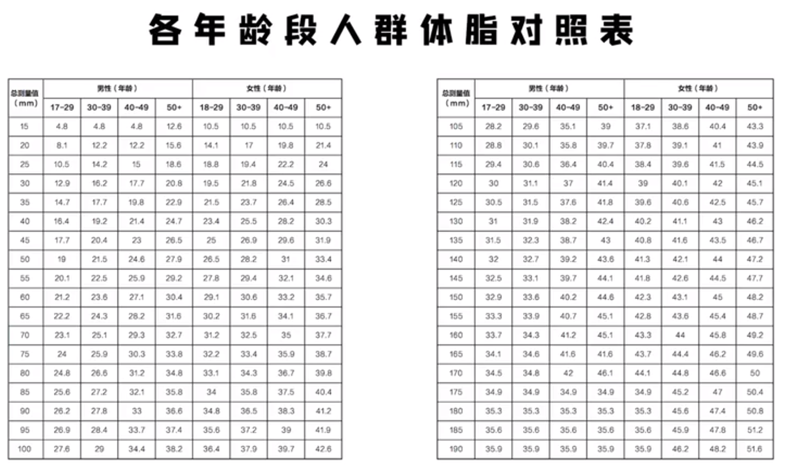
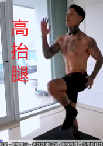
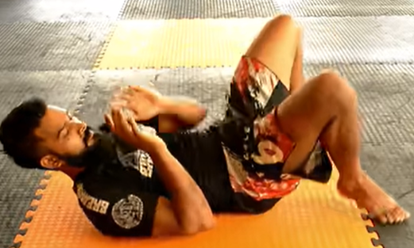
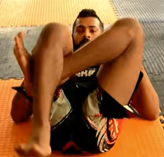
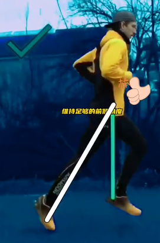

## Sports

### 体脂测量

#### [总结 脂肪卡尺怎么用？皮脂钳体脂肪对照表\_肌肉网](https://www.jirou.com/html/jianfei/2017/0712/11108.html)

2023年08月23日 周三 21时27分07秒
4+4+5+4+
7+3+8+3=34mm
10.1% fat

7.在每个地方至少测量两次，如果数据变动超过2毫米或10%，需要再次进行测量。
各部位体脂测量方法，如下图：

　　计算公式来源于人民体育出版社的《体适能基础理论》，如下图：

#### 脂肪卡尺三点法

2023年08月23日 周三 21时27分13秒
1+2.3+8+7=18.3mm
9%fat

骼骨上棘

把测好的四个数值相加

[聊聊自测体脂的三种方法。](https://www.bilibili.com/video/BV1Zi4y1P7WD?t=24.9)

#### [体脂秤VS脂肪卡尺「减肥工具篇」 - 知乎](https://zhuanlan.zhihu.com/p/106072343)
编辑于 2020-02-13 11:48
##### 年轻人的公式不一定适合年长
人的脂肪多少和分布特点，跟人种有关系，所以这时候最好选择通过中国人自己的实测数据推导出来的公式。而中国自己的公式一般都只适合青年人，因为人的皮下脂肪和内脏脂肪是有一定相关性的，但是随着年龄的增长，这个相关性会越来越低，所以年轻人的公式不一定适合年长的人。
##### 位置要固定 肚子上、大腿上、胳膊
一般测量时，注意首先位置要固定。估算体脂率，需要准确地找到几个位置，但如果拿来评价胖瘦就不需要特别严格，一般来说在肚子上、大腿上、胳膊上找几个点，记住位置就可以了。

比如你胳膊上有个痣，那你干脆以后就夹这里。总之，每次夹哪里，位置要固定。另外，你是横着夹还是竖着夹，最好手法也固定。夹的时候，先捏起来，不要太用力，也不要太轻。夹的时间不要太长，否则脂肪组织可能凹陷，最后数据也不准确。一般来说，同一个人只要手法固定，位置固定，那么脂肪变化的趋势就能准确地反映出来。
##### 脂肪卡尺只能测量皮下脂肪
补充（插说）一点，我们的脂肪分为内脏脂肪和皮下脂肪，但脂肪卡尺只能测量皮下脂肪，而内脏脂肪呢，也会影响体重的变化......
##### 估算内脏脂肪减少 测腰围
在这里我告诉大家一个估算内脏脂肪减少状况的方法，就是测腰围，如果腰围没有明显变化，则说明内脏脂肪减少不明显。
##### 减肥光减水分和肌肉不健康 脂肪减去不多
反过来说，我们如果使用了错误的减肥方法，减掉的体重里面脂肪并不多，多数是水分和肌肉。这种减肥方法就不健康，不利于持续减脂，后面减起来会越来越难。这时候，你也需要脂肪卡尺，如果你发现体重降得蛮快，但皮下脂肪减少不明显，那有可能你就是这种情况。

#### 体脂秤或手握测体脂仪是不是不准确？

体脂秤通过人体电阻抗来检测的，电流通过双手双脚贯穿全身测出阻抗，然后根据阻抗反馈来计算各项指标，一般会用最少3个通道的频率来测，技术比较成熟了，健身房那种大型的像Inbody之类的都是这个原理，家用的可以看BodyPedia，除此之外一般家用的只是挂个羊头卖狗头。

理想的状态下，生物电阻抗法测量出的体成分，也远不如水下称重法或太空舱法准确，甚至不如皮褶厚度测量法。一般来说，生物电阻抗法测量瘦弱人的体脂容易偏高，肥胖人的体脂又容易偏低。研究还发现，健美运动员和力量项目运动员，不能使用生物电阻抗法导出体脂百分比。这种方法只适合普通人，而非运动员和资深运动爱好者。
[发布于 2015-08-06 17:58](https://www.zhihu.com/question/33535030/answer/58048332)

### 热量消耗计算

[比较：最消耗卡路里的运动](https://www.bilibili.com/video/BV1zU4y1Q7EY/)
篮球 440kcal/1h 半场
有氧舞蹈 475kcal/1h
HIIT 550kcal/25m   2200kcal/1h
跑步 565kcal/1h  8公里/h  配速7'30''
篮球 580kcal/1h 全场
游泳 700kcal/1h 自由式、蛙式交替
快跑 890kcal/1h 12公里/h 配速5'00''
短跑 1.2wcal/1h 200cal/m

除了游泳和慢跑其他都不行，都不能持续。

### 训练量要跟上否则 尿酸 肌酐 尿素氮超标

[东哥问你怕不怕](https://www.zhihu.com/people/cc2314bb482e76bc05da060f1743cb93)
请问下答主查过尿酸 肌酐 尿素氮等指标吗，曾在单位组织体检前一个月像答主类似的低碳水高蛋白刷脂，体脂是下去了，体检一看尿素氮，尿酸超标，又恢复了往日的普通三餐，一个月后又去查，指标正常
2020-05-26
[不为良相](https://www.zhihu.com/people/7b66484e3a6223cca78a081960c4c6a9)
训练量要跟上
2020-05-27

### [早晨可空腹健身 低血糖头晕眼花 无糖原分解脂肪蛋白质](https://www.zhihu.com/question/555531328/answer/2690567401)

空腹健身好处：1.早晨糖原亏空，在喝了足够水的情况下，空腹健身有助于脂肪消耗2.早上健身刺激肾上腺激素分泌，提高代谢，让一整天的工作生活有了一个好的开始。

空腹健身坏处：1.看个人体质，可能引发低血糖，会出现头晕眼花，黑视，腿软，无力等症症状。2.空腹状态糖原亏空，身体会更多地分解脂肪和蛋白质，会一定程度加速肌肉消耗，特别是剧烈运动。建议以减脂为目标的且体质较好的人可以进行中低强度的空腹健身运动。发布于
2022-09-26 18:14

体重0.08吨 作者

不吃饭糖原当然也会降低，如果是有氧运动的话晚上空腹没问题的。但如果力量训练，空腹无法让训练效果最大化，也会更大比例消耗肌肉。

2023-03-25 · IP 属地广东

### [证明人类依靠运动可以补充端粒《欧洲心脏杂志》，这论文在2018年尾发表。](https://www.bilibili.com/read/cv4172344?from=articleDetail)

一项研究发现，耐力运动，比如跑步、游泳、越野滑雪和骑自行车等，要比阻力运动能更好地对抗衰老，阻力运动通常指的是负重的力量运动。这项研究在2018年11月28日发表在《European
Heart
Journal》上。来自德国研究人员分析了耐力、高强度间歇和阻力运动这三种类型的运动对人体细胞衰老方式的影响。他们发现，耐力运动和高强度间歇运动都能延缓甚至是逆转细胞衰老，但阻力运动却无法实现。

由德国莱比锡大学的Ulrich
Laufs教授领导的研究人员招募了266名年轻，健康但不爱运动的志愿者。并将他们随机分为四组，进行6个月的观察：

耐力训练：连续跑步；

高强度间歇训练：热身，接着四次比赛；高强度跑步交替慢跑，然后最后冷却慢跑；

阻力训练：包括后伸，下拉，坐式划船，坐式腿部卷曲和伸展，坐式胸部按压和趴腿按压等；

### 2、[健身并不会带来健康](https://www.theguardian.com/news/2019/jan/03/why-exercise-alone-wont-save-us)

人类作为一个物种，正变得越来越久坐。

数十万年前，原始人的运动水平远高于我们今天的水平。从觅食、寻水到狩猎、建造避难所、制造工具等各种工作，人类不得不运动。

到了一百年前，人类的运动已经大大减少，但是购物、擦地板、做家具、手工洗涤这些事情仍然需要运动。后来，人类不断发明新东西，越来越不需要自己动手。扫地机器人让我们不用扫地，洗碗机让我们不用洗碗，网络购物让我们不用去商店，语音控制甚至让我们不用站起身开电灯。

人类的工作性质也发生了变化。以前，大多数工作岗位是体力劳动，现在则是办公室工作。1841年的英国人口普查表明，当时有0.1％的劳动力从事行政或办公室工作。1891年，这个数字增加了20倍，变成2%。今天，美国一项调查估计，86％的劳动力从事久坐工作。

运动的减少使得人类的骨骼变薄，肌肉变弱，出现很多健康问题。根据世界卫生组织的数据，心脏病和中风每年导致大约1700万人死亡。许多人意识到，需要减少久坐，增加运动，这导致健身变得非常流行，成为了一种时尚。

问题是，你需要的是长期的、持续的运动增加，而不是间歇性、高强度的健身。即使你每天都去健身房，但只要不去健身房的时候，你还是在久坐，就依然有问题。真正健康的运动模式，要求你在一天中持续地燃烧卡路里，而不是短暂的爆发式燃烧卡路里。

对于人体而言，固定的运动时间依然不是最佳方式，虽然有运动总是比没有运动好。只要你依然存在久坐，就还是会引发很多问题。我们真正需要的是，体育活动与日常生活结合在一起，这样才能摆脱久坐。地球上，最健康、寿命最长的一些地区的人们，从来没有去过健身房。很多百岁老人以前每天都要走几英里。

另外，站立式办公只比久坐好一点，但也没有好到哪里去。它的升级版是跑步机办公桌，旨在让人在运动中办公，但是并不实用。一把不太舒服的办公椅可能是一种有效的策略，使得你很难做到长时间不动。

#### 长时间的、持续的、低强度或中等强度的活动，似乎会产生最佳结果。

总之，经常去健身，但是其他时间久坐，这仍然会对身体造成伤害。长时间的、持续的、低强度或中等强度的活动，似乎会产生最佳结果。过度的高强度活动反而会推动新陈代谢和细胞更新，可能加速衰老过程。

这至少说明健身不是长寿的必要条件，而更好生活习惯可能是必要的

2019年3月18日 10:19 \|
[\#](https://www.ruanyifeng.com/blog/2019/03/weekly-issue-47.html#comment-409980)

[引用](https://www.ruanyifeng.com/blog/2019/03/weekly-issue-47.html#comment-text)

### training

#### [白俄消防员 难度★★✰✰ 8个最佳练腹肌动作，4分钟高效跟练！](https://www.bilibili.com/video/BV19u4y1R7fu/)

登山跑

起桥

腿转体

踢腿扶

大步幅登山跑

平板支撑侧抬腿

平板支撑扭腰

#### [比跑步高效3倍的燃脂运动HIIT](https://www.bilibili.com/video/BV1dY41167nV)

2023-03-07 23:06:23
高抬腿、俯身登山、无跳跃波比跳、侧身卷腹、俄罗斯转体、交替弓步蹲、俯卧撑、开合跳、前后收腿跳、左右深蹲跳
共10个项目，每个40s左右，400s=6m40s。

同样的时间比跑步更高效，可在任何地方完成。

##### [运动不要天天做一样的 久了身体适应再练没效果](https://www.bilibili.com/video/BV1ov411J7Y3)

喵儿晚丶

运动最好不要天天做一样的 时间久了你身体适应了再练就没效果 得负重 加数量
减少休息时间 最好每天练的都不一样 练两周增加难度

2021-07-17 12:44

178

\_\_\_易\_\_\_

回复 \@喵儿晚丶 :我做了好几个月才意识到你说的这条评论的重要性

2022-01-17 16:4216

##### 不要空腹运动太久 容易血糖低

克里斯健身\_

有效果的 但是注意不要空腹运动太久 容易血糖低

2023-03-13 23:14

#### [巴西柔术每日必做的16个基础训练](https://www.bilibili.com/video/BV1Kf4y1T77f/)
1.BRIDGE (BJJ) 起桥 高位
 

低位
 

3.SHRIMP 虾行
  

4.BRIDGE & SHRIMP
 

5.SHRIMP (OUTSIDE LEG）
左足后撤
 

6.FRONT SHRIMP 上下移动虾行 起桥虾行挪屁股就行
 
 

7.SHRIMP TO TURTLE 
 
 

8.BUTT SCOOT 臀行
 

9.TECHNICAL STAND UP 臀移+站立

10.HIP BUMPS 
 

11.HIP UP TRIANGLES
  

12.LEG POMMEL 小腿旋转
 

13.HIP SWITCH 臀移
  

14.HIP SWITCH (IN PLACE）定点臀移
  

15.HIP SWITCH (KICK THROUGH) 踢式臀移
  

16.BACK ROLL 后滚
 

#### [想要甩掉腰间的赘肉，你要做到这5点](https://www.bilibili.com/video/BV1Bb4y187Hj)

2021-11-07 10:26:10

##### 旋转类动作

{width="1.6601060804899388in"
height="1.5041666666666667in"}{width="1.375in"
height="1.5384820647419073in"}

##### 旋转躯干 不动肘部动腰部 蹬车轮卷腹 俄罗斯转体

比如像这样做蹬车轮卷腹，还有俄罗斯转体，但是并没有练到你的腹斜肌，因为你的躯干并股有进行旋转。记住你的肘部就不要有任何的移动了，你要做的是旋转你的躯干。来让你的肘部去触碰你的膝盖。记住动作的关键不在你的肘部。俄罗斯转体也是一样，重点不是在移动你的手，你的双手应该始终保持固定不动，你需要旋转的是你的躯干。看上去这可能只是很小的差门，但是会带来哉然的效果。

{width="2.5605096237970253in"
height="1.488888888888889in"}{width="2.1041666666666665in"
height="1.47832895888014in"}

##### 很强收缩感觉

{width="2.437617016622922in"
height="1.9305555555555556in"}{width="1.9791666666666667in"
height="1.922619203849519in"}

##### 控制碳水比锻炼有效 锻炼也内脏脂肪多

三埠岸边人
回复 \@闫帅奇
:其实大肚子并非懒人专属，一些勤于锻炼健身的男士，也容易内脏脂肪多，原因是有些人成功增肌了，但是一直处在那个未脱脂的状态，由于男性本来就是脂肪容易囤积在腹部的体质，所以很多肌肉发达的人也大肚子。以前我也大肚子，但是透过单方面削减米饭等碳水化合物的摄入之后，肚子也瘦下来了，期间训练量保持不变，肉食等蛋白质也一块都没有减少，就控碳水化合物都有很明显的效果。
2021-03-10 18:03 👍7

##### [【蒋劲夫】日常训练](https://www.bilibili.com/video/BV1VT411y7HS/)
Bc-trap
所有推胸的动作都专门有大量核心参与，真的强
2023-01-26 00:54👍4427
###### 想要腹肌有突破，最好多做做动态核心训练
头像不狠站不稳
差不多，想要腹肌有突破，最好多做做动态核心训练，你可以上网查查动作，总做自重的静态核心训练不利于突破
2023-02-04 10:27👍36
###### 把深层稳定肌群练厚，腹直肌才能被顶出来
克里斯丁男爵
是核心强。大重量把深层稳定肌群练厚，腹直肌才能被顶出来。卷腹这种专门练腹肌效果不会好。
2023-02-12 11:48👍31

#### [BBOY 专属 「 腹 肌 撕 裂 」4.0](https://www.bilibili.com/video/BV1aY4y177uK)

#### [BBOY 专属 「 腹 肌 撕 裂 」5.0](https://www.bilibili.com/video/BV1Hf4y1o7Pj)

#### [为什么减肥不推荐做波比跳？](https://www.bilibili.com/video/BV1p94y1f7tf/)
冲击锁骨。
### 跑步

#### [为什么长期跑步的人，变瘦了也变老了？](https://www.bilibili.com/video/BV1tb4y1H7AG/)

##### 月跑量不要超过200公里 跑完洗脸防止盐分停留过久
Ninja-K
跑步八年，40岁在电梯里被人当20多岁的路过。跑步防衰老三个秘技：一、尽量不要晨跑，你根本不知道紫外线对衰老的促进有多大，你也不知道紫外线的“起床时间”远比你想象的早。一定要晨跑时（比如各种赛事或跑团活动），涂一下防晒霜，当然，不能长期这样，因为你无法确定长期以往防晒霜是否会对身体造成影响，毕竟跑步时出汗很多，皮肤内外物质交换也更频繁。二、没必要的话，月跑量不要超过200公里。跑的越多，自由基氧化影响越明显。三、跑步终点处最好是有水龙头的地方（比如公厕），跑完马上用水洗脸颊、洗眼周，防止脸上盐分停留过久对脸部造成小创口。除此之外，就是日常的护肤了，那就是题外话了。
2022-01-14 13:00👍6986

##### 超量恢复 基因决定把资源投资在身体修复和器官保养
几率昆明
运动强身的原理就是超量恢复。  
给身体施加压力让身体为了适应环境自我调整变得更强。  
在防衰老上，基因遵从生存和繁衍两抉择。  
环境适合基因倾向投资于繁衍扩展群体，当环境恶劣基因倾向于生存保存个体。  
适当锻炼能欺骗身体，让基因认为环境恶劣不适合繁衍，从而把更多的资源用于身体修复，期望“你”能活下去。  
是基因决定把资源投资在身体修复和器官保养上，这样你才能长寿。  
但这些的前提是，有充足的恢复时间，不然就是把自己往死里整，身体怎么能不显老。
2022-01-15 17:49👍3135

##### 超量运动、进食不要过饱、待在不是很热得环境
帆酱123
哇！终于看到这个！真的要长寿年轻，看到有研究MAD的那个团队就是推荐要超量运动、进食不要过饱、待在不是很热得环境里。总的来说就是欺骗身体让他以为他正在恶劣的环境中，动员更多的资源用于生存，而不是安逸的想着繁衍。
2022-01-24 11:10👍64

长路行者树之恋
所以说人要想长寿就是，又冷，又饿，又累，基因在想你还没完成繁衍的任务不能让你就这么嗝屁了！
2023-05-31 21:22
##### 适度饥饿，适度寒冷 不生育
阿呆_ADai
这个理论我看过，相似的欺骗方法还有适度饥饿，，适度寒冷，还有最重要的不生育（不射精）
2022-01-31 22:38👍10

波罗的海鱼干
回复 @姜翮翮 :不会，环境恶劣的情况下人类性欲低下，女性甚至连月经也不来了
2022-01-18 10:03👍5

##### 睡眠充足的话起床会发现嘴唇更红，气色好
凌烟rinyan
我一有空就睡懒觉，坚持睡觉是个小时以上，我觉得挺管用的，好多人第一次见我都以为是高中生
2022-01-15 18:40👍608
艾明玛恰
这是真的，而且睡眠充足的话起床会发现嘴唇更红，气色好
2022-02-02 20:37👍4

#### [增大步幅要选择合适的方法！\_哔哩哔哩\_bilibili](https://www.bilibili.com/video/BV1gs4y1A7hv/)

#### [黄种人马拉松记录2:04:56，铃木健吾跑姿欣赏\_哔哩哔哩\_bilibili](https://www.bilibili.com/video/BV1nF411Y7tW/)
核心力量强，垂直振幅小。
典型的全掌跑法
尤金世锦赛马拉松冠军就是后脚跟着地跑法

#### 配速

##### [配速是什么](https://www.zhihu.com/question/23814936/answer/631007096)
配速，是描述马拉松运动中跑完一公里所耗用的时间，通常用分秒来衡量。比如，一个小时跑完十公里，那么你的配速就是六分配速。它是一个时间╱距离的概念。

在完成一场全马中如果用平均配速来给跑者分类的话，五分以下配速的跑者是精英跑者，就是我们平常所说的跑神;五分~八分配速的跑者是跑屌;八分以上的配速跑者那就是我们常说的跑渣。

速度（speed）一般是指一小时完成多少公里，跟配速（pace）是一个相反的概念，它是一个距离╱时间的概念。
配速（[pace](https://www.zhihu.com/search?q=pace&search_source=Entity&hybrid_search_source=Entity&hybrid_search_extra=%7B%22sourceType%22%3A%22answer%22%2C%22sourceId%22%3A631007096%7D)） 时速（speed）
8’00” 7.5 公里/小时
7’40” 7.8 公里/小时
7’20” 8.2 公里/小时
7’00” 8.6 公里/小时
6’40” 9.0 公里/小时
6’20” 9.5 公里/小时
6’00” 10.0公里/小时
5’40” 10.6公里/小时
5’20” 11.2公里/小时
5’00” 12.0公里/小时
4’40” 12.9公里/小时
4’20” 13.8公里/小时
4’00” 15.0公里/小时
3’40” 16.4公里/小时
3’20” 18.0公里/小时
3’00” 20.0公里/小时
2’40” 22.5公里/小时

**八分是治愈，七分是自娱，六分是养身，五分是自伤，四分是自残，三分是自毁。**

相对来说，马拉松距离是一定的。如果用时速来表达跑者水平是不是显得空泛？是不是感觉**用完成的时间来衡量跑者，配速更能直观的反映跑者的跑步水平？马拉松讲究用稳定的配速跑完全程，在马拉松42.195km中，适当的安排配速具有重要的意义**。

**如果说一年时间配速从六分到四分，是跑步速度的提升，那么三年时间配速从四分到六分，就是思想高度的升华。**

**四 配速能让你受伤，也能让你疗愈，这就是配速的魅力。**

一定要让心智掌控你的身体，它会让你稳步前进，一个台阶一个台阶上升；若是心魔掌控了你的身体，你要小心了，它只会让你越来越快，追求的是速度！速度！速度！最后，在不知不觉中受伤了。

六分以下配速要小心了，五分是自我伤害的配速，四分是自我残害的配速，三分则是自我摧毁的配速。

##### 80％有氧慢跑+20％竞速跑有效避开受伤
玉树临风 作者

你说的没错，完全赞同
80％有氧慢跑+20％竞速跑，才能有效避开受伤！[捂嘴][捂嘴][捂嘴]
2022-05-13

#### [时速配速相互转换计算器](https://tool.wenge365.com/speedCalc.html)
配速如何计算？
配速为每跑一公里所用的时间，配速和时速均为速度单位，时速和配速之间可以相互转换
#### [跑步配速计算器](https://www.strava.com/running-pace-calculator?hl=zh-CN)
根据你的预期配速，用 Strava 的跑步配速计算器计算最热门的比赛距离（5k、10k、10 英里、半程马拉松、马拉松和 50k）的完成时间。
只需在下面输入你的预期配速，并在表格中找到你的预期完成时间。

#### 不要蹬地 注意提髋
不要改变身体熟悉的跑步姿势。

[时间戳](https://www.bilibili.com/video/BV1er4y1h7gf?t=389.7)

#### [跑步技术讲解(五)膝前行 自由落 落地轻 不发力](https://www.bilibili.com/video/BV1T3411M7wS/)

##### 膝关节向前滑行
它并没有一个主动抬高的动作，

一旦抬高膝关节，就超过支撑腿的膝关节高度。

我们的膝关节的高度跟我们支撑腿的膝关节高度是一样的是最好的。

##### 脚落地之后不要蹬起
蹬起相当于膝踝二次做功。压力大。
膝踝放松，自由后摆，

跑步的人需要有，臀肌的力量。我们的髋关节的伸展靠的是臀肌，需要由股后肌群的力量。

自由落体之后，落点很轻，不要去主动的蹬地发力。很多人的脚踝会受伤，脚趾麻，都是因为你的脚，在落地之后太发力了。用你的脚趾在蹬地，所以脚跟疼。
#### 正确跑姿

未之来来 笑而不语
收腹挺胸，髋关节带动大腿支配小腿迈步（感觉就是屁股能够前后小范围的摇起来）。调整呼吸与步频、步幅之间的配合，慢跑做到3步一呼3步一吸就ok。
另外，一定要注意自己的跑姿，别让自己受伤，比如关节磨损，跟腱炎症等等。
2019-04-17

[**爪八个**](https://www.zhihu.com/people/08d06608016acbce84ac8be333f1a6a3)
跑步要靠臀部推动
2019-06-02
#### 膝盖疼
[**新华字典**](https://www.zhihu.com/people/4a7a412d138e77bb7dd14dc9eb12f864)
膝盖疼可能是因为髌骨发炎，严重可能会脱落
2019-04-19

[**努力低调**](https://www.zhihu.com/people/189c240cf9474f96abb6b2e77a847a3f) [**王正洋**](https://www.zhihu.com/people/3e3f6b6ad90229829872f2415b7098dd)
臀腿肌肉太弱或者髋关节活动能力受限
2019-05-25

[**土神**](https://www.zhihu.com/people/1eea70d03c18c0d35d70444099ebccf0)
跑步前热身很重要，还要选一双比较专业的减震跑步鞋，可以在一定程度上保护膝盖。
2019-03-07

### 减脂

#### [力量运动耗能>有氧 两者结合减肥快](https://www.zhihu.com/question/62557982/answer/201320934) 减碳水加蛋白质

我是点型梨型身材的人，也就是除小肚子以外没什么脂肪的人，从25岁开始就有小肚子，那时不严重，但到了30已经大到我不能再忍了，下了死决心要减，其实我这些年都有坚持慢跑，从最开始10分钟，到后来1个小时，最长连续跑过7个多月的40分钟的步，除了精力和口味好了，体型一丝变化都没有，但来是看了两本书总结了两点，

一是，力量运动耗能总体会超过有氧运动。二是，减少碳水化合物摄入量，加大蛋白质摄入量，这点是最有效。

运动上我把之前45分钟的跑步改成了20分钟跑步，20力量。饮食上，米饭跟精肉的份量撮入一样多，青菜不限量，肉最好用水煮鸡胸肉，有条件吃虾。我就是这样连续20多天一下子从140减到116。后来半年没怎么这样运动和吃肉，也怎么样涨不上来了，衣服穿上去怎么也不好看了，没一点安全感太瘦了，所以后来又想办法增一天吃4顿，跑步一同只跑一次，每天举两个小时哑铃。

#### [jeff增肌三要素](https://mp.weixin.qq.com/s/-Bdrkw3E-IwWt9F2MtNx-g)
##### 大重量渐进式负荷增长 小重量代谢累积 离心控制训练
**#3 想要保持低体脂的训练要求**
对于训练来说，核心追求就是尽可能地增加肌肉！想要增加肌肉，要做到的就是**增肌三要素**！这已经介绍过很多次了。不知道的小伙伴可以点这里看看。具体的训练表现形式就是：大重量的**渐进式负荷增长**训练要做，小重量的**代谢累积**训练要做，**离心控制**的训练也要做！很多人都是一元思维，非黑即白，觉得大重量好，就只做大重量，觉得小重量好，就只做小重量。**训练是需要多元的思维的！****哪个对你有用，你就用哪个！**
##### 饮食到位 不需要做有氧

**#4 想要保持低体脂的有氧要求**
其实Jeff完全不做缓慢的稳定的有氧训练，要做也是之前介绍过的那种有助于促进运动能力的体能训练。而且事实就是**如果你饮食摄入做到位了**，那你完全不需要做有氧，更不需要早上空腹做有氧，也不需要晚上额外做有氧！

#### 健腹轮 三个月变化一点点

[**马大强**](https://www.zhihu.com/people/cd1205f731771da0507dcd89dd6e46d1)
可以试试健腹轮，一个月就让你重现六块。
2015-01-14
[**布鲁斯离**](https://www.zhihu.com/people/09884a1953f5153bbf0af91650499979)
练腹肌轮一个月绝对不行，没有那么快的，我一天250，三个月腹肌轮才变化一点点
2021-06-30
#### [无局部减脂 专练腹部 脂肪会覆盖腹肌](https://www.zhihu.com/question/30622462/answer/1343405880)
不存在局部减脂，也就是说完全不存在某一个动作，或者是某一个运动能够只减肚子上的脂肪。这个是绝对不存在的。如果你问卷腹，空中脚踏车，还有一些核心训练动作是不是有效，那么可以非常明确的告诉你，这些动作的确可能让你有腹肌！但是如果你不减脂，腹肌上面的脂肪还是会把你的肌肉线条盖住，根本不存在美感，最多就是肚子摸起来很硬，证明你有肌肉。而且腹部的肌肉越大，上面的脂肪没有减少，那么整个肚子看上去就会越大～你没看错，你的肚子会更大，不会减小。
#### [减脂最重要的是靠饮食 运动效率低](https://www.zhihu.com/question/30622462/answer/1343405880)

减脂最重要的是靠饮食，因为运动的效率非常低。比如我们跑步跑了1个小时，消耗了573大卡，结果因为跑的太累了，跑完想吃一碗康师傅红烧牛肉面犒劳一下自己～

叮叮猫
这个回答应该上顶，以前看到话总结得很好，普通人减肥路上：太高估运动消耗的热量，同时太低估食物带来的热量。这样的反差真的让很多人越运动反而越胖\[大哭\]2021-08-02
#### 高蛋白低碳水 二十多天瘦了两斤多

[**精神科主任医师**](https://www.zhihu.com/people/62b931d955b3c664106a0051de417145)
我近两个月没运动，每天高蛋白低碳水，近二十多天瘦了两斤多。同样的饮食结构，配合每天来回18公里骑行通勤，坚持了三个月，后被各种出差打断，三月份至今共瘦了10公斤。
2021-08-02
#### [有哪些是你健身久了知道的事？ - 知乎](https://www.zhihu.com/question/332765440)
1.规律健身过程中，休息一两天身体不会真的胖；但中断三天以上，意志力会变弱。所以休息时间不要超过两天（例假期除外哦）
2.虽然“有氧运动超过40分钟才开始燃烧脂肪”是谣言，但匀速有氧低于40分钟，消耗的确很低。
3.一次熬夜加班或一周连续加班之后，你需要的是一次拉伸或者一次按摩或者一次散步，然后洗澡睡觉。而不是去健身房。

#### [自重难练大](https://www.bilibili.com/video/BV1pR4y1n7qG/?spm_id_from=trigger_reload&vd_source=f03b9d349cef8aff4a045d602d8a1d82)

阿姆纳米
为什么自重难练大？
因为自重健身，有两个方向能让你做俯卧撑，引体向上更轻松，一个是肌肉增加，一个是体重下降。体重下降了，自重就更轻松了。
想要纬度更大，要增加负重，不能堆数量。
2021-10-31 11:07 92

哈皮の酱
跟器材关系不大，摄入蛋白质太少导致的
2022-01-12 18:01👍8

燥郁的火龙果
手臂最好不要徒手，除非是单手俯卧撑啥的，不然效果贼挤吧差。正常俯卧撑对手臂刺激太小，最好是脚抬高一些。徒手俯卧撑健身那么多年没屁用，后来被迫训练高角度俯卧撑两星期三头肌就长很多
2022-01-19 23:10 👍7

##### 徒手肌肉整体协调

爱猫丨人士
纯徒手最大的缺点是不能很好的孤立肌肉 但是这也是他的优点
募集到的肌肉多练出来整体协调
2022-01-05 19:38👍7

##### 单手俯卧撑，倒立俯卧撑 俄挺 顺风旗 托马斯

陽淵登
徒手健身确实有一定局限性，但是你这入门菜鸟级别的就别来说徒手健身的弊端这些话了，自己没练好，不会练，连单手俯卧撑，倒立俯卧撑都没做，更别说俄挺，顺风旗，托马斯这些
2022-09-05 01:10👍3

#### 减脂食谱
##### [减脂鸡胸肉做法](https://www.bilibili.com/video/BV1gv411K7pz/)

沈问礼
调料： 大蒜 小米椒 料酒 生抽 小苏打 嫩肉粉 喜欢的调味料 （白胡椒粉） 自己拌
2021-08-01 21:41👍15

龍脉高长老
鸡胸这事因人而异吧，我从五月减脂到现在 一周至少5天鸡胸肉，最近一个月基本每天鸡胸肉，一天熟重摄入不超200克，都是白水煮的，对于蛋白质的补充 还有鸡蛋和牛奶，还穿插着还吃牛腱子，结果我上周去验血，尿酸居然到上限414/416，从小到大30多年都从没像减脂开始后这么规律的饮食，我也不喝酒，去年体检时尿酸也就300。
2021-08-23 09:14👍103

吸血的番茄
我自己的经验，我感觉是化肉的时间太短才会让肉变得很柴，我也很喜欢鸡胸肉，真的是性价比最好而且健康的肉了，我试过如果刚从冰箱里拿出来没怎么化开就短暂的腌制一下就炒就会很柴，我试过同样的腌制，感觉口感主要受冰冻的程度影响。
我自己没什么讲究，口吻比较重就着一锅米饭吃很爽，所以我喜欢吃咸一些的，我会加蚝油，葱姜蒜，小米椒加三根是我的极限程度了，加很多酱油，还有盐，其实感觉也和up没差多少。还有我吃的时候经常会有很幸福的感觉。配着一瓶肥宅水就着一锅米饭，再找好下饭视频。
2021-08-01 20:27 👍84

居里阿
大多数人还是普通爱好者 鸡胸肉买回来孜然胡椒粉生抽番茄酱一腌 跟胡萝卜青椒一炒已经非常符合大众口味了
2021-08-02 13:04👍69

### 保护膝盖

#### [膝盖过脚尖](https://www.bilibili.com/video/BV1dY4y17763/?spm_id_from=333.337.search-card.all.click&vd_source=f03b9d349cef8aff4a045d602d8a1d82)

而重量是否合适，一是看膝盖痛不痛。
二是看膝盖能否超过脚尖，或脚尖能否在膝盖的后面。

希望可以多翻译这个膝盖过脚尖超人的视频！！！
他的东西被很多康复师，骨科医生证明有效
2022-07-14 22:31 192

lordHN
和腿屈伸有什么区别
2022-09-26 05:391

戴夫健身
那没练到脚，没让髋膝踝整体运动，不是站地上的（没模拟真实的环境）
2022-09-26 15:06

##### 骑车累了后倒转

tom仔好胃食
我骑车累了车空转时候很喜欢后倒转异常舒服
2022-07-29 15:32

#### [强化膝盖的黄金动作-反向北欧挺](https://www.bilibili.com/video/BV1G3411e7zM/?spm_id_from=trigger_reload&vd_source=f03b9d349cef8aff4a045d602d8a1d82)
2022-01-04 20:59:44

##### 一周练一次，两次最多了

张梦卓Soar
一周练一次，两次最多了。 兄弟别过度训练
2022-01-07 11:13👍10

##### 跪姿本来就伤膝关节

篮球李老湿
键盘砖家表示 跪姿实际上本来就很损伤膝关节。。。。
2022-01-07 14:26👍90

##### 半月板受伤更是大忌
nCCtT
膝伤尤其半月板受伤更是大忌，腿一弯全压烂了
2022-01-07 20:45👍40

#### [骨科医生教您：如何保护膝盖](https://www.bilibili.com/video/BV1HB4y1m7w5)

2022-04-29 14:57:42
减少上下楼梯、提重物。受冷。

#### [6个保护膝盖的力量训练动作！](https://www.bilibili.com/video/BV1sk4y1N7M5/)

侧卧抬腿

### 男性体脂率不同对比{width="4.683510498687664in"
height="4.891666666666667in"}
