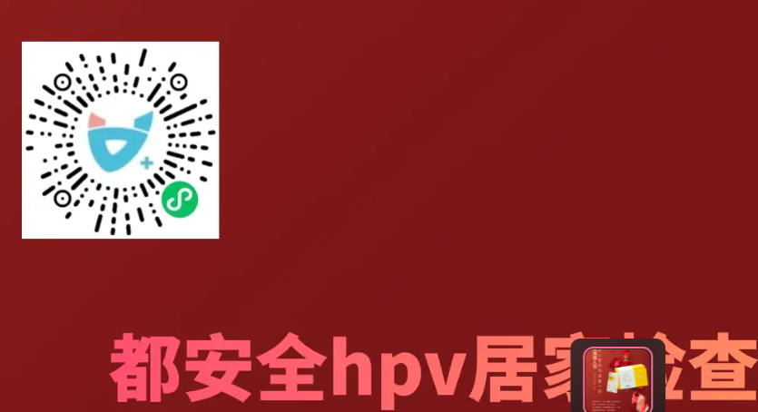
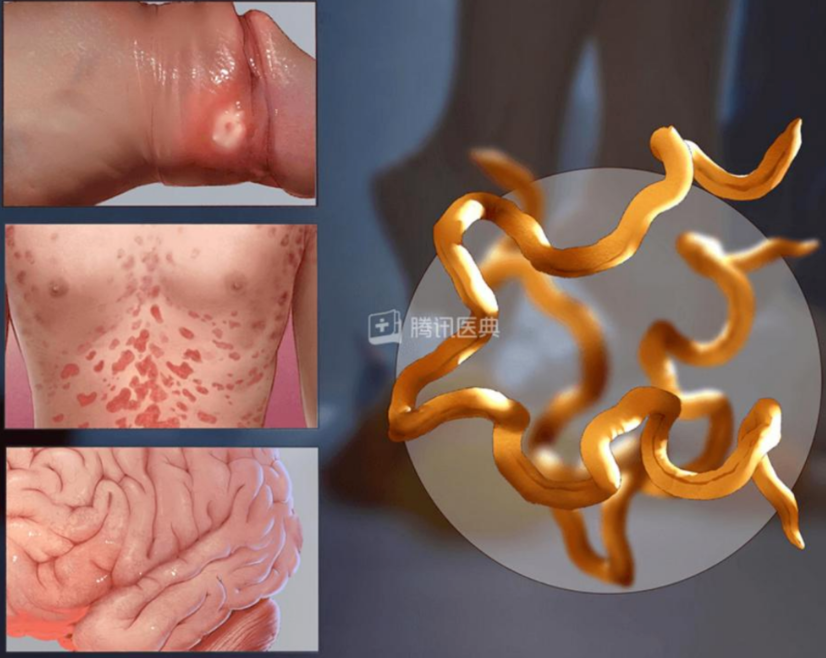
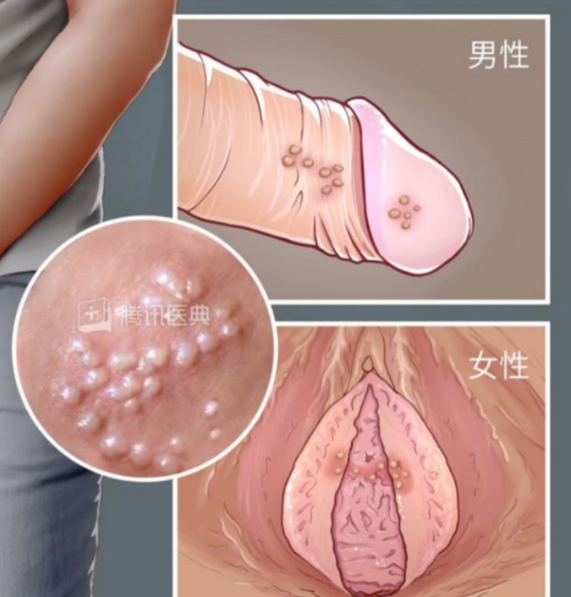
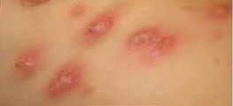
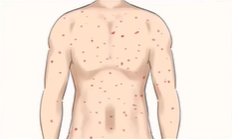
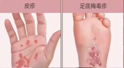
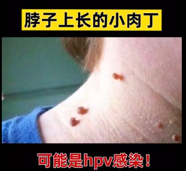
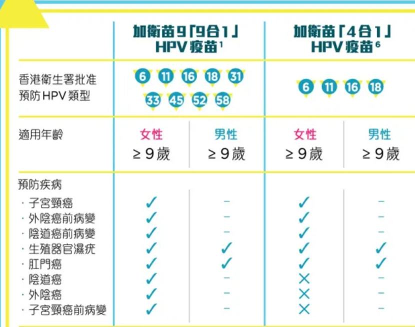

### venereal disease

#### 总结

##### 万孚检测 常见性病 血检和唾液检

yt就是液体套，是一种类似具有杀精作用的润滑液，可以在无拘无束的同时大大降低女孩的怀孕几率，但并没有任何预防病毒的作用。

淘宝天猫上搜索"万孚检测"，是一种可快速检测是否有一些常见性病的试纸。强烈建议在约无套时提前检测。有血检和唾液检，血检结果更准。

[万孚 艾滋病检测试纸hiv梅毒自检盒传染病性病四联四合一非第四代
¥76](https://detail.tmall.com/item.htm?ali_trackid=2:mm_33231688_7050284_23466709:1686564225_068_587507104&bxsign=tbkuqWmvXV2yGMJILrGIoh8YErjPN-N56FamKUAHYTb_C0is8xO3c6ghuFlh0RToEyNhRRauua_BuMqHs6MZgp2kegzULxMtyTU-dLvbxDP-lFEVBlGUwiTUy6q889hNYaiUsgZIFca-JWCw9yXQdo0PQ&id=566325371993&skuId=4709860775435&spm=a2e1u.27655827.d1661933647166.2&union_lens=lensId:OPT@1686564220@2106fd11_0a12_188af0fad80_04f3@01@eyJmbG9vcklkIjo2MTc4NH0ie;recoveryid:201_33.44.96.149_13785919_1686564212755;prepvid:201_33.7.196.76_13782672_1686564219126)

【四联卡1盒】艾滋+梅毒+乙肝+丙肝

##### [医院系统查询项目](https://www.zhihu.com/question/444300041/answer/2634185450)

发布于 2022-08-19 10:45

那如果我们要系统做性健康检查，需要检查哪些项目呢？

虽然这三个体检项目看起来需要分开做，
但实际上，检康居家检查就能将三项体检一并预约，
与伴侣在同一时间检查，非常方便快捷。

①性传播感染三项

包含艾滋、梅毒、乙肝。

这三种性传播疾病感染后大多会终身携带阳性抗体，

就意味着即使治愈，通过血液也会知道曾经感染过。

随之带来的身体免疫力的下降和需要长期吃药维持正常健康。

②性传播感染四项

包括最常见的4种性传播感染病原体检测

· 沙眼衣原体：引起尿道炎、附睾炎、直肠炎等。

· 解脲脲原体：不孕不育、宫颈炎、盆腔炎、尿道炎等。

· 生殖支原体：男性不育、宫颈炎、习惯流产等。

· 淋球菌：尿道炎、宫颈炎。发病率居第一位！

并且女生感染症状更轻微，可能会被误认为是膀胱感染。

③HPV检查

男生女生都有必要进行。

尖尖就是由hpv感染导致的X病，不仅是生殖部位
，随着口啪的边缘形式越来越开放， 口腔、肛周尖尖感染者人数也在上升。

##### [都安全 自查 艾滋HIV、梅毒、衣原体、淋球菌、乙肝、丙肝](https://www.zhihu.com/question/386154771/answer/1896716753)

之前看科普要查这些：艾滋病、梅毒、乙型肝炎、丙型肝炎、单纯疱疹病毒、沙眼衣原体、淋球菌、解脲脲原体、生殖道支原体；另外还有基本的血常规和尿液常规分析，女生再加hpv检测和白带常规检查。我当时没去医院查，医院查应该挺全面的。

自查了个情侣同居检测
项目有艾滋HIV、梅毒、衣原体、淋球菌、乙肝、丙肝。用的都安全小黄盒，我跟我对象都查了，跟你情况一样的。像艾滋病这种携带终身的病，有意识提前预防才好，检测排除传染病，也是保护双方！万一，我是说万一被感染就没有后悔药可以吃了，很多感染案例都是无意识被传染的......发布于
2021-05-20 19:27

#### 

检测试纸链接 都安全 口也能传染梅毒、淋病、尖锐湿疣 都安全2023-02-03
22:00:00

{width="6.0in"
height="3.2625in"}

##### 完全排除HIV需要3个月

HIV ￥40

之后（排除既往感染）、3周（初步排除）、8周（大概率排除）、12周检测（完全排除）

买四盒￥160

可以减少检测次数。之后-\>5周-\>12周

#### [为爱鼓掌前，如何悄无声息的发现Ta有没有性病？](https://mp.weixin.qq.com/s/-Z4KftDvYKejlBwflNp-NQ)

有模拟图

梅毒

早期梅毒大多有迹可循，在感染后2\~4周，可能会在外生殖器和周围出现边界清楚、指甲盖大小（0.5\~1.5
cm）的红斑，然后迅速变大为丘疹，过几天扩大为较硬的溃疡，一般不痛不痒，临床上称为"硬下疳"。

男性主要分布在阴茎，冠状沟的地方，女性主要在大小阴唇和宫颈处，由于硬下疳不痛不痒，所以常常被忽视。

{width="1.9412817147856518in"
height="1.5465277777777777in"}

尖锐湿疣

当皮肤或黏膜被HPV感染后，一般2周\~8个月（平均为3个月）都可能没有明显的症状，这个时期叫做潜伏期^\[1\]^。

潜伏期过后，在感染区域就可能出现单个或多个小而柔软的增生性淡红色小隆起，有尖尖顶，后期逐渐增大，数目增多，渐渐地长成**菜花样**，**乳头样**或**鸡冠样的皮疹**。有的比较脆，摩擦后容易出血，这个时候的皮疹就是典型的尖锐湿疣的皮疹了。

{width="1.99878280839895in"
height="1.6902777777777778in"}

生殖器疱疹

{width="1.5900962379702537in"
height="1.6625in"}

淋病

感染病淋球菌后，有些人可能没有明显的不适，但大部分人在2\~10天后会出现症状。男性尿道口、女性的阴道道口会出现黄色或黄绿色脓状分泌物，还会引起尿道的刺激症状，如尿频，尿急，尿痛，尿道口红肿等表现。

尿道口红肿，流黄脓。

淋病患者排出的分泌物，传染性在湿润的环境中可以超过10小时，就算你没有啪啪啪，接触到被淋病患者污染的物品（如毛巾、衣裤、被褥等）或肢体（主要是手）也有被感染的风险\[3\]。

激情飙车前，如果感觉那里不太干净，仔细看看是否有异常分泌物，如果伴侣的阴道口和尿道口流出了黄黄白白的分泌物（不是米青液）\...注意！立刻STOP！

#### HIV、梅毒可试纸直接检测 HPV需要采样送回实验室

都安全

回复 \@看那有棵石榴树 :
HIV、梅毒这些可以通过抗体检测试纸直接检测出来，HPV需要采样送回实验室检测哦

2023-02-15 16:46

#### 梅毒

##### 梅毒3周后检测

都安全

梅毒3周后检测，淋病及HPV高危后都可以检测

2023-03-06 17:43

[**检康**](https://www.zhihu.com/org/905c89ae77a7c44e78c56b66120d8356)
作者

不能完全杜绝。梅毒病变除了在阴茎外，还可在阴囊等会阴部的其他部位，对方一旦接触到那些未被安全套覆盖之处也很容易感染。

2021-04-09

[**知乎用户xZ9M6A**](https://www.zhihu.com/people/7069b991e74ced9b087a96d90c1f0fa3)

技师吸我nt会感染梅毒吗

2021-10-27

##### [洗牙，还有修脚、打耳洞、纹身、刮痧、针负、输血都可能传播梅毒](https://www.bilibili.com/video/BV1mD4y1w7EC)

2023-02-16 17:36:55

不只是洗牙，还有修脚、打耳洞、纹身、刮痧、针负、输血等等，小黑作坊针灸都不消毒。

一期梅D就是感染2到4周，一般私处会长出米粒大小，圆形或者椭圆形的溃疡面。不痛不痒，边缘又清晰。挤压基底有硬结节。

{width="2.1918569553805773in"
height="1.0000863954505688in"}

二期梅D呢，感染7-10周，有些患者呢，会出现个全身的对称性的。铜红色的梅D疹。

{width="1.933500656167979in"
height="1.1584339457567805in"}

比较典型的就是在足底和手掌，这两个阶段的梅毒，传染性非常强。

{width="2.066846019247594in"
height="1.1334317585301836in"}

临床上，大部分患者都是隐性梅毒。没有症状，没有度肤表现。

所以你单靠外观，根本看不出来。包括尖锐湿Y。很多人发现他的时候，都已经成型了。

#### HPV

HPV=人体乳头瘤=尖锐湿疣

##### 70%～80%的人有HPV 感染 无症状

首先HPV是一种病毒，尖锐湿疣是由HPV低危亚型感染所致。
其次感染HPV不一定会有尖锐湿疣。 事实上，大约 70%～80% 的人一生中都发生过
HPV 感染，但往往没有任何症状。 大多数 HPV 感染都是一过性的

##### [[男生、女生都可以打HPV疫苗]{.ul}](https://www.youtube.com/watch?v=kShwuc_gico&list=PLHi_TPDkzA-uiEKwXZKSGE1LVf0UKII3s&index=15)

###### 女[[首次性行为]{.ul}](https://www.zhihu.com/search?q=首次性行为&search_source=Entity&hybrid_search_source=Entity&hybrid_search_extra=%7b%22sourceType%22%3A%22answer%22%2C%22sourceId%22%3A2181209567%7d)前注射**HPV疫苗**，可**预防70-90%宫颈癌**

Sep 4, 2020

女生就是可能是防子宮颈癌

備孕前、中不要打。

而**99.7%的宫颈癌都是由人乳头状瘤病毒（HPV）感染所引起！**

而女性在[[首次性行为]{.ul}](https://www.zhihu.com/search?q=首次性行为&search_source=Entity&hybrid_search_source=Entity&hybrid_search_extra=%7b%22sourceType%22%3A%22answer%22%2C%22sourceId%22%3A2181209567%7d)之前注射
**HPV 疫苗**，就可以**预防 70 - 90%
的宫颈癌**。所以，女性同胞们，尽早接种HPV疫苗非常重要！

男生防人類乳突病毒 人乳头瘤病

男生比較常見:菜花癌、陰莖癌、口腔癌

###### 男生打二價無用 患HPV病毒機率高

男生罹患HPV病毒機率比女生高

###### HPV無特效藥，只能靠免疫治療。

###### [[二价宫颈癌疫苗和九价有什么区别？]{.ul}](https://www.zhihu.com/question/56385846)

HPV 病毒并不是只有一种，已发现了有 100
多种！根据致癌的可能性，又可以分为 低危型 和 高危型。

####### 深圳九价疫苗摇号两年没打上

不过九价疫苗仅限 16 - 26
岁的女性朋友接种，并且供应量非常少，想要打上并不容易。

> 以深圳为例，深蓝君身边不少女同事，摇号两年都没有打上\...

如果你也约不上九价疫苗，可以先考虑二价或[[四价疫苗]{.ul}](https://www.zhihu.com/search?q=四价疫苗&search_source=Entity&hybrid_search_source=Entity&hybrid_search_extra=%7b%22sourceType%22%3A%22answer%22%2C%22sourceId%22%3A2181209567%7d)，它们都能预防危害性最大的
**HPV 16 和 18 型病毒。**

####### 二价、四价、九价「HPV疫苗」价格

微信公众号:深蓝保 专注保险测评，只推荐性价比最高的产品

直接说结论：

-   二价疫苗：国产疫苗比进口疫苗便宜一半，而且保障效果是一样的。

-   四价疫苗：目前只能打进口疫苗，国产疫苗有望在年底上市。

-   九价疫苗：同样只能打进口疫苗，国产疫苗还在做临床试验。

####### **想打二价和四价疫苗 社区医院接种**

对于二价和四价疫苗来说，**大多数都可在社区医院接种，电话预约就可以了。**

####### 九价疫苗 去私立医院or港澳快

而九价疫苗很难约到，除了限制 16 - 26 岁接种，部分城市还有其他要求：

以上海为例，首先要有本市户籍或者[[居住证]{.ul}](https://www.zhihu.com/search?q=居住证&search_source=Entity&hybrid_search_source=Entity&hybrid_search_extra=%7b%22sourceType%22%3A%22answer%22%2C%22sourceId%22%3A2181209567%7d)，然后在社区医院预约，不少人都要排队一年以上。

如果你想尽快接种九价疫苗，也可以考虑一些私立医院，或者去香港澳门接种。当然，费用也要贵上不少。

###### [[科普 \| 二价、四价、九价 HPV 疫苗该咋选？看完你就懂了！]{.ul}](http://wjw.liuzhou.gov.cn/zwgk/fdzdgknr/zdlyxxgk/jbylws/jkkp/jkzspj/202109/t20210909_2912059.shtml)

来源： 中国健康教育 \| 发布日期： 2021-09-09 12:14

广西柳州卫生健康委员会网站

####### 02 防宫颈癌

宫颈癌是影响全球女性健康的第四大恶性肿瘤，也是我国第二大女性恶性肿瘤。

而作为目前唯一可以有效预防宫颈癌的疫苗，HPV 疫苗一直以来被高度关注。

####### 03 据疫苗种类、价格自愿自费接种

根据疫苗种类、价格，结合自身年龄条件进行自愿自费接种。

二价HPV疫苗含有HPV16型和18型；

四价HPV疫苗含有6、11、16和18型；

九价HPV疫苗含有6、11、16、18、31、33、45、52和58型。

##### 2022-8 女26可打

##### 九价只26周岁以前可打 防9种最常见的妇科疾病

燃一刀

回复 \@陆臣qaq
:现在只有26周岁以前可以打九价HPV疫苗可以预防9种最常见的妇科疾病，26周岁以后只能打4价或者2价了。

2021-05-16 23:482

你才是凶凶怪呢

没错！！！我的两个前任都是被我要优先打九价给婉拒了哈哈哈哈
然后我两个月前终于也打到九价啦

2021-08-15 23:056

##### [脖子上长的小肉丁，可能是hpv感染](https://www.bilibili.com/video/BV1AT4y1m7N8) 

2022-01-04 19:26:13

{width="1.875in"
height="1.7242771216097987in"}

###### 很多女性得

喜欢丧尸电影

以前好像听说过这个，很多女性都会发这个病，男性好像几率小些。\
hpv正常情况下一般靠自身免疫系统是可以自愈，也可以去医院。\
只记得这么多了...

2022-01-07 02:33210

###### 女性都会有感染过 自身会好 连续几年阳性才癌症可能

账号已注销

运动提高自身免疫力，早睡早起，好吃好喝的，过一年再去复查，基本女性都会有感染过，自身会好的，只有连续好几年都是阳性，才会有发展成癌症的可能

2022-01-06 13:15

###### HPV病毒会引发尖锐湿疣

哒哒哒哒哼哼哼

HPV病毒会引发尖锐湿疣，HPV有多种类型，持续感染高危HPV16
和HPV18会诱发宫颈癌。HPV病毒基本上是性传播。所以女性应该先去把HPV疫苗打上。26岁之前可以抢九价疫苗。年龄到26了，就打四价或二价。结婚以后每年做一次妇科HPV检查。（体检很重要）

2022-01-25 09:3043

账号已注销

其实不卫生也会感染

2022-10-28 18:36

噬界玉米蛇

10几年前腋下长了一个 自己抠掉了 现在p事没得

2022-01-06 22:462

##### [预约被骗，抢苗内卷 ，九价HPV疫苗预约为何这么难](https://www.thepaper.cn/newsDetail_forward_15962219)

2021-12-22 22:00 山东 来源：澎湃新闻·澎湃号·媒体

##### [人乳头状瘤病毒(HPV)感染](https://www.msdmanuals.cn/home/infections/sexually-transmitted-infections-stis/human-papillomavirus-hpv-infection) 默沙东诊疗手册

修订1月 2021

###### 内外部生殖器疣

外部（很容易看到）生殖器疣：
是由某些类型的HPV，尤其是6型和11型造成的。6型和11型不太可能导致癌症。这些类型为性传播病毒，可感染生殖器和直肠区域。

内部（不可见）生殖器疣：
其它类型的HPV，尤其是16型和18型可感染生殖器部位，但不会导致很容易看见的疣。它们造成宫颈或肛门微小的扁平疣，这些细小的区域只能通过叫阴道镜的放大设备才能观察到。疣也可能发生于阴道、外阴、尿道、阴茎、肛门或咽喉。这些不明显的疣病灶通常没有症状，但引起这些病灶的那些
HPV 类型可增加
宫颈癌、阴道癌、外阴癌、阴茎癌、肛门癌、膀胱癌，以及某些头颈癌和喉癌的发病风险。因此，这些疣应该治疗。感染人类免疫缺陷病毒
(HIV) 会增加患上 HPV 相关癌症的风险。

###### 阴道或肛门、口交性交 传播

影响生殖器和直肠区域的HPV类型通常在阴道或肛门性交中传播，但也可能通过其他类型的接触传播。

HPV也可通过口交传播，导致口腔感染并增加咽喉癌的发生风险。

###### 二价 男性不可打

九价疫苗和四价疫苗建议用于9至26岁之前未接种过疫苗的人。27至45岁的成人可能会从九价疫苗中获益，应与医生讨论是否接种疫苗。二价疫苗仅适用于女孩和女性，男孩和男性不可使用。

这些疫苗通常通过注射到上臂的肌肉中给药。最好在11或12岁时接种疫苗，但最早可在9岁时开始。15岁以下儿童接受两剂；15岁及以上人群接受三剂。

##### 

[HPV感染会引起哪些疾病呢？](https://zhuanlan.zhihu.com/p/444132562)发布于
2021-12-11 20:18

1、寻常疣、2、跖疣、3、扁平疣、4、尖锐湿疣、5、宫颈癌

[**176-74946799**](https://www.zhihu.com/people/23eab5ba6953a21604ea68a38a1e34ef)

贴身衣物要常清洗替换，千万不能偷懒，日常卫生做好了才是最大的预防，如果有不适一定及时用药或者就医

2021-12-12

##### 男的要打九价HPV疫苗吗？

###### 一個或固定的性伴侶 避孕套亦不能全面預防 

只有一個或固定的性伴侶，亦有機會感染雖然大多數感染可自行清除，但持續感染某些HPV型號可引致癌症或其他疾病。

使用避孕套亦不能全面預防

###### 75%感染

高達75%有性經驗的男女一生中有機會感染HPV十分普遍。

###### 对比四价和九价疫苗的作用：

{width="4.745756780402449in"
height="3.7395833333333335in"}

###### 疫苗量不足 其他地方都没有要求女26以下

[**emmm**](https://www.zhihu.com/people/e6a71edaa287e6035bc3a39c06a81e6c)

说到底是疫苗量不够货不足.........除了中国内地，其他地方都没有要求女性只能在二十六周岁前接种九价.........

2021-02-06

###### 进口疫苗太少 卫生部决定优先女性

[**平凡之路**](https://www.zhihu.com/people/7ca57a0549e0f878b14a4d47f5852c46)

因为九价相对于咱们国家的人口基数来说，进口疫苗太少了，所以卫生部决定优先女性接种

2021-10-17

###### 男无法注册 九价

[**SyBiL**](https://www.zhihu.com/people/d00b9600cd308c3988377d34dc472c8a)

我男生也想打可是大陆打不了，我有因为工作原因疫情不能出省

2022-04-18

[**马上睡了不要吵**](https://www.zhihu.com/people/1c340a5b3929bde6c4c181d31978f891)

我也想打 我前段时间尝试预约 但是连注册都过不了 因为我是男生

2022-02-09

###### 男打九价 得去港澳

[**小富**](https://www.zhihu.com/people/9a77989ab81b746c3c5f548c4003eb7c)

国内男性根本打不了，要打得去港澳，疫情下去港澳挺麻烦的

2022-09-22

###### 男的打9价有点浪费 多出了几种跟男的没关系

[**ASDFG**](https://www.zhihu.com/people/dc5414ae0d2edc5b7d339e6945c60869)
[**鞋子会努力**](https://www.zhihu.com/people/f07d93257cca55592686856d3145a521)

澳门有4价吗，男的打9价有点浪费，多出了几种跟男的没关系

2022-11-10

###### 男性接种9价 国内开始临床试验

[**emmm**](https://www.zhihu.com/people/e6a71edaa287e6035bc3a39c06a81e6c)
[**繁泡梦碎**](https://www.zhihu.com/people/eff771d95dd02ed07369b835de333e02)

你还真的是随便复制粘贴，这里介绍的是男性的，men啊，姐姐。\
国内目前是开放给26岁以下女性接种。\
当然男性接种9价也已经在国内开始临床试验了，我有个男同学去年年底开始作为被试验者，参加了20-45岁男性hpv九价疫苗接种，我同学96-97年出生的。

2023-02-02

###### 镇上的社区医院 一个月就约上了包三针

[**知乎用户NzH90q**](https://www.zhihu.com/people/ee2d11234f51704214dd3f55d443242d)

你去家里那种社区医院 我就在家里镇上的社区医院打电话约的
一个月就约上了还包三针 我朋友在我打的那天约的 隔天就通知去打了😅

2022-02-03

[**阿水**](https://www.zhihu.com/people/8b25eeb35b0ddcad1dd5a5aed41b5189)

深圳约试试

2021-11-26

##### [九价疫苗男生可以打吗？](https://www.zhihu.com/question/468772133)

###### 只能去港澳打 

**可以接种，但前提是去香港和澳门地区接种**，因为目前国内仅香港、澳门开放男性接种HPV疫苗。

###### 男性接种HPV疫苗对性伴侣宫颈癌 无证据显示大作用

另外，不得不提的一点就是：尽管理论上男性接种HPV疫苗有用，可以预防男性生殖器疣，但目前还没有明确证据显示男性接种HPV疫苗对性伴侣宫颈癌的预防有多大作用。

还有考虑到投入收益比，大部分国家及世界卫生组织（WHO）的官方文件，尚未推荐男性接种疫苗。[发布于
2021-07-06 12:05](//www.zhihu.com/question/468772133/answer/1981574964)

###### 当然男生打不能帮女生预防

可以打，而且推荐打。

国内不能打，除非去港澳台，我是在瑞典读书的时候打的，周期差不多-年左右不算排队，
留学还

是建议一年以上的，能蹭一针HPV, -年的话算上排队第三针很极限。

男性感染HPV的概率更高，所有青少年都是推荐打的。.

至于收益比。emmmm，有些国家9价是免费的。

[编辑于 2022-02-22
14:03](https://www.zhihu.com/question/468772133/answer/2358914007)

##### 预约

###### 約苗可约

Chloe-嘉

回复 \@玛卡巴卡的小推车哟 :你也是在約苗上約的嗎？

2021-09-10 22:52

####### 深圳每月摇号约不上 市区医院抢号被我坚持不懈的约到

你才是凶凶怪呢

回复 \@Chloe-嘉 :在我们这边的医院抢到的每周天下午放号蹲点 抢了差不多一年
之前一直在蹲深圳每个月的摇号蹲了差不多一年半
还好后面放弃就去市区医院抢号被我坚持不懈的约到了

2021-09-11 00:01

###### 获取社区接种点的联系方式 问有没有苗

为什么要获取社区接种点的联系方式？首先，接种疫苗前有不少的禁忌，比如生病服药期间不能接种，有炎症不能接种等等，大家可以在接种前电话联系，与医生确认在某种情况下能否接种，以免不能接种的话白跑一趟。第二，打电话去问有没有苗。（这是一个朋友告诉我的，亲测好用！）因为有些医院不会过多的关注约苗的信息，
注意:只是有些
，并非全部。另外打电话的时候态度一定要好，要有礼貌，问她们医院是否还有9价疫苗，如果有，她会告诉你让你在指定一个时间段去打，不需要提前缴费。

作者：e苗君

链接：https://www.zhihu.com/question/488557945/answer/2237057009

来源：知乎

著作权归作者所有。商业转载请联系作者获得授权，非商业转载请注明出处。

###### [在南京，回家乡县城打 普及度不高 疫苗充足](https://www.zhihu.com/question/488557945/answer/2195149928)

[发布于 2021-10-29
11:42](https://www.zhihu.com/question/488557945/answer/2195149928)

现在很多人的HPV疫苗预约，很多人加价也没等过了年龄也没有打到。

小星在没有预约的情况下，打到了，分享给大家方式方法。

其实，很简单，人虽身上南京，选择的是回家乡县城里打。现在大城市的预约是满额的，很难预约

上，也要等很长时间，相反,小县城的普及度没有那么高，疫苗相对充足，所以，成功打上的几率很大。

小星就是这么打上的，不过就是来回奔袭,加上路费,其实也不算便宜,不过对于小星来说，打上已是幸运的。

发布于2021-10-29 11:42

###### [当地疾控中心、妇幼保健院、社区医院预约](https://www.zhihu.com/question/488557945/answer/2138634281) 打电话预约

[发布于 2021-09-25
10:22](https://www.zhihu.com/question/488557945/answer/2138634281)

每个地方的预约方式都不一样，一般可以通过网上预约或是去当地的疾控中心、妇幼保健院、社区医院等地方预约。可以事先打电话咨询疾控中心，然后让工作人员教你预约方法。

其次可以网上预约：1：鲸苗网2：约苗3：知苗易约疫苗能管用多少年？

2006年第一支HPV疫苗在国外上市。目前研究显示，接种后10年的保护能力是没有问题。关于保护能力能够持续多久，有待更长时间的检验。

###### [鲸苗网 港澳￥5600左右](https://www.jingmiaowang.com/)

#### HIV

[Mercury
Lee](https://www.youtube.com/channel/UCslRJsYbpvBi_26veLAoImw)[3 years
ago](https://www.youtube.com/watch?v=BzjusySLdM8&lc=Ugz8SOAraAFATUJtV8l4AaABAg)

感谢你们给这些患病特殊人群的关爱！找寻真爱，不要滥交！越危险的东西越微小，梅毒和艾滋都是要电子显微镜下才能观察清楚的，推荐一本书《同性恋健康干预》

##### 有套也有10%感染aids

[Mercury Lee](https://www.youtube.com/channel/UCslRJsYbpvBi_26veLAoImw)
[3 years
ago](https://www.youtube.com/watch?v=BzjusySLdM8&lc=Ugz8SOAraAFATUJtV8l4AaABAg.8dbZeK6Vb1A8dbZnu7U67u)

艾滋就算有condon 保护，还是会有10左右几率感染。

##### 梅毒尖锐湿疣生殖器疱疹 腹股沟大腿根 防不住

[米罗](https://www.zhihu.com/people/mi-luo-75-79)回复[知乎用户](https://www.zhihu.com/people/40a1d72198426bbc0dcf398f91d96ad5)IP
属地山东 · 2022-05-15

带套可以防艾滋，但是像梅毒尖锐湿疣生殖器疱疹之类的可以长在腹股沟大腿根上的性病不能百分百防住。另外，如果套套质量不好破裂或者中途脱套，瞬间就会从有保护性行为变成高危行为，艾滋也不好说。最安全的还是先去医院抽血检查

赞回复踩 举报

Aphrodite_Rose

回复 \@我在马路边捡到一个币
:准确来说，72小时内服用阻断药都是有一定程度上的预防作用的。可以去当地的疾控中心或者大型传染病医院购买，一个药程好像几千块吧。

2021-09-29 01:56👍1

7、[梅毒](https://www.zhihu.com/search?q=%E6%A2%85%E6%AF%92&search_source=Entity&hybrid_search_source=Entity&hybrid_search_extra=%7B%22sourceType%22%3A%22article%22%2C%22sourceId%22%3A%22375797580%22%7D)、HPV等

这玩意比HIV好传染多了，即便是口也可能。梅毒没有明确的窗口期，一个月可以查抗体了，但是完全排除需要90天，所以比较漫长。但是梅毒好治，打几针青霉素就是。HPV潜伏期更长，可以查HPV的病毒，如果是阴性，那么90%可以排除。因为这两个病不致命，而且与我被扎针的暴露方式关系不大，我也没多问。

[编辑于 2021-07-05 14:47](//zhuanlan.zhihu.com/p/375797580)\
作者：子圆\
链接：https://zhuanlan.zhihu.com/p/375797580\
来源：知乎\
著作权归作者所有。商业转载请联系作者获得授权，非商业转载请注明出处。

##### 

梅毒、HPV等 比HIV好传染
口也可能这玩意比HIV好传染多了，即便是口也可能。梅毒没有明确的窗口期，一个月可以查抗体了，但是完全排除需要90天，所以比较漫长。但是梅毒好治，打几针青霉素就是。HPV潜伏期更长，可以查HPV的病毒，如果是阴性，那么90%可以排除。因为这两个病不致命，而且与我被扎针的暴露方式关系不大，我也没多问。

[编辑于 2021-07-05 14:47](//zhuanlan.zhihu.com/p/375797580)

##### [ktv喝酒 不清醒 忘记是否带t了 kj 后悔](https://www.zhihu.com/question/483405366/answer/2222522456)

谁都害怕死亡，艾滋病无疑是夺走生命的最后一根稻草，22岁的我最后悔的一次行为，10.10号ktv喝酒，喝的不清醒跟对方接吻了，睡觉忘记带t了没，酒劲清楚的记得吸过对方凶，被k过给打了非几

[努力米奇](https://www.zhihu.com/people/e3895bbc480c796412384b50cd08d97c)
[知乎用户EmOu1u](https://www.zhihu.com/people/95a6317031128a3c72d7e8a3661755b3)

没事了就好，其实只要不口，全程戴套，是没事的！

2022-09-20

##### 高危传染区域 旅馆马桶 澡堂

白燕归洲

皮肤性病科实习，来的一对对情侣夫妻之中大部分都是女生被另一半给传染的，巨惨，然后问传染源的时候男的没有一个承认是自己在外面偷吃了，都嘴硬说是出差住旅馆马桶传染的，借口都一模一样就离谱（没有打拳，没有性别歧视，只是感慨一下之前在医院看到的一些人性案例）

2021-10-02 00:56👍14808

路过的纯画渣

回复 \@卡塔库理
:梅毒不能长时间离开人体，在马桶上存活可能性不大，就算有只要屁股上没有伤口也不会有大事

2021-10-05 15:59👍3

##### 同居前一定医院做传染病筛查 并在医院互相交换报告

[小碎花大裤衩](https://www.zhihu.com/people/yi-zhi-ju-zi-92-88)IP
属地重庆 · 05-09

同居前一定要一起去医院做传染病筛查，然后在医院互相交换报告。。。

👍15

###### 尖锐湿疣 传染性强 酒店可传染

未来的因子

回复 \@卡塔库理
:除了hpv的尖锐湿疣，其他的基本没概率。。hpv是真的传染性很强，所以去外面酒店还是要讲卫生

2021-10-06 16:10

CZY是男神

回复 \@希茜公主Sabrina
:约可能比p更危险，现在出来卖的基本都会定期体检，工作时间做好安全措施

2021-10-05 20:34👍2

我同意你俩交往

不光是这个......还有澡堂也是高危传染区域，我对象的部门主管跟隐瞒传染病的客人泡同一个池子里被传染上了。吓得我这以后都不敢去公共温泉

2021-10-03 17:35👍24

有典想哭

回复 \@想个名字骂审核 :可以看看艾滋病报告，新增的绝大部分是男大学生

2021-10-04 08:48👍29

###### 同性恋远没有出轨嫖娼多

biligbing

回复 \@有典想哭
:同性恋远没有出轨嫖娼的多，传染范围也小。你那个性病率有意义嘛。

2021-10-04 09:32👍3

###### 住酒店 感染疱疹

常威来咯

我出差住酒店被酒店毛巾感染疱疹，建议大家出门还是自带毛巾

2021-10-06 16:20

###### 小姐传播模型

影子之因

你从piao的角度来看吧\
通常是一个小姐接客多个男的，这个女的如果梅，那那一群男的都会感染。然后男的再去别的地方piao，又会把那边本来正常的小姐感染。然后小姐又接客\
所以就是男传女，女传男男男男男，嫖客们就好像移动病原体，还会把妻子传染。\
所以说，不piao不卖不仅仅是尊重自己和另一半，更是健康的表现。\
大不了买玩具呗，也比piao好多了

2022-04-13 01:13👍5

##### [公用马桶传染概率极小](https://new.qq.com/rain/a/20220311A0AWEH00)

范德堡大学预防医学中心的威廉•谢弗教授（Dr.William
Schaffer）指出，"马桶并不是病原生物的有效载体，坐在上面根本不会感染什么"，光滑的马桶圈表面并不适合这就提示我们，在使用公共厕所时尽量使用自带纸巾和垫纸，在洗手之前别用手乱摸乱抠身体其它敏感部位，尽可能减少直接接触卫生间内的陈设。

病菌的生长和传播，这是因为离开了宿主的细菌和病毒都十分脆弱：

use232323

回复 \@试用I型
:体液黏膜传播，如果马桶上有上一个人的体液，然后你没清理沾到了你的黏膜。就有可能被传播。

2022-11-19 06:31

##### 传染病筛查

###### 婚检结果是要双方给对方一起公开的

\--\_\--\_\_\-\--\_\_\_\-\--

回复 \@国服第五杠精
:很多在人类身上产生症状的病毒，不是人体产生的，而是自然条件下产生的，通过各种方式传染给人类(对于一个人来说，这种概率不大，对于整个地球上的人类来说，概率还是不算很大，但也不小了)，然后在发生新传染以及新变异，比如艾滋，就是猩猩或其他灵长类(狒狒猴子之类的)传染给人的，我个人并不同意阴谋论，即人被黑猩猩传染是因为那啥，毕竟和动物那啥的人是少数，我个人还是比较同意血液传染给人的，比如当地土著吃了黑猩猩，血液处理不好，渗透进了伤口之类的事情，之后由白人殖民者传播到世界各地。你一个人宅在家，是不会从自己身体里产生这些东西的，所以保持洁身自好就行，另外就是，不要有那啥的行为，最好经过婚检，结婚后，在进行传宗接代仪式(婚检是要双方给对方一起公开的，如果你的伴侣，打死都不给你看，找各种理由拖延，甚至说你无理取闹，不信任她，你最好留个心眼(医生没办法告诉你，所以你得自己找你的伴侣问，同时把你自己的给她看))

2021-09-10 12:18👍67

###### 体检六套后再发生关系

[勃拉姆斯](https://www.zhihu.com/people/yun-shui-shan-xin-65-76)IP
属地上海 · 2022-07-22

搞不懂不做体检六套就敢发生关系。。。

[浪尾](https://www.zhihu.com/people/lang-wei-77-19)IP 属地江西 ·
2022-07-06

注意戴套，养成好习惯。\
戴套可以防止感染艾滋病，千万不要去口交，下体的体液是高危传染源。

###### 传染四项200多

剧透者噶掉

回复 \@Re芽衣子 :查个传染四项也就200多，也不麻烦

2021-09-22 11:227

###### hiv试纸15分钟出结果 梅毒试纸

辣四真滴流批

用hiv试纸15分钟就知道对方有没有感染，成本几块钱学校应该加强推广教育，

2021-09-10 08:21👍746

拿还是不拿还是拿不拿

几十，梅毒和hiv都有，都测50左右

2021-09-10 14:449

bili_21666626

窗口期验不出来

2021-09-10 12:38

###### 海王朋友 次次 查术前四项 乙丙梅艾

浮光墨羽

幼稚且滥且贫穷，我的一个海王朋友每次认识新女伴都会掏钱查两人的术前四项。

2021-09-10 12:00👍2970

浮光墨羽

回复 \@没什么用的炫炫 :乙丙梅艾

2021-09-20 10:25👍196

####### 艾窗口期查不出

霊霊夢

艾窗口期查不出来

2021-09-20 18:50👍132

####### 窗口期 没完全生成抗体 有传染性 可做hiv核酸

浮光墨羽

回复 \@超凶关关喵
:窗口期是因为抗体还没完全生成，平时常用的检测方法都是查抗体所以查不出来。病毒量是够的，也有传染性。如果做核酸检测的话窗口期内可以检出hiv核酸。

2021-09-21 21:17👍136

ianbay

没用，hiv刚感染查不出来 。

2021-09-30 08:12

窗口期只有三到四周

####### HIV窗口期21天

沁粼

回复 \@炎興丶
:现在只要21天没问题就没问题了...没有常识就不要误导别人了，我就是感染科医生，你可以去查查相关规定

2022-03-24 00:18👍4

####### HIV核酸 高危半个月后就能查

炎興丶

回复 \@\_小陈小陈吃饭用盆
:去当地的疾控中心或者最好的三甲，问HIV核酸能不能做，这个比HIV抗体检测快，一般高危半个月后就能查，而抗体检测需要高危2个多月后才能检测出来，如果说以上的检测第一次没有，在检测后的2个月再做一次复查，如果还是无异常，那就没事了。一般如果HIV核酸没事，那后面的复查你就做抗体检测就行了，抗体检测医院收费也就100块吧

2021-09-23 23:16👍29

###### hpv80％女性得 

沉湎nightmare

回复 \@金钱是个好士兵
:hpv是80％有过性生活的女性一生都会得的，并不能说明什么，大部分是一过性病毒，很小的几率会恶化成宫颈癌。就跟感冒病毒似的，会有人发展成肺炎啊这种。并不是"性病"

2021-09-26 13:38👍3

###### 婚检花几千块

高龄命短莫追秦时

回复 \@孙亮大魔王
:不给看说明有鬼也不用结婚了，对自己好，我同事结婚双方去婚检都花了几千块。

2021-09-15 11:59👍41

###### 梅毒和HPV 快速试剂盒测

梅毒和HPV什么的，买个快速试剂盒测一下，安全了就开干。

一切皆可玩，

2022-09-02

###### 传染病筛查 淋病梅毒艾滋

已经是一只老兔子了

回复 \@败犬猫尾酱
:补充下，传染病筛查主要就是查淋病梅毒艾滋，当天就能有结果，孕检的体检报告需要等一周

2021-09-17 05:56👍15

bili_49018415484

回复 \@感情缺了场久违
:艾滋病至今没有有效治疗方法，只有一些阻止病毒逆转录的药能一定程度延长寿命

2021-09-25 11:53

内卷受害工程师

回复 \@亲爱的不二666666 :梅毒好像是治不好的，病毒永远都在

2021-09-28 13:17👍3

###### 梅毒通过接吻、皮肤接触传播

奈奈生的野狐狸

回复 \@wow嘉嘉嘉
:谈恋爱确定关系的时候就应该去体检，梅毒是可以通过接吻传播的

2021-09-21 19:50👍14

你所要去的远方

回复 \@周期性勤劳 :就算不发生性接触，皮肤接触也会传染梅毒

2021-09-29 02:17👍1

都城尘亦红i

回复 \@余火凌凌柒
:对，也是个问题，以前遇见过一个小女孩，梅d阳性，才10多岁，父母离异，很好奇这么小的女孩怎么得了这玩意儿。结果问母亲才知道，母亲有，乱来得了这个病，家里共用坐便器，不是蹲式，传染给女儿，，，我nm也是服气

2021-10-01 20:20

###### 婚检只查现在有没有梅毒，以前得过梅毒不查

坚螺

回复 \@WOC10292910
:放心，婚检不查特异性抗体，只查现在有没有梅毒，以前得过梅毒不会让你知道的

2021-12-22 12:29

###### 婚前性行为 有性病潜伏期 5-10年

卧推断头台

回复 \@天丅嗒
:婚前性行为的一般都有性病潜伏期，艾滋病潜伏期很长可达5-10年

2021-09-18 20:12👍5

###### 婚检结果 对其他人保密，包括结婚对象

核级潜艇

回复 \@W艹艹艹
:1.现在婚检非强制；2.婚检结果只告诉当事者本人，对其他人保密，包括结婚对象。

2021-09-21 05:10👍7

###### 确实有必要 但现实不好开口 不尊重她

马尽欢丶

回复 \@wow嘉嘉嘉 :确实是非常有必要 但是现实是不好开口
开口了会让人觉得你非常不尊重她 我现实中遇到过这样的情况 结果是
最后也没互相体检报告 反而她还心里很不舒服

2021-09-26 01:18👍4

###### 公司给了双份体检套餐 自己掏钱买 我们需要体检才交往，换谁都尴尬

wow嘉嘉嘉

回复 \@安晨晨晨晨
:可以相约一起去体检，就说公司给了双份体检套餐，比一般常规体检全面（实际是自己掏钱买的），然后取报告一起去取，顺便问医生有什么要注意的不就行了吗，或者自己帮忙取了，然后提前看完后，也将自己的报告给对方看，这样不就好了，也不会尴尬，如果直接说我们需要体检才交往，换谁都尴尬，这就是靠情商解决的事了

2021-09-26 01:22👍8

我不觉得你相信我没有，我只是想充分证明而已。万一你住旅馆被马桶、毛巾传染了呢？有时候自己被传染了都不知道。像有个银行职员数钱上厕所前未洗手被传染的。还有人用公用马桶被上面的体液转染的，HIV、梅毒无法。但孢疹可传。

###### 借洗牙借口 抽血检查艾梅

时晴小哥哥

很简单，和另一半鼓掌前到三甲医院洗牙，要抽血检查艾梅的

2021-09-10 09:53👍64

来杯凉茶吧

回复 \@微胖界女神经
:啊，我这里连小小的社区医院洗牙都要先查血，更别说补牙拔牙，不做检查人家根本不给看牙，就怕感染

2022-11-04 17:39

###### 不只性传播 还有母婴和血液交互

燕尾拂

倒也不必因噎废食，要更进一步的时候双方都去做个全面体检就好。也不要说对方老实就不检查，因为病毒的传染并不只是性传播，还有母婴和血液交互等等，对方有可能会是不知情受害者

2021-09-10 17:17👍1

###### 罗志祥多人运动 叫女方带体检报告

翔子要幸福啊

回复 \@周期性勤劳
:说句难听的，就连罗志祥多人运动都晓得叫女方带体检报告，一堆谈恋爱的不晓得。。。

2021-09-26 10:0415

###### 渣男渣女最喜老实人 好骗又同情

镌刻橙色的恒星

回复 \@渴望占星莫娜的阿诺德
:才不是，太片面了，我有一表哥老实巴交的结果结的老婆又强势又心机，还在外面背着我哥拈花惹草，以为我们一家都是傻子？还把我哥他们一家拿捏的死死地。其实渣男渣女最喜欢的不是渣女渣男，而是与他们截然相反的单纯善良的乖孩子，因为老实人最好骗也最能原谅他们同情他们

2022-08-04 01:21

###### 刚交永远是传播最简单的途径

无糖可乐就是屑

刚交永远是性病传播最简单的途径

2021-09-27 01:48👍7

无糖可乐就是屑

回复 \@假面不超人
:因为刚交太容易血管破裂了，阴道壁只有在暴力情况下才会破裂，但钢门第一次没有不破的，所以各位，少玩点花活

2021-09-27 04:59👍16

###### 婚检一般都不告诉伴侣 怕拆开 性病

漫画師

回复 \@钢筋成精
:我朋友是护士，他说的，婚检一般都不告诉伴侣，怕拆散情侣，而且保护病人隐私，病人病历，尤其性病，只告诉有病的本人。如果本人瞒着你，你也永远不知道的，除非婚后染上......我觉得后期，这是概率运气问题了

2022-08-27 16:44👍1

###### 局部倒模＞杯子＞五姑娘

砂仁猪心粥

回复 \@早睡不瞌睡 :回复 \@早睡不瞌睡
:25年老玩家建议你杯子比五姑娘好，五姑娘容易伤身，为了以后另一半着想，尽量不用五姑娘。其实倒模更好，自由度更高，还能健身，对身体副作用更小。局部倒模＞杯子＞五姑娘。整体倒模是手办达人玩的，不是老司机爱车。

2021-09-11 14:22👍4

砂仁猪心粥

回复 \@求求了考上研吧
:个人认为，用手多了会有点影响，用杯子或者倒模基本不会。手太灵活控制了，而且有骨头，跟真人感觉还是有差别，手用多了会提高阈值。

2022-04-23 18:57

###### 看人的能力是需要练练的 步入社会经历的多了

为所欲为丶鸡蛋饼

回复 \@咸鱼晒出盐
:看人的能力是需要练练的其实，我以前也是分不清，后来发现也挺直观的，伪装不可能面面俱到，对自己分辨人的能力不太自信的时候不要去恋爱或者sex，等步入社会经历的多了，跟人相处自然就能看出来了

2022-08-21 03:11

###### 咸鱼送lo裙骗未成年开房

青小阿小青

回复 \@男德男德歪瑞古德
:跟你说个更毁的，咸鱼上有那种免费送lo裙什么的，就是骗未成年去开fang的。以前无意中认识一个网友，还截图给我看过有些Q群专门干这事，基本都是初中生甚至还有小学生，就为了两条裙子或者钱手机什么的，反正很便宜，就能去跟老男人去酒店。

2021-09-27 21:53👍64

##### 阻断药

###### [**我服用HIV*阻断药*的经历和心得分享**](https://zhuanlan.zhihu.com/p/375797580)

[编辑于 2021-07-05 14:47](https://zhuanlan.zhihu.com/p/375797580)

花了3200

不良反应很多人有：头晕、呕吐、噩梦、腹泻、药疹等等。

但是阻断药对肾脏的伤害还是有的，尽管不是严重，而且也可逆。停药以后2周就正常了。

1、大城市里现在男同为HIV患病的主力军

2、阻断药有副作用，但是副作用已经很小了。国际上最好的阻断药（我是舒发泰+特威凯），这种药连孕妇都可以吃。

3、2小时内最好，24小时没问题，72小时内都有效。

72小时这个点位上有一个瀑布式的下滑，之前的下滑都是平缓的下滑。也就是说，过了72小时，阻断药的作用会有巨大下跌，

4、如果怀疑自己是急性期，那么可以用四代查抗原

6、良好的依从性下即便患上HIV也不用害怕

她有一个患者已经吃药18年了，现在还是原来的老组合，从没换过。但是[李大夫](https://www.zhihu.com/search?q=%E6%9D%8E%E5%A4%A7%E5%A4%AB&search_source=Entity&hybrid_search_source=Entity&hybrid_search_extra=%7B%22sourceType%22%3A%22article%22%2C%22sourceId%22%3A%22375797580%22%7D)补了一句：如果不按时吃药，那么谁都救不了你。

####### 大家一定要及时服用 别去yp

[**鑫之助**](https://www.zhihu.com/people/01341ff13957a882366d2ca15f59f3f2)

大家一定要及时服用 不管怎么样 即使有副作用\
买个放心毕竟是一辈子的事\
我都是第一次做那种事情 超级害怕\
于是在在12h时吃下\
希望大家别去yp\
不然花费时间金钱都不值\
这件事情完了之后现在已经恐女➕恐艾\
即使医生叫我别担心\
基本已经可以放心了\
但我还是害怕

2021-07-31

####### 服用阻断第7天 总害怕会失败

[**昀浩**](https://www.zhihu.com/people/f8b0501cfbdfd3e28d2e205e7d799482)

服用阻断的第7天，每天起来都是晕乎乎的，心情也是灰蒙蒙的，总害怕会失败，担心自己的状态会影响正常的工作和生活，怕父母看出来，想和身边的朋友说说，但是招来嫌弃和不理解，感觉不想再听到什么不好的消息了

2020-07-18

####### 基本没事了。两个月了

[**凛冬将至**](https://www.zhihu.com/people/cf2f6911aab45bbd162d902f7fa63bb0)

断药5周 高危9周 医院4代阴 ！希望一直阴到底

2020-05-01

[**申度**](https://www.zhihu.com/people/cf1a3da1ee79d5e7584e18c29f188532)
作者

基本没事了。两个月了

2020-05-01

###### 高危之后72小时之内吃 连吃28天

啥玩意儿 别不懂装懂 阻断药是高危之后72小时之内吃 连吃28天\
2021-04-07 16:39

啥玩意儿 阻断药是自费的 确诊后治疗药才是免费的\
2021-04-07 16:46

几千块，不是免费，省城才有\
2021-04-02 04:57

阻断药24小时内服用可以阻断 目前世界上没有失败案例
72小时内阻断都有95的成功率\
2021-04-02 13:37

###### 前几个小时是95 %超过24小时就看命

72小时内是有效，是前几个小时是95 %超过24小时就看命吧超过72小时就没用了

2021-04-04 12:40

对身体伤害挺大的，而且还要吃半年，身体和心理的双重打击\
2021-04-04 09:14

目前在全球8小时内没有阻断失败的案例
而且72小时之内都有95的可能性。地方疾控和传染病医院都有。只要你有在72小时内意识到自己发生了高危行为那就没事。就是贵。捷付康什么的

2021-04-04 17:22

##### 艾滋在24小时内服用阻断药物

我在马路边捡到一个币

回复 \@白狼新月 :艾滋在24小时内服用阻断药物也可以的

2021-09-10 15:29👍764

###### [***阻断药*对肝肾伤害不可挽回问题？**](https://www.zhihu.com/question/64544822/answer/1873349739)

[发布于 2021-05-07
16:35](https://www.zhihu.com/question/64544822/answer/1873349739)

我不知道为什么现在为什么国家要允许互联网开放阻断药的获取途径，这种药是有明确的的肾毒性依据（包括尿酸升高，肌酐升高）的。相信大家也知道肾的损伤是不可逆的，和神经细胞一样不可再生。大家发生高危行为一定要去正规的医院听取医生意见，然后如果医生说了不要吃你就不要继续说担心感染之类的话，这样医生会绝对开给你。然后一定要跟医生详细交流，不要一股脑的跟医生说就要开药。然后重要的是要洁身自好，不要乱去发生不洁行为。图片是来自贴吧的网友吃完之后的肾功能结果，正常人的肾小球过滤率应该是大于120的.

{width="5.850507436570429in"
height="0.4833748906386702in"}

###### 艾滋病病人天天服用 活到七八十

[**清香白莲**](https://www.zhihu.com/people/83f9833496a094792ccd05f99a1530ee)

瞎几把写，艾滋病病人天天服用的就是这种药，现实还有人活到七八十岁

2022-02-17

[**知乎用户iLwSdX**](https://www.zhihu.com/people/83b97a7486cda2c75e7e10b7e46d19e7)

你有等到人家恢复吗\....这玩意是可以恢复的

2022-05-14

###### 阻断药3200元

最后在精虫的诱惑下，跟他无套了。我不停的在自责自己，一晚上都没怎么睡，第二天一早就去疾控中心挂了号，咨询了医生，医生的建议是吃阻断药

我抽血➕药物花了3200元

[发布于 2022-05-20 15:36](https://zhuanlan.zhihu.com/p/517428755)

##### [阻断药其实就是艾滋用药](https://zhuanlan.zhihu.com/p/568854994) 副作用因人而异

[编辑于 2022-10-12 10:36](https://zhuanlan.zhihu.com/p/568854994)

最后我的主观总结:

1）阻断药其实就是艾滋用药。阻断药的副作用因人而异，有些没问题。有些可能造成大问题，太斗➕凯威特的组合不推荐。必妥维确实比原先的药副作用小些，胃口好一些。

2）找靠谱的医生，县医院的医生不给我测肌酐，出问题的时候说我有肾炎，连服用时都没有太科学的要求。

3）如果药物副作用大，想办法找到对方测，我那时候只有一张侧脸照和一个距离。我瞎猫碰到死耗子找到他家。不要相信对方说已经测过了安全之类的话，我在吃药的时候一直让对方出来测，他谎称测过了。但其实我找他测他的第一句话就是【测完告诉我】。他其实自己也不知道。

4）吃药的时候不要焦虑，我一直怀疑现在的头昏是身体极度虚弱和焦虑共同造成的。或者药物损伤了神经?
不管依从性如何，吃药就好好吃，等吃完确实自己得艾了再焦虑不迟，不要艾没得人先垮了。

###### 不要高危

5）不要高危，一旦高危，再加恐艾，万劫不复。我在西溪医院看到很多长得不错的人，肯定没有丑的。有身材高挑声音洪亮胸肌饱满的，他们都处事不惊的拿着自己的患病档案用医保拿着艾滋病的药，只有面对医生才面露窘态。

###### 对方是阴性就白吃了

[**若童**](https://www.zhihu.com/people/55b188348adbcca06ded9a0bd3b19ca4)

对方是阴性的话，岂不就白吃了

2022-10-18·IP 属地北京

##### 

吃阻断药这28天的煎熬想网上约炮，完全不顾任何安全隐患，导致这30来天无比的痛苦。

###### 虽然带套了，但是中途更换

回想起那会虽然带套了，但是中途更换，害怕对方有病，事后便疯狂查询阻断药。在这里提个醒直接去当地传染病医院挂[感染科](https://www.zhihu.com/search?q=%E6%84%9F%E6%9F%93%E7%A7%91&search_source=Entity&hybrid_search_source=Entity&hybrid_search_extra=%7B%22sourceType%22%3A%22article%22%2C%22sourceId%22%3A%22269890587%22%7D)就好，不像我跑了两个医院才拿到药。

第一次感觉到人生无望，期间吃药各种担心，害怕失败，虽然成功率很高但是还是怕发生在自己身上。
本来充满希望的未来害怕顿时戛然而止，人生在世第一次觉得道德约束的重要，一旦越线面临的就是灾难。

###### 阻断药要么成功要么失败0% or 100%

去拿报告的路上，心跳加速跳到了嗓子眼，基本上阻断药没有延长[窗口期](https://www.zhihu.com/search?q=%E7%AA%97%E5%8F%A3%E6%9C%9F&search_source=Entity&hybrid_search_source=Entity&hybrid_search_extra=%7B%22sourceType%22%3A%22article%22%2C%22sourceId%22%3A%22269890587%22%7D)的作用要么成功要么失败，成功了便是柳暗花明，从此回归正常生活，不忘过往以史为鉴当个遵纪守法的无忧无虑的普通人，失败就是······

一时的欲望，好奇，一旦将其变成现实等着你的便是无穷无尽的黑暗，无论男女千万不要跟陌生人上床，对自己负责更对家人负责吧。望各位有想法的ggmm洁身自好的。像这样一直阴到底吧

[发布于 2020-10-29 16:51](//zhuanlan.zhihu.com/p/269890587)

###### Kj高危行为

[**小欣**](https://www.zhihu.com/people/57d753457a797d8529754da88050643e)

你好，我是男的，就是高危行为（阴道交有带套，被口交没有），事后发现膝盖处皮肤有破损，加起来有6平方厘米大小，皮肤表皮破了出现粘液的那种，对方膝盖处皮肤也表皮破损了，可能会接触到，会感染吗\
现在高危行为后12小时在淘宝买了艾滋病阻断药进行服用了，有用吗？

2022-09-14

#### 乙肝丙肝共餐有传染的可能

都安全

HIV不会，乙肝丙肝共餐有传染的可能

2023-02-05 17:46 👍3
