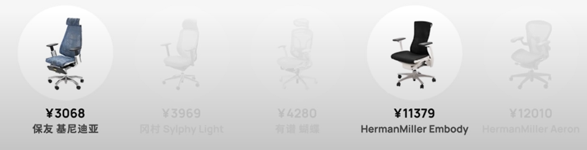
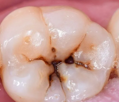

### eye bag

#### [高度近视引起眼球突出，天生就有很重的眼袋和黑眼圈，可以通过手术改善吗？](https://www.zhihu.com/question/62713988)

#### [近视眼+去眼袋应该先做哪个？这篇文章告诉你答案！](https://zhuanlan.zhihu.com/p/373496582)

### eye

#### 恢复视力

##### 放松眼睛 凝视 等待物象清晰

[近视恢复系列（一） 大脑控制眼睛焦点调节的方法 - 哔哩哔哩](https://www.bilibili.com/read/cv14961792)
[Annestrue](https://space.bilibili.com/6021809)

对于臀部的肌肉，则相反，臀部的肌肉越放松，发力水平越强，屁股感觉夹得越紧(菊部收缩)，臀部的肌肉越用力，发力水平越弱，屁股肌肉变得越松弛(菊部松弛) 
眼睛的焦点调节就是靠放松与用力两个指令来完成，眼睛越放松的看出去，眼睛看远越清晰，眼睛越用力的看出去，眼睛看远越模糊。

前面的视频讲过，大脑并不直接控制睫状肌扩张力强弱的变化，而是间接的控制，所以放松与用力两个指令，并不是直接传导到眼睛内部，而是传导到腰部肾脏
大脑越放松的看出去，肾脏的发力水平越强，肾脏传导到眼睛的力量越强，睫状肌扩张力增强，晶状体被拉伸变薄，眼睛度数下降，眼睛看远变清晰。
相反的，大脑越用力看远，肾脏发力水平越弱，肾脏传导到眼睛的力量越弱，睫状肌扩张力变弱，晶状体收缩变凸，眼睛度数上升，看远变模糊。
大脑就是通过放松与与用力两个指令控制肾脏发力水平强弱的变化，从而控制眼睛度数的变化，实现眼睛焦点的远近调节。
这也就是为什么有的人做完腰部手术，眼睛的度数出现下降甚至失明，因为肾脏到眼睛的能量传输通道受到了影响。还有近视为什么伴随着驼背，因为肾脏发力水平变弱，腰部的支撑力变弱，背部自然弯曲
打哈欠的时候，大脑释放强烈的放松信号，腰部发力水平增强，背部自然挺直，晶状体被拉伸变薄，眼睛度数下降，看远变清晰.

###### 大脑放松，眼睛放松去看，慢慢的，电脑上的字就清晰了
真的有效。我今天对着电脑试了一下，比平时看电脑的距离稍远，是模糊的，但是放松去看，就清晰了。我其实没有刻意去管腰部，因为我昨晚试的时候就是刻意去放松腰部，反而弄的不知腰部是放松还是紧张了。今天就是大脑放松，眼睛放松去看，慢慢的，电脑上的字就清晰了，这个时候，其实腰部就是放松的。
2022-01-24 09:37👍8
俊逸小凯回复 @em贾嘎  :把手机拿远一点，看得清就再拿远一点，直到有点模糊，放松去看，发现能比之前看得远一点。
2022-01-25 15:38

##### 不要眯眼睛来使清晰物体
近视的人看远处的物体物像就会落在视网膜的前方，导致视网膜无法获得清晰的物像。

看不清楚远处的东西人就越想看清，往往还会下意识的眯着眼睛用力看。

因为当你眯眼时睑裂变小可能会遮挡部分的瞳孔，出现类似于小孔的作用从而提高物像的清晰度，先说明方法高是高但这并不是一种好做法，
 

当我们眯眼时眼睛的上下眼皮会跟眼球接触，以至于眼睛露出的部分变窄角膜受到压迫。会增加眼睛出现散光的可能性。

另外眼睛用力看清物体又会使得眼部肌肉长期处于紧张状态，更快造成视疲惫加深眼睛的近视程度。
 

当然这并不是说近视之后就一定要长期佩戴眼镜，关于什么频率佩戴眼镜才算科学还得分情况，如果是看3到5米以内的近处，并且近视度数在200度以下没有散光。就不建议平时佩戴，只有在长时间看固定远距离视物时需佩戴眼镜，如果是有经度近视的青少年。田于平时用眼较多睫状肌功能不稳定。无论看远或看近都应该配戴眼镜，眼镜时间佩戴过长导致眼睛不舒服的话，就可以摘掉眼镜按摩按摩。

##### [How To Improve Your Eyesight: Just 5 Steps - Endmyopia® - The Reduced Lens Method™: Improve Eyesight Naturally](https://endmyopia.org/how-to-improve-eyesight-five-steps/)

\#1：阅读时切勿佩戴远用眼镜
您的远用眼镜旨在让您看清远处。当您近距离使用它时，会造成很大的眼睛疲劳。由于您的眼睛已经通过年复一年不断增加的处方而习惯了这一点，因此您甚至不会注意到。但这种习惯是导致近视加深的第一大原因。

\#2：特写导致近视：  通过休息来改善视力
许多资源告诉你这一点，它们是正确的。但他们对于你需要多少休息时间以及如何利用休息时间的判断往往是不正确的。

首先，工作时间不要超过2-3小时，然后休息。如果需要，请在智能手机上为自己设置一个计时器。3小时确实应该是极限了！

\#3：良好的视力需要良好的光线：始终、始终拥有良好、自然的环境照明
光线的质量对您的眼睛很重要，就像空气的质量对您的肺部很重要，食物的质量对您的身体很重要一样。垃圾灯=视力不好！
如果您可以在工作时坐在窗边，那将是理想的选择。不是一个选择吗？在这种情况下，请考虑为您的台灯购买一个模拟自然光的灯泡。通常称为“全光谱紫外线灯泡”，您可以在网上以及一些当地商店购买。当您始终拥有优质光线时，您会注意到差异！

#4 真正的视力改善刺激：户外时间
由于距离太近，您的眼睛首先开始变得模糊（称为假性近视，您可以在此处了解更多信息）。从那时起，当你在阅读时戴上第一副眼镜，并且在室内屏幕（或书本）前花费太多时间时，情况变得更糟。

##### 放松眼睛，眼睛内部的扩张力会变强，眼睛看东西会变清楚
杨克磐-视力恢复
放松眼睛，眼睛内部的扩张力会变强，眼睛看东西会变清楚。感兴趣可以看一下我的视频
2023-04-25 07:28👍93

#### 叶黄素

##### [叶黄素和叶黄素酯有什么区别，可以长期服用吗？](https://www.zhihu.com/question/41611329)

[**岛岛的猫猫**](https://www.zhihu.com/people/e689961c9243afc8606118465041fd06)

你好好看文章了没？1.叶黄素酯在体内会转化成叶黄素，所以吃酯还是素没有本质区别；2.酯的制作工艺比素要简单，可以理解为素需要酯转换生成，至少多这一道工序，所以酯比素便宜，但并不说明作用差，参见第简单1点；3.酯耐酸性比素强，所以服用后经过胃酸消化剩下的比素多，我这样说足够通俗了吧？

2022-10-24

[来源](https://zhuanlan.zhihu.com/p/374058967)

[**Tim
lee**](https://www.zhihu.com/people/07035f11a39a0304129f264df2ac5d8f)

[**知乎用户I61mZZ**](https://www.zhihu.com/people/d68936e90741063d0ca56982bb3be945)

叶黄素酯比叶黄素生物吸收率更高，因为叶黄素本身不稳定，光照和PH都会影响更大，叶黄素经过肠胃后反而不如叶黄素酯吸收率高。

2022-10-14

##### [老程序员强烈建议你补充叶黄素！](https://zhuanlan.zhihu.com/p/530370676?utm_campaign=&utm_medium=social&utm_oi=752203659609124864&utm_psn=1570464491724390400&utm_source=qq)

￥165劝退

发布于 2022-06-17 21:31

[**Finrivergogo**](https://www.zhihu.com/people/d19ff75a89707f9badf5f27d6c49d33e)

我下单就是看在你没有开作者筛选，以及开头还这么直白的份上，希望你不要辜负我的信任

2022-06-17 ·IP 属地广东·热评

###### 1用眼量增大，眼睛里的叶黄素不断被消耗

这就回到**为什么要补充叶黄素**了？

因为它是咱们视网膜中最重要的营养成份！能够帮助眼睛抗自由基、过滤蓝光、保护黄斑等，而且**随着用眼量增大，眼睛里的叶黄素会不断被消耗！**

**而这种元素是人体自身无法制造的，必须通过外界摄入进行补充。**

###### 2 叶黄素构成的黄斑色素防蓝光

而我们视网膜内的核心区存在**由叶黄素构成的黄斑色素**，能够**保护着视网膜不受有害蓝光的伤害。**

且有研究发现，叶黄素可以更有效地覆盖蓝光的波普（430-450nm）范围。

###### 叶黄素是脂溶性维生素 买叶黄素酯更高效

叶黄素是一种脂溶性维生素，热稳定性差，平常的食物又需要烹饪，吃进肚子又有胃酸的降解，导致人体对它利用率就会变低！

所以购买含有叶黄素酯的产品更为高效！

##### [脂溶性无关](https://zhuanlan.zhihu.com/p/374058967)

发布于 2021-05-24 10:29

而在叶黄素和叶黄素酯的制成中，有两种形态，分别是粉和油。

市面上主流的叶黄素或叶黄素酯制品，都是粉制的，所以和是不是脂溶性、好不好吸收，就并没有那么大的相干了。

#### 绿色为什么护眼

[发布于 2020-04-30
10:59](https://www.zhihu.com/question/291229139/answer/1190388089)
启明眼镜

##### **绿色 ≠ 保护视力**

支持绿色护眼主要有两种观点：一是认为绿色光处于可见光谱的中心位置，处于人眼最敏感的色彩频率范围内。二是从色彩心理学角度看，绿色能够让人感到舒适与平静。

但是，这些都不足以用来说明绿色能保护视力，也没有相关的研究支持这一点。

此外，如果非要将网络上指出"桌面绿"给一个定论，那只能说这种方法可以降低屏幕的亮度，从而减少光亮带给人们视觉上的刺激。而对于由于人们看电脑时间过长，减少眨眼次数导致的[干眼症](https://www.zhihu.com/search?q=干眼症&search_source=Entity&hybrid_search_source=Entity&hybrid_search_extra=%7b%22sourceType%22%3A%22answer%22%2C%22sourceId%22%3A%221190388089%22%7d)，以及人们不良工作姿势造成的近视眼、视疲劳等情况，多看"绿色"是无法帮你解决问题的。

还有，各种颜色对光线的吸收和反射是各不相同的。红色对光线反射是67%，黄色反射是65%，绿色反射是47%，青色只反射36%。由于红色和黄色对光线反射比较强，因此容易产生耀光而刺眼。

而**青色和绿色对光线的吸收和反射都比较适中，所以对人体的神经系统、大脑皮层和眼睛里的视网膜组织比较适应**。另外，青色和绿色，不仅能吸收强光中对眼睛有害的紫外线，同时还能减少因强光对眼睛所产生的耀光。

##### 绿色护眼关键在于绿植与人眼的距离

不过需要说明的是，看绿色植物之所以能放松双眼，最关键在于绿植与人眼的距离，是要远远大于书本与人眼距离的。向远处对焦这一动作使睫状肌处于松弛，以达到缓解视疲劳的作用，这是可以被眼科学证实的。

[飞越忘川](https://www.zhihu.com/people/awa-1-26)2022-04-23

因为构成眼睛主要成分的视黄醛最喜欢绿色光。

[蓝海绿森林](https://www.zhihu.com/people/lan-hai-lu-sen-lin)2021-11-17

纯绿色的RGB值是（0，255，0）太亮了，暗绿色才是王者（0，128，0）

#### 保护眼睛-win10系统颜色(豆沙绿)设置

豆沙绿护眼色RGB值RGB值(199, 237, 204) \#c7edcc 色调：85 饱和度：123
亮度：205

#### 罪魁祸首 短波蓝光 波长处于400nm-480nm

[编辑于 2021-12-01
17:06](https://www.zhihu.com/question/20762611/answer/2251714346)

因为所谓防蓝光，并不是所有蓝光都是有害的，只有波长处于400nm-480nm之间的短波蓝光才是真·祸害。

这种蓝光由于具有高能量，长期照射人眼，会导致眼内的黄斑区毒素量增高，因此导致眼部疾病。而显示器的LED屏的原理，恰恰就是利用高能蓝光激发[荧光粉](https://www.zhihu.com/search?q=荧光粉&search_source=Entity&hybrid_search_source=Entity&hybrid_search_extra=%7b%22sourceType%22%3A%22answer%22%2C%22sourceId%22%3A%222251714346%22%7d)发黄光，因此显示器如果不进行防蓝光处理的话，必定会产生大量的强能量短波蓝光。

一种是软件防蓝光，就是利用蓝光的互补色，改变RGB的数值，虽然有一定效果但是偏黄的画面看着很不舒服。

比如你打开手机里的[护眼模式](https://www.zhihu.com/search?q=护眼模式&search_source=Entity&hybrid_search_source=Entity&hybrid_search_extra=%7b%22sourceType%22%3A%22answer%22%2C%22sourceId%22%3A%222251714346%22%7d)，就会发现画面一瞬间变成土黄色滤镜了，像是日光灯变成老式白炽灯的感觉，这就是软件防蓝光带来的效果。

而物理防蓝光呢？则是在制造过程中，就改变硬件的"蓝光属性"------在屏幕上的发光灯柱裹上一层过滤层，这层过滤层会滤除高能短波蓝光，令高能量蓝光的波长变成安全值。

由于是从物理上隔绝，所以这种防蓝光机制不会影响观感，色泽还是和普通屏幕一样鲜艳。所以，物理防蓝光屏幕，或者说硬件级防蓝光，可以说是深度游戏玩家必备的。

确实，之前也做了很久功课，打算买台带硬件级防蓝光的游戏本，作为AW老用户，一开始看中的是AW
m15 R6（我很看重它的硬件级防蓝光特质）。戴尔的游匣G15

#### win10护眼模式、蓝光眼镜偏黄 蓝光影响睡眠 防蓝光屏幕莱茵认证

[小晴](https://www.zhihu.com/people/xiao-qing-95-29-81)2021-12-04

硬件防蓝光是真的画面不会偏黄吗，有没有老哥分享下。

[眠眠](https://www.zhihu.com/people/hypnova) (作者)
回复[小晴](https://www.zhihu.com/people/xiao-qing-95-29-81)2021-12-05

真的不会，原理不一样

[刘文](https://www.zhihu.com/people/liu-wen-76-91)2021-12-04

你们知道吗，蓝光还有可能影响睡眠。

[思未断念未央](https://www.zhihu.com/people/si-wei-duan-nian-wei-yang)2021-12-04

平时戴防蓝光眼镜，确实又会有一丢偏黄。物理防蓝光不偏黄，突然想拥有它

[565](https://www.zhihu.com/people/565-28)2021-12-04

有点种草G15，现在手头的电脑开护眼模式真的太黄了。

[K歌情人](https://www.zhihu.com/people/kge-qing-ren-10)2021-12-04

补充一句哈，屏幕是否真的防蓝光，可以看下是否有莱茵认证。

#### IntelliJ idea设置

[IntelliJ
IDEA好看的主题设置（支持自定义）](https://www.cnblogs.com/asio/p/12582311.html#H2C7xHMX)

下载的护眼主题：[Love Your Eyes
Theme](https://plugins.jetbrains.com/plugin/16308-love-your-eyes-theme/versions)

[idea导入主题jar包报错还是失败](https://blog.csdn.net/qq_40147985/article/details/117291438)

[IntelliJ
IDEA主题背景设置护眼色(豆绿色)](https://blog.csdn.net/BThinker/article/details/90648131)

##### 最后是自己设置的：

File-\>Settings-\>Editor-\>Color Scheme

{width="4.833333333333333in"
height="3.111111111111111in"}

image-20211123161811918

{width="5.833333333333333in"
height="1.9847550306211723in"}

image-20211123162059749

设置Editor编辑器的背景和字体颜色。

{width="5.833333333333333in"
height="1.5861176727909012in"}

image-20211123162433234

往上翻，找到Font，设置字体为Hack，因为它能分清ilI10oO，选择Source Code
Pro、Droid Sans Mono、Monospaced(默认)也行。

{width="5.833333333333333in"
height="3.0468744531933507in"}

image-20211123163117863

往下翻，设置控制台输出背景颜色：

{width="5.833333333333333in"
height="1.9970877077865268in"}

image-20211123163455490

导出主题文件：

{width="5.833333333333333in"
height="1.3927734033245844in"}

image-20211123163718367

#### 暗黑模式更护眼？

发布于 2016-02-27 19:12\
灰色背景。黑色深色比白色还伤眼。

2016-02-27\
夜间模式的作用是在较弱的光照环境下更舒适的使用。答主的意思是尽量在光照充足的环境下使用手机或电脑。

2018-04-20\
黑底灰字是无光黑暗环境下用的，浅色底深色字是室内弱光环境下用的。

2015-04-26\
对于AMOLED来说，的确黑色更省电。AMOLED不需要背光，自身发光。显示黑色时，对应的区域关闭不工作。

[为什么绿色比较护眼？ - ccccl的回答 -
知乎](https://www.zhihu.com/question/41893837/answer/878090294)\
个人认为更主要的原因是人眼对绿色，准确说对波长555nm的光波，更为敏感，识别度最高。如果说你睁眼就是为了看清东西，那么看绿色的物体的时候，你眼睛"花费的力气"最少，所以相比之下有"舒服感"。它其实只是让你做最少的功达到看清东西的目的。\
当我们看窗外的绿植的时候，就达到了这样一个一举两得的功效：视网膜远近聚焦的肌肉锻炼，同时眼睛做最少的功看清物体。

[暗黑模式真的更护眼吗？](https://www.zhihu.com/question/329237914)

一项研究指出，计算机视觉综合症在电脑用户中的发病率可能高达50%甚至更多。

这种情况可能是由于看屏幕时眨眼比平时更少造成的。当我们盯着手机或电脑时，标准的每分钟15次眨眼可能会降到3.6次，这可能会导致眼睛干涩、头痛或视力模糊。

第二，不可感知的部分分析：暗黑的进光量更少了，尤其oled屏，且蓝光没有更多。那光线的伤害肯定少了，所以这部分比较起来一定是更护眼了，至少没变差。第三，可感知的用眼舒适度。当简单的调到暗黑时，确实有一个问题是黑底白字的文字感觉更不好识别了，这确实会增加用眼疲劳感。但是，如果把字体调成加粗字体，立刻变得好识别了，疲劳感没了。所以结论是，暗黑模式+加粗字体＝目前为止最护眼的方案。发布于
2021-09-21 22:47

#### 暗黑模式更省电？

2015-04-26\
对于一般液晶显示器来说不会省电，而且会更费电！显示器耗电分为液晶面板和背光两部分的耗电。普通液晶面板本身不能发光，需要靠背光（LED或CCFL）照亮，无论显示白色或黑色，背光耗电相同。显示黑色时液晶分子处于最大偏转状态，以便挡住背光，实现黑色显示，液晶分子偏转需要消耗电能做功！显示白色时液晶分子没有偏转，让背光完全顺利通过。[详细评测文章](https://diy.pconline.com.cn/display/reviews/0805/1308733_all.html)

[链接](https://www.zhihu.com/question/329237914/answer/775714328)

对于OLED屏幕而言，"黑暗模式"确实有助于延长电池续航时间。因为在这种屏幕中，每个像素都是单独亮起的，这意味着当像素为黑色时，它将被停用。但"黑暗模式"对于较老的LCD屏幕没有任何优势，因为它们是背光的，这意味着即使在屏幕北京显示黑色时，相应像素也是被点亮的。

直到最近，大多数手机显示屏都是用LCD屏幕制作的。iPhone
X是第一款采用OLED屏幕的苹果手机。其他搭载OLED显示屏的手机包括三星Galaxy
S10和华为Mate
P30。对于这些手机，"黑暗模式"可以达到节电效果。报告发现，在"黑暗模式"下显示谷歌地图截图的Android手机用电量下降了63%。

### glass

#### 医院验光测瞳距。 蔡司官网买镜片。 到店选个镜框加工

[孤独的幸存者](javascript:)　　[赞(1)](javascript:)

医院验光测瞳距。 蔡司官网买镜片。 到店选个镜框加工。完美。2022- 07-10
13:22

去医院做验光 散光 然后淘宝配？

如果有宝岛，可以去宝岛验，好像收费是50元。没有的话，可以去医院哦
2022-07-03 12:54

如果有条件，是可以去做激光手术的，现在的技术已经非常成熟了，只要注意术后恢复，不会有很大的问题。
2022-07-02 20:20

#### 眼科医生都不做激光手术

天宇之心 层主 回 抚東　　赞(4)

眼科医生都不做，马化腾都不做，我才不去做，谁知道十几年后有没有影响
2022-07-02 20:21

hhhmmmfff 回 抚東　　赞(0)

尽量别做，我就是做过的，然后又近视了，而且看灯光会有点散光，看高速运动的物体，比如打乒乓球有点跟不上的感觉
2022-07-03 10:50

淫舌杵洞 回 抚東　　赞(0)

激光手术就是把角膜削薄来改变眼晴的轴距，不建议手术。 2022-08-21 17:55

#### 蔡司防蓝光是性价比比较高

蔡司防蓝光是性价比比较高的产品了。防短波蓝光效果肯定是有的，但是我认为，无论多好的镜片，防护效果只是辅助，更重要的是人体自身对眼睛的休息和放松。蔡司镜片的进货价格大概是价格表的2.5到3折左右，以蔡司1.50防蓝光球面镜片来说，不到300元就能拿到一副镜片，大大可以参考一下。

### Hair

#### [止脱生发 楠聆草](https://tieba.baidu.com/p/8096189083)

#### 头皮敏感

[发布于 2021-06-28 10:43](https://zhuanlan.zhihu.com/p/384623071)

##### 

造成敏感性头皮的关键因素
过度清洁少部分人天生头皮屏障功能弱（先天性敏感性头皮），但绝大部分人都是因为后天"作"而导致的，这其中最主要的原因其实是"过度清洁"！

洗面奶已经全面进入氨基酸表活的时代，而洗发水才刚刚入门，市面上绝大多数洗发水都是硫酸盐类表活，脱脂力强、刺激度高，在洗去头皮表面污垢、油脂的同时，也容易带走细胞间脂质及天然保湿因子。倒不是说这类表活有多么可怕，只是在使用这些洗发水的同时，再搭配错误的洗头方式和频率，而头皮长期处于"0护理"的状态，促使了屏障受损的发生。

Step1：如果存在头皮屑、脂溢性皮炎、毛囊炎等头皮问题，需要优先解决这些，不能只单一地讲究修复，更要注重抑菌抗炎。（详情参考我的去屑文章）

Step2：及时更换温和、低刺激性的洗发水。也不一定是非氨基酸不可，只是洗发水的选择要根据头皮出油情况、健康状况、洗头频率来。如果是一天一洗的情况，那么氨基酸洗发水肯定是更好的选择。

Step3：正确的洗头频率和洗头方式。洗头频率要根据头皮出油情况来，头皮没有出油、没有出汗的情况下，不需要清洁，而已经受损的头皮一定要减少洗头频率。洗头时要避免指甲抓挠，尽量用指腹按摩，吹头发时温度不宜过高，平时要更注重头部防晒。

##### 头皮已经很油 大量油脂不能接受

第一，选择温和的，负担低，你能接受的洗发产品，如果你的头皮已经很油了，长发就不要选择保湿。那种产品含有大量油脂，硅油、马油、茶油是不能接受的。

### 润唇膏

[真实十年唇炎患者！14款网红润唇膏红黑榜](https://www.bilibili.com/video/BV1Mf4y1v7fA/?spm_id_from=333.788.b_7265636f5f6c697374.10)

{width="5.833333333333333in"
height="2.0991918197725283in"}

image-20220505213043307

课代表来了！\
黑榜：

1.  DHC橄榄护唇膏 58\
    添加量最高的羊毛脂油，容易导致过敏唇炎

2.  小甘菊修护唇膏 39\
    油腻没有保湿能力，越用越干\
    3.小蜜媞修护唇膏 39\
    油腻，唇膏里面加水杨酸，唇炎套餐\
    4.澳洲木瓜膏 69元\
    不能祛痘印，矿脂致痘，睡前涂第二天起皮严重\
    红榜：

3.  依泉特润滋润唇膏 34\
    便宜，保湿感强，不容易糊嘴

4.  凡士林经典润唇膏 24\
    滋润度优秀，但是油腻糊嘴，包装设计有点不卫生

5.  百蕾适小蓝罐润唇膏 39\
    掉皮严重用完效果极好，滋润度好，但薄荷味重

6.  桂影恒润修护唇膏 78\
    桂花味，保湿抗氧，白天日常足够，晚上滋润度有点不够

7.  Fresh馥蕾诗保湿唇膜 160\
    味道好闻，成分华丽，滋润度刚刚好，性价比很低\
    无功无过：\
    曼秀雷敦\
    白色款\
    保湿不够，日常足够\
    绿色款\
    薄荷味重，保湿度可\
    蓝色棕色款\
    日常没毛病，蓝色更滋润\
    妮维雅男士润唇膏\
    成分唇膏，保湿感轻\
    艾杜莎唇部打底\
    口红打底之王

#### 青蛙王子婴儿倍润唇膏

我是易发唇炎者，嘴唇边上永远一圈红，用过至本，无功无过吧，尤其不太喜欢香精的添加。姐妹们可以看看青蛙王子的婴儿倍润唇膏，一支不到10块钱，成分精简安全，我用着觉得比至本好

2020-11-15 19:56👍405

[今晚对你心动o](https://space.bilibili.com/261590141)回复 \@弯弯的云朵
:青蛙王子我也有 我用着感觉其实都差不多 我个人之前有过一段时间是慢性唇炎
后来慢慢养好了 那段时间用的就是青蛙王子 至本的怎么说呢对我来说挺好用的啦
总之大家理性种草祝大家购物愉快啦

2020-11-15 20:53👍118

#### 唇炎真的严禁用这种东西

唇炎真的严禁用这种东西，说什么唇炎好用的润唇膏真的是良心太黑了。而且真的唇炎特别严重特别难受不舒服的时候（我知道医生不让但是太难受了已经影响说话了），我反而是用up黑榜上的救回来的，不知道这个为什么这么多人点赞！最好还是看自己的使用感受不要人云亦云。

2020-12-15 23:10👍116

#### 皮脂腺异位症没有任何治愈的可能吗？

作者：知乎用户\
链接：<https://www.zhihu.com/question/36300550/answer/1336756912>\
来源：知乎\
著作权归作者所有。商业转载请联系作者获得授权，非商业转载请注明出处。

1.这个病不痛不痒，不严重可以不管，非面部可以不用管。

2.我怀疑有这个毛病的人喜欢熬夜，作息饮食不太规律，皮肤多少有点毛病，比如痤疮，酒糟鼻、黑头多，皮肤油脂分泌旺盛。

3.网传的白醋破皮法不可信，疼不说，容易复发，而且一大片的基本没用。

4.有人用激光治疗过，但是又复发了，甚至有的说留疤色沉之类的。

5.目前最靠谱的疗法就是核医学科的同位素锶敷贴治疗，原理好像是破坏患处的皮脂腺，从根本上解决。但是全国几乎很少有医院用这个方法治疗皮脂腺异位症，这个是在我所在省份最好的三甲医院核医学科确认过的。据2019年的网上资料称，宁波二院可以做这个，价格在600元左右，但是锶90敷贴需要连续做5天，一天做一次，而且恢复期不短，做完了嘴唇会烂肿，经过一段时间后结痂，期间影响正常生活工作，如果宁波当地的患者可以去咨询下，外地的想做的话要考虑时间成本，金钱成本（包含来回路费住宿费）以及治疗后嘴唇溃烂对日常生活的影响，外地的想去做的话一定要提前电话咨询一下是否能做。
注意：有网友做过同位素治疗之后反馈有些后遗症，想做的一定提前了解，是不是个人体质原因不太清楚，以下是网友原话："嘴唇大面积脱色，同位素治疗只是去掉皮脂腺，但是那个地方还是白的，并且其他地方也变白了，而且恢复后嘴唇颜色深浅不一，特别难看，远看都看得到。嘴唇有紧绷感，并且时不时会痒，按医学上说是形成瘢痕"
因为皮脂腺异位症本身对健康没有实质性伤害，所以很少有医院有针对性的治疗方案，总之，任何治疗方式都是有害的，自己做好取舍

[编辑于 2021-02-23
17:13](http://www.zhihu.com/question/36300550/answer/1336756912)

得该病原因不明，不会自愈，且会越来越多。无非就是皮脂腺长到嘴唇上了，长在了不该长得地方，但严重影响美观以及身心健康。医院以垃圾到家，可能无法做到完全治愈。

[发布于 2017-05-29
14:55](https://www.zhihu.com/question/36300550/answer/175978162)

我感觉皮脂腺异位症真的很难治疗，我激光也打过来了伤疤还没好就又复发了，而且还比以前还多，主要激光打完之后还有伤疤，我都后悔死了用激光去除了...中药都喝了五千多块钱的了几个月调理还是一点效果没有，感觉好像真的跟直接不了一样，啪啪的时候都影响心情了...

[发布于 2020-08-06
20:23](http://www.zhihu.com/question/36300550/answer/1389564533)

[哇塞不哇塞](https://www.zhihu.com/people/wa-sai-bu-wa-sai-61)
2022-03-27

我做过2次激光，每次差不多600，没用
### liver

#### 伤肝

**主食粗细搭配，全谷物和杂豆占主食1/3；多吃新鲜蔬果，少吃红肉，蛋白不过量。**

**蛋白过量**

蛋白过量伤肝是因为：蛋白代谢产生的有些含氮废物，得被肝脏处理成尿素才能进入泌尿系统排出体外，蛋白吃得多肝脏负担就大。

**何首乌就有肝脏毒性**

比如在保健品中可以使用的何首乌就有肝脏毒性，所以2014年国家食品药品监督管理局明确规定：保健食品中的何首乌日用量不得超过1.5克，制何首乌日用量不得超过3克。

#### [酒精影响大脑长达六周，《柳叶刀》：最安全的饮酒量为零](https://www.thepaper.cn/newsDetail_forward_3368905)

哺乳期饮酒的话，酒精会通过乳汁影响孩子的认知功能，导致注意力不集中等。

儿童青少年处于生长发育阶段，脏器功能还不完善，即使少量饮酒，学习能力也会有所下降，反应速度变得迟缓。

如果应酬不得不喝酒，那就记住这个每日喝酒"上限"。

#### 水飞蓟素

##### 一种西方传统草药，在中国改头换面的"神奇"之旅

除了针对肝脏疾病，人们还进行了关于水飞蓟与急性淋巴细胞白血病、前列腺癌、乳腺癌、头颈癌和肝细胞癌等等的各种小型研究，在美国国家肿瘤研究院官网上，这样的临床试验就有十几个，但这些试验几乎全部以失败告终，并没有让人兴奋的结果出现。

唯一令人欣慰的是，草药的有效性虽然未得到证实，但安全性问题也不大。

除了容易积累硝酸盐，并且作为牧草饲养奶牛时容易引发牛奶的亚硝酸盐含量过高之外，目前的研究并未发现水飞蓟有什么副作用，也很少有它与抗癌药物、放射疗法或其他药物相互作用的情况被报告。

**保健品还是处方药，中西待遇差异**

作为一种几乎无用也无害的古老药草，在大部分西方国家，水飞蓟只能作为一种保健品（膳食补充剂）使用。在第一个提取水飞蓟素的德国，水飞蓟类药物可以作为一种植物药------非处方药中的一个特殊门类出售。而来自德国一家大药厂的进口水飞蓟制剂，在中国则被归入了处方药的行列。

在美国的相关诊疗指南中，只有在菌中毒时可以使用水飞蓟。而在中国，水飞蓟是常见的肝病用药，是被作为「
酒精性肝病和脂肪肝 」的保肝护肝类药物的代表之一。

在中国的《非酒精性脂肪性肝病诊疗指南（2010）》、《酒精性肝病诊疗指南（2010）》、《药物性肝损伤诊治指南（2015）》和《肝脏炎症及其防治专家共识》等多部肝病诊疗指南中，水飞蓟都曾被列为抗炎保肝的治疗药物，直到最近几年的修订版中才逐渐将相关的条目去掉。（详见：《中国患者一年吃掉百亿元保肝药，然而国外根本没这药》）

此前，在我亲历的一次疑似药物性肝损的就诊中，医生就曾开具过水飞蓟素的处方药------一盒盒棕褐色的小药片儿。我注意到，在美国的亚马逊电商网站上，几乎同样的药列在水飞蓟类保健品中，畅销度排名400位开外。

##### 中国患者一年吃掉百亿元保肝药，然而为何国外根本没这药

国际上通常将药物性肝损伤分为5个等级，肝衰竭属于第4级，美国肝病协会只对药物引发的肝衰竭患者推荐了一款药物：N-乙酰半胱氨酸（NAC），这是美国食药监局（FDA）批准的唯一药物性肝损伤解毒药物。

"由于没有对照研究的证据来表明这些保肝药的好处，因此我们在实践中不会向肺结核患者提供这类药物，而且WHO也并未推荐。它们不仅增加了病人用药的负担，而且颇为昂贵。"她补充说，或许不能排除中国的研究中有相关证据，但是**国际学术界在这个问题上尚未提供任何"保肝药有益"的证据**。

肺结核治疗的费用是林云比较沉重的负担，一些病人花在保肝药上的钱比抗结核药物的费用还多。**"我每个月的抗结核药才花200多块钱，保肝药就要900多元，"一位网友说，"保肝药给我的印象就是贵。**"

尽管每次复查肝功指标都很正常，林云还是一直按时吃保肝药。直到治疗9个多月后的一天，她忽然开始怀疑保肝药的必要性，加上胃肠无法承受这么大剂量的药物，就悄悄将保肝药从每天三次改为两次，现在她每天只吃一次，肝功指标依旧稳定。

用一位肝病医生的话说，保肝药是一类"让人听了名字就忍不住想买的药物"。在中国，吃保肝药的并非只有肺结核患者，病毒性肝炎（如甲肝、乙肝、丙肝）、酒精性肝病、自身免疫性肝病等也会引起肝损害。在实验性肝损伤的动物模型中，一些药物被认为可以保护肝细胞，进而改善肝脏生化指标，在国内许多肝病治疗中被广泛使用。还有一些长期喝酒或熬夜的人也在网上咨询，"我要不要吃点养肝护肝的药？"

获得各种指南与共识的提名和推荐，是保肝药推广的一种重要方式。2011年，北京地坛医院肝病专家蔡晧东在博客上写道，一天，接连两位国企医药代表找到她，请她给病人开点保肝药，"可以促进肝细胞恢复......你看什么病人合适就帮我开点吧，我的药在别的医生那里用得可好呢！"对此，她回答说，**中国《慢性乙型肝炎防治指南》中没有这些药，她不会开。听到这，对方有些错愕，表示根本不知道该指南的存在。**

一位了解该最新版指南修订的专业人士告诉《中国新闻周刊》，**当时负责修订指南的部分专家提出从指南中删去保肝药，却经受了巨大的压力**。他指出，这类缺乏可靠证据证明其疗效的保肝药，仍极力寻求官方指南的"推荐"或"提名"，乃是受商业利益驱使。

美国加州大学尔湾分校医学中心肝病科主任胡克勤对《中国新闻周刊》说，在美国，各个学会对指南的制定，要求非常严格，参加指南撰写的人，所有的利益冲突必须要列出来。一般来说，不会选那些跟很多药厂有联系的人参与指南的制定。

该文指出：**"中国大多数指南是由医学专业委员会制定，但有些是在制药公司赞助下完成的......由此看来，减少甚至完全避免制药公司的赞助才是根本。**"

在人类疾病中却难以体现出来，没有证据表明水飞蓟素可以预防药物或化学物质引起的肝损伤。截至目前，尚未有设计良好的前瞻性研究能证明其临床疗效；此外，口服水飞蓟素生物利用度有限，也限制了其在医学中的用途。

意大利卡坦扎罗大学胃肠病学副教授Ludovico
Abenavoli在接受《中国新闻周刊》采访时说，在欧洲，水飞蓟素主要用作保健品。一些欧洲国家也有一些水飞蓟素产品，用来治疗中毒性肝损伤，以及作为慢性肝炎和肝硬化的辅助治疗，其中，比较具有代表性的是德国马博士药厂生产的利加隆。不过，Ludovico
Abenavoli表示，在德国，利加隆只是一种非处方药，而在意大利，它只是一种保健品，称不上药物。1988年，**中国引入利加隆，则作为一种处方药对待。"好多保肝药都是人家国外不用或淘汰了的，我们中国当处方药引进来。"一位不愿具名的肝药专家说。**

#### 红霉素药膏"万能神药"不能乱用，红霉素软膏的副作用和耐药性你知道吗？

**1.流鼻血可用红霉素乳膏。**当天气变得干燥时，我们鼻子里的毛细血管就会变得脆弱，甚至偶尔会出现流鼻血的情况。此时，大家可以用红霉素眼膏涂抹在鼻中隔部位，这样可以改善鼻子干燥的情况，滋润鼻子内部的粘膜，从而使得毛细血管有弹性，而不易出现流鼻血。注意区分眼膏和软膏，软膏不能用于眼、鼻黏膜上。

**2.轻微创伤可用红霉素**。当人不小心把自己的皮肤划伤、割伤或擦伤，都可以先用消毒水消毒，然后在伤口处涂抹上适量的红霉素，这样不仅起到消炎消毒的效果，还可加快伤口的愈合。

**3.烫伤可用红霉素。**当突然出现轻度烫伤的情况时，第一时间得用冷水清洗一下，然后在烫伤的部位涂抹上红霉素，能快速缓解烫伤者的疼痛。要注意的是，每天要涂抹2-3次，这样烫伤部位不会掉皮以及结痂。

4.红霉素软膏可以去除青春痘？红霉素软膏只能偶尔使用，像青春痘这种经常复发的皮肤病并不适用。

是药三分毒，长期使用红霉素软膏，药膏中的一些化学成分会致使皮肤变得很干燥，而且还会促使细菌产生耐药性，增加皮肤癌的发生率。

同事回忆说，她刚开始使用红霉素软膏的效果很好，但用了一段时间后，祛痘效果就开始打折扣。

这很可能就是因为发生了耐药，但她当时不知道是这个原因，还是继续涂抹，直到皮肤变的越来越干，痘痘不见消减，反倒越来越严重，才意识到问题的严重性，停止使用药膏。

可见，红霉素软膏是不能乱用，更不能长期使用，**有青春痘破溃感染时可以使用它来消炎**，但别指望它可以将大面积的痘痘消下去。

#### 重楼解毒酊

分桶洗衣机：洗小件衣物

蚊子叮咬

### psychological

#### lonely

作者：徐芊芊\
链接：<https://www.zhihu.com/question/53026052/answer/637394037>\
来源：知乎\
著作权归作者所有。商业转载请联系作者获得授权，非商业转载请注明出处。

1、到哪儿都有一种冷眼旁观的抽离感，不想融入集体。2、不笑，不说话，冷冷淡淡地坐在那里。在我这里，说话和笑都很累，连装热情都装不出来。3
、对不感兴趣的话题不参与，不多说一个字。4、喜欢静静地吃饭，不想被人打扰我享受食物。5、对人一视同仁，对领导，同事，老师，同学，有钱人，穷光蛋，公司老总，扫大街大妈，食堂大妈，男人，女人......都一个态度，就是友善而平和。6、不喜欢闲聊话家常，不喜欢主动找人聊天。7、特别注重保护隐私，我爱豆是谁，我男友是谁，我爱好是什么，这些在别人眼里根本不算隐私的隐私，对我来说全都是秘密，不会和半生不熟的人讲。8、在网络上更能打开心扉。9、宠辱不惊，与世无争，海纳百川。10、爱万物生灵，和偶遇的猫猫狗狗打招呼，观察一朵花的盛放，看一片云的浮动。我为人其实很善良，谁遇到困难了，我第一个上去帮忙，不求回报的那种。而且能帮助到别人，我觉得很幸福。但是我自己极少求助人，一点都不想麻烦别人。在人前背后提起某个人时，也都是在赞美这个人，因为我是个只看到别人优点的人。但是我骨子里真正认定是朋友的人，那就太少了。除非志同道合，或者三观特别像。说白了我只是不想热情地加入别人的谈话而已，对于不感兴趣的话题，对于三观偏差大的人，没有交流欲望。只是很内向而已，喜欢自己和自己玩。2019.4.13更新看到很多小伙伴有同感，想来我也是不孤独的，并非每个人都是那么热爱呆在人群里。我还有个特点，就是在人际交往这方面对自己要求特别高，说出来的话适不适合场合、让不让对方舒服、表情语气和用词什么的，我对这些方面要求很严格。2019.4.17更新当初随手写下的回答，本也只是自言自语，没想到有这么多共鸣。回过头来看，用词和排版都太过随意，不忍直视。今天取匿，好好地写一段话。童年的创伤记忆和周边环境，都对我的性格有影响。我大学时就很欢脱，到哪都觉得是我的主场，呼朋唤友。在第一家公司还好，在第二家公司里，觉得的确是和这里的气氛格格不入。我并不属于所有圈子，也不想强迫自己融入。书里有句话说"要么孤独，要么庸俗"，我非常不认可。每个人都是独一无二的，不能因为自己和某个群体不投缘，就给别人安上庸俗的标签。但是，也不必要妄自菲薄。内向是一种性格，不好也不坏，当以平常心去看待。要关注到其中好的一面，毕竟人活一世，不是为了花费大量精力去修复缺陷，而是为了把优点绽放到极致。我觉得自己的生活总体还好，不少什么。我活得很丰盛，爱山川园林，爱蓝天大海，爱文字音乐，身体和灵魂总有一个在路上。在不热闹的场合里，生如夏花。我内心很平和，不恋过往，不惧未来，聚散随缘，专注于每一个当下，一期一会。我特别要好的朋友不多，但个个情同手足。我爱上过很多人，纵然没能携手到老，亦感谢他们同我燃亮飘渺人生。心里无悔无恨，得不到的都释然，得到的都视若珍宝。最后推荐一首歌，谢安琪的《独家村》，祝愿你修得内心平和，得一世圆满。"若我所见不相同，独守一角青空。"

[编辑于 05-22](http://www.zhihu.com/question/53026052/answer/637394037)

这通常都是早期家庭教育造成的，容易加剧孩子在与其他人交流的时候的不信任感\
1.父母一方或双方长期施压及控制欲强烈（并不一定达到家暴的程度，主要是类似于"不许哭！再哭打死你"之类的恐吓）\
2.缺乏陪伴（父母忙于工作且缺乏朋友的情况，仅有的几个朋友的家庭状况（主要指父母对待你的态度方面）与你自己的过分相似（容易相互传递负面情绪）或者完全相反（容易产生消极想法））\
3.受到过巨大的心理创伤（哪怕只是当时觉得自己根本受不了而回头看来完全不算什么大事的事情，如果没能得到发泄也会对心理有些影响）\
其实一直孤僻着挺舒服的，可以有更多时间来分配，只不过到了大学势必要去做一些课题啊什么的有些麻烦而已

[c袂](https://www.zhihu.com/people/cmei-43-47)回复知乎用户06-05

我之前的工作也是，一开始我以为小地方就睁只眼闭只眼工作我都懂，帮小忙我也会帮你，我不求回报，省的来往，我心里也都清楚只是不太主动聊天说话，那种老女人揣着明白当糊涂真的恶心还想往我头上扣，少了钱自己心里不清楚吗还反过来问我，基本每天都往兜里塞钱，老板也都清楚，毕竟我刚工作没多久都能感觉到，老板不可能不知道那个漏洞，是我的错我认，有时候不由分说不分对错就上来duangduang怼人，毛病又多，说的多了也好正好我就当快速成长了，本来也没准备一直在那儿工作

#### 停止过虑

实践出真知，否则无法改变思维习惯。

### 线上面诊:好大夫app

#### 食物热量查询

按照成分估算一下屎的熱量，100g屎中75%是水，剩下的25%中碳水化合物佔25%以下，蛋白質佔15%以下，脂肪佔15%以下，根據計算最多約為71.5kcal/100g屎，按照每人每天需要攝入2100kacl熱量來算，一天至少需要吃2937.06g屎。三餐的話早餐是734.27g，午餐和晚餐都是1027.97g，剩下的為上午及下午三餐之間的加餐。因為三大營養素供能比中碳水化合物佔比較小並且無法完全消化，建議食用含脂肪及蛋白質較少的屎（不建議食用gay或者胖子的）。祝題主用餐愉快。

這個不好說誒，熱量是有的，要看你的消化功能，吃的食物種類。糞便里都是人不能吸收的油脂、食物殘渣、水等。正常情況下，糞便都是不能食用的，如果題主有需要，可以自測糞便的組成，從而計算。畢竟每坨便便都有自己的故事。

### Gaba助眠软糖到底是商家的噱头还是确实有用？

作者：[心理科的派派](https://www.zhihu.com/question/414903138/answer/2058009552)

GABA全称γ-氨基丁酸，很多精神疾病的发病都和它的异常相关
2020年8月Nottingham Trent
University的研究人员发表了一篇系统综述，回顾了往年发表的关于口服GABA对焦虑和睡眠影响的一些研究，结论是证据不足
血脑屏障对于GABA而言，就像一堵墙，暂时没有证据支持GABA可以大量进入血脑屏障✨原国家卫生部的规定是，只要每日吃少于500mg就是安全的✨正念、冥想等活动都能增加大脑内GABA的水平

[编辑于
08-13](http://www.zhihu.com/question/414903138/answer/2058009552)· 1732
次播放

2021-08-18

感觉还是不要吃了，gaba是大脑中的神经递质，口服是否有效还没有具体的证据，并且大多数类似效果的药物其实是有成瘾性的。这个糖果以后其实很容易出问题的。

作者：[床垫专家毛牛哥](https://www.zhihu.com/question/414903138/answer/1827186908)

GABA是大脑中一类重要的抑制性神经递质，能够通过和神经末梢的信号受体结合，抑制神经冲动从突触前传递到突触后，从而抑制神经兴奋传导，达到缓解压力促进睡眠的作用。**入睡前摄取GABA，可使入睡时的深部体温迅速下降。**在正常情况下，深部体温入睡时开始慢慢下降。因此，深部体温迅速下降，就意味着顺利入睡。在日本，GABA被广泛运用于药品、食品和保健品中。我国也在2009年，认证其为新资源食品。

[发布于
2021-04-10](http://www.zhihu.com/question/414903138/answer/1827186908)

2021-09-01

消毒水能杀死新冠病毒，你喝消毒水治疗新冠吗？研究查明这玩意在大脑里有助眠作用，但是不知道吃了能不能进入血液循环，吃多了也不知道有没有毒，而且人类大脑有血脑屏障，这样的大分子一般是进入去的。综上所述，就是一个噱头！

### 人体工程学办公设备

[疯狂剁手这些"神器"，打造健康办公工作台！](https://zhongce.sina.com.cn/article/view/55387/)

选择明基这款BL2480T显示器,BL2480T还通过了两项TUV爱眼认证，支持四种低蓝光显示模式，有效减少蓝光，爱护双眼。

{width="5.833333333333333in"
height="4.720101706036745in"}

#### 工学座椅

##### 史上最全！人体工学椅选购指南 \| 先看评测

495,660 viewsPremiered Nov 8, 2021

选购人体工学椅，看这一篇就够了。

{width="5.833333333333333in"
height="2.2612029746281714in"}

屁股压力数据，Embody的数据就要比Aeron好很多。

###### 透气性 柔软度

最低端椅子只是通过用海绵解决椅子太硬的问题：

{width="5.833333333333333in"
height="2.5094695975503063in"}

那采用了尼龙网布的椅子，就开始解决透气性的问题：

{width="5.833333333333333in"
height="2.4516207349081367in"}

就开始使用优质海绵，来提升舒适度，比如保友的基尼迪亚、赫曼米勒也开始使用网面+海绵的方式牺牲一点透气性，但是舒适度会进一步提升，

{width="5.833333333333333in"
height="1.4987259405074365in"}

image-20220612193948306

是京东京造和网易严选，这种双背网面比较硬，弧度非常凸出。过于凸出的设计，首先会让背部悬空，然后整个重心会落在腰部。

就是人和人的身高、体重差别太大了，体重120斤以下就会觉得有点硬了。

而吐槽最少的，就是这种「软+小范围移动」的，比如保友的全系列，以及网易严选小蛮腰和恒林。

不同人的身高，腰部分的离散度，并没有那么大，反而胸椎的离散度会大一些，这也不难理解。所以这种柔软+小范围移动的双背，似乎更为合理。

比如Ergomax、保友、赫曼米勒，都有大号和小号之分。

头枕相比于先后旋转的调节，更重要的是可以做到前后调节，而网村这个后加头枕无法上下和前后调整。后加头枕确实难用。

###### 线控杆控

椅子的线控跟自行车的手刹类似，

或者保友金豪E、蝴蝶这种双压弹簧好很多，但调节范围不是很大。在你倾仰的过程中，体重太轻的反而摇不动。

最能做到想摇就摇、想停就停的线性倾仰的，还是赫曼米勒的两把。Embody的兼容性极强的座椅，也可以一直紧贴你的背部，给到足够的支撑。其次是保友的基尼迪亚。

###### 推荐

能做到有网布坐着不硬，

我们推荐日常价格在800元左右的严选小蛮腰。

蝴蝶的网布的下坠会稍微快一点，但是它的易用性，头枕的设计以及最大的躺倒角度，是适用场景很全的一个选择，

{width="5.833333333333333in"
height="3.8287751531058616in"}

image-20220612201008293

[Ergoup有谱"蝴蝶"人体工学椅入手记---背部整体曲线式还是腰背分离式设计的选择￥4300](https://post.smzdm.com/p/a07orle9/)

2019-08-16 07:00:00

##### 长时间工作，坐久了就腰酸，有哪些久坐也很舒服的办公椅推荐？ - Geek研究僧的回答 - 知乎

[Ergoup 致炫人体工学椅](https://item.jd.com/10025874552083.html?cu=true)
￥2838.00

#### 跪椅有哪些特点，对久坐的人们有哪些好处？

##### 腰好了

使用一段时间后，伴随我两个多月的腰疼明显改善了，坐姿比以前好了很多，虽然可能比以前的[坐法](https://www.zhihu.com/search?q=坐法&search_source=Entity&hybrid_search_source=Entity&hybrid_search_extra=%7b%22sourceType%22%3A%22answer%22%2C%22sourceId%22%3A41938010%7d)累一点（因为腰会经常保持挺直状态，有时甚至感觉后背在流汗），但是换来对脊柱的保护是很明显的，而且整个人的精神状态比以前好很多（因为椅子本来就高一点，人挺直后更高了，比同事都高一截）。
以后再也不怕加班啦。。。

[发布于 2015-03-14
00:12](http://www.zhihu.com/question/21296033/answer/41938010)

##### 医生说短时对腰好但膝盖伤害大

[Jameni](https://www.zhihu.com/people/ni-jameni)回复[知乎用户7e1x1L](https://www.zhihu.com/people/zhao-zhan-jun)
(作者)2017-09-24

不要了，我问过医生，这个短时间感觉对腰好，但是对膝盖伤害大👍1

那跪椅有没有缺点：肯定是有的，对于长时间久坐不动的人来说，长时间跪着，一直不动（适当的动一下）小腿还有膝盖也会有点疼，这也相当于长时间一个姿势呢。还有就是如果会客，谈业务，感觉就不太雅观了。

###### 泡沫垫减压缓冲？

[沈炼](https://www.zhihu.com/people/5b65f2ec2ea57abd031ec11657c72258)回复[Jameni](https://www.zhihu.com/people/15a274d46bd58df9053026044c1476d1)2021-09-13

如果在膝盖处垫几层泡沫垫之类的减压缓冲的垫子来保护，对膝盖的伤害会不会就能减小？

##### 人体工程学分析 跪椅使膝骨承受不应承受的压力

您这个问题，我们不用研究这个器械的原理，我们只从人体结构去分析。

人体工程学理，膝关节从来就不承受小腿骨以外任何的外力，他只负责弯曲，如果你试图让膝关节成为一个受力器官，你已经犯错了。

久坐髋部肌肉都会萎缩，股骨头关节都会受到影响，长期久坐的人，他们往往无法像正常人一样站立，会举屁股，走路会脚后跟着地，膝关节会疼痛。

如果你用这种凳子久坐，那么，不仅髋关节会出问题，膝关节也连带受罪。

举个现实当中的例子，小日本，由于从小就跪着，个个都是罗圈腿。现在的年轻一代已经很少跪了，所以罗圈腿也在变少。

所以这种器械，就像以前广告直销里推销的各种健身器材，你在看宣传的时候什么都好，等你买回去后，他就成为了一件垃圾。

[发布于 2021-09-15
16:09](https://www.zhihu.com/question/21296033/answer/2122297336)

##### 用久了 也就这样 。还是尽量多走动

{width="5.833333333333333in"
height="5.343822178477691in"}

image-20220511143701471

店家一开始发了一个三段可调节的跪椅，根本不好用！后来换了这，虽然不能从根本解决问题。但是真的舒服，分担了腿部压力，腰部也自觉挺直。坐久了
晃几下也是一种对肌肉的锻炼了。当然最好还是多走动！

[逼逼呼呼](https://www.zhihu.com/people/jin-jin-jin-98-60) (作者)
回复[知乎用户](https://www.zhihu.com/people/0831e34d2cd524a01b5792794e26d73b)2019-07-13

用久了 也就这样 。还是尽量多走动

[发布于 2019-01-04
11:55](https://www.zhihu.com/question/21296033/answer/566119803)

##### 买有靠背的 知道椅子高度 高头作业脊椎难受

{width="5.833333333333333in"
height="5.34037510936133in"}

我要提醒一些想买的人几点，第一一定要买后面有靠背的，不然该驼背还驼。第二要问清楚店家这个凳子高度，因为这种凳子看起来不高其实还是很高的，又由于背直了人就更高了就要低头作业这样背是轻松了颈椎却成了受害者。

[发布于 2020-07-13
13:00](https://www.zhihu.com/question/21296033/answer/1335659838)

### windows 10的夜间模式真的能有效减弱蓝光吗？

上左图测试结果：蓝光衰减率56%，绿光失真率33%，屏幕颜色浅黄，视野还算舒服。

上右图测试结果：蓝光衰减率81%，绿光失真率52%，屏幕颜色靠近深黄，眼睛看屏幕内容黄得有些难受，眉头不自觉地紧张。

绿光失真率高，屏幕颜色会出现严重的色差问题，长时间看色差严重的电脑屏幕，极易引起眼睛疲劳，影响红绿蓝视锥细胞感知颜色的能力。红光被拉高，强度增强，研究发现长时间照射强红光，会促进眼轴加速增长，诱导近视发生。

2021-07-20

看显示屏幕，通过开夜间模式来护眼是靠不住的，你看到红红的，就是屏幕色温降低了，出现的严重色差。一旦我们长时间看这样有色差的画面，就会影响眼睛里面的感光细胞感知颜色

2021-04-03

对 倒不如买眼镜可以用在其他地方\
2021-04-08

回答第一要是最后不带货我都差点信了

防蓝光眼镜建议买阻隔率高的 85%左右的

记得买人工泪液和蒸汽眼罩 可以一起使用

### 空乘形象管理 牙齿黄:洛柠夏

管理方法:

兔兔小:吃花生米

吃生花生，每隔两小时吃20颗左右的花生米，要嚼到很碎很碎再咽下，坚持吃一个月免免就大了。

生长纹:凡士林+维E

先用毛巾湿敷3分钟打开毛孔，把凡士林和维E混合均匀，1:1比例厚敷在腿上，半个小时洗掉，一周两次坚持用告别生长纹。

牙齿黄:洛柠夏

坚持饭后漱口的同时，用含有小苏打成分的洛柠夏牙膏刷牙，早晚各一次，能够刷掉黄渍，坚持7天，刷出大白牙

冷白皮:雪花啤酒

先把脸洗净，然后用化妆棉浸湿在啤酒里敷在脸上10分钟后取下再把脸洗净，一周2次，15天让你逆袭冷白皮。

直接买含啤酒酵素的护肤品就可，啤酒含酒精，可引发过敏。

### tooth

#### toothpaste

##### 什么样的美白牙膏见效快？

**4.狮王美白牙膏**

**参考价：12**

##### [酵素去垢 含氟加固 牙黄](https://www.zhihu.com/question/476056432/answer/2065740447)

一开始其实并没有抱很大的希望，只是因为有闺蜜的推荐，加上狮王这一品牌在日本其实也算是本土的老品牌了，所以抱着试一试的态度。在使用了一段时间之后发现老公一口黄牙的确有所改善，才去研究日本狮王美白牙膏。这实际上是利用酵素去垢的方式，同时还有氟的存在，这样可以帮助更好的加固牙齿，而且对于修护牙齿也是有很大好处的。当然一开始的牙齿变白并没有那么的显著，反而是在使用了两三只牙膏之后，才有了比较大的变化。从闺蜜推荐使用到现在，已经连续使用了一年多时间了。我这人买东西就是这样的，认准了一个产品之后就不会再进行改变，所以也就成为了日本狮王美白牙膏的忠实粉丝了。

北风其凉

摩擦剂是碳酸钙，快跑\[语塞\]

2022-04-19

**特点：**

这款应该是日本平价网红牙膏了，它主打功效就是给想祛除茶烟渍的人用，刷的时候满嘴薄荷味，泡沫量还行。可能是太老的款了，配方可以说是反面典型了，用的摩擦剂是重质碳酸钙，经常使用的话会损害牙齿表层，会导致牙齿酸痛，我大概
3周左右的时间，大门牙明显的牙渍大概减少了 1/4
左右，清洁力确实强，如果你牙齿敏感我不建议用它，健康的口腔也最好轮换用。

**一、导致牙齿变黄的主要原因有哪些？**

牙齿的颜色其实是由两个部分决定的------牙本质+牙釉质。

{width="5.833333333333333in"
height="2.9166666666666665in"}

img

上图，就可以清晰清楚，越健康的"牙釉质"越透明，更容易被"牙本质"的黄色透过。

主要可以分为外源性和内源性。\
1.内源性着色(内因)\
年龄增长、或者长期服药造成药物影响(如四环素沉积)
.生活在高氟地区氟摄入过量(氟斑牙)等等:内因只能通过看医生、做医美等;\
方式来进行改善;\
2.外源性着色(外因)\
日常饮食中抽烟、喝茶或咖啡、可乐等有色饮料在牙齿上的色素或焦油沉积;外因就可以用到我们常见的美白牙膏;实际上美白牙有只是\
把牙齿表面的色素和污渍清除使牙齿恢复到本身的暖白色。除了以上两种,还有其他影响牙齿颜色的因素,譬如:龋齿、牙石等.

一般美白牙膏主要靠**两种**手段达到美白的效果：

1.**物理摩擦成分：**

> 碳酸钙、硅石---这两种是把天然矿物磨碎后，利用其颗粒感，进行牙齿表面色素的去除\
> 水合硅石---更高级的人工合成颗粒摩擦剂，不仅能有效去除牙齿表面色素，对于牙齿的磨损会更小\
> 多聚磷酸盐---通过化学方式使牙齿和其表面的色素更加容易分离，对于防止牙石的形成和色素的沉积都有一定的效果，一般都是放在比较好的美白牙膏中。

**2.化学美白成分：**

> 化学着色剂能够附着在牙齿的表面，可以直接让牙齿看起来更加亮白，但是效果并不会长久\
> （在牙膏成分表的末尾，一般会有几串 CI
> 打头的字符串，他们就是各种着色剂的编号）

#### electric toothbrush

[99019901](https://space.bilibili.com/1530781)千万别用这个去刷牙龈，不然你会后悔的\
2017-08-03 08:33

[早晨大C](https://space.bilibili.com/301639845)回复
\@99019901我小时候牙龈容易红肿 医生说刷牙多注意刷牙龈就好了
开始刷的几天很不习惯天天出血。简直半个月就习惯了。而且自从开始刷牙龈之后我牙龈也没红肿过了\
2020-03-28 04:39

我用电动牙刷牙龈萎缩了\
2020-08-05 23:30

[99019901](https://space.bilibili.com/1530781)欧乐b转圈的那种牙刷很不好，声波震动的那种还行\
2020-08-10 11:02

就是声波的，我同学也是用电动牙刷牙龈萎缩，听说这是看个人的，有的人不刷牙也没事\
2020-08-10 21:53

[99019901](https://space.bilibili.com/1530781)那有点惨，之前有牙结石吗\
2020-08-13 02:35

之前有过，可是我也去洗了，嗐...想起我的牙就伤心\
2020-08-13 13:17

我用电动牙刷刷牙以后牙龈几乎不会出血了 感觉比普通牙刷更温和
而且一个电动牙刷能用很久 注意定期更换刷头就好了 我的用了一年了没毛病
一个月充一次电\
2017-07-03 12:21

同感 普通牙刷总是刷出血( ´\_ゝ｀)\
2017-07-03 12:34

把牙膏挤好在牙刷上对着牙齿再打开开关，教程是这么说的\
2019-12-01 15:31

有泡泡就行，我每次刷也要上几次牙膏，习惯就好了\
2019-12-01 17:36

电动牙刷有旋转式跟声波震动式，旋转式的代表就是欧乐b
声波震动式其实也不是用声波震动，其实还是通过马达带动刷头来进行左右高速震动的，代表有飞利浦、还有松下以及国产的素士。\
电动牙刷其实也不贵，飞利浦6系列一般300多一点可以拿下。当然还有更便宜的牙刷
一百多甚至几十都可以拿下。但是一般是通过震动马达让整个牙刷震动，这种玩具电动牙刷。。我没用过，不过估计使用体验不会好到哪里去就是了。另外如果用了电动牙刷，就回不去手动了

#### 深覆合整还是不整?

**深覆合是上下垂直向的，深覆盖是前后横向的，有的人是只有一种情况，有的人是这两者情况都存在。**

深覆合的不正常咬合关系，可能会引发磨牙症状，长期下来会磨损上下前牙，对颞下颌关节很不好，容易引起紊乱。

开始矫正日期：2018年7月15日

矫正前牙齿情况：兔牙+深覆合

矫治器：金属自锁托槽（12000元左右）

拔牙情况：拔了上牙面两颗4号牙，下面两颗5号牙，没打骨钉

开始矫正日期：2018-09-10（21岁）

牙套类型：隐适美（45000元）

牙套副数：不包括精调一共有87副牙套，一周更换一副新的，目前戴到第64副。

矫正前情况：内倾型深覆合，牙列拥挤有虎牙，咬合不当，颞下颌关节紊乱，下巴后缩

方案：我的医生采取的是磨牙后推的方案，矫正期间只对部分牙齿进行了片切，矫正14个月的时候去拔了两颗智齿。后期有可能会打支抗钉，目前没有。

牙套脸：半年多的时候牙套脸非常明显，感觉现在正在慢慢恢复。

[深覆合的优缺点](https://www.zhihu.com/question/356922367/answer/2100238899)

**深覆合脸型是美人脸型？**

缺点：

从正面看，深覆合因为咬合问题，容易让脸颊两侧的咬肌变得发达，变成"方脸"。

比如天仙，深覆合的咬合问题引起了咬肌、颧骨肌肉问题，随着时间腮部和颧骨逐渐外扩，脸部软组织有些衰老下垂，导致她的脸比起早期变宽了。

年龄越大，深覆合的问题视觉上会变明显。

因为我们的骨骼随着年龄会有一定的吸收，面中部的梨形孔也会变大。

这样就会导致面中部支撑变少，变得凹陷，再加上软组织下垂，对比之下，深覆合的特征就会变明显。

优点：

为什么很多人认为深覆合是美人脸型？这是因为在现代的幼态审美中，下巴后缩是"幼态脸"的一个美学标志。\
下巴后缩会让人看起来幼态，因为没有发育完成的幼儿，下巴就比较短。\
轻微的下巴后缩，还会让她们看起来自带一种脆弱感。\
但是深覆合不会造成下巴后缩，很多下巴后缩会伴随着深覆合，两者没有必然关系。\
不过轻微的深覆合会让她们的面中部微凸，侧颜看起来像微凸面型，我们之前也讲过微凸面型更具有东方女性的气质美，容易出侧颜杀，比如：刘亦菲、张柏芝、董洁，都是微凸面型。\
错颌畸形都存在一定程度的咬合问题，咬合存在问题，会影响颜面的对称性。\
即使五官很精致，面部不对称也会影响脸的耐看度，矫正咬合后虽然不会改善已有的不对称，但至少不会使不对称加重。

#### 别让凸嘴拖累你的人生！3招0成本改善嘴凸、下巴后缩！

169.7万播放 · 总弹幕数1712 2021-11-12 19:00:14

牙齿不整齐的姐妹可以退出了，这个是制假性嘴凸，如果你看牙的时候有医生建议你矫正，那就是真嘴凸。

#### 洗牙

##### [牙齿上黑黑的东西？色素沉着or龋齿](https://www.sohu.com/a/563718939_121135123)

###### 色素沉着 

我们的牙齿每天帮助我们咀嚼食物，我们喝饮料的时候也会冲洗到牙齿，可以说，我们不管吃进去什么东西，都得先经过牙齿的考验。如果我们平时会吃一些颜色较深的东西，比如说槟榔，黑巧克力，那么可能吃久了牙齿就会慢慢变黑。

此外，我们细心观察一点会发现，那些常年吸烟或者喝茶的人，色素沉着也会比常人厉害一点，牙齿上面的色素沉着我们也可以理解为烟渍或茶渍，这种顽固污渍用一般的手段，比如说刷牙、漱口是很难清除干净的，而且日积月累颜色只会越来越深。

####### 饭后刷牙 漱口 或**洗牙**

色素沉着：其实关于预防色素沉着有效方式，就是吃完深色食物及时刷牙，没有牙刷也要记得漱口，及时把多余的色素给清出去。当然，如果已经出现色素沉着现象的话，就要看情况严不严重了。

如果黑色的部分比较浅薄，我们透过这部分，还是能看到底下牙齿的颜色，那就说明问题尚不严重，我们可以从现在开始注意呵护，阻挡色素沉着进一步发展。如果黑色部分已经完全覆盖了牙齿内侧，想要去除，最有效的方式就是**洗牙**了。

###### [龋齿](https://www.zhihu.com/question/45035312) = 蛀牙

牙齿中间会有黑色的小点，也不是很痛，这是浅龋

{width="3.361111111111111in"
height="1.4611493875765529in"}

{width="1.6916666666666667in"
height="1.45in"}

##### [牙齿发黑改如何处理呢？](https://zhuanlan.zhihu.com/p/72035998)

发布于 2019-07-03 16:31

###### 洗牙

随着社会的进步，牙齿美白技术也越来越成熟，如何才能让牙齿洁白如初，恢复原样呢？洗牙，美容冠，冷光美白都是解决之道，但各位朋友最好根据自己的情况和医生的建议来选择适合的方式。面对牙齿的色素沉积问题，爱喝咖啡，浓茶，嗜烟如命的朋友来说，可以通过**洗牙**的方式让自己的牙齿恢复本来面目。

是我

￥100-200

2020-05-31

###### 冷光美白

如果牙齿边缘发黑比较严重，简单的洗牙可能也不能完全解决问题，目前冷光美白是最安全有效的牙齿美白技术，可以快速清除牙齿表面跟深层附着在牙齿上的色素，仅需30分钟，黑牙黄牙就可以消失的无影无踪。

{width="2.4609820647419074in"
height="2.5125in"}

###### 上个月去洁牙的，这个月又有

一一

我上个月去洁牙的，这个月又有黑点

2020-06-18

[**Patam**](https://www.zhihu.com/people/c204c7675c28b08fddcc33039b195848)

洗的掉,但是很快又会有

2020-08-09

小虞 浅紫

黑点点是洗的掉的，但是洗完没多久又有了，而且据说洗勤了对牙齿不好。

2020-07-15

凡凡呀 一一

我也是，刚去洗牙，又有了，比之前的还多，才两个月不到，天呐，我家就我一个人有，好丑，我都不敢笑了\[大哭\]然后我去洗牙，牙齿有三颗裂开了

2021-01-23

##### 洗牙价格

[深圳公立医院洗牙￥250+](https://www.bilibili.com/video/BV1J24y1u7GS/?spm_id_from=333.337.search-card.all.click&vd_source=f03b9d349cef8aff4a045d602d8a1d82)

一档医保，但是洗牙医保是报销的比较少。小的牙科诊所，比较便宜大概是五六十块钱。但是呢洗的不是非常彻底，今天我们来到了这个三甲医院，洗的更加彻底。

私立￥100。

这一狙唤作喜欢

美团上靠谱不

2022-09-01 01:00 3

Woodenshoes木鞋

还是靠谱的

2022-09-01 11:34

###### 美团大概￥50，不加喷砂。

洗牙不一定都要喷砂

洗牙不一定都要喷砂，像经常吸烟、喝茶或喝咖啡等，牙齿表面有深色素附着，刷牙也刷不掉的，才得用到喷砂，牙齿越不整齐就越容易有更多牙渍，一般洗牙主要是超声波震碎牙结石，而喷砂区别在于加了特制盐，洗掉牙渍会更干净，不过磨损程度大一些。

###### [牙齿喷砂是干嘛的？洗牙要不要喷砂抛光](https://zhuanlan.zhihu.com/p/363410884)

喷砂是由珍珠盐加上高压水为牙齿做进一步的清洗。洗牙的超声波只能把口腔内大块牙石振下，而喷砂能把附着在牙齿上的茶垢、烟垢及食物软垢清理干净，喷过砂的牙齿非常光洁，且不易再次沉积牙石。

如果是牙齿色素沉积较轻的患者，可能不需要进行喷砂处理，只要超声波洁牙一次就可以了。

###### 自助洗牙 还是去诊所吧

鹏鹏是巫师

洁牙并不是把石头震下来就完事了，而是要超声洁石，釉面抛光，止血，杀菌。是一整套过程，相比于自己洁牙，我更相信医生专业的手法和知识。再说了，洁牙很贵吗，1年2次，一次也就150左右。合下来300快给自己牙齿一年做两次保养+体检不好吗？

2022-09-19 20:43 👍9

牙医出发

不建议自己买超声波洁牙机使用

2022-05-23 14:37

如履薄冰-\_-

这种真不行，我买了一个专业的才可以去掉牙结石

2021-10-24 00:42 👍2

淘宝搜维润

TG天欲

回复 \@如履薄冰-\_-
:确实是专业设备，而且b型的拼多多才300多，淘宝要贵一些，基本b型的都是400+，就是一个人不好操作

2021-12-24 23:54

如履薄冰-\_-

回复 \@TG天欲 :这个需要两个人操作

2021-12-25 00:38

###### [洗牙喷砂全过程](https://www.zhihu.com/question/28963053/answer/2063889214)

###### 菌斑结石会在超声波去除

牙医Dr.Li 作者

菌斑结石表面都有可能染色，而菌斑结石基本会在超声波、手工洁治时都去除了。

2021-03-15

####### [洗牙清除烟斑](https://www.bilibili.com/video/BV1N14y1L7zR/?spm_id_from=333.788.recommend_more_video.0&vd_source=f03b9d349cef8aff4a045d602d8a1d82)

####### 不抽烟不喝酒 两三个月黑色素就回来

富贵 暗示4396

没用，我不抽烟不喝酒，基本两三个月黑色素就回来了

2022-08-07

###### [黑色素的话可以考虑加个喷砂](https://www.bilibili.com/video/BV1YJ411w7wh/?spm_id_from=333.337.search-card.all.click&vd_source=f03b9d349cef8aff4a045d602d8a1d82)

失败的man小丑

回复 \@不服就削你咔卡卡咔
:我是洗牙，抛光。洗牙以后很多色素都没有了。医生告诉我说要完全去掉黑色素要喷砂，今天喷砂约不上了，约了下周的。全部下来应该是368。我感觉你这种情况可以先做洗牙。还有黑色素的话可以考虑加个喷砂。

2023-02-24 01:26

不服就削你咔卡卡咔

回复 \@北大正畸博士周绍楠
:我试着用手刮，下来了一些黑色东西，我得去看看医生，如果是色素沉淀的话，通过超声洗牙能洗掉吗医生？

2023-02-12 21:44

失败的man小丑

回复 \@不服就削你咔卡卡咔 : 我抽烟+吃槟榔 一年 今天去洗牙了
大部分的色素都洗掉了(包括之前下门牙有块黑点,和牙齿内测的色素),我用的小苏打牙膏感觉有点效果,但是很慢
今天去洗牙这块色素也洗掉了 .所以我觉得你的应该能洗掉

2023-02-23 15:52

####### 单除牙结石只用超声波

stop一slander

单纯的去掉牙结石只用超声波就可以了吧

2023-03-31 19:36

北大正畸博士周绍楠

可以的

2023-04-01 09:07

###### [喷砂前后对比](https://www.bilibili.com/video/BV1cy4y1H7Wb?t=285.1)

{width="4.700406824146982in"
height="1.9835050306211723in"}

牙齿内部的那些很明显的黄，
黑色的牙渍，和洗完之后，明显的是那种润白色的那种。牙齿本身的牙釉质的颜色。

### 耳罩

3M耳罩

2017-07-03 14:43

建议长时间使用，特别是在工厂使用的同志们，最好还是买头戴式的为好，不要觉得带着会热什么的，入耳式的少带还好，多带会得中耳炎的，到时候就痛苦了

我买了这个x5a的耳罩降噪很猛，但是与眼镜很冲突，因为对耳朵密封性很好，时间超过一个小时就会被眼镜卡的有点疼，还有我带着会感觉有点硌头时间长也挺疼（可能我是个例），但睡觉带上述负面影响都没有了

### 蒸汽眼罩

#### 工作原理

蒸汽眼罩的工作原理特别简单， 就是眼罩中的铁粉与空气发生反应发出热量，
从而使眼罩内部材料中的水分稳定的蒸发，利用这温热的水蒸气来促进我们眼部的血液循环，放松肌肉，消除眼部疲劳。

#### 最佳护眼时长是15-20m 最佳温度为41℃

国际眼科专家公认的最佳护眼时长是15-20分钟，并且不能超过30分钟，发热时间过长对眼睛可能造成伤害。
眼部舒适的黄金温度为41℃，**可有效消除眼疲劳、温润眼部等，带来全身心的放松。**

#### 丁香医生：蒸汽眼罩可以缓解眼疲劳，切记选择薄片型！

**但除了缓解眼部疲劳的功效之外，蒸汽眼罩对于改善其他眼部问题并无明显作用。**

其实，蒸汽眼罩主要的作用就是"湿热敷"。热敷疗法具有扩张血管、改善局部血液循环、促进局部代谢的作用，从而达到放松眼部肌肉、舒缓疲劳的功效。

另外，经常使用电子产品的人往往会有睑板腺功能障碍的情况，因为长期盯屏眨眼频次大幅减少，泪液中的分泌物脂质熔点增高，堵塞睑板腺，导致眼睛干涩酸痛、有异物感。蒸汽眼罩释放的温热蒸汽可以软化睑缘皮肤，帮助排除积存的脂质，从而改善干眼症状。

大家在选择眼罩的时候一定切记，选择薄片型，不要用粉末型，眼罩不是暖宝宝啊喂!

当然，如果不想购买蒸汽眼罩，用毛巾也完全可以。热敷的时候注意不要烫伤。将毛巾放到热水中浸泡后再拧干敷在眼睛上,最好是两条毛巾交替更换,以保证热敷的温度，一般持续15\~20分钟即可。收起全文。

我们通过实验数据可以明显推测出，粉末型蒸汽眼罩的发热温度超过50℃，40℃以上发热时间超出60分钟，会造成眼部充血，反而不利于眼部保健。而薄片发热芯的控温控时比较好，20-30分钟的温热时间更适宜眼部，舒适度更强。

#### 买一次性的好

[充电式的导致眼干](https://www.zhihu.com/question/374333232/answer/1263529975)

不要买充电式的，我的会眼干。

我之前也是贪图便宜、方便，买了USB充电的眼罩，然后就容易眼干。停止后，眼睛就正常了。用一次性的就没这种问题。个人经验，仅供参考。

发布于 2020-06-04 10:45

[充电式买来就是吃灰
不如眼保健操](https://www.zhihu.com/question/374333232/answer/2287483183)

充电式买来就是吃灰的，一定要相信自己的惰性，用之前要手动加水，用两次就要充电，多用几次或者几天没用就会很脏要清理，以上随便哪个理由都会让你放弃使用的打算！本来就是做做眼保健操就能解决的事情，为什么要买蒸汽眼罩？还不如因为懒

[发布于 2021-12-27
11:43](http://www.zhihu.com/question/374333232/answer/2287483183)

#### 2022 蒸汽眼罩推荐测评

1.  眼罩的材质，戴起来是否舒服，眼部贴合度如何，挂耳弹性怎么样，遮光度如何。

2.  温度控制如何， 蒸汽眼罩需要长时间稳定的将温度保持在40度左右，
    如果一下子释放的热量太多，容易烫伤皮肤， 如果太少又没什么作用

3.  持续时间，蒸汽眼罩需要长时间释放热量以及水蒸气才会对促进眼部的新陈代谢，
    至少要20分钟以上， 所以发热的维持时间就很重要了

--------------------------------------------------------------------------
  舒适度                       温度         材质         总分         
---------------------------- ------------ ------------ ------------ ------
  珍视明忆江南                 2.5          3.5          1            7

  珍视明小黄鸭                 3.5          3.5          1            8

  闪亮                         2.5          3.5                       6
  --------------------------------------------------------------------------

[熊宝bby](https://www.zhihu.com/people/xiong-bao-bby)2021-11-23

中间提到滴完眼药水再戴眼罩，是错误的，眼睛会肿。应该每盒后面都会有写。

#### 2022年，300-500元最值得买的眼部按摩器/护眼仪

编辑于 2022-01-09 13:56

品牌背景

{width="5.833333333333333in"
height="1.2319488188976377in"}

1.  **SKG**是时尚可穿戴按摩仪品牌，秉承"全球制造，全球销售"的品牌哲学，在全球范围内整合最优质的研发、设计和制造资源，产品至今已畅销巴黎、纽约、首尔等多个城市及地区。

材质采用柔性硅胶材质，传达按摩力度的同时更加的亲肤舒适

按摩方面，内部独特设计，只在眼部周围一圈有压头，按摩时不会对眼球进行几眼，同时采用了模拟挤按捏等按摩手法，仿人手按摩护眼操。

**推荐原因**，颜值高，按摩体验出色，使用后不会因为按压了眼球感到眼花

1.  **倍轻松**也是中国的品牌，他比SKG成立的更早，主要专注创新研发，将中医按摩理念与现代科技结合，推出头部、眼部、颈部、手部、足部等多系列便携式仿人手按摩产品。

这款眼部按摩器应用了中医穴位和科学技术结合，针对精明穴，丝竹空穴，太阳穴等8大学位做到日常保养。

这款护眼仪一共有11处按摩点配合60KPA气动力配合42dun热敷功能，
让眼睛可以快速放松

一共三个模式，sleep， Med 和Hard 对了的是10分钟，15分钟以及20分钟。

最大的特点就是加入了AI语音交互，按摩方面，
这款按摩仪是使用了3组气囊包裹在眼周围，循环交替舒压揉捏。另外设计了镂空可视区域，让你在使用按摩器按摩的同时也对周围的事情易如反掌。最后迪斯
F310采用了石墨烯涂敷热敷， 5秒钟快速升温达到40度等恒温。

**推荐原因**，AI交互黑科技，拥有海量音乐，使用时可观察周围情况，加热快但作为按摩器的本质，
按摩方面仍然有待提高

1.  **美国迪斯**DeSleep 译意为：深度睡眠。

按摩方面， 这款按摩仪是使用了3组气囊包裹在眼周围，循环交替舒压揉捏。

另外设计了镂空可视区域，让你在使用按摩器按摩的同时也对周围的事情易如反掌。

最后迪斯 F310采用了石墨烯涂敷热敷， 5秒钟快速升温达到40度等恒温。

**推荐原因**，AI交互黑科技，拥有海量音乐，使用时可观察周围情况，加热快但作为按摩器的本质，
按摩方面仍然有待提高

1.  **凯胜**创立于2010年，立足于适眼、适颈、适头部等智能化健康管理领域产业，凯胜品牌定位于舒适、健康的按摩器材用品，为行业的高档市场。风格简约、现代、时尚。

最大的特点是支持HUAWEI HILINK智能控制， 并且拥有5种私人专属模式。

气动力8D气囊揉按，可以精准的按摩中医学位，舒缓眼部紧绷肌肉，缓解视觉疲劳感。

护眼仪的面料为亲肤易清理的蛋白皮。 使用的时候不易弄花妆。

凯胜A3这款眼部按摩器也是采用了石墨烯速热恒温

**推荐原因**，HUAWEI HILINK智能控制，按摩方面效果也比较出众，
该拥有的黑科技全部都拥有

1.  **石崎秀儿**是日本石崎电机制作所于2008年在中国成立的工作小组，2018年正式进入中国市场，以提高生活品质为前提努力奋斗着

精准42度控温，热敷的面积达到95%。气囊方面覆盖了8大穴位，可以兼顾力度以及舒适度。

拥有4大按摩模式，使用于每一个日常的使用环境，另外还支持蓝牙连接，可以播放想听的歌曲。

**推荐原因**，功能比较全面，各方面虽不说突出， 但是很稳定

#### 网红蒸汽眼罩深度测评

{width="5.833333333333333in"
height="3.8321751968503937in"}

##### 花王味道太浓了 烫眼睛

[求知识](https://www.zhihu.com/people/qiu-zhi-shi-35-5)2020-12-19

花王和诊视明都用过感觉诊视明的戴起来跟舒服一点，温度合适，花王的感觉，温度有点高了有点烫眼睛，还有一点就是包装，不好，里面的材质也没有珍视明舒服👍6

[理想三旬](https://www.zhihu.com/people/lu-la-la-43-63)2020-08-21

芳华纪元淘宝48元5片呀，答主哪里买的，求链接👍5

[白桃汽水](https://www.zhihu.com/people/wo-jiu-shi-wo-82-87-37) (作者)
回复[理想三旬](https://www.zhihu.com/people/lu-la-la-43-63)2020-09-30

淘宝企业店是48元5片，现在有98-30，天猫店"colorhearts"也是芳华纪元的品牌，你也可以去天猫店看看

[白桃汽水](https://www.zhihu.com/people/5989411960d286ca9dd049759ff6643a)
(作者)
回复[人间不值得](https://www.zhihu.com/people/8789f92446439e03f53f9d2061214116)2020-08-05

我也不喜欢花王的太浓了暂时没看到他家有无香的呢「(°ヘ°)

##### 香精对人体无益

先择精油和草本进行实验

实验目的:\
测试蒸汽眼罩是否具有抗氧化、抗衰老功效\
实验道具:\
油炸方便面、碘伏、玫瑰精油、朗星专利草本原液、蒸馏水、酒精灯、温度探针

[朗星眼霜蒸汽眼罩套装券后114.00元包邮](https://www.wyzdg.com/p/917188/)

【美妆龙头cosmax出品，与某诗蓝黛同厂】罕见的专业热敷眼霜+中药蒸汽眼罩，42度存热2小时，不可多得的好产品数量有限。

##### 好视力和伊芳妮 胀气

**好视力和伊芳妮**， 有胀气现象， 劝退吧

#### 化妆+隐形眼镜+蒸汽眼罩=结膜炎

于是她赶紧去了医院，经过医生检查发现，李女士竟患上了结膜炎，而这问题正出在蒸汽眼罩上。医生介绍，因为李女士眼睛带着妆，又被隐形眼镜捂着，再加上一层眼罩蒸着，就感染了结膜炎。】

#### 毛巾热敷来替代 1.5-2元/片

**小妙招：**蒸汽眼罩其实可以用毛巾热敷来替代，也能达到同样的效果。将干净的毛巾用热水浸泡后，拧干热敷眼部片刻，毛巾凉了可以再浸泡继续敷，没时间限制。但注意这个毛巾一定要专用避免细菌感染，也不要用太大太厚的毛巾，遇水后毛巾会变重，对眼球造成压迫，形成短暂的视物不清。热敷后可以远眺，按摩一下穴位更会舒服。

1、敷前最好用开水烫下毛巾 以免细菌感染眼部

2、专用毛巾 不要跟别人的毛巾或自己的洗脸毛巾混用

3、毛巾不要太大 见水后会更重 压在眼睛上有可能压迫眼球 造成短暂的视物不清
但搞不好你压的角度比较邪门 视力也可能出现短暂清晰 别拿自己当小白鼠
毛巾大小适中不感到压迫眼球就好

4、也不能太烫 凉了换热水多敷一会也没关系

**体 验：**确实很舒服，热热的敷在眼睛上，还能催眠。

**成
本：**纠结了下还是告诉大家，认识一个厂家的朋友，含包装生产成本基本就是1.5-2元/片（不含营销广告上柜这些环节），这里说的是正规厂家生产的有企标有备案的那种正规产品。蒸汽眼罩都是连着的，这个成本就是使用一次的成本。越大的品牌有自己的生产基地，成本越低。所以对那种打着治疗旗号又卖很贵的，要理智咯！

#### 用毛巾热敷建议

1、选择洁净的毛巾，在40---45摄氏度中的热水中浸泡，拧干后敷于患病部位，接触皮肤时应无灼痛感。

2、最好在患处盖一层干净的布或棉垫。一般每5分钟更换一次毛巾，最好交替使用。

3、每次热敷时间15---20分钟，每天敷3---4次。

但是毛巾上常常沾染有人体分泌物，这其中就有许多的致病性微生物，如沙眼衣原体、金黄色葡萄球菌、淋球茵及霉菌等，因此，提倡每星期消毒。用高温蒸煮消毒、洗涤剂消毒剂消毒或者是晾晒消毒。

### 黑眼圈、下眼睑浮肿知网论文

#### 黑眼圈产生原因

血液循环减少

随着年龄的增长，眼睛周围会出现循环不良和液体积聚，这会使这个区域看起来更暗。正是缺氧的血液导致了眼睛下面的颜色发暗，因为此处的皮肤又薄又脆弱。

压力大

当身体承受压力时，会向器官输送更多的血液来补偿，导致脸色苍白和黑眼圈，就好像压力在脸上表现了出来。深呼吸、瑜伽和冥想都有助于减压。

**眼睛疲劳**

在看了一整天的电脑屏幕后，眼睛会感到疲倦。这会对眼睛下方的血管施加压力，使其隆起，并造成眼睛下方脆弱的皮肤颜色变暗。长时间用电脑的人要时不时地休息下，放松眼睛。有黑眼圈的人也可以通过做眼保健操来休息眼睛，刺激眼睛下方的血液循环。

阳光照射

虽然在户外晒太阳能增加维生素D的生成量，但它也会造成黑眼圈。阳光照射会增加黑色素的生成量，尤其是眼睛周围，因为此处是皮肤最薄的部位。外出前涂抹防晒霜，戴上太阳镜，能避免生成过多的黑色素。

脱水

如果身体脱水了，眼睛下面脆弱的皮肤就会看起来颜色黯淡，形成黑眼圈。以下窍门能确保你每天喝了足够的液体。

●不要等渴了再喝水，此时你已经脱水了

●吃饭和入睡前各喝一杯水

●锻炼前喝一满杯水

●少喝酒精饮料，因为它会造成脱水

7.在饮食中需要限制以下成分：

●过量的盐

如果你吃了太多的盐，身体就会潴留液体，这会导致眼睛下方浮肿。少吃培根、汤罐头、加工肉食和快餐等食物，因为它们含有大量的钠。普通人每天摄入2300毫克钠即可。

●过量的咖啡因或酒精

喝了太多的碳酸饮料、咖啡或冰茶会增加脱水的可能性，而脱水会导致黑眼圈。

#### 怎样消除黑眼圈

眼睛下方的皮肤最薄也更脆弱，尤其是上了年纪的人。黑眼圈有遗传因素，但也会因疲劳、压力、过敏、脱水、皮肤干燥或阳光损伤而出现黑眼圈。

黑眼圈随着年龄的增长而增多。一是脸颊骨骼发生了结构变化，眼睑处的皮肤松弛，导致中老年人黑眼圈更为明显。二是皮下脂肪垫逐渐变薄，更容易看到血管，睡眠质量不佳或过敏引起的炎症也会使血管更明显。三是皮肤失去弹性蛋白，导致下垂、起皱纹，使眼睛下面的区域肿起来，让黑眼圈更明显。

这种情况难以根除，但也有一些方法可以提前预防：

1.  涂抹护肤品

维A酸、透明质酸、维生素C结合时，对减轻黑眼圈有效果。维A酸影响皮肤的细胞和分子特性，使其看起来显得年轻；透明质酸可延缓皮肤老化；维生素C是强效抗氧化剂，保护皮肤免受阳光老化，减少黑色素的形成。

1.  用茶袋热敷

把茶袋在热水中煮几分钟，然后降至温热，放在眼睛上热敷3～4分钟。茶叶中的咖啡因可使眼睛周围的皮下血管收缩，黑眼圈就淡化了。

1.  黄瓜片冷敷

黄瓜能去除水肿。将黄瓜切片，放在冰箱里冷藏一段时间，取出后敷在眼睛周围，可减轻小血管肿胀。另一种用来减轻眼睛下方肿胀的简单办法是在眼睛下面放一片冰镇的黄瓜，静置30分钟。凉爽的黄瓜片能减轻肿胀和浮肿。此外，黄瓜富含维生素K，这种维生素能改善皮肤的血流量。

1.  不要揉眼睛

过敏者常常爱揉眼睛，这样容易将花粉等过敏原带进眼睛，增加瘙痒感，让皮肤越揉越松弛。

1.  戒烟

吸烟者具有更高的干眼风险，让人更想揉眼睛。吸烟还会促使胶原蛋白快速流失，让眼睛下方的皮肤更薄、血管更明显。

1.  限制盐摄入量

摄入过多的钠会引起水肿，这也是导致黑眼圈的原因之一。建议降低食盐的摄入量，睡前尽量少喝水。

say goodbye 1 panda eyes

##### 按摩:

促进眼部周围的血液循环，减淡黑眼圈。经常用正确的手法进行按摩:由鼻梁处开始，用中指轻柔地按压眼脸，由内眼角按转至眼尾，至太阳穴时手指轻轻上提以角、轻按两下，再用双手的无名指、中指和食指在下眼周及太阳穴位置反向"弹钢琴\"。

##### 冰热敷法:

挑选两只可以加热或冷却的特殊眼罩，一只放进冰箱里提前冷却，另一只用微波炉加热半分钟后，热敷双眼5分钟:然后取出冰箱里的冷眼罩，冰敷双眼5分钟，加速血液流通缓解黑眼圈。或者每天早晚用蘸满鲜牛奶的化妆棉片敷眼。

##### 2.使用保湿霜

每天睡前，彻底洗脸，去除任何化妆品、污垢或灰尘，然后在眼睛下面涂抹保湿眼霜。维生素C或视黄醇等成分可以很好地消除黑眼圈。

### 吹捧自律，是个人成长的最大骗局

但是彭于晏却认为，观众对他最大的误解，就是觉得他是一个极度自律的人。

**在别人看来，他那叫自律，但是在他自己看来，那只不过是他的正常生活习惯而已。**

**自律不是自我约束，不是自我对抗，更不是自我压制，自律的本质，其实就是对某些习惯的坚持。**

**要做到真正的自律，只有一条路可以走，那就是用习惯培养自律，让自律这种习惯融入到我们的本能反应当中。**

**第一招，制定合理的目标计划。**

有些人为了保持身材，给自己制定了每天跑5公里的计划，结果坚持不到一个星期就放弃了，因为他连跑完1公里都非常困难。

这就是不合理计划。

**几乎每个想要养成自律习惯的人，都因为不合理计划而放弃了。**

如果你制定的目标是每天就跑1公里，你坚持21天养成这个习惯，那么我相信跑步这个习惯你一定会养成。

**第二招，学会如何得到及时的反馈。**

为什么很多人痴迷于游戏这种有害于健康的活动，也不愿意坚持跑步呢？

就是因为游戏可以及时反馈给他们快感，而运动却让他们感觉到相当吃力。

**怎样得到及时反馈呢？首先就是要正视我们内心的真实欲望。**

比如我坚持跑步一个星期之后，就奖励自己一个想要的小东西。我坚持读完5本书之后，可以奖励自己一支特别想要的钢笔。

**初期通过这种奖励的方式让我得到及时的反馈，而一旦这些习惯养成之后，我对这种即时反馈的要求也会越来越少。**

最终，习惯会推着我不断前进。

**第三招，建立长久愿望。**

**形式主义的自律是很难帮助你建立一个习惯的。**

比如现在流行的每天打卡晒步数，是很难帮助你建立运动习惯的，很多人都做了这样的动作，但真正坚持下来的人没有几个。

原因就是在坚持的过程中没有一个长久的愿望。

但是我们回头看看那些闻名世界的体坛名将，为了让自己的比赛成绩再突破哪怕是1秒钟的时间，可能要花费3到5年的时间，坚持同一个习惯。

\*\*这些人就是我们眼里高度自律的人，他们无一例外地都有一个长久的愿望。

**第四招，允许自己失败。**

我们很多人之所以难以建议自律的习惯，有一个非常重要的原因，就是不允许自己失败。

然而，在建立习惯这条路上，失败才是最平常，允许自己失败，才能重新再来。

**不允许自己失败的人，最后基本上都选择了放弃，因为他们接受不了失败的同时，也认为自己没有能力做到自律，还不如干脆就放弃自律，转而放纵自己。**

你要认认真真考虑这样一个问题，你是要允许自己失败，然后坚持向前呢，还是不允许自己失败，放弃任何习惯的建立，确定自己不可能做到自律呢？

**请记住，自律不是去对抗你天生的惰性，自律是养成一种积极的习惯！**

1.  **优先选择做最难的事情**

自律式的人生，就是要自己脱离舒适区，去优先做"困难"的事情。\
而且实践表明，先做困难的事情，会变的更有耐心和信心，成功的几率会变高。自律的人，在克服困难的过程中，更容易找到方向，挖掘出自己没有被发现的潜能。

最顶级的自律就是不熬夜，按时吃饭这些小事，有好的身体，

### 医美自爆：我如何一年毁了10万张脸

84,287 viewsAug 27, 2021

在中国的针品正品率只有33%，美容设备的水也很深。就拿近年最火的热玛吉来说，正版的机器近万，而所谓顶配的山寨机才不到3万块，个治疗探头8干多山寨的才300块。巨大的价格落差，自然也就吸引了一批的，医美机构铤而走险。在小红书上已经有不少人分享，自己因为遇到假机器，而导致瘢痕、水泡、烧伤等情况。正规医美产品厂商的毛利率在90%左右，这已经是茅谷永平了，另外正规医美机构的毛利是50%，注意啊这还都是正规的，不正规的会有多少你们自己悟吧。正是在这样的暴利之下，部分渠道医院甚至给，渠道代理开出85%的提成。更可恨的是这些渠道代理，一般坑的是自己认识的人，近10年来，平均一年约有2万起，由于医美导致毁容的投诉记录，据艾瑞咨询的调查，合法合规开展医美项目的机构，仅占行业的12%，非法从业者有10万人以上。合法的医师仅仅占到了行业的28%，比如上卫健委网站查医生医院资质什么的，但渐渐地我发现，医美事故频发投诉率超高，并不只是一个行业监管。曝光黑医美，让更多人避坑，让他们不再敢作恶这还只是一方面，另一方面还需要女孩们，自个儿有独立自主的审美认知。

{width="5.833333333333333in"
height="3.2219466316710412in"}

image-20211127120448430

{width="5.833333333333333in"
height="3.538918416447944in"}

image-20211127120703856

2021年11月27日 [2 months
ago](https://www.youtube.com/watch?v=wpKE1MQmnPM&lc=UgzkWaS7-KcEXz3AOdl4AaABAg)

国内医美医院从业十年，已弃医移民，天朝市场太乱，一路医考出来的医生干不过7天培训班的贾医生，毕竟人家啥都敢说+啥都敢做，正规医院业绩压力也开始试水一些不成熟项目。

2 months ago\
说实话不止医美，就拿美容来说吧，之前兼职做过推销，里面五花八门的机器疗程说白了就是一个原理，然后搞出各种噱头来抬高价钱。。。。。其实所有医美和美容也好啊就是做最基础经典的项目就行了，毕竟是经过时间检验的

2 months ago\
医美真的能不动刀不要动刀。 能不填充不要填充。
认识的医生也是接受的材料厂家信息 厂家信息背后的真正的原理
只有他们自己研发团队最清楚 宣传出来的 都是市面上想要展示的 都是只说好
副作用并发症都是最轻的来说。 医美我一直觉得信息都是单面性的
哪怕现在总结出来的 都是根据案例总结的 😂 说实话
要不是认识研究团队的小伙伴 都不敢随便打

### BMI小于20?别高兴得太早

时间：2017-01-08

{width="5.208333333333333in"
height="4.65625in"}

先前提到的The
Lancet研究中，有一个较少引起话题的重点，也就是BMI在18.5-20之间者的死亡率上升，这点跟传统认为BMI理想值在18.5-24.0相抵触。

为什么会如此?体重难道不是越轻越好?(当然不是)

史考特想提出的假说是：因为低BMI可以抓出低肌肉量的族群，所以低BMI与高死亡率相关。

肌肉对于健康至关重要，有以下几点理由：

●肌肉是储存葡萄糖的大～仓～库，因此肌肉量较高的人，胰岛素敏感度往往较好，对碳水化合物的耐受度也较好。史考特相信，胰岛素阻抗是众多文明病的来源，所以肌肉量可能有预防疾病的功效。

●肌肉会随着年龄而流失，老年人肌肉量不足将使得跌倒、卧床风险增加。在年轻时底子不好，年纪大了更容易因衰弱及相关并发症而死亡。

●低肌肉量可能反映出一个人缺乏运动习惯，而活动量又是健康的重要杀手，因此低肌肉量与高死亡率相关。

过去研究发现低臂围与腿围是死亡率的独立危险因子，也就是手臂粗、大腿粗的人往往活更久，这或许正是反映出肌肉量对健康的影响。

身材纤细被许多人认为是健康的象征，但如果您的BMI小于20，别高兴得太早，您很可能有肌肉量不足的问题。

结语

总结本篇重点：

●根据观察性研究，BMI 20到25之间的族群最长寿。

●上述标准不适用于运动员，尤其是重量训练的族群，体脂率可能是比较好的指标。

●BMI在18.5-20之间虽然符合官方建议标准，但有肌肉量过低的疑虑，是一大健康隐忧。

说起来，健身者常挂在嘴上的"增肌"与"减脂"，其实也是长寿之道呢!

{width="5.833333333333333in"
height="3.03009186351706in"}

BMI的缺陷所在：

1.  **BMI指数不能分辨身体内肌肉和脂肪的比例。**

### 锌，鱼油，精氨酸，护肝片，一个都不能少

## Sleep

### plan

### summary

#### 用药

##### 茶氨酸
茶氨酸可持续4周每日摄入840mg
##### 褪黑素
褪黑素最佳使用场景倒时差
23:00之前入睡。
###### 右佐匹克隆
副作用最小的安眠药
越吃越没效果
影响性欲

#### 行为疗法

- 不要空腹上床
- 避免白天打盹
- 20分钟内无法入睡时（无需看表），应离开卧室，进行一些放松活动，直到感觉有睡意再返回卧室睡觉，还是睡不着则重复。
- 按照头臂部、头部、躯干部、腿部的顺序，通过想象放松每部分的肌肉。

- 纠正不切实际的睡眠期望；
- 保持自然入睡，避免过度关注并试图努力入睡；
- 培养对失眠影响的耐受性，不要持有夜间睡眠时间不足而采取白天多睡的补偿心理。

### [失眠认知行为疗法（CBT-I）简介 - 知乎](https://zhuanlan.zhihu.com/p/103466535)

- **睡眠卫生教育**
1. 只需睡到第二天恢复精力即可；
2. 规律锻炼，规律进餐，且不要空腹上床；
3. 确保你的卧室很舒适、夜间的温度适宜，且不受光线和声音的干扰；
4. 夜间避免过度饮用饮料，避免饮酒、吸烟，减少咖啡因的摄入；
5. 别把问题带上床，不要试图入睡；
6. 把闹钟放到床下或转移它，不要看到它；
7. 避免白天打盹。
  

- **刺激控制**
1. 减少卧床时的清醒时间来消除患者存在的床和觉醒、沮丧、担忧等这些不良后果的消极联系，重建睡意与床之间的积极联系，使患者迅速入睡。
2. 将卧床仅仅当作睡觉与性生活的地方；
3. 只有晚上有睡意或者到了规定的睡眠时间时，才上床休息；
4. 如果卧床后感觉到大约20分钟内无法入睡时（无需看表），应离开卧室，进行一些放松活动，直到感觉有睡意再返回卧室睡觉；
5. 如果再次感觉到大约20分钟内仍然无法入睡时，重复上条策略，如果有必要，整晚都可重复该过程；
6. 无论前一天晚上的睡眠时间多少，第二天早晨都在同一时间起床（包括周末）。
  

- **睡眠限制**
失眠患者常常想要用延长卧床时间来增加睡眠的机会，或通过卧床来缓解白天的疲劳，却往往使睡眠质量进一步下降。睡眠限制疗法缩短卧床清醒时间，增加入睡的驱动力以提高睡眠效率。最初，这一干预会导致轻到中度睡眠不足，睡眠时间少，但是睡眠却更为稳定。随着有效睡眠时间的提高，逐步增加在床时间。

1. 减少卧床时间以使其和实际睡眠时间相符，但不能小于4.5小时；
2. 只有睡眠效率超过90%的情况下才可增加15分钟的卧床时间；当睡眠效率低于85%时则减15分钟卧床时间；睡眠效率在85%-90%之间，卧床时间不变；
3. 避免日间小睡，并保持起床时间规律。
  

- **松弛疗法**
适合以“不能放松”为主要表现和（或）伴多种躯体不适的人。具体的方法有：
1. 肌肉放松（按照头臂部、头部、躯干部、腿部的顺序）
2. 呼吸放松（通过呼吸感受躯体紧张、气流进出以达到放松状态）
3. 意象训练（通过想象放松每部分的肌肉）
4. 正念放松（通过接触当下，专注感觉，减少思维、判断等认知活动）
放松可以增强大脑对神经系统的控制，降低焦虑，缓解紧张等情绪，使自己从白天的压力中放松下来，提高睡眠质量。

- **认知疗法**
1. 纠正不切实际的睡眠期望；
2. 保持自然入睡，避免过度关注并试图努力入睡；
3. 不要担忧自己失去了控制自己睡眠的能力；
4. 不要将夜间多梦与白天不良后果联系在一起；
5. 不要因为一晚没有睡好就产生挫败感；
6. 培养对失眠影响的耐受性，不要持有夜间睡眠时间不足而采取白天多睡的补偿心理。

认知行为疗法最初被用于慢性原发性失眠（失眠超过半年），但近来有研究提示，对于短期失眠、继发性失眠也有一定疗效。另外，在认知行为疗法实施过程中，患者需要每天记睡眠日记，一般需要6周左右，但实施的初始1-2周可能睡眠质量并未提高，甚至变得更差，以短期代价换长效效果，只要坚持下来，70%以上的患者睡眠质量将会得到改善。

### [助眠药推荐以及机制](https://www.zhihu.com/question/50272267/answer/1436489792)

中国药科大学，营养品行业咨询，电商产品经理，保健品进出口

1、生活不规律，熬夜追剧玩手机造成的失眠，以及跨时区倒时差：褪黑素；

2、生活工作学习压力大，有心事，闭上眼睛胡思乱想就是睡不着，睡着了各种做梦睡眠质量不佳的：南非醉茄，茶氨酸，甘氨酸镁；

3、目前外源性口服GABA的助眠数据不足，不推荐。

[编辑于 2023-05-03 18:09](https://www.zhihu.com/question/50272267/answer/1436489792)

#### GABA无法穿透血脑屏障

[**知乎用户4TvNuC**](https://www.zhihu.com/people/a4983b75cbb3969a28dd8cbbdefa6288)

说得对。网上的GABA推销员一直对 穿透血液屏障
的问题顾左右而言他，有时还说"有微小的含量可以穿透屏障进大脑"。没有人敢保证GABA吃了有效果

2021-02-01

### [【必看】斯坦福脑神经科学家:8小时睡眠是最糟糕的！如何正确休息](https://www.bilibili.com/video/BV1JY4y1Q7vT/?spm_id_from=333.788.recommend_more_video.4&vd_source=f03b9d349cef8aff4a045d602d8a1d82)

2023-03-22 14:50:48

按照自己的节律来，不一定遵从固定周期。

睡前积极地想想明天要干什么，有积极作用。

### 瞌睡药

#### **1、苯二氮䓬类受体激动剂：镇静催眠**

这类药属于镇静催眠药，分为传统型和新型两类，具有镇静、抗焦虑、让肌肉松弛和抗惊厥的作用。

其中，传统型包括三唑仑、地西泮、艾司唑仑、氟西泮等，目前都按精神药品管理。这些药容易导致白天困倦、跌倒、药物依赖等明显的不良反应，不能用来治疗单纯失眠。

与传统型相比，新型苯二氮䓬类受体激动剂代谢时间更短，头天晚上吃了药，一般不会导致第二天困倦，药物依赖的风险较低，长期服用也没有明显不良反应。

这类药物包括唑吡坦、左匹克隆和扎来普隆，可以间歇睡前服用，一周服药3\~5天，每日一次，从小剂量开始，直到达到满意的睡眠状态。

#### 2、褪黑素受体激动剂：缩短入睡时间，调节昼夜节律

这是一种新型助眠药，主要包括雷美替胺、阿戈美拉汀，其中阿戈美拉汀已经在国内上市销售。

这类药物可以让人更快入睡、提高睡眠效率、增加总睡眠时间，在国外用于治疗入睡困难为主的失眠，还有昼夜节律失调性睡眠障碍，对于倒时差、倒夜班、经常"黑白颠倒"的人比较有用。

但是，阿戈美拉汀在国内仅被批准用于治疗成人抑郁症，不能常规用来治疗失眠。

另外还有很多人关心------所谓的"褪黑素"保健品，和这些药物是一类吗？

其实"褪黑素受体激动剂"和"褪黑素"并不是一个概念。

虽然褪黑素本身能参与调节睡眠觉醒周期，改善时差导致的昼夜节律失调，但外源性使用普通褪黑素到底能不能治疗失眠，还没有一致的结论。

总之，目前官方指南不推荐将普通褪黑素作为催眠药物使用。

#### 评论 

淠俚氆氇的里小阔 来自江西
三十多岁已经老失眠患者了，一年多草酸治好了我的焦虑，右佐匹克隆也是床头柜的常客。但运动真的有效，能让人心情愉悦增加内啡肽，减轻躯体症状

Geoffroy 来自重庆
自己吃完褪黑素之后，第二天早上四五点会进入半梦半醒的状态，且感觉到烦躁。个人感觉还不如吃茶氨酸

### 褪黑素

#### [褪黑素摄入量1~3mg  副作用性腺退化](https://www.zhihu.com/question/342556833#:~:text=每日推荐用量为1~3mg)
##### 摄入量：1~3mg
**我国卫生部批准褪黑素应用于保健品中，要求纯度为99.5%以上，每日推荐用量为1~3mg**，申报的保健功能限定为改善睡眠，并强调不能代替药物治疗使用，驾车、机械作业前或正在作业及从事危险操作者请勿用。

##### 副作用：性腺退化 内分泌失调
**而且，如果服用过多剂量的褪黑素，可能会造成性腺退化、造成不孕不育**。此外，褪黑素的还直接或间接影响人体其他激素如甲状腺激素、生长激素、泌乳激素、黄体酮、雌激素、[皮质醇](https://www.zhihu.com/search?q=%E7%9A%AE%E8%B4%A8%E9%86%87&search_source=Entity&hybrid_search_source=Entity&hybrid_search_extra=%7B%22sourceType%22%3A%22answer%22%2C%22sourceId%22%3A803168208%7D)的分泌，不正确使用褪黑素会导致这些激素的分泌紊乱，影响人体机能。

##### 第二天头痛 睡觉醒来大脑酥麻感 用量减半
[骑着猪去南京](https://www.zhihu.com/people/bcb985c0c0eff15a5a3716a3c7167166)
为什么我吃了褪黑素第二天就会头痛，睡觉醒来还会感觉大脑酥麻感
2019-09-15
[方婷](https://www.zhihu.com/people/50fecbe935615705aefe45f26ce4a4fe)
吃多了 可以直接减少一半的用量 我以前就是这样…
2020-07-15

#### 2:00达峰值 短期服用安全 长期不行
**2:00到3:00达到最高值**
**短期服用小剂量褪黑素是安全的**
**长期过量服用褪黑素，可能影响机体正常分泌褪黑素的功能，进而导致睡眠功能紊乱，加重失眠症状**。
[发布于 2020-05-14 15:33](https://www.zhihu.com/question/342556833/answer/1222259200)

#### [不要再吃褪黑素了，虽能改善睡眠，却会导致身体三方面的严重异常 - 知乎](https://zhuanlan.zhihu.com/p/102271545)
发布于 2020-01-11 14:50
##### 20点开始分泌 23点迅速升高 2-3点下降
褪黑素一般是晚上八点左右开始分泌，晚上11点左右分泌迅速升高，凌晨2点至3点逐渐下降。

##### 适合倒时差
褪黑素对于倒时差有一定效果，可以帮助跨时区旅行的人重置生物钟。对于夜晚值班、白天睡觉的轮班工作人员、经常长途旅行需要倒时差的出差人士等，可以加速进入梦乡的时间。

##### 长期服用褪黑素的危害
1.神经系统症状，包括嗜睡、头痛、头晕或恶心，褪黑素会导致抑郁症状恶化，抑郁症患者要慎用，癫痫病史的人服用会增加发作频率和风险。
2.内分泌紊乱 对于自身褪黑素分泌正常的人来说，长期补充褪黑素，反而会抑制腺体的正常分泌，导致分泌功能紊乱，间接影响人体其他激素如甲状腺激素、生长激素、泌乳激素、黄体酮、雌激素、皮质醇的分泌。
3.生殖系统影响 褪黑素具有一定的抑制排卵作用，因此长期服用可能影响生育能力，并降低男性生理欲望的副作用。

##### 性欲骤降
[随机漫步的傻瓜](https://www.zhihu.com/people/7317e6ccece924f3c907872ff68c0b7a) [瘦瘦的胖麻](https://www.zhihu.com/people/1ee19a3547de79bff801baf5c65e1718)
性欲骤降，突然变得清心寡欲、无欲无求，人倒是没有疲懒，反而能更加放平心态、集中注意力好好工作和学习了，杂念减少了很多，不过变得嗜睡也是真的，总是感觉睡不醒、迷迷糊糊的
2021-07-28
[俄史娜莎毕](https://www.zhihu.com/people/461188ab44fdfa2110458be8b5f8d16e) [随机漫步的傻瓜](https://www.zhihu.com/people/7317e6ccece924f3c907872ff68c0b7a)
如果没有女朋友还是好事呢，简直可以专心工作学习不受外界影响了哈哈哈哈哈哈
2021-07-28
[随机漫步的傻瓜](https://www.zhihu.com/people/7317e6ccece924f3c907872ff68c0b7a) [俄史娜莎毕](https://www.zhihu.com/people/461188ab44fdfa2110458be8b5f8d16e)
主要是担心造成不可逆的影响
2021-07-28
[咯啦啦啦啦啦](https://www.zhihu.com/people/907db783bc794c5a5f88a28337d41ebd) [随机漫步的傻瓜](https://www.zhihu.com/people/7317e6ccece924f3c907872ff68c0b7a)
我吃了褪黑素性欲还是很强
2021-08-13
##### 褪黑素是促性腺激素抑制激素
[小白](https://www.zhihu.com/people/648ffa2bbf3cabe8003777fb914e6962)
不太可能有数据，因为伦理通不过。褪黑素是促性腺激素抑制激素。用了它以后如果当前的生理学、生物化学理论没有错，性腺会减少性激素的分泌，长期抑制则会导致性欲下降，性功能下降，性腺退化。当然，这些都是理论，这个长期也许要吃几年甚至十几年才会出现。但是想要做临床实验肯定通不过伦理的，因为理论已经很明确了。
2023-01-30

[音啦](https://www.zhihu.com/people/0729d075b92a7fdfef207e3280cf5f37)
连续每晚吃了一个月的褪黑素，有一天突然没吃4点才睡得着（也有被打扰的因素），还有月经量减少90%，这副作用真明显。
2020-05-02
[Hdjjsjsjdj](https://www.zhihu.com/people/1d9078cf40a4b44cf4f7d688de90f7a1)
我每天晚上吃两颗，吃了有三四个月了，好像就第一个月正常来了月经，然后就再也不来了直接
2021-09-16

[见一少一](https://www.zhihu.com/people/67458fdf37d970bf308e11a93ad01b36)
我这边就个人服用感受而言，凌晨后服用容易多梦早起，而且第二天昏昏沉沉。所以一般我都是十一点左右吃，睡得还不错
2020-04-17

#### [杭州90后姑娘凌晨睡不着 吃了两颗褪黑素助眠 第二天警察找上门！睡不着 到底能不能吃褪黑素？\_杭州网新闻频道](https://hznews.hangzhou.com.cn/kejiao/content/2020-10/13/content_7829835_3.htm)

##### 褪黑素最佳使用场景倒时差
假设现在飞去夏时制的纽约，那么我们的生物钟就立刻产生了12个小时的时差，昼夜节律的正常生物钟与我们体内的褪黑素分泌周期刚好相反。
痛苦的是，大脑中的松果体当然无法像你的手机时钟那样，根据GPS信号自动修改分泌时间，多数人需要三天的时间才能慢慢倒好时差，其间白天总会昏昏沉沉。
这个时候服用一定的褪黑素，就能辅助调节时差，减少时差反应；当然，到达后白天外出晒晒太阳，晚上少用白灯、少看手机，也能自我调整体内褪黑素的分泌，尽快倒好时差。

##### 褪黑素分泌高峰期在23：00-2：00
“尽管每个人的褪黑素水平各异，但每个人的褪黑素分泌高峰期相同，都是23:00-2:00，清晨以后急降，人一般就是这个时候苏醒的，这也是为什么建议人们在23:00前睡觉。”
##### 褪黑素只在黑暗中生成
分泌褪黑素的松果体具有和眼睛一样的视网膜细胞，因而松果体是通过感知光线分泌作出反应的，所以光线会阻碍身体产生褪黑素的能力。

一是节律：即养成固定的入睡和起床时间（光保证睡眠并不够），且该睡眠节律要保持至少6-8周以上，才算养成了有节律的睡眠习惯。

二是动力：白天保持足够的清醒时间，为夜间睡眠储能。对于睡眠障碍人群我们是不建议午睡的，而要进行夜间睡眠之外有意识的睡眠限制，如果确实睡眠不足，午睡也不能超过半小时，以免影响良好睡眠节律的形成。

三是身心放松：这是睡眠质量的保证，可通过静心、冥想、正念、腹式呼吸等，帮助自己做睡前心理和肌肉的渐进式放松，入睡后可以更好地进入深度睡眠。

### 右佐匹克隆片有无副作用？服用是什么体验？

#### [朝七晚九 平静心情脱离手机 不要胡思乱想 中医](https://www.zhihu.com/question/299207506/answer/983801973)

编辑于 2020-07-07 23:23

感觉有时候想喝水不会感觉到渴，知觉有点不太敏感吧。不知道是不是吃安眠药的副作用。新发现安定成分服用时间长会导致食欲增强。

佑佐匹克隆（文飞）小于10%口服剂量的右佐匹克隆以原形药物从尿液中消除。文飞比思诺思的副作用小生活中不要碰茶，包括奶茶，还有可乐，咖啡，含有咖啡因的饮料。

现在我已不怎么失眠我找了份工作，朝七晚九养成了良好的作息习惯。希望病友们，能够好好工作，找到一个平静心情脱离手机的爱好。

虽然有的时候看手机思想并没有感觉到活跃，但是你的大脑随着你看到东西的信息而波动。不要生气，更不要胡思乱想。

好好工作，好好挣钱，好好读书，走好眼前路。均衡营养，多多锻炼。疫情过了，现在的我在用中药调理，中药调理比较慢，效果不会特别明显。适合轻症，如果有用，我会后期分享～中药治疗了半个月肝功能恢复了，肾功能有提高。心情舒畅了很多，能够自主入眠，有中医馆的尽量去找中医看下。因为每个人体质不同，病因不同。建议各位对症下药，多吃瓜果蔬菜蛋白质，把运动当作生活中必不可少的一部分。

#### 副作用最小的安眠药

市面上副作用最小的安眠药。理论上无依赖性，半衰期还短，如果连这都恐药，那么剩下的都不能吃了。

[发布于 2019-04-22 22:00](https://www.zhihu.com/question/299207506/answer/659952608)

[**chen**](https://www.zhihu.com/people/b129c3a2837a56580a748f3eec68b124)
对！我吃完晕乎乎的 说胡话 然后闭眼就着 特别舒服
2022-03-19

[**云溪**](https://www.zhihu.com/people/fef50a42e5017097fedfeb59f5009d32)
成瘾性很强，只要有我就人不知一直吃，吃完飘的感觉比喝醉舒服
2021-02-20

#### 主要是情绪是否改善 不能焦虑 焦虑无法入眠

[**起初**](https://www.zhihu.com/people/a0bf829e27e8c6940f22a663137a7f00)
作者

我觉得主要是自己的情绪是否改善，这个很重要，之前有一段时间心情比较好，睡眠都还不错

2022-06-12

[**起初**](https://www.zhihu.com/people/a0bf829e27e8c6940f22a663137a7f00)
作者

现在睡眠还是不太好，有时候晚睡，有时候早醒，吃中药调理时会比较好，停了就比较差，不能焦虑，一焦虑就睡不好，完全恢复应该不可能的

2022-06-12

#### 影响性欲

[**起初**](https://www.zhihu.com/people/a0bf829e27e8c6940f22a663137a7f00)
作者
对我来说，吃安眠药严重影响，吃的那段时间基本没有性欲
2022-06-12

#### 右佐匹克药效就是6h

[**王先生**](https://www.zhihu.com/people/f04af1311097b96c15cec49e34ac07c1)
我现在就是感觉右佐匹克药效就是6h，过了这个点就感觉睡不着了
2021-09-29

[**阿恩锤**](https://www.zhihu.com/people/85f1b2484d8b574e3b8c92684b73e261)
我更短时间呢，只能睡四个多钟，第二天头好不舒服啊
2022-11-03

#### 越吃越没效果

[**风中浪子**](https://www.zhihu.com/people/e40d2842514d3384b010cd770d1f5421)
没有用的，这个药物成分会经过血液流到唾液里的。我倒是觉得苦点没什么，关键是这个药越吃越没效果了
2020-07-28

#### 泛着苦味

[**倾冕**](https://www.zhihu.com/people/afbcddaab5d3b15ca6d50908240b0006) 作者
让我痛苦的并不是吃它那一瞬间的苦，而是第二天你嘴里都会一直泛着苦味
2020-02-14

#### 吃了三月戒掉 现在早上吃草酸艾司西酞普抗抑郁

[**起初**](https://www.zhihu.com/people/a0bf829e27e8c6940f22a663137a7f00) 作者
现在没吃药，基本恢复了，安眠药吃了3个多月吧，后来慢慢戒掉了，现在只是早上吃一片草酸艾司西酞普，这个是抗抑郁的。失眠大部分都是因为抑郁症引发，我今年3月份开始停止创业，重新工作后，抑郁得到极大的缓解，开始慢慢康复。
2021-08-23

#### 吃草酸 头晕 注意力不集中

[**快乐的小澜孩**](https://www.zhihu.com/people/88e9345e5f2859fff267784f363cfb3d) [**起初**](https://www.zhihu.com/people/a0bf829e27e8c6940f22a663137a7f00)
朋友，你吃草酸有什么不良反应吗？我吃了会头很晕，一整天注意力都不集中。
2021-11-18

[**还要等等**](https://www.zhihu.com/people/f01250129a297f6ff8389a1d6289f423) 作者
回复晚了\...\
现在回想我也记不太清了！不过回看当天晚上的日记，那天真的是蛮快乐的！真的有醉酒的感觉！当然啦，我认为这些药物产生的副作用也是分人呢，知乎上的回答我想还是不够客观，您依据医生诊断服用总归是好的，不必因为害怕副作用什么的拒绝服药治疗哦～\
祝好！2020-10-08

[**chrislqj**](https://www.zhihu.com/people/6052b2bf22e18a65700b40fd080df92e) [**纠结的麻花**](https://www.zhihu.com/people/2b5be1e765dc37756cb87f92a38ce5a2)
思维慢，对学习考试是不大好，成年人的话，看工作，我的工作不需要反应快，没什么感觉2020-09-23

### [认清"佐匹克隆"，只对这5种病有效，乱用、滥用会引祸上身](https://www.163.com/dy/article/GAHHAJGP0514BBLE.html)
2021-05-21 15:23:52

#### 注意剂量
注意这个是佐匹克隆的剂量，不是褪黑素的剂量。
在服用佐匹克隆时，推荐从小剂量开始服用，从服用3.75mg（半片）开始，特别是肝功能不全的人和老年人。

在达到有效剂量后，要谨慎调整剂量，最佳剂量是7.5mg（1片），对于大多数失眠患者来说，增加剂量并无法增强疗效，反而容易增加不良反应的发生。

#### 服用时间
口服佐匹克隆时药物吸收迅速，生物利用度较高，通常在服药后的1.5\~2小时能到达最大的疗效，因此佐匹克隆的服用时间最好在睡前30\~60分钟。

#### [佐匹克隆有哪些常见的副作用？](https://www.163.com/dy/article/GAHHAJGP0514BBLE.html)

服用佐匹克隆的主要副作用有口苦、口干，严重的甚至会因此诱发肌无力；如果长期服用佐匹克隆时又突然停药，容易产生反弹性失眠，噩梦等副作用。
部分的患者还会有肌肉颤抖症状，会导致患者对佐匹克隆产生依赖性；还会出现嗜睡、遗忘、醉态、好斗、易恐、易受刺激、头痛、精神错乱、乏力等副作用。

#### 治疗失眠首选佐匹克隆
佐匹克隆起效快、半衰期相对较短、药物的依赖性比传统的催眠镇静药低，安全性较高，很少产生日间困倦。结合多种研究结果，《中国失眠障碍诊断和治疗指南》中推荐首先考虑使用佐匹克隆。

#### 劳拉西泮 焦虑症

在临床上，劳拉西泮主要用于治疗焦虑症，能有效改善恐惧、紧张、、忧虑、多汗等焦虑症状，同时也可用于治疗和抑郁症相关的焦虑短期治疗，还能用来治疗由焦虑引起的失眠。

#### 艾司唑仑入睡困难
艾司唑仑在临床上既适用于治疗入睡困难，也适用于睡眠维持障碍，能明显缩短睡眠的潜伏期，增加总的睡眠时间，改善睡眠质量。

### 茶氨酸
200mg不知道到底有没有用。400mg，人舒缓。

#### [L-茶氨酸的优点和缺点](https://www.vsdiffer.com/proscons/pros-and-cons-of-l-theanine.html)
优点：
缓解焦虑和压力、提高注意力、癌症治疗、增强免疫系统、提高睡眠质量、有助于减肥、控制血压、缓解鼻窦炎、神经保护
抗氧化：补充剂含有抗氧化特性，可以清除不需要的大脑毒素并减少低密度脂蛋白胆固醇的氧化。

缺点：
- 副作用：含咖啡因饮料过多会引起胃部不适、头晕、恶心、头痛和刺激等其他问题。
- 食欲变化：有些人在服用补充剂后会出现食欲变化。当绿茶中的 l-茶氨酸与咖啡因结合时，会抑制食欲。
- 降低抗癌药物的功效：绿茶中发现的多酚EGCG成分会干扰化疗药物，使其功效低下。服用化疗药物的患者应咨询医生绿茶的服用量。
- 药物相互作用：L-茶氨酸与抗焦虑镇静剂或酒精等中枢神经抑制剂相互作用，引起一些副作用。
- 降低血压：大量食用该补充剂可能会降低某些人的高血压并增加减轻压力引起的血压。
- 改变脑电波：L-茶氨酸通过增加压力大或焦虑的人的 α 波来改变脑电波。
- 认知能力：单独服用高剂量补充剂可能会降低认知能力。
- 孕妇：孕妇和哺乳期妇女应慎服绿茶。为了婴儿和母亲的安全，他们应该限制他们的摄入量。
- 肠胃不适：服用补充剂的另一个副作用是肠胃疼痛或不适。服用该产品后，您可能会立即感到消化系统不适或胃痛。
- 低能量：虽然该产品促进身心放松，但它可能会降低某些人的整体能量。

[茶氨酸的5种功效及副作用（3点使用禁忌要留意） - 朴诺(Piping Rock)健康——全面、靠谱的营养与疾病研究科学数据库](http://www.pipingrockhealth.cn/shows/27/1464.html)
1. 怀孕和哺乳女性勿用（因相关安全性仍未知）。
2.勿与降血压药物并用（因茶氨酸似乎可以降低血压，可能会导至血压过低，相关药物有：Captopril（卡托普利）、enalapril（依那普利）、losartan（氯沙坦）valsartan（缬沙坦）、diltiazem（地尔硫卓）、Amlodipine（氨氯地平）、hydrochlorothiazide（氢氯噻嗪）、furosemide（呋塞米）等。
3.勿与中枢神经兴奋剂（stimulants）药物并用，因为茶氨酸可以缓和神经系统。并用两者可能会降低兴奋剂药物的有效性，相关药物有：diethylpropion（安非拉酮）、epinephrine（肾上腺素）、phentermine（苯丁胺）、pseudoephedrine（伪麻黄素）等。

#### [茶氨酸从茶叶中来 但单独服用有副作用 茶长期喝则没有 茶中成分相互作用](https://www.zhihu.com/question/312879994/answer/1024746389  )

[承源斋聊养生](https://www.zhihu.com/people/cong-rong-fan-cong-rong-fan)
执业药师资格证持证人
茶氨酸主要是茶叶中提取出来的成分，单独长期服用茶氨酸会产生一定的副作用，例如低血压、肠胃刺激等。虽然茶氨酸是茶叶中提取的，但是长期喝茶并不会产生这些副作用，因为茶叶中的成分并不只这一种，成分之间会相互影响，并且在开水冲泡煮沸的过程中，茶叶中的物质也在发生变化，最终达到最适宜的状态。但喝茶也应该根据个人体质去选择，如体寒的人应该喝红茶，体热的人喝绿茶，因为红茶是热性的，绿茶是寒性的
[发布于 2020-02-19 13:27](//www.zhihu.com/question/312879994/answer/1024746389)

#### 1.5L水泡12g绿茶5h当天喝完
你这个回答，我2021年就看到过。然后我喝冷泡茶喝了有一年，现在特地来回答这个问题。
先说下我的摄入方法，农夫山泉大瓶装1.5L直接加入12g绿茶，浸泡5小时候后当天饮用完毕。
喝了以后明显能感受到，情绪控制力得到了极大的增强，平时心情愉悦，碰见难处理的事情能以积极的态度去处理。
[发布于 2022-06-10 18:34](//www.zhihu.com/question/312879994/answer/2523069955)

#### [L-茶氨酸的功效](https://zhuanlan.zhihu.com/p/367207851)

[茶氨酸](https://www.zhihu.com/search?q=%E8%8C%B6%E6%B0%A8%E9%85%B8&search_source=Entity&hybrid_search_source=Entity&hybrid_search_extra=%7B%22sourceType%22%3A%22article%22%2C%22sourceId%22%3A%22367207851%22%7D)是茶叶中特有的[游离氨基酸](https://www.zhihu.com/search?q=%E6%B8%B8%E7%A6%BB%E6%B0%A8%E5%9F%BA%E9%85%B8&search_source=Entity&hybrid_search_source=Entity&hybrid_search_extra=%7B%22sourceType%22%3A%22article%22%2C%22sourceId%22%3A%22367207851%22%7D)，其重量只占干燥茶叶重量的1%-2%，是茶叶所含氨基酸中分量最多的一种。

茶氨酸的主要功效与作用有：
1、对中枢神经影响：茶氨酸可以明显促进[脑中枢多巴胺](https://www.zhihu.com/search?q=%E8%84%91%E4%B8%AD%E6%9E%A2%E5%A4%9A%E5%B7%B4%E8%83%BA&search_source=Entity&hybrid_search_source=Entity&hybrid_search_extra=%7B%22sourceType%22%3A%22article%22%2C%22sourceId%22%3A%22367207851%22%7D)释放，提高[脑内多巴胺](https://www.zhihu.com/search?q=%E8%84%91%E5%86%85%E5%A4%9A%E5%B7%B4%E8%83%BA&search_source=Entity&hybrid_search_source=Entity&hybrid_search_extra=%7B%22sourceType%22%3A%22article%22%2C%22sourceId%22%3A%22367207851%22%7D)生理活性。

2、降压作用：研究证明茶氨酸能有效的降低大鼠自发性高血压。茶氨酸显示出的降低高血压效果在一定程度上也可以被看作是一种安定作用。而这种安定作用则无疑会有助于[身心疲劳](https://www.zhihu.com/search?q=%E8%BA%AB%E5%BF%83%E7%96%B2%E5%8A%B3&search_source=Entity&hybrid_search_source=Entity&hybrid_search_extra=%7B%22sourceType%22%3A%22article%22%2C%22sourceId%22%3A%22367207851%22%7D)的恢复。

3、增强记忆，提高学习能力：研究发现，茶氨酸可以明显促进脑中枢多巴胺释放，提高脑内多巴胺的生理活性。因此它能使人精神愉悦，同时会增强记忆，提高学习能力。

4、平复情绪、缓解身心疲劳：在不同的时间段摄取茶氨酸，可以调整清醒和睡意两者间的平衡程度，并保持在适宜的水平上。茶氨酸在夜间会起到[催眠作用](https://www.zhihu.com/search?q=%E5%82%AC%E7%9C%A0%E4%BD%9C%E7%94%A8&search_source=Entity&hybrid_search_source=Entity&hybrid_search_extra=%7B%22sourceType%22%3A%22article%22%2C%22sourceId%22%3A%22367207851%22%7D)，白天则发挥清醒作用。

5、保护[神经细胞](https://www.zhihu.com/search?q=%E7%A5%9E%E7%BB%8F%E7%BB%86%E8%83%9E&search_source=Entity&hybrid_search_source=Entity&hybrid_search_extra=%7B%22sourceType%22%3A%22article%22%2C%22sourceId%22%3A%22367207851%22%7D)：茶氨酸能抑制短暂[脑缺血](https://www.zhihu.com/search?q=%E8%84%91%E7%BC%BA%E8%A1%80&search_source=Entity&hybrid_search_source=Entity&hybrid_search_extra=%7B%22sourceType%22%3A%22article%22%2C%22sourceId%22%3A%22367207851%22%7D)引起的[神经细胞死亡](https://www.zhihu.com/search?q=%E7%A5%9E%E7%BB%8F%E7%BB%86%E8%83%9E%E6%AD%BB%E4%BA%A1&search_source=Entity&hybrid_search_source=Entity&hybrid_search_extra=%7B%22sourceType%22%3A%22article%22%2C%22sourceId%22%3A%22367207851%22%7D)，对神经细胞有保护作用。

茶氨酸适宜人群有：工作压力大、易疲劳的人群；情绪易紧张焦虑的人士；记忆力衰退的人群；体质低下的人群；[更年期](https://www.zhihu.com/search?q=%E6%9B%B4%E5%B9%B4%E6%9C%9F&search_source=Entity&hybrid_search_source=Entity&hybrid_search_extra=%7B%22sourceType%22%3A%22article%22%2C%22sourceId%22%3A%22367207851%22%7D)女性；经常吸烟人群；血压高者；睡眠不佳的人群。
[发布于 2021-04-23 14:16](https://zhuanlan.zhihu.com/p/367207851)

#### 茶氨酸的作用机制
目前已经比较清晰茶氨酸的作用机制有：
①通过胰岛素和AMPK（AMP[活性蛋白激酶](https://www.zhihu.com/search?q=%E6%B4%BB%E6%80%A7%E8%9B%8B%E7%99%BD%E6%BF%80%E9%85%B6&search_source=Entity&hybrid_search_source=Entity&hybrid_search_extra=%7B%22sourceType%22%3A%22answer%22%2C%22sourceId%22%3A%222392805845%22%7D)）及其下游[信号通路](https://www.zhihu.com/search?q=%E4%BF%A1%E5%8F%B7%E9%80%9A%E8%B7%AF&search_source=Entity&hybrid_search_source=Entity&hybrid_search_extra=%7B%22sourceType%22%3A%22answer%22%2C%22sourceId%22%3A%222392805845%22%7D)调节糖脂代谢；
②通过与[谷氨酸](https://www.zhihu.com/search?q=%E8%B0%B7%E6%B0%A8%E9%85%B8&search_source=Entity&hybrid_search_source=Entity&hybrid_search_extra=%7B%22sourceType%22%3A%22answer%22%2C%22sourceId%22%3A%222392805845%22%7D)竞争受体从而抑制谷氨酸浓度升高导致的神经毒性，神经保护的作用；
③通过增加α-脑电波，减少[β-脑电波](https://www.zhihu.com/search?q=%CE%B2-%E8%84%91%E7%94%B5%E6%B3%A2&search_source=Entity&hybrid_search_source=Entity&hybrid_search_extra=%7B%22sourceType%22%3A%22answer%22%2C%22sourceId%22%3A%222392805845%22%7D)从而改善睡眠和调节情绪；
④通过下调肿瘤细胞中Bcl-2/Bax蛋白（凋亡[抑制基因](https://www.zhihu.com/search?q=%E6%8A%91%E5%88%B6%E5%9F%BA%E5%9B%A0&search_source=Entity&hybrid_search_source=Entity&hybrid_search_extra=%7B%22sourceType%22%3A%22answer%22%2C%22sourceId%22%3A%222392805845%22%7D)/凋亡促进基因）比率以抑制肿瘤细胞的生长和转移；
⑤通过抗氧化作用和抑制细胞凋亡[caspase-3蛋白](https://www.zhihu.com/search?q=caspase-3%E8%9B%8B%E7%99%BD&search_source=Entity&hybrid_search_source=Entity&hybrid_search_extra=%7B%22sourceType%22%3A%22answer%22%2C%22sourceId%22%3A%222392805845%22%7D)以保护正常细胞等。

[编辑于 2022-03-17 01:15](https://www.zhihu.com/question/521263751/answer/2392805845)

#### [1小时后浓度下降 24小时后人体中茶氨酸都消失](https://www.zhihu.com/question/312879994/answer/1277807462  )
吸收与代谢

口服茶氨酸进人人体后通过肠道[刷状缘](https://www.zhihu.com/search?q=%E5%88%B7%E7%8A%B6%E7%BC%98&search_source=Entity&hybrid_search_source=Entity&hybrid_search_extra=%7B%22sourceType%22%3A%22answer%22%2C%22sourceId%22%3A%221277807462%22%7D)黏膜被吸收，进入血液，通过血液循环分散到组织器官，一部分在肾脏被分解后从尿中被排出。被吸收到血和肝脏的茶氨酸在1小时后浓度下降，脑中的茶氨酸在5小日才后达到最高，24小时后人体中茶氨酸都消失了，以尿的形式排出。

[发布于 2020-06-11 21:46](/question/312879994/answer/1277807462)

#### 可持续4周每日摄入840mg
日本进行的一项40名健康受试者参与的临床试验持续了四周。受试者被给予了高达2100毫克的[L -胱氨酸](https://www.zhihu.com/search?q=L%20-%E8%83%B1%E6%B0%A8%E9%85%B8&search_source=Entity&hybrid_search_source=Entity&hybrid_search_extra=%7B%22sourceType%22%3A%22answer%22%2C%22sourceId%22%3A%22718338913%22%7D)和840mg的L -[茶氨酸](https://www.zhihu.com/search?q=%E8%8C%B6%E6%B0%A8%E9%85%B8&search_source=Entity&hybrid_search_source=Entity&hybrid_search_extra=%7B%22sourceType%22%3A%22answer%22%2C%22sourceId%22%3A%22718338913%22%7D)。结果受试者并无报告异常数据或者不良反应。

所以持续4周每日摄入840mg的L -茶氨酸中被证明是安全可接受的。
参考资料：Kurihara, S. , Yoshida, S. , Sukegawa, E. , Yoshimura, S. , Uchida, H. , & Maeda, K. , et al. (2008). Evaluation of safety of long-term and excessive intakeof l-cystine and l-theanine in healthy adult subjects. Seikatsu Kagaku, 52, 229-236.
[发布于 2019-06-17 14:24](/question/328396076/answer/718338913)

#### 咖啡因30m血浆峰值 L-茶氨酸50分钟血浆峰值
可能提高大脑中乙酰胆碱和多巴胺的水平，从而可能改善注意力、认知和情绪。
就认知益处而言，咖啡因比L-茶氨酸的效果更快，因为它被更快地吸收，在30分钟后达到血浆峰值水平，与摄入L-茶氨酸50分钟后的血浆峰值水平相比。

#### 40min后测试α波长 镇静作用
Song等人通过招募志愿者，选取了20名18到30岁的身心健康的男性志愿者。随机将其分为五组，其中四组为安慰剂组，一组为测试组。通过服用200mgL-茶氨酸，40min后测试他们头部额叶和枕叶区的α波长。同样的实验反复在一周内进行，通过单因素方差分析法分析显示，L-茶氨酸能够提高焦虑组成年男性枕叶，额叶两个区域的α波长。说明其有一定的镇静作用，降低心理压力。（摘自湖南农业大学硕士学位论文）
[发布于 2021-08-06 11:12](https://zhuanlan.zhihu.com/p/396926849)

#### 不像褪黑素会造成次日清晨的“宿醉感”
##### 50至200毫克有效
根据已有的临床研究数据，L-茶氨酸的剂量在50至200毫克每日范围内是有效的。

如果您因为焦虑、心绪不宁而无法入睡，我建议你睡前服用100mg茶氨酸；如果您半夜醒来后难以入睡，也可以考虑服用100mg茶氨酸。相比褪黑素，茶氨酸不会造成第二天清晨的“宿醉感”，这也是茶氨酸比褪黑素更优越的地方。
[编辑于 2022-07-08 18:02](https://www.zhihu.com/question/268625522/answer/2400598569)

#### [茶氨酸，从树叶到工厂](https://www.guokr.com/article/440209/)

##### 一般公认安全 批准了它作为新食品原料
此后的研究发现，茶氨酸不仅为茶带来鲜爽风味，它本身还具有许多生理功能。比如它能突破血脑屏障直接影响大脑活动，从而对人的情绪产生影响。这种影响又可能在生理上对于人体健康产生积极作用。1964年，日本批准了L-茶氨酸为食品添加剂使用，而美国FDA也在1985年给予了L-茶氨酸GRAS的分类。GRAS意为"一般公认安全"，虽然与"健康价值"无关，但意味着可以自由地用于各种食品中。在中国进展比较慢，直到2014年7月18日，卫计委终于批准了它作为新食品原料。

#### 关闭"担心"模式提高集中注意力

##### 影响脑中血清素和多巴胺神经递质的水平
王阿笑
茶氨酸能够影响脑中血清素和多巴胺神经递质的水平，通过关闭"担心"模式提高集中注意力的能力。还有些人认为茶氨酸甚至可以提高学习效率，使学习更容易
2021-04-19

## 骨骼线闭合x片判断

## clothes

### 日本防臭袜

footer「微分子气垫单色船型薄袜￥62.51

footer的「微分子气垫单色船型薄袜」在脚趾和脚跟两个走路时承受最大摩抆的地方，加了微分子气垫，变得更具弹性，减低因为磨抆造成的伤害。微分子气垫还加强了吸湿排汗的性能，加在容易出汗的脚趾和脚跟间，加强了吸汗功能，也透过逆气流作用，确保了足部可以保持干爽。走路一整天也不怕闷出一双「湿咸鱼」！

银纤维抗菌除臭防感染：sNug「复合银纤维除臭短袜」￥107

sNug的商品邀请了很多名人试用，其中演员梁佑南表示儿子连续穿了两天，袜子都不臭的背书让人十分深刻。这次推荐给大家的是「复合银纤维除臭短袜」，利用银纤维的高抗菌力，一方面抗菌，一方面除臭，是品牌中抗臭能力最高的商品。因为附带高抗菌力，是最适合足部有感染的朋友的一款。

纳米银抗菌袜是如何能杀菌防臭？

纳米银凭借其独特的小尺寸效应和具有极大的比表面积，纳米银释放的银离子可以轻易进入病原体，与细菌菌体中氧代谢酶迅速结合，使一些以此为必要基团的酶失去活力，使致病菌不能代谢而死亡，从而达到杀菌的目的。

实验对多种不同细菌进行抑菌圈测试，结果显示奈诺莫提供样品均能有效抑制细菌生长，在样品周围形成一个抑菌圈，说明纳米抗菌袜对细菌杀菌效果明显。

#### 那洗涤多了是不是会失效？这个是重金属外泄呀 伪科学来验证硬广

Johnson2020-10-27\
用伪科学来验证硬广实在不合适，纳米银杀菌本身就是要属于溶于水的游离状态，也就意味着有溶出性，那洗涤多了是不是会失效？这个是重金属外泄呀，如果浓度高了，直接会对人体造成不可逆的伤害呀，因此这个技术不适合应用在要接触液体的物品上，要不是我得了个脚气，我都不会关注这一块，发现太多公司打着纳米银的技术忽悠消费者，不对，忽悠的程度弱了一些，而是伤害。

[银离子抗菌袜的，能治脚气吗](https://zhidao.baidu.com/question/1696595780185858068.html)

2019-02-03

你说的是SUPIELD（Ag-FLAX
TECH）银麻双效抗菌袜吗？我买了5双！他们还送了个矿物质检测灯，普通的布料和银离子布料都不会亮，就他们这个袜子真的会亮，很有趣！感觉应该是真的纯银做的！而且我穿到现在也很舒服，我本身没有脚气，但是穿着就很透气也很舒服！

#### 抗菌袜，真的好?

目前在国内对人体最安全最为大众所接受的抗菌，主要为天然矿物质提取的离子状态的银铜锌物理抗菌。不过相对应的，如果银铜锌达到纳米级别的话，会因为其状态过细，有通过人体毛细孔渗入人体的危害，所以在欧盟与美国，对于纳米级别的银铜锌是明令禁止的。

告诉你，有空回趟初中部跟之前教过你的化学老师好好聊聊天，顺便告诉他老人家，你现在穿着拿农药敌敌畏和乐果泡过的袜子，效果还不错。是的，抗菌是真心强.

浙江康洁丝新材料科技有限公司

2017-07-18\
别蔓健康袜才是那些年穿过好穿的抗菌袜

2017-04-29\
老铁，抗菌袜我只服爱吉银，只穿爱吉银，只买爱吉银

2020-09-12\
这个这个是硬刚广告，佩服

#### 纳米银（银离子）灭活效率最高消毒剂

纳米银（银离子）目前是消毒剂当中灭活的效率是最高的，时间是最持久的。以75%酒精为例，消毒时间需要10-20分钟才能有效灭活病菌，而且是即时消毒。但是纳米银（银离子）可以在5分钟内就起到同等的效果，同时可以起到长效抑制病菌的效果。这就好比不管是什么是什么种族的人，只要是人扔进火化炉里烧，最终都会烧成灰一样\...\...编辑于
2020-09-04 03:07

钟先生2020-08-23\
纳米材料我建议暂时全屋禁用，参考17年对5-10纳米二氧化钛文章，国内有些技术用得太急功近利了，比如国外刚刚开始应用，我们就大规模，国外刚刚用于户外，我们就用于室内。参考某大冰虫，反正我是不会用。

钟先生回复钟先生2020-08-23\
补充一句，指的是5-10纳米级的，目前已经有文章确凿有力地指出...

#### 子宫癌测出银

纳米银和银离子完全不一样。

我们在2016年接触过相关产品和资料，梳理了时间线。

欧美在2014年前后禁止的，可以搜"美国公开宣布限制纺织品使用抗菌纳米银"。

大概是2002年左右欧美开始推广银离子产品，12-13年后发现子宫癌女性的子宫还是什么器官检测出银的存在，于是欧美立法禁止，接着这个技术被低价抛售给其他地区。

2015年国内开始涌现银离子产品，我们在展会上看过银离子的产品，最可悲的是母婴用品吧。也有朋友做这方面的生意，虽然我们介绍了欧美这方面的情况，他们仍然会推广，不可能放弃前期的投资。

[小铃](https://www.zhihu.com/people/d8235c86a4f7216be02fc01c9df4b663)回复[有情人好聚好散](https://www.zhihu.com/people/69f1194d0fcbf47e88e553018db1f745)2021-12-12

仔细看完了，阴离子害处的描写只有最后一段，而且说是对烧伤烫伤的皮肤不建议使用。所以你是怎么得出阴离子更害人的说法的？\[思考\]

[革新协议](https://www.zhihu.com/people/7bf7913de19e7e25971cc32a01b07505)回复[小铃](https://www.zhihu.com/people/d8235c86a4f7216be02fc01c9df4b663)2022-01-01

因为银离子相比银单质更容易被人体吸收积累啊

#### 银对人体安全值为0.05ppm

WHO组织规定，银对人体的安全值为0.05ppm。在医学上，银离子抗菌敷料经常被拿来用于治疗伤口，对促进伤口愈合非常有效。

银离子杀菌效果优异，但因为银离子会不断释出，如果跟人体长时间接触，也有可能会发生积累性病变，不仅杀死了健康的细胞，还会造成银中毒。

正因如此，在治疗伤口时，我们所使用的银离子抗菌敷料产品一定要安全、可靠！

作者：赫爱健康

#### 银属金属 人体内难被代谢 离子态经口和皮肤进入人体造成内脏受损

2021-05-31

卖产品可以，但是不要黑心，首先，银属于金属，化学性质比较稳定，在人体内很难被代谢，银对人体酶活性有干扰，有蓄积毒性。此外，离子态的银也容易被还原为纳米级微粒，而纳米级微粒进入人体细胞就相当于沙子进入汽车发动机，对发动机运转肯定会产生影响，体现在人体细胞内就是容易发生癌变。如果因为医疗等原因短期使用银离子消毒没有问题，但如果在民用领域广泛推广，显然不合适。

[陈业务](https://www.zhihu.com/people/chen-ye-wu-33)回复[火星来客](https://www.zhihu.com/people/myleon-79)2021-07-02

固体金属日常使用肯定没问题，但是以离子态经口和皮肤进入人体就有问题，铁还好一些，铝会造成老年痴呆、铜会造成肝肾损害、银会扰乱酶活性造成内脏受损。不使用银离子作为医护人员常规皮肤消毒手段已经是医学界共识。

[苹果妈妈](https://www.zhihu.com/people/aa90f7dd03d91ef968d001cb6af8415a)回复[陈业务](https://www.zhihu.com/people/8a947423740acc8c5f08456aced88d1f)2021-10-02

说的好。就我知道的，在欧美银离子的技术运用很多年了，技术上遥遥领先。但是，美国和欧洲还是很慎重对待。为什么？因为银离子排泄不出去就会堆积在人体，长而以往，会对人体有危害。现在国人很多都在使用这一类产品，但不知道，这样技术它也是有危害的。

#### 纳米银有害，普通银释放银离子无害

首先直接上结论:纳米银有害，普通银释放银离子无害。

纳米银有害这话题实际上是老生常谈了，但是到现在国际上也是有争论，不过主流看法还是不建议使用，毒性确实存在，目前纳米银在咱们国内可以说是滥用，各种xx毛巾xx卫生用品都号称添加了纳米银，不过国家对此也在管控，可以看看每年被质量监督局毙掉的产品里面，纳米银有多少。

#### NSPW纳米银颗粒锁死在纺织品

**而且其文中提到的美国允许的NSPW纳米银，确实是纳米银，不过是直接把纳米银颗粒锁死在纺织品内（国内的康纶老早就有了），是不存在逸出风险的，人家epa检测发现浸出率低于检出限，所以觉得行，不会被人体吸收。**

#### 水基抗菌袜更好

[DM大麻袜](https://www.zhihu.com/people/dmda-ma-wa)2020-04-21

既然有被吸收的可能，还是尽量避开，纳米级那么小，皮肤毛孔都能进得去，离子散脱也不是没有从口鼻进入的可能。。。

[旺旺](https://www.zhihu.com/people/wang-wang-7-60-95)2021-12-27

这些纳米银或者银离子会漂浮在空气中被吸入肺里，比PM2.5危害更大。

[wuseyouwei](https://www.zhihu.com/people/wuseyouwei)2021-05-13

银离子是在水性环境才会释放出来，你得多汗脚？

[旺旺](https://www.zhihu.com/people/822c1a94f64f439b1d95ae0a00ab52a0)回复[庚金](https://www.zhihu.com/people/549e5eda561ed923dd4ac5191f159d22)2021-12-27

纳米银、银离子和银器是几个不同的东西，金属颗粒到了极细小的程度后理化性质会发生变化，国内目前很少有人关注到纳米颗粒的危害，以后也许某天暴出安全事件了就被禁用了。

所谓的银离子、纳米银肯定是不安全的，这点在国外早就被限制了。包括现在新出来的那些铜离子之类的，都是用金属离子本质其实都是一样的。国内现在唯一不含重金属元素的安全产品是铭仕衣品的水基抗菌技术。

#### 「纳米银」因 纳米颗粒可进入人体 和 区域性高浓度银离子 而具有潜在毒性 电解银离子安全

关于银离子、[纳米银](https://www.zhihu.com/search?q=纳米银&search_source=Entity&hybrid_search_source=Entity&hybrid_search_extra=%7b%22sourceType%22%3A%22answer%22%2C%22sourceId%22%3A2413206207%7d)的毒性，我查到的结论是：「纳米银」因
**纳米颗粒可进入人体** 和 **区域性高浓度银离子**
而具有潜在毒性，「电解银离子」用作抗菌产品是安全的。

具体到产品，银离子消毒液、银离子抗菌凝胶之类的，可以放心用；带有纳米银颗粒的织物，还是尽量别用。

而纯电解「银离子」，则没有区域性高浓度的问题。抗菌剂浓度的银离子（100ppm
左右）在一般接触下，最多停留在角质层，随着皮肤代谢而脱落。即便进入血液，也无法达到产生不利影响的浓度。目前未发现微量的银离子对人产生危害。做个类比，问「银离子杀菌剂有没有毒」，就如同问「游泳馆使用[硫酸铜](https://www.zhihu.com/search?q=硫酸铜&search_source=Entity&hybrid_search_source=Entity&hybrid_search_extra=%7b%22sourceType%22%3A%22answer%22%2C%22sourceId%22%3A2413206207%7d)杀菌有没有毒」，只要你不是故意喝下去、而且喝很多，就不会有事。

从成本上看，「纳米银类产品」的成本显著高于「电解银离子类产品」，因为制备纳米银、使纳米颗粒分散均匀，显然比直接使用「银离子溶液」更麻烦、成本更高，在某种程度上，纳米银的毒性，倒是一种富贵病。

#### 纳米银和银离子差别

Nano Colloidal Silver 纳米胶态颗粒银

Silver Compounds 络合态银叫做银化合物

其两者的比较如下：

--------------------------------------------------------------------------------------------------------------------
             Nano Colloidal Silver 纳米胶态颗粒银（纳米银）   Silver Compounds络合态银叫做银化合物（银离子）
---------- ------------------------------------------------ --------------------------------------------------------
  抑菌效果   非常高，靠纳米效应杀菌                           必须有一定浓度才可以

  抗菌时间   长效，单质银和银器一样长效抗菌                   短效，很容易失效

  释放速率   单质纳米银释放可控，长效                         释放不可控

  细胞毒性   单质银因为零价银，无氧化还原性，和银器一样无毒   失去一个或多个电子，有很强的氧化性。就是传统的细胞毒性
  --------------------------------------------------------------------------------------------------------------------

#### 单质纳米银无毒无刺激 银离子氧化性 氯化银非水溶很难排除体外

1.  单质的纳米银是可以用到皮肤和粘膜上，因为单质纳米银的物理特性和普通银一样，**无毒无刺激**。

2.  银离子的生产工艺不一样，其特性也会不一样，但总体因为离子都有氧化性，也就是细胞毒性，国家现在已经明令禁止有氧化性的药品用于烧伤烫伤的皮肤上。

3.  银离子在水中会产生渗透压压差，让神经受到刺激，产生疼痛，而单质银纳米颗粒就不会。

4.  银离子的最大特性是和人体体液的氯元素（盐的阴离子构成）结合力很强，很容易变成氯化银，氯化银是不溶的沉淀，从而使银失去抗菌作用，而氯化银最好不要进入血液，因为非水溶很难排除体外。

##### 银离子细胞毒性弱 作用时间短

[Marvin
Zhou](https://www.zhihu.com/people/72b6e68870c84235f782fca2a4e1431f)
(作者)
回复[xxsc](https://www.zhihu.com/people/b4ec7a509517dab1b7fefa44003c3d0f)2021-06-21

银离子具有细胞毒性，而且对病茵的作用时间短、易失效，可以选甪纳米银代替银离子。

[Marvin
Zhou](https://www.zhihu.com/people/72b6e68870c84235f782fca2a4e1431f)
(作者)
回复[xxsc](https://www.zhihu.com/people/b4ec7a509517dab1b7fefa44003c3d0f)2021-10-23

银离子杀菌功能不具有持续性，所谓的细胞毒性也非常非常弱，用在洗碗机不人体基本没什么影响

##### 蓝精灵 纳米银导致皮肤变蓝緑色

[Marvin
Zhou](https://www.zhihu.com/people/72b6e68870c84235f782fca2a4e1431f)
(作者)
回复[张大民](https://www.zhihu.com/people/4c8a1e1a408899fcb68b0be5a9edca3a)2021-10-23

没有说严格禁止，主要是施用浓度ppm以后及日摄入量的控制，美国有一个"蓝精灵"因长时间大量摄入纳米银导致皮肤变蓝緑色，但并没有造成显著健康问题

#### "抗菌袜"能有效防脚臭吗？这份测评结果告诉你

价格越贵不代表抗菌效果越好，一款标价89元的浴巾样品仅为9分。

## longevity

### 年轻小鼠脑脊液可增强老年小鼠记忆力

[编辑于 2022-05-18
18:25](https://www.zhihu.com/question/532498282/answer/2491223363)

#### 少吃长寿

研究人员要求其中一组的每天热量摄入减少14%，来自耶鲁大学的科学家们开展了集项研究，他们招募了218名志愿煮，首先确定了他们的基础热量摄入，接下来，研究人员要求其中一组的每天热最摄入减少14%，而剩下的人正常进食，2年后，限制热量摄入群体，他们的胸腺脂肪减尘，功能体积更大，这意味着它们可以产生，更多的免疫T淋巴细胞，增强免疫力，降低炎症的发生，从而延长人的健康寿命周期。

{width="5.833333333333333in"
height="2.4877449693788276in"}

除了组织表现，还有基因层面的变化，热量限制2年后，志愿者的乙酰水解酶的表达水平，发生了显著下降，而如果人工降低这个酶的水平，就可以产生和节食类似的效果，比如降低年龄相关的炎症，并改善健康状况，从而实现健康长寿，所以少吃，真的可以长寿，那有些正在节食减肥的人，就忍不住要开始狂喜。

#### 轻断食和间歇性断食长寿数据支持有限

不过你们也先别高兴得在愚了高，轻断食和间歇性断食:，对于寿命的长期影响数据，还非常有限，已有的证据只能充分支持，在保证营养全面的基础上，适度的能量限制，，可以显著降低肥胖2型糖尿病高血压，和心血管疾病等导致失能和死店的主要风险，高血压和心血管疾病等导致失能和死应的主要风险，这里的重点是，能量限制的前提是，营养素的摄入均衡，少吃对于很多人来说还是有这个问题，那就是饿，我们的饭量多少，不仅仅取决于个人的营养需求，而且和长期进化适应有养，人类的摄食经历了长期进适应后普，会有一个基本的机械感反馈，达不到一定的量，人就会感觉到饿，于是就暴饮暴食，反而更不利于健康，

#### 地中海饮食 

{width="5.833333333333333in"
height="2.813238188976378in"}

地中海饮食

那咋办呢，试试地中海饮食吧，它泛指地中海沿岸的一些国家，比如希腊、西班牙的饮食风格，特点是以蔬菜水果、鱼类，橄榄油、杂粮谷物为主，，橄榄油、杂粮谷物为主，早期人们就发现，当地人在一些重要老年性疾病，比如中风心血管疾病的发病率上，就相对低一些，进一步研究发现，当地人的寿命总体上要高些，因此地中海饮食也被称为"长寿饮食，这些都是相对容易的一些长寿小语窍，还有一些更复杂的长寿思路。

#### 年轻生物含长寿因子GDF11可使年老生物返老还童

2013年，哈佛大学的研究人员通过外科手术的方法，把一只老年小鼠和一只年轻小鼠的，血液循环系统连在一起，结果令人瞠目结舌，连体4个月后，年老的小鼠变得更加年轻了，它的心脏似乎也返老还童了，比如心肌肥大症得到了缓解，结们对老年小鼠和年轻小鼠的血液进行比较分折，找到了一个叫做GDF11的蛋白在发挥作用，当把这个蛋白注射进衰老少鼠后，衰老小鼠表现出了定的年轻化症状，比如大脑认知的改善，肌肉能力的恢复，当然也有人怀疑，这个分子可能并不是真正的返老还童因子，应该还有其他因子在发挥作用。

更为夸张的是，2017年，科学家们进一步发现，不仅仅是同一个物种的血液，甚至跨物种的血液都能发挥作用，他们把人体最年轻的血源，来自脐带血的血液注射到了小鼠体内，结果发现，老年小鼠竟然也返老还意了，这些研究无不证明，似乎的确有些成分可能起到促进长寿的效果，寻找这些成分可能是成为长寿的关键，当然过程并不容易，但我们距离长寿，也越来越近了，近些年来，就有一些可能有潜力成为长寿的药物，如阿司匹林，被延期可以通过激活AMPK信号通路来达到延衰的作用，再比如，治疗糖尿病的药物甲双胍，在大规模的群体研究中被发现，使用这种药物治疗的糖尿病群体，竟然比正常人群寿命还长，这又是否意味着它们也能延长寿命呢，目前国际上正在对其进行，人群中的临床研究。

#### 精妙的东西，往往不如简单粗暴来得快 这个研究，脑脊液效果是最好

我最近也有这种趋势，就是发现，很多精妙的东西，其实往往不如**简单粗暴**来得快。

就比如像让人返老还童这事情，越来越多的证据表明，可能最简单的就是最容易的。

比如，别用啥因子，直接用人血，当初他们找人血因子，以为找到了，结果是错的。

再比如，也不用什么人工诱导多能干细胞，直接用脐带血干细胞这种人自己的。像这个研究，脑脊液效果是最好的。

有一种，我们努力了很久，却比不过人类自己的潜能。

### 美科学家发现年轻脑脊液能逆转衰老，网友：我的脑脊液保不住了

[发布于 2022-05-13 21:50](https://zhuanlan.zhihu.com/p/514099538)

2005年，由斯坦福大学的科学家们开展了一项换血研究，研究人员将年轻小鼠的血液输给了一只衰老小鼠，衰老小鼠的寿命直接延长了28%，该项研究最终发表于顶级期刊《Nature》上。

#### 2005年的论文

Published: 17 February 2005\
**Rejuvenation of aged progenitor cells by exposure to a young systemic
environment**

lrina M. Conboy, Michael J Conboy, Amy J. Wagers, Eric R. Girma, lrving
L Weissman & Thomas A. Rando

#### Ambrosia商业公司变现

这项技术很快一家名为Ambrosia的美国公司注意到，并于2016年进行了人体"换血"试验，来验证年轻血液是否真的具有抗衰老的神效。这家公司最终招募到600名超过35岁的志愿者参加人体临床试验，要求在两天内输入1.5升的血，这些血来自与他们同血型并且小于25岁的年轻人。

网传paypal创始人彼得·泰尔就是其中之一，即使他对外予以否认，美国民众似乎并不买账，并在《[硅谷](https://www.zhihu.com/search?q=硅谷&search_source=Entity&hybrid_search_source=Entity&hybrid_search_extra=%7b%22sourceType%22%3A%22article%22%2C%22sourceId%22%3A%22514099538%22%7d)》S4E05中，以富豪一边开会一边接受年轻运动员的剧情来影射他。

换血疗法、[高压氧舱](https://www.zhihu.com/search?q=高压氧舱&search_source=Entity&hybrid_search_source=Entity&hybrid_search_extra=%7b%22sourceType%22%3A%22article%22%2C%22sourceId%22%3A%22514099538%22%7d)、基因编辑、吃药等延寿手段即使没有充分的人体临床数据做背书，也还是引得万千富豪折腰。从某种意义上来说，富豪们对返老还童的殷切希望会转化为更多抗衰老研究的启动资金，实验室中的科研工作才得以有新的突破。

近期一项发表于《Nature》上的研究再次证实了这一研究成果，由斯坦福大学神经科学Tony
Wyss-Coray教授带领的研究团队发现将年轻小鼠的[脑脊液](https://www.zhihu.com/search?q=脑脊液&search_source=Entity&hybrid_search_source=Entity&hybrid_search_extra=%7b%22sourceType%22%3A%22article%22%2C%22sourceId%22%3A%22514099538%22%7d)注射至衰老小鼠的大脑中，能够有效逆转后者的记忆衰退并大幅提升记忆力。

#### Fgf17细胞生长因子重启衰老大脑记忆力

研究人员发现了一种名为Fgf17的细胞生长因子是重启衰老大脑的关键蛋白。即使没有脑脊液，只要将这种蛋白注入年轻小鼠，记忆力同样可以得到显著改善。该研究团队后续将开展更多的后续研究来确认是否还有其他蛋白能够影响记忆力。

#### 高压氧舱6个月延寿30岁 推销

而今，同为富豪专属的高压氧舱延寿技术已被以色列科学家证实：经过180天的高压吸氧后，衰老细胞清除约20%，生理年龄年轻了30岁。这项技术现已被一众名人列入延寿清单，如NBA巨星勒布朗·詹姆斯和流行歌手贾斯丁·比伯。

然而高压氧舱的成本并不是常人能够负担的，一个民用的高压氧舱少则几十万，高则数百万，不免让普通热爱抗衰老的人们心中打起退堂鼓。值得一提的是，时光派为集结所有抗衰爱好者特设立了**T1抗衰交流会**，在里面你可以和志同道合的人们进行探讨和分享，接收来自全球前沿的抗衰资讯，还可向时光派资深编辑进行提问答疑，最重要的是我们会附送**高压氧舱体验2次**。感兴趣的读者可以发送【**T1**】给小助理为您展开介绍，助理V：timepie05

作者：时光派Hebe\
链接：<https://zhuanlan.zhihu.com/p/514099538>\
来源：知乎\
著作权归作者所有。商业转载请联系作者获得授权，非商业转载请注明出处。

#### 一群现代吸血鬼

[采臣老书生](https://www.zhihu.com/people/cai-chen-xiao-shu-sheng)IP
属地江苏 · 2022-05-14

一群现代吸血鬼

👍12

#### 注射年轻的血浆是加速衰老

[黄必录](https://www.zhihu.com/people/huang-bi-lu-zheng-fu-shuai-lao)IP
属地福建 · 2022-05-14

和注射年轻血液一样是靠透支，实际上是加速衰老。例如，2014年有一篇研究论文，给年老小鼠反复注射年轻的血浆，与接受生理盐水注射的对照组进行比较。中位寿命对照组为27个月，血浆治疗组为26.4月，不但没能延长寿命，还缩短了一点点\[12\]。

👍10

## 空气负氧离子

{width="6.0in"
height="3.1013888888888888in"}

## 厕所 

### [清理下水道时，打开门窗通风 避免抽下水道风](https://www.zhihu.com/question/509810209/answer/2305929860)

hualala

他们楼顶管道口堵死了吧?
我家住三楼，一共五层楼，有次楼顶漏雨，整个楼顶铺防水，维修工人把楼顶上管道口堵上了，完工后忘了打开，厕所有臭味和铁锈味，打开后就好了。

清理下水道时，打开门窗通风。用排风扇、油烟机时，一定要开窗，否则就把下水道的气体抽出来了。

2022-01-13

## 灭蟑螂

所以购买[呋虫胺类蟑螂药](https://www.zhihu.com/search?q=%E5%91%8B%E8%99%AB%E8%83%BA%E7%B1%BB%E8%9F%91%E8%9E%82%E8%8D%AF&search_source=Entity&hybrid_search_source=Entity&hybrid_search_extra=%7B%22sourceType%22%3A%22answer%22%2C%22sourceId%22%3A%222034193592%22%7D)即可。

{width="5.389394138232721in"
height="2.489476159230096in"}

[编辑于 2021-11-05
11:34](https://www.zhihu.com/question/465022724/answer/2034193592)

推荐科灭达的这款信息素+高分子凝胶+0.5%呋虫胺的蟑螂药：

科灭达蟑螂药 抑蟑素杀蟑饵剂 联抑素胶饵 信息素除蟑

天猫 ¥69.00 去购买

