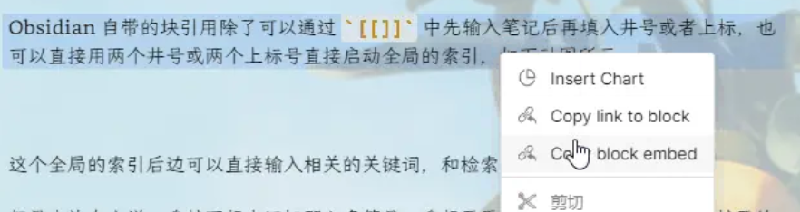
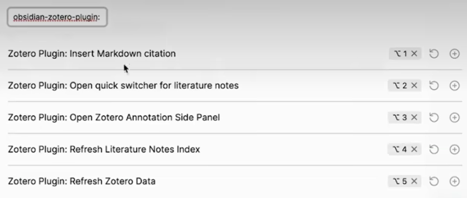
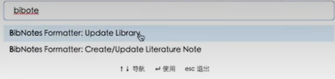
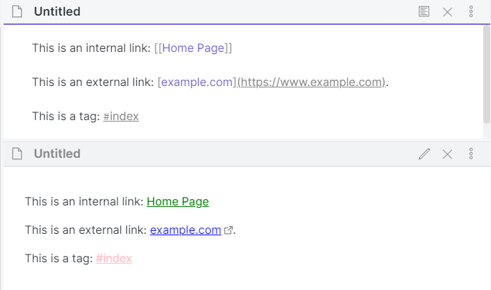
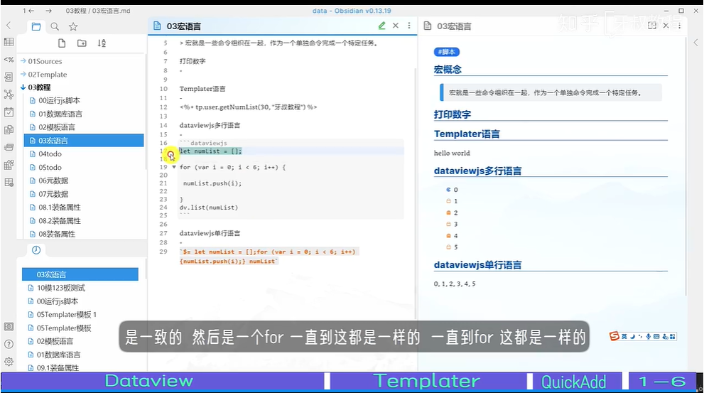

---

number headings: first-level 2, max 6, contents ^toc, auto, start-at 1, 1.1

---


[（转载）Obsidian 开发相关（简单引导）](https://forum-zh.obsidian.md/t/topic/148/1)


[ob配置文件夹.obsidian解析说明](https://forum-zh.obsidian.md/t/topic/495)

## 1 工具使用


### 1.1 块引用


#### 1.1.1 [Embedding files](https://help.obsidian.md/Linking+notes+and+files/Embedding+files)


You can also embed links to [headings](https://help.obsidian.md/Linking+notes+and+files/Internal+links#Link%20to%20a%20heading%20in%20a%20note) and [blocks](https://help.obsidian.md/Linking+notes+and+files/Internal+links#Link%20to%20a%20block%20in%20a%20note).


```md

![[Internal links#^b15695]]

```


You can also open a specific page in the PDF, by adding `#page=N` to the link destination, where `N` is the number of the page:


```md

![[Document.pdf#page=3]]

```


#### 1.1.2 [如何在 Obsidian 中实现「块引用」？](https://sspai.com/post/61741#!)


方法一：重新理解 Block （最推荐的方法）


当然，「一个文档一句话」也无法适应所有情况，这时我们可以使用 Obsidian 自带的标题引用的功能，通过 [[title#heading]]这个方法，在文档中插入其他文档某一级标题下的内容，或通过`![[title#heading]]`进行嵌入。

0.9.5 版本就有块引用的功能了。似乎是在需要引用的段落后面加上 ^blabla 。然后在引用的地方输入 `![[title^blabla]]`，类似之前的链接到标题。


#### 1.1.3 复制块链接 拖动块生成链接 批量块引用


##### 1.1.3.1 双##或双^^全局块引用

Obsidian 自带的块引用除了可以通过 `[[]]` 中先输入笔记后再填入井号或者上标，也可以直接用两个井号或两个上标号直接启动全局的索引，如下动图所示： ^7zpgum


##### 1.1.3.2 复制块链接

你在当前段直接右键点击就会有熟悉的 Copy Block Link 以及 Copy Embed Link 两个选项，如下图所示：



点击 Copy Block Link 就可以将当前块的链接复制到粘贴板，然后你就可以去到你想要粘贴的地方进行粘贴了。

而 Copy Embed Link 也类似，粘贴出来的会是块嵌入效果。
<font color="#ff0000">Copy Embed Link开头带感叹号，直接显示引用内容。</font>

### 1.2 编辑块弹窗

预览窗的实现就是再弹出一个窗口，但是点击开启编辑模式的时候，显示内容会跳转到在显示内容之上的地方。可能是编辑模式展开了某些东西，比如图片等。

已经用$!$嵌入预览显示的内容无法使用obsidian-hover-editor预览弹窗。

用到的工具：**[obsidian-hover-editor](https://github.com/nothingislost/obsidian-hover-editor)**

讨论问题的博客：[Edit transcluded (embedded) notes (blocks) in place (likely requires WYSW](https://forum.obsidian.md/t/edit-transcluded-embedded-notes-blocks-in-place-likely-requires-wyswyg-first/15339)

### 1.3 [Obsidian-docs 支持格式](https://help.obsidian.md/Advanced+topics/Accepted+file+formats)

目前为止，Obsidian 支持以下格式的文件：
1. Markdown files: `md`
2. Image files: `png`, `webp`, `jpg`, `jpeg`, `gif`, `bmp`, `svg`
3. Audio files: `mp3`, `webm`, `wav`, `m4a`, `ogg`, `3gp`, `flac`
4. Video files: `mp4`, `webm`, `ogv`, `mov`, `mkv`
5. PDF files: `pdf`

除了 PDF 以往的所有文件都可以 [进行内嵌](https://jackiegeek.gitee.io/obsidian-docs/zh/How to/内嵌文件/)。

### 1.4 [文件搜索](https://help.obsidian.md/Plugins/Search)


|Search operator  |Description|
|---|---|
|`line:`|Find matches on the same line.<br>Example: `line:(mix flour)`.<br>搜索在同一行的内容。|
|`section:`|Find matches in the same section (text between two headings).<br>Example: `section:(dog cat)`. <br>搜索两个标题之间的内容。|


### 1.5 [提升/降低标题](https://forum.obsidian.md/t/promote-demote-all-selected-headers/25799/2)


[obsidian-heading-shifter](https://github.com/k4a-l/obsidian-heading-shifter)


|Command|Description|Hotkey|
|---|---|---|
|Apply Heading 0|Change Current line to no heading.|-|
|Apply Heading 1~6|Change Current line to heading 1~6.|-|

|Command|Description|Hotkey |
|---|---|---|
|Increase Headings|Increase heading of selected lines(with heading) |  |
|Decrease Headings|Decrease heading of selected lines(with heading)|  |

> It is useful to assign a hotkey such as `Ctrl + Shift + Left/Right`


### 1.6 自动编号Number Headings


chen-bobo

这个自动编号很实用，但有一个小问题：自动编号后，编号与标题名会存在一个空格，例如2.3 XX。这导致在同一篇笔记内无法直接链接标题名，【 】(#标题名)这个语法用不了。  

不过“原文链接标题”这个功能很少用，所以我还是选择自动编号

2022-06-21 20:54


简睿学堂

外掛選項裡可以設定。

2022-06-22 10:26


没有影响，空格会被obsidian用%20代替引用路径字符，注意引用的时候把标题所含的链接删掉，不然无法引用。


### 1.7 [Obsidian个人同步最完美方案](https://www.bilibili.com/video/BV12G4y1172u/?spm_id_from=333.337.search-card.all.clickotion搞定

2023-01-22 22:09
Gery紫
哪天notion不好用了你连笔记都搬不走
插件用的越多 迁移成本越大😆希望你到时候别后悔
2023-01-23 11:48👍5

### 1.8 [Obsidian多端同步和备份方案](https://www.bilibili.com/video/BV1RF411K7aN/?spm_id_from=333.337.search-card.all.click)


2022-07-22 19:39:27


### 1.9 pdf标注


#### 1.9.1 [法1 Zotero和Obsidian联用新插件，设置操作最简单：Obsidian Zotero，再也不担心看不懂了！Zotero数据路径【首选项>高级>文件夹>路径】](https://www.bilibili.com/video/BV16G4y1Z7J3)

直接读取zotero数据库：zotero.sqlite和better-bibtex.sqlite
navicat不要加任何用户名、密码，直接输入.sqlite文件位置。

##### 1.9.1.1 视频笔记

[zotero插件的github页面](https://github.com/aidenlx/obsidian-zotero/)

用zotero一个pdf的笔记都在一个md里面，相比下面的基于obsidian的每个标注一个md更直观。


https://www.bilibili.com/video/BV1YT411c73K?t=283.4

zotero-better-bibtex用于把zotero里的笔记生成一个.json文件。

zotero-markdb-connect用于右键点击文献时，跳转obsidian里面此文献对应的md笔记。


failed


[五个控制台功能讲解](https://www.bilibili.com/video/BV16G4y1Z7J3?t=745.4)




https://www.bilibili.com/video/BV1YT411c73K?t=1110

第一个是更新json文献笔记库。第二个是更新md笔记文件。




https://www.bilibili.com/video/BV1YT411c73K?t=1286.2

在zotero里看pdf时候，左边添加注释后，右边记得添加注释到单独笔记，因为这样我的文库.json才会更新笔记。否则你在pdf里在左边添加的注释不会更新到我的文库.json里去。


##### 1.9.1.2 需要


Zotero下载：

https://download.zotero.org/client/release/6.0.10/Zotero-6.0.10_setup.exe


Zotero需要安装的插件:  

https://github.com/retorquere/zotero-better-bibtex/releases/tag/v6.7.21  

https://github.com/daeh/zotero-markdb-connect/releases/tag/v0.0.18  

Obsidian需要安装的插件:  

https://github.com/stefanopagliari/bibnotes  


解决插件兼容问题：  

https://github.com/argenos/zotero-mdnotes/issues/133


##### 1.9.1.3 bug:

**description:**

不能移动zotero的storage文件，`C:\Users\UryWu\Zotero\storage`


**solution:**

这个文件夹里面是装pdf和笔记用的。如果迁移，zotero会无法加载pdf和笔记。


如果你在某个地方做个storage目录的备份，让obsidian直接读取这个文件夹。倒是可以，但是如果你在zotero里增加了笔记，笔记只会在storage里更新，而没法在storage备份里同步更新笔记。所以最好不要修改：zotero菜单栏->编辑->首选项->高级->数据存储位置，就保持默认。让zotero中所有pdf以及它的笔记都保存在`C:\Users\UryWu\Zotero\storage`。


#### 1.9.2 法2 最新zotero与obsidian笔记联动教程（可代替citations和mdnotes）
已于 2022-07-18 17:46:16 修改

方法同上面那个视频。

##### 1.9.2.1 create无反应
[野蛮薄荷](https://blog.csdn.net/m0_54437461)2023.02.17

bib之后选择create无反应的，如果下载的是最新的bib插件，不要改main.json,甚至那个custom都不要改，先可以生成md之后，自己再去探索
##### 1.9.2.2 无法识别对高亮部分的评论
[qq_35400740](https://blog.csdn.net/qq_35400740)2022.07.30 3👍

obsidian好像识别不到对高亮部分的评论，只能导入高亮的部分。有什么解决方法吗？
[weixin_42771997](https://blog.csdn.net/weixin_42771997)回复qq_354007402022.08.01
5👍


我通过debug笔记输出过程找到了解决方法，打开obsidian，找到设置/第三方插件/BibNotes Formatter/Highlight Color，将Yellow/Red等等你笔记的颜色的设置从{{highlight}}修改为{{highlight}} {{comment}} {{tag}}，然后删除笔记重新生成即可

不是很理解BibNotes Formatter插件作者为什么要这么写...


#### 1.9.3 [法3 科研生产力：一个比Mdnotes更丰富的Zotero&Obsidian协同插件| Zotero integration |支持图片与跳转链接](https://www.bilibili.com/video/BV1jF411A7d6)


[Zotero Integration插件说明](https://f8lfn9zs2l.feishu.cn/docx/doxcno0YluQMgtsNTj3SsaOr9Sd)


#### 1.9.4 [法4 基于Obsidian的pdf阅读、标注，构建笔记思维导图，实现笔记标签化、碎片化，便于检索和跳转]()


每个笔记都生成一个md，非常麻烦，但是可以生成脑图。

想要看所有文献的笔记，可以直接通过#号来检出。还需要创建一个单独的文档来看。


模板


template.md，视频里的模板。


```markdown

# {{title}}

ABSTRACT

{{abstractNote}}

Date::{{date|format("YYYY-MM")}}

{{t.firstName}}{{t.lastName}}

{{t.name}}, 



##

{{annotation.annotatedText}}



(% if annotation.color == '#5fb236' %}

{{annotation.comment}}

· {{annotation.annotatedText}}


{{pdfZoteroLink|replace("//select/", "//open-pdf/")|replace(")","")}}?page={{annotation.page)}&annotation={{annotation.id}})






![[{{annotation.imageBaseName}}]]







```


template_1.md，up主自用的模板。


```markdown

# {{title}}

## Information

{{shortTitle|replace("🔤", "- 中文标题:: ")}}
- itemType:: {{itemType|replace("journalArticle", "#论文 ")}} 
- Author:: [[{{t.firstName}}{{t.lastName}}{{t.name}}]], 
- Keywords:: [[{{t.tag}}]], 
- Journal:: [[{{publicationTitle}}]]
- Date::  {{date | format("YYYY-MM")}}
- 评分:: {{rights}}
- 状态:: 
- [Local library]({{select}})





## Annotation






{{annotation.comment}}

<font color=#ca6924>{{annotation.annotatedText}}</font>[](zotero://open-pdf/library/items/{{t.itemKey}}?{{annotation.page}}&annotation={{annotation.id}})






{{annotation.comment}}

<font color=#c3272b>{{annotation.annotatedText}}</font>[](zotero://open-pdf/library/items/{{t.itemKey}}?{{annotation.page}}&annotation={{annotation.id}})




## {{annotation.annotatedText}}{{annotation.comment}}




### {{annotation.annotatedText}}{{annotation.comment}}






{{annotation.comment}}

<font color=549688>{{annotation.annotatedText}}</font>






![[{{annotation.imageBaseName}}]]

**{{annotation.comment}}**









```


#### 1.9.5 [关闭 Zotero 软件自动更新的方法](https://blog.csdn.net/amnesiagreen/article/details/122918980)


`编辑（E）`->`首选项（N）`->`高级设置`->`设置编辑器`：


关闭自动更新

需要关闭这两个选项：app.update.auto和app.update.enabled，双击条目即可更改参数取值，都设置为false即可。


#### 1.9.6 其他标注软件


##### 1.9.6.1 marginnote liquidtext比较


###### 1.9.6.1.1 [MarginNote3全网最详细干货教程，MarginNote3学习笔记神器|生产力|网课复习技巧|思维导图|ipad考研必备软件|英语|高效率|pdf阅读批注](https://www.bilibili.com/video/BV1RJ411g7EE)


###### 1.9.6.1.2 [【ipad学习软件推荐】LiquidText—比MarginNote更好用的阅读文献神器，提升阅读效率，亲测体验丝滑流畅](https://www.bilibili.com/video/BV1fE411a7pZ)


<font color="#ff0000">MN适合读教材类的书，把知识分门别类，liquid适合读论文和专著</font>


慕春时节又逢君

*置顶*up主花了很多心思做了这个视频，那我就谈谈自己的看法吧，我两个都买了，然后先买的lq(liquidtext)后面买的mn3(marginnote3)，我觉得lq的优势太小了，如果仅仅这样并不能让我从mn3回归

1，mn3作者是国人，中文支持，bug修复快(邮件，微博，b站都能很快联系上，小版本说更就更);lq作者应该是外国大佬(上次给发了不支持iOS13特性的邮件，回信是英文的)，不支持中文，更新较为缓慢，功能上线慢

2，lq最厉害的地方在于可以把文档前后压缩拉到一起，前后画墨迹和highlightview模式，mn3通过笔记功能也能实现相应的功能，即使有差距也不影响太多

3，lq最厉害的liquid流畅性我并没有体会到，我用的iPad pro11，卸载重装也能感觉很多时候确实有点卡顿，退出保存最容易卡，mn3就好多了，我觉得暂时的优化程度不值得入手lq

4，mn3的新功能更新很快，比如刚刚新增的历史版本，离线ocr，下个版本优化手写功能，这些很有诚意

5，lq3一些ui和逻辑我觉得问题比较严重，比如copy和define都在次级菜单，让我用起来很不方便

6，mn3有mac版，虽然不能完全互通，我不信作者以后不在这方面努力下，毕竟现在iPad可以和mac无缝链接了

7，双持观望lq大更新


2019-10-30 19:28👍403


#### 1.9.7 bug


##### 1.9.7.1 [Selecting: "Update Library" does nothing #58](https://github.com/stefanopagliari/bibnotes/issues/58)


##### 1.9.7.2 [Unable to create literature note in Linux #18](https://github.com/stefanopagliari/bibnotes/issues/18)


### 1.10 图片显示问题


#### 1.10.1 [failed Support\and\<video\> tag with src relative path format](https://forum.obsidian.md/t/support-img-and-video-tag-with-src-relative-path-format/18647)

和这个问题最相关的repost。


#### 1.10.2 [solved How to display local images with -tag and keep portability?](https://forum.obsidian.md/t/how-to-display-local-images-with-img-tag-and-keep-portability/37270/5)

support windows、android，not support ios、ubuntu

[obsidian-local-img-plugin](https://github.com/talengu/obsidian-local-img-plugin)

只要下载manifest.json、和main.js后安装obsidian插件就可以了。

打开阅读模式看图片，但是同时无法编辑。


#### 1.10.3 [failed Typora插入图片后在Obsidian中显示（相对路径）](https://zhuanlan.zhihu.com/p/491700093)

拔剑四顾 `作者`

在Typora中插入图片时，默认为Markdown超链接语法：

``


当对插入的图片使用缩放功能时，语法转换为Html语言：

``

但此时在Obsidian中图片已无法显示。


原因为：在Obsidian中使用Html语言时*，不支持相对路径。


如果想要在Obsidian中实现和Typora相同的图片缩放效果，需要在Html语言中使用绝对路径，也即（注意替换为自己的图片文件路径）：

2023-06-03 ·热评


### 1.11 加载外部javascript代码

**[obsidian-javascript-init](https://github.com/ryanpcmcquen/obsidian-javascript-init)**


### 1.12 [修改软件颜色主题样式](https://forum.obsidian.md/t/separate-colors-for-tags-and-for-links/8177)

这个博客只修改了引用的md文件内的颜色样式，在现在这个页面的md文件还是要ctrl+shift+i去选中内容，然后在`F:\Files\My_Library\.obsidian\themes\Dayspring\theme.css`中修改。


```css

.markdown-preview-view .internal-link {

    color: green;

}


.markdown-preview-view .external-link {

    color: blue;

}


.markdown-preview-view .tag {

    color: pink;

}

```




#### 迁移旧样式到新vault

对于新的vault，直接copy原有的`F:\Files\My_Library\.obsidian\themes`到`F:\Files\My_Library\plan\.obsidian\themes`。

然后在设置：


选择Appearance->Themes->Manage->点击下拉框->选择Dayspring

对于Accent color的设置，我习惯设置rgb为：139, 107, 255


### 1.13 类似typora的自动保存复制进来的图片到${filename}.asset目录


[obsidian-custom-attachment-location](https://github.com/RainCat1998/obsidian-custom-attachment-location)


### 1.14 [类word编辑栏 obsidian-editing-toolbar](https://github.com/PKM-er/obsidian-editing-toolbar)


Emoji Toolbar: Open emoji picker


### 1.15 [【已解决】关于将标题级别`[#]`展示为H1,H2…H6的CSS代码片段](https://forum-zh.obsidian.md/t/topic/9826/3)


```css

.markdown-preview-view h2::before, 

.is-live-preview .HyperMD-header-2::before { 

content: 'H2'; 

position: absolute; 

font-size: 0.7rem; 

font-family: var(--default-font); 

width: auto; 

left: -30px; 

padding: 0px 2px; 

top: 23px; 

opacity: 0.5; 

}

```


### 1.16 设置Quiet Outline的颜色样式

需要在`F:\Files\My_Library\.obsidian\plugins\obsidian-quiet-outline\styles.css`里面搜索.n-tree-node.located样式类，然后在里面添加内容，不要自己直接复制粘贴到css文件的其他地方。修改如下：

```css

/* 设置右边的大纲高亮当前位置 */

.n-tree-node.located {

    background-color: rgb(151 144 255 / 59%);

    font-weight: bold !important;

}

```


这个javascript只是静态的，执行一次只能更改一次的颜色。

```javascript

var modal1 = document.getElementsByClassName('n-tree-node n-tree-node--selectable level-3 located');

modal1[0].style.backgroundColor =  "rgb(151 144 255 / 59%)";

```
参考：
[关闭4399登录弹窗](../blogs/javaweb/web前端学习javascript&html&CSS.md#关闭4399登录弹窗)

```css
/* 设置右边的大纲带h层级标题 */

.level-1::before {

 content: "h1";

 font-size: 0.8rem;

}

.level-2::before {

 content: "h2";

 font-size: 0.8rem;

}

.level-3::before {

 content: "h3";

 font-size: 0.8rem;

}

.level-4::before {

 content: "h4";

 font-size: 0.8rem;

}

.level-5::before {

 content: "h5";

 font-size: 0.8rem;

}

.level-6::before {

 content: "h6";

 font-size: 0.8rem;

}


```


n-tree-node n-tree-node--selectable level-3

n-tree-node n-tree-node--selected n-tree-node--selectable level-3

n-tree-node n-tree-node--selectable level-3 located


### 1.17 快速插入latex

[Obsidian 插件之 LaTeX Suite](https://zhuanlan.zhihu.com/p/571025294)

[latex所见即所得神器](https://latex.codecogs.com/legacy/eqneditor/editor.php?tdsourcetag=s_pctim_aiomsg)


### 1.18 dataview用sql管理笔记


#### 1.18.1 [obsidian之dataview插件教程（全网最简单教程）](https://www.bilibili.com/video/BV1cG4y1y7VP)


[obsidian之dataview插件应用模板](https://www.cnblogs.com/JuziChen/p/17030126.html)


[Obsidian DataView插件介绍#展示数据属性](https://blog.csdn.net/qq_42760314/article/details/127342437#t3)


#### 1.18.2 query使用


#### 1.18.3 mermaid使用


[ob中的流程图绘制（Mermaid教程） by 成雙醬](https://publish.obsidian.md/chinesehelp/01+2021%E6%96%B0%E6%95%99%E7%A8%8B/ob%E4%B8%AD%E7%9A%84%E6%B5%81%E7%A8%8B%E5%9B%BE%E7%BB%98%E5%88%B6%EF%BC%88Mermaid%E6%95%99%E7%A8%8B%EF%BC%89+by+%E6%88%90%E9%9B%99%E9%86%AC)

	需要说明的是，Mermaid语句是有较高的门槛的，我认为属于高级操作，我个人也不懂相关的语句，一般使用流程图软件，例如drawio，可见[drawio和ob连用做流程图](https://publish.obsidian.md/chinesehelp/09+%E7%A2%8E%E8%AE%B0/drawio%E5%92%8Cob%E8%BF%9E%E7%94%A8%E5%81%9A%E6%B5%81%E7%A8%8B%E5%9B%BE)。
	
	[Mermaid 流图 - 秃秃的小屋 - Obsidian Publish](https://publish.obsidian.md/csj-obsidian/0+-+Obsidian/Mermaid/Mermaid+%E6%B5%81%E5%9B%BE)

#### 1.18.4 [obsidian插件dataview——强大的数据视图插件，以数据库索引呈现](https://www.bilibili.com/video/BV1Fe411g7DQ)

各个参数都用中文详细讲解，非常清楚。


### 1.19 文件内容批量替换Emeditor

[使用Emeditor批量替换Obsidian所有文档指定字符|批量添加删除双链](https://www.bilibili.com/video/BV14b4y1r7ng/)


### 1.20 [OB打开bili视频，并用时间戳做视频笔记](https://www.bilibili.com/video/BV1rW4y1n7bJ/)


Media Extended和Media Extended BiliBili Plugin。

第一个去这里下载：[解决media-extended新建窗口问题](https://forum-zh.obsidian.md/t/topic/14037)

第二个直接搜。


任尔东西南北风

2023 年 4 月 5 日

但是似乎还有其它bug有待修复, 一使用插件自带的添加时间戳功能, 就自动锁了编辑模式, 无法再切换回阅读模式点选时间戳进行跳转, 只有把视频栏关了, 才恢复正常.

另外请问在代码中改哪里能调整插件支持的时间戳格式, 个人想把#t=改回b站原生的&t=.


tomy

main.js中搜索` (${Xr(this.info.src)}#t=${u})}showControls()` ，修改\#t= 成 &t=`

搜不到的话，搜 showControls() ，在第2个前面修改


参数应该是改为?t才对。


### 1.21 [把Obsidian当网页浏览器是什么体验？做视频笔记](https://www.bilibili.com/video/BV1DR4y1o7gk/?p=1&timestamp=1669470789)


**[做网页的文本笔记 01m03s](https://www.bilibili.com/video/BV1DR4y1o7gk/?t=01m03s&p=1)**

方便快速定位。1

[器就可](https://www.bilibili.com/video/BV1DR4y1o7gk/?t=01m03s&p=1#:~:text=%E5%99%A8%E5%B0%B1%E5%8F%AF)


**[避免打开多个网页 01m42s](https://www.bilibili.com/video/BV1DR4y1o7gk/?t=01m42s&p=1)**

open in same tab


[3 打开本地HTML格式 02m27s](https://www.bilibili.com/video/BV1DR4y1o7gk/?t=02m27s&p=1)


[4 嵌入常见的网页应用 02m33s](https://www.bilibili.com/video/BV1DR4y1o7gk/?t=02m33s&p=1)


**[5 学习站视频并复制时间戳 02m42s](https://www.bilibili.com/video/BV1DR4y1o7gk/?t=02m42s&p=1)**


### 1.22 [ZH增强Obsidian编辑](https://github.com/obsidian-canzi/Enhanced-editing)

首行缩进。


[智能符号](https://github.com/obsidian-canzi/Enhanced-editing#%EF%B8%8F-%E6%99%BA%E8%83%BD%E7%AC%A6%E5%8F%B7)

很多功能需要进github页面搜索。


### 1.23 [标签使用](https://www.bilibili.com/video/BV1vM4y1h7H4/?p=44)


```

	# Tag Summary汇总
	```add-summary
	tags: #{{TITLE}}
```

	# Query语句汇总
	```query
	tag:#{{TITLE}}
	```
	
	# Dataview汇总
	```dataview
	list
	from #{{TITLE}}
	```

```


天才代号23

请问一下，tag summary插件生成的内容不会动态变化，需要手动刷新。想要用dataview插件，能实时刷新，如何用dataviewjs达到tag summary的汇总效果呢？

2023-04-20 00:10 👍1


浮生若梦い

能不能既像query能识别出包含标签的页面，又像tag summary一样能直接看到内容[doge]

2023-07-16 17:56


### 1.24 [Obsidian运行JS脚本的三种方法 - 知乎](https://www.zhihu.com/zvideo/1467906559037120512)

Dataview Templater QuickAdd 1-6





### 1.25 [一键汇总你Obsidian中的笔记，再也不用反反复复去复制粘贴了](https://www.bilibili.com/video/BV1yo4y1b766/)


```dataviewjs  

dv.markdownList(  

dv.pages('"Cards"')  

.map(  

p => {  

dv.paragraph(  

dv.sectionLink(p.file.name, "主要内容",true)  

)  

}  

)  

)  

```

```dataviewjs  

dv.markdownList(  

dv.pages('"Cards"')  

.map(  

p => {  

dv.paragraph(  

dv.sectionLink(p.file.name, "主要内容",true)  

)  

}  

)  

)  

```

```dvjs

dv.markdownList(  
	dv.pages('"Cards"')  
		.map(  
			p => {  
			dv.paragraph(  
				dv.sectionLink(p.file.name, "主要内容",true)  
			)  
		}  
	)  
)  

```


视频中用到的DataviewJS代码
2023-04-21 15:38 👍17
### 1.24 插件开发

#### 1.24.1 hot-reload代码热更新
[手把手教你开发Obsidian插件，Obsidian插件开发全链路实践](https://www.bilibili.com/video/BV1Bs4y167Dn/)
[时间戳](https://www.bilibili.com/video/BV1Bs4y167Dn?t=152.3)
安装hot-reload插件，增加代码热更新功能，不然每次改动代码都要繁琐地重启插件
在插件目录下，增加.git文件夹才会自动更新：
[GitHub - pjeby/hot-reload: Automatically reload Obsidian plugins in development when their files are changed](https://github.com/pjeby/hot-reload)
Well, you don't need to do that any more. Just install this plugin, and let it do all the work. When enabled, this plugin automatically watches for changes to the main.js or styles.css of any plugin whose directory includes a .git subdirectory or a file called .hotreload, and then automatically disables and re-enables that plugin once changes have stopped for about three-quarters of a second. 
#### 1.24.2 [How To Create Your Own Obsidian Plugin - Step By Step - YouTube](https://www.youtube.com/watch?v=AgXa03ZxJ88)


### 1.25 指定路径搜索

```shell
path:"你的/目录/路径" 关键词
```

如：

```shell
path:blogs/projects_docs  硅基流动 
```


### 1.26 打开obsidian时卡在loading cache

参考：[Obsidian 卡在加载缓存](https://www.reddit.com/r/ObsidianMD/comments/1g41eys/obsidian_stuck_on_loading_cache/?tl=zh-hans)

把`C:\Users\YOUR_NAME\AppData\Roaming\obsidian\IndexedDB`目录删了。


### 1.27 迁移旧插件到新vault

完全拷贝所有插件从旧位置：`F:\Files\My_Library\.obsidian\plugins`到新vault的位置：`F:\Files\My_Library\plan\.obsidian\plugins`


经常用的两个插件：

`F:\Files\My_Library\plan\.obsidian\plugins\number-headings-obsidian`

`F:\Files\My_Library\plan\.obsidian\plugins\Quiet Outline`


## 2 知识管理方法论
### 2.1 [不用标签而用反向链接建立知识体系](https://zhuanlan.zhihu.com/p/594872400)
解决方法：
观念更新：ob不需要用标签来管理笔记，这样是低效的，比如我导入到ob里的笔记有7-8百条，我不可能再一一去查看并且手动添加标签的

解决方案是，直接运用ob的特色功能：反向链接
我建立一个独立的文件夹，作为我的知识体系的目录文件夹，当我需要去查看知识知识体系下某个条目的内容时，我只需要打开对应的笔记，再查看其反射链接即可
比如，我在知识体系里建立“历史”的笔记，再点开这条笔记，查看反向链接，就可以看到所有包含“历史”字眼的笔记了
