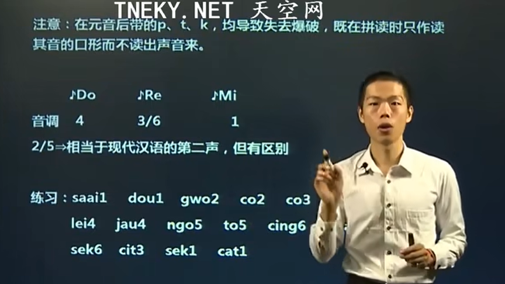
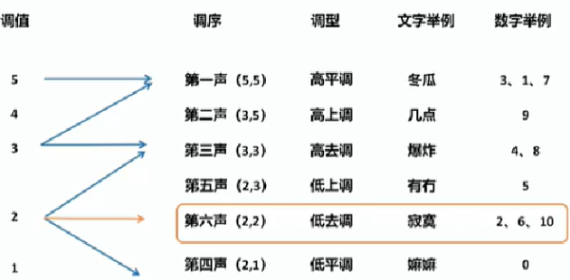
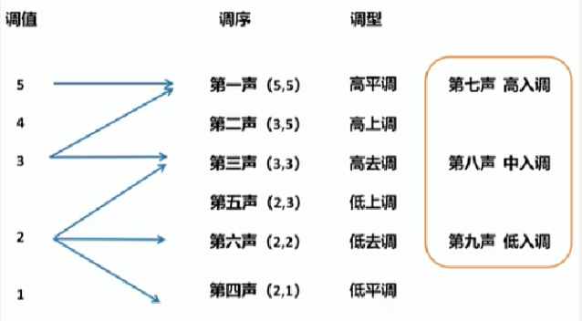
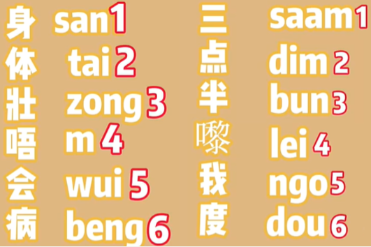
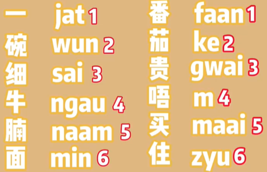
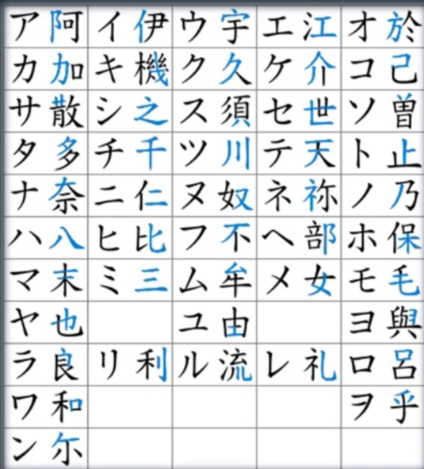
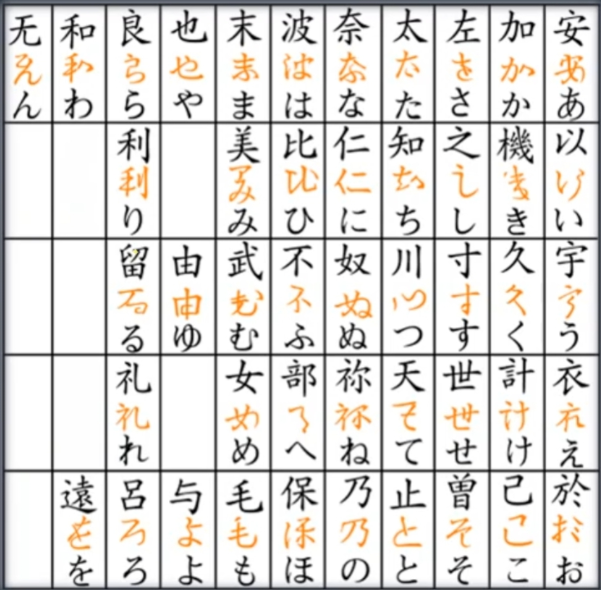

### 粤语快速入门 粤语零基础

[粤语-1](https://www.bilibili.com/video/BV1hZ4y1j7mq?t=756.5)

### [【详细版】粤语九声六调，有嘴就会！](https://www.zhihu.com/question/23426953/answer/2417240406)

7、8、9只是长音跟短音的区别。

### [侗语有15个声调，其中有九个舒声调，六个促声调](https://www.zhihu.com/question/40854068/answer/88785966)
以下说法均来自维基百科。侗语有15个声调，其中有九个舒声调，六个促声调。促声调的调值和对应的舒声调比较接近，因此也可以认为侗语只有9个声调。（[Kam language](https://link.zhihu.com/?target=https%3A//en.wikipedia.org/wiki/Kam_language)）特里基语（Trique，墨西哥的一种原住民语言）的 Chicahuaxtla 方言，按不同的分析方法，有10到16个声调。（[Trique language](https://link.zhihu.com/?target=https%3A//en.wikipedia.org/wiki/Trique_language)）
[编辑于 2018-06-11 17:49](http://www.zhihu.com/question/40854068/answer/88785966)

[Liwei Cai](https://www.zhihu.com/people/6f23c64b87c88183ac48d4dee825eb4b)
侗语那个似乎和粤语到底算9个声调还是6个声调是一个道理
2018-06-13

世界上声调最多的语言是侗语，贵州榕江县车江乡口寨村侗语有多达15个声调。

[侗态生活](https://www.zhihu.com/people/838e3dc536e7ae14a4a627a7d63df29e) [端知](https://www.zhihu.com/people/0c682934b13259eb8be2486c489603f5)

是的侗语也有方言，但是肯定没有15调的方言。15调是传统音韵学上讲的。
其实侗语，只有6调。
2020-06-17

[侗态生活](https://www.zhihu.com/people/838e3dc536e7ae14a4a627a7d63df29e) [soukaro](https://www.zhihu.com/people/2d68a1b7bc1c51bc6cba28b4e4667cfb)
我就是说侗语的，按照中原音韵学去研究的确有15调。但是生活中能够感知的调只是6个。
2020-09-25

南風
如果根據長短音、送氣與否、舒促來分的話，還真的可以說是

### 日语

#### [五十音图在线学习](https://nya.ink/50yin/index.html)
这个有五十音的发音，但是图表太大了。

[wikipedia五十音](https://zh.wikipedia.org/zh/%E4%BA%94%E5%8D%81%E9%9F%B3)

[日语五十音图_百度百科](https://baike.baidu.com/item/%E6%97%A5%E8%AF%AD%E4%BA%94%E5%8D%81%E9%9F%B3%E5%9B%BE/9562443#6)

|   |あ段|い段|う段|え段|お段|
|---|---|---|---|---|---|
|あ行|あア [a]|いイ [i]|うウ [u]|えエ [e]|おオ [o]|
|か行|かカ [ka]|き [ki] |くク [ku]|けケ [ke]|こコ [ko] |
|さ行|さサ [sa] |しシ [ʃi] |すス [su]|せセ [se]|そソ [so]|
|た行|たタ [ta] |ちチ [tʃi]|つツ [tsu]|てテ [te] |とト [to]|
|な行|なナ [na] |にニ [ɲi] |ぬヌ [nu]|ねネ [ne] |のノ [no]|
|は行 |はハ [ha] |ひヒ [hi]|ふフ [fu]|へヘ [he] |ほホ [ho] |
|ま行|まマ [ma] |みミ [mʲi]|むム [mu] |め [me]|もモ [mo]|
|や行 |やヤ [ya]|  |ゆユ [yu]|  |よヨ [yo]|
|ら行|らラ [ra]|りリ [rʲi] |るル [ru] |れレ [re]|ろロ [ro]|
|わ行|わワ [wa]|  |  |  |をヲ [wo]|

じし

##### 具体音
ン ん
拔音“ん”是声音通过鼻腔发出的有声音。但是“ん”的发音部位是根据“ん”的下一个音的发音部位而有所变化的，即“ん”的发音要为发下一个音做准备，汉语的n表示[韵尾](https://baike.baidu.com/item/%E9%9F%B5%E5%B0%BE/5489384?fromModule=lemma_inlink)的闭锁，但是日语的“ん”一定要保持一下拍节。
**拨音ん**
这个假名用罗马字标为“n”，但实际上有3种发音：
（1）在双[唇音](https://baike.baidu.com/item/%E5%94%87%E9%9F%B3?fromModule=lemma_inlink)ま行、ば行ぱ行假名前面时发“m”音。
（2）在[舌音](https://baike.baidu.com/item/%E8%88%8C%E9%9F%B3/865496?fromModule=lemma_inlink)さ行、た行、な行、ら行、ざ行、だ行假名前面时发“n”音。
（3）在射音あ行、か行、は行、や行、わ行、が行假名前面时及用[拨音](https://baike.baidu.com/item/%E6%8B%A8%E9%9F%B3?fromModule=lemma_inlink)结尾时发“ng”音。

#### 日语中横线和前面一个音连起来发长音
**读日语中横线**的时候和前面一个音连起来发长音，就是将假名的元音延长一拍，那就是念前一个假名的元音。 总之日语中的横线这个不发音，但是发音时要占一拍！ 看前面是什么假名，把前面那个原音拖长念长音就可以啦。

#### [片假名和片假名有什么区别](https://zhuanlan.zhihu.com/p/99915542)
日语的字母称为假名(かな)，有平假名(ひらがな)和片假名(カタカナ)两种。平假名和片假名是一一对应的。平假名和片假名是是1种读音的2种写法,“假”即“借”,“名”即“字”。指借用汉字的音和形，而不用它的意义，所以称为“假名” 。

**平假名**就是一般的用途。
而片假名主要有三种用处：
**第一**，表示外来语；
**第二**，用于表示人名，比方说你给自己的名字标注音的时候一般都用片假名；
**第三**，当在一篇文章中重点强调一个词的时候也适用片假名！

#### 平片假名 字源表
片假名 字源表

平假名 字源表

### 汉语方言

#### [语言分布 - 复旦大学中华文明数据中心](http://ccdc.fudan.edu.cn/linguae/languageDistribution.jsp)
看全国各种方言分布。精确到县城。
可以看语音，但是不能听。需要注册，注册需要写单位，这样审核更快。可能要sqlmap注入。

#### [汉语方言发音字典](http://zh.voicedic.com/)

闽南语（台湾腔） 闽南话（泉州音） 客家话（惠阳音） 客家话（四县腔） 客家话（海陆腔） 客家话（饶平腔） 客家话（大埔腔） 客家话（诏安腔） 潮州话 广州话 上海话 苏州话 围头话 无锡话 南京话 温州话

广州话：你[nei5]	 妈[maa1]
