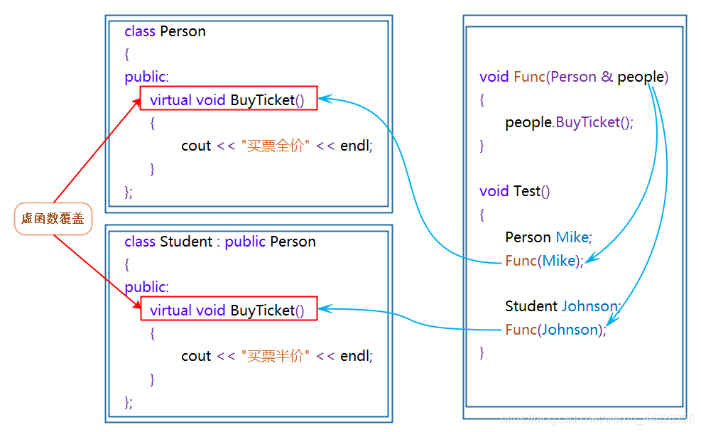

目录来源：[2023.8月 华为od面试C++面经 - 知乎](https://zhuanlan.zhihu.com/p/650716103)
### c++面试题
#### [CppGuide](https://gitee.com/grindgold/CppGuide)

#### [整理的C++面经（较全）有答案](https://blog.csdn.net/Awesomewan/article/details/123948929)

#### [详解c++的命名空间namespace](https://zhuanlan.zhihu.com/p/126481010)
9个规则，这里只列出一个。

**1、命名空间的概述**
在c++中，名称（name）可以是符号常量、变量、函数、结构、枚举、类和对象等等。工程越大，名称互相冲突性的可能性越大。另外使用多个厂商的类库时，也可能导致名称冲突。为了避免，在大规模程序的设计中，以及在程序员使用各种各样的C++库时，这些标识符的命名发生冲突，标准C++引入关键字namespace（命名空间/名字空间/名称空间），可以更好地控制标识符的作用域。

**2、命名空间的定义**
```cpp
//定义一个名字为A的命名空间（变量、函数）
namespace A {
    int a = 100;
}
namespace B {
    int a = 200;
}
void test02()
{
    //A::a  a是属于A中
    cout<<"A中a = "<<A::a<<endl;//100
    cout<<"B中a = "<<B::a<<endl;//200
}
```


#### [封装是什么意思？](https://blog.csdn.net/qq_44034384/article/details/106470717)
1、封装的含义：封装是实现面向对象程序设计的第一步，封装就是将数据或函数等集合在一个个的单元中（我们称之为类）。被封装的对象通常被称为抽象数据类型。

3、如何封装：封装提供了一个有效的途径来保护数据不被意外的破坏。相比我们将数据（用域来实现）在程序中定义为公用的（public）我们将它们(fields)定义为私有的（private）在很多方面会更好。私有的数据可以用两种方式来间接的控制。第一种方法，我们使用传统的存、取方法。第二种方法我们用属性（property），使用属性不仅可以控制存取数据的合法性，同时也提供了“读写”、“只读”、“只写”灵活的操作方法。

4、什么情况下封装：编写实例类时，用到封装有很多好处，其中比较实际的是：
拒绝直接调用声明字段，保护内部数据，更安全；
在编程中可达到缓存的效果，执行效率高；
重复调用，避免代码冗余，程序编写效率高。

#### [深入理解C++中public、protected及private用法](https://zhuanlan.zhihu.com/p/70758317)
1.public继承：基类public成员，protected成员，private成员的访问属性在派生类中分别变成：public, protected, private

2.protected继承：基类public成员，protected成员，private成员的访问属性在派生类中分别变成：protected, protected, private

3.private继承：基类public成员，protected成员，private成员的访问属性在派生类中分别变成：private, private, private

但无论哪种继承方式，上面两点都没有改变：

1.private成员只能被本类成员（类内）和友元访问，不能被派生类访问；
2.protected成员可以被派生类访问。

[继承后属性变化：](https://juejin.cn/post/7156201193063055368)

|集成方法|**基类方法在派生类里的变化**|**派生类成员函数的访问权限**|**派生类实例变量的访问权限**|
|---|---|---|---|
|private继承|基类的所有方法在派生类中变为private|可以访问基类的public成员、protected成员，但是无法访问基类的private成员|无法访问基类的任何成员，因为基类的所有成员在派生类中变成了private|
|protected继承|基类的public方法在派生类中变为protected，publiced和private方法不变||派生类的实例变量，无法访问基类的任何成员，因为基类的public成员在派生类中变成了protected|
|public继承|基类中的方法属性不发生改变||可以访问基类的public成员，但是无法访问protected、private成员|
  
#### [什么是多态？如何实现？只看这一篇就够了](https://blog.csdn.net/weixin_44826356/article/details/105470565)

多态定义：
多态是在不同继承关系的类对象，去调用同一函数，产生了不同的行为。

2.1多态的构成条件
必须通过基类的指针或者引用调用虚函数
被调用的函数必须是虚函数，且派生类必须对基类的虚函数进行重写




2.2 虚函数
虚函数：即被virtual修饰的类成员函数称为虚函数。

2.3虚函数的重写
虚函数的重写(覆盖)：派生类中有一个跟基类完全相同的虚函数(即派生类虚函数与基类虚函数的返回值类型、函数名字、参数列表完全相同)，称子类的虚函数重写了基类的虚函数。

#### const的作用是什么？

[C/C++ 基础中的基础： const 修饰符用法总结！ - 知乎](https://zhuanlan.zhihu.com/p/90720012#fromHistory)
常量，不可改变，用于注释。
必须初始化。

<font color="#c00000">我们使用const在源码中标示出“不应该改变”的地方</font>，然后利用编译器，帮助我们检查这些地方是否真的没有被改变过。如果我们不小心去修改了这些地方，编译器就会报错，从而帮助我们纠正错误。使用const和不使用const，对于最终编译产生的代码并没有影响。

所以，const修饰符的作用主要是利用编译器帮助我们检查自己代码的正确性。

虽然const对于最终代码没有影响，但是**尽可能使用const，将帮助我们避免很多错误，提高程序正确率。**


在C++中，const 全局变量被用来替换一般常量宏定义。因为虽然 const 变量的值不能改变，但是依然是变量，使用时依然会进行类型检查，要比宏定义的直接替换方法更严格一些（下文还会讨论这个问题）。


在C中，const 结构体变量表示结构体中任何数据域均不允许改变，且需要另一个结构体变量进行初始化。在C++中，struct与class除了默认访问权限之外，并无本质区别。在下一节进行讨论。

#### [再谈NULL和nullptr(C++11)区别](https://zhuanlan.zhihu.com/p/480203440)

翻开NULL的定义，可以看到

C语言里面：
```cpp
#define NULL ((void*)0)
```

​C++里面，它是这样定义的：​
```text
#define NULL    0
```

查看完整的定义：
```cpp
/* Define NULL pointer value */
#ifndef NULL
#ifdef __cplusplus
#define NULL    0
#else  /* __cplusplus */
#define NULL    ((void *)0)
#endif  /* __cplusplus */
#endif  /* NULL */
```

​C语言我们用NULL作为指针变量的初始值，而在C++一般不建议这么做，C++中，如果想表示空指针，建议使用nullptr，而不是NULL。​
​NULL具有二义性，为了解决这种二义性，C++11标准引入了关键字nullptr作为空指针常量。​

#### [详解C语言和C++最大的区别，附带新手学习建议](https://zhuanlan.zhihu.com/p/81798400)
C++对C的“增强”，表现在六个方面：
（1) 类型检查更为严格。
（2) 增加了面向对象的机制。
（3）增加了泛型编程的机制（Template）。
（4）增加了异常处理。
（5）增加了运算符重载。
（6）增加了标准模板库（STL）。

#### [简单说一下什么是设计模式？](https://blog.csdn.net/ljk126wy/article/details/89456611)

设计模式（Design pattern） 是解决软件开发某些特定问题而提出的一些解决方案也可以理解成解决问题的一些思路。

我们使用设计模式最终的目的是实现代码的 高内聚 和 低耦合。

设计模式的6大原则
1、开闭原则（Open Close Principle）
对软件实体的改动，最好用扩展而非修改的方式。如果要修改代码，尽量用继承或组合的方式来扩展类的功能，而不是直接修改类的代码。

2、里氏代换原则（Liskov Substitution Principle）
1. 老爸能干的事情，儿子都能干。
2. 但是儿子能干的事情老爸不一定能干。

3、单一职责原则（Single Responsibility Principle）
一个类只承担一个职责，千万不要让一个类干的事情太多。

4、接口隔离原则（Interface Segregation Principle）
接口最小化。接口中的方法应该尽量少。和单一职责原则类似

5、依赖倒转原则（Dependence Inversion Principle）
这个和针对接口编程， 而不是面向实现编程很像。但是它更强调抽象。这个原则是不能让高层组件依赖底层组件，而且高层组件和低层组件都应该依赖抽象。

6、迪米特法则，又称最少知道原则（Demeter Principle）
类向外公开的方法应该尽可能的少，
依赖的对象尽可能的少（只依赖应该依赖的对象）。


[设计模式究竟是什么？](https://zhuanlan.zhihu.com/p/355289612)
开闭原则 Open Closed Principle
对扩展开放、对修改关闭。

添加一个新的功能，应该是通过在已有代码基础上扩展代码（新增模块、类、方法、属性等），而非修改已有代码（修改模块、类、方法、属性等）的方式来完成。


#### [c++虚函数的作用是什么？](https://www.zhihu.com/question/23971699)

**首先：强调一个概念**

定义纯虚函数是为了实现一个接口，起到一个规范的作用，规范继承这个类的程序员必须实现这个函数。

定义一个函数为虚函数，不代表函数为不被实现的函数。

定义他为虚函数是为了允许用基类的指针来调用子类的这个函数。

定义一个函数为纯虚函数，才代表函数没有被实现。

这个例子是虚函数的一个典型应用，通过这个例子，也许你就对虚函数有了一些概念。它虚就虚在所谓“推迟联编”或者“动态联编”上，一个类函数的调用并不是在编译时刻被确定的，而是在运行时刻被确定的。由于编写代码的时候并不能确定被调用的是基类的函数还是哪个派生类的函数，所以被成为“虚”函数。

虚函数只能借助于指针或者引用来达到多态的效果。

##### 纯虚函数
　纯虚函数是在基类中声明的虚函数，它在基类中没有定义，但要求任何派生类都要定义自己的实现方法。在基类中实现纯虚函数的方法是在函数原型后加“=0”

virtual void funtion1()=0

纯虚函数最显著的特征是：它们必须在继承类中重新声明函数（不要后面的＝0，否则该派生类也不能实例化），而且它们在抽象类中往往没有定义。

定义纯虚函数的目的在于，使派生类仅仅只是继承函数的接口。

纯虚函数的意义，让所有的类对象（主要是派生类对象）都可以执行纯虚函数的动作，但类无法为纯虚函数提供一个合理的缺省实现。<font color="#c00000">所以类纯虚函数的声明就是在告诉子类的设计者，“你必须提供一个纯虚函数的实现，但我不知道你会怎样实现它”。</font>

