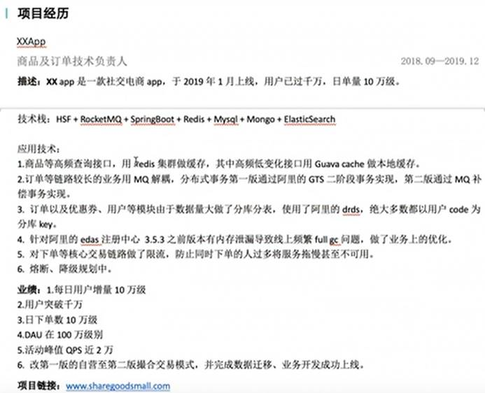

### [面试真题：经典智力题最详汇总（下）](https://www.nowcoder.com/discuss/974128?type=2&channel=-1&source_id=discuss_terminal_discuss_jinghua_nctrack)

编辑于 2022-07-14 15:11:30


### [面试题：Mybatis中 $ 和 # 的区别？](https://blog.csdn.net/qq_40925189/article/details/115839007)

于 2021-04-18 21:16:51 发布


#### 1.1 #符号解析：

上面说了#可以实现预编译，那你知道预编译过程中mybatis都做了啥吗，其实主要表现在数据类型检查和安全检查两部分：

数据类型检查表现在：若检测到为数值类型，就不加引号，即?；若检测到位字符串类型，就加上引号，即'?'。

安全检查表现在：若变量的值带有引号，会对引号进行转义处理，这样可以防止sql注入。


#### 2.1 $符号解析：

$符号主要用于传入的参数是sql片段的场景下，会直接进行字符串替换，完成了sql的拼接。比如我们不在sql映射文件中利用mybatis的动态sql来拼接sql，而是在java代码中去动态的拼接sql，然后将拼接的sql片段作为变量传入sql映射文件。上面也说了$符号只是进行字符串的替换，如果我们传入一个sql片段的话，相当于直接进行了sql拼接，就不用在sql映射文件中利用mybatis提供的动态sql标签来拼接sql了。甚至可以这样：

```xml
<select id="getUserPage" resultType="com.ymxx.oa.bean.User">
        ${sql片段}
</select>
```

### [兴业数金笔试面试](https://acm.nowcoder.com/discuss/1010385?channel=-1&source_id=discuss_terminal_nctrack&trackId=undefined)

编辑于 2022-09-10 12:30

东北大学

java 后端
笔试（8.5）：
选择题很多，单选多选总共忘了是40还是60个来，Java基础、操作系统、Linux、数据库等（我很多都不会），编程题就一个，非常简单，好像是最长不重复子串。
一面（8.10）：
比较快，也就不到十五分钟，显示自我介绍，然后根据项目问相关技术，springboot相关东西，ioc、aop、和springmvc啥区别，场景题分布式的并发自增id怎么做等等，基本就是springboot相关东西，也不是很深，他倒是特别想问我springcloud等的分布式系统的东西，但是我不了解这相关的。反问就是工作是做什么，就是银行相关，用springboot和springcloud等等。

总结：分布式以及springcloud比较重要，还是要多看看，以后面试官想问的话不至于都会，但也能讲出来点东西。

更新：一面完三个小时后跟我说过了，等二面，大概需要两三周后。

更新（9.8）
收到邮件，跳过二面，直接填表内审，说是又得等一两个月


### [招商银行·招银网络科技 面经](https://www.nowcoder.com/enterprise/914/interview)

### [软通动力面经](https://www.nowcoder.com/enterprise/1814/interview)


#### [南京软通动力java中级社招面经](https://www.nowcoder.com/discuss/699068)                                                                                                                                                                                                                                                                                                                         

 发布于  2021-08-05 21:20                                                                                                                                   

 **1****、锁可以锁在哪里？** 

 Java为程序加锁的方式主要有两种：synchronized与Lock。 

 \1. synchronized可以修饰的作用域如下： 

 -非静态方法（加的锁为对象锁）； 

 -静态方法（加的锁为类锁）； 

 -代码块（对象锁与类锁均可）； 

 \2. Lock采用lock()对代码加锁，unlock()进行解锁 

 **2****、怎么利用反射获取类中的对象？** 

 1.获取Class对象 

 2.通过Class对象获取构造方法 

 3.通过构造方法调用newInstance()方法创建对象实例 

 **3****、****HTTP** **和****https** **区别？** 

 \1. HTTP明文传输，[数据]()都是未加密的，安全性较差，HTTPS（SSL+HTTP）[数据]()传输过程是加密的，安全性较好。 

 2.使用HTTPS协议需要到CA（Certificate Authority，数字证书认证机构）申请证书，一般免费证书较少，因而需要一定费用。 

 \3. HTTP页面响应速度比HTTPS快，主要是因为HTTP使用TCP三次握手建立连接，客户端和服务器需要交换3个包，而HTTPS除了TCP的三个包，还要加上ssl握手需要的9个包，所以一共是12个包。 

 \4. http和https使用的是完全不同的连接方式，用的端口也不一样，前者是80，后者是443。 

 \5. HTTPS其实就是建构在SSL/TLS之上的HTTP协议，所以，要比较HTTPS比HTTP要更耗费服务器资源。 

 **4****、谈谈你对****TCP / IP** **协议的了解** 

 \1. TCP/IP是一个协议簇，是一个开放的协议标准，所有人都可以免费使用，并且是独立于[硬件]()和操作系统的。 

 \2. TCP/IP协议是不区分网络[硬件]()的，它在局域网，广域网和互联网中都被广泛使用。 

 \3. TCP/IP协议使用统一的网络地址分配的方案，网络中的每台电脑都具有唯一的IP地址。 

 \4. TCP/IP协议是一个标准的高层协议，拥有极高的可靠性，可以为用户提供可靠的服务。 

 **5****、说说****Aop** **和****IOC** **的应用** 

 IOC的主要应用场景体现在BeanFactory接口，BeanFactory下面有具体的实现类来实现IOC的功能。 

 AOP的主要应用场景：日志、权限、事物等。 

 **6****、****Spring** **中****bean** **是线程安全的吗？** 

 Spring容器中的Bean本身不具备线程安全的特性，但是具体还是要结合具体scope的Bean去研究。 

 \1. Spring容器中的Bean默认是单例的，所有线程都共享一个单实例的Bean，因此是存在资源的竞争。如果单例Bean,是一个无状态Bean，也就是线程中的操作不会对Bean的成员执行查询以外的操作，那么这个单例Bean是线程安全的。比如Spring mvc的Controller、Service、Dao等，这些Bean大多是无状态的，只关注于方法本身。对于有状态的bean，是线程不安全的，但是我们可以通过ThreadLocal去解决线程安全的方法。 

 2.对于原型Bean（即scope="prototype"）,每次创建一个新对象，也就是线程之 

 间并不存在Bean共享，自然是不会有线程安全的问题。 

 **7****、****Maven** **中****package** **和****install** **区别** 

 package是把jar打到本项目的target下，而install时把target下的jar安装到本地仓库，供其他项目使用。 

 **8****、遇到过哪些设计模式？** 

 **9****、谈谈简单工厂和抽象工厂的区别** 

 简单工厂模式：是由一个工厂对象创建产品实例，简单工厂模式的工厂类一般是使用静态方法，通过不同的参数的创建不同的对象实例可以生产结构中的任意产品，不能增加新的产品 

 抽象工厂模式：提供一个创建一系列相关或相互依赖对象的接口，而无需制定他们具体的类，生产多个系列产品生产不同产品族的全部产品，不能新增产品，可以新增产品族 

 **10****、说说你常用的****Linux** **基本操作命****令** 

  ls -用来显示目标列表 

  cd -用来切换工作目录 

 pwd -以绝对路径的方式显示用户当前工作目录 

 cat -文件内容查看 

 grep -是一种强大的文本搜索工具，它能使用正则表达式搜索文本，并把匹配的行 

 打印出来tail -输出文件中的尾部内容 

 ps -用于报告当前系统的进程状态 

 kill -命令用来删除执行中的程序或工作 

 top -可以实时动态地查看系统的整体运行情况 

 **11****、谈谈****Currenthashmap** **的扩容机制** 

 **JDK1.7****：** 

 先对数组的长度增加一倍，然后遍历原来的旧的table数组，把每一个数组元素也就是Node[链表]()迁移到新的数组里面，最后迁移完毕之后，把新数组的引用直接替换旧的。 

 **JDK1.8****：** 

 扩容时候会判断这个值，如果超过阈值就要扩容，首先根据运算得到需要遍历的次数 

 i，然后利用tabAt方法获得i位置的元素f，初始化一个forwardNode实例fwd，如果f == null，则在table中的i位置放入fwd，否则采用头插法的方式把当前旧 

 table数组的指定任务范围的[数据]()给迁移到新的数组中，然后给旧table原位置赋值fwd。直到遍历过所有的节点以后就完成了复制工作，把table指向nextTable，并更新sizeCtl为新数组大小的0.75倍，扩容完成。在此期间如果其他线程的有读写操作都会判断head节点是否为forwardNode节点，如果是就帮助扩容。 

  

#### [软通动力Java社招面经分享](https://www.nowcoder.com/discuss/462664)

发布于 2020-07-30 10:22

作者：努力吧！少年
链接：https://www.nowcoder.com/discuss/462664
来源：牛客网


1、多线程，线程池拒绝策略； 

 2、jvm调优，tomcat调优； 

 3、消息中间件，分布式，集群、zoo[keep]()er，微服务； 

 4、sql左连接右连接区别，存储过程； 

 5、stringbuffer和stringbuild区别； 

 6、stringbuild线程不安全体现在哪？你对线程安不安全怎么理解？（这个问题发挥空间很大，关键词:全局变量、JVM运行时[数据]()区、可见性、原子性、锁、甚至可以说到多核cpu[硬件]()层面） 

 7、arraylist和linkedlist区别； 

 8、spring ioc，aop作用，原理； 

 9、springmvc执行流程； 

 10、hashmap原理（底层结构，答数组+[链表]()/[红黑树]()） 

 11、hashtable,concurrentHashMap，hashmap遍历； 

 12、对大[数据]()有关技术了解多少？ 

 13、写代码:字符串分割[排序]()(split+冒泡)） 

 14、离职原因，以及对薪资待遇的期望；


## 面试题准备


### [面试系列](https://space.bilibili.com/1600965589/channel/collectiondetail?sid=483478)(31/43)


### [Java面试集锦 非常重要](https://space.bilibili.com/503843891/channel/collectiondetail?sid=65377)


### [惊！伪装应届生去面试Java开发，差点职业生涯都没了？](https://www.bilibili.com/video/BV1XN4y1K7YY/?p=3&vd_source=f03b9d349cef8aff4a045d602d8a1d82)

2022-09-28 20:22:52


### java5年以上经验 结合项目答法

sha嘿嘿

我5年以上了，但是面试官问的问题我答的话，直接答我答不好，比如问我ioc是什么，其实都知道本质就是向所谓的容器里加入的实体类，可以多例也可以单例，就相当于对实体进行整体的管理，其实没啥好说的，我面试也会这么说，不过我会加上自己的项目经验，比如我说完ioc大概的东西以后，我会说，web项目ioc加载时机，例如我在做银行单据批量下载时，在监听器哪个位置开启了线程池，此时ioc已经注入完毕，如何调用已经加载完的bean的，注入的bean结合业务是单利多例，线程池为什么在这开，此处开完线程池如何调用bean，线程开在什么层，为什么开在这层，结合手写代码和自己的嘴，来解释给面试官。再比如问我io 我真就答不好，但是我同样结合项目，比如我们的一个扶贫定位项目，nio io netty都涉及我一个人做的，有些特专业名词我真记不住，我只能把我为什么这样做解释给面试官听

2020-04-11 09:08👍167


### [培训机构包装三年工作经验，开口就要18k，直接被我识破](https://www.bilibili.com/video/BV1qg4y1z7Xk/?spm_id_from=trigger_reload&vd_source=f03b9d349cef8aff4a045d602d8a1d82)

11.4万 438  2020-04-27 16:38:56

1008688888

他写了起码有面试的机会，不写连面试的机会都没有

2020-04-27 23:37👍417


### [java小公司社招面试3则（稍微进阶）猿小明](https://zhuanlan.zhihu.com/p/109482891)

### [阿里巴巴Java开发手册](https://www.w3cschool.cn/alibaba_java/)


### [年薪 18 万 ，北京 Java 初中级程序员面试现场，你能答出来多少？](https://www.zhihu.com/zvideo/1477734834731036672)

发布于 2022-02-17 20:09 · 3911 次播放


### [数据库事务的四个基本性质（ACID）？](https://www.jianshu.com/p/bc58fbf02423)

 

### [入职腾讯音乐，我是这么准备的！](https://mp.weixin.qq.com/s/mFS9nwTn4g4UvEXPwbKwOw)

 *2022-05-30 11:30*

### [大厂简历出现kafka一般都挂了](https://acm.nowcoder.com/discuss/937139?toCommentIpt=1&trackId=无)

[L教授](https://acm.nowcoder.com/profile/5585931)10#

实话实说，大厂简历出现kafka的 一般都挂了。

发表于 2022-05-01 09:27:44 来自 [Android 客户端](https://www.nowcoder.com/app)

[牛客63495550号](https://acm.nowcoder.com/profile/63495550)： 

啊，为什么啊😅

2022-05-01 09:30:03

作者：L教授
 链接：[https://acm.nowcoder.com/discuss/937139?toCommentIpt=1&trackId=%E6%97%A0](https://acm.nowcoder.com/discuss/937139?toCommentIpt=1&trackId=无)
 来源：牛客网

[L教授]() 回复 [牛客63495550号]() ： 

很多人不明白大厂的面试是问什么？大厂的面试是要看到你的技术难点或者亮点。
 但是不是说，你用了一个新框架就是亮点，大厂的面试官都知道fafka，他不会问你怎么安装？怎么使用？这个没有任何难度。
 它就会往下底层是怎么实现的？基本上没有人能回答到位。

 实际上现在，市面上大量的项目和简历，都出现了spring cloud、 kafka、search等框架名词，这些基本上是那些网课或者传统培训班，比如说各种学校的校企合作的那个层次。
 他们课程对标的是中小公司，拿着中小公司的套路去给大家做大厂的项目，会出很大的问题。大厂考的是深度和基础，中小公司考的是实战。
 而且这些培训班，没有一个人是在大厂工作过的，用中小公司的面试经验，去为了卷而卷。
 而真正去大厂的人，简历上不会出现这些词。
 比较好的项目，比如说实验室的算法或者工程项目，大厂的实习项目，都不会把重点放在组件名词上，而是做了什么任务或者项目难点，这样面试官才能够去提问。

2022-05-01 09:38:12

 

 


### [毕业了，要准备java社招了，有什么复习思路吗？](https://www.bilibili.com/video/BV1KU4y1L7JA?spm_id_from=333.337.search-card.all.click)

2021-05-23 00:15:45

java小小刀

 

### Java社招/校招模拟面试，围观阿里大佬如何面试

[王同学-三年电商工作经验](https://www.bilibili.com/video/BV1WJ411W7mh?spm_id_from=333.337.search-card.all.click)

 

### [JAVA社招面试问题总结（一年工作经验）](https://blog.csdn.net/qq_37909141/article/details/108180837)

丁禾

于 2020-08-23 12:56:58 发布

 

### [Java开发，一年工作经验是如何准备面试，获得offer的](https://blog.csdn.net/qq_37909141/article/details/108319383#comments_21061285)

丁禾

于 2020-08-31 15:02:27 发布

 

 



 

###  [双非硕的大厂面经集合](https://www.nowcoder.com/discuss/737366?page=2)

编辑于 2022-01-04 11:02:12


### [计网socket会用够了 netty来做网络编程](https://www.bilibili.com/video/BV12G4y1z7BP?spm_id_from=333.337.search-card.all.click&vd_source=f03b9d349cef8aff4a045d602d8a1d82)

HuPengAAAA

计网就socket会在java会用上，现在都用netty来做网络编程。操作系统到感觉没什么涉及。倒是计组，如果你要学jvm，那涉及的还挺多的。反正都是些理论的东西，实际开发根本用不上，基本都是拿来面试用的

2022-09-13 10:25👍1


ooableoo

up,计算机网络和操作系统在java实际开发中有什么用处还是没有理解到，这两门学问也很深，感觉都没有见到过

2022-09-12 23:59👍11
