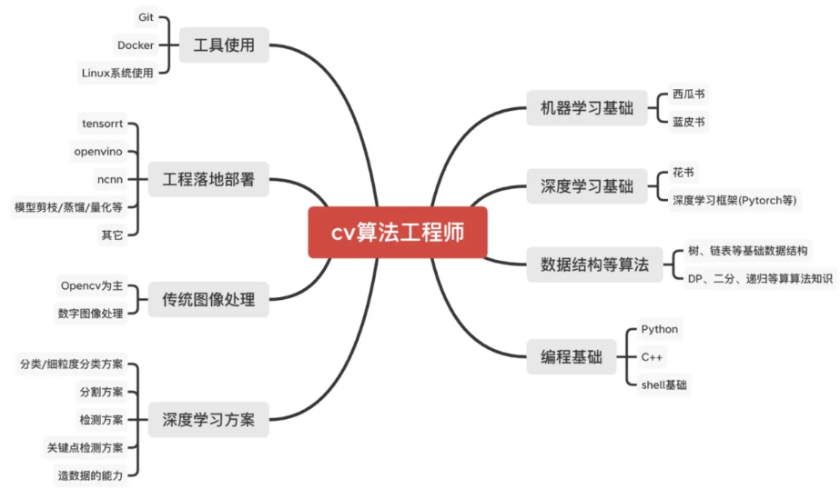
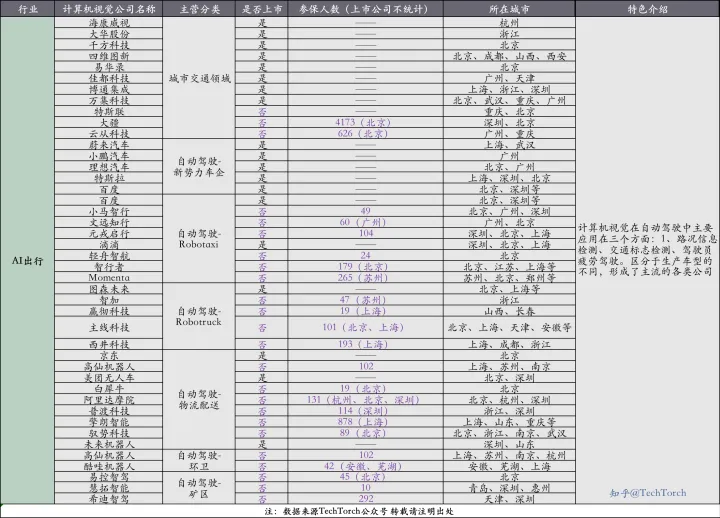
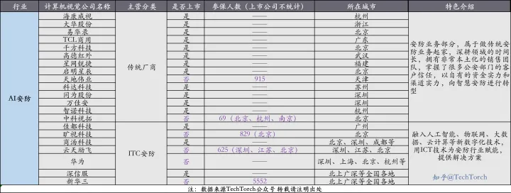

### [应届计算机视觉工程师求职总结:-P](https://zhuanlan.zhihu.com/p/343155358)

### [史上最全计算机视觉和机器学习面试经验分享，持续更新](https://zhuanlan.zhihu.com/p/136730119)

### [大厂必考深度学习算法面试题(一)-云社区-华为云](https://bbs.huaweicloud.com/blogs/391220)
嵌入式视觉 发表于 2023/02/06 14:28:46
非常详细，而且多。

### [GitHub《百面计算机视觉第三版》](https://github.com/zonechen1994/CV_Interview)

- **[深度学习基础面试题](https://github.com/zonechen1994/CV_Interview/blob/main/%E9%80%9A%E7%94%A8%E8%AE%A1%E7%AE%97%E6%9C%BA%E8%A7%86%E8%A7%89%E7%AE%97%E6%B3%95%E9%9D%A2%E7%BB%8F/%E6%B7%B1%E5%BA%A6%E5%AD%A6%E4%B9%A0%E5%9F%BA%E7%A1%80%E9%9D%A2%E8%AF%95%E9%A2%98/readme.md)**
- **[机器学习高频面试题](https://github.com/zonechen1994/CV_Interview/blob/main/%E9%80%9A%E7%94%A8%E8%AE%A1%E7%AE%97%E6%9C%BA%E8%A7%86%E8%A7%89%E7%AE%97%E6%B3%95%E9%9D%A2%E7%BB%8F/%E6%9C%BA%E5%99%A8%E5%AD%A6%E4%B9%A0%E9%9D%A2%E8%AF%95%E9%A2%98/readme.md)**
- **[传统CV (Opencv面试题)](https://github.com/zonechen1994/CV_Interview/blob/main/%E9%80%9A%E7%94%A8%E8%AE%A1%E7%AE%97%E6%9C%BA%E8%A7%86%E8%A7%89%E7%AE%97%E6%B3%95%E9%9D%A2%E7%BB%8F/%E4%BC%A0%E7%BB%9Fcv%E9%9D%A2%E8%AF%95%E9%A2%98/readme.md)**
- **[目标检测（Yolo系列等）](https://github.com/zonechen1994/CV_Interview/tree/main/%E9%80%9A%E7%94%A8%E8%AE%A1%E7%AE%97%E6%9C%BA%E8%A7%86%E8%A7%89%E7%AE%97%E6%B3%95%E9%9D%A2%E7%BB%8F/%E7%9B%AE%E6%A0%87%E6%A3%80%E6%B5%8B%E9%9D%A2%E8%AF%95%E9%A2%98)**
- **[图像分类（通用网络与小型网络等）](https://github.com/zonechen1994/CV_Interview/blob/main/%E9%80%9A%E7%94%A8%E8%AE%A1%E7%AE%97%E6%9C%BA%E8%A7%86%E8%A7%89%E7%AE%97%E6%B3%95%E9%9D%A2%E7%BB%8F/%E5%9B%BE%E5%83%8F%E5%88%86%E7%B1%BB%E9%9D%A2%E8%AF%95%E9%A2%98/readme.md)**
- **[图像分割面试题](https://github.com/zonechen1994/CV_Interview/blob/main/(./%E9%80%9A%E7%94%A8%E8%AE%A1%E7%AE%97%E6%9C%BA%E8%A7%86%E8%A7%89%E7%AE%97%E6%B3%95%E9%9D%A2%E7%BB%8F/%E5%9B%BE%E5%83%8F%E5%88%86%E5%89%B2%E9%9D%A2%E8%AF%95%E9%A2%98/readme.md))**
- **[Transformer相关的面试题](https://github.com/zonechen1994/CV_Interview/blob/main/%E9%80%9A%E7%94%A8%E8%AE%A1%E7%AE%97%E6%9C%BA%E8%A7%86%E8%A7%89%E7%AE%97%E6%B3%95%E9%9D%A2%E7%BB%8F/Transformer%E9%9D%A2%E8%AF%95%E9%A2%98/readme.md)**
- **[落地工程化等工作（量化/蒸馏）](https://github.com/zonechen1994/CV_Interview/blob/main/%E9%80%9A%E7%94%A8%E8%AE%A1%E7%AE%97%E6%9C%BA%E8%A7%86%E8%A7%89%E7%AE%97%E6%B3%95%E9%9D%A2%E7%BB%8F/%E8%90%BD%E5%9C%B0%E9%9D%A2%E8%AF%95%E9%A2%98(%E9%87%8F%E5%8C%96%E8%92%B8%E9%A6%8F%E7%AD%89)/readme.md)**
- **[C++面经](https://github.com/zonechen1994/CV_Interview/blob/main/%E9%80%9A%E7%94%A8%E8%AE%A1%E7%AE%97%E6%9C%BA%E8%A7%86%E8%A7%89%E7%AE%97%E6%B3%95%E9%9D%A2%E7%BB%8F/C++%E4%B8%8E%E6%93%8D%E4%BD%9C%E7%B3%BB%E7%BB%9F%E7%AD%89%E9%9D%A2%E8%AF%95%E9%A2%98/C++%E9%9D%A2%E7%BB%8F%E9%A2%98/readme.md)**
- **[操作系统](https://github.com/zonechen1994/CV_Interview/blob/main/%E9%80%9A%E7%94%A8%E8%AE%A1%E7%AE%97%E6%9C%BA%E8%A7%86%E8%A7%89%E7%AE%97%E6%B3%95%E9%9D%A2%E7%BB%8F/C++%E4%B8%8E%E6%93%8D%E4%BD%9C%E7%B3%BB%E7%BB%9F%E7%AD%89%E9%9D%A2%E8%AF%95%E9%A2%98/%E6%93%8D%E4%BD%9C%E7%B3%BB%E7%BB%9F/readme.md)**
- **[Python面经](https://github.com/zonechen1994/CV_Interview/blob/main/%E9%80%9A%E7%94%A8%E8%AE%A1%E7%AE%97%E6%9C%BA%E8%A7%86%E8%A7%89%E7%AE%97%E6%B3%95%E9%9D%A2%E7%BB%8F/Python%E9%9D%A2%E8%AF%95%E9%A2%98/readme.md)**

[注：如何更好地看面经？](https://github.com/zonechen1994/CV_Interview#%E6%B3%A8%E5%A6%82%E4%BD%95%E6%9B%B4%E5%A5%BD%E5%9C%B0%E7%9C%8B%E9%9D%A2%E7%BB%8F)
- **因为面试题里有很多markdown的公式，建议下载在本地使用vscode/typora观看，每天可以pull一下拉取最新的仓库哦！**
    
- 也可以采用Chrome浏览器，再添加[GitHub with MathJax](https://chrome.google.com/webstore/detail/github-with-mathjax/ioemnmodlmafdkllaclgeombjnmnbima/related)拓展程序。**但是，同样有很多公式，无法兼容！**

### [计算机视觉汇总面经分享(面试突击必看）](https://www.cnblogs.com/ziytong/p/12839714.html)

第三次复习整理高频笔试题（大部分都是手撕到的，括号是次数）
- 链表
    (1) 链表反转（3）
    (2) 有序链表合并（2）
- a+b+c = 0 （2)
- lru置换算法（1）
- 排序
    (1) 桶排序和计数排序（2）:字符串排序，含有大小写字母的，小写在前，大写在后
    (2) 快速排序（1）
    (3) 堆排序(2）
- 矩阵中从左上角到有下角的和的最小(大)值dp (3)
- 二分法(3): 递归和非递归版
- 连通域（2）
- 图算法
    (1)最短路径算法(2)
    (2)判断线段经过了多少个矩阵（滴滴）
- 中值滤波器(1)
- kmeans算法(1)：这个算法真的很重要，头条喜欢考
- topK问题(很多次>5)
- 2个人轮流拿石子，每个人能拿一到两个石子，然后先拿的人有没有必胜策略(1)
- 求二值矩阵中最大的面积(>2)
- BFS和DFS（>2)
- 找一个数组中4个和最大的数，但和不大于M（1）
- 树的前中后遍历(>2)
- 一个是判断是否完全二叉树(1)
- 一个是判断是否满二叉树(1)
- 还有就是leetcode上的题目记不住了
- 字符串处理的常见题目

### [深度学习CV方向高频算法面试题6道|含解析 - 知乎](https://zhuanlan.zhihu.com/p/595405763?utm_id=0)

1、CNN中池化的作用？
池化层的作用是对感受域内的特征进行选择，提取区域内最具代表性的特征，能够有效地减少输出特征数量，进而减少模型参数量。按操作类型通常分为最大池化(Max Pooling)、平均池化(Average Pooling)和求和池化(Sum Pooling)，它们分别提取感受域内最大、平均与总和的特征值作为输出，最常用的是最大池化和平均池化。

2、BN层训练和测试的不同。
在训练阶段，BN层是对每一批的训练数据进行标准化，即用每一批数据的均值和方差。（每一批数据的方差和标准差不同）；

而在测试阶段，我们一般只输入一个测试样本，并没有batch的概念。因此这个时候用的均值和方差是整个数据集训练后的均值和方差，可以通过滑动平均法

3、One-stage目标检测与Two-stage目标检测的区别？
Two-stage目标检测算法：先进行区域生成（region proposal，RP）（一个有可能包含待检物体的预选框），再通过卷积神经网络进行样本分类。其精度较高，速度较慢。

主要逻辑：特征提取—>生成RP—>分类/定位回归。

常见的Two-stage目标检测算法有：Faster R-CNN系列和R-FCN等。

One-stage目标检测算法：不用RP，直接在网络中提取特征来预测物体分类和位置。其速度较快，精度比起Two-stage算法稍低。

主要逻辑：特征提取—>分类/定位回归。

常见的One-stage目标检测算法有：YOLO系列、SSD和RetinaNet等。

4、FP32，FP16以及Int8的区别？
常规精度一般使用FP32（32位浮点，单精度）占用4个字节，共32位；低精度则使用FP16（半精度浮点）占用2个字节，共16位，INT8（8位的定点整数）八位整型，占用1个字节等。

混合精度（Mixed precision）指使用FP32和FP16。 使用FP16 可以减少模型一半内存，但有些参数必须采用FP32才能保持模型性能。

虽然INT8精度低，但是数据量小、能耗低，计算速度相对更快，更符合端侧运算的特点。

不同精度进行量化的归程中，量化误差不可避免。

在模型训练阶段，梯度的更新往往是很微小的，需要相对较高的精度，一般要用到FP32以上。在inference的阶段，精度要求没有那么高，一般F16或者INT8就足够了，精度影响不会很大。同时低精度的模型占用空间更小了，有利于部署在端侧设备中。

5、卷积有哪些主要的特点？
局部连接。比起全连接，局部连接会大大减少网络的参数。在二维图像中，局部像素的关联性很强，设计局部连接保证了卷积网络对图像局部特征的强响应能力。

权值共享。参数共享也能减少整体参数量，增强了网络训练的效率。一个卷积核的参数权重被整张图片共享，不会因为图像内位置的不同而改变卷积核内的参数权重。

下采样。下采样能逐渐降低图像分辨率，实现了数据的降维，并使浅层的局部特征组合成为深层的特征。下采样还能使计算资源耗费变少，加速模型训练，也能有效控制过拟合。

6、说下感受野的作用及增大感受野的方法。
目标检测和目标跟踪很多模型都会用到RPN层，anchor是RPN层的基础，而感受野（receptive field，RF）是anchor的基础。

感受野的作用：
一般来说感受野越大越好，比如分类任务中最后卷积层的感受野要大于输入图像。
感受野足够大时，被忽略的信息就较少。
目标检测任务中设置anchor要对齐感受野，anchor太大或者偏离感受野会对性能产生一定的影响。
增大感受野的方法：使用空洞卷积；使用池化层；增大卷积核。

### [深度学习算法工程师面经(微软、阿里、商汤、旷视、滴滴、华为、海康、平安、陌陌、第四范式等offer)之上篇 - 知乎](https://zhuanlan.zhihu.com/p/148246487?utm_campaign=&utm_medium=social&utm_oi=752203659609124864&utm_psn=1681418911046926336&utm_source=qq)

[come](https://www.zhihu.com/people/2ebb991d2941fb01ae7b910a920b3e36)
是要手写vgg网络吗？
2020-07-29

[枫桦](https://www.zhihu.com/people/88bc06da07375c9678bbc8449291b468)
用框架，比如torch、tf
2020-07-29

### 市场

#### [方向大部分都跟无人车3D重建或者VR方向渲染](https://www.zhihu.com/question/293700785/answer/710526989)
[石兰](https://www.zhihu.com/people/9da8a74a37ee4478cefd4b09352c7c40)
作者你好，我是今年刚毕业CV方向的硕士。做了很多目标检测视频分析的work。但是感觉招人的方向大部分都跟无人车3D重建或者VR方向渲染的多一些。我投了很多简历也没人要啊
2019-07-12
#### [2022年90余家计算机视觉（CV）公司的行业汇总](https://www.zhihu.com/tardis/zm/art/454546147?source_id=1005)

#### [做创新算法或底层加速部署](https://www.zhihu.com/question/383486199/answer/1606619221)

1,844 人赞同了该回答

从一个cv内卷失败者的角度来聊一下。cv难的地方主要包含创新算法，模型底层加速和部署。前者就是各种大佬，既能够提出好的idea，又能够解决实现idea的各种问题，刚开始idea不一定work需要不断调整，另外很多东西没有现成的轮子需要自己实现。因此理论能力和工程能力都要具备。后者一般来说c++要够熟练，工程能力尤其是解决bug的能力要强，有些时候还要自己从底层写op，需要熟悉不同平台的指令优化等，这个过程同样需要强的理论功底来加快运算速度。这两方面的大佬真正的核心竞争力就是理论功底加工程能力，只不过不大重叠，不可替代性强。

我之前在实验室基本都是从github上扒模型，调整数据格式，训练一下然后用flask+gunicorn部署一下，可以说就是流水线式的工作，核心难点一个都解决不了。别说自己写很复杂的模型了，就是拿着一篇没有开源的论文我都复现不出来，很多自定义的op要写前传反传，其中的数学原理根本搞不明白。底层部署就更难了，移动端部署还要了解ios和android，有些模型还需要自己用c++把numpy的前处理和后处理代码转成C++，真是python一行，C++几十行。在美团实习才第一次接触了C++ tensorflow在tx2上面推断和处理视频流等。

秋招投的大厂可以说全军覆没，只有拿了某某的客户端开发岗，惨的一匹，怪自己太迟钝，暑期实习不顺的时候就应该果断换方向。

我最后去了一家国企搞图像算法这块，但是看着大家github+flask的标准流水线和丑陋原始卡顿的demo，我知道这种不上不下的工作不可能构成核心竞争力，这种产品不会有智障愿意花钱买的（也就糊弄糊弄领导，看着高大上，但其实就是工业垃圾），干十年和应届生不会有多大差别，反正都是底层的搞不了，上层的算法提不出来。

我建议要是有足够的理论基础和人脉成为算法大佬就努力成为算法大佬。否则，就全力去搞底层的东西，努力去学习模型部署加速这块，成为一个合格的算法工程师而不是算法搬运师。另外，普通人建议出去实习尤其是去那种真正面向实际应用的组实习。
[编辑于 2020-12-02 12:46](https://www.zhihu.com/question/383486199/answer/1606619221)

##### github+flask
[小宁子](https://www.zhihu.com/people/af3440232ca5f97e6301edbc377b63d5)
我现在就是,就是糊弄人,前一家公司大牛带我是让我去做底层,可惜疫情公司撑不下去了,然后换到现在的公司就是github+flask
2020-12-02

##### 蒸馏，剪枝，量化 tensorrt，onnx，tflite
[永和九年丶](https://www.zhihu.com/people/926ca20096f618dfedaa99eb23f719bd)
楼主已经要转行了嘛？我明年六月毕业。今年六月到九月底一直在实习，做的就是模型优化，用了蒸馏，剪枝，量化啥（之前在校期间做图像分割）的，效果不好，就动用三方了。也是tensorrt，onnx，tflite等。一步一个脚印，艰难的很。九月底回学校准备秋招，算是很晚了吧。身边室友，找开发很多都进了大厂，羡慕死了。而且现在面了一些算法，还是感觉太难了。本来一直想着不转行，就搞CV。但是你这么说，感觉往后的路更难走呀、、、
2020-12-14

##### 机载端的实时目标检测和目标跟踪 搬运调试+没啥头脑的训练
[qsc](https://www.zhihu.com/people/53233a0a06f94aaace4930585a72f32e)
有点扎心嗷… 我是今年年初因为公司有需求开始转做cv，因为得部署到机载嵌入式端，所以考虑的学习的都是一些可以realtime的小模型。扒拉下来模型看看论文，然后动动这动动那，最多替换下网络结构，改改head改改neck，从来没自己整过一个完整的framework… 学习路径也比较零散，看了cs231n，草草看了一下李沐的书就开始整了哈哈哈…目前在嵌入式端部署了几个检测和跟踪模型，初探了一下怎么动onnx的图和怎么在trt里自定义op… 算是做到了机载端的实时目标检测和目标跟踪吧… 哎真的一言难尽啊这种感觉，就是你说的搬运调试+没啥头脑的训练，然后部署+python翻译成c++… 毫无核心竞争力
2020-12-04

##### 突击学了CUDA 美团机器学习引擎开发
[Surralyn](https://www.zhihu.com/people/d4612661d3de6c5b73431c681d6abd89)
我跟答主经历比较像也是之前找CV的竞争不过，后来意识到问题，7月份的时候果断转方向突击学了CUDA，现在去了美团机器学习引擎开发
2021-02-25

##### 盈利模式也是迷幻的一笔 有人愿意买纯算法
[编辑于 2021-02-18 10:29](https://www.zhihu.com/question/383486199/answer/1668071996)
就比如问题的目标检测，新出了篇xx paper，试验效果不错啊，就是用到了xxx op，应该很好搞
吧。然后等部署的时候直接火葬场，顺便性能还贼差。。最后跑来跑去的算法就是些大路货，烂的不能再烂的那种，顺便加些自己的黑魔法。。

盈利模式也是迷幻的一笔。。我很难想象现在还有人愿意买纯算法，都自己有数据了随便搞两个模型试试就能过得去了，搞来搞去发现数据才是最重要的。。大华海康这种都是带着设备卖可能还好点吧。。

实际场景太复杂了，而且客户不会因为你准确率高就觉得你好，但是错了就很不能原谅。。

[mll](https://www.zhihu.com/people/52077cafe1259d277f5c9cd7d3239b44)
anchor是基于kmeans聚类算出来的先验框，不至于这都不知道吧
2021-01-10

[哈维](https://www.zhihu.com/people/2f7d9da34c07c5fc394fac2a0e376611)
[大白杨](https://www.zhihu.com/people/590c8f882023ac888ccd808d4b23de17)
v4作者直接给了怎么算，就是用kmeans，根据图像的尺寸，以及每个格点anchor的个数，回归出结果，但其实实际使用的过程中，我感觉，直接回归出的结果，有时候效果并不好
2021-02-01

[mll](https://www.zhihu.com/people/52077cafe1259d277f5c9cd7d3239b44) [大白杨](https://www.zhihu.com/people/590c8f882023ac888ccd808d4b23de17)
yolov3也用了，v4和v3差别不是很大
2021-01-12

[kobe4879](https://www.zhihu.com/people/bfff34508e64d9c225e4f0cb5d26f0aa)
做了半天发现，堆数据是第一生产力
2021-01-13

###### 医学影像处理 要求高，图像质量差
[lailinbin](https://www.zhihu.com/people/bc2b01e21c0f9db6ba1ff2b2cdafbc91)
我现在刚入坑医学影像处理，经常和医生沟通。可以说医生提出实际问题，我根据问题想个方案然后当个调参侠就可以让医生觉得现在AI都这么牛逼了吗？但是实际问题是不可能使用AI的，毕竟责任谁承担就是一个大问题。而且医学影像相比于其他应用场景要求更高，图像质量也较差。总的来说这个方向搞研究发论文可以，实际应用目前来看遥不可及
2021-02-03

[lailinbin](https://www.zhihu.com/people/bc2b01e21c0f9db6ba1ff2b2cdafbc91) [知乎用户787dvG](https://www.zhihu.com/people/9b6c965666d14ff0f149bd2d0eb7268f)
医学图像处理你用传统算法也是差不多的，人可以有错，算法需要保证百分百正确才有落地的可能。效果太好医生会觉得你抢他们饭碗不同意配合，效果太差根本无法落地
2021-02-06

##### [卷的是挤在中间“github + 改模块 + 刷分”](https://www.zhihu.com/question/383486199/answer/1666825224)
CV人才呈纺锤形分布。如果深入底层，能有效解决实际问题，或者站在高层，对全局行业生态有深刻理解，其实并没有多卷。卷的是挤在中间“github + 改模块 + 刷分”这条生产线上的朋友。
 
在深度学习的时代以前，关于CV的学习曲线是近似线性的。一个成熟的从业者需要系统的学习图像处理，摄像机几何，概率图模型，支持向量机等知识，文章的代码也是从C/C++底层开始实现，最后用Matlab或者直接bash script做封装。因此一篇paper的周期一般很长。而进入深度学习时代以后，CV的学习曲线变成S型。TF，pytorch等库的出现让CV这个行业对初学者非常友好，大大降低了入门门槛。加上各种公开的数据集和代码统一化，也让paper的更新周期大大缩短。这对于科研其实是件好事，但是这容易给人造成一种错觉，就是只要短期内分数上去了就可以发顶会，有了顶会就有高薪，学生好找工作，老师好拿funding。在这种思潮的影响下，以体力为主的paper生产线就形成了，新人从业者的知识体系往往就局限于某几种模块和架构，研究的目的就变成了涨几个百分点。然而过了新手期，学习曲线骤然变陡，因为不管往高层走还是往底层走，那些曾经被忽略的知识是怎么也绕不开的。

这条paper的生产线，可能对于个人是好的，但对于行业是坏的，因为大家全都卷在一起刷分涨点，并没有多少人在乎这些知识能不能落地。所以现在的副作用大家都看到了，顶会论文越来越多，含金量越来越少，应用领域持续性烧钱但缺少质的突破。如果CV作为一个不能被应用的应用学科，自然就是死路一条。

其实改变已经在悄然发生了。作为行业风向标的顶会文章，其实一直在透露一个信息，单纯刷分涨点的文章已经很难被录。Reviewer们在期待state-of-the-art performance的同时，更关注的是背后的为什么。大佬们新的 idea 更多的是围绕实际应用的痛点。在某个具体场景下全方位的解决方案越来越受欢迎等等。这些问题，才是CV原本关注的问题，才是急需要人才来解决的问题。CV不是凉了，而是应该要回归它原本就该有的热度。

[编辑于 2021-01-08 15:37](//www.zhihu.com/question/383486199/answer/1666825224)

#### [我们组从18年开始就禁止碰detection和segmentation](https://www.zhihu.com/question/383486199/answer/1765031026)
灰烬之灵
我们组从18年开始就禁止碰detection和segmentation了，全力转向Robotics，虽然有点阵痛（顶会数量明显变少），但未来应该还不错。cv迷茫的人建议多看看FeiFei这些大佬们在做些什么，别人前面引路你跟着后面喝汤，也不至于饿死

[白大将军](https://www.zhihu.com/people/d5cb5db261ab7410552cc6c6ccdccc8e)
摸着鹰酱过河
2021-03-27

