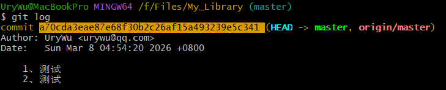

# master是近端 origin/master是远端

UryWu@MacBookPro MINGW64 /f/Files/My_Library (master)
$ git log
commit a70cda3eae87e68f30b2c26af15a493239e5c341 (HEAD -> master, origin/master)

这里master是远端还是origin/master是远端？




在 **Git** 里：

```
commit a70cda3eae87e68f30b2c26af15a493239e5c341 (HEAD -> master, origin/master)
```

含义其实是这样的：

| 标记             | 含义                                                 |
| ---------------- | ---------------------------------------------------- |
| `HEAD -> master` | 当前检出的本地分支                                   |
| `master`         | **本地分支**                                         |
| `origin/master`  | **远程分支的本地跟踪引用（remote-tracking branch）** |

所以：

- **`master` = 本地分支**
- **`origin/master` = 远程仓库 `origin` 的 `master` 分支的本地镜像**

但要注意一个细节：

> `origin/master` **不是远程服务器本身，而是本地记录的远程状态。**

------

## 图解

大致结构：

```
远程仓库
origin/master
      ↑
      │ (git fetch / git pull 更新)
      │
本地 remote-tracking
origin/master
      ↑
      │
本地分支
master ← HEAD
```

------

## 为什么现在两者在同一 commit

因为你看到：

```
(HEAD -> master, origin/master)
```

说明：

```
master == origin/master
```

也就是：

- 本地没有新 commit
- 远程也没有新 commit
- **完全同步**

------

## 如果不同步会是什么样

例如：

### 本地领先远程

```
(HEAD -> master)
```

你会看到：

```
Your branch is ahead of 'origin/master' by 1 commit
```

------

### 远程领先本地

```
(origin/master)
```

执行 `git status` 会提示：

```
Your branch is behind 'origin/master'
```

------

## 常用查看命令

查看远程分支：

```bash
git branch -r
```

结果：

```
origin/master
origin/main
```

查看所有分支：

```bash
git branch -a
```

------

✅ **一句话记忆**

```
master         = 本地分支
origin/master  = 远程分支的本地跟踪引用
origin         = 远程仓库名
```

------

💡 一个很多人第一次学 Git 才知道的关键概念：

> **Git 其实有 4 层分支状态**（远程 / 远程跟踪 / 本地 / HEAD）。

如果你愿意，我可以画一张 **Git 分支结构图（非常清晰，一次彻底理解 fetch / pull / push）**。


# git diff origin/master master输出详解

你这段 `git diff origin/master master` 的输出，其实是 **Git 的统一 diff（unified diff）格式**。我们逐行拆开解释，每一行都讲清楚它的含义。

------

## 一、你执行的命令

```
git diff origin/master master
```

含义是：

**比较两个提交（或分支）**

```
旧版本: origin/master
新版本: master
```

所以：

- `origin/master` = 基准版本（old）
- `master` = 对比版本（new）

**diff 显示的是：如何从 origin/master 变成 master。**

这点非常重要。

------

## 二、第一行

```
diff --git a/temp2.txt b/temp2.txt
```

含义：

```
比较 git 仓库中的文件
a/temp2.txt
b/temp2.txt
```

这里：

| 前缀 | 含义     |
| ---- | -------- |
| a/   | old 版本 |
| b/   | new 版本 |

注意：

**a 和 b 只是 diff 的约定名称**

不是实际路径。

所以这行意思是：

```
比较 temp2.txt 这个文件
旧版本 vs 新版本
```

------

## 三、第二行

```
index 274c005..3d7c0eb 100644
```

含义是：

```
旧文件blob哈希..新文件blob哈希 文件权限
```

拆开：

```
274c005
```

旧版本文件内容的 **blob hash**

```
3d7c0eb
```

新版本文件内容的 **blob hash**

Git 用 blob 对象存文件内容。

所以这里表示：

```
旧文件内容hash = 274c005
新文件内容hash = 3d7c0eb
```

最后：

```
100644
```

表示文件权限：

| 权限   | 含义       |
| ------ | ---------- |
| 100644 | 普通文件   |
| 100755 | 可执行文件 |
| 120000 | 符号链接   |

------


[操作系统实训指导：](F:\Files\操作系统\操作系统实训指导书_2014a版.pdf)

(9) chmod 命令：设置文件访问权限

​	每个文件和目录都有访问许可权限。这些权限分为只读(r)，可写(w)，可执行(x)三种。 这些权限赋予三种不同类型的用户，文件所有者(u),同组用户(g)，其他用户(o)。

​	如图 1.4 所示：

r w x 		   r - x 			r - - 

文件所有者权限  同组用户权限 	 其他用户权限

 	图 1.4 文件访问权限示意图


先用 ls –l 查看一下文件的访问权限。例如： 

-rw-r—-r-- 1 root root 483997 Jul 15 17:31 sobsrc.tgz 

这里，第一个“-”表示普通文，接下来的 rw-r--r--为文件访问权。这些权限也可以用八 进制表示为 644。其中八进制 6 的二进制位为 110,位为 0 代表无相应权限。所以 110 表示 rw-。余类推。

练习：

chmod 777 /home/newpwd 权限为所有用户都可读可写可执行 

chmod u-w /home/newpwd 解除所有者写权力(u 表示所有者，-为解除，w 为写权) 

chmod u+wx /home/newpwd 赋予所有者写文件和执行文件的权力 chmod g-x /home/newpwd 解除同组用户执行权 

注意：如果需要特权，就在命令前面加 sudo


## 四、第三行

```
--- a/temp2.txt
```

含义：

```
旧文件路径
```

`---` 表示 **旧版本**

`a/` 表示 old side

所以：

```
旧版本文件：temp2.txt
```

------

## 五、第四行

```
+++ b/temp2.txt
```

含义：

```
新文件路径
```

`+++` 表示 **新版本**

`b/` 表示 new side

所以：

```
新版本文件：temp2.txt
```

------

## 六、核心部分（hunk）

```
@@ -1 +1,2 @@
```

这一行叫：

**hunk header（差异块头）**

格式：

```
@@ -oldStart,oldCount +newStart,newCount @@
```

解释：

| 部分 | 含义              |
| ---- | ----------------- |
| -1   | 旧文件从第1行开始 |
| +1   | 新文件从第1行开始 |
| +1,2 | 新文件有2行       |

完整解释：

```
旧文件：
从第1行开始
共1行

新文件：
从第1行开始
共2行
```

所以：

```
old: 1 line
new: 2 lines
```

------

## 七、具体差异

```
-1234
```

`-` 表示：

```
旧版本有
新版本删除
```

意思：

```
origin/master 中有一行

1234
```

但这行 **在 diff 中被删除**。

------

## 八、这一行

```
\ No newline at end of file
```

意思：

```
文件最后没有换行符
```

例如：

正确文本文件通常是：

```
1234\n
```

但你的文件是：

```
1234
```

没有换行。

Git 会提示：

```
No newline at end of file
```

这是 **文本规范提醒**。

------

## 九、新版本内容

```
+1234
```

`+` 表示：

```
新版本新增
```

意思：

```
master 分支里新增了一行

1234
```

注意：

这里其实是：

```
旧的 1234 被删
新的 1234 被加
```

因为 **换行符变化**。

------

## 十、新增一行

```
+12345
```

表示：

```
新版本多了一行

12345
```

------

## 十一、最后一行

```
\ No newline at end of file
```

还是同样意思：

```
文件末尾没有换行
```

------

## 十二、把整个 diff 翻译成人话

旧版本 (`origin/master`) 文件：

```
1234
```

（没有换行）

新版本 (`master`) 文件：

```
1234
12345
```

（也没有换行）

变化是：

```
+ 新增一行 12345
```