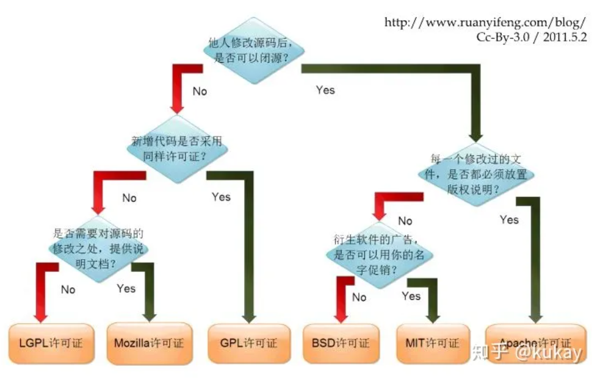

# Git vs SVN 与开源协议

> 来源：合并自 [blogs/git_blogs/Git.md](Git.md) 与 [blogs/git_blogs/git_study.md](git_study.md) 的「git 还是 svn」+「gitee vs github」+「SVN 使用教程」+「最近几年的国内开源软件侵权事件」+「一张图看懂开源协议的区别」+「互联网公司用 Git 还是 SVN 多」六节。

团队选 Git 还是 SVN？选 Gitee 还是 GitHub？开源协议怎么选？这一篇把"工具选型 + 协议"两块一次讲清。

---

## 目录

1. [Git vs SVN](#git-vs-svn)
2. [SVN 教程入门](#svn-教程入门)
3. [Gitee vs GitHub](#gitee-vs-github)
4. [互联网公司用 Git 还是 SVN 多？](#互联网公司用-git-还是-svn-多)
5. [开源协议速览](#开源协议速览)
6. [近年国内开源软件侵权事件](#近年国内开源软件侵权事件)

---

## Git vs SVN

### 业内观点

| 人 | 立场 | 时间 |
| :--- | :--- | :--- |
| [ma100](https://www.zhihu.com/people/ma100) | 有强力领导的用 git，真正分布式开发模块用 svn | 2014-09 |
| [leonWang](https://www.zhihu.com/people/leon2017) | 项目大的话 git，平常的 svn（svn 比 git 上手快），但越来越多企业从 svn 转 git | 2016-02 |

### SVN vs Git 的三大优势

[svn 和 git 相比的优点](https://www.zhihu.com/question/399890301/answer/1270678917)：

1. **svn 操作相对简单**
2. **svn 可以只操作某个文件或者某个文件夹**
3. **svn 管理二进制文件更方便**

svn 对非开发人员操作相当简单，尤其是 Windows 上用 TortoiseSVN 鼠标点点 checkout / update / commit 就完了。而很多开发人员对 git 的理解和使用是一团糟。

### 关键差异：权限控制

[SVN 能进行项目目录级别的读、写、访问权限控制，而 Git 做不到](https://www.zhihu.com/question/399890301/answer/1268640993)

权限控制，SVN 能进行项目目录级别的读、写、访问权限控制，而 Git 做不到（因为 Git 是针对开源项目开发的），所以 Git 通过**分支合并时的审查策略**来勉强绕过这问题。

### 关键差异：仓储大小

- SVN：代码全记录在服务器中
- Git：每份仓库 clone 都拥有代码的全记录

意味着对于 SVN，服务器的才是全的，你下载下来的可以小一点；而 Git 你下下来的和服务器上一样。

使用 SVN 会减少各开发机的物理空间占用。不过不一定会减少传输时间，因为 git 自带压缩传输，svn 没有。

### 反方观点：绝大部分公司没什么可保密的

> 除了 2014 年工作的第二家公司使用 SVN 之外，之后所有公司都用 Git。有人说 SVN 相比 Git 可以设置目录权限，但绝大部分公司不需要这个，没什么可保密的。

### 企业为什么用 Git 多？

[企业使用 git 多一些的原因](https://zhidao.baidu.com/question/1991938638077555307.html)（2018-04-09）：

- git 版本库占用空间小
- git 是分布式管理系统，完全可以不对代码进行备份
- git 不用时时联网查询
- 如果客户端离服务器端非常远，在网速糟糕的情况下，用 svn 下载代码速度远比不上 git

---

## SVN 教程入门

参考：[SVN 使用教程 - 快速上手（B 站）](https://www.bilibili.com/video/BV1k4411m7mP/)。更多文字版教程：<https://svnbucket.com/posts/>

### SVN 是什么？

- 代码版本管理工具
- 记住你每次的修改
- 查看所有的修改记录
- 恢复到任何历史版本
- 恢复已经删除的文件

### SVN 相比 Git 的优势

- 使用简单，上手快
- 目录级权限控制，企业安全必备
- 子目录 checkout，减少不必要的文件检出

### 主要应用

- 开发人员用来做代码的版本管理
- 用于存储一些重要的文件，比如合同
- 公司内部文件共享，并能按目录划分权限

### SVN 仓库

- 推荐：[svnbucket.com](https://svnbucket.com) — SVN 桶

### 安装 SVN 客户端

| 平台 | 客户端 |
| :--- | :--- |
| Windows | TortoiseSVN |
| Mac | Cornerstone |

---

## Gitee vs GitHub

参考：[gitee 和 github 比较](https://www.zhihu.com/question/384541326/answer/2456270379)（2022-04-25）

### 客观评价

对于 gitee 客观来说，充满了铜臭的味道。对于个人开源开发者，非常不友好：

- 总共 5G 的空间，所有项目加起来
- 共 5 个协作者（多个项目不同协作者的话，限制很多）
- 当前米国全力大打中国的情况下，gitee 并没有放开胳膊拥抱中国开发者
- 开源库的下载，一定要登录才能下载

### 相对优势

GitHub 相对开发者更友好，就是不限空间之前，也比 gitee 强很多。除了速度慢，各方面都比 gitee 强好多。

gitee 一开始格局就比 GitHub 小很多，开源之火还没有烧起来，就只想着赚钱。

---

## 互联网公司用 Git 还是 SVN 多？

知乎讨论：[互联网公司用 Git 还是 SVN 多呢？](https://www.zhihu.com/question/67044963)

主流趋势：越来越多公司从 SVN 迁移到 Git，分布式 + 离线 + 强分支模型更适合现代研发流程。

---

## 开源协议速览

参考：[一张图看懂开源协议的区别](https://zhuanlan.zhihu.com/p/272543821)

常见开源协议（按宽松度由强到弱）：

1. **MIT** — 几乎无限制，保留版权声明即可
2. **Apache 2.0** — MIT + 专利授权 + 商标限制
3. **BSD** — 类似 MIT，多一条"不能用作者名字背书"
4. **MPL** — 修改的文件必须开源，整套可以闭源
5. **LGPL** — 库本身要开源，调用方可以闭源
6. **GPL** — 衍生作品必须也用 GPL（即"传染性"）
7. **AGPL** — GPL + 网络服务也算分发

选协议前想清楚：是希望最大化传播（MIT/Apache）？还是希望衍生物也回馈开源（GPL）？

---

## 近年国内开源软件侵权事件

参考：[最近几年的国内开源软件侵权事件](https://blog.csdn.net/sunjing/article/details/4815685)

### 麒麟操作系统与 FreeBSD 代码事件

麒麟操作系统是由国防科技大学、中软公司、联想公司、浪潮集团和民族恒星公司合作研制的闭源服务器操作系统，是 863 计划重大攻关科研项目，目标是打破国外操作系统垄断，研发一套中国自主知识产权的服务器操作系统。

2006-04-27 网友 Dancefire 的技术分析文章指出，通过对麒麟操作系统进行反汇编，麒麟与美国开源代码 FreeBSD 5.3 版本相似度竟然在 **90% 以上**。更多证据指出麒麟仅是对 FreeBSD 进行了修改，根本不是"中国独立研发成功"和"拥有完全自主版权的内核"。

> 匿名用户 2010-01-09：freebsd 的协议好像是自由使用的，不要求公开源码，苹果 OS 也是基于 freebsd 内核做的界面，同样不公开源代码。如果麒麟真的是如文中所说那样，顶多只能算是抄袭，而不是侵权。

### 企业侵犯开源软件很危险

> 上面列出的三个事件只是冰山一角，企业主体都是大型软件公司，包括互联网 NO.1 的腾讯，还有国防科技大学。应该说对于软件的版权和知识产权都是相当的了解，还记得腾讯起诉珊瑚虫版 QQ 作者陈寿福吗？企业侵犯开源软件是相当危险的，采用 GPL 许可证的开源软件，在国际上有很多胜诉案例。

### 国际 GPL 胜诉案例

| 时间 | 案例 | 结果 |
| :--- | :--- | :--- |
| 2009-09-22 | 巴黎 AFPA 上诉法院裁决 EDU4 违反 GNU GPL | AFPA 胜诉 |
| 2007-02 | Skype 被起诉违反 GPLv2 | FSF 胜诉，Skype 撤回上诉 |
| 2006 | D-Link 德国分部违法 GPL | Harald Welte 起诉胜诉 |

---

> 写于 2026-07-07。