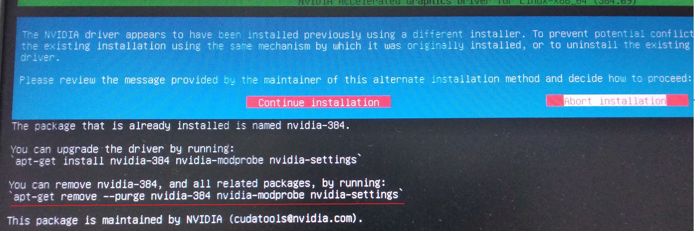

## 1 linux命令

更多内容参考：[操作系统实训指导书_2014a版->一Linu基本操作->6.常用命令](file:///F:\Files\操作系统\操作系统实训指导书_2014a版.pdf)

### 1.1 Ubuntu16.04

#### 1.1.1 cd

https://blog.csdn.net/l_liangkk/article/details/78729059

cd ..                  返回上一级目录

cd ../..               返回上两级目录

cd或cd /~           返回home目录

cd - 目录名       返回指定目录

#### 1.1.2 linux中不同颜色的文件代表不同类型

https://blog.csdn.net/qq_16605855/article/details/79316980

linux
文件颜色的含义，蓝色代表目录，绿色代表可执行文件，红色表示压缩文件，浅蓝色表示链接文件，灰色表示其他文件，红色闪烁表示链接的文件有问题了，黄色表示设备文件。
蓝色文件----------目。录/
白色文件----------一般性文件，如文本文件，配置文件，源码文件等。
浅蓝色文件----------链接文件，主要是使用ln命令建立的文件。
绿色文件----------可执行文件，可执行的程序。
红色文件----------压缩文件或者包文件。

#### 1.1.3 linux下用什么命令来运行可执行文件

很简单，直接执行，假设程序是xxx：
先授权可执行权限：chmod +x xxx
然后执行：./xxx (斜杠前面有个点)

#### 1.1.4 [ubuntu怎么进入GRUB菜单选择那里啊](http://bbs.51cto.com/thread-729783-1.html) 

<http://bbs.51cto.com/thread-729783-1.html>

#### 1.1.5 linux 重启

ctrl+alt+"."

这个点就是Del

#### 1.1.6 [touch 文件名（新建一个空文件）](https://blog.csdn.net/yexiangCSDN/article/details/80887944)

touch命令有两个功能：一是用于把已存在文件的时间标签更新为系统当前的时间（默认方式），它们的数据将原封不动地保留下来；二是用来创建新的空文件。

#### 1.1.7 ubuntu ping 命令

采用这个命令ping主机： ping -c 10 192.168.1.100
(10次)，不用过多解释吧

#### 1.1.8 看linux内核版本

uname --r

<https://www.cnblogs.com/tanrong/p/6937749.html>

#### 1.1.9 重启网络服务

sudo service network-manager restart

#### 1.1.10 profile、bashrc、~/.bash_profile、~/.bashrc、~/.bash_profile

Linux中profile、bashrc、~/.bash_profile、~/.bashrc、~/.bash_profile之间的区别和联系以及执行顺序

/etc/profile
此文件为系统的每个用户设置环境信息,当用户第一次登录时,该文件被执行.
并从/etc/profile.d目录的配置文件中搜集shell的设置.

===========

/etc/bashrc
为每一个运行bash shell的用户执行此文件.当bash
shell被打开时,该文件被读取.

===============

~/.bash_profile
每个用户都可使用该文件输入专用于自己使用的shell信息,当用户登录时,该
文件仅仅执行一次!默认情况下,他设置一些环境变量,执行用户的.bashrc文件.

=========

~/.bashrc
该文件包含专用于你的bash
shell的bash信息,当登录时以及每次打开新的shell时,该文件被读取.

==========

~/.profile
在Debian中使用.profile文件代 替.bash_profile文件
.profile(由Bourne Shell和Korn Shell使用)和.login(由C Shell使用)两个文件是.bash_profile的同义词，目的是为了兼容其它Shell。在Debian中使用.profile文件代
替.bash_profile文件。

==============

~/.bash_logout
当每次退出系统(退出bash shell)时,执行该文件.

#### 1.1.11 [终端字体放大](https://cloud.tencent.com/developer/article/1353921?from=15425)

Ctrl + Shift + 加号键（大键盘上的）== 》 终端字体变大
Ctrl + 减号键（大键盘上的）== 》 终端字体变小

#### 1.1.12 [重定向>和追加>>](https://blog.csdn.net/GoOnDrift/article/details/100524745)

\>
会重写文件，定向输出到文件，如果文件不存在，就创建文件；如果文件存在，就将其清空。（覆盖）

\>\>追加文件，这个是将输出内容追加到目标文件中。如果文件不存在，就创建文件。（追加）

#### 1.1.13 [Linux命令之查找文件locate](https://blog.csdn.net/cnds123321/article/details/122047043#%E4%BD%BF%E7%94%A8)
locate是用数据库中查找，更快。find是直接从硬盘中查找，慢一点。
但是在文件发生变动之后，最好在使用locate前用`updatedb`来更新下数据库。

#### 1.1.14 find

```shell
find .|grep xlog.cpp
```

`find .`，从当前目录开始查找。
`|`，pipe管道命令。
`grep xlog.cpp`，过滤出包含"xlog.cpp"的内容。


linux怎么查找这个文件的位置：~/.claude-code-router/config.json

```shell
find ~ -type f -name "config.json" | grep ".claude-code-router"
```

这会在主目录下递归查找叫 config.json 的文件，并筛选包含 .claude-code-router 的路径。

#### 1.1.15 locate

✅ 方法 3：用 `locate` 命令（比find更快，但需要安装并更新数据库）

##### 安装并初始化：

```shell
sudo apt update
sudo apt install mlocate
sudo updatedb
```

##### 然后查找：

linux怎么查找这个文件的位置：~/.claude-code-router/config.json

```shell
locate config.json | grep .claude-code-router
```

#### 1.1.16 ls

在 Linux / WSL 中，用 `ls` 查看文件大小可以通过加参数 `-lh` 来实现，具体如下：

------

##### ✅ 查看文件大小的命令：

```shell
ls -lh
```

- `-l`：使用长列表格式显示（包括权限、所有者、时间、大小等）
- `-h`：显示 **人类可读格式**，如 `K`, `M`, `G`，而不是纯字节数

------

##### 🔍 示例：

```shell
ls -lh somefile.txt
```

输出示例：

```shell
-rw-r--r-- 1 ury ury 5.3M Jul 10 10:28 somefile.txt
```

表示文件大小为 **5.3MB**。

#### 1.1.17 du

##### ✅ 如果你想列出当前目录下所有文件及大小：

```shell
ls -lh
```

或者递归子目录：

```shell
ls -lhR
```

------

##### 🚀 扩展：只看文件大小（用 `du` 更精准）

如果你只关心文件大小，也可以用：

```shell
du -h somefile.txt
```

或者列出目录下所有文件大小：

```shell
du -sh *
```

- `-s`：summary，总结（不递归）
- `-h`：human readable，易读单位

### 1.2 centos7

mv /boot/initramfs-/$(uname -r).img /boot/initramfs-/$(uname -r).img.bak

#### 查看发行版本

uname 输出当前操作系统类型，linux
uname -r在这里是输出centos的内核版本，这里/$()的作用就是把它输出的内容作为字符串，放进命令里用。

```bash
uname -r
```

output: 3.10.0-1160.119.1.el7.x86_64

#### 查看centos7还是8

```bash
cat /etc/centos-release
```

output: CentOS Linux release 7.9.2009 (Core)

## 2 配置环境时遇到的错误解决方法：

6\. 曾源远学长无法卸载显卡驱动的原因：

没有使用这个语句卸载：
apt-get remove /--purge nvidia-384 nvidia-modprobe nvidia-settings

这个语句我还是在用：
sudo /etc/init.d/lightdm stop
sudo ./NVIDIA-Linux-x86_64-375.20.run/--no-opengl-files
sudo /etc/init.d/lightdm start

（这几个语句参考网址：http://www.cnblogs.com/Qwells/p/6086773.html#undefined）

这个几个语句来安装显卡驱动时找到的，因为原来卸载不完全，那么再次安装它ubuntu会报错，我就是根据错误提示找到上面那个卸载语句的。



7.第二次我又装了显卡驱动，然后又进不去，又是循环登陆，还多了一个系统检测到错误窗口，然后我用了这个命令来卸载驱动：

1.卸载nvidia驱动

卸载NV驱动和安装一样，首先ctrl+Alt+F1进入命令行状态，然后停止lightdm
sudo service lightdm stop

或者
sudo /etc/init.d/lightdm stop

卸载命令位置/usr/bin/nvidia-uninstall，以下命令即可卸载。
sudo /usr/bin/nvidia-uninstall

参考网址：https://blog.csdn.net/ezhchai/article/details/80536949

## 3 [Linux文件目录结构一览表](http://c.biancheng.net/view/2833.html)

/usr/local/ 手工安装的软件保存位置。我们一般建议源码包软件安装在这个位置

## 4 以前的计划

1月17号:

1.  先使机器能在命令行下联网后再安装驱动。

> 太棒了，命令行下联网成功了：
>
> <https://blog.csdn.net/yanlutian/article/details/80862494>
>
> 但是驱动安装失败了，怎么安装卸载都是循环登陆的问题，而且进不了系统了，我只好重装ubuntu16.04系统，采用了方法：
>
> <https://blog.csdn.net/yhaolpz/article/details/71375762>
>
> 但是出现了kernel的错误。

1月18号

1.  先研究一下我的Tesla独立显卡，研究那几个保存的网站。

2.  研究一下这个：<https://www.aliyun.com/jiaocheng/1388456.html>

3.  因为CUDA里自带的nVidia显卡不匹配，可以回到原来的方法，重新去找nVidia的run显卡驱动，安装CUDA时则不要安装显卡驱动，当然17我一直在找run驱动，找不到，安装了官方的deb文件也没用。

> n.最后实在不行试一下这个方法：
>
> <https://my.oschina.net/kalnkaya/blog/1819681>
>
> 今天重装了三次系统，至今为之重装了6次系统。
>
> 今天，主要是研究T630机器本身的不兼容性，看了官网，T630没有完全兼容Ubuntu，
>
> <https://www.dell.com/support/home/cn/zh/cnbsd1/drivers/supportedos/poweredge-t630>
>
> 只有redhat6，7和一些windos
> service的系统。所以重装系统无法识别出独立显卡。
>
> 问了dell机箱工程师说是系统没有正确安装，看了看官方的安装步骤：
>
> <https://www.dell.com/support/article/cn/zh/cnbsd1/sln129177/%E5%A6%82%E4%BD%95%E5%9C%A8dell-poweredge%E6%9C%8D%E5%8A%A1%E5%99%A8%E4%B8%8A%E5%AE%89%E8%A3%85%E6%93%8D%E4%BD%9C%E7%B3%BB%E7%BB%9F-%E6%93%8D%E4%BD%9C%E7%B3%BB%E7%BB%9F%E9%83%A8%E7%BD%B2-?lang=zh>
>
> 如果用u盘安装的话要自己去下驱动程序，但是我看了看，没有ubuntu的驱动：
>
> <https://www.dell.com/support/home/cn/zh/cnbsd1/product-support/product/poweredge-t630/drivers>
>
> 只能安装CPU版的了，但是之前又出现不可调解的错误，唉/~
>
> 1月19日：
>
> <https://blog.csdn.net/pangyunsheng/article/details/79418896>
>
> 最后的尝试，如果不行就安装Redhat7

## 5 vim

### 5.1 [vim编辑器如何删除一行或者多行内容](https://zhuanlan.zhihu.com/p/358292858)
**第一种方式**

- 按一下ESC键，确保退出编辑模式
- 按两次键盘上面的g键，让光标移动到文本的首行
- 然后按键盘上面的d和G键。其中d键是小写，G键要切换成大写的。

这样就可以删除所有内容了。

**第二种方式**

- 按一下ESC键，确保退出编辑模式
- 按一下:冒号键，(shift + ;)就可以输入：冒号了。
- 然后输入1,$d

**第三种方式**
- 按一下ESC键，确保退出编辑模式
- 按一下:冒号键，shift + ; 就可以输入：冒号了。
- 然后输入%d。%表示文件中的所有行。

**删除多行**
- 将光标移动到需要删除的行
- 按一下ESC键，确保退出编辑模式
- 在dd[命令](https://link.zhihu.com/?target=https%3A//www.linuxcool.com/)前面加上要删除的行数。例如，如果要删除第4行以下的3行，请按下 3 dd

**删除给定范围的行**
**实例一**
如果你想要删除指定范围的行，比如从第3行到第5行，按ESC，然后输入下面的[命令](https://link.zhihu.com/?target=https%3A//www.linuxcool.com/)，然后回车。
```text
:3,5d
```

**实例三**
删除当前行之前的所有行
```text
:1,.-1d
```

**实例四**
删除当前行之后的所有行
```text
:.+1,$d
```

**通过条件匹配删除行**
**实例一**
删除包含text关键字的行
```text
:g/text/d
```

**实例二**
删除不包含#关键字的行
```text
:%g!/#/d
#或者
:v/#/d
```

**实例三**
删除以#开头的的注释内容。
```text
:g/^#/d
```

**实例四**
删除所有空行
```text
:g/^$/d
```


### 5.2 [vi-vim ：删除、撤销、恢复删除、复制删除](https://www.cnblogs.com/zknublx/p/8795789.html)
#### 5.2.1 删除命令

|vi命令|操作键|
|---|---|
|x|删除当前光标处的字符|
|X|删除光标左边的字符|
|D|删除从当前光标到本行末尾的字符|
|J|删除两行之间的换行符 (亦可用于合并两行）|
|dmove |删除从当前光标到move所给位置的字符|
|dd|删除当前行|
|ex命令||
|:lined|删除指定行|
|:line,lined|删除指定范围内的行|

#### 5.2.2 撤销或重复改变
vi命令：

1      u                        撤销上一命令对编辑缓冲区的修改

2      U                        恢复当前行（即一次撤销对当前行的全部操作）

3      .点号                    重复上一命令对编辑缓冲区的修改

### 5.3 Vim

#### 5.3.1 [复制一整行和复制多行](https://www.cnblogs.com/EasonJim/p/8320776.html)

1、复制
1）单行复制

在命令模式下，将光标移动到将要复制的行处，按"yy"进行复制；

> 2）多行复制
> 在命令模式下，将光标移动到将要复制的首行处，按"nyy"复制n行；其中n为1、2、3......

编辑模式---ESC--->命令模式

命令模式---ESC--->编辑模式

命令模式---Shift+"："--->末行模式

#### 5.3.2 [Vim几种跳转方式](https://blog.csdn.net/qq_42475711/article/details/99646284)

滚动半屏：向上滚动半屏ctrl + u，向下滚动半屏ctrl + d。

滚动一屏：向上滚动一屏ctrl + b，向下滚动一屏ctrl + f。

#### 5.3.3 [linux vim怎样不保存退出](https://www.php.cn/linux-434450.html)

vim不保存退出可以先按下ESC进入命令模式；然后输入:进入底行命令模式；最后输入q再回车即可。

更多Vim命令

进入编辑模式，按 o 进行编辑

编辑结束，按ESC 键 跳到命令模式，然后输入退出命令：

:w保存文件但不退出vi 编辑

:w! 强制保存，不退出vi 编辑

:w file将修改另存到file中，不退出vi 编辑

:wq保存文件并退出vi 编辑

:wq!强制保存文件并退出vi 编辑

q:不保存文件并退出vi 编辑

:q!不保存文件并强制退出vi 编辑

:e!放弃所有修改，从上次保存文件开始在编辑

### 5.4 [Linux vi编辑器使用](https://blog.csdn.net/qq_37868856/article/details/111410351)

一.命令行模式和编辑模式的切换
vi打开文本后，是命令行模式。
1.从命令行模式切换进入编辑模式，按【i】【a】【o】
【i】进入编辑模式，并从当前光标位置开始输入。
【a】进入编辑模式，并从当前光标的下一个位置开始输入。
【o】进入编辑模式，并另起一行从行首开始输入。
注意：编辑模式下不能进行删除操作，需要进入命令行模式。

2.删除操作
在编辑模式下按【ESC】进入命令行模式。
【x】删除光标后面的一个字符。
【X】删除光标前面的一个字符。
【dd】删除光标所在行。

3.退出、保存
需要按ESC先进入命令行模式然后按【：】输入命令。
【q！】强制退出、不保存已经编辑的内容。
【wq】退出并保存编辑的内容。

### 5.5 [Vim快速移动光标至行首和行尾](https://blog.csdn.net/varyall/article/details/79220745)

1.vi 编辑器中跳到文件的第一行：
　　 a  输入 :0 或者 :1   回车
　　 b  键盘按下 小写 gg
2.vi 编辑器跳到文件最后一行：
　　 a 输入 :$   回车
　　 b 键盘按下大写 G
　　 c 键盘按 shift + g    (其实和第二种方法一样)

Vim快速移动光标至行首和行尾
  1、 需要按行快速移动光标时，可以使用键盘上的编辑键Home，快速将光标移动至当前行的行首。除此之外，也可以在命令模式中使用快捷键"^"（即Shift+6）或0（数字0）。

  2、 如果要快速移动光标至当前行的行尾，可以使用编辑键End。也可以在命令模式中使用快捷键`$`（Shift+4）。与快捷键"^"和0不同，快捷键`$`前可以加上数字表示移动的行数。例如使用`1$`表示当前行的行尾，`2$`表示当前行的下一行的行尾。

### 5.6 安装带剪贴板的vim

```shell
sudo apt install vim-gtk3
```

#### 5.6.1 方法一：Vim 命令模式粘贴剪贴板

1. **按 `Esc`** 进入普通模式，记住这里不是命令/末行模式 shift+:
2. 输入以下命令粘贴：

```bash
"+p
```

说明：

- `"+` 表示系统剪贴板（和 Ctrl+C/Ctrl+V 通用）
- `p` 表示“put”（粘贴）

你也可以使用 `"*p` 粘贴“选择板”内容（苹果系统的程序复制行为会进入不同的寄存器）

------

#### 5.6.2 方法二：复制 Vim 中的内容到剪贴板

- 选中文本（按 `v` 进入可视模式）
- 移动光标选中文本
- 然后复制到剪贴板：

```bash
"+y
```

说明：

- `y` 表示“yank”（复制）
- `"+` 表示复制到系统剪贴板

#### 5.6.3 [批量复制](https://www.bilibili.com/video/BV1P741187Bh/)

怎样在vim中复制内容到系统剪贴板
按v进入visual模式
选取要复制的内容
直接连续输入 (不是在命令行模式中)"+y
复制所有内容命令是 gg"+yG
可以把编辑.vimrc把命令map到ctrl+c
如果用苹果的OS X系统命令为"*y

## 7 本机开启wsl

powershell或cmd中输入：

```powershell
wsl.exe -d Ubuntu
```

