## 1 ubuntu16.04LTS网络连接问题

### 1.1 [VMware虚拟机三种网络模式：桥接模式，NAT模式，仅主机模式](https://blog.csdn.net/qq_39192827/article/details/85872025)

1. 桥接：相当于把虚拟机当作局域网中一台独立的设备，局域网中的其它设备也能连接到。笔者一开始也是使用桥接的方式，但是后面出现问题似乎是和主机ip冲突导致主机不能上网。
2. 仅主机：就是只和主机单独通信，不用这个模式。
3. NAT：相当于在主机里建立一个虚拟路由器，虚拟机连接这个虚拟路由器。笔者用的是这个模式。

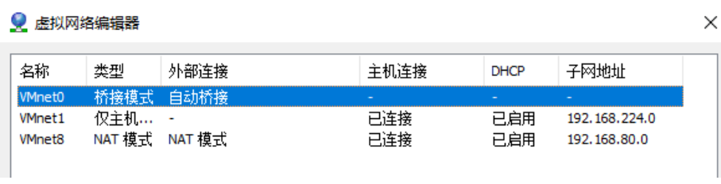

VMnet0：用于桥接模式下的虚拟交换机

VMnet1：用于仅主机模式下的虚拟交换机

VMnet8：用于NAT模式下的虚拟交换机

对应地，在Windows主机上对应虚拟了VMware Network Adapter VMnet1和VMware Network Adapter VMnet8两块虚拟网卡，至于为什么没有VMnot0的虚拟网卡，且看下文。 


怎么会迷上你
我在问自己
我什么都能放弃
居然今天难离去
你并不美丽
但是你可爱至极
哎呀灰姑娘
我的灰姑娘
我总在伤你的心
我总是很残忍
我让你别当真
因为我不敢相信
你如此美丽
而且你可爱至极
哎呀灰姑娘
我的灰姑娘
也许你不曾想到我的心会疼
如果这是梦
我愿长醉不愿醒
我曾经忍耐
我如此等待
也许在等你到来
也许在等你到来
也许在等你到来

### 1.2 桥接模式连接

我本地的ubuntu16.04LTS虚拟机桥接模式连互联网成功了，可以搭配clash的路由连接外网。

网卡和网关都不需要额外设置。


#### 1.2.1 虚拟机设置桥接模式：

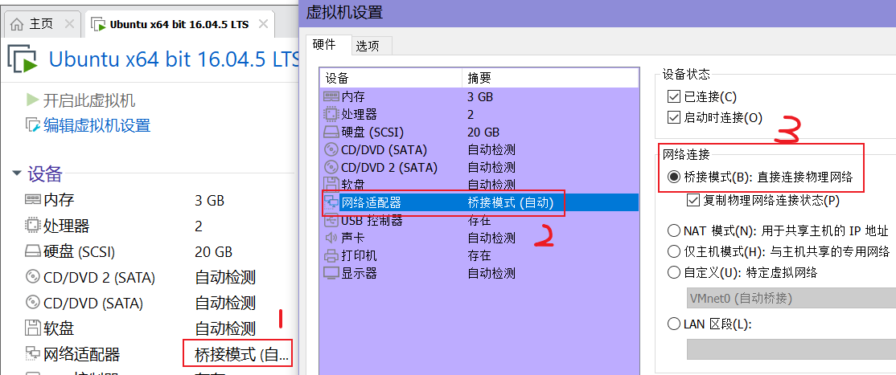


点击左上角ubuntu图标，输入proxy，点击Network：

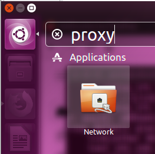


填入clash的代理：

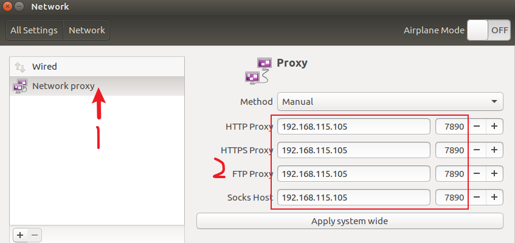

192.168.115.105是我电脑的无线网卡WLAN的ip4地址，7890是我的clash的端口。

从clash来看WLAN：

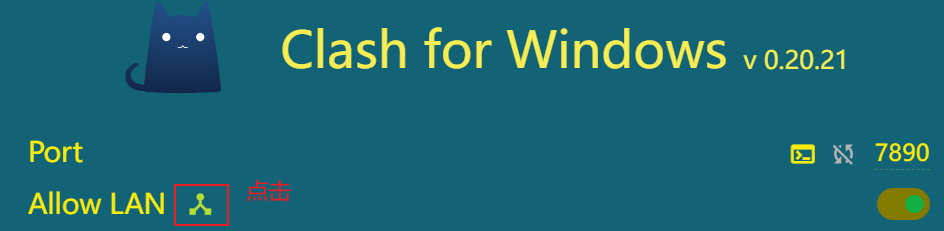

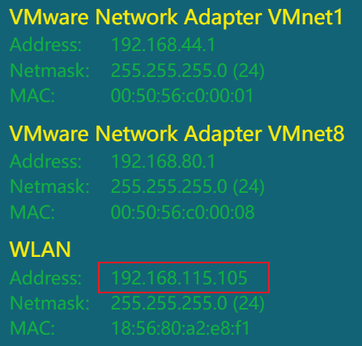

使用dos命令看电脑网卡WLAN的ipv4：

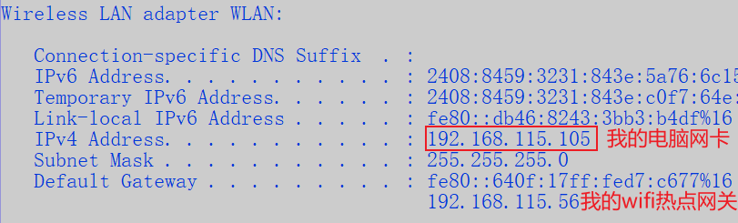

最后记得关闭win10主机的连接公共网络的防火墙：

系统设置里搜索：防火墙

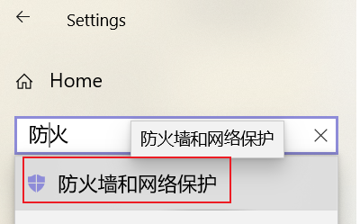

关闭公共网络防火墙：

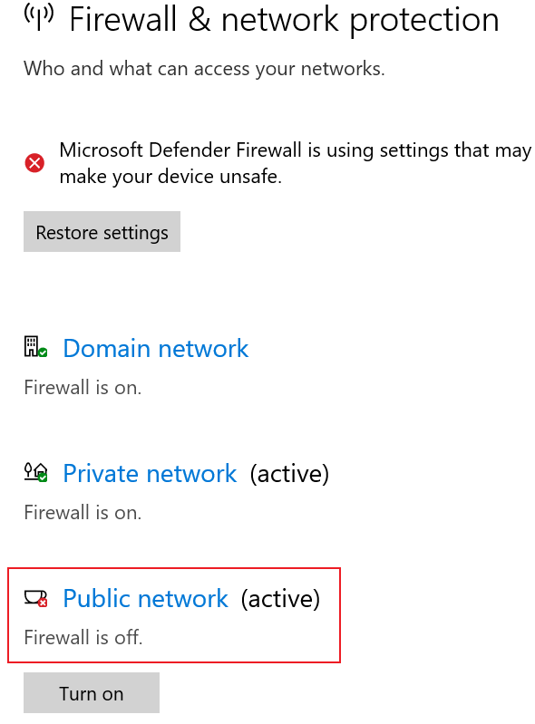

#### 1.2.2 更改WLAN路由ip、端口后重连
假如更改WLAN路由ip、端口重连，记得重复以上所有操作后，断开proxy设置里的wired有线连接后重新打开有线连接wired。
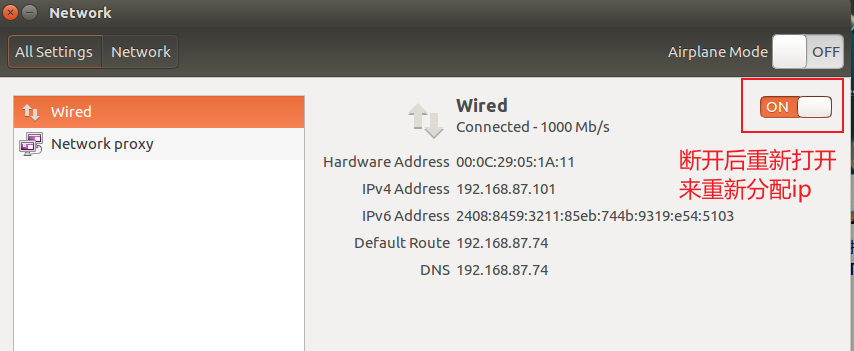
重新打开这个窗口来刷新ip显示。


### 1.3 [NAT模式连接 VMware 虚拟机 安装ubuntu16.04配置网络](https://blog.csdn.net/ykf173/article/details/83019736)
先按照桥接模式一样点击左上角ubuntu图标，输入proxy，点击Network设置代理。

记得关闭win10主机的连接公共网络的防火墙。

注：这只能在本机中使用ssh软件,连接使用，既本机中的虚拟机，实际他们是同一个局域网的
这里就要究其本源了，即桥接模式与NAT模式本质上的区别，其实很简单，桥接是重新分配一个与主机在同一网段中的ip，这很显然会占用你本来就为数不多的ip资源,但NAT是端口转发，是共享宿主机ip地址的，你看到的宿主机的ip地址是一个虚拟出来的地址。所以你一定不能通过其他电脑与这台虚拟机通信，不信的话你可以用另一台和你宿主机在同一局域网中的电脑ping一下你刚刚设置的虚拟机地址。这就是我要解决的下一个问题。
#### 1.3.1 设置网卡

终端打开：
```shell
sudo vi /etc/network/interfaces
```

里面的内容原为：
```
auto lo
iface lo inet loopback
```

全部注释掉。
ONBOOT：是指系统启动时是否激活网卡，默认为no，设置为yes
BOOTPROTO：网络分配方式，静态。(一定记得修改为Static，否则无法连通网络）


方法一：静态ip 这个方法失败了
输入以下设置：
```
auto ens33
iface ens33 inet static #配置为静态网址
address 192.168.80.128 #在之前查看的网段内
netmask 255.255.255.0 #子网掩码
gateway 192.168.80.1 #网关，是本机为VMnaet8分配的地址
```

静态ip的失败可以再研究研究[这里](https://www.cnblogs.com/MoreExcellent/p/6850620.html)。
方法二：动态获取ip配置 这个方法成功了
```bash
auto ens33
iface ens33 inet dhcp
```

#### 1.3.2 网关设置

打开网关设置：
```shell
sudo vi /etc/resolv.conf
```

一般情况添加DNS服务器
```
nameserver 8.8.8.8
```

特殊情况的填写自己电脑的DNS

修改网关为：
```
nameserver 192.168.80.2
```

这个网关同VMware Workstation里的虚拟网络编辑器->VMnet8->NAT设置的网关IP一致：

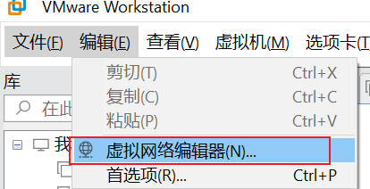

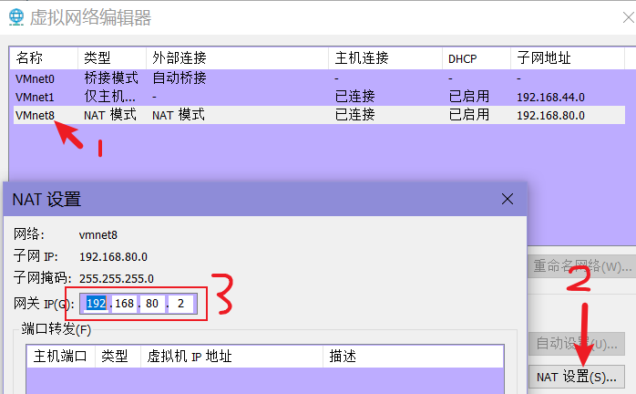


修改好保存，然后执行
```shell
sudo resolvconf -u
```
/etc/resolv.conf中会添加你添加的nameserver

#### 1.3.3 重启电脑 reboot
　　修改好这些后，只有重启电脑才能生效，用命令重启网卡
```shell
sudo /etc/init.d/networking restart
```

有时有用有时是没有作用的。原因尚不清楚。
　　重启电脑后再用ifconfig查看，就有多个网卡的配置了，而且都能使用，互不冲突。
#### 1.3.4 测试
设置成功后，想连接外网，直接打开clash就可以，不需要额外在proxy里配置。
ping WLAN

```shell
# ping网关地址，就是wifi的地址
ping 192.168.115.105
ping 192.168.7.219
ping www.baidu.com

ping www.google.com
```


测试网络状态，下载一个curl：
```shell
sudo apt-get update
sudo apt install curl
```


## 2 虚拟机公网ip保护方案
 


## 3 [VMware——VMware Tools的介绍及安装方法](https://blog.csdn.net/williamcsj/article/details/121019391)

