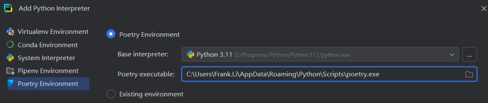

#### [Poetry Pytharm配置](https://blog.csdn.net/yanxilou/article/details/143788932)

第一栏Base interpreter放.venv里面的Script/python.exe

注意第二栏放poetry.exe的路径。




##### where poetry 

G:\Projects\projects_ai\Langchain_study>where poetry
G:\Projects\projects_ai\Langchain_study\01-Langchain\poetry
`C:\Users\UryWu\.local\bin\poetry.exe`


##### 重要提醒：你真的需要 `packages` 吗？

###### ✅ 答案是：**不需要！**

因为你只是在用 Jupyter Notebook 做学习和实验，**不需要把 `.ipynb` 文件打包成 Python 包**。Poetry 的 `packages` 功能是用来定义哪些源码文件要被打包进你的库中（比如发布到 PyPI）。

```yaml
[tool.poetry]
name = "langchain-study"
version = "0.1.0"
description = "LangChain 学习项目"
authors = ["Your Name <you@example.com>"]
package-mode = false  # 关键！禁用打包模式
```

##### [PyCharm配置 Jupyter Notebook详解](https://blog.csdn.net/2401_83641360/article/details/137517812)

终端启动jupyter:

`poetry run python -m jupyterlab`

pycharm填入上述的链接（包括访问令牌 token）:


填入后确定，token会自动消失，只剩下http://localhost:8888/不用管。

这一步非常重要，只有这样才能让pycharm里面的Jupyter notebook使用你在外面的终端用命令:`poetry run python -m jupyterlab`打开的环境。

如果用pycharm里面默认的Jupyter notebook，则无法使用你的poetry环境下面的第三方包。

