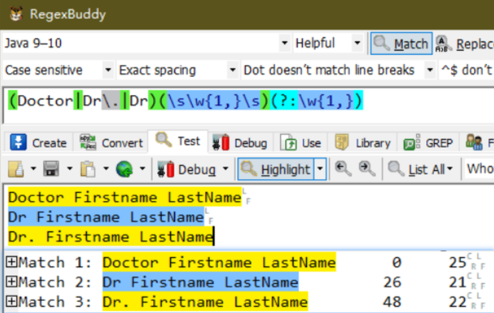
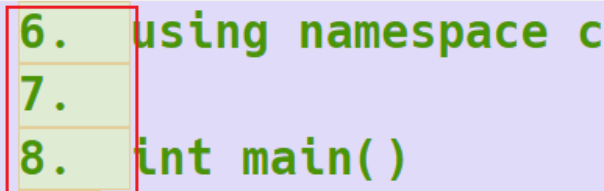
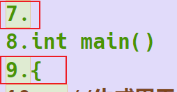
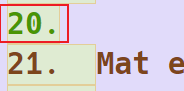
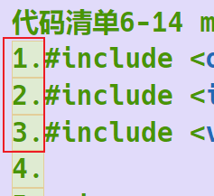
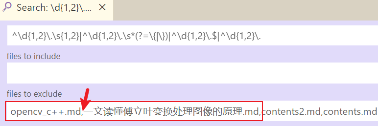

本文代码文件在本地的：
`F:\Projects\study_python\spider`

## 1 爬虫

### 1.1 爬虫法律风险

#### 1.1.1 体现在如下两方面

- 爬虫干扰了被访问网站的正常运营

- 爬虫抓取了收到法律保护的特定类型的数据或信息

如何在使用编写爬虫的过程中避免进入局子的厄运呢？

- 时常的优化自己的程序，避免干扰被访问网站的正常运行。
  在使用，传播爬取到的数据时，审查抓取到的内容，如果发现了涉及到用户因此商业机密等敏感内容需要及时停止爬取或传播，例如用户隐私之类的。

#### 1.1.2 [网络安全与数据合规｜爬虫合规，路在何方](https://www.freebuf.com/articles/neopoints/249688.html)

[谢连杰律师团队 ](https://www.freebuf.com/author/数字新基建产业金融)2020-09-14 14:13:01 👍25326

**1、遵守被爬网站的robots协议**

​		网站一般会设置robots协议，告诉网络爬虫哪些数据可以爬取，哪些数据不可以爬取。在使用爬虫技术时要遵循被爬网站的robots协议，避免出现不正当竞争等违法情形。

**2、不得妨碍被爬虫网站的正常运行**

​		爬虫行为等自动化收集信息等行为，无疑会增加网站的运行负担。最接近我们生活实例的就是12306铁路购票网站，通常会被各种抢票软件爬取信息而导致运行难度大，造成用户无法正常购票。

**大量搜集同类型的网站数据，导致网站核心模式被复制，网站被引流等，会导致企业间的不正当竞争。**

​		需要保证三重授权，即“用户授权”+“平台授权”+“用户授权”。第一重授权，即“用户授权”，为用户在使用平台（此案中为新浪微博平台）时对平台的授权，体现在用户对平台隐私政策的同意与接受。第二重授权，即“平台授权”，为平台对第三方开发者（此案中为脉脉）的授权，第三重授权，即“用户授权”，则为开发者在收集使用平台提供的用户的信息数据时，需事先征得用户的同意。上述“三重授权”的确立，将我国个人信息保护体系中“用户同意”原则发挥到了极致。

（三）**使用爬虫应遵守法律的原则性规定**

如即使网站不存在robots协议，也不意味着所有信息都可以随意爬取，<font color='red'>应注意是否侵犯著作权，也要避免触及侵犯个人信息罪、非法获取计算机信息系统数据罪等刑事责任。</font>

#### 1.1.3 [爬淘宝被判3年 写爬虫别碰这3条](https://www.bilibili.com/video/BV1ih411a7PK/?spm_id_from=333.788.b_7265636f5f6c697374.65)

2021-06-14 11:27:58

##### 1.1.3.1 侵犯公民个人信息罪

​		第一个呢就是侵犯公民个人信息罪，这是一个敏感信息现在国家管的很严，这是一条红线你不要去碰。虽然我知道在地下我们的手机号码，甚至身份证号码都被转卖来转卖去，可能一条信息一块钱。但是国家是严厉打击这个的。


##### 1.1.3.2 侵入计算机系统罪

1. DDOS攻击

比如你的爬虫爬的太猛了，这你就破坏了别人的信息系统，或者说你爬的虽然没有让别人宕机，但是，你的爬虫的流量占了人家流量的一半。你要知道人家花钱，租了服务器，结果都是为你打工的 一半的钱是为你付的，这样也是不行的。法律上是有相关的条文就是：如果你的爬虫访问流量占了服务器1/3的流量，你就违法了。 

2. 破解密码违法，js逆向合法

你刻意的去破解别人的用户名密码， 然后再去登录进去。 但是像JavaScript这个逆向， 我认为这种不算的， 这是一种比较常见的技术。 你是为了能够模拟这个人的正常访问， 然后你需要做一些技术手段， 要不然的话你像， 百度谷歌什么企查查什么抖查查， 他们都是基于爬虫的， 也要做大量的反爬。 <font color='red'>只要你不要刻意去破解别人的密码， 不要把别人计算机系统搞挂，不触犯别人的商业利益就不违法。</font>


据朝阳警方称，某购物网站工作人员近期报警，其网络购物"直播间"存在异常访问情况，怀疑直播数掘被非法窃取。朝阳分局立即部署网络安全保卫大队开展调查。

#### 1.1.4 [中国爬虫违法违规案例汇总](https://github.com/HiddenStrawberry/Crawler_Illegal_Cases_In_China#%E4%BE%B5%E7%8A%AF%E5%95%86%E4%B8%9A%E7%A7%98%E5%AF%86%E7%BD%AA)

##### 1.1.4.1 裁判文书网

- [CASE8:裁判文书网数据竟被售卖：爬虫程序抓取 或成侵权](https://money.163.com/19/0802/06/ELI9OADD002580S6.html)

北京青年报从某网购商城看到，最高人民法院裁判文书网的数据被标价0.1元到1元不等出售。

###### 1.1.4.1.1 爬虫系统无限制并发访问非法获取裁判文书数据

2018年5月初以来，<font color='red'>大量技术公司通过爬虫系统无限制并发访问非法获取裁判文书数据，造成网站负荷过大，</font>大量正常用户请求堵塞，访问出现速度慢或部分页面无法显示等现象。

今年5月，最高人民法院信息中心主任许建峰在接受媒体采访时表示：“中国裁判文书网目前每天的访问量可以达到几千万的量级，其中还包括数据爬虫的攻击，我们的中心服务器承受着巨大压力。”

”许建峰说，最高法已成立了专门的运维保障团队去维护管理中国裁判文书网，也将在技术与人力上投入更多的力量。

###### 1.1.4.1.2 因爬虫多无“公开时间”检索条件

为何不能按照“公开时间”为检索条件进行裁判文书检索时，最高人民法院方面表示，暂没有设置“公开时间”为检索条件的主要原因是爬虫系统会根据“公开时间”项进行增量文书爬取，“待下一步防爬虫系统稳定、可靠运行一段时间后，我们将适时考虑增加‘公开时间’检索项。”

###### 1.1.4.1.3 限制列表页面翻页数量来防止爬虫系统的措施

此外，最高人民法院方面称：“由于前期爬虫行为过于猖獗，无限制暴力访问大幅降低正常用户访问性能，我们采取了通过限制列表页面翻页数量来防止爬虫系统的措施。”


###### 1.1.4.1.4 **律师分析：强行突破“反爬”技术或构成犯罪**

金杜律师事务所从事IP类法律业务的律师瞿淼曾发文阐述了网络爬虫所涉及的法律问题。瞿淼称，从技术中立的角度而言，爬虫技术本身并无违法违规之处。但是，随着数据产业的发展，数据爬取带来的各种问题和顾虑日渐增加。过于野蛮的爬虫可能造成网站负荷过大，从而导致网站瘫痪、不能访问等。

###### 1.1.4.1.5 既然公开资源，就应给公开时间接口

[有态度网友02rwkU](http://tie.163.com/reply/myaction.jsp?action=reply&userId=40764728&f=gentienickname)[网易广东东莞网友]

热门跟贴2019-12-02 15:50:36

[既然是公开资源，我觉得你应该公布一个公开时间的接口，这样爬虫就不会频繁去爬你啊，只有资源共享了，用户查询就会更方便和分散，从而减轻裁判网的访问压力，我觉得这是治本方法。 如果一味的防御，攻击者总会找到攻击方法，防御的成本就高了，我觉得没必要。](https://comment.tie.163.com/ELI9OADD002580S6.html)


### 1.2 [urllib python获取网页图片](https://blog.csdn.net/yz1780041410/article/details/79451493)

 2018-03-05 21:40:48

```python
import re, shutil, urllib.request
image_url = r"https://csdnimg.cn/release/blogv2/dist/pc/img/npsFeel5.png"

try:
    request = urllib.request.urlopen(image_url)
    image_bytes = request.read()
    with open(r"C:\Users\UryWu\Desktop\1.png", 'wb') as image_file:  # 图片保存至本地
    	image_file.write(image_bytes)
except ConnectionError as e:
    print("无法获取图片")
```

##### 1.2.1.1 bug1:http.client.IncompleteRead: IncompleteRead(15780 bytes read, 11562 more expected)

solution:使用urllib.request解析很长的页面，会报异常，这是因为服务器分片了，我们只要把剩下的内容拦截下来就可以了。
这里用到了异常捕获，通过e.partial获取所有内容的，如下代码：
[reference](https://blog.csdn.net/lilongsy/article/details/104096599?utm_medium=distribute.pc_relevant.none-task-blog-2~default~baidujs_title~default-1.no_search_link&spm=1001.2101.3001.4242.2) 

```python
import urllib.request
url = "https://www.iqilu.com"
try:
    with urllib.request.urlopen(url) as f:
        res = f.read().decode('utf-8')
except Exception as e:
        res = e.partial.decode('utf-8')
```


### 1.3 [Python笔记-BeautifulSoup通过查找Id获取元素信息](https://blog.csdn.net/qq78442761/article/details/105609885)

[beautifulsoup通过id获取指定元素内容](https://blog.csdn.net/Lynn_coder/article/details/79509863)

### 1.4 [比urllib好用的requests](https://blog.csdn.net/woshizoe/article/details/18798987)


### 1.5 [反封ip](https://www.zhiliandaili.com/News-getInfo-id-685.html)

2019-09-21 09:52:51

　在实际操作过程中，我们经常会被网站禁止访问但是却一直找不到原因，这也是让很多人头疼的原因，这里有几个方面可以帮你初步检测一下到底是哪里出了问题。

　　1.采集速度问题

　　注意调整自己的采集速度，即便是要再给程序多加一行代码，快速采集也是很多爬虫程序被拒绝甚至封禁的原因。

　　2.IP记录限制问题

　　很多时候我们的ip地址会被记录，服务器把你当成是爬虫程序，所以就导致现有ip地址不可用，这样就需要我们想办法修改一下现有爬虫程序或者修改相应的ip地址。

　　3.程序问题

　　如果你发现你抓取到的信息和页面正常显示的信息不一样，或者说你抓取的是空白信息，那么很有可能是因为网站创建页的程序有问题，所以抓取之前需要我们检查一下。

　　4.请求参数问题

　　不管是用户还是爬虫程序，其实在浏览信息的时候就相当于给浏览器发送了一定的需求或者说是请求，所以你要确保自己的所有请求参数都是正确的，是没有问题的。

　　用了代理ip爬虫就不会被封吗?事实上爬虫被封的原因有很多，用了代理ip也不一定能保证爬虫不会被封，所以我们在进行爬虫采集的时候需要注意留心许多细节，在使用代理ip的时候一定要有足够多的代理ip，保证整个程序的资源量。

### 1.6 [postman快速获取请求头header](https://www.bilibili.com/video/BV1QP4y1L7uq/?spm_id_from=333.788.b_7265636f5f6c697374.113)


安静的小泰迪
我只能说没什么用[藏狐]
2021-11-07 20:28👍2
男人都是大猪蹄子吗
已经用很久了，国内对标的叫apipost
2021-11-22 14:32👍2

## 2 正则表达式

### 2.1 基本语法

#### 2.1.1 匹配单个字符

|实例|描述 |
|---|---|
|.|匹配除 "\n" 之外的任何单个字符。要匹配包括 '\n' 在内的任何字符，请使用象 '[.\n]' 的模式。 |
|[ ] |匹配[ ]中列举的字符|
|\0|匹配空格，后面的是一个零。|
|\d|匹配一个数字字符。等价于 `[0-9]`。|
|\D|匹配一个非数字字符。等价于 `[^0-9]`。|
|\s|匹配任何空白字符，包括空格、制表符、换页符等等。等价于 `[\f\n\r\t\v]`。|
|\S|匹配任何非空白字符。等价于 `[^ \f\n\r\t\v]`。 |
|\w|匹配包括下划线的任何单词字符。等价于`[A-Za-z0-9_]`。 |
|\W|匹配任何非单词字符。等价于`[^A-Za-z0-9_]`。 |


#### 2.1.2 匹配多个字符

|字符|功能|位置|表达式实例|完整匹配的字符串|
|---|---|---|---|---|
|*|匹配前⼀个字符出现0次或者⽆限次，即可有可⽆|用在字符或(...)之后|abc*|abccc|
|+|匹配前⼀个字符出现1次或者⽆限次，即⾄少有1次|用在字符或(...)之后|abc+|abccc|
|?|匹配前⼀个字符出现1次或者0次，即要么有1次，要么没有|用在字符或(...)之后|abc?|ab,abc|
|{m}|匹配前⼀个字符出现m次|用在字符或(...)之后|ab{2}c|abbc|
|{m,n}|匹配前⼀个字符出现从m到n次，若省略m，则匹配0到n次，若省略n，则匹配m到无限次|用在字符或(...)之后|ab{1,2}c|abc,abbc|
[原文链接](https://blog.csdn.net/guo_qingxia/article/details/113979135)

#### 2.1.3 匹配开头结尾
|字符|功能|
|---|---|
|^|匹配字符串开头|
|$|匹配字符串结尾|

#### 2.1.4 匹配分组

|字符|功能|
|---|---|
|\| |匹配左右任意⼀个表达式|
|(ab)|将括号中字符作为⼀个分组|
|\num|引⽤分组num匹配到的字符串|
|`(?P<name>)` |分组起别名，匹配到的子串组在外部是通过定义的 _name_ 来获取的|
|`(?P=name)`|引⽤别名为name分组匹配到的字符串|
讲解见：[匹配分组](https://blog.csdn.net/guo_qingxia/article/details/113979135#t4)

例子2：匹配出 `<html><h1>www.itcast.cn</h1></html>`
```python
import re
labels = ["<html><h1>www.itcast.cn</h1></html>",
		  "<html><h1>www.itcast.cn</h2></html>"]
for label in labels:
    ret = re.match(r"<(\w*)><(\w*)>.*</\2></\1>", label)
    if ret:
        print("%s 是符合要求的标签" % ret.group())
    else:
        print("%s 不符合要求" % label)
```
结果：
`<html><h1>www.itcast.cn</h1></html>` 是符合要求的标签  
`<html><h1>www.itcast.cn</h2></html>` 不符合要求

举例：`(?P<name>) (?P=name)`
一个用于标记，一个用于在同一个正则表达式中复用
```python
import re
ret = re.match(
r"<(?P<name1>\w*)><(?P<name2>\w*)>.*</(?P=name2)></(?P=name1)>",
"<html><h1>www.itcast.cn</h1></html>")
ret.group()  # 匹配成功

ret = re.match(
r"<(?P<name1>\w*)><(?P<name2>\w*)>.*</(?P=name2)></(?P=name1)>",
"<html><h1>www.itcast.cn</h2></html>")
#ret.group()  # 匹配失败
```

#### 2.1.5 非捕获元?: ?= ?!

|模式|描述|
|---|---|
|(?= re) |前向肯定界定符。如果所含正则表达式，以 ... 表示，在当前位置成功匹配时成功，否则失败。但一旦所含表达式已经尝试，匹配引擎根本没有提高；模式的剩余部分还要尝试界定符的右边。|
|(?!regex)|前向否定界定符。与肯定界定符相反；当所含表达式不能在字符串当前位置匹配时成功 |
[来源参考](https://www.runoob.com/python/python-reg-expressions.html)

|模式|描述|
|---|---|
|(?=%%~)|匹配一个位置，而不是字符这个位置在%%~前面 |
|(?<=%%)|匹配一个位置，而不是字符。这个位置在%%！后面|
[例子，最好源网页看看，讲得挺好：](https://www.cnblogs.com/zuojiayi/p/10935683.html)
源网页说的稍微需要修正下：
`$abc>10&&$ABC<20`
希望匹配`$abc`和`10&&$ABC`，也就是`> <`这些符号前的内容。  
使用正则：
`/.*?(?=>|<)/`，表示匹配>或者<之前的任意字符内容，`.*?`尽量少匹配。
1、为什么不使用  `.*`  呢？  
　  答：如果使用`.*`，会只匹配到一次，也就是`$abc>10&&$ABC`。 ^j8woda

##### 2.1.5.1 [非捕获分组](https://www.hxstrive.com/subject/regex.htm?id=399)
(?:\w{1,})，不会捕获，也不会创建分组；
`(Doctor|Dr\.|Dr)(\s\w{1,}\s)(?:\w{1,})`

上图中，模式 “(Doctor|Dr\.|Dr)” 保存到 $1 分组中，而模式 “(\s\w{1,}\s)” 保存到 $2 分组中；然而，模式 “(?:\w{1,})” 不会捕获，也不会创建分组；

使用非捕获分组确实让这个模式看起来有点复杂；但是，在复杂的同时，他却能减少要处理的分组数，也能提高效率。


### 2.2 [正则表达式中,`[\s\S]*`完全通配](https://blog.csdn.net/haoyuedangkong_fei/article/details/53781936)

`[a-z]`表示从a到z之间的任意一个
`[\s]`表示，只要出现空白就匹配
`[\S]`表示，非空白就匹配

另外要说的一点是，为什么有"."这个通配符了，还要这样的用法。  
其实，`[\s\S]` ` [\w\W]`这样的用法，比较"."所匹配的还要多，因为"."是不会匹配换行的，所有出现有换行匹配的时候，人们就习惯 使用`[\s\S]`或者`[\w\W]`这样的完全通配模式。

### 2.3 [python——正则表达式(re模块)详解](https://blog.csdn.net/guo_qingxia/article/details/113979135)

讲的最好，目录分类清晰。每个知识还有例子讲解。

- [re.match函数](https://blog.csdn.net/guo_qingxia/article/details/113979135#t0)
	- [匹配单个字符](https://blog.csdn.net/guo_qingxia/article/details/113979135#t1)
	- [匹配多个字符](https://blog.csdn.net/guo_qingxia/article/details/113979135#t2)
	- [匹配开头结尾](https://blog.csdn.net/guo_qingxia/article/details/113979135#t3)
	- [匹配分组](https://blog.csdn.net/guo_qingxia/article/details/113979135#t4)
- [re.compile 函数](https://blog.csdn.net/guo_qingxia/article/details/113979135#t5)
- [re.search函数](https://blog.csdn.net/guo_qingxia/article/details/113979135#t6)
- [re.findall函数](https://blog.csdn.net/guo_qingxia/article/details/113979135#t7)
- [re.finditer函数](https://blog.csdn.net/guo_qingxia/article/details/113979135#t8)
- [re.sub函数](https://blog.csdn.net/guo_qingxia/article/details/113979135#t9)
- [re.subn函数](https://blog.csdn.net/guo_qingxia/article/details/113979135#t10)
- [re.split函数](https://blog.csdn.net/guo_qingxia/article/details/113979135#t11)
- [python贪婪和⾮贪婪](https://blog.csdn.net/guo_qingxia/article/details/113979135#t12)
- [r的作⽤](https://blog.csdn.net/guo_qingxia/article/details/113979135#t13)

### 2.4 [runoob Python 正则表达式](https://www.runoob.com/python/python-reg-expressions.html)

与大多数编程语言相同，正则表达式里使用”\”作为转义字符，这就可能造成反斜杠困扰。假如你需要匹配文本中的字符”\”，那么使用编程语言表示的正则表达式里将需要4个反斜杠”\\\\”：前两个和后两个分别用于在编程语言里转义成反斜杠，转换成两个反斜杠后再在正则表达式里转义成一个反斜杠。表示原生字符串的一个反斜杠。Python里的原生字符串很好地解决了这个问题，Python中字符串前⾯加上 r 表示原⽣字符串。

### 2.5 [python 字符串的搜索匹配与替换（详细）](https://blog.csdn.net/zsq8187/article/details/109749945)

- Python 内的正则使用基础
	- 正则修饰符的使用
	- python 里的反向引用、捕获
- 需求：单次匹配字符串
	- `re.match()` 函数
	- `re.fullmatch()` 函数
	- `re.search()` 函数
- 需求：全文搜索替换字符串
	- `re.sub()` 函数
- 需求：全文搜索匹配字符串
	- `re.findall()` 与 `re.finditer()` 函数
- 需求：以匹配的字符分割字符串
	- `re.split()` 函数


### 2.6 re.sub正则替换
str.replace(src, target)是普通匹配，带正则的匹配需要re.rub。

[reference](https://cloud.tencent.com/developer/article/1774589)

[本地简单例子见](F:\Projects\projects_python\spider\study_re_sub.py)
```python
import re
"""本代码用于学习re.sub的正则表达式替换功能。
reference:https://cloud.tencent.com/developer/article/1774589
本地复杂例子见：F:\Projects\projects_java\work\Intelligent_legal_affairs_platform\scripts\html_set_body_center.py
本代码目的：替换'</script> \n </head>'为'aaaa'，\n前后空格数量不定。
"""
html_content = "</script>\n <script >\n </script> \n </head>\n  <body>\n"

new_html_content = re.sub(
    # 正则表达式匹配只考虑在</script>\n</head>的换行前或后或同时只出现任意数量空格的情况。
    "</script>(\n\s*|\s*\n|\s*\n\s*)</head>",
    "aaaa",
    html_content, 1)  # 这个1表示只替换一次

print(new_html_content)
```

[本地复杂例子见](F:\Projects\projects_java\work\Intelligent_legal_affairs_platform\scripts\html_set_body_center.py)


### 2.7 [python 中re模块的re.compile()方法 ](https://www.cnblogs.com/xp1315458571/p/13720333.html)

我们常用的正则表达式方法findall()、match()、search()，都已经自带了`compile`了！
根本没有必要多此一举先`re.compile`再调用正则表达式方法
当然，可以选择用也可以不用，遇到别人写的要知道怎么回事，换了语言后就需要用re.compile了，用还是不用的更多讨论见[**Python正则表达式，请不要再用re.compile了！！！**](https://zhuanlan.zhihu.com/p/70680488)
2019-06-25
从语义角度来说，默认带缓存是实现相关的，不应该作为推荐实现
2019-06-25
虽然Python实现中有编译和缓存，但这样写再怎么说也算不上陋习吧
2019-06-25
用一门语言，就用这门语言的编码方式，而不是把之前的编码习惯直接套用的新的语言
2019-06-28
9102年了，还在拿2009年的讨论换个博眼球的标题放出来https://stackoverflow.com/questions/452104/is-it-worth-using-pythons-re-compile
总结来说只有少数正则的情况下性能确实没有大的差别。但是用re.compile可读性更高，易用性更好，也不用手动修改cache_size（如果要匹配的表达式很多），正经的工程里都会优先compile的
2019-06-28
你说的是Java工程吧，从其他语言转过来的人才会习惯先用compile
2019-06-26
所以说为什么不要用？
官方也不是没给这样的实现，自己去提前创建Pattern无非只是省去了之后re库自己缓存对应pattern的步骤。并且golang和java都有类似的方法，在切换语言的时候为什么不应该对此感到方便而去强求适应新的习惯？

### 2.8 [Python 正则里 re.compile 真的是必需的吗？](https://blog.csdn.net/qq_40244755/article/details/103369421)

<font color='red'>如果要处理的 文本是百万、千万、亿这个级别，需要做re.compile()。</font>

Python里的re是支持正则表达式的模块,所谓的正则表达式就是匹配文本里符合条件的语句. <font color='red'>re.compile()是根据包含正则表达式的字符串创建模式对象,以提高匹配效率.</font>
re.match与re.search的区别：re.match只匹配字符串的开始，如果字符串开始不符合正则表达式，则匹配失败，函数返回None；而re.search匹配整个字符串，直到找到一个匹配
1、re.compile()
Python里的re是支持正则表达式的模块,所谓的正则表达式就是匹配文本里符合条件的语句. re.compile()是根据包含正则表达式的字符串创建模式对象,以提高匹配效率.例如:

```python
def test():
    regex = r'(\d+) years old'
    content = 'Alex is a 7 years old boy.'
    reg = re.compile(regex)
    result = re.search(reg, content).group()
    print(result)
result = 7
```

2、re.search()
re.search()是在字符串开启查找模式,如其名:search.例如:

```python
def test():
    content = 'Alex is a 7 years old boy.'
    result = re.search(r'(\d+) years old', content).group()
    print(result)
result = 7
```

3、re.findall()
re.findall()是返回一个列表,列表里包含了所有符合条件的结果,例如:

```python
def test():
    content = 'Alex is a 7 years old boy.Bob is a 12 years old boy...'
    result = re.findall(r'(\d+) years old', content)
    print(result)
result = ['7', '12']
```

### 2.9 [Python正则表达式之修改，分割，搜索和替换字符串（6）](https://blog.csdn.net/CSNN2019/article/details/114484689)

​		简明讲解。

| 方法    | 用途                                                  |
| ------- | ----------------------------------------------------- |
| split() | 在正则表达式匹配的地方进行分割，并返回一个列表        |
| sub()   | 找到所有匹配的子字符串，并替换为新的内容              |
| subn()  | 跟 sub() 干一样的勾当，但返回新的字符串以及替换的数目 |


### 2.10 [group的用法](https://blog.csdn.net/qq_20412595/article/details/82633501)
4、group的方法
（这部分是转载于：[python group() - jihite - 博客园](http://www.cnblogs.com/kaituorensheng/archive/2012/08/20/2648209.html "python group() - jihite - 博客园")）
正则表达式中，group（）用来提出分组截获的字符串，**（）用来分组**
```python
import re
a = "123abc456"
print re.search("([0-9]*)([a-z]*)([0-9]*)",a).group(0)   #123abc456,返回整体
print re.search("([0-9]*)([a-z]*)([0-9]*)",a).group(1)   #123
print re.search("([0-9]*)([a-z]*)([0-9]*)",a).group(2)   #abc
print re.search("([0-9]*)([a-z]*)([0-9]*)",a).group(3)   #456
```

### 2.11 [glob 模块（查找文件路径）](https://www.jianshu.com/p/542e55b29324)
简明解释。
[本地例子见](C:\Users\UryWu\Desktop\part_txt_process_script.py)

### 2.12 [正则表达式在线生成不同代码工具](https://www.w3cschool.cn/tools/index?name=create_reg)

### 2.13 [AutoRegex正则表达式“翻译”成英语解释](https://www.autoregex.xyz/)

### 2.14 [可视化正则表达式](https://regexper.com/)
[Road 2 Coding](https://www.r2coding.com/#/README?id=%e6%ad%a3%e5%88%99%e8%a1%a8%e8%be%be%e5%bc%8f%e5%8f%af%e8%a7%86%e5%8c%96%e5%b7%a5%e5%85%b7)

### 2.15 [贪婪匹配与非贪婪匹配](https://blog.csdn.net/qq_40279964/article/details/82958680)

>.*?和.*的区别

### 2.16 [正则表达式javascript](https://developer.mozilla.org/zh-CN/docs/Web/JavaScript/Guide/Regular_Expressions)

## 3 [lambda、filter参数的位置/关键字/收集/顺序匹配](https://blog.csdn.net/xwbk12/article/details/78572766)

```python
# 在lambda使用if……else…..语句
d = lambda x:x+1 if x>0 else "error"
print(d(3))  # 4
print(d(4))  # 5
print(d(-2))  # error 
```

```python
# lambda使用列表推导
g = lambda x:[(x,i) for i in xrange(0,4)]
print(g(1))  # [(1, 0), (1, 1), (1, 2), (1, 3)]
```

```python
# 结合filter使用过滤功能（常用过滤、判断、查询条件）
t = [2,3,4,5,61,2,34,52,1,1,2,3,7,1]
h = filter(lambda x:x>10,t)  # 取出t中大于10的数字
print(set(h))  # {61, 34, 52}
```

因为lambda里不能判断表达式，所以要filter的辅助才能写。

```python
def to_get_image_name_in_complex_url(image_url):
    """
    取出复杂链接中的图片全名
    :return:
    """
    import re
    result = re.split("[\\|/]", image_url)  # 先把所有斜杠滤掉，把字符隔开，在隔开的一个个字符串中匹配图片所在的位置
    image_file_complex_name = filter(lambda x: re.search(r".*((\.bmp)|(\.gif)|(\.jepg)|(\.jpg)|(\.png))", x) is not None, result)
    # print(set(image_file_complex_name).pop())  # 必须用set才能取出filter过滤后的东西，pop是从set中任意取一个元素
    # print(list(image_file_complex_name)[0])  # list只能展示不能取出来用
    image_name = set(image_file_complex_name).pop()
    # 图片后面可能带着一些&、?之类的符号，要再次去掉
    print(image_name)  # 20200402220551226.jpg&sfdsf
    image_file_name = re.search(r".*((\.bmp)|(\.gif)|(\.jepg)|(\.jpg)|(\.png))", image_name).group()
    print(image_file_name)  # 20200402220551226.jpg
    return image_file_name


if __name__ == "__main__":
    image_url = r"https://img-blog.csdnimg.cn//20200402220551226.jpg&sfdsf/sdsdff/1"
    to_get_image_name_in_complex_url(image_url)
```


## 4 例子

### 4.1 除去acgplayer广告

思路：打开acgplayer的作者官网，然后爬取id为haButton的a标签，获取其中的5位数ID号，然后在浏览器通过网址：acgpp:///SetFontId/?????来打开本地的acgplayer软件来去除acgplayer里的广告，这里的五个?为变动的数字。

```python
def anti_acgplayer_advertisement():
    """
    bug1:ValueError: check_hostname requires server_hostname
    solution:关闭网络代理
   reference:https://blog.csdn.net/Carifee/article/details/119653989
    """
    import requests
    from bs4 import BeautifulSoup
    # 获取源码
    html = requests.get("https://www.axilesoft.com/app/player/lib/?hideadonce=acg&lang=cn", verify=False)
    # html = requests.request('GET', "https://www.axilesoft.com/app/player/lib/?hideadonce=acg&lang=cn", verify=False)  # 另一种写法

    # 打印源码
    soup = BeautifulSoup(html.text, 'html.parser')  # 使用BeautifulSoup构造方法，得到一个对象
    # print(soup.prettify())  # 使用prettify()使页面更美观的打印出来

    a_tag = soup.find('a', id='haButton')  # 获取那个点击后免除广告的弹窗标签
    # print(a_tag.get_text())  # 使App本次运行不再显示广告框
    # print(str(a_tag))  # <a href=...整个标签的内容包括上面的文字

    pattern = r"'acgpp.*'"
    result = re.search(pattern, str(a_tag))
    # print(result.group())  # 'acgpp:///SetFontId/75109'  str类型，后面这个5位数的ID号会变化。
    dos_command = 'start "C:\Program Files\Google\Chrome\Application\chrome.exe" {0}'.format(result.group()[1:-1])
    os.system(dos_command)  # 这里result.group()[1:-1]去掉了头尾的引号
    # dos执行的命令为： start "C:\Program Files\Google\Chrome\Application\chrome.exe" acgpp:///SetFontId/?????


anti_acgplayer_advertisement()
```


### 4.2 [爬取中国裁判文书网](https://wenshu.court.gov.cn/)

#### 4.2.1 selenuim自动化登录

##### 4.2.1.1 bug1:

**description:**无法加载登录页面被反爬

规避爬虫监测，控制台输入：window.navigator.webdriver为true就是爬虫，现在要令它为undefined。

**solution1:**

[爬虫 无头浏览器 规避监测](https://www.cnblogs.com/XLHIT/p/11317107.html)

```python
from selenium.webdriver import Chrome
from selenium.webdriver import ChromeOptions

options = ChromeOptions()
options.add_experimental_option('excludeSwitches', ['enable-automation'])
options.add_experimental_option('useAutomationExtension', False)

bro = Chrome(options=options)
bro.execute_cdp_cmd("Page.addScriptToEvaluateOnNewDocument", {
  "source": """
    Object.defineProperty(navigator, 'webdriver', {
      get: () => undefined
    })
  """
})

url = "fudan.bbs.kaoyan.com"  # 首页
bro.get("http://fudan.bbs.kaoyan.com/")
bro.implicitly_wait(10)
```


##### 4.2.1.2 bug2:能获取登录页面但是无法加载登录窗口

**description:**


###### 4.2.1.2.1 **solution1 failed:**

分析网页元素我直接进入这个窗口的界面：

```html
url = "https://account.court.gov.cn/app?back_url=https%3A%2F%2Faccount.court.gov.cn%2Foauth%2Fauthorize%3Fresponse_type%3Dcode%26client_id%3Dzgcpwsw%26redirect_uri%3Dhttps%253A%252F%252Fwenshu.court.gov.cn%252FCallBackController%252FauthorizeCallBack%26state%3D026ddbed-19f6-4392-bac4-8053733321ea%26timestamp%3D1649728293228%26signature%3D4A5810012E92B2CEE167E12D7C7CD382838EE675459C550FDB323583BAA3CE93#/login"
# chrome驱动获取这个窗口的单独页面
driver.get(url)
```

自动化登录代码：

```python
# 填写账号，就是手机号码
        # "//*[@id="root"]/div/form/div/div[1]/div/div/div/input"
        account_box = driver.find_element_by_xpath("//*[@id='root']/div/form/div/div[1]/div/div/div/input")
        account_box.click()
        account_box.send_keys(self.account)

        # 填写密码
        password_box = driver.find_element_by_xpath("//*[@id='root']/div/form/div/div[2]/div/div/div/input")
        password_box.click()
        password_box.send_keys(self.password)

        # 点击登录
        login_button = driver.find_element_by_xpath("//*[@id='root']/div/form/div/div[3]/span")
        login_button.click()
```

###### 4.2.1.2.2 **solution2:**


##### 4.2.1.3 bug3:能自动化登录但是登录成功后无法跳转主页

**description:**

python selenium能获取这个页面，但是登录后还在原页无法跳转，直接再次获取主页登录无效。

```python
        # 登录这个窗口，没办法在登录页里加载
        url = "https://account.court.gov.cn/app?back_url=https%3A%2F%2Faccount.court.gov.cn%2Foauth%2Fauthorize%3Fresponse_type%3Dcode%26client_id%3Dzgcpwsw%26redirect_uri%3Dhttps%253A%252F%252Fwenshu.court.gov.cn%252FCallBackController%252FauthorizeCallBack%26state%3D026ddbed-19f6-4392-bac4-8053733321ea%26timestamp%3D1649728293228%26signature%3D4A5810012E92B2CEE167E12D7C7CD382838EE675459C550FDB323583BAA3CE93#/login"
        driver.get(url)
        
        # driver.find_element_by_xpath("/html/body/div/h3/img").click()
        # 填写账号，就是手机号码
        # "//*[@id="root"]/div/form/div/div[1]/div/div/div/input"
        account_box = driver.find_element_by_xpath("//*[@id='root']/div/form/div/div[1]/div/div/div/input")
        account_box.click()
        account_box.send_keys(self.account)

        # 填写密码
        password_box = driver.find_element_by_xpath("//*[@id='root']/div/form/div/div[2]/div/div/div/input")
        password_box.click()
        password_box.send_keys(self.password)

        # 点击登录
        login_button = driver.find_element_by_xpath("//*[@id='root']/div/form/div/div[3]/span")
        login_button.click()
```


###### 4.2.1.3.1 **solution1 failed back to bug2 solution2:**

无法解决跳回bug2。当前代码存档：download_judgement_documents_only_login_cannot_redirect.py


##### 4.2.1.4 [ajax动态加载网页反爬](https://www.k0rz3n.com/2019/03/05/%E7%88%AC%E8%99%AB%E7%88%AC%E5%8F%96%E5%8A%A8%E6%80%81%E7%BD%91%E9%A1%B5%E7%9A%84%E4%B8%89%E7%A7%8D%E6%96%B9%E5%BC%8F%E7%AE%80%E4%BB%8B/)

> Ajax = Asynchronous JavaScript and XML（异步的 JavaScript 和XML），其最大的优点是在**不重新加载整个页面的情况下**，可以与服务器交换数据并更新部分网页的内容。

目前，越来越多的网站采取的是这种动态加载网页的方式，一来是可以实现web开发的前后端分离，减少服务器直接渲染页面的压力；**二来是可以作为反爬虫的一种手段。**


#### 4.2.2 资料参考

##### 4.2.2.1 1)文档下载接口逆向时间降序方向

[裁判文书网数据采集爬虫2021-08](https://blog.csdn.net/weixin_42358470/article/details/120006532)

2021-08-30 22:13:09 发布

[中国裁判文书网接口解密](https://blog.csdn.net/qq_36532060/article/details/119180677)

2021-07-28 16:02:13 发布

[2021.04-中国裁判文书网爬虫](https://www.jianshu.com/p/a269712814ab)

2021.04.16 19:06:00


[文书网反反爬虫SDK](https://github.com/guoxw/mmewmd_crack_for_wenshu)

2019.2.11-2

本项目为学习Js加密和向反爬虫工程师前辈们学习而立

一月份的时候中国裁判文书网更新了据说是瑞数安全的js混淆动态加密。
特征1：params:MmEwMd
特征2：html:9DhefwqGPrzGxEp9hPaoag
特征3：cookies：FSSBBIl1UgzbN7N80T

**重要提示：目前因为用本项目做采集的开发者较多，采集量非常大，导致瑞数现在开始疯狂地封IP。基本上百度上能搜到的那几家大代理商获取数据相对慢点,大户请各位自行开动脑经或者找关系找一些非公开销售的代理IP**


[裁判文书数据docid解密，提供api接口，直接使用](https://blog.csdn.net/feilong_86/article/details/82777045)

于2018-09-22 19:31:06 发布


##### 4.2.2.2 2)模拟登陆方向

[Python模拟登陆万能法-微博|知乎](https://cloud.tencent.com/developer/article/1406620)
2019-03-25

### 4.3 [蝦皮爬蟲 + 賣家競品分析](https://github.com/hsuanchi/crawler_shopee_public#how-to-use)

### 4.4 匹配bilibili、youtube视频并宽屏播放：

```javascript
//点击bilibili的宽屏播放

var url = window.location.href; /* 获取完整URL */
var bilibiliReg = /^((https|http|ftp|rtsp|mms)?:\/\/)www\.bilibili\.com\/video\w*/;
var youtubeReg = /^((https|http|ftp|rtsp|mms)?:\/\/)www\.youtube\.com\/watch\w*/;

if(bilibiliReg.test(url)){
    document.getElementsByClassName('bilibili-player-iconfont bilibili-player-iconfont-widescreen-off player-tooltips-trigger')[0].click();
    $(window).scrollTop(120);//120是距离顶部的像素距离
}else if(youtubeReg.test(url)){
    //注意这里youtube和bilibili不一样，youtube是[1].
    document.getElementsByClassName('ytp-size-button ytp-button')[1].click();
}else{
    alert("不是正确的网址吧，请注意检查一下");
}
```

[js如何实现匹配网址url的正则表达式](https://www.yisu.com/zixun/330023.html)
发布时间：2021-09-06 16:49:56 来源：亿速云

### 4.5 everything搜索式子

搜索不含4个数字开头，同时以java学习开头并且以.md结尾的文件：
```reStructuredText
^(?![0-9]{4})java学习.*.md$
```

只搜索envs目录下的文件，不递归搜索子目录：
```
parent:E:\Anaconda3-2019.10-Windows-x86_64\envs
```

搜索同时带C:\和start menu路径的一个文件夹，这个文件夹的名字是Startup：
```
folder:Startup path:C:\ path:"start menu"
```


### 4.6 obsidian里搜所有不包含http的所有[]()类的链接

```shell
file:C++_study_note line:/\[.*\]\((?!http).*\)/
```

file:在文件中

​	line:搜索内容必须出现在一行

/ /：开头和结尾的两个反斜杠表示这是一个正则表达式。

\\[：转义中括号。

x(?!yyyy)：不记住子表达式。见[网址](https://developer.mozilla.org/zh-CN/docs/Web/JavaScript/Guide/Regular_Expressions#special-negated-look-ahead)。

> 仅仅当'x'后面不跟着'y'时匹配'x'，这被称为正向否定查找。
>
> 例如，仅仅当这个数字后面没有跟小数点的时候，/\d+(?!\.)/ 匹配一个数字。正则表达式/\d+(?!\.)/.exec("3.141") 匹配‘141’而不是‘3.141’

这里写`\((?!http?|ftp).*\`就是不匹配http、https、ftp了。?表示匹配前一个自负0次或1次。?!()里或就是|。

### 4.7 匹配路径
`(?:[A-Z]:|\\|(?:\.{1,2}[\/\\])+)[\w+\\\s_\(\)\/]+(?:\.\w+)*`

### 4.8 匹配代码前面的数字行和点

`^\d{1,2}\.\s{1,2}`
`^`从行的开头开始匹配，`\d{1,2}`匹配1到2个数字，`\.`匹配一个点，`\s`匹配空白符如：`\n`、`\t`、空格等字符。

匹配示例如下，浅绿色的是匹配到的：



`^\d{1,2}\.\s*(?=\{|\})`
`\s*`匹配0到多个空白符，`\{`是转义花括号，`(?=符号)`表示匹配某符号前的位置，也就是说不包含此正则表达式匹配的内容，用来界定位置。`(?=\{|\})`表示此处有`{`或者`}`，匹配结果不会包含此内容。[参考文中内容：非捕获元](blogs/python爬虫、正则表达式.md#^j8woda)。
这个可以匹配带花括号的行：



`^\d{1,2}\.$`
`$`匹配行的结尾。
这个可以匹配单独的一行：


`^\d{1,2}\.`
后面直接接代码的行：



匹配上面所有正则就用或者符号`|`连接起来：
`^\d{1,2}\.\s{1,2}|^\d{1,2}\.\s*(?=\{|\})|^\d{1,2}\.$|^\d{1,2}\.`


vs code里面排除搜索的文件，用逗号隔开：



## 5 [接单平台](https://zhuanlan.zhihu.com/p/381438951)

**1.程序员客栈：[https://www.proginn.com](https://link.zhihu.com/?target=https%3A//www.proginn.com)**

**2. CODING 码市：[https://mart.coding.net](https://link.zhihu.com/?target=https%3A//mart.coding.net)**

**3. 开源众包：[http://zb.oschina.net/projects](https://link.zhihu.com/?target=http%3A//zb.oschina.net/projects)**

**4. 猪八戒：[https://zbj.com](https://link.zhihu.com/?target=https%3A//zbj.com)**

**6. 快码众包：[http://kuaima.co](https://link.zhihu.com/?target=http%3A//kuaima.co)**

**7. 码易众包平台：[http://mayigeek.com](https://link.zhihu.com/?target=http%3A//mayigeek.com)**

