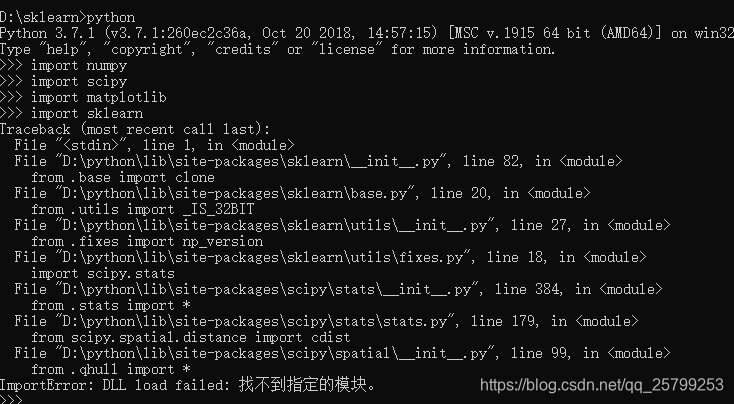

### pip的使用

假如下载numpy

```shell
pip install numpy
```
### [pypi 镜像源「配置」](https://zhuanlan.zhihu.com/p/634758945)


#### 常用镜像源列表

```text
官方：https://pypi.org/simple
百度：https://mirror.baidu.com/pypi/simple/
清华：https://pypi.tuna.tsinghua.edu.cn/simple
阿里：https://mirrors.aliyun.com/pypi/simple/
豆瓣：https://pypi.douban.com/simple/
中科大：https://pypi.mirrors.ustc.edu.cn/simple/
```

#### 1、临时使用

```bash
pip install xxxxx -i https://mirror.baidu.com/pypi/simple/ 
```

#### 2、长期设置

```text
pip config set global.index-url https://mirror.baidu.com/pypi/simple/
```

注：升级 pip 到最新的版本 (>=10.0.0) 后进行配置，详见

#### 3、配置多个镜像源（负载均衡）

```text
pip config set global.extra-index-url "<url1> <url2>..."
```


### [pip升级](https://zhuanlan.zhihu.com/p/127062086)

python -m pip install --upgrade pip

### [手动安装pip依赖库](https://blog.csdn.net/qq_41780800/article/details/104286538)

### 所有conda安装的环境路径
`E:\Anaconda3-2019.10-Windows-x86_64\envs`

某环境中pip安装的第三方库位置：
`E:\Anaconda3-2019.10-Windows-x86_64\envs\tensorflow-gpu\Lib\site-packages`

### 使用项目自己的虚拟坏境
参考：[python环境管理-不同方式的比较](python环境管理-不同方式的比较.md)

### [python查看包的依赖关系](https://blog.csdn.net/qq_25310669/article/details/121338734)
查看某个包的概要情况、安装要求
打开百度，利用pypi关键词搜索，如：pypi [numpy](https://so.csdn.net/so/search?q=numpy&spm=1001.2101.3001.7020)

查看某个已安装包的具体情况
功能描述：当前已安装的库中，哪些库的依赖包含目标库
`pip show 库名称`
例如：`pip show numpy`
显示：
```shell
Name: numpy
Version: 1.22.0
Summary: NumPy is the fundamental package for array computing with Python.
Home-page: https://www.numpy.org
Author: Travis E. Oliphant et al.
Author-email:
License: BSD
Location: e:\anaconda3-2019.10-windows-x86_64\envs\yolov8\lib\site-packages
Requires: # 它需要的库
Required-by: boxmot, contourpy, filterpy, lapx, matplotlib, onnx, onnxruntime, opencv-python, opencv-python-headless, pandas, pycocotools, scikit-learn, scipy, seaborn, super-gradients, tensorboard, torchmetrics, torchvision # 需要它的库
```


查看某个已安装包的依赖包的版本要求
1.安装pipdeptree
`pip install pipdeptree`

2.然后查询具体的依赖需求
`pipdeptree -p 库名`

### [pip install 前的感叹号什么意思](https://ask.csdn.net/questions/7795800)
这要看你在哪里执行pip命令，如果是在windows的cmd或者Linux shell终端不需要感叹号，直接pip安装就可以。 如果是在ipython命令行或者jupyter notebook中要执行pip命令，就需要加感叹号，表示我要执行的是系统的命令，而不是Python语句

### bug

#### bug1:[解决Win下使用.bat时conda activate python虚拟环境无效的问题](https://blog.csdn.net/weixin_38980073/article/details/108400325)
直接使用<虚拟坏境路径>/python.exe main.py

#### bug2:sklearn通过pip下载后无法导入的情况
**description:**

When execute code:
`import sklearn`
Exception output:


from .qhnll import *
ImportError: DLL load failed：找不到指定的模块。
**solution:**
```shell
pip install mkl
pip install --user --ignore-installed scikit-learn
```

#### bug3:使用ultralytics出现circular import的问题
**description:**

When execute code:
```shell
pip install ultralytics
yolo predict model=yolov8n.pt source='https://ultralytics.com/images/bus.jpg'
```
执行推理时出错。
Exception output:
```shell
File "E:\Anaconda3-2019.10-Windows-x86_64\envs\ISAT_with_segment_anything\lib\site-packages\cv2\gapi\__init__.py", line 301, in <module>
    cv.gapi.wip.GStreamerPipeline = cv.gapi_wip_gst_GStreamerPipeline
AttributeError: partially initialized module 'cv2' has no attribute 'gapi_wip_gst_GStreamerPipeline' (most likely due to a circular import)

```

**solution1:**
[已解决AttributeError: partially initialized module ‘cv2‘ has no attribute ‘gapi\_wip\_gst\_GStreamerPipeli\_袁袁袁袁满的博客-CSDN博客](https://blog.csdn.net/yuan2019035055/article/details/128076070)
再安装一个headless版的opencv
```shell
pip install opencv-python install "opencv-python-headless<4.3
```

#### bug4:开启clash的时候pip安装失败的问题
**description:**

When execute code:
如题

Exception output:
```shell
'ProxyError('Cannot connect to proxy.', FileNotFoundError(2, 'No such file or directory'))'
```
取消系统代理就能正常安装。
**solution:**
[Python 遭遇 ProxyError 问题记录 - 知乎](https://zhuanlan.zhihu.com/p/350015032)
##### 法1：降级urllib3到1.25.11

过程：
模块 `urllib3` 的版本，报错的是 `1.26.3`，没报错的是 `1.25.11`
在原报错环境中使用下面命令重装低版本 `urllib3`：
```text
pip install urllib3==1.25.11
```
然后测试果然就没问题了。

##### 法2：给cmd的HTTPS设置http的代理:
在cmd直接设置代理`set HTTPS_PROXY=http://192.168.245.105:7890`


以前 `urllib3` 其实并**不支持** `https` 代理，也就是说代理服务器的地址虽然大家配置的是 `https`，但是一直都是悄无声息地就按照 `http` 连接的，刚好代理服务器确实也只支持 `http`，所以皆大欢喜。

现在 `urllib3` 要支持 `https` 代理了，那么既然配置代理是 `https` 就尝试用 `https` 的方式去连接，但是由于代理服务器其实只支持 `http`，所以没法处理请求，`ssl` 握手阶段就出错了。

因为目标网站的协议和代理服务器的协议并不要求一样，所以只需要更改代理配置 ，将访问 `https` 网站的代理服务器地址改为 `http` 即可，也就是这样：

```text
HTTPS_PROXY=http://proxy_ip:proxy_port
```

前面的 `HTTPS_` 表示，如果访问的站点是 `https` 的，需要走这里配置的代理服务器；后面的 `http://` 则表示这个代理服务器自己只支持 `http`。

而我们一直以来看到的配置建议，这两者前后通常都是保持一致的：

```text
HTTP_PROXY=http://proxy_ip:proxy_port
HTTPS_PROXY=https://proxy_ip:proxy_port
```
**这个是错误的！**


手动给 `requests` 传入代理配置
`requests` 的请求参数中是支持指定代理服务器的，刚开始的代码没有指定：
```python
url = 'https://github.com/'

r = requests.get(url)
```

前面在尝试解决问题的时候，也试过了传入代理服务器配置：
```python
proxies={
'http': 'http://127.0.0.1:7890',
'https': 'https://127.0.0.1:7890'
}

r = requests.get(url, proxies=proxies)
```
上面两种写法的效果其实是差不多一样的，结果当然也是一样出错。

按照上面 `issue` 中的修改建议改为：
```python
proxies={
'http': 'http://127.0.0.1:7890',
'https': 'http://127.0.0.1:7890'  # https -> http
}

r = requests.get(url, proxies=proxies)
```
运行结果就 OK 了。
好了，现在我们可以不用降级版本了，但是却要多出一段配置，要改代码，总归还是不爽。


#### bug5:dos命令行安装网络问题

**description:**


When execute code:

```bash
pip install -r requirements.txt
```

Exception output:

```bash
Looking in indexes: https://pypi.tuna.tsinghua.edu.cn/simple
Ignoring onnxruntime: markers 'sys_platform == "darwin"' don't match your environment
WARNING: Retrying (Retry(total=4, connect=None, read=None, redirect=None, status=None)) after connection broken by 'SSLError(SSLZeroReturnError(6, 'TLS/SSL connection has been closed (EOF) (_ssl.c:1131)'))': /simple/joblib/
WARNING: Retrying (Retry(total=3, connect=None, read=None, redirect=None, status=None)) after connection broken by 'SSLError(SSLZeroReturnError(6, 'TLS/SSL connection has been closed (EOF) (_ssl.c:1131)'))': /simple/joblib/
WARNING: Retrying (Retry(total=2, connect=None, read=None, redirect=None, status=None)) after connection broken by 'SSLError(SSLZeroReturnError(6, 'TLS/SSL connection has been closed (EOF) (_ssl.c:1131)'))': /simple/joblib/
WARNING: Retrying (Retry(total=1, connect=None, read=None, redirect=None, status=None)) after connection broken by 'SSLError(SSLZeroReturnError(6, 'TLS/SSL connection has been closed (EOF) (_ssl.c:1131)'))': /simple/joblib/
WARNING: Retrying (Retry(total=0, connect=None, read=None, redirect=None, status=None)) after connection broken by 'SSLError(SSLZeroReturnError(6, 'TLS/SSL connection has been closed (EOF) (_ssl.c:1131)'))': /simple/joblib/
Could not fetch URL https://pypi.tuna.tsinghua.edu.cn/simple/joblib/: There was a problem confirming the ssl certificate: HTTPSConnectionPool(host='pypi.tuna.tsinghua.edu.cn', port=443): Max retries exceeded with url: /simple/joblib/ (Caused by SSLError(SSLZeroReturnError(6, 'TLS/SSL connection has been closed (EOF) (_ssl.c:1131)'))) - skipping
ERROR: Could not find a version that satisfies the requirement joblib>=1.1.0 (from versions: none)
ERROR: No matching distribution found for joblib>=1.1.0
Could not fetch URL https://pypi.tuna.tsinghua.edu.cn/simple/pip/: There was a problem confirming the ssl certificate: HTTPSConnectionPool(host='pypi.tuna.tsinghua.edu.cn', port=443): Max retries exceeded with url: /simple/pip/ (Caused by SSLError(SSLZeroReturnError(6, 'TLS/SSL connection has been closed (EOF) (_ssl.c:1131)'))) - skipping
```

**solution:关闭代理**

获取谷歌网页失败：

```bash
(venv) G:\softwares\RMAIVoiceChanger>curl www.google.com
curl: (28) Failed to connect to www.google.com port 80 after 32047 ms: Couldn't connect to server
```

可以ping成功百度：

```
(venv) G:\softwares\RMAIVoiceChanger>ping www.baidu.com

Pinging www.a.shifen.com [183.2.172.185] with 32 bytes of data:
Reply from 183.2.172.185: bytes=32 time=103ms TTL=51
Reply from 183.2.172.185: bytes=32 time=55ms TTL=51
Reply from 183.2.172.185: bytes=32 time=91ms TTL=51
Reply from 183.2.172.185: bytes=32 time=48ms TTL=51

Ping statistics for 183.2.172.185:
    Packets: Sent = 4, Received = 4, Lost = 0 (0% loss),
Approximate round trip times in milli-seconds:
    Minimum = 48ms, Maximum = 103ms, Average = 74ms
```

我用的是清华的镜像源，应该不用翻墙：

```
上面的输出：
Looking in indexes: https://pypi.tuna.tsinghua.edu.cn/simple
```

更换了其他的镜像源还是同样的报错，更换镜像源：

```
pip install 包名 -i http://pypi.douban.com/simple --trusted-host pypi.douban.com

国内的pip源，如下：
阿里云 http://mirrors.aliyun.com/pypi/simple/
中国科技大学 https://pypi.mirrors.ustc.edu.cn/simple/
豆瓣(douban) http://pypi.douban.com/simple/
清华大学 https://pypi.tuna.tsinghua.edu.cn/simple/
中国科学技术大学 http://pypi.mirrors.ustc.edu.cn/simple/
```


参考：[网站](https://www.cnblogs.com/xinmind/p/16725722.html)

当关闭代理后一切恢复正常

如果使用了clash需要关闭clash代理（报错[WinError 10061]由于目标计算机积极拒绝，无法连接有时也可以通过该方法解决）


