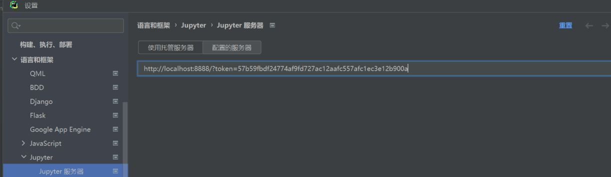

### Python包管理之poetry

#### [Poetry Pytharm配置](https://blog.csdn.net/yanxilou/article/details/143788932)

第一栏Base interpreter放.venv里面的Script/python.exe

注意第二栏放poetry.exe的路径。


##### where poetry 

G:\Projects\projects_ai\Langchain_study>where poetry
G:\Projects\projects_ai\Langchain_study\01-Langchain\poetry
`C:\Users\UryWu\.local\bin\poetry.exe`


##### 重要提醒：你真的需要 `packages` 吗？

###### ✅ 答案是：**不需要！**

因为你只是在用 Jupyter Notebook 做学习和实验，**不需要把 `.ipynb` 文件打包成 Python 包**。Poetry 的 `packages` 功能是用来定义哪些源码文件要被打包进你的库中（比如发布到 PyPI）。

```yaml
[tool.poetry]
name = "langchain-study"
version = "0.1.0"
description = "LangChain 学习项目"
authors = ["Your Name <you@example.com>"]
package-mode = false  # 关键！禁用打包模式
```

##### [PyCharm配置 Jupyter Notebook详解](https://blog.csdn.net/2401_83641360/article/details/137517812)

终端启动jupyter:

`poetry run python -m jupyterlab`

pycharm填入上述的链接（包括访问令牌 token）:



填入后确定，token会自动消失，只剩下http://localhost:8888/不用管。

这一步非常重要，只有这样才能让pycharm里面的Jupyter notebook使用你在外面的终端用命令:`poetry run python -m jupyterlab`打开的环境。

如果用pycharm里面默认的Jupyter notebook，则无法使用你的poetry环境下面的第三方包。


#### poetry怎么安装whl？

chatgpt5-mini

##### 1️⃣ Poetry 默认行为

- `poetry add <包名>` 会从 **PyPI** 下载源代码或 wheel，然后解析依赖、生成 `poetry.lock`。
- 它不会直接识别本地 `.whl` 文件作为包名，直接写路径会报错。

------

##### 2️⃣ 正确方法

###### **方法 A：先用 pip 安装，再让 Poetry 识别**

```
# 先在虚拟环境里用 pip 安装 wheel
pip install 路径\pygraphviz‑1.14‑cp311‑cp311‑win_amd64.whl

# 然后告诉 Poetry 这个包已经存在
poetry add pygraphviz --allow-prereleases
```

> 这样，Poetry 会把已经安装的包加入 `pyproject.toml` 和 `poetry.lock`。

###### **方法 B：用本地路径作为依赖**

Poetry 支持本地文件夹或压缩包，但 `.whl` 不直接支持路径安装，语法是：

```
poetry add ./some-package-folder
# 或者 tar.gz 包
poetry add ./some-package.tar.gz
```

`.whl` 文件不是源码包，Poetry 不直接解析 wheel 文件的元数据，所以不支持直接 `poetry add 路径\xxx.whl`。

#### poetry 怎么拷贝环境？

这个错误表明 `SerpAPIWrapper` 没有找到有效的 API 密钥。以下是完整的解决方案：

在 Poetry 中拷贝 Python 环境可以通过以下几种方法实现，根据您的具体需求选择最适合的方式：

---

##### 方法1：直接复制项目（完整环境克隆）
**适用场景**：需要完全相同的环境（包括依赖版本、项目配置）
```bash
# 1. 复制整个项目文件夹
cp -r old_project new_project
cd new_project
poetry lock # 拷贝完.venv目录、pyproject.toml后还要执行这个

```

然后控制台一直重复输出：

```bash
Resolving dependencies... (884.8s)Source (pytorch-cuda): Authorization error accessing https://download.pytorch.org/whl/cu118/pydantic/
Resolving dependencies... (888.3s)Source (pytorch-cuda): Authorization error accessing https://download.pytorch.org/whl/cu118/langchain-core/
Resolving dependencies... (888.8s)Source (pytorch-cuda): Authorization error accessing https://download.pytorch.org/whl/cu118/langchain-core/
Resolving dependencies... (889.3s)Source (pytorch-cuda): Authorization error accessing https://download.pytorch.org/whl/cu118/langchain-openai/
Resolving dependencies... (893.8s)Source (pytorch-cuda): Authorization error accessing https://download.pytorch.org/whl/cu118/grpcio-status/
Resolving dependencies... (898.4s)
```

这个后面要优化，这个poetry lock浪费15分钟。后面直接拷贝poetry.lock过来就不用poetry lock命令了。


下面第2点可以不做。


```shell
# 2. 重新创建虚拟环境（可选）
poetry env remove python  # 删除原有虚拟环境	没用
poetry install  # 根据pyproject.toml重新创建
```


##### 方法2：导出/导入依赖（精确版本控制）

**适用场景**：需要在不同机器/目录重建相同环境
```bash
# 1. 在原项目导出依赖
poetry export -f requirements.txt --output requirements.txt --without-hashes

# 2. 在新位置创建项目
mkdir new_project && cd new_project
poetry init -n  # 跳过交互式问答

# 3. 导入依赖
poetry add $(cat ../requirements.txt)
```

---

##### 方法3：复用现有虚拟环境
**适用场景**：同一台机器上快速创建相似环境
```bash
# 1. 查找原虚拟环境路径
poetry env list --full-path
# 输出示例：/path/to/venv

# 2. 新项目指定现有环境
cd new_project
poetry env use /path/to/venv  # 指向同一个虚拟环境
```

---

##### 方法4：使用 `poetry install` 跨项目复制
**适用场景**：已有完全相同的 `pyproject.toml` 和 `poetry.lock`

```bash
# 直接在新位置运行（需先复制两个文件）
cp pyproject.toml poetry.lock new_project/
cd new_project && poetry install
```

---

##### 各方法对比

| 方法     | 优点         | 缺点               | 适用场景     |
| -------- | ------------ | ------------------ | ------------ |
| 完整复制 | 100%一致     | 占用空间大         | 本地快速备份 |
| 导出导入 | 精确控制依赖 | 需手动处理开发依赖 | 跨机器部署   |
| 复用环境 | 最快         | 环境耦合风险       | 临时测试     |
| 锁定文件 | 官方推荐     | 需保持文件一致     | 团队协作     |

---

##### 注意事项
1. **系统兼容性**：
   - 如果跨平台（如 Linux → Windows），注意标记 `--platform` 参数：
     ```bash
     poetry export --platform=linux
     ```

2. **开发依赖处理**：
   ```bash
   # 包含开发依赖
   poetry export --dev > requirements.txt
   ```

3. **虚拟环境位置**：
   - 默认在 `~/.cache/pypoetry/virtualenvs/`
   - 可通过配置修改：
     ```bash
     poetry config virtualenvs.in-project true
     ```

4. **Python版本一致性**：
   - 确保新旧环境的Python主版本一致（3.8 ↔ 3.8）

---

##### 高级技巧（多环境管理）
```bash
# 1. 创建环境副本（基于当前状态）
poetry env export -f environment.yaml

# 2. 在新位置重建
poetry env use python
poetry env import environment.yaml
```

通过以上方法，您可以根据实际需求灵活地复制 Poetry 环境。对于生产环境部署，推荐使用 **方法2** 确保依赖精确性；对于本地开发，**方法4** 最为便捷。

#### 安装torch-2.2.1+cu118

添加镜像源：

```shell
poetry source add pytorch-cuda https://download.pytorch.org/whl/cu118
```

在pyproject.toml里面可以看到新增加了镜像源：

```xml-dtd
[[tool.poetry.source]]
name = "pytorch-cuda"
url = "https://download.pytorch.org/whl/cu118"
priority = "primary"
```

安装：

```shell
poetry add torch=2.2.1 --source=pytorch-cuda
```

```shell
poetry add torch=2.6.0 torchvision=0.21.0 torchaudio=2.6.0 --source=pytorch-cuda
```

Why not `torch=2.2.1+cu118`?

Because PyPI doesn't recognize the +cu118 suffix. That's just part of the filename in the custom index — not the actual package version.

indicates that `poetry` can't find the version `torch==2.2.1+cu118` in the default PyPI repository. That's because the `+cu118` CUDA-specific builds of PyTorch are **not published to PyPI** — they're available via a separate index URL provided by PyTorch.

先显示所有镜像源：

```shell
poetry config --list
```

清除这个镜像源：

```shell
poetry source remove pytorch-cuda
```

再显示一次。

注意把这个pytorch-cuda的镜像源改为补充镜像源，把"primary“改为"supplemental"，如下：

```xml-dtd
[[tool.poetry.source]]
name = "pytorch-cuda"
url = "https://download.pytorch.org/whl/cu118"
priority = "supplemental"
```


#### 指定版本

poetry add timm@0.9.12

或

poetry add timm=0.9.12


#### 官网推荐的方法1：

[Introduction | Documentation | Poetry - Python dependency management and packaging made easy (python-poetry.org)](https://link.zhihu.com/?target=https%3A//python-poetry.org/docs/%23installing-with-pipx)

Poetry requires Python 3.9+


#### [基础 为Python项目启用poetry和pyproject.toml - 东方天宇 - 博客园](https://www.cnblogs.com/dongfangtianyu/p/14382420.html)

发表于 2021-02-06 18:39

优先看上面的官网，接着看这篇，详细执行过程，所有输出都打出来。

##### 简洁命令：

此时打开你指定python版本的虚拟环境：

```shell
activate <conda环境>
```


```
poetry init
```

回复：

Author [None, n to skip]:  UryWu

ould you like to define your main dependencies interactively? (yes/no) [yes] no
Would you like to define your development dependencies interactively? (yes/no) [yes] no

Do you confirm generation? (yes/no) [yes] yes


查看poetry信息：

```shell
poetry env info
```

输出：

```bash
(langchain) G:\Projects\projects_others\test_1>poetry env info

Virtualenv
Python:         3.11.9
Implementation: CPython
Path:           E:\Anaconda3-2019.10-Windows-x86_64\envs\langchain
Executable:     E:\Anaconda3-2019.10-Windows-x86_64\envs\langchain\python.exe
Valid:          True

Base
Platform:   win32
OS:         nt
Python:     3.11.9
Path:       E:\Anaconda3-2019.10-Windows-x86_64\envs\langchain
Executable: E:\Anaconda3-2019.10-Windows-x86_64\envs\langchain\python.exe
```

可以看到Virtualenv不是我们想要的位置，我想要修改为./.venv


用当前激活的conda环境创建.venv目录，里面放python环境，无依赖包：

```shell
python -m venv .venv
```

退出conda环境：

```shell
conda deactivate
```

删除 Poetry 记住的环境（它缓存了 langchain 的路径）：

```shell
poetry env remove python
```

输出报错：

```bash
Environment "test-1-wQKndmcC-py3.11" does not exist.
```

如果报错，可以更明确写解释器路径：

```shell
poetry env remove E:\Anaconda3-2019.10-Windows-x86_64\envs\langchain\python.exe
```

告诉 Poetry 用这个 venv：

```shell
poetry env use .venv\Scripts\python.exe
```

输出这样则证明对了：

```shell
Using virtualenv: G:\Projects\projects_others\test_1\.venv
```

验证：

```shell
poetry env info
```

重新安装依赖：

```shell
poetry install
```

添加依赖包：

```shell
poetry add <pakge_name>
```

###### enterprise_strategy_consult_assistant

```bash
poetry init

This command will guide you through creating your pyproject.toml config.

Package name [15-project_enterprise_strategy_consult_assistant]:  enterprise_strategy_consult_assistant
Version [0.1.0]:
Description []:  政策智能匹配Agent是一个基于大模型技术的企业政策智能匹配系统，帮助企业精准对接相关补贴申报、监管新规和产业扶持政策。系统采用分层架构设计，结合规则匹配和LangChain语义理解，实现"千企千面"的精准政策服务。
Author [UryWu <1345150167@qq.com>, n to skip]:
License []:  Mozilla Public License 1.1
Compatible Python versions [>=3.11]:

Would you like to define your main dependencies interactively? (yes/no) [yes] no
Would you like to define your development dependencies interactively? (yes/no) [yes] yes
        You can specify a package in the following forms:
          - A single name (requests): this will search for matches on PyPI
          - A name and a constraint (requests@^2.23.0)
          - A git url (git+https://github.com/python-poetry/poetry.git)
          - A git url with a revision         (git+https://github.com/python-poetry/poetry.git#develop)
          - A file path (../my-package/my-package.whl)
          - A directory (../my-package/)
          - A url (https://example.com/packages/my-package-0.1.0.tar.gz)

Package to add or search for (leave blank to skip): no
Do you confirm generation? (yes/no) [yes] yes
```


###### **方法二：失败**

```shell
# 设置全局虚拟环境存放路径（例如 D:\venvs）
poetry config virtualenvs.path D:\venvs

poetry config virtualenvs.path G:\Projects\projects_others\qwen_ocr\.venv

# 启用「项目内创建虚拟环境」功能
poetry config virtualenvs.in-project true
```

此时虚拟环境会生成在项目根目录的 `.venv` 文件夹中。


##### 勘误1 pipx install poetry

但是开头不能pip install poetry，应该pipx install poetry

为什么不用pip install poetry 呢？听说“可能引起依赖包冲突“，？？？


##### 勘误2：poetry run python

进入python环境：

```python
poetry shell
```

换成：

```python
poetry run python
```

根据搜索结果，`poetry shell` 命令在 Poetry 2.0.0 版本中已经被移除，导致出现了“命令不存在”的错误。如果你需要激活虚拟环境，可以使用以下替代方法：


使用 `poetry run` 命令

虽然 `poetry shell` 命令不再可用，但你可以使用 `poetry run` 命令来运行项目中的脚本或命令，这会在虚拟环境中执行指定的命令。例如：

Shell复制

```shell
poetry run python your_script.py
```

这将使用虚拟环境中的 Python 解释器来运行 `your_script.py` 脚本。

```shell
$ import sys
$ print(sys.executable)
$ C:\Users\UryWu\AppData\Local\pypoetry\Cache\virtualenvs\01-langchain--rYtsePH-py3.11\Scripts\python.exe
```

##### pip命令

安装pypi包：

```shell
poetry run pip install some-package
```

展示安装的pypi包：

```shell
poetry run pip list
```

##### poetry show 列出所有依赖（包括子依赖）

如果你只想查看你 `pyproject.toml` 中声明的依赖：

```
poetry show
```

查看详细的依赖树：

```
poetry show --tree
```

##### poetry env info

这个命令是看poetry的python环境的，输出为：

```shell
Virtualenv
Python:         3.11.9
Implementation: CPython
Path:           C:\Users\UryWu\AppData\Local\pypoetry\Cache\virtualenvs\01-langchain--rYtsePH-py3.11
Executable:     C:\Users\UryWu\AppData\Local\pypoetry\Cache\virtualenvs\01-langchain--rYtsePH-py3.11\Scripts\python.exe
Valid:          True

Base
Platform:   win32
OS:         nt
Python:     3.11.9
Path:       E:\Anaconda3-2019.10-Windows-x86_64\envs\langchain
Executable: E:\Anaconda3-2019.10-Windows-x86_64\envs\langchain\python.exe
```


##### poetry run jupyter lab

启动jupyter lab

```shell
poetry run jupyter lab
```

或者

```shell
(langchain) G:\Projects\projects_ai\Langchain_study\01-Langchain>	C:\Users\UryWu\AppData\Local\pypoetry\Cache\virtualenvs\01-langchain--rYtsePH-py3.11\Scripts\jupyter-lab.exe
```

#### poetry run pip install和poetry add区别

很好问题！简单回答是：

> ✅ **是的，它们安装的依赖会放在同一个地方（当前 Poetry 项目的虚拟环境中）**，但二者的行为有**关键区别**。

------

##### ✅ 共同点：安装位置相同

无论是你运行：

```
poetry run pip install <package>
```

还是：

```
poetry add <package>
```

**依赖都被安装到该 Poetry 项目专属的虚拟环境中**，这个虚拟环境的位置一般在：

```
~/.cache/pypoetry/virtualenvs/<project-name>-xxxx/
```

------

##### ⚠️ 关键区别：是否更新 `pyproject.toml`

| 命令                               | 会更新 `pyproject.toml` 吗？           | 建议使用场景             |
| ---------------------------------- | -------------------------------------- | ------------------------ |
| `poetry add <package>`             | ✅ 会写入依赖列表（正式依赖或开发依赖） | 推荐用于**正式管理依赖** |
| `poetry run pip install <package>` | ❌ 不会写入 `pyproject.toml`            | 仅用于**临时测试或调试** |


##### ✅ 正确方式（用于管理项目依赖）：

```
poetry add requests
```

结果：

- 安装 `requests` 到虚拟环境中
- 把它添加到 `pyproject.toml` 和 `poetry.lock`

##### ⚠️ 临时方式（不会记录依赖）：

```
poetry run pip install requests
```

结果：

- 只安装，但不会记录依赖
- 下次别人用 `poetry install` 时无法自动获取该包

------

##### ✅ 推荐做法poetry add

**始终优先使用 `poetry add`** 来安装和记录你的依赖，只有在需要调试或临时实验时再用 `poetry run pip install`。

------

如你想查看 Poetry 当前虚拟环境在哪里，可以运行：

```
poetry env info
```

output：

```bash
G:\Projects\projects_ai\Langchain_study\01-Langchain>poetry env info

Virtualenv
Python:         3.11.9
Implementation: CPython
Path:           C:\Users\UryWu\AppData\Local\pypoetry\Cache\virtualenvs\01-langchain--rYtsePH-py3.11
Executable:     C:\Users\UryWu\AppData\Local\pypoetry\Cache\virtualenvs\01-langchain--rYtsePH-py3.11\Scripts\python.exe
Valid:          True

Base
Platform:   win32
OS:         nt
Python:     3.11.9
Path:       E:\Anaconda3-2019.10-Windows-x86_64\envs\langchain
Executable: E:\Anaconda3-2019.10-Windows-x86_64\envs\langchain\python.exe
```


#### [Python包管理之poetry基本使用 - 知乎](https://zhuanlan.zhihu.com/p/110721747)

编辑于 2020-03-05 09:14

npm的思想

薰衣草
不用那么复杂，安装好Python后直接执行“pip install poetry”就可以了，也不用另外设置环境变量。

2023-05-06

#### [见 Pip 和 Conda！Poetry 才是 Python 依赖管理的最好选择！ - Python与数据挖掘的文章 - 知乎](https://zhuanlan.zhihu.com/p/679243801)

发布于 2024-01-22 22:03

poetry与pip、conda的简单比较，poetry优。

##### poetry add 

##### poetry remove


#### [poetry如何更换国内源（清华源/阿里源/豆瓣源）](https://www.resourch.com/archives/66.html)

##### 全局源


##### 虚拟环境源

###### **在项目中指定备用源**

编辑项目根目录下的 `pyproject.toml` 文件，增加或修改 `[tool.poetry.source]` 部分，例如使用清华大学的镜像：

```toml
[tool.poetry.source]
name = "pypi-tuna"
url = "https://pypi.tuna.tsinghua.edu.cn/simple"
priority = "primary"
```

这里设置 `priority = "primary"` 即表示该源为首选源，覆盖默认的pypi源

###### **使用命令行添加或切换源**

你可以使用 `poetry source` 命令添加新的源，然后安装依赖时指定使用该源。例如：

```bash
poetry source add  --priority=supplemental pypi-tuna https://pypi.tuna.tsinghua.edu.cn/simple

poetry install --source pypi-tuna
```

--priority: Set the priority of this source. Accepted values are: default, secondary, supplemental, and explicit. （设置该源的优先级。接受的值有:默认值、次要值、补充值和显式值。）


#### [poetry的安装与使用](https://www.cnblogs.com/wender/p/17616947.html)

##### poetry install = pip install -r requirements.txt

安装环境，根据pyprojecy.toml中配置的依赖，进行环境的安装，类似于


##### poetry lock

根据pyproject.toml刷新并锁定poetry.lock文件，当我们不小心修改了poetry.lock或者手动更新了pyproject.toml中依赖的版本，就需要执行此命令进行更新
如：我在pyproject.toml中添加了如下内容


##### poetry.lock介绍

poetry.lock相当于pip的requirements.txt，详细的记录了已安装的依赖信息

当使用poetry add <package_name>安装依赖的时候，poetry会自动帮我们更新pyproject.toml和poetry.lock文件，

当我们单独修改了某一方，导致两个文件不匹配的时候，就需要我们自己去同步两个文件，执行poetry lock 会同步两个文件，并更新poetry.lock，

更新完成后需要执行poetry install 来将更改同步到环境。


##### 迁移环境

我的G:\Projects\projects_ai\Langchain_study\01-Langchain项目的环境在C:\Users\UryWu\AppData\Local\pypoetry\Cache\virtualenvs\01-langchain--rYtsePH-py3.11\Scripts

但是我现在想从C盘移动这个环境的位置到G盘，在命令行输入：

```shell
cd /d G:\Projects\projects_ai\Langchain_study\01-Langchain

poetry env use C:\Users\UryWu\AppData\Local\pypoetry\Cache\virtualenvs\01-langchain--rYtsePH-py3.11\Scripts\python.exe
```

输出：

```bash
Creating virtualenv 01-langchain in G:\Projects\projects_ai\Langchain_study\01-Langchain\.venv
Using virtualenv: G:\Projects\projects_ai\Langchain_study\01-Langchain\.venv
```

此时在G:\Projects\projects_ai\Langchain_study\01-Langchain\下系统创建了.venv目录，里面有个环境就是从C:\Users\UryWu\AppData\Local\pypoetry\Cache\virtualenvs\01-langchain--rYtsePH-py3.11\Scripts\拷贝过来的，但是C:\Users\UryWu\AppData\Local\pypoetry\Cache\virtualenvs\01-langchain--rYtsePH-py3.11\Lib里面没有第三方库，需要手动copy过来。

然后我把C:\Users\UryWu\AppData\Local\pypoetry\Cache\virtualenvs\01-langchain--rYtsePH-py3.11\里面的所有东西直接拷贝到G:\Projects\projects_ai\Langchain_study\01-Langchain\\.venv里面去，包括上面用poetry env use生成的G:\Projects\projects_ai\Langchain_study\01-Langchain\\.venv\Script目录也重新覆盖一次，否则会无法使用第三方库。


#### [Python 新规范 pyproject.toml 完全解析-腾讯云开发者社区-腾讯云](https://cloud.tencent.com/developer/article/2219745)

发布于 2023-02-20 10:51:48

poetry比pip的优势比较。