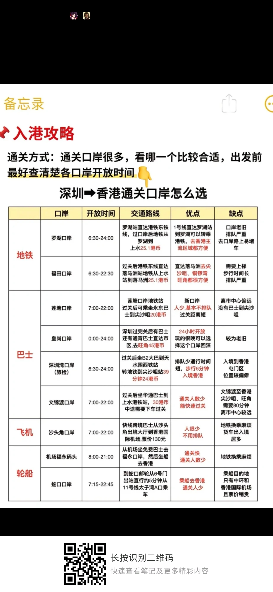
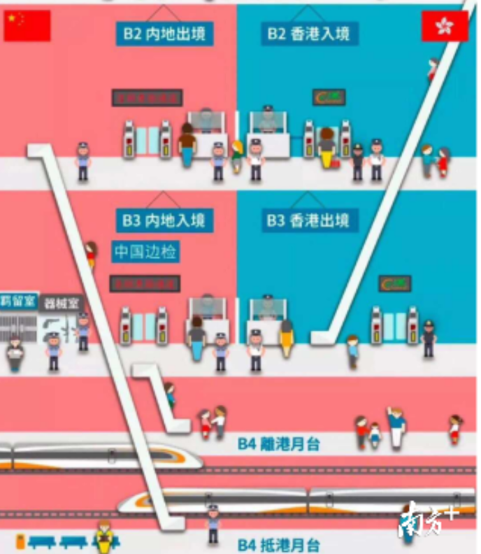
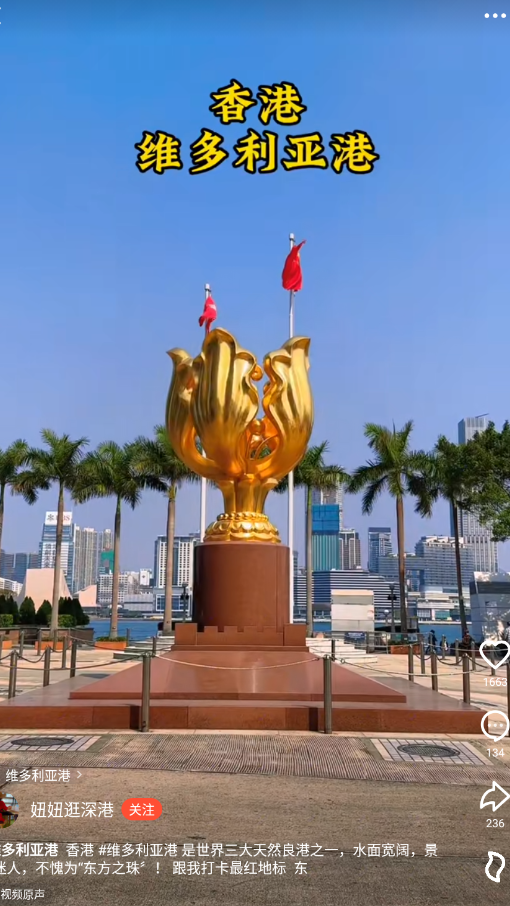
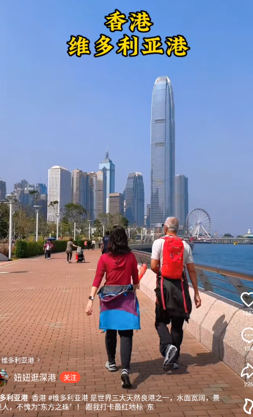
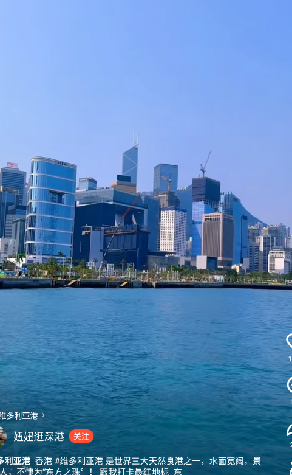
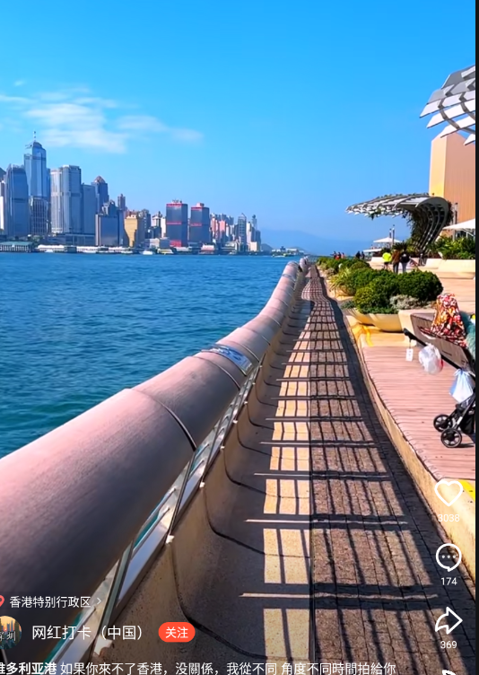
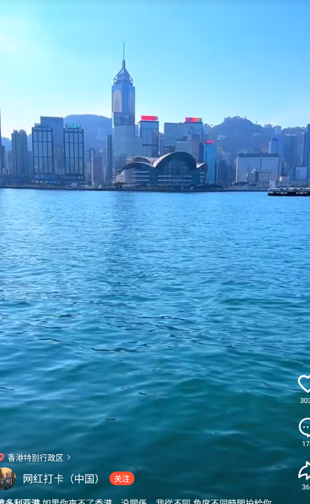
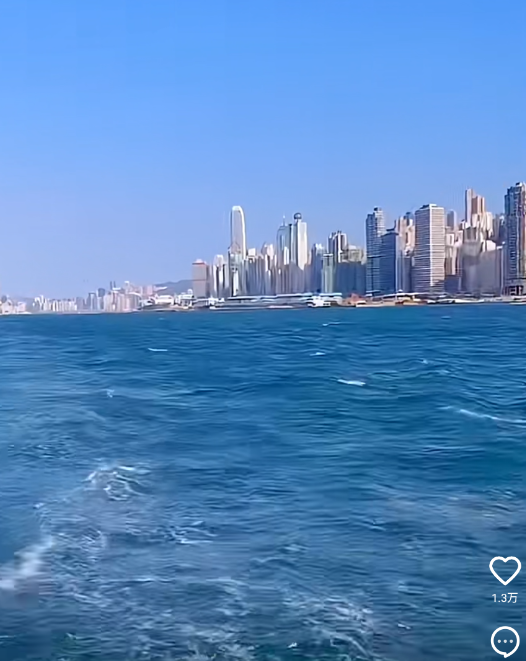

### 香港
#### 出行 通行证

##### 通行证 深圳可办 省内7天内，省外10天内
Ricardo72
通行证需要会户籍所在地办理嘛？我四川人，现在在广东
2023-04-06 20:58 👍3
等待的岁月
不用，深圳这边很快的，省内7天内，省外10天内。快得很
2023-05-28 01:47

Spike的青椒没有肉丝
深圳本地宝有攻略
2023-06-06 10:06

雪飘邈
回复 @白马公主啦啦啦 :支付宝充流量那里有个国际港澳台流量 ，你点开看看 好像要10几块钱几G[笑哭]时间长了记不住了
2023-07-08 19:53 👍2
Spike的青椒没有肉丝
回复 @白马公主啦啦啦 : 如果手机有esim，可以去屈臣氏买sosim卡，以后如果要去，可以用app换城esim卡，不过要交25快港币
2023-08-20 22:31

##### 通关多个口岸

##### 深圳的出发站
a221922w
在深圳北站出发到香港🇭🇰只需23分钟、在福田站出发到香港🇭🇰只需14分钟、这是坐高铁🚄。
2023-02-28 00:55👍18

冇耳朵峰峰
深圳是地铁吧？所以说去香港福田是最快的？大陆去香港就深圳和福田两地吗？
2023-03-14 14:14

##### [深圳—香港高铁14分钟保姆级攻略，需要提前准备以下材料](https://www.bilibili.com/video/BV1NY411q76k/)
2023-02-04 10:53:04
深圳—香港高铁14分钟保姆级攻略，需要提前准备以下材料，
1、身份证
2、港澳通行证
3、海关黑码（微信搜索海关指尖服务提前申报）
Tips:提前开通国际漫游服务，同时携带少量现金，另外出门随身携带港澳通行证如果被查会被罚款。

a221922w
在深圳北站出发到香港🇭🇰只需23分钟、在福田站出发到香港🇭🇰只需14分钟、这是坐高铁🚄。
2023-02-28 00:55 👍19

范丁娥
第三步海关黑码是什么？是扫海关申报码吧？
2023-10-03 13:08

##### 海关黑码

[出境、回国别忘了这一步！手把手教你申请海关黑码！ - 知乎](https://zhuanlan.zhihu.com/p/633426191)
4月29日起所有来华人员不再查验48小时核酸
自4月29日起，所有来华人员可以登机前48小时内抗原检测代替核酸检测，航空公司不再查验登机前检测证明。但出入境仍然需要进行海关健康申报，取得海关黑码才可以顺利通行！
注意：海关黑码为24小时有效期，建议办理登机牌后填写！
所有申报都需在“海关旅客指尖服务”小程序上进行

3、填写基本信息⬇️
出入境选择时根据自己的情况如实填写，回国就选择入境!出国就选择出境!证件类型和证件号码，一定要选择护照，号码也要填写护照号，海关只承认护照，不要填身份证。

是否乘坐商用交通工具一定要选是，选是!要不然航班号和座位号你就选不上了。而且座位号、航班号一定要写正确，要不然海关会让你出去修改并且重新排队。⬇️
居住地地址要精确到门牌号: xx省xx市xx区xx街道xx小区xx单元xx楼x-x号。⬆️

有没有类似新冠的感冒发烧症状，如实申报。⬇️
最后会生成黑码。二维码24小时内有效，如过了24小时后，可以重复申请，重新提交时也保留了之前的信息，不用全部重复填写，得到海关码后截图保存，方便随时检查 。

发布于 2023-05-30 18:19・IP 属地北京

##### 小巴要港币零钱 城巴支付宝
十佳员工的非洲生活
回复 @叶晨6886 :小巴要，城巴可以用支付宝
2023-10-03 01:06

##### 香港出行易 提供所有可乘坐的巴士和鉄路路线
YAN²
回复 @666你好6 :下次如果再次访港。 你搜一下“香港出行易”有网页版本，也有IOS、安卓、华为版本的应用程式。 是香港政府提供的电子服务，只要输入起点和终点，就会提供所有可乘坐的巴士和鉄路路线、价格和行程所需时间，也会指引你如何到达车站，下车后如何步行至目的地。版面也可选中文繁体、简体、英文。祝你旅途愉快
2023-04-03 14:31👍2

##### [香港高铁西九龙站“一地两检”通关全攻略，人工柜台过关不到30秒](https://static.nfapp.southcn.com/content/201809/22/c1516464.html?group_id=1)
2018-09-22 09:06

港铁公司副车务营运总管胡瑞华告诉记者，在12306购票的内地乘客可以在西九龙站人工售票柜台取票，需支付一定的手续费，暂时不支持在自助售票机取票。

同时，旅客也可以选择在西九龙站购票。西九龙高铁站设有自助购票机和人工购票处。自助购票机可使用现金、八达通、银行卡购买车票。需要注意的是，自动售票机仅支持使用二代身份证，持港澳通行证购票需到人工售票处。人工售票处除以上方式外还支持微信和支付宝购买，购票还是很方便的。

票价方面，广州南站到西九龙站的票价为215元人民币，深圳北、福田到西九龙站的票价分别为75元、68元。

西九龙站的离境层设在地下三层（B3），电梯门一打开，就看到正前方悬挂的“离港”指示牌，与地贴一起清晰地指向离港方向。记者顺着指引来到离境大堂，看到通关处共设有约30条旅客自助出境查验通道和30个香港居民与访客柜台。

###### 水果、冻肉 香烟、酒精 禁止携带入境
或携带了水果、冻肉等禁止携带入境的管制物品；以及携带香烟、酒精制品等需要征税的商品时，希望旅客能主动向海关部门申报，并预留足够的时间来办理海关的手续。

【乘车注意事项】
乘坐高铁前还应该注意到行李不能过重。广深港高铁跨境旅客设有行李限重，成年人旅客免费携带物品20千克，儿童旅客（含免费乘车儿童）10千克，外交人员35千克，每件物品外部尺寸长、宽、高之和不超过130厘米，不办理行李、包裹托运，物品超重、超大时对超重部分核收运费。
此外，与内地高铁乘车不同，广深港高铁香港段不允许上车之后补票。
###### 45分钟以上的候车时间
由于票务办理以及出入境手续办理会花费一定的时间，港铁公司建议乘客预留45分钟以上的候车时间，以免错过高铁。
##### 香港并不是很歧视说普通话
丶山川行鹤
香港并不是很歧视说普通话的，主要是以前有过一些小过节，比如一些去香港玩的游客不管地铁贴的告示吃喝外放，随地丢垃圾，然后扫货什么的妨碍本地人了，刚好又碰到几个比较暴躁的就骂起来，再加上历史原因，一些人非常反感什么的，传久了自然而然就说香港歧视说普通话的。不过也是看人，有的人就是戴有色眼镜歧视外地人，有的对旅客也很礼貌。
2023-04-05 19:49👍109

哈蜜瓜candy
不是歧視，而是有太多內地來的騙子是說普通話的，如路邊的丐幫們，還有搭訕的，搶劫的，碰瓷的，籌款的等，次次新聞的都是假裝內地旅客實際來港行騙犯案，所以一聽到說普通話的都提高警覺，所以問路不一定回答，態度不好是因為前人結下的果，畢竟誰也不想善心被利用吧
2023-04-17 05:32👍26

大頭真夏
可以用支付寶，不過那些感應非常垃圾，坐車我也放棄用了，最好辦一張八達通比較方便
2023-04-02 12:04👍3

笨笨886
香港是全球生活消费水平最高的地区 前几个月才刚刚被纽约超过一点 因为香港房租降了一点 这边经济流水很快的
2023-07-15 17:35👍1
Cyan兰
这么说吧，租房住一半工资已经没了，每天吃饭至少得花上一到两百，你还觉得多吗？
2023-07-29 00:51👍2

tytenwoods
回复 @笨笨886 :刚去了香港一周，见了黄埔新天地美食坊太兴茶餐厅招工，真的是万几，经理23至26k，服务员好象14至17k，太兴几乎全是50左右的阿姨阿伯，香港的生活物价感觉已超东京了。
2023-07-29 01:35

##### [便宜出行](https://www.bilibili.com/video/BV1hz4y147Aj/)

###### 莲塘口岸 只要几块钱
豆豆顶着个猪头
回复 @木冉子鸦 : 走莲塘口岸
2023-09-24 03:09 👍1

木冉子鸦
回复 @老卢de青春之旅 :过关那条路坐巴士只要几块钱
2023-07-28 11:04 👍1

伊娃伊娃伊
100元吃2個麥當勞都沒了
2023-07-21 03:04 👍35

###### 旺角两菜饭
羽音萌萌哒 笔记
其实去旺角有很多两菜饭的，因为大部分都是内地人开的所以也不会有歧视，30块钱就有两菜一饭了，填饱肚子完全没有问题，最好是去那些看起来有很多学生在的饭店，一般来说基本不会太贵，在30到50多徘徊。
我平时放午饭就去吃两菜饭，那家店真的很好吃，但是我忘记店名了...平时的菜色就是这样的。

背水一战88
最便宜的两送饭有25的，连续吃两顿的话一天也就要50[吃瓜]
2023-11-11 07:56 👍1
羽音萌萌哒
回覆 @Recusion :我在学校附近的，旺角这边人多又密，租金也贵，没有碟头饭开在这边的。确实是有碟头饭，但是我不可能在一个小时的时间跑过去吃碟头饭，太花时间加车费也要钱啊
2023-11-08 07:08

###### 出租车15分钟150块
月浅明稀
前阵子在香港，因为人生地不熟，错过了公交，后来赶时间，无奈之下打了15到20分钟的车，150块，你知道我坐在车里，看着打表机上的金额蹭蹭蹭的跳的心情么[辣眼睛][辣眼睛]
2023-07-27 01:11 👍49

###### 落马洲或者罗湖坐地铁到到旺角 收过境税
ICE鑫森淼燚垚龑龖飝
还真不是过境费，落马洲或者罗湖坐地铁到到旺角就是这个价，便宜可以做小巴，再换巴士，时间久，便宜一半吧
2023-07-19 08:54 👍62
Lawerence_Claus
落马洲或罗湖到上水是要收过境税的
2023-07-19 10:05 👍12

Lawerence_Claus
回复 @久远年岁之夏 :所有出入口岸的交通工具都要收过境税的
2023-07-21 23:19 👍4

Pipiwat
小巴蓮塘到上水9.1 地鐵羅湖到上水27 地鐵上水到金鐘24.5
2023-08-11 01:23 👍4

豆豆顶着个猪头
回复 @海岸上的黑猫 : 最省钱就走莲塘口岸，过完关坐小巴到上水再转别的，港铁那一站确实贵没办法
2023-09-24 03:08 👍1

凛风昔忆
回复 @XZXJ丶 :现在罗湖/落马洲到上水是25.7元了[doge]（反过来同样价钱）
2023-11-05 20:53

UARMsky
之前住过万达青年旅舍[doge]一百八十左右
2023-07-19 12:27 👍16

Pipiwat
回覆 @我去冈仁波齐 :從蓮塘去上水搭小巴9.1 only
2023-08-11 01:27

###### 重庆大厦 10平米 300多一晚
溪与
为啥我去重庆大厦里面住的10平米不到都得要300多一晚呀
2023-07-19 03:15 👍3

老卢de青春之旅
回复 @万俟陨枫 :携程上搜索的最便宜的青旅，在旺角附近
2023-10-08 21:16

--回家的游惑--
建議來旅遊的不要貪便宜住重慶大廈，本地人都知道那是個很亂的地方，也出過幾次新聞的。
2023-09-15 20:38
###### 九记牛腩 优品360 态度恶劣
我是暖男老实人
九记牛腩别去太贵了，分量小性价比不高，但是味道还可以，主要是服务员态度恶劣
2023-07-19 12:05 👍183

聖なる翼
回复 @Beckii96 :去优品360都会被工作人员翻白眼，把硬币丢地上，很好奇你们香港人为什么这么讨厌大陆话（除了我那个香港朋友）
2023-11-07 10:23
聖なる翼
回复 @Beckii96 :是真的，有部分店会因为听到普通话而不高兴[笑哭]
2023-11-08 10:00

###### 大部分zfb用现金机会不多
豆豆顶着个猪头
大部分都能刷zfb，用现金机会不多
2023-09-24 03:05 👍1

表里如一方岐暮
5块钱的渡船，40的地铁？什么奇妙的定价
2023-10-11 06:55 👍1
你的世界0我的名字
公交起步价都18元
2023-10-16 11:13

###### [如何用最少的钱从深圳去香港市中心？这次是从莲塘口岸入香港](https://www.bilibili.com/video/BV1vL411R7UY/)

4.7万  21 2023-03-16 16:32:42

Logan阿
到尖沙咀以后，晚上怎么回深圳比较好兄弟。
2023-03-17 01:51 👍65

ZecoClips
全日通跨境巴士……45港纸旺角送到皇岗，夜间加收5
2023-03-17 08:58 👍14

Mitsuha1201
反正不要坐港铁就对了，落马洲到香港大学要44块8，太贵了，还是学生卡。我从大学站到港大接我朋友然后去落马洲一共花了五六十，亏！[委屈]
2023-03-25 03:12 👍69

封陈无
可以买一日通，两三年前买的110，一天坐地铁不用钱，但是过那个关站只能一个来回。不买的话正常坐到市中心是40多港币，一个站5块钱这样，建议到香港说粤语或英语，说普通话可能店员给你加点“料”
2023-03-18 12:59 👍11

爱吃番茄の酱酱
普通话也没关系的，老板做生意的都听得明的，服务员也没有态度不好，反正我都是普通话，没有做生意的会跟钱过不去。地铁只要不跨海，岛内旺角坐到尖沙咀4个站只要4.32元。
2023-04-07 12:56

波涛中的小船
20港币能直达尖沙咀确实划算，比坐东铁线要便宜整整30块钱，不知道巴士全程需要多长时间啊？路上会不会堵车？
2023-03-20 11:41 👍10

老涂的账号
我以前也是从深圳湾过关的，在淘宝买一张电话卡和一张一日通
2023-03-22 23:37

二灰二黑二灰黑
除了永东巴士外还有粤港直通巴，微信搜索就能查
2023-03-22 13:23 👍1

###### [莲塘口岸有一家中国银行 换港币](https://zhidao.baidu.com/question/1249897512595158979.html)
2023-06-18
莲塘口岸有一家中国银行 (莲塘口岸支行)，该银行提供外汇买卖服务，所以莲塘口岸有换港币的地方

[莲塘口岸可以换港币吗\_百度知道](https://zhidao.baidu.com/question/1393266405928581100.html)
2023-06-12
可以。莲塘口岸比较新，目前兑换只有一家中国银行(不过可能经常没有港币现金可兑)，建议提前备好少量港币，除了吃饭喝水很多店铺坚持现金，大型商场都可以刷卡或者支付宝和微信支付。

[从莲塘口岸去香港有多香？免排队，停车免费，8分钟极速通关！\_腾讯新闻](https://new.qq.com/rain/a/20230210A049WJ00)
不用拆！带着自行车过关
深港两地自驾停车都方便

400+的车位，让想自驾出行的深圳人更加便利，目前停车还免费！

专线接驳，又快又省
9HKD到上水，20分钟直达香港市中心

与罗湖、福田口岸相比，虽然少了港铁，但莲塘口岸的出行选择更多，有跨境旅游巴士、的士车、熟悉的老朋友 — 79K香港巴士，更有香港城巴专为莲塘口岸开通的全新 [ 新界东口岸特快 ] 专线。
从边检大楼下来，选择你心仪的出行方式，就可以立刻出发。
15分钟抵达上水，仅需9.3HKD

不过需要注意的是，平常工作日只有B7正常运营，B8和即将开通的B9仅在周末及节假日运营。每条线路中间停靠的小站点，要提前按窗边的铃5下，告知司机需要停靠，在小站点要上车也需要挥手示意司机停车，不然司机是不会理你的！

每条线路往返路段的停靠点会有个别不同，大家出行之前记得查阅好具体上车地点~或者下载新城新巴app也可以查阅到具体线路及时刻表（非广）。

除了三条专线之外，口岸也有永东的跨境大巴，上网购票，只需20rmb，即可20分钟直抵尖沙咀！

过港小Tips
1、香港口罩令未解除，除了正在吃饭喝水，千万不要摘下口罩，不然会痛失5000块；
2、香港一切公共场合禁烟；
3、八达通可以下载Octopus（八达通）app，不用登陆，选择Card Enquiry，用手机NFC功能识别激活，如果无法激活就是八达通彻底过期啦！要去线下柜台解决；
4、香港现在大部分巴士都支持乘车码or电子支付码扫码支付，打开“乘车码”小程序，将手机定位地切换为香港即可；
5、过关的时候需要扫健康申报码，提前准备好就不会被卡住啦；
6、莲塘口岸真的好香啊TAT！
#### 支付

##### 香港当地八达通NFC支付更方便
23389775305_bili
在香港我觉得他在当地消费的话，八达通还更好用。因为可以离线的，不用通过网络。在国内说的支付都要通过网络特别信号差的地方，还有地下室。特别是你赶时间的时候，网络不稳定。把人急都急死。害着后面的人也跟着排队。如果国内能普及NFC支付那就完美，以后没有网络也可以随便刷。
2023-05-10 21:55👍22

##### 深圳地铁可充八达通
WYJ199213
港铁车站内的充值机和客务中心，轻铁部分车站站内的充值机和客务中心，以及九巴、城巴、新巴和新渡轮(离岛航线)的客户服务中心等也有提供充值服务，每次充值必须是50港币的倍数，但充值机只能接受50元或者100元港币纸币。而使用长者、“学生身份”或“残疾人士身份”个人八达通在港铁客务中心充值，可以选用10港币或其倍数的充值额。  

每张八达通可以储值不超过3000港币，在2019年12月1日之前发出的八达通产品，则以1000港币为限。如果需要加大储值额到3000港币，也可以经过八达通App或者八达通服务站。  

即使卡内余值金额不足，只要余额尚为正数，并且差额不大于备用额，仍然可以在毋须充值的情况下交易。2017年10月1日前发出八达通备用额为35港币，该日之后发出八达通为50港币。换言之，八达通卡最小储值金额是港币负35或者50元。这允许卡主在储值金额不足的情况下，仍然能够搭乘香港大部分交通工具或者购买商品。  

香港地区以外的八达通充值操作目前只有在深圳可以进行，在深圳地铁各站设置的深圳通银行卡自助充值机除了可以充值深圳通外，也可以充值八达通。但充值金额是以港币为单位，并以当日人民币对港币汇率进行扣款。
2023-03-31 08:48👍14

##### 苹果手机带NFC卡绑定八达通
一只没有名字的法棍
回复 @威尔士王妃戴安娜 : 实体八达通仅支持现金充值。苹果手机带NFC卡绑定八达通，之后实体卡作废，可用信用卡充值，关机后5小时内可继续正常使用八达通，缺点是充值汇率很高比较坑
2023-09-22 00:50
##### 支付宝可支付地铁但是不是所有出口都有二维码支付
[去香港不用买八达通也可以，手机支付超方便](https://www.bilibili.com/video/BV12o4y1g7fu/)

Ter-LET
打开Apple Pay，选择添加交通卡，找到八达通，支付金额并添加即可
2023-06-13 06:33👍4
###### 八达通注册一般要有香港的电话号码或者香港的银行卡绑定
唔知仲要你做咩鸠事
回复 @Ter-LET :有中银香港啊[笑哭]，八达通注册一般要有香港的电话号码或者香港的银行卡绑定
2023-09-15 21:47
唔知仲要你做咩鸠事
回复 @唔知仲要你做咩鸠事 :不过银联是可以
2023-09-15 21:47
###### 八达通 二百一张，五十押金 地铁站柜台可买 只收港币现金 自助增值机充钱
你好我是四元
地铁现在可以刷微信和支付宝(应该是都要在小程序提前弄好的)，实在不方便现在可以在这办一张八达通，走的时候记得退八达通就好(二百一张，五十押金，买一张里面带一百五，各个地铁站柜台都可以买的，要注意只收港币现金)，之后八达通可以用现金直接在自助增值机那边充钱的，或者你有香港那边的银行卡，在APP上面弄(应该是只有香港的银行APP才行)
2023-09-18 16:11 👍2

###### [看夜景坐的那个小电车用八达通](https://www.zhihu.com/question/268913901/answer/345041723)
机场有ATM。中国银行的呢，好像没有手续费我记得。八达通一定要买，坐车坐船都方便，上那个什么山看夜景坐的那个小电车还是怎么叫，也可以用八达通。现在想想在那个买票的队伍排半天并不需要买票也挺浪费时间的。应该调整一下，像坐地铁一样，想太多了。。。。
编辑于 2018-03-19 08:40

###### 随便的小店都能支付宝
大爱马竞
现在香港路边摊都能刷支付宝了呀
2023-10-11 17:47

Recusion
现在随便的小店都能支付宝，上周刚去完
2023-11-07 21:15

ilamz
看你是没坐过地铁吧，现在八达通能直接支付，不过要提前弄好app，高铁站每次过关完很多人都在地铁闸机门口弄，但说实话不如去开张卡(但是不建议玩两天就不来的，因为退卡不足3个月收15%手续费好像)
2023-11-12 04:19

##### 一出福田口岸地铁就有卖八达通卡的，145元一张 地铁便利店可以用支付宝换港币
一出福田口岸地铁就有卖八达通卡的，145元一张，比某宝便宜，关键是方便，再去地铁便利店，可以用支付宝换港币，100元一元手续费，适用于我这种忘带银行卡的人～

##### [银行换港币 手续费用高](https://jingyan.baidu.com/article/c843ea0ba7e10f77931e4a0e.html)

去银行换。不建议去银行换港币，因为手续费用太高，买入卖出价格，都不一样！很多没有在深圳的小伙伴们，第一次去香港，所以很激动，也很紧张，着急上火的去银行马上把港币换个很多！

来深圳口岸换。深圳罗湖口岸，福田口岸有很多换币正规点，这个比较推荐！当然不会按照当天汇率给的一般都会低些。一般坐车买八达通150HKD，其它要留够吃住，香港消费贵大家都知道，所以最好多换一些，另外香港大部分消费是支持银联卡刷卡服务的。

在香港换，这个是极力不推荐的，这种只是应急情况下需要港币没办法！虽然在香港有很多了兑换点，什么样的币种都能换的到，但是手续费也是极高，每换一百块钱人民币手续的费用你至少有五块以上被兑换点赚取！

香港支持中国银行香港银行取港币

#### 消费
##### [没钱别去香港！B站最穷屌丝只换了100港币进去…后果惨不忍睹](https://www.bilibili.com/video/BV1hz4y147Aj/)

#### 景点

##### 维多利亚港 香港

##### [不能错过的香港摩天轮如何去游玩？](https://zhuanlan.zhihu.com/p/643896075)
发布于 2023-07-16 16:23・IP 属地广东

来香港旅游20元3圈的摩天轮不要错过啦❣️|||相比内地的摩天轮 香港的摩天轮真的是超高性价比了 20元可以坐三圈！还能俯瞰维多利亚港的美景❣️傍晚的时候还能看到专属的落日浪漫 它真的，我哭死

怎么到达摩天轮
1️⃣坐地铁到中环站A出口（走天桥更方便）步行几分钟就到了
2️⃣坐地铁到香港站A出口（走天桥）就能看到摩天轮
3️⃣乘坐尖沙咀➡️中环的天心小轮（下船就能看见）直达

如何买票
1️⃣网上购票：官网、某团等
2️⃣现场排队买票（节假日排队时间很长）

关于票价
1️⃣成人：20hkd
2️⃣3-11岁小孩/65岁以上老人：10hkd ，3岁以下免费
3️⃣包厢：160hkd
4️⃣支付方式：现金、ZFB、WX、八达通
5️⃣时长：3圈（说是15分钟，但我看了下好像有20几分钟）

铜锣湾富士大厦，旺角建兴大厦。庙街，平民低阶版。
https://www.youtube.com/watch?v=AdCBZZu-qkk

https://www.youtube.com/watch?v=IdaMVKMYpqg
富士大厦低楼层西餐

[香港快餐：享誉世界的极品美食](https://www.douban.com/group/topic/185777048/?_i=97651737059BeK)