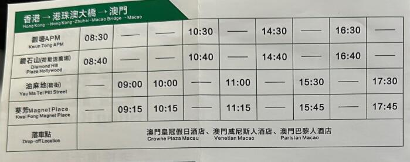
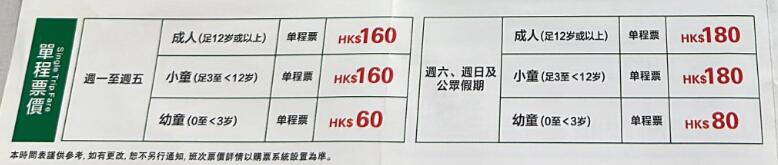
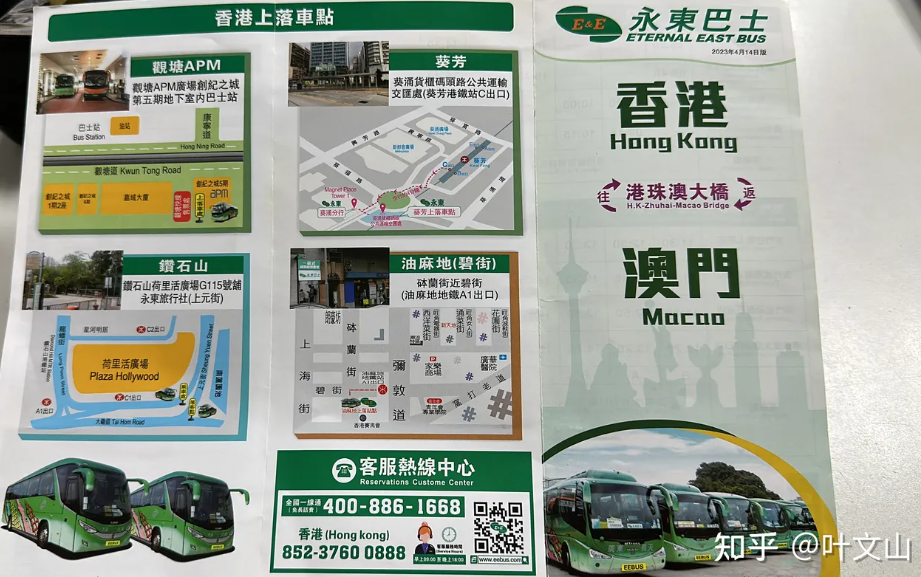
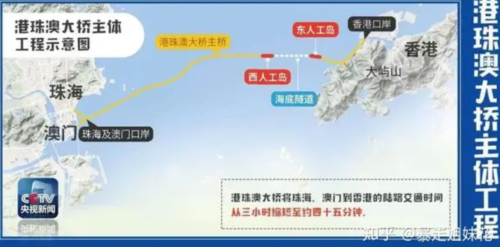

### 珠海
#### [珠海吉大九洲机场出发游览8分钟](https://www.sohu.com/a/408936810_737500)
2020-07-21 20:08
提前1天16:00前下单，【空中看大桥 | 直升机观光票】，空中观赏世纪工程港珠澳大桥！

| 航线 |航路 | 平日 周一至周五 | 周末 周六日 | 大假期 |
|-|-|-|-|-|
| A线：大桥空中游 | 港珠澳大桥+日月贝 | ￥599 | ￥699 | ￥699 |
| B线：万山秘境低空游 | 港珠澳大桥+海上风车田+万山群岛 | ￥999 | ￥1099 | ￥1099 |
| C线：海滨低空游 | 港珠澳大桥+日月贝 情侣路+淇澳大桥 | ￥899 | ￥999 | ￥999 |

599元（空中游览8分钟）
999元（空中游览18分钟）

699元航线：吉大九洲机场一一港珠澳大桥一一日月贝一一情侣路一一九洲机场
999元航线：吉大九洲机场一一港珠澳大桥一一日月贝一一唐家湾一一情侣路一一九洲机场

### 澳门
#### [来澳门证件有效期不到90天以上，资产5000澳门币以下不能进](https://zhuanlan.zhihu.com/p/432303533)
旅客入境澳门，必须携带以下金额的现金或者等额的支票、信用卡、电子支付工具资产，同行家人的金额按每人80%计算。
在澳门不超过7天， 需要有 5,000澳门币或者等额资产，折合 4000人民币；

澳门小新 作者
不一定要现金，电子账户资产也行，肯定係有人赖嘢，先有咁嘅规定。
2023-07-05
澳门小新 作者
算，银行卡，支付宝，微信都行
2021-11-15

#### 永东巴士 160 HKD 
[发布于 2023-07-18 12:28](https://www.zhihu.com/question/602792692/answer/3123824800)

最晚17:30的油麻地，永东巴士，2023年4月14日版。

160 HKD

#### [从内地去香港玩，中途想去澳门，澳门跟香港可以来回往返吗？](https://www.zhihu.com/question/602792692)

首先要有香港澳门两地各一次的签注，并且进入澳门时港澳通行证的有效期要超过90天，不然会被拒绝入境。
假设1号入境香港，2-8号都可以前往澳门一次并回到香港。
如果问的是去两次澳门，那就不行，因为澳门只有单次签注，不像香港可以有两次签注。
[发布于 2023-07-07 16:31](https://www.zhihu.com/question/602792692/answer/3108020053)

可以，香港签注有2次就可以
发布于 2023-07-20 12:20

香港到澳門船票，單程160往返320港幣，往返有時打五折。香港到澳門巴士，單程65-75往返130-150港幣，往返有時打五折。
发布于 2023-05-24 20:15

#### [30分钟到香港！港珠澳大桥最强通行指南来了！](https://zhuanlan.zhihu.com/p/47518402)

这份指南快收好！
什么车可以上桥？
有五个类型的车可以上桥：跨境巴士、穿梭巴士、跨境出租车、货运车辆、跨境私家车。
跨境巴士：配额共200个，另有200个配额给现时行走其他口岸的粤港跨境巴士转走大桥，每一配额可于每日营运来回班次各一次，跨境巴士在大桥口岸区域内不允许接载新的旅客。
口岸穿梭巴士：是大桥粤港及港澳口岸之间的主要交通工具。忙时每5分钟一班，闲时每10～15分钟一班，深夜时段为每15～30分钟一班。
跨境出租车：配额共250个，每日往来接送次数不限。
货运车辆：在粤港跨境货车方面，现时粤港跨境货车可以免办手续通过港珠澳大桥
跨境私家车：在粤港私家车方面，在大桥开通前发出的香港两地牌私家车及内地私家车配额分别为约10000个和约1000个。
在港澳跨境私家车方面，香港及澳门跨境私家车配额分别为300个(有效期为三年)及600个(有效期为一年)，持配额的私家车可于有效期内多次进出港澳市区。
所以我们普通的粤A、B、C...的牌照是不能自驾上港珠澳大桥的。

可通行车辆收费标准
7座以下私家车、出租车：150元/车次
过境巴士：200元/车次；
穿梭巴士：300元/车次
普通货车：60元/车次
货柜车：115元/车次
收费方式分两种：国标ETC和香港快易通等电子不停车收费和人工收费
支付方式：现金收费请认准人民币。没带人民币？还可使用银行卡（包括银联、万事达和VISA卡）、微信、支付宝支付，很是方便无现金出行的人群。

### [深圳湾口岸⇄珠海/澳门人工岛口岸客运大巴直达新线开通！](http://hmo.gd.gov.cn/ygahz/content/post_4276686.html)

【出行指引】
深圳湾→澳门人工岛口岸
	深圳湾口岸入境香港后乘坐大巴（过关后于玻璃门出去右手边25号车位）
	到达港珠澳大桥（香港口岸）下车过关
	过关后乘坐往澳门口岸巴士（3/4号玻璃门出去跨境巴士方向7号车位）
	到达港珠澳大桥（澳门口岸）

深圳湾→珠海人工岛口岸
	深圳湾口岸入境香港后乘坐大巴（过关后于玻璃门出去右手边25号车位）
	到达港珠澳大桥（香港口岸）下车过关
	过关后乘坐往珠海人工岛口岸巴士（3/4号玻璃门出去跨境巴士方向7号车位）
	到达珠海人工岛口岸

澳门人工岛口岸→深圳湾
	澳门口岸过关后左手边A区车通道上车
	到达港珠澳大桥（香港口岸）下车过关
	入境香港后乘坐大巴（过关后右手边玻璃门出去6号车位上车）
	到达深圳湾口岸

珠海人工岛口岸→深圳湾
	珠海人工岛口岸【中亭售票处】购票（购票后从H13号门出去，右转）
	到达G03号卡位【环岛中港通服务台】
	乘坐往深圳湾巴士