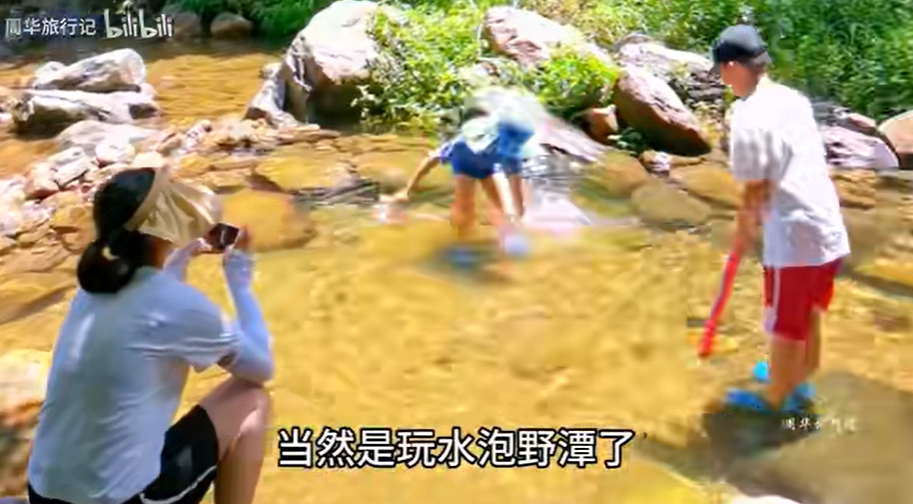

### 深圳
#### 景点
#### [峰哥推荐深圳好玩的地方](https://www.bilibili.com/video/BV1Xf4y1F7EA)

510 0  2021-09-30 17:48:58
深圳好玩的地方在大鹏，国家地质公园，大鹏半岛好多山，杨梅坑，东冲西冲，清凉山，够玩几个月。

#### [【周末出游vlog】深圳 杨梅坑鹿嘴山庄&大鹏古城&较场尾 一日游](https://www.bilibili.com/video/BV1fY4y1K7Fh)

2022-09-13 21:31:35
鹿嘴山庄 游玩建议：
提前拨打景区电话了解当前防疫政策
饭点在悬崖餐厅吃饭的人很多，如果找不到位置，可以跟餐厅工作人员沟通退掉100元餐券除了40元来回车票的其余部分金额
饭点如果想在悬崖餐厅坐到室外靠海的位置一定要提前提前去
建议春秋来游玩，夏天实在是太热了，如果夏天实在想来 务必要做好防晒
早早早出发，尽量早的到达杨梅坑，不然塞车塞到怀疑人生

大鹏古城 游玩建议：
古城不是很大，只需要留有一个半小时的游玩时间即可
自驾游去大鹏需要提前在i深圳上面预约
#### 深圳大梅沙
##### 风景

##### [路线图](https://www.zhihu.com/question/337574663/answer/2779244239)

准备出发：导航自驾到“大梅沙海滨公园停车场-入口”或停在大梅沙8号仓停车场（奥特莱斯小镇）。目标：徒步20000步，欣赏无敌海景。

从大梅沙海滨公园停车场-入口开始，沿途经过大梅沙海滨公园、奥特莱斯小镇（8号仓）、大梅沙湾游艇会、大梅沙京基洲际度假酒店、小梅沙海滨栈道、海滨栈道小梅沙驿站、揹仔角海滨绿道、揹仔角灯塔

##### 行李寄存

[内含攻略：实地考察国庆假期后的深圳大梅沙海滨公园，海水干净程度令游客惊讶！](https://www.bilibili.com/video/BV11w411C7YU/)

他的是押金20块然后一天25块钱，行李包大小。

公园开放时间：
07:00-22:00

停车费用：
旅游淡季：每年12月-次年4月 首两小时收费10元，第三小时起1.5元/小时加收。
旅游旺季：每年5月-当年11月底 首两小时收费20元，第三小时起3元/半小时加收。

林之猫
现在过去还需要预约吗
2023-11-09 23:34
Pony爱吃鱼
不用，明年5月1号之前多不用预约
2023年11月10日 周五 20时34分35秒 31分钟前
#### 较场尾

##### [深圳较场尾沙滩 实地攻略](https://www.bilibili.com/video/BV1Ts4y1Q7Zg/)
海滩宽度细，海滩工业垃圾多。

深圳海边沙滩：
##### 收费

买票位置：[深圳就这里海边客栈](https://map.baidu.com/poi/%E6%B7%B1%E5%9C%B3%E5%B0%B1%E8%BF%99%E9%87%8C%E6%B5%B7%E8%BE%B9%E5%AE%A2%E6%A0%88/@12748256.118190078,2566599.1895255637,20.45z?uid=56af902b5805607616764370&info_merge=1&isBizPoi=false&ugc_type=3&ugc_ver=1&device_ratio=2&compat=1&pcevaname=pc4.1&querytype=detailConInfo&da_src=shareurl)

#### 杨梅坑

##### [小红书 深圳鹿嘴山庄一日游最新攻略](http://xhslink.com/Obt7nw)
2023-09-29

鹿嘴山庄是周星驰电影《美人鱼》取景地，是深圳的天涯海角、Zui美海岸线之一，第一次去鹿嘴山庄，一定要提前做好攻略‼️路上节省时间，留着精力和时间游玩❤️‍🔥

以下有几条攻略和建议给大家：

⚠️不可以开车进入，车可以停在杨梅坑
‼️注意：美人鱼拍摄地、人鱼洞等，
是在山顶的，需要搭车，还需要登山⛰️

✅可以选择以下三种交通方式：
1️⃣杨梅坑→观光车→鹿嘴山庄沙滩→观光车→山顶
2️⃣杨梅坑→快艇→鹿嘴山庄沙滩→观光车→山顶
3️⃣杨梅坑→步行4公里→山顶

💰交通费用：
🛺观光车：单程13.8/人；山顶观光车5/人
🚤快艇：单程30/人，可讲价！

✅在哪里搭车⁉️
☑️观光车：在杨梅坑停车场出来，往右走300米，会有入口，可现场买票坐车！

☑️快艇：杨梅坑海滩很多，美食街也有很多人在揽客，谈好价格即可出发；

❇️我们选择的是：
⚠️去程：观光车→鹿嘴山庄沙滩→步行到山顶，不是很远，走最多10分钟~

🚸返程：山顶观光车5元/人→鹿嘴山庄沙滩→观光车到杨梅坑~

因为带小孩，所以觉得观光车比较安全‼️
另外，观光车途径的风景真的好美！超值！

‼️观景特别提醒：
我们步行到山顶时，碰到有人说没看到人鱼洞！人鱼洞在步行山顶时，往左边走，看到很长一条悬崖峭壁就往那儿走！不用走到顶，大概半程就看到了！面朝大海，人鱼洞在你的右下角！

鹿嘴山庄山顶的海景，蓝天碧海山林🌊
真的令人心旷神怡🙊

📸建议拍照打卡点：
✔️「深圳第一缕阳光」
✔️星爷美人鱼取景地，人鱼洞🧜‍♀️
✔️悬崖栈道，海天一线

💛tips：
🔻十月的深圳，太阳还很大，注意防晒！
🔻快艇的价格，一定要砍价！
🔻不要听信坐快艇进人鱼洞，冤枉钱💔

深圳海边沙滩：
##### [深圳杨梅坑海滩 实地攻略](https://www.bilibili.com/video/BV1Nr4y1Z7ZW/)
2023-08-14 18:50:00
看看这个杨梅坑的海滩是在哪里
[视频时间戳：](https://www.bilibili.com/video/BV1Nr4y1Z7ZW?t=63.9)

现在是下午的6点钟。

它这里坐船呢，是可以直接坐到鹿嘴山庄那边，也是可以从这里。去鹿嘴山庄那边看这个日出的。

走到这个位置，基本上是已经把整个杨梅坑的海滩全部逛的差不多了。

杨梅坑停车场非常的近，有很多这个住宿还有餐饮的地方。

在这个杨梅坑这边，是比较适合看，海上落日美景的地方。

##### [杨梅坑一日游攻略](https://www.bilibili.com/video/BV1cP411L7V9/)
1.天气：
晴朗(虽很晒，但值得)
2.时间：
十点到四点都是海水很蓝的时候（四点以后美景大打折扣）
3.市区前往：
公交车到杨梅坑站（百度地图自助）
然后走两步到游客中心买票
凭票坐小巴车到达鹿嘴山庄悬崖餐厅
(人鱼洞等景点都在悬崖餐厅附近，步行可达）

4.食物：
景区内有悬崖餐厅，价格可接受
(两个仙女，拍黄瓜+水煮肉片+米饭+茶位费，140貌似) 饮料，零食都有卖的（也可自带）
5.住宿
景区内外均有酒店，民宿（市区可一日来回）

6.穿着：
仙女穿裙裙，戴草帽（草帽景区外有卖的）不要穿高跟鞋爬山(山不高，但是也不是很好爬)
带泳衣泳圈拖鞋
（景区内有干净的免费海滩，可以抓螃蟹，有收费的冲凉房）
7.做好防晒，不然仙女变酋长！！！
8.打卡地：
全岛都很美！！

#### [深圳西涌 沙滩怎么样？看完这个视频再说](https://www.bilibili.com/video/BV12q4y1R7vp/)

我还真走小路进去过，1号沙滩入海口那里

首先这里是三面环山的一个地形，而且这三面当中呢，只有较平坦的一面可以通行。另外两面如果你想通行的话呢，得先翻过两座山可以通行的这一面呢，人家在离海岸线还有几百米，甚至一公里的地方。就设置了柵栏网和关卡，那缘色的柵栏网，绵延的消失在绿色的植被里。
整个狭长的海岸线，一个卫生间都很难找来的。路上喔，一排给你推销泳衣袄裤敖生圈的

去过两次，不好玩，除了特别大，没啥的。水不够清澈，没有鱼吗，没有海洋生物。

#### 西涌可去
这个离市区超级远

#### 海边游泳
##### 泳裤可以在外面买10元一条 淋浴间25一次 更衣室免费 存储柜25
泳裤 不易掉落，贴身放尴尬

去之前买好泳裤，没有准备的话，泳裤可以在外面买10元一条，里面25一条。救生圈也可以在外面买也是10元一个，里面25一个。

自己准备一个垫子在沙滩上躺比较好，卖也是在外面买便宜些。买厚一点的。大梅沙公园里面淋浴间要付费，25一次。淋浴间旁边更衣室免费。冲脚的话，商店前面有水龙头可以冲。

里面存储柜要钱25一个，最好几个人共用一个划算点。可以租一天。

碧海蓝天沙滩，可以下海，晚上浪比较大注意安全。浪大的时候下海，可以抓着有浮漂的绳子往外面走，这里水深一些，但是平静一些，不会被浪卷到。岸边浪大，浪拍过来，会卷，冲倒浅水区的人。人站不住。
[编辑于 2022-11-24 00:15](https://www.zhihu.com/question/337574663/answer/2771899092)

打卡时间：2022年10月7日
直奔主题，避坑策略如下：
1、要注意防晒。昨晚到家，整个后背都是火烧一样的刺痛感，闺女和儿子也都晒黑了。各位知友去大梅沙前一定要多抹一些防水的防晒霜，泳衣的话穿短袖的那种，戴上有帽檐的泳帽。有小孩子的话可以再带把遮阳伞。我闺女5岁，海浪太大，在海里被打翻了三次，就吓得不敢下水了，只在水边玩。有遮阳伞的话不会被烈日晒得太狠。海边有出租大的遮阳伞，4小时100元，但是不让插的离海太近，影响救援人员的视线。

总结：涂防晒霜、穿尽量能把身体包裹住的泳衣泳帽、遮阳伞。

2、大梅沙的淋浴间是收费的，20元/人。用的人很少。但是有冲脚的水龙头，水也是温温的，很多人就拿孩子玩水的桶冲一下，有个人还专门带了个胶管，让周围的人羡慕不已。要带胶管的话应该开口要1厘米以上。

总结：冲澡用的小桶或者胶管

3、有小孩子的话记得带一些沙滩玩具、小球、水枪之类的，现场买的话有一点点贵。当然游泳圈也别忘了。

总结：沙滩玩具、游泳圈编辑于 2023-08-27 16:02

作者：职场达人
链接：https://www.zhihu.com/question/337574663/answer/2705798118
来源：知乎
著作权归作者所有。商业转载请联系作者获得授权，非商业转载请注明出处。

建议内穿泳裤，外穿沙滩裤。文能提笔安天下，武能上马定乾坤。
发布于 2015-07-13 13:32

个人觉得两种裤子都能hold得住夏日玩水的人设，外观上看，沙滩裤和泳裤都有出众的造型，我选择了较短的泳裤穿着。功能上说，有很多项目还是要求穿着泳装参与的，譬如：垂直极限速滑、离心速滑…这类不乘坐水泡在滑道上极驰的项目。
[发布于 2022-05-09 20:55](http://www.zhihu.com/question/32163766/answer/2477882464)

建议选泳裤，既可以下水游泳，也可以防晒。

沙滩裤只能在岸上玩，游泳特别容易兜水。

**通用物件：泳衣、拖鞋、墨镜、[大浴巾](https://www.zhihu.com/search?q=大浴巾&search_source=Entity&hybrid_search_source=Entity&hybrid_search_extra={"sourceType"%3A"answer"%2C"sourceId"%3A1490739538})、防晒霜，防水[手机袋](https://www.zhihu.com/search?q=手机袋&search_source=Entity&hybrid_search_source=Entity&hybrid_search_extra={"sourceType"%3A"answer"%2C"sourceId"%3A1490739538})。**

**玩项目的，并且是打算玩嗨的那种，最好备好防晒的**。防晒霜，防水的，PA+++最多的，**但是下水以后[紫外线](https://www.zhihu.com/search?q=紫外线&search_source=Entity&hybrid_search_source=Entity&hybrid_search_extra={"sourceType"%3A"answer"%2C"sourceId"%3A1490739538})真的很强，建议买套长袖的[潜水服](https://www.zhihu.com/search?q=潜水服&search_source=Entity&hybrid_search_source=Entity&hybrid_search_extra={"sourceType"%3A"answer"%2C"sourceId"%3A1490739538})。**你已经上海上去玩了，也没空去补防晒了，物理硬防晒可能更有用。

#### 莲花山
2月 门票 ：全票54元、半票27元 景色 ：40亩桃花园，品类多种，蟠桃、白碧、绯桃、茶盅脚、蜜卵、寿带，还有万盏“福”字灯笼

#### 宝安福永立新湖公园

#### 阳台山森林公园

#### 梧桐山
[深圳梧桐山不全是山，也有水，攻略拿去 #清凉避暑好去处 #山间小溪 #夏日玩水 #天然氧吧 #避暑胜地](https://www.bilibili.com/video/BV1Dh4y157Nr/)

导航梧桐山北门往泰山涧方向，不用门票有大型停车场，入园不用爬坡。
一路都是树荫也晒不到太阳，这里有适合小孩抓鱼玩水的浅水区。也有成人野游的深水区，从泰山涧小溪一路溯溪而上，水都不深路好走。一路上有十几个小潭子。最上面这个潭子达到3米多深。这条路线可以说轻松休闲又好玩。

[视频时间戳：](https://www.bilibili.com/video/BV1Dh4y157Nr?t=9.5)

#### 女娲滨海公园-女娲补天

从海上世界往深圳湾方向踩单车

#### 沙鱼涌沙滩最美比大梅沙好

沙鱼涌沙滩最美，个人觉得比大梅沙啥的好多了,水很清澈。

这个沙滩不收费的，暂时属于"野"摊吧，还没开发起来，没有吃的，自备，水干净清澈，沙子细腻，好像不能下去游泳，只能在海滩玩玩，个人觉得挺好的，人少

#### 宝安尖岗山公园

#### 深圳甘坑客家小镇

圆博园 三角梅 更好看

#### 前海石公园

[【深圳】前海一天游攻略👊近口岸❗️多美食❗️无敌海景公园➕食足三餐➕商场打卡👊交通方便的世外桃源😆完美避人流🤭前海卓悦intown｜深圳美食](https://www.bilibili.com/video/BV1qk4y1F7Cg/)
开场白
公园
商场介绍
打边炉≈广东火锅
酸菜鱼
烧肉店
消费消闲店
优惠
交通行程
#### 蛇口海上世界 音乐喷泉

#### 深圳人才公园

#### 中英街全面开放了

#### [南山公园](https://www.mafengwo.cn/poi/17619913.html)

用时参考
3小时以上

交通
乘坐70路公交到兰溪谷(公交站)下车，步行可达

门票
免费
开放时间
07:00-20:30(全天)；停止入场时间:20:00 (6月1日-8月31日 周一-周日)
08:00-19:00(全天)；停止入场时间:18:30 (12月1日-次年2月28日 周一-周日)
#### [深圳3日经典线路](https://www.mafengwo.cn/mdd/route/10198_106808.html)

#### [深圳没什么推荐的 好玩香港 好吃广州](https://www.bilibili.com/video/BV1y54y1B7ip/?spm_id_from=333.337.search-card.all.click&vd_source=f03b9d349cef8aff4a045d602d8a1d82)
世界之窗垃圾，欢乐谷游乐园别的城市更大更好玩
##### [实地打卡深圳西涌沙滩，全国最优美八大海滩之一](https://www.bilibili.com/video/BV1P94y1q7Tb/)
1号滩沙子最干净

一之二十八
这个要收门票？多少钱？
2023-08-01 17:11

广西岭上松
两种收费,一种是下午6点到点就清场赶走的12块钱,一种是过了点除了游泳可以做其他事情整个西涌可用的28块钱
2023-08-07 06:50

国庆期间40块门票。

##### 梧桐山 看整个深圳市区 

Steven惜今
深圳的梧桐山挺好玩的，去登高可以看到整个深圳市区和盐田港，早上看日出很漂亮
2023-01-14 11:02
👍1

##### 华侨城也无聊 适合约会消费

摄影师菲玛

除了华侨城全部去过，实话实说不是很好玩

2021-01-01 23:45👍12

清清汗

华侨城也无聊就挺适合约会消费不是很大没啥好玩的就是看一下的

2021-07-29 21:32

##### 以上地点都超无聊 不要去

2020-09-17 01:27👍157

Xioan
回复 @a道路莫图 :好玩去香港，好吃去广州，深圳没什么推荐的
2020-10-04 20:53👍34

Xioan
回复 @Hello我是mer :一般去西冲
2021-09-29 22:11👍1
##### 小镇较场尾 大梅沙休闲 天文台 近市区欢乐海岸

老林喵
回复 @潮落风息 :深圳的话，我可以推荐较场尾，这个地方还是挺漂亮的，而且有点像小镇的那种，比较休闲或者去大梅沙，可以去海边走走，或者深圳天文台，那个地方也很漂亮，如果想靠近市区点，欢乐海岸也不错，有很多吃的，晚上可以看水表演或者壹海城，那里还有个灯塔图书馆，但是要预约哦，如果想去商场，会展中心、皇庭广场、CoCopark、卓悦中心这个是连在一起的，走地下通道就可以到，你也可以去那里玩一玩
2022-06-18 15:38👍4

Xioan
回复 @看到我叫我晚上少吃点 :一定要去那就西冲
2021-12-23 20:58
#### 大湾区游轮 平日198元，周末238元

##### [票价网](https://www.dahepiao.com/lvyounews1/20210825215015.html)
zhtt 发布  时间:2021-11-25 09:39

##### [视频vlog](https://www.bilibili.com/video/BV1Hq4y1N7rc)
如果你来深圳，一定要坐一次大湾区游轮，来回三小时，吹吹海风，看看日落！@深圳周末好去处@日落@旅行大玩家

#### [600米高楼，平安金融大厦，全国第二 世界第三高](https://www.bilibili.com/video/BV1hx411M7GN/?spm_id_from=333.337.search-card.all.click&vd_source=f03b9d349cef8aff4a045d602d8a1d82)

全球变冷鹏
说深圳没公园   深圳现在已建成900多所公园 几乎全免费     深圳绿化率百分之五十   你其他城市可以比？  空气质量  有种蓝叫深圳蓝     更重要的是这个移民城市  来自全国各地的人  没有地方歧视！！！你上海北京能比？
2017-12-30 21:06👍38

红色的山炮
平安大厦曾经在建地基的时候停工差不多两年，因为使用承建工程队贪 污，使等原料用海砂，导致底部承重数据发生变化，工程师不得不重新设计高度，由此才砍了大厦高度，所谓的空管局砍高度只是对媒体的宣称的而已，这已经是公开的秘密了····楼上说限高600米的，别忘了罗湖目前有个规划的工程（湖贝塔）是世界第一高大楼，比迪拜塔还要高，830米
2017-11-23 12:42👍20
#### eat

Lynripely
沙井生蚝、南山荔枝、公明烧鹅
2022-03-15 13:08👍1248

毓境
沙井渔民早就上岸了，现在的沙井蚝都不是深圳产的了
2022-03-15 20:04👍19

歪歪屁VS懂黑帝
南山荔枝是真难吃…
2022-03-15 23:33👍6

星朗星
以前我就住公明，公明强记烧鹅绝了
2022-03-15 16:19👍8

生蚝得是湛江汕尾 荔枝从化增城茂名 乳鸽中山 烧鹅广州深井和江门
元气帅狗wiky
论生蚝得是湛江汕尾，论荔枝得是从化增城茂名，论乳鸽得是中山，论烧鹅得是广州深井和江门古井，所以深圳是真没好吃的
2022-03-16 14:16👍13

曹賊本贼
隆江猪脚饭、电白猪杂粉、潮汕大排档、柳州螺蛳粉、常德牛肉粉、永和自选快餐、湘赣木桶饭、长沙臭豆腐、休闲会所
2022-03-20 01:41