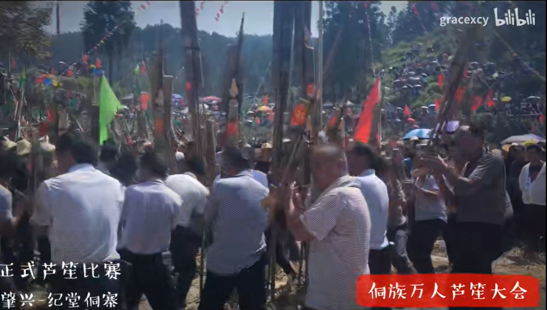

## travel
### [行李寄存](https://www.douyin.com/note/7280086790017535289)
行李寄存的4种途径

1、行李寄存点/柜
·在小程序或app内搜索就可以找到附近提供服务的商家：存知己、途简单、无包游、鲸图出行、行李记、蜂巢、魔方柜等。
在车站机场、景点商圈、地标、地铁站等地方一般都有。
·【具体程序】搜索附近寄存点-预约存取时间和件数大小-付费（取消订单可退）-拍照保留证件牌-凭证件牌取走行李
·【平均价格】普通背包5-10元/天，存行李10-20元/天（须在服务点营业时间内存取）
·【优点】离景点近、寄存点多、价格便宜、专人看守
·【缺点】寄存点比较难找

2、车站机场寄存☆☆☆
可以去车站、机场的服务台询问，一般都有寄存点的
·【平均价格】根据行李大小和存放时间收取
20~100元不等
·【优点】安全、便捷、干净、空间大
·【缺点】贵(真的，价格会翻倍)

3、酒店行李寄送服务☆☆☆
部分酒店会提供行李寄送服务，订酒店时可以提前询问以及预约。
·【平均价格】30~60元左右，具体看酒店离车站机场的距离以及行李件数和大小
·【优点】快捷、省心
·【缺点】小贵

4、超市寄存☆☆
·去大润发等大型超市询问店员，部分超市可以免费寄存行李
·【优点】方便、大部分免费
·【缺点】安全性稍弱
#### 深圳大梅沙行李寄存
微信公众号搜索：途简单，搜索大梅沙，选择海山公园附近的点。
### [柬埔寨电诈所见所闻：被骗去的女孩就像奴隶一样](https://www.bilibili.com/video/BV1TD4y1k7zc/?spm_id_from=333.337.search-card.all.click&vd_source=f03b9d349cef8aff4a045d602d8a1d82)

12.1万 60 2022-10-23 00:50:17

#### 泰国，缅甸，越南华人经常性失踪

冰心玲星
想到几年前我说泰国，缅甸，越南那些地方华人经常性失踪，而让这些失踪人多半都是自己人做的，然后我说出国旅游最应该提防的不是外国人，而是自己人，不论是留学生还是在外工作，或者说是旅游的，当时有人还喷我，我现在知道喷我的人是谁了
2022-11-03 11:58👍323

修改昵称需消耗9硬币
以前泰国旅游团女游客去个厕所人就人间消失了，同伴就在门口愣是看不见人出来，现在想想，唉 2022-11-08 08:50👍12
### 珠海
#### [珠海吉大九洲机场出发游览8分钟](https://www.sohu.com/a/408936810_737500)
2020-07-21 20:08
提前1天16:00前下单，【空中看大桥 | 直升机观光票】，空中观赏世纪工程港珠澳大桥！

| 航线 |航路 | 平日 周一至周五 | 周末 周六日 | 大假期 |
|-|-|-|-|-|
| A线：大桥空中游 | 港珠澳大桥+日月贝 | ￥599 | ￥699 | ￥699 |
| B线：万山秘境低空游 | 港珠澳大桥+海上风车田+万山群岛 | ￥999 | ￥1099 | ￥1099 |
| C线：海滨低空游 | 港珠澳大桥+日月贝 情侣路+淇澳大桥 | ￥899 | ￥999 | ￥999 |

599元（空中游览8分钟）
999元（空中游览18分钟）

699元航线：吉大九洲机场一一港珠澳大桥一一日月贝一一情侣路一一九洲机场
999元航线：吉大九洲机场一一港珠澳大桥一一日月贝一一唐家湾一一情侣路一一九洲机场

### 深圳
#### 景点
#### [峰哥推荐深圳好玩的地方](https://www.bilibili.com/video/BV1Xf4y1F7EA)

510 0  2021-09-30 17:48:58
深圳好玩的地方在大鹏，国家地质公园，大鹏半岛好多山，杨梅坑，东冲西冲，清凉山，够玩几个月。

#### [【周末出游vlog】深圳 杨梅坑鹿嘴山庄&大鹏古城&较场尾 一日游](https://www.bilibili.com/video/BV1fY4y1K7Fh)

2022-09-13 21:31:35
鹿嘴山庄 游玩建议：
提前拨打景区电话了解当前防疫政策
饭点在悬崖餐厅吃饭的人很多，如果找不到位置，可以跟餐厅工作人员沟通退掉100元餐券除了40元来回车票的其余部分金额
饭点如果想在悬崖餐厅坐到室外靠海的位置一定要提前提前去
建议春秋来游玩，夏天实在是太热了，如果夏天实在想来 务必要做好防晒
早早早出发，尽量早的到达杨梅坑，不然塞车塞到怀疑人生

大鹏古城 游玩建议：
古城不是很大，只需要留有一个半小时的游玩时间即可
自驾游去大鹏需要提前在i深圳上面预约
#### 深圳大梅沙
##### 风景

##### [路线图](https://www.zhihu.com/question/337574663/answer/2779244239)

准备出发：导航自驾到“大梅沙海滨公园停车场-入口”或停在大梅沙8号仓停车场（奥特莱斯小镇）。目标：徒步20000步，欣赏无敌海景。

从大梅沙海滨公园停车场-入口开始，沿途经过大梅沙海滨公园、奥特莱斯小镇（8号仓）、大梅沙湾游艇会、大梅沙京基洲际度假酒店、小梅沙海滨栈道、海滨栈道小梅沙驿站、揹仔角海滨绿道、揹仔角灯塔

##### 行李寄存

[内含攻略：实地考察国庆假期后的深圳大梅沙海滨公园，海水干净程度令游客惊讶！](https://www.bilibili.com/video/BV11w411C7YU/)

他的是押金20块然后一天25块钱，行李包大小。

公园开放时间：
07:00-22:00

停车费用：
旅游淡季：每年12月-次年4月 首两小时收费10元，第三小时起1.5元/小时加收。
旅游旺季：每年5月-当年11月底 首两小时收费20元，第三小时起3元/半小时加收。

林之猫
现在过去还需要预约吗
2023-11-09 23:34
Pony爱吃鱼
不用，明年5月1号之前多不用预约
2023年11月10日 周五 20时34分35秒 31分钟前
#### 较场尾

##### [深圳较场尾沙滩 实地攻略](https://www.bilibili.com/video/BV1Ts4y1Q7Zg/)
海滩宽度细，海滩工业垃圾多。

深圳海边沙滩：
##### 收费

买票位置：[深圳就这里海边客栈](https://map.baidu.com/poi/%E6%B7%B1%E5%9C%B3%E5%B0%B1%E8%BF%99%E9%87%8C%E6%B5%B7%E8%BE%B9%E5%AE%A2%E6%A0%88/@12748256.118190078,2566599.1895255637,20.45z?uid=56af902b5805607616764370&info_merge=1&isBizPoi=false&ugc_type=3&ugc_ver=1&device_ratio=2&compat=1&pcevaname=pc4.1&querytype=detailConInfo&da_src=shareurl)

#### 杨梅坑

##### [小红书 深圳鹿嘴山庄一日游最新攻略](http://xhslink.com/Obt7nw)
2023-09-29

鹿嘴山庄是周星驰电影《美人鱼》取景地，是深圳的天涯海角、Zui美海岸线之一，第一次去鹿嘴山庄，一定要提前做好攻略‼️路上节省时间，留着精力和时间游玩❤️‍🔥

以下有几条攻略和建议给大家：

⚠️不可以开车进入，车可以停在杨梅坑
‼️注意：美人鱼拍摄地、人鱼洞等，
是在山顶的，需要搭车，还需要登山⛰️

✅可以选择以下三种交通方式：
1️⃣杨梅坑→观光车→鹿嘴山庄沙滩→观光车→山顶
2️⃣杨梅坑→快艇→鹿嘴山庄沙滩→观光车→山顶
3️⃣杨梅坑→步行4公里→山顶

💰交通费用：
🛺观光车：单程13.8/人；山顶观光车5/人
🚤快艇：单程30/人，可讲价！

✅在哪里搭车⁉️
☑️观光车：在杨梅坑停车场出来，往右走300米，会有入口，可现场买票坐车！

☑️快艇：杨梅坑海滩很多，美食街也有很多人在揽客，谈好价格即可出发；

❇️我们选择的是：
⚠️去程：观光车→鹿嘴山庄沙滩→步行到山顶，不是很远，走最多10分钟~

🚸返程：山顶观光车5元/人→鹿嘴山庄沙滩→观光车到杨梅坑~

因为带小孩，所以觉得观光车比较安全‼️
另外，观光车途径的风景真的好美！超值！

‼️观景特别提醒：
我们步行到山顶时，碰到有人说没看到人鱼洞！人鱼洞在步行山顶时，往左边走，看到很长一条悬崖峭壁就往那儿走！不用走到顶，大概半程就看到了！面朝大海，人鱼洞在你的右下角！

鹿嘴山庄山顶的海景，蓝天碧海山林🌊
真的令人心旷神怡🙊

📸建议拍照打卡点：
✔️「深圳第一缕阳光」
✔️星爷美人鱼取景地，人鱼洞🧜‍♀️
✔️悬崖栈道，海天一线

💛tips：
🔻十月的深圳，太阳还很大，注意防晒！
🔻快艇的价格，一定要砍价！
🔻不要听信坐快艇进人鱼洞，冤枉钱💔

深圳海边沙滩：
##### [深圳杨梅坑海滩 实地攻略](https://www.bilibili.com/video/BV1Nr4y1Z7ZW/)
2023-08-14 18:50:00
看看这个杨梅坑的海滩是在哪里
[视频时间戳：](https://www.bilibili.com/video/BV1Nr4y1Z7ZW?t=63.9)

现在是下午的6点钟。

它这里坐船呢，是可以直接坐到鹿嘴山庄那边，也是可以从这里。去鹿嘴山庄那边看这个日出的。

走到这个位置，基本上是已经把整个杨梅坑的海滩全部逛的差不多了。

杨梅坑停车场非常的近，有很多这个住宿还有餐饮的地方。

在这个杨梅坑这边，是比较适合看，海上落日美景的地方。

##### [杨梅坑一日游攻略](https://www.bilibili.com/video/BV1cP411L7V9/)
1.天气：
晴朗(虽很晒，但值得)
2.时间：
十点到四点都是海水很蓝的时候（四点以后美景大打折扣）
3.市区前往：
公交车到杨梅坑站（百度地图自助）
然后走两步到游客中心买票
凭票坐小巴车到达鹿嘴山庄悬崖餐厅
(人鱼洞等景点都在悬崖餐厅附近，步行可达）

4.食物：
景区内有悬崖餐厅，价格可接受
(两个仙女，拍黄瓜+水煮肉片+米饭+茶位费，140貌似) 饮料，零食都有卖的（也可自带）
5.住宿
景区内外均有酒店，民宿（市区可一日来回）

6.穿着：
仙女穿裙裙，戴草帽（草帽景区外有卖的）不要穿高跟鞋爬山(山不高，但是也不是很好爬)
带泳衣泳圈拖鞋
（景区内有干净的免费海滩，可以抓螃蟹，有收费的冲凉房）
7.做好防晒，不然仙女变酋长！！！
8.打卡地：
全岛都很美！！

#### [深圳西涌 沙滩怎么样？看完这个视频再说](https://www.bilibili.com/video/BV12q4y1R7vp/)

我还真走小路进去过，1号沙滩入海口那里

首先这里是三面环山的一个地形，而且这三面当中呢，只有较平坦的一面可以通行。另外两面如果你想通行的话呢，得先翻过两座山可以通行的这一面呢，人家在离海岸线还有几百米，甚至一公里的地方。就设置了柵栏网和关卡，那缘色的柵栏网，绵延的消失在绿色的植被里。
整个狭长的海岸线，一个卫生间都很难找来的。路上喔，一排给你推销泳衣袄裤敖生圈的

去过两次，不好玩，除了特别大，没啥的。水不够清澈，没有鱼吗，没有海洋生物。

#### 西涌可去
这个离市区超级远

#### 海边游泳
##### 泳裤可以在外面买10元一条 淋浴间25一次 更衣室免费 存储柜25
泳裤 不易掉落，贴身放尴尬

去之前买好泳裤，没有准备的话，泳裤可以在外面买10元一条，里面25一条。救生圈也可以在外面买也是10元一个，里面25一个。

自己准备一个垫子在沙滩上躺比较好，卖也是在外面买便宜些。买厚一点的。大梅沙公园里面淋浴间要付费，25一次。淋浴间旁边更衣室免费。冲脚的话，商店前面有水龙头可以冲。

里面存储柜要钱25一个，最好几个人共用一个划算点。可以租一天。

碧海蓝天沙滩，可以下海，晚上浪比较大注意安全。浪大的时候下海，可以抓着有浮漂的绳子往外面走，这里水深一些，但是平静一些，不会被浪卷到。岸边浪大，浪拍过来，会卷，冲倒浅水区的人。人站不住。
[编辑于 2022-11-24 00:15](https://www.zhihu.com/question/337574663/answer/2771899092)

打卡时间：2022年10月7日
直奔主题，避坑策略如下：
1、要注意防晒。昨晚到家，整个后背都是火烧一样的刺痛感，闺女和儿子也都晒黑了。各位知友去大梅沙前一定要多抹一些防水的防晒霜，泳衣的话穿短袖的那种，戴上有帽檐的泳帽。有小孩子的话可以再带把遮阳伞。我闺女5岁，海浪太大，在海里被打翻了三次，就吓得不敢下水了，只在水边玩。有遮阳伞的话不会被烈日晒得太狠。海边有出租大的遮阳伞，4小时100元，但是不让插的离海太近，影响救援人员的视线。

总结：涂防晒霜、穿尽量能把身体包裹住的泳衣泳帽、遮阳伞。

2、大梅沙的淋浴间是收费的，20元/人。用的人很少。但是有冲脚的水龙头，水也是温温的，很多人就拿孩子玩水的桶冲一下，有个人还专门带了个胶管，让周围的人羡慕不已。要带胶管的话应该开口要1厘米以上。

总结：冲澡用的小桶或者胶管

3、有小孩子的话记得带一些沙滩玩具、小球、水枪之类的，现场买的话有一点点贵。当然游泳圈也别忘了。

总结：沙滩玩具、游泳圈编辑于 2023-08-27 16:02

作者：职场达人
链接：https://www.zhihu.com/question/337574663/answer/2705798118
来源：知乎
著作权归作者所有。商业转载请联系作者获得授权，非商业转载请注明出处。

建议内穿泳裤，外穿沙滩裤。文能提笔安天下，武能上马定乾坤。
发布于 2015-07-13 13:32

个人觉得两种裤子都能hold得住夏日玩水的人设，外观上看，沙滩裤和泳裤都有出众的造型，我选择了较短的泳裤穿着。功能上说，有很多项目还是要求穿着泳装参与的，譬如：垂直极限速滑、离心速滑…这类不乘坐水泡在滑道上极驰的项目。
[发布于 2022-05-09 20:55](http://www.zhihu.com/question/32163766/answer/2477882464)

建议选泳裤，既可以下水游泳，也可以防晒。

沙滩裤只能在岸上玩，游泳特别容易兜水。

**通用物件：泳衣、拖鞋、墨镜、[大浴巾](https://www.zhihu.com/search?q=大浴巾&search_source=Entity&hybrid_search_source=Entity&hybrid_search_extra={"sourceType"%3A"answer"%2C"sourceId"%3A1490739538})、防晒霜，防水[手机袋](https://www.zhihu.com/search?q=手机袋&search_source=Entity&hybrid_search_source=Entity&hybrid_search_extra={"sourceType"%3A"answer"%2C"sourceId"%3A1490739538})。**

**玩项目的，并且是打算玩嗨的那种，最好备好防晒的**。防晒霜，防水的，PA+++最多的，**但是下水以后[紫外线](https://www.zhihu.com/search?q=紫外线&search_source=Entity&hybrid_search_source=Entity&hybrid_search_extra={"sourceType"%3A"answer"%2C"sourceId"%3A1490739538})真的很强，建议买套长袖的[潜水服](https://www.zhihu.com/search?q=潜水服&search_source=Entity&hybrid_search_source=Entity&hybrid_search_extra={"sourceType"%3A"answer"%2C"sourceId"%3A1490739538})。**你已经上海上去玩了，也没空去补防晒了，物理硬防晒可能更有用。

#### 莲花山
2月 门票 ：全票54元、半票27元 景色 ：40亩桃花园，品类多种，蟠桃、白碧、绯桃、茶盅脚、蜜卵、寿带，还有万盏“福”字灯笼

#### 宝安福永立新湖公园

#### 阳台山森林公园

#### 梧桐山
[深圳梧桐山不全是山，也有水，攻略拿去 #清凉避暑好去处 #山间小溪 #夏日玩水 #天然氧吧 #避暑胜地](https://www.bilibili.com/video/BV1Dh4y157Nr/)

导航梧桐山北门往泰山涧方向，不用门票有大型停车场，入园不用爬坡。
一路都是树荫也晒不到太阳，这里有适合小孩抓鱼玩水的浅水区。也有成人野游的深水区，从泰山涧小溪一路溯溪而上，水都不深路好走。一路上有十几个小潭子。最上面这个潭子达到3米多深。这条路线可以说轻松休闲又好玩。

[视频时间戳：](https://www.bilibili.com/video/BV1Dh4y157Nr?t=9.5)

#### 女娲滨海公园-女娲补天

从海上世界往深圳湾方向踩单车

#### 沙鱼涌沙滩最美比大梅沙好

沙鱼涌沙滩最美，个人觉得比大梅沙啥的好多了,水很清澈。

这个沙滩不收费的，暂时属于"野"摊吧，还没开发起来，没有吃的，自备，水干净清澈，沙子细腻，好像不能下去游泳，只能在海滩玩玩，个人觉得挺好的，人少

#### 宝安尖岗山公园

#### 深圳甘坑客家小镇

圆博园 三角梅 更好看

#### 前海石公园

[【深圳】前海一天游攻略👊近口岸❗️多美食❗️无敌海景公园➕食足三餐➕商场打卡👊交通方便的世外桃源😆完美避人流🤭前海卓悦intown｜深圳美食](https://www.bilibili.com/video/BV1qk4y1F7Cg/)
开场白
公园
商场介绍
打边炉≈广东火锅
酸菜鱼
烧肉店
消费消闲店
优惠
交通行程
#### 蛇口海上世界 音乐喷泉

#### 深圳人才公园

#### 中英街全面开放了

#### [南山公园](https://www.mafengwo.cn/poi/17619913.html)

用时参考
3小时以上

交通
乘坐70路公交到兰溪谷(公交站)下车，步行可达

门票
免费
开放时间
07:00-20:30(全天)；停止入场时间:20:00 (6月1日-8月31日 周一-周日)
08:00-19:00(全天)；停止入场时间:18:30 (12月1日-次年2月28日 周一-周日)
#### [深圳3日经典线路](https://www.mafengwo.cn/mdd/route/10198_106808.html)

#### [深圳没什么推荐的 好玩香港 好吃广州](https://www.bilibili.com/video/BV1y54y1B7ip/?spm_id_from=333.337.search-card.all.click&vd_source=f03b9d349cef8aff4a045d602d8a1d82)
世界之窗垃圾，欢乐谷游乐园别的城市更大更好玩
##### [实地打卡深圳西涌沙滩，全国最优美八大海滩之一](https://www.bilibili.com/video/BV1P94y1q7Tb/)
1号滩沙子最干净

一之二十八
这个要收门票？多少钱？
2023-08-01 17:11

广西岭上松
两种收费,一种是下午6点到点就清场赶走的12块钱,一种是过了点除了游泳可以做其他事情整个西涌可用的28块钱
2023-08-07 06:50

国庆期间40块门票。

##### 梧桐山 看整个深圳市区 

Steven惜今
深圳的梧桐山挺好玩的，去登高可以看到整个深圳市区和盐田港，早上看日出很漂亮
2023-01-14 11:02
👍1

##### 华侨城也无聊 适合约会消费

摄影师菲玛

除了华侨城全部去过，实话实说不是很好玩

2021-01-01 23:45👍12

清清汗

华侨城也无聊就挺适合约会消费不是很大没啥好玩的就是看一下的

2021-07-29 21:32

##### 以上地点都超无聊 不要去

2020-09-17 01:27👍157

Xioan
回复 @a道路莫图 :好玩去香港，好吃去广州，深圳没什么推荐的
2020-10-04 20:53👍34

Xioan
回复 @Hello我是mer :一般去西冲
2021-09-29 22:11👍1
##### 小镇较场尾 大梅沙休闲 天文台 近市区欢乐海岸

老林喵
回复 @潮落风息 :深圳的话，我可以推荐较场尾，这个地方还是挺漂亮的，而且有点像小镇的那种，比较休闲或者去大梅沙，可以去海边走走，或者深圳天文台，那个地方也很漂亮，如果想靠近市区点，欢乐海岸也不错，有很多吃的，晚上可以看水表演或者壹海城，那里还有个灯塔图书馆，但是要预约哦，如果想去商场，会展中心、皇庭广场、CoCopark、卓悦中心这个是连在一起的，走地下通道就可以到，你也可以去那里玩一玩
2022-06-18 15:38👍4

Xioan
回复 @看到我叫我晚上少吃点 :一定要去那就西冲
2021-12-23 20:58
#### 大湾区游轮 平日198元，周末238元

##### [票价网](https://www.dahepiao.com/lvyounews1/20210825215015.html)
zhtt 发布  时间:2021-11-25 09:39

##### [视频vlog](https://www.bilibili.com/video/BV1Hq4y1N7rc)
如果你来深圳，一定要坐一次大湾区游轮，来回三小时，吹吹海风，看看日落！@深圳周末好去处@日落@旅行大玩家

#### [600米高楼，平安金融大厦，全国第二 世界第三高](https://www.bilibili.com/video/BV1hx411M7GN/?spm_id_from=333.337.search-card.all.click&vd_source=f03b9d349cef8aff4a045d602d8a1d82)

全球变冷鹏
说深圳没公园   深圳现在已建成900多所公园 几乎全免费     深圳绿化率百分之五十   你其他城市可以比？  空气质量  有种蓝叫深圳蓝     更重要的是这个移民城市  来自全国各地的人  没有地方歧视！！！你上海北京能比？
2017-12-30 21:06👍38

红色的山炮
平安大厦曾经在建地基的时候停工差不多两年，因为使用承建工程队贪 污，使等原料用海砂，导致底部承重数据发生变化，工程师不得不重新设计高度，由此才砍了大厦高度，所谓的空管局砍高度只是对媒体的宣称的而已，这已经是公开的秘密了····楼上说限高600米的，别忘了罗湖目前有个规划的工程（湖贝塔）是世界第一高大楼，比迪拜塔还要高，830米
2017-11-23 12:42👍20
#### eat

Lynripely
沙井生蚝、南山荔枝、公明烧鹅
2022-03-15 13:08👍1248

毓境
沙井渔民早就上岸了，现在的沙井蚝都不是深圳产的了
2022-03-15 20:04👍19

歪歪屁VS懂黑帝
南山荔枝是真难吃…
2022-03-15 23:33👍6

星朗星
以前我就住公明，公明强记烧鹅绝了
2022-03-15 16:19👍8

生蚝得是湛江汕尾 荔枝从化增城茂名 乳鸽中山 烧鹅广州深井和江门
元气帅狗wiky
论生蚝得是湛江汕尾，论荔枝得是从化增城茂名，论乳鸽得是中山，论烧鹅得是广州深井和江门古井，所以深圳是真没好吃的
2022-03-16 14:16👍13

曹賊本贼
隆江猪脚饭、电白猪杂粉、潮汕大排档、柳州螺蛳粉、常德牛肉粉、永和自选快餐、湘赣木桶饭、长沙臭豆腐、休闲会所
2022-03-20 01:41
### 香港
#### 出行 通行证

##### 通行证 深圳可办 省内7天内，省外10天内
Ricardo72
通行证需要会户籍所在地办理嘛？我四川人，现在在广东
2023-04-06 20:58 👍3
等待的岁月
不用，深圳这边很快的，省内7天内，省外10天内。快得很
2023-05-28 01:47

Spike的青椒没有肉丝
深圳本地宝有攻略
2023-06-06 10:06

雪飘邈
回复 @白马公主啦啦啦 :支付宝充流量那里有个国际港澳台流量 ，你点开看看 好像要10几块钱几G[笑哭]时间长了记不住了
2023-07-08 19:53 👍2
Spike的青椒没有肉丝
回复 @白马公主啦啦啦 : 如果手机有esim，可以去屈臣氏买sosim卡，以后如果要去，可以用app换城esim卡，不过要交25快港币
2023-08-20 22:31

##### 通关多个口岸

##### 深圳的出发站
a221922w
在深圳北站出发到香港🇭🇰只需23分钟、在福田站出发到香港🇭🇰只需14分钟、这是坐高铁🚄。
2023-02-28 00:55👍18

冇耳朵峰峰
深圳是地铁吧？所以说去香港福田是最快的？大陆去香港就深圳和福田两地吗？
2023-03-14 14:14

##### [深圳—香港高铁14分钟保姆级攻略，需要提前准备以下材料](https://www.bilibili.com/video/BV1NY411q76k/)
2023-02-04 10:53:04
深圳—香港高铁14分钟保姆级攻略，需要提前准备以下材料，
1、身份证
2、港澳通行证
3、海关黑码（微信搜索海关指尖服务提前申报）
Tips:提前开通国际漫游服务，同时携带少量现金，另外出门随身携带港澳通行证如果被查会被罚款。

a221922w
在深圳北站出发到香港🇭🇰只需23分钟、在福田站出发到香港🇭🇰只需14分钟、这是坐高铁🚄。
2023-02-28 00:55 👍19

范丁娥
第三步海关黑码是什么？是扫海关申报码吧？
2023-10-03 13:08

##### 小巴要港币零钱 城巴支付宝
十佳员工的非洲生活
回复 @叶晨6886 :小巴要，城巴可以用支付宝
2023-10-03 01:06

##### 香港出行易 提供所有可乘坐的巴士和鉄路路线
YAN²
回复 @666你好6 :下次如果再次访港。 你搜一下“香港出行易”有网页版本，也有IOS、安卓、华为版本的应用程式。 是香港政府提供的电子服务，只要输入起点和终点，就会提供所有可乘坐的巴士和鉄路路线、价格和行程所需时间，也会指引你如何到达车站，下车后如何步行至目的地。版面也可选中文繁体、简体、英文。祝你旅途愉快
2023-04-03 14:31👍2

##### [香港高铁西九龙站“一地两检”通关全攻略，人工柜台过关不到30秒](https://static.nfapp.southcn.com/content/201809/22/c1516464.html?group_id=1)
2018-09-22 09:06

港铁公司副车务营运总管胡瑞华告诉记者，在12306购票的内地乘客可以在西九龙站人工售票柜台取票，需支付一定的手续费，暂时不支持在自助售票机取票。

同时，旅客也可以选择在西九龙站购票。西九龙高铁站设有自助购票机和人工购票处。自助购票机可使用现金、八达通、银行卡购买车票。需要注意的是，自动售票机仅支持使用二代身份证，持港澳通行证购票需到人工售票处。人工售票处除以上方式外还支持微信和支付宝购买，购票还是很方便的。

票价方面，广州南站到西九龙站的票价为215元人民币，深圳北、福田到西九龙站的票价分别为75元、68元。

西九龙站的离境层设在地下三层（B3），电梯门一打开，就看到正前方悬挂的“离港”指示牌，与地贴一起清晰地指向离港方向。记者顺着指引来到离境大堂，看到通关处共设有约30条旅客自助出境查验通道和30个香港居民与访客柜台。

###### 水果、冻肉 香烟、酒精 禁止携带入境
或携带了水果、冻肉等禁止携带入境的管制物品；以及携带香烟、酒精制品等需要征税的商品时，希望旅客能主动向海关部门申报，并预留足够的时间来办理海关的手续。

【乘车注意事项】
乘坐高铁前还应该注意到行李不能过重。广深港高铁跨境旅客设有行李限重，成年人旅客免费携带物品20千克，儿童旅客（含免费乘车儿童）10千克，外交人员35千克，每件物品外部尺寸长、宽、高之和不超过130厘米，不办理行李、包裹托运，物品超重、超大时对超重部分核收运费。
此外，与内地高铁乘车不同，广深港高铁香港段不允许上车之后补票。
###### 45分钟以上的候车时间
由于票务办理以及出入境手续办理会花费一定的时间，港铁公司建议乘客预留45分钟以上的候车时间，以免错过高铁。
##### 香港并不是很歧视说普通话
丶山川行鹤
香港并不是很歧视说普通话的，主要是以前有过一些小过节，比如一些去香港玩的游客不管地铁贴的告示吃喝外放，随地丢垃圾，然后扫货什么的妨碍本地人了，刚好又碰到几个比较暴躁的就骂起来，再加上历史原因，一些人非常反感什么的，传久了自然而然就说香港歧视说普通话的。不过也是看人，有的人就是戴有色眼镜歧视外地人，有的对旅客也很礼貌。
2023-04-05 19:49👍109

哈蜜瓜candy
不是歧視，而是有太多內地來的騙子是說普通話的，如路邊的丐幫們，還有搭訕的，搶劫的，碰瓷的，籌款的等，次次新聞的都是假裝內地旅客實際來港行騙犯案，所以一聽到說普通話的都提高警覺，所以問路不一定回答，態度不好是因為前人結下的果，畢竟誰也不想善心被利用吧
2023-04-17 05:32👍26

大頭真夏
可以用支付寶，不過那些感應非常垃圾，坐車我也放棄用了，最好辦一張八達通比較方便
2023-04-02 12:04👍3

笨笨886
香港是全球生活消费水平最高的地区 前几个月才刚刚被纽约超过一点 因为香港房租降了一点 这边经济流水很快的
2023-07-15 17:35👍1
Cyan兰
这么说吧，租房住一半工资已经没了，每天吃饭至少得花上一到两百，你还觉得多吗？
2023-07-29 00:51👍2

tytenwoods
回复 @笨笨886 :刚去了香港一周，见了黄埔新天地美食坊太兴茶餐厅招工，真的是万几，经理23至26k，服务员好象14至17k，太兴几乎全是50左右的阿姨阿伯，香港的生活物价感觉已超东京了。
2023-07-29 01:35

##### [便宜出行](https://www.bilibili.com/video/BV1hz4y147Aj/)

###### 莲塘口岸 只要几块钱
豆豆顶着个猪头
回复 @木冉子鸦 : 走莲塘口岸
2023-09-24 03:09 👍1

木冉子鸦
回复 @老卢de青春之旅 :过关那条路坐巴士只要几块钱
2023-07-28 11:04 👍1

伊娃伊娃伊
100元吃2個麥當勞都沒了
2023-07-21 03:04 👍35

###### 旺角两菜饭
羽音萌萌哒 笔记
其实去旺角有很多两菜饭的，因为大部分都是内地人开的所以也不会有歧视，30块钱就有两菜一饭了，填饱肚子完全没有问题，最好是去那些看起来有很多学生在的饭店，一般来说基本不会太贵，在30到50多徘徊。
我平时放午饭就去吃两菜饭，那家店真的很好吃，但是我忘记店名了...平时的菜色就是这样的。

背水一战88
最便宜的两送饭有25的，连续吃两顿的话一天也就要50[吃瓜]
2023-11-11 07:56 👍1
羽音萌萌哒
回覆 @Recusion :我在学校附近的，旺角这边人多又密，租金也贵，没有碟头饭开在这边的。确实是有碟头饭，但是我不可能在一个小时的时间跑过去吃碟头饭，太花时间加车费也要钱啊
2023-11-08 07:08

#### 支付
##### 香港当地八达通NFC支付更方便
23389775305_bili
在香港我觉得他在当地消费的话，八达通还更好用。因为可以离线的，不用通过网络。在国内说的支付都要通过网络特别信号差的地方，还有地下室。特别是你赶时间的时候，网络不稳定。把人急都急死。害着后面的人也跟着排队。如果国内能普及NFC支付那就完美，以后没有网络也可以随便刷。
2023-05-10 21:55👍22

##### 深圳地铁可充八达通
WYJ199213
港铁车站内的充值机和客务中心，轻铁部分车站站内的充值机和客务中心，以及九巴、城巴、新巴和新渡轮(离岛航线)的客户服务中心等也有提供充值服务，每次充值必须是50港币的倍数，但充值机只能接受50元或者100元港币纸币。而使用长者、“学生身份”或“残疾人士身份”个人八达通在港铁客务中心充值，可以选用10港币或其倍数的充值额。  

每张八达通可以储值不超过3000港币，在2019年12月1日之前发出的八达通产品，则以1000港币为限。如果需要加大储值额到3000港币，也可以经过八达通App或者八达通服务站。  

即使卡内余值金额不足，只要余额尚为正数，并且差额不大于备用额，仍然可以在毋须充值的情况下交易。2017年10月1日前发出八达通备用额为35港币，该日之后发出八达通为50港币。换言之，八达通卡最小储值金额是港币负35或者50元。这允许卡主在储值金额不足的情况下，仍然能够搭乘香港大部分交通工具或者购买商品。  

香港地区以外的八达通充值操作目前只有在深圳可以进行，在深圳地铁各站设置的深圳通银行卡自助充值机除了可以充值深圳通外，也可以充值八达通。但充值金额是以港币为单位，并以当日人民币对港币汇率进行扣款。
2023-03-31 08:48👍14

##### 苹果手机带NFC卡绑定八达通
一只没有名字的法棍
回复 @威尔士王妃戴安娜 : 实体八达通仅支持现金充值。苹果手机带NFC卡绑定八达通，之后实体卡作废，可用信用卡充值，关机后5小时内可继续正常使用八达通，缺点是充值汇率很高比较坑
2023-09-22 00:50
##### 支付宝可支付地铁但是不是所有出口都有二维码支付
[去香港不用买八达通也可以，手机支付超方便](https://www.bilibili.com/video/BV12o4y1g7fu/)

Ter-LET
打开Apple Pay，选择添加交通卡，找到八达通，支付金额并添加即可
2023-06-13 06:33👍4
###### 八达通注册一般要有香港的电话号码或者香港的银行卡绑定
唔知仲要你做咩鸠事
回复 @Ter-LET :有中银香港啊[笑哭]，八达通注册一般要有香港的电话号码或者香港的银行卡绑定
2023-09-15 21:47
唔知仲要你做咩鸠事
回复 @唔知仲要你做咩鸠事 :不过银联是可以
2023-09-15 21:47

#### 消费
##### [没钱别去香港！B站最穷屌丝只换了100港币进去…后果惨不忍睹](https://www.bilibili.com/video/BV1hz4y147Aj/)

#### 景点

##### 维多利亚港 香港

##### [不能错过的香港摩天轮如何去游玩？](https://zhuanlan.zhihu.com/p/643896075)
发布于 2023-07-16 16:23・IP 属地广东

来香港旅游20元3圈的摩天轮不要错过啦❣️|||相比内地的摩天轮 香港的摩天轮真的是超高性价比了 20元可以坐三圈！还能俯瞰维多利亚港的美景❣️傍晚的时候还能看到专属的落日浪漫 它真的，我哭死

怎么到达摩天轮
1️⃣坐地铁到中环站A出口（走天桥更方便）步行几分钟就到了
2️⃣坐地铁到香港站A出口（走天桥）就能看到摩天轮
3️⃣乘坐尖沙咀➡️中环的天心小轮（下船就能看见）直达

如何买票
1️⃣网上购票：官网、某团等
2️⃣现场排队买票（节假日排队时间很长）

关于票价
1️⃣成人：20hkd
2️⃣3-11岁小孩/65岁以上老人：10hkd ，3岁以下免费
3️⃣包厢：160hkd
4️⃣支付方式：现金、ZFB、WX、八达通
5️⃣时长：3圈（说是15分钟，但我看了下好像有20几分钟）

铜锣湾富士大厦，旺角建兴大厦。庙街，平民低阶版。
https://www.youtube.com/watch?v=AdCBZZu-qkk

https://www.youtube.com/watch?v=IdaMVKMYpqg
富士大厦低楼层西餐

[香港快餐：享誉世界的极品美食](https://www.douban.com/group/topic/185777048/?_i=97651737059BeK)
### 澳门
#### [来澳门证件有效期不到90天以上，资产5000澳门币以下不能进](https://zhuanlan.zhihu.com/p/432303533)
旅客入境澳门，必须携带以下金额的现金或者等额的支票、信用卡、电子支付工具资产，同行家人的金额按每人80%计算。
在澳门不超过7天， 需要有 5,000澳门币或者等额资产，折合 4000人民币；

澳门小新 作者
不一定要现金，电子账户资产也行，肯定係有人赖嘢，先有咁嘅规定。
2023-07-05
澳门小新 作者
算，银行卡，支付宝，微信都行
2021-11-15

#### 永东巴士 160 HKD 
[发布于 2023-07-18 12:28](https://www.zhihu.com/question/602792692/answer/3123824800)

最晚17:30的油麻地，永东巴士，2023年4月14日版。

160 HKD

#### [从内地去香港玩，中途想去澳门，澳门跟香港可以来回往返吗？](https://www.zhihu.com/question/602792692)

首先要有香港澳门两地各一次的签注，并且进入澳门时港澳通行证的有效期要超过90天，不然会被拒绝入境。
假设1号入境香港，2-8号都可以前往澳门一次并回到香港。
如果问的是去两次澳门，那就不行，因为澳门只有单次签注，不像香港可以有两次签注。
[发布于 2023-07-07 16:31](https://www.zhihu.com/question/602792692/answer/3108020053)

可以，香港签注有2次就可以
发布于 2023-07-20 12:20

香港到澳門船票，單程160往返320港幣，往返有時打五折。香港到澳門巴士，單程65-75往返130-150港幣，往返有時打五折。
发布于 2023-05-24 20:15

#### [30分钟到香港！港珠澳大桥最强通行指南来了！](https://zhuanlan.zhihu.com/p/47518402)

这份指南快收好！
什么车可以上桥？
有五个类型的车可以上桥：跨境巴士、穿梭巴士、跨境出租车、货运车辆、跨境私家车。
跨境巴士：配额共200个，另有200个配额给现时行走其他口岸的粤港跨境巴士转走大桥，每一配额可于每日营运来回班次各一次，跨境巴士在大桥口岸区域内不允许接载新的旅客。
口岸穿梭巴士：是大桥粤港及港澳口岸之间的主要交通工具。忙时每5分钟一班，闲时每10～15分钟一班，深夜时段为每15～30分钟一班。
跨境出租车：配额共250个，每日往来接送次数不限。
货运车辆：在粤港跨境货车方面，现时粤港跨境货车可以免办手续通过港珠澳大桥
跨境私家车：在粤港私家车方面，在大桥开通前发出的香港两地牌私家车及内地私家车配额分别为约10000个和约1000个。
在港澳跨境私家车方面，香港及澳门跨境私家车配额分别为300个(有效期为三年)及600个(有效期为一年)，持配额的私家车可于有效期内多次进出港澳市区。
所以我们普通的粤A、B、C...的牌照是不能自驾上港珠澳大桥的。

可通行车辆收费标准
7座以下私家车、出租车：150元/车次
过境巴士：200元/车次；
穿梭巴士：300元/车次
普通货车：60元/车次
货柜车：115元/车次
收费方式分两种：国标ETC和香港快易通等电子不停车收费和人工收费
支付方式：现金收费请认准人民币。没带人民币？还可使用银行卡（包括银联、万事达和VISA卡）、微信、支付宝支付，很是方便无现金出行的人群。
### [深圳湾口岸⇄珠海/澳门人工岛口岸客运大巴直达新线开通！](http://hmo.gd.gov.cn/ygahz/content/post_4276686.html)

【出行指引】
深圳湾→澳门人工岛口岸
	深圳湾口岸入境香港后乘坐大巴（过关后于玻璃门出去右手边25号车位）
	到达港珠澳大桥（香港口岸）下车过关
	过关后乘坐往澳门口岸巴士（3/4号玻璃门出去跨境巴士方向7号车位）
	到达港珠澳大桥（澳门口岸）

深圳湾→珠海人工岛口岸
	深圳湾口岸入境香港后乘坐大巴（过关后于玻璃门出去右手边25号车位）
	到达港珠澳大桥（香港口岸）下车过关
	过关后乘坐往珠海人工岛口岸巴士（3/4号玻璃门出去跨境巴士方向7号车位）
	到达珠海人工岛口岸

澳门人工岛口岸→深圳湾
	澳门口岸过关后左手边A区车通道上车
	到达港珠澳大桥（香港口岸）下车过关
	入境香港后乘坐大巴（过关后右手边玻璃门出去6号车位上车）
	到达深圳湾口岸

珠海人工岛口岸→深圳湾
	珠海人工岛口岸【中亭售票处】购票（购票后从H13号门出去，右转）
	到达G03号卡位【环岛中港通服务台】
	乘坐往深圳湾巴士
### [俄罗斯警察的腐败程度有多高，说出来可能都没人相信](https://www.bilibili.com/video/BV1cx411h7g9/?spm_id_from=trigger_reload&vd_source=f03b9d349cef8aff4a045d602d8a1d82)_起个名字这么麻烦_
我亲身经历过，还进过老毛子的局子你们信吗。我爸老早就在海参崴做生意，up主说的没错，老爹开车带着我们一家子，碰到police就会上来问，查一查，如果你坐前面没系安全带估计肯定会被罚款。有次还因为什么麻烦进过局子，那时候很小记不得什么原因了，不过我敢确定肯定不是什么大事情就被搞到里面了，估计我爸当时也是破财免灾。那时候很小 天真的以为人家真的是做事认真。现在想想毛子police腐败  很可恶
2017-06-15 21:54👍43

玛拉巴卡的小汽车
本人也在俄罗斯待过几个城市，和阿婆主说的没差，你一切手续都好使，JC看到你说护照，看完就墨迹些没用的，你懂的什么意思，你要不懂就局里走一趟，一待就一天，也没什么就让你在屋里坐着，交点钱就让你走，下回看见还那样，要说因为什么，因为你是中国人
2017-07-10 18:05👍46

马戏团里的飞刀靶子
哦，再多说几句，我去尼日利亚旅游，在那边最大的海港城市，也是前首都拉各斯一下飞机，就开始被要钱。从进关盖章，到检查行李，如果你不给钱，基本行李会被翻个乱七八糟，他们很多人都学会了用中文说美金，人民币这些话。人民币在那边也是硬通货。甚至在机场我想用推车推行李，都被收费，而同机的黑人或者白人，都是随便使用。这里我想说一下，尼日利亚是中国在非洲投资最多的国家，中国人在那边尚且是这个待遇，其它国家自行想象。
而我走了这么多国家，唯一一个见到中国人，警察都会主动上前打招呼，而不是找麻烦要钱的国家，就是巴基斯坦。如果大家有机会去巴基斯坦，你会突然感觉自己好像变得尊贵了几分。路上的行人看见你，都会面带微笑，甚至有人主动打招呼，就好像久违的老朋友。而在巴基斯坦你遇到问题，可以直接找警察，警察看见你是中国人，办事都是一路绿灯。我在那边有一次迷路了，找不到我想去的地方，遇见了几个巡逻警察，各种办法沟通之后，他们弄明白我想去的地方，竟然直接开车送我过去。就这件事我只想说一句，关系真的不是单纯靠钱建立起来的，只有经过考验的关系，才是最真诚的。其次说一下，巴基斯坦的俾路支省靠近阿富汗，一些分裂组织跟恐怖活动比较多，所以如果没有当地官方保护，不要随便进入。还有，当地人对中国人印象特别好，但这不是我们恃宠而骄的资本，希望过去的人尊重当地习俗，不要破坏我们中国人在巴基斯坦的良好形象。
2017-06-19 11:45👍157

马戏团里的飞刀靶子
回复 @超级大螃蟹:首先，我回答你，国外肯定会有人勒索，这很正常，哪里没几个败类。但是这种全部军警只针对中国人的勒索，就值得深思了。我再说两件事吧，第一次去尼日利亚，我在飞机上碰见几个在尼日利亚打工的朋友，还有两个去尼日利亚看老公的女人。那几个在尼日利亚打工的朋友就跟我们说，过海关的时候会被要钱，你只要装作听不懂，一直摇头就行。过关的时候我们都照着做，还比较顺利，但是在一处拐角，有人检查健康证(去非洲国家需要在出入境管理处打疫苗，还有健康检查)，结果那俩女的就被拦下来，说健康证的日期不对。尼日利亚要求打防疫针一个月之后才可以入境，但是在国内打针的时候没任何提示。而后对方提出要一百美金，就把健康证还给两个女人，我帮他俩据理力争，但是两个女人有点怕了，身上又没那么多美金，最后给了这人两百块人民币。后期我才知道，根本没这种规定，只是机场那边的人设卡要钱的手段。而健康证根本不会被检查，那个对于去那边打工的人才有用，对我这种旅行者，主要就是打防疫针。还有一次去孟加拉，飞机上有人带了一堆药，下飞机检查行李被扣住了要钱，因为我有这方面经验，帮他从1000块砍到了三百块，然后交钱走人了。这里要提醒下，出国不能随便带药，如果是胰岛素，**这些药，必须有医院的处方，而且要中英文的。很多药物在国外是禁止入境的，有的是知识产权的保护，有的是药物成分在那边国家是禁止的，还有一些是因为能提炼**。这种事小了药品会被没收，重了甚至会被拘留判刑遣返回国。
2017-06-20 13:44👍35

若子我好痒
俄罗斯警察腐败本来就出了名，而且特别喜欢盯着华人，因为华人在俄罗斯大部分都是倒爷的角色，宁愿息事宁人，好讹钱，不过也因此俄罗斯警察对华人态度要好一些，想对待三哥什么的，直接上拳脚不多bb
2017-06-16 13:21👍96

#### 保护好护照 放俄罗斯警察里会被勒索
炸天帮_特郎普
我有一天在侣行公众号里看侣行微店，有一个两万九千多的旅游项目，奥伊米亚康之行，看了一下注意事项，注意国人形象，注意个人健康，还有一个就是保护好自己的护照，别犯俄罗斯警察手里，因为会被勒索。
2017-06-18 06:38👍13
#### 你要孝敬这些警察
恋上柠檬酸
我是信的，我有个同事以前在俄罗斯卖东西，你要孝敬这些警察，谁叫你不是合法的的，其实只要你跟那些片区的警察熟了，给过几次钱，回国的时再给他们带些中国特产特别白酒，东北罐装的那种白酒，毛子特别喜欢，基本就不会再找你麻烦。
2017-06-15 20:59👍37
#### 协警 招的社会上游手好闲的人
CarinaAAAI
中国治安比国外治安好多了，经常有人说中国警察不是玩意儿，其实不是玩意儿的警察都不是入编制的警员，那些收钱搞事的警察都是协警，就是招的社会上游手好闲的人，越是这样的越事逼，好多政府部门碰上的让你想开车撞死她的“公务员”，也不是真的公务员，而是招的短工，就这些人可是一盆老鼠屎，弄臭了整锅汤，现在的公务员真的特别尊重群众，但不排除有个别讨厌的。
2017-06-16 12:01👍143
#### 别带贵重物品
立陶宛球
回复 @亓宸_:俄罗斯的确是个很有魅力的国家，无论是文化、历史还是风景，就是和社会相关的东西嘛...你可以去了后再体会，不过别带贵重物品，因为行李托运会掉，背双肩包走在路上会被掏光（他们偷护照哦），我在彼得堡还见过侧挂着单反结果镜头被拧下来的事
2017-10-14 04:12👍6
#### 每次去俄罗斯几乎都会被俄罗斯警察查护照罚款500卢
手上的泡
我每次去俄罗斯几乎都会被俄罗斯警察查护照 然后莫明罚款500卢 莫斯科治安特别差 每天蹲在旅馆不敢出去 就怕惹乱子 做点小生意真的不容易
2017-06-16 12:35👍16
#### 告诉他实际数字他就会贪
账号已注销17945
切尔诺贝利禁区第一季有讲过，男主保险柜的钱被偷了几百万去报警，JC问他偷了多少。他故意说被偷了一万，JC都不鸟他，他后面解释说如果我告诉他实际数字他就会贪
2017-11-04 14:27👍15
#### 碰俄罗斯警察该破财就破财别作死

高质量bug制造机

去俄罗斯玩的时候导游就直接说了，遇到警察该破财就破财别作死
大巴司机等红灯就稀里糊涂被罚款了

2017-06-18 10:24👍10

#### 留俄八年未交过一分钱的人经验分享

身娇体柔反推到

同学，没交代不清楚俄罗斯🇷🇺警察是有这个毛病！但是基本都是查新生，你见过五年级的被查过交钱？说白了欺负新手，不懂法律，不清楚制度，如果出门没带护照可以随同去警察局！警察两人以上才能查验证件，无理由扣押四小时以上无证据违法必须释放！警局他们会找来翻译，同时你是可以给中国大使馆🇨🇳致电寻求帮助！一般被抓交钱都是进入警察私人口袋！警局里他们是不敢收费的！而且口语没问题的话基本两瓶啤酒都搞定他们了！好好学习俄语口语交际。祝你们留学愉快。曾一个留俄八年未交过一分钱的人经验分享。【小电视_赞】祝你们留学愉快当你回国了会怀念那的生活的。——黑色呃

2018-09-12 15:27👍10

#### 把护照给了警察，警察撕了护照

简静空灵

俄罗斯警察的贪污是很出名的，在一些英文的旅游指南里都有写到，曾经我的朋友们从俄罗斯另一个城市去莫斯科玩，在哪里他们碰上警察查护照，这个在俄罗斯很常见，当把护照给了警察，警察撕了护照，然后说他们的证件有问题全都进了警局，最后一人花了几百美金把自己赎出来了的，还有是听一些在莫斯科的朋友讲的，他们如果有什么事要处理找警察不如找黑帮，警察是收钱也不会***多一事不如少一事，绕开走，警察会喊你，但是不会追你！女生的待遇比男生稍好

2017-06-16 12:37👍6

#### 美国警察 高福利 受贿处罚重

南烈TLS

石子坚写过一本书，叫:我在美国当警察，他在美国当了十几年警察，其中有一篇写过美国警察不敢受贿，因为美国警察的福利，工资待遇都比较高，而且入门门槛不高，如果受贿被发现了，这些全没了，不划算，一旦被开除，同样门槛的工作待遇比警察就低多了（毕竟警察是高危职业）

2018-08-15 22:33

南烈TLS

回复 @旮旯里的嘎啦 :他一直在中国当特种兵，然后说他的梦想是当美国警察，于是飞到美国去当警察了，现在有回国当警校教官了

2018-08-15 23:08

### [谷歌翻译app Buds 蓝牙耳机实时翻译](https://github.com/ruanyf/weekly/blob/master/docs/issue-6.md)

最近，我有一个行程，可能要去日本。我还没去过日本呢，听说日本人普遍听不懂英语，我又不会说日语，这可怎么办？

突然想到，"谷歌翻译"这个 APP 也许能解决语言问题。它有一个"对话实时翻译"功能，可以同时监听两种语言，听到中文就自动说出日语，听到日语就说出中文。我试了一下，翻译效果之好令人震惊，完全是真人发音，翻译非常准确。建议大家也装一个玩玩，亲身体验自己说出的话变成流利的日语，肯定能震撼到你。

两个人同时对着手机说话，还是比较尴尬的，因此谷歌还推出了 Buds 蓝牙耳机。你说出的话通过耳机的话筒传入手机，让手机播放翻译好的版本给对方听。对方的回应被翻译以后，再通过耳机传给你。这样的话，对话可以始终是面对面。

看着这个玩意，我心想将来还需要苦学外语吗？很多人学了十年，口语还是结结巴巴，词不达意。照我说，那就别学了，大好青春干什么不好，何必用来背单词，反正以后人工智能可以帮你说外语。

### [【暴走大事件第九季】 04 接吻节，UFO节？老王盘点奇葩节日](https://www.bilibili.com/video/BV1NY4y147pF?t=157.0)

盘点各国奇葩节日：“扔橘子节”、“ufo节”、“泼粪节”

### [WTO姐妹会旅游专辑](https://www.bilibili.com/video/BV1Sv4y1f7pf?p=8)

广告个人旅游推荐嘉宾。

##### 波兰 格但斯克

美丽的城市，类似阿姆斯特丹。

##### 澎湖奎壁山摩西分海 金门消失的路径

[澎湖奎壁山摩西分海，金门类似景点，限时一个小时，路径消失。芬兰艺术家艺术作品](https://www.bilibili.com/video/BV1Sv4y1f7pf?p=8&t=405.0)

##### 日本汤婆婆取景屋：油屋

[日本东北观光局，千与千寻汤婆婆取景屋：油屋，银山温泉。](https://www.bilibili.com/video/BV1Sv4y1f7pf?p=8&t=1687.4)

[十和田湖](https://www.bilibili.com/video/BV1Sv4y1f7pf?p=8&t=1838.0)

##### 越南大叻市粉红草山

[越南大叻市保留法式建筑最多地方雪草山/粉红草山11-12月粉红色花海。](https://www.bilibili.com/video/BV1Sv4y1f7pf?p=8&t=1964.9)

早上下霜：	

霜融化后，花出来：

##### 智利火星谷世界上最干沙漠卡门圣母节

[智利super dry沙漠世界上最干沙漠火星谷月亮谷，nasa训练基地，](https://www.bilibili.com/video/BV1Sv4y1f7pf?p=8&t=2093.9)

智利La Tirana市七月的卡门圣母节

##### 波兰东部国家公园12公里游船漂流

[波兰东部新开发的国家公园，12公里游船两天一夜漂流￥330-￥430，船上烤肉漂流配套冰箱，厕所。](https://www.bilibili.com/video/BV1Sv4y1f7pf?p=8&t=2231.1)

国家公园外面教堂、清真寺

##### 法国北部科西嘉岛

[法国科西嘉岛法国北部，要坐飞机或船，像海南。](https://www.bilibili.com/video/BV1Sv4y1f7pf?p=8&t=2405.1)

法国南部：

法国当地美食，熟食的肉：

Lonze、Fugatellu、Coppa都是法国科西嘉方言。

科西嘉版意大利面Cannellonis：

羊cheese：

#### [WTO姐妹会危险的国外](https://www.bilibili.com/video/BV1Sv4y1f7pf?p=15)

#### [WTO姐妹会真实的日本女生](https://www.bilibili.com/video/BV1Sv4y1f7pf?p=16)

#### [WTO姐妹会理财专辑](https://www.bilibili.com/video/BV1Sv4y1f7pf?p=17&spm_id_from=pageDriver)

#### [WTO姐妹会租房专辑](https://www.bilibili.com/video/BV1Sv4y1f7pf?p=18)

#### [【WTO姐妹會】異國戀高人一等?! 被嘲諷的辛酸誰人知...](https://www.youtube.com/watch?v=8weMsbQ5_MU)

 cross-cultural 2018-01-03│ 珊珊、小貝、芭蒂、波蘭Anna、開朗、圖佳、Atsushi、思思

小弟弟長度公式 [时间戳](https://youtu.be/8weMsbQ5_MU?t=412)
(身高x0.08+7.41)x0.65

after get hard

亚洲女性是智商平均最高

而且下一代一定是跟你的女性的基因有關

在美國的猶大人就很聰明，大部分的他們的第一個選擇老婆都是亞洲人

台湾女生特别聰明，所以跟這麽聰明的女生交往。其實有一個要件，你必須有兩件事情。

一：一定要交往超過一年，要不然有的女生他很會裝。他知道你喜歡怎麽樣。

你覺得真的好愛我好愛我。過了一年，不見得。所以你不可以太早跟他結婚。可能結婚之後會變。

第二個：

必須先同居一段時間再结婚，因為真的很多台灣女生，看超來外表漂漂亮亮、乾乾淨淨的，家裡跟戰場一樣。

就是交往的時候都很OK，但一同居就傻眼，就是很多生活小習慣會讓你嚇到。

#### [【WTO姐妹會】各國男人比一比!! 台灣男人…輸慘了?! ](https://www.youtube.com/watch?v=zXP-FeIwJiE)

male 2018-03-06 │ 歐陽姍、芭蒂、水晶、波蘭Anna、曉詩、Yuko、小潔、開朗、小貝、Kyoda
[整容 摸鼻子 會不會掉下來](https://youtu.be/zXP-FeIwJiE?t=719)

[健身的精神比較重要](https://youtu.be/zXP-FeIwJiE?t=968)

####  [【WTO姐妹會】最以貌取人的國家?! 給我外表 其餘免談!!](https://www.youtube.com/watch?v=KYGobriQVaQ) 

appearance 2018-02-22 │ 歐陽姍、阿福、ZUZU、葛西健二、Jenny、波蘭Anna、Shaun、馬克

[ccyhlzds ccyhlzds](https://www.youtube.com/channel/UCtCMhZMa9aEE_BD4lUg3K7A) [2 years ago](https://www.youtube.com/watch?v=KYGobriQVaQ&lc=UgzhjLeh7sE_Iv8otQN4AaABAg)

实际上现实生活中人们接受俗媚的美，真正的美绝大多数的人们接受不了、都基本回避，因为人心基本都是俗媚的，这就是现实的人世即俗世。

#### [【WTO姐妹會】各國人都有特殊癖好!? 怎樣!!我就是"XX"控!!](https://www.youtube.com/watch?v=PZ5IwrI9VJw) 

2020-08-12 ZUZU 曉詩 那三牛 波蘭ANNA 少迪 佳娜 Mana 大寶

#### [追求专辑](https://www.bilibili.com/video/BV1Sv4y1f7pf?p=19&t=846.4)

甲：你好，我怕我错过机会认识你，那个刚刚看到你，我叫xx，你能留个电话给我吗？（眼神诚恳，带微笑）。（第一句话没有攻击性，）

乙：为什么呢？

甲：我想通过的方式慢慢认识。因为我要跑到下一个地方，我怕错过认识你的机会。

巴蒂（智利）：

我老公很聪明就是，因为他会讲西班牙文，然後請我全家的人去一个中国餐厅吃饭。然後就一邊跟他們聊天，還幫他們弄飯。就很東方的感覺。他們說又很尊重長輩。

不喜欢你的时候的表现，就是态度上就直接叫你滚了。比如说我的猫要吃东西，我要回家，我要去洗头。找机会落跑。

行为上是对你讲话的时候，只是头面对你。如果喜欢应该是整个身体朝向你，身体语言。[参考](https://www.bilibili.com/video/BV1Sv4y1f7pf?p=19&t=1600.7)。

她上班时候送吃的，要知道喜好。否则硬吃。最难的地方，要有办法猜测对方的喜好。

[老婆突然问今天晚上吃什么？陷阱来了。](https://www.bilibili.com/video/BV1Sv4y1f7pf?p=19&t=2206.6)

甲：我覺得我們去吃一個獅子頭吧，哪一家獅子頭。

乙：我不想吃獅子頭

甲：你不喜微吃獅子頭

甲：那你是不是覺得，因為他們那邊錄影會有便當

然後她的眼睛就是火。

乙：你叫我吃便当？

所以脑子里要有一个列表ABC，但是表单是变化的。所以应该问：你应该不想吃狮子头吧？便当你不吃对不对？要这样子，看她的眼神。后来我猜到火锅，然后她的眼神亮起来。对话：你应该不是想吃火锅或是烤肉之类的？

女方隔层纱，你到底要不要跟我出去，因为下手慢了，就被其他人抢走了。因为女生天生的主动权。

#### [育儿专辑](https://www.bilibili.com/video/BV1Sv4y1f7pf?p=20)

育儿专家：

​		如果在坐月子的那一個月的時候，那一個月的時候，心情不好不會有母奶，很多媽媽的經驗都是這樣子，整天跟你講。然後有些比較資深一點的護士 ( 可能就會一直來：好了没？媽媽好了沒？寶寶在哭了？你趕快來銀。那個時候，像我大太那個時候也是，第一胎的時候是挤不出奶的。我都下來帮忙，然後弄到雨個人都沒有睡覺，然後後來我就跟護士講說，喂他配方奶，我們慢慢的追不要急，然後慢慢的追。我也不會叫她說：那就不要喂了。不行，媽媽也不能聽到這一句，媽媽聽到這一句的時候。就會覺得說我怎麼可以，所以我就說：我們就優慢追，對我覺得就是不要給媽媽太大的壓力，因為其實真的要好好照顧的，真的是媽媽，因為心情很重要 。

Lana russia：

​		我在用子中心的時候,我一關始，因爲第一胎，我媽媽阿嬤就一直追奶，但是生第二胎的時候，月子中心的護理師跟我說：你晚上不必一直起來喂奶，要好好休息。

孕婦可以喝咖啡，但是不能超過兩杯/天。茶也有咖啡因，而且更多。

#### WTO姐妹会全球美食

菲律宾吃甜，美食：polvoron
泰国瀑布猪肉，全球美食排名19
印尼加多加多
越南河粉、生春卷
马来西亚海南鸡饭

liftage 蛋白聚醣和胶原蛋白组合
重点来了，一定要表扬三得利的胶原蛋白，我吃了三个月后，明显能感受到皮肤好嫩，
而且他是双胜肽的，还添加了神经酰胺和牛奶蛋白，真的好推荐，请过了25岁一定要内调，
做好防晒和保湿卸妆。皮肤就会变好。

#### [穷游夫妻，探秘越南首都河内！上学看病都免费？](https://www.youtube.com/watch?v=EtR8_jw7XGE&list=PLPp5Lty70YAa0hY7wvXZstGb5gNclMUfU&index=9)

我长期在越南，无证骑摩托车多年，在越南，除非你违章，一般不会管你，曾遇过路检，很多车被扣，我告知是游客租车旅游，马上放行。

我们骑过无数次了！基本都是骑行泰国！当然坐飞机去的时候到了国外也是租摩托车！！经常遇到警察！都是要钱的！在东南亚我就没遇到过用钱搞不定的警察！

### 东南亚一些旅游项目及大概花费

第一次三个女孩去的，好多都可以拼，所以花的不多，大概一万多点，包括了买衣服玩项目，但是我们没去那种奇奇怪怪的项目就是去了几个小岛，第二次是蜜月，所以全程住了五星海景，吃的基本是酒店自助，就花的多点，去了十几天，丛林飞跃，深潜，之类能玩的都玩了，两个人花了五万块吧
2021-04-12 11:13

可以的，淡季去，因为是蜜月，所以不在节假日
2021-05-04 19:52

出个国其实不贵的。之前去马来西亚和菲律宾，每个地方十天，花销都控制在了5000以内。包括潜水。
2021-12-16 16:03

[芭提雅成人表演](https://www.hopetrip.com.hk/st-131125/681/)

￥210左右

[去泰国看了一场“成人秀”，直接被吓软了](https://zhuanlan.zhihu.com/p/68307151)

2020-08-22
脱光是真的 有个升降台 先降下去把你脱光在升上来 会给你盖个毯子 反正不会走光的 然后在舞台上钻进毯子给你边缘摩擦 然后你要是控制力不强就顶起小帐篷了大家只会看到你的小帐篷不会看到你的小兄弟

2019-12-13
emmmmm……老公去泰国玩被旅游团强制消费，一个套餐最低消费八百

2020-02-03
是的，这次表演完全是被强制消费的，我们本来不去的，后来导游就不开心了，去马来西亚也是，就去几个景点拍照之后就是让我们买东西的，还说你们多买点，店里的人说你们买的没达到业绩，

2020-02-05
其实这种情况可以直接给导游说我马上打旅游局投诉电话了，他们怕投诉，我老公回来之后查攻略说可以

https://www.163.com/dy/article/GKO4KSEL0536UF6H.html

除了人妖秀，芭堤雅的成人秀也是必看的节目之一，上次介绍了三合一，其实这个六九九六也是是以美女如云，演出大胆奔放出名的，对于成年人真人show来说，非常满足游客对于这个美女如云的度假圣地的一些幻想

六九九六秀也一样，演出时是禁止所有设备拍摄或者拍照的，所以内部场馆流传出来的情景，只能靠寥寥几张照片幻想。想要知道具体内容，新老司机们，还是亲自去去体验一把吧！

### 印度尼西亚，巴厘岛，德格拉朗的水稻梯田

​		稻米对[巴厘岛](https://cn.bing.com/search?q=巴厘岛+菜肴&form=wsbs03&ensearch=0)的饮食至关重要，像德格拉朗梯田这样的稻田遍布全岛。在山坡上开垦梯田有助于最大限度地利用[巴厘岛](https://cn.bing.com/travel/place-information?q=巴厘岛&SID=c4f6d9fa-e141-4316-1f4b-6dff75b71985&form=wsbs03&ensearch=0)有限的资源。梯田也更容易灌溉，并且可以在最佳时期调整为用于蓄洪的沟渠。

​		这里采用一种传承数百年的灌溉方法，称为“[苏巴克](https://cn.bing.com/search?q=苏巴克+灌溉&form=wsbs03&ensearch=0)”。它是一个合作灌溉和水利系统，融合了当地人的宗教和哲学信仰。每个苏巴克系统都由当地村庄和各个农民进行管理。这种精巧细致的水资源处理方法帮助巴厘岛实现了稻米丰收，促使[印度尼西亚](https://cn.bing.com/search?q=印度尼西亚&form=wsbs03&ensearch=0)成为世界上稻米产量最高的国家/地区之一。

### domestic

#### 凯里市舟溪大型芦笙节

2023年02月19日 周日 15时13分11秒

2月5号到2月10号凯里市舟溪大型芦笙节

3周前·贵州

#### 侗族

##### 通道

###### [县融媒中心的推荐](http://www.tongdaonews.com/channel/15820.html)

[国家AAAA级景区、湖南省首批十大特色文旅小镇——皇都侗文化村2020-08-28 10:00:11](http://www.tongdaonews.com/content/2020/08/28/8259100.html)

[国家自然遗产、国家级名胜风景区、国家地质公园、国家AAAA级旅游景区——万佛山景区2020-08-28 09:51:41](http://www.tongdaonews.com/content/2020/08/28/8259026.html)

[全国爱国主义教育基地、国家AAAA级旅游景区——通道转兵纪念地简介2020-08-28 09:42:18](http://www.tongdaonews.com/content/2020/08/28/8258950.html)

[国家AAAA级旅游景区、侗乡的“小布达拉宫”——芋头古侗寨2020-08-28 09:32:45](http://www.tongdaonews.com/content/2020/08/28/8258886.html)

[国家AAA级旅游景区——龙底生态漂流景区2020-08-28 09:25:16](http://www.tongdaonews.com/content/2020/08/28/8258830.html)

###### 皇都

从县城到那里有公交车，1h左右。

###### [怀化皇都侗文化村](https://moment.rednet.cn/pc/content/2019/12/18/6383842.html)

2019-12-18 15:12:19

###### [通道皇都侗民族文化村](https://www.mafengwo.cn/poi/4487434.html)

评论

[嘎努鳥|老温](https://www.mafengwo.cn/u/37212356.html) 

这是一个开发比较早的侗寨,门票是100元, 地方也不大, 30分钟左右就能逛完, 住宿饮食等配套设施比较完善, 但并不建议长途跋涉的来这里游玩, 因为感觉这里更像一个有点特色的“农家乐”, 已经是一个很现代化的地方了, 更适合周边城市的人来周末休闲一下。

2018-12-16 09:31:06

[心诚则灵](https://www.mafengwo.cn/u/64518274.html) 

通道侗族文化村，全部都是一些风雨楼的建筑

评论2015-03-16 11:24:52

###### [大戊梁歌会通道皇都侗寨——4月16—18日](https://hn.rednet.cn/content/2021/04/19/9210157.html)

2021-04-19 15:48:50

###### [通道：旅游推动乡村振兴 皇都侗寨动力十足](https://www.hunantoday.cn/article/202204/202204271649298108.html)

来源:[新湖南客户端](http://www.hunantoday.cn/) 2022-04-27 16:49:29

​		五一前夕，万佛山侗寨风景名胜区管理处工作人员杨秀仟——网络达人潇洒仟哥来到皇都侗文化村，实地品尝特色美食、体验农耕文化等，用镜头推介皇都村美丽的乡村风貌，感受乡村振兴发展成果。

​		近年来，我县加快“文旅”融合发展，激发市场活力，积极探索走出一条乡村振兴的特色文旅线路。在“旅游+产业”上，依托传统村落、民俗风情文化、重点培育中药材、果蔬、茶叶、羊肚菌、稻田养鱼等优势特色农业，建成以观光采摘、农事体验、生态休闲、民俗文化体验为主的风情体验旅游业态，村级产业已经实现产业分红。在“旅游+服务业”上，围绕“吃、住、行、游、购、娱”等旅游要素，借助皇都4A级旅游景区的发展，鼓励并支持发展农家饭店、旅游商店、农家客栈等旅游服务产业，皇都侗文化村现有民宿客栈7家、家庭旅馆56家，农家乐、手工艺品店等80家。同时着力实施旅游服务升级工程，全面提升旅游服务质量和水平，充分发挥旅游业的引领示范作用，不断通过新媒体镜头直播，讲好乡村故事，体验乡村魅力，有力助推全域旅游与乡村振兴发展。

###### [十一去了大学好朋友的家乡 湖南 怀化 通道](https://www.mafengwo.cn/i/6167804.html)

万佛山->皇都侗文化村，坐车不久，回县城18点->次日早爬百丈崖

我朋友说龙底漂流，芋头侗寨，老虎跳瀑布，风神洞等都很不错

她说政府附近的街那些粉店几乎都不太会踩雷，里面要是爆满准没错。

###### [国庆黄金周：我县各景区推出民俗特色活动](https://www.hunantoday.cn/article/202109/202109301650155505.html)

[来源:新湖南客户端] 2021-09-30 16:50:15

皇都侗文化村、芋头古侗寨

###### [去一次皇都侗族文化村，感受最炫侗族风](https://www.mafengwo.cn/i/11106870.html)

2018-11-04 23:02

出行天数/1天

人均费用/200RMB

“皇都”。目前有“头寨”、“尾寨”、“新寨”、“盘寨”四个寨子

###### 皇都侗寨具体活动详情见下文介绍

[通道县：庆祝建党百周年 哆嘎哆吔过侗年](http://hnggwhywap.wentiyun.cn/news/info/105472.html)
2021-11-22 11:47

活动时间：2021年12月4日-2022年1月15日

咨询电话：0745-8531675

具体活动详情见下文介绍：

###### [通道坪坦：特色文旅小镇亮彩湖南文旅产博会](https://www.hunantoday.cn/article/202109/202109271534175187.html)

[来源:[新湖南客户端](http://www.hunantoday.cn/)] 2021-09-27 15:34:17

通道县坪坦乡作为湖南省特色文旅小镇

另外，在全省旅游商品大赛展馆中，我县选送的商品《侗族琵琶》《侗听皇都·戊梁恋歌文创书灯》备受青睐，深受好评。

###### [湖南省通道侗族自治县坪坦乡皇都侗文化村记](https://www.56-china.com.cn/show-case-1126.html)

本刊记者 江凌 2017-01-11 13:55

皇都侗文化村位于湖南省通道侗族自治县“百里侗文化长廊”中心地带的坪坦乡，距县城10公里，辖头寨、盘寨、尾寨、新寨四个行政村。全村654户、2800余人都是侗族。相传，古夜郎国天子见当地山水明秀、风俗淳朴，遂建立“皇都”。皇都侗文化村亦由此得名。

###### 坪坦乡侗文化村非常侗人免费演出

在景区免费演出的“非常侗人”乐队组合

​		坪坦乡驻皇都侗文化村干部莫进其告诉记者，随着生活水平的提高，景区内十几年前修建的农家乐已经不适合大多数游客的需求了，村政府和承包景区的旅游公司正考虑对原有的家庭旅馆进行升级，并制订了相应的奖励措施：升级到一星奖励2万元，升级到二、三、四、五星分别奖励4万元、8万元、15万元、20万元。

​		除了农家乐，村里还鼓励农户发展生态农业，种植荷花、桃子、提子、葡萄、猕猴桃等，让游客参与采摘，把精准扶贫与生态旅游融为一体，既丰富了景区的旅游活动，又增加了村民收入。

**景区不卖门票 侗家艺术团的歌舞表演和 “合拢宴”是景区的两大收入来源**

景区不卖门票，侗家艺术团的歌舞表演和 “合拢宴”是景区的两大收入来源。主持两大活动的是一对夫妻——艺术团团长欧俊楼和侗族大歌传承人吴焕英。

​		演员们的收入是工资加提成，每月收入3000元左右。2014年团里5名演员合作开了“开心侗妹”餐饮店，请了4位店员，生意相当不错。还有5位演员合作开了一间“坐夜”酒吧——这里姑娘小伙晚上谈恋爱叫“坐夜”，酒吧里有KTV，不同的是唱歌时由演员们吹奏芦笙伴奏。

​		2015年，皇都侗文化村共接待游客76.2万人次，实现旅游收入3.73亿元，全村有672名村民通过旅游实现脱贫，人均收入达到8870元，较前一年增加1825元。今年上半年，村里共接待游客48.1万人次，实现旅游收入2.55亿元。至今年8月，有478人摘下了贫困的帽子。通过努力，村里的每家每户都能在旅游的“大盘子”中切到自己的那一份“蛋糕”。

##### 贵州黎平县肇兴侗寨

[Night Walk in Zhaoxing Dong Village, China's Real Masterpiece of Dong Nationality | Guizhou | 4K HDR](https://www.youtube.com/watch?v=z9CS_bykzvs)

18,190 views Aug 4, 2022

贵州黎平县肇兴侗寨

###### [侗寨日常（4）-纪堂芦笙节-万人芦笙大会现场实录-贵州肇兴](https://www.bilibili.com/video/BV1oE411S7yb)

2019-10-04 21:33:41

###### [黎平 侗寨和侗族大歌【纪录片】航拍中国 贵州 黔东南州](https://www.bilibili.com/video/BV1XA411v7Ym) 

2020-06-13 16:35:00

##### 广西三江县

###### [【侗族采风】广西三江侗族采风](https://www.bilibili.com/video/BV1B54y1371o)

2021-06-02 11:47:03

欢迎您到侗寨来

###### 三江旅游县

三江，位于桂、湘、黔三省（区）交界处，因境内汇聚浔江、榕江、融江三条江而得名，是广西唯一的侗族自治县、全国5个侗族自治县侗族人口最多的县份。有200多座风雨桥、230多座鼓楼，被誉为“世界楼桥之乡”“世界歌舞之乡”“百节之乡”“世界侗族木构建筑生态博物馆”“中国观赏石之乡”。并荣获“全国先进文化县”“中国最具民俗特色旅游县”“中国最佳民族原生态旅游目的地”“全国旅游标准化示范县”“广西特色旅游名县”等称号。

目前，拥有国家4A级景区4个，分别是程阳景区、丹洲景区、大侗寨景区、仙人山景区。国家3A级景区5个，分别为石门冲景区、冠洞景区、产口景区、甜水寨景区和三江侗族博物馆。

这里风情迷人，文化底蕴深厚、生态资源丰厚、的农特产品优质、民歌品种齐全……种种惊喜，等你来发现~

#### [在桂林旅行,我居然被套路了,还经历了次“艳遇”(小叔TV EP182)](https://www.youtube.com/watch?v=sP3zlm-chdI)

95,385 views Feb 20, 2022

各种套路，米粉3两5元 4两6元 5两7元，套餐24，利润过高。

[ 徐晓冬北京格斗狂人](https://www.youtube.com/channel/UCIXOIjR2mp8tHz78DE0vj2A)

[1 day ago](https://www.youtube.com/watch?v=sP3zlm-chdI&lc=Ugyp2eK6quFZWKcsYqZ4AaABAg)感谢小叔，本打算今年去趟桂林，现在看起来，不用去了👍272

[小叔TV](https://www.youtube.com/channel/UCPNfoYdMopKZKlaTB92g-QQ)[1 day ago](https://www.youtube.com/watch?v=sP3zlm-chdI&lc=Ugyp2eK6quFZWKcsYqZ4AaABAg.9YeJse0wo_A9YeJycuBFC4)

啊你要去啊，那边真没啥可玩的现在

[ JASON runs about](https://www.youtube.com/channel/UCZOh0bbob0t4XY68trbZXbw)[1 day ago](https://www.youtube.com/watch?v=sP3zlm-chdI&lc=Ugyp2eK6quFZWKcsYqZ4AaABAg.9YeJse0wo_A9YeM12iW--6)你们没看新浪热搜啊，象鼻山景区免门票了，坐船租衣服收费等还收费；另外，阳朔在中国老外圈很有名，你们应该看看。

[Ren Lv](https://www.youtube.com/channel/UCJZwH35FW2wXMUIyiATJyOA)[1 day ago](https://www.youtube.com/watch?v=sP3zlm-chdI&lc=Ugw7hcsbpwpTQwo6MPd4AaABAg)

我2012年去桂林和阳朔玩过。一步一景，风景不错但是有雾霾。然后就是各种坑，真的是各种坑，玩得很心累。预定的游漓江结果忘记来接我们了，我从早上6点开始打电话，一直到中午11点才搞个破车来接我们然后上漓江的船刻意开得很慢很慢拖延时间让我们在水上吃午饭，再下来就是阳朔回桂林的车票被坑！想起来整个旅程就是心累。我在市区吃的很便宜的米粉，但是完全听不懂他们说什么，点菜也没有耐心。在路上问路也根本没人搭理。总体上让我们很失望！辜负了这么美的自然景观！

[michael chen](https://www.youtube.com/channel/UCW2MfX4CM2NEu3qFmDxdQ0g)[13 hours ago](https://www.youtube.com/watch?v=sP3zlm-chdI&lc=UgzI8Qe3TEdc0orS-Yp4AaABAg)

小叔提醒的好。98年春节第一次去桂林，就踩过一次坑。2021年去，又有一坑等着我们。看来游桂林入坑是必然的，不踩坑是偶然的，提醒去桂林的，不要相信任何向你推销的人，时刻提高警惕，那里处处是坑儿。

##### 桂林市区无景点

[weizen sun](https://www.youtube.com/channel/UCYqH8rStlPybfvv_jf2JIIw)[7 hours ago](https://www.youtube.com/watch?v=sP3zlm-chdI&lc=UgxIyL607COswUnXEPB4AaABAg)

很多年前去过几次桂林玩 根本没有这些套路 当地大排档很便宜的 吃的很过瘾 其实桂林完全没有必要去景点 在阳朔租个自行车到处乱逛就都是景 那么多的美丽的山 他们根本拦不住 都是免费的 在桂林市区没啥好看的 水浅的时候 桂林没有游船可以去阳朔 要去到半路一个叫杨堤的地方再坐游船 这个钱还是要花的 毕竟游漓江是重头戏 所以桂林旅游其实可以很便宜 很自在 当地物价非常低

##### [排队6小时，被4个大妈追车，桂林山水全是坑_广西阳朔不排队不被坑旅行攻略](https://www.bilibili.com/video/BV1q3411y78p/?spm_id_from=333.788.recommend_more_video.1&vd_source=f03b9d349cef8aff4a045d602d8a1d82)

3729 16  2021-09-25 18:28:39

这一杯伴星坐月

所有追车的百分百都是坑钱的。别开窗户就好

2021-11-06 00:19👍3

这一杯伴星坐月
别问我为什么知道[歪嘴]，我就是兴坪的[捂眼]
2021-11-06 00:23

##### [不花钱游山玩水，民宿义工的撒野日常_广西桂林阳朔旅行](https://www.bilibili.com/video/BV1B44y1x7R6/?spm_id_from=333.788.recommend_more_video.17&vd_source=f03b9d349cef8aff4a045d602d8a1d82)

我竟然一分钱都没有花

住进了一个1000多一晚的民宿

双滩，本地人玩水的地方。

星村一

桂林人的真诚建议，不要节假日和暑假去，最好的话是4月看烟雨漓江，或者9月10月去，不过要避开国庆去，桂林10月气温还不是特别冷的，不过玩水估计会冷一些，九月可以玩水

2021-10-20 12:48👍5

##### 匠行旅行 微信公众号

豆豆豆豆豆豆豆儿啊

姐姐怎么才能去当义工呀

2021-10-16 20:32👍9

亭子在野 *UP*

我自己关注的是vx公众号 【匠行旅行】，全国范围的都有

2021-11-20 10:08👍1

落款未簽

做义工真的好玩，去当地的小店吃饭，就说“我是村里哪家店的”打折。

2021-10-20 12:28👍7

#### [长沙：房价低，美食多，美女多！？是中国最幸福的城市吗？](https://www.youtube.com/watch?v=XjcJGRQNQX8)

玉林米粉
金记·糖油坨坨
天下第一光头粉：猪油拌粉+鸡爪
天马牛肉饼：牛肉葱饼
臭名远扬臭豆腐：黄色的臭豆腐
超级文和友：麻辣小龙虾

#### [初到湖南长沙:被这里娱乐和美食文化震撼，本地同志浴室在夹缝中生存实属不易【小叔VLOG】](https://www.youtube.com/watch?v=HLmhAu55dW8)

30,003 views Jul 12, 2019

你问湘江里干嘛用的那个东西有水位计的功能，仔细看的话，上面有标线，如果严重超警戒水位，湘江边的各大企业和居民区就要预备抗洪了。

视频应该有半个月了吧，现在大雨，橘子洲被淹，小了一圈，关闭了。  黄兴广场往南走，到长郡中学门口，左拐有一个小巷子里边的糖油粑粑是最好吃的。

现在长沙都淹了  天天下雨😢 视频估计有段时间了 然后其实这个同志浴室 应该是浏城桥  楼下有个清吧叫helens 人很多  不要弄错了 可能不都是gay

[20万押金你交不交？小伙自驾环游世界，ATA证件到期欲续期，真伤【大橙子开车闯地球】](https://www.youtube.com/watch?v=5x4oMavbFLc)

38,184次观看 2020年11月25日

[8个月前](https://www.youtube.com/watch?v=5x4oMavbFLc&lc=UgxSZ_v2TyBFGc--S4d4AaABAg)

其实可以他们国内飞到海参崴，海参崴到日本二手车便宜的一万到三万人民币就可以买到，并且俄罗斯的车是可以开到满洲里市的可以停留一个星期，两三万的二手便宜日本的二手车不容易坏，只有你在土耳其找一个可靠的停车场，飞回国内就可以了

[8个月前](https://www.youtube.com/watch?v=5x4oMavbFLc&lc=UgzZz4HjqPmu5i1wZgN4AaABAg)

坐飞机租车自驾它不香吗，旅游业已经那么成熟了，任性的你选择了最难的，作为第一个吃螃蟹的人扎到嘴很正常，更何况遇到疫情，我只能说老兄祝你好运。

[8个月前](https://www.youtube.com/watch?v=5x4oMavbFLc&lc=UgyQmn0udzeFjiDJUB54AaABAg)

疫情发生都已经一年了，明知自己单证过期了，也不预留充足时间去做准备，把车留当地，人能飞回来就不错了

[8个月前](https://www.youtube.com/watch?v=5x4oMavbFLc&lc=UgzL_dv2SNZblhG2nt94AaABAg)

長痛不如短痛，忍一忍把車賣了先回來吧！既要維修又要保養，還有那麼多的事情處理，撇開車的事情，回家後再想辦法，旅游的事疫情過后再繼續也不遲

[埃及最大的贫民窟，活人跟死人坟墓住在一起，从未见过如此场景【大橙子开车闯地球】](https://www.youtube.com/watch?v=FUccTey7V1c)

4,816次观看 2021年6月23日

[中国小伙体验埃及街头小吃，无处不在的价格歧视，老外活该被宰【大橙子开车闯地球】](https://www.youtube.com/watch?v=yiZk7MKwgks)

卡纳克神庙

7,471次观看 2021年6月26日

[南非98集：福建人在南非用一套房的价格买了两千多亩土地](https://www.youtube.com/watch?v=aPc-tGSr0FM)

中国人贩子判刑还是太轻了。

南非华人0.1%

[南非121集：李教授到南非身上只剩20美金，如何安定下来的](https://www.youtube.com/watch?v=gOZkYr4G2b0)

[南非119集：非洲部落酋长家里最值钱的电器，九寸黑白电视机](https://www.youtube.com/watch?v=-qqkBR58vWM)

中国只剩下非洲这块大陆。政府之间的交流太生硬，需要靠民间交流。

[212集 去蒙古淘金的華人發大財了嗎？貧富差距下蒙古國民真實生活原來是這樣的 | 冒險雷探長Lei's adventure](https://www.youtube.com/watch?v=GOeuCDKh7sI)

2009年的时候非常反华，如果中国断供小商品、轻工业的各种东西。蒙古估计瘫痪。来蒙古的投资的商人都是看重矿产、蒙古缺少小商品的市场。

[南非122集：为什么国外会有限酒令，教授谈国内外酒文化差异](https://www.youtube.com/watch?v=pmoLRp299rA)

国内文化没有独立的精神，很多人炒酒炒盐，卖的特别贵，没有自己独立的个性，红酒市场全球统一，但在中国价格炒得很高。因为大家都是跟着涨价，没有独立的个性。

#### [【地表最强】不花钱游山玩水，学生党义工旅行完整指南](https://www.bilibili.com/video/BV1Gr4y1Y7qh?spm_id_from=333.999.0.0&vd_source=f03b9d349cef8aff4a045d602d8a1d82)

2022-02-02 13:07:05

##### 信息来源

第一个 店家发布些招聘信息

云澜庄园、义工招募

青海白唇鹿保育、义工旅行招募

第二个是第三方的平台会收集一些信息发布

出走世界义工旅行团

义工旅行志

海南冲浪义工

第三个是义工自己会分享自己的义工生活经验

##### 义工工作内容

第一个是前台类

第二个是后勤类

`比如打扫客房做饭洗碗`

第三个是打杂类

`比如遛猫遛狗啊搬运行李`

第四个是特长类

`比如白媒体或者唱歌画画`

`甚至陪客人聊天都可以`

总的来说义工基本要求都要30天以上

大部分是不分性别的

那除了民宿我还可以去别的地方做义工吗？

`茶馆咖啡跳中观月天文馆`

动物园、瑜伽馆、美术写生基地、跑马场等等

那如果去做义工想要保障安全

##### 保障安全

想要提高安全性关键是我们要怎么应对风险，不要独自行动，不要去占便宜，还可以练习你的嗅觉，通过观察人的五官微动作表情，来判断他的心理活动，还要记得带备用手机，永远保证自已有电有网。

##### 三次义工经历

第一次是在海南三亚后海村的冲浪店，我一创后海村那天就发现游谷太多了景区太热闹了，所以我见到老板第一时间就说，不好意思我不想做义L了，这不是我喜欢的地方要我果一个月岔很难熬，没想到老板特别好，那你在这里玩的几天就信义工的宿舍吧，I我的经验就是，不要人还没到就一口答应，政时止损对双方都好，一是我自己打电话联系的，运气特别好，打电话当天就入职了，我是负责自媒体，那个月特别开心，店里的小电动可以随便开，我的经验就是，一定要跟厨师搞好关系，嘴巴甜点就会有口福，第三次是在贵州山里的一个私人工作室，老板知道我穷游一心软就收留了我，没有机会也可以创造机会，做义工的本质就是，去体验不同的活法，把自己扔出去，摔打变强壮。

保障安全就是把人生分为漫步型人生和观光型人生，鼓励大家切实地去生活，在不确定性中获得进步，因为我们读书学习，不是为了找一份重好的工作赚更多的钱，而是学会更好的生活。

####  重庆

2020年2月1日00点16分

【管理员】阿姨 19:09:55
推荐洪崖洞，南滨路，解放碑，吃火锅。外地人可以去李子坝看轻轨穿楼。洪崖洞看夜景吃火锅，打个车去南山也可以看夜景吃火锅。南滨路可以逛长嘉汇，看夜景吃火锅。我上次在解放碑吃，人均130左右。喜欢历史性景点的可以逛下白公馆渣滓洞。

磁器口、朝天门推荐去。可以到来福士打卡，可以坐过江船，索道也可以坐才20块。

吃的可多，特色就是火锅，分为老火锅，新派火锅，青椒火锅。

周师兄和解放碑的佩姐老火锅一般外地人会去吃。这两个我上次吃了，佩姐不行，周师兄好吃点。

#### 广州

##### 小蛮腰门票贵

[王总](https://www.zhihu.com/people/38501326ea8da0c5f16f6ec7cfcb5516)

广州塔就一个高一点的地方，要看的高还不如做飞机，就是骗骗外地人的地方，本地人基本都不会去

2021-03-21

[蒋宇宁](https://www.zhihu.com/people/1ae00bd121988ddd7b3efb746a489ac5)

你是复制黏贴的别人信息吧。小蛮腰门票只要70块？我2011年去的时候买集体票都要75，现在433米白云星空观光票最便宜是75，450米塔顶票优惠票是175，460米摩天轮是225，488米户外观景票是355，就是因为门票太贵，所以很多本地人也不去那玩

2020-06-19

[蒋宇宁](https://www.zhihu.com/people/1ae00bd121988ddd7b3efb746a489ac5) -> [邱票](https://www.zhihu.com/people/ae68259c927d901f61fc5879fe325d1f)

现在更贵了，花几百块坐个大电梯

2020-11-27

[邱票](https://www.zhihu.com/people/ae68259c927d901f61fc5879fe325d1f)

我前几年去的433都要两百多，好贵啊

2020-11-26

##### 东山口晚上蚊子 沙面美 北京路人多

[Sugar](https://www.zhihu.com/people/7008396aa0c924fd24b974d2dd3d6b6d)

小蛮腰不好看，东山口晚上注意蚊子，沙面比较美，北京路人太多。百万葵花春季比公园好。

2020-06-14

[江湖于大师](https://www.zhihu.com/people/237535623acb2c23638b17062f027e93)

北京路有什么玩的啊

2021-11-27

##### 越秀公园大 白云山轻松爬山 珠江夜游游江快感

[李昌裕](https://www.zhihu.com/people/d344dcdc406fe230069e8efcad65733e)

越秀公园，让你体会一个公园到底能有多大；白云山，让你知道你也能轻松体验爬山的感觉；珠江夜游，让你了解游江的快感

2020-06-23

[gengi](https://www.zhihu.com/people/55042d716edaa637b1dfef5dac058553)

广州人表示永庆坊不太行，商业味太重了，属于网红打卡点吧

2020-12-01

[Trickor](https://www.zhihu.com/people/9cce00e735bff4db9587e0e99061a0db)

海珠湖~冒峰山~二沙岛~圣心大教堂

2020-06-09

[Evak](https://www.zhihu.com/people/87d7ae20a0d3e1df76cb2d51ad04e0b1)

韩国园就算了吧？ 破破烂烂的几间韩式建筑。。。。越秀公园可以逛逛 没必要特意去这个韩国园 逛到了就看两眼就行了

2020-07-04

## 房车

### 杨旭卖掉自己的公司，决定一个人房车旅行，只想找到属于自己的自由

#### 房车旅游的建议

南南南07

杨旭家

很喜欢旭哥的视频，关于房车旅行做饭吃饭方面，给一点建议，旭哥可以想一下是不是可行。
1：炒菜煮饭简单，难在买菜洗菜切菜洗锅碗。
（1）买一些冷冻混合蔬菜，开袋就可以炒，不用切和洗，也是搭配好的，非常方便。买点蒜蓉酱，连剥蒜切蒜都省了，直接倒油-加蒜蓉-加混合菜炒。喜欢辣还可以买一盒干辣椒，炒菜时掰碎丢进去。
（2）还可以买一些脱水蔬菜做汤，加个鸡蛋打散美滋滋的蛋花汤。水饺也可以放进汤里煮，做一锅酸汤水饺，暖呼呼。
（3）肉类可以买一些方便的，比如我就经常买宜家的瑞典肉丸和烤肠，肉丸微波炉就可，也可以炒菜丢进去，烤肠煎就行。
（4）做一次饭可以多做点吃两次，饭盒装起来放冰箱里下一天微波炉热热吃，反正你外卖也经常这么干。
2：洗锅碗。房车旅行不比在家里，要尽量减少繁杂的琐事，不然你肯定不想做饭。可以买一些甘蔗浆纸浆或淀粉基做的可降解碗盘，吃完就扔，也不贵也不污染环境。这样就只用洗一个锅和铲、筷子，甚至这些都可以不洗，用厨房湿巾擦干净。
3：围观问题。
   可以建材市场或五金店做一个围挡，我见过铝合金或PVC的。从膝盖部位挡到头部，铝合金管子撑起来，太高不好存放的话可以做成组合的，两段管子插在一起。两面或三面都可以撑住，两面的话就和房车侧面成三角形，三面的话可以成矩形或梯形，不用太贴近车身就可以起到视觉隔离效果。和车身同色的挡板应该也不会太扎眼，炒菜顶多也就十分钟的事，一般做饭也不会选择太繁华的地方。

这样你一个礼拜做个三四次饭，可以吃七八顿，可能比等外卖的时间都短。房车旅行自己做饭才有灵魂

2020-12-03 10:49👍157

#### 旅游拉长生命线

午后浅睡

Up提到拉长生命线，与我个人而言我的感官是，在旅途中的时候，昨天发生的事情就好像是好几天前的事了，旅途中每一秒发生的事情是我们在平日里那种机械化运作模式的生活好几倍，旅途的一天的所见所闻可能比平日一个月都多，这也是我喜欢旅行的原因，现在我正在旅途中，我很快乐

2020-12-03 06:19👍152

#### 让你重新思考生命的价值

REAL阿阳

我来总结一下、深有同感，为什么旭哥说旅行会拉长人的生命线，我的理解就是：
其实人很多时候都是被时代的洪流裹挟前进的，钱、名、利在吸引着我们，我们需要为工作、生存、家庭、孩子等等去考虑，花掉了我们太多太多的精力和心思去思考这些需要追逐的事物当中，其实很多时候都是“身不由己”，其中有不得已、有诱惑、有无奈，这个世界说白了还是优胜劣汰，需要你努力努力再努力，不断努力往上爬，才能让自己在别人眼中成为了不起的角色。
而当你决定去独自旅行的时候，你就会发现，这些原本需要你去思考的事情都不需要了，你有了很多很多的时间去做自己想做的事情，业务一开始是放纵的、做很多很多自己以前没有做过的事情，但是随着时间的拉长，你会发现你的思绪就会回归最原始的状态，也就是回到自己的身上，你的过去、你的家庭、你的生命的价值、对于自己的评价、爱情、亲情、未来……等等这些，你会发现你的生命厚度随之而增加，生命也因此更加清晰、更加充实、生命也因此而拉长。这就是旅行的意义，孤独迫使你从放纵回不得已去思考那些终极的问题。
生命有时需要暂停键，暂停才会让你重新认识自己，及时纠正自己的方向，重新启程。幸好自己明白得不晚。心怀热爱、奔赴山海，大家一起加油，以后都有机会房车旅行去！

2021-12-29 14:03👍4

#### 新增房车 C6驾驶证

年轻的泡沫丫  杨旭家9
新增C6驾驶证
修订后的《机动车驾驶证申领和使用规定》4月1日起施行，新增轻型牵引挂车准驾车型（C6），更好满足群众驾驶房车出游需求，促进房车旅游新业态发展。
2022-03-31 12:03👍3
## [太阳能汽车自驾游 充满可续航400公里](https://www.bilibili.com/video/BV15p4y1v7Gb)

2020-08-11 20:52:33
花落断肠。
有些人觉得末日发生以后汽油会比这种太阳能充电的电动车更实用，要是刚刚爆发的话这确实，加油站里都是油，你过几年再看看，加油站的油都被掏空了。因为自己不会制作连油都省的要死。出去找点东西都不敢。太阳能就不一样了。一次续航400公里+100公里备用电池。充一次顶几天。下雨天压根就不用充。就算几年下来照样不用为能源问题苦恼[星星眼][星星眼][星星眼]
2020-09-07 10:59 👍55

丶沉灬沦
一天充不满的，最少三天起步，而且还要太阳好没有云层遮盖，像他这样摆地上阳光也不是直射达不到最大功率，最少要三天，阳光直射跟非直射是有很大区别的，而且太阳能板标着的功率工作电流跟最大电流也是有区别的，除非你做个追光系统，十几块板子一天始终对着太阳直射，他这应该是串联，没加逆变器，太阳好那可以达到上千瓦甚至两千瓦的功率，那才是一天就勉强可以充满，不知道他是多大功率一块板子，应该是150w，而且也不知道这个车充电电流多大
2020-08-24 02:11👍96
### [老杨科普：带你了解晶硅和薄膜光伏的区别](https://www.bilibili.com/video/BV1pL411s7PU)

晶硅光伏转化率20%，薄膜光伏转化率17.5%+，在阴天、早上效果好。

目前晶硅的单瓦造价已经低于薄膜。

