## channel
[Kreosan English - YouTube](https://www.youtube.com/@kreosann)
[Temnaya FAZA - YouTube](https://www.youtube.com/@TemnayaFAZA) 太阳能车、入门机器人
[styropyro - YouTube](https://www.youtube.com/@styropyro/videos) 高压电实验、高压磁控管，特斯拉线圈
[改造和制作 m1517大神](https://space.bilibili.com/252546811/channel/collectiondetail?sid=745897 "改造和制作") 维修、拆开家用电器
[NASAT Channel - YouTube](https://www.youtube.com/@Nasatchannel) 小型电机船
[WhistlinDiesel](https://www.youtube.com/@whistlindiesel) 遥控坦克、室内直升飞机
[I Remote Controlled my 56 Ton Tank (It’s Unstoppable)](https://www.youtube.com/watch?v=zlHeFhGMk7c)
[Flying A Helicopter Indoors - YouTube](https://www.youtube.com/watch?v=nwxKFzvcpDM)

[2.7V3000000000μF巨型超级法拉电容短接测试](https://www.bilibili.com/video/BV1GJ411S7wW/) 徒手玩电容

[将“超级电容”装电瓶车上，这续航会有多强呢？ ](https://www.bilibili.com/video/BV1524y1M7R2/) 铜的焰色反应 这玩意是给城市公交车用的啊 续航480m

[【作死物理兄弟篇】洛伦兹力最妙的用法！只需通电+磁铁就能推动船只？！无需螺旋桨电动机？！](https://www.bilibili.com/video/BV1mz4y1s7rJ/) 离子推进器

[【作死物理兄弟篇】无需发动机，纯靠等离子推进的飞机，能做成功吗？（中文字幕）](https://www.bilibili.com/video/BV1vN4y1k7tj/)

渡鸦1551
国内有人才，国外有钱。他这个流程其实不是很“学术”，我们的思路应该是这样的：先对比现有传统构型和飞翼的推重比，论证这个构型确实具有优越性再进行实验
2023-10-31 02:24 👍189

sprr
国内你不拿出具体数据根本不批经费给你做实验
2023-11-11 13:04

[一木友人](https://space.bilibili.com/642461600) [001期-黑头美肤仪拆机](https://www.bilibili.com/video/BV1KK411N7qQ/)

[colinfurze](https://www.youtube.com/@colinfurze)

[The Washing Machine that would not Die](https://www.youtube.com/watch?v=VsRot0p7ObY)

[Homemade Screw Tank Test Drive](https://www.youtube.com/watch?v=UuDNc-_4v94)

[Real Fold Out Metal Shield](https://www.youtube.com/watch?v=AdibV3MQ2Sg&list=PLGjbAdaOBLBnRDNW4Awc7nnT0wovCCt9l&index=8)

nice music

## 学习视频

### [[0032]小白学电器电路维修开学第一课](https://www.bilibili.com/video/BV148411B7cH/)

### [[0006]故障率最高的元件（直插电解电容），找不出故障原因盲猜它，排队枪毙不冤枉](https://www.bilibili.com/video/BV1gN411a7Co/)
包子骑士昊
电解电容是干嘛用的？
2023-08-05 11:24👍12

菜鸟9翼小狮子
滤波的作用最多，因为电不管是直流还是交流都会产生一个波纹（就是过山车在一定数值范围内有规律的忽上忽下的电压比如），而电容会储存电荷，会在当电压降低的一瞬间电容放电使电压稳定在一个数值，这个东西是不是越多越好我不知道，但好想不管什么电路都得用，至少我没见过没有电容的电路板
2023-08-05 12:16👍31
#### 电容无法在路测量
实心包子是馒头
回复 @小光哦嘶嘶嘶 :电容无法在路测量，需要拆下来测。如果一定不想拆，可以尝试在原来电容上并联一个同型号的电容，如果并联电容后故障消失，就证明原来的电容坏了，不过这个办法有时候需要运气---假如新电容并联后故障没有消失，也不能证明原电容是好的。
2023-08-05 18:16👍6

### [[0017]找到一个元件就找到交流和直流的分界线](https://www.bilibili.com/video/BV1Xp4y1J7x8?t=212.3)

实心包子是馒头 _置顶_
省流：  
1 整流桥长什么样？00:14  
2 如何从电路板中找出整流桥的位置 01:30  
3 如何通过整流桥外观判断引脚和接线 03:36  
4 如何用万用表判断整流桥的引脚 04:22  
5 如何在路上电判断整流桥的好坏 05:06  
6 如何不在路或不上电判断整流桥的好坏 05:49
2023-08-20 00:33👍18

以一个元件为界，能把电路板一分为二地分成交流和直流两部分，这个元件就是整流桥。整流桥的应用非常广泛，绝大多数电器中都能找到它的身影。整流桥有4个引脚，2个是交流输入，2个是直流输出。
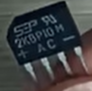
实心包子是馒头
不是啊，整流桥只能把交流变直流，反过来不行的。  
想把直流变成交流需要逆变器，而且还需要考虑输出交流的波形是方波还是正弦波等等，是比较复杂的。
2023-08-25 15:02👍3

[[0017]找到一个元件就找到交流和直流的分界线](https://www.bilibili.com/video/BV1Xp4y1J7x8?t=212.3)四个二极管是散装的整流桥
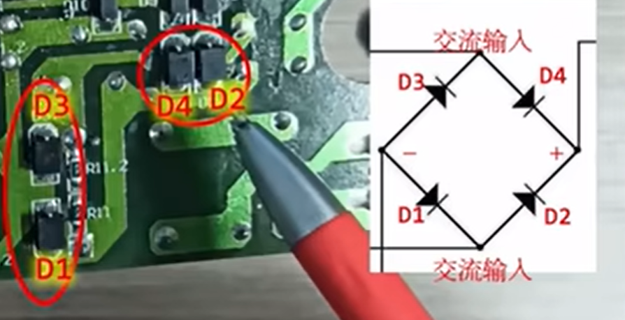

### m1517大神
#### [合集·改造和制作](https://space.bilibili.com/252546811/channel/collectiondetail?sid=745897)
#### [合集·拆解和维修](https://space.bilibili.com/252546811/channel/collectiondetail?sid=1193055)
各种家用电器维修

##### [电动车(2) - 校准电动车码表与安装外置码表](https://www.bilibili.com/video/BV1du4y1W7WK/)
m1517
置顶注意: 视频中两轮车把码表调准后,里程数依然不准!!这一点非常恶心,实测码表走0.7km时,车子里程表显示1km,大致就是这个比例,这个问题其他车子不清楚,应该也是这样,所以校准的意义不大了..[无语]
2023-10-11 19:18 👍1
#### [电子秤原理](https://www.bilibili.com/video/BV1fv4y1L77s/)
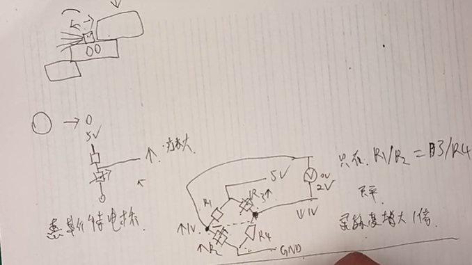
全桥对臂测量
电阻式全桥应变片

#### [[拆解]-家里电水壶坏了先别扔,拆两个看看原理以及维修](https://www.bilibili.com/video/BV1qu411v7uB/)

#### [[拆解]-手机直播补光灯原理](https://www.bilibili.com/video/BV1Wt4y187WT/)

#### [搞个绿油固化灯](https://www.bilibili.com/video/BV1ra4y1g7Gu/)

395nm紫外灯

#### [尝试低成本DIY维修显微镜[放大镜] - 最终效果](https://www.bilibili.com/video/BV1Ga4y1V7Ga/)

[视频时间戳：](https://www.bilibili.com/video/BV1Ga4y1V7Ga?t=610.0)
优点：
	价格便宜。
	usb,
缺点：
	1,放大倍数不够，和体式显微镜比不了，
	2,对于距离敏感，用0745远新镜头好一点
	3,镜头边缘变形
纠正：
	1,认为缩短镜头并不能明显提高倍数
	2,变焦，好像望远镜，5-50,10变焦，并没有放大十倍，22,18远，
	3,镜头距离：
		工业镜头c c/s
		c 17.5mm cs 12.5变焦
		螺纹是一样的，加转接环，
		应该买如0745的镜头
还有一个参数是靶面大小(也就是cmos或cdd的尺寸)，这个参数没有提及，看了一下通常镜头1/3靶面的比较多，这种就可以了，因为usb摄像头的cmos通常不太大。

## 实例
### [40元自制 | 可视猫眼 | 视频监控](https://www.bilibili.com/video/BV1Yz4y1378Q/)

轻玩科技
置顶_qq群，源码资料请关注"轻玩科技"微信公众号
2023-08-16 18:39👍1

### 修鼠标

亲测有效，没有拆开，对着那个滚轮直接哈气，吹不到一分钟恢复正常

[发布于 2018-05-11 10:38](https://www.zhihu.com/question/41680058/answer/388714156)

2020-05-08
哈的热气中有水汽，把覆盖在触片上的污垢膜溶解了，于是就OK了。滚动失灵，主要还是膜垢导致的接触不良......

拆开鼠标盖，用香水对着标志区域喷两下，来回拨动几次滚轮，搞定！

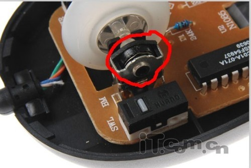

链接：https://www.zhihu.com/question/41680058/answer/91929013
2016-09-18
香水中含有乙醇起到清洁作用，香水中的植物油帮助润滑解决接触不良问题
2017-12-13
试过之后，滚轮废了，罗技的光电鼠标
2018-02-24
不会是没断电就喷或者没干就通电吧，花露水和香水都有水分的，一通电就会短路。。。
2017-10-12
没拆开鼠标，直接把花露水对着缝倒进去了点，简单暴力，亲测有效。

#### [滚轮坏了别弃疗！教你怎么抢救鼠标滚轮](https://post.smzdm.com/p/428480/)

2016-03-10 18:26:25
�性，还有前面吸咀去买内3外5的硅胶管，你会感觉买小了，不用担心，强行套进去就行，这样子前面吸咀就不会太大不好用，有的焊盘间隔比较近
2022-10-26 09:53 4
zy871013
高温软管买多少口径的
2021-12-28 09:33 1
血炼_Javan
内5mm
外8mm
2021-12-28 15:19
放肆de无暇
大蓝棒如何换吸嘴啊，半天拆不出来
2021-09-03 22:53
血炼_Javan
拿铁钳直接硬拔
2021-09-04 01:04 1
bili_33252544026
使用很麻烦的，而且冲击力大，经常反向撞歪针脚
2021-08-29 21:20 2
血炼_Javan
怎么会的 况且加上高温软管更加不可能会撞击了呀......
2021-08-29 22:20

### 智能家居

#### [十块钱实现物联网，轻松控制家庭设备（详细教程）可接入小爱](https://www.bilibili.com/video/BV1Xf4y1e7vt/?spm_id_from=trigger_reload)

14.4万播放 · 总弹幕数31 2020-12-25 23:12:16
交流群：245197813
相关文件在评论区下载
有任何问题加群艾特我
点动控制教程：BV1RZ4y1F7Zz
置顶相关文件：https://wwi.lanzous.com/b01hwgdlg
密码:e7d6
2020-12-25 23:1294
pig猪小盼
接入米家也是属于第三方平台，又不能在米家里面联动控制/[嫌弃/]
2020-12-26 13:0515回复
我的丿心语 UP 标题 ：可接入小爱
又没说就是小爱
据说可以刷米家的固件，然后控制..
2020-12-26 13:364
风流水里可以在场景里用小爱音箱自定义语音口令控制
2020-12-29 22:561
线性齐次
21年成功实现前来报道，up的文件有两个地方不太好使，一个是blinker库现在有更新，需要自己下载最新版的库，还有就是esp8266扩展不好使，自己在开发板管理器里面下了一晚上/[doge/]
2021-08-27 10:425
陌然jpg
我还以为真的接入米家呢/[笑哭/]接入小爱 绑定其他平台的账号
2021-01-03 19:275回复
可爱的打印机小米和华为为了推自己的物联网方案都是9.9的模块，不过不给我们这种做着玩的个人开发者
2021-01-09 04:49👍4
[**陌然jpg**](https://space.bilibili.com/155994368)回复
[/@可爱的打印机](https://space.bilibili.com/261472974) :开个小公司
你看某宝上的十几块的通断器不就是用的小米模块么2021-01-09 09:282

#### [【智能家居】wifi智能插座开发教程](https://www.bilibili.com/video/BV1et41147zM/?spm_id_from=trigger_reload)

3906播放 · 总弹幕数2 2019-01-25 23:16:25

#### [电路城 与非网](https://www.cirmall.com/circuit/18476/)

#### [智能吸顶灯LED过道走廊灯具楼梯灯夜间玄关声控灯雷达人体感应灯](https://detail.tmall.com/item.htm?spm=a230r.1.14.19.57e53bb93vx4AU&id=591253841161&ns=1&abbucket=18&skuId=4816012463068)

接通电源，无插头开关。¥ 35
### [老式太阳能热水器升级改造（加装自动上水功能）](https://post.smzdm.com/p/a99v3pz7/)

太阳能热水器控制器自动上水仪表全智能 通用型显示屏测控仪配件
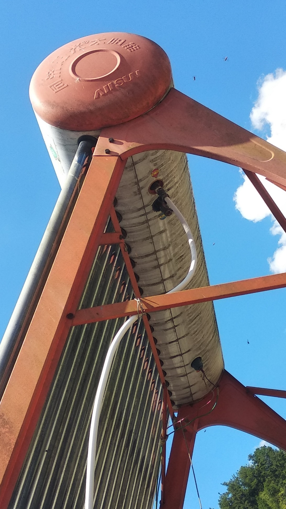
¥ 63
[太阳能热水器控制器自动上水仪表全智能 通用型显示屏测控仪 配件](https://detail.tmall.com/item.htm?id=606894499926&ali_trackid=2:mm_25282911_3455987_15218806:1632142083_108_1487020523&union_lens=lensId:TAPI@1632142083@21082972_08c0_17c033fc473_7b96@01;linkRuleId:2;recoveryid:1632142083_108_1487020523&ak=23340247&bxsign=tbk6MBr1DwG1hOANnywMlGQCm0CrZ83TLN2qYFN5sH9Sl9GG1Ec116Z4UL74CZDIl7eYYYLoDYpQekiiu1lfDAf3earv5%20y7Q72vFaz5JyGJXw=&skuId=4421039802308)

### [修太阳能热水控制器](https://www.douyin.com/video/7129006067383635231?modeFrom=)
电池漏液导致电路板损坏。

### [4G插流量卡的监控摄像机一定要注意这些坑](https://www.bilibili.com/video/BV1HV4y1d7Th/)

快乐源泉QAQQAQ
我家人在PDD买的杂牌监控80块钱，免费流量十年，已经用上了，但是我老觉得有坑，不知道会在哪里有坑，想问一下
2023-10-02 21:59 👍6 

紧促的子弹
回复 @小雨坏坏 :我一朋友买了个太阳能4g监控摄像头110.9块，安装使用过了就不能七天无理由退款，想换还再加189才能换WiFi版本，不买流量就没用三年179终身二百五……
2023-12-27 17:36 👍2

### [Arduino教程┃五分钟全面了解水位传感器「图文」](https://baijiahao.baidu.com/s?id=1632071100919342482&wfr=spider&for=pc)
实验玩具

### PCB

#### [手把手教你做一块电路板，从设计到制作！嘉立创一站式服务](https://www.eet-china.com/mp/a125123.html)

原创 大鱼机器人2022-04-16 12:39

绘制原理图和PCB：用嘉立创EDA

PCB打样生产：用嘉立创PCB

焊接：用嘉立创SMT（包工包料模式）

对于公司：如果需要自己生产电路板，肯定是需要设立一些关键性的岗位，用嘉立创的一站式服务，可以节省岗位，让专业的人可以做更专业的事。

对于个人：

某天，想做个小设计，可以用网页EDA在线绘制原理图，不用为了心血来潮的一个小制作单独安装EDA了。

完成设计之后，还要上网买器件、一个店铺还买不全，器件回来之后还要焊接。

#### 视频教程[嘉立创PCB打样SMT贴片加工，太方便了，质量好速度快](https://www.bilibili.com/video/BV1BT4y1K7BS?spm_id_from=333.337.search-card.all.click)

4407播放总弹幕数4
2020-12-26 20:22:06
嘉立创SMT可以自行提供元器件吗？比如有的元器件他没有
2021-01-06 18:332回复
辉哥带你做毕设UP
没有的可以寄过去做
2021-01-06 18:38
#### 贴片工程费50元，焊点费0.01元/焊点
平野仙踪 SMT好贵啊
2020-12-27 23:563

辉哥带你做毕设 UP
一个焊点一分钱，还好
2020-12-28 00:251

免开锅网免贴片开机费
贴片工程费50元，焊点费0.01元/焊点
贴片速度快，最快只需要12小时可贴好发货

### [快速制作PCB板的几种方法-CSDN博客](https://blog.csdn.net/best_xiaolong/article/details/121738339)

- **一分钟制版法**[4]  :https://zhuoqing.blog.csdn.net/article/details/104120559
- **一分钟制版之后**[4] : https://zhuoqing.blog.csdn.net/article/details/104133981
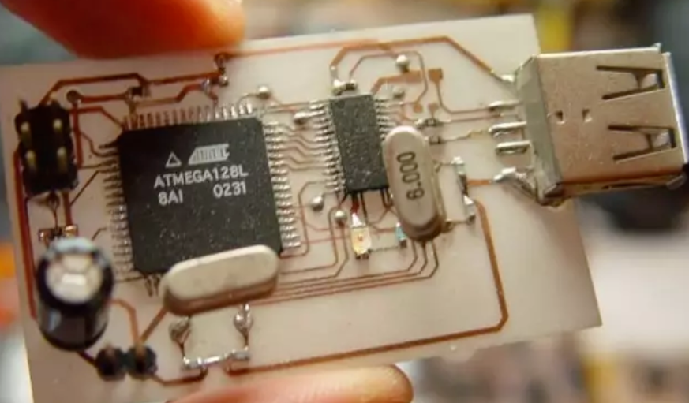

### [教你看懂PCB上的英文字母，学会它就是初级电子工程师啦](https://www.bilibili.com/video/BV12B4y1H7Go/)

联邦的机动战士
2022-08-22 22:47👍28
C-——电容
U-——IC芯片，集成电路
L-——电感
D-——二极管
R-——电阻
TP-——测试点
EC-——电解电容
J-——插座
Q-——三极管（晶闸管，场效应管）

场管是EFT，除了mosfet还有JEFT也是场管，MOSFET才有场管的意思
2022-07-27 12:25 👍2

## [【HACK】电子极客设备推荐，电子爱好者都需要哪些设备？](https://www.bilibili.com/video/BV1zQ4y1A7vV/)

## [最详细的万用表使用方法](https://www.bilibili.com/video/BV1s64y167Gn/)

### 测电流一般用钳形电流表
皆可椒盐
确实用不上，一般用钳形电流表
2021-08-17 11:25 👍1

車仔最犀利
人才，万用表测电流是串联比较麻烦的，你直接两个表笔差空开的火零线相当于直接短路，不炸才怪。测电流还是用钳表，方便又安全
2021-08-04 21:13👍3

大声呼喊欧尼酱
上次直接怼空开上测电流，嘭的一下，眼睛都闪花了，笔尖都烧没了
2021-07-26 09:52👍119

### 自动档建议众仪的zt-101
空NC
自动档建议众仪的zt-101
2021-07-25 23:01 👍1

### 大容量电容短接 会炸
亲爱的阿廖沙
容量大的电容 千万别短接 会炸的 以前看过有人拿个电线短接大容量的电容 直接爆炸了 之后我看到电容就觉得像手雷
2021-07-26 06:31👍214

### [8-蜂鸣档，线路检查的神器，通断与短路检查很方便](https://www.bilibili.com/video/BV1LK4y1K7rk/)

### [如何用万用表查短路、断路、漏电？](https://www.bilibili.com/video/BV1mY411p7EQ/)

短路，零线和火线碰线，灯亮，阻值0.
断路，地线，灯亮，导通，好的。
漏电，火线和地线导通。出现漏电。

#### 漏电还是指针表最好用
Linuxer23
有一些情况测漏电还是指针表最好用，而且可能只能用指针表
2022-09-18 03:12
伊藤诚10
MF47型指针表
2021-12-28 18:24👍2

#### 漏电合格是0.5兆欧
bili于斯
半桶水别瞎逼逼。漏电不是用万用表测的，而且合格是0.5兆欧，不是50兆欧。
2022-10-16 22:52👍1
-小miku
零线和地线没通怎么才0.5兆欧，不应该是无穷大吗
2023-02-20 16:58
#### 电路有电的时候不要用万用表的欧姆档位
百年何轩
回复 @天泽恒 :就是电路有电的时候不要用万用表的欧姆档位
2022-09-28 14:43👍1

百年何轩
兄弟们用万用表的Ω欧姆档千万不要带电，我刚把带我的师傅的万用表弄炸了，哭泣泣，内疚疚。
2022-06-23 21:29👍3

#### MF47指针表 钳型表
伊藤诚10
一个MF47指针表，一个钳型表……可以了，原因嘛！指针表反应快量程大测漏电之类的，钳形表主要有些时候测电流之类的要用
2021-12-28 18:18👍2

### 万用表推荐

#### [初学者入门级万用表选购误区(几十元以下的表真的适合小白吗？)](https://www.bilibili.com/video/BV19A411L7D8/)

CacPixel
有一说一，垃圾表真的不可买。今天一个十几块的9205a我拿来测通断，好家伙直接市电整流滤波后的电压怼我手上之后表里的电容给我电路里的电容充电，短路直接火花，自己直接损坏显示电池电量低而且报警灯常亮，好家伙差点把我干死
2020-10-29 16:26👍132

我是不会修
200左右真没啥好推荐的，要么就七八十买个136B+ 890一类的，要么就三百多买61E+
2022-03-31 21:08👍1
笨比泡泡
up可以推荐一个给我吗，想买一个100以内的手动挡的吧，功能不要太多毕竟我也不太会用，谢谢啦
2021-12-03 16:43👍3

我是不会修
优利德890D+ 胜利890C+
2021-12-04 07:59👍2

金银花的烂漫
136b和890c推荐哪个
2021-11-12 13:11

bili_309467905
我觉得136B好一些吧
2021-11-16 19:37
##### 低端的VC890系列卖的好￥70
我是不会修
胜利万用表 现在基本上就是低端的VC890系列卖的好，七八十块钱，别的真没啥好推荐的
2021-05-05 11:37👍1

##### 全自动都不好用
我是不会修
回复 @左右逢源037 :我没推荐过全自动的表！全自动都不好用！
2022-10-26 14:02👍2

##### 插上交流电测暖风机炸
院子君
拆了个暖风机，瞎测测不明白，想的插上电测测。于是乎交流电压档怼火线零线上，pong的一声很快啊就跳闸了，表笔烧黑了，电路烧黑了，还好听up的没买便宜货表和我都没事接下来打算买个带空开和漏电保护的插座，便于更好的作死
2021-12-17 12:38👍6

#### [福禄克No.1](https://zhuanlan.zhihu.com/p/349681776)

特点：
1.集成表体设计：特别设计的仪表支架与表体集成，更易于支架的灵活使用。
2.品质优越：抗冲击、耐热性能好，耐用、可靠且准确。
3.显示范围大，背光为明亮的白色，读数更清晰、准确。个人点评：福禄克是全球知名的电子测试工具品牌，福禄克电子仪器仪表公司成立于1948年，其销售和服务遍布于欧洲、亚洲等区域，其中，福禄克万用表具有数据保持功能，更易于读取测量结果，同时，配以LCD大屏幕显示，数据读取更清晰，不仅仅如此，福禄克万用表外观新颖，尺寸小巧，握感舒适，携带和使用更加清晰。福禄克万用表是真正可以值得信赖的品牌。
￥500+

#### 高精度 速度 高性价比UT61E
￥250+
[发布于 2021-07-26 01:09](https://www.zhihu.com/question/339182005/answer/2019747012)
非自动量程的基本上随便选。随便买个就能用。各个品牌890这种出货最大的基本也是性价比最高的，技术最成熟的，性能最稳定的。
自动量程的最关键的性能指标是速度。
在这个前提下，还要求“高精度”和硬芯的话可以看看UT61E，这表速度蛮快，然后呢，还是4位半，所以被人吹上天了。
对精度不是那么抬杠似的要求的话，UT136B/C是我见过性价比最高的表了，使用感受差不多，但价格差不多是61E的1/5。
强烈推荐136B/C，没什么活是61E能干它不能干的。如果有请自身找原因。
胜利/华谊也有好表，但不喜欢它颜值，所以没研究不提了。
至于被吹成神的福禄克，要么别买，要买就115起步，它那些低端表真的很没意思。
挑自动量程的数字表千万别把精度当回事。用不着看那些乱七八糟的评测，毫无意义。真需要高精度的场合要么台式表要么福禄克/是德的高端表，拿着一堆低端表夸夸其谈精度真是跟演小品一样。挑中低端自动量程的表首先看价格，然后看最重要的性能指标：速度！这个性能要是不达标它精度再高也没用。
发布于 2021-07-26 01:09

#### [百元内万用表推荐之优利德UT136B+测评体验](https://www.bilibili.com/video/BV1YB4y1D7om/)

中合工业服务有限公司
80元包邮，做工非常不错，超快的直流电压，电阻，通断，简直就是修电路板绝配，就是因为超快的直流电压档，可以看到电压跳变，这一点好多500元以内表都搞不定，修电路板必买的表，因为这个表的短板基本上用不上
2022-06-01 21:56👍70

闪电wifi
请问UP，136c+和136b+一样的速度吗？？？136b+的NCV没啥用，136c+带温度测量。
2022-06-03 11:21👍15

超速小绵羊
C好像不能测电容，我一开始选了C，看了他们店的对比图，感觉为了测个温度丢失了电容功能有点扯，不知道是不是真的，反正最后买B了
2022-11-10 22:41👍1

纯金线圈
回复 @超速小绵羊 :你错了，c有电容，用几年了
2022-12-13 01:29👍2

此人可以不要昵称
回复 @gxjicna :比方说一块电路板上密密麻麻地都是原件和焊盘，用眼睛看肯定是不知道一个测试点的走线去往哪里了，就需要一支表笔捅测试点，另一只表笔在电路板上瞎划拉，有些表反应慢划拉到通路的位置还没来得及响表笔就划过去了，这时候就不得不减慢速度一个点一个点的慢慢来，136B+反应速度特别快不管你划拉的速度有多快都能有提示，
2022-09-04 12:41👍51

##### 测3欧姆以下的电阻直接显示0欧
放猪倌
我的136C+测3欧姆以下的电阻直接显示0欧。问问大家的都是这样的精度吗？
2023-03-15 14:36
### [帮网友测试一下新买的优利德人气万用表UT136B+](https://www.bilibili.com/video/BV1G14y1e7AQ/)

拉轰的小爷们
这表在校准时计算了表笔内阻，所以你得带表笔测
2022-11-17 14:32👍4
楼下老实人
怪不得我有的时候开机测电阻，不先短接表笔直接测，结果示数乱跳
2023-03-10 22:4

#### 寄回厂家售后校准
我是不会修
像国内的优利德 胜利 你不管从哪里买的，直接寄回厂家售后就行！不用通过商家！ 找人校准也可以
2022-09-10 08:37👍1
#### 交流档不归零很正常。不影响测量
我是不会修
回复 @逗比豆豆93 :交流档不归零很正常。不影响测量
2022-09-14 19:25
#### DT830数字万用表￥13
[item.htm](https://item.taobao.com/item.htm?id=527453869178&ali_trackid=2:mm_33231688_7050284_23466709:1693299433_089_20900452&spm=a2e1u.27655827.d1661933647166.2&union_lens=lensId:OPT@1693299428@212789cd_0b90_18a4082cb0a_d6d5@01@eyJmbG9vcklkIjo2MTc4NH0ie;recoveryid:201_33.7.200.130_1353004_1693295741179;prepvid:201_33.8.154.255_1013247_1693299426889&bxsign=tbkX30fzkRplVQ_qR8lpwrjUn8sErgtloX6SDATW57JA5S-VnJ6nTpYJdl_mOtu53LHDJWN484DxgaT4_5hxla5nrsjVL1ziC6zcac745Qgqf8-EJ4riv9UhhPNKSNnUqvK8ev4zOhsM93ycS4V2IlwCQ)
烂，没有保护措施。

## 测电池

### 记录
#### 华为P9 EVA AL-10充电
40m 30%
充满估计2h。
#### 2w mAh充电宝 Type-C充电
12V，1.5A，realme和快充充电器，一分钟充22mAh
5V，2A，小米充电器。一分钟充33mAh

#### 给realme充电

#### 2w mAh充电宝
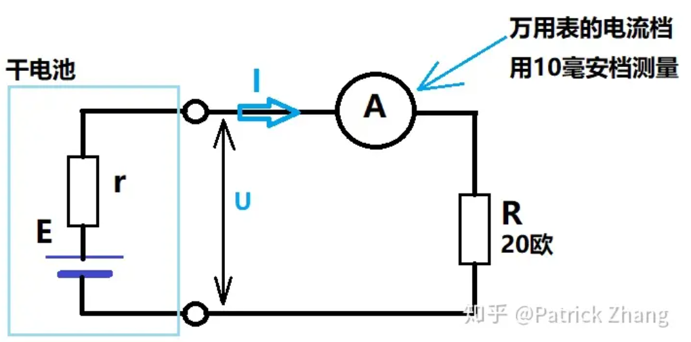
标识：额定输出5V 2.1A
直接测电池两端的电池电动势E=3.4V

串联20R电路中，
150mA，3V。
$I=\frac{E}{r+R}$，并由此推得：$r=\frac EI-R$     式1
3V/0.15A-20Ω = 0Ω
3.4V/0.15A-20Ω = 2.6Ω
电池内阻：2.6Ω

[另一种计算电池内阻的方法：](https://www.bilibili.com/video/BV15B4y1b7nY/)
使用有负载电压3V
3V/10Ω= 0.3A
串联电路分压，内阻分了3.4V-3V=0.4V的电压。
$0.4V*0.3A=0.12Ω$
电池内阻：0.12Ω

2023年10月29日 周日 13时22分29秒
已经充了468mAh。

#### 5号电池

标准5号电池1.5V，这里测的应该是健康的电池。

电伏直接测得出，电路中：20R 1.49V 50mA
计算得电池内阻为：9.8 R
电伏直接测得出，电路中：20R 1.588V 63mA
计算得电池内阻为：5.2 R
500/63≈8小时

两个电池串联，直接测电池2.9V
电路中：20R 2.65V 113mA
计算得电池内阻为：5.66 R

两个电池串联，直接测电池2.219V 放电1h
电路中：20R 1.91V 85mA
计算得电池内阻为：6.1 R

两个电池串联，直接测电池1V 放电9.5h
电路中：20R 0.817V 36mA
计算得电池内阻为：7.7 R

两个电池串联，直接测电池0.33V 放电23h
电路中：20R 0.118V 9mA
计算得电池内阻为：16.66 R

两个电池串联，直接测电池0.17V 放电29h
电路中：20R 0.08V 4mA
计算得电池内阻为：22.5 R

两个电池串联，直接测电池0.081V 放电48h
电路中：20R 0.022V 1.2mA
计算得电池内阻为：47.5R

两个电池串联，直接测电池0.07V 放电51h
电路中：20R 0.035V 1mA
计算得电池内阻为：50R
短路电流2mA
### 电路及其原理 需要20欧电阻 万用表 或 鼠标

图2：测量电路
$I=\frac{E}{r+R}$，并由此推得：$r=\frac EI-R$     式1

第一步，把干电池空置，用万用表的5V电压档测量它正负极间电压，此测量值就是电池电动势E

说明：当干电池空置后，电池内阻因为没有电流流过，所以它的电压降Ur=0。万用表5V电压档的测量值就是电源电动势E。

注意：一定要辨别清楚万用表的电压档后再测量。如果拨到电流档，电池会输出较大的电流冲击万用表，万用表可能损坏。

注意到我们把万用表的红、黑表棒搭接到电池正、负极后，其实万用表表头与干电池构成了电压测量电路，也会有很小的电流流过电池内阻r，所以万用表测得的电压值其实就是路端电压U，见图2。我们用U来代替E，这里当然存在误差，但误差很小，在居家的条件下，我们把误差忽略不计。

第二步，按图1搭建电路，用万用表的100毫安电流档测量电流I

在进行此测量时，一定要注意万用表的档位。如果错用电压档，此时万用表的内阻很大，则电流很小。虽然不会毁坏万用表，但无法获得准确信息。

第三步，我们就可以计算干电池内阻了

由图2，我们写出电路表达式： 
$I=\frac{E}{r+R}$，并由此推得：$r=\frac EI-R$     式1

#### 电池的内阻r在1欧上下，新电池  r在100欧以上电池寿命已到
测量和计算后，发现电池的内阻r在1欧上下，这些电池就是新的；如果r在十几欧到几十欧，则电池已经用了一段时间了，但还可以用；如果r在100欧以上，则此电池寿命已到，该丢弃了。

如果实在借不到万用表和电阻，还有一个简单的方法，就是利用光电鼠标来测量。我们把电池置入鼠标，若鼠标在电脑界面上不见光标踪影，则此电池肯定要丢弃。反之，则可以继续使用。
用鼠标测量电池寿命比用电视遥控器测量要好，测量灵敏度更高。
[编辑于 2019-08-03 07:34](https://www.zhihu.com/question/22729960/answer/773011506)

#### 串联一个20欧电阻作为负载电阻
[方神箭](https://www.zhihu.com/people/d0432aaad5dc4bdbaaa812ebf256b8a5)
张老师为什么要串联一个20欧的电阻呢？是为了消耗万用表的电流吗？
2019-08-03
[Patrick Zhang](https://www.zhihu.com/people/0340088f370becffa814797ee3d2d6bf) 作者​
负载电阻
2019-08-03

#### [读数低于1.2v表示电池没电](https://zhidao.baidu.com/question/1886832892466454748.html)
把红表笔插正VΩ孔、黑表笔插COM孔，万用表量程开关转到直流20v（或10v）档，红表笔接触电池正极，黑表笔接触电池的负极，此时万用表的读数就是电池的电压，正常时读数在1.5v左右，如读数低于1.2v，就表示电池没电了。

#### 电池的放电电流越大，相对来说电压就会越低
抛砖引玉。
测量仪基本原理就是根据电池的电压推测电池的剩余电量。
电池的放电电流越大，相对来说电压就会越低。所以按照功率依次向下替换（从手电筒到闹钟到遥控器）的行为是正确的。最后上测量仪的时候显示的是电池的开路电压，基本算是真实值。使用前看好电池上的铭牌和测量仪的说明基本靠谱。
[发布于 2015-03-02 18:41](https://www.zhihu.com/question/22729960/answer/40946271)

### [碱性电池<4mA无效 wikihow](https://zh.wikihow.com/%E5%A6%82%E4%BD%95%E6%B5%8B%E8%AF%95%E7%94%B5%E6%B1%A0)
1、弹跳法，无电电池弹起高度高。

3、电流法
对碱性电池进行负载测试，这样结果最准确。负载测试可以测量电池工作时的电压。高端万用表一般有两个电压档位，1.5V和9V。如果是1号电池、2号电池、5号电池和7号电池，将档位开关旋到1.5V。 如果是9V电池，旋到9V。将黑色表笔搭在电池的负极，红色表笔搭在正极，然后测试电池的电流，单位是毫安。

- 新的1.5V电池的电流读数为4毫安，9V电池为25毫安。低于此值说明电池没电了。对于大部分1.5V电池，电量不足时，电压通常会降到1.2-1.3V。
- 这项测试对锂电池无效，因为万用表没有适合锂电池的电压档位。

### [测量电池好坏（万用表测量电池电压）](https://www.bilibili.com/video/BV1oR4y1R7bY/)
这个3.89这个是好电池，它坏电池的话他是没有没有电压的。

#### 原理并个电阻测量
并一个电阻不就完了吗?好多余的功能。
深呼吸logo
测量电池的话用普通电压表测也可以 在电池两端加12欧电阻
2022-07-08 18:52👍2
佛山牛哥
对，原理都是一样的，就是并个负载测量
2022-07-09 10:12

#### 直接测电池电压 经常测得是虚电
宝爸来袭
电池检测功能感觉没啥用
2022-07-10 17:54👍2
佛山牛哥
家庭有时候电池放混了，可以挑选，或者玩具有的电池被小孩搞乱了也能测试一下
2022-07-11 02:24
宝爸来袭
回复 @佛山牛哥 :直接测电池电压不行吗……
2022-07-11 16:27
佛山牛哥
回复 @宝爸来袭 :测得是虚电经常，因为万用表电压档大都是高阻的。测得电压是虚电的电压，但是有可能已经带不动玩具了
2022-07-11 22:29👍3
宝爸来袭
回复 @佛山牛哥 :测电池内阻是最靠谱的。内阻高了，电池放电能力不行
2022-07-11 22:47👍1

佛山牛哥
回复 @宝爸来袭 :这万用表就是并联小电阻的方式其实就是通过显示的电压等于是间接的判断了电池的内阻大小。电池内阻增大，表显的电压自然也就低了。
2022-07-11 22:56👍2
### [万用表能判断电动车锂电池好坏吗？](https://www.bilibili.com/video/BV1uM4y1M7Q5/)

### [电动车电池的好坏只需要看回升电压就能知道、师傅把多年经验告诉大家](https://www.bilibili.com/video/BV1zA4y197fT/)

过放电，此时电压在11V左右，回升电压超过12V则坏，超过13V更坏。

### 修电池

#### 12V铅酸充电电压最高14.4v 最低10.4V

##### [12V铅酸充电电压最高是多少？](https://www.zhihu.com/question/456459008)

建议最高14.4安全电压最高13.8，超过13.8会开始电解水过程，产生大量气泡，导致水分损失，低于13.8可以长时间充电，充电过程要监测电流变化，过充电对会导致电解液水分流失，电解液浓度升高。汽车发电机输出电压一般设定为14.2或14.4，这是考虑充电速度和蓄电池寿命的结果

##### [充满电时电压是14.4V；电压不低于10.5V时可以用。](https://zhidao.baidu.com/question/616138190771208372.html)

12V铅蓄电池，充满电时电压是14.4V；电压不低于10.5V时可以用。

一个12V电池里面有6个串联起来的单格铅酸电池而组成，单个的标称电压是2.0V，电压最高只有2.4V。12V的铅酸蓄电池或非铅酸蓄电池都以14.4V为充满电的标准，用14.7V定压充电器充电，充到14.4V就不能再充了，否则就会损害蓄电池。

电池每个单格的终止电压为1.75V，因此12V系列电池的终止电压为10.50V，意为电池的放电电压达到10.50V时，必须终止继续放电操作，继续放电就会造成电池过放电。同理，16V系列电池的终止电压为14V。

#### [锂电池的寿命究竟有多长？如何保养锂电池？](https://zhuanlan.zhihu.com/p/352273939)

#### 一个充电周期
一个充电周期意味着电池的所有电量由满用到空，再由空充到满的过程，这并不等同于充一次电。比如说，一块锂电在第一天只用了一半的电量，然后又为它充满电。如果第二天还如此，即用一半就充，总共两次充电下来，这只能算作一个充电周期，而不是两个。因此，通常可能要经过好几次充电才完成一个周期。每完成一个充电周期，电池容量就会减少一点。不过，这个电量减少幅度非常小，高品质的电池充过多次周期后，仍然会保留原始容量的80%，很多锂电供电产品在经过两三年后仍然照常使用。当然，锂电寿命到了最终后仍是需要更换的。

而所谓500次，是指厂商在恒定的放电深度（如80%）实现了625次左右的可充次数，达到了500个充电周期。

#### 浅放浅充更有益处
事实上，浅放浅充对于锂电更有益处，只有在产品的电源模块为锂电做校准时，才有深放深充的必要。所以，使用锂电供电的产品不必拘泥于过程，一切以方便为先，随时充电，不必担心影响寿命。

#### 手机电池保养方法：
1、每次完全充满电使用，减少充电次数，提高电池使用寿命。
2、不用把电池完全放电，通常电量低于10%就需要充电。
3、使用原装充电器充电，不要使用万能充充电。
4、手机充电过程中，不要使用手机。
5、不要过分充电，电池充满以后停止继续充电。

#### 一般锂电池充电次数是2000-3000次
是的，根据实验结果，锂电池的寿命是随着与充电次数增加而不断衰减的，一般锂电池充电次数是2000-3000次

#### [锂电池长时间不充电饿死了怎么办？教你一招快速修复](https://www.bilibili.com/video/BV1kF411A7UE/)
布丁哥讲电路
长时间不用饿死了，电压过低，充电器识别不了开启不了充电，用USB5V充电之后电池电压回升，可以被充电器识别了，就能正常充电了
2022-09-18 21:34👍2

布丁哥讲电路
拆开了把电池拿出来测一下电压，如果确认电池电压非常低，小于2V用充电器充不进电了，就直接找个5V手机充电器，把正负极对应连在电池正负极上，充个几十秒，看一下电压有没有升上来一点，如果充了很长时间电压都没有丝毫回升，那就是电池彻底坏了，需要换电池了；如果电池电压超过3V还充不进电，那基本就是充电器坏了
2022-11-09 12:07👍4

#### [充电宝充不上电？教你维修方法](https://www.bilibili.com/video/BV1Vv4y1s7hv/)
5V直流激活

#### [锂电池使用时为什么要装保护板，做个锂电池过充实验，你就知道了](https://www.bilibili.com/video/BV1YB4y1H7jK/)

##### 泄压阀把电极顶开了 突然没有电流
lm1875g
为什么会突然没有电流啊
2022-07-07 23:40 👍31

小N爱折腾
泄压阀把电极顶开了
2022-07-08 11:41👍27

小小小小小萍果
回复 @小N玩电脑 : 可以用这个原理做电动车的警报开关吗，泄压阀把电极顶开意味着几秒钟后就会发生爆炸，这个时候行车电脑立即关闭发动机并刹车，然后弹射座椅将驾驶员和乘客弹出车外，保护乘客。这些操作务必在3秒内完成。[doge]
2022-07-08 21:24 👍23

小N爱折腾
回复 @小小小小小萍果 :这是最后一层保险了......电瓶车都有保护板的，电动汽车有更高级的BMS检测异常情况
2022-07-08 22:14 👍12

##### 锂电电压在3.7v-4.0v之间循环是最健康
阿兹塔弥斯
长期使用，锂电电压在3.7v到4.0v之间循环是最健康的。需要外出携带的设备才推荐充到4.2v（现在有些手机电池更狠，满电电压定到4.4v
2022-07-08 16:09 👍2

##### 长期低电量或者高电量电池寿命短
戦艦レ级改flagship
回复 @月离索 :锂电池是很不稳定的，长期低电量或者高电量电池寿命都会降的很快，何况是你一直维持满电。正确维护办法是维持电量在50%附近，不够就插上，充到75%-80%就可以停了。当然有些人会说不能把电池当爹balabala[doge]我只是介绍一下合理延长电池寿命的方式而已
2022-07-11 10:51

### 电池保养

#### [锂电为啥久不使用就自己鼓包了](http://www.crystalradio.cn/thread-791927-1-1.html)

##### 锂电池不应该满电存放 放电至40%左右存放

发表于 2015-12-1 21:10:18 来自手机 |
锂电池本就不应该满电存放，一次都没有用过的全新手机配的锂电池有那个是满电的。

发表于 2015-12-2 10:05:24 |
锂电池不同于铅酸 和镍镉  锂电芯最佳的存放状态是4-10摄氏度左右，电芯余电在30%-40%  每1-2个月完全充放一次再充满 放电至40%左右存放

锂电池定时拿出来用用，是没有问题的。就怕充满电长时间放置不用。放置一段时间电压下降主要保护板功耗和电池自放电造成的吧。对于电池内部的化学反应我不懂，我只知道，充满电长时间放置对锂电池不利。

#### [锂电池为什么会鼓包？穿刺、拆解分析](https://new.qq.com/rain/a/20220301A0192U00)

2022-03-01 07:31电子工程世界官方账号

1.1.1 充电过程膨胀

  锂电池在通常情况下充电过程中会自然略微发生膨胀，但通常不会超过0.1mm。然而，如果过充，引起内部电解液的分解，就会增加内部的压力，使得电池膨胀，甚至最终引起电池爆炸。

**解决方法**：就是不要过度对锂电池进行充电。需要能够使用智能充电器可以自动检测电池是否充满。特别是，不要连续充电超过12个小时。

1.1.2 生产过程中膨胀

  在生产过程中，如果发生短路、过热等异常现象都会使得电池内部过热，引起内部的电解液的分解，使得电池膨胀。

**解决方法**：电池的生产厂商应该严格控制电池生产过程中的各种参数以及工作环境避免发生短路和过热。

1.1.3 循环使用过程中膨胀

  随着锂电池循环使用，它内部的电极会自然加厚，引起电池膨胀。通常情况下，在50周之后，这个现象就不会再继续，此时电池会自然增加 0.3 - 0.6 mm的厚度。

**解决方法**：这是电池正常的反应。通过增加电池的外壳，或者减少内部物质可以减少膨胀的程度。

## 测芯片
### [如何用万用表直接测量芯片好坏，学会这几招，维修再也不用盲目换芯片了](https://www.bilibili.com/video/BV1jv411x742/)
Lin林2333
做维修的 万用表需要好的 差的没有保护一个失误就GG
2021-01-17 21:46

马驽
回复 @江苏卖瓜一块五 :没有那么贵我和阿婆主同一款福禄克365买的，现在一看竟然400多了。这么多年过去了没有任何问题质量不是一般的好
2022-09-25 23:10

神飞游光
胜利的100左右的够用了
2021-01-17 11:27

等待不好
灯泡我之前也这样用，后来我被电了😂，到第三回的时候，我受不了了，找了两个220转12的环牛，加2欧水泥电阻限流，做了一个隔离变压器，电阻分出的电压半桥整流分给灯珠pcb，短路灯亮，限制功率，电人不太疼。维修好用
2021-03-19 22:24👍6

Lin林2333
现在电源都没有维修价值了
2021-01-17 21:48

#### 直流不超500伏电不死人

## 示波器

### [自己在家学电子，买个多少钱价位的示波器比较合适？](https://www.zhihu.com/question/27074797)

泻药，我刚工作时，为了在家能做单片机开发，买了个普源的数字示波器150M。价格在2000+左右，当时对我来说已经是一笔不小的开支啦~后来每天晚上只要有时间就拿出来摆弄两下。可时间长了，慢慢地也就放在储物柜里积灰了...至于你想买什么牌子，带宽多少的示波器，主要看你的经济实力和你所作的开发环境。你玩个51单片机，100M国产的示波器足矣。做FPGA和DSP开发应用的那最好买个带宽高一点的，至于牌子么，安捷伦，泰克，R&S都不错~题主说的20M的泰克示波器，我没见过，就算有，有人买么？选择带宽时注意，示波器的带宽至少是你这个系统最高频率的两倍（采样定理）

[编辑于 2014-12-21 11:09](http://www.zhihu.com/question/27074797/answer/35536807)

看你玩什么了，如果是玩单片机、ARM等嵌入式系统，20M都够了。如果是玩无线电，200M都打不住。

[发布于 2014-12-21 00:04](https://www.zhihu.com/question/27074797/answer/35542660)

我认为低端示波器里就属泰克TDS1000/TBS1000系列的性价比最高，价格相对便宜、功能全、操作不卡顿，界面简洁，上手快，体积小。是我用过最久的示波器。TDS1000系列是老型号，现在存在大量二手，往往能千元价位收到，不过有部分是黑白屏的；TBS1000系列是代替TDS1000系列的新版本，采样率更高，界面还是一样，用起来也没多大区别，但是因为是新产品，要贵上很多。是德科技（安捷伦）的2000X系列我也用过，自带逻辑分析仪和函数发生器功能，但都是需要解锁的。界面非常流畅，一点卡顿感都没有。比泰克的tbs1000要好用，当然价格也在那摆着。国产的也用普源DS1000系列的100M的示波器，虽然性能貌似差不多，但使用体验要差很多，非常卡顿，往往拧个旋钮要卡个1秒，界面也很丑。。

[编辑于 2018-03-24 14:28](http://www.zhihu.com/question/27074797/answer/349367749)

[仪器仪表](https://www.zhihu.com/people/f24790c819f535a0bae2286ed3d3a4fd)

入门级示波器个人觉得是德科技是最好的。

2019-07-31

[CodeAllen嵌入式](https://www.zhihu.com/people/2ed5bf2fe776f0abfb4e0d382c734223)

家里到是没有备有示波器，公司使用的是rigol普源，四通道的，家里觉得没必要那么大，两通道1300左右就行

2018-03-25

#### 不要轻易买 几百人民币的山寨示波器

不要轻易买 几百人民币的山寨示波器。指的是那些没有厂家的 DIY 示波器，看着很酷实际上是一坨X，没有服务，没有校准，只能自己[图个乐](https://www.zhihu.com/search?q=图个乐&search_source=Entity&hybrid_search_source=Entity&hybrid_search_extra={"sourceType"%3A"answer"%2C"sourceId"%3A2522409124})，出二手也没人接盘。

二手示波器水比较深， 除非不超过 200人民币，否则不要买那些“[日立](https://www.zhihu.com/search?q=日立&search_source=Entity&hybrid_search_source=Entity&hybrid_search_extra={"sourceType"%3A"answer"%2C"sourceId"%3A2522409124})”、“菊水”什么的[洋垃圾](https://www.zhihu.com/search?q=洋垃圾&search_source=Entity&hybrid_search_source=Entity&hybrid_search_extra={"sourceType"%3A"answer"%2C"sourceId"%3A2522409124})示波器。没过保的国产示波器例如普源的倒是可以酌情收一个。

值得提醒的是， 如果学校有免费的示波器， 那就用学校的。 别用自己的钱买示波器。 除非您爱仪器胜过老婆或者女朋友。

手持的示波器（电池供电）不会与检修的电源共地（悬浮）可以安全的检修机器的[开关电源](https://www.zhihu.com/search?q=开关电源&search_source=Entity&hybrid_search_source=Entity&hybrid_search_extra={"sourceType"%3A"answer"%2C"sourceId"%3A2522409124})。当然， 您也可以自制一个 1：1 供电[隔离变压器](https://www.zhihu.com/search?q=隔离变压器&search_source=Entity&hybrid_search_source=Entity&hybrid_search_extra={"sourceType"%3A"answer"%2C"sourceId"%3A2522409124})，让普通示波器的地（GND）悬浮起来。
链接：https://www.zhihu.com/question/27074797/answer/2522409124

#### [示波器带宽测高于晶振](https://zhuanlan.zhihu.com/p/383942427)
测晶振波形的时候，需要使用带宽高于晶振频率的示波器。

## 逻辑分析仪

如果也玩单片机，买一个逻辑分析仪吧，500M的逻辑分析仪才一个低档的手机价格，协议分析时候很方便

[编辑于 2014-12-21 10:44](https://www.zhihu.com/question/27074797/answer/35555904)

[梁永祥](https://www.zhihu.com/people/09a4e70231106f42aed336727a54b286) 作者 [运算放大器](https://www.zhihu.com/people/f0ceab41bdcda0defd6b9f9c4f79a824)

我买的逻辑分析仪采样是200M的才500，碰上团购，400到手，就是一个遥控器大小。它本身就是一块FPGA+DDR，采集到数据，然后发到PC端，然后PC解析数据后显示。我连接好硬件后都直接在PC可以观察结果了。

这东西你要说硬件的确没什么了不起的，主要是软件方面下功夫，操作界面优化，能自动解析一下各种UART、SPI、I2C、USB等等外设他们的通信。

前段时间调试仿真器的，用逻辑分析仪抓Jlink的通信过程，对着通信Jlink的通信过程看SWD的文档，不要太爽~
2014-12-21

[梁永祥 ](https://www.zhihu.com/people/09a4e70231106f42aed336727a54b286) 作者
在公司干活的时候，硬件不用我管，一般都是写代码。然后我调试具体外设通信的时候，都是用逻辑分析仪，可以在PC上直接看到波形。这样找问题，还有优化都是很方便的。

对单片机来说，逻辑分析仪很便宜的价格就可以做到足够采样率以及深度，支持各种通信协议，所以我觉得买一个不错
2014-12-21

## 信号干扰

### [【作死物理大讲堂】EMP电磁干扰技术攻防 @FPS罗兹 硬核字幕](https://www.bilibili.com/video/BV1Pt411F7qB/)

[视频时间戳：](https://www.bilibili.com/video/BV1Pt411F7qB?t=323.0)
由于电容的阻抗和频率成反比，高频的时候电流就越大。这样磁通量的变化率也就越快，导致更大的电动势。从而导致更强的干扰效应。
电容是阻低频通高频。
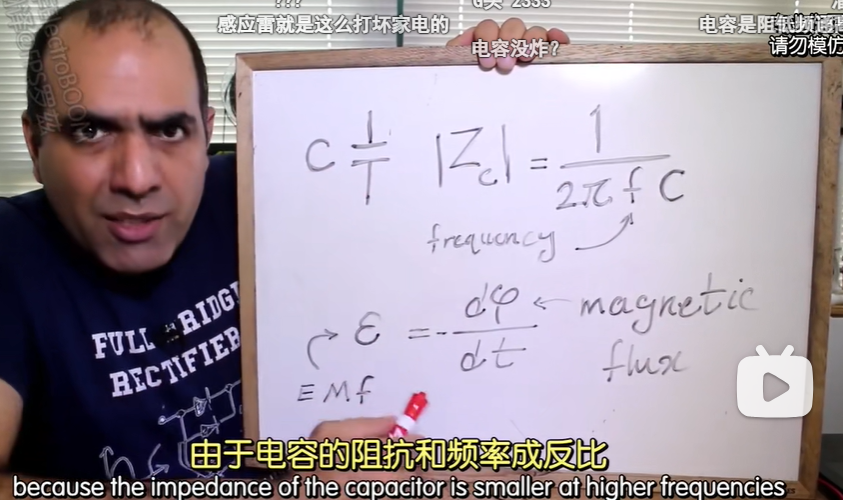

#### 电磁干扰的产生
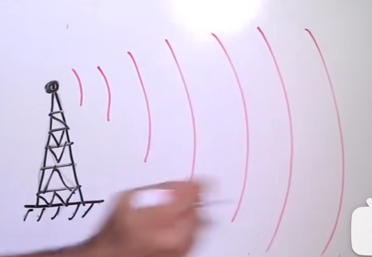
频率高到一定程度，电磁场就会像光一样，以电磁波的形式，干扰到远处的电子器件

[视频时间戳：](https://www.bilibili.com/video/BV1Pt411F7qB?t=347.7)
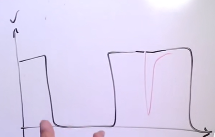
这种情况下，电磁干扰可以在电路上生成洛种奇怪的电流电压。
比方说我们在这需要一个正脉冲，但噪声在这生成了个负脉冲。这么一来就会发生接收错误。

[视频时间戳：](https://www.bilibili.com/video/BV1Pt411F7qB?t=362.8)
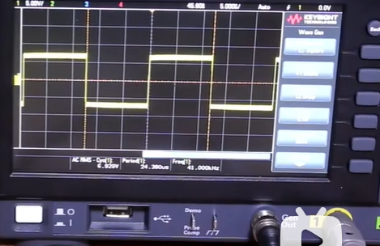
我现在在测量函数发生器上的方波，然后现在我来启动这个噪声装置
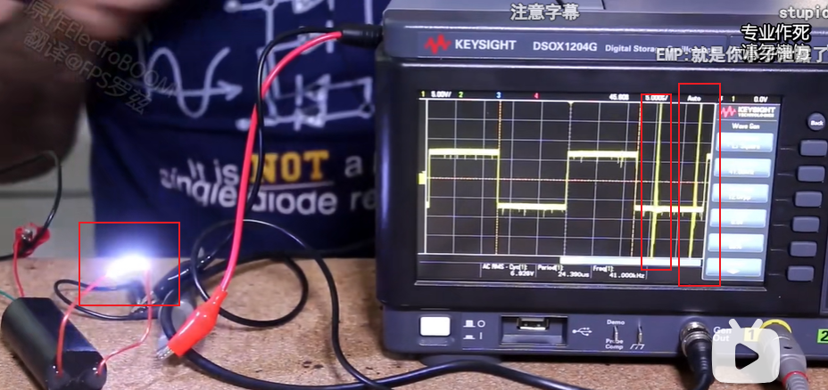

[视频时间戳：](https://www.bilibili.com/video/BV1Pt411F7qB?t=377.1)
不过干扰电磁波的波长，必须和系统中的电线长度匹配。如果电路比它的波长小很多，那电路只会占到干扰信号相对平缓的部分。这样反而没有干扰了。
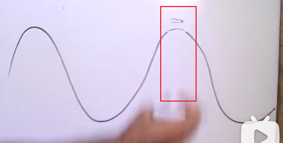

如果电路很长或者干扰信号频率很高的话，那你在这边就会发生正的干扰那边就会发生负的干扰。这样整个系统里就会产生很强的噪声了。
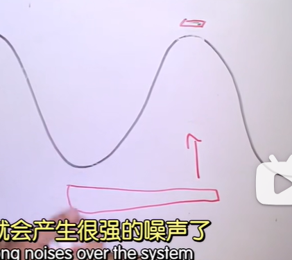
所以说电路越小干扰就越困难，频率越高就越容易干扰电路。

线圈匝数越多，感应电压越大。
就跟你在一个上上下下的路面上开车一样，如果坡离很远的话你是没有感觉的。但如果坡子靠得特别近，这样车头下去车屁股起来。然后就会这么一直抖抖抖直到车给磨得差不多了。

#### 电容累积电量实验
[视频时间戳：](https://www.bilibili.com/video/BV1Pt411F7qB?t=509.6)
电容累积电量实验。
7号电池1A给超级电容持续充电，一次性可放出上百安电流。这样就造出了一个特别大的电磁脉冲出来。
不要一只手接地一只手摸电容，电荷通过身体会被电打。
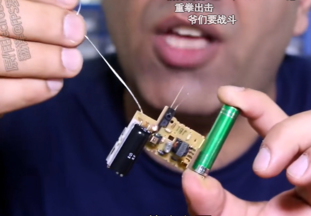
正确示范：
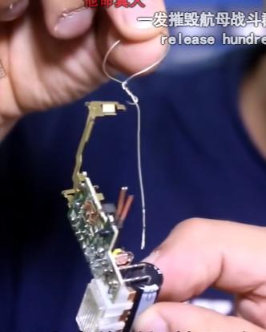

#### 全频带阻塞干扰
[视频时间戳：](https://www.bilibili.com/video/BV1Pt411F7qB?t=536.1)
由于各个电路的敏感频率不一样，所以你拿个或者10个频率。也不足以干扰到所有的电路。但是理想脉冲的尖信号就可理论上涵盖所有的频率。
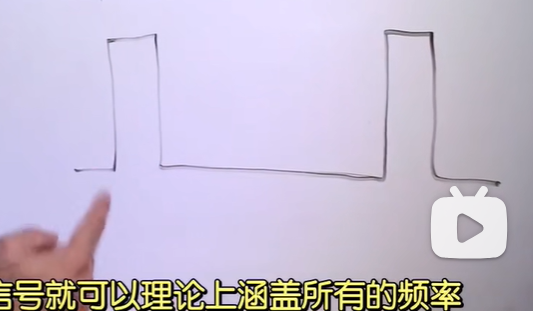

这个正弦波转换成频域后只有一个特定频率的尖刺存在
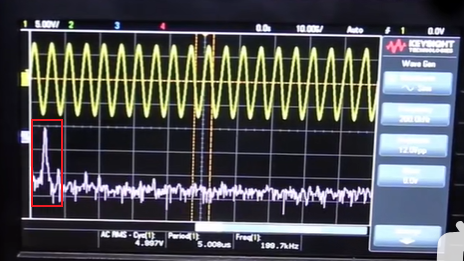
傅里叶变换上场

但现在我把信号换成方波的话，方波就可以生成无数个频率尖刺了。
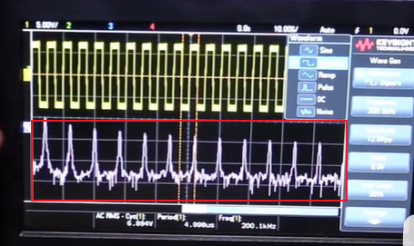
所以波形越尖效果越好，

#### 电磁干扰器实验
[电磁干扰器实验](https://www.bilibili.com/video/BV1Pt411F7qB?t=590.0)
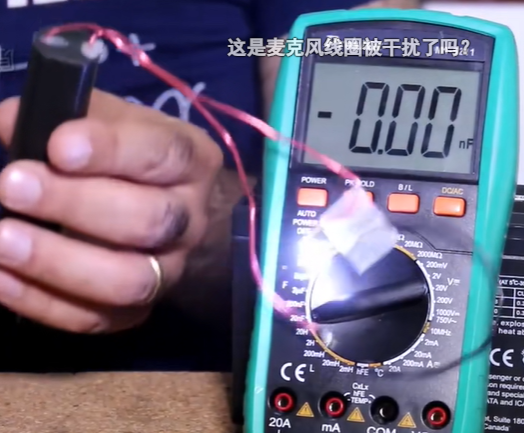

[视频时间戳：](https://www.bilibili.com/video/BV1Pt411F7qB?t=640.1)

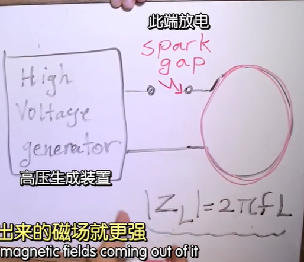
EMP装置设计原理大体就是这样，我看有的人还是在这多绕几匝，这样出来的磁场就更强。但这同时也增加了电感ZL，这么一来环里的阻抗也大了。线路中的高速电流交换就会受到影响导致干扰变弱。

有的里面就会在这加上一个电容
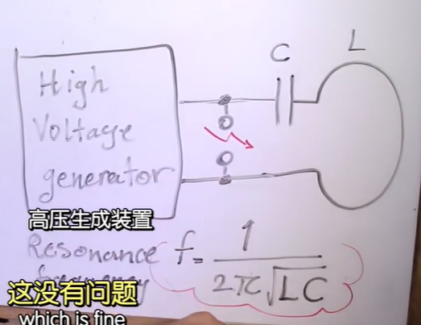
线圈L这里生成高电压，还可以准确地操控频率。其实这就是一种在谐振频率上驱动特斯拉线圈的方法。其实你即使没有昂贵的实验器材，只要你知道了电路的缺陷，你就可心以用这种方式制造出难确的干扰频率。来改进你的电路

#### 抗干扰的方法
[视频时间戳：](https://www.bilibili.com/video/BV1Pt411F7qB?t=686.7)
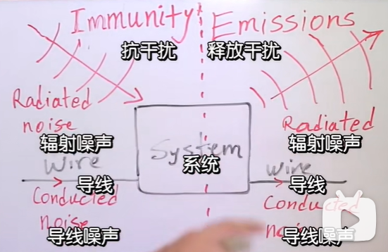
任何电路都会以辐射或者导体转播的方式，释放出电磁噪声，同时也会受到辐射或者来自导体的干扰噪声

##### 双绞线
[视频时间戳：](https://www.bilibili.com/video/BV1Pt411F7qB?t=700.2)
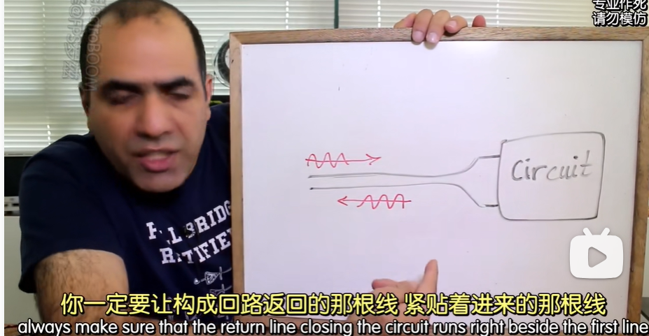
如果电路的接线里来了一个高频的噪声信号，你一定要让构成回路返回的那根线紧贴着进来的那根线，要么以导线或者以铜板的形式。
这样进去那根线生成的磁场就会被返回线的磁场抵消。这样就可以减少辐射免于干扰其他的电路，比如双绞线。

##### 不要让信号线绕圈 走直线
[视频时间戳：](https://www.bilibili.com/video/BV1Pt411F7qB?t=716.1)
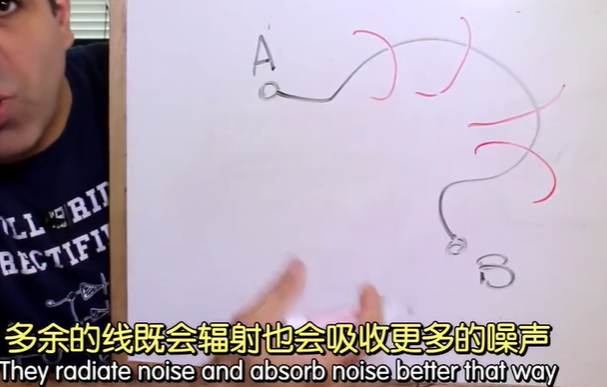
不要让信号线绕圈圈，多余的线既会辐射也会吸收更多的噪声。理想的接线是两点间直线最短。

##### 脉冲信号用缓和波
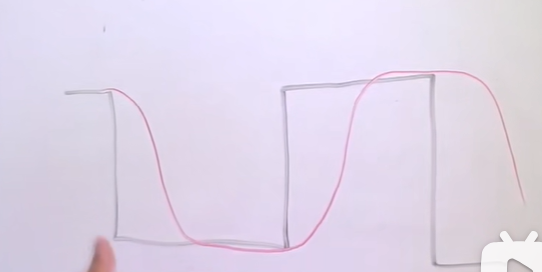
脉冲信号请用缓和的波，不然就容易释放高频的谐波。
可以的话高频信号的接线或者印刷线路尽量避免尖锐的拐弯。

##### 系统进出带滤波电容
[视频时间戳：](https://www.bilibili.com/video/BV1Pt411F7qB?t=739.8)
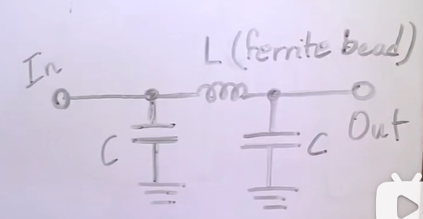
系统进出一定要带上合适的滤波电容，既可以抗干扰也可心以减少自身的释放。

##### 弱信号线路不在带噪声线路边
[视频时间戳：](https://www.bilibili.com/video/BV1Pt411F7qB?t=750.1)
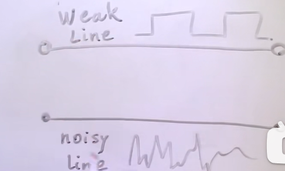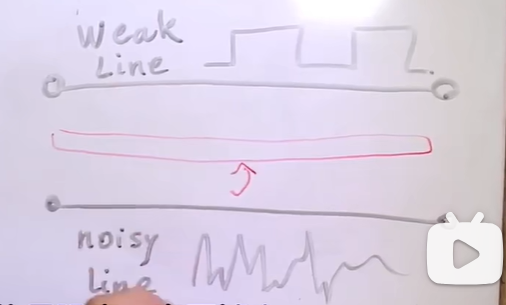
说到提升抗干扰，不要把弱信号的线路放在带噪声的线路旁边。中间用一个接地的板子隔开来。这样就可以吸收掉噪声。

重要信号强度要够大
[视频时间戳：](https://www.bilibili.com/video/BV1Pt411F7qB?t=756.9)
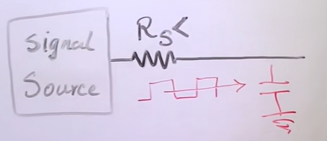
重要的信号强度一定要够大，让信号源的输出头的阻抗尽量的小。同时也要避奂用尖锐的方波。弱信号线路上可以用滤波电容过滤掉高频噪声。整体上讲要上你的导线尽量的短。

还有屏障对所有东西都要用接地的屏障罩起来。

### [PCB抗干扰设计，每一个PCB工程师都应该掌握 - 知乎](https://zhuanlan.zhihu.com/p/111963717)
4、电磁干扰（EMI）

电磁干扰EMI有传导干扰和辐射干扰两种。传导干扰是指通过导电介质把一个电网络上的信号耦合（干扰）到另一个电网络。辐射干扰是指干扰源通过空间把其信号耦合（干扰）到另一个电网络。在高速PCB及系统设计中，高频信号线、集成电路的引脚、各类接插件等都可能成为具有天线特性的辐射干扰源，能发射电磁波并影响其他系统或本系统内其他子系统的正常工作。

1、电源线设计

根据印制线路板电流的大小，尽量加租电源线宽度，减少环路电阻。同时、使电源线、地线的走向和数据传递的方向一致，这样有助于增强抗噪声能力。

2、地线设计

地线设计的原则是：

(1)数字地与模拟地分开。若线路板上既有逻辑电路又有线性电路，应使它们尽量分开。低频电路的地应尽量采用单点并联接地，实际布线有困难时可部分串联后再并联接地。高频电路宜采用多点串联接地，地线应短而租，高频元件周围尽量用栅格状大面积地箔。

(2)接地线应尽量加粗。若接地线用很纫的线条，则接地电位随电流的变化而变化，使抗噪性能降低。因此应将接地线加粗，使它能通过三倍于印制板上的允许电流。如有可能，接地线应在2~3mm以上。

(3)接地线构成闭环路。只由数字电路组成的印制板，其接地电路布成团环路大多能提高抗噪声能力。

3、退藕电容配置

PCB设计的常规做法之一是在印制板的各个关键部位配置适当的退藕电容。

退藕电容的一般配置原则是：

(1)电源输入端跨接10 ~100uf的电解电容器。如有可能，接100uF以上的更好。

(2)原则上每个集成电路芯片都应布置一个0.01pF的瓷片电容，如遇印制板空隙不够，可每4~8个芯片布置一个1 ~ 10pF的但电容。

(3)对于抗噪能力弱、关断时电源变化大的器件，如 RAM、ROM存储器件，应在芯片的电源线和地线之间直接接入退藕电容。

(4)电容引线不能太长，尤其是高频旁路电容不能有引线。

### [电子工程师必须解决电路设计的（EMC）干扰问题 - 知乎](https://zhuanlan.zhihu.com/p/25851076)

## 电压过低

### [更换TL431三极管](https://zhidao.baidu.com/question/171595345.html)
在电源附近。用于控制电路中的电压。

介绍了一个常见的开关电源故障：输出电压偏低，很多时候，原因很简单，就是告诉大家，如何把复杂的问题简单化，然后解决问题就方便了

