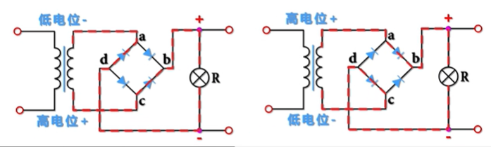

## 理论基础
### 电路

#### [高中物理：电路的串联与并联 - 知乎](https://zhuanlan.zhihu.com/p/113268272)
#### [【13个小时套路电路】电路汤家凤老师教你学电路doge（适合期末考试和考研学习）](https://www.bilibili.com/video/BV1xV411t7ne/)
recent:[KCL和KVL定理](https://www.bilibili.com/video/BV1xV411t7ne/?p=3)

#### [详细讲解整流桥原理](https://www.bilibili.com/video/BV1mZ4y1s7Cj/)

### 模电
#### [电路 石群老师主讲【80集全 带目录】 电路考研](https://www.bilibili.com/video/BV1F7411a7iV/)
#### [“用魔法打败模法”之4小时快速搞定模拟电子技术基础](https://www.bilibili.com/video/BV1Ps4y1x7jw/)
recent:[P6 场效应管及其特性](https://www.bilibili.com/video/BV1Ps4y1x7jw?p=6)

##### [P1 半导体基础](https://www.bilibili.com/video/BV1Ps4y1x7jw/)

##### [P2 PN结及其单向导电性](https://www.bilibili.com/video/BV1Ps4y1x7jw?p=2)

##### [P3 PN结的其他特性](https://www.bilibili.com/video/BV1Ps4y1x7jw?p=3)

##### [P4 二极管与稳压管](https://www.bilibili.com/video/BV1Ps4y1x7jw?p=4)

##### [P5 三极管及其特性](https://www.bilibili.com/video/BV1Ps4y1x7jw?p=5)

##### [P6 场效应管及其特性](https://www.bilibili.com/video/BV1Ps4y1x7jw?p=6)

#### [华中科技大学电子技术基础公开课（模电、数电）](https://www.bilibili.com/video/BV1UE4116763/?p=2)

### 数电
[数字电子技术基础期末复习速成(0基础逆袭90+）](https://www.bilibili.com/video/BV1qt4y1J7L6/)

### 信号与系统
[1.3连续信号和离散信号](https://www.bilibili.com/video/BV17r4y1e74i?p=4)
