## 电阻
[电阻器色码计算器 - 4 色环、5 色环、6 色环](https://www.digikey.cn/zh/resources/conversion-calculators/conversion-calculator-resistor-color-code)
[瓦特/伏特/安培/欧姆转换计算器](https://www.rapidtables.org/zh-CN/calc/electric/watt-volt-amp-calculator.html)

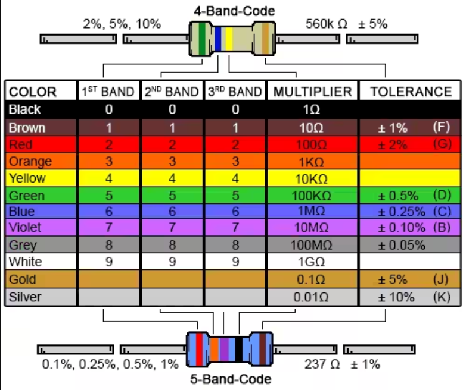

### [怎么看电阻器的色环](https://zhuanlan.zhihu.com/p/365349627)

色环电阻的第一条色环(通常靠近电阻端头的)表示阻值的第一位数字、第二条色环表示阻值的第二位数字、第三条色环表示阻值的第三未数字、第四条色环表示阻值乘数的10的倍数、第五条色环：误差。

指示的红色靠近电阻端头
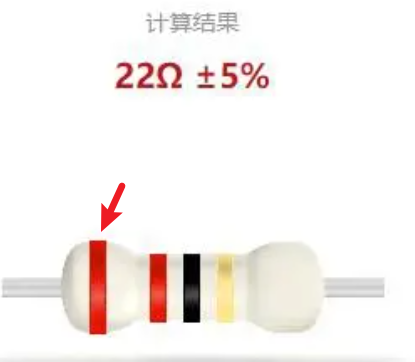

棕一红二橙是三，四黄五绿六为蓝，七紫八灰九对白，黑是零，金五银十表误差。相信大家已经知道了识别电阻色环的方式，以后在使用的过程就可在短时间内判断出电阻的色环，工作方面事半功倍了。
发布于 2021-04-16 13:55

第一：先找标志误差的色环，从而排定色环顺序。最常用的表示电阻误差的颜色是：金、银、棕，尤其是金环和银环，一般绝少用做电阻色环的第一环，所以在电阻上只要有金环和银环，就可以基本认定这是色环电阻的最末一环。

第二：棕色环是否是误差标志的判别。棕色环既常用做误差环，又常作为有效数字环，且常常在第一环和最末一环中同时出现，使人很难识别谁是第一环。在实践中，可以按照色环之间的间隔加以判别：前面几个环几乎靠得近且等间距，最后一环离前一环相对较远，据此可判定色环的排列顺序。

#### [误差环](https://zhidao.baidu.com/question/139441420.html)
最后一环代表误差的环有：棕（1%）、红（2%）、绿（0.5%）、蓝（0.25%）、紫（0.1%）、灰（0.05%）、金（5%）、银（10%）。
### [电阻的“外壳颜色”代表什么意思？](https://blog.csdn.net/qq_25814297/article/details/103007433)
黄色一般表示碳膜电阻，蓝色金属膜，灰色保险电阻，老碳膜电阻多为绿色。但现在很多厂家不遵守这个规律了，灰色也有金属膜，蓝色也有碳膜。
白色底电阻是氧化膜电阻。

### [碳膜、金属膜、金属氧化膜电阻区别](https://zhuanlan.zhihu.com/p/51434851)
碳膜电阻
真空喷涂技术在瓷棒上面喷涂一层碳膜，再将碳膜外层加工切割成螺旋纹状，最后在外层涂上环氧树脂密封保护。其阻值误差虽然较金属皮膜电阻高，但由于价钱便宜。电子，电器，设备，资讯产品之最基本零组件。

金属膜电阻
真空喷涂技术在瓷棒上面喷涂，只是将炭膜换成金属膜（如镍铬） ，并在金属膜车上螺旋纹做出不同阻值，并且于瓷棒两端度上贵金属。
但低杂音，稳定，受温度影响小，精确度高成了它的优势。因此被广泛应用于高级音响器材，电脑，仪表，国防及太空设备等方面。
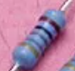

金属氧化膜电阻
高温燃烧技术于高热传导的瓷棒上面烧附一层金属氧化薄膜（如氧化锌） ，并在金属氧化薄膜车上螺旋纹做出不同阻值，然后于外层喷涂不燃性涂料。它能够在高温下仍保持其安定性，电阻皮膜负载之电力亦较高。
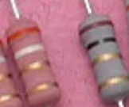

方形线绕电阻
又俗称为水泥电组，采用镍，铬，铁等电阻较大的合金电阻线绕在无碱性耐热瓷件上，外面加上耐热，耐湿，无腐蚀之材料保护而成，再把绕线电阻体放入瓷器框内，用特殊不燃性耐热水泥充填密封而成。
它们的优点是阻值精确，低杂音，有良好散热及可以承受甚大的功率消耗，大多使用于放大器功率级部份。缺点是阻值不大，成本较高，亦因存在电感不适宜在高频的电路中使用。

碳质电阻
碳质电阻（碳电阻器）是利用石墨，碳等较大电阻系数的物质加上胶合剂加压，加热成棒状，并在制造时植入导线。电阻值的大小是根据碳粉的比例及碳棒的粗细长短而定。其制造成本最为低廉，但稳定性较差及误差大。
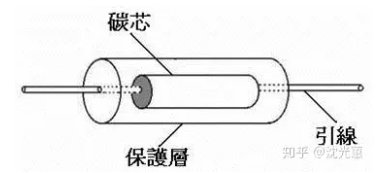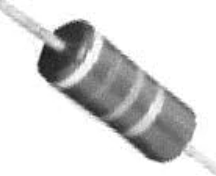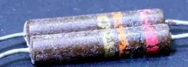

贴片电阻
贴片电阻（片式电阻）是金属玻璃铀电阻的一种形式，它的电阻体是高可靠的钌系列玻璃铀材料经过高温烧结而成，电极采用银钯合金浆料。特点是体积小，精度高，稳定性和高频性能好，适用于高精密电子产品的基板中。而贴片排阻则是将多个相同阻值的贴片电阻制作成一颗贴片电阻，目的是可有效地限制元件数量，减少制造成本和缩小电路板的面积。
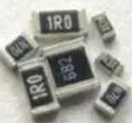

可变电阻器
常使用于需要时常移动其分接头来改变其电阻值之状况，例如收音机，扬声器和热水炉等。

### [阻抗ohms单位与Ω有什么不同](https://zhidao.baidu.com/question/75512146.html)
没有不同。国际单位制中，电阻率的单位是欧姆·米(Ω·m或ohmm)，常用单位是欧姆·毫米和欧姆·米。ohms等同电阻的单位Ω，是属于同一个电阻单位的不同称呼。因为在文本输入时，Ω很难输入，所以使用相近读音的OMH来代替，这种用法在一些电路模拟软件中较常见。

### [为什么电阻单位有的是W有的是Ω? - 知乎](https://www.zhihu.com/question/509715770)
的确有些外文资料或由外文翻译过来的资料电阻单位用 `ω`omega , 其实这里的`ω`omega不是英文字母w，而是拉丁字母，读作欧米伽，和Ω是同一个字母，Ω是大写字母，`ω`omega是小写字母。

当然有些资料把ω\omega写成了英文字母w，原谅他吧。
[发布于 2022-01-04 08:29](//www.zhihu.com/question/509715770/answer/2296801193)

### [1W电阻和1/2W电阻有什么区别?](https://www.yulucn.com/question/8002240821)
能通过的电流有关。
根据你具体使用选用额定功率。比如一个1欧姆的电阻，如果是1W，那么最大电流就是1A，如果1/2W，那最大电流就是0.7A，1/4W的最大电流就是0.5A。但是一般选用的时候，得留余量，比如已知电阻工作最大功率是1/4W,那么久不能选用1/4W的，而是要选择1/2W的。...
2023年09月11日 周一 20时30分29秒 1年前

他的w数的意思就是说，是和能通过的电流有关，  
功耗公式是：I2R=P(W)，  
当功率一定时，电阻大，可通过的电流就小，大电流会烧坏电阻。  
1w的电阻，100欧姆，那么只能通过0.1A（100mA）。  
就这样选了，你自己看看吧！
2023年09月11日 周一 20时30分31秒 1年前

过热烧毁
这里所说的瓦数,是指电阻的散热功率,也等于电阻正常工作时的最大发热功率.  
当实际发热功率超过散热功率时,电阻会因发热过度（散不了那么多的热量）而使温度逐渐升高,导致被烧毁.  
在电阻数值相同的情况下,散热功率较大的要比较小的好.当然,在实际工作功率小于散热功率的时候,散热功率大或小是没有区别的,因为都能正常工作（如工作功率是 1 / 8瓦,那么选择 1 / 4瓦或1/2瓦,在效果上是一样的）.
2023年09月13日 周三 19时24分56秒 1年前

### [日常消耗，囤货可备——比苛碳性电池 - 知乎](https://zhuanlan.zhihu.com/p/511699200)

电池以300mAH的速度耗电来测试电池的容量 ，经过1小时42分的时候到预设的0.9V 低压停止，从曲线看整个电压（红色）的下降是非常平滑的，测得5号电池的容量为514mAh,以碳性电池的特性来说，这个容量是合理的，用来带一些小电流设备，如空调遥控器是完全没有问题。

### [我想问一下毫安时和功率之间如何换算](https://zhidao.baidu.com/question/14805373.html)
毫安时和功率无法换算，毫安时是电量的单位。

电量`Q=I*t`。I就是电流，t就是时间。毫安就是电流的单位，时就是小时，1安=1000毫安。Q是库仑。
电量定义为电池的放电电流（安或毫安）与放电时间（小时）的乘积，如10安时表示可以1安电流持续供电10小时，或以10安电流持续供电1小时，等等。
功率，是表示做功快慢的物理量，单位是瓦。1瓦=1W/t=UI=1伏特.安培。

扩展资料
mAh不是标准单位,但是这个单位可以很方便的用于计量和计算。
比如一颗900mAh的电池可以提供300mA恒流的持续3小时的供电能力。
使用Ah或mAh做电量的单位是使用比较方便，比如，容量10Ah，就表示当放电电流为1A，能够放电10小时。
### 贴片电阻

#### [贴片电阻封装尺寸大全 - 知乎](https://zhuanlan.zhihu.com/p/378872063)
目前最常用的贴片电阻是01005、0201、0420、0603、0805、1206、1210、1812、2010和2512等10种贴片封装形式，而贴片电阻的尺寸则以两种不同的代码表示。
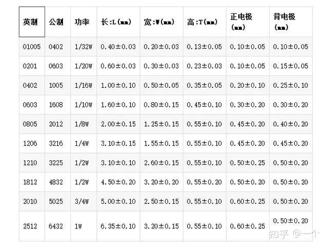

我的led灯珠是0603的规格。

#### [Site Unreachable](https://www.cnblogs.com/coolyouguo/p/10705714.html)

#### [贴片电阻上的数字含义，作为电子工程师的你都清楚吗？](https://www.bilibili.com/video/BV1Da411M7bV/)
#### [【新手焊接】教程系列6 贴片阻容的焊接演示](https://www.bilibili.com/video/BV1kf4y1J7yZ/)

#### [手工焊接贴片电阻](https://www.bilibili.com/video/BV1924y1N7gB/)

### led灯珠
我的led灯珠是0603的规格。

#### [手把手教你更换LED灯珠](https://www.bilibili.com/video/BV1NJ411M75N/)

#### [如何用万用表判断发光二极管/LED的好坏](https://blog.csdn.net/ldcung/article/details/77281539)
在日常工作和生活中，尤其是作为硬件工程师，经常遇到拿到一个LED不知道是好是坏的情况，其实是非常容易判断的，一个万用表就够啦。下面就简要介绍一下。
1、首先把万用表拨到二极管档。不同的万用表位置可能有所不同。
2、分别用黑色表笔接LED的负极，用红表笔接LED的正极，此时你会发现LED被点亮了。
这是因为驱动led发光需要的电流很小，万用表的二极管档已经足以胜任。

#### [如何用万用表测量 LED 灯质量好坏？](https://www.zhihu.com/question/497515086/answer/2563176499)

1、肉眼观察法。什么是肉眼法啊？就是通过眼睛观察。他说，如果一个灯具不亮了，你想知道里面的LED灯珠有没有损坏啊。很简单，你把灯罩拿开，看看里面有没有明显的灯珠烧黑情况。如果有，你看看是一颗烧黑了，还是有几个烧黑了。如果是一个烧黑了，那么先换掉这一颗再看看灯具是否恢复正常发光。如果是，那OK，就是这颗灯珠坏了。如果不是，那继续检查其它的led灯珠是否有烧黑现象。或者，使用第2种测试LED灯珠好坏的方法。

2、万用表测量法。什么是万用表测量法？就是通过工具万用表测试来判断LED灯珠好坏。怎么判断啊？找一块数字万用表，测量前把万用表挡位拨到二极管档（嘟嘟响的那个挡位），然后将万用表表笔逐一接触每个灯珠左右两侧的金属，若接触时的万用表没有发出蜂鸣声，就说明这个灯珠是坏的。这个方法还是比较直接有效的，当然，如果你对万用表比较了解，还可以通过点LED灯珠，测量点亮时的电流电压来判断，也是可以的。

3、LED测试笔测试法。有些人，经常进行LED灯具维修或选择，所以，手头备一套LED测试笔，是个不错的方法。当家里的面板灯，吸顶灯，射灯，天花灯等家用LED灯不亮了，就可以快速地把LED灯具打开，通过通电LED测试笔，很容易就判断出led灯珠是否坏了。这种测试法优点是比较简单的，缺点是需要买一套测试笔。不过这种测试笔很常见，某宝就有，几十块一套也不贵。以上3种，都是比较简易方法判断led灯珠好坏的方法。

#### [雷蛇 地狱狂蛇 鼠标 LOGO灯 灯珠LED改成贴片LED](https://www.bilibili.com/video/BV1Dx411D7Fj/)

#### [用热风枪焊接贴片元器件](https://www.bilibili.com/video/BV11A411N741/)

#### [灯珠教授 : led灯珠正负极怎么区分? - 知乎](https://zhuanlan.zhihu.com/p/472025147)
我说，一般LED灯珠引脚长的一端为正极，短的一端为负极。

**也可以仔细观察LED灯珠内部的电极，一般较小的一端是正极，大的一端的是负极。**

LED灯珠是半导体二极管, 通电后把电能转化为光能。LED发光二极管和普通二极管相同的是由一个PN结组成，具有单向导电性。

**1、你可以通过贴片发光二极管板子背部的印刷标识符：一般我们看贴片灯珠，”T”字形或倒三角形符号一边，”T”一横的这端常为正极，另一端为负极；三角形符号的“边”靠近的一端方向为正极，“角”靠近的一端通常为负极。**

2、你可以通过观察贴片发光二极管灯板印刷线条来快速判断：俯视观察，有彩色线条的一侧为负极，另外一侧常为正极。

3：你可以通过观察贴片发光二极管焊盘的大小来判断，焊盘较大的一端为负极，焊盘较小的一端通常为正极。

4、你可以通过观察贴片发光二极管正面板，通常在发光二极管正方形或长方形中板上有一边有一个缺角，缺角的那端一般常为正极、另外一端常为负极。

**5、你可以通过选择仪器万能表来协助判断，首先，利用万用表的欧姆表量，将表盘式万用表，调到“欧姆x1”档，然后，在贴片发光二极管点亮发光的时候，红表笔连接的一边为正极，黑表笔连接的为二极管的负极方向。**

6、你可以通过观察贴片发光二极管的底部印刷标记：LED开启电压所限1.5-1.8V左右。所以，也有可能数字万用表提供的电压有时无法启动它。因此，这时候可以通过观察底板上印刷标记：贴片发光二极管（SMD LED）,有绿色点的一端为负极，另外的一端为正极。
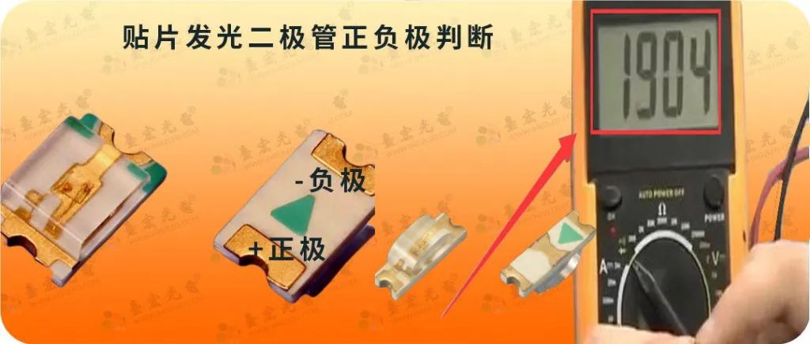
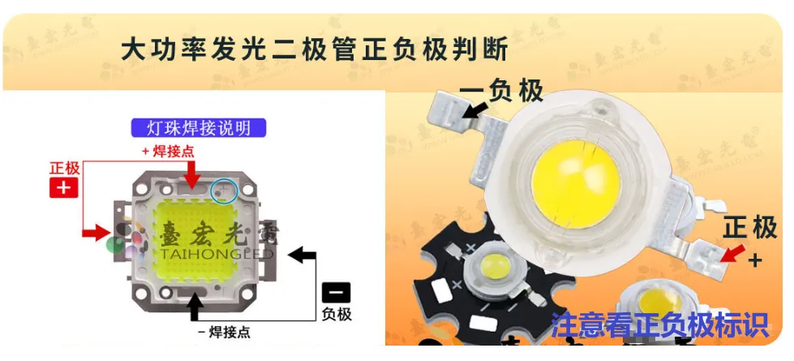
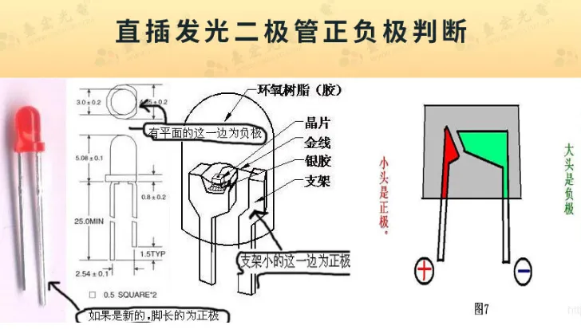
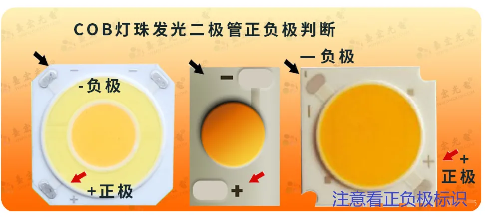

### [常见接插件的介绍与参数\_ph2.0和xh2.54有什么区别](https://blog.csdn.net/qlexcel/article/details/105694285)

脚间距1.25mm
1、MX1.25MM 白色端子

脚间距1.5mm
1、ZH1.5
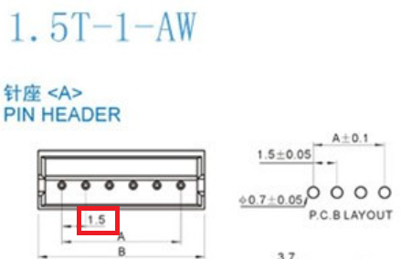

脚间距2mm
1、PH2.0
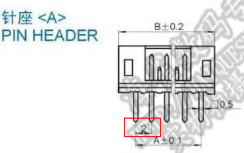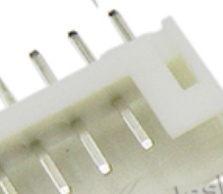

脚间距2.54mm
1、XH2.54
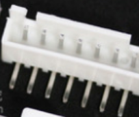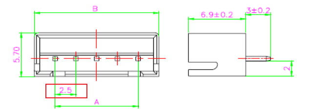

## 电容
### [什么样的电容分正负极，怎样判断它的极性?](https://www.zhihu.com/question/26626595/answer/1956193328)

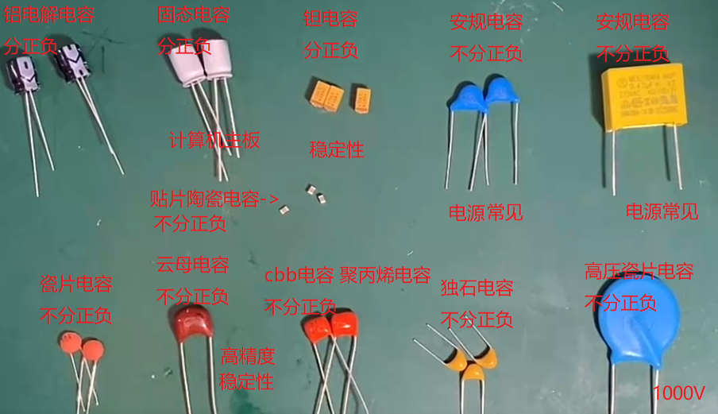
判断正负：
铝电解电容：
1、长脚正极，短脚负极。
2、负极标识：
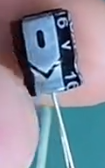

固态电容：
1、长脚正极，短脚负极。
2、负极标识：
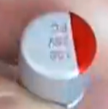

钽电容：
一杠代表正极
**-**
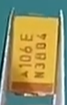
**+**

### [怎么测量电容并判断好坏，这两个方法分享给你](https://www.bilibili.com/video/BV1sN41117ht/)

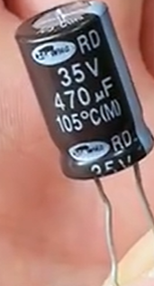

[怎么测量电容并判断好坏，这两个方法分享给你\_哔哩哔哩\_bilibili](https://www.bilibili.com/video/BV1sN41117ht?t=42.4)
M ±20%
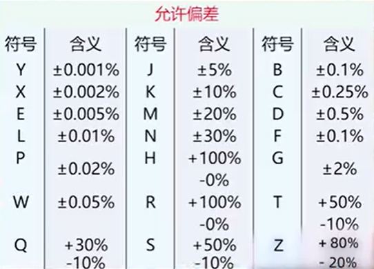

### [电容好坏如何快速检测？教你一分钟检测完整块电路板电容！](https://www.bilibili.com/video/BV17t4y18735/)
方法：电阻档测通断，通路则电容坏掉。

随波逐流78
这方法不行的，电容经常并联电感，电感在直流电路中是短路，如果直接测电容两端会因为电感的存在导致万用表长鸣
2023-01-08 12:54👍10

### [数字万用表测量电容的两个方法，学会不求人](https://www.bilibili.com/video/BV1SN4y1c7ox/)
一、测通断

二、取下电容测F

#### [瓷片电容容量 102 103 104 222 223 472 473 474 是多少\_472电容是多少nf-CSDN博客](https://blog.csdn.net/qq_34180988/article/details/53223664)
104 意味着10后面**加上4个“零”皮法** 就是100000pF 也就是0.1uF
103---10000PF---10nF---0.01UF  
104---100000PF---100nF---0.1UF
[电容识别方法 - 知乎](https://zhuanlan.zhihu.com/p/405619099)
1、电容在电路中一般用“C”加数字表示（如C25表示编号为25的电容）。
字母表示法：1m=1000 uF 1P2=1.2PF 1n=1000PF
数字表示法：一般用三位数字表示容量大小，前两位表示有效数字，第三位数字是倍率。
如：102表示10×102PF=1000PF 224表示22×104PF=0.22 uF
### [电容是好是坏？短路还是开路？手把手教你8种电容检测方法，秒懂 - 知乎](https://zhuanlan.zhihu.com/p/621286212)
一、电路通断测试

五、通过测量时间常数的值来测试电容
如果电容的电容值以印在其上的微法拉（符号为 µF）为单位已知，即**电容根本没有熔断和燃烧**，我们可以**通过测量时间常数（TC 或τ = Tau）来找到电容的值**。
简而言之，当电容通过已知值的电阻充电时，电容充电到施加电压的约 63.2% 所花费的时间称为电容时间常数（τ = Tau 也称为 RC 时间常数），可以通过以下方式计算：
**τ = R x C**
- R = 以欧姆为单位的已知电阻值
- C = 电容值
- τ = Tau（时间常数）

### [电容容值变小的原因分析-电子发烧友网](https://www.elecfans.com/d/1074358.html)

电容的公差一般有两种，5%公差，10%公差和20%公差的，就算是20%公差的电容，1.5uF的电容容量应该是1.2uF~1.8uF才是合格的。

电容如果用在抗干扰或者滤波的场合，容值变小了，效果可能会变差，但还是可以使用的；但如果用在高频、降压、延时等对电容容值有要求的场合，就可能出现故障了。所以容值变小的电容不建议使用。

## [常见USB引脚定义一览 - 知乎](https://zhuanlan.zhihu.com/p/364748197)
