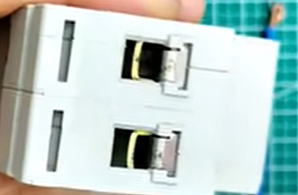

### 电线

#### [超实用！最全电线线径及载流量计算方法，收好不谢！ - 知乎](https://zhuanlan.zhihu.com/p/52505811)

#### [1.5平方的电线直径是多少\_百度知道](https://zhidao.baidu.com/question/517013369.html)
1.5平方的电线直径是：1.38mm。

计算方式：1.5平方毫米电线直径=√（1.5÷3.14）×2≈ 1.38mm
计算公式：截面除以圆周率(3.14)再开方，再乘以2，就是直径。
#### [电线规格国标1.5平方单股线直径是多少？](https://zhidao.baidu.com/question/522057913.html)
亲用油标卡尺，测电线导体外径为0.62~0.68mm均为1.5平方电线。
来自：求助得到的回答

根据面积计算直径：
1.5平方单股线直径是1.38毫米

### 空开漏保

#### [电工入门扫盲：1²，2.5²，4²，6²，10²电线能过多大电流？涨知识](https://www.bilibili.com/video/BV1Cy4y137x6/)

#### [多大电流要用多大电线，不要再去死记硬背了，学会这八句口诀就行](https://www.bilibili.com/video/BV1MK411U76K/)

#### [电线1.5平方、2.5平方、4平方规格的电线，有什么区别？](https://zhuanlan.zhihu.com/p/401302957)
在导线的规格里，都是说多少平方的，意思是截面积是多少平方毫米，没有说导线直径的说法。

一、直径不同：
1.5平方标准电线紫铜芯的直径为1.38mm。
2.5平方标准电线紫铜芯的直径为1.78mm。
4平方标准电线紫铜芯的直径为2.25mm。

|电器的额定电流A(安)：|导线标称横截面积：MM2 |
|:--|:--|
|≤6|0.75 |
|>6 <10|1|
|>10 <16|1.5 |
|>16 <25|2.5 |
|>25 <32|4|
|>32 <40|6|
|>40 <63|10|

功率P=电压U ×电流I
计算出的功率就是电线所能承受的最大电功率。

例如：在220伏的电源上引出1.5平方毫米导线，最大能接多大功率的电器？
解：查下面手册可知1.5平方毫米导线的载流量为22A
根据：功率P=电压U ×电流I ＝220伏×22安＝4840瓦
答：最大能接上4840瓦的电器

#### [1P、2P、3P空开漏保，新手电工只需吃透这几点，轻松制作配电箱](https://www.bilibili.com/video/BV1Xy4y1V7nS/)

#### [空气开关这样接线，电工活接受手软。](https://www.bilibili.com/video/BV11X4y1R7NS/)
线鼻
接线端子

#### [开关用久了，额定电流减少，会因为过载跳闸。](https://www.bilibili.com/video/BV1Fb411d7LE/)

### [拆解24V转220V车载逆变器 拆开看看内部结构](https://www.bilibili.com/video/BV1Cq4y137yY/)

山里独行侠
为什么这类逆变器看起来都那么low，但是华为固德威阳光锦浪的看起来就相当高端？后者都是用dsp控制，而这类淘宝货都是什么3525 8010 最多用个小单片机用于控制后级逆变。看功能也是差不多，究竟是什么原因导致两类产品截然不同的形态？
2022-08-08 23:02

hnleeye
3525和8010又便宜又稳定，当然首选。如果自己有什么特殊的要求，肯定自己控制，DSP或者MCU都可以，但是坏了要么找厂家，要么扔
2023-07-04 09:00

hnleeye
3525和8010的坏了，直接换上芯片就好了，维修这方面很容易。毕竟这东西是我见过的维修率最高的产品，没有之一。
2023-07-04 09:02

懂你65
这个逆变器功率是峰值功率1200W，持续功率600W以上，我用过，很好用，质量不错的，博主带不动是使用的电源供电功率小，更换大一点的电源跟电池才行。
2022-01-26 21:53

iwhe
看这个变压器就知道没1200w
2021-11-12 23:04👍8
还在嘴硬的蛞蛞鹬
1200w，一般500-600w，对半砍就对了
2021-11-17 20:49
### 3D建模

#### [「速成」全网最简单的SW入门教程没有之一（上）|5分钟掌握SolidWorks零件建模！！！](https://www.bilibili.com/video/BV1E3411F7aQ/)
SolidWorks零件建模 05:38
SolidWorks装配体搭建与工程图导出 05:34
AutoCAD工程图绘制出图 06:14
「速成」全网最简单的Rhino入门教程没。。 09:17
Adams机械仿真分析 07:50

#### [脑洞在线3D打印](http://www.naodong3d.com/prints.html)

热塑材料ABS
0.50元/克

文件大小：<100M
支持格式：STP（首选）、STEP、IGS、IGES、STL、OBJ

#### [开拔网\机械三维模型|CAD图纸\非标自动化](https://www.sanweimoxing.com/)

### 3D逆向工程
#### [【QUICKSURFACE 逆向建模神器】将STL一键转STP](https://www.bilibili.com/video/BV1Q84y1m731/)

逆向建模神器-将STL一键转STP | 使用iReal M3红外双激光三维扫描仪获取印第安人摆件的完整3D网格数据，导入QUICKSURFACE中，通过一键智能铺面功能，无需人为介入，快速将STL转为可编辑的CAD模型。 注: 本功能最适合不规则有机外型，如复杂工业曲面、艺术造型、动物模型等 下载使用QUICKSURFACE软件：https://www.ireal3dscan.cn/quicksurface/

iReal3D
行业内统称STP格式的3D文件为CAD文件
2023-10-13 13:42

流水账仙人
这个一点都不精确，后期拓扑和面的拆分要比重新做一个还麻烦，这东西用在工业精度不够，用在动画没法绑定，最多是能3D打印一个小摆件，纯纯鸡肋。
2023-10-14 15:57👍2

无敌小子爱音乐
卧槽这软件还要收费，不如云玩杰魔了免费也有这功能
2023-10-15 12:15

#### [Geomagic Wrap 2021（ 3D扫描分析软件 ）中文版 - 知乎](https://zhuanlan.zhihu.com/p/364552330)
Geomagic Wrap 2021是一款专业强大的3D扫描分析软件，通过它不仅可以完美的帮助用户在电脑中将3D扫描数据转换为完美的逆向工程3D模型的软件，还能将其数据或导入的STL、OBJ、SAT、PRC、VDA等文件格式内容转换为模型以供使用，十分方便。同时最重要的是该软件能够以易用、低成本、快速而精确的方式，帮助用户从点云过渡到可立即用于使用的3D多边形和曲面模型，从而被广泛的应用于工程建筑、艺术考古、工业制造等多个领域上。

[新手入门 Geomagic Design X 只需2天？杰魔工匠杯DX逆向建模水平大赛最高分获得者自述建模心得，成氏建模秘籍大公开！\_哔哩哔哩\_bilibili](https://www.bilibili.com/video/BV1gk4y1P7zB/)

#### 对于不同场景的3D扫描

[数羊数到睡不着](https://www.zhihu.com/people/1c51e795ccff6b64ea6b5787ec126e7a) 作者
你想用三维扫描仪做哪些方面的应用，如果你要扫描测量1米以下的工件，对精度要求比较高，推荐你用手持式激光三维扫描仪；如果你要扫描雕塑文物人体等等，做VRAR数据来源的采集工作，对精度要求比较低，推荐你用手持式led结构光全彩扫描仪；如果你要扫描几十上百平米的空间或者地形，推荐你用大空间三维扫描仪；如果你要扫描整车尺寸的模型，又对精度要求比较高，推荐你用光学追踪器+激光扫描仪结合的扫描设备。
2020-05-05

[小小你哥](https://www.zhihu.com/people/17c417351959b89be4cf106e1022d6ef)
我最近对比了国内和国外很多的三维扫描仪，通过精度和稳定性进行对比，结构光里面天津微深科技的扫描仪精度最高，稳定性最好，手持的话基本上都差不多，都能满足要求。
2021-10-12

#### 零件测量

##### [这些零件真不好测量，咋办？ - 知乎](https://zhuanlan.zhihu.com/p/86289730)

##### [加工车间里常用的测量器具都有哪些？不会用就太丢人了！ - 知乎](https://zhuanlan.zhihu.com/p/64634180)

