### 和弦

#### [神他妈乐理·和弦：和弦的构造、标识、功能与应用，以及一种不需要绝对音感的扒谱方法](https://www.bilibili.com/video/BV1ot4y1S7jh/)

音程用地铁站来比喻更形象，把终点站算进音程，需要加1。

2026年01月04日 周日 23时09分25秒 开始

2026年01月05日 周一 16时20分20秒 看完 加上中间休息，用时共17h19m

##### [1 和弦概念](https://www.bilibili.com/video/BV1ot4y1S7jh?t=125.8)

和弦，在维基百科上的定义是组合在一起的两个或要多不同音高的音.没有音程关系限制、没有数量限制，只要几个音问时发声的时候听起来好听，那这就是一个和弦了。

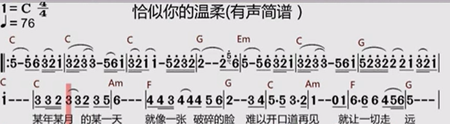

这里的C-C-C-G...是和弦，下面的数字5o是旋律。

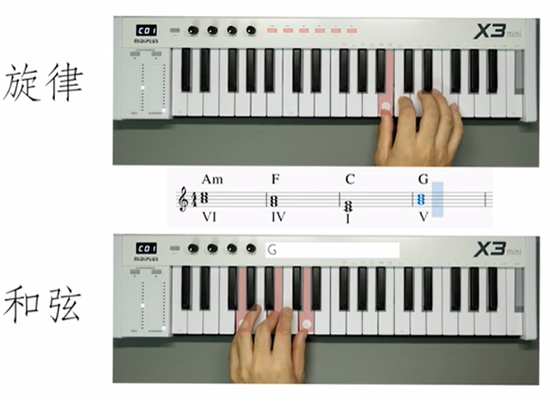

##### [2 和弦构成](https://www.bilibili.com/video/BV1ot4y1S7jh?t=210.2)

[三和弦定义](https://www.bilibili.com/video/BV1ot4y1S7jh?t=316.0)

以一个隔一个的方式排列的，共三个音组成的和弦。

##### [3 和弦类型](https://www.bilibili.com/video/BV1ot4y1S7jh?t=398.4)

###### 都是三和弦

[时间戳：](https://www.bilibili.com/video/BV1ot4y1S7jh?t=412.1)

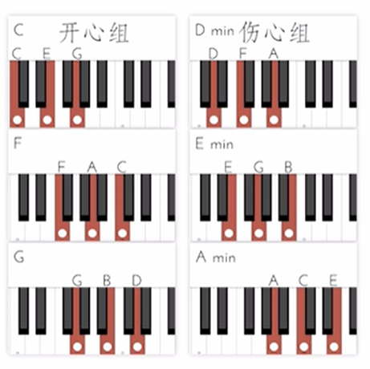

开心组是先大三度，然后小三度。伤心组则相反。伤心组带min。

大三度的半音数2（两键距离4个半音）、小三度的半音数1.5（两键距离3个半音），见上面的：表3 音程总结表（三）

大三度4+3，小三度3+4

###### 音程关系决定感情色彩

[时间戳：](https://www.bilibili.com/video/BV1ot4y1S7jh?t=531.3)

音程指两个音级在音高上的相互关系，就是指两个音在音高上的距离而言，其单位名称叫做度。

| 半音数 | 1      | 2      | 3      | 4      | 5      | 6             | 7      | 8      | 9      | 10     | 11     | 12     |
| ------ | ------ | ------ | ------ | ------ | ------ | ------------- | ------ | ------ | ------ | ------ | ------ | ------ |
| 音程   | 小二度 | 大二度 | 小三度 | 大三度 | 纯四度 | 增四度/减五度 | 纯五度 | 小六度 | 大六度 | 小七度 | 大七度 | 纯八度 |

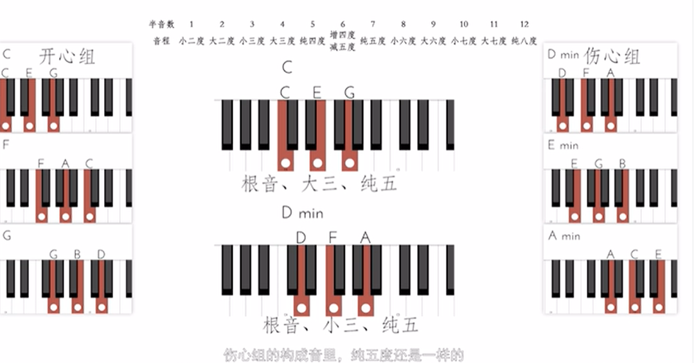

开心组大三和弦，伤心组小三和弦。

###### 减三和弦

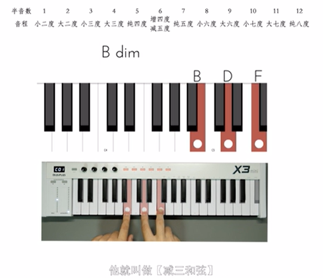

B到D，3个半音，小三度。D到F，3个半音，小三度。B到F，6个半音，减五度。

CDEFGAB，也就是1234567，组成C大调音阶/调式，

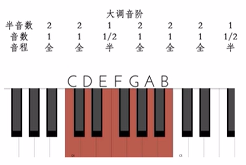

###### 增三和弦

在三和弦（由三个音构成的和弦）中，若**先叠一个大三度，再叠一个大三度**，也就是：

- 根音到三音：**大三度**（4个半音）
- 三音到五音：**大三度**（4个半音）

那么根音到五音总共是 **8个半音**，即一个**增五度**（augmented fifth）。

这种结构构成的和弦叫做：**增三和弦**（Augmented triad）。

举例说明：

以 C 为根音：

- C → E：大三度（4 半音）
- E → G#：大三度（4 半音）
- C → G#：增五度（8 半音）

和弦为：**C augmented**，常记作 **C⁺** 或 **Caug**

CEG#、EG#C、G#CG#，三种情况的增三和弦。

##### [4 和弦命名](https://www.bilibili.com/video/BV1ot4y1S7jh?t=644.0)

###### 根音/音名标识

| 大写字母 | 根音数字 | 罗马数字 |
| -------- | -------- | -------- |
| A        | 1        | I        |
| B        | 2        | II       |
| C        | 3        | III      |
| D        | 4        | IV       |
| E        | 5        | V        |
| F        | 6        | VI       |
| G        | 7        | VII      |

用罗马数字表示又叫级数。

###### 三和弦类型标识

| 中文     | 英文、字符 |            |       |       |
| -------- | ---------- | ---------- | ----- | ----- |
| 大三和弦 | 省略*      | M          | Maj   | Major |
| 小三和弦 | m*         | min        | minor |       |
| 减三和弦 | dim*       | diminished | φ     |       |

###### #Fm和弦

[时间戳：](https://www.bilibili.com/video/BV1ot4y1S7jh?t=721.6)

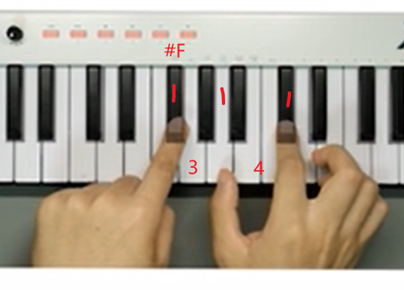

 #Fm说明这个和弦的根音是#F，小m意味着这个和弦是个小三和弦

风此它还有两个构成音分别是根音的小三度和纯五度。

##### [5 调式音阶](https://www.bilibili.com/video/BV1ot4y1S7jh?t=817.6)

###### 调式音阶是什么

[时间戳：](https://www.bilibili.com/video/BV1ot4y1S7jh?t=844.8)

调式音阶就是一群在乐理上亲近的、好听的音。

弹幕：科普：为什么不能随意选用呢？原来是因为这些音的频率是无理数，所以，他们的音波叠加后，图像就比较乱。

音程关系：

| 自然大调 | 全   | 全   | 半   | 全   | 全   | 全   | 半   |
| -------- | ---- | ---- | ---- | ---- | ---- | ---- | ---- |
|          | 2    | 2    | 1    | 2    | 2    | 2    | 1    |
| 自然小调 | 全   | 半   | 全   | 全   | 半   | 全   | 全   |
|          | 2    | 1    | 2    | 2    | 1    | 2    | 2    |

###### [C大调音阶：](https://www.bilibili.com/video/BV1ot4y1S7jh?t=932.8)

CDEFGAB

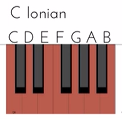

G大调音阶：GABCDEF#

因为黑白键没有本质区别，你看琴键最上面都是等距

[时间戳：](https://www.bilibili.com/video/BV1ot4y1S7jh?t=958.9)

| C大调音阶 | 1    | 2    | 3    | 4    | 5    | 6    | 7    |
| --------- | ---- | ---- | ---- | ---- | ---- | ---- | ---- |
|           | C    | D    | E    | F    | G    | A    | B    |
| G大调音阶 | 1    | 2    | 3    | 4    | 5    | 6    | 7    |
|           | G    | A    | B    | C    | D    | E    | #F   |
| 音程关系  | 全   | 全   | 半   | 全   | 全   | 全   | 半   |

###### [关系大小调](https://www.bilibili.com/video/BV1ot4y1S7jh?t=976.7)

指调号相同、音列关系相同、主音高度不同的两个调式(一个大调式、一个小调式)。

由于C大调音阶和A小调音阶的构成音完全相同都是白键，所以他们是关系大小调。

###### [调式音阶的作用](https://www.bilibili.com/video/BV1ot4y1S7jh?t=1006.6)

###### 是什么

弹幕：这些三和弦的组成音全都是C大调的调内音，所以这些和弦随便怎么走都和谐

它为我们塑造、挑选和弦以及编写旋律提供了一个小舞台。

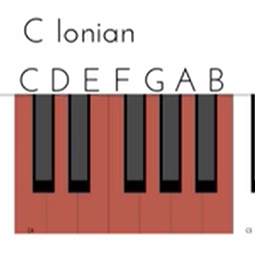

把一个调式音阶内所有的音作为根音，搭配其他的调内音各做一个三和弦，我们就得到了一组七个三和弦。这七个三和弦之间就是互相绝对兼容的。

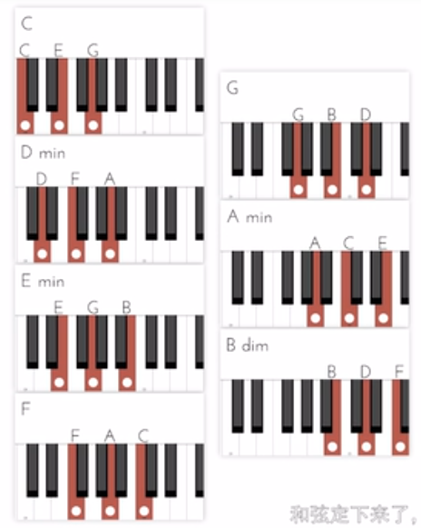

接下来是旋律，也用相同调式音阶的音写就可以了。

[时间戳：](https://www.bilibili.com/video/BV1ot4y1S7jh?t=1043.0)

原本一个八度内有12个半音，每个音都至少可以做大三和弦、小三和弦、减三和弦，可做36个和弦。但有了调式音阶的限制之后，数量降到7个，控制在一个安全的范围。

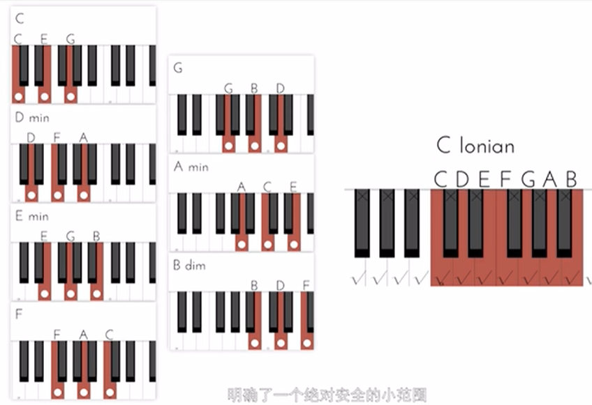

这就是为什么C大调音阶中，只会有C、Dm、Em、F、G、Am、Bdim这些和弦。而且一定是这几个和弦，因为只有这些和弦问时满足根音和构成音在C大调音阶里。

弹幕：自然大调的和弦级数正常就是大小小大大小减，和十二平均律不一样的

弹幕：同一调式内的三和弦内不可有其他调外音

###### 同调式音阶不需纠结根音

[时间戳：](https://www.bilibili.com/video/BV1ot4y1S7jh?t=1098.6)

调式音阶还提供了另一个方便，由于相同性质的调式音阶音程关系完全相同，听感完全相同。所以其实就不用纠结哪一个音具体是哪一个音了。（纠结根音是C4还是E4？就是平常说的声调，C4到E4这里升了4个半音。）

[时间戳：](https://www.bilibili.com/video/BV1ot4y1S7jh?t=1112.8)

举个例子，在C大调中的F和在F大调中的♭B等价。既然等价，一个调式音阶里又总是有七个音，那么干脆就全记成1234567就好了，这样就可以避开不停轮换的字母和忽隐忽现的升降号了，在作编曲的时候非常省力，在最后需要演奏的时候翻译回去就好。

上表格（音名表示）

| 音程关系  | 全   | 全   | 半   | 全                          | 全   | 全   | 半                          |
| --------- | ---- | ---- | ---- | --------------------------- | ---- | ---- | --------------------------- |
| C大调音阶 | C    | D    | E    | F                           | G    | A    | B                           |
| F大调音阶 | F    | G    | A    | B♭ | C    | D    | E                           |
| G大调音阶 | G    | A    | B    | C                           | D    | E    | F# |
| 级数      | I    | II   | III  | IV                          | V    | VI   | VII                         |

下表格（级数表示）

| 音程关系  | 全   | 全   | 半   | 全   | 全   | 全   | 半   |                                  |
| --------- | ---- | ---- | ---- | ---- | ---- | ---- | ---- | -------------------------------- |
| C大调音阶 | I    | II   | III  | IV   | V    | VI   | VII  | (I = C) |
| F大调音阶 | I    | II   | III  | IV   | V    | VI   | VII  | (I = F) |
| G大调音阶 | I    | II   | III  | IV   | V    | VI   | VII  | (I = G) |
| 级数      | I    | II   | III  | IV   | V    | VI   | VII  |                                  |

[时间戳：](https://www.bilibili.com/video/BV1ot4y1S7jh?t=1141.8)

而这1234567每个音作为根音构成的和弦，也就自然而然得名一级二级一直到七级和弦。

| C大调音阶 |      |      |      |      |      |      |      |
| --------- | ---- | ---- | ---- | ---- | ---- | ---- | ---- |
| 音名      | C    | D    | E    | F    | G    | A    | B    |
| 和弦      | C    | Dm   | Em   | F    | G    | Am   | Bdim |
| 级数      | I    | II   | III  | IV   | V    | VI   | VII  |

作业：

1、请找出A大调的五级和弦。

点击展开/折叠隐藏内容

<!--EndFragment-->
答案：E  
A 大调的五级和弦是 E 大和弦（E  major）。 
原因： 
大调音阶的第 5 级音（属音）是 E，从 E 开始按“大三度 + 小三度”叠置，得到的三和弦就是 E  G♯  B，即 E 大和弦。 
A 大调音阶（自然大调）： 
A – B – C♯ – D – E – F♯ – G♯ – (A)

2、请找出F小调的六级和弦。

点击展开/折叠隐藏内容

    答案：♭D 
F 小调的六级和弦是 D♭ 大和弦（D♭  major）。 
原因: 
1. F 小调音阶：F – G – A♭ – B♭ – C – D♭ – E♭ – (F)   
2. 第 6 级音是 D♭。   
3. 从 D♭ 开始按“大三度 + 小三度”叠置，得到的三和弦为 D♭  F  A♭，即 D♭ 大和弦。 
   

##### [6 复杂和弦](https://www.bilibili.com/video/BV1ot4y1S7jh?t=1226.1)

###### 七和弦

为了更加复杂，再加一根手指。

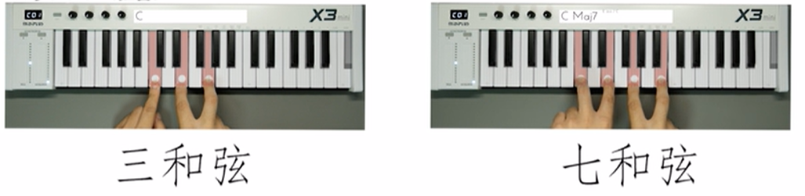

弹幕：四音叫七和弦

弹幕：因为c出现一次就好了

弹幕：这个其实是翻译历史问题！正常逻辑应该是这样的，3和弦，3个音，4和弦4个音，5和弦5个音。  或者5度和弦，1，3，5，7度和弦1，3，5，7，可惜两个命名方式重叠了

弹幕：说白了，只有7个白键位。

其实，七和弦的七并不是指构成音数量的七，而是音程关系的七。在七和弦中，根音与最高音呈七度关系。

###### C大调顺阶七和弦一览表

[时间戳：](https://www.bilibili.com/video/BV1ot4y1S7jh?t=1302.3)

小七度的两个音相差10个半音，大七度的两个音相差11个半音。

| 根音 | 三和弦类型                          | 七度音                           | 七和弦类型                                                   | 别名&简称                 |
| ---- | ----------------------------------- | -------------------------------- | ------------------------------------------------------------ | ------------------------- |
| C    | 大三和弦   | 大七度 | 大大七和弦 | 大七和弦                  |
| F    | 大三和弦   | 大七度 | 大大七和弦 | 大七和弦                  |
| D    | 小三和弦 | 小七度  | 小小七和弦 | 小七和弦                  |
| E    | 小三和弦 | 小七度  | 小小七和弦 | 小七和弦                  |
| A    | 小三和弦 | 小七度  | 小小七和弦 | 小七和弦                  |
| G    | 大三和弦   | 小七度 | 大小七和弦 | 属七和弦                  |
| B    | 减三和弦                            | 小七度  | 减小七和弦                          | 半减七和弦 七减五和弦 |

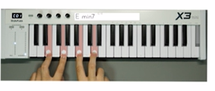

- 以C属七和弦（C7：C - E - G - B♭）为例：
  - 从根音C到七音B♭：
    - C → D (2半音) → E♭ (1) → E (1) → F (1) → G♭ (1) → G (1) → A♭ (1) → A (1) → B♭ (1) → 共10半音。
  - 或者标准叠置：大三度（4半音） + 小三度（3半音） + 小三度（3半音） = 10半音。
- 国际标准表示：属七和弦的整数记谱为{0, 4, 7, 10}，其中10即根音到七音的半音数。

这也是属七和弦具有强烈不稳定性和解决倾向（倾向于解决到主和弦）的原因之一，因为其中包含三全音（6半音）和小七度（10半音）等不协和音程。

七减五和弦是由于减三和弦造成的。

###### [七和弦表示符号](https://www.bilibili.com/video/BV1ot4y1S7jh?t=1391.3)

| 三和弦   | 标识方法             | 七和弦   | 标识方法           |
| -------- | -------------------- | -------- | ------------------ |
| 小三和弦 | m*, min, minor       | 小七和弦 | m7*, min7, minor7  |
| 减三和弦 | dim*, diminished, φ  | 减七和弦 | m7-5*, m7(♭5)      |
| 大三和弦 |                      | 属七和弦 | 7                  |
| 大三和弦 | 省略*, M, maj, major | 大七和弦 | maj7*, major7, CΔ7 |

记忆星号的方法：`*=in 或 有maj时*=or`

弹幕：

小三 3+4，小小七 3+4+3

减三 3+3，减小七 3+3+4

大三 4+3，大小七（属七） 4+3+3，大大七 4+3+4

距离根音的键位总数=10为小七度，总数=11为大七度

fl studio中的m7、Minor7都是小七和弦。减七和弦是m7b5。

除此之外，虽然七和弦确实比较高级，但也不是所有和弦都高级才行，风为三和弦和七和弦的听感差异还是很大的。

平时使用三和弦，在关键时候使用一两个七和弦增加节目效果还是非常好的。

###### 增加级数分析

[时间戳：](https://www.bilibili.com/video/BV1ot4y1S7jh?t=1432.2)

C大调顺阶七和弦一览表

| 级数 | 根音 | 三和弦类型                          | 七度音                           | 七和弦类型                                                   | 别名&简称                 |
| ---- | ---- | ----------------------------------- | -------------------------------- | ------------------------------------------------------------ | ------------------------- |
| I    | C    | 大三和弦   | 大七度 | 大大七和弦 | 大七和弦                  |
| IV   | F    | 大三和弦   | 大七度 | 大大七和弦 | 大七和弦                  |
| II   | D    | 小三和弦 | 小七度  | 小小七和弦 | 小七和弦                  |
| III  | E    | 小三和弦 | 小七度  | 小小七和弦 | 小七和弦                  |
| VI   | A    | 小三和弦 | 小七度  | 小小七和弦 | 小七和弦                  |
| V    | G    | 大三和弦   | 小七度 | 大小七和弦 | 属七和弦                  |
| VII  | B    | 减三和弦                            | 小七度  | 减小七和弦                          | 半减七和弦 七减五和弦 |

增加级数分析，可以发观。1、4级级数是大七和弦，2、3、6级和弦是小七和弦，7级是半减七和弦，5级是属七和弦。

注意，这是在C大调音阶里。而由于所有的大调音阶性质完全相同，所以在大调音阶里。1、4级总是大七和弦。

弹幕：大145小236减7，大七14 小七236 属5 减小7

弹幕这里的大是大三和弦，小是小三和弦，

| 大调音阶 | 大七 | 小七 | 小七 | 大七 | 属七 | 小七 | 半减七 |
| -------- | ---- | ---- | ---- | ---- | ---- | ---- | ------ |
| 级数     | I    | II   | III  | IV   | V    | VI   | VII    |

###### [小调音阶的七和弦](https://www.bilibili.com/video/BV1ot4y1S7jh?t=1468.9)

之前花大篇幅介绍的调式音阶带来的优点，这里体现。

在小调音阶中呢，情况稍稍有变。

小调音阶(可以使1=A方便理解)

| 七音 | 五音 | 三音 | 根音 | 和弦属性 | 1=A时 | 级数 |
| ---- | ---- | ---- | ---- | -------- | ----- | ---- |
| 7    | 5    | 3    | 1    | 小七     | Am7   | I    |
| 1    | 6    | 4    | 2    | 半减七   | Bm7-5 | II   |
| 2    | 7    | 5    | 3    | 大七     | Cmaj7 | III  |
| 3    | 1    | 6    | 4    | 小七     | Dm7   | IV   |
| 4    | 2    | 7    | 5    | 小七     | Em7   | V    |
| 5    | 3    | 1    | 6    | 大七     | Fmaj7 | VI   |
| 6    | 4    | 2    | 7    | 属七     | G7    | VII  |

表格转置后：

小调音阶(可以使1=A方便理解)

| 七音     | 7    | 1      | 2     | 3    | 4    | 5     | 6    |
| -------- | ---- | ------ | ----- | ---- | ---- | ----- | ---- |
| 五音     | 5    | 6      | 7     | 1    | 2    | 3     | 4    |
| 三音     | 3    | 4      | 5     | 6    | 7    | 1     | 2    |
| 根音     | 1    | 2      | 3     | 4    | 5    | 6     | 7    |
| 和弦属性 | 小七 | 半减七 | 大七  | 小七 | 小七 | 大七  | 属七 |
| 1=A时    | Am7  | Bm7-5  | Cmaj7 | Dm7  | Em7  | Fmaj7 | G7   |
| 级数     | I    | II     | III   | IV   | V    | VI    | VII  |

辅助理解上表格：

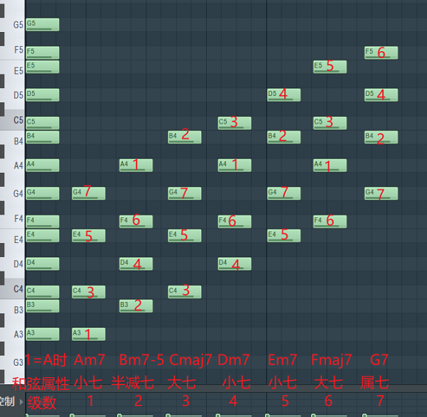

###### 大调小调顺阶七和弦对比

1、4级变成了小七和弦。3、6级则是大七和弦。2级变成了半减七和弦。7级变成了属七和弦。5级本应该是属七和弦。但也变成了小七和弦。

| 大调音阶 | 大七 | 小七   | 小七 | 大七 | 属七 | 小七 | 半减七 |
| -------- | ---- | ------ | ---- | ---- | ---- | ---- | ------ |
| 级数     | I    | II     | III  | IV   | V    | VI   | VII    |
| 小调音阶 | 小七 | 半减七 | 大七 | 小七 | 小七 | 大七 | 属七   |
| 级数     | I    | II     | III  | IV   | V    | VI   | VII    |

弹幕：小调就是整体往下面挪了两个位置，从级数来说就是小调的级数从同属大调减去二

这有点不理想，因为属七和弦实在是太重要了。

为了节目效果，很多时候小调的五级和弦会强行使用一个调外音，变成属七和弦。

[时间戳：](https://www.bilibili.com/video/BV1ot4y1S7jh?t=1491.9)

| 七音     | 7    | 1      | 2     | 3    | 4                             | 5     | 6    |
| -------- | ---- | ------ | ----- | ---- | ----------------------------- | ----- | ---- |
| 五音     | 5    | 6      | 7     | 1    | 2                             | 3     | 4    |
| 三音     | 3    | 4      | 5     | 6    | #7   | 1     | 2    |
| 根音     | 1    | 2      | 3     | 4    | 5                             | 6     | 7    |
| 和弦属性 | 小七 | 半减七 | 大七  | 小七 | 属七 | 大七  | 属七 |
| 1=A时    | Am7  | Bm7-5  | Cmaj7 | Dm7  | E7   | Fmaj7 | G7   |
| 级数     | I    | II     | III   | IV   | V                             | VI    | VII  |

改变之后，此小调音阶被称为和声小调。

注意fl studio里面的自然小调不是Minor Melodic，而是Minor Natural (Aeolian)，Minor Melodic是旋律小调。

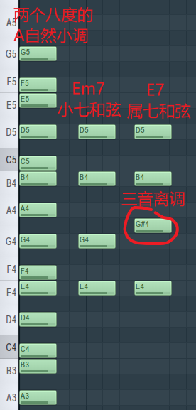

作业：

请写出F大调音阶中三级七和弦的标识、性质和构成音

    
点击展开/折叠隐藏内容

    答案：Am7,小七和弦,ACEG 
    分析：查看上面的C大调顺阶七和弦一览表，第三级音固定为小七和弦

##### [7 和弦功能](https://www.bilibili.com/video/BV1ot4y1S7jh?t=1560.9)

第一句：I级和弦有让音乐开启或终止的功能。
第二句：V级属七和弦有强烈的使音乐回到I级和弦的倾向。

[时间戳：](https://www.bilibili.com/video/BV1ot4y1S7jh?t=1604.2)

5级和弦按下时，氛围紧张：

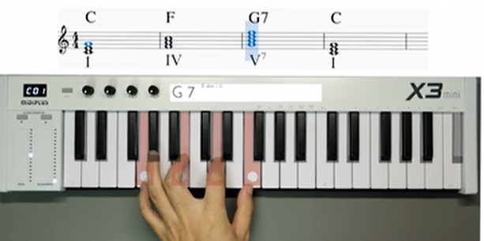

需要回到1级和弦。

《喀秋莎》
作曲勃兰切尔

小调也存在这样5级和弦的情况。

[时间戳：](https://www.bilibili.com/video/BV1ot4y1S7jh?t=1641.0)

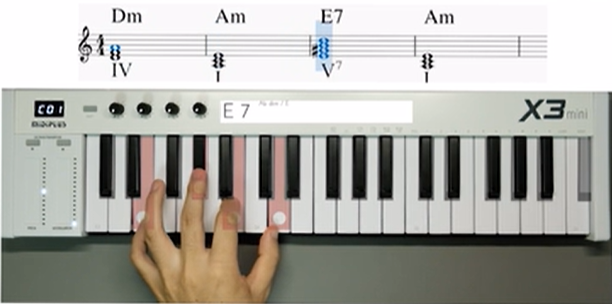

过渡不一定非得是五级和弦和一级和弦亲自来，五级-一级=四级

凡是满足前面的级数减后面的级数等于正四级的：

五度循环圈逆时针：

一级-四级=四级
二级-五级=四级
三级-六级=四级
四级-七级=四级
五级-一级=四级
六级-二级=四级
七级-三级=四级

弹幕：这里的加减法可以理解为七进制，实际八进制，模7加法

三级到六级(三级加上一个八度就等于坐七站地铁=十级嘛)

弹幕：传说中的四度圈

[时间戳：](https://www.bilibili.com/video/BV1ot4y1S7jh?t=1669.1)

每一个和弦都有自己的五级和弦

| 左列         | 中间左列 | 中间右列     | 右列   |
| ------------ | -------- | ------------ | ------ |
| 一级         | 五级     | 五级         | 一级   |
| 二级         | 六级     | 六级         | 二级   |
| 三级         | 七级     | 七级         | 三级   |
| 四级的五级是 | 一级，   | 一级想过渡到 | 四级。 |
| 五级         | 二级     | 二级         | 五级   |
| 六级         | 三级     | 三级         | 六级   |
| 七级         | 四级     | 四级         | 七级   |

左边两列，从左列到中间左列是五度循环圈顺时针，每两个调之间则有上升的纯五度。

右边两列，从中间右列到右列是五度循环圈逆时针，每两个调之间则有下降的纯五度。

4736251

###### [五度圈工具](https://www.musicca.com/zh/circle-of-fifths)

推荐访问原网页可交互：

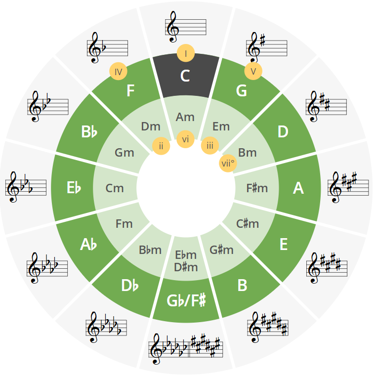

###### 一级和弦开始结束，五级和弦结束

一般乐曲以一级和弦开始，五级和弦结束。

###### 四级和弦开始

[时间戳：](https://www.bilibili.com/video/BV1ot4y1S7jh?t=1752.2)

四级和弦由于和一级和弦类型总是一致，在大调中都是大七和弦，在小调中都是小七和弦。所以也有开启一段音乐的功能。

第一句：I级和弦有让音乐开启或终止的功能。
Ⅳ级和弦有让音乐开启的功能。
第二句：V级属七和弦有强烈的使音乐回到I级和弦的倾向。

开头要么是1要么是4，结尾必是51。

这确实实是当今流行音乐中最为常见的开头与结尾，4536251。

##### [8 常用套路](https://www.bilibili.com/video/BV1ot4y1S7jh?t=1792.2)

###### [递归流顺路流](https://www.bilibili.com/video/BV1ot4y1S7jh?t=1801.4)

递归流 4536251
顺路流 15364125（卡农进行）

###### **递归流：**

逆向取五级和弦，从而得到起始点的和弦：

四级→七级→三级→六级→二级→五级→一级

经典完美和弦4736251

算法：

mod(n + 3, 7) + 1，

算五级：加4模7，

五度循环圈顺时针。

4736251最后再加上17，一级的属七和弦，就又能重复了。

我们在做递归的时候，没有大调小调。而从五到一的倾向性一直存在，所以它大调小调都能用。

[时间戳：](https://www.bilibili.com/video/BV1ot4y1S7jh?t=1927.9)

在大调当中，由于七级和弦是个减和弦，实在太辣了，作为第二个出场实在太早不好听，所以把它替换成五级和弦，但是没有在这里让它发挥属和弦的作用，所以三和弦就够了，不用加七度音。

| 大调音阶 | 大七 | 小七 | 小七 | 大七 | 属七 | 小七 | 半减七 |
| -------- | ---- | ---- | ---- | ---- | ---- | ---- | ------ |
| 级数     | I    | II   | III  | IV   | V    | VI   | VII    |

所以大调的最终结果是4536251+17

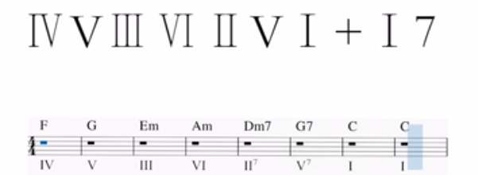

[时间戳：](https://www.bilibili.com/video/BV1ot4y1S7jh?t=1962.1)

李袁杰-离人愁 和弦：4536251

###### [顺路流：](https://www.bilibili.com/video/BV1ot4y1S7jh?t=1983.9)

如在C大调里C G Am Em F C Dm G

见上文36个和弦：C大调里只有这7个和弦C、Dm、Em、F、G、Am、Bdim不会离调。

[Johann Pachelbel-卡农](https://www.bilibili.com/video/BV1ot4y1S7jh?t=1987.0)

[林俊杰-小酒窝](https://www.bilibili.com/video/BV1ot4y1S7jh?t=2018.1)

小调：

[周杰伦-夜曲](https://www.bilibili.com/video/BV1ot4y1S7jh?t=2041.6)	和声小调

80%流行华语都是属于这两种和弦。

###### [扒谱](https://www.bilibili.com/video/BV1ot4y1S7jh?t=2083.3)

扒谱扒的不是旋律，而是和弦。

旋律一听就会，和弦需要听出排列、进行。

[和弦进行](https://www.bilibili.com/video/BV1ot4y1S7jh?t=2092.5)

扒谱步骤：
1、确定大小调
2、确定是哪个调：确定构成音、和弦组	困难
3、匹配和弦：根据旋律、已使用和弦、套路库
4、亿些细节

第二步困难，因为没有绝对音感，只能凭借经验。

第二步里：
1、写下最后一句旋律的级数
2、级数旋律在钢琴上用不同调式弹出
3、敲定调式，列出构成音和和弦

弹幕：经验多了就是绝对音感，只不过天生的在刚入手的时候会有优势而已

###### **扒谱1、确定大小调**

[时间戳：](https://www.bilibili.com/video/BV1ot4y1S7jh?t=2134.9)

林俊杰-修炼爱情

乐曲感情明亮，确定是大调。

弹幕：大调色彩明亮，虽然歌词是悲伤的……小调那种阴郁很明显

弹幕：听旋律，感觉是积极大调和消极小调

弹幕：我都是记旋律中一个音的音高然后键盘上试，挺快的

弹幕：主要听三级音，大小调特征音区别在三级六级

弹幕：大调是第一步通过曲子整体感觉确定的

**扒谱2、确定是哪个调：确定构成音、和弦组**

[时间戳：](https://www.bilibili.com/video/BV1ot4y1S7jh?t=2190.6)

由于大多数歌都中止在一级和弦，只听最后一句。

临时旋律：EFEDCBC

临时旋律：3432171,1=？需要确定大调音阶。

弹幕：只有相对音感的我也这样

通过临时旋律：3432171中，多次出现的1，在键盘上多试几次。就能确定是哪个大调。

[时间戳：](https://www.bilibili.com/video/BV1ot4y1S7jh?t=2277.1)

确定♭E大调，1=♭E

| 根音     | bE   | F    | G    | bA   | bB   | C    | D      |
| -------- | ---- | ---- | ---- | ---- | ---- | ---- | ------ |
| 和弦     | bE   | Fm   | Gm   | bA   | bB   | Cm   | Ddim   |
| 级数     | I    | II   | III  | IV   | V    | VI   | VII    |
| 大调音阶 | 大七 | 小七 | 小七 | 大七 | 属七 | 小七 | 半减七 |

弹幕：14大236小5属7dim

弹幕：首调唱法最后一个音是1就是大调，不然会给人没结束的感觉

弹幕：确定大小调不是看这首歌的感情基调，而是旋律呈现出的舒张和收缩感

弹幕：大调会唱哭的去看看八爷lemon哈哈哈

###### 扒谱3、匹配和弦：根据旋律、已使用和弦、套路库

[时间戳：](https://www.bilibili.com/video/BV1ot4y1S7jh?t=2367.1)

找关键音
与和弦同时响起听感最特别

关键音是与和弦同时响起的那个音。

或者一个小节里听来最特别的那个音，比较凭惑觉。

关键音的作用是它一般就是底下和弦里的某个关键音。

在一个调式音阶里，如果只算七和弦的话，一个音最多担当四个和弦里的构成音。因此最多试4次就够了。

弹幕：所以配和弦要试这个音符包含的四个和弦吧

（一个音最多担当四个和弦里的构成音，因为满秩行列式的维度最多只能为4，秩数=阶数）

| 七音               | 7    | 1    | 2    | 3    | 4    | 5    | 6    |
| ------------------ | ---- | ---- | ---- | ---- | ---- | ---- | ---- |
| 五音               | 5    | 6    | 7    | 1    | 2    | 3    | 4    |
| 三音               | 3    | 4    | 5    | 6    | 7    | 1    | 2    |
| 根音               | 1    | 2    | 3    | 4    | 5    | 6    | 7    |
| 1=bE时和弦名称: bE | Fm   | Gm   | bA   | bB   | Cm   | Ddim |      |
| 级数: I            | II   | III  | IV   | V    | VI   | VII  |      |

[时间戳：](https://www.bilibili.com/video/BV1ot4y1S7jh?t=2395.8)

4、亿些细节 临时旋律：2321622,1=♭E

修炼爱情的悲欢

2  3 2  1  6 2  2

6就是关键音，因为它和伴奏是同时响起的。

6存在于七级半减七和弦、二级三和弦和、四级三和弦以及它自己充当根音的六级三和弦

在♭E大调里。7级、2级、4级和6级分别是Dm7-5，Fm，♭A和Cm

[时间戳：](https://www.bilibili.com/video/BV1ot4y1S7jh?t=2423.1)

试和弦演示。

试出4级和弦，♭A

后面听和弦。。。太难了，

[时间戳：](https://www.bilibili.com/video/BV1ot4y1S7jh?t=2534.5)

###### **扒谱4，适当地优化一下**

把其中几个三和弦换成七和弦

比如最后的251里的25，还有最最最后的一个1

###### 练习

[时间戳：](https://www.bilibili.com/video/BV1ot4y1S7jh?t=2553.0)

汪峰-飞得更高

扒谱步聚：
1、确定大小调：大调
2、确定是哪个调：A大调
3、匹配和弦
4、亿些细节
临时旋律：4361, 1=A

1376#1#3

弹幕：up没听出来是三 是因为试出a调所以知道是3级

弹幕：这个扒旋律方式是错误的，没基准音谁能听出来是3，

弹幕：学校里都是按第一个音当1去扒谱。然后根据第一个音是1去扒谱这个曲子有几个升降号来确定是什么调

##### 评论

##### 坂本龙一就喜欢用大二，小二，小三度

北燕_NorthSwallow

 回复 @风骚的星管Official :但这没有包容某些现代作曲风格，比如说坂本龙一就喜欢用大二，小二，小三度啥的，并且陪和弦不仅仅是在大小属减中写和弦。[tv_doge]希望up在此之后也能系统的写一下和弦构成啥的。这种教学方式的确比乐理书有趣[tv_坏笑]
2021-02-09 21:14 👍10

bulliston123

 我也是，摸了一年多吉他再一听歌都能猜的到下一个和弦会是啥，现在我能一下子听出6415，那纯tm是玩吉他攒下来的经验！也不建议啥也听不出来的小伙伴一个一个和弦地去试，学一门乐器会容易理解的多（up主确实是有bear来[doge]）
2021-01-28 00:44 👍31

##### 深度不够

诙谐破B没有救辣

这是纯民科，我被骗了。等你好好的学了正规的系统乐理，就知道一切到底怎么回事了，为什么和弦只有345度叠置，他这个是前期给初学者快上手有点点用，但凡有点点基础了都会发现整个思路是多此一举中还限制了创作层级，造成比口水歌还要口水，很难受的，比如和弦进行，他却生硬的给出流行的各种级数套路，却也没解释为什么这样，其实就是排列的原因，作者恰恰没把这个多举例说明
2023-07-12 22:31 👍15

##### 第二步第三步AI搞定

swiss126

第二步第三步可以用计算机软件来搞定[OK]
2020-09-13 11:36 👍10

##### 定调快速方法

一朵忧郁男子

分享一个定调的小方法，这个方法比较依赖耳朵，也不用需要什么绝对听感，相信每个人听歌的时候结尾的音高，像课程里老师说的，结束在五级感觉没唱完，结束在主音一级就感觉完了，有些歌确实会用半终止，或者结束在其他级数的感觉让听众感觉意犹未尽，不过大部分流行歌大部分还是会结束在一级上的，就用这个感觉，随便一首曲子听结尾的一句够了，第一步，听最后一个音，判断出这首歌完没完，没完的话可以试试自己凭感觉把旋律补完，这里大家可以大胆的多去试试，感觉到了一找一个准，感觉是完了就用吉他或者钢琴找到这个音。第二步，定大小调，找到这个音，比如是F这个音，我们知道大调和小调的123级，大调是全全（F -G-A)，小调是全半(F-G-降A)，分别一直循环前这三个音，听起来哪个符合这首歌的感觉，就可以马上判断出大小调了
2024-06-17 23:48 👍3

##### 一小时课程，放外面可是一年的课时量

喜粤2672

超绝干货，院校都不会那么速的。
这一小时课程，放外面可是一年的课时量，每节课就教一丁点，然后叫你交几千块[笑]。实际教给你底层逻辑，剩下的就靠你自己多练习。
2024-11-03 03:45 👍2

